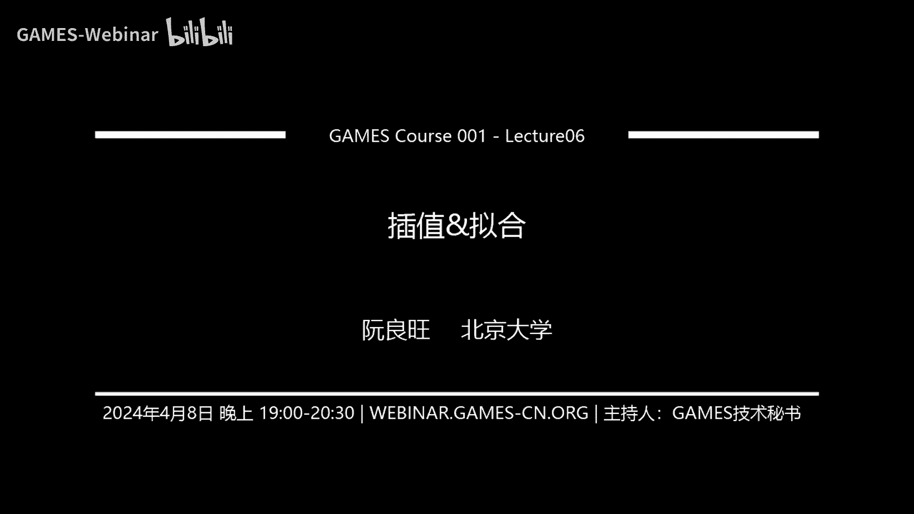

# GAMES001-图形学中的数学 - P6：插值与拟合 📈

在本节课中，我们将学习图形学中两个核心的数学概念：**插值**与**拟合**。我们将从定义和区别入手，逐步介绍多种插值方法，并探讨如何通过拟合来逼近带有噪声的数据。课程内容力求简单直白，确保初学者能够理解。

## 概述

插值与拟合是处理离散数据、构建连续函数或曲面的基础技术。它们的核心区别在于：
*   **插值**：要求构造的函数**必须经过**所有给定的数据点。
*   **拟合**：构造的函数**无需经过**所有数据点，旨在捕捉数据的整体趋势，常用于处理带有噪声的数据。

接下来，我们将首先深入探讨各种插值技术。

## 插值方法

### 线性插值 📏

线性插值是最简单的插值方法。给定两个点 `(x0, y0)` 和 `(x1, y1)`，我们假设它们之间的函数关系是一条直线。

其函数表达式为：
`y = (1 - t) * y0 + t * y1`
其中，`t = (x - x0) / (x1 - x0)`，表示点 `x` 在线段 `[x0, x1]` 中的比例。

当有多个点时，只需在每两个相邻点之间进行线性插值，然后将所有线段连接起来。这种方法得到的曲线是连续的，但在连接点处的导数不连续，我们称这种连续性为 **C0连续**。

上一节我们介绍了最简单的线性插值，本节中我们来看看如何通过更高阶的多项式来获得更光滑的曲线。

### 多项式插值（拉格朗日插值）🔢

为了获得更光滑的曲线（例如导数连续），我们可以使用多项式插值。其核心思想是：给定 `n+1` 个数据点，可以唯一确定一个 `n` 阶多项式，使其经过所有点。

拉格朗日插值给出了这个多项式的显式表达式：
`P(x) = Σ [ y_j * L_j(x) ]`， 对 `j` 从 `0` 到 `n` 求和。
其中，`L_j(x)` 称为**拉格朗日基函数**，其定义为：
`L_j(x) = Π [ (x - x_i) / (x_j - x_i) ]`， 对 `i` 从 `0` 到 `n` 且 `i ≠ j` 求积。

拉格朗日基函数具有关键性质：`L_j(x_k) = δ_jk`（当 `j=k` 时为1，否则为0）。这保证了插值多项式必然经过所有数据点。

一个 `n` 阶多项式具有 `C^(n-1)` 连续性，因此曲线非常光滑。然而，高阶多项式插值存在**龙格现象**：当数据点等距分布且多项式阶数较高时，插值结果在区间边缘会产生剧烈的震荡，与真实函数偏离甚远。

由于龙格现象的存在，直接使用高阶全局多项式插值并不总是可靠。接下来，我们将介绍一种能避免此问题的方法。

### 样条插值 🧩

样条插值通过拼接多段低阶多项式来构造整体曲线，从而避免高阶震荡。每一段的多项式阶数较低，因此不会剧烈震荡。

以下是两种常见的样条插值：

**二阶样条插值**：
*   每一段曲线都是一个二次函数。
*   需要满足条件：1) 经过区间两端点（插值条件）；2) 在内部连接点处一阶导数连续。
*   这需要求解一个线性方程组。该方法得到的曲线是 **C1连续** 的，但改变一个数据点会影响整个曲线（缺乏局部性）。

**三阶样条插值**：
*   每一段曲线都是一个三次函数。
*   需要满足条件：1) 经过区间两端点；2) 在内部连接点处一、二阶导数均连续。
*   同样需要求解线性方程组。该方法得到的曲线是 **C2连续** 的，非常光滑，但也缺乏局部性。

样条插值虽然光滑，但需要解方程且缺乏局部性。下面我们介绍一种兼具局部性和无需解方程的方法。

### 三阶厄米特插值 🔗

三阶厄米特插值在每一段上也是三次函数，但它通过直接指定区间端点的**函数值**和**导数值**来确定该段曲线。

对于区间 `[x0, x1]`，给定端点函数值 `y0, y1` 和导数值 `m0, m1`，可以唯一确定一个三次多项式。其解可以写成基函数的形式：
`y = y0 * H00(t) + m0 * H10(t) + y1 * H01(t) + m1 * H11(t)`
其中 `t = (x - x0)/(x1 - x0)`，`H00, H10, H01, H11` 是定义在 `[0, 1]` 上的三次多项式，称为**厄米特基函数**。

通过规定每个数据点上的导数值（例如，取左右邻接线段斜率的平均值），并将多段厄米特曲线拼接，就能得到一条整体的 **C1连续** 插值曲线。这种方法**无需解大型方程组**，且具有**局部性**：修改一个数据点，只影响其相邻的曲线段。

我们已经介绍了几种主要的插值方法，现在用一个统一的视角——基函数来理解它们。

### 基函数视角 🧠

大多数插值方法都可以写成统一形式：
`f(x) = Σ [ y_i * φ_i(x) ]`
其中 `φ_i(x)` 就是与第 `i` 个数据点对应的**基函数**。

基函数的核心性质是：`φ_i(x_j) = δ_ij`。这保证了插值条件自动满足。
不同的插值方法，对应不同的基函数：
*   **线性插值**：基函数是分段的线性“帽状”函数。
*   **拉格朗日插值**：基函数是全局的高阶多项式。
*   **三阶样条插值**：基函数是通过解方程得到的分段三次函数，支撑范围较广。
*   **三阶厄米特插值**：基函数是局部的分段三次函数，具有紧支撑性（只在局部非零），这是其局部性的体现。

## 多维与曲线插值

之前的讨论集中在一维函数插值。在图形学中，我们经常需要处理更高维度的插值问题。

### 曲线插值 🧵

问题：给定空间中一系列有序的点 `P0, P1, ..., Pn`，求一条经过所有这些点的光滑曲线。
解法：将三阶厄米特插值推广到向量形式。将标量函数值 `y` 和导数值 `m` 替换为位置向量 `P` 和切线向量 `T`。插值公式变为：
`C(t) = P0 * H00(t) + T0 * H10(t) + P1 * H01(t) + T1 * H11(t)`
这样得到的是一条参数曲线，在图形学软件（如PPT的曲线工具）中广泛应用。

### 三角形插值（重心坐标）🔺

对于三角形内的点，可以使用**重心坐标**进行插值。三角形内任意点 `P` 可表示为三个顶点 `A, B, C` 的加权和：
`P = α * A + β * B + γ * C`
其中 `(α, β, γ)` 称为重心坐标，且 `α + β + γ = 1`。`α` 等于 `P` 点对面小三角形面积与总面积之比。
重心坐标 `α, β, γ` 本身可以看作定义在三角形上的基函数，它们满足 `φ_A(A)=1, φ_A(B)=φ_A(C)=0` 等性质。这自然适用于在三角形顶点属性（如颜色、法线）之间进行插值。

### 像素插值（双线性与双三次）🖼️

在图像处理中，常需要对像素网格进行插值，例如纹理映射中的放大。
*   **双线性插值**：在 `x` 和 `y` 两个方向上分别进行线性插值。
*   **双三次插值**：在 `x` 和 `y` 两个方向上分别进行三阶厄米特（或样条）插值，通常能获得更平滑、质量更高的结果。

### 点云插值（径向基函数）☁️

问题：给定空间中一组散乱的点 `{xi}` 及其函数值 `{fi}`，求整个空间域的插值函数。
解法：使用**径向基函数**方法。假设插值函数形式为：
`f(x) = Σ [ w_i * φ( ||x - x_i|| ) ]`， 对 `i` 从 `1` 到 `n` 求和。
其中 `φ(r)` 是径向基函数（如高斯函数、薄板样条），只与距离 `r` 有关。权重 `{w_i}` 通过求解线性方程组（强制满足所有点的插值条件）得到。
**注意**：在有些场景（如SPH流体、NeRF）中，类似的形式 `f(x) = Σ [ f_i * φ( ||x - x_i|| ) ]` 也被称为“插值”，但它并不经过数据点，而是将点上的值“涂抹”到周围空间，更接近一种平滑重建。

## 拟合方法

现在，我们转向不要求经过所有数据点的拟合技术。

### 最小二乘法拟合 📉

最小二乘法是最常用的拟合方法。它假设数据符合一个带有未知参数的模型（如 `y = a*x + b`），然后通过最小化**所有数据点的预测值与真实值之差的平方和**，来求解最优参数。

用矩阵表示：假设模型为 `y = G * a`，其中 `G` 是由基函数在数据点处取值构成的矩阵，`a` 是待求参数向量。给定数据向量 `y`，最优参数 `a` 的解为：
`a = (G^T * G)^(-1) * G^T * y`
这对应于求解一个超定方程组的最小二乘解。

最小二乘法假设全局数据符合同一个模型。接下来看一种更灵活的局部拟合方法。

### 移动最小二乘法 🏃

移动最小二乘法是一种**局部**拟合技术。对于每一个待求点 `x`，只使用其邻近的数据点进行拟合，且邻近点的权重随距离增加而衰减。

具体步骤：
1.  对于待求点 `x`，选取其邻域内的一组数据点 `{xi}`。
2.  在 `x` 的局部坐标系下，用一个低阶多项式（如一次或二次）`f(r) = p^T * a` 来拟合数据，其中 `r = xi - x`。
3.  最小化加权平方和：`min Σ [ w_i * (f(r_i) - f_i)^2 ]`。
4.  求解得到局部参数 `a`。此时，`x` 点本身的拟合值就是 `a` 的第一个分量，梯度信息也包含在 `a` 中。

这种方法无需全局模型假设，对每个点独立进行拟合，非常灵活，常用于点云数据处理和曲面重建。

### 随机抽样一致算法 🎲

RANSAC 用于处理包含大量**异常值**的数据拟合。其基本思想是：通过随机抽样和迭代，寻找一个被最多“内点”（符合模型的数据）支持的模型。

算法流程：
1.  随机从数据集中选取拟合所需的最少样本数（如拟合直线选2个点）。
2.  用这些样本计算一个模型。
3.  统计整个数据集中有多少数据点与该模型的误差小于阈值（这些点称为“内点”）。
4.  如果内点数量超过预设阈值，则认为模型较好；否则，回到步骤1。
5.  重复多次，选择内点最多的那个模型，并用所有内点重新拟合最终模型。

RANSAC 能有效抵抗异常值的干扰，在图像匹配、点云配准等领域应用广泛。

## 总结

本节课中我们一起学习了图形学中的插值与拟合。
*   **插值**强调经过数据点，我们介绍了从简单的线性插值，到光滑但可能震荡的多项式插值，再到稳定实用的样条插值和三阶厄米特插值，并扩展到曲线、三角形、像素和点云等不同场景。
*   **拟合**不强求经过数据点，旨在捕捉趋势。我们学习了经典的最小二乘法，灵活的移动最小二乘法，以及抗噪声能力强的RANSAC算法。

理解这些方法的原理、优缺点及适用场景，对于解决图形学中的几何建模、图像处理、数据重建等问题至关重要。