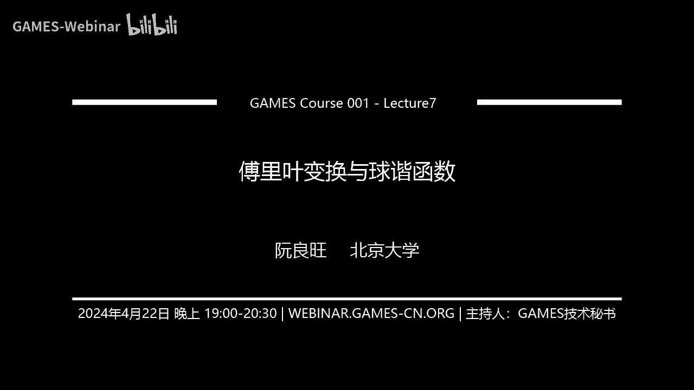
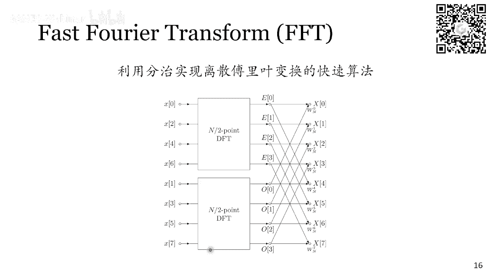
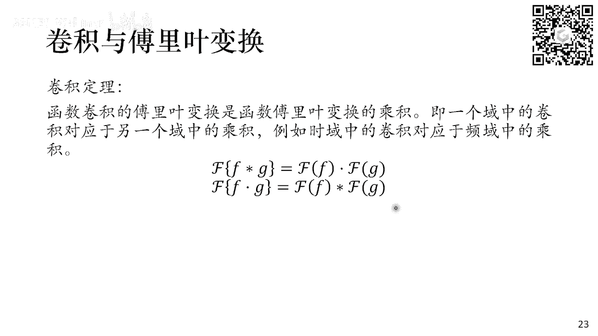
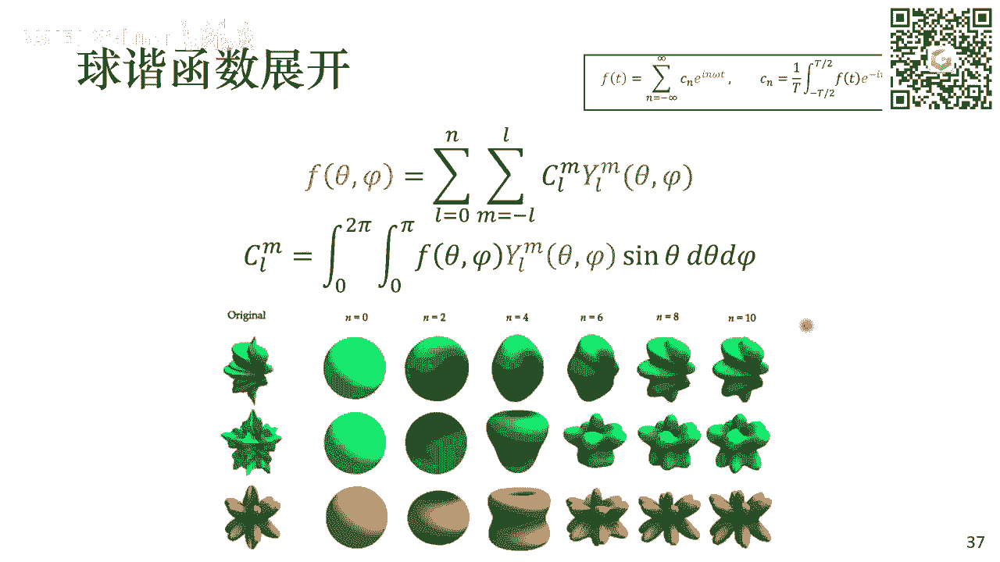

# GAMES001-图形学中的数学 - P7：傅里叶变换与球谐函数 🎯

在本节课中，我们将学习图形学中两个核心的数学工具：傅里叶变换与球谐函数。我们将从基础概念出发，理解它们如何描述和分析函数，并探讨它们在图形学中的广泛应用。

## 傅里叶展开：从周期函数到三角级数 📈

上一节我们介绍了课程的整体安排，本节中我们来看看傅里叶展开。傅里叶展开描述了一个周期函数如何分解为一系列正弦和余弦函数的叠加。

例如，一个周期为 `T` 的方波信号，在 `0` 到 `T/2` 时取值为 `1`，在 `T/2` 到 `T` 时取值为 `-1`。这个函数可以展开为不同频率正弦和余弦函数的加权和。

写成公式如下：
```
f(t) = a_0/2 + Σ_{n=1}^{∞} [a_n cos(nωt) + b_n sin(nωt)]
```
其中，`ω = 2π/T` 是基频。系数 `a_n` 和 `b_n` 可以通过积分公式求得：
```
a_n = (2/T) ∫_{0}^{T} f(t) cos(nωt) dt
b_n = (2/T) ∫_{0}^{T} f(t) sin(nωt) dt
```
这个过程就是将复杂的周期信号，分解为一系列简单谐波（正弦波）的过程。随着叠加的谐波数量增加，合成的波形会越来越接近原始方波。

## 傅里叶变换：从周期到非周期 🔄

上一节我们介绍了周期函数的傅里叶展开，本节中我们来看看如何将其推广到非周期函数。核心思想是将非周期函数视为周期无穷大的周期函数。

当周期 `T` 趋向于无穷大时，离散的频率求和就变成了连续的频率积分。由此我们得到傅里叶变换对：

正变换（从时域到频域）：
```
F(ω) = ∫_{-∞}^{∞} f(t) e^{-iωt} dt
```
逆变换（从频域到时域）：
```
f(t) = (1/2π) ∫_{-∞}^{∞} F(ω) e^{iωt} dω
```
这里，`e^{iωt} = cos(ωt) + i sin(ωt)` 是欧拉公式。`F(ω)` 是一个复函数，其模长表示频率 `ω` 成分的振幅，辐角表示相位。

本质上，傅里叶变换是在函数构成的线性空间中，做了一次基底的变换。原来我们默认使用狄拉克δ函数作为基，函数值 `f(t)` 就是其系数。傅里叶变换则换用复指数函数 `e^{iωt}` 作为新基，`F(ω)` 就是函数在这个新基下的展开系数。

## 离散傅里叶变换与快速算法 ⚡

上一节我们讨论了连续的傅里叶变换，但在计算机中，我们处理的是离散信号。离散傅里叶变换（DFT）是连续傅里叶变换的离散化形式。

对于一个长度为 `N` 的离散序列 `x[n]`，其DFT `X[k]` 定义为：
```
X[k] = Σ_{n=0}^{N-1} x[n] e^{-i 2π k n / N}, k = 0, 1, ..., N-1
```
逆变换为：
```
x[n] = (1/N) Σ_{k=0}^{N-1} X[k] e^{i 2π k n / N}, n = 0, 1, ..., N-1
```
直接计算DFT的复杂度是 `O(N^2)`。快速傅里叶变换（FFT）算法利用分治思想，将复杂度降低到 `O(N log N)`，使其得以广泛应用。



以下是FFT在图形学中的一个经典应用：图像处理。
*   **图像压缩**：对图像进行二维DFT得到频谱，保留低频分量（中心部分），丢弃高频分量，再进行逆变换，可以实现有损压缩（如JPEG格式）。
*   **边缘提取**：对图像频谱进行高通滤波（保留外围高频，去除中心低频），再进行逆变换，可以得到图像的边缘信息。


## 卷积定理：连接时域与频域的桥梁 🌉

上一节我们介绍了离散傅里叶变换，本节中我们来看看一个与之紧密相关的操作：卷积。卷积在信号处理和图像处理中无处不在，例如图像模糊、边缘检测等。

两个一维函数 `f(t)` 和 `g(t)` 的卷积定义为：
```
(f * g)(t) = ∫_{-∞}^{∞} f(τ) g(t - τ) dτ
```
直观上，卷积是将函数 `g` 翻转并平移，然后与函数 `f` 逐点相乘并积分。

卷积定理揭示了卷积与傅里叶变换之间的美妙关系：
```
F{f * g} = F{f} · F{g}
F{f · g} = F{f} * F{g}
```
其中，`F{·}` 表示傅里叶变换，`*` 表示卷积，`·` 表示点乘。**时域中的卷积，等价于频域中的乘法；时域中的乘法，等价于频域中的卷积。**




这个定理为分析许多问题提供了强大工具。例如，在图像处理中，用一个平均核对图像进行卷积（模糊操作），在频域看来，就是图像的频谱乘以该卷积核的频谱（一个低通滤波器），从而衰减高频信息。


## 采样与走样：频域视角的分析 📊

上一节我们利用卷积定理分析了图像处理，本节中我们用它来分析图形学的另一个核心问题：采样与走样。

采样过程可以建模为原始连续信号 `f(t)` 与一个狄拉克梳状函数 `Ш_T(t)` 相乘：
```
f_s(t) = f(t) · Ш_T(t)
```
狄拉克梳状函数由一系列间隔为 `T` 的狄拉克δ函数组成，它只在采样点处有值。

根据卷积定理，时域的乘法对应频域的卷积。已知狄拉克梳状函数的傅里叶变换仍是狄拉克梳状函数，其间隔变为 `2π/T`。因此，采样后信号的频谱 `F_s(ω)` 是原始信号频谱 `F(ω)` 的周期性复制：
```
F_s(ω) = (1/T) Σ_{n=-∞}^{∞} F(ω - n * (2π/T))
```
**采样定理（奈奎斯特定理）** 指出：为了避免频谱复制时发生混叠（Aliasing），采样频率 `1/T` 必须至少是信号最高频率的两倍。如果采样频率过低，复制出的频谱就会重叠，导致无法从采样信号中无损恢复原始信号，这就是“走样”。

在图形学中，这解释了为什么对图像或场景进行欠采样（如光栅化时分辨率不足）会产生锯齿。反走样技术（如超采样、多重采样）的核心就是提高有效采样频率或预先过滤掉高于奈奎斯特频率的信号成分。

## 球谐函数：球面上的“傅里叶展开” 🌐

上一节我们在平直空间（时域/频域）讨论了傅里叶分析，本节中我们将其思想推广到球面坐标系。球谐函数（Spherical Harmonics, SH）就是定义在球面上的一组正交基函数。

在图形学中，许多函数定义在球面上，例如环境光照贴图、双向反射分布函数（BRDF）等。球谐函数提供了一种压缩和近似这些球面函数的有力工具。

球谐函数 `Y_l^m(θ, φ)` 的数学表达式较为复杂，包含连带勒让德多项式 `P_l^m` 和复指数项 `e^{imφ}`：
```
Y_l^m(θ, φ) = N_l^m · P_l^m(cosθ) · e^{imφ}
```
其中，`l` 是阶数（`l ≥ 0`），`m` 是次数（`-l ≤ m ≤ l`）。`N_l^m` 是归一化常数。


我们可以将球谐函数可视化：从球心出发，沿方向 `(θ, φ)` 的射线长度正比于 `Y_l^m(θ, φ)` 的值。随着阶数 `l` 增加，球面上的“波段”数量增多，表示更高的频率成分。



任意一个球面函数 `f(θ, φ)` 可以投影到球谐基上，展开为：
```
f(θ, φ) = Σ_{l=0}^{∞} Σ_{m=-l}^{l} c_l^m Y_l^m(θ, φ)
```
系数 `c_l^m` 由内积求得：
```
c_l^m = ∫_{S^2} f(θ, φ) Y_l^m(θ, φ) dΩ
```
与傅里叶级数类似，我们可以用低阶（如前3阶或5阶）的球谐函数来近似原始球面函数，实现数据的有效压缩和降噪。这在实时渲染中用于近似环境光照和漫反射全局光照（Precomputed Radiance Transfer, PRT）等技术中至关重要。


## 总结 📝

本节课中我们一起学习了图形学中两个强大的数学工具：
1.  **傅里叶变换**：本质是函数空间的基变换，从时域基（δ函数）切换到频域基（复指数函数）。它让我们能从频率视角分析信号。
2.  **卷积定理**：建立了时域卷积与频域乘法的等价关系，是分析采样、滤波等操作的核心。
3.  **采样与走样**：从频域看，采样是频谱的周期性复制；欠采样会导致频谱混叠，产生走样。
4.  **球谐函数**：可以看作是球坐标系下的“傅里叶展开”，为处理和压缩球面函数（如光照）提供了标准正交基。


理解这些概念，将为深入学习图形学中的渲染、采样、信号处理等高级主题打下坚实的基础。