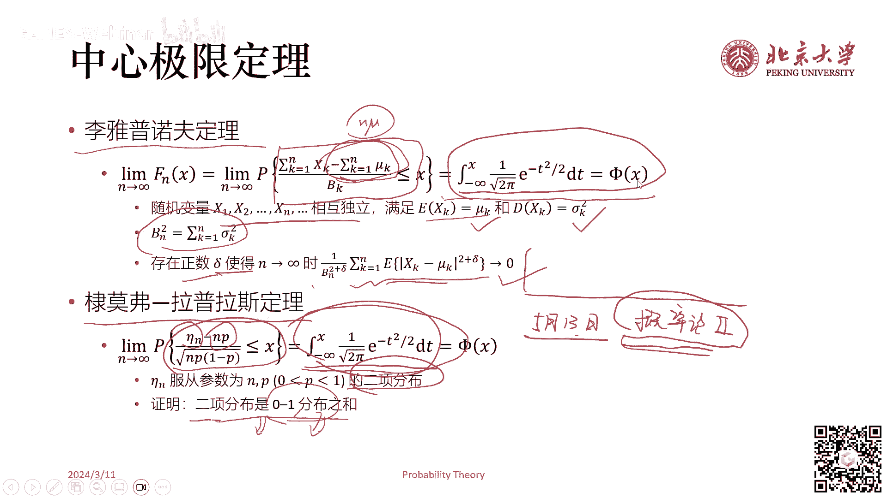

# GAMES001-图形学中的数学 - P8：概率论（一） 📊

在本节课中，我们将回顾概率论的基础知识。概率论是图形学中许多算法的基础，理解其核心概念至关重要。我们将从概率的定义出发，逐步介绍古典概型、条件概率、贝叶斯公式、随机变量及其分布、数字特征（期望与方差），最后简要介绍大数定律与中心极限定理。

---

## 什么是概率？🎲

概率的概念源于频率。对于一个随机试验（例如抛硬币），在相同条件下重复进行N次，事件A（例如正面朝上）发生了NA次。比值NA/N称为事件A发生的频率，记作fN(A)。频率是一个介于0和1之间的实数。

对于一个随机试验E，其样本空间S是所有可能结果的集合。对于E的每一个事件A，我们赋予一个实数P(A)，称为事件A的概率。一个有效的概率定义必须满足以下三条公理：
1.  **非负性**：对于任何事件A，有 P(A) ≥ 0。
2.  **规范性**：必然事件的概率为1，即 P(S) = 1。
3.  **可列可加性**：如果一系列事件A1, A2, ... 两两互斥（不可能同时发生），则它们至少有一个发生的概率等于各自概率之和，即 P(∪Ai) = ΣP(Ai)。

当试验次数N趋向于无穷大时，事件A的频率fN(A)会趋向于其概率P(A)。此时，我们定义的P(A)才具有我们所理解的“可能性”的含义。

---

## 古典概型（等可能概型）⚖️

古典概型是一种简单且常见的概率模型。它满足两个条件：
1.  试验的样本空间只包含有限个基本事件。
2.  试验中每个基本事件发生的可能性相同。

在古典概型中，事件A的概率计算公式为：
**P(A) = A包含的基本事件数 / 基本事件的总数**

以下是几个古典概型的例子：

*   **抛硬币**：样本空间为{正面，反面}，基本事件数2，故正面朝上的概率为1/2。
*   **掷骰子**：样本空间为{1, 2, 3, 4, 5, 6}，基本事件数6，故掷出点数为3的概率为1/6。
*   **生日问题**：一个班有50名同学，至少有两人生日相同的概率很高。我们可以计算所有人生日都不同的概率，然后用1减去它。计算表明，这个概率接近1。

---

## 条件概率与重要公式 🔗

上一节我们介绍了基础概率，本节中我们来看看当事件之间存在关联时，如何计算概率。

### 条件概率

条件概率是指在事件A已经发生的条件下，事件B发生的概率，记作P(B|A)。其定义为：
**P(B|A) = P(A∩B) / P(A)**，其中P(A) > 0。

将分母乘到左边，得到概率的乘法定理：
**P(A∩B) = P(A) * P(B|A)**

**例子**：某游戏抽中五星卡的概率为0.6%，抽中五星卡时，抽到特定角色的概率为50%。则单次抽卡抽中特定五星角色的概率为：0.6% * 50% = 0.3%。

### 全概率公式

设B1, B2, ..., Bn是样本空间S的一个完备划分（即它们互斥且并集为S）。则对任一事件A，有全概率公式：
**P(A) = Σ P(Bi) * P(A|Bi)**

这个公式将复杂事件A的概率，分解为在不同“场景”(Bi)下发生概率的加权和。

### 贝叶斯公式

贝叶斯公式描述了如何利用“结果”(A)的信息来更新我们对“原因”(Bi)可能性的判断。公式如下：
**P(Bi|A) = [P(Bi) * P(A|Bi)] / Σ [P(Bj) * P(A|Bj)]**

**例子（核酸检测）**：假设人群感染率Q=1%，核酸检测假阴性率P=1%（即感染者有1%概率测为阴性），假阳性率为0。那么，一次检测结果为阴性的人，实际是感染者的概率是多少？
应用贝叶斯公式计算，这个概率约为0.01%。这说明在低感染率下，即使有假阴性，单次阴性结果仍有很高的可信度。

---

## 随机变量及其分布 📈

随机变量是将随机试验的结果映射为实数的函数。例如，抛硬币后，定义“正面得0分，反面得1分”，得分就是一个随机变量。

### 离散型随机变量

取值可数的随机变量。以下是几种重要的离散分布：

*   **（0-1）分布**：随机变量X只取0或1。P(X=1)=p, P(X=0)=1-p。
*   **二项分布**：描述n次独立的（0-1）试验中成功次数k的概率。
    **P(X=k) = C(n,k) * p^k * (1-p)^(n-k)**
*   **泊松分布**：二项分布当n很大而p很小时的近似。常用于描述单位时间内随机事件发生的次数。
    **P(X=k) = (λ^k / k!) * e^(-λ)**，其中λ是单位时间内事件发生的平均次数。

### 连续型随机变量

取值充满某个区间的随机变量。由于取任一特定值的概率为0，我们使用概率密度函数(pdf) f(x) 和分布函数(cdf) F(x) 来描述。
**F(x) = P(X ≤ x) = ∫_{-∞}^{x} f(t) dt**
**f(x) = dF(x)/dx** (在F(x)可导的点)

以下是几种重要的连续分布：

*   **均匀分布**：在区间[a, b]上，概率密度是常数。
    **f(x) = 1/(b-a), for a ≤ x ≤ b**
*   **指数分布**：具有“无记忆性”，常用于描述等待时间。其概率密度为：
    **f(x) = (1/θ) * e^(-x/θ), for x ≥ 0**，其中θ>0为参数。
*   **正态分布（高斯分布）**：最重要的连续分布，由均值μ和标准差σ决定。
    **f(x) = 1/(σ√(2π)) * e^(-(x-μ)²/(2σ²))**

---

## 随机变量的数字特征 🧮

了解分布后，我们需要一些数值来刻画随机变量的核心特征。

### 数学期望（均值）

期望是随机变量所有可能值的加权平均，反映其“平均水平”。
*   离散型：**E(X) = Σ [xk * P(X=xk)]**
*   连续型：**E(X) = ∫_{-∞}^{∞} x * f(x) dx**

**期望的性质**：
1.  E(C) = C （C为常数）
2.  E(CX) = C * E(X)
3.  **线性性**：E(X+Y) = E(X) + E(Y) （无论X,Y是否独立）
4.  若X,Y独立，则E(XY) = E(X) * E(Y)

### 方差与标准差

方差度量随机变量取值与其均值的偏离程度，记作D(X)或Var(X)。标准差是方差的算术平方根。
**D(X) = E[ (X - E(X))² ] = E(X²) - [E(X)]²**

**方差的性质**：
1.  D(C) = 0
2.  D(CX) = C² * D(X)
3.  D(X+C) = D(X)
4.  D(X+Y) = D(X) + D(Y) + 2Cov(X,Y)

### 协方差与相关系数

协方差Cov(X,Y)度量两个随机变量的协同变化趋势。
**Cov(X,Y) = E[ (X-E(X)) * (Y-E(Y)) ] = E(XY) - E(X)E(Y)**

相关系数ρXY是标准化后的协方差，取值在[-1, 1]之间。
**ρXY = Cov(X,Y) / [√D(X) * √D(Y)]**
相关系数为0称为“不相关”。相互独立一定不相关，但不相关不一定独立（可能存非线性关系）。

---

## 大数定律与中心极限定理 ⚙️

本节我们来看看概率论中两个描述宏观规律的著名定理。

### 大数定律

大数定律描述了大量随机试验平均结果的稳定性。
*   **（弱）大数定律**：独立同分布的随机变量序列X1, X2, ..., 其均值 `X̄n = (ΣXi)/n` 依概率收敛于数学期望μ。即试验次数足够多时，平均值几乎必然接近期望值。
*   **伯努利大数定律**：是上述定律在（0-1）分布下的特例，即频率依概率收敛于概率。

### 中心极限定理

中心极限定理是概率论的基石之一。它指出，无论单个随机变量服从什么分布，只要满足一定条件，大量独立随机变量之和的标准化形式，其分布近似于标准正态分布。
*   **独立同分布中心极限定理**：设X1, X2, ..., Xn独立同分布，期望为μ，方差为σ²。则当n很大时，随机变量 **Zn = (ΣXi - nμ) / (√n * σ)** 近似服从标准正态分布N(0,1)。
    这意味着，许多微小、独立的随机因素叠加的总效应，往往呈现正态分布。例如，考试分数、测量误差等常服从正态分布。

---

## 总结 📝

本节课中，我们一起学习了概率论的基础知识。我们从概率的定义和古典概型出发，学习了条件概率、全概率公式和强大的贝叶斯公式。接着，我们引入了随机变量的概念，分别探讨了离散型与连续型随机变量的常见分布，如二项分布、泊松分布、均匀分布、指数分布和正态分布。然后，我们学习了刻画随机变量特征的数字工具：期望（均值）、方差、协方差和相关系数。最后，我们简要介绍了描述概率宏观规律的大数定律和中心极限定理。这些概念是理解图形学中许多基于概率的算法（如蒙特卡洛积分、路径追踪等）的必备基础。下一节课，我们将聚焦于概率论在图形学中的具体应用。