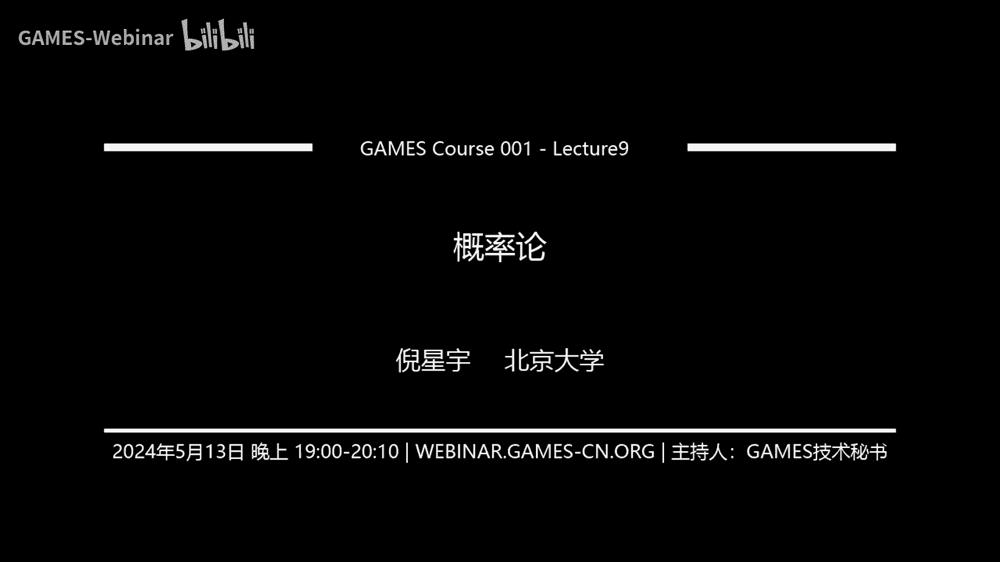
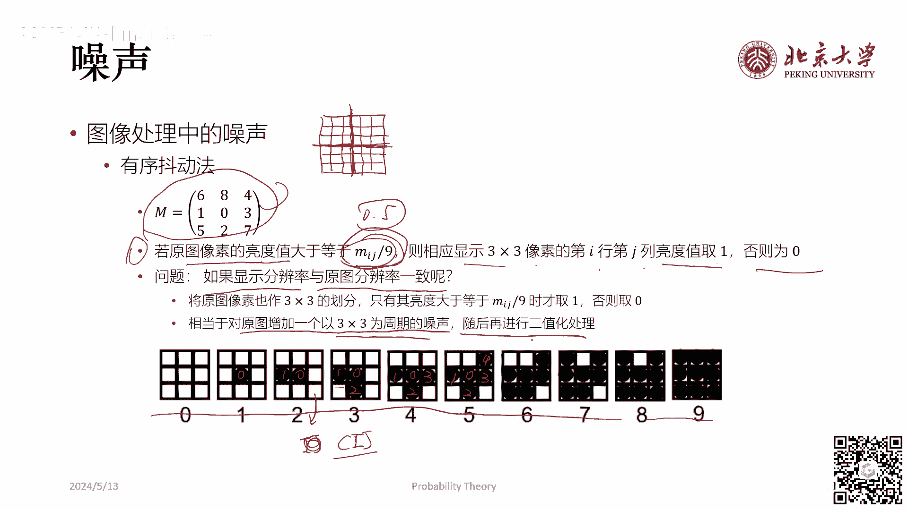
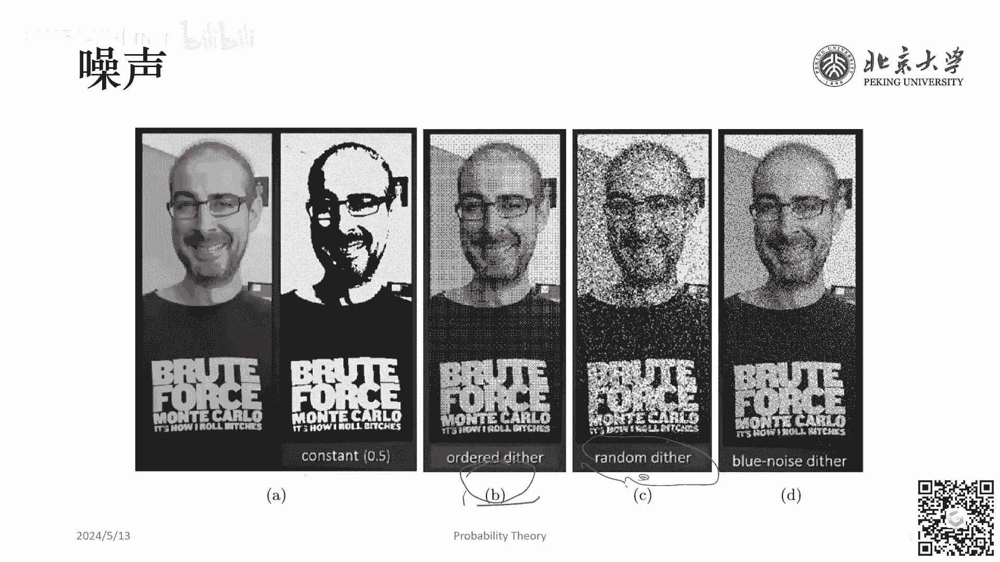
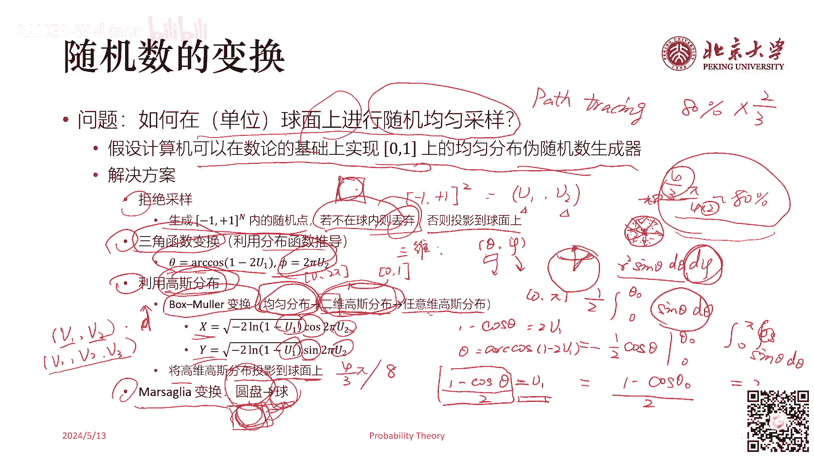

### 🎮 GAMES001-图形学中的数学 - P9：概率论（二）

**概述**： 本节课将探讨概率论在图形学中的应用，主要涵盖噪声和蒙特卡洛积分法。

### 1. 噪声

**1.1 噪声的定义**

* 噪声是具有一定随机性的扰动或随机分布。
* 在图像和视频中，噪声可以表示为具有一定随机性的扰动。

**1.2 噪声的类型**

* **白噪声**： 在一定频率范围内，所有频率的声音均匀混合。
* **粉噪声**： 低频强，高频弱。
* **蓝噪声**： 低频弱，高频强。

**1.3 噪声在图像中的应用**

* 图像量化过程中，由于显示设备限制，需要进行量化处理，这会导致图像细节丢失。
* 通过添加噪声，可以模拟图像细节，提高图像质量。

**1.4 噪声与图像量化**

* 有序抖动法：将图像像素值映射到3x3像素块，根据像素值大小决定块内像素值。
* 随机抖动法：在图像像素值上随机添加噪声，然后进行量化处理。
* 蓝噪声抖动法：使用特定算法生成蓝噪声，然后进行抖动和量化处理。

### 2. 蒙特卡洛积分法

**2.1 蒙特卡洛积分法简介**

* 蒙特卡洛积分法是一种基于随机抽样的数值积分方法。
* 通过随机抽样，可以近似计算积分值。

**2.2 蒙特卡洛积分法的基本原理**

* 在积分区间内随机抽样，计算抽样点的函数值，然后对这些值进行加权平均。

**2.3 蒙特卡洛积分法的应用**

* 求不规则图形的面积。
* 求定积分。
* 渲染算法中的采样。

**2.4 重要性采样**

* 当函数值与概率密度函数形状相似时，蒙特卡洛积分的方差最小。
* 重要性采样可以提高蒙特卡洛积分的效率。

**2.5 拟蒙特卡洛法**

* 结合蒙特卡洛法和矩形法，提高蒙特卡洛积分的效率。

**2.6 低差异序列**

* 低差异序列可以减少蒙特卡洛积分的方差，提高收敛速度。

**2.7 随机数生成**

* 生成均匀分布的伪随机数。
* 在单位球面上进行随机均匀采样。

### 总结

本节课介绍了概率论在图形学中的应用，包括噪声和蒙特卡洛积分法。通过学习这些内容，可以更好地理解图形学中的随机现象，并应用于实际问题的解决。