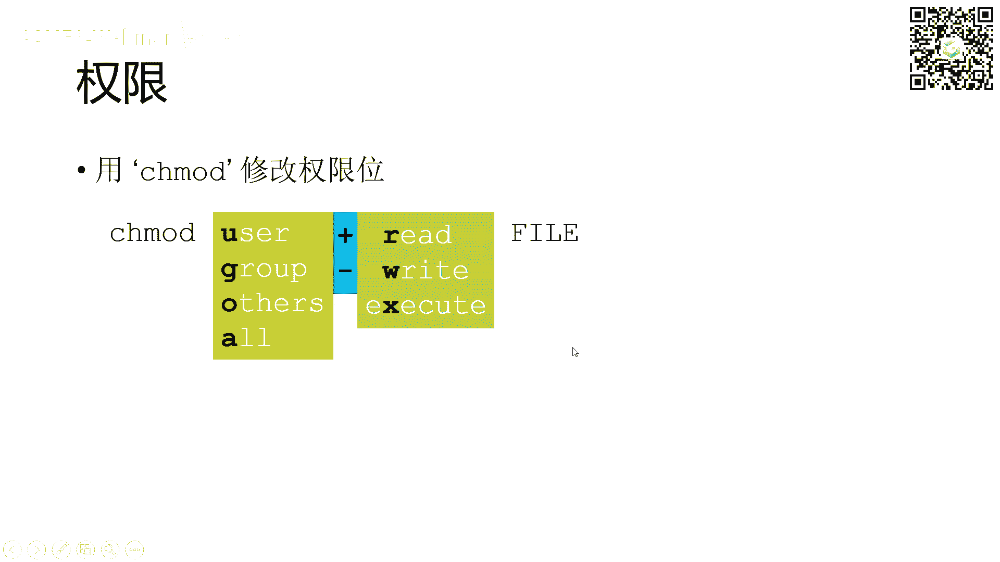

# GAMES002-图形学研发基础工具 - P1：Linux + shell - GAMES-Webinar - BV1cC411L7uG

好的那我们就开始上课了哈，同学们晚上好啊，今天很高兴有机会跟大家见面哈，今天是games0。2的第一课啊，我前面呢稍微做一个简单的介绍，呃，我是陈宝泉，来自北京大学。

然后games002这个课呢是由我和辛金瑞，叶开两位同学呢一起来啊上课，但是实际上呢我主要是今天开头哈，然后接下来是金瑞呢和叶开两位同学呢主讲啊，呃我先开一个头呢，是因为这个课吧是和科研有关系哈。

那么科研这个事情呢在大学里面作为大学生啊，啊也不是每个同学都做的事情啊，这个都是凭自己个人的兴趣啊，呃对于科研呢对大学同学来说呢，呃也都非常的神秘啊，呃所以呢在北大呢，我们就还专门开了一门课来讲。

就是教科研实践的课啊，来讲呢关于科研是什么，然后科研的一些基本的这个呃能力的培养啊，我们也还安排一些这个方法呢，来加强了这个同学们的这个科研的训练等等啊，呃那科研到底是是什么啊。

我觉得科研除了大家这个啊这个了解到的这种，它是一种科学发现对吧的这样的一个过程啊，呃但是呢实际上啊，科研呢它也是一种自我训练的方式啊，他是对自己能力上的一个培养啊，当然就是说我们所看到的像科学家对吧。

他们把这个科研呢作为一个职业啊，这个大家也是这个啊得到很多的一些故事啊，其实科研呢啊对很多人来说哈，就说不只是科学家哈，以科研为职业的啊，它其实是一个生活方式啊，就是它其实是可以渗透到。

渗透到我们生活中的方方面面啊，那对于我们啊以科研为职业的人来说呢，那更加是一种生活方式啊，其实他从很多的时候啊，培养我们怎么去思考问题，面对问题啊，去解决问题等等啊，啊所以呢我觉得哈在本科期间。

如果能够参与一定的科研的这个实践的活动啊，还是非常的有收益的啊，当然我们这门课呢不是针对这个科研的这个，方方面面啊，而是说提供了一定的工具啊，但是呢我前面呢先呢，把这个这个这个课的这个来由吧。

啊来给大家讲一讲啊，呃其实这个科研工具的这个介绍啊，它是我们这个科研实践课的一部分啊，啊我们在北大呢有一门课叫科研实践，这个课呢是我开的啊，我教的啊，其实他有两个学期的时间啊。

呃但是主要的这个在第一个学期呀，他的这个课程的内容呢大概分为这么几块啊，也让大家感受一下，就是说到底科研呢涉及到哪些方面啊，呃其实这里花花绿绿的颜色哈，主要有四大块，咱们把最后那个C3呢去掉呢。

其实就三大块啊，呃一大块呢就是C1呢就是讲科研的方法啊，这个是主要是我来讲C2呢，就是讲科研的工具啊，你要进入到科研，那你可能先要掌握一些相应的工具啊，你才可以上手比较，或者说比较容易的上手啊。

啊总的来说就是把科研的门槛降低，让大家比较顺滑的能够进去啊，还有第三块呢就是这个A的哈，就是我们的科研导师和学生们的面对面的交流，这样的让学生呢对啊，我们有一批科研导师对吧啊，来讲各个科研方向啊。

他的这个科研的这个一些问题啊，这学生呢能够对这个这个研究领域，不同的问题有个很好的了解，不同的导师有个好的了解啊，这个A的部分基本上就是导师进课堂啊，这样的一个方式，这样就能够啊学生和导师之间啊。

能形成一个一对一啊的这个交流啊，未来呢他可以选择去香烟导师的实验室，去比较长期的这个啊去实习啊，呃整个这一套方式呢，实际上呢就是这门课，就通过这样的一些这个内容吧。

啊让大学的本科的同学从大二开始就能够呃，如果你对科研呢想了解，如果你想去啊进入科研实践啊，比较方便一点啊，我们通过一个课的方式啊，来做这样的一个这个相互的连接啊，当然你如果不上这门课，没有这样的一门课。

其实也没有关系啊，我这里说到的这些元素，你自己其实也可以去发现啊，导师呢你也自己可以去主动的联络啊，啊像涉及到的科研的工具啊，像这一门课，大家呢通过这一门课，那也是啊就有所了解啊。

其实呢只要你主动啊有这个意识，其实是不是有这门课也没有关系啊，但是呢就是说我这边呢，就是一个总体上的一个介绍，那么我可以看一下哈，大概在讲这个科研的一些方法呀，涉及到的一些这个呃素养啊。

这个方面呢到底讲些什么样的东东西哈，其实大概就是这样的一些东西，首先科研它作为一种所谓的生活方式，那我们需要心理上心态上是什么样子的，那在我们做科研之前，我们会其实是需要了解，做科研呢他是有责任的啊。

他是也涉及到科研的道德这些方面啊，其实也是需要提前有所了解，当然我们做科研的话，这个阅读的能力很重要啊，阅读和写作这个科技论文吧，啊或者说科技报告这这个能力呢很重要啊，那怎么样。

这也是通过其实一些啊讨论啊，经验的分享啊，其实网络上也有很多相应的这样的一些文章啊，去阅读啊啊一些经验对吧，分享的文章其实都挺多的啊，其实大家也可以有意识的去了解啊。

还有呢一个特别重要的一点就是科研的交流啊，就是其实科研的过程，它不是一个人关起门来闭门造车啊，它实际上是要不断的和别人去讨论沟通，然后当你有了成果以后，其实你也需要去展示你的成果啊，所以怎么去做交流。

怎么去做报告，其实这些呢都是涉及到一些能力的培养啊，啊其实在我们课堂上，大概就有这样的一些啊讨论的主题吧，啊我可能会分享一些文章啊，比如说我大概列了这些对吧，其实关于科研。

我有一个针对这个suddenly教授的一个反弹啊，图灵奖获得者，还有一个一篇啊，在网络上可能是特别经典的啊，一个一个报告啊，他是richard hamming啊写的，他的报告其实从他的报告总结的哈。

他就是你和你的研究啊，其实你去网络上一查找啊，这个文章就会出来，这个是一个非常经典的一个报告啊，啊这个你可以读读他的这个脚本啊，就是报告的这个啊，总结是应该可以获得很多收益的啊。

我们课堂上会分享这个文章，然后跟大家一起讨论啊，然后就像社会的责任啊，科研的伦理啊，这些方面也有些文章的阅读，大家也会来课堂上去讨论一下啊，呃作为各位你感兴趣，你也可以读出相应的文章。

和同学们互相之间讨论啊，主动对吧啊，不见得是在课堂上啊，你可以在课外啊啊这个兴趣小组啊这样的啊，其他就是文献阅读写作啊，沟通交流啊等等啊，这个方面呢有很多一些非常好的课件也好，或者是资料也好。

其实大家都可以去啊查找啊，这个我也列了这个，比如说像哈佛大学的这个，这个已经刚刚刚刚过世的哈，这个温斯顿教授哈，他有一个非常经典的报告啊，这怎么这个这个给报告啊，啊这个呃这方面的一些经验的分享啊。

非常的好，非常值得去去啊，听一下啊，然后呢第二部分呢就是我说的啊这个工具啊，其实呢在我们大学的这个呃课程学习当中啊，呃我们学到很多的知识，但是呢面对科研呢，那可能我们有一些啊工具啊。

不见得是在我们学的这些课程中啊，可能都这个都覆盖了啊，对但是像Python啊这样的东西哈，这个还是覆盖了哈，但是有一些这个很多的工具呢，是没有被啊覆盖啊，没有讲到，或者说没有足够的锻炼吧。

啊那这些东西呢是有必要把它拎出来啊，我们来做这么多分享，这也是我们的games，002这个课的一个主要的内容啊，其实在这个在这个这些内容的这个总结的时候，一方面是我们同学们的平常哈。

这个呃总结一方面呢还有一个参考，就是MIT有门课哈，它就是讲的是这个Missing semester of your cs education啊，就是你的cs课程中间可能会啊。

错过了的一个小学期的内容啊，大概说的呢是这么个意思啊，大家也可以去搜索啊，去了解一些材料啊，啊然后前面我说到了科研实践涉及到的哈，第三部分呢其实就是你啊具体要做科研，你要找到一位科研导师啊。

呃因为你可能是对某一个方向感兴趣嘛，对吧啊，这个那这个方向呢，可能不同的方向就有不同的老师，做这方面的研究啊，那你就寻找科研导师，这个非常重要啊，因为那导师的话他有很多的条件，不只是他有些经验啊。

他能给你分享一些问题啊，啊另外呢在实验室它有一些这个条件，设备啊，计算的资源啊，各个方面啊，呃同时呢一般来说导师还有学生嘛，有这个研究生啊，他们呢也可以共同啊来指导你啊。

所以这个寻找科研导师是个很重要的事情啊，然后当然就是你要实践啊，这个只有在实践当中啊，你才能是啊更好的学习啊，就是你那学学的就学到真东西啊，对啊这叫learn by doing啊，要边做边学啊。

这个在学的牢，这个是和课堂的学习呢非常不一样的啊，所以这点呢也特别的重要啊。

其实大概主要是这些，那么我们也都知道这个啊，呃所谓的站得高望得远啊，那么这个这个这有句名言在这啊，大家可能都听过对吧啊，如果你看得远，是因为你站在巨人的肩膀上啊，确实是这样啊，甭管说是巨人还是多高的人。

总的来说你能站在他的肩膀上啊，肩膀上呢你就能够看得更远，这个是非常重要的啊，我们每每一个这个阶段的科研的实践啊，啊经历啊，其实都是帮助我们不断的去站在更高，去看得更远啊，所以啊寻找这样的肩膀啊。

其实变得特别的重要哈，那这样的肩膀啊其实挺多的哈，除了我们啊经常可能会认为说导师对吧，其实还有很多啊，有非常多的这个，这个你都是可以站在他们的肩膀上啊，比如说导师的合作者对吧，不只是这个导师。

还有导师的合作者啊，比如说他来访问啊或者什么的啊，还有就是导师课题组的这个呃学长学姐啊，这些他们都是能给你一手的这个啊一些经验啊，或者指导，还有就是你的同学啊，其实三人行必有我师，这个是一点都不假啊。

所以呢你如果说有一个很好的一个同学团队啊，相互之间啊其实是可以学到很多的啊，当然你还可以把眼界放开一点啊，有很多的这个来访的这个这个杰出的一些啊，讲者学者啊，甚至你如果后来慢慢的对吧。

你也能够去参加一些国际会议，那么在国际会议那里就认识到同行，这个领域里面的啊非常优秀的学者对吧啊，一个很重要的事，就说如果你未来更多的投入到科研当中，你会发现每一个方向都会有它的一个社区啊。

对他有个community，这个社区就很多了对吧，如果是国内，它就是所谓的专业委员会啊，比如说你是做图形的，大家有图形方面的这个专业委员会啊，那么在国际上它有这个爱处不易啊。

ACM呢都有相应的这个不同的学科方向的，这样的一些社区啊，当然你去会议，实际上这个会议呢自然就构成了一个社区啊，就一去参会，那见到的都是你的同行啊，那这样的一个同行呢就是一个社区，这个是非常有意义的啊。

你都可以从他们的身上去，学到很多的这个经验啊，啊我特别的强调这个在科研的当中啊，交流特别的重要啊，就是各种各样的交流啊，就是你有想法啊，或者想法不成熟的时候，哎你需要跟人家交流。

把这个想法变得更加清楚啊，你有了一个比较清楚的想法，但是怎么解决啊，或者说一个提出一个一个很有意义的问题，怎么去解决这个问题啊，那你也需要跟大家交流交流对吧啊，其实不是说你有成熟的这个想法和解决方案。

你才去跟人家分享，其实不是这样的啊，这个分享的是他是这个发行问题啊，啊发现解决方案的一个过程啊，他绝对不是只是最后的一个结果的呈现啊，所以这个呢我是基本上作为啊，如果和本科生谈科研的话啊。

或者说在我的科研实践课上，我应该用的最多的这个经历呢，就是鼓励大家交流啊，帮助大家来建立一个交流的意识啊，呃这个其实非常非常非常的重要啊，它和课堂的学习不一样，课堂的学习你就是认真听讲对吧。

然后自己能够独立完成作业就很好啊，其实即使是在课程学习当中啊，交流啊也是变得很重要啊，这个而且呢我是鼓励这个啊，就是随时随地的交流，我我说哈啊这里故意画了用了这两个照片。

其实一个就说哎我们吃饭的时候也可以交流啊，对不对，我们吃饭的时候不只是说这个说点娱乐啊，八卦呀或者是什么的哈，其实有些时候如果说你是在科研这个状态，其实也可以，大家就聊一聊科研中遇到的一些问题。

其实可能在吃饭的时候突然有些灵感哈，这个在一种放松的状态啊，还有就是在走廊上碰着我们叫，How we how we conversation，就是走廊啊，走廊上走着走着碰着诶。

我最近有什么好的想法跟你交流一下，哎这两人就聊上了对吧，哎三言两语就把你的脑子里面的问题描述一下，其实所有的这些都是特别重要的啊，这个这个对科研很有帮助的，这样的一些小的行为，但是呢它其实并不小啊。

那如果说这个科研，那么我就说到就是实际上科研做科研啊，他需要一个很好的环境，他也需要一个好的文化啊，但你要说环境和文化可能是现有的对吧，但是实际上呢这个科研的环境和文化呢，是是每一个身处其中的人啊。

他都是能够参与去构建的啊，或者是改变的啊，这个呢其实我也啊，特别愿意在这个方面跟大家去分享一下啊，这下面呢有几页这个这个这个PPT呀，也是我啊就喜欢拿来这个说啊，这种在我们科研的文化呀。

这个这个文化意识上啊，其实有些时候我们是需要打开我们的一些，使既有的这种思维和行为的啊方式啊，呃呃这样的一些方式呢，是对你的科研是有益的哈啊那要打开这个方式，那我们首先认识到一些不足。

或者说有些对比啊，那这里呢我借用了一位这个在德国的这个呃，华裔啊，这个这个一个女生啊，她呢用的非常形象的这个这个绘画吧，啊，illustration来表达这个东，西方的文化的一个不一样啊。

其实这个呢倒还挺有点幽默性。

然后又还挺形象，我可以分享几个吧，他做了好多啊，对，那么他是说，这个我们首先我们生长的环境可能会不大一样，对不对啊，在我们的生产过程中啊，每个人对吧，这个从小朋友长大。

他的这样的一个得到的这个attention，可能会不一样，是不是啊，这个，然后作为一个我们个人啊的一个自我的认同啊，个人的一个呃自我的这个这个认定和感受呢，其实也是在不懂得社会文化环境下呢。

也是会有所不一样啊，哪边是哪边，你们可以去这个啊，一眼可能就会能感受得到，还有就是说我的导师，我的老板对吧，到底在这个群体中间是什么样的一个位置，它是不一样的啊，他这个不一样的也决定了你思维的时候。

你是什么样的一个态度，对不对啊，你是不是能够主动地表达你的想法，是不是能够甚至挑战对吧，甭管是老师的还是的这个谁的，这个有经验的人的这些想法或者质疑啊。

他可能也都会多少会影响到啊，当然还有我们的生活方式对吧，就是呃你是什么都是喜欢一个人对吧，行动还是说你喜欢不，你喜欢独立的这个这个这个这个行动，还是说什么事情哎大家都一样啊。

不要这个我我跟别人不一样对吧等等，这些也都是啊，当然还有在一些这个交流啊，社交的场合呃，大家的可能行为方式也不一样啊，是大家围成一个圈比较有序，还说我就是很自由的去探索，三三两两对吧，碰到熟人打个交道。

打打个招呼等等啊，这是一个比较形象的表达啊，不一定说那么准确，但是他这样的一个对比呢。

也确实让我们意识到这个文化的一个不一样啊，这个当然是就不多说了哈，这个还有就是啊啊对，是这个这个这个呃大家的这个社交的关系呀，等等各个方面，还有就是说出现这个意见的时候，是直接的表达。

还是啊通过很复杂的方式的表达啊，其实在科研上呃，呃我是建议，就是大家能够直接的表达自己的想法，非常的重要啊，啊出现了问题，我们是直接去解决问题，还是绕过一些问题，还是说我们习惯性的啊绕开问题啊。

还是我们习惯性的啊面对问题解决问题啊，其实这都是一些这个从思维上的一个习惯啊。

啊对这个就还有很多，这个这个这个女生还是挺挺有创造力的哈，很有创意啊，她她有很多的这个方面的一些illustration啊，啊榜样的力量，这个或者说团体的力量呢很重要啊。

啊各位同学呢如果有意啊进入到科研当中，你就要寻找呢同伴啊，寻找就是志同道合的人啊，呃也就是这个跟优秀的同学呢学习啊，嗯这样的话那你就不断的对吧，能够啊形成了你自己的一个一个群体吧。

啊这个优秀的人互相之间学习，那就可以更快的进步啊，这个呢其实啊是是啊也挺重要的哈，啊在我实验室呢我们是有一个比较啊常态的，就本科同学啊来实习的这样的一个呃传统啊，呃应该说呃就是每年吧。

基本上我们都有本科的同学啊参与实习，他从我们大二啊暑期可能正式开始，然后进入实验室，然后也做研究，然后最后他的这个研究的成果也得到啊发表啊，这个就是有啊一批的同学呢都是这样，我就大概的来过一下啊。

这个是已经在读博士的这个吴仁迪同学啊，现在在读博士的李星宇同学，这些都是在读博士，但是在他的本科期间啊，这里显示的都是他本科期间就发表的，这个像我们领域里面c graph的这个论文啊。

当然2万同学佩卓同学啊啊呃温一佳同学啊，对冠希同学啊，这个孙宇晨啊现在都是在读博士啊，徐文啊，旭文同学啊啊刘文哲同学，叶开同学就是我们这个课的这个老师之一哈，啊叶开同学啊，我们金瑞同学啊。

这两位嗯大家也看到他们的照片了啊，一会会见到真人啊啊还有我们的陶凌霄同学啊，这个也都是啊，这些呢都是在本科期间啊，在实验室做科研实践啊，呃就是他们呢非常积极的参与科研啊。

也有一些成果啊，总的来说呢科研还是一个很有意思的事情啊，他和这个课堂的学习呢嗯还是不大一样的啊，我觉得本科阶段如果说你有兴趣啊，也能够去啊，也有精力啊，进入到科研当中啊，当然就说大家能来上这个课。

应该也是表明了啊，同学们可能是对科研还是感兴趣嘛，所以呢应该是个很好的开始啊，总的来说吧一个良好的心态啊，做科研啊，呃在各个方面呢啊锻炼自己啊，就是跟导师打交道，跟同学打交道，跟学长学姐打交道啊。

这个发现问题解决问题啊，怎么样这个平衡学习这个和啊科研对吧，怎么样啊，在你繁忙的学习之上，又还做科研啊，一个自己的这个时间的安排啊，时间的管理啊，还有你自己其他的很多的兴趣对吧啊，你也要去去探索啊。

各种事情之间的一个平衡等等，还有在这个科研实践科研的当中，我前面提到的要跟人交流啊，要讲述自己的工作等等，其实是一个非常非常有益的一个事情啊，大家倒不是说把科研最后的结果先放在一边。

这个过程本身是一个非常受益的啊，所以呢我就呃欢迎同学们加入到啊，这个课程的学习当中啊，能够呢从这里开始啊，也是建立一个community，然后呢未来能够享受科研，好吧，我的介绍呢就到这儿啊。

接下来呢我就把这个麦克风呢交给啊，金瑞同学来对接下来的课程做介绍，然后啊好吧，开始我们这个课程正式的分享。

谢谢大家啊。

好的，现在大家应该可以看到我的这个PPT的屏幕了，行好，也非常感谢陈老师的介绍，然后我在开始正式内容之前，先给大家呃介绍一下这门课的一些安排呃，我们这门课是games002呃。

名称叫做图形学研发基础工具，然后后面的课程将都由叶开和我呃来来讲，然后如果大家有什么问题的话，这个PPT上有一些有我们俩的联系方式，就是有邮箱可以发给我们发邮件呃，然后我们这门课是有一个网站的网站地址。

还有直播间的地址都在这里呃，时间呢就是从今天开始的，每周二晚上从七呃，从晚上七点开始，然后一般来讲会讲一个小时左右，然后如果是内容内容比较多的话，可能会讲到一个半小时呃，另外我们这门课是有一个QQ群的。

然后大家可以扫码加入一下，然后后续的如果有什么问题也可以，也欢迎大家在群里讨论，然后接下来我介绍一下这个作业的提交方式，我们有一个作业系统呃，大家可以点到这个第二个这个链接里面，去去注册一下呃。

这个作业系统嗯，然后之后的作业就在这个作业系统里面提交，然后注册的时候，它会嗯就是要求你填一下你的邮箱，然后请大家呃用自己的常用邮箱去注册，因为最终的奖品发放以及这种成绩评定，都是跟你的邮箱去相关的。

OK现在呃接下来内容可能会有点挡PPT，所以我就先把摄像头关一下，OK现在应该可以看清楚，就是作业安排和评分有这样几条，首先呢我们这一次呃，呃我们这门课呃总共会安排大概四次作业。

然后每次作业都是以书面报告的形式为主的，呃如果说某门课会留作业的话，就会在相应课程的末尾给出，然后提交入口也会在当日去开放啊，今天我们是不会留作业的，但是下一周应该会留第一次作业呃。

然后所有作业还有作业系统的注册的DL，都会设在呃这门课结课之后的一周，对，就是结课一周后的一个时间，我们是在5月28号结课，所以这些DDL都设在了6月4号的晚上，23：59分呃。

然后后面是评分的一些要求，就是每次作业的占占分，其实每次会给出的，然后有也不一定每次做作业占比都一样啊，接下来是我们会进对这个作业算一个总分，然后进行排名，如果总分一样的话，就会按照这个提交的时间。

如果提交的更快的话，就会把你排到更靠前的位置，然后奖品呢是待定的，大家可以期待一下，好啊这门课程的目的呢主要有这么两点，首先是填补你专业课的一个空缺，然后呃能够学会使用工具来提升你的效率。

呃我们就是学计算机的学生都知道就是专业课，其实他并不会去介绍呃太多，它主要是介绍一些知识性和技术性的内容，并不会介绍这种呃工具怎么使用，这种保姆级的教程并不会给你提供，这个顶多是给你丢一个链接。

让你自己去学啊，那我们这门课就是为给大家稍微带一个引导，然后也不一定会讲的非常的全面，但是可以作为一个引子，然后会提供一些资料，让大家呃不至于无从下手，呃，另外呢就是希望大家。

如果大家能够在这门学这门课之后，能够利用一些工具去更加提升你的科研效率，或者你平时做事情的效率的话，那这门课就很成功了，然后要需要注意一下，我们这个授课对象，是刚接触计算机或者图形学的学生。

所以啊对一些大佬来讲，这个课程可能就是课程内容就会过于简单了，呃我们介绍的也都是一些很基本的，就是大家基本上都会日常大量运用到的，一些工具啊，后面是我们这门课程的一个主要的内容呃。

这个大纲对我们主要会讲九次课呃，然后时间是每周二，但是会在那个呃会在劳动节skip1周呃，然后其中的前七节啊，前七节都是呃，其实跟图形学不是，就是不一定是图形学的学生才需才来上。

就是只要是你是呃计算机专业的，可能都会用到，都会大量用到这些内容，然后后面两节课才是跟图形学习呃，更相关一些图形学里面最常用的一些软件，就是我们做科研的话呃，需要用到的软件会去简单的介绍一下啊。

我们这门课前期节有部分的内容呢，是参考MIT的一呃一门课程，叫做the Missing semester of your cs education，但是这个网站里面是全英文的，然后这门这个课件呃。

在课后也可以在呃网网站上找到，然后这些链接都是可以点进去的，然后大家如果很好奇的话，就可以点进去看一下，好的，那我们就正式的开始啊，稍稍等一下，如果大家有问题的话，可以在弹幕提出来对课程安排上的问题啊。

录播录播是有的，OK我们在等呃，再等一会儿，如果没有别的问题，那我就开始真正的内容，小证书啊，小证书这个事情好像哎，我这个到时候我问一下助理，问一下助理吧，这个我不是很清楚啊，应该是会有的。

如果有奖品的话，应该是会有证书的吧，这个我也不是很清楚，对作业和课程内容安排上有什么问题，啊对所有的所有作业的截止时间都是这个时间，就不管我放出的时间是什么，所有作业的截止时间都是这个。

然后包括这个作业系统注册也是在这个呃的呃，作业系统注册的截止时间也是这个时间，也就是说你可以推到最后一天，把注册，还有所有作业一口气完成都是可以的，行哦，看上去没有更多的问题了，好没有更多的问题呃。

我就继续了，是这样的，就是因为这个呃因为我现在这个直播的设备啊，不不是特别方便看弹幕，所以大家如果有问题的话，尽量就是把问题攒到最后，就是讲完之后一起发弹幕好吧。

因为讲课过程中我也很有可能看不到你们弹幕，所以呃就大家凑合一下好呃，接下来我们进入正式的内容，今天讲的是LINUX和shell，首先来介绍一下LINUX系统的系统的概念，LINUX呢它是一群一群开源的。

基于LINUX内核的类UNIX操作系统集合，说起来比较绕，这里面主要有几个关键词，第一个是开源，第二个是LINUX内核，然后另外第三个是类UNIX，最后是一个操作系统的集合，首先开源的意思就是说。

LINUX的核心代码你都是可以找到的，是也可以使用的，如果你有条件也可以跑，也可以去呃，也可以去修改它，就是开源社区，你都是可以去做出一些贡献的，都没有问题。

然后左侧的图片呢展示出来就是LINUX这个系统，它的代码的GITHUB仓库，然后呃另外是呃第二个词是LINUX内核，什么叫什么叫内核呢，就是说呃我们可以看右边这样一个图，这样一个发型的图。

如果学过计算机的这个操作系统的同学，应该就会很熟悉啊，呃其实计算机系统，这个计算机其实可以其实就是一层一层的抽象，一层抽象包着一层抽象，就形成一种这种橘子，橘子皮不断的往里。

就是或者说是一种套娃的结构呃，最中心的部分就是直接的硬件呃，计算机硬件叫做hardware，然后直接控制硬件的外面一层呢是叫做内核，叫做系统内核，这些内核是直接跟硬件打交道的。

所以可以想象这些内核其实是非常呃不适合用，不适合让人类来直接操作的，它相当于就是你可以理解为，就是像机器语言一样复杂，所以我们就需要再次对它进行一个封装，这个封装就就到了shell shell。

它就是呃它的名称，它的中文意思其实就是一层壳对吧，它其实就是一层呃，就是连接就是外面外界和内内部的一个壳，这个壳就是它的作用呢就是和kernel去打交道，然后打交道的方式呢。

就是通过一个一行行的命令行来去做的，你一般会打开一个shell的窗口，它是一个DOS窗口，然后你会输入一系列的命令，然后让这个计算机去做一些事情，然后这个窗口其实就是运行了，一个叫shell的程序呃。

但是这个shell，其实也并不是我们最常接触到的东西，我们最常接触的东西应该是更外层的，叫做application，也就是呃应用呃，这个应用就是五花八门的了呃，一般来讲我们这种图形化界面。

具有图形化界面的一些应用软件，然后我们最常使用的这些东西，其实就是应用的级别的东西好，所以呃所以我刚才说的这个内核呢，指的其实就是kernel这一层呃，kernel这一层它是LINUX的。

所以它叫做基于LINUX内核，然后他说是说他是类UNIX，其实主要是强调一点，他不是UNIXLINUX呃，因为有一个笑话就是说linux is not unix。

这个LINUX的全称是linux is not unix呃，其实说的就是这样一个事情，就是LINUX和UNIX其实是不一样的，但他们很类似呃，另外最后是它是一个操作系统集合。

也就是说LINUX它并不是一个单独的操作系统，而是一个操作系统群，我们可以看到这是一个呃到2007年为止，一个比较老的时间线啊，呃这个时间线上标出了呃，就是各个时间出的一些系统操作系统。

这些操作系统都是LINUX，所以说这些总共计系统的集合就叫做LINUX，就每一个系统其实都是LINUX系统，然后我们今天呢主要关注呃，就是今天会做一些实践啊，实践都是在这种UBUNTU的呃。

这个系统上去进行的，乌邦图，大概可以找到，是在右上角的一个这个棕色的小点上对，为什么我们要用LINUX呢，首先它有一系列的优点，包括快稳定，然后有很方便的包管理，然后以及它是开源的呃。

开源为什么是个好处啊，就是因为呃开源的话就会有很多，全世界世界各地的这个CONTRIBUTER，世界各地的开发者都会对这个项目去进行贡献，所以它的生态会非常的好，并不是只局限在一个公司内。

它其实是一个很开放的一个工作模式，所以如果有开源的东西的话，然后你又非常了解它的内核，那开发者就能很非常详细的了解这个LINUX内核，所以可以很针对性的去为LINUX提出一些优化方法。

或者是一些其他其他方面的优化呃，所以开源，开源一般会导致一个比较好的生态环境，这也是LINUX所具有的优势之一，然后另外还有一些优点，包括功能齐全等等，其他的它有很多的优点，然后另外呃。

其实在我们就是在我们科研或者学习当中，其实是会有很多应用场景需要用到LINUX的啊，我这里列出了三点，但其实只是冰山一角啊，第一点就是使用远程服务器的时候，一般来讲如果你想做科研去跑一个很大的模型。

或者说跑一个deep neural network神经网络，你可能会需要租服务器，这个时候你就只能远程去连那个服务器了，然后远程连的这个服务器，那个服务器上的操作系统一般就是LINUX的。

所以这个时候你就是避免不了LINUX，然后第二点呢是有一些仿真环境，如果说是做那个机器人学robotics呃，应该会比较值得比较熟悉，比如说呃GAZIO，还有一些比如说C篇这种仿真环境。

有物理仿真的这种环境都是只只能在LINUX上运行，或者说只在LINUX上运行的比较好，其他系统兼容的不是很好的情况嗯，然后呃其实图形学领域啊，用LINUX还算比较少的了。

主要就是前两点就是前两点说的这样的用途呃，但是在其他领域，其实LINUX会用的用，用的这个方面会多得多，比如说在一个操作系统以及计算机网络，还有比如说呃你想做软件开发的领域。

都可都很有可能是只用LINUX，不用windows的这种情况，在图形学的话，以我个人的理解啊，还是windows要用的多一些，当然这些用途也列的都不全，如果呃有同学有一些别的可以补充。

可以补充的发在弹幕里啊，好那如何访问LINUX呢，就是怎么样去访问一个LINUX系统，怎么用它呃，有这样三种方法，第一种是你真的安装一个LINUX系统，就是你从一个白板电脑开始去安装，但是这个东西呃。

这个过程呢就会比较复杂，你需要用一个U盘启动盘，或者用一个CD，就是一个光盘呃，然后这里具体安装步骤的话，你可以课后去点一下我这个课件里的链接，或者说你在网上随便一搜就可以搜到，我们只要安装一个呃。

就是你你只要下对一个镜像，这下对那个就是下对版本，下对那个镜像的版本就行，一般来讲用的都是5BTO18呃，18。04或者20。04的那种呃，18。04或者20。04，这些版本也许有更新的也可以。

然后第二种方法是用WSLWSL，它的全称叫做windows subsystem for linux，也就是说，在这个WSL其实是windows下的一个应用程序，这个应用程序模拟了一个LINUX的环境。

然后它其实它的界面其实就是弹出一个窗口，待会我会讲到了，它就是弹出一个窗口啊，这个窗口里面就是LINUX的prompt，你可以输入LINUX的各种命令行去执行啊。

就就就像在使用一个LINUX的服务器一样，去使用你的电脑呃，然后这个WSL其实非常好用的，有的时候你呃比如说你只有windows系统，然后你需要下呃，你从某个GITHUB的仓库上clone1份代码。

但是这个代码呢只能在LINUX上跑通，那你这个时候就可以用WSL，而且WSL还有一个好处，就是说呃这个LINUX子系统的文件系统，和和你本机的这个windows系统其实是共享的。

你的windows可以访问到LINUX的文件系统，LINUX就是这个linux subsystem，也是可以访问到你windows的文件系统的，他们都是共通的，所以这是一个非常方便的事情。

然后呃对至于怎么安装WSL这个呃，这个一般来讲是要到windows10这个系统版本以上，才能去安装了，然后安装方法也可以去直接去参考，我这个PPT的链接，就是官方文档呃。

第三点呢就是就是使用虚拟机去进入一个LINUX，虚拟机的话，一般是用vm ware或者virtual box，这种虚拟机软件来实现，然后你还需要呃去下一个乌邦图的镜像，就是LINUX系统的镜像。

这样它才可以运行，然后虚拟机的话其实就是呃在你它虚拟机的话，其实就比WSL要要完善的多了，因为它会有一个完整的图形界面，都会给你完整的图形界面，也不只有终端，然后但是虚拟机里面的东西。

一般来讲和本机的这个文件是不不共享的，就是一般的手段，你可能可以通过一些特殊的手段让他们共享，但实际上呃一般来讲他们是嗯不太好沟通的，你可能只能通过网络的方法来传输文件什么的。

呃好接下来就是接下来的步骤呢，可能需要就是如果大家手边有电脑的话，其实是可以跟着我这个课件一起去操作的，后面我也会去实机演示一些，就是shell里的一些呃命令啊或者操作什么的。

首先第一步就是要打开你的shell，如果你用的是LINUX系统或者说LINUX虚拟机呃，你直接切到桌面，按Ctrl alt加T就可以打出终端，或者说你在那个程序里面搜索terminal这个词。

也可以打开终端，如果是windows用户可以，你可以打开power shell，power shell其实是LINUX里面类似shell的一个东西，一个程序，然后你在power shell里面去呃。

就输入WSL，然后回车，当然是前提是你要安装好了WSL啊，比如说我现在可以给大家解释一下，我打开power shell。

我打开power shell，然后输入WSL，OK稍等一下它就可以对它，就它的光标就变成这个样子了，这个样子就说明我们已经进入了这个LINUX子系统，然后可以在家在家认一下。

就是呃这个这个字符串代表什么意思啊，就是冒号前面的内容表示的是呃你的账户名称，这个at at前面的内容是你的用户名称，at后面的内容是你的电脑的名称，然后冒号后面的东西是表示你当前所在的路径，好。

我们现在可以去，我先去切换到一个我们今天讲课用的路径下面。

好好，我们现在打开了shell之后呃，WSL用一和用二其实区别不是很大，对于这门课来说区别不是很大，但是如果你想用呃，如果你想运行一些比较fancy的，在LINUX上跑的程序的话，那那推荐用二对。

这门课用一和用二其实是没有区别的。

呃OK接下来我们就是从这个hello world开始啊，因为学任何一门语言，我们都是我们的第一个任务，都是能让这个语言输出hello world这个字符串。

那么现在学shell我们也是呃也也用同样的思路好，首先我们可以看一下这四个呃这样四行语句，这个其中呢它的echo echo的意思就是说将呃，后面跟着参数原封不动地输出到屏幕。

echo其实就是一个shell的指令了，然后我们可以看一下这四个语句，它们的结果可以，大家可以猜一下这个他们的结果是呃，分别是什么样的，有没有区别呢，对实际上对大家可以尝试一下对吧。

不一定要猜，你看，比如说我先输入echo hello，空格world，然后他输出了hello world，然后如果我hello和world，中间那个空格前面加了一个反斜杠。

它输出的还是hello world，然后如果我去掉反斜杠，我加上引号，它输出还是world，Hello world，如果把双引号换成单引号还是hello world，所以说这四行语句啊。

它输出结果是完全一样的，呃输出结果是一样，但是他的工作机理却完全不一样，为什么不一样呢，我们可以我我我来给大家讲一下，就是一个命令行，它的这个结构是什么样子的，首先它的第一个单词是表示它的指令。

echo指令就是它的作用，就是将后面的根的参数输出到屏幕，然后用空格来结束起第一个单词，然后空格后面的东西全都是参数对，全全部都是参数嗯，然后参数与参数之间也是用空格隔开的。

所以像第一行它其实跟了两个参数，一个hello，一个world，然后我们在回车之后，echo会把两个参数按照顺序输出，并且在中间隔一个空格，所以如果你在第一个呃，第一行指令里面。

hello和word中间输入多个空格。

他最后输出的也是只有一个空格的版本，我可以给大家试一下。

就是hello和world之间我们可以打很多空格，然后呃回车一下。

发现中间还是只有一个空格，这就是因为hello和world是两个不同的参数呃，它会然后echo会把这两个参数按顺序输出，所以中间的这些空格其实都被视为了，就是两个参数之间的分隔符，可以理解对吧。

然后第二个第二行就不一样了，第二行为什么不一样，因为空格前面加了一个这个转义字符反斜杠，反斜杠叫做转义符，转义符的意思就是说，把转义符后面紧跟着那个字符，变成字符串中的一部一部分。

所以因为这个反斜杠的存在，前面的hello和后面的一个world，就由中间这个空格连在一起了，所以在第二行当中，hello world是作为一个整体，作为一个参数传给echo的。

然后echo把它原封不动的输出，然后第三行和第四行其实也是类似的，呃也是类似的了，呃，就是如果你把引号就是你，你在外面扩上一层引号，那么中间的这个空格也会失去它的含义，就会变成字符串的一部分。

OK啊这里面其实涉及到一个小知识啊，就是引号的用法，这个引号在呃在这个shell里面，其实用法也是有一定讲究的，很有可能会很复杂的情，有可能会有很复杂的情况呃，然后这里我也给大家留了一个链接。

课后可以去了解一下，如果之后可能会遇到更复杂的指令，大家也能够看得懂懂，呃，刚才的echo是一个例子呃，echo可以替替换成更多的就很多的常用的命令，然后这里的这里的表其实列出来了呃。

所有可能的也不是所有的，就是列出来了一些比较常见的命令啊，然后其中加粗的可能是对，加粗的是嗯比较常用的呃，但是要注意一点啊，就是呃有一些命令可能是系统不自带的，有可能它会提示你去安装一个什么东西对。

那你就需要安装上安装一下呃，相应的程序你才能够执行这个命令，OK这个表格我就先跳过，然后大家可以课后去看，接下来我来讲一下shell是如何工作的，我们刚才说了啊，他其实对于一个指令。

它会把它拆成第一个单词和后面的部分对吧，第一个单词其实就是呃，其实指定了一个系统内置的程序的名称，它的shell工作的方式就是说去调用一系列的程序，来执行你的命令啊。

前面的那个指令我们调用了echo对吧，其实就是因为你的系统内置了一个名为，echo的程序，然后在你输入这条指令的时候，它调用了echo这个程序，把那个把你的后面的输入打印在屏幕上了。

对命令行的第一个词呢就是你指定的程序名称，然后用空格去结束它，然后空格之后根的东西都是参数，就是参数是其实是作为那个程序的一个输入的，可以这样理解，当然后面还有文件输入啊，这里只是说的参数输入呃。

在你输完整个命令行之后，你敲下回车就会开启一个紫禁城，去跑应相应程序，对这里是其实说shell它其实本质上也是一个程序，就是你计算机系统上一个程序，只不过这个程序呢。

它是它就是调用别人别的程序的一个程序对，但你敲敲下回车之后，这个shell它就会去开一个紫禁城跑跑，你去跑你想要调用的那个程序，那个程序和现在这个shell其实是独立的，只不过呢你按了回车之后。

这个shell其实是处于一个挂起的状态，正在等你那个程序运行完之后，shell在接管回来，所以你看上去好像他们是无缝衔接的，在同一个进程里跑，但实际上它其实开启了一个紫禁城去跑一个程，去跑你那个程序。

然后等你那个程序跑完之后，再把这个屏幕的控制权交还给shell，好这里这个东西其实呃就是如果你上，如果你上过ICS的话，ISS计算机导论课的话，你其实就会呃涉及到一个lab，就是让你写一个mini。

写一个tiny shell呃，其实就是让你实现这么一个功能，就是让你实现一个能调用其他程序的程序，对我们说了，shell它是跑就是选择一个程序来跑，那么后面的问题就自然地引发出来了。

呃shell要如何找到我想要调用的程序呢。

我只是给他一个名称对吧，但是他怎么知道我想要的程序在哪呢，答案呢就是在环境变量里面，环境变量呢其实就是一个名为pass，大写的pass的一个变量，我们可以用echo指令来输出一下环境变量。

看一下它有它的内容，然后请注意，如果想输出一个变量的话，变量的内容的话，我们需要在这个变量名前面，加上一个dollar符号，否则你的变量名会被解析成一个字符串。

好就是echo这个dollar pass之后敲回车，我们可以看到一个很很长很长的很长的字符串，对吧，仔细看呢，它其实就是一堆用冒号分隔开的路径，每一个路径其实就是它的搜索空间。

你可以理解为就是你在输入一个命令的时候，shell它会遍历这个pass中的所有的路径，来搜索你想要调用的程序。

如果能找到它就会执行，找不到他就会报错，好的，接下来呢我就给大家介绍一下，自然而然的给大家介绍一下，LINUX当中的路径是什么样的一个概念啊。

就我们看到我们可以，其实可以从这个图中看到路径，其实大概就是这样一个字符串对吧，呃它里面会有一堆斜杠，然后斜杠中间会有一堆这个。

文件名或者文件夹名，好，那LINUX当中路径具体是什么样子呢，呃这里面要要区分两点概念，LINUX当中有两种路径，第一种是绝对路径，第二种是相对路径，其实在windows也差不多啊。

LINUX是区分为两种路径，觉得路径呢是以这个斜杠开头的，然后这个斜杠其实它本身也是一个路径，它叫做根目录，然后相对路径呢，一般相对路径它是有点杠开头的，就是一个点，一个斜杠，一个小数点，一个斜杠。

这个相对路径是指从当前路径去出发啊，绝对路径是指从根目录出发。

当前路径是什么，当前路径就是我刚才说的这个呃终端里面冒号，后面这个部分就是我当前所在的这个位置，然后如果我们这个时候去呃，去有一个相对的路径的话，其实就表示的是我要从当前所在这个位置出发。

去去索引我想要的路径。

然后当前路径还可以用PWD指令去查看，对我在这里输入PWD，它就输出了我这个当前路径的一个完整的名称，那一个完整的对完整的名称。

然后如果我们想切换当前路径，可以用CD指令，CD指令，CD指令是怎么用的呢。

就是CD后面会跟一个路径，还有后面可以跟绝对路径，也可以跟相对路径，比如说我想呃直接切换到根目录，那我就CD斜杠，那我就可以切换到根目录了对吧，PWD看一眼，然后如果我想切换到一个相对路径。

那就直接点杠，比如说home，我就切换到我想要的这个相对路径下了呃，然后其实这个点杠也可以省去，从这个位置出发，我们这个点杠可以省去，其实直接CD home，然后这个x jr我们也可以到达。

我们想要的一个路径，但是一定要注意，如果你想用相对路径的话，千万不要用斜杠开头，因为斜杠开头的话。

就是直接从头开始去找这个路径好的，然后此外呢还有一些特殊的路径，就是单个点表示当前路径，两个点表示副路径，副路径就是返回上一级的意思，然后减号键表示的是上次到达路径。

其实就类似于那个windows里面的那个后退，这个副路径呢类似于windows里面那个向上的按键，然后呃还有一个叫波浪线，我们在刚才也看到过不少的波浪线，波浪线其实就是说home文件夹所在的路径。

就是你的用户文件夹所在的路径。

在我这里呢，呃这个波浪线就是这个home杠x jr这样一个路径。

好的哦，对在这里需要提到一个LINUX的性质，它就是LINUX是一切有一个一切皆文件的宗旨，他会把所有的资源都视为文件来管理，就包括所有的硬件设备以及网络，甚至是网络。

比如说你想网络远程发送给另外一个设备，一些消息，其实它的方式也是，往某一个特殊的文件里去写这个消息，然后往这个文件里去写完消息之后，其实这个呃这个信息就发送过去了，这个学术名词叫做网络套接字。

学计算机网络之后，学计算机网络之后，你们会接触到这个事情，然后它所带来的一个好处呢，就是不同类别的资源可以用同样的方式管理，相当于我只需要按照呃管理文件的方式一样，去管理所有的这些资源就可以了。

然后这里还有一个另外一个例子啊，就是在这样一个路径system class的这样一个目录下，其实每一个文件夹都代表了我的一种硬件设备。

然后里面的所有文件呢，可以查看到设备的各种参数，我可以给大家示范一下呃，system到class，然后我们可以用ls s，查看一下当前目录下有哪些呃，有哪些文件或者文件夹，然后可以看到这有很多东西。

比如说power supply，就是我的电源，然后这里面还有很多乱七八糟的东西，我也不知道具体是什么，可能curse还有一个是光标对，我们可以进入power supply去查看一下。

然后里面会有各种就是电池信息啊，BT然后里面有一个u event的东西，我们可以查看一下，就是用cat指令去查看这个文件的内容，然后你可以看到，这里面就有和我电池相关的各种信息。

包括呃类型以及呃是否满电，然后容量等等等等信息就很丰富，所以可以看出他确实我的电池，其实在这个LINUX系统下就是一个文件。

就这么简单，再切回去，好的就是讲完这个文件之后啊，讲完这个路径之后，再给大家介绍一下管道这个事情呃，管道是什么，重定向，就文件重定向和管道是两个概念，首先呃shell当中它每个指令它都有输入和输出流。

默认情况下输入和输出流都是就是standard input output，也就是说我直接从屏幕读取输入，或以以及直接输出到屏幕，但是如果你想让某一个指令输出到文件，或者从文件中读入一些信息的话。

你可以用这个小于号和大于号来进行，小于号表示改变输入流，小于号后面会跟一个文件名，表示我把呃，我要从这个文件里去读取信息，然后大于号后面也是跟文，大于号也是在后面去跟文件名啊。

然后这表示我要向这个文件去写写一些东西，然后如果是双大于号，表示呃这个文件我会在末尾追加默认来，默认来讲就是如果单大于号，我是说我会从头去，我会把这个文件去清空，然后从头开始写，然后如果你是双大于号。

就会在末尾去追加，原来内容是保留的呃，另外一个东西就是叫做管道，管道是用一个竖线来表示，竖线前面是一条指令A，后面是另外一条指令B，它的意思就是说我把A指令的输出，作为B指令的输入，这里我记得我想想啊。

对这里有一个有一个例子，右下角我们可以看到这样一个一个漫画里面，就是下面那条指令就是cat呃，某一个文件名，然后竖线GREPO这个是什么意思呢，左边这个cat命令表示我要呃。

cat命令后面会跟一个文件名，表示我要把这个文件名呃，文件里面的所有内容输出出来，输出到屏幕上，但是现在我们后面加了一个管道，所以这个文件的内容不会输出到屏幕上，而是会呃传给后面那个指令。

后面这个graph指令是什么呢，grape后面会跟一个字符串，然后这个表示我要在呃grape，这个是在给grape的输入当中，去查找这个字符串。

好，我现在有点抽象，我可以给大家做个示范啊，看一下，比如说我们先先看一下cat的功能。

呃我们可以用cat指令去查看一个TXT文件呃，查看blank的TXT这个文件的内容，可以发现里面就是something对吧，然后如果我在后面去跟一个管道，然后后面去跟一个GREP这样一个命令的话。

我想去里面去找一个叫做，比如说ETETH这样一个字符串，那就这样写就可以了，然后回车你就会发现，它可以把这个ETH标出来，就是他就找到了这个东西，如果找不到，比如说ETB他找不到。

那他就相当于什么东西都不会输出，对这就是cat grape指令的一个呃一个用法。

然后这里也介绍了，就是管道的这个概念，接下来就是讲一下一个比较重要的话题，在LINUX下一个用户权限的问题。

首先我们可以用ls s后面加一个选项，减号LLS减号呃，LS杠L来查看嗯，当前文件夹，当前路径下所有文件和文件夹的呃。

的一些更多的信息，如果我只输入LS会发生什么，只会显示这些文件名称对吧，只会孤零零的显示名称，了解不到任何其他信息，但如果加上一个杠L的话，就可以显示出各种信息，然后前面这个字符串由WRWX这几个字符。

还有减号这几个字符组成的。

这个字符串就是它的权限位，然后权限位是什么呢，首先它的第一位叫做文件种类呃，有几种可能的情况，一种是LL表示软链接，它是link的缩写，然后D表示目录，它是directory的缩写。

然后减号呢就是其他文件，一般的文件，然后后面接下来有三行，而且有三列，接下来的三列表示的是用户权限，嗯对就是用户权限呢，指的就是我当前这个用户可以对它呃，可以对这个文件做什么。

然后后接下来的三列表示的是主权限，主权，现在表示就是我当前这个用户所在的这个组，有什么呃，可以对他做什么，然后再往后三列是其他用户的权限，也就是说其他组的其他用户呃，可以对这个文件做什么。

然后隔隔夜隔一列之后，我们可以再看后面有这个名称，红框里标出来的是用户的名称，也就是说这个文件是哪个用户创建的呃，后面这个白框标出来的东西叫做组名称，也就是说这个文件的所有者所在的组是什么。

然后再呃接下来我们再解释一下啊，我刚才只解释了用户权限，组权限和其他用户权限分别对应哪几位，然后然后实际上，但是这个RWX和减号分别的意义是什么呢，R就是read的一个缩写，叫做读取权限。

就是如果你有R这个权限的话，就说明你可以查看这个文件，然后W是right的缩写，就是说如果有这个权限，你就可以往这个文件里去写，就可以修改这个文件，然后X表示execute呃，如果你有这个权限。

你就可以直接运行这个文件，可以把这个文件当作可执行文件来运行。

呃然后这个权限其实是可以修改的，它的修改方式呢就是用c h c h mode啊，它其实它的全称叫做change mode，用change mode这个命令去修改我的权限位，然后修改的方式有两种啊。

呃这里展示出来两种，第一种呢是逐位的去修改，第二种是我直接设置它主谓修改是什么意思呢，就是我首先最后是跟一个文件名，表示我要修改的对象，然后中间这个字符串呢其实是只有三个字母呃。

第一个字母可以是UGOAU，GO或者AU表示user，就是我只改变当前用户的权限，G表示改变当前组的权限，也就是说。

改变当前用户权限的意思，就是说我我们回到上一张图啊，改变这篮筐里面前三位的一个信息，然后如果是G的话。

改变主权限就是改变中间这个黄框里的信息，然后O就同理了，是改变就是后后三位的这个权限位，然后如果是A的话，表示我所有的所有的这个权限位会一起改，就是包括用户权限以及主权限，以及其他用户权限呃。

然后第二个字符呢可以是加号或者减号，然后第三个字符就是RWX当中有一种，然后如果前面你是加的话，就相当于我是要添加一个权限，就让它变得可以可以去嗯，就是给他这个权限，然后如果是减的话。

就是剥夺他这个权限，OK然后RWX刚才已经介绍过了，分别对应着什么对。

然后我可以现在做个试，做个示例对吧，我们看现在我们的文件的状态，跟刚才展示的是一样的，就是这个权限位跟刚才是一样的，比如说我现在想嗯，想取消copy点PY这个文件的执行权限，所有用户的执行权限。

那要怎么做呢，就change mode，然后所有用户表示所有用户对应的是A，然后我们要去除权限，所以是减号，然后要去除的是执行权限，所以是后面跟一个X，然后最后跟上那个文件名啊。

对这里需要一个SUDO啊，因为这个是一个，因为这个文件它不是简单的文件，它是root权限，就是root账户创造创建的文件，所以它需要更高的权限才能改呃，这个之后呃，我我后面马上就会讲到。

我们先用SUDO去改一下，改完之后我们可以发现再用LS杠L去看的话，这个权限位已经变了，这copy点PY的权限位已经变了，这些所有的X的地方都变成了减号，好我们现在再把它改回来，然后现在改回来之后。

这些X位上都又加回来了，OK啊第二种修改的话就是更直接的方法。

中间这个三个字母的字符串啊，变成了一个八进制的三位数，八进制的三位数，它的每一位分别对应呃，前三位权限位和中间三位权限位，以及最后三位权限位，方法是什么呢，就是如果有权限是设为一二进制中的一。

如果没有权限设为二进制中的零，那我们三位三位的看，把三位，把这三位的二位二进制数转化成一个八进制数，就对应我这个八进制数的这个当前这一位，比如说啊这个RWXRW减号，R减号X这样一个权限串呢。

它对应的就是765，就是765这样一个八进制数。

我们也可以试一下，比如说我想改变对，我想改变还是改变copy点PY的这个对，改变copy点PY的权限，我们用第二种方式来改变CHMOD765copy，然后再看的话，我们就会发现这个串已经变成。

和PPT上这个串是完全一样的了对吧，现在改回去，Sorry。

OK哦对这是我们怎么去修改一个文件的权限嗯，接下来就我要介绍一下介绍的事情，就是用户权限呃，LINUX当中，系统当中总是会存在着一个最高最高的用户，这个用户一直会存在，它叫做root呃。

这个这个用户总是会具有最高权限，就是他想做什么都可以，其实就是说其他用户所能做的一些操作都是root，能做到操作的子集，呃然后如果说我们想。

比如说我们现在现在的用户可以看到是x jr，这个用户他不是root对吧，但是我们想在这个状态下，以root身份去做某些事情该怎么办呢，就是前面加一个SUDO，就像我之前做的这个事情，叫做它的全称。

其实叫做super due，super就是超级超级的意思，超级管理员的意思，然后然后SUDO，然后再加上我后面想要调用的命令就可以了。

但是速度其实并不是呃万能的，有的时候呃我们总是会尝试solo对吧，就是比如说某个指令运行失败了，说权限不够，那我们就往往会在前面加上一个速度，然后再跑一下它就能运行过了。

但它其实也不是嗯不完全是这种情况，比如说对，比如说我现在有一个blank txt这个文件，它的权限位是这样子的，它是呃root的对吧，它是root创建的文件，所以我用普通用户的身份。

是没办法直接修改它的，那嗯如果如何对，如何如何，在这种不修改拥有者或者权限位的情况下，去写入这个blank呢，我们可以看到啊，就是对只有用户，只有root用户和用root用户组下的呃。

用户可以有right权限，而其他用户是不能有right权限的，我们现在属于其他用户这个范畴，所以现在是不能直接往里面写的，但是我现在又不想改权限位，那我现在要怎么写入blank的TXT呢。

我们可能会采用第一行这种方式。

就是我呃。

因为呃，这就我们假设blank没有这个权限的约束的话。

我们会怎么办，就是用一个echo命令对吧，echo something就是echo一个字符串，然后去用管道去重定向到blank，点TXT这个文件里，但是我们会发现，因为blank它是root的。

这就是只有root才有写权限，所以这个permission被被deny了，被拒绝了，我们不能这么做，所以这个时候我们会想加一个SUDO，尝试一下能不能成功，然后发现也也被拒绝了，这是为什么呢。

这是为什么呢，这是因为就是嗯这个速度，它管道它只管到echo这个命令，也就是说你这个速度只把管理员权限给了，echo这个指令，而后面这个管道写入的这个操作呢，还是由shell本身来做的。

而shell本身它不是以root的身份去登录的，所以shell本身不具有root的权限，也就不能去修改这个blank点TXT文件，所以正确的做法我们要换一种方式，就是echo something。

然后用管道给到下一个指令，下一个指令我们用SUDO来来来督促，用SUDO来修饰它，对然后这个时候我们会发现它就不再报错了，我们已经成功的写入了blank txt，这个是呃这个这里面涉及到一个新命令啊。

叫做T这个T它的意思是说呃从标准输入当中，这就是接受从标准输入当中去接受一些输入呃，输入的字符串，然后后面会跟一个文件名，把那个接收到的字符串写到这个文件名里面，然后这里面因为我们用管道管。

管道重定向了这个T的输入，所以呃这个前面这个前面这个命令的输出something，输入到这个T的指令，然后T再把它写到blank里面，但是这里我们给T加了一个Sol的权限。

所以T现在有有能力就有权限去修改blank了，所以这个修改就成功了，我说明白没有。

我应该可以说明白吧，好的，对这里PPT上讲的也是同样一个事情，接下来就是进入到下一个概念啊，叫包管理呃，就是我们在LINUX上就是使用一台新的电脑，上的新的电脑的时候，它一般不会带有很多软件。

它是一个空壳对吧，我们一般需要用shell去下载一些呃，各种各样的软件，然后安并且安装才能使用呃，有两种安装方式，最主流的安装方式，第一种是你从网站上去下载一个，手动下载一个点DEB的软件包。

它的扩展名是点DEB，然后呃下完之后呃，你在打开shell输入这样一个命令，叫做DPKG，这个DPKG它的作用呢，其实然后后面加上杠II就表示install DP k g，它的作用。

它的他的操作就是把这个点dB文件解压，并且安装，但是这个方法其实很不好，就是不太好用，为什么呢，呃因为首先你需要手动从网上下载，对你你需要自己从网站上去找一些软件包。

然后你自己找的软件包其实不一定靠谱对吧，有可能携带病毒什么的东西，呃然后你硬安装的话，可能就会让你的呃对你的电脑造成一些损害，所以我们就推荐下面这种方法，就是用app这个指令来去进行包管理。

如果我想安装一个这个名为X，名为叉叉叉的这样一个软件包的话，我可以用这样一个指令，Sudo apt get install，然后再跟上我想要这个软件包，然后这个软件包的名称呢。

其实就是呃名称其实是需要你去调研的东西，其实这个名称不是很好知道，就比如说呃对我想一下。

比如说EXA。

我现在我现在这个电脑上没有EXA这个命令，然后你打打开E呃，你输入EXA之后，它会报错，然后他就会提示你去try一下这个指令，所以我就可以搜到app或者app get install ex a这个东西。

呃。

对这个可能可能他确实不叫ex啊，这个东西，就总之这个名称呢，可能你需要去网上去查一下这个名称，它他就是你给出这个xxx这个名称之后，他会去一个指定的地方，就是UBUNTU的原服务器。

一个指定的网站上去找，所以找到的都是官方提供的一些软件包，所以这个时候我们可以确认，这个下载下来的这个软件它一定是安全可靠的，然后如果呃，因为它默认是从5BT服务器上下载的嘛。

所以在国内的话有可能会比较慢，然后如果想加速，可以换成清华源，换成清华源的方法，也是可以，在这个课件里直接点这个链接就可以看的，就可以看的教程，然后切换元之后，我们需要执行这样一个命令。

就是sudo apt get，然后update一下update一下，然后才能真正切换成这个清华园，然后接下来我呃，以后我再去执行这个install命令的时候，都是从这个清华园上去获取软件包下载。

然后再安装的，然后清华园的话一般都是比较快的，不会出现网络卡顿的情况，好的，接下来再讲另外一个概念，叫做对，现在有北大圆了，我这个课件是之前做的，对你说的很好对，推荐用北大元，推荐用北大元。

清华园是我之前这个课件做的时候，北京还北大还没有，还没有北大元呢，现在可以呃，大家搜一下北大元就好了，嗯对接下来下一个变量是下下一个，这个概念是变量呃，变量的声明和赋值其实和Python里面有点像啊。

就是你直接指定一个名称，然后再接上一个，等于后面再接上它的值就可以了，前面这个FOF是变量名，后面这个bar是它的内容，就是一个字符串，然后我们一定要注意啊，这里等号两边是不能加空格的。

一边空格是不能加的，为什么呢，因为我们刚才说过，空格式其实是一个分隔符，如果你把它呃按照这样的方式就负空格，等号再空格半这样的方式输入给shell的话，他会理解为把父作为一个你想调用的命令。

把负作为命令的名称，然后等号和bar作为两个参数传给这个命令，那这个肯定不是你想要的，我只我想要的只是给这个面创建一个变量，并给它赋值对吧，这个所以你输入下面这一行很有可能就会报错。

报没有这个负这个命令，然后我在赋值完了之后，我想去访问这个变量，我想指定变量名去访问这个变量，内容方法就是刚才介绍过环境变量里面介绍过，在前面加一个刀刃符号。

dollar符号就可以了，比如说我想echo，我想显示出我先负等于半，然后我想显示出这个负是什么什么东西，我就用echo dollar fu就可以了，它就会显示出bar呃，然后实际上呢。

这个dollar fo它其实是一个字符串，他会把这个dollar fo这个部分替换成，替换成这个bar，懂吧，其实所以说你在prompt里面输入dollar副，其实等价于现在输入bar。

他就是会用变量名的呃。

这个变量的值去替换掉这个负，好然后还有一些特殊的变量，就是环境变量，就是我们可以用ENV这个指令。

查看所有的环境变量，可以看到有很多很多每一个都是一个变量名，等于后面值的一个格式。

变量名等于值的格式，然后还有一个命令叫做set。

set是我们可以。

set的话就是它其实会显示更多的东西对吧。

这个东西非常的多对，然后其中你看到前面，其实它也是包含了，我那个ENV里面所显示的变量的对，其实所以说是set，它其实就是查看环境变量与shell变量的一个并集，对它不仅包含环境变量。

还包含我当前shell这个环境下所有的变量，对，然后接下来就是这里面，我们提到了环境变量和shell变量这两个概念，他们其实是有点呃相互隔离的一个概念。

相互隔离的两个概念啊，我们新建，我们刚才新建了一个负等于半对吧，我们刚刚新建了一个负等于半，那所以现在这个负这个变量，它只会被添加到shell变量即合理，而不会被添加到环境变量即合理。

所以shell变量就有点类似于每一次进程里面，我存储在呃，就是我每一次进程里加载出来的一个变量，就我每次打开这个shell，它都会重新加载我的shell变量嗯，而环境变量则是说你嗯或者这么解释。

就是我这次添加了for，然后我现在关掉这个。

关掉这个shell，在重启之后它就不会有负了，比如说我现在把这个关掉，然后再打开WSL。

然后我再想去echo一个dollar fu就没有了，就是它是没有了，变成空了对吧，刚才是B，也就是意味着，就是说shell变量每次在你退出shell的时候都会清空，然后你下次重启shell的话。

它就不会重新加载了，但环境变量则是每次启动shell的时候，都必必然会加载到当前，当前这个shell的这个环境里的一个变量。

所以它叫环境变量对吧，然后如果我们想把某些变量和，就是加入到环境变量里的话。

可以用export这个命令啊，呃比如说我export对。

就是我比如说我export一下，就是赋值语句前，就比如说我现在负等于半，我在这个负等于半前面加一个export，export export-08，那现在这个PO就被添加到环境变量里去了。

但是这个添加也是只有一次性的，只是我在这个shell里面，因为它已经加载到shell里面，然后再添加到环境变量里，它这是一次性的，你下次重启shell，它环境变量里还是没有负这个变量。

但是如果我们想永久添加的话，也是可以做到的，这个方法就是说我把呃我这个方法的，其实它的它的直观意义就是说，我在每次启动shell的时候，都先执行一下这个export语句，这样的话就自然是每次启动之后。

都会有环境变量里都会有这个变量对吧，呃方法呢，具体方法就是说把export赋值语句，放到那个home文件下的一个点BHRC文件当中。

这个文件是什么呢，就是比如说我看一下啊，这个文件因为是BHRC，因为它是有点开头的，所以它是在LINUX下是一个隐藏文件呃。

平常的LS是看不到他的，我们需要ELS杠A才能看到它，杠A。

对你只有LS杠A才能看到隐藏的文件。

然后这个文件它其实就是一个，我们可以查看一下啊，查看一下，他其实就是一堆代码，这些呃这个代码其实也就是shell语言啊，就是shell的一一堆命令组成的一个代码。

然后如果我们想加入某一个呃环境变量。

永久加入某个环境变量的话，我们在这个呃，在这个文件的末尾去追加上一个这样。

这样一个source呃，这样一个export语句就好了，然后呃如果想加完之后让本次生效，就因为你刚加完这个语呃，你刚加完这个语句，它其实不会执行的，你要重启shell窗口，它才会执行，如果想不退出窗口。

我就让他执行，怎么办呢，就是用一下source source source，然后后面接上by10RC这个文点，BSRC这个文件，它就会去执行一下BHRC里面所有的命令，然后也就把我刚才导进去的这个。

环境变量给加进去了，然后呃因为今天是第一节课，前面介绍了一下，所以今天可能会拖一点糖，呃接下来是命令替换和进程替换这两个东，两个操作，这个以我个人经验看来说是不是特别常用的，但是给大家介绍一下。

就是有的时候我们希望将命令的指令的输出，结果作为参数呃，这个这个方法是什么呢，就是我用呃dollar后面跟一个括号，括号里面是呃，括号里面放我想要执行的一个命令，这个事情会做什么，就是他做的事情呢。

就是把括号里面这个命令执行执行完之后，把它的输出替换掉整个串，所以相当于我就可以把呃命令的执行结果，放到我的一个命令行里，作为命令行的一部分了，然后还有一个类似的功能，就是叫做小于号，后面跟个括号。

括号里面填上一个进程，而且填填上一个命令，它的作用就是说把命令执行之后，他会把命令的输出重定向一个临时文件，这个文件是临时的，它的文件名其实呃就是它不会真正的创，在你的某一个目录下创建一个文件。

它只是是有一个临时临时的虚拟的文件，然后你可以把这个文件当做存在，然后这个文件文件名是什么呢，其实就是整个这个小于号括号，这个CMD它其实就会把这个文件名，自动的替换掉这个这个部分。

所以说比如说我想呃，比如说啊我想呃比较两个输出结果的差异，就是两个命令输出结果的差异，我可以用用进程替换这个技巧来做，我们比较是文件比较应该是DIFF吧，如果没记错的话，对对DIFF。

DIFF可以比较两个文件的差别，然后比如说我想比较两次echo的输出是否一样啊，比如说hello world和这个，2+1个杠吧，然后他就会给我显示出其中比较的结果对吧。

很明因为我的地府只能去后面去输入呃，去输入一个文件名呃，但是我们又想比较的东西，又不是来自一个文件的，而是来自一个指令的输出，所以就可以用这个进程替换这个东西，很巧妙的把它变成一个文件的操作。

就能用def指令了，好啊，后面还有一个概念就是shell脚本啊，呃我们这里会介绍一个概念叫做脚本语言，脚本语言呢它是通过解释器运行的一种语言。

比如说BHBH其实就是shell所用的一个脚本。

那就是校所用的一种语言，Dash，还有Python，它都是脚本语言，它是通过解释器，它是边执行边编译的，你可以理解为解释器先读取一行的指令，然后立立刻开始，立刻开始执行这行指令。

然后执行完之后再读下一行，再去执行下一下阳的指令，Python和BH它都是这样的一个工作流程，另外一种语言呢都是叫做它，它叫做编译的，也就是它需要预编译的一种语言，比如说典型的就是C加加或者对CC加加。

还有C那些都是需要编译的语言，它是它的工作流程很不一样，它是需要提前有一个编译器，把你的程序代码源文件读进来，然后把它转换成另外一种机器语言，对编译器它其实是会把你的语言去转化成互呃。

转转化成一种中间表示，然后这个中间表示再把它转化成一个汇编语言，汇编语言再转化成二进制的那个机器语言，然后最终的二进制机器语言会会把它呃，就是会用这些二进制机器语言，去生成一个点EXE文件，或者在呃。

如果在LINUX下就不会有点ex e这个后缀了，就是会生成一个可执行文件，这个可执行文件，它它就是完全是一个二进制的文件，然后你需要呃单独去调用这个去，你需要单独去运行这个可执行文件。

才能真正的运行你这个程序的内容，就前面的编译过程其实并不会执行，但是在这个解释器里面，它是边编译边执行的，所以显示器和这就是这种脚本语言，和那种需要编译的语言之间的一个最大的差别。

然后如果我们想写一个脚本的话，我们需要在我们需要用到一个符号，叫做sharp bang，一个井号加上一个叹号，111个井号和叹号作为这个文件的开头，就这个没这个，然后这个系统就会默认你你这个东。

你这个呃，对系统就会把你这个文件去解析成一种脚本，然后sharp bang之后会跟一个什么呢，会跟一个路径，这个路径，就是说我想用哪个解释器去运行这个脚本，比如说如果我想。

我比如说我我我这个文件是一个Python脚本，那我后面就会跟跟着我这个Python，Python解释器的所在路径，如果是BS脚本的话，就跟一下PBS那个解释器的路径，然后实际在运行的时候。

对我们在这样写完一个脚本之后，我们一定要记得就用之前用的那个呃，之前学过那个change mode那个命令，需要把这个当前这个文本文件啊给他，就是给它加上可执行的可执行的权限，加上可执行权限之后。

我们就可以直接呃，直接输入这个文件的文件名就可以运行了，对我后面会做一个例子，就你一般来讲，如果想运行一个Python文件的话，你可能需要先输入Python，然后空格文件名对吧。

但现在如果我们用这个sharp bang，然后把他的呃权限位设好的话，我们就可以直接直接调用这，直接输入这个文件的文件名，就可以呃让Python去运行它，让Python解释器去解释它，然后直接运行。

然后在Python里面很巧的一种就是Python和BS里面，井号它都是一个表示常驻式的一个符号，所以在脚在你的那个解释器，去读取这个脚本文件的时候，它会把第一行忽略掉，你第一行忽略的那输入那个路径。

即使不符合语法也不会被看到，所以就可以很巧妙的把它忽略掉，然后嗯在你对它，但是它会起到一个就是引导这个解释器的，就是引导你运行哪个解释器的一个目的。

对我现在来做个示范啊，比如说我们现在呃，我们现在有一个有一个文件已经写好，一个文件叫做copy点PY，我们先查看一下这个文件是什么啊，这个文件它是这样的，就是首先sharp bang。

然后后面跟的是我python3这个解释器的一个路径，对我呃它的格式是这样，我先先需要输入这个解释器的路径，然后空格跟上这个解释器的名称，然后接下来我怎么去运行，我先check过这个copy点PY。

它的权限位XX位都是亮着的对吧，也就是说它可以有有那个执行权限，那我们就呃，现在我们就可以直接这样点杠copy点PY，去执行它，然后它就执行了这个Python代码的内容。

他直接把hello world输出出来了对吧，呃这个过程是什么样子呢，我输入点杠copy点PY之后，这个首先这个shell它会去读取一下，这个copy点PY这个文件。

然后他发现的第一行有sharp bin符号，那他就去这个呃路径下，找到了我这个python3的这个解释器，然后它运行了python3copy点PY，它实际上运行的其实就是这个指令。

我不知道这样讲没讲明白啊，它实际上运行的就是python3copy，点PY这样的一个指令，所以这样的话它它主要的目的就是说，你可以这样写一个脚本文件，然后之后就可以直接双击运行。

对这之后就可以直接双击运行了，或者说在prompt里边，就在这个嗯terminal里边就可以用，直接点GUCOPY点PY，或者甚至直接copy点PY，是不是就可以运行哦，不不可以，那还是需要加上点杠。

点杠copy点PY，这样运行它就会稍微方便一点，就不需要前面总带一个解释器的名称了，你就可以把它当做一个可执行文件一样看待的。

就可以了，OK今天讲的内容就这么多啊，然后大家如果有什么问题，可以在弹幕里打出来哦，点杠的意思，点杠我我前面讲过点是相对路径对吧，我们在前面在相对路径里其实讲过在这里呃，点表示当前路径嘛。

然后点杠其实就是说当前路径下的某个文件。

比如说这里的点杠copy点PY，就是我当前路径下copy点PY这个文件，然后如果你在BH里面只输入点杠文件名的话，他会把这个文件名当做一个可执行的文件，直接去运行它，如果这个文件没有没有可执行权限的话。

它就会报错，比如说我现在只点杠blank，点TXT是不可以的，你看他permission denied，是因为我现在没有可执行权限权限，即便SUDO也不行，因为我的root用户也没有这个权限。

多块硬盘或者分区呃，我不是很懂你的意思，你想问什么，直接copy点PY是不行的，就是这个应该这个应该就是那个shell，它本身的一个特性吧，你需要如果你想运行一个可执行文件的话，你必须要哦。

我知道是为什么了，就是因为直接copy点PY不行的，原因是你环境变量里没有当前路径，所以它不会搜索到copy点PY这个文件，所以它会显示command not found。

如果你在pass里面就是这个呃，我想想啊，在pass这个路呃，这个环境变量里面，去添加上我当前这个路径的话，它就能找到copy点PY，你就可以省去点杠了，点杠它其实就是只指示一下，我这个路径到底在哪。

CD是不是都在LINUX里面，一般都没有那个没有那个硬盘分区，终端如何写一个pi文件啊。

一般还是用编辑器去写吧，比如说你可以下一个vs code，然后你可以如果你电脑上有code vs扣的话，你可以直接扣的打开那个呃，打开copy点PY这个文件，然后我就会弹出一个vs code。

等一下他可能需要更新啊，然后还有还有一些，如果你非要用终端的话，你就用那个VM，你WM可能也需要安装，有你用WM打开那个文件，然后就可以去编辑它，然后另外一种是WM，但是WM其实非常难用它。

它有很多很多的快捷键，这个其实在后面有一门课也会讲这个呃，有一个专门讲这个编辑器的一门课，一次课呃，会介绍一下WM，但是WM其实我本人也不会用，然后更简单好用的一个东西。

稍微新手友好一点的是叫NANO诶，等一下这个下载好像有点卡，比如说我可以用V吗，给你打开看一眼对，然后这里面是可以编辑的，但是里面有很多很多编辑的时候，有很多很多奇怪的快捷键。

然后如果你还有还有一种编辑方法呢，对vim其实对VM会用的话，用起来是非常强的，一般大佬大佬都会用V吗，啊不是不是大佬都会用V吗，会用WM的都是大佬，对你还有一种方法去写copy点PY，就是用我的。

比如说我echo呃，用我的echo，然后用这个文件重定向，这个方法去写这个KYPY，别说我echo呃，print反斜杠，这个，呃这样应该也是可以写到copy点PY里的诶，可能都需要一下，对然后。

对这样他就被修改了，你可以用echo这一行一行的写，然后后面想写的话，你就直接追加就好了，但是这样写的会非常麻烦，所以还是建议用那个编辑器啊，对还有IMAX，IMAX也可以。

IMAX它的快捷键方式和WM很不一样，它IMAX也有一堆快捷键，大作业没有没有大作业，只有四次作业，所以这个课其实内容也不难，就是主要目的不是为了考验大家，而是为了给大家介绍一些工具。

就是让大家能够很轻松的学学会就行，可以我们时间也差不多了，如果没有更多的问题的话，我们今天就到这里了，windows工具课程，下节下节课就有，下节课就讲windows和power shell。

还有CMD，十十X系列会开班，什么叫10X系列，录像和课件什么时候上传，应该近期两天之内吧，我这个具体还得去问一下助理，因为呃这个不是我，我来管的，但是应该近期内就会上传哦，10X之类哦，哦10X系列。

10X系列，那就不是我开的呀，那你得问开课老师去，我肯定不知道，幺零几的话，这个这个我确实不知道，因为我只是讲我现在这门课，CMD和POWERSHELL不完全是一个不完全是。

games现在不是有101102103吗，等一下再说，有点往奇怪的方向发展了，我要给他们他们的课做广告了行，如果没有更多的问题，那我们今天就到这吧，好吧好感谢感谢大家的。

