# GAMES002-图形学研发基础工具 - P3：远程控制工具+命令行环境 - GAMES-Webinar - BV1cC411L7uG

哈喽大家好，欢迎来到嗯games002课程的第三节课，然后我是另一位讲者叶开，来自北京大学，然后这节课给大家介绍一下啊，我们的远程控制工具和命令行环境，然后哦这边上右上角有我们的这个课程二维码。

大家也可以扫码这个关注一下，然后那么我们就开始今天的课程，OK目前来说这节课我们要注意的点就是呃，目录里列出了四个部分，我们要学习的第一个部分是远程服务器的使用，包括他的介绍，然后远程控制的基础方法。

远程控制的一些工具，然后以及本节课的第二个部分，就是嗯，简单介绍一下，和远程控制配套的这个命令行环境，包括命令行参数，和我们的一种ZSH这个shell的使用，然后从第一个部分开始哦。

简单介绍一下远程服务器，或者说我们的云服务器，它其实是用来做一些高性能计算的，云服务器，是由服务器供应商提供的这个远端计算的设备，所以哦你有了云服务器之后，你就实际上可以直接通过远程的链接来。

直接使用这些设备去做一些高性能计算，然而不需要就是说你自己去管理这些硬件，然后去配置这些硬件，然后在我们这个图形学，或者在这个智能科学中，最常见的这个啊云服务器，就是LINUX操作系统的云主机。

这些主机基本上都具有强大的硬件配置，比如说32GB以上的内存，然后多核的CPU处理器，以及我们常用到的一些英伟达显卡，进行密集的扩大计算，然后云服务器的来源基本上是呃，这里列出来的两种。

一种是说呃你通过一些租赁的方式，从腾讯云，百度云，阿里云，华为云这些服务器的厂商去租赁一些这种，比如说你按周计费或者按月计费，或者包年之类的一些租赁的一些方式，然后第二种来源就是说嗯。

同样是类似的云服务器厂商，但是你是以科研实验室或者个人呃为单位，然后自行购置这些服务器，并且你自己来维护它，然后比如说放在你的实验室，或者放在你的工作单位，然后呢，你就可以在家里或者在别的地方。

远程去这个连接这些服务器，然后不管这个云服务器的来源是怎么样的，我们都要面临一个问题，就是我们需要从远程去使用这个云服务器，这也是云服务器的意义，就是说你不需要比如说带着它跑来跑去，而是你只只要有需要。

你就可以从远程连接它，然后去提供一个方便的使用，所以由于这个特点的话，呃很多云服务器其实都是呃没有图形界面的，然后需要你去做一些比如说呃终端的一些连接，然后但是其实也有现在也有一些云服务器。

它是提供了图形界面的，可以通过VNC的服务连接到它的远程桌面，然后这个呃我们这里就不介绍了，因为我们这里主要面向的还是啊，就是说当你没有一个图形界面，然后你怎么样去使用你的云服务器。

或者说呃当你通过终端去连接你的云服务器，你怎么样去使用，这里就需要我们呃，借助命令行及一些辅助软件来完成，比如说终端的连接，退出多路复用，然后文件的传输查看编辑比较，以及最后程序的运行和中断。

这几个部分都是呃，呃这个第二第二相当于我们这第2part，就是之前目录里介绍到的这个终端文件，以及程序运行这一部分要讲的，所以接下来就开始介绍，我们远程控制的一些基础方法。

OK然后第一个部分就是我们的终端，因为云服务器的连接，它首先就是一个呃通过SSH在终端进行的，因为呃比如说有的云服务器，它提供一些其他的连接方式，比如说之前提到的VNC，但是不管怎么样。

就是大部分云服务器它一定能通过SSH，然后来让你在终端去连接，比如说当我们在本地打开一个终端，不管你是windows的用户还是Mac的用户嗯，都可以打开一个，比如说CMD或者terminal。

然后打开了之后，一般来说我们现在的电脑，它都是自带一个SSH命令的，然后我们可以通过这个SSC命令，去做一个远程的连接，然后这里展示了一个使用的简单使用例子吧，就是我们可以通过下面所示的这个命令嗯。

就是这一段SH，然后先填你的账号名称，然后加上一个服务器地址，以及服务器开放连接的端口，这三这三个部分基本上是带你，比如说租赁云服务器或者购买云服务器的时候，他就会提供给你的，所以嗯记住这三个部分。

然后之后你就可以在任意的，比如说你的自己的个人电脑上，或者移动的笔记本上，然后用这个命令来做一个连接啊，这里可以举个例子，我看一下，嗯比如说这里我们输入一个嗯，S h，然后输入它的端口。

再输入我们的用户名，然后加上后面的这个IP地址，这个可以是一个，比如说这种呃网址一样的一个地址，也可以是一个就是数字，比如说162。105点什么什么，这样下去的一个这样一个呃IP数字的IP地址。

然后不管是怎么样的地址啊，我们通过这个给定它的端口和地址，以及我们用户名之后，就可以去做一个连接了，比如说这样它就会显示出嗯，他需要你输入一个密码，然后你输入正确的密码之后嗯，你就会发现它提示你诶。

不好意思，你会发现它提示你连接到了这个，远程的一个服务器上，对，然后这个地方。

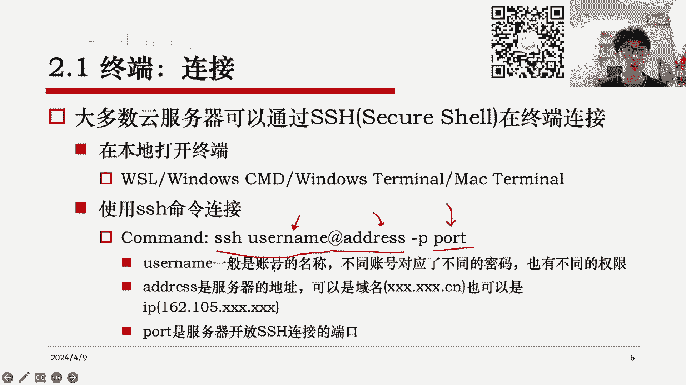

所以就有一个我们非常关键的部分，就是当你连接到远程服务器的时候，你需要一个验证方式来证明，就是你是这个服务器的所有者，然后一般来说，它默认的方式都是你提供一个密码，比如说像刚才的嗯。

他会告诉你你需要输入密码，然后你就在终端里输入这个当时租赁的时候，他给你的一个密码，然后或者也有另外一种方式是通过密钥的方式，这个密钥就是说你可以通过SSH，在本地生成一个密钥，然后呢以后登录的时候。

你就可以用这个密钥来去嗯，自动的就是它会自动判断你有没有这个密钥，然后这个密钥是否匹配服务器上的一个公钥，然后如果匹配的话，那么它就会呃呃它就会就是不需要输入密码，你就可以自动登录进去。

然后这个是一个验证方式，然后总而言之。

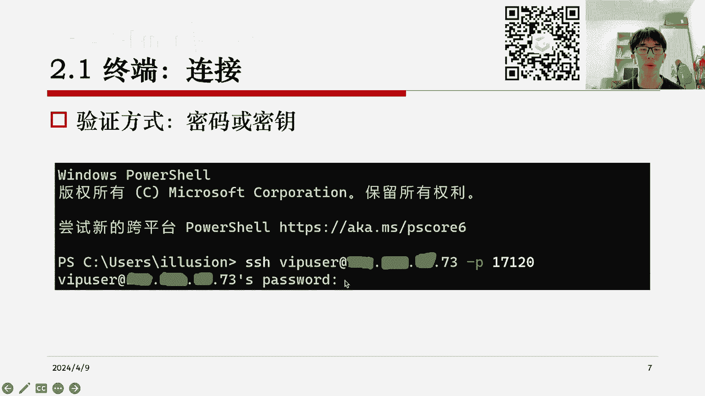

当你比如说通过这种方式登录进服务器的时候，它就会嗯告诉你你已经成功连接了，然后像上面的这一大串信息，就是在服务器上显示的，然后呢当我登录进去之后，我就会发现啊，比如说我原来在我的本机。

我有一个本机的用户名和本机的电脑地址，然后但是当我登录进去的时候，它就会切换成远程服务器的，一个用户名和他的一个地址，然后以及对，以及这里，这里的命令行就已经在远程的服务器里了。

所以这个就是一个终端连接，基本上是比较简单的。

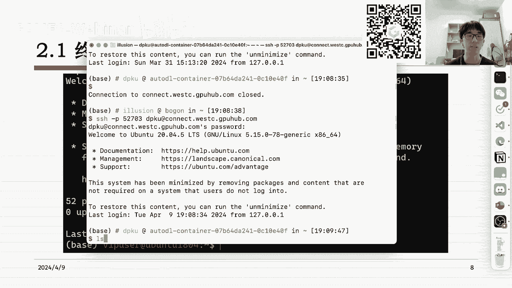

然后哦说到连接肯定也有终端的退出。

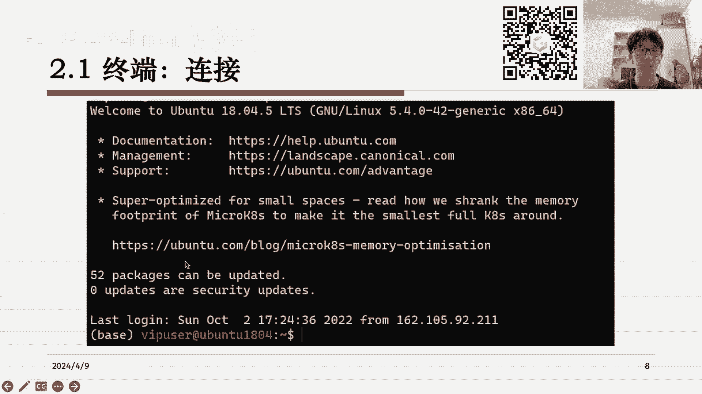

就是当我们连接上了这个终端之后，我们怎么样从这里退出，简单的方式就是啊，比如说我们直接把这个窗口关掉对吧，然后他就肯定会退出了，然后但是呃呃也你也可以通过一些主动的，比如说渐入或者通过一些命令来退出。

这个退出的话就比较呃怎么说呢，就比较正常一点，就是是一个标准的退出方式，就是相当于你告诉远程终端，现在你要退出了，然后远程终端会执行一个标准的退出过程，但是如果你像直接关闭这个窗口的话。

有时候远程终端是意外的发现退出了对，所以这两个还是不太一样，那么我们怎么样主动退出呢，就比如说第一种方式是嗯在远程终端这个界面，比如说现在是远程终端界面，然后我们CTRLD，然后他就会发现哦。

你通过这个方式就退出了，他会告诉你connection已经close，然后或者说嗯你在进入远程终端之后，直接输入一个exit或者log out，都是可以这样退出的，然后退出之后。

你会发现你回到了你在本地的那个命令行，就是这个地方已经是我本地的命令行，然后我还可以继续重新连接回来，对然后这个就是一个主动退出的过程，然后也有一些情况是被动退出，比如说当我们比如说我们登录之后。

然后他闲置了太久，或者说你的你登录上服务器之后，因为哦远程连接它是需要联网的，你需要一直保持电脑的网络连接，所以比如说你登上这个服务器之后，你把电脑合上了，然后或者说呢嗯你突然没网了。

然后他就会这个连接，它在过了一定的超时时长之后，它就会断开，然后你在本地会收到一条信息，告诉你远程主机重置了连接，或者远程主机关闭了连接，然后这个情况就是被动的退出，然后不管是哪种退出终端的退出。

都会终止所有的紫禁城，就是说比如说我们连接上远程服务器之后，我在命令行里跑一个什么什么程序，然后呢，呃但是比如说我突然我突然我这个呃，有事要走了，我要把电脑合上了，或者或者怎么样。

或者说嗯比如说呃我要我电脑要充电，要关机，然后不管是哪种情况，一旦这个终端你进行了退出，它就会导致你终端中运行的所有进程，全部被呃这个退出掉了，所以这就导致说比如说我们嗯像深度学习里。

我们想要训练一个神经网络，然后呢可能有时候训练会比较久，比如说你要训练个一天一夜，然后像这种情况，那么因为这个训练命令是我通过远程连接来，在远程服务器上执行的。

所以说相当于说比如说我们这里有一个train，什么什么什么什么一个脚本，然后我们运行之后，一旦你把这个终端给关掉了，然后呃远程服务器也会终止掉这个训练过程，所以这个对我们来说是不可接受的。

因为你使用远程服务器的主要目的就是说呃，我想要方便的，比如说呃能够在远程服务器上做训练，但是我本地可以通过命令行简单的操作它，但是我肯定是希望，比如说他要训练一天一夜的时候，我不我不需要。

把我本机的电脑也一直打开着对吧，然后所以这个时候就带来一个问题，就是我们怎么样去让终端退出之后，终端里运行的所有进程仍然在这个正常运行呢，这就涉及到了终端的多路复用，然后这个是一个嗯对。

比如说对我自己来说会经常用到的一个功能，就是它主要主要的功能呢是一个，关闭远程连接后，原有的这个进程也不会中断，你可以通过一些命令再次恢复出它，然后呃它也有一些其他功能。

比如说嗯比如说你使用这个终端多路复用之后，多个用户实际上是可以看到同一个这个绘画的，就是你可以跟他分享，你的这个终端里的一些情况，然后或者说你可以在单个窗口下，进行一些分屏啊。

这题我们可以来看一下这个它的使用，比如说以这里有两种这个终端，多路复用的软件啊，主要是以LINUX为例，windows的操作系统的话，我们一般对，一般是通过一些图形界面的方式来操作。

然后像LINUX的话，你要操作终端，你就需要一些这个LINUX下的一些多路复用的软件，比如说嗯这里以t max为例，呃，t max的结构是呃，我们分出三种东西，一种是叫绘画，这个叫session。

session是什么呢，就是说嗯比如说我现在连到远程服务器了，那么我就是一个session嗯，我退出了这个session就关闭了，然后一个session下可能有很多的进程呃。

当我关闭这个session的时候，下面的所有进程都被关闭了，这个就是我们刚才说到的一个问题对，那么我们想怎么处理问题呢，就是说我们现在可以通过t max开开启一个，就是开启一个特殊session。

这个session不会因为我们本地的终端的关闭而关闭，所以说比如说嗯，这里我们就可以就可以发现t max，这样我就打开了一个全新的筛选，然后这个筛选是一个特殊筛选，它下面有一些有些子概念。

比如说首先是一个窗口的概念，比如说我们可以看到这个这个最下面这行，绿色的栏告诉你这里有个零这个标记，这个零其实说的就是我我默认打开了一个window，就是打开了一个编号编号为零的这个window。

打开了一个这样的窗口，然后对于这个窗口，我可以在里面进行一些分屏操作，把它变成子窗口对，所以总的来说，绘画这个session这个概念，就是我整一个登录进来的一个概念，然后我的窗口。

就是我可以在这里面开很多个窗口，就像我们的浏览器一样，绘画就是呃这个浏览器的整个的程序窗口，就是浏览器里的标签页，子窗口，就是比如说你可以在标签页里做一些，更复杂的分屏功能，这个后面会讲到嗯。

那么说了这么多，到底怎么样去做一个终端多路复用的操作，这里可以啊，大家简单的看一下，比如说我们要新建一个绘画，就是通过t max，然后new，然后比如说你可以给这个绘画取个名字。

杠S他就呃他就得到了一个新的窗口，比如说杠S1个test，然后我们就进来了一个新的窗口，这个窗口的名字叫test，然后我们也可以选择列出全部窗口，比如说呃比如说t max els。

这样他会告诉你没有正在运行的窗口对，因为我这里，我这里实际上刚才那个窗口被我退出了，呃话说我发现有个快捷键冲突了，我们这里换一个吧，用screen为例子，应该是一样的。

比如说用screen els和t max els是类似的，它会列出来你正在运行的窗口，然后我这台服务器上是已经有一个，正在运行的窗口，他会告诉你这个窗口是从什么时间开始运行的，然后他的状态是怎么样。

然后我们也可以选择接入这个绘画，比如说呃这个窗口是我比如说大家可以看到，就是我这个去年12月就打开了，运行的一个窗口，然后它一直运行到现在，那么你实际上是可以通过恢复的操作去，重新恢复到它的。

比如说我们可以在screen里，它就是杠二杠二就可以恢复过来，然后到这里可以发现哦，你恢复出了当时正在运行的一个进程，它的一个状态，这个进程其实是我这里的一个服务器进程。

然后大家可以看到这里其实是一个日志，然后呢，当我们像我们如果不不不通过这个终端，多路复用的方法去进行这个程序的运行的话，那么当我关掉这个这个终端，比如说或者说当我的Mac电脑它关机了。

那么这整个进程就会终止掉，但是通过现在通过这个终端多路复用的方式，我们可以就是暂时的退出这个进程，这里比如说我这里通过一个操作，暂时的退出了它，它告诉我们的是这个这个进程被挂起了。

或者说它被隐藏到后台了，而不是我像之前的我直接把它退出掉了，所以通过这种方式，我们就可以在这个服务器的后台去运行，一些复杂的这个进程命令，然后呃像我们这里开启的终端，它其实是和之前说的一样。

你是可以用CTRLD来退出的，但是这个退出是一个终止，就是是一个你像呃你像终止进程一样，真的把这个窗口给终止了，而另一种退出是嗯，你可以选择这个断开当前绘画的连接，把当前绘画放到后台去。

然后这个操作就是我刚才展示的操作，然后它可以让你在后台运行一些命令，而不而不会因为比如说你本机电脑的关机，或者其他操作，导致这个进程的断开，然后这里的话呃，绘画操作，就是我比如说我刚才到底是怎么样。

退出那个绘画，这里就涉及到一些组合键，就是这是t max的一个特殊操作，就是说当你在t max的命令里，然后你可以先按住CTRLBCTRLB的话，就是告诉t max，你是你要开始做一些这个特殊操作了。

然后CTRLB之后，它会根据你输入的到底是什么操作，来执行相应的行为，比如说嗯你你CTRLB加S，它就是会让你选择切换到哪一个会画，这里可以展示一个例子，OK我河豚还要试一下我的，这里有个快捷键冲突了。

因为max他的截屏和录制，我这里设的是CTRLB，所以和他冲突，这里把它关掉，然后就可以用TMAX，嗯比如说CTRLB加S，然后他就会告诉你，你可以选一个呃，一个一个绘画来进入。

那么我们这里展示展示一下例子的话，我们就开多多一点的，比如说刚才我创建了一个叫test的绘画，然后呢现在我再创建一个叫test2的绘画，然后这个时候我通过CTRLB加S。

然后就可以发现有两个绘画可以让我来选对，所以这个地方就是一个一些基本的绘画操作，然后比如说我可以从test2切到test，然后在test这里，我可以用CTRLB加D来断开当前的绘画，它会告诉你啊。

你从当前的绘画断开了，但是呢你还是可以重新连接回去，就是通过嗯，通过刚才提到的这个命令接入绘画接入会话，比如说我在这里写t max a，然后杠t test，然后这样我又回来了。

反正类似的就是这样一个操作，具体的使用大家在遇到这个情况的时候，也可以继续的嗯，根据这个PPT的内容，或者说自行的去上网搜索一些资料，总而言之，总结一下我们的终端多路复用，就是为了做这样一件事情。

就是我需要在远程服务器上去后台的运行一些。

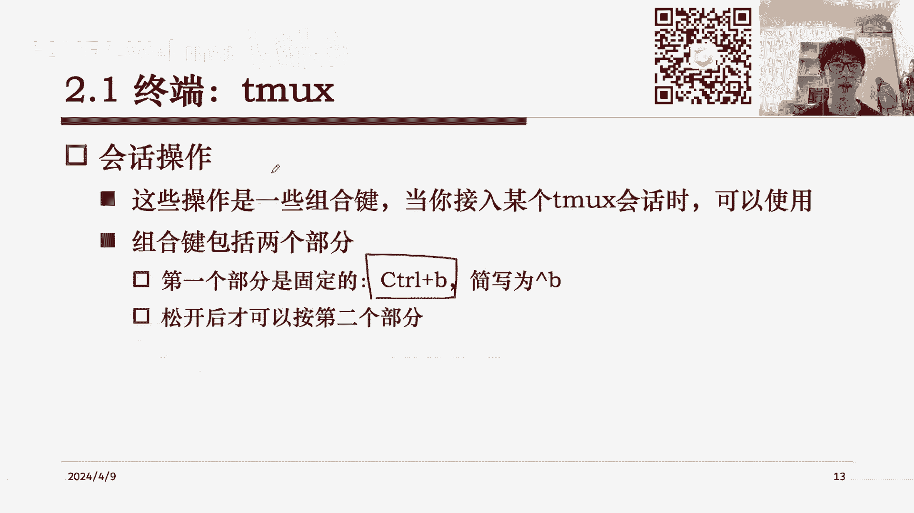

比如说一些复杂的一些进程，然后而不希望因为我本地电脑的关闭，导致后台这些进程的一个断开，然后这个就是一个终端和终端多路复用的内容，接着哦，涉及到远程服务器的另一个重要内容。

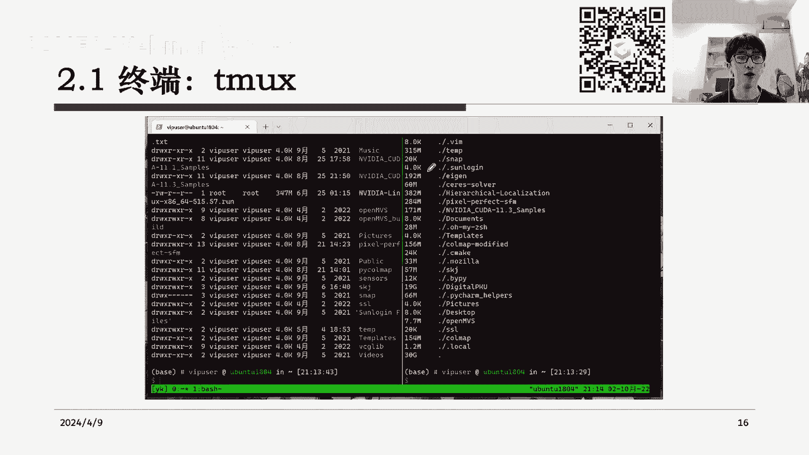

就是文件的传输，文件传输的话嗯，其实是我们经常会遇到的一个功能，就比如说我们在云服务器上哦，它它有它自己的文件系统，然后我们本地可能有一些我们本地的重要文件，然后想要上传到云服务器上。

或者想要在云服务器上进行，和我们本地这个类似的一些文件操作，比如说你要传输，你要查看，你要编辑，然后这里的话，其实一般来说需要通过额外的软件来进行啊。

比如说我们常见的呃有x FTP或者win s c p，这两个软件都是可以用来做文件传输的，然后呃这些软件进行传输的协议，其实都是SFTP协议，所以嗯这些软件基本上你可以找到，非常非常多的变种或者替代品。

然后这里展示一个简单的例子，就是用这个win s c p这个软件，做了一个呃简单的事例，然后比如说左边显示的啊，这个地方就是我本地的电脑的一个文件夹，右边显示的是远程的文电脑的文件夹。

然后我通过一些比如说把左边拖到右边，或者右边拖到左边，我就可以做一些文件传输的操作，而文件的查看编辑比较，其实也可以通过上述软件来完成，然后有一些情况下会比较麻烦。

就比如说实际上嗯像比如说右边某一个文件，你要去查看它，那实际上你需要把它下载到本地，然后再在本地打开它，这样有时候会显得比较麻烦，所以我们在终端中，有时候也会进行一些文件操作。

这里就其实和LINUX下的一些命令就有关了，比如说我们可以编写一些Python的脚本，或者说我们可以通过LINUX自带的命令做一些查看，然后做一些编辑和比较，然后这里我们就不详细展开了。

我给大家简单的这个看一下，就是我们的一些常见操作，然后这里也可以在我们的远程服务器上，做一个例子，比如说像第一个啊，我们要列出，比如说要列出一个地方的目录，然后这里可以CD到一个地方。

嗯最简单的命令就是IOS，它可以列出当前目录下都有哪些文件夹，然后LS杠ALF这个可以列出更详细的信息，包括文件的权限，它的所有者，它的创建时间以及它的大小，然后我们也可以递归的列出目录下所有的文件。

比如说哦这里可以find data啊，算了，find find这个这个吧，然后你就会发现他列了一大串东西，把这个目录下，所有的递归的这些文件全部列了出来，然后或者我们不想要这么复杂的操作呃。

就是不想要它列出这么复杂的输出，我们也可以就是做一个筛选，列出所有具有特定文件名的文件，比如说我们只想要以JPG为后缀的这些文件，或者说比如说我们这里举个例子吧，我只想要以这个TXT为后缀的文件。

啊好这里没有啊，我想想，那就这样吧，反正比如说你通过这个graph这个命令，它就可以做一些这个字符串的处理操作，比如说这个意思就是说嗯我只看所有的路径里，包含TXT这三个字母的路径。

然后它就可以给你筛选出来啊，比如说当前这个mobile文件夹下面，所有包含TXT这三个字的这样一个路径，然后你就可以根据这个来做一些，特定文件的筛选，然后或者我们也可以统计目录占用的空间。

比如说用这个DUDU名，然后他就告诉你，比如说当前文件夹占了56G，然后其中最大的这个文件夹呢，它占了44个G，就是大概这个意思，然后以及一些统计硬盘的剩余空间，然后或者说我们可以查看文件的内容。

就是直接在命令行里查看文件的内容，比如说cat一个什么什么，然后或者说如果这个文件太长，你可以用后面这个，然后这些嗯这些复杂的文件操作，其实我们不一定要完全掌握，因为嗯它只是提供一种便利性。

比如说列出目录这个选项，你实际上就可以在这个文件传输的这个软件里，去简单的直观的看到，而不需要通过命令行，然后像比如说我们统计目录占用空间，或者说递归的列出某些文件的文件名，这些也可以通过。

比如说你编写一些Python脚本，或者编写一些这种嗯C加加脚本也可以，然后你就可以通过类似的方式，就是根据你自己的需求，去把这个事儿给完成出来，但是之所以要介绍这一页。

其实主要目的还是说有时候有些特定情况下，我们是我们记住这些命令会更加方便，比如说嗯比如说当你真的真的只打开了我，我只打开了一个终端，我没有打开一些其他软件，我就想简单的看一下，比如说这个目录下面有什么。

或者说我就想简单看下某一个目录下面有什么，然后这种情况下，有时候啊简简单单的一句命令是更加方便，这个就不需要特地学，但是会在大家比如说使用远程服务器的过程中，逐渐的熟悉起来，然后以及一些文件的编辑。

或者一些复制移动删除的操作，这些都是一些就是在我们的使用中，会逐渐熟能生巧，会经常遇到的一些操作，然后还有一些像文件的比较操作，然后这一部分就是文件的一些主要内容了，这里并不详细的展开。

因为之后我们将介绍就是不是这么原始的，比如说使用命令行，然后去做一些操作，而是使用一些远程控制的一些软件，像是vs code这样的软件去做一些呃更加方便的事，然后我们可以直接在本地去。

比如说方便的比较文件，去方便的比较目录，然后像哦这里第二节所介绍的方法，都是一个最基本的方法，然后这就是文件的部分，然后第三节这里我们将简单介绍一下，程序的部分，就是我们怎么样在远程终端中运行程序。

一般来说这个其实反而是比较简单的，我们可以简单的理解一下，就是当你进入一个远程终端之后，你在命令行里输入一个命令，它实际上就运行了一个程序了，就比如说我这里输入一个LS，其实它本身就是一个程序。

然后或者我们输入一些更复杂的一些Python命令，那么它其实也是一种程序，这些程序运行起来哦，你就可以像这个像是在怎么说，像是在在这个你本地的电脑上，打开一个窗口一样，然后你想要关掉它，在本地。

比如说像我们的windows系统，我们就可以点一个叉叉，或者或者在右下角的任务栏点一个退出，然后就可以让这个程序退出掉，但是比如说我们在远程终端里运行的程序，它一般来说嗯不能就是你不能通过。

比如说简单的点一个点个关闭来退出，然后像是嗯因为有些复杂的程序，实际上哦你需要做一些就是标准的退出，而不是说你突然关掉这个程序，让这个程序反应不过来，然后他可能有些比如说日志，然后有些输出都会中断掉。

对我们我们一般来说在一个正在运行的程序中，我们是可以通过CTRLC来进行中断的，然后像是嗯，但是这样比如说我这里运行了一个cat程序，然后总而言之它就是卡在这里了。

然后你就发现这个cat程序一直在运行的话，你就没有办法从这里从这个命令行环境退出了，然后但是这个时候你可以通过CTRLC来终止掉，这个命令行环呃，来终止掉这个程序，也就是说一个正在运行的程序。

我们一般都是可以通过CTRLC来做一个程序中断，然后你就会发现你中断了正在运行的这个程序，之后，就回到了原来的命令行，然后你可以去做一些其他的事情对，然后也有一些情况下，这些程序可能因为它卡住了。

或者因为他嗯，它特殊处理了这个CTRLC的这个中断，所以呢你通过CTRLC不能简单的去这个中断掉，这种程序，这种情况下，我们就需要使用更复杂的kill命令，来强制终止程序，不过这种情况一般比较少。

就是嗯正常来说，我们不应该使用kill来强制终止一个程序，除非他遇到了一些意外状况，比如卡住了，然后我们还有还有一种办法，可以查看正在运行的程序，比如说通过P来查看PSAOX。

可以查看哦当前机器上所有运行的进程，然后每个进程他都会告诉你嗯是谁谁在使用，然后他的ID是多少，然后他的占用的CPU和占用的内存，然后或者也可以有一个，就是也也因为PS这个命令你是输入的瞬间，他去统计。

然后你也可以通过这个top命令，来实时的查看CPU的变化，比如说这里是一个哦top命令，它会每三秒监测一下所有正在运行的进程，它的CPU占用，然后并且从高到低做一个排序，然后大家可以看到这里嗯。

他其实是三秒刷新一次，然后就像我们的任务管理器一样，它是为我们统计出目前正在运行的所有进程，然后你去可以有一个直观的感受，就是谁在使用最高的这个资源，然后这个地方你可以通过CTRLC。

也可以通过Q来退出，然后以及还有一些呃命令，像是我们可以去查看哦显卡的占用情况，比如说这里这里可以看一个显卡的占用情况，对然后像这里就说我有一张24G的显卡，然后他已经用了500MB，大概就是这样。

然后也可以去查看内存使用的情况，嗯总之就是类似的这个情况，比如说我们告诉我们，这里可能有一个T的内存，然后呢现在已经用了100G，他还有900G可以用，然后这个就是一些简单的程序运行中断。

以及我怎么样查看这些正在运行中的程序，然后之后嗯，这一部分还有一个对于这个LINUX命令行来说，非常重要的部分，这个大家之前可能已经呃介介绍到，然后但是这里来做一个更详细的阐述，就是我们有两个基本操作。

一个叫重定向，另一个叫管道重定向操作，就是说我们的程序本来它是会输出一些东西的，比如说像我输入这个呃，我要我要查看这个显卡的情况，他就会给我输出一张表，这整张表都是这个程序的输出内容。

然后有的时候我们不希望，就是这些输出内容是输入到我的屏幕上，而我希望比如说把它保存成一个文件，然后这个时候就需要我们把输入，输出流进行一个重定向，然后管道也是一个类似的，就是它的功能就是让一个一个输出。

重定向到另一个输入流，这里到底是什么意思呢，我们可以简单的来看几个例子，就首先大家知道LINUX里的echo这个程序，就是它的功能就是你输入什么就输出什么，比如说我给echo呃，传一个apple。

然后你就会发现它会打印出来一个apple，然后呢比如说我echo一个something，它就会打印出来一个something，在这种情况下，我想要我一口出来的东西，给它存到一个文件里去。

就可以用一个简单的重定向操作，比如说我这里输入一个大于号，这个其实就是输出重定向，我把它输入到比如说什么apple点，大家就可以看到这下面就出现了一个apple text。

然后这个apple text里有什么东西呢，我们可以用cat来查看它，然后你就会发现里面写了写的东西就是something对，所以这个重定向就是一个非常简单，就是我打印了什么东西。

我默认的啊一个一个操作，默认的一个行为是把这个东西打印到屏幕上，但是我通过这个重定向，就可以让本来要打印到屏幕上的东西，打印到一个文件里，然后第二个第二行这里展示了一个追加操作，就是嗯怎么说呢。

我们的这个重定向它是会覆盖这个文件的内容，就比如说我现在输入的不是something了，我现在输入的是一个apple，然后我们再去看这个apple text，你会发现里面的东西全部变成apple了。

然后这个所以说这个重定向，它的默认行为是一个复制，但是有时候我们不希望复制，我们希望就是我们希望的不是覆盖，而是说我把这个东西给追加到，这个文件的末尾去，这种情况下我们就需要一个两个大于号，这个操作。

就比如说两个大于号嗯，比如说这条命令它是什么意思呢，它就是在apple text的末尾追加一个something，那么我们原来的apple text里只有一句apple，然后输入完这个命令之后。

你就会发现它多了一行叫something对，大概就是这个意思，所以在这种情况下，其实啊我们就可以发现，你可以通过这种重定向去做很多事情，像是嗯像是做一些比如说操作的组合，比如说你有一个脚本文件。

你本来是要在控制台上，或者说在你的屏幕上打印一大堆日志的，但是这种情况下，比如说我们可以Python，比如说什么券点PY，然后让他的所有的输出都重定向到一个log点text。

这样的话你就可以去打开这个logo in text，你就知道发生了什么事，就是这样一个类似的情况，然后管道它提供的是一个呃相似的功能，但是稍微复杂一些，比如说我们知道这个一个程序，它有它的输入。

它有它的输出，就比如说像PSAOX这个我们已经遇到过了，它的功能就是打印当前的一些嗯，这种使用的一些情况，比如说当前的进程他用了多少CPU，他用了多少内存，然后一般来说嗯。

就是这里可能显示的还是一个小比较小的例子，一般来说你输入PX杠AX之后，它会有一个特别复杂，特别长的一个列表，这个时候我们可能是希望我只关心其中，比如说某一个用户的它的一个使用情况。

这个时候我们就可以用grape这个东西，来做筛选，比如说嗯像我这里，我我这里只需要所有和DPKO相关的，一个进程，然后你就会发现他这里列出的所有行，都是只和DPKU相关的，然后或者说像我们刚才的例子。

我只关心有特定文件后缀的一个文件，然后这种情况下我们去做一个递归搜索的时候，加上这一句，他就会只包含所有JPG格式的文件，然后这个就是做了一个管道，因为GRAP这个命令它的功能其实是嗯，比如说。

Grab text，这个时候我可以给他输入一些文本，但是不管我说什么，除非我输入的文本里有TT这个东西，否则的话他是不会做任何的输出的，但是一旦我的文本里有text。

他就会这个程序就会把你的输出给输出哦，就把你的输入给输出回来，所以什么意思呢，就是当我们使用管道的时候，你就会发现前一个程序的输出，它必须包含GRAP所规定的这个词的情况下。

GRAP才会把它重新再输出一遍，除此之外，graph都会把你的输入给吞掉，所以通过这两个的组合，你就会发现嗯，它就完成了一个筛选功能，也就是说比如说像这个例子里。

所有不包括name这个词的那些文本的输出，都会被grab给吞掉，然后但是你一旦包含name rap又会输出出来，所以说啊它就使得我p x ax这个命令里，只只有比如说某一行包含name。

它才会被打印出来，就完成了这个目的，然后这里就是LINUX里的一些呃，标准输出流的重定向，然后它以及包含一些复杂的管道操作，所以这样的话，比如说我们当我们成功运行了一个，Python脚本的时候。

假如这个脚本它有一大堆输出，然后它是打印在终端上的，这种情况下，其实啊你会遇到一个问题，就是说嗯我们的我们的终端，首先我们的终端它是有一个显示内容的上限的，就是你拉到头可能可能是有一个上限的。

然后如果你打印太长的东西的话，最开头溢出的东西就会丢掉，所以这种情况下，我们其实是希望把输出结果保存成一个文件的，而不是显示在终端上，所以就可以通过这个重定向的操作，然后也有一些管道操作是可以支持。

你既显示在终端也保存到文件的，比如说好像LINUX自带的这个命令，就是上面，比如说下面这两行的命令，它其实是上面这两行命令的一个一个加强版，就是它不仅能够让你的输出显示在终端，也能够保存到文件。

如果只用上面这两行的话，大家可以发现，刚才其实是比如说我把p x ax的传到apple里，大家可以发现其实是不会打印出来的，而是全部存到这个apple里去了，所以通过下面这两个更复杂的管道。

你就可以既显示在终端，也保存到这个想要的文件里，然后最后我们来讲一下每个程序，它的在命令行中运行的时候，他的一个成功和失败的情况，就是比如说我们正常来说，我运行一个文件，我我运行一个程序。

它运行完了之后，他如果没有爆出什么异常或者没有报错，那么它其实是会有一个返回值的，这个返回值大家可能在写C加加程序，或者写C语言程序里见到过，就是我们的main函数，它有一个return一个值。

这个值其实就是返回值，然后零是表示正常返回的，一旦不是零，就说明返回发生了异常，然后所以这种情况下，其实我们在终端中也可以利用这一点，就是我们可以通过一个这个and这个操作符，来执行多个命令。

然后如果其中有某一个发生异常了，剩下来就不会执行，因为大家知道这个and逻辑操作符，它其实是一个短路的操作符，就是当你嗯当你某一个值为false之后，后面的所有值都不会再去求职了，所以在我们这个例子里。

我们运行了三个program program1啊，两个program program1和program2，然后你会发现如果program1它出现了异常，比如说他报错。

然后program2它就不会继续运行，然后通过这种方式啊，我们可以做一个这个好简单的一个程序的一个，成功性的一个检验，就是说我保证只有前面的所有程序都正常运行，之后才运行，接下来后面的程序。

然后总结一下，其实这里的基本操作还是比较简单的，包括终端的连接退出以及多路复用，然后以及一些文件的传输查看编辑和比较，然后最后涉及到程序的运行和中断，然后这里其实没有什么特别复杂的一些概念。

反而是说比如说某一个知识点，你知道了嗯，之后就一直知道，然后如果你如果你一开始不知道，你可能会花一些功夫得去查找资料，然后像是CSDN或者菜鸟教程这种中文资料。

也可以去外网查询一些这种stack overflow，的一些英文资料，然后不管是怎么样啊，其实这一部分没有特别困难，大家可以就是在使用远程服务器的过程中嗯，逐渐就会熟练起来，然后通过这些资料的查询。

就是前面这么一大堆可能非常复杂的知识，最后其实也会变成嗯你这个熟能生巧，得心应手的一个技能，然后第三部分，我们简单的讲一下远程的控制工具，因为嗯大家也知道，就是像第二节里我们讲到了那么多东西。

其实对于一个初学者来说，或者对于我们刚希希望入门，图形学研究的人来说，或者说哪怕是你啊，完全就是刚买了一个新的服务器，然后呃第一次使用这样的远程服务器，其实啊就是之前的这些各种操作都是有些门槛。

然后我们要怎么样去方，以最简单的这个方式来学习它的使用，其实是有一些远程控制工具可以直接应用的，比如说啊，我我知道的两个比较主流的就是一个是x shell，这个是一个这个集成式的一个软件。

它用来做命令行，包括文件，包括程序运行的一个所有的远程的一个控制，然后以及vs code，Vs code，它本身只是一个编辑器，但是它里面有各种各样的插件，可以支持你做一些远程的控制。

然后这两种工具都可以提供，就是你在本地上有一个图形化的界面去操作，而不是需要比如说特别复杂的终端的，命令行的一个控制，然后我推荐就是比如说如果你不是特别熟悉，一开始肯定是用这种带有图形界面的。

远程控制工具会比较好对，然后我们这里可以用vs code做一个简单的例子嗯，看一下。

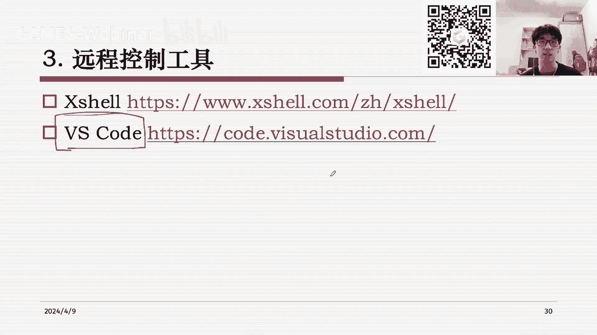

可以调一下屏幕，然后比如说我们这里有一个vs code，然后呢它左下角它左下角有一个远端窗口，打开远端窗口的这个一个按钮，然后你按一下，然后它就会有两个选项，一个是连接到主机。

一个是将当前窗口连接到主机，这两个是差不多的，然后你点其中一个的话哦，这里就会展示，就是你可以选择你已经配置好的一些主机，或者说你输入嗯SSH，然后就是你输入一个user at host的一个命令。

就可以添加新的主机啊，比如说我们这里要添加新的SH主机，这里的话就是要把刚才我们学到的嗯，这个SSH username，然后at host，然后gp port这一串命令给它输进去。

具体来说这里三个东西分别填什么，也像之前讲到过的，我们是需要从这个服务器的供应商那里得到的，就是当你租他的时候，他会给你这三个信息，然后有了这三个信息之后，实际上你就可以完成一个。

这个远程服务器的连接了，比如说我这里选我一个配好的服务器，然后去做一个连接，然后他就会告诉你，你需要输入密码，这个过程就和我们在终端里做的操作一模一样，比如说我这里输入密码，然后我就登上去了。

然后这个时候你可以看到左下角，它就会告诉你正在远程服务器上做一个编辑，然后这个时候我们就可以比如说做一些操作嗯，我这里展示一下DK，我们可以去打开一个命令面板，然后，打开一个终端对。

然后这个时候它其实就和你在自己的终端里，远程连接到这个服务器上是一样的对，但是你可能要问，就是我们这样两种方式有什么区别呢，就是在vs code里和直接在终端里有什么区别呢。

就其实在现在目前来说还是没有区别的，因为啊我们目前只是连到了这个远程服务器上，Vs code，还不能就是确定你要在哪个文件目录下工作，所以这个时候我们需要再选择一个文件夹，去打开，比如说远程服务器上。

我这里有一个例子，我们要打开这个文件夹，然后这样vs code就知道，你要在这个文件目录下工作，然后他就会读取这个文件下的，远程服务器上的所有文件，就像我左边列出的这些。

然后这个过程其实就和你在本地使用vs code，是一样的，就是你可以在左边看到哦，当前的文件夹下面有哪些文件，但实际上呢这些文件都是在远程服务器上，所以通过vs code这个方式。

我们可以在远程服务器上，像在自己本地机子上那样的工作对，然后比如说我们这里涉及到一个文件的传输，实际上你就可以直接从本地的文件夹里，把把这个文件拖到这个栏里，然后他就完成了一个这个呃文件的上传。

然后呢如果你想要下载，你就可以选择其中的某一个文件，然后右键点击下载，然后它就会就可以下载到本地了，所以这样就完成了很简单的文件的上传和下载，然后以及你想要查看某一个文件，就直接点它就可以了。

然后这个就是一个vs code，它提供了远程连接，其实还是非常方便的，然后你甚至可以在你的终端里打开多个，多个终端，就同时打开多个终端，然后以及如果你想要做一些更复杂的操作，比如说你想要比较两个文件。

你想要去做一些，比如说代码的高亮或者代码的智能提示，vs code也提供了非常多的这个扩展，就是嗯你可以到这个应用商店里去搜索，大家常用的一些扩展的插件，然后把它安装起来，然后你就可以做一些这个这个。

比如说比如说我这里，我这里应该有一个markdown的一个扩展，可以给大家看一下，就比如说我们的markdown文件，它是有自己的格式的，然后这里可能可能这样，这样子大家可能看到的全是文本。

就是相当于是这个markdown的一个原始的一个文件，然后但是呢它其实是，比如说我在vs code上装了一个markdown，查看的查看器插件，然后我这里就会多出来一个按钮，我就可以打开一个预览。

然后我们在这里打开预览之后，你就会发现哦，我原来的这个文本它又变成右边这个样子，这个就是一个vs code的，各种各样的插件的一个功能，它其实支持非常多，非常多的一种文件的查看和编辑。

然后嗯比如说你可以根据你的需求，然后在这个扩展商店里去查询，然后甚至甚至说其实可以自己编写一些扩展对，然后所以总体来说嗯，通过像vs code这样的这种集成式的，它提供了一个远程连接的服务。

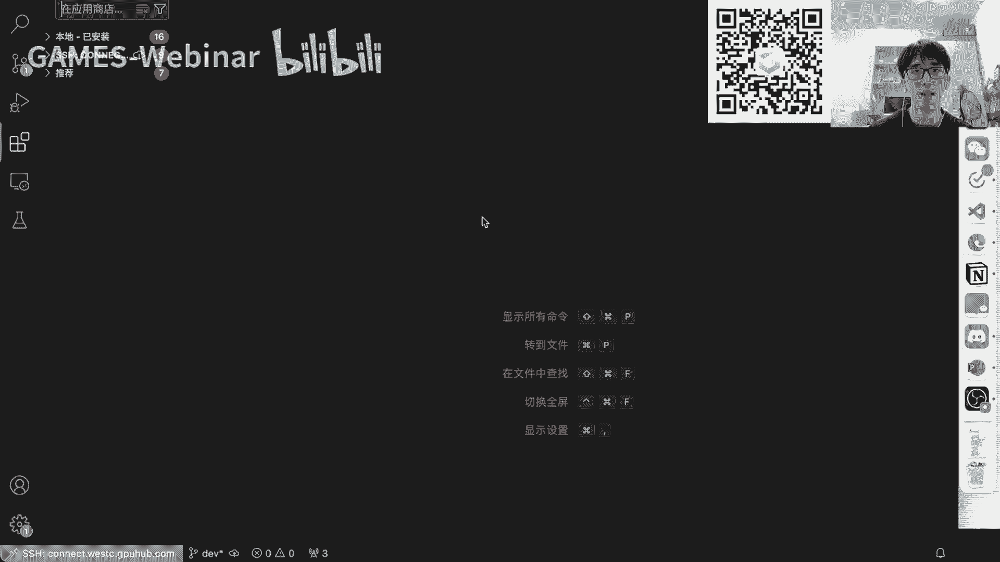

我们其实是可以非常方便地做一个远程控制的，然后这个远程控制，基本上就不需要你做太多的一个学习，有时候你可能只需要搜索一下，比如说怎么怎么用vs code做一件事。

然后或者你在vs code的社区里去做一些搜索，然后就可以找到相关的功能对，那么从这个角度来说嗯，这里列出了这两个工具，它到底有什么区别呢，我们可以简单的看一下，就是像上面这个x shell。

它其实是一个，就是相当于有点像是商用的那种软件，或者说一个专业的软件，然后它是有免费版和付费版呃，呃等等，有没有免费版，我不是很清楚，但是肯定是有付费付费的商用使用版对，所以他提供的其实就是相当于说嗯。

一个相当于专业软件这样的一个一个定位，而vs code大家都知道它是免费开源的啊，不不它是免费的，开不开源，我有点忘了，但反正因为它是免费的，并且提供了一系列的这个呃插件的一个接口。

然后所以其实那些插件都是一个用户社区，他们这个大家群策群力，相当于嗯这样贡献出来的，所以说啊相比于x shell来说，vs code它的优势就是它有一大堆的插件。

然后这些插件你可以去做一个这个选择和使用，然后r x shell因为它它本身是一个闭源的，所以它是没有这种插件支持的，但好处可能是它可能本身有一些强大的功能，然后总体而言的话。

远程控制工具就可以给我们远程服务器的使用，提供非常大的帮助，然后最后我们来简单的讲一下呃，回到我们的命令行环境，我们来再呃这个看一下，比如说命令行到底是怎么样工作的，实际上在一个远程服务器里。

我们是可以分成两个，就是两个主机，一个是我们用户的一个终端，就相当于你在本地，你在自己的电脑上，然后呢一个是远程服务器，它可能可以运行一些呃复杂的事情，那么实际上这里有一个操作的流程，就是说。

比如说我们像刚才我在命令行里输入一个命令，之后发生了什么，实际上就是你输入这个命令之后，你把这个命令传给远程服务器的这个shell，这个shell它就是一个做一个交互的。

然后这个shell读取了你的命令，他就知道该干什么事了，比如说到底是跑一个程序，还是说我要查看一个这个嗯所有进程的使用，还是说我要退出登录，还是说我要做一些什么事，都是shell来读取你的命令。

然后他他告诉具体的进程该怎么样操作，然后他告诉服务器执行特定操作之后，服务器就去运行，运行完了输出操作，结果这个操作结果也是在远程服务器上，然后shell会把这个远程的结果给他传，再传回来。

传到你的终端上，这个时候你的终端就看到刚才那句命令的结果，所以这个过程中其实有一个非常重要的角色，就是这个shell，他扮演了我们从我们的用户的输入，到这个服务器到底要干什么。

这个这个行为之间的它它相当于一个中介，然后这个中介其实是有很多种选择的，就是比如说像windows terminal，大家学到的这个windows terminal。

Windows cmd power shell，它都是一种，它都是一种性，然后像是LINUX上的一个BH或者LINUX上的一个ZSH，它都是也也是一种形，然后呢我们今天可能嗯就是常用的几种shell。

它都是它都是有一个最基本的功能，就是这个命令行参数，就是说当我们啊我们想要运行一个程序，但是你想要特殊的定制这个程序的，一些选项的时候，在我们的windows电脑上，或者带我们图形化界面的电脑上。

我们其实是可以，比如说啊你我有一个窗口，比如说我最简单的大家可以看这个vs code。

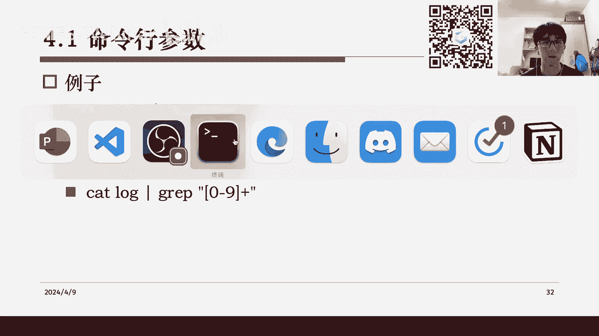

How does，什么叫不能动，好吧嗯这不重要，简单来说，就是比如说你可以从上面打开一个侧边栏，还有一系列的窗口，有一系列的命令选项，然后你甚至可以比如说你去做一些文件的配置。

或者做一些这个这个命令行的呃，做一些命令行的一个打开，然后像这些操作在我们真正的远程服务器上，它可能就没有这样的图形界面让你来配置，比如说你想要的某个功能，而它是以一个什么样的形式呢。

它基本上都是以我们的这个命令行参数的形式。

就是你给一个程序输入一个参数，然后这个程序就知道你要做什么特殊的定制，然后像是比如说我这里展示了一个例子。

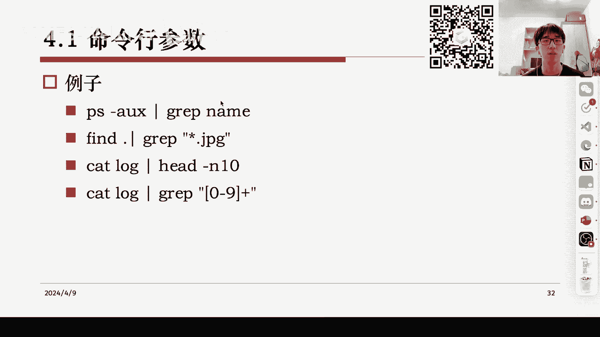

就是一个特别复杂的一个呃一个程序，然后他就是叫这个ns process data，然后它后面有一大堆的命令行参数，然后这个参数定制了这个程序的一些功能，然后我们其实在我们的编程中。

其实也是已经见到过这些参数的处理了。

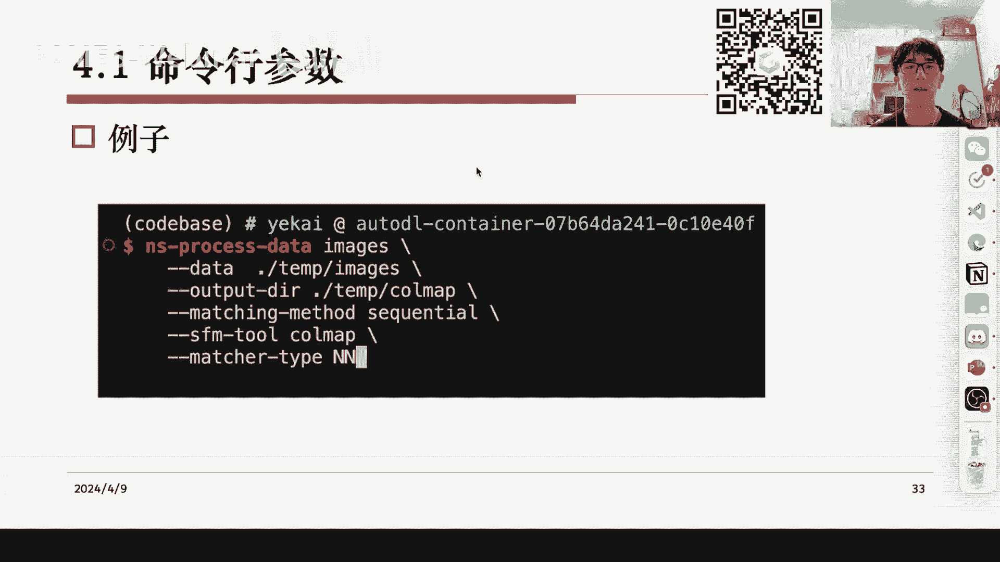

比如说C和C加加里面这个它的它的main函数，它就已经有两个参，有两个地方嗯，其实是用来给你解析这些命令行参数，以及像这个Python它其实也是有一个默认的一个库，它用来提供命令行参数的处理对。

但是嗯回到我们刚才的问题，就是说当你一个命令行参数特别复杂的时候，有时候我们其实是希望，比如说我们能不能查找以前使用过的，命令行参数，就是比如说像浏览器历史一样，我可以记住我。

比如说收藏的一些网页我会记住，我比如说几天前用过的一些网页，其实啊是有这个功能的，这个功能就是我们的这个一种特殊的效叫，ZSH里提供的，然后我觉得这个shell算是比如说我们比较通用。

或者功能比较强大的一个shell吧，然后经常比如说大家可以看到，在我自己的终端这里，我用的就是这个shell，这个shell有什么功能呢，就是首先嗯他可以做一个命令行的补全。

就比如说我这里可能我输入Python，然后你就可以看到它已经我输入PYT，他就已经可以帮我补全到Python了，然后比如说我这里再空格，它又可以帮我补全到我上一句用的这个Python命令。

然后我按一下右键，然后他就把它全部补全上了，然后我在这个基础上可以做一些修改，然后这个其实我觉得还是一个蛮实用的功能，就是说它可以做一个命令行参数的历史，然后加上你的一个自动补全，然后这个东西是哦。

这个shell本身叫ZSH，它的配置是非常复杂的，但是有人就是提供了一个开源的，这个这个配置的一些方法叫oh my zh，然后这个基本上就是它的一个GITHUB的网址。

然后大家也可以在网上搜索一些相关信息，然后来这个就是或者一些中文的配置教程，然后像下面这个链接里，其实就有一些嗯简单的配置方法，然后总而言之，当你配置完成之后，它其实是有一些非常多的功能。

除了我刚才提到的这个命令行的历史，你还可以做一些快速的目录操作，什么意思呢，比如说嗯，我们在这里，其实比如说当你想要进入某一个文件夹的时候，一般来说我们就LS一下，然后呢我要看我需要哪个文件夹对吧。

然后我就CD到这里面去，然后比如说如果这个文件夹的名字特别长，那其实我我要把它全部打进去对吧，其实还蛮麻烦的，然后像我们如果有命令行的历史的话，你就可以直接直接找到这个历史，然后你就可以CD进去。

但是呃ZSH也提供了一些其他方法，比如说你在你只需要打前面几个字符，然后在这个情况下按一个tab，它就会帮你自动补全到这个目录下的，这个文件名对，然后像是一些特殊情况，比如说我们先到data里。

比如说这里这里有两个前缀都叫MG的文件，然后这个时候，比如说我想要知道其中一个文件的大小，然后我用ls命令去查询它的大小的时候，然后这个时候你输入前面三个字母，你再按一下tab。

你会发现ZSH它是帮你补全到最长的，它们的公共的前缀，然后在这个基础上你再决定，比如说我想要三七，我就输入一个三，然后再按tab，他就会帮你补全好，如果我想要四二，我就输入一个四，再按tab他帮你补全。

好像这种功能基本上嗯还是比较实用的，特别是像比如说你需要做一个Python，然后你里面需要一个，比如说你需要指定的data的时候，然后这个data假如离你当前的目录特别远，比如说你需要先出去。

然后再去找，然后这个时候你不知道出外面那一层，文件夹里有什么的时候，你就可以按一个点点，然后杠，然后tab，它就会帮你补全出这个外面这一层文件夹下的，所有目录，然后比如说这个时候你想要你的data。

是在是在这个output里的，那么你就输入一个output，output也不用全输，你输入一个O可能它就能自动补全了，然后对像我刚才就是输入一个O，然后按一下tab tab补全，这个时候再按一下tab。

我就能知道output里到底有什么，比如说它它自动帮我补全出example，然后example下有什么，你也可以再按tab，这个时候他就告诉你example下面有这五个文件，然后有这五个文件的情况下。

你就可以比如说我知道我的我的data在这个spark里，然后你再按一下弹，然后他就，然后你甚至可以连按两下tab做一个选择，然后这种情况下你就发现嗯，其实这种路径的自动的一个选择，功能还是比较强大的。

然后他支持一个，就是你在命令行里做一些非常方便的一些操作，虽然还是比不上我们直接在vs code里做一个，图形界面的一个操作，但是对于命令行来说，这种快速目录已经非常实用。

有时候像vs code也会有比较麻烦的时候，就比如说如果我们的我们要找非常远，然后又没有，就是它不是在不是在当前文件夹下的，是在几个其他的一个犄角旮旯里的，文件夹的时候，其实用命令行反而会比较快一些。

然后这个也就是ZSH，提供了一个快速目录操作，然后除此之外还有一些辅助的功能，就比如说它可以标注出你的嗯一些时间，比如说我们这里显示了当前的时间，然后一些文件属性，比如说大家可以看到这三个文件。

它的颜色是不一样的，这是因为它的一个文件属性是不一样，比如说嗯，我看看这里具体来说对，比如说这个是个zip，对于ZSH来说就会有一个特殊的颜色，就是表示这是一个压缩包，然后以及你的虚拟环境。

比如说我们如果使用了Python的虚拟环境，比如说康达，好像mini康纳或者安娜康纳，这里都会有一个康纳的一个环境的名字，比如说我这里叫贝斯，然后如果我用了某一个环境。

它就它这里就会改成那个环境对应的名字，然后以及我们会有一个git的状态，就比如说如果当前文件夹是一个呃git的仓库，这里会标注出一个git的状态，比如说如果是叉叉。

就说明你当前有一些文件需要已经被修改掉了，然后如果不是叉叉，是一个是一个圈，就说明当前文件全部都是啊已经最新的，然后没有被修改过，好像是这样一种辅助的标注功能，对总体来说。

ZSH就是这样一个嗯命令行的一个工具吧，然后我们总结一下嗯，这边的话我们就主要讲了一些远程控制，然后讲了一些哦，我翻到最前，就首先讲一下远程服务器的这个介绍，然后是他的一些基础方法，这些基础方法的话。

它其实是被这个远程控制的一些专用工具，给覆盖了，对，但是这些基础方法也确实是一些，可能是一些比较嗯比较便利的，有时候会需要你去这个熟能生巧的一些方法，然后第三个部分就是讲一下我们的呃。

x shell以及vs code这两样远程控制工具，然后最后简单的介绍一下命令行环境，包括它的参数，和我们的这个一个特殊的命令行shell，然后综上基本上就是啊，我们这一节的所有内容对，然后嗯后续啊。

然后然后本节课是没有作业的，然后后续可能会有一些其他的作业，然后大家可以这个有什么问题，可以在弹幕里这个提问对的，哦不好意思，我这边好像OBS，下移一些吗，我研究一下，对那个补全。

这个有同学说到那个补全确实不是默认打开的，是因为呃是因为就是这个一个默认的ZSH，它它是绝对没有这个功能，然后呢嗯当你配置了OMMYZH之后，那个东西里面其实是有很多插件的。

然后像是补全它就是其中一个插插件，但这个插件其实也算是比较知名了吧，就所以其实你可以在大多数的教程里找到，就是它这个插件应该叫什么，什么什么suggestion对，反正这些就是大家可以自己试试看。

然后如果遇到问题了，也可以在QQ群里就是联系我们，然后我们可以帮大家解答，对，然后呃，我看看，对，然后有同学提到这个图形界面确实就是哦，不管你怎么样来说，如果有一个图形界面，而不是一个命令行的话。

肯定是图形界面最方便的，然后除了一些非常特殊的情况，可能说比如说我命令行简单的做一个哦，命令行一个历史的一个查找，会比这个图形界面更方便以外，其他情况像我们的各种文件操作，都是图形界面更加方便。

然后所以大家也不用，就是说，一定要锻炼自己在命令行操作的一些能力，或者说锻炼自己对这些LINUX命令的熟悉程度，我觉得吧，就是当你有一个图形化的一个界面的时候，肯定是就不需要原来那些复杂的东西，类似的。

可以类比，就是啊，比如说我们现在已经有vs code的远程连接了，我还需不需要用win，在命令行里去编辑一个文本文件呃，这个对这个问题的回答是，就是我们大部分情况下。

绝对是我在vs code里直接去编辑文件要更方便，但是也一定有一些情况是WM更方便的，我们要不要为了那些情况去专门去学WW呢，我觉得是其实是不需要的，就是你最终还是要看你自己更多频率下使用的。

一个更得心应手的一个工具，然后去专门的去就是熟悉那个工具，而不是说我们把时间花在这个命令行上，对，嗯然后然后已经学了，其实也没关系，因为学了绝对是这个，就是会给你带来很多方便的。

像我刚才其实其实我现在一直都在用的，就是vs code，但是呢呃第二节我们说到的这一大堆终端操作，文件操作的方法啊，我我最后也都会了，这就是就是一个就是你这个多多益善的事情，对。

然后呃有同学说QQ群搜不到啊，这个的话确实就是我们那个群，目前还不能它开放搜索，好像需要一个什么什么条件啊，大家暂时可以就是到我们的games002的官网上，然后去扫那个二维码加群。

然后呃后续我研究一下那个QQ群怎么怎么样，开放搜搜索吧。

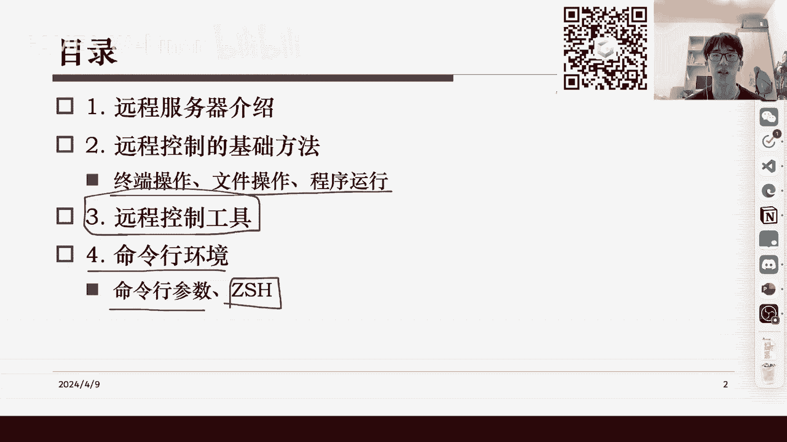