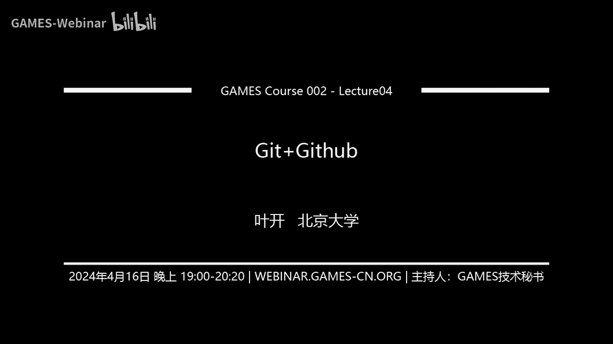
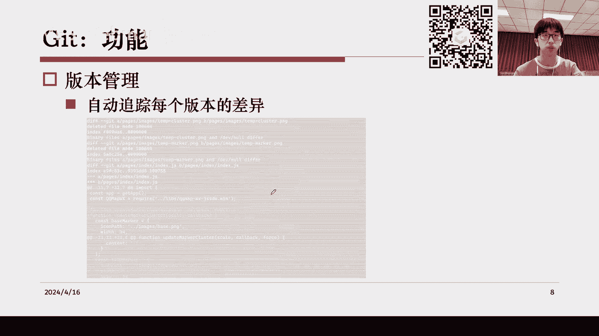
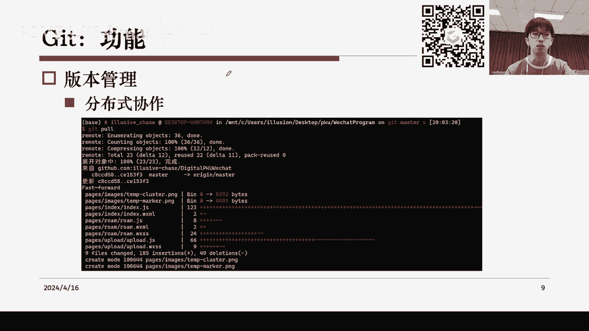

# GAMES002-图形学研发基础工具 - P4：Git+GitHub - GAMES-Webinar - BV1cC411L7uG

哈喽哈喽嗯，应该可以听到吧，然后大家好啊，这是我们games的这个第四次课程，然后嗯，这节课程大概我们花一点时间来给大家讲一下，git和GITHUB之间的使用，嗯那么首先我们介绍一下get这个概念。

就是git，它是一个相当于是一个软件包，然后它它的功能是一个版本控制的功能，然后什么是版本控制呢，其实呃如果比如说对于大学生来说，可能有一个非常常见的例子，就是我们比如说有个小组作业。

然后要共同修改一份PPT，然后我们要在微信群里，比如说大家互相把自己修改完的文件传到群里，然后结果就会出现一个情况，就是我们可以有可能有一大堆这种文件，说什么小组PRE点PPT，然后小组PRE修改版。

修改版一，然后最终修改版，最终最终修改版等等，就是当你如果没有一个版本控制的软件的时候，我们去做这样一件呃，这个共同协作修改的，或者说哪怕是只有你自己一个人在做一个修改。

然后如果你想要追溯每次修改的版本，或者说你想要去做一些这个呃修改的就具体，比如说我修改了哪些部分，我我对这些是有一个掌控的，如果要做这件事的话，我们一般来说哦，最粗暴的方式就是像我这里列出来的这样。

我们去准备很多很多个文件，然后这些文件之间可能各自有一个小的修改，但是这样的缺点就是呃，这种方法我们会导致最终大家可以看到，就是首先从文件名上，可能它基本上无法提供太多信息，就是你看着这这一系列文件。

你是不知道嗯，呃我可能两个版本之间到底有什么区别，然后可能甚至有时候你都不知道，哪个是最终的最新版，所以这种时候就需要引入到我们get呃，作为一个版本控制软件了，那么什么是版本控制呢，嗯就是相当于说。

比如说我们之前的例子都是共同编辑一份PPT，共同编辑一份代码，然后最后搞不清楚每个版本修改了哪些部分，一旦有错误，就比如说你的修改和别人的修改呃，它不同步，或者有有什么错误需要你回溯去对比，就非常麻烦。

所以get他做的事情，其实就是我们这里的困难的点就是，首先嗯git能帮你搞清楚版本和版本之间，文件到底有哪些变化，其次git能帮助你追溯这些变化，并且在你需要做回溯和对比的时候，get可以帮你处理。

那么回到git，什么是git，git其实是一个开源的分布式的版本管理系统，它可以非常有效并且高速的处理呃，从非常小的项目，到非常大的这种项目的版本管理，然后他最初是LINUX。

他为了帮助管理LINUX内核系统而开发的一个，开源版本的版本控制软件，所以git它基本上它的功能其实是比较强大的，只不过我们平时可能用不到git的所有功能，就是其实我们不一定啊。

比如说用一个复杂软件的时候，不一定要成为这个软件的专家，你只需要哦，让他尽可能的适合你正在处理的这个工作，或者那尽可能的辅助到你目前手头的事儿，就可以了，我们这里呃要学的功能其实就比较简单。

当然git的全部功能肯定不仅限于此，但在本节课中，我们基本上要注意的是，首先是它的版本管理，自动追踪每个文件的修改。

然后比如说呃，这里有一个那个命令行控制台的一个例子，就比如说我这边输入这个呃，git的一个status的命令，让他告诉我目前我这个代代码仓库，或者说我这个代码文件夹，下面的情况是怎么样的。

然后他会告诉你三条信息，第一条是说呃告诉你在哪个分支，这个分支是之后可以学到的一个概念，然后第二条是呃，他告诉你哪些文件是你已经暂存了，然后之后就可以做提交的一个呃文件。

就比如说这绿色的是我已经修改了这些文件，并且我把我的修改给保存下来了，然后最后红色的就是嗯，它会告诉你哪些文件和之前的版本相比，它已经发生了变化，但是这些变化你又还没有把它给记录下来，对总而言之。

基本上它的最大功能就是，自动追踪每个文件的修改，然后其次它还可以去追踪每个版本的差异，相当于我们可以，这个人为的去定制很多的版本出来，比如说呃像这里列出的，它每一个黄色的这个commit。

它都代表了一个一次提交，然后每个提交我们可以简单理解为，它是一个版本，然后每次版本它有一个简单的说明，这是在你提交的时候去做的一个注释，然后版本和版本之间其实大家可以看到，比如说呃第一个版本是这个啊。

这个10月14号的七点，然后第二个版本是10月14号的12点。

然后我们在这两个版本之间，其实是可以做一个对比的，就当你使用一个啊。

get这个作为一个对比功能的时候，然后他就会在命令行啊，向你汇报所有的这个呃文件的修改，就相当于它直接对比这两个版本，然后比如说这里最下面这里显示的红色和绿色，就是呃，比如说版本A相对于版本B。

它新增的部分就会以绿色的显示出来，然后版本A相对来说少掉的那一部分，就会以红色的部分显示出来，然后ticket基本上主要的版本管理功能就是这样，它会追踪文件的差异，然后能让你记录文件版本。

然后并且自动追踪每个版本的区别。

那么它其实还有一个功能，就是分布式的一个协作啊，这个到底是什么意思呢，就相当于说呃我我同样一个代码仓库，我可以有不同的人，大家一起协作去修改这个呃仓库，并且它是分布式的。

就是说嗯我不需要我不需要存全部的文件，我可能每个人手头只有一个git的一个，比如说我我只存部分的版本，然后呢，我最终把他们汇总到远程的一个集，中于一个集中式的一个地方的时候。

然后git就会自动帮你去计算，你们之间版本的一些差异，然后完成一些合并操作，或者完成一些这个提交修改覆盖等等的操作，所以git基本上它最大的两个功能，就可以简单的概括为，第一个是版本管理。

第二个是能够允许多个人同时协作。

然后去做版本之间的合并和处理，然后这里还有一个分支的概念，其实这个分支相对来说更像是我们的一个呃，我们的一个版本这样的概念，但是呃区别大概在于，比如说这张图里的每个小圆点，它都代表了你的代码整。

就你的所有文件它的一个状态，比如说这个状态和这个状态之间，它可能有一些微小的修改，然后这两个修改嗯，它们分别形成了两个版本，就比如说这里是版本一，然后呢这里是白板二，然后比如说这里是版本三。

但是版本和版本之间，比如说我怎么样去呃，哦就比如说对比版本一和版本三之间的区别，它实际上是把一和二的区别，然后加上二和三的区别，这样子组合在一起，相当于我们在git的这个版本的历史版本上。

可以找到一条修改的一个线路，就比如说我一开始是一，然后加了一点东西变成二，然后再加一点东西变成三，那么这条线路其实可以，就我们就可以把它叫做呃这样一个分支的概念，那么大家可以看一下。

就是比如说比如说我现在这个例子啊，假设我们把这个叫做版本一，然后呢，这个比如说我现在有一个新的节点，在这里是版本一上面做了某一个修改，然后来到了一个新的节点，但是同时我版本一做了另一个修改。

然后他又来到了这样一个节点，就是相当于我有两个从版本一派生出来的节点，然后这个时候其实这两个节点，它对应的就是不同的一个呃，你可以叫世界线也好，或者你可以简单的就是认为它就是一种分支。

相当于说呃我们从这个本来是一致的，这个版本一分裂出了两种不同的可能性，然后这两种可能性之间它本身是呃这个互斥的，因为它们都基于相同的版本，而不是像前面一样是一个线性下来的过程，所以这个东西做到分支。

相当于我们在嗯，通俗的理解，就是我们在这个这个世界线上发生了一个分裂，然后对，然后最后就会像图中看到的，比如说我可以把这条这条分支叫做DEV分支，然后把上面这一条分支叫做我的master分支。

然后这里就是一个分支的概念，这就使得我们可以方便实现一个功能，就是说嗯，我可能代码有一个稳定版和一个，正在开发中的功能，那么我肯定不希望，比如说我开发者开发者，然后我原来稳定版的那些功能。

都已经就是没法用了，所以呢在对于git来说，如果你用git来做你的代码的版本管理，那么实际上可以实现的事情，就是嗯我同时维护一个master，这个master是稳定版，然后我想要新加一些功能的时候。

我就开一个新的分支，比如说我开的这里有一个DEV分支，这个叫呃开发者或者叫develop，然后我在这个分支上去做一些特殊的修改，这个修改并不会影响到我在master，分支上的一些结构。

然后当未来有某一天的时候，比如说我觉得我在DEV分支上的修改，已经成熟了，已经稳定了，通过测试了，然后我可以把DEV分支的所有内容给它，合并到master分支里，然后这个就就实现了我们的一个版本管理。

所以简单来说呢，呃版本管理它和刚才说到的追溯文件修改，它有一个更大的不同，就是相当于版本管理，它对应了这个分支概念，这个这个分支概念它对应了一系列文件的修改，相当于我记录了这个修改，这个修改和这个修改。

然后并且我有另一条线路是这几条修改，然后它可以管理这些连续的修改，并且形成最终的分支，所以基本上这就是get it，我们需要学到的主要功能，这里可能还有点抽象，然后后续我们可以讲一些更具体的例子嗯。

具体来说首先get它既然是个软件包，我们肯定要有一个使用方法对吧，那么它其实呃它其实有多种变体，毕竟因为git本身是开源的，所以你其实嗯像社区他们其实是实现了很多种。

比如说git的辅助工具或者一些呃图形化的界面，比如说像对于我们呃命令行来说，其实是有直接交互的，就是我们在git官网上可以下载，直接可以用命令行运行的G，然后git也提供这个图形化的界面。

比如说我们可以用一个git ji，这个应该是比如说windows上下载git，我感觉嗯应该是会自带一个GOI的，就是它自带一个图形化界面，然后如果你也可以就是通过GITHUB下载一个。

比如说github desktop这样的一个桌面的管理的软件，然后它上面也有一些这个图形化界面，可以提供你进行一些git的操作，然后比如说右边，这就是一个这个这个github desktop的例子。

然后我们可以看到呃，它其实就和你在网页上打开GITHUB有点像，只不过呃对于github desktop来说，他操作的是你本地的一些文件，然后这里kit的话，命令行也有一个简单的安装方法。

这里列的应该是LINUX上，LINUX上，比如说我们因为git已经是个非常知名的包了，所以基本上你直接运行安装命令，都可以把git给装上，嗯然后这里这里是给个简单的例子吧。

比如说我现在就打开了一个命令行，然后我们可以试一下，就比如说嗯这里应该有个git，然后你在命令行输入git的话，它会告诉你一些基本的git的使用方法，然后这里其实会有很多很多很多这种子命令。

就是叫比如说get clone或者get in it，get ADD这些，然后大家可能平时使用过程中，也遇到过一些子命令，然后我们这里可能只要掌握它最简单的几种，就能完成一些基本的git操作就可以。

比如说像这里其实有一些比较复杂的命令啊，我自己平时也基本上不会用到，然后嗯有一些更加复杂的，涉及到分支之间的特别，比如说合并啦这种，或者说你对你需要对git的一些特定操作，进行一些微调。

然后他就会涉及到特别复杂的git操作，嗯但在讲这些之前，我我我们可以用一个最简单的抽象的模型，然后来介绍一下get的原理，就首先嗯git它的原理是怎么样，就是为什么get it能够去做一个文件呃。

修改细节的一个追踪，或者说为什么他能做一个版本管理，它其实首先是这样的，它会指定一个目录作为你的工作区，这个意思就是说呃，这个工作区里的所有文件都是我要关心的，我这个get要关心的一些这个呃。

我需要去追踪他的修改，我需要记录它的版本的一些文件，然后这个时候get就会在工作区，它生成一个专用的文件夹，这个文件夹一般来说是隐藏的，就是比如说嗯像像我们在Mac或者LINUX上啊。

一点什么什么开头的这些文件夹，它都是默认隐藏的，你一般来说是看不到他的，但是你可以在命令行输入LS杠A，可以看到全部的，就是点开头的这些特殊的隐藏文件夹，然后嗯这些点点git文件夹。

就是git他用的一个隐藏文件夹，然后他是把所有的信息都存在里面，然后它会作为我们的一个版本库，里面会存这个版本变化的一些信息，然后这个点git里它还会有一个新的文件夹。

它叫index这个东西是作为我们的暂存区，这里有一个非常重要的概念，就是工什么叫工作区，什么叫版本库，什么叫暂存区，嗯只要搞清楚这三个概念，基本上就可以明白get到底是怎么一回事了，那么嗯所谓的工作区。

其实指的就是呃我们的这个目录，下面的这些文件，就相当于我在编辑器里打开的文件，或者说我在我的文件夹里，能直接看到的这些文件，它就叫工作区，然后呢在我们的这个特殊的隐藏文件夹里，它其实是会记录你的版本库。

这个版本库简单的来说可以理解为，我们每次提交一个版本的时候，这个版本所有的工作区文件全部被存到了，这个版本库里，相当于我们可以想象一下，比如说我有一个V1。0的版本，那么B1。0的版本里。

可能就会有我全部的文件，就是相当于我把我整个工作区的一个拷贝，一个副本存到了这个V1。0版本里，然后现在我再做一些修改，我就是比如说V1。2，然后又可以从一个新的版本进去，那么这些1。01。2之间。

它就构成了一个版本库，然后我们可以随时从版本库中，提取出历史的这个代码，然后最后一个是所谓的这个暂存区，什么叫暂存区呢，就是说呃我的文件已经发生了修改，然后文件修改的时候，git是知道你的文件被修改的。

但是git它不会记录这些修改，就是相当于说get it知道你修改了文件，但是git还没有去把这些修改给记住，那么呃暂存区就是我让git来先记住我的修改，相当于说呃我们我们做的所有改动。

可以通过git ADD来存到这个暂存区中，暂存区它不像版本库，因为它里面只是一个临时的，就是把你的临时的修改给它保存到里面去，同时暂存区也不是工作区，因为这个暂存区其实是一个虚拟的概念。

就是嗯相当于他是追溯你的一些文件的改动，而不是实际上存了一份，比如说你改之前的文件或者改之后的文件，这样嗯，然后我们做的改动在暂存区里的时候，比如说我改了一个文件，我把它存到暂存区。

这样get it就知道我修改了这个文件，并且它会暂时的记录下这个文件的改动，然后当我暂存区中的文件足够多的时候，比如说我修改的修改着觉得这这个时候，比如说我应该变成V1。3了，我应该可以升级了。

然后这个时候我们的暂存区里面的所有修改，你就可以把它提交到版本库里，然后它就形成了一个新的版本，于是这些修改就会帮助get it，让他知道我从1V1。2发生了这么多变化，然后形成了V1。3。

这个时候你就会清空你的暂存区，然后形成你的一个新的版本库，所以这个就是get commit做的事情，那么简单的来说呢，呃我们最基础的两种命令就是get a和get commit了。

呃一种叫做这个可以理解为gt可以理解为暂存，然后get commit可以为可以理解为正式的提交，也就是说get at它是一个暂时的提交，get commit是一个正式的提交。

那么呃这样可能讲的还是非常抽象，但是我们这里可以看一个新的例子，我看一下怎么样找个兼职，比如说我们在我们找到了我桌面上的一个games，002的文件夹，然后我给他新建了一个这个K002文件。

然后我在我在里面新建了一个TP文件夹，就是相当于我在命令行里输入这一句，就可以，在比如说当前目录下，新建一个名字叫做tap的这个文件夹，然后有了tap这个文件夹之后呢，呃我看一下这能直接开，哦在这对。

然后这里就是我们新建，刚刚新建的一个空文件夹，然后这个时候嗯我们也可以，我们就可以在里面新建一个git工作区了，这个时候其实就是说相当于你告诉git，这整个temp文件夹下面的所有内容。

都是我要关心的一个内容，所以我们就可以通过get in it来新建一个工作区，那么这里演示一下，就是这样get it，然后他就会告诉你啊，这个信息，就是他说我在这个，我生成了一个新的空的git仓库。

然后在这个路径下面，并且大家可以看到它的它的版本文件，其实保存在这个点，get it这个子文件夹里，然后我们一般来说是看不到的，然后像刚才这样，这里其实也没有对吧，但是其实这个文件夹是存在的。

当年IOS杠A的时候，你就会看到这里是有一个点get文件夹的，然后你甚至可以看看里面有什么东西，就里面有些一大堆乱七八糟的东西，然后这个时候，反正我们已经初始化了一个新的空的git仓库了。

然后这个时候get status，它是可以查看当前的工作区的状态，那么我们可以演示一下，就是呃他告诉你，首先我们在一个我们在一个main branch上，这是它的一个默认的分支，这个可以先不用管。

然后他的第二句话是他告诉你没有分，没有commit需要提交，相当于说呃因为我们毕竟是一个空的文件夹嘛，所以我们还没还没有做任何改动，还没有办法形成一个版本，所以他告诉你什么东西都不需要提交，然后这里。

如果是你用的是中文的git，他会告诉你位于分支这个master，然后上午提交，并且没有文件要提交，然后这个时候我们可以试试看新建一个文件，比如说我们在这里用上节课学到的这个命令。

比如说EQU到这个A点TT里，这个时候其实是会在会在这里生成一个文件，文本文件它叫做A点TT，然后它里面有什么内容呢，它里面有这个something这一行，然后这个时候你就会发现，比如说我用的这个终端。

它告诉我它这里从圈变成一个叉了，就从绿色的一个圈变成一个红色的叉，其实意思就是说你现在的工作区发生改动，也就是说get it其实能知道你修改的文件，比如说我这里的行为。

其实是新建了一个叫做A点text的文件，然后这个时候get it就知道了，那么知道了之后呢，我们这个时候再输入git sees，他就会告诉你，首先git知道A点text被修改了。

其次这些修改git没有去暂存它，也就是说G呃get it只是知道修改，他没有把这些修改给记录下来，嗯那么这个时候嗯就像这里说的，我们我们这个get stus告诉你了两件事，一个是说你有修改。

第二个是你的修改还没有被这个记录，那么我们我们这个时候，如果我再把这个A给删掉，大家可以看一下，然后你就会发现这个get get他的git的状态，又变成一个圈了。

然后对应的话get get saders，他就会告诉你啊，我又变成一开始的空的状态，这个是什么意思呢，因为git只能知道你的文件被修改了，但是它没有记录，所以如果你把这个修改恢复回去的话。

get就不会知道，就是gay会发现你现在工作区又没有变化，相当于和他知道的上一个版本，也就是他知道的一个全空的一个状态是一致的，然后这个时候get就会告诉你，当前的这个工作区。

和之前get it知道的那个版本没有变化，然后他就会告诉你啊，一切正常对，所以所以说我们虽然是做了这样，A点TT的一个修改，但是如果你不把这个修改记录下来的话，其实这个修改是就是随着你把A点TT给改掉。

这个修改是会变化的，所以啊我们这里其实是需要用到一个操作，就是git ADD来做一个修改的记录，那么呃这个这个这里大家也可以看一下PPT，就是这里具体来说什么叫做呃，有一个尚未跟踪的。

或者说是修改尚未记录的，它其实就是说你工作区里的文件的内容，和版本库里的记录不符合，我们因为是个空的呃仓库，所以这个时候版本库里的记录，也是一个空的记录，然后只要你就是只要你的当前的工作去飞空。

然后他就会告诉你和版本库的记录不符合，但是这个记录没有，就是这个改动并没有被记录，所以说呃，当我们再把这个仓库恢复成空仓库的时候，你就会发现这个git又不知道你修改过了，他又会告诉你现在一切正常。

对的嗯，那我们怎么样去跟踪当前改动呢，其实很简单，就是加一句git ADD呃，这个我们在，我们再把刚才那个A点text给创建出来，然后到这里大家可以发现这个A点task，又出现了，然后并且kit告诉你。

这个东西它是一个未跟踪的一个修改，然后这个时候我们想要记录这个变化，就是我们想要把A点TT的出现给他记下来，这里就可以用一句git ADD a text，这个时候大家可以看到右边还是一个叉叉。

这是因为这是因为你目前确实还是修改了，就是说你和上一个版本之间还是有差别，所以这里状态还是一个叉叉，但是当你kid cus的时候，他会告诉你嗯这里A点TT会变成一个绿色。

这个绿色的意思就是说它已经被暂存了，这条修改已经被记录了，这个时候A点TT已经在暂存区里，然后如果后续A点text它再发生变化的话，我们其实是可以知道这个变化的，比如说我这里我这里再给他加一句。

加一行something，原来只有一行嘛，我现在通过这个语句再给它加一行，然后现在可以看到这里变成两行的something了，然后这个时候嗯你再去看GCUS，他就会告诉你。

首先我这个有一个就是暂存区里有一条记录，就是说我新建了一个只有一行的A点text，其次他会告诉你暂存区里的这条记录，它和现在A点TT的状态也不一样，所以他会告诉你A点text它又被修改过。

就是离你刚才记录的时候比起来，它也它还是又被修改过，其实就对应着我们刚才这个，我在A点text里新加了一行something，所以这个时候如果我们想要去看，我离这次暂存的时候。

我的A点text发生什么变化，可以通过KDF来查看，或者get def一点text可能更具体一点，然后他会告诉你哦，就是这里会显示一个带颜色的一个something。

就告诉你这里加了一行something，然后原来的原本一样的地方，它就会用黑色来显示，然后告诉你第一行something是原来就有的，后来也还是在，然后第二行something是原来没有的。

后来新增了对，大概就是这样一个意思，所以说呢嗯到目前为止，大家要注意，我们都只是在做一个工作区的一个修改，和一个暂存区的修改，我们还没有记录任何的版本，所以版本库一直是空的，并且我们没有提交过任何版本。

然后这个时候，如果假设我们现在已经做了一系列改动，比如说我现在又加了一行，然后我再把这个新的新加的这一行给记录下来，然后你可以发现呃，新加的这行确实被记录下来了，然后这个时候。

假如说我说我已经改好我的代码了，我需要一个新的版本，然后我就可以通过git commit产生一个提交，这个提交的意思就是说，相当于我让我让当前工作区的所有文件的，一个快照，或者说它的一个当前的状态。

全部被记录到版本库里去，然后它会作为一个呃新的版本出现在版本库里，这样以后，就是我就随时能够和这个版本去做比较，或者和这个版本去做一些恢复操作之类的对，然后这个就通过git commit来实现。

比如说我们可以可以commit，一般来说你是加一个杠M的参数，然后在这里写一句，比如说写一句message啊，这个就是相当于我们之前之前看到的那个提，关于提交的一个注释，就是比如说之前看到的嗯。

这个地方这个地方一共有三个版本，然后其中的这一行就是这一行。

然后这一行和这一行，这三行其实就是我们当时提交的时候，对它的一个说明，所以这个说明其实一般来说不用写很长，就是我们可以简单的讲一下，你到底做了一个什么样的修改。

所以我在这里的话，我就简单说一下，我我新增了一个A点TXT这个文件，啊不好意思，多打了一个银行，这样，然后这个时候他就会告诉你哦，git就会告诉你，首先我把一个这个commit给提交了。

这个这里可能有点他就是他说的有点抽象，但这句这一行的意思其实是嗯，我产生了一个新的commit，这个commit有一个编号，就这里的一个这个这个，16进制的码的一个编号，并且它的说明是说明在这里。

就是我刚才打的这一行，然后他会统计出当前的版本，比起上一个版本有哪些变化，然后首先他会告诉你有几个文件变，其次有几行新增了几行，删几几行删减，然后最后他会告诉你嗯新增了哪些文件对，大概就是这样一个区别。

然后这个时候我们可以再查看一下状态，而且大家也可以注意到右边这个地方，它的状态变成了一个圈了，意思就是你和最新的版本已经一致了，我们的工作区和版本库的最新版本已经一致了。

这个时候get seus会告诉你嗯没有新的东西要交，并且WALTREE是一个clean的，也就是说哦我和上一个版本是一模一样的，所以这里没有任何的修改对，然后这个时候我们其实就有一个历史版本了。

那么我们要怎么去查看这个历史版本，最简单的方法就是用这个GLOG来查看，然后我们输入git log，大家可以看到，在这里有一个这个一个简单的log信息，首先他告诉你我commit的一个编号。

相当于我上一个版本的编号，然后其次他会告诉你作者是谁，然后日期是谁呃，然后最后是关于你对这个版本的一个说明，这个就是一个简单的去查看版本历史，然后如果我想知道这个版本具体的情况的话。

其实是根据这个编号可以进一步的查询，然后刚才这个界面它会打开一个，就是类似于VM那样的一个全屏窗口的一个界面，就是说它会占据你命令行当前窗口的全部内容，然后这个时候我们按Q就可以退出。

然后最后总结一下啊，我们这里列出了刚才涉及到的功能，以及刚才涉及到的一些呃，其实刚才没有讲的功能都已经列出来了，然后呃这里可能我们经常使用的是前面这四个，然后后面这四个其实基本上用的不是特别多。

嗯这里我们一个个看吧，就第一个嗯刚才讲过是初始化，然后这个是把文件的改动给存到暂存区里，这个是把所有文件的改动存到暂存区里，然后git committer就是提交一个新的版本，并且附带上你的一些说明。

然后下面这四个哦，就是大家可以看到上面这四个，其实都对应着你增加什么东西，比如说我增加一个暂存区的内容，或者增加一个新版本，下面这四行就其实就对应了删减哦，那么删减怎么删减呢。

啊右边的文字其实给出了说明，但是如果你想要就是啊真正理解，就是比如说这个说明到底是什么意思，就需要掌握这个三个东西的概念，就是我们刚才提到的工作区，暂存区和版本库，所以这个地方可以简单的看一下吧。

就是首先get check out杠杠，然后加一个文件名，这个是什么意思呢，就是说我的工作区和我上一个版本之间，发生了一些改动，然后呢我通过这一行命令，把我工作区的这些改动，恢复到我最新版本的一个状态。

比如说我们在这里，我们在这里又新建了一个文件，然后新建了比如说一大堆文件，然后大家可以看到这个时候已经有A点text，B点text和C点text，然后呢我上一个版本其实只有A点TT对吧，然后这个时候呃。

假设你做了一大堆修改，然后呢或者说你误操作，然后搞了一大堆无关的文件，或者或者怎么样，Anyway，就是当我们想要把当前的状态，假设这些都是都不是我要的，就是B点TT和C点TT都是垃圾文件。

我都不需要它，然后我想要把我的工作区的状态，恢复成我最新版本的状态，这个时候可以简单的用一个get check out，然后刚刚后面填一个文件名的，意思，就是说把这个恢复成最新的，上一个版本库的状态。

那么因为呃，因为B点TT其实在上一个版本库里不存在，所以其实这个操作，这个操作其实就会把它给删掉，对所以这个这个地方可能不能用，因为上一个版本里B点text并不存在。

所以这里可能比如说你就简单的加一个点就好，这个点的意思就是所有文件的意思，所以这样写的话，那不好意思，Check out，这样写的话，其实是说把当前工作区的所有文件，全部恢复成上一个版本的样子。

那么我们输入这条命令，然后你会发现哦，这两个文件还是在这里，但是如果你对A对A点text，文件有任何的修改的话，A点TT就会变回去，那么这两个文件为什么会在这里呢，是因为呃它其实是从工作区丢弃掉。

你的这个改动，关键是呃如果你对这些改动有记录的话，它在暂存区里，然后你就可以去做一个这个呃恢复，比如说哦比如说我这里举个例子，我们把这两个文件加到我们暂存区里，然后这个时候呢我们我们要怎么样去。

比如说这个暂存区里有B点TT和C点TT，我们要怎么去这个呃，撤销掉，把它们从我们暂存区里删除，然后其实就可以用这个，然后比如说我们gm，然后刚刚开始一点text，然后他就会告诉你。

你把这个东西从暂存区里删掉，然后你就会发现我在status的时候，它又变成一个没有改动，没有记录的一个状态，对，那么呃比如说假设假设我，我我确实像刚才所说的，修改了这个A的状态，比如说，哦不好意思。

这是拼错，然后再把C点删掉，OK我恢复到上一个版本的状态的时候，假设我们在这个时候又对A点TT做了一个修改，比如说我给他加再加了一行进去，然后呢这个时候我们要怎么样去把它恢复回去。

其实就是用刚才说的这个get check out，然后加一个A点text，然后你就会发现嗯，虽然我在这里新加了一行，但是A点TT并没有三行，而是还是两行，这个其实就是因为这句命令。

他把A点TT给全部恢复了回去，对，然后下面这四个，反正总而言之呃其实可能也并不是那么常用，比如说对我自己来说，我可能就经常用的是get check out杠杠，然后加一个点。

就是把所有的修改全部撤销这样一个操作，然后最下面三行，我自己平时其实用的也不是很多，然后基本上这三个还是蛮蛮容易混淆的，就是比如说你好久没有学习git的使用，或者说嗯你隔了好一段时间。

然后你去想要做类似的删除操作，而这个时候你就很容易不知道应该用怎么样的，删除操操作，所以嗯一般来说，当我们想要做一些git的删除的时候，特别是最下面三种语句嗯，最好还是比如说你确信嗯。

这条命令有怎么样的效果，然后具体比如说具体到底有怎么样的效果，我们其实是可以通过搜索来知道的，然后呃，通过这一点来确定，它能够达到你想要的效果之后，然后我再去执行这样的命令，对。

因为git它确实这个删除的话，从什么区里取消掉什么东西，或者删除掉什么东西，确实是一个蛮容易混淆的概念，然后像我们平时使用的基本功能的话，最常用的比如说我们如果不考虑远程的协作。

我们只考虑本地的自己的使用，最常用的就是前面这四种，然后以及还有一些就是，比如说我我们我们可能会问，就是费这么大周章，然后你把这些工作区版本库给他存下来之后，有什么用呢。

其实基本上的用法就是我们可以去看，比如说两个区的文件差异，我们可以去看文件的版本历史，我们去看可以去看它所有版本历史，或者可以去看它逐行的一个文件改动，这些都是一个比较有用的功能。

最后还有一个项目里其实经常遇到的功能，就是你可以设置我get到底不关心哪些文件，比如说我们在这个例子里嗯，我们我们其实往这个tap文件夹下面，随便加一个什么东西，哎呦这样随便加一个。

比如说我生成一个新文件，然后get都会注意到这个新文件的产生，并且告诉你版本不一致了，然后这个时候如果你想要git ADD点，那其实是会把这个B点text也加入到暂存区里，但有时候可能B点text。

它仅仅是一个没有关系的文件，它是一个无关的东西，或者说它是你的数据，或者说它是你的缓存，或者说是一些别的什么临时文件，这个时候我们不想要get去跟踪它的变化，就需要设置这个get一个NE文件。

然后get会按照get ignore文件里指定的规则，去忽略掉这些无关的文件啊，这里比如说可以举一个例子嗯，对比如说我找了一个呃比较知名的代码库，它的一个例子，这里的话get一个NL文件。

就基本上是这里显示的，这样就是它可以你可以列出一些前缀，比如说像我这比如说这一条的意思，每一行其实是一个忽略项，比如说这一条的意思，就是我忽略这个整个lib文件夹下的所有内容。

然后我忽或者说我忽略整整个X文件夹下，所有的内容，然后呢有一些特殊的新号，可以用作一个正则表达式的一个匹配，或者说是文件路径的一个通配，就是说我所有的呃。

比如说我所有的以这个点egg info结尾的文件夹，全部被我忽略，或者我所有的点EG结尾的文件全部被我忽略，然后像这样的一些这个忽略的规则，相当于它每一行是一条规则，然后git git会从上到下。

从前往后去扫描你的git ignore文件，然后来确定你到底有哪些文件是不关心的，然后这里可能有一些更复杂的呃规则，比如说前面加一个感叹号，其实是反效果，就是说我可能我可能不希望所有的download。

这个文件夹，我我我不想跟踪所有和DOWLOAD有关的文件夹，但是呢其中有一个例外，就是以这个前缀开头的DOWLOAD文件夹，可能是我关心的，这个时候我就给他前面加一个感叹号，然后他就可以起到这样的效果。

对这里的话，基本上就是大家可以根据自己的需要，比如说你项目中确实真的遇到了嗯，需要设置这个忽略无关文件的情况，然后呢再去网上搜索一些资料，去看怎么设置这个无关的这个规则文件。

然后就可以就可以实现git的一个比较方便的，一个忽略，然后最后呃这里我们介绍完git的话，我们再来介绍一下GITHUB，GIGIT和GITHUB的关系，我想想可以说是没有什么关系，因为。

虽然他们名字长得很像，但是其实是两个完全不一样的东西，就是git他做的是什么，git它是一个开源的一个人人都可以用的软件，然后他做的是版本的控制，Github，它是一个。

相当于是一个提供了网页服务的一个网站，然后他可以给你提供一个远程存储，仓库的一个服务，只不过说呢GITHUB可能它基本上是基于git的，就是他管理仓库的那些规则，他版本的控制它都是基于git的。

所以呃GITHUB其实会叫这个名字嘛，然后但是使用上来说，GITHUB其实并不是一个，比如说git的升级版或者git的替代品，相反它是一个和git可以相辅相成，互相辅助的一个呃远程的一个东西。

所以啊具体来说到底是什么情况呢，其实大家都比较熟悉GITHUB了吧，然后我们之前目前的这个版本管理，可能都是在本地，比如说我本地跑一个这样的git，把我本地新建一个这样的文件夹去创建git仓库。

但是呃有的时候我们其实是希望做一些协作的，就比如说呃这节课最开头提到的那个问题，比如说你希望和你的一些比如说微信好友，或者说你的同事，你在这，然后然后你们可能有时候通过这个微信啊。

通过一些这种软件去联系，然后都是一个线上的状态，然后你们不可能不能说，就是我每次有一个新的版本，我都要把我的整个项目打包，然后我发给你，你发给我这个样子，而是一般来说我们会比如说要么我们呃。

比如说我和我的同事，他用同一个服务器，然后呢，我们可以看到服务器上的公共的一个代码，然后这个是可以的，这个其实也是一种在本地的情况，但是还有一种情况就是呃，你们两个可能没有什么。

就是比如说公共的一个存储的文件系统，那么这个时候其实呃和他人分享合作，甚至是你和网上的一些开源贡献者之间，去做一些分享合作，它其实就需要一个分布式的平台，相当于这个网站本身，或者这个平台本身。

给你提供一个仓库的存储服务，这个其实就是GITHUB，然后其实我们还有一些其他替代品，比如说呃国内的有这个gt，然后或者有这个GLAB，他们都是类似的啊，这里我们简单的以GITHUB为为例做介绍啊。

GITHUB它简单来说其实就是呃，你可以把你的仓库存到远程服务器上，然后它会托管给你托管这个仓库，并且嗯提供一些更加方便的包，从文件浏览，然后到这个到这个这个分支的管理。

然后到一些其他的一些呃比较复杂的一些操作，然后到你的开源的一些这个社区的一些，交互或者贡献，然后它都是有一个支持的，这里我们经常用到的，其实最基本的一个功能就是啊，从网上下载代码到我的本地。

其实就是我们比如说GITHUB上有一些开源的仓库，然后你可以去用git clone这个方法，从远程下载到本地，那么这个地方其实嗯，大家应该都比较熟悉这个界面了，那么它其实就是你点这个仓库的一个下载界面。

然后他就可以给你展示啊这个clone的一个网址，然后比如说这里有一个网址，我们我们在我们命令行里去输一个git clone，然后他其实就是会啊，比如说把后面这个网址对应的那个仓库，下载到当前文件夹的。

然后这里有两种kit clone，可以稍微做一下了解，第一种git clone，叫做这个用HTTPS这个协议去做clone，那么这种clone它的特点是，就是只要后面这个仓库是开源的。

你就可以去做一个克隆或者做一个下载，然后克隆是不需要权限的，你下载过来哦，你可以你也可以任意的改它，但是你不能把这个改动提交到GITHUB上，就是说你不能把它下载过来，然后你本地做了一些新的版本。

然后你把新的版本给给这个推送到这个GITHUB上，这是不行的，因为他需要检查你的权限，你必须要是这个仓库的一个使用者啊，或者协作者，你才有资格说，把我本地的代码交到这个远程上去。

然后但是这样就很不方便吧，因为毕竟如果我们每次需要去，比如说假如这个仓库真的是你自己的仓库，然后你要去把这个本地的仓库给他，这个把他新的版本上传到远程服务器上，相当于上传到GITHUB上，这个时候。

每次如果我们都要输入用户名和密码的话，其实是太过麻烦的一件事，毕竟好像我们从命令行，其实命令行不像浏览器，命令行其实没有一个所谓登录的这个东西，所以比如说你每次上传都要自己再输一遍，用户名和密码。

因为GITHUB会问你的，所以这个时候就非常麻烦，然后我们就可以对于自己的仓库，就可以用SSH这个协议来cl这样克隆下来了，仓库的话，我们是直接根据SSH key去做一个权限检查的。

这样推送是可以直接进行，无需要验证的，然后这个具体方法啊，网上其实也有非常多的教程了，大家可以就是如果有需要，可以搜索一下怎么样去设置啊，比如说GITHUB的SSH key，然后这里还有一些功能。

可能就是涉及到本地和远端的一个通信，比如说我们有一个git fetch，它是把我本地的版本库同步到，同步成远端的版本库，这个是什么意思呢，就是我们只做版本库的一个改动，相当于说远程有一个新版本。

我可以用get fish给他，把这个新版本加入到我的版本库，但是它并不会实际的修改我本地的代码，相当于我只是先把它加进来，然后后续我可能要做一些额外操作，或者做一些对比，我就可以跟我版本库里。

远端的那个最新版本去对比，然后第二个就是第二个就是一个呃一个进阶版，就是GPL，它不仅做了gifts做的事情，他把远端的版本库进行了同这个同步，GPL还会做一件事情，就是他会把最新版本和本地的最新版本。

去做一个合并，然后这个合并我们后面会介绍到，然后第二件事就是呃，你可能有时候需要把本地传到远端，这个时候用的就是get push，这个时候你需要有它的所有权或者使用权，然后GITHUB也很简单。

就是它的使用也很简单，就是相当于我们本地是一个，比如说我们本地建了一个空仓库，比如说就拿这个仓库为例子吧，我现在建了空仓库，然后我加了一些东西，然后我commit1些修改。

然后这个时候get log里其实有一个版本历史，然后我想要把我整个仓库加上我的版本历史，一起打包传到GITHUB上，应该怎么做呢，其实就比较简单，我们就可以在网页上直接创建一个空的仓库。

然后呢你就会得到一个一个这个链接吧，或者说一个地址，然后你可以在本地通过下面这两行，第一行是说我让本地的这个仓库，和远程这个仓库连起来，然后第二行是说我把本地的这个分支给他，推送到远程上。

这个时候你再在GITHUB上刷新你的页面，你就会发现你本地的那个，所有代码已经传上去了，然后呃还有一个点就是刚才说的，其实是你自己创亲手创建的这个仓库，然后如果这个仓库不是你自己的，比如说是其他人有的。

那么嗯我们应该怎么样去，比如说嗯比如说让我本地的修改，能同步到远程的，其实是需要一些操作的，首先需要你你需要有这个权限，可能是仓库的所有者交给你的权限，然后第二个你需要用刚才说到的这个SSH的协议。

给它克隆到本地，然后第三个，比如说我们在本地产生新的版本之后，用第四条去get push，提交到远端做一个修改，然后这个的话就是其实是一些基本的操作了，然后具体来说其实网上也有非常多的教程。

然后大家到时候遇到具体情况，比如说如果你不是GITHUB，你是什么git或者KITLAB这种，其实都是可以去做一个搜索，然后会有具体的教程嗯，介绍到底要怎么使用呢。

然后呃这里再讲一个我平时会用的一个东西，就是说呃GITHUB网页，它其实是支持commit之间的比较的，什么意思呢，就是说我们本地可能比如说本地我看了，比如说我们本地如果要做一个一个对比。

其实是蛮麻烦的，因为你是你首先需要知道呃，比如说你需要知道一个提交，或者你的一个版本的它的一个编号，然后呢你用get def，然后去啊输入这个编号，然后在这里可以开启一个一个小的一个界面。

然后它可以列出你的所有的文件的变化，但是哦这种肯定是不如我们的这个，可视化的方法比较呃那个直观或者清晰的，因为毕竟呃我们在命令行操作，还是会有很多不方便或者不熟悉的地方，然后实际上GITHUB的网页端。

它是提供了一个呃这种git commit之间的，一个方便的一个比较，然后这里列出了网址，其实是有一个那个呃，有一个GITHUB官方那个教程说明，然后这里简单来说呢，就是我们想要比较的两个commit。

我们可以找他的那个代码啊，或者说他那个索引的前6~7位，然后把它copy过来，然后最后我们输入这个网址，网址前面这一段就是从呃，从HTTP到你的仓库名的这一段，其实都是你点进你自己的仓库。

你就会你就会有的，然后呢你在这个网址后面加一个compare，然后后面填第一个填你的，填你的其中一个分支啊，其中一个那个版本，第二个填另一个版本，然后中间有两个点连接，这个时候你再输入进去。

你就可以发现嗯，它它可以去做一个那个版本职能比较，然后嗯这里可以看一个例子嗯，我看看。

比如说我们这里有一个版本啊，不不有个GITHUB，然后我在里面打开一个仓库的一个最新版本，然后呢，比如说我们可以先先在这里看一下，这个版本有哪些嗯，比起之前有哪些变化，然后这里的话它其实会列出一个。

你哦修改过的所有历史，比如说嗯，这里有一个最早的3月7号的一个提交，他是说他初始化了我整个仓库，然后呢现在上一个提交，可能最新的这个是4月12号的提交，然后他又会有它自己的一个说明。

然后你想要去看每一个提交发生了什么的话哦，可以点这个就是右边这个按钮，然后点进去之后，GITHUB就会给你列出来嗯，这个文件之间的到底发生了什么，就左边可以列出一个最基本的一个详情。

就是哪些文件发生了变化，右边则是这些文件里具体发生了什么样的变化，然后这些文件特别是每行的增删，它其实都是比较清楚的列在里面，然后呢嗯这个的话就是一个，相当于我们本地用git log。

然后加上GDF来去查看的一个功能，它在远程就可以呃，比如说在GITHUB这种平台上，可以用一个更好的可视化的方法，来给你显示出来，然后其次它还支持我刚才说到的compare的功能。

就比如说嗯就比如说我我我这样看，比如说我看每一个commit提交的一些细节，我是能知道这个版本和是和这个版本的，前一个版本之间有什么差别的，但如果我想批量的比较，比如说我想比较这个版本。

这个4月12号的版本和我一个，比如说3月9号的版本之间到底有什么差别，这个应该怎么比较呢，就用刚才说到的这个compare，那么我们可以先复制这段路径，这段路径就是我刚才说到的GITHUB。

然后加上你的用户名，然后加上你的仓库名，这里填一个compare compare，然后我们可以把比如说我刚才3月19号，这个版本的，它的一个这个id先输进去啊，这怎么说，好家伙好吧，那就只能点一次。

点进去，然后复制这个commit的一个代码，然后第一第一个地方就填这个代码，这个代码就是我们的3月12号的这个版本，它的一个对应的代码，然后我最新的版本可能是这个代码，这个代码。

然后我们也点进去把它复制过来，然后中间加两个点，然后这样就形成了一组，就是两个版本之间的比较，然后输入这个网址，你就会发现嗯，他告诉你，我正在comparing changes。

就是我们在比较两个分支之间，两个版本之间的一个差异啊，这里左边是显示了我3月12号的版本，右边显示的是4月12号的版本，然后呢我们就可以发现啊，有这些区别，然后可能有一个非常长的一个文件修改的说明。

然后呢可以在这个说明里去做一个做一个筛选，比如说可以看看哪些文件到底具体发生了改动，然后去做一个这样一个在浏览器里做一个，可视化的一个浏览，然后会比较直观一点对，总而言之嗯。

GITHUB其实提供了非常多的这个git的可视化的支持，我觉得这个还是蛮好用的，所以说有时候哪怕其实你没有一个呃，远程协作的需要嗯，你也可以去把自己的仓库放到GITHUB上，或者哪怕是你不公开你的仓库。

你作为一个私人仓仓库放到你的GITHUB上，然后去可以利用到GITHUB的一个界面，去做一些这个可视化或者做一些比较，然后你也可以用那个呃我刚才提到的那个GITHUB，desktop这个软件。

然后在本地去做一个可视化的查看，对这个和网页端应该原理是类似的，然后通过这样的方式，总而言之，GITHUB就可以支持到我们的一个本地和远程仓库，的一个这个上传和下载，然后同时它也支持一些可视化的操作。

然后最后我们来讲一下这个GITHUB，或者说这个git它在多人协作上的这样一个概念，就是其实就是最开始提到这个分支的概念，这个分支是什么意思呢，就是说一个分支其实就像刚才说到的。

它代表着一条独立的开发线，你可以从开发的主线上分离出来，然后在不影响主线的情况下同时工作，就像刚才说到这个流程图，然后分支有一些操作，就比如说这里列出的操作，都是我可以创建一个新的分支。

然后我也可以切换分支，列出新分支或者删除分支，然后像是比如说我们在这个图里就可以看到哦，像是比如说这个这个节点，它是一个最初的一个版本，然后呢我们在这样一个这样一个版本的时候，发生了一个分裂。

分裂出了一个新分支，这个分支可能是紫色的这个状态，这可能是我想要开发的一个某一个特殊功能，然后呢我原来的版，我原来的这两个版本，它沿着主线一直走，就是中间这一条可能是我们的稳定分支。

然后上面这条是开发某个新功能分支，下面这条又是开发另一个新功能分子，然后有时候我们其实会遇到一个需求，就是说啊，我我这个新分支上的这些功能已经开发好了，然后我想要把这些新分之上的功能给它。

合并到主线回来，这个时候应该怎么做呢，其实用的就是这个git merge，Git merge，它其实是支持你对不同分支之间进行合并的，比如说我们在这个同样的这个版本基础上，然后有一个主线分支。

有一个开发分支，然后最后要怎么把它合并下来，其实就是比如说如果你在主线分分支，你就get merge，然后给他们填上这个开发分支的名字，然后他就会把这两个给合并起来，然后这个合并是自动发生的哦。

基本上如果你的这个代码嗯，一，一般来说你的代码，如果没有一些特殊的一些问题的话，基本上这个合并可以自动的完成，但是有时候其实嗯hub也不能真正的自动合，就是完全没问题的合并，因为有时候其实是会遇到。

比如说你这两个分支，他同时的修改了同一份文件的同一部分内容，然后这个时候自动的合并就会失败了，因为毕竟嗯hit是不能确定你到底要哪一个，文件里的内容，对他什么时候会成功呢。

成功的时候其实是我比如说我对一个文件，我只有其中的一个分支修改了它，另一个分支没有修改它，这个时候我合并的操作很简单，就是把我那个修改掉的内容给它应用过来，然后这样就完成了一个合并。

但是如果你两个分支同时修改了同一份文件的，同一部分内容的话，嗯自动合并就会失败，然后这个时候get it它又会中断合并的这个提交，然后并且告诉你你需要自己去选，到底我要哪个分支，然后呃get it。

它会自动在你需要决定这个去选择的位置上，进行一个标记，然后右边可以看到这个标记的样子，就是嗯它的格式就是这样，就是它会它会在这里列出一个，列出一个这样的一个段落，然后呢第一第一行可能是一个分之一。

然后最后一行是一个分之二，然后中间用一大串等号相隔的两个部分，就是两个分支各自的内容，然后你可能你可能比如说我，我如果觉得上面这个是对的，我就我就把这五行全部换成上面这一行。

然后我如果觉得下面这个是对的，我就把这五行全部换成下面这一行，然后你也可以在一些IDE里，比如说像vs code这样的IDE里，它会给你提供一个按钮，比如说嗯，像这个这个其实是一个纯文本的一个界面。

但是如果你在一些IDE里或者一些文本编辑器里，它其实是会给你一个按钮的，比如说上面这样有一个勾，下面也有一个勾，然后你点上面就是用上面这个这个修改结果，然后点下面就是用下面这个结果。

然后这样就可以完成一个比较简单的一个，冲突的合并对，然后这个基本上就是我们的一个哦，git的全部内容了，然后这里可能讲的还是特别的抽象一点，但是呃其实git确实是一个怎么说，有一些入门的门槛的一个工具。

但是它也确实十分强大，基本上可能呃如果你如果你这个能够顺利使用，它，能够熟练掌握它，其实是会对生产的效率呃，有一个非常大的提升的，然后呢我们可以总结一下，就是嗯它最最重要的概念就是版本库。

工作区和暂存区这三个概念，然后它有一些基本的操作，本地的操作，分支的操作和远端的操作，以及我们刚才提到的多人协作的操作，这里可能最重要的就是对于初学者而言，我们可以从本地的那几个那四个呃。

增加的操作开始学起，然后以及啊，我们一定要尽量的利用图形化的东西，就是能图形就图形，最好不要在命令行上一直死磕，然后除非你是一个就是你已经逐渐熟练了，然后你可以在命令行上嗯。

做一些简单的快捷的方便的一些操作，否则的话就是一开始以学习为目的的时候，我们最好还是利用一些比较直观的，可视化的东西，然后来辅助我们的一个对工具的使用对，然后这个基本上就是呃全部的内容。

然后我们今天哦这次也没有作业，下次应该我看下次应该会有作业，然后我们可以之后嗯发布了之后告诉大家，下节课应该会有作业对，然后这次没有作业，我先看一下这个大家有什么问题，可以在弹幕上那个告诉我。

哦有同学说这个呃就是比如说一个一个分支，它可以再分支吗，这个肯定是可以的，就是比如说我们打开一个GITHUB上的一个嗯，一个仓库吧，然后你是可以看到它上面有一大堆分支。

就比如说你点开这个呃main branch，你可以看到这里有一大堆分支，都是大家就是这个七手八脚给它弄出来，然后它会有特别复杂的一个，一个互相之间的关系，所以这里可以看到。

其实GITHUB也用了一个特别复杂的界面，然后来显示这几这些分支之间的关系和区别，然后以及它们的一些可能他们的一些状态，然后他们是哦更新频率是怎么样的，然后他们是谁在管理这些更新，对。

基本上哦分支之间是可以进一步的再分支的对，然后然后我们可能反正哦我看一下，有同学说如果误添加了，怎么取消跟踪呢，这个其实就是呃之前说到的嗯，前面有一段有一大段关于哦，git基本操作的一个使用。

我找一下对，就是这里吧，这里其实会有一些，就是你怎么样从工作去撤销你的改动，然后从暂存区取消跟踪文件的改动，甚至是说啊，甚至说我有时候，我有时候就是我甚至教错了一个版本，我怎么样强制回退到上一个版本。

这些操作基本上哦就是都是挺复杂的，然后也挺容易混淆的，所以我建议就是我们遇到具体情况的时候，我们可以去搜索一些资料，然后去做一些这个呃资料的搜索之后，然后当你完全明白，比如说我应该怎么做。

或者它完全网页上的内容完全告诉你了，你应该怎么做之后，我们再去做这个操作，然后如果自己要直接去，比如说去做哦一些操作的话，可能会引起一些问题，比如说比如说虽然我知道这条命令。

它可能是从暂存区取消跟踪文件的改动，但是如果你不是特别理解，比如说暂存区是什么，工作区是什么的情况下，你可能会以为它有什么样的效果，但实际上它的效果是另外一种，然后这个时候就会出现问题。

所以最好还是比如说如果你要用这条语句，你就去查一下网网页，然后他会告诉你这个呃，他会告诉你呃，这比如说它一般来说像CSDN这种教程，它都会给你一个例子，具体的例子。

然后让你直观的感受一下它到底有什么效果，嗯然后，OK我看大家也没有其他问题，然后大家如果有问题也可以这个嗯，扫码加我们主页，我们主页上有这个QQ群的二维码，然后大家也可以加到群里，然后有问题可以联系我。

然后今天的课就到这里。

