# GAMES002-图形学研发基础工具 - P7：网站搭建基础 - GAMES-Webinar - BV1cC411L7uG

OK哈喽大家好嗯，今天这节课我们来讲一下网站搭建的一个基础。

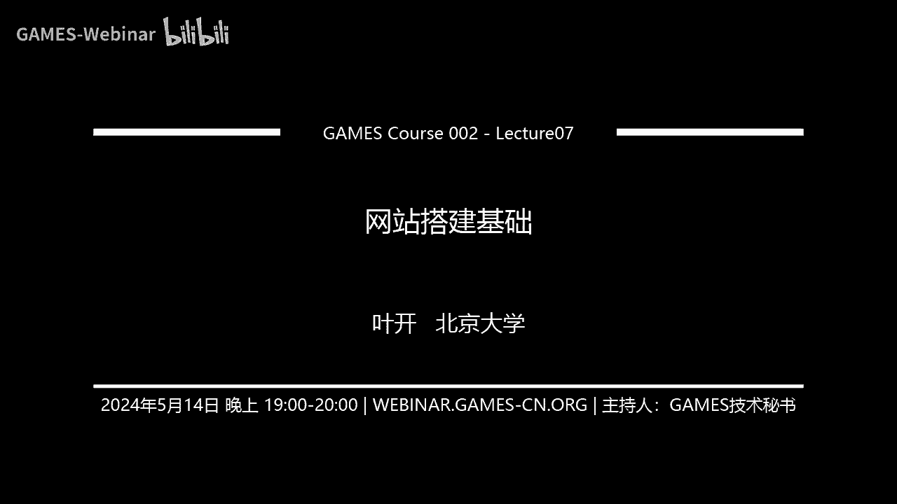

然后这一章可能比较简单，作为这个games整个这个图形学辅助的工具，下面的一环网站可能并不是，就是大家经常会涉及到，但是呃我们在安排大纲的时候，还是加入了这一节，就是作为一个小小的补充。

然后我们可以首先来看一下这个呃，本次课的一个目录吧，对啊我们大概会讲简单的讲一下这三个部分嗯，首先是web服务的原理，然后包括前端是什么，后端是什么这种呃，这些原理性的知识做一个概括性的介绍。

可能就是之前如果不熟悉啊，网页的它的一些服务的原理的话哦，那么我们会对这里做一些补充，但是如果要做一些深入的一些理解，或者展开的话，需要大家根据自己的情况去了解相应的框架，或者呃相应的这个这个库。

然后后面我们将介绍两个，这个主要的web服务的分类，一个是基于本地IP的，然后这种web服务一般来说是给呃，我们做科研开发，或者做一些这个本地开发的时候，会使用到的一些功能。

然后以及另外一种是开放了公网IP的，一个web服务，然后这种web服务的话，就面向的是就互联网上的所有用户，然后会有更多的一些配置和更多的一些要求，然后那么我们来具体看一下，呃首先的话web服务。

它其实是有一套复杂的机制的，可能我们平时在上网的时候，呃，比如说浏览网页，然后呃网页的一些呈现，以及网页上面的一些按钮，一些交互功能，在大家看来可能是一个非常自然的一个，呃一个东西。

但是实际上它背后有一系列复杂的一个机制，就比如说这张图，这张图是我从那个CSDN里找的，然后哦它上面标了网页，就是一次web服务完成的11个步骤，相当于说嗯我们首先作为我们自己是一个用户。

然后用户在浏览器上啊，浏览器是用户唯一能够直接看到的一个，web服务的一个接口，然后它在上面去啊看到，比如说网页渲染出来的结果，以及网页上可能有一些按钮，然后你去点击或者有一些文本框，你去输入。

然后做一系列的操作都由浏览器来这个处理，然后用户会把他的这些操作输入到浏览器，然浏览器负责哦，实际上就是比如说我要去哦，真正的服务器上去采数据，然后我要知道这个网页长什么样。

然后我要把这个网页给渲染到用户的电脑，屏幕上，这些过程都是浏览器内部已经帮你做好了，然后简单来说它就是通过呃，这个就相当于我们的网页，它往往是部署在比如说百度网页，那它就是部署在百度的服务器上。

然后比如说这个北京大学的主页，他就是部署在北京大学自己的服务器上，然后我们要显示这个网页，需要让浏览器向这个服务端的程序，发起一个请求，然后获取到它的网页，比如说长什么样，然后有哪些元素。

然后这些请求通过一系列的这个底层，它由TCP呃建立连接，然后呃TCP的上面一层，它其实是用了一个HTTP协议的呃一个格式，然后来把所有的请求和这个响应，全部给包装起来了。

也就是说我们其实比如说用户随便做一个操作，然后浏览器它其实做了，首先做了三件事，就是先建立了TCP的连接，然后呢他去把呃用户需要请求的一些数据，然后打包成HTTP格式，然后最后通过TCP传给这个服务器。

然后服务器内部也会有服务器自己的一个处理，然后它会解析用户，比如说比如说我访问这个网址，然后服务器会得到这个URL，然后他就去解析，根据这个网址，我要返回给你什么东西，然后他执行了567步。

然后得到了一个结果，再通过同样的方式经过网络，然后再传回给本地的浏览器，然后最后浏览器得到了这个HTTP格式的一个响应，之后，它就会把相应的东西给渲染出来，然后这就是一个整个的呃。

web服务的一个基本原理，然后比如说我们我们以CSDN的这个网页为例，然后呃像这个网页我们点进，比如说你在浏览器里输入这个网址，我们点进去的过程中，然后它显示出了这个页面，显示完成的时候。

其实它就已经经过了上述这11个步骤，然后呃得到了你最终的一个网页，结果，这个时候比如说你要再点一些其他的按钮，比如说我要点一个这个订阅专栏的这个按钮，然后实际上又会完成一次呃。

刚才一模一样的11个步骤的一个，这个从浏览器到服务器，再到再回到浏览器，然后被用户看见的这样一个流程，所以总体来说外服务其实没有特别复杂的原理，因为经过其实它经过这么多年的发展呃。

不管你用什么语言或者嗯比如说C加加或者Python，其实web服务都有了成熟的一些框架和API，相当于我们不用做非常底层的一些操作，然后就可以完成一个这个web服务的提供。

然后这里的话其实web服务是简单的，要分成前端和后端的，因为呃就像刚才这个过程，其实你可以明显的感觉到哦，这里可以，这里其实是有两个部分，一个部分是说呃我浏览器，我浏览器怎么把这个网页的内容给显示出来。

也就是说比如说呃像这个CSDN的界面，然后它其实是有它自己的布局，然后它字体的大小，然后包括它的一些按钮的形状，然后按钮的颜色等等等等，这些其实都是一个，相当于是可视化给用户的一个东西。

然后而比如说它的另一些功能，比如说这个，如果我们要在这个搜索框里去做搜索，这个搜索其实是在那个CSDN，它自己的服务器上完成的，也就是说俗称我们俗称的后端，就是说呃相当于前端。

它可能就包括用户和浏览器之间的这样一个，可视化和交互的一个部分，而后端更注重于服务器自己后面怎么处理，比如说我的一些特殊功能，我的一些网址的一些解析这种，所以我们基本上可以把一个web服务。

分成前端和后端两个部分来理解，然后前端的话其实呃大家可能已经听说过了，它有一些像是JAVASCRIPT或者typescript一样的语言，然后这个语言是运行在这个浏览器上的。

然后它其实就负责了你浏览器的一些复杂的，交互功能，然后以及我们其实浏览器，它有一个原生的一些功能，就是用来显示出我们浏览器上的元素的，比如说显示出这个按钮或者显示出这些文字，然后它都是需要通过一个。

一个这样的可视化框架，相当于呃如果如果你什么都就是，什么框架都不引入，只用浏览器原生的功能，那其实就是HTML5，然后加上CSS3这两种呃语言结合在一起，或者说这两种格式结合在一起。

然后组成的一个这个呃可视化的一个功能，然后但是其实现在也也有非常多，成熟的一些框架，比如说额这个U或者react这种呃，这种相当于是成熟的一个框架了，然后他能够给你提供一个哦这样的一个通。

比如说你通过JAVASCRIPT或者type script，然后再通过这两种框架，就能非常容易的去实现出。

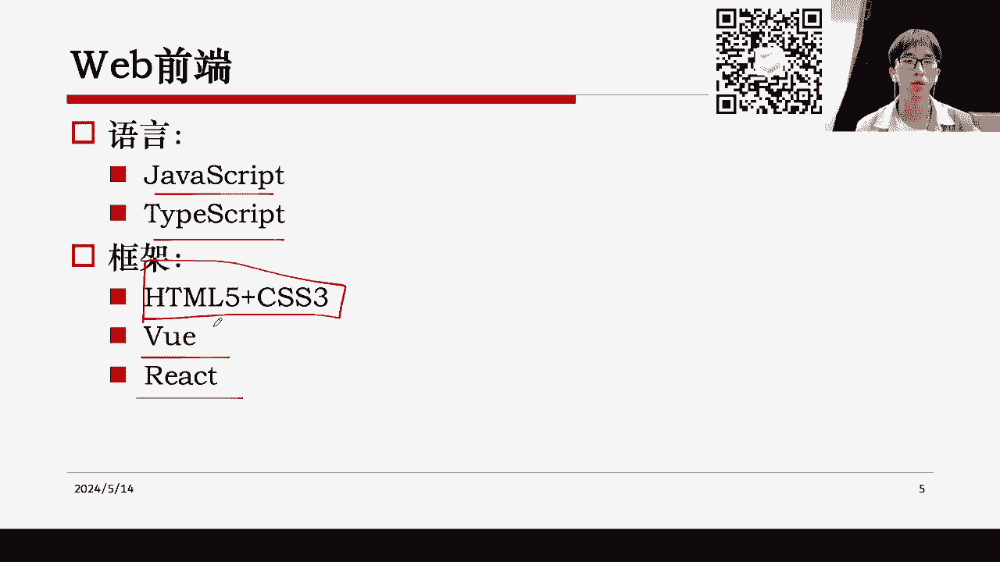

比如说像这里展示出来的这样一个界面，然后这个是前端的一个基本情况呃，前端的话最简单的来说，其实它的原生的HTML5加CSSS3这种语言啊，已经其实现在已经比较过时了，基本上没有人会就直接手写这种呃。

纯的原生代码，但是作为了解就是就你可能不直接写它们，但是如果你要做哦，一个网页的简单的前端开发的话，可能还是需要了解一下，然后比如说网上其实也有很多资料，像菜鸟教程。

然后他其实就做了一些讲解，然后以及，我们可以看到它的一个基本的格式，就是通过呃这样一个，比如说这样，这其实叫一个tag，然后以及这样呃，它有一个有一条杠的，这个这样两个东西组成起来。

它就是一个成对的一个态度，然后这两个tag，它中间的部分就是这个tag的呃内容，然后整个HTML它基本上都是用这种方式来做一，个渲染的，然后就是说相当于你后台你写了这些代码，然后它就代表了一个网页。

然后浏览器得到了这些代码之后，他把这些代码去解析起来，然后比如说如果他看到了一个title，那么他就知道这里应该放一个呃放一行字，并且这个字体要比较大，可能还需要加粗。

然后比如说如果你在这里放了一个video的tag，然后浏览器就知道，要在这里放一个内嵌的一个视频，然后这个视频的具体参数，其实它也可以从这些后续的参数里得知，然后总而言之的话。

HTML5还是一个比较简单的，然后呃，大家就是如果涉及到了web的前端的一些编写。

可以去简单的了解一下，然后但是实际上我们真正开发的过程中，可能还是会用一些更加复杂的一些框架，像是呃最著名的就是这这两种框架，然后也都有成熟的这个中文的文档，然后如果后续深入这个。

比如说你需要编写前端代码的话，可能就会涉及到这些，然后除此之外，web前端其实还有一些额外的一些功能，就是哦相当于如果你真的要做开发的话，然后它会涉及到更加复杂的，像是包管理，这个包管理指的是呃。

就比如说你要用之前我所说的一些框架。

甚至是要用一些比如说组件的库，然后比如说你的button，不想自己直接手写一个button，而是用一个别人已经写好的一个成熟的组件库，然后那里有button，有slider。

然后有各种各样的呃web前端的组件，这个时候这些组件库怎么样去管理，我们可能就需要一个这个专用的包管理工具，然后这个其实是呃有一个node点JS的运行时，然后加上NPM这个工具。

然后来做一个常见的一个包管理，然后呃这个东西在可能就相当于，比如说VC里面的VCPKG，然后哎我这里不太方便写，这样吧，就相当于如果在C加加里的话，可能就是这个呃VCPKG，然后在Python里的话。

可能就是这个呃pipe或者康达，然后像这种包管理的话，就是用可以用来帮你呃简单的去管理这个呃。

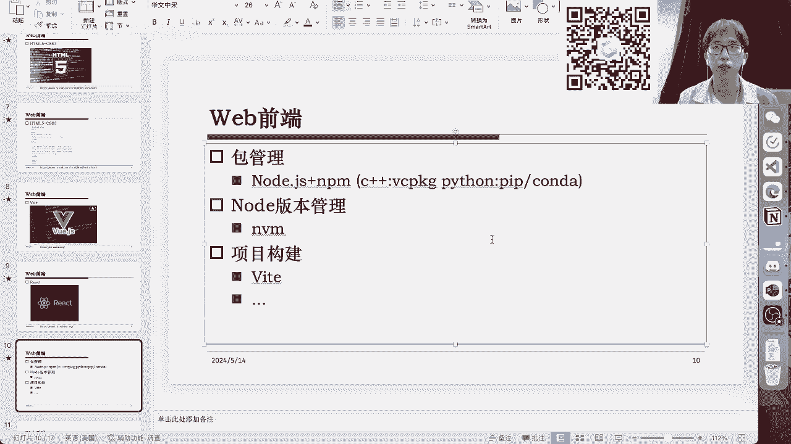

这个项目里涉及到的依赖库。

然后以及我们还有一个其实是包管理的，或者说是node的版本的一个管理，这个node是什么呢，node可以简单理解为它是一种运行时，就是说呃我的我的JAVASCRIPT。

它其实是运行在某一个版本的node上，然后呢这个node本身版本之间可能差异也比较大，然后导致你最后会需要去管理这个node的版本，然后这样就需要用到一些呃专用的工具，然后以及我们可能构建项目的时候。

需要用到一些模板，就比如说怎么样快速的去做一个个人主页，然后这种时候可能会涉及到一些，就是快速的模板的一个呃使用，然后这种的话可能就会有一个项目构建的一个，一些专用的工具，所以说前端其实还是比较复杂的。

然后嗯具体在学习的过程中，可能我们会呃推荐，就比如说你先了解一下HTML的基本基本功能，然后去了解一下CSS，然后最后在这个基础上去开始接触，两种框架中的一种，然后去做一个这个简单的学习。

然后这个是一个web前端的一个入门的一个路径，然后除此之外web其实还有它的一个后端，那么这个后端的话就是之前所说的呃，我把前端的请求发送给后端之后，我们后端要做些什么事。

然后可能这里就涉及到了两个最主要的东西，一个是服务器，服务器就是说你比如说发起了一个请求之后，比如说我想要呃，我在百度上我要点击一下搜索，其实这个点击的过程，就向服务器发送了一条请求。

然后怎么样处理这些请求，是需要后端部署一个专用的server的，然后这个server的话，比如说这里以Python语言为例，可能就有一些专用的框架，像flask或者jungle这种框架来专用的处理。

然后以及如果呃你的这个web服务更加复杂一点，它可能有这个数据库的一个需求呃，当然有时候你可如果是简单的web应用，它可以不需要数据库，就是呃你直接不不用任何数据库。

但有时候也需要呃使用一些简单的数据库，甚至是像MYSQL一样更复杂的一个数据库，然后这种的话额也是需要额，根据自己的情况来具体配置的，然后说了这么多的话，我们来看一下。

就是所谓的web服务到底对我们来说有什么意义，嗯之前也说到，web服务可以简单的分成，本地IP和公网IP的两种服务，所谓本地IP就是说呃这个web服务，它的地址部署在你的本地这个回环地址上。

然后只有你这台机子能够看见，或者说能够访问这些web服务，然后公网IP的区别，就是说相当于我们，比如说我们如果要把自己的一个主页，或者一个一个博客，或者一个这个公司或者学校的呃，这个主业给放到互联网上。

然后让所有人都能看到的话，你就需要给你的这个呃web服务部署到公网上去，然后这个公网的话呃基本上是呃有两种形式，它一一种形式是一个数字组成的一个公网的IP，然后另一种形式就是我们日常能够见到，这种网址。

然后嗯基本上呃这两种web服务，各自有各自的特点，然后也有各自的不同的用途，像是前面这种本地IP啊。

我们其实经常会遇到呃，也也不能说也不能说一定经常会遇到吧，但是在我自己开发的过程中，我其实会经常性的使用到，为什么呢，这是因为呃，我们经常，比如说像我自己做一个深度学习的时候。

然后有时候这个服务器就是我们之前学到的，这个服务器，它是一个远程服务器，然后你必须呃用比如说vs code去做一个远程连接，或者用命令行去做一个远程连接，然后这种时候。

比如说我们是很难在服务器上打开一个，可视化的图形窗口的，然后呃导致说，比如说我需要做一些可视化的时候，我就没有办法说我在本地运行，因为我本地运行不了这个代码，我只能放到服务器上运行。

但是服务器本身又没有办法，比如说呃它它没有一个图形界面，没有办法显示一些可视化的一些呃功能，所以这种时候呃，我就会用到这个web服务的一个功能，就比如说我把我在我在远端的服务器上，部署一个web服务。

然后把它的端口转发到我的本地，相当于这个服务是在我本地完成了一个部署，然后比如说呃像这一行Python命令，就我自己开发过程中遇到的，然后呃它里面是打开了一个web服务。

这里可以看到在本地的这个回环地址上，打开了一个web服务。

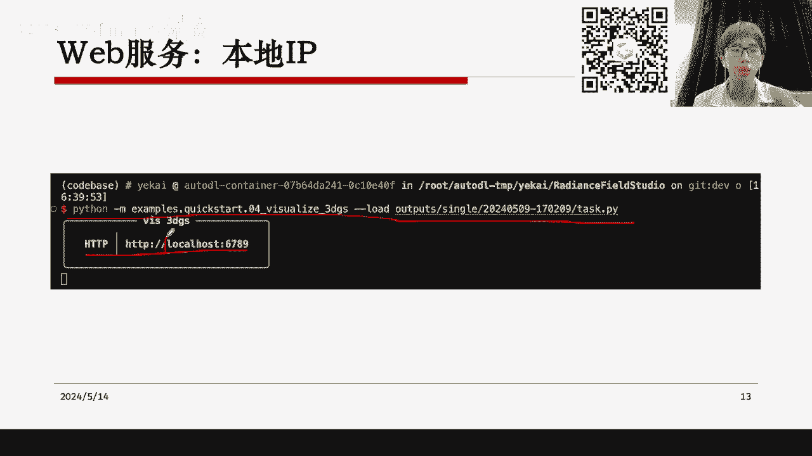

然后如果去点击它的话，就会得到一个就会你就会在浏览器里，然后打开一个这样的一个界面，然后并且可以进行一些可视化的一些交互，然后这个就是啊，这个其实说的就是我们的一个本地web服务的，最主要的功能。

就是当你在开发自己的一一些工程的时候，可能说呃，你的服务器上不能直接打开一个可视化的界面，这个时候你就需要嗯去布置一个简单的web服务，然后把这个web服务转发到本地。

这个转发过程vs code会自动的帮你做，然后呃经过这个转发之后，呃，本地的这个你你就可以在本地的浏览器上，打开你的一个交互界面，然后在上面去和远程服务器渲染的结果，做一些交互对。

然后这里可能呃就如果我们要自己去编写代码。

还是挺困难的，但是基本上其实有很多成熟的这种呃代码框架，比如说我这里列举一个哦，Nerve studio，这是一个NERF相关的一个代码框架，大家可以不用具体的知道这个框架是干什么的。

但是呃但是它的基本功能就是说，它可以把我远程服务器上的一些，三维的一些数据，然后给它显示到我的一个本地的浏览器上。

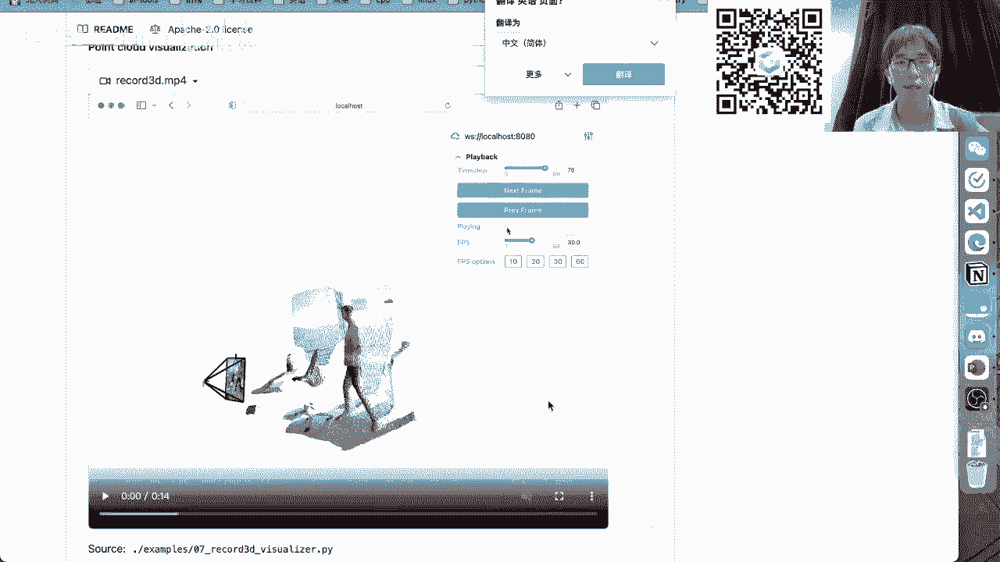

那么比如说他的read me里给出了几个例子。

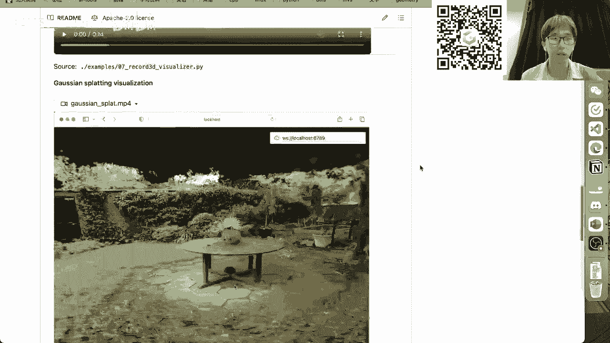

然后我们可以简单的看一下对，像是这个例子，他就是在远程呃重建了一个三维场景，然后呢这个三维场景呃，背这个背这个框架给他部署了一个web服务，这样我们就可以在本地打开浏览器，在浏览器里拖动整个场景。

去观察这个场景的一些可视化的一些情况，然后这个可能就是一个最主要的一个功能，然后以及你甚至可以，就是你在你在你的网页端，设置一些可以调整的一些系数或者参数，然后这些参数会和就是后端的这个服务器。

去进行交互，然后等于说你只需要在本地的网页上去，简单的点几个按钮，或者调整几个数据，然后就可以去操纵你在远程服务器上的，一些三维的一些资产。

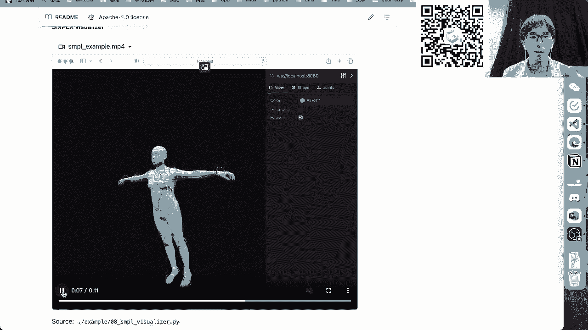

然后呃这个可能是一个Python语言的一个库。

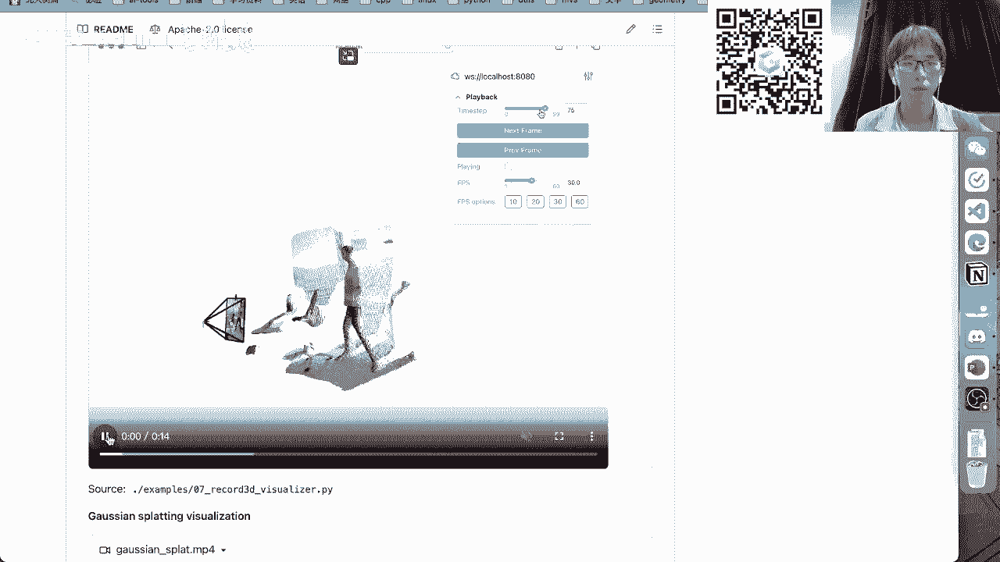

大家可以就是根据自己的需求。

比如说如果你确实有一个呃，这种需要做web服务的一个需求，比如说你在你的远程服务器上，有一个这个三维的，或者有一个或者有个图形学算法，得到的一个结果，然后你需要去对它做一个可视化。

甚至是你需要跟他去交互，这种时候取决于你使用的语言，你可以自己决定，就是使用这个语言下的哪一个框架，因为像是Python，比如说这个框架它就是一个Python的框架。

然后因为我的代码用的也是Python，所以我很自然的就直接用它了，然后像是比如说如果你用你用的不是Python，你用的是C或者C加加去做了一个呃开发的话，然后你遇到了这个需求，可能嗯应该也有很多。

就是C或者C加加的这种呃，web服务的一个一个一个库，然后大家可以在GITHUB上也能找到，然后就直接去使用他们提供的一些API，然后把你的远程服务器上的结果放到本地去交。

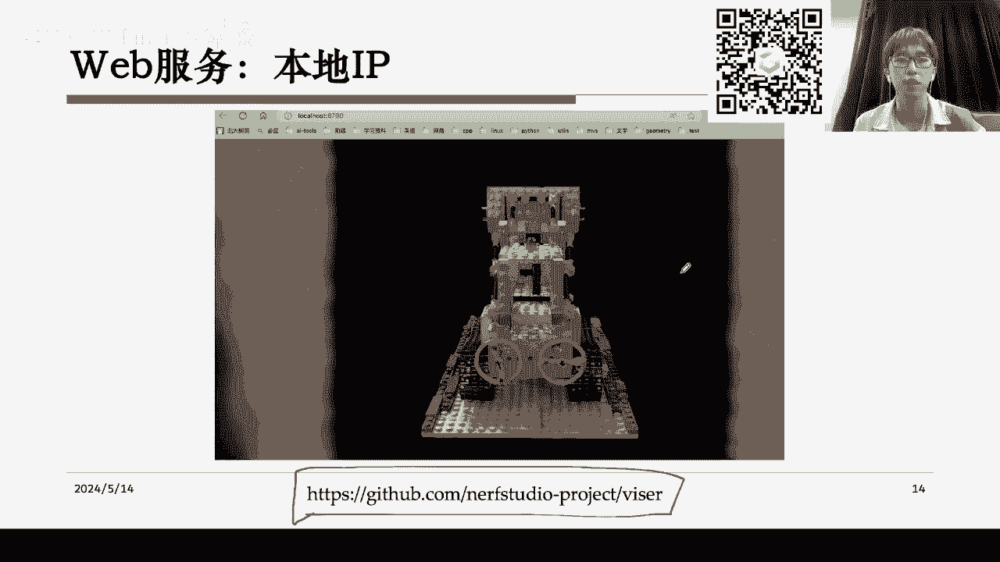

互可可视化就可以，然后比如说呃这个也是Python的一个功能，叫jupiter notebook，可能大家都已经比较熟悉了，呃，这个jupiter notebook的话呃对于Python开发人员来说。

其实还是蛮熟的一个东西，因为它其实是提供了一个呃，最主要的就在对于我们初学者来说，可能他最主要的一个好处，就是说它能够把呃，我远程渲染出来的图片，直接放到这个呃网页里去显示出来。

而不是说像我们之前在命令行呃，很难直接查看某一张图片对。

然后jupyter notebook的话，其实本质上也是一种我刚才提到的这种呃，把web服务放到本地去转发的一个呃，这样一个框架，然后它也是提供了一些非常方便的功能，比如说你可以在网页里去编写代码。

然后或者在网页里去查看图片，去和这个图片去做交互，比如说有一些库，它其实是可以就是在jupiter notebook里显示一个，可以交互的一个东西，就好比说下面这个三维物体，你可以拖动它。

你可以直接在网页里拖动它，然后就可以看到一些更丰富的一些可视化结果，总体而言总结一下我们的web服务，它部署在本地IP的时候，基本上都是为了项目开发而服务的，可视化其实是图形学里非常重要的一环。

然后我认为就是当我们实在比如说你遇到困难，比如说你在远程的服务器上，没法做一个直接的图形界面，没法直接可视化的时候，使用web服务其实是一个非常方便的功能。

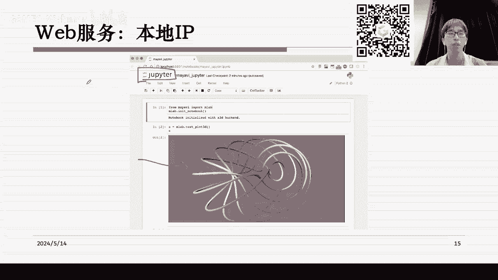

然后这里代码的编写就一个很简单的例子吧，以Python为例，就是说比如说我是我自己的程序，然后我想要提供一个web服务，这该怎么做呢，就其实Python有一个非常简单的一个命令。

就是任何你只要安装了Python，你就可以输入这个，然后打开一个简非常简单的本地web服务。

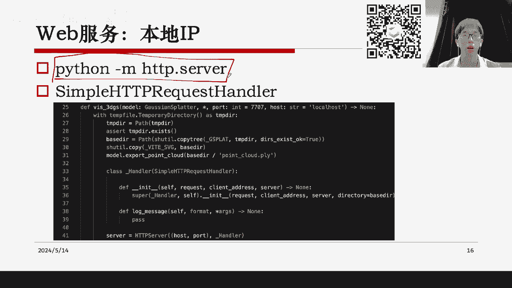

然后这里可以举个例子，嗯对比如说我在这里，我在这里，嗯打开一个，打开一个这样的web服务，然后呃大家都可以看到，就是我指定的端口是7007，然后我在浏览器里，简单的输入这个呃7007的话就可以看到我。

我把这个我的这个根目录下，所有的文件全部列出来了，然后这种情况下，其实就是你成功的打开了一个web服务，然后你可以去呃，比如说点击里面的某一个HTML文件，然后就可以得到一个全新的网页。

然后这里我可以我可以举个例子，就是，就是我在本地打开一个用来可视化，三维场景的一个网页，然后大家可以看到这个目录下，是有一个叫index的HTML的，这种情况下呃，我们的网页会直接去解析到它。

呃换个端口吧，好像有点卡，哦我知道了这个这可能不能用这个来做例子，因为这个，这个是用了一个框架，所以不能用这个来做例子，好吧哦，那换个例子吧，就是就是比如说我这里。

如果用我们我刚才提到的那个node点JS的运行时，去运行这个地方。

嗯然后就可以在我的网页里打开一个这样的。

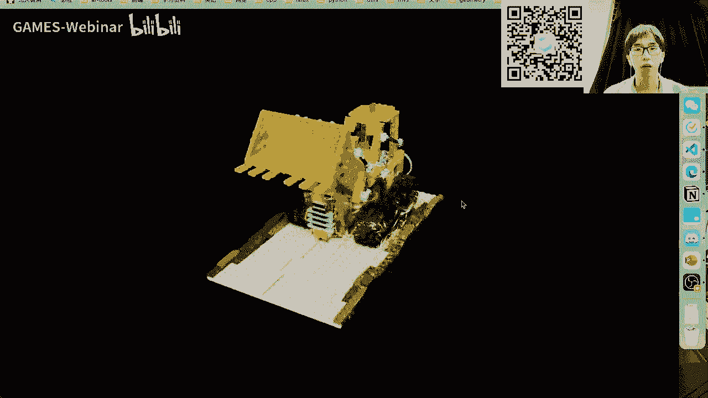

一个呃三维的可视化的一个窗口。

然后并且你可以去拖动它，去查看里面的细节。

对这个就是一个很简单的一个呃应用的例子。

然后这个的话基本上就是本地IP的一个呃用途，那么实际上，当我们遇到一个，需要把你的项目给放到互联网上，或者把你的呃个人主页给放到互联网上的时候，这个情况下，其实就需要额部署我们另一种web服务了。

这种web服务叫这个公网IP的web服务，然后它可能有一些更加麻烦的配置，就是它需要去呃配置你的域名，然后配置你的这个，如果你你需要一个安全的HTTP协议的话，你就需要一个呃。

支持这个HTTPS的一个证书，然后并且你需要购买一台专用的服务器，然后呃这个这是有这三个东西之后，你可能需要用这个额NGINX，然后去配一个端口的转发，或者去去相当于是去代理一下呃。

整个web服务的一个请求，当然这些就过于复杂，其实呃已经超出了我们同心学这个呃辅助工具，需要去讨论的一个范围了，但是其实公网IP还是有另一些，非常简单的部署方法，就是说我们可能大家可以见到有一些呃。

像是个人主页好。

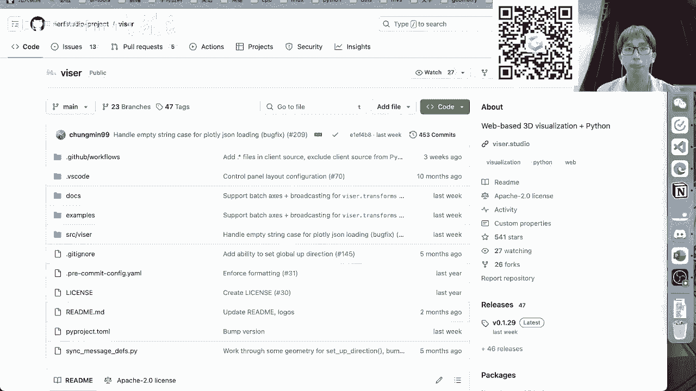

这里举个例子，你想想举个谁呢。

哦举个陈老师的例子吧，对像陈老师的这个个人主页，其实这种主页就可以通过我们的一个这个呃，公网web服务来完成支持，然后像是我自己的一个主页的话，呃其实是用了他的一个框架。

就等于说我一点都没有编写前端的代码，然后去完全的用这个框架，呃我找一找，这里GITHUB上其实这种库蛮多的，就是它提供一个直接帮你一键生成网页，然后你只需要改动一些非常简单的地方。

就可以呃得到一个你自己的主页这种东西啊，包括包括我们可能在比如说一些项目的主页上，能够见到类似这种的主页，然后它上面可能有很多demo。

然后呢有一个GITHUB的跳转链接，然后可能有一些这个呃有些可视化的结果，然后长得其实都很像这种。

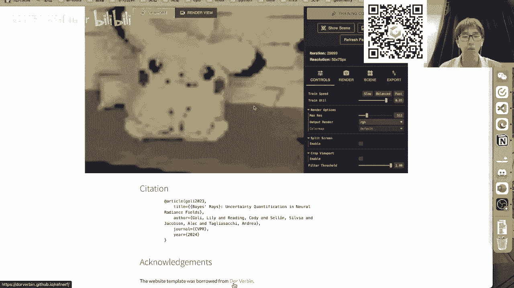

其实也都是用一个呃GITHUB的配置的模板来生成，那么具体来说，其实GITHUB配置它是一种特殊的GITHUB的提供的服务呃，原理就是说GITHUB提供这个服务器加上域名，加上证书，就这一切他都包了。

然后你只需要去根据呃GITHUB配置的一些要求，然后简单的配置一下你自己的项目信息，就可以完成，然后呃这种项目主页或者包括一个呃文档主页，其实都可以用这种方式来配置。

然后这里的话基本上就是我们可能涉及到的，公网IP的一个呃，主要的一个应用，OK那么总结一下，其实呃我们这个涉及到的这个网站搭建基础，其实呃主要包括几个部分，第一个部分就是，如果呃你需要搞清楚你的项目里。

是否需要用到网页服务的这样一个呃事，就比如说嗯我们本地IP的web服务，它其实是基于这个本地端端口的转发，然后他的面向对象是，你在开发这个自己的程序的时候，需要使用一些端口转发。

然后来完成你在远程服务器上的可视化，这种时候是需要本地的一个web服务，然后另一种情况是说，你有你的项目或者你的个人主页，或者你的个人博客，或者你的项目文档需要挂在互联网上的时候，你这个这种时候。

你需要一个公网IP的一个web服务，然后嗯这两种需求，基本上就涵盖了我们图形学中涉及到的，所有的网站配置的一个需求，特别是呃比如说对于公网IP来说，特别是比如说我们有一个项目需要做一个demo。

然后这个demo要放到网上可以给大家看，然后这种时候，你可能就需要一个公网IP的web服务，然后或者说呃，你本身要写一个很简单的可视化程序，但这个可视化程序没法在远程服务器上运行。

有时候你可能就需要一些可视化的方法，去把它放到本地的浏览器上去显示，然后这两种情况呃基本上都涵盖在这里，然后大部分时候我们其实不需要去搞清楚呃，他们其中的细节，然后你可以直接用你自己使用的那种语言下。

对应的一些web服务的一些库，然后就可以简单的完成这件事，然后但是呃面对一些复杂的需求，可能就需要我们去了解一下呃，具体的web服务原理，包括它的前端，然后包括它的后端。

甚至你需要去学习具体的前端语言和后端语言，然后去对它做一个整体性的开发，然后最终比如说咳我自己的项目经历是呃，曾经就是有有时有一个呃，相当于我们做一个课题的时候，用到了一个小程序开发的一个功能。

然后那里其实就相当于是一个web服务了，因为微信小程序它其实是涉及到你的呃，比如说微信小程序的界面怎么写，然后前端怎么显示，然后以及后端连接一个数据库，然后这里可能可以给大家简单的看一下。

然后这个就是当时用jungle搭建的一个数据库，然后里面可能会有一些呃，管理员支持的一些功能，然后像这些呃这些功能的话，基本上当时都是用Python加jungle，这两个框架来完成的。

然后这个项目它涉及到的前端和后端，就更加复杂一点，然后相当于我们如果真的有这么复杂的，比如说编写小程序的需求，可能才需要你去仔细的了解web服务的原理，然后仔细的了解它的前端和后端。

甚至说去学习这个微信小程序，开发的一个呃文档，然后除此之外的大部分情况，我们都可以通过呃，简单的使用别人提供好的API和库来完成嗯，OK那么今天的内容其实非常简单。

就是简单的给大家介绍一下web服务的原理，然后总体来说呃，我们图形学中涉及到的外服务并不是特别多，然后大家可以着重把握，就是我举我，我这个在本地IP和公网IP举的两个例子，然后最后我们本次没有作业。

然后大家下次应该会呃，下次会布置一次作业，然后今天的课程就可以先到这里，然后大家有什么问题可以在弹幕告诉我，OK网页显示三维模型的例子哦，我这里我想一想，嗯这里举个例子吧，就是比如说嗯。

比如说我们本地怎么查看三维软件呢，我们可能是用一个这个cloud compare呃，像是我自己会用这个软件，然后或者你你们可能涉及到一些math lab。

或者涉及到一些blender，然后这种软件。

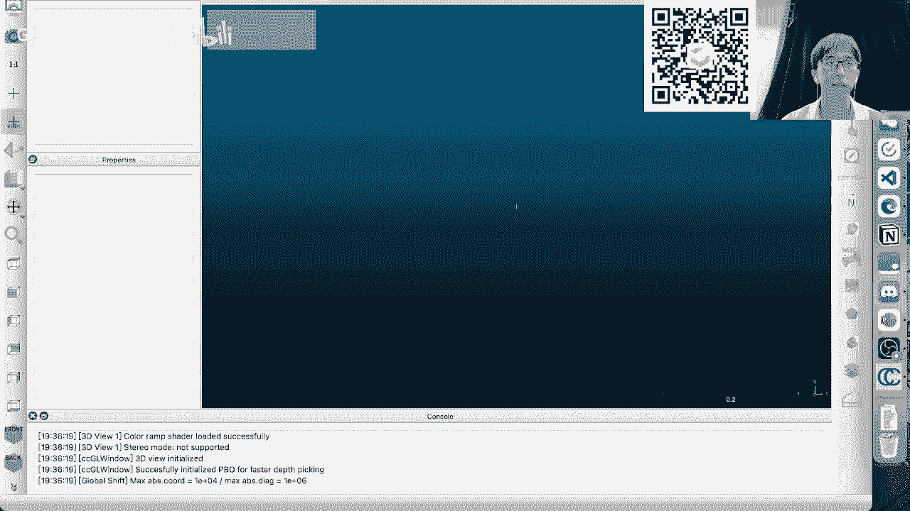

它其实是没有办法在远程服务器上打开的对吧，然后比如说我想看一个点云，或者我想看一个mesh，它其实是不能够在这个呃，它就是你其实你需要把，比如说比如说我这里有一个工程。

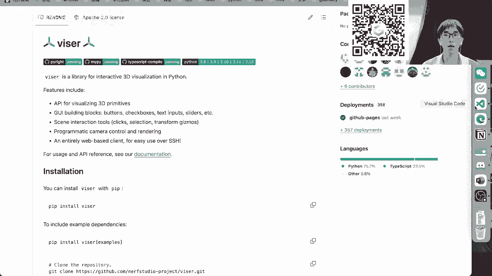

然后我在上面有一个呃这个点云软件呃，有一个点云文件，然后我我要去看这个点云文件长什么样，我可能就要把它从服务器上下载到本地，然后用本地的这个呃这个这个东西，这个可视化软件去打开，但是而另一种方式。

就是说我可以直接跳过下载这一步，而是我通过在远程服务器上部署一个web服务，然后我把这个web服务转发到我本地的端口，最后我在本地的浏览器上去打开，这样也是一种方式嗯，这里具体举一个例子的话。

就比如说就比如说我呃我找一个，这里有一个东西叫3D高斯嗯，他反正不管怎么说，它是一种这个类似点云一样的一种三维的，这个呃物体物体对象吧，然后呢我们要怎么对它做可视化，其实比如说我这里的，我这里的例子。

就是我这里有一个代码，然后它能够呃，直接在这个远程服务器上去部署一个web服务。

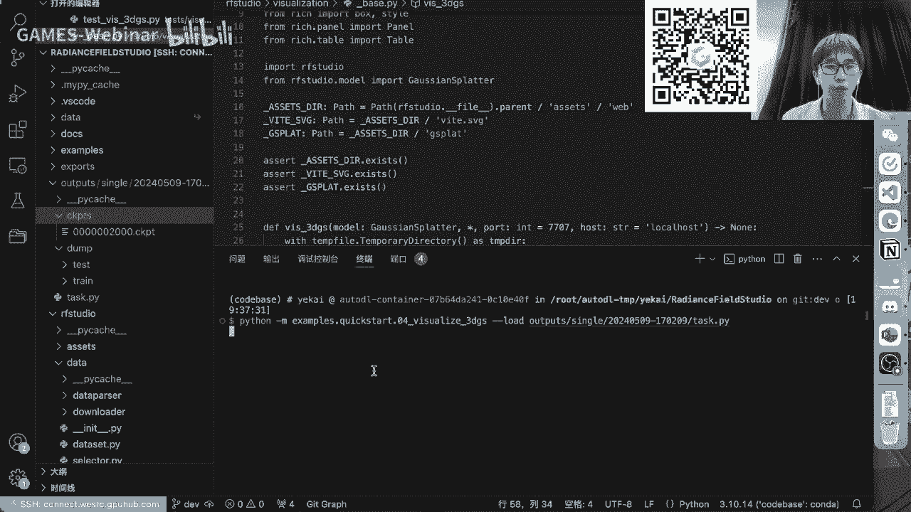

然后部署完web服务之后呃，我点击这个主页，然后就可以去做一个哦它的一个显示。

然后这个显示是在我本地浏览器里可以打开的，并且我可以去对它做一些交互。

去做一些查看，然后以及呃我们如果比如说你涉及到的是呃，普通的那种mesh或者点云的话，然后呃相当于我这里reference到的一个呃一个库，它可以完成这件事哦，那么我们来可以来具体看一下。

我这里应该也有他的一个demo，我来看一下，这个demo要怎么修。

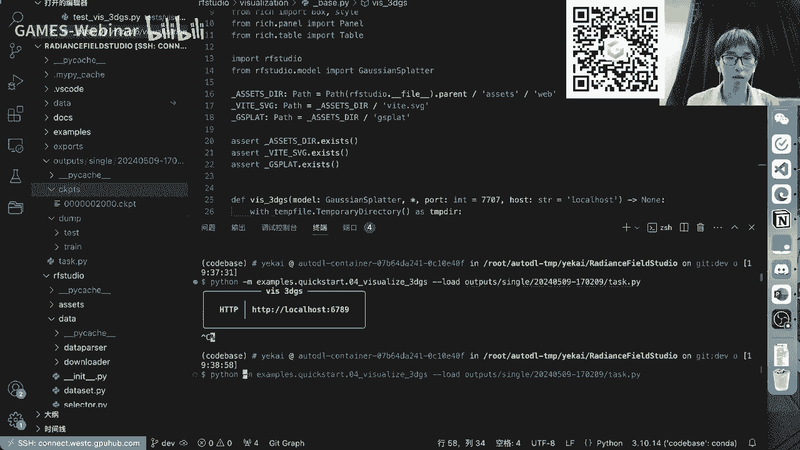

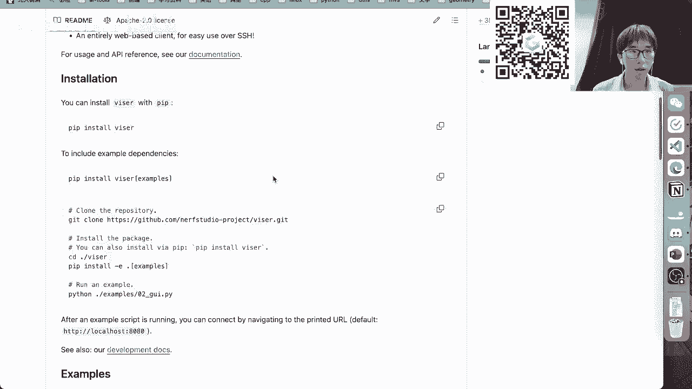

有这玩意，OK那这样吧。

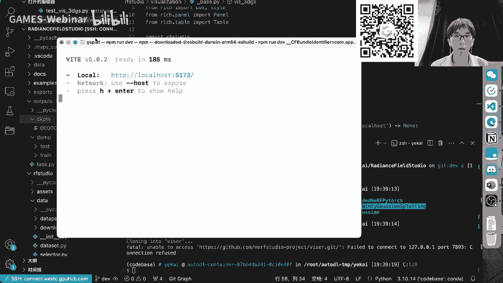

好像不是特别方便，我试一下，我在本地区，OK然后这样应该就可以去查看了，哦我知道了，应该还可以看一些别的例子，比如说，啊好吧，不好意思，我这边好像暂时看不了这个例子，就是基本上就是刚才那个例子吧。

就是我们可能可以，就是比如说这这里通过一个简单的调用，然后就可以产生一个端口转发，然后我们在本地就可以打开浏览器里的一个，去做一个显示，相当于说嗯我们我们正常来讲，你应该通过本本机上的一个渲染文件。

或者一个三维查看文件去打开一个点云或者match，但是可能呃这种方式如果不奏效，比如说你的远程服务器没法做这件事的时候对，然后你就你就应该对，可以通过一些别的方式，比如说最最简单的就是把它下到本地。

然后重新查看，然后第二种就是说我，我我觉得可以提供一些方法，然后你在本你在远程打开一个web服务，然后这种情况下，我们可能就可以在本地更方便地查看，OK然后那么今天基本上我们就到这里。

然后大家要是还有什么问题的话，就可以呃扫描我们的二维码，或者到我们games的002的一个主页上去，添加这个群，然后我们可以在群里做一个打印，然后呃如果没有其他问题的话，那么我们今天就到这里。

