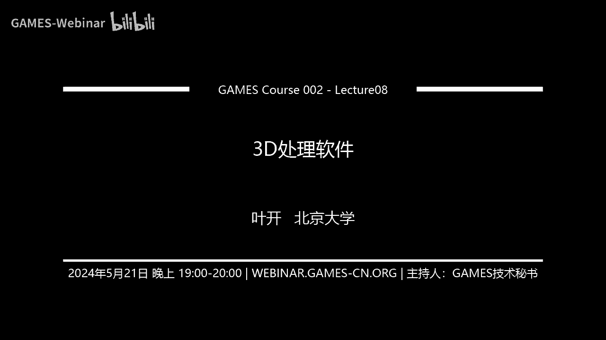
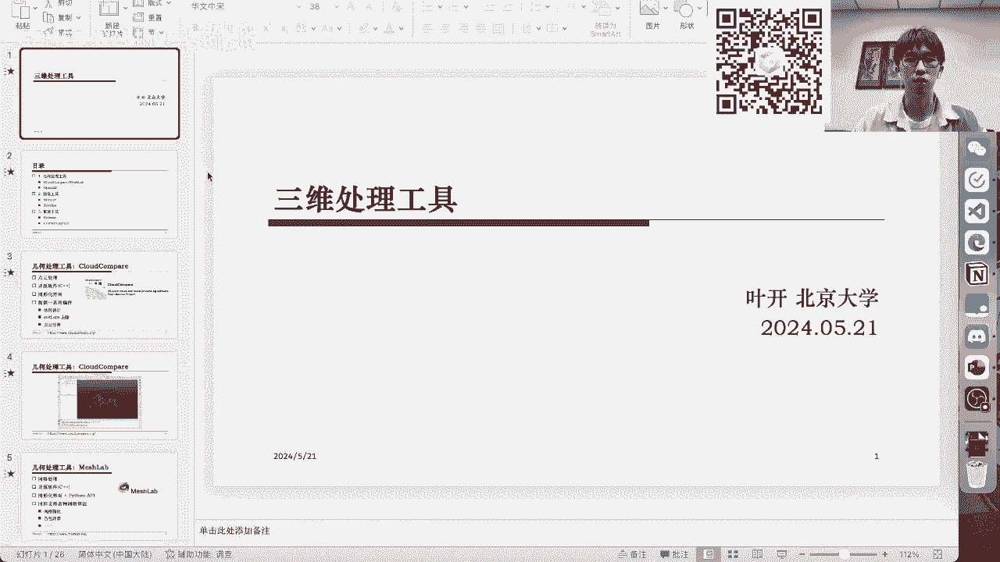
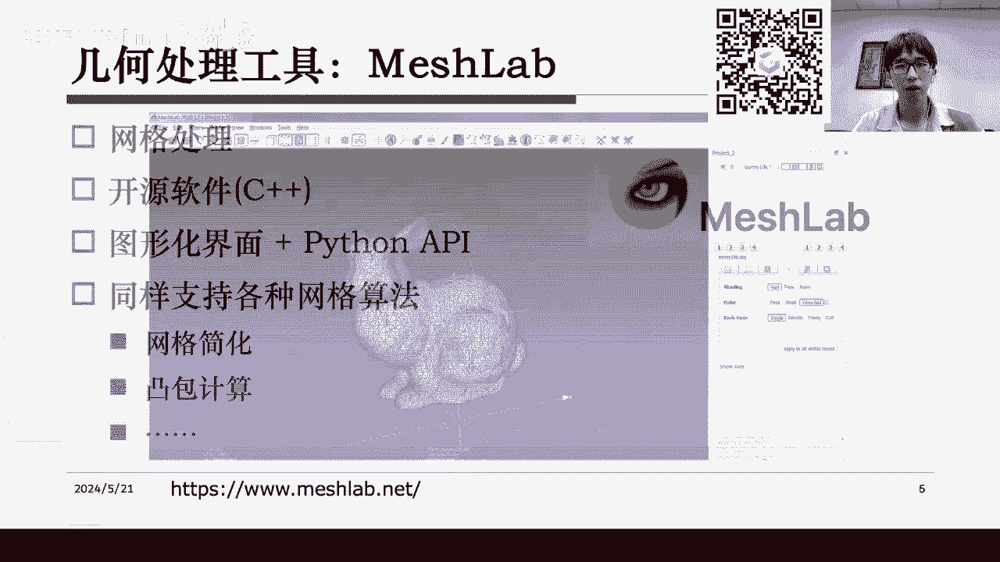
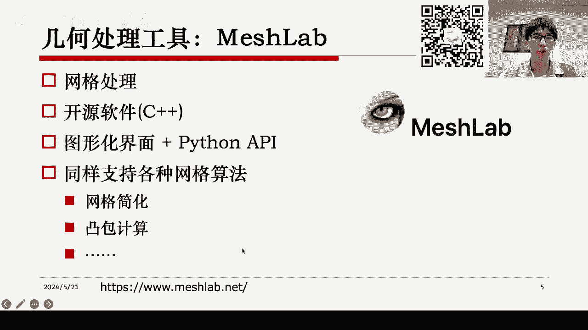
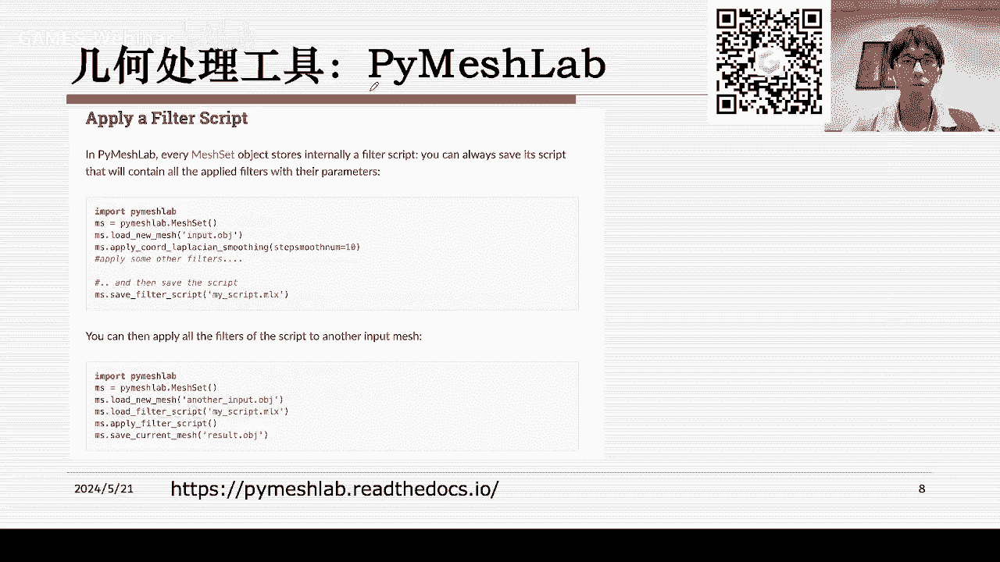
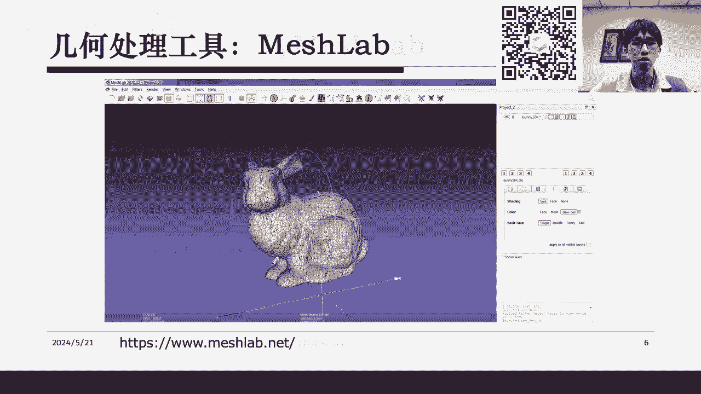
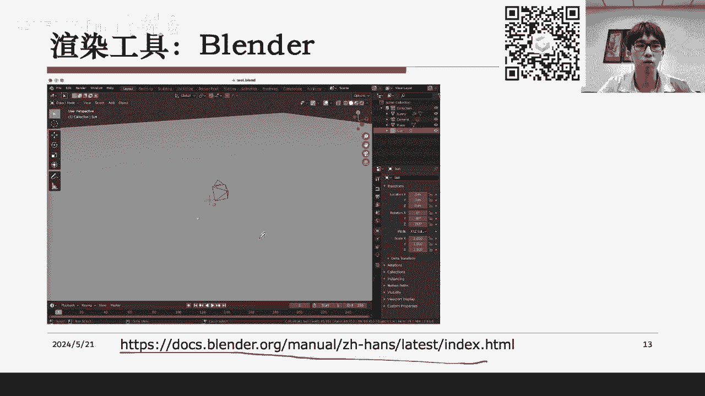
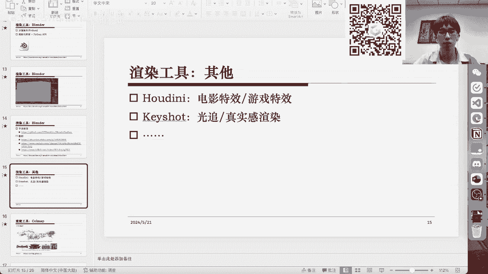

# GAMES002-图形学研发基础工具 - P8：三维处理软件 - GAMES-Webinar - BV1cC411L7uG

大家好，今天是我们Games002课程的倒数第二节课。

然后我们根据大刚的安排来讲一下，三维处理的工具，关于三维处理工具其实是指的是我们图形学中，遇到的一些专门用来做比如说几何处理，做渲染和做一些重建的软件。

然后我们今天的内容大概可以分成这三个部分来进行。

首先我们会介绍一下基本的几何处理软件，然后包括Cloud Compare，然后包括MeshLab这些比较知名的软件，然后其次我们会介绍一下怎么样用一些其他的，比如说吊库的方式来做结合处理。

比如说使用Open3D相当于是一个代码库，然后第二部分我们将介绍渲染工具，然后这里会有一些常见的比如说像Blender，或者KeyShot这样的渲染工具，然后第三部分我们最后将会介绍一下。

几何重建的一些工具，包括最常用的CodeMap和一个商用软件，Context Capture，然后这样的话，基本上就是我们今天的全部内容，然后最后会有一次作业的布置，好的。

首先我们来讲一下几何处理的软件，Cloud Compare这个软件其实它从名字上大家就可以看出来，其实是用来做点云的一个处理的，只不过它也支持一些额外的功能，比如说去做一些网格的处理。

但它最主要的功能是对3D的点云去做一个几何处理，比如说包括你想要去对这个点云做一些变换，然后对它做一些过滤，都是可以用Cloud Compare这个软件，然后这个软件它是一个开源的软件。

可以在网上找到它的C++源码，所以等于说其实如果你要写一个C++的程序，你是可以直接去调用它的一些函数的，然后同时它作为一个软件，本身是自带图形化界面的，所以给我们一些很方便的功能。

比如说它有一系列插件，能够比如说你给出一个点云，然后它就能估计它的法项，然后或者去做一些点云的过滤，比如说剔除掉一些异常的点，然后以及做一些点云的分割。

然后这个插件在Cloud Compare里还是挺通用的，就是可能它有一系列的标准插件，然后你也可以做一些实现一些自己的自定义的插件，然后一系列插件组成了Cloud Compare的一个扩展功能。

然后它的基础功能就是一个点云的显示和查看，比如说像这幅图里面，展示的是用我的电脑在Mac上，直接对这个点云做的一个显示，然后Cloud Compare基本上就是一个这样的3D查看界面。

然后它最基础的功能就是显示点云，然后显示坐标轴，然后显示一些比例尺，然后你可以在左侧和上方，它有很多按钮，然后这些按钮都是用来做一些点云编辑，或者一些点云的处理，然后具体的功能大家可以查看。

这个Cloud Compare它的一个主页，然后这个东西它应该是，基于OpenGL来做的渲染，然后底层应该是调用了C++的一个处理库，应该是PCL处理库，然后刚才的这个Cloud Compare。

它其实基本上只能做点云的一个处理和渲染，然后但实际上我们可能平时更通用的一种数据格式是，三角网格或者说就是MeshLab，这名字里的Mesh，然后MeshLab的话它就比刚才提到的。

这个Cloud Compare更加通用一点，MeshLab不仅可以去做点云的一些处理，它也支持对三角网格进行一些处理，它本身最主要的功能，都是集中在对网格的一些处理上，然后它本身也是一个开源软件。

用C++编写的，并且除了图形化界面以外，MeshLab实际上提供了一系列的Python API，也就是说你甚至可以在Python的代码里，去调用MeshLab的一些API，然后实现你想要的一些功能。

就不需要在图形化界面上进行手动操作，然后MeshLab它也支持各种网格算法，因为毕竟它本身就是专门做网格处理的，然后包括一些网格简化，然后包括一些网格的一些图包计算，然后这些的一系列功能。

然后也可以在MeshLab的主页上，查到它的官方文档，然后这里展示一个MeshLab的例子。

然后这个就是MeshLab的一个界面，然后这图是我从网上找的，大家可以看到它基本上显示网格，就可以像图中这样的形式，然后这里是一个Stanford的，它的一个Bunny的一个模型。

然后这个也是作业中会用到的一个模型，然后它在这里可以显示出这个网格的，首先是每个顶点，然后其次它把三角面片，以这种wireframe的形式显示出来，并且MeshLab能提供的最重要的一个功能。

就是说你能把这些网格给显示出来，并且你还能去选取这些网格，对它做进一步的操作，比如说对它做剔除，或者对它做一些其他的一些变换，然后像图中这个例子，其实就是用了MeshLab的一个一系列功能。

比如说在这里列出来的，实际上是一系列选取的功能，然后它图中显示为红色的这些三角面片，都是已经被选取出来的，然后可以看到其实作为一个三维的，这种可视察看软件，然后MeshLab最主要的功能就是。

你能够直接在上面去编辑3D数据，然后比如说对网格去做一些选取这些功能，可能如果我们要从代码上其实是很难实现的，所以尽管有时候大量的库，已经提供了健全的一个集合处理的函数。

但是真正需要去做一些可视化的分析的时候，可能我们也会借助到像MeshLab这样的一个，带有图形界面的软件，然后我们去做一些这种能够直观的，去做一些网格的一个编辑操作，然后这个基本上就是另一个。

几何处理工具MeshLab，然后这里我可能每一个软件，不能够特别细致的去介绍，因为大体来说他们的功能都是类似的，就首先他们有一个3D查看的功能，然后其次他可以对他所支持的数据结构，进行一些简单的编辑。

然后进行一些复杂的或者说复杂的处理操作，比如说刚才提到的网格简化，图包计算或者说一些更加复杂的一些网格算法。

然后这里的话我们可能重点会把比如说，如果讲几何处理工具，我们会讲有哪些几何处理工具，然后他们的网站是什么，然后他们的大概用法是什么，然后给大家做一个相当于工具书式的一个引导，就是根据自己的需求。

然后比如说你要处理网格，你就可以去找MeshLab工具，然后你要处理点云就可以去找Cloud Compare的工具。

然后他们的一些特点也在这里列出了，就是有的软件它是开源的，然后你就可以直接去看它的代码，甚至修改它的代码，把它的代码放到你自己的项目里去，然后有的软件它可能是商用的，这个时候可能对。

就是如果像商用软件的话，后续会遇到一些版权问题，就是如果你在没有许可证的情况下，肯定是有版权问题的，然后这又取决于这个项目具体的一个情况，比如说如果我们做一个学术论文的话，基本上要用也是用开源软件。

然后如果要用商业软件的话，是需要去购买它的使用权的，然后这里也是一个区别，然后其次还有一些区别就包括，像是图形化界面以及它的API支持上的区别，就是有的软件有的工具，它可能并不是一个软件。

它没有一个图形化的交互界面，而另一些工具它可能有图形化交互界面，但是没有方便的API调用，就比如说cloud compare，它可能只能支持，它确实有一些python绑定，但实际上本质上来说。

它还是一个纯c++的一个软件，然后你可以调用它，但是你也只能用c++的方式去调用它，如果你想用python的方式调用它，那就需要一系列复杂的过程。

然后另一些软件它是有直接的python API能够使用的，比如说我们这里的mesh lab，然后这个软件的话，你基本上就可以既方便的用c++去调用，然后也方便的用python API去调用。

然后最后我们会给每个工具介绍它的大概的，比如说一个例子，然后以及一个支持的算法，然后这个基本上就是我们今天讲课的一个逻辑，因为更主要的是一个提纲式的形式，然后每一个工具大家想查看它的具体文档。

都可以通过下方的网址来进行查询，然后说到说回mesh lab，然后它是有一个python绑定的，这个绑定工具就叫py-mesh-lab，然后这个东西应该是比较方便。

就能用pipe或者conta给安装起来，然后安装了之后，你实际上就可以去调用mesh lab的一些内置的一些，函数了，比如说像这里展示的这个例子，它可以首先import了mesh lab之后。

然后你就可以去做一些比如说load mesh这些操作，或者说计算它的图包这个操作，然后以及把当前的mesh保存下来，然后做一系列的编辑，这些编辑都可以通过python。

这个python函数调用的形式来完成，然后py-mesh-lab它的一个文档也在这里，然后里面可以列出它的所有支持的一些API和功能，然后这里有一个例子，就是我觉得还是蛮特别的，对于这个集合处理来说。

因为这里的例子是，它在讲py-mesh-lab的一个特殊功能，就是说它可以定义一个过滤器，然后这个过滤器是怎么说，它可以大家可以看这一段。

然后它是比如说首先我用py-mesh-lab生成一个mesh set，然后它可以在上面做一系列的操作，比如说这里有一个可以坐标做一个拉普拉斯的平滑，然后可能中间省略号的部分，它还做了一系列额外的操作。

最终它把这一系列的操作，都可以通过save filter script来保存成一个本地的文件，然后这个文件里就记录了你所有做的这些操作，然后下次你想要复刻同样的操作的时候。

你就可以直接load来这个文件，然后就可以去对它做同样的一系列操作，而使你的输入的网格在不同的网格上，也就是说它提供了一个方便的定制脚本的一个功能，然后我觉得就这种功能。

其实还是在mesh-lab里比较实用的，所以最终总结一下我们mesh-lab的话。

它其实兼顾了它的图形化界面，和它的一个编程化的一个管理方式，然后你可以先在这个图形化界面中做一些操作之后。

然后使用一些它的API去做一个调用，可视化的界面可以比较方便的验证你的正确性，而后续的脚本化的操作，能够帮助你批量的处理这些几何的单元，然后这样的话基本上就是我们要讲的，两个主要的几何处理工具了。

然后实际上除了刚才提到的那两个软件以外，其实还有另一个，这个其实不能叫做真正的几何处理软件，但是它确实是一个几何处理上的一个非常方便的工具，它就是Open3D。

然后Open3D的话它本身是没有图形化界面的，就是它不是一个软件而是一套代码库，它支持的就比mesh-lab可能更加通用一点，它是做一个3D的几何处理，等于说所有的基本上所有的三维处理。

它可能都有所设计，然后本身Open3D它是用C++来写的一个代码库，但是它其实提供了一个python的绑定，所以说想要从python调用它其实是非常容易的，然后它是支持各种3D算法。

包括前面提到的点云处理，网格处理以及可能还有一些它额外的一些处理，比如说它可以做射线求交等一些计算几何的一些算法，然后它的文档是在它的主页上写的，其实还算是非常清楚的。

然后Open3D本身也是一个强大的几何处理工具，它是有一系列的可视化的一个函数，相当于说我们在之前的几何处理工具里，是通过软件打开一个可视化界面，然后你在这个界面里进行操作，而Open3D里则不一样。

它一开始就是一个代码库，然后你要调用它的代码去产生一个图形化的窗口，然后在窗口里可以查看Open3D的一些结果，这个是Open3D它作为一个代码库的一个特点，可能本身来说我们在平时使用的过程中。

会结合起这种MeshLab和Open3D，因为MeshLab它本质上还是一个软件，如果你要在你的比如说你写的python代码里去调用MeshLab，其实还是有点复杂的。

然后相当于Open3D就作为你的代码中的替代品，就是如果你要在代码里嵌入你的几何处理，比如说你想要处理一个点云或者简化一个网格，然后Open3D它作为一个代码库，提供了非常方便的一个API。

然后这里它的官方文档上是有一些python的examples的，就是说比如说每个功能，它可以比如说这个example里包括了，Open3D可以做的有哪些事情，然后每一个Open3D可以做的功能。

它都会有一个专门的py文件，然后里面会写好一个example的代码，然后可以参考代码去进行一个学习，比如说Open3D它是怎么样去处理camera的，它是怎么样去处理相机的一个轨迹。

这里就给出了一个样例代码，然后实际上Open3D支持的功能也有很多，比如说包括各种点云和网格的处理，都可以在这个geometry里找到，然后它对这个点云数据的对网格数据的一些读取，都在IO里可以找到。

然后以及一系列的可视化功能，这些都是比较常用的，所以Open3D对我来说可能是一个，比起前面几个软件更加通用的一个代码库，然后前面几个软件平时就更多的用于，提供一个直观的可视化结果。

然后这里Open3D其实也支持了非常多的功能，然后大家可以大概了解一下，它可以做一些最主要的，首先是它可以打开一个可视化的界面，然后去查看我们的三维物体，这个就和软件像MeshLab一样。

然后它支持一些额外的一些事，比如说像对机器学习里的一些操作进行支持，然后或者说去提供一些三维处理的算法，比如说网格处理或者做一个ICP的匹配，然后以及它支持对3D data的一个读取和保存。

然后它可以支持一个CPU和GPU的计算，然后总体而言的话，我们总结一下几何处理工具，基本上可以分成两种，一种是说更注重它的可视化，像MeshLab一样，然后这种可视化可以让你在开发初期。

最快的确定你的一个正确性，或者确定你的方法的一个可用性，然后在你确定方法可用了之后，可以通过像Open3D这样的库，然后去做一些真正把几何处理变成你的代码的，一个几何计算的库。

然后在讲完了几何处理工具之后，我们可以来看一下渲染工具，渲染工具的话，这里可能我们最主要的就是Blender工具了，因为Blender实在是渲染中非常重要的一种工具，所以我们几乎所有的事情。

都是可以在Blender里去完成一个渲染的，然后像Blender本身的话，它应该是一个开源的软件，然后并且是有Python代码来写的，然后它能提供一个图形化界面和它的Python API。

因为它本身就是Python代码写的，所以它肯定是有Python API，然后以及Blender的一个图形化界面。

可以在这里看到一个例子，然后Blender图形化界面的话，大家可以看到它其实已经是一个非常复杂的一个系统，然后支持各种各样的功能，然后基本上比起之前的MeshLab，MeshLab可能在几何处理上。

更多的是一个比较简单的一个开源工具，而Blender的话在渲染工具里，其实算得上是一款工业级的渲染工具了，然后它这里就更加复杂，然后Blender的上手难度也会比MeshLab要难得多。

因为之前的Cloud Compare和MeshLab的，它们的功能和使用方法都非常简单，所以刚才就没有怎么介绍，这种基本上像之前那两款工具，基本上你上手了就马上知道怎么用了。

但是Blender其实并不是这样，Blender它本身因为支持特别多的功能，然后有一个特别复杂的一个软件系统，所以其实我们还是要花很多时间，来学Blender的一个使用方法。

然后这里下面这个网址是Blender的一个，官方提供的一个中文手册，然后大家可以在上面找到一些它的官方教程。

然后除此之外，其实也有非常多的关于Blender的教程，然后我这里列举了一些，首先是在学术使用上，如果你要把Blender作为一个学术上渲染的一个工具，那么这里实际上，就有GitHub上有个库。

它是专门做学术渲染的，然后Blender Toolbox里，有非常多的一个example的一个脚本，然后可以进去学习一下Blender的一些使用，然后以及Blender本身的教程。

包括这里列举的一个比较知名的知乎教程，然后在知乎教程里，它也提到了下面这两个教程，这两个教程分别是YouTube上的一个博主，和B站上的一个博主，然后实际上像这样的教程，在网上还有非常多。

然后大家基本上大同小异吧，然后我觉得Blender的学习，其实还是需要一个比较长时间的积累的，因为它毕竟确实是一个非常复杂的工具，然后大家可以根据自己的需求，去搜索相应的教程。

而除了Blender的这种工具以外，其实也有非常多的其他的一些渲染工具，比如说非常知名的一个工具就是Houdini，然后它是做电影特效和游戏特效的，然后本身。

Houdini可能是一个更加高门槛的一个工具，然后我们本节课就没有介绍这个，然后可能下一节课会介绍一下Houdini，这个我不确定，我会后续和另一名讲者商量一下我们的大纲。

然后以及另外一种工具就是不像Blender，它可能基于一些光线化的渲染为主，然后另一种工具像KeyShot这种工具，它的目标并不是说我提供一个高效的渲染，而是KeyShot这种工具它更注重真实感渲染。

所以它其实采用的是一个光追算法，然后本身KeyShot也是一个非常重量级的双页软件，然后它提供的主要是这种光线追踪的真实感渲染，然后除了Houdini和KeyShot之外，应该也有一些其他的渲染工具。

但是我们平时日常中接触到最多的，可能还是Blender的这种渲染工具，然后以及一些比如说像UE4或者Unity这样，真正本身就包括了非常多的功能，然后渲染是它的一小部分的这样的工具。

然后最后来介绍一下我们的重建工具，重建可能并不是一个大家都知道的一个功能，重建这个词本身其实指的是三维重建，三维重建是说我从一系列的照片中，生成我的一个3D模型。

大家知道3D模型的数据获取来源其实有两种，一种是通过，比如说你在CAD里去手抠，去自己去相当于一个艺术家去给他创作出来，一个三维的模型，然后另一种方式是通过一些算法，从真实的世界中恢复出来三维模型。

这种算法可能是一些雷达的扫描，可能是一些基于图像的一些重建，然后我们今天要讲的重建工具里的重建，其实指的就是刚才提到的，我们从图像中恢复出一个物体的三维模型，相当于说最常见的case就是。

我们对一个物体或者对一个场景，进行照片的拍摄，然后最后把这些照片拿来放到算法里，算法就自动生成一个，你所拍摄场景的一个三维模型，然后这里要介绍的首先第一个是重建，是重建里最重要的一种工具。

它叫CodeMap，然后CodeMap的话，它本身是一个，其实是本身是一篇学术论文附带的一个工具，然后目前来说，它能处理的一些功能就是包括未知的估计，就是说你每张图片之间，你首先得确定它的相机姿态。

然后你才能做进一步的重建，然后这里就涉及到你要怎么确定这个相机的姿态，基本上CodeMap是一个最主流的方法来做这件事，然后在确定相机姿态之后，CodeMap支持两种渐进式的重建，第一种是做稀疏重建。

第二种是做稠密重建，稀疏重建就是CodeMap会根据这些相机的姿态，然后它大概的估算出三维物体所在的一个位置，并且对三维物体上的一些特征的一些点，然后进行它的位置的确认，然后最终你得到的一个稀疏的点云。

就是稀疏重建的一个结果，而这些点云可能本身并不能很好的做一个可视化，然后这就需要我们去做进一步的稠密重建，然后使用一些像婆松重建之类的一些方法，然后去把之前的这些未知和稀疏点云。

给它变成一个稠密的一个点云或者变成一个网格，然后总体来说，CodeMap就是一个这样的一个重建工具，然后它本身是一个开源的软件，可以在GitHub上找到它的代码，以及它是用C++编写的。

然后可能会有一些比较复杂的一些包的依赖，然后本身CodeMap也可以在CUDA上运行，它提供一个途径化界面，就像右下角所示的非常简单的一些界面，相比于Blender来说。

CodeMap因为是更主要用在学术上的一个工具，所以它本身的界面大家可以看到就非常的简单，然后以及它能提供一个也同样非常简单的Python API，然后这些资料都可以在CodeMap的主页上去找到。

然后这里是它的一个具体的界面，这里简单来说就是它围绕了一个物体，拍摄了很多很多图像，然后最终它把这些图像所拍摄的那个物体给重建了出来，然后就是中间的这个雕像，然后以及这些它所拍摄的这些照片。

它们的相机都已经被确认了出来，也就是这个界面中这些红色的这些锥体，其实就是CodeMap最终确认出来的一个相机的一个位置，然后我在这个B站上找到了一个简单的例子，这个例子上的话就是展示了这个up主。

他用他拍摄的一系列照片，比如说这里是一个石狮子的雕像，然后对这个雕像环绕一周进行一个拍摄，最终把这个拍摄的这里应该是，27张图片，然后拿过来去用CodeMap做了一个重建。

然后可以看到重建效果其实还是可以的，然后最终他把这个模型拿到MeshLab中进行渲染，就是右图所示的这个样子，然后这里基本上就是比较完整的展现了CodeMap的一个用法，然后这个用法的话。

对就体现了首先是它的一个位置估计的功能，然后其次它生成了一个可以导入MeshLab的模型，就是后面这两步，稀疏重建和稠密重建得到的结果，然后刚才提到的主要是CodeMap。

然后它更多作为一个学术上的一个比较好用的工具，而实际上在商用领域，其实还有一个更加重量级的一个工具，它叫Context Capture，然后和CodeMap的区别是，这个工具并不是开源的。

它是需要付费使用的，然后它是一个这样的商业软件，然后并且它支持的更多是户外的一个实景，然后比如说甚至是你的一个无人机航拍的一个结果，然后它可以对这些拍摄的结果进行专业的一个，怎么说呢。

就是它相当于为了工业级应用而设计的，一个更加专业的一个位置估计和重建方法，然后Context Capture，它本身是提供一个图形化界面，加上Python的API，这里可以看到它的一个基本界面。

然后这个界面可能我使用的时候，感觉操作还是比较简单，然后不像Blender特别难上手，Context Capture基本上还是一个比较自然的过程，当然它也需要经过CodeMap所说的那几步。

就是首先你需要去确定相机的位置，然后对它进行一个西数重建和稠密重建，最终得到的也是同样的网格模型，然后只不过Context Capture，它比起CodeMap有一些优势就是，因为它是工业级的一个软件。

所以它很多算法的细节上进行了性能的一个调整，一方面来说Context Capture，能够生成更准确的相机的姿态，然后另一方面来说它也对最后生成的网格，做了非常多的精细化处理。

所以最后其实是能生成非常精美的网格的，然后Context Capture，它的文档可以在下面这个链接里找到，然后这个链接的话，基本上就是它的一个官方提供的一个中文文档。

然后提供了一个非常简单的一个用户手册，以及Context Capture它本身是支持一个Python调用的，对之前这里也提到的，然后这个Python的调用也同样在它的用户手册里有所提到。

然后等于说你其实可以直接从Python代码去使用它，然后这里是从网上找的一张例子，这里是展示了这个Context Capture，它对一个真实的户外场景进行重建的结果，这个照片应该是从无人机里拍出来的。

但是最终Context Capture就把这些无人机拍的照片，恢复成了下图这张非常精美的三维模型，然后它实际上大家可以看到，这个模型还是有非常高的逼真度的，就不像可能有时候你用CodeMap得到的。

只是一个非常粗糙的模型，然后Context Capture它有一个更加强大的功能，对他这里说了是哪里，对是Brown University，然后除了刚才说到这两种重建工具以外。

其实还有一些别的重建工具像MetaShape以及MeshRoom，对然后这些工具本身来说，可能并没有前面所提到的那些工具那么知名，然后大家可以根据自己的情况去选择使用，OK那到这里的话。

基本上就是我们今天要讲的这些工具的一个主要内容，然后这个作业的话我稍微后面也来介绍吧，这里先跟大家简单讲一下，就是图形学中的这个三维处理工具的话，其实肯定不止我们列出来的这三种。

就是除了几何处理除了渲染除了重建，可能你还会遇到一些比如说针对于图形学中某一个细节领域的一个专用的工具，然后我们这里只是做一个概括性的介绍，就是列出了一些最常用的一些工具。

然后以及他们的一些特点和使用文档，然后这里的话，并不是所有工具都需要你非常仔细的去了解，像是Cloud Compare或者MeshLab这种工具，基本上为了我们可视化而服务的。

然后你可以只需要把它软件下载下来，然后自己去尝试一下，就有一个初步的一个使用了解了，然后像Open3D和Blender这种工具，可能还是需要细致的去查看它的官方文档，然后以及甚至在网上去寻找一些教程。

或者一些样例代码来辅助自己的学习和理解，然后最后像ConvMap和Context Capture这种工具，在图形学里其实并不是那么通用，因为几何处理和渲染可能是非常通用的。

但是重建的话只是因为刚好是我所熟悉的领域，所以我拿出来讲一下，然后像这样的工具肯定还会有很多，这里的话我们要对这些工具进行使用，最主要的还是要看自己的需求，比如说刚才提到的它是否是开源软件。

然后它提供了图形化界面，然后是否提供了这些Python的API，都是到时候需要考虑的，然后以及软件本身的性能对比，可能也是一个非常重要的部分，所以简单来说在这个图形学的学习中。

我们肯定是要借助非常多的工具的，然后对于这些工具之间的一些区别，可能需要首先做一个比较详尽的了解，然后再选择一个适合你的需求的三维处理工具，然后去进行深入的研究，然后最后像对我来说的话。

我可能目前为止比较熟悉的，比如说像几何处理的时候，我比较熟悉的就是OpenCD这个工具，所以我遇到了很多问题都可以用OpenCD来解决，然后像大家也可以在学习的初期就都尝试一下。

然后在等到你逐渐熟练逐渐掌握的时候，然后选择一项你认为最好的工具，然后去往下继续的深挖，然后最后等你成为比如说这个工具的专家的时候，然后后续再出现类似的问题，其实你都可以这个举一反三。

然后以不变因万变很好地去解决了，然后最后的话我们来讲一下今天的作业，今天的作业的话也比较简单，这个可能是最后一次作业了，然后这里的话有两个简单的这个作业说明，第一个是是说我们做一个几何处理。

比如说对这个Stanford的Bonding模型，去做一个网格的简化，然后简化最终我们需要得到一个面片数量在，比如说你需要得到一个非常简化的模型，它的面片数量应该在100到1000之内。

然后以及一个这个稍微不那么就是粗糙的，更加稍微精细一点的简化结果，它的面片数量在1000到1万之间，然后这两个模型都是一个作业一的一个需求，然后最终需要把这个模型的OBJ。

或者POY或者什么格式的一个文件给上传，然后作业二的话是一个附加的分数，就是这个+6的部分，然后它是需要你使用这个任意软件对这个模型进行渲染，比如说我们之前提到的Blender。

或者我们提到的KeyShot，然后你可以去更改这些模型的材质和光照，因为Bonding模型本身它是没有一个材质的，就是它只提供这个网格之间的连接关系，然后你可以给它添加上你自己定义的材质。

然后尝试不同的这种材质和光照，最终对比效果把这个渲染结构的图片给上传，然后我们的这个作业三也需要提交一个PDF文件，然后需要注明这个序号，如果涉及到这个编写代码的部分，比如说你是用Open3D来做的。

或者你是用Python API调用Blender来做的，那需要将代码复制到文档中，然后如果你是用软件来操作，就需要把操作的一个示意图，以这个截图的形式复到文档中。

然后最后我们的截止日期和之前的作业也是一样，在6月4号的晚上23点59分，然后这个基本上就是我们今天的全部内容了，大家要是还有什么问题可以在弹幕问我，然后我看一下。

然后大家要是这个需要进一步的交流和讨论，或者说有什么对课程本身的一些疑问，都可以扫描我们屏幕右上角的这个二维码，然后去到我们课程主页上去添加微信群，添加QQ群。

然后也可以在QQ群里对这个主讲者进行一些询问，然后我看看有一位同学说，有没有网页光线追踪算法渲染的工具，这个我还真不了解，因为现在网页端的计算能力其实非常有限吧，就是你如果要想在网页端做光线追踪。

可能对于比如说对于webGL来说是不太实际的，然后后续Chrome那边应该是搞了一个对webGPU的支持，然后这个webGPU的话，后续说不定能够去支持网页端的光追，然后这个我本身因为不是做渲染的。

所以就不是很清楚，对，对，我是做三维重建的，然后，所以其实今天讲的这个第三块，就是我们涉及到的一个重建工具，然后这块就是我主要比较熟悉的三维重建，然后以及另外主讲者。

他是相当于他的方向是物理的一个仿真和模拟，然后后续可能他会介绍一下，这个一些比如说物理仿真的软件，或者介绍一些像Houdini这样的软件，嗯，OK，那今天的课程就到这里，然后后续有问题也可以像之前说的。

加入我们的课程群。

嗯，今天就说到这里啦。