# GAMES002-图形学研发基础工具 - P9：仿真渲染软件 - GAMES-Webinar - BV1cC411L7uG

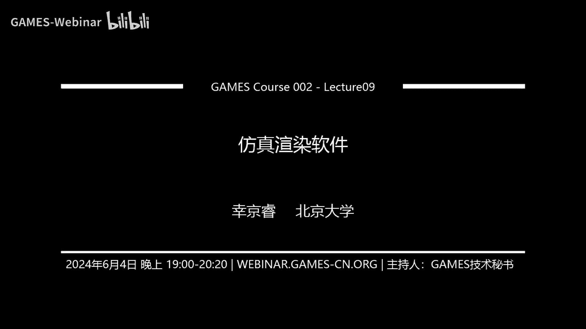

OK那我们今天就开始吧，今天给大家带来的内容呢是仿真渲染软件啊，我们为什么要讲这么一个内容呢，其实主要就是因为在这个图形学的科研，过程当中啊，最后的一个最后总是需要一个结果的展示的。

就是无论是通过视频或者是一个什么样的模型，而呃一般都会展示一个呃3D的最终的结果，对呃这也是图形学他这个直观的体现之一啊，就是我们一般最后都可以做出一个很呃，做出一个成品来。

然后是大家可以直接去看到的呃，那么在这种科研进行到调试结果的过程的时候，呃，一般会经历这样一个这样一个这个图所示的，这样一个过程啊，首先呢你是用这个算法去生成一个3D的模型，或者是序列，然后你会呃。

你需要把这个3D模型和序列，去进行一下可视化呃，因为3D的绘制呢其实是比2D要难很多的，呃因为呃对，因为它涉及到这个三维的一些透视变换呀，什么的事情，就是你你用人眼去观察一个3D的模型。

和你用人眼直接去看一张平面的画，那肯定是不一样的对吧，所以在32D的绘制，你很有可能是自己就可以写，虽然也有很多方便的API，但是2D的话就难度会小很多，但3D换到3D的话，你可能自己写的话。

就会每次都自己写的话就非常麻烦了，所以这个时候我们往往都需要借助一些软件啊，和呃一些工具去很方便的去可视化你的结果，额，那可视化之后呢，就你会预览一下结果，然后根据这个结果看他哪里出了问题。

然后再反过去调试呃，调试你的算法对吧，然后经过呃经过若干轮迭代之后，你终于产生了一个满意的结果了，你把算法改到足够鲁棒了，那么这个时候你就到了最后一步，就是把这个预览的结果，渲染成一个很很漂亮的样子。

就预览的结果呢它往往是一个，比如说呃我拿我的物物理模拟来举例子，一般我我们可做流体的话，很可能是用呃有一种方法叫做粒子法对吧，就是把流体去去离散化成一堆粒子，那么预览的结果。

很可能就只是把那些粒子在三维的位置中，打出来，就是你在三维中有这这样一个例子，那就在这上面显示个点，那呃在在预览的时候，可能流体就是一堆散点，但是在渲染的时候，我们就需要把这些散点呢。

转化成流体表面的样子，让它看上去真的像水或者像烟雾这样子的事情，嗯对，那么我们今天讲的内容呢，其实就是针对后面这个预览结果和渲染结果，这样的一呃两两个工具，那么也是按照惯例，我先关掉呃。

我的摄像头为了不挡后面的PPT哈，呃行行，我们今天讲的内容呢其实可以分为两部分，主要是通过两个例子去分别的去介绍两个软件，第一个要介绍软件的是胡迪尼的用法，第二个是介绍power view的用法，呃。

首先我们会通过渲染流体动画的一个例子，来给大家介绍如何去使用HDI，这只是大家带家一个入门，今天展示只只能说是展示胡迪尼的很小一部，很小很小的一部分功能，它还有很多强大的功能呃。

也是大家可以自己去探索的。

呃，我在这个PPT里呢也给出了胡迪的官网，大家可以呃在课后下载直接去看官网的，是官网的上面，你可以点到这个learn学习，然后再呃learn下面会拉出一个单呃菜单。

然后你选到learning paths，就可以找到这个呃右边这样一个页面啊，这里面就是一个很详细的，也是case by case的一个教学，就你点进去他就会带你去完成一个例子。

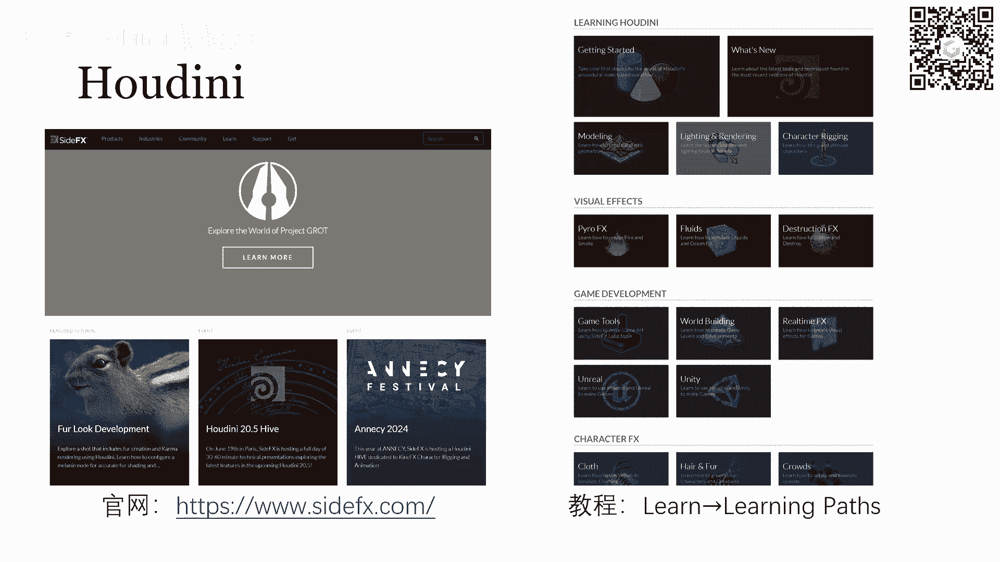

然后通过这个例子去给你介绍，胡迪尼有哪些强大的功能，OK那么我们直接呃，先先给大家介绍一下胡迪尼的界面吧，就是你打开HDI这个软件之后，它弹出的窗口就是这样的一个布局呃，主要有几个区域。

我来给大家介绍一下，首先最左边这个最大块的面积叫是场景视图，现在我们还没有加任何东西，所以这个场景视图它只有一个呃地地平线对吧，就是D平面，也就是Y等于零的一个平面，然后这个平面也是它划分了一些网格。

然后右上角呢额这一小块是参数视图呃，一般我们呃后面就会看到啊，就是在我们需要调试，比如说光照啊，相机或者是物体的这个位置，和它的旋转等等这些这些属性的时候，这些需要参数的东西。

一般都是在这个视图里去调的，然后右下角呢是节点网络视图呃，节点网络视图呢是胡迪尼他的一个工作的模式，它就是一个呃拖拽节点，拖拽模块的一个方式呃，就有点像那个就是拖模块，去进行编程的一个感觉。

就每个模块呢它会有一些接口，一些输入接口和一些输出接口，然后你通过串联他们的输入输出，来把这些模块串起来，从而让它形成一个完整的工作流，然后呃包括胡迪尼，你去加载一个正常的几何图形什么的。

也都是通过节点去加载的，就一个几何它可能对应的一个节点呃，最最后还有下面这一条长条的东西，我们看到他其实有一个进度条的显示，然后还有左下角这边有一个播放，快进停止这些按钮，这其实就是当你在胡迪尼去导入。

一个序列的时候，它可以就是像动画一样，一帧一帧的给你播放出来，这个对于我们直接去可视化的话是非常方便的。

然后大家呃接下来我就开始讲具体的用法了，就是我直接带大家去展示一下，如何用胡迪尼去渲染一个呃就是水滴的动画，就是我现在已经有一个水滴动画的素材，然后教大家怎么去导入胡迪尼，并且去渲染成一个很漂亮的结果。

然后如果在这个过程中，大家有问题就随时弹幕提问，就好好的，第一步呢我们需要添加这个物体，就是在胡迪尼中去添加一些物体，添加物体的方式，就是在我们刚才右下角那个部分是叫呃，就是那个网络模块。

节节点网络模块在呃节点网络视图，不好意思，在节点网络视图当中，我们去插入一个模块，就可以添加一个物体，这个模块叫做geometry，那我们其实就是在这个网络视图当中按下tab。

然后他就可以给你让你输入一些字母，然后根据你输入的字符去查找呃，相应的模块我们直接输入JAMECH，它就可以给你找到，然后你放置好模块之后呃，你再双击进入那个只要木取的模块呃。

它又会进入一个这样的空的页面，你在这再在这个页面下，继续插入一个叫file的模块呃，file模块的意思呢就是它会去给你导入一些，导入一个或者多个文件，如果你想导导入多个文件，那相当于它是按帧给你导入的。

就是你可以把你的呃，把你的这个文件名命名成一个呃字符串，然后加一个数字，然后点后缀名的一个这样的形式，比如说这里红框所展示出来的，大家可能看不清楚，我可以给大家放大一点呃，我不知道哦。

好像我这里没办法放大，那那就大家就看一下吧，就是这个红框里的内容呃，我们可以看到最后他这个文件名其实叫做，Surface particles，百额dollar f，点OBJ。

然后这个dollar f在HOODINI里面，它就会替换成这种0123，一直到你呃，你文件有多少个，它就会给你到多少的标号，就是它会按照这样的时呃，按按照这样，就是它相当于是哎。

dollar f会给你匹配一个数字，然后他就按照这个数字的顺序，给你加载所有的这个OBJ文件，呃，然后呢，我给这里可能需要大家不太了解OBJ文件，我简单说一下呃。

就是OBJ文件呢其实就是一个33D的描述，一个3D模型的一个文件，比如说你在游戏当中可能遇到很多人物，他呃人物的这个模型就是整个人物的模型，它一般都是用三角mesh来完成的，那这个三角的mesh就是呃。

一般来说就是要存这些三角，三角形的顶点所在的坐标，然后以及这个每一个三角形，它的三条边的连接关系，那么OBJ文件就可以去描述这样一个呃，三角mesh的一个数据结构，然后另外呢呃他也可以去描述粒子。

就是粒子，其实就是相当于你只把顶点坐标列上去，然后不给任何连接关系对吧，那就是粒子了，额，所以我们这今天这个例子呢，其实就是一个用粒子表述的，一用力粒子描述的一个流体，一个水滴。

然后这个水滴里包含很多粒子，然后这些粒子呢，就是被放在了一个OBJ文件里，然后呃，每一帧我们都会对应这样一个OBJ的文件，所以当你导入一个序列的时候，相当于你把整个这个水滴的动动态。

每一个粒子的动态都已经导导入进来了，好的这是呃，这是我们在刚才插入这个file模块之后，呃，在这个file模块所对应的这个参数下面，我们在参数视图中就可以去修改它呃，它所需要读取的文件。

然后呃就是这样指定之后，你其实就可以在左边，就是刚才我们说到的这个场景视图里。

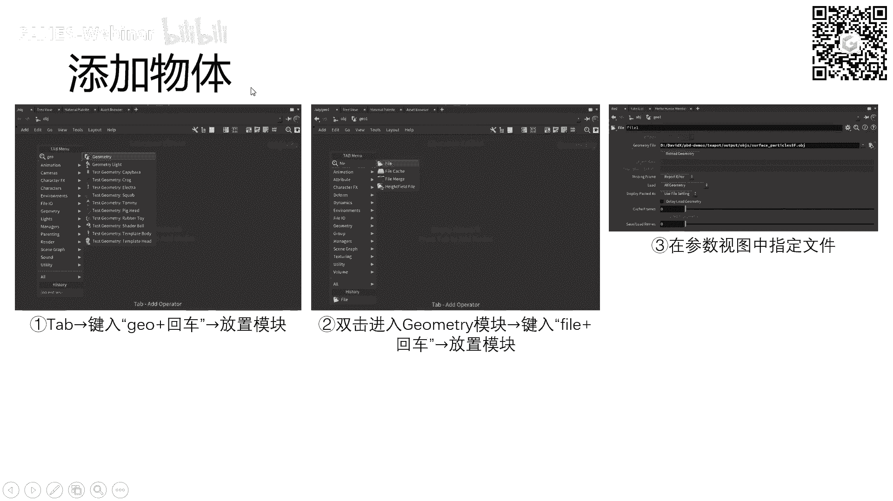

就可以看到这些粒子的位置了，他就可以给你可视化出来呃，那么在指定文件之后呃，有可能就是有可能。

你你你比如说你场景中有很多个水滴对吧，然后每一个水滴你都只有一个一个OBJ文件，那这个时候你可能需要，如果需要把所有的水都渲染出来的话，你需要把所有的粒子合并在一起。

那这个事情其实就是在我们geometry模块里面，去加上这么一个merge mermerge模块，也就是合并模块，嗯刚才我们加的是surface particle。

然后它对应的是左上角这样一个文件的节点，然后比如说我们现在还有inner particles，就是surface particles，在我这里呢是指流体这个表面的一些粒子。

然后inner particles是呃流体内部的粒子，然后我需要渲染整个流体的话，我就需要把表面粒子和内部粒子去合并起来，那我们就直接把这两个file模块，文件模块，就呃，它的输出去。

导入到一个合并这个merge模块的输入上，那这样的话，他就可以直接把这两个OBJ文件去呃，求个病对吧，他就把所有的粒子都加进来了，嗯那就是接下来呢我这个场景里可以看到啊，就是像右下角这个图。

我这个场景里其实很简单，就一个水滴，然后再加上一个圆锥体，然后我们想要可视化，最终可视化的结果呢其实就是这个水滴，它往下落往下落，并且然后接下来被这个水滴刺破，然后刺穿这样的一个动态，到最后会有视频呢。

大家可以呃，最后视频的话大家可以看一下，所以场景中其实就两两种东西，一两个几何，一个是我们刚才这里插好，插入好的一个呃粒子的粒子，合并好的这样一个几何，然后另外一个几何呢，我们就插入一个圆锥体就可以了。

然后在圆锥体也是同样的，我们会呃，我们在这个参数视图当中，去指定这个圆锥的底面半径啊，然后它的中心点以及它的高度呃，这些这些参数就可以了，额那么加好了这些所有的物体之后。

我们的场景其实已经set up好了，在这个就是在这个状态下。

你们已经就可以去点击呃，刚才说的那个底下那个绿色的部分，你就可以直接点击播放，然后就已经可以看到动画效果了。

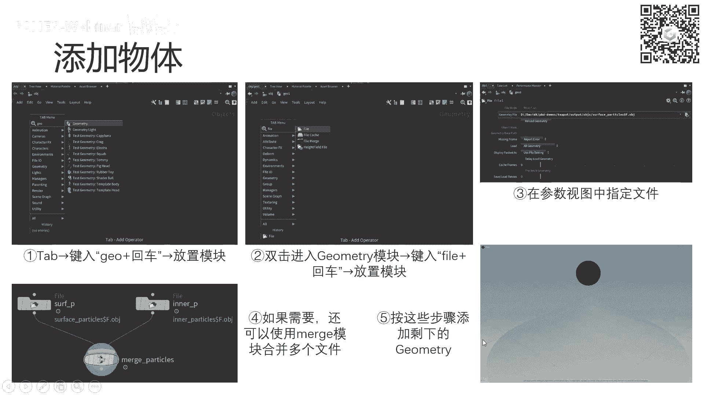

但现在呢这个动画效果，它只是给你展示了正确的动态呃，看上去还是很丑的，因为那个水还是一堆粒子，然后呃这个底下的圆锥也没有任何的材质，就是一个光秃秃的东西。

呃那么接下来的一步就是，我们把刚才的一堆粒子去呃。

变成流体的表面，让它看成看看上去很像一个流体，呃，那么我们要做的事情呢，就是在刚才那个例子的那个geometry模块当中。

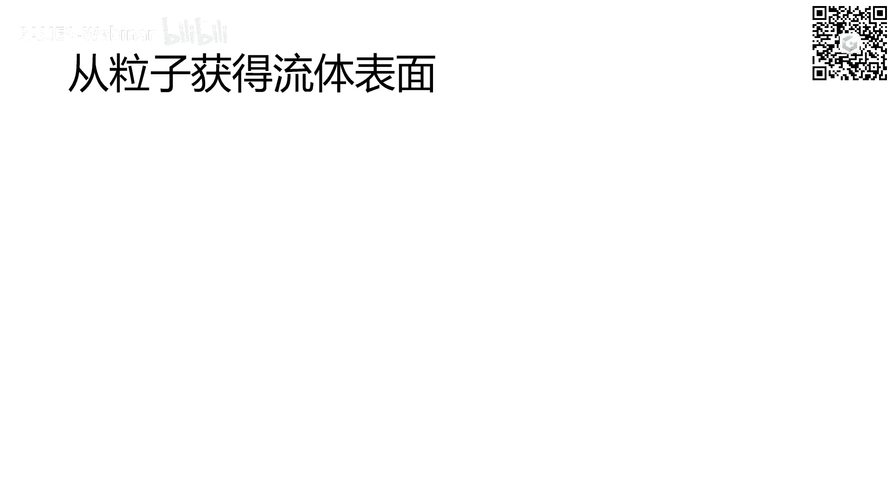

我们其实刚才只有上半部分对吧，我可以给大家稍微画一下，我们刚才其实只有红框框出来的这上半部分，然后呃，上半部分其实只是把两个文件里的粒子再呃，读进来，并且再合并到了一起。

那接下来呢我们需要把它粒子去转化成表面，我们的思路是这样的，我们把每一个粒子都去扩充成一个，有一定半径的小球，那许多粒子都会有那么相邻，粒子之间其实就会有一些交集对吧，那么我们把这些相交的这个球的表面。

提取一个公共的表面出来，那么我们就可以想象对于一个很大的水滴呃，就一个很大的水滴里面充满了粒子，那相当于额每一个粒子都会扩充成一个球，那这个呃这些球的表面合并在一起，就相当于是一个大的大的水滴的表面了。

这个这个大家应该没有什么问题吧，只不过现在有个问题呢，就是在这个大的水滴的表面上，它可能会有这种很小的这种凸起，因为我们求的是每一个粒子都是一个球嘛，然后每一个粒子的球的表面直接求胶的呃。

直接求并的话嗯，就不可避免地会产生这样一些小小的凸起，所以到了这个particle to v dB的这个过程，其实就是我们这个呃把这个粒子扩成球，再把球的表面合在一起的过程，OK我再清一下，好，呃。

哦这里这里的不好意思，这里的PPT做错了，有点那个做错了，这个红框框的有点问题啊，呃就是第一个这个第一个这个参数视图，其实对应的是下面这个呃，其实对应的是这个particle to v dB。

就是其实是这样的一个关系，嗯这里这里PPT做了点出了点问题，但大家明白就好，就我们刚才我刚才所解释，这个过程其实是在particle to v dB，这个模块里做的这个模块所做的事情，呃。

也也是有参数可以调的对吧，就就比如说你刚才的那个每一个粒子，它可以扩充到一个多大的球体，这里都是可以调的，你像呃它对应的就是这里point radiscale这个参数，这个参数越大，也就是就就意味着。

你每一个粒子扩充的那个球的就球的半径越大，如果这个东西太大了，就是太大了，它可以给你得到一个，其实这个表面就不会凸起，就不会这么明显，但是它会导致你这个额，你这个表面往外也也会往外扩充太多。

就你这个水滴会比原来大很多，这就很不好看，这这就这不是不好看的问题，这是会出问出会出错，到后续就会有这个穿模的问题，因为你水滴碰撞到那个锥体的时候，是粒子碰撞到锥体，那个粒子是严格在那个锥体表面的。

而你把粒子已经往外扩充了，很扩充了很多的话，那相当于你扩充的表面，已经嵌到那个锥体里面了，就相当于出现了穿模，所以这个不宜过大，那也不宜过小，过小的话就是你如果说你的粒子的半径。

就你粒子扩充那个球的半径，比你粒子之间的间距还要额，间距的1/2还要小的话，那相当于你的粒子就是这样子的，对吧，呃sorry，这画的有点难看了，你的两个粒子就是这样的呃，你的你这两个粒子之间就没有交。

所以说它的表面就会变成这两个球体的表面，那你其实本质上还是看上去还是一对粒子，就不可能把它合并成一个水的表面了，所以我们要调到一个合适的这个呃合适的半径，那么幸运的是。

我们其实可以直接点击右边这样一个区域，点击右最右边这个小的小的按钮，然后点击之后呢，左边的那个视图就可以嗯，他就会去给你直接去可视化这个呃，就是这个这个操作之后的结果，你就可以看。

你可以去拖动这个进度条去看一下，你这个现在的半径是过大了还是过小了，所以这个问题就不大，然后需要注意的啊，就是这里有一个voxel size，这个voxel size最好是要额。

比这个radius scale要小一些，因为呃至少它不能比它大，因为它相当于voxel size，其实就相当于你的三维的图像的分辨率，如果说这个呃这个这个0。01呢，其实就代表的是网格的边长。

如果你的网格边长，比你的粒子扩充的半径还大的话，那相当于你这个网格会非常的粗糙，你根本就没办法表示出呃，你根本就不够精细，你根本就没办法表示出你想要的那个表面好，那么转化成v dB之后呃。

接下来是这个smooth模块呃，接下来就是因为为什么我们要做这个smoothing，就是刚才说过了，我们刚才就是直接得到的，这个表面是很bumpy的，是有这种凸起的，所以我们需要做一个呃平滑平滑处理。

这里也有一个参数啊，就是呃去调它呃，这个就是平滑，按照多大的领域去平滑，这个参数也是有一个合适的值的，大家也可以是直接去可视化它，然后去拖动，去自己手调这个参数，看哪个值是最合适的。

然后下面这个iteration呢就是它的迭代次数，这个迭代次数呢也不是越高就越好，反正越高肯定是越慢的，但是越慢其实并不一定越好，就这个事情也是呃自己呃，你们自己调的时候，实践的时候就可以调好。

呃那么在smooth之后，最后我们还需要呃在smooth之后，我们其实得到的这个数据结构呢，是v dB的一个结构，这个v dB结构其实并不能用来直接渲染，就是我们还是要把它转化成这种。

polyon mesh的结构，也就是一个多边形的呃，一个一个网格，多边形网格就像那个三角形网格一样，把它转化成一个polygon mesh的一个样子，所以就对应了最后一个节点。

这个节点呢它就是呃大家注意，就是把这个这个节点叫做convert v dB节点，然后这个convert v dB节点，它其实可以把v dB转化成各种各样的数据类型。

大家注意把这个convert to这个参数设成POLYG，确保它能够转化成一个多边形，match的一个数据结构就好了，好的就是从这个粒子获得流体表面的过程，大概就是这样子。

我们的思路就是把粒每个粒子变成一个小球，然后把小球的表面融合在呃，融合在一起，合并到一起，然后再进行一个平滑，最后转化成mesh，这样一个过程大家都清楚了吗，最后就是做完了之后。

我们可以看到这样一个结果，场景视图就变成这样，刚才这个上面这个圆球呢是一堆的粒子，现在就已经变成一个连续的表面了，大家有问题就可以呃，随时问，这里的PPT我后面会改一下，这这三个红框都分别往上框了。

一格应该往下，应该直接往整体往下移一格，好如果没有问题，我先继续啊。

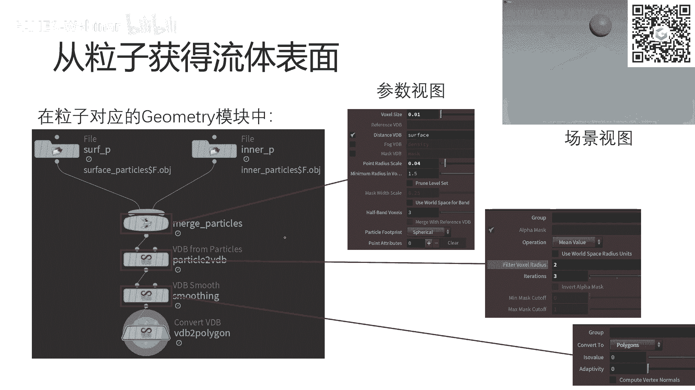

呃我们在，就是刚才把这个流体变成了一个连续的表面，那接下来呢它这个表面其实看上去还是很，就是不透明的对吧，就是你因为你没有赋予它任何材质，所以相当于在可视化的时候，胡迪尼会按照一个默认的材质。

就是什么都没有，一个白色的一个呃，一个一个，它一个一个应该是它的默认的一种模型，去给你去可视化，那接下来呢如果要让它看的看上去，真的很像一个水，那我们就需要给这个水的表面去附上赋予材质。

那么首先呢我们需要从这个材料库里面去找，找到一个我们想要的材料，这个材料库呢其实也是在右下角的那个额，整个界面右下角的那个网络视图当中，网络视图当中其实它会有多个小标签，我们可以注意到啊。

呃我们看到其实我们现在选的是第三个标签，叫做matmaterial pale，就是材质面板，你选到这个材质面板之后，左侧它就会有一系列的蝴蝶里自带的一些呃，材质，这里面还是挺丰富的，然后对于水来说。

我们一般用它的，用这个glass就是它的玻璃这个材质，因为水其实和玻璃很像嘛，它都是透明的，只不过它可能折射率呃，然后反反射率那些不太一样，所以我们只需要改些参数就行了。

总之这个和glass这个透明是很像的，然后最后你如果渲染出结果，你会发现直接把它当做当做玻璃来渲染，也是很像水的，因为你这个水的动态很丰富，所以呃它只要是透明的，就就很就很合理呃。

你把这个想要的材质拖出来就可以，然后包括呃你下面不是还有个锥体吗，那个锥体你也你你可能会用另外一种材质呃，我这里面可能用的是那个金子，金子构的，那你就把这个go的也拖过来就好了，然后这相当于是准备一下。

你所需要的材料有哪些，你只是在这里准备一下，那之后呢就需要至少我们还需要调一下，我们需要的那个材质的属性，具体的属性，那这个属性其实就是在右上角的那个呃，参数视图里去改的，你直接点击这个材质glass。

然后在右上角就会变成这样一个参数的面板，那这里面其实就是反映了这个材质的这个，各种属性，包括reflection，折射，transparency是它的透呃透明度。

然后还有很多emission是它的发光发光度对吧，呃这些东西也都是呃渲染中的一些术语，如果了解过渲染的同学，应该会对这些很熟悉呃，然后具体来说那个我们可以调一下，如果你想做一个很像水的一个材质的话。

咱们把这个IOR调成1。33，他之前默认是1。5，然后把这个折射呃，Reflection，这反射反射度去额改成0。2，然后透明度0。8，然后我们这个emission它原来是零，我们调调到0。04。

让它轻微的发一些光，然后这个光的颜色是蓝色，让它稍微的发一点蓝光，然后就可能看上去比较像水，或者说至少很像动画一般动画里的水了，好这个我们配置完材质的属性之后，配置完材质属性之后，其实我们就已经准备好。

我们所需要的所有材质了，那这个时候我们需要把这个右下角的这个呃，叫什么，这右下角这个网网络视图呢，去切换到我们刚才的OBJ这个里面，也就是说我们刚才插入几何的这些界面，我们可以看到其实在这个几何的界面。

我们已经插入了两个几何对吧，一个是我们的水，一个是那个圆锥锥体，然后呃如果说我要改水的材质，你就选中它，选中这个水所对应的几何模块，然后在上面上面这个参数面板中，选到这个render标签。

选到render标签之后，下面会有一个material的属性，material就是材质的意思，你把这个材质指定成刚才我们拖进来的那个glass，就好了，然后包括下面这个圆锥体，如果你想把它变成一个金子。

金子做的，那你就把这个圆锥所对应的材质，设成那个刚才拖进来的gold就可以了，那这个材质配好之后呢，嗯还还是不够，因为你要去完整的渲染一个场景。

你还需要两个必备的属性，必必必备必备的元素，那就是相机和光，照，相机呢就是指你拍摄的这个视角是什么呃，添加相机的方法呢，就是在我们的这个左边的这个大片的浏览，这个预览视图，也就是场景视图当中。

右上角其实有一个NO cam这样一个标记，这个表示的是它NO can表示的是，就是你现在是一个自由的视角，和和任何一个相机都没有关系，那么在这个里面我们点下去，就可以去添加一个新的camera。

添加一个新的这个相机呃，添加这个新的相机之后，我们可以选择这个tie view to camera or light，他的意思就是说我把当前的这个呃这个视图，这个场景视图的视角。

和我插入的这个相机去绑定到一起，这样的话你再拖拽，你在后续拖拽整个场景的时候，你的视角不是会变吗，那你的相机其实是跟你的视角同步去变化的，这样就可以让你很方便的让呃，把你的相机设置成一个你想拍摄的视角。

那么调完之后，你再把这个tie view to camera or light，给取消勾选就可以了，这个相机其实就设置好了，那么右边其实在右边的那个网格视图当中，在点了new camera之后。

其实就会多出这么camera一个模块，然后你这边左边你调好它的话，它右边模块的一些属性，其实也是自动帮你更新好的，就不用管它呃，接下来我们就需要添加的是光照了，在光照的话也是在右边去。

在右边这个网格视图中，你按tap，然后去输入一个light，去找到和所有和light相关的模块，它这里面也是胡迪尼所支持的所有的光照，额，这里的话我们可以去我们这个例子里，选的应该是环境光照啊。

environment light就是相当于是这个环境，它有一个包围盒，然后这个包围盒其实是呃一个六面体，你可以理解为一个长方体吧，然后这个长方体把我们整个场景，包括这个水滴以及这个圆锥体都框在里面。

这个包围盒很大，然后这个light呢就是这个整个包围盒所发出的光，然后在这个light你选择这个light之后呢，一般来讲默认参数像这种environment light，它默认参数一般就可以渲染了。

但是你可能还是需要首调一些参数，才能让你就是让它达到你所期望的结果，比如说起光照的强度，光照的颜色以及包括environment light的话，它还可以去选择，你是不是可以去啊。

是不是在最终渲染视图中可以看到这个光源，如果你选没有选择能看到，那你的背景其实就是黑的，但是你的呃，但是你的物体是被照亮的，这个大家能懂我的意思吗，就是如果说你没有光照。

那你其实渲染出来是一个完全黑的图片，呃如果你说你添加了一个光照，但是你看不到光源，那么这个时候其添加了一个环境光照，然后看不到光源，那其实你的物体其实是已经被环境光照亮的，但是渲染的背景是黑的。

如果你选了可以看到光源，那其实就是你你这个物体不仅被照亮了，你的背背景也是也是亮的，这个大家就是回去试下就可以，我现在是因为设备的原因呢，没办法带着大家一起做这做这些事情。

所以我就呃我就我就做了这么一个PPT，把所有的图能截的图都给大家截下来，希望大家能听懂啊，如果听不懂的话，随时打断我，就或者哪个操作不详细的话，就随时打断我，呃，对我们配置好所有的这些OBJ。

就是这些对象之后呃，就可以开始渲染了呃渲染的话，其实胡地里它有两种渲染器，主要有两种渲染器，一种是mantra，另外一种是KARA，我们先介绍mantra，mantra渲染，它的特点是只支持CPU。

但是它比较的功能比较的全额，就他只是比较慢而已，它它的各种参数也都非常的灵活，在这里的话，如果我们想添加一个mantra的渲染器，还是要在这个网络视图当中，我们去点击这个OBJ的这个这个标签啊。

然后切换到out标签，这out其实用，就是用来给你插入这些渲染器模块的，在这个模块当中，我们直接搜索mantra m a n t r a，然后插入就可以了，呃在这个对于这个mantra这个模块。

我们还是可以去调一下它的一些参数，就是在参数视图当中，images的标签页下，它的它里面会有一个output picture这样一个属性，这个属性指的是你应该输出什么样格式的文件。

就比如说在这个图里所示的，它就是呃在HIP这样一个目录下输出的，这个名字是，输出的名字是这样一个格式，它是一个点EXL的文件，这里你可以把后缀直接改成PNG，他就会直接输出嗯，PNG图片，对的。

然后接下来你可以切换到这个rendering的标签下，然后这个rendering，它主要就是配置一些渲染的参数，比如说这里面有一个sample，Pixel sample，它就指的是每一个像素去给它。

sample就是采样多少次，这个采样次数越高呢，也是你渲染的结果会越精细，然后噪声也会，一般来讲噪声也会越低，呃，但是呢带来的代价就是，会渲染的一帧都非常的慢，然后包括这后面也是ray sample。

ray sample就是指你一条射线去呃采样多少次，这些都是一些呃渲染的这个参数了，然后渲染其实我懂得也不是特别的深，所以呃很多参数呢我也不能给你们解释是什么，具体是什么，大家可以有兴趣的话。

可以自己去查一下，嗯好配置好metal的渲染器之后，我们就可以就是切换到渲染视图。

这个渲染视图呢，其实也就是刚才的场景视图的一个平齐的标签，刚才场景视图其实亮的是最左边这个，same view的标签，你直接切换到这个render view。

这个标签就可以看到我们mantra渲染的结果了哦，当然你需要先点击一下render这个按钮，你点击render按钮，它会出现一个进度条，然后它会慢慢的就是给你把这张图片去打出来。

就是刚开始你可能刚点击render，它这个图片会只有几个像素点，然后慢慢的把这个图片的填充起来，然后噪声很多，然后再再随着进度条继续往后推移，它这个噪声会越来越小，因为它相当于是在不断的采样。

然后呃不断的采样，并且计算颜额，每个像素点的颜色嘛，所以它会随着采样数越来越多，这个最后的渲染结结果也就越来越准确，额对，最后一步呢就是我们可以在这个呃，render view下去预览。

就预览我们一帧渲染是什么样子，如果说比如说这一帧我预渲染效果，我觉得已经很棒了，那我就可以去导出一整个系列，对对，那我们就可以去导出整个序列呃，整个图片序列，然后最后可以做成视频呃，导出的方法呢。

就是还是我们去点击刚才的mantra节点啊，这里配置这个路径，刚才已经说过了，就是在这个上面，下面去配置它的这个路径以及文件名，然后你后面可以改它的扩展名，你可以输出JPG文件，可以PNG文件。

或者是它默认的excel文件嗯，对然后我们不要忘了，就是在这里有一个就是在这个参数视图下，其实还有一个叫valid frame range，它默认像是是说render current frame。

就是说只渲染当前帧，那这样的话，你其实最后渲染它只会给你输出一张图片呃，我们要把这个选改改一下，改成这个改成这个我们要渲染一个范围，这样的话你就可以指定一个起始帧，一个中指针。

然后渲染这个这个区间内的所有的帧数对吧，渲染这个区间内所有的所有的图片，然后最后我们点一下render to disk就好了，这个你点击之后，它就会开始批量的渲染，从第一帧开始，从你指定的第一帧开始。

到你指定的最后一帧结束呃，它会给你展示一个进度条，但是在一些参数的设置下，它可能会比较慢，我自己实践的时候，其实就这个video其实我渲染了大概三个多小时。

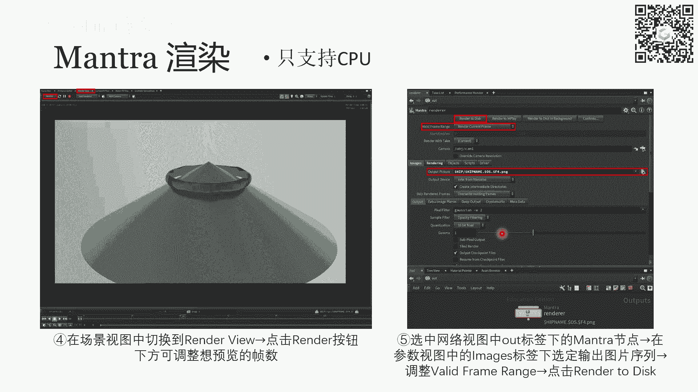

三个半小时，三小时40分钟，应该是它只有很短的一段，然后这个其实是呃，这个这个demo其实是我上一篇工作就是SEAGRAPHASIA，2022年工作的呃的一篇工作。

我们我们做的是一个position based呃，就是PPT fluid的框架下做了一个表面张力，这里也是小小的打一个广告，然后这是其中的一个demo，我在这个胡迪尼给大家复现了一下。

当然在我们原文当中，这个demo可能会更好看一点，因为当时跑的用的粒子数也多，然后呃，当时那些材质的话也会更加精挑细选一些，好接下来去讲这个，接下来我们就讲这个卡尔玛渲染啊，卡尔玛制这个渲染器。

它的好处就是它支持CPU和GPU混合渲染呃，也就是说它能让用GPU给你的渲染进行加速，额这个用commas渲染的方式呢，就是我们首先要去切换到一个它，它相当于有一个另外一套工作的流程了。

跟刚才的mantra不太一样，刚才mantra是我们直接在那个网络视图当中，切换到out标签，在那里面插入一个mantra节点就可以，但是现在不太一样，现在我们需要在左边的这个。

这就是整个窗口左上角的这个选项卡当中，这有一个build，那我们需要把这个build这个视图切换成SOLARIS，那切换成索拉瑞斯之后，整个窗口其实布局就会变了，它会变成一个对它会。

它会在下面其实会多出一些一些功能区呃，但是右边的右上角的那个参数视图，和右下角的这个网络视图还是还是都在的，所以我们在这个时候，我们把网络视图切换到stage就可以，刚才是out。

现在我们要切换到stage呃，在这个stage里面，首先呢我们需要把刚才的场景，就这个stage其实是一个新的环境了，在这个环境下，它其实不知道你刚才做的所有操作的。

所以我们需要导入刚才所插入的所有的呃，几何物体，包括以及包括相机和光照呃，几何物体，就是刚才的那个水滴和那个圆圆锥体对吧，水滴粒子和圆锥体呃，然后还有我们插入了一个环境，光照以及一个相机呃。

这些东西都需要全部导入进来，然后这个导入的方式呢，就是我们在这个stage这个标签下去，插入一个sin import模块，它叫做场景导入，sin破的模块当中，上面的参数有一个objects。

在这个objects，你把这个刚才的OP j里边的所有东西，都放到这里，用空格隔开就可以了，这里对这里大家应该都明白吧，就是你看这里也其实包括四个东西，一个是水，一个是那个底下的圆锥体。

然后一个是环境光照，一个是camera，就是相机，那导入进来之后，就可以接下来插入一个karma renders。

Camera，karma的一个模块，你在插入karma模块之后，它其实会自动的给你生成一个连好的两个模块，一对啊，连连好的两个模块，第一个模块呢是这个karma render settings。

它是做一些camera渲染的设置的，然后他这里需要接接收输入，接收你这个场景import thing的输入，这样你就相当于把刚才导入的场景，全都告诉卡尔玛渲染器告诉你，我有这些光照，有这些相机。

有这些物体，接下来呢就是选中这个render setting这个模块，我们就可以去参数视图中去调它的一些属性了，同样的也是在这个输出的output picture下，我们可以配置这个输出路径和文件名。

然后camera这里我们要指定一下，是我们我们import进来的这个camera one，就告诉他我用哪个视角去渲染呃，后面也可以调它的图片的RESU呃，分辨率。

还有你需要你需要把这个render engine，就是这个渲染引擎调成XPU引擎，因为它默认的话其实是CPU引擎，CPU引擎的话他就没有用到GPU，所以它的速度还是会很慢的，后面也包括有一些参数。

就是sample，就是采样的数量在下面也会有一些更多的这个，更多的这个图像处理，包括render的一些参数，呃最后呢也是跟mantra一样啊，就是呃这些东西都配置好之后，呃，你就这些东西都配置好之后。

你再点这个刚才这个ka setting这个模块，下面这个红色的模块，你点这个这个叫run usd render roo p，这个这个模块下面它有这样一个render to disk的。

render to disk的一个呃按钮，然后你点一下它就会续一一帧一帧的给你渲染，然后同样的，你也是要把这个渲染调成你想要的这个区间，渲染的范围调成你想要的区间呃，然后你想你可能会问。

就是karma这个渲染器要怎么去怎么去预览对吧，因为mantra刚才有一个预览的阶段，这个coma其实它就是实时渲染的，就是你切换到这个呃，我们刚才是切换到这个地方，so laris这个界面下。

你索拉瑞斯右上角其实是有一个那个view。

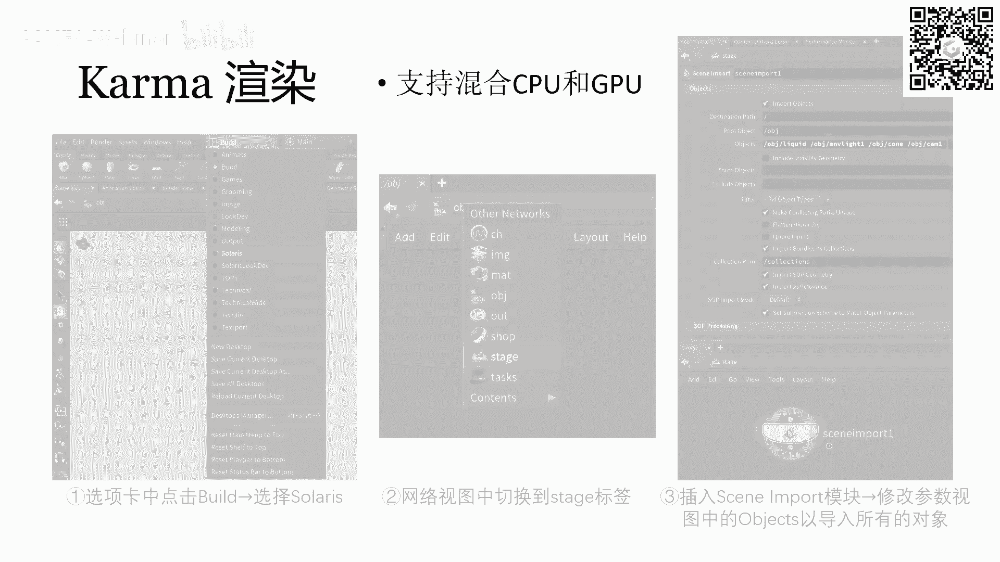

是我可以给大家倒一下SOARIS上哦，对，右上角其实它也是有。

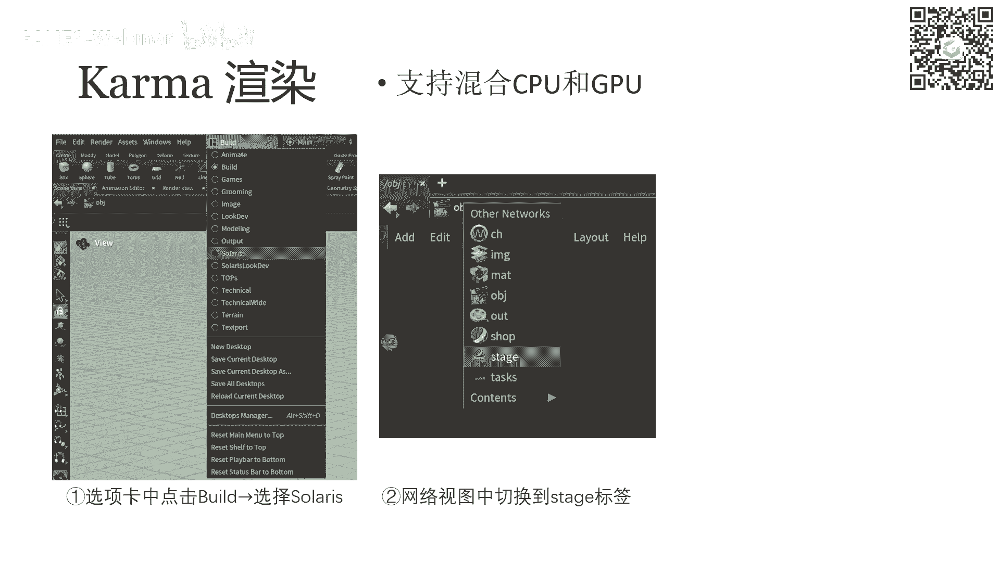

像这张图里面这两个东西呃，这两个标签同样的东西，左边这个标签是你可以调成那个卡尔玛，x p u render的那个view，那你调完之后，它就立刻，这个场景就会变成卡尔玛渲染器渲染的结果。

然后这个结果你可以直接去拖视角，它不一定是必须绑定在你这个camera上的，它是一个实时渲染结果，你可以拖一下视角，然后他会呃，立刻的随着你的视角去给重新给你渲染。

行卡尔玛渲染对comma渲染就是这样子，但是大家要注意的就是。

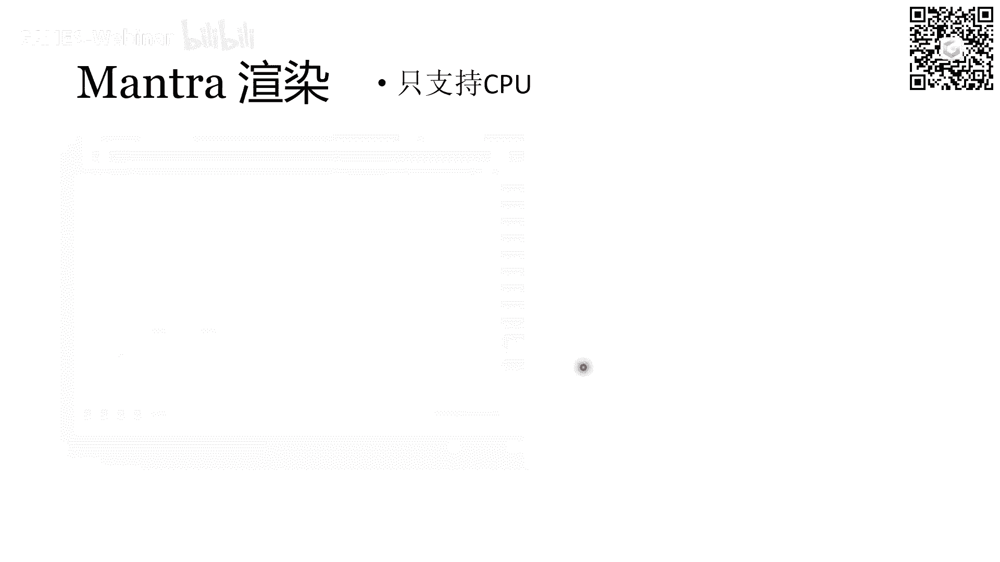

卡尔玛渲染的结果，很可能会跟那个mantra渲染的不不太一呃，不一样，因为有些呃mantra里能支持的东西，在common里是不能支持的，它可能需要重新配置一下参数，比如说有些光照。

有些材质可能呃材质应该还好，就主要是光照，你可能需要在coma里重新配一下，重新配的话，也就是在这个呃stage，这个，直接在这个stage这个标签下去拖这些模块就好了，行。

这就是胡迪尼我们今天讲的这个例子，然后我们其实最终期待的效果，就是刚才这个视频啊。

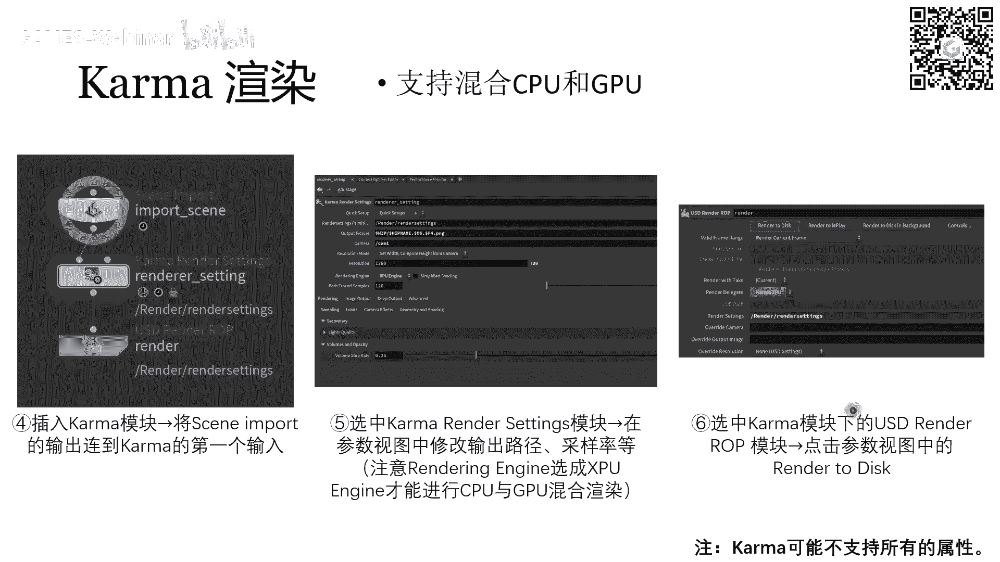

你可能有些细节不一样，哎sorry可能会有些细节不一样。

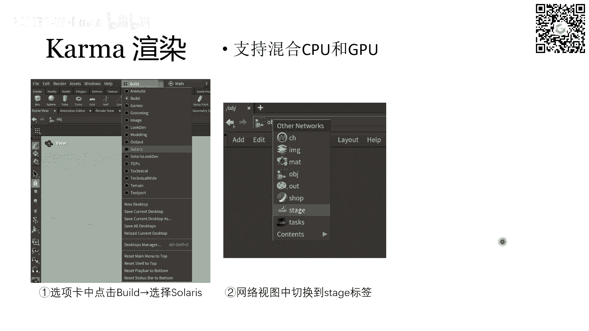

但总体上说这个水像水，然后这个圆锥体系有点金属光泽就好了，然后有点这种反光的效果就可以了，然后你你如果有兴趣的话，可以去调一些参数，让它特别好看，这个胡迪尼的这个部分大家有什么问题吗。

我接下来就要讲para view了，OK如果没有啥问题的话，我们就继续啊，呃接下来我们是通过另外一个例子，是一个叫速度场，体数据可视化的这样一个例子。

去给大家介绍一下power view的基本的使用方法，呃PARAVIEW也是同样的，我把这个官网和他的文档教学，这这些都附到PPT里，大家要是想要了解一些高级功能的话，就可以点进去看。

首先我什么是体数据可视化呢，呃体数据的意思呢，它其实就是一个三维的场，就是呃比如说啊呃怎么说，比如说一个速度场吧，就是一个流体流体，它是占据一定的三维空间的，然后在这个空间在这个定义域下面。

其实会定义一个向量场呃，也就是流体的速度场呃，这个场在自然界当中，一般都是肯定是一个连续的场对吧，它是在这个定义域内处处都有额，处处都是有定义的，每一个点它都会给你一个速度的值，但是在计算机里。

这个体速去就就往往都需要转化成体速，就是VOXEL，其实就是把它变成一网格化，然后我们只存每个网格格点处的一些坐标值，然后格点之间的话往往都是差值来做的，差值来计算的额，那这里就引入一个叫做提速的概念。

体速其实就是对应二维中的像素的概念，它指的就是网格中的一个格点，好的额，那常用的就是体数据可视化的方法呢，就是指就有三种吧，第一种是体渲染，也就是我们接下来要介绍的这个方法，然后还有一些其他方法。

包括等直面提取以及切片可视化这些方法呃，然后这个体数据可视化的技术呢，也是在图形学之外也是很广泛的，这也是为什么我们可视化会呃，会有这么一个课题，就是去研究，专门去研究怎么可视化体数据更直观一些。

包括我们右边展示一个图啊，就一个是医学成像呃，然后另外一个应该是材料的一个设计，它是一种类似皮肤一样的材料的设计，然后呃这个图片来自于para view的官网，他应该是体现了给你去可视化的这个呃。

这个这个skin这个材料的一个形变，就是它的应力张量一样一些东西，可视化这样一些东西，sorry应该是应变，他是string对应应变的一些东西，然后左边的话大家应该可以看出来这是个肺吧，对呵。

然后呃应该是一个肺，然后左边应该我推测应该是一个切片的可视化，右边呢应该是一个等值变提取的，这个可视化的方式，总之的话呃这些可视化也是很强大，它可以把这个人体内的一些很精细的结构，都给你一览无余额。

那么在进入我们的例子里面，我们例子其实就是想要做出一个，就是做出两个涡环进行碰撞的一个效果，呃然后我们不是要可视化流体的速度场吗，那其实速度场是一个三维的三维的体数据对吧，它是一个呃三维的向量场。

也就是说呃在这个斗may里，在这个玉里面的每一个点，它其实都是一个对应于一个三维的向量，但我们一般来讲，体数据可视化都是会可视化一个标量场，那怎么办呢，我们这个只能去牺牲一些信息。

我们选择可视化这个流速场的呃涡量，涡量的意思也就是说他就是嗯涡量，它的意思就是这个流体的嗯，嗯流体形它是描述这个流体它这个转的有多快，这个通俗的来讲啊，就是描述这个流体在某一个点处。

它转的有多快的一个物理量，然后我们其实涡量来讲，在三维里面涡量其实也是一个向量，我们现在呃可视化的是这个涡量的这个模长，这个模长越大，代表这个流体在这一块它就转的越快，如果越小就代表它转的越慢。

那么我们这个呃对，我们现在假设我们已经拿到这个涡量场了，也就是说这个涡量场它是一个呃一个三维数组，一个浮点的三维数组呃，把它存到一个VNP当中，让每一个维度，其实就对应这个网格的每一个维度。

然后每一个值其实就是网格格点处的一个值额，那么假设这个这个，我们这整个定义域的坐标范围呢，是从X面到x max，然后Y坐标是外面到y max，Z坐标是Z面到z max这样一个大小。

然后分辨率呢也是XXN乘，YN乘ZN的一个分辨率啊，所以我们这个VNP的数组的形状，三维数组的形状应该就是XN乘YN乘ZN，额然后然后我们需要把这个VNP，这个VNP其实本身是一个number派的数组。

那我们需要把这个number派数组，首先转化成一个VTI的格式，VTI的格式，然后写入到这个VTI的文件当中，这样才能被我们的para view所接收并可视化。

那这个转化的方式呢就是用一段Python的脚本呃，主要借助的是Python里的VTK的包，所以我们需要先import一下VTK，然后用一些这样的代码，就是首先你先把它转化成一个，VTK格式的数据。

V t k data，然后接下来你再把这个v t k data去用一个writer，写到呃，我们指定的VTVTI文件当中啊，这个细节呢，这个细节我只是把这个代码放在这里，它不太重要。

所以呃如果大家真的想实现一下，就是真的想去可视化某一个呃是三维数组的话，三维体数据的话，大家可以去查一下VTK这些接口该怎么用，好吧，但是如果你说只是实现一个，和本节课一样的功能的话。

你其实就用直接复制这段代码就好了，你只需要记注意那个每一个参数的意含义，就可以嗯，那生成这些VTI文件之后，我们就可以去导入这个parr view，然后进行可视化了。

呃para view它的界面是这样子，他应该会比胡迪尼要简单许多，呃，他首先他不需不是那种脱模块的那种，工作方式了，他其实就是一些文件，然后把这些文件去整个混合到你整个场景里呃，那首先第一步呢。

就是我们需要把这个刚才生成的一堆，VTI文件直接拖拽到现在这个框框框里，框框这个范围里，然后呃我们如果说要导入一个序列，那我们就按顺序选中所有的VTVTI的文件，然后一起拖进来，然后我们会发现呃。

就是这里边他这个文件名最后带个芯对吧，带个芯就表示它是一个文件组，它是一组文件，它是一串序列，然后如果你不想拖拽的话，也可以直接右键啊去open一个呃，去打开一个一些文件，然后你指定路径之后。

你也可以是直接选择一系列的文件，然后直接导入过来就好，那导入之后其实你拖拽过来之后，你直接点这个左边的这个眼睛的小图标，它眼睛默认是闭上的，就是它不会它会隐藏的，你点击之后它就会显示，但是刚显示的时候。

因为你是一个网格的数据对吧，它其实只会显示出整个外面的一个包围盒，也就是一个正方体，也就是长方体的棱，呃，如果说我们想显示出其中内容的话，我们需要把这个上面这个，这里有一个可视化的方式。

它其它其实会点一下，会有一个下拉条嘛，然后我们就选择volume，也就是说体数据的可视化方式，那选完之后，你就会发现它立刻就变成了这样一个形式器，呃，这样一个啧对吧，这样一个一个图像，然后他的意思呢。

就是说我们可以看到这是两个环状的东西，呃，环状的形状它也就是呃它代表的就是两个涡环，然后这个涡环也是越靠内部对吧，越靠内部它是颜色越偏红，然后在右下角我们也可以看到它越偏红，表示它的窝量越大。

然后越偏蓝表示窝量越小，也就是说这两个涡环它其实是呃越越越靠中心，它转的是越快的，嗯那接下来就可以在中间这个视图里面去，你去拖鼠标，像胡迪尼和胡迪尼很像，你就直接拖去调整视角就好了，在这里面。

我们其实是没有一个所谓的camera的概念的，因为呃在PARAV里，它其实默认就是以你当前的视角，作为这个相机视角去进行渲染，呃在这个这个情况下其实已经可以做可视化了，你直接点这个播放的这个图标。

点这个播放，它就可以直接把你导入的整个VTI的呃，导入的是整个VTI序列，一帧一帧的给你显示出来，所以如果你导入的是一个连续的动画，那它就会啊展现出这个涡环的动态啊，对这个呃我想一下。

对这个这个这个播放是很快的，这个是比胡迪尼要快的，这是PARAVIEW的一个好处，就是当然可能也跟你现在这个例子有关啊，但是总体我使用的感觉就是PARAVIEW，它会更清亮一点，就是你直接导入进来之后。

你直接点播放，它就可以很流畅的开始给你播放了，它是很快的一个东西，但是额胡迪尼的话，你刚导入粒子的时候，你点播放它其实一帧一帧会会给你卡一下，每帧都给你卡一下，就看起来不是很流畅。

额那接下来就是我们可视化之后，如果说你觉得这个结构比较好，就可以开始渲染了对吧，呃渲染的话，我们其实就是其实也就是说多呃引入一些东西，然后再改一些参数，就可以让他呃变成渲染了，首先呢也是经过以下的步骤。

第一步呢是我们可能需要，因为我们需要实现这种阴影的效果对吧，这种呃在密度越深的，就是在涡量越深的地方下，它相当于会阻挡光线，阻挡越厉害，然后从而在地上形成一个阴影，那形成阴影其实你不能是个虚空。

所以你需要导入一个地平面对吧，你需要导入一个平面，刚才我们有阴影，就是刚才我们有那个水滴的阴影是下，因为下面我们有一个圆锥体，所以在这个圆锥体上可以映出这个水，水滴的一些倒影什么的。

那现在我们其实呃是相当于你可以理解为，中间这两涡环是两团烟雾，那你需要一个依托才能去展，打出他们的倒影，然后这个方式呢其实很简单，你就是加一个平面，加一个很大很大的平面就可以了，这个平面的话。

你可以自己直接自己写一个OBJ文件，它其实平面就是一个正方形嘛，然后正方形是由两个三角形组成的，那这两个三角形其实构成了一个mesh，就是我们想要的平面，大家自己写就可以了，呃添加完这个平面之后呃。

我们需要对，我们需要就是在左边左下角这个properties，这个标签下，你往下拉，你会发现最后一个其实是它默认呃，最后一个是这个retrace rendering，这样一个题目。

在这个标题下有一个enable ray tracing，它默认是不勾选的，因为它只是给你可视化一下，就没有开启这个呃光光线追踪的渲染呃，为了因为这也是为了这个效率，然后你如果想生成高质量的结果。

你就把这个勾上，他这样的话就可以开始给你光追渲染，然后就给你呃，就是把这个效果会提升很多，然后然后你再接下来把这个，下面这个shadows也勾上，这样的话就会出现这种阴影的投射的效果，对你额。

然后你勾选上这两个东西之后，你会发现这个PARAVIEW瞬间变慢了，你拖拽视角什么的，或者说是播放序列都会变得一卡一卡的，这个时候你就尽量不要去修改中间的这个，不要去拖中动中间的东西了。

你直接在右边继续去添加我们的光源，添加光源的意思是呃，其实PARAVIEW它会默认给你有一个光源叫light kit，这个呃like kid，前面这个box它是默认是框上的，是勾选上的，你把它取消掉。

我们添加自己的光源就好了，呃添加完这个光源之后，我们就选一下，你自己选一个你想要的光源，是点光源还是平行光，现在我们这里是directional，directional的意思就是平行光，然后平行光。

它这个光束的方向呢就是从这个light point，light position设到这个focal point这样一个方向，然后这样的话大家就可以看到，其实我们现在加了这么一个光源之后。

这个光其实相当于是从呃，右上角这个位置打过来的对吧，因大家可以看这个坐标系，坐标轴就是原点是在怎么说左下角，然后以及屏幕向里的方向，那所以光源相当于是原点相对的位置，就屏幕向外。

并且在右上角这样一个方向，所以他打出的阴影就正好是在呃，就就是在像现在这个位置一样啊，嗯OK这样其实大概就可以配置好这个场景了，接下来我们的目的，接下来我们的任务就是把这个动画导出导出，也就很简单。

你直接file，然后save animation，然后你选定一个额，选定一个路径，选定一个文件名之后，它会弹出来一个这样的选项，就是呃保存它的选项，然后你会发现这里有一个suffix format。

就表示说它其实生成的也是像胡迪一样，会生成一系列图片，从零第零帧到第一帧，然后一直到若干帧，然后这个帧与帧之间命名它是怎么做的呢，就是通过给你这个文件后面加一个后缀。

就是呃如果说是像这样百分号点04D的话，相当于它就会呃第零帧是点0000，第一针是点0001，然后00021直以此类推，这样去生成下去，然后接下来你也是你把那些文件直接用啊。

FFMPG这个工具给串起来就好了，呃FFMPG这个这个东西，我其实在第一次作业也是给大家留过的，如果大家做了那个的话，应该就呃挺熟悉的，应该也会不陌生，这东西，这个其实就是命令行中的一个工具。

你直接敲个命令行，它就可以把呃相应的一系列图片给你串成视频，还还是很方便的，最后这个效果呢也就大概是这个样子，好的好，今天的这个内容大概就是这么多，大家有什么问题吗。

关于HOUDINI和power view的使用方法，其实我们我今天讲的也是很小的一部分，只是他们的冰山一角呃，它们实际上的功能要强大了许多，我只是用一些，用两个很简单的例子，给大家展示一些基本的用法。

然后大家如果有更多的需求的话，还是需要上网去找一下，官方的教程和它的文档的，好的大家有什么问题吗，可以现在问一下，然后今天我们也是会给出这个，这次课的最后一次作业，今天本身也是最后一次课嘛。

嗯所以呃我们也是在下一周就会截止DDL，其实前三个作业按照原定计划，今天应该是已经截止DDL的对吧，就DDDL是到今天为止，然后由于上周呃上周我们停了一次课，所以呃最后一次作业我会再延一周。

到下周的这个时间，这也就是到6月11号，然后我们第四次作业的要求，其实就是想让大家也去使用一下，胡迪尼或者power view去生成一段动画，然后大家可以自己去找一个，随地物理模拟的结果。

然后其实你可以去网上，找一些现成的物理的动画，就是只要是那种OBJ文件或者是v ti文件，这种格式就是可以导入到呃，呃可以导入到HDI或者power view的格式都可以。

就你如果说网上有这样现成的动画序列的话，你可以直接用网上的序列，但是你一定要在那个呃报告当中去呃，引用一下，就是引用一下你这个来源是哪里，你可以找网上现成的动画，你也可以找网上。

比如说一些GITHUB仓库里会实现一些物理模拟，你也可以去跑一下他们的代码，去生成一些动画序列，然后再者你就可以，你可以是直接用胡迪尼里边的物理模拟功能。

它其实里面胡迪尼可以直接去跑simulation，然后他可以给你直接生成动画，所以胡迪尼是非常强大的，呃这些这些方式生成的物理模拟结果都可以啊，只要你在呃最终的文档中去指明，你这个动画是哪来的就行。

然后也是最后报告是要求用latex来展示，用latex来生成PDF，然后这个the text其实也是我们呃，也也是我们我我上一次课对吧，也是几周前给大家讲过，希望大家没有忘掉。

嗯对我们作业要求大概就是这样，对这个作业和内容有问题的，大家可以在弹幕里积极发一下发言啊，哎上次作业要传工程文件吗，呃你说的上次作业是我留的，上次作业还是叶开留的，是是如果是另外一位额。

另外一位讲者流的话，那可能你得问下他，但是我留的作业应该都是只需要交PDF就可以了，就是你如果比如说你需要找你，你可能需要展示一些视频或者结果什么的对吧，代码结果的话，那其实你你我们要。

我们也是要求你把它融到报告里，比如说在这里，今今天这个作业你可能会生成一个动画，但是这个网站不能上传视频，所以我们会要求你抽一些关键帧，然后放到就截图，截图放到报告里，第三次作业的话，应该不是我留的。

你可以去问一下另一位讲者，或者说一般来讲，我觉得就的作业不应该去要求你们展示代码，如果你们实在是需要展示代码，你们就截取代码最那个什么的部分，最呃最核心的部分贴贴到报告里，但一般来讲。

这个贴代码这个事情是一个很不优美的事情，就因为没人知道你写的是什么意思，所以尽可能的用自然语言描述，OK今天讲的内容呢，其实是一个我觉得是很实用的啊，虽然呃今天很遗憾不能带大家一起去实践一下。

这两两款软件，由于设备的这个限制啊，呃但是我还是很希望大家就是课后的话，能够自己去试实践一下这两款中任意呃，这两个任意当任意的一个软件，就是他们在你后续科研当中，应该还是非常实用的。

OK我们还有什么问题吗，如果我看大家今天的弹幕，好像都没有怎么发言啊，是没有跟上还是什么原因呢，前置课程没有前置课程，这个课程已经是这个课程，本身已经是前置课程了，不能再有前置课程了。

我觉得已经挺挺容易的吧，就是内容来讲应该还是比较呃，应该还是比较入门级的，就是大家如果有什么问题的话，我觉得也不要藏着，就因为如果说你现在从入门开始，就已经积攒问题的话，到你后续做科研的话。

可能就会积攒太多的问题，导致后面寸步难行，所以你现在如果有什么问题，一定要及时提出来，哦点云啊，这样子，嗯点云的话，其实这次课也有点设计，就是我们最开始不是去呃，稍等啊，我怎么对。

我们最开始不是讲了那个呃粒子法的流体，去怎么渲染吗，最开始我们也是导入了一些一堆粒子。

其实这些粒子你就可以理解为是点云，点云它其实很简单。

就是呃三维场景中有一些一一堆点。

有N个点，然后这N个点每个点都有一个三维的坐标，所以所所以整个点云其实就包含N乘，三个数字对吧，它就是N个三维坐标，表示N个点的位置，然后在在物理模拟当中呢，它指的就是粒子，就是一个粒子系统，因为然后。

因为这个粒子可能会带上一些其他属性，除了他的位置，可能还有速度质量，然后它的密度等等属性，这个，对那图形学中的一些很基本的概念呃，我觉得嗯我不知道这位同学，你会不会有很多这样的呃这样不了解的东西。

如果如果有很多的话，我觉得你要是加群的话，可以在群里去请去去提出问题，然后我和叶开也会在这个群里，然后也会有其他的同学会帮助你，对如果有问题的话，可以在群里提出来，然后如果问题不多的话。

你可以去自己找一下，像这个点云这种概念，其实网上搜一下就有，Ok，嗯对之前没接触过这个事情，我很理解，所以也是这种课，我觉得还是也是以这个实践为主，我觉得要鼓励大家实践，包括我就我我自己讲的这些课啊。

就包括从最开始的这个呃这个shell，Linux shell，然后到后面windows下的这些命令行，然后以及这个文档编辑工具，然后到现在这些软件，我觉得大家都是可以实践的。

就都可以去把课上讲的东西稍微复现一下对吧，比如说今天讲的东西，你就可以尝试着你就可以去点开你的蝴蝶，你自己去下载一个，然后或者下载一个power view，然后去复现一下这些东西，就是你稍微实践之后。

你才会发现更多的问题，然后解决了之后才会真正的入门，然后包括之前我讲的那些笑什么的，大家也是可以去打开自己的终端，输一下这些命令，看它什么效果的，我个人感觉图形学这个东西。

还是额通过实践入门会会比较快一些，就是不要去专门去学习什么理论，就你如果只学理论，不实践，那肯定是呃肯定是不行的，不知道对不对哦，嗯如果你是和课上讲的那些呃，按照课上讲的那些步骤一步步去实践的话。

你理论上应该达到就是课件上的那些，展示出的结果对吧，如果你说是你改动了一些，然后你又不去，你改动了一些，你做了一些其他的操作，然后你不知道对不对的话，我觉得也是可以发到群里，大家讨论一下的。

我们建群其实就是这个目的，建群就是为了大家嗯，在实践过程中遇到什么问题，可以交流交流一下，乱点，好家伙哦，对好像对那个对好像是一还跟我说，他讲没有特别详细的讲是吧，就上次课好像是没有特别详细的讲。

他只是主要是给你们介绍了一些呃，给你们介绍很多软件，然后呃附上了链接，让你们自己去查，这个可能就对，这个还是可能还是比较考验你们的，需要考验你就是网络上信息检索的功能，对在科研当中。

这个也我觉得也是很重要的，就是在科研当中你要逐渐的学会自学，然后呃学会怎么去检索，在起步的时候，现在可也许你可以在群里问，然后大家可以帮你，但是到后面之后，可能这种呃，这种层面的帮助可能就会越来越少了。

就越来越需要靠自己去解决这些问题，演示胡迪尼渲染流体，我现在我现在这个设备上没有胡迪尼，所以没有办法演示，就大家还是就看一下课件吧，我课件应该是呃比较详细的。

把每一个流程都截出来了，就呃最后那个胡迪尼渲染流体的结果，是这个样子的。

我不知道你刚才是不是miss了，其实我展示了最终那个视频的结果嘛。

是这个就我感觉还能看。

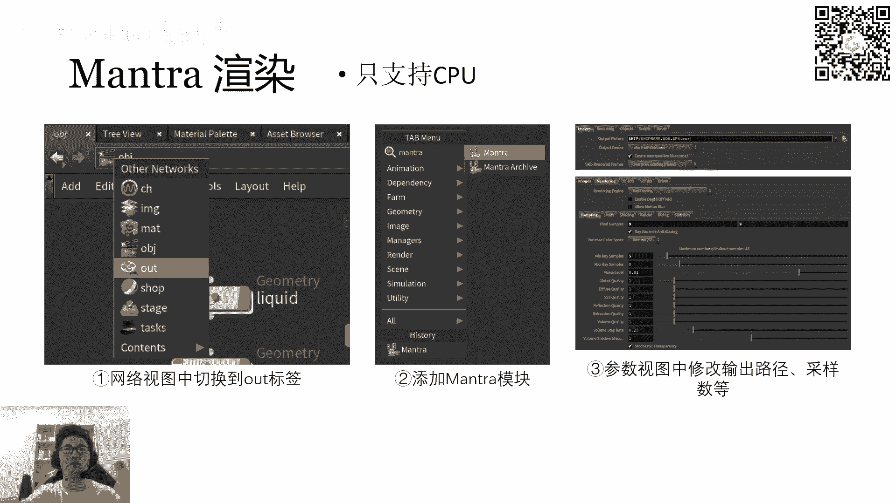

但是你你如果把渲染的材质调好，肯定是会更好看的，OKOK没事，对今天主要的缺陷还是没办法在家一步步实践，就是大家如果说是照着这个PPT的流程做的话，然后哪个步骤出问题了，还是要及时去联系我。

在群里或者直接私信我都可以啊，行我觉得我们时间也差不多了，如果大家还有后续什么问题，就在群里提出吧。

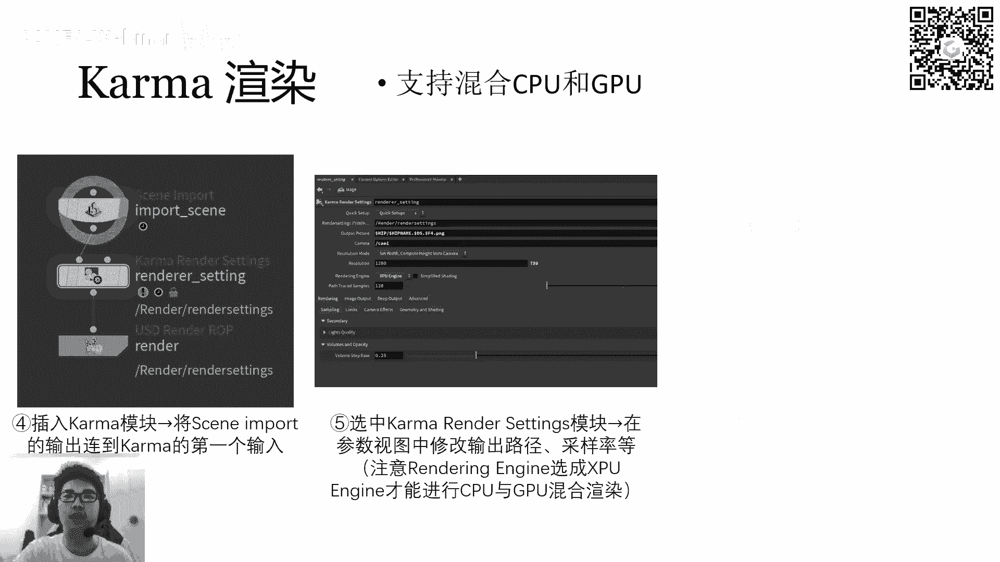