# GAMES002-图形学研发基础工具 - P2：Windows+cmd+PowerShell - GAMES-Webinar - BV1cC411L7uG

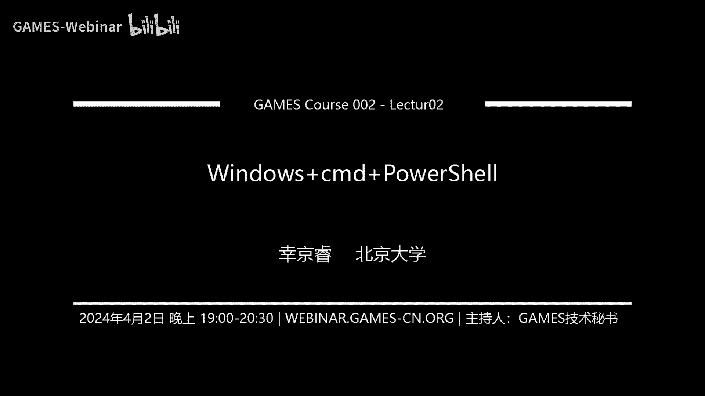

呃OK现在应该能够看到我的PPT好，大家好啊，好的好的行，那我们就开始吧，我们上周也是讲啊，给大家介绍一下LINUX系统以及linux shell，的一些基本的用法啊，那我们这周呢就继续讲一下。

windows系统和它底下两个比较嗯，比较常用的shell吧，一个是CMD，另外一个是power shell，然后也跟之前一样，我会先把视频关掉，然后等到最后我们再打开，因为可能会挡一下PPT嗯。

好的呃，首先我们也是嗯讲一下什么是windows，Windows，它是一组由微软开发经营销售的，图形化操作系统家族，可以看到它和LINUX的最大差别就在于，它不再是开源的了，而是由微软，所以所有。

然后它是一个操作系统家族，我们可以从下面这样一个结构图来展示，首先呢windows它会分为这样几个家族，最最老的一些它不是最老的，就是很老的一些系统叫做windows9X呃。

比如说windows9598这些系统，这个呃这里的windows9X表示的是他呃发布的年份，比如说windows98，它就是1998年发布的，所以呃这个已经这种这些系统，已经非常有这个年代感了。

然后后来呢随着这个技术的发展，windows microsoft它推出了一种新的技术，新的内核叫做windows nt，NT呢它是new technology的一个缩写啊。

然后这个新的内核也就取代了之前的windows，9X的一系列系统，然后此外呢windows还会有一些其他的家族，比如说windows I/O t，Windows i o t。

IOT大家应该都知道叫做internet of things啊，这个windows I/O t它的老名称叫做windows embedding啊，对呃，他是一个专门就是呃。

他这这这个家族里的所有系统都是嵌入式系统，它是呃安装在嵌入系统，就是说安装在一些呃比较微小的设备上的，比如说你的手表呃，你的这个手表，还有比如说呃对，大概就是这种可和一些其他可穿戴式设备吧。

包括可能眼镜也那种，眼镜也算嗯，然后在windows new technology系统啊，就是我们现在所用的系统啊。

其实都是属于windows new technology这个windows nt这个家族的，它主要也分为两类，一类是windows server，然后windows server。

它的意思就是安装在服务器上的windows系统嗯，然后从老到新也有这个windows nt3。1到4。0，然后再到windows2000，然后再到2003到200222022。

这些都是在服务器上运行的windows系统，当然这个可能对于我们科研来讲啊，这个windows server可能没有linux server那么常用嗯，我们最常用的LINUX系统。

还是属于下面这个其他类当中啊，这个其他我之所以叫它others，是因为我并没有找到一个，就是并没有找到一个学术，就是官方的名词能够概括这一类操作系统啊，这类操作系统呢，就主要是装在我们的个人电脑上的。

一个一些操作系统，然后从2000年开始呃，有windows xp，然后再到windows7以及windows10，我标出的这三个是，应该是可以说几乎没有人没听过吧，呃如果你可你出生晚，你可能没用过XP。

那你就从七开始，然后用十呃之后，但是在win7之前啊，就是基本上所有的这个windows系列电脑都是XP系统，在我们知道就是这三个标黑的地方，就是windows7推出的时候，其实就是推出一段时间之后。

微软其实已经停更这个windows xp系统了，然后同理呃，后面也就是在推出windows11段时间之后，也完全停更了这个windows7，就是相当于强制大家更新这些系统嗯，然后接下来呃也推出了。

我们现在是有windows11的，然后我们也不知道他会不会我，我我个人认为他之后应该也会就是用windows11，全面取代windows10，因为现在的用电脑的话，大家应该有一定经验啊。

就是你的这个更新，经常是让你是推荐你把电脑升级成为note11，OK啊，至于windows的一个发展史呢，我们大概可以从它的图标的发展史窥见一斑，就是从1985年开始。

这个他的这个windows它可能还是一种DOS系统，所以都是用字符的一种图标，然后到了91年才开始，变成我们很经典的这种四个方格啊，就是这种四个格子的windows图标，然后再往后呃。

到了01年就是windows xp，然后再往后就是win8，win10以及win11这些系统，也可以看到他的这个图标发展史也是挺有趣的，OK是大概就是对windows的一个简单介绍。

嗯那接下来我再来讲一下windows，我们为什么要windows啊，就是它的一些好处吧，首先它的优点呢就是它最突出的优点，就是说它图形化界面是非常强大的，然后以及它的用户基数也很大。

因为嗯对就是用户基数大，相当于在这个基础系统基础上，开发的软件也会很多，所以就是很多东西它都只支持windows，那你就不得不用windows是这样一个事情，然后windows它也有很强的兼容性。

硬件兼容软件兼容都挺强的，然后还有一个优点，它就比较简单易用嘛，因为它的图形化界面非常的呃，interactive非常的图形化界面非常的简便，接下来应用场景我觉得可以说是almost anything。

就是你可能尤其是在图形学里，基本上日常使用的电脑都是windows系统，因为这个上面的图形化的开发应该是最简单的，在这个系统上呃，至于访问windows的话，我觉得这个没必要多说啊。

首先就是你一般正常买的一种，比如说联想的电脑，它就会自带一个windows，你买的电脑就是自带，就是你买的电脑那个价钱里面就是包含了嗯，正版的windows系统啊，如果说你实在是买了一个从零开始的。

自己攒的一台电脑，没有系统的话，你也需要去安装，先先去购买windows系统，然后去安装呃，安装的话也是一样的，需要一些启动盘去，这和LINUX一样啊，去需要一些启动盘去安装，然后另外也可以使用虚拟机。

虚拟机里面放windows，就是这个使用虚拟机的好处主要是什么，就是你可以你可以把程序放到虚拟机里运行，就像放在沙盒里一样，如果这东西带一点病毒，那可能不太会影响到你外面的这个系统的，这个环境。

只会去破坏你的虚拟机的环境，然后这样的话就会安全一些吧，就在你一些呃，不确定它来源的一些程序的情况下，嗯好，接下来呢，我们在接下来就是呃windows的部分就结束了，我相信大家应该没有什么问题吧。

如果有问题也可以提出来啊，接下来就讲一下CMD和power shell的内容了，对CMD和POWERSHELL在讲它的用法之前，我们先来一个不等式，那就是说CMD不等于power shell。

我们上一次课讲的时候，其实也有人也有弹幕提过问，就是说CMD和POWERSHELL其实难道不是一样的吗，为什么要分开讲，但实际上他们非常不一样啊，他们其实可以说是完全是两种脚本，两种命令行呃。

首先呢power shell它是不执行执行CMD命令的，就我们看上去，power shell好像我输入一些CMD命令到power shell里面，它也可以work，而且跟c mt里的行为也非常相似。

这不是因为这些CMD命令直接属于POWERSHELL，就是而是因为power shell它提供了一种种alias，也就叫别名的一种机制，它可以把一些CMD的，就是把一些power shell中的指令。

去映射到CMD的那些简写的形式，从而你在调用CMD指令的时候，它会自动转化成对应的power shell指令，而那些power shell指令和CMD指令的行为非常相似，所以呢。

呃就看上去好像CMD是它的一个子集一样，但实际上不是这样的，CMD和POWERSHELL可以说是独立的两个东西，他们没有任何包含关系，但是POWERSHELL呢它确实啊要比cm要强大得多，你可以这么说。

就是CND能做的事情啊，几乎所有事情吧，就所有事情power shell都可以干，对这个从这个含义上，你可以说CMD它是属于，就是比如说被被包含于这个POWERSHELL。

然后power shell它有几点，一个是他每一条命令呢它叫做command lets，我们在最后也会讲到，他的每条命令都会比CMD要复杂，其实都是一个小型的命令程序。

另外的power shell和CMD它的设计理念不同，CMD它的本质上呢就是只希望呃，就只想让你用CMD去干一些很简单的事情，比如说批处理呃，类似于呃一堆文件，我要把它进行一些处理啊。

重命名或者拷贝这种操作，但是power shell的话呃，就是它支持的功能就越远远，更就要复杂的多了，然后POWERSHELL它其实更像一种高级语言，它可以说就是一种高级语言，它可以运行复杂脚本。

然后他也是面向对象的，没错，他和Python一样，都是面向对象的这个一种语言呃，但CMD呢不是面向对象，CMD里面所有指令的这种传输管道啊，什么它都是以这个字符串来进行的，它相当于传输指令之间的传信息。

传输只靠字符串，那POWERSHELL呢则可以把一个整个结构化的对象，传给在这个指令之间传递，呃这里是一个简单的比较啊，我们可以总的概括来说，就是POWERSHELL比CMD要强大的多。

呃它还支持跨平台，然后以及一些可扩展性，但是呢因为很早很早的一些微软的windows的版本呃，他是不支持POWERSHELL，它那个POWERSHELL提出要比windows要晚。

所以说呃POWERSHELL可能会不支持一些很老的系统，但这个其实不是什么问题，因为我们没有没有人才会去用那些系统了，呃CMD呢则是不一样的，因为CMD相当于就是系统自带的一个shell。

它测试和系统这个呃同时出现的好的，然后接下来大家可以跟着我一起来启动一下，你的电脑里的CMD或者POWERSHELL啊，我一开始会讲一些CMD当中的命令啊，我建议大家先启动CMD。

因为有些命令它在POWERSHELL里的这个行为，跟CMD里表保就是表现的不太一样嗯，然后启动的方法大家也应该很清楚了，就是你用开始拆菜单就可以启动，或者说用windows加R。

然后启动进入相应的shell名称，然后就可以启动了，呃还有一种很便捷的方式啊，就是你如果打开了一个文件夹，我想在这个文件夹里直接打开我的power shell，你就可以用按住shift啊，不好意思。

这里拉了一下，就是你要按住shift键，然后再右键单击一下文件夹的空白处，然后这个时候你会发现菜单栏里有一个选项，叫做在此处打开POWERSHELL窗口，你点开之后就会发现POWERSHELL。

它那个当前路径就直接设定为了，你现在打开这个文件夹的路径呃，这里稍微有点对，稍微有点错误，稍微改一下嗯，右键单击，啊，然后有可能会有很少很少一部分同学需要去，安装或者更新一下POWERSHELL。

这个的话呃你你你如果真的需要的话，就是你电脑上没有power shell，这个基本不可能，然后如果你实在需要的话，你可以先打开CMD，然后后面去官网去好啊，安装一下好的。

然后CMD指令也从CMD指令讲起吧，CMD的命令行的这个格式其实和linux shell非常相似，它也是呃第一个单词是我的那个命令，我想让他做的命令，然后后面跟上若干个参数。

这个每一个参数呢可以是三种选项，三种情况之一啊，第一种是文件名，第二种是路径，第三种是选项文件名和LINUX一样，就是嗯对，然后路径的话和LINUX会稍微有一些不同，首先呢windows下的路径。

它的这个他这个就是呃，这这条链它其实是由这个反斜杠连起来的，但是实际上LINUX它是用正斜杠，也就是除号连接起来的，这是它的不一样的地方，然后在windows里面这个CMD里面建议都用反斜杠。

因为这个东西它其实挺迷惑的，就有的时候你用正斜杠它可以work，但是又反斜呃，又但是在另外一些情况下，你用正斜杠它就报错了，所以呃但是反斜杠它一直都是支持的，所以大家可以就是习惯一下。

去用反斜杠打这个目录啊，打这个路径，然后呃与LINUX另外一个不同点是，LINUX它不是有一个统一的根目录吗，就是叫做对根目录，但是嗯嗯windows它不太一样。

因为windows它其实是把这个磁盘分区，暴露给这个用户了，所以呃磁盘的分区就会分出这种C盘，D盘，E盘这种东西，所以开头呢它就是一个盘符呃，盘符是一个字母加上一个冒号，比如说C盘D盘这样的东西呃。

第三个呢第三个情况就是选项了，选项一般都是以这个正斜杠，或者以这个减号开头，然后后面一般是跟一个字母，后面也有跟多个字符的情况，这个选项呢就是也类似LINUX当中的选项。

就是呃会呃有些选项后面会跟一些别的参数，就是选项后面跟的那个argument，有一个特殊的含义，或者说这个选项本身是一个类似开关的东西啊，你你你打开这个选项，表示这个开关打开，然后没有这个选项。

表示这个开关就关闭，我这里有一个例子，就是erase杠f my fault txt，这个是什么意思呢，就是GF就是说强制执行的意思，erase是删除的意思。

也就是说我要强制删除这个my fault xt，这样一个文件，这个这条指令的作用就是这样子，然后接下来另外还有一些就是windows，其实它这个CMD尤其是CMD啊，它不像LINUX那么好嗯。

不像LINUX那么好用，就是因为它有些地方空格和引号，它的含义是不规律的，我可以举个例子嗯，我先调出我的CMD来。

对大家应该可以看到我这里的命令提示符吧。

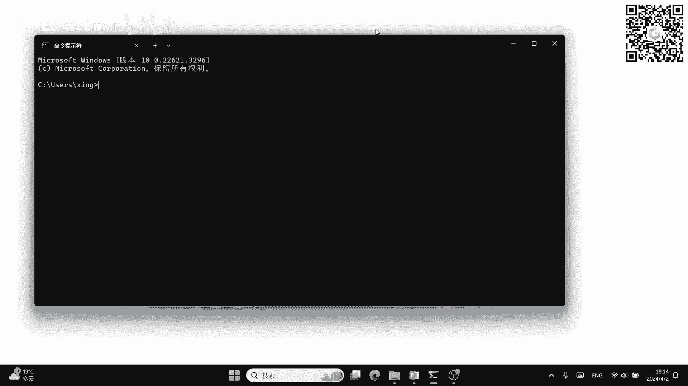

啊我首先切换到一个我想要的目录下，然后要注意一点事情，就是这个在命令在CMD这个CD指令，如果你想切换这个盘符的话，它是没有办法直接切换的，你需要再就是再输入一下盘符。

它才能切换到你想要的那个那个那个路径下，然后比如说我先创建一个my file，然后接下来哦对不好意思啊。

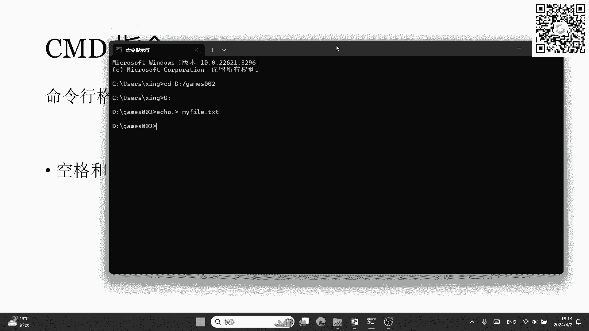

我展示的事情是这个空格和引号。

它的含义不规律，这个事情哈，嗯就是比如说啊我想echo一个hello world，我们知道在LINUX里面，他这个其实代表的就是hello和word是两个参数对吧。

所以然后他在输出的时候会把两个参数之间加，自己加一个空格，但是这里就不一样了，我这这里不管我敲多少个空格，它都会原样不动的输出，也就是说这里echo后面这个东西啊，它会把所有的啊对他会把所有的东西呃。

所有的内容，你不管输的是空格还是非空格的字符，都会当成字符串，所以它会这样输出来就很奇怪，然后如果说我加上引号，他这个引号也会输出来，也就是说他把引号这个东西也看作echo，后面跟的那个字符串了。

所以这里的引号就跟就不太一样，但是你在别的地方，引号又可以表示括起来的意思，比如说我想切换到一个路径，在这个路径下有一个叫做space dr的东西，这个就是说我故意设置的一个，包含空格的一个路径。

然后这个时候你你加上引号又是没有问题的，它就相当于把这个space dr这个东西，扩到一个串子串里，在所有CMD里涉及到路径的呃地方，然后路径里包含空格，你都可以用引号括起来，这是没有问题的。

但是在echo里这个引号就失去了它的含义，所以这个在CMD里面，每条指令它其实这个协议吧这个规则不太统一。

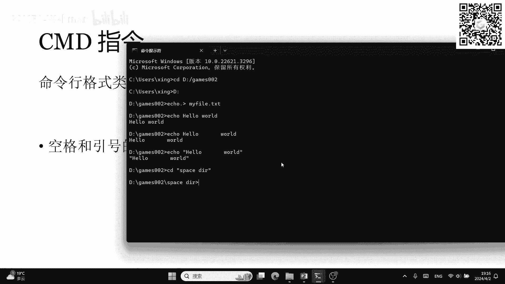

所以没有LINUX那么好用，然后另外呢CMD也支持重定向，和管道和LINUX一样，我呃我相信大家也应该知道吧，就是呃应该还记得这个LINUX的管道和重定向，是怎么做的吧，大家可以啊。

可以去可以在弹幕里打出来一下，LINUX管道和重定向是怎么做的好吧，就是我想重定向一个指令的输入是什么呃，重定向指令的输出是什么，然后在文件末尾追加是什么符号，然后管道又是什么符号。

这些用法大家可以嗯可以打出来啊，这里我就不再重提了，然后呃，接下来呢又是就是在CMD里面，有一有一些常用的命令，我在这个表格里展示出来，并且啊最后最右边一列是它对应的类似功能的。

linux shell里的命令，这里的功能只是类似，并不能说是完全一样啊，呃具体他们有什么差别，你们还是可以去自己命令行里输入，就是去对比一下，所以呢就是你可以发现CMD和linux shell。

使用方法其实是非常类似的，因为嗯因为每一个操作，基本上都可以找到对应的指令，嗯对然后这个表格我也先过了啊，大家可以在课后去看一下，嗯很好，我看到弹幕里有打出那个重定向和管道的啊，没错是对的，然后呃。

接下来我来讲讲一下，这个windows里面的账户权限是什么一个概念，windows里面那它分为三类不同权限的账户，一类是管理员账户，一类是标准用户账户，然后第三类呢是来宾账户，管理员账户拥有最高权限。

可以类似于LINUX的root账户，它可以完全使用计算机，并且可以管理其他的账户呃，第二类标准用户账户呢，就是它的权限要比管理员稍微低一点，但是它可以正常的访问计算机以及执行程序。

它不能做的事情就是更改其他用户的设置，以及系统设置，然后也不能在电脑上去安装新的软件，OK第三个是来宾账户，来宾账户呢它只适用于临时访问的，他的权限是最低的呃，他无法第一无法更改系统设置。

第二无法安装应用，第三有一些私密文件也是不可以访问的，所以说呃但是我们现在很少用来宾账户了，来宾账户其实就是你把电脑锁定之后，但是你的电脑又想临时的给另外一个人用啊。

那你基本上就只能让那个人去用来宾账户，我们现在就是因为windows它有一个叫做MICROSOFT的账户，然后如果你把MICROSOFT账户去绑定到电脑里。

然后电脑里只有你一个MICROSOFT账户的话，那你基本上就是有管理员权限的嗯，当然我们这个正常使用的时候，还是用这种标准用户账户的身份去做的，因为你会发现就是在有的时候。

windows你想安装一个程序对吧，嗯你从网上下载了一个安装程序，然后要双击运行的时候，它会弹出一个窗口对吧，让你授权这个能不能运行，其实就是让你以管理员身份去授权它，然后这个时候。

如果你这个账户没有管理员的权限，那你就是授权不了，或者说你需要输入输入管理员的一个密码，才能够授权，然后所以呢类似于LINUX的SUDO，SUDO这个操作速度，我相信大家还记得吧。

提升我这条指令的一个权限，如果我想在windows里做类似的操作呢，怎么办，就是说我在打开的时候，打开我这个CMD或者power shell的时候，我又见他，然后选那个以管理员身份运行就可以了。

然后任何程序其实都可以以管理员身份运行，这样的话，你就相当于给了那个程序管理员的权限，然后那个程序就可以任意的操作你的电脑了，对所以你要做这个事情之前，你也得确认啊，我你得确保那个程序没有攻击性。

不会伤害你的电脑。

可以给大家演示一下，就我在CMD里打开，我在开始菜单里打开CMD，然后这里会有一个以管理员身份运行这个选项。

你点点开就可以了，然后这个时候它会弹出一个窗口，然后你要给你给他授权。

OK打开之后是这样子。

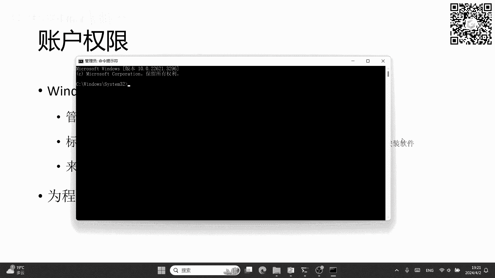

嗯接下来是文件权限，刚刚讲的是用户权限，然后windows管理这个文件权限的方式是什么呢，是叫做一个访问控制列表啊，它的英文名字叫做access control list，然后缩写叫AACL。

访问控制列表，它是相当于是文件CENTRIC的，file centric的一个管理方式，呃，我们知道就其实你学过操作系统，其实我们会知道文件权限，它其实文件这个东西它有两种管理方式。

一种是fl centric，一种是user centric，user centric的话，它相当于是在每一个用户底下去记录，去维护一个呃，list表示我这个用户可以呃，以什么样的权限可以去操作哪些文件。

而这种像windows这种这个呃fifth centric，它的方法就是说呃，我在我为每一个文件去维护这样一个list，然后list里面表示的是有哪些用户可以访问我，有哪些用户可以以哪些权限去访问我。

OK呃这个访问控制列表怎么查看呢，呃很简单，它是呃你右键单击一个文件，然后点击属性，然后再点击这个安全选项卡，对可以，可以给大家稍微演示一下，比如说我这里有一个my file txt，我右键。

然后就会有属性，这个东西在哪里呢，属性在最后，然后你点开之后点到安全里，然后就会弹出这样一个这个小窗口，这个呃对，然后上面这个框，它是表示说我我这个用户可以访问它的，用户有哪些，然后下面表示呃。

你可以在上面选一个用户，然后下面显示的就是，这个用户可以对应有哪些权限，比如说这个users对这个file，就只有读取和执行的权限，然后如果是比如说这个administrator是管理员账号。

他就是有完全控制的权限，呃接下来讲一下CMD里面的变量，它其实也是有变量的，而且很类似那个很类似LINUX的shell，它的赋值跟LINUX不太一样的地方，就是前面要加一个set。

在LINUX里面的赋值呢，它直接赋值就可以了，直接你输入负等于半就可以了，但是在CMD里面呢，你就需要对你就需要前面加一个set，表示我这个复制语句前面要加个set啊。

然后赋完值之后去访问这个变量怎么做，就是呃在前面和后面分别加上一个百分号啊，这个的意思就是说把负的这个值去替换掉，前面前后加一个百分号这样一段串字符串，Linux。

大家可以回想一下LINUX怎么访问LINUX，就是在前面加一个dollar好，然后嗯这里有个例子啊，就是我们知道在在windows下呃，也有一个叫做pass的环境变量。

它和LINUX下的pass是一个意思，就是说我要运行程序的时候，我在CMD里面不加任何前缀，不加任何前缀路径的时候，我想运行一个程序，都是在pass这些路径里面去搜索，我想要的这个程序。

然后再搜到了就运行，搜不到就报错，所以这个pass跟LINUX是一样的，然后如果我想用命令行给pass添加一条路径，要怎么做呢，用这样一条指令，set pass等于两边百分号，一个pass。

然后后面加一个分号，然后后面跟上我新的路径。

这个我们可以看一下，给大家看一眼呃。

比如说我现在去echo一下pass。

我可以看到有这些有这些这个目录对吧。

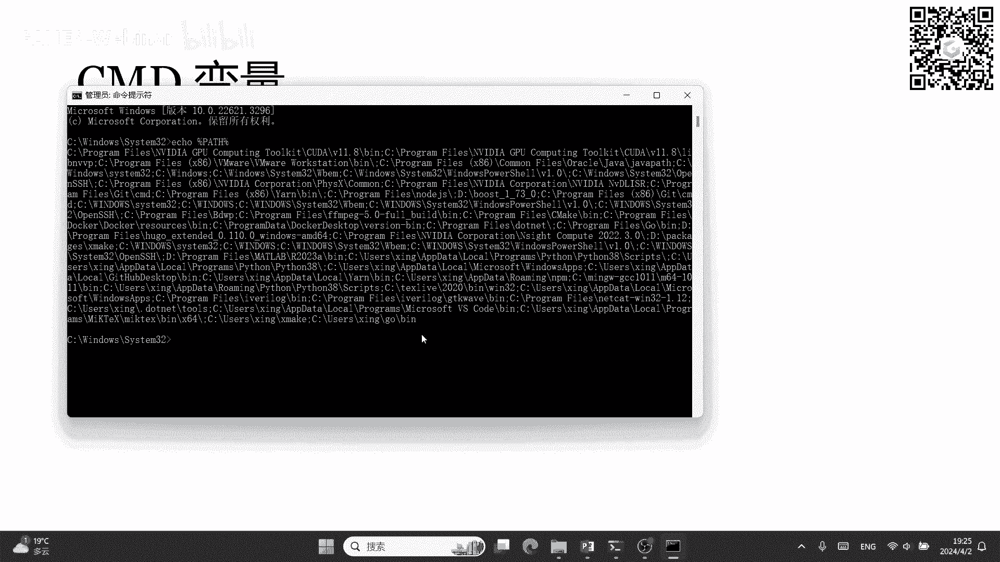

但是我现在呢如果我想加一条路径，那就相当于set pass等于，然后分号T，然后我现在在看，其实他就是说在这个串末尾连上这么一个字符。

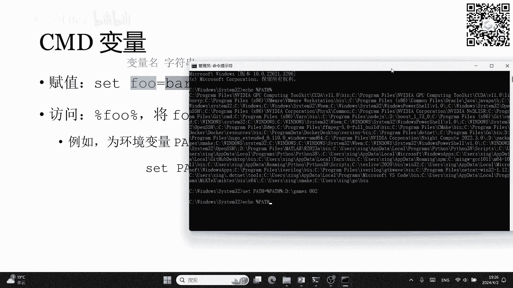

然后我们再看pass后，后面就添加上了这个这个这个路径非常的简单。

然后如果我们想删除一个变量的话，就是说我把后面这个赋值操作，把后面的东西就放空就可以了，像这样set负等于，然后后面什么都没有，就表示我要删除这个删除这个变量，然后如果说你set后面啥都不跟。

它表示的是查看所有环境变量和当前局部变量，这个有点类似于LINUX中的set命令，就是说查看所有的当前这个shell里面，可以看到的变量，可以使用的变量，然后set后面也可以跟一个名称表示我查看。

比如说set for，就表示查看所有变量名中，包含FO这三个字母的一个变量，好的，呃和LINUX一样，set指令，我天做的这个赋值只会影响当前的CMD窗口，我无论是修改了。

像刚才一样修改了这个pass pass变量，还是说我新建了一个复变量，我在关掉CMD，在启动之后，这些变量这些修改就不存在了，因为修改和添加都不存在了，如果想要永久修改呢，就需要用到set x指令。

set x指令它没有这个等于号了啊，要注意它的sex指令后面跟两个东西，一个是变量名，后面是用引号括起来的，呃，他的这个字符串就是它的值，比如说我想永久的创建一个负，然后它的值是bar。

这样的话我就去用第一行这样的指令，set x负引号B，然后它会它的操作呢是我会添加并且修改呃，添加或者修改当前用户的环境变量，就是在windows里边的环境变量，它是分用户的。

有一部分环境变量呢叫做当前用户的环境变量，这些是用户之间不共享的，另外一部分呢叫做系统环境变量，就是你登录哪个用户，它都会有这些环境变量，如果我想修改或者添加系统环境变量呢。

就会在后面加一个杠M这个选项就可以了，非常的简单，但是呢有些局限，就是菜塔X它没有办法永久删除一个环境变量，或者说CMD里面就没有这种指令不能删除，那要怎么删除，那要去怎么删除呢。

我们其实因为我们知道LINUX，linux windows它其实是一个图形化的一个系统对吧，操作系统，所以他的任何高级操作，都可以用图形化的方式来解决，你没有必要，其实没有必要去用那个命令行。

我们可以用图形界面去编辑环境变量，这个方法呢，就是说我右键桌面上的这个此电脑图标，然后点属性，然后再点进去高级系统设置，然后再点环境变量，我就可以查看到这样一个窗口，然后上面是用户变量，下面是系统变量。

然后如果我想去编辑的话，我直接选中一个点编辑或者双击就可以了，然后新建的话，这里也有，然后包括删除也有，我现在可以呃对可以给大家做个示范啊，我这里是呃给大家做个示范吧，我这里是windows11系统。

win10可能会跟我稍微有点不一样，但其实差不多还是点属性，然后这里有个高级系统设置，然后呃接下来就点这个环境变量就好了，然后这里面所有的上面是用户变量，下面是系统变量，这些所有都展示出来。

比如说我想加一个pass pass在哪里呢，pat在这里，对我想加一个的话，我就双击这个东西，或者说点它编辑，然后在这里面就可以新建了或者删除啊，什么上移下移都有，然后比如说我想删除这个负。

等于半这个负这个系统变量，那我就直接选中它，然后删除就好了，非常的简单对吧，所以在windows下很多情况下，你只需要用图形化界面就能解决问题了，没有必要去弄呃，去这种去用他的这个命令行。

所以windows它其实设计理念就是说，尽可能的让你能够去用那个用图形化的界面，去解决你想要做的事情呃，脚本的方创建方法呢是先新建一个空白文档，然后去把它的后缀名改成点BAT呃。

因为默认的空白文档是点TXT的后缀，然后你改成点BT的这个后缀，然后它也叫呃改成点PAT的这个后缀，然后为什么是点BAT呢，BAT它其实是一个batch的缩写呃，所以说这个脚本文件也叫做批处理文件。

在windows下，对然后刚才提到的就是在LINUX下，他判断一个程序就判断一个文件是否可执行，是通过权限位来判断的，windows也有类似的权限位，但它不是以这个为依据，去判断是否为可执行文件。

而是以后缀，就后缀名或者说扩展名是来判断它是否可执行，如果是点EXE文件，它就会默认为是一个可执行文件，然后如果是点bat文件，它会默认是一个，用CMD这个解释器，去解释了一个脚本的脚本文件。

对然后所以说嗯所以说如果你在windows里啊，如果说想把一个普通文件，其他文件改成EXE文件，它也会认为一个可执行文件，你双击那个你自己改成EXE的文件之后呃，你会发现它就变成它就会呃它就会运行它。

Anyway，就是把直接把你那个文件的内容的二进制，看成是我的一个呃计算机执行的代码，所以你直接点开它，就也会去试图弹出一个DOS窗口，然后运行，然后会发现他肯定会报错，因为它本身不是EX文件对吧。

所以大家尽量不要去这么做啊，不要去把其他类型的文件改成点ex e呃，OK然后继续啊，就是呃如果我想编辑一个对，我刚才已经创建了一个点bat文件之后，我想怎么办，我我我我想去写一下这个脚本程序。

方法就是我去右键单击这个文件，然后在菜单栏里选出那个命编辑那那一项，然后点完编辑之后，它会弹出一个记事本的窗口对吧，大家可以照做一下啊，弹出一个记事本窗口，然后它其实就是一个点BT。

其实就是一个文本文件，只不过呢它的扩展名换成BT之后，你再去运行这个文件，它windows会默认去调用CMD，去解释你这个文文件里的文本O呃，在弹出我这个窗口之后，写入一系列的CMD命令保存，然后退出。

接下来你双击就可以直接运行了，然后当然也可以用命令行去调用它，比如说我可以在前面也用这个call指令，然后后面跟一个点bat文件，或者说我切换到当前这个目录下，我直接直接把这个文件名输入进来。

它也可以运行，然后这里有个例子，有这么两行代码，首先是at echo off，Echo that i at echo off，这个指令的意思是什么呢，这个指令就是说我接下来把所有的呃。

指令的输出提示都关掉，在CMD里是这样的，但是power shell里没有这个功能，也就是说我之后所有的指令，无论他运行正常与否，都是silent的，当然我现在保证了，每线文之后的所有指针都是对的。

接下来是一个for循环，这个for循环呢，它的语法呢就是呃也是有一定语法的，这个CMD脚本它也像其他高级语言一样，也有分支结构，循环结构，还有每一条指令，它其实都是有返回值的，那回到我这个for循环呢。

他的意思就是说我这个I从零开始步长为一，然后到五结束，要注意啊，这个零和五都是包含在内的，然后接下来do后面跟的是我想要执行的操作，然后后面这个括号里面，每个操作之间用这个语去分开。

然后这两个操作它就会都会运行，然后这里的echo点啊，箭箭头echo点大于号是什么意思，就是说echo点其实是什么都不输出的，意思，就是echo后面不是跟一个字符串吗，我会把这个echo指定。

会把这个后面的字符串原样输出，如果你echo后面紧跟着点，就表示我什么都不干，就什么都不输出，但是这个这个情况我后面，但是在这里这个指针就有用了，就是我后面跟一个管道输出到file file。

序号点TXT这样一个文件之后呃，如果这个文件不存在，它就会把这个文件先创建出来，然后我在里面输出空的字符，就相当于等价于我把这个文件创建出来了对吧，然后后面text也一样。

然后这这里的这个循环变量呢跟刚才不太一样，刚才是前后各跟一个百分号，这里呢它又是两个百分号，然后具体这个语法也是比较复杂的，呃，我们可以去参考一下维基百科的一个啊，VICKBOOKS的一个链接。

如果大家想学的话，但是啊我个人其实不推荐大家去学这个，因为我其实也不会呃，因为为什么不推荐学呢，因为这个东西它可能一是比较的，学起来可能会费时间，二是你可以有更好的替代方案。

就是Python Python也是更应该说是比power shell更要更跨平台，几乎是应该是所有的呃，这个东所有的系统里都可以运行Python脚本，然后Python它的功能也会更加强大。

然后包括你如果想去做这个呃科研的话，嗯深度学习什么呢，肯定都是离不开Python的，所以学Python相当于一举两得了，就是一举多得了，就是所有东西都可以用Python去做好的。

然后我可以给大家做个示范，这里我这个script bt其实已经编辑好了，我可以给大家打开看一下啊，就是这两行代码，然后我接下来直接双击运行嗯，对你会发现他闪闪过一个窗口，然后退出就表示他执行完了。

然后我会发现多出来了file0到file5这几个文件，然后TXT0到TT5，任意打开一个都是空的，OK好，接下来我用命令行把它删除，能把这些文件删除，我这里删除，我用这个CMD吧。

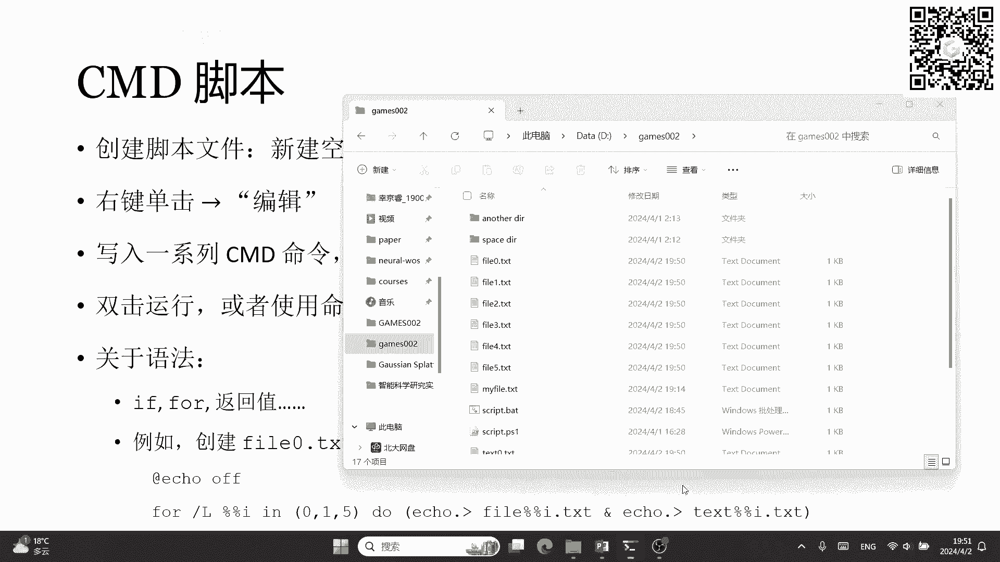

然后，三星和还有什么text星哎呀，不好意思，我老是把这个windows和LINUX记混，而M是linux by shells下的指令。

然后windows里面要用erase或者dl dl delete的缩写去执行。

然后对，然后就清掉了。

好展示完CMD脚本之后呃，接下来我就去介绍一下POWERSHELL指令了，就是CMD部的部分，大家还有什么疑问吗，可以去可以在弹幕里打一下CMD就这么多了，其实就是一些很简单的指令。

然后大家其实只要把前面我打出那个，表格里的指令呃，记住就好了，然后基本上也就只会用CMD干这么多事，然后更高级的功能，一般写个Python脚本会好好好方便很多，CMD的部分。

大家有什么问题可以在弹幕里打出来啊，如果没有的话，我就继续啊，如果对，我们可以把问题都放到最后呃，接下来只去讲这个power shell，power shell指令，我们刚才说了啊。

他每一个指令都比比CMD的要复杂，它每个指令有一个别称叫做command lets，每一个command lights，他的他的这个长相也跟CMD里不一样，他都是一个形容这样verb减号NN的一个组合。

就是动词名词，你可以想这是叫什么来着，叫动名词的一个短语对吧，前面是我想要执行的动作，后面是我要就是执行的一个对象，然后这里有几个例子，一个是get verb，Get web，它的含义就是说呃。

呃呃我就是说含义就是说显示出所有这个呃，所有可能指令的前半部分，也就是这个verb的部分，比如说我可以给呃给大家展示一下啊，给大家展示一下。

据说如果我用get verb，你会发现它弹出来一堆这个东西，然后第一列的就是它的所有的verb。

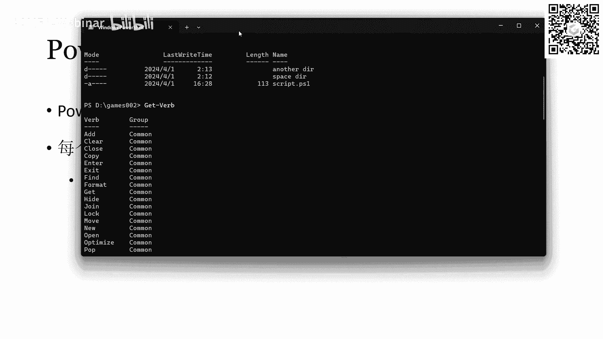

你看我们可以看到，其实get也在里边，get本身就是个verb对吧，就是说他把所有我们常用的，也不是常用的，是所有的指令的前半部分，就是前半部分动词的那个部分都都展示出来，然后后面会展示出来。

这个这个web所属的一个组group，有common data，然后后面还有life cycle，Diagonal，Diagnostic，Communication，Security other。

然后相对的相似的一个指令呢是get command，这个指令，它的作用是输出所有的存，power shell里所有内置的指令，我们可以看到这个屏幕刷了好久。

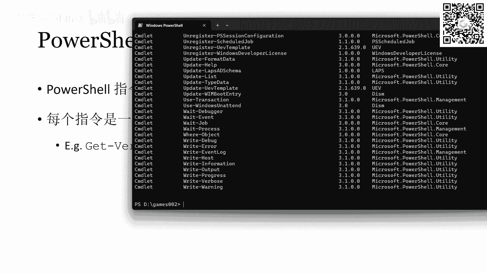

它就是有超级多这样的指令，然后每一个指令你会发现，比如说register engine event，前面register是个动词，后面就是一个名词，都是形容这样，其实都是形容这样的一个呃动名词对。

然后这也让这个power shell的这个指令呢，更加可观性强一些，不会像我们之前呃，之前那个CMD或者shell linux shell里面，他都是用一些小写字母缩写来代替调一个指令。

我们很可能需要查阅文档才能知道他什么意思，但这个一般来讲呢就看一下就看一下。

就知道他大致做的是什么了，后面还有get get这个我我后面会讲它的含义。

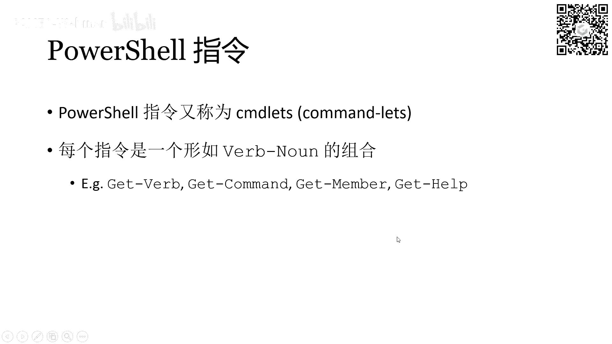

然后还有get help，get help就是一个类似于CMD里面的help指令，就是去查这个帮助文档，我我输入get help回车之后也会有一堆这个文字啊，这些就是帮助文档，然后呃。

当然他这个帮助文档只会告诉你，怎么去使用这个get help指令，然后如果你想真正的去查询一个呃，一个指令是怎么用的，你就可以在get help去跟一个指令，比如说我想知道get command怎么用。

那就输入get help空格，Get command，回车之后会发现他就把get command，这些语法都给你展示出来了，还有别名，别名就是我刚才说的alias。

就是说g cm其它其实和get command是完全等价的，然后我们发现get command，其实它不只是输出所有的指令，你可以指定它的名称啊，也可以指定使用它的别的东西，Ok。

好然后POWERSHELL里面也是很类似的，就是格式也很类似的，第一个词是我的那个指令，后面都是argument，然后后面的参数如果是那种有名儿嗯，带名的参数呢，这个参数名要以减号开头呃，这就好。

很类似于就是你写这个C加加或者Python里面，每一个函数它都有一些参数对吧，每个参数都有参数名，然后如果你想指定给某某个参数，给某个名称的参数去赋值的话，你就需要以这个减号开头。

比如说我要get command，我要指定我的名称，那后面就加一个这个名称，它的名称，这个参数的名称叫做name，所以我就加上减号name，后面再空格跟上的这个字符串。

它就相当于传给了get command name参数。

我可以执行一下给大家看呃，get command杠name呃，Sheer gun process，它会把所有以process减号process结尾的这些呃，这些串这些指令都显示出来。

这里的芯儿呢是一个通配符，表示就是匹配任何串都可以，空串也可以嗯，然后这里可以提示就是再告诉一下大家，就是无论是CMD还是POWERSHELL，在很多地方输输入字符串的地方，其实都是支持通配符的。

或者说支持一种对，都是支持通通配符的，有些地方可能还支持那个正则语言，这个大家可以自己去了解一下，通配符呢就比较的呃，可以让我们很方便的去使用一些东西，比如说我刚才执行那个删除操作，我不是erase。

或者说delete file芯，还有那个text星吗，那个芯也是一个通配符。

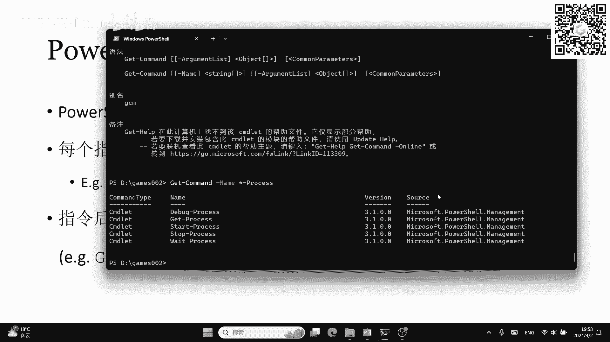

好接下来我们讲一下power shell的对象，因为呃刚才我们时不时提到了，power shot是一个面向对象的编程语言对吧，所以它它像Python一样也是有对象这个概念的，然后呃如果我想查看对象。

用get member这个指令，但是get member这个指令它的用法是这样的啊，就是它用管道来传输，它是用管道的方式来输入的，就比如说我现在这样一个指令get process。

然后管道连接到get member，就表示说我的get process，这个指令的输出输出是个对象，它的输出不再是一个呃像CMD里一样的，string了一个字符串，而是一个更高级的对象。

然后把这个对象呢通过管道直接传给get member，这个指令，那get member就是相当于把这个对象的这个信息属性，包括它的属性啊，还有他的method方法都给你展示出来。

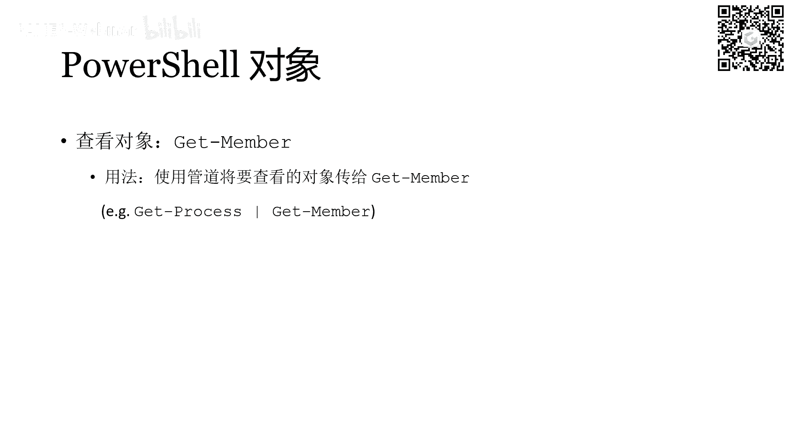

比如说我现在可以输这个命令，给大家看一下是什么效果啊，get process管道，Get member，然后首先它会输出type name，就是get process，它输出的这个对象呢。

它的类型是什么，我们可以看到这个类型它是叫做一个system，Diagnose，diagnostic process这样一个类型，然后后面呢就跟出了这个类型的所有的呃属性。

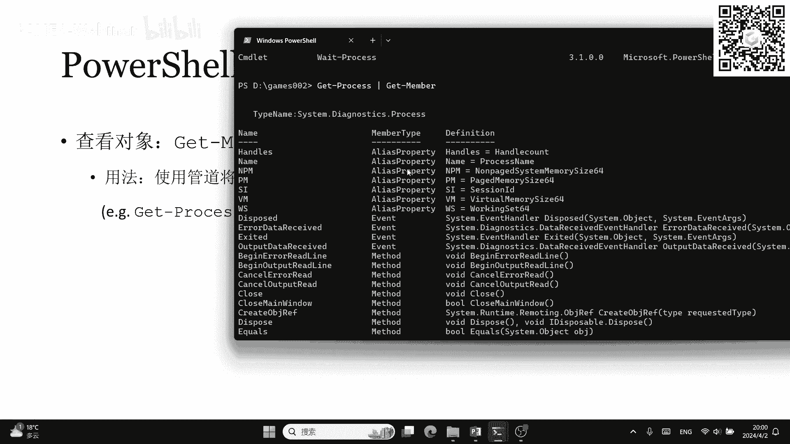

包括这种alias property event，还有method method，就是它的方法就类似我们的成员函数，它是可以调用的，然后后面还有一些property。

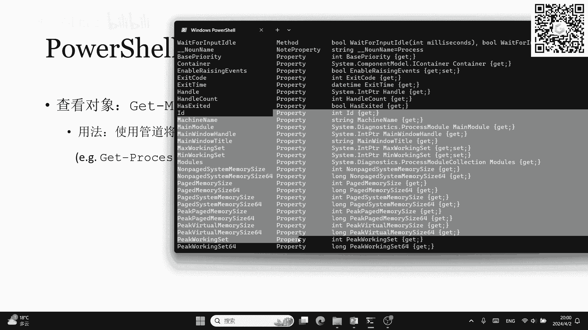

property是它的另外一些属性吧，对。

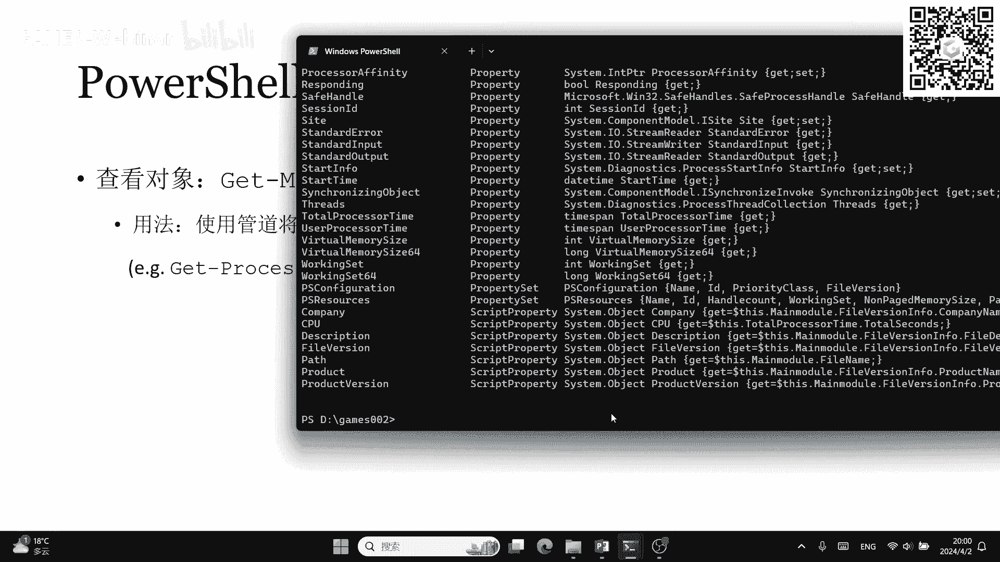

好的呃，在这里面，power shell里面常见的类型呢，也跟我们的编程语言一样，就字符串啊，int还有double整数啊，小数还有布尔类型，然后也有数组高级一点的，包括date time。

就是表示时间的一个类型，然后还有hash table，就是哈希表，还有呃文件的信息和目录信息，这样子的一些类型，当然所有点net的类型他都支持，点net呢也是一个语言，你可以理解为是一个语言嗯。

他也是一个非常跨平台的一个一个语言吧，它可以用来去跑各种各样的程序，然后我们对我们前面提到过的power shell的别名，这里再次再次讲一下呃，为什么POWERSHELL。

看上去能够支持很多的CMD指令呢，它就归功于这个别名的机制呃，别名机制我们刚才说过啊，就是相当于把power shell的一些指令，映射到一个很短小的缩写缩写字符串当中，所以你以后调用那些缩写字符串。

相当于直接调用的是对应的POWERSHELL指令，如果我想查看别名与指令名的对应，用的是get alias这样一个一条指令，我们以这个get member和gm为例啊。

get member它的alias是gm就是它的首字母，然后gm它的对应的全称也就是get member，如果说我现在是知道某一个指定的别名是什么，也就我只知道gm是什么，但我不知道它对应的是哪个。

真正的对哪个呃，他的power shell指令是什么样子的，我就用上面这一行的方法，get alias后面跟上name参数，然后输入gm。

这个name参数一般是因为它是一个positional argument，它是在第一位的a positional argument呃，所以这个name其实可以一般是可以省略掉的，嗯后面这个指令名到别名。

如果我只知道一个指令名，但是我想就是方便一点，不用每次打这么长的名称，我想知道它的别名，那就是相当于跟上一个definition参数，然后definition参数就是我这个指定的名称。

然后这个definition，它因为不是那个positional argument，所以这玩意是不可以切记，这个东西是不可以省略的，好的我们可以看一下效果吧。

Get alias，先切过来，Get alias，gm会发现它输出了这么一个东西，然后gm重定向到了get，所以说gm所对应的这个指令名就是get member。

然后如果我想get ali definition，然后get a member，你就会发现它会输出同样的内容啊，也会，然后你就可以从这个信息当中获取它的A列，名称，叫gm。

OK这应该都很好理解好，接下来我们再讲POWERSHELL脚本呃，他也是你想创建一个脚本，其实也跟CMT是一样的，只不过它的文件名日不再是点BT，而是那个点P1点PSE文件。

然后同样是用文本的方式去编辑，这个点PS文件，然后把扩展名改成点P1之后，windows会自动的去调用POWERSHELL，去解释解析你这个文件里的代码啊。

然后我们观察一下这个power shell脚本代码会发现啊，大括号什么的，小括号这些符号就一目了然了对吧，他就更更加接近的一个高级语言了，比如说和刚才的那个CMD里的脚本，执行同样的命令。

同样是创建file0到file5，以及TXT0到TT5的空文件的脚本，就用这样一个函数循环就可以了，这个减号表示小于等于的意思，然后我们也同样的是，把这段代码输到那个点PSE文件里。

然后双击执行就可以了啊，我这里也给大家展示一下啊，因为我这里也准备好了，其实已经准备好了一个script，可以给大家展开看一下啊，这里面的内容已经是这个循环了，然后保存在退出之后直接双击啊，不好意思。

双击啊，这不不太能双击运行，这个你可能得用得用那个power shell来运行。

P这个power shell直接输入这个script点P1就可以了，可能还有点杠一下，对这里跟POWERSHELL跟LINUX是一样的啊，LINUX是一样的，就是你不加点杠的话，它没有指明它的路径。

它就会从环境变量里的pass里去搜索，然后pass里没有，我现在当前这个命令没有当前这个目录，所以这个script它就找不到，就像刚才一样报错，然后你加上点杠就表示我指定了它的路径，就在当前路径。

然后弄出来之后就变成这个样子。

然后我会在看到窗口里面确实多了file0，到file5这些文件。

以及text0的text5这些文件，我同样可以删掉这些文件。

好呃然后如果大家想学拍power shell脚本的话，也可以去参考官方文档，然后他这个POWERSHELL就比command c md要复杂多了，因为它功能也很强大，它是跨平台的。

而且是面向对象的一个高级语言，但同样的我给大家建议还是同样的，就是学Python不如学Python好，学这个POWERSHELL不如学Python，就我们刚才讲的所有操作其实都可以用Python。

里边有一个叫点OS的模块都是可以做到的，好的这个今天的内容其实就这么多了，接下来呢我们要留下第一次作业，我之前跟大家说过的，所有的作业的截止日期都是结课后的一周对吧，嗯自己再强调一下。

就是6月4号的晚上11：59分呃，然后第一次作业的要求呢，是我们只要提交一个PDF文件就好了，然后呃作业一会有四个小题，然后你在PDF文件里要注明你每个题的序号呃，接下来呢对。

还有另外有些题他会让你去展示结果截图，那你就嗯需要在文档里把那个图给贴上，然后最后一定要注意是只能交一个PDF文件，不能交任何其他的附加文件，你的图片是不能单交的好吧，一定要把它放到PDF里面。

对然后其实怎么生成，怎么把图片放到PDF里，最简单的方法，现在就是用word吗，你现在可以用word写，然后之后我们也会教这个了，TX和markdown这个用法之后呢。

就可以用markdown或者LTT，更方便的去排版一个文件，然后他markdown和the text渲染出来的东西呢，就是PDF文件渲染出来的，OK然后这次作业的总分是20分，然后有八分的附加分。

然后前三道题就是那20分，然后最后一道题是选做的，然后就会额外的给给八分，然后如果你做的话，会给你额外的加八分啊，OK然后作业的要求就是我这次PPT的最后两页，然后PPT到时候也会传传到呃。

传到那个games的网站上啊，待会儿课后我会就是放开这个，放开这个作业系统的提交提交入口嗯，对作业系统我可以再给大家强调一下，就是，OK这cs哎呀，不好意思，作业系统，呃对。

OK作业系统就是这样一个界面啊，大家如果没有注册的话，可以去上一次的这个上一次PPT的，最开始第一页有这个注册链接，先注册这个课程，然后点进去之后会发现有作业，现在作业还没有开放，然后有一个作业零。

也是只提交一个PDF文档这样子的东西，然后我发现好像网上现在已经有两个人提交了，就是这个是用来测试的，是不计分的，然后接下来开放的作业一呢，就是正式计分的部分，好的，如果大家没有什么呃。

如果大家就是没有什么问题，对作业没有什么问题的话，就进入QA环节，当然对作业的问题也可以在QA环节跟我说啊，大家有什么问题吗，OK我是不是可以把我的camera调出来，OK大家有什么问题的话可以嗯。

WSL不是POWERSHELL呃，WSL在上节课讲过了，他是windows下的一个呃，Subsystem，Linux，Subsystem，然后呃如果你在windows下。

它其实就是windows下的一个程序，你运行这个程序之后，它其实就会模拟一个LINUX的环境，让你用LINUX的命令行，能够操作这个windows下的这些文件啊，资源等等，这个上次其实是讲过了的。

上次我包括我做的演示，也都是用WSL来演示的，POWERSHELL是呃是windows自己的一个shell，然后pow s l呢则是windows里面的一个子系统，LINUX系统好吧。

你说深度学习这方面用的多，你是说什么用得多呀，是说我们这两次课讲的内容吗，如果说深度学习的话，我觉得还是上一次课讲的LINUX会用的更多一点，当然对于传统图形学的话，你肯定也是离不开windows的。

比如说我做simulation，那我基本上只会用LINUX啊，不是我基本上只会用windows，因为我没有需要去，没有太多需要去train的一些东西，啊作业有AI的使用限制吗，什么意思。

你的意思是用cg p t去写吗，呃这个，我想想啊，这个事情呢其实就是呃作业它的本质目的呢，其实还是为了大家熟悉一下这两次课的内容，当然呃如果你实在不会的话，去用CHEGT，我我也没办法去查到对吧。

我也没办法查你，所以就允许吧，当然就是我还是希望大家可以先自己思考一下，如果就是去想一下这个作业的这些对应的指令，应该是什么，自己先看一下能不能做出来，然后如果是写出来不对，或者说实在想不到。

你再去问cg p t，因为这几个作业，我觉得啊就是这两次课的课件都是可以查到的，呃但但是这次这个选择选择题稍微有点困难，因为涉及到你需要去安装一个新的软件，然后还需要拍摄照片啊。

以及呃写一些Python的脚本，或者说写其他脚本，写脚本程序，然后这两次课我们都没有去介绍，没有去重点介绍脚本程序怎么写，所以这个东西你可能需要一些网络资源的，这个帮助是可以的，下节课下节课不是我讲了。

下节课是另外一位呃，我的同学叶开来讲课程大纲可以，课程大纲上次的PPT里有啊，下一次讲什么呀，我有点忘了，好像是GSORRY啊，我看一眼，CMD算不算shell的子集，我在课程刚开始的时候说过了。

CMD不算POWERSHELL的子集啊，啊你说的是shell是linux shell吗，如果你说的是linux shell，那这个就更不对了，因为他们的系统都不一样。

然后如果你说的这个shell是power shell的话，也是不对，呃，我课程刚开始说过，就是CMD和POWERSHELL其实是两个完全不一样的嗯，完全不一样的shell程序。

然后你之所以可以在power shell里使用，大多数CMD命令，是因为power shell里的alias的机制，别名机制哦，下节课不是git，下下次课是git，下次课是那个远程工具。

远程控制工具和命令行的环境，是由叶开来给你们讲的，就是远程控制你的服务器，这个还是挺实用的，好的大家还有什么问题吗，power shell和net dotnet是什么关系啊。

其实我对DOTNET没有太多理解，我只知道呢就是DOTNET里面的所有类型，POWERSHELL都是支持的对，然后POWERSHELL其实很强大，就是嗯对他是一个面向对象的，面向对象的一个语言吧。

然后DOTNET里面的所有的类型，那个POWERSHELL都是支持的，常用的库图形学，常用的库呃，你指的是什么语言的库呀，是C加加还是Python呢，如果是C加加的话，我个人常用的是那个数学库。

然后当然也有那个open gl啊，那个open gl还有那些东西，如果你想写这种渲染管线或者什么的话，肯定是需要open gl的，POWERSHELL是命令行工具，没错，打开课程大纲行，稍等啊。

嗯等一下，这个有点奇怪，现在应该可以看到吧，其实blender要讲的话也是最后一节课讲了，然后我也不确定嗯，我不确定，现在这个还没有定，目前想讲的是HDI，当然bra确实它的应用范围会更广一些。

如果讲其实也是在最后一次课讲，然后呃也只能是一个比较浅的一个，带大家的入门，然后更深层的应用还是需要去自学，这个课程大纲其实都可以讲，都可以在课程网站上找到的，天呐图形学应该死嗯。

图形学用Python你得看什么领域，当然是有的了，如果你需要PYTORCH这类，你需要那种呃对就是如果你需要训练的话，训练神经网络，你肯定是用Python是最方便的，因为那个PTORCH是很好用的。

然后最近不是也出现了一款编程语言，叫做太极吗，太极也是在Python里的一个，就是支持Python支持是最好的，所以不能说没有用，没人用Python还是很多人用的，然后追求性能的话，C加肯定是最快的。

但是呃现在太极的性能其实也是很不错的，我现在也在用太极，然后这里给太极打个广告，他可能只是会比C加加稍微慢一点，但是在写程序上来讲，它的效率会非常高，对你不会，因为如果你想写C加加，然后你要运行。

你要用GPU去写QA的话，你需要自己手写CUDA程序，但是写KA是一个，其实KA其实是一个挺复杂的语言，然后嗯太极的话就可以直接都在Python里写，然后太极的语言和语法也跟Python很相似。

呃所以说在太极使用太极的话，会在你保证你效率不是那么低的同时啊，也也可以让你的，就是也可以让你很方便的去写一个程序吧，太极其实效率很高了，比Python比Python高的太多了。

只能说比C加加可能是相当的稍微慢一点点，这个人我个人使用经历是这样子的，渲染推荐的笔记本啊，这个我也不了解，换电脑这个事情还是自己去调研一下吧，一般来讲一般来讲买个什么显卡。

高配一点的电脑应该没什么问题，好的大家没有什么问题了吧，如果没有别的问题，那我们就结束。

OK感谢大家支持。