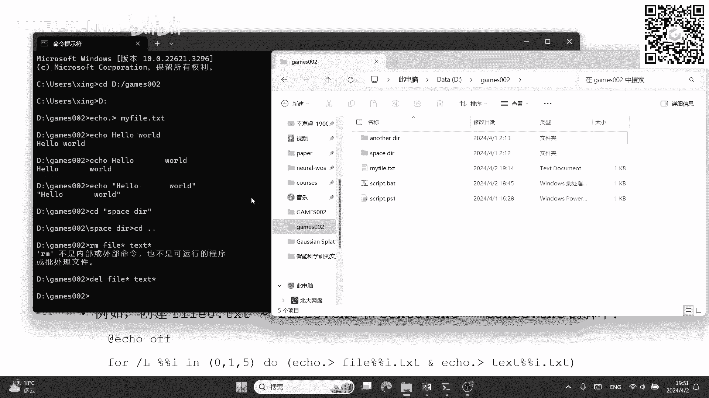
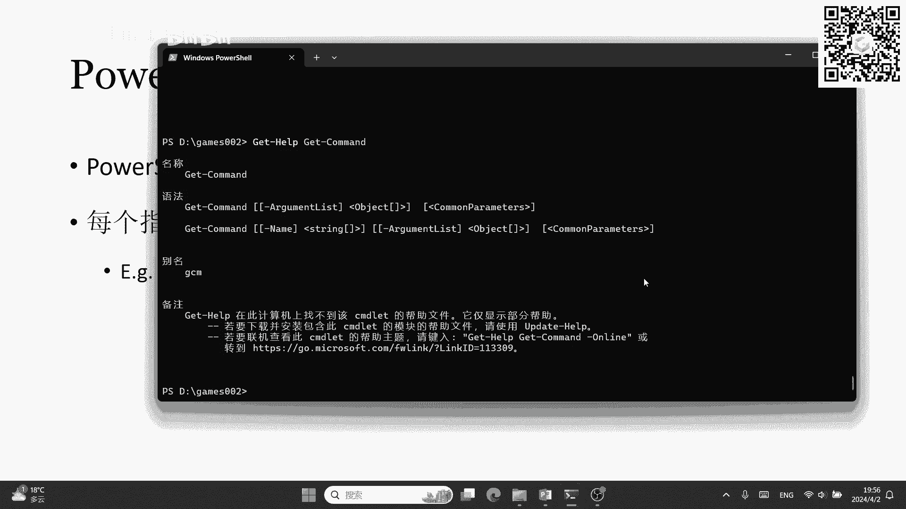

# GAMES002-图形学研发基础工具 - P2：Windows + CMD + PowerShell 🖥️

在本节课中，我们将要学习Windows操作系统及其两个常用的命令行工具：CMD和PowerShell。我们将了解Windows的基本概念、CMD和PowerShell的核心区别与使用方法，并通过实例演示帮助初学者快速上手。

## Windows操作系统概述

上一节我们介绍了Linux系统及其Shell，本节中我们来看看Windows系统。Windows是由微软开发、经营和销售的一系列图形化操作系统家族。它与Linux最大的区别在于它不是开源的。

Windows操作系统家族主要分为以下几类：
*   **Windows 9x系列**：如Windows 95、98，以发布年份命名，现已非常古老。
*   **Windows NT系列**：NT代表“New Technology”，是现代Windows系统（如Windows 10/11）的内核基础。
*   **Windows IoT系列**：专为嵌入式设备和物联网设备设计。
*   **Windows Server系列**：安装在服务器上的Windows系统。

我们个人电脑上常用的系统，如Windows XP、7、10、11，都属于Windows NT家族。

### 为什么使用Windows？

以下是Windows系统的主要优点和应用场景：
*   **图形化界面强大**：提供了非常直观和交互性强的用户界面。
*   **用户基数大，软件生态丰富**：许多软件，尤其是在图形学领域，主要或仅支持Windows平台。
*   **兼容性强**：在硬件和软件方面都有很好的兼容性。
*   **简单易用**：图形化操作降低了使用门槛。
*   **应用场景广泛**：在图形学研发和日常使用中极为常见。

访问Windows系统通常有以下几种方式：
*   **购买预装电脑**：大多数品牌电脑已预装正版Windows。
*   **自行安装**：购买系统后，使用启动盘进行安装。
*   **使用虚拟机**：在现有系统（如macOS或Linux）上通过虚拟机软件运行Windows，常用于测试或运行来源不确定的程序，起到隔离保护作用。

## CMD 与 PowerShell：核心区别

在深入用法之前，我们必须明确一个核心不等式：**CMD ≠ PowerShell**。它们是两个独立且设计理念不同的命令行工具。

*   **PowerShell不直接执行CMD命令**。你在PowerShell中输入CMD命令能工作，是因为PowerShell提供了“别名”机制，将一些PowerShell指令映射到了CMD命令的简写形式上。
*   **PowerShell更强大**。CMD能做的几乎所有事情，PowerShell都能做，反之则不然。
*   **设计理念不同**：
    *   **CMD**：设计用于简单的批处理任务，如文件操作。其数据传递基于字符串。
    *   **PowerShell**：是一种功能强大的脚本语言和Shell环境。它**面向对象**，可以在命令间传递结构化的对象，而不仅仅是文本。它支持复杂的脚本，并且跨平台。

总的来说，PowerShell在功能、可扩展性和现代性上远超CMD。但对于一些非常古老的Windows系统，可能只支持CMD。

## 启动与基础命令格式


大家可以跟随操作，启动电脑中的CMD或PowerShell。建议先启动CMD进行练习。

启动方法有多种：
*   通过开始菜单搜索“CMD”或“PowerShell”。
*   按 `Win + R` 键，输入“cmd”或“powershell”后回车。
*   在文件夹中，按住 `Shift` 键并右键点击空白处，选择“在此处打开PowerShell窗口”。


### CMD命令格式

CMD命令行的格式与Linux Shell相似：
```
命令 [参数1] [参数2] ...
```
参数可以是以下三种之一：
1.  **文件名**
2.  **路径**：Windows路径使用反斜杠 `\` 连接，盘符开头（如 `C:\Users`）。虽然有时正斜杠 `/` 也能工作，但为保证兼容性，建议始终使用反斜杠。
3.  **选项**：通常以斜杠 `/` 或减号 `-` 开头，用于修改命令行为。

例如，强制删除文件的命令为：
```
erase /f my_fault.txt
```
其中 `erase` 是命令，`/f` 是“强制执行”选项，`my_fault.txt` 是文件名参数。


需要注意的是，CMD中空格和引号的规则不如Linux统一。例如，`echo` 命令会将后续所有内容（包括空格和引号）当作一个字符串原样输出，而在路径中包含空格时，又需要用引号将路径括起来。


### 常用CMD命令对照表

以下是一些常用CMD命令及其类似功能的Linux命令：

| CMD 命令 | 功能简介 | 类似 Linux 命令 |
| :--- | :--- | :--- |
| `cd` | 切换目录 | `cd` |
| `dir` | 列出目录内容 | `ls` |
| `copy` | 复制文件 | `cp` |
| `move` | 移动文件/重命名 | `mv` |
| `del` / `erase` | 删除文件 | `rm` |
| `mkdir` | 创建目录 | `mkdir` |
| `rmdir` | 删除空目录 | `rmdir` |
| `type` | 显示文件内容 | `cat` |
| `find` | 在文件中查找字符串 | `grep` |
| `findstr` | 使用正则表达式查找 | `grep -E` |


CMD同样支持**输出重定向**（`>`， `>>`）和**管道**（`|`），其含义与Linux中相同。


## Windows权限与变量

### 用户账户权限

Windows账户主要分为三类：
1.  **管理员账户**：拥有最高权限，可类比Linux的 `root`。
2.  **标准用户账户**：可正常使用计算机和程序，但无法更改系统设置或安装软件。
3.  **来宾账户**：权限最低，仅用于临时访问。

要以管理员身份运行程序（类似Linux的 `sudo`），只需在右键点击程序（如CMD或PowerShell）时选择“以管理员身份运行”。

### 文件权限：访问控制列表（ACL）

Windows通过**访问控制列表**管理文件权限。它是“以文件为中心”的模型，即为每个文件维护一个列表，记录哪些用户能以何种权限访问它。

查看方法：右键点击文件 -> “属性” -> “安全”选项卡。

### CMD中的变量

CMD中也可以使用变量，赋值时需使用 `set` 命令，引用时变量名需用百分号 `%` 包裹。


**赋值与查看**：
```
set MY_VAR=Hello
echo %MY_VAR%
```
**修改环境变量（如PATH）**：
```
set PATH=%PATH%;C:\MyNewPath
```
**删除变量**：
```
set MY_VAR=
```
**查看所有变量**：
```
set
```
使用 `set` 设置的变量仅在当前CMD窗口有效。要永久修改环境变量，需使用 `setx` 命令或通过图形界面（右键“此电脑”->“属性”->“高级系统设置”->“环境变量”）进行设置。




## CMD脚本（批处理文件）


CMD脚本文件的后缀名为 `.bat`（batch的缩写）。


创建与运行步骤：
1.  新建一个文本文件，将其后缀名从 `.txt` 改为 `.bat`。
2.  右键点击该文件，选择“编辑”。
3.  在打开的记事本中写入CMD命令。
4.  保存后，双击文件即可运行，或在CMD中直接输入文件名调用。


示例脚本：创建一个循环，生成一系列空文件。
```
@echo off
for /l %%i in (0, 1, 5) do (
    echo. > file%%i.txt
    echo. > text%%i.txt
)
```
*   `@echo off`：关闭命令本身的回显，使输出更简洁。
*   `for /l ...`：是一个循环结构。
*   `%%i`：循环变量。
*   `echo. > file`：`echo.`输出空行，`>` 重定向到文件，从而创建空文件。



**个人建议**：对于复杂的自动化任务，学习使用 **Python** 脚本是更佳选择。Python跨平台、功能强大、生态丰富，在科研和深度学习等领域应用极广。


## PowerShell 深入浅出


现在，让我们深入了解更强大的PowerShell。


### Commandlets 与帮助系统


PowerShell的基本命令单元称为 **Commandlet**，其命名采用“动词-名词”格式，如 `Get-Process`、`Set-Variable`，可读性很强。

*   `Get-Verb`：显示所有可用的动词。
*   `Get-Command`：列出所有内置的Commandlet。
*   `Get-Help`：获取帮助。例如 `Get-Help Get-Command` 可以查看 `Get-Command` 的详细用法。

### 命令格式与参数


PowerShell命令也支持参数，带名称的参数以减号 `-` 开头。
```
Get-Command -Name *Process
```
此命令会列出所有名称以“Process”结尾的Commandlet。`*` 是通配符，表示匹配任意字符。


### 面向对象与管道


PowerShell是面向对象的。管道传递的是对象，而不仅仅是文本。使用 `Get-Member` 可以查看对象的属性和方法。
```
Get-Process | Get-Member
```
这条命令先获取所有进程对象，然后通过管道 `|` 传递给 `Get-Member`，从而显示进程对象的所有成员信息。

### 别名（Alias）

PowerShell通过别名机制兼容了许多CMD和Linux命令。使用 `Get-Alias` 可以查看别名映射。
```
Get-Alias gm
```
这会显示 `gm` 是哪个Commandlet的别名（结果是 `Get-Member`）。
```
Get-Alias -Definition Get-Member
```
这会显示 `Get-Member` 这个Commandlet有哪些别名。

### PowerShell 脚本

PowerShell脚本文件的后缀名为 `.ps1`。

创建和编辑方式与 `.bat` 文件类似。以下脚本实现与之前CMD脚本相同的功能：
```
for ($i=0; $i -le 5; $i++) {
    New-Item -Path "file$i.txt" -ItemType File
    New-Item -Path "text$i.txt" -ItemType File
}
```
运行脚本需要在PowerShell中执行，且通常需要指定路径：
```
.\script.ps1
```
**注意**：默认情况下，PowerShell可能禁止运行脚本。如果需要，可以管理员身份运行PowerShell，并执行 `Set-ExecutionPolicy RemoteSigned` 来修改执行策略（需谨慎）。

**再次建议**：尽管PowerShell非常强大，但对于大多数开发者和研究人员，**Python** 因其极致的跨平台性和在数据科学、机器学习领域的统治地位，通常是更优先的学习选择。

## 本节课总结

本节课中我们一起学习了：
1.  **Windows操作系统**：了解了其家族构成、优点以及访问方式。
2.  **CMD与PowerShell的核心区别**：明确了它们是不同的工具，PowerShell在功能和设计上更为先进。
3.  **CMD基础**：学习了命令格式、常用命令、变量操作以及如何编写简单的批处理（`.bat`）脚本。
4.  **PowerShell基础**：认识了Commandlet、面向对象特性、管道、别名机制，并了解了如何编写PowerShell（`.ps1`）脚本。
5.  **实用建议**：对于自动化脚本任务，推荐使用 **Python** 作为更通用、更强大的工具。


通过本节学习，你应该能够在Windows环境下熟练使用命令行工具完成基本的文件操作和系统配置，并为后续的图形学开发工作打下基础。