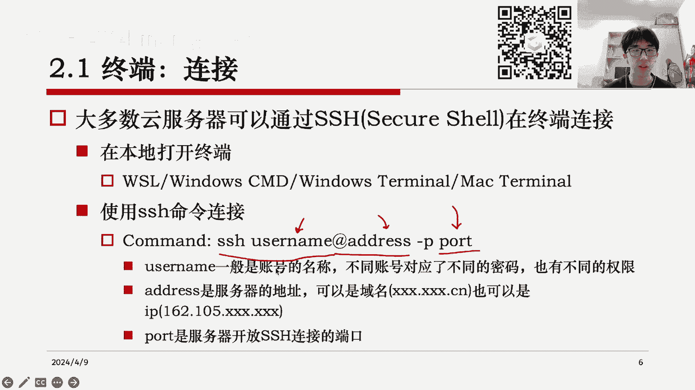
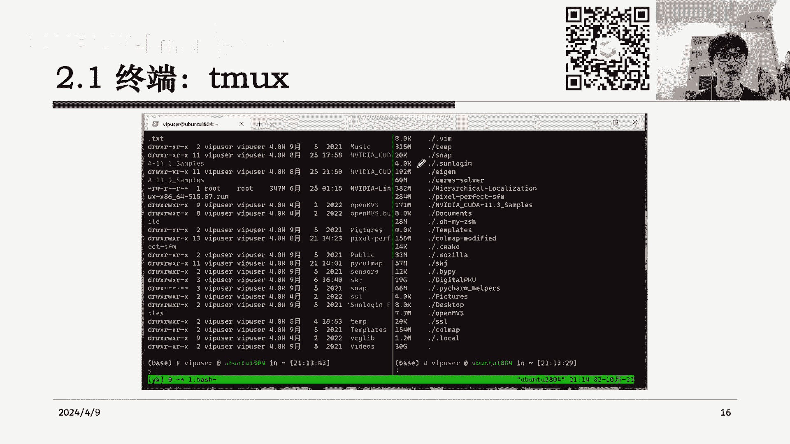
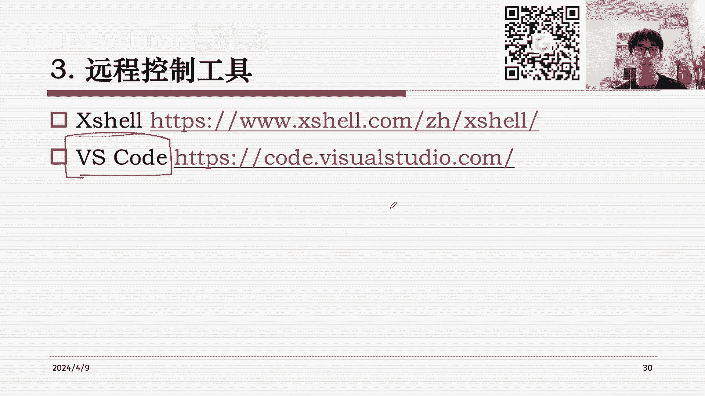
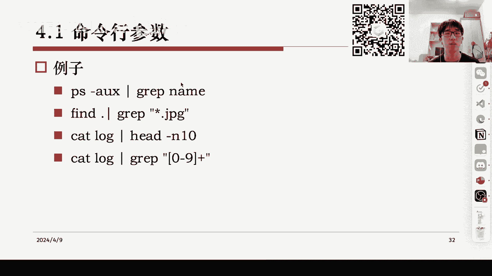
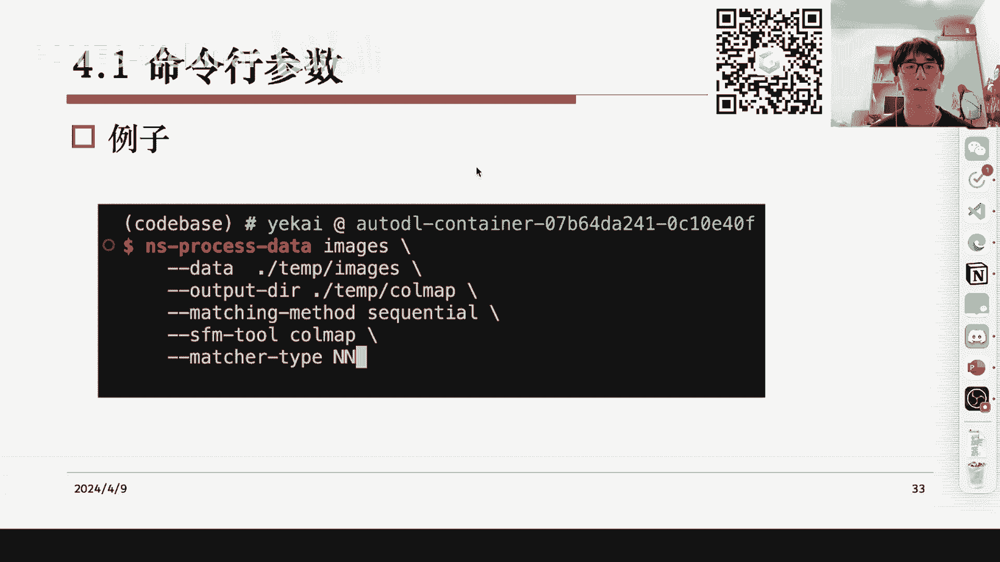
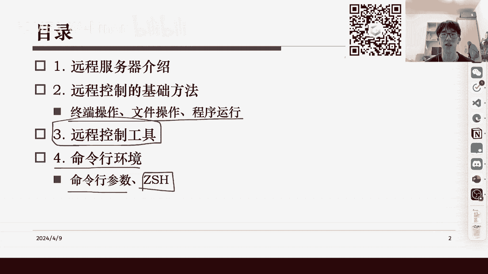

# GAMES002-图形学研发基础工具 - P3：远程控制工具+命令行环境 🖥️🔧

在本节课中，我们将学习如何使用远程服务器进行高性能计算，并掌握通过命令行环境进行远程控制的基础方法和工具。课程内容涵盖远程服务器的连接、文件操作、程序运行以及一些能提升效率的实用工具。

## 第一部分：远程服务器介绍 🚀

远程服务器，或称云服务器，是由服务供应商提供的远端计算设备。用户可以通过网络连接直接使用这些设备进行高性能计算，而无需自行管理和配置硬件。

在图形学与智能科学领域，最常见的云服务器是运行Linux操作系统的主机。这些主机通常具备强大的硬件配置，例如32GB以上的内存、多核CPU处理器以及用于密集CUDA计算的NVIDIA显卡。



云服务器的来源主要有两种：
*   一种是通过租赁方式，从腾讯云、阿里云、华为云等厂商按需（如按周、按月或包年）租用。
*   另一种是科研实验室或个人自行购置服务器硬件，并自行维护，将其放置在固定地点（如实验室），然后远程连接使用。


无论来源如何，我们都需要解决一个核心问题：如何从远程位置方便地使用这些服务器。这正是云服务器的意义所在——只要有网络，即可随时随地访问计算资源。

## 第二部分：远程控制基础方法 🔌

由于云服务器通常没有图形界面，我们需要借助命令行和一些辅助软件来完成操作。这主要包括终端的连接与退出、文件传输与管理，以及程序的运行与监控。

### 终端连接与退出

连接云服务器最基础的方式是通过SSH协议在终端中进行。无论是Windows还是Mac系统，通常都自带SSH命令。

连接命令的基本格式如下：
```bash
ssh -p [端口号] [用户名]@[服务器地址]
```
例如：
```bash
ssh -p 22 user@162.105.xxx.xxx
```
执行命令后，系统会提示输入密码或使用密钥进行身份验证。验证成功后，命令行提示符会从本地主机切换到远程服务器，表示连接成功。

要退出远程连接，有几种方式：
*   主动退出：在远程终端中输入 `exit`、`logout` 或按下 `Ctrl + D` 组合键。
*   被动退出：网络断开或连接超时会导致连接被远程主机关闭。

需要注意的是，直接关闭终端窗口或被动退出，会导致在该终端中运行的所有进程被终止。这对于需要长时间运行的任务（如训练神经网络）是不可接受的。

### 终端多路复用

为了解决终端退出导致进程中断的问题，我们需要使用终端多路复用工具，如 `tmux` 或 `screen`。它们的主要功能是：在关闭远程连接后，原有进程仍能在后台继续运行，并且可以随时恢复查看。


`tmux` 的核心概念包括：
*   **会话（Session）**：一个独立的终端工作环境。
*   **窗口（Window）**：会话中的一个标签页，一个会话可以包含多个窗口。
*   **窗格（Pane）**：窗口中可以进一步分割出的子区域。



以下是 `tmux` 的基本操作示例：
*   新建一个命名会话：`tmux new -s session_name`
*   列出所有会话：`tmux ls`
*   接入某个会话：`tmux attach -t session_name`
*   在会话内，使用前缀键（默认 `Ctrl + b`）加命令键进行操作，例如：
    *   `Ctrl + b` + `d`：断开当前会话（会话在后台继续运行）。
    *   `Ctrl + b` + `s`：列出所有会话并切换。

通过终端多路复用，我们可以让程序在服务器后台安全地长时间运行。

### 文件传输与管理

我们经常需要在本地电脑和远程服务器之间传输文件，或在服务器上直接操作文件。

对于图形化操作，可以使用支持SFTP协议的软件，如 **WinSCP** 或 **Xftp**。它们提供类似资源管理器的界面，通过拖拽即可完成文件的上传和下载。

在命令行中，我们也可以使用一系列Linux命令进行文件操作，这在某些只有终端访问权限的情况下非常有用。以下是一些常用命令：

*   **列出目录内容**：
    ```bash
    ls          # 简单列出
    ls -al      # 列出详细信息（权限、所有者、大小等）
    ```
*   **查找文件**：
    ```bash
    find . -name "*.jpg"          # 查找当前目录下所有.jpg文件
    find /path -type f -name "*.txt" # 在指定路径查找.txt文件
    ```
*   **查看文件内容**：
    ```bash
    cat file.txt        # 显示整个文件内容
    less file.txt       # 分页查看文件内容（支持上下翻页）
    head -n 10 file.txt # 查看文件前10行
    tail -n 10 file.txt # 查看文件后10行
    ```
*   **统计空间**：
    ```bash
    du -sh *            # 统计当前目录下各文件夹大小
    df -h               # 查看磁盘剩余空间
    ```

这些命令组合使用，可以高效地完成文件查找、查看和空间管理任务。

### 程序运行与监控

在远程终端中运行程序与本地类似，直接在命令行输入程序名或脚本路径即可。

*   **运行与中断**：
    *   运行Python脚本：`python train.py`
    *   中断正在运行的程序：按下 `Ctrl + C`。
    *   如果程序无响应，可以使用 `kill` 命令强制终止：先通过 `ps aux | grep 程序名` 找到进程ID（PID），然后执行 `kill -9 PID`。
*   **查看运行状态**：
    *   查看所有进程：`ps aux`
    *   动态查看资源占用（类似任务管理器）：`top` （按 `q` 退出）
    *   查看GPU使用情况：`nvidia-smi`
    *   查看内存使用情况：`free -h`

### 输入输出重定向与管道

这是Linux命令行中两个强大且核心的概念。

*   **输出重定向 `>` 和 `>>`**：将程序的输出结果保存到文件，而不是显示在屏幕。
    ```bash
    echo "Hello" > output.txt  # 将"Hello"写入output.txt（覆盖原有内容）
    echo "World" >> output.txt # 将"World"追加到output.txt末尾
    python script.py > log.txt 2>&1 # 将标准输出和错误输出都重定向到log.txt
    ```
*   **管道 `|`**：将一个程序的输出作为另一个程序的输入。
    ```bash
    ps aux | grep python # 列出所有进程，然后筛选出包含"python"的行
    cat file.txt | wc -l # 统计file.txt的行数
    ```

*   **命令链 `&&`**：只有前一个命令成功执行（返回值为0），才会执行下一个命令。
    ```bash
    make && ./program # 先执行make编译，如果成功，再运行./program
    ```

## 第三部分：远程控制工具 🛠️

对于初学者，直接使用命令行可能门槛较高。幸运的是，有一些集成了图形界面的远程控制工具可以大幅简化操作。

### Visual Studio Code (VS Code)



VS Code 是一款强大的免费代码编辑器，通过安装 **Remote - SSH** 扩展，可以变身为一站式远程开发环境。

其优势包括：
1.  **无缝连接**：在VS Code内直接连接远程服务器，界面与本地操作无异。
2.  **集成终端**：在编辑器内直接打开远程服务器的终端。
3.  **文件管理**：以图形化方式浏览、上传、下载、编辑远程文件。
4.  **插件生态**：可以利用VS Code海量的插件（如代码高亮、智能提示、Markdown预览等）来增强远程开发体验。

配置步骤简述：
1.  安装VS Code和 Remote-SSH 扩展。
2.  点击左下角「远程连接」图标，选择「连接到主机」。
3.  输入SSH连接命令（如 `user@hostname`），按提示操作即可。

### 其他工具

*   **Xshell**：一款功能强大的专业SSH客户端，提供标签式终端管理、丰富的安全功能等，但有商业许可限制。
*   **MobaXterm (Windows)**：集成了终端、X11服务器、文件传输等多种功能的一体化工具。


对于大多数用户，**VS Code** 的免费、开源、插件丰富和体验流畅等特点，使其成为入门和日常使用的首选。

## 第四部分：命令行环境详解 💻

当我们输入命令时，实际上是和 **Shell**（壳层）进行交互。Shell是用户与操作系统内核之间的桥梁，它解释我们的命令，并指挥系统执行。

### 命令行参数




在图形界面中，我们通过点击菜单和复选框来配置程序。在命令行中，则通过 **命令行参数** 来实现。
```bash
python train.py --data_dir ./data --epochs 50 --batch_size 32 --lr 0.001
```
上面的 `--data_dir`、`--epochs` 等就是命令行参数，它们告诉 `train.py` 脚本应该如何运行。在编程时（如C/C++的 `main(int argc, char *argv[])`， Python的 `argparse` 库），我们可以解析这些参数。



### 增强型Shell：Zsh与Oh My Zsh

默认的Bash Shell功能基础。**Zsh** 是一个功能更强大的Shell，而 **Oh My Zsh** 是一个社区驱动的、用于管理Zsh配置的框架，它提供了大量开箱即用的功能和主题。

安装Oh My Zsh后，你将获得：
*   **智能命令补全与历史**：输入命令时按 `Tab` 键，可以自动补全命令、参数和文件路径。按上下箭头可以快速查找历史命令。
*   **目录快速跳转**：输入目录的前几个字符，即可快速跳转，无需输入完整路径。
*   **丰富提示信息**：在提示符中显示Git仓库状态、当前时间、虚拟环境名称等。
*   **海量插件**：通过插件扩展更多功能，如语法高亮、自动建议等。

配置Zsh和Oh My Zsh通常只需几条命令，网上有丰富的中文教程可供参考。

## 总结 📚

本节课我们一起学习了远程服务器和命令行环境的核心使用技能。

我们首先了解了远程服务器的概念和用途。接着，深入探讨了远程控制的基础方法，包括通过SSH连接终端、使用`tmux`进行会话管理以保持进程运行、进行文件传输与操作，以及运行和监控程序。我们还介绍了强大的重定向和管道操作。

然后，我们看到了如何利用 **VS Code** 等现代工具，以更直观的图形化方式完成上述大部分操作，这极大地降低了初学者的入门门槛。

最后，我们解析了命令行环境的工作原理，并介绍了功能强大的 **Zsh** 和 **Oh My Zsh**，它们能通过智能补全、历史记录和丰富提示等功能，显著提升命令行工作效率。



掌握这些工具和方法，你将能够高效、灵活地利用远程计算资源，为图形学及其他领域的研发工作打下坚实的基础。在实践中遇到问题时，善用搜索引擎和社区资源（如Stack Overflow、GitHub、相关QQ群），是快速成长的关键。