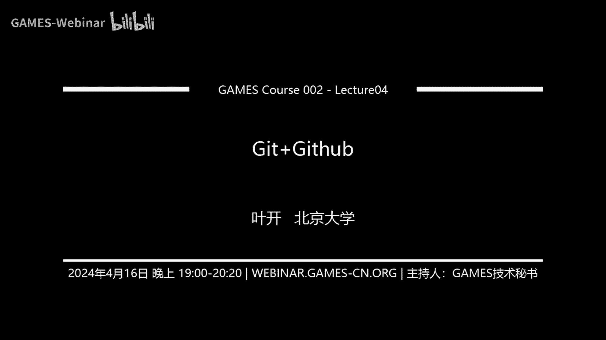

# GAMES002-图形学研发基础工具 - P4：Git+GitHub - GAMES-Webinar - BV1cC411L7uG

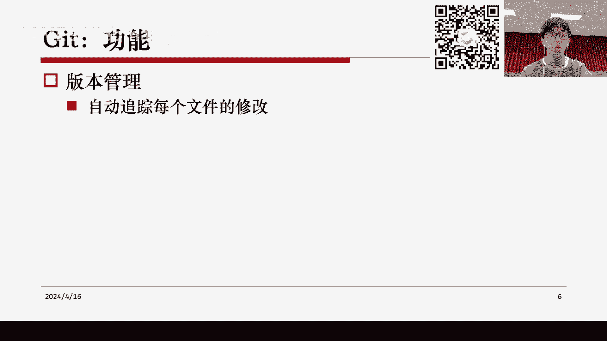

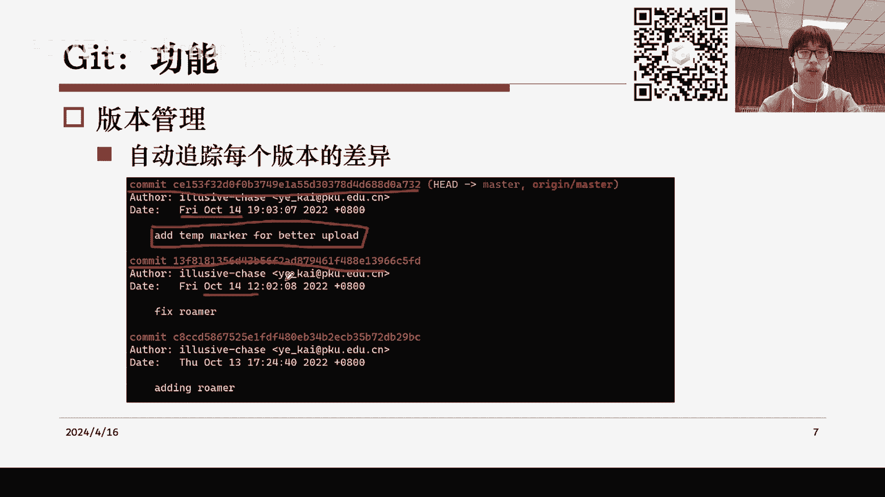

## Git 简介

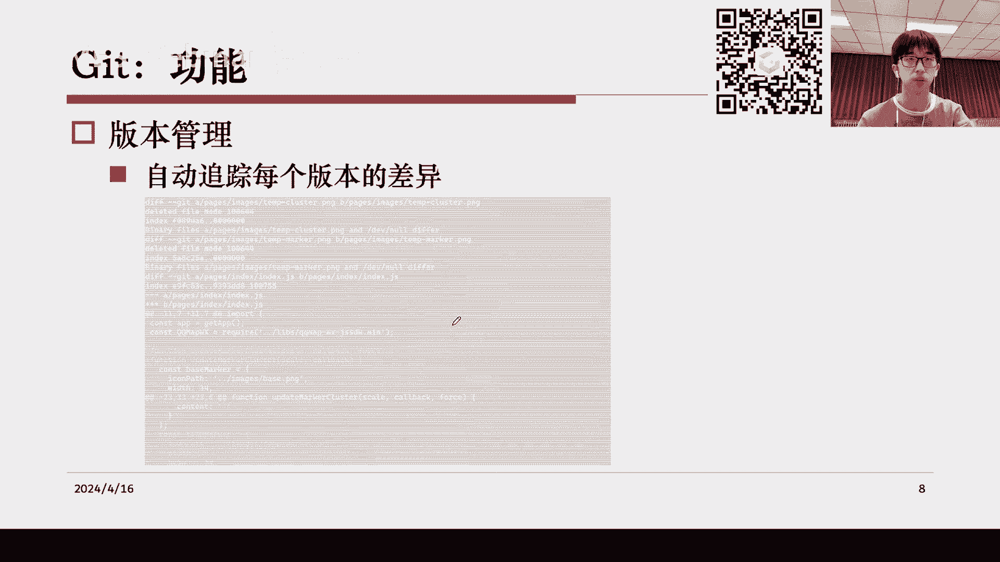

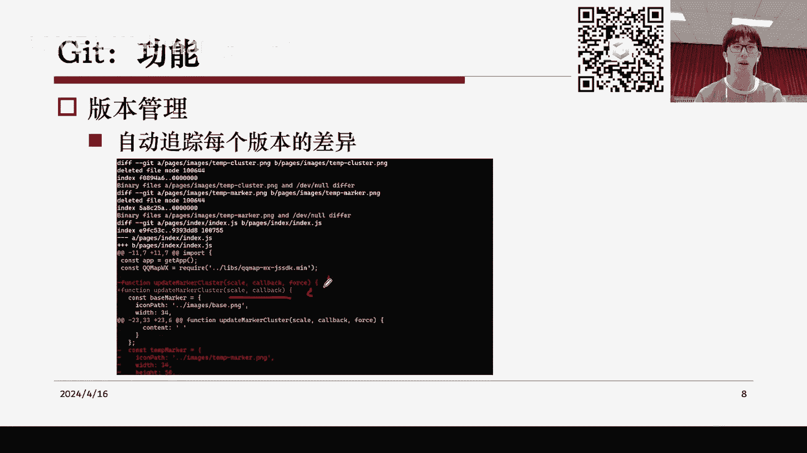

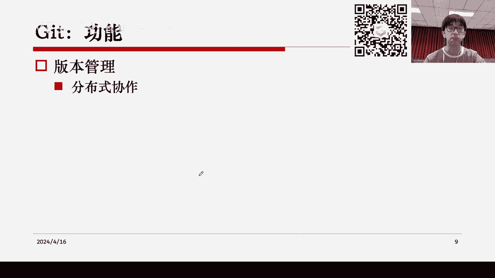

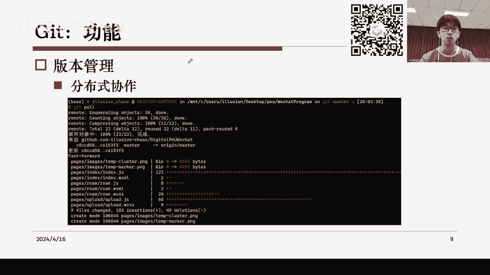

Git 是一个开源的分布式版本控制系统，用于跟踪文件的变化和版本管理。它最初是为 Linux 内核开发，但现在已经广泛应用于各种项目和协作中。

### 版本控制

版本控制是跟踪文件变化和版本的历史记录。它可以帮助我们：

* **追踪文件修改**：了解每个版本中文件的变化。
* **回溯历史**：在出现错误时，可以回溯到之前的版本。
* **协作**：允许多人同时工作，并合并他们的更改。

### Git 功能

* **版本管理**：自动追踪每个文件的修改，并记录版本历史。
* **差异比较**：比较不同版本之间的差异。
* **分支管理**：创建和管理多个开发分支，以便并行工作。
* **分布式协作**：允许多人同时工作，并合并他们的更改。

## Git 工作原理

Git 将项目目录分为三个部分：

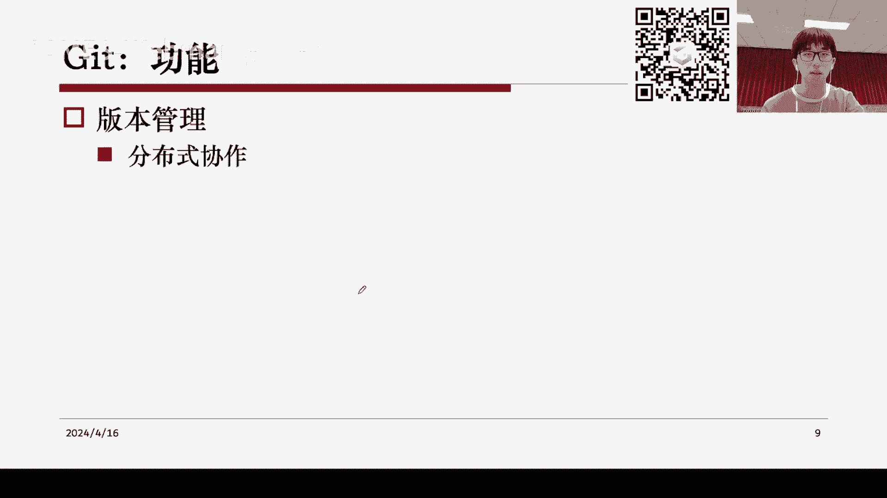

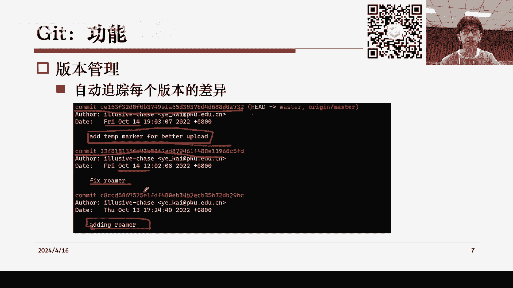

* **工作区**：包含所有文件，可以直接编辑。
* **暂存区**：包含已修改但未提交的文件。
* **版本库**：包含所有提交的版本历史。

### 基本操作

* **git init**：初始化一个新的 Git 仓库。
* **git status**：查看当前工作区的状态。
* **git add**：将文件添加到暂存区。
* **git commit**：提交更改到版本库。
* **git log**：查看提交历史。

## GitHub 简介

GitHub 是一个基于 Git 的在线代码托管平台，提供以下功能：

* **代码托管**：存储和管理代码仓库。
* **版本控制**：跟踪代码更改和版本历史。
* **协作**：允许多人同时工作，并合并他们的更改。
* **社区**：与其他开发者交流和分享代码。

### GitHub 功能

* **代码克隆**：从远程仓库克隆代码到本地。
* **代码提交**：将本地更改提交到远程仓库。
* **分支管理**：创建、合并和删除分支。
* **代码审查**：审查代码更改并提出反馈。

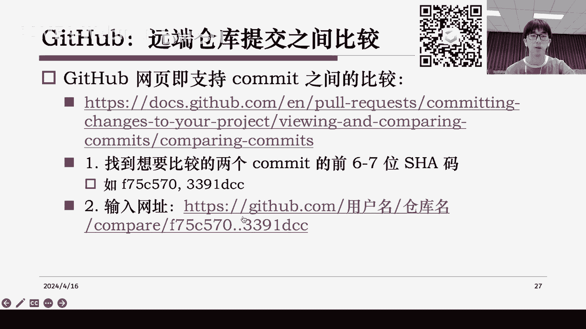

## 多人协作

Git 支持多人协作，以下是一些关键概念：

* **分支**：独立的开发线，可以并行工作。
* **合并**：将一个分支的更改合并到另一个分支。
* **冲突**：当两个分支同时修改同一文件时，会发生冲突。

## 总结

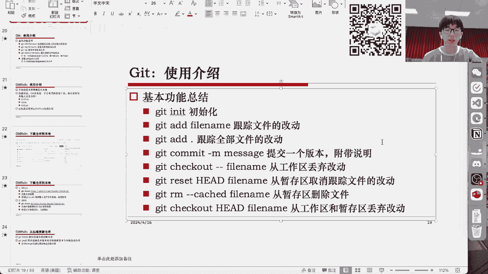

Git 和 GitHub 是强大的工具，可以帮助我们更好地管理代码和协作。通过学习 Git 和 GitHub，我们可以提高开发效率，并与其他开发者更好地合作。