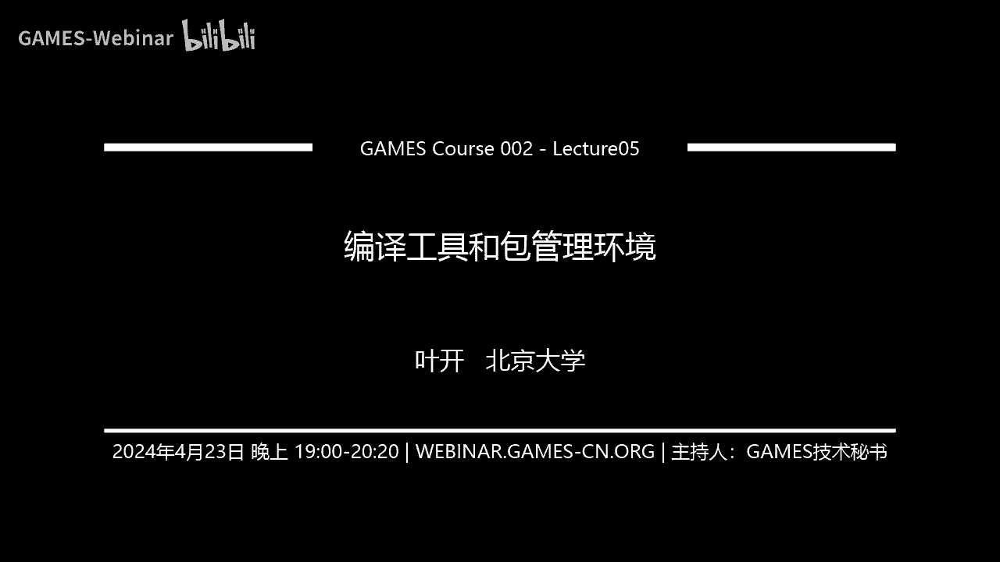
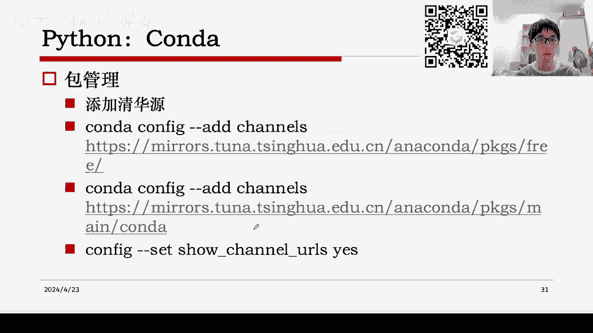
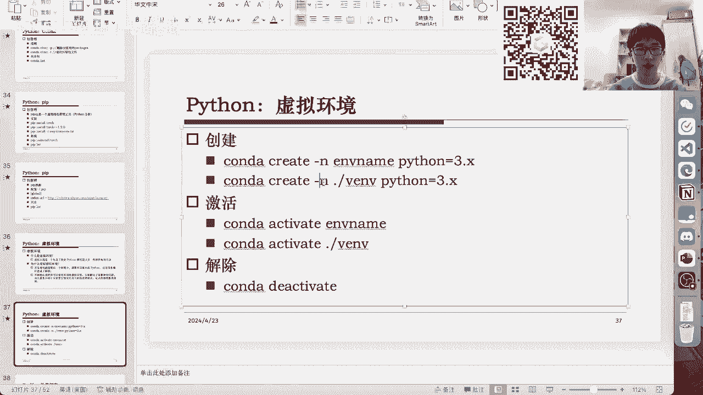
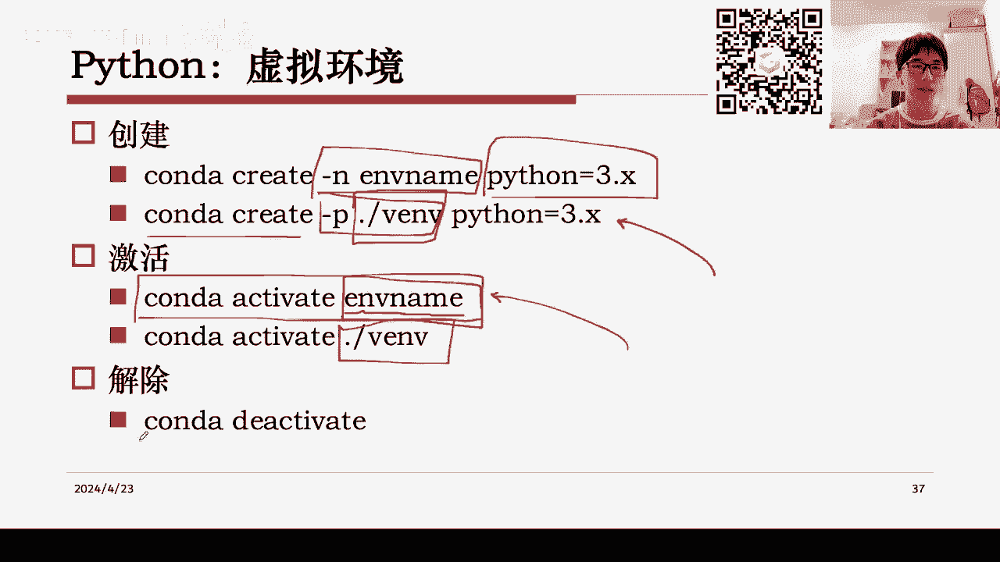
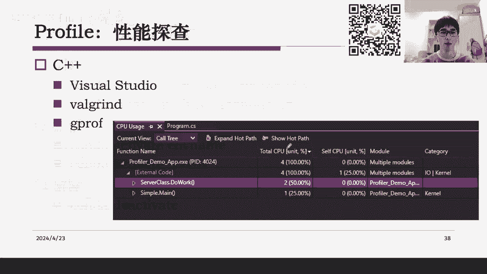
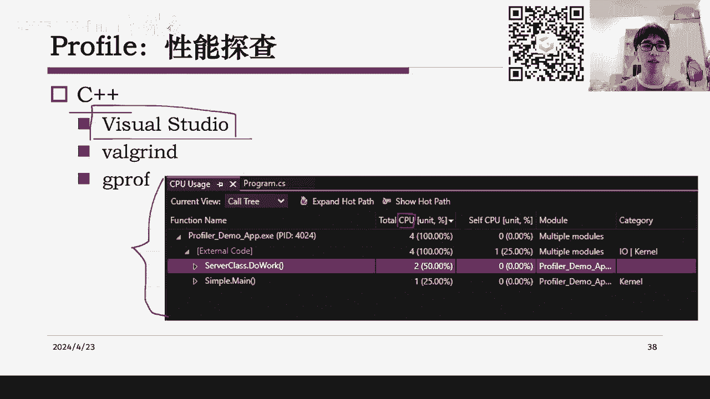

# GAMES002-图形学研发基础工具 - P5：编译工具和包管理环境 - GAMES-Webinar - BV1cC411L7uG

Hello hello，大家好，然后那么我们今天的games002的课程就开始了。

然后这边的话本节课介绍的是嗯，编译工具和包管理环境，其实分别对应于，比如说我们平时用的C和C加加，它就是需要一个编译工具，然后我们用的Python或者用的一些JAVASCRIPT。

它就需要一些包管理环境，然后我们今天的内容，主要就是介绍这两块的部分，OK首先我们来看一下这个一个，今天内容的大纲吧，就基本上主要是按照刚才说的来，我们首先介绍一下CPP的这个嗯，三个编译构建的工具。

一个是Mac，然后是c Mac，这个大家可能用的是最多的，然后最后再引申介绍一下x max，然后对于Python来说，我们主要介绍的就是康达嗯，这个包管理工具，然后在介绍完CPP和Python之后。

我们可能还会延伸一些，就是做一些呃，比如说关于怎么样对我们的程序，做一些性能的测试，这些做一些稍微做一些展开，因为这个主要是因为比如说对我来说，我平时可能会用到的一些功能，然后这里跟大家分享一下。

然后最后会有一个总结，总结之后会介绍我们今天要布置的作业，好的那我们就先开始，然后首先是对于C和C加加来说，我们都知道它作为一种编译型的语言，其实我们经常是要用这种编译器。

然后必须你通过编译器才能把代码，转换为可执行的二级定制文件，然后相对来说嗯不是这种编译型语言的话，另外一些语言叫做解释型语言，它们就像是Python这种嗯，就是说我们只需要有一个解释器，然后呢。

它实时的把我们的这个代码，转化为二进制的机器码，然后虽然这样速度更慢了，但是可能会带来意想不到的便捷的效果，但是对于这个C和C加加来说，它就是一种编译型语言，我们一般来说比如说在windows电脑上呃。

基本上用到的都是本地的一个ID去做编译，比如说嗯这个最最原始的是哦，我想上是那个def c加加对吧，然后后面可能会有一些vs code，或者有一些嗯visual studio。

然后我们就是用本地的IDE去做一个编译，然后其实C和C加加，也是可以做一些远程编译的，比如说我们用之前提到过的vs code，它的一个SH的远程功能，它也是可以完成一些编译的，然后嗯这种远程。

比如说我们在服务器上去做编译，它往往就是呃，因为你你很难在服务器上打开一个IDE嘛，然后它往往就是通过命令行，比如说你输入一个指定的编译器，这里用的是G加加，然后让他去编译一个具体的一个比如说文件。

然后就能得到一个编译的结果啊，当然其实今天发展到今天的ID，很多都已经支持了，就是一个远程编译的功能对，但是嗯就是为什么我们还要去学一下，怎么样配置这个编译的make或者c make呢。

是因为比如说嗯如果这个项目不是你自己写的，然后呢我们我们现在可能呃一方面是想从网上，比如说下载一些仓库，然后编译它的一些项目，然后拿过来用，另一方面又可能是说我自己写好的一个东西，我想把它发布出来。

然后我能让别人顺利的去使用它，这个时候你就必须就是嗯去嗯，把这个编译的这个所有的配置全部给理清楚，因为不理清楚的话，可能你用的编译条件和别人用的编译条件，是完全不一样的，然后这就导致你的可能文件。

就没有办法经过编译，然后这里的话，比如说我们这里列出的一个最简单的编译是呃，你指定一个编译器，然后指定我我编译的一个源文件，然后再指定一些选项，然后呃这里可能很简单，你输入一行就可以完成。

但是大部分情况下，我们实际上遇到的问题都没有这么简单，就比如说如果你要调一些额外的库，比如说open gl或者掉些嗯，对类似的这种第三方的库，然后这种时候的话，这个编译语句就会变得特别繁琐。

然后嗯所以我们就需要往往需要去给它做一个，就是做一个配置，相当于把你当时的所有的编译选项，全部给记录下来，并且给它给它配置成一个具体的文件，那么最简单的方式就是说，我们用之前学到的知识。

比如说假设我这一行，我这行没有这么短，而是后面还有一大堆的奇奇怪怪的选项，那么这么长的一条命令行，其实我们用之前学到的知识，是可以说我写一个脚本，然后把这条语句给写到脚本里，这样的话我想要编译我的项目。

那么下次就直接用bash，然后来调用这个脚本，然后就可以完成编译了，这样的方式呃，它的好处是在于它确实非常便捷，就是当时啊你怎么敲的命令行，就可以把这个命令行，原封不动的放到这个呃脚本里。

然后下次运行这个脚本的时候，或者说别人来下载你的仓库，然后来运行这个脚本的时候，它就能完成一个编译，但这里遇到的问题就其实是说嗯你这个脚本，首先你的G加加的版本是多少呢，然后呢你的一些其他的选项。

它其实都是依赖于你那个目前运行这条命令的，本地的那个机器，它的一些比如说它的一些库，它的一些安装的一些软件的配置，所以嗯在这种方面上，就是说这条命令行，当然它它可以通过你写成脚本的方式，给它复现出来。

但是一旦你这台机器换了，比如说换了别人的机器，它可能一方面G加加的版本跟你不一样，另一方面他可能没有安装open gl的库，然后你这里安装了，然后这样对他来说，可能就是会有很多很多这种机器。

或者说操作系统层面的一些，这种调用的一些区别，然后导致说同样一模一样的命令行，在你这里是可以运行的，在他那里是没有办法运行的，这就导致说我们简单的写上脚本的方式，并不能够支持这个编译的一个选项的配置。

那么其实一般来说，我们都是要用到一个叫做构建系统，这个叫build system，然后go所谓构建系统，就是说嗯我提供一个配置文件，然后我用这套购置系统就可以在不同的这个，比如说不同版本的操作系统。

不同版本的编译器下，然后实现一件事，就是说我可以顺利的把我整个项目给编译下来，然后这就牵扯到相当于我们对于一个大规模的，足够复杂的工程，我们都是需要去这么做的，就是嗯我们需要把这个手动用命令行编译。

链接所有代码的这个步骤，改成一个使用我们的构建系统来做一次配置，然后之后可以反复使用的这样的一个方式，然后构建系统往往也具备一些功能，就比如说如果我们要呃，每次要修改一些代码的话。

其实构建系统会检查有更新的部分，然后它会重新的去就是做一个部分的编译，相当于不用每次都完整的把你整个项目，完整编译打包一遍，然后这样就是啊，我们一个构建系统的一个最初的一个目的。

然后他具体要完成一个什么样的任务呢，其实是说嗯我们用户给他指定的，就比如说嗯像刚才的例子里，我们如果要编译一个C加加的文件，或者编一个C语言的文件，那么实际上你要告诉这个构建系统。

你需要生成什么样的目标文件，这个目标文件可以是你你生成一个库，或者你生成一个可执行文件，然后等等，然后以及你要告诉它，生成的时候使用到的一些依赖项，然后生成的时候使用到的一些具体的命令。

或者命令行的选项，然后这里的话其实之前说了这么多，大家可能都已经见过一个最常用的一个build system，这个东西就叫make，这个东西是LINUX下最常用的一种这个build system。

因为它它的特点主要是编译小项目的时候，非常的便捷，然后呃可以提供一个非常好的支持，但是实际上如果你了解一下make的这个语法，或者说了解一下它的配置的规则，你会发现其实它的配置起来还是非常繁琐的。

所以大项目基本上你是很难手写make，而实际上我们往往都是，比如说如果你去做C加加或者C语言的编译，我们都可以用这个c make这个工具，先用CMC工具生成make的一个配置文件。

然后我们再使用make，嗯那么具体来说，我们可以先了解一下Mac的基础用法，就是它到底是干什么的，他到底是怎么用的，make的话，它有一个基本的配置文件的名字，格式就叫这个make file。

就是就是呃名字就是要跟这个一模一样，然后make才能识别出来，然后我们如果在当前路径下准备好了，这个make file的话，那么你在命令行里直接输入make，然后make就会识别出这是一个配置文件。

然后他就会读取里面所有的配置信息，那么make file里到底有什么呢，它其实很简单，就是一个普通的文本文件，make file里指定了就是你要构建的目标，然后你的依赖项和你的一些具体的命令。

那么比如说以下面这个图片为例子，嗯这里这两行基本上是说了一件事，就是说我要构建一个paper点PDF，然后我要我要生成它，首先我必须先准备好这两个文件，什么意思呢，就是如果你不提供这两个文件的话。

或者说当前路径下找不到这两个文件的话，那么make就会告诉你这个呃依赖依赖没有满足，或者make就会去去试图满足这个依赖，比如说如果如果你有一些配其他的配置选项，能够再生成这两个文件。

那么make就会先去把这两个文件生成好，然后再去执行这个生成paper点PDF的这个操作，然后这所以这里就很简单，列出了一个呃，你的目标文件和你目标文件的所有依赖项，然后具体要怎么生成这个目标文件呢。

其实就用的是呃下面指定的一个这样的命令，比如说我们可以用这个PDF来TX这个这个程序，然后它来运行一下，就可以从这个paper点text啊，paper点text里面生成这个paper点PDF。

也就是其实这就是一个LTT的编译的一个过程，然后相当于说我们每一个make file文件里，都有若干个这样的一个三段式，每一个三段式呢都告诉你了啊，某一个target文件到底要怎么样生成出来。

所以嗯这个基本就是make file的一个特点，那么回想到我们之前的这个编译，比如说用刚才那个用G加加编译的例子，这个例子里面我们make file怎么写呢，其实就是说我们要生成的那个文件。

其实是一个可执行文件，是这个main这个文件对吧，所以我们其实啊，如果你要把你要用make file，来来描述这个这个事儿的话，那首先你的target就应该是这个，然后你的依赖项就应该是main点cc。

然后最后你用什么命令来生成，整个这个你的可执行文件，用的就是这一整句，所以你可以看到Mac它其实还是一个呃比较简单，就起码从原理上来说比较简单的一个东西，它就是简单的帮你打包了一下。

然后呢啊使得比如说我们我们以后，我我比如说我以后想要知道怎么样生成这个paper，点PDF，那么我就可以找到make file，然后里面的生成的命令全部都列出来了，然后这样的话。

其实我们就有了一个最基本的一个，这样的一个构建系统，然后常用的哦，其实我们经常比如说我们遇到仓库的时候，经常会用这两条命令，然后实际上就是说啊install和这个clean。

它实际上都是make file里定义的一些呃target，然后只不过这些target是特殊的target，就是说呃install它并不是一个具体的一个，你要生成的一个文件。

而是说我我我去执行这个install的时候，我就会执行一些额外的操作，比如说常见的额外操作，就是把我们需要的这些文件，然后拷贝到我们的用户的一个目录下，然后这就是install干的事。

然后clean可能也干了一些其他的事，然后这就使得嗯其实我们可以发现make file，它的配置还是非常自由的，相当于说你可以去定义呃一些编译语句，你也可以去定义一些你的特殊的一些命令。

然后通过这些编译指令和命令的组合，然后你就可以得到一个比较完善的一个，一个配置文件，然后我们可以看到它的一些常见用法，就比如说这里很简单，就是首先我先做一个make，这个make就是做一句编译。

然后后面这一句语句，就是说我把我编译完的这些库或者可执行文件，全部放到我用户可以搜索到的一个路径下，这样的话我就无论在哪里，都可以从从命令行去调用了，然后或者也有一些用法，比如说如果你构建的时候。

希望它开多个线程一起并行，那么你可以用J来指定，比如说你要用的这个线程或者进程数量，然后或者说你也可以用杠C来指定，比如说你不是在当前目录下找啊，或者不是在当前目录下，生成你的最终的一些文件。

而是我新建一个build文件夹去生成一些新的文件，比如说像这种，那么抛开它的常见用法，其实呃总体来说呃，make还是一个配置起来非常麻烦的事情，这是因为它其实没有给太多的这个。

比如说太多的这个优化或者提供便利的一些事，而是说它仅仅提供的是一些我有什么命令，我就把它记录下来的功能，也就是说，如果比如说，如果你的这个编译的命令特别特别复杂。

那么你可以想象你的make file也会特别特别复杂，比如说嗯像我们比如说如果要调用open gl这个库，那你可能会遇到一大堆的这个，open gl的一些编译选项，那么这些编译选项。

其实你都得把它放到这个make file里，然后你给它全部给粘贴出来，然后一个个配置下来，其实还是非常麻烦的，所以这个地方嗯基本上我们常用的嗯，比如说如果你是用C加加来编程，常用。

基本上都是用c make这个工具来作为一个中介，就相当于我告诉c make，我要我要做什么事啊，然后c Mac帮我生成一个呃make file文件，然后相当于呃c Mac来做一个中间层。

然后他能知道你的需求之后，帮你省去那些繁琐的配置，make file的一些选项，这个就是c Mac干的事，那么它本身c Mac本身其实并不是一个build system，因为它不能直接生成可执行文件。

你也不能让他就是嗯，你也不能脱离了任何一个呃build system，来让CMC帮你编译，比如说嗯如果你没有make，那么其实c make并不能帮你继续编译下去。

一般来说c make它都是要生成一个make file，或者生成一个这个呃visual studio的一个解决项目，然后你才能用后续的真正的这个build system，然后来去做进一步的生成。

比如说这里就是真正的build system是make，然后这里真正的build system是这个visual studio，然后但是c Mac正是因为它特别方便的一个，跨平台和跨语言的一个能力吧。

所以说成为了我们基本上用C加加，基本上都是会用CMC来配置的，CMC的话呃，其实我们可以经常见到它的一个，命令行的一个用法，比如说我们一般嗯，如果你你下载过GITHUB上的一些项目的话。

你会发现有一个非常经典的一个操作，就是你首先我我们在项目目录下，新建一个build目录，然后呢我们CD到build里，然后去调用c make，然后把把c Mac，然后c Mac它会识别。

其实它会识别这个父目录，下一个c Mac自己的配置文件，识别完了之后，c Mac会帮你生成make file，生成完make file之后，我们就会知道我们可以通过make来执行这个make file。

文件了，所以基本上就是这么一个呃，其实是三段操作吧，第一段操作是嗯先创建一个build目录，然后第二段操作是让c make来生成make file，然后第三段操作是让make。

根据make file来执行真正的那个命令，所以这些嗯，这些流程基本上就是CMC的一个，通用的一个用法，然后这个命令行的形式，它它其实还有一个这个跨平台的版本，然后这个可以就是。

比如说如果我们遇到跨平台的时候，可以再进行搜索去了解一下，然后呃那么说了这么多，就是c Mac它到底是怎么用呢，就是说我们要怎么配置CMC的一个文件呢，这个其实是类似于make file的。

就是说c make会在当前目录下识别一个叫做这个，semc list的一个文本文件，然后这个文本文件里指定了你的c Mac的版本，然后指定了你的项目名字，然后以及指定了我们要构建的这个目标。

然后并且这个目标它到底叫什么名字，它需要什么文件，你都可以用这些来这个自定义，然后这里下面这条哦，这张图片其实显示了一个，这个最简单的一个sim list，就是首先啊，我说我这个至少要2。

6版本的c Mac，然后呢我这个项目名字叫hello world，然后呢我最后这里呃指定了，我要从hello点CPP里生成一个这个，hello的可执行文件，然后这就是一个SIMILIST的一个基本配置。

然后如果对比make file的话，你会发现它特别简单的一点，就是你不需要告诉c make你怎么样编译CPP文件，因为c Mac自己会决定要怎么样编译，而不是需要你去告诉他，比如说我要用一个G加加。

然后杠O2，然后杠什么样的一个选项，而是c Mac他自己会帮你去决定，然后这个就是一个主要的比较方便的地方，所以相呃比较一下的话，就是如果我们去做make file的配置。

我们是一定要去关心命令行选项的一些细节的，但是c make它其实并不需要c make，你可以基本上不用管，不用操心这个命令行选项，你只需要关心我要生成哪些文件，然后呢我依赖哪些文件。

然后我依赖哪些包就可以了，而不需要针对这些文件，或者针对这些包去定制，你的一些特别细节的一些命令行选项，然后当然c Mac它的功能也是非常强大的，实际上我们可以把CMC当做一个，非常简单的一种脚本语言。

然后它是可以定义一些局部变量，然后这种局部变量或者全局变量，基本上我们只会在特别大型的这个，sim项目里见到，比如说它有特别复杂的一些配置的时候，或者有多个就是多个包的时候，然后往往会有一些这种局部。

或者全局变量的一些使用，然后这个地方的话最常见的使用可能是嗯，可能是就是，比如说我们有时候指定我们用的C加加版本，或者指定我们构建的到底是debug还是release，项目的时候嗯，是是会用到这些功能。

当然这些功能我觉得一开始我们可以不用，特别的就是特别的把它掌握得特别清楚，因为后续如果实际上真的用到的时候，还是可以去查找资料的，然后这个地方基本上就和我们之前学过的那个，这个脚本的语法非常相近。

然后它也是一个比较容易上手的功能，然后除了这块的话，我们重点来讲一下包管理，就是怎么样用CMC去做一个嗯，这个多个文件的一个编译链接吧，然后就假设我们项目根目录下有两个源文件。

一个叫这个这个这个MMSRT，然后一个叫这个main，然后我们分别定义了，就是我们在这个平方根文件里，定义了一个我们自己写的一个平方根函数，然后在我们的main文件里定义了一个呃main函数。

然后main函数里面调用了这个平方根文件，这其实是我们经常会遇到的一个需求，就是说呃就是说相当于我妹喊我妹函数，或者我的main文件里并不直接定义函数，而是把函数的定义写到专门的一个呃函数。

和这个函数相关的那个CPP文件里，然后这样就形成了一个多个CPP文件之间的，一个编译链接的一个关系，所以相应的话我们在simic list里就可以这样写，就是用哦下面这张图显示的这个图片。

如果看不清楚的话，呃之后可以那个之后可以下载一下课件对嗯，因为它实在确实有点小了，然后但是不管怎么说嗯，这里可以简单解释一下，就是比如说他第一行就指定了c mic的版本，然后第二行指定了我们的项目名称。

第三行这里它首先就通过ADD library这个这个函数，然后它定义了，就是说我们要把我们要把这个文件给打包成，一个库，然后打包成库之后，你就可以去链接它了，然后链接它的话。

你就相当于呃这个你自己写的这个平方根函数，就可以被其他的源文件给调用，那么最后这里还是和之前一样，去声明了我的可执行文件的一个名字，然后以及它是从main点CPP里来的，然后执行完这四步之后。

我们实际上就有一个呃library，然后又有一个可执行文件，这个时候你就可以去做一个链接，就是相当于让你的可执行文件，和这个你需要的这个库给它连起来，然后这样连起来之后你就可以调用它了。

然后所以说和之前对比，我们可能就简简单单加两行，就可以完成一个酷的一个编译和链接，哦真的有张大图对，然后我们就会发现这个嗯，c make来去做一个库的链接还是非常方便，然后实际上对于第三方库。

我们甚至可以有一些更方便的方法，就比如说你可以通过这个呃，c Mac的一个特殊命令叫find package，然后他去搜索你的这台电脑上有没有安装，比如说某一个库。

然后啊或者可以用这个呃package的search module，这个命令，然后呃如果你的电脑上有这个库的话，之前命令就会返回相应的这个嗯库的一些地址，然后返回库的一些依赖选项。

然后你你就可以直接根据这些地址和依赖选项，它所形成的这个变量，然后给它链接起来，就比如说嗯像下面这张图的例子，我我需要去呃用一个A跟库对吧，然后A跟库的话，它本来如果你直接在命令行里写。

肯定是非常复杂的，但是呃如果你用CMC来去做一个链接的话，你就可以发现它，首先嗯它首先通过这个package的search，然后他可以直接找到这个A根的库，然后如果找到了之后呢，它就会生成两个变量啊。

它会生成一个变量，就是因为嗯因为A更是只有头文件嘛，然后实际上你就可以发现这个变量，就是它生成的a an的头文件所在的那个目录，然后你用这个变量去做一些后续的一些这个，Include。

然后或者做一些这个链接，然后你就会发现它整个项目就非常简单的，就你就把A根给编译进来了，然后这里也有一张大图，具体来说就是如果我们找到了A跟这个库，然后它就会生成下面的这个变量。

然后你就可以直接去用这个变量，这个变量可以帮助你找到文件的这个包含目录，以及找到这个这个链接库的一个地址，嗯那么除了这种方法，就是除了我们本地系统上去做搜索之外。

其实你还可以支持一些这个第三方的包管理器，比如说像这个VCPKG，这个就是微软的一个这个vc package，这个跨平台的包管理器，然后比如说以windows为例的话，我们实际上可以在任意位置。

安装上这个VCPKG之后，在你任何一个项目目录下面，你去执行这个VCPKG，然后它install某一个包，这个时候你就会发现，它自动的把那个包装起来了，然后呢执行完毕之后，BCPKG还会告诉你。

就是我我我如果想要调用这个包，我c make里应该怎么写，就是VCPKZ会把这这些c make应该怎么写的，这个代码给打印出来，然后你把它复制出来，粘贴到你自己的c Mac配置里面。

然后就可以完成这个包的一个调用，然后啊，而且我们也不需要关心这个包到底安装在哪，因为VCPKG它是帮你管理好了，所以这个基本上就是一个常见的跨平台的包，管理器的使用方法。

就是说呃如果如果你熟悉Python的话，你会发现它就和pipe有点像，就是说我我pip install某一个包，其实和vc p k g install某一个包，它是类似的，你可以通过这个包管理器。

然后来管理你的所有的这种从第三方装过来的，一些包或者库，呃然后最后在讲完c Mac之后，我们也可以来提一下这个x make，这个扩展的一个构建系统，那么它它不像c max，max自己是一个呃。

更加现代化的一个C和C加加的一个构建系统，这是因为它其实打包了一大堆的内容进去，就是说呃，c make它其实只是一个我们用户的一些需求，到make之间的一个中间体，那么c Mac来知道我们的需求。

生成make file所需要的这个文件，那么x make它其实并不一样，它是帮你打包了，从make到c make，到这个VCPKG的一个所有的一个流程，相当于它既能完成编译，又能完成你的项目管理。

又能完成你的包管理，同时呢它其实还支持管理的一个编译器，然后这个嗯他其实有一个自己的官网，然后在官网上也有一个非常丰富的文档，然后我们可以来简单的看一下它的一个使用嗯，和之前一样，就是x max。

也是需要一个呃固定的一个配置文件的，这个配置文件一般来说嗯都有一个固定的名字，然后像x max这里它就是一个LUA脚本，然后这个脚本的话，呃可以看到，比如说这里的四行，其实就是一个脚本的主要内容。

然后它就可以以一种x make，自己定义的一种语法的形式，然后来完成一个目标的编译，然后对比c Mac的话，就相当于我们刚才这四行，如果你把它翻译成c max的话，它其实还是非常复杂的。

就是可以在CMC里写好多好多行，但是x max来说，它就只需要非常简单的这么四行，所以基本上来说啊，我个人觉得x max还是一个非常容易上手的，一个编译工具，然后他也可以支持一下包管理。

包管理也非常简单，就和c max有点像，你可以直接在那个FMC的配置里面去加一句，比如说你需要ADD什么package，你需要at什么requires，然后像这种。

然后并且x max它也是兼容这个vcp kg，自己的包管理的，然后或者他也他其实也支持，就是你自己啊自己构建的包，而不是说一个第三方的一个知名的包，然后vc ux Mac它也兼容vs，就说正常来讲。

我们的这个，我们如果想用visual studio去这个配置一个c make文件，其实是要打开一个特殊的c max项目的，但是对于x max来说，它并不是这样，它可它实际上可以呃直接生成一个vs项目。

就相当于通过下面这句语句，它就可以直接把你的项目转化成一个vs项目，然后你打开这个项目的解决方案，然后visual studio就会自动的这个能够去运行，然后能够去编译了。

然后x max就是一个非常简单，就是它是一个傻瓜式的一个运行，你在命令行里直接说一句x mix，然后就可以完成从编译到构建到一系列的这种，甚至是包安装，就是说它会识别你，如果哪些包是没有的。

它会自己去安装，然后从这个编译到运行，基本上全部在这样一个命令里，他都会帮你完成下来，然后这里展示一个，比如说我们有的从自己的项目里找的一个这个，x max的配置文件，然后你就可以发现。

就是说他很多的操作都是用了一些更加怎么说，更加人性化，或者更加嗯对用户来说更友好的一种语法来写，比如说如果我们在CMC里要定义C加加版本，其实那个还是有一点复杂的，往往都是要去网上查一下怎么定义。

然后呢你不要把变量名字打错才比较好，但是在x max里，基本上比如说可以看到这样这样一句，非常简单的命令，就可以去嗯定义好C加加的版本，然后以及它有一些非常简单的，比如说你增加依赖库的一些方式。

然后这些都是一行就可以完成，这个依赖库的这个构建，然后这部分其实就是C和C加加的这个呃，全部内容，然后我们可以发现这个嗯，它其实是一个循序渐进的过程，就是说我们一开始最原始。

可能历史也最悠久的就是这个make这个工具，然后呢从make一直到c make c Mac，它其实是比Mac月出了一大步，就是说我们可以用更少的一些编译的配置，然后就能完成这样一个呃。

比如说你要编一个C或者C加加的项目，c Mac其实是比make要省了特别特别多的功夫的，然后再到我们最近可能新新颖的这个，x max这个方法，然后他可能又是说及这个之前的各种大臣，然后他就嗯。

他就兼顾了你的这个编译和这个包管理，然后并且同时它的这个配置文件的写法，也非常的接近我们自己，比如说我们现在这种，大家大家这种怎么说现代人的习惯吧，我是觉得因为c Mac其实还是有一点，有一点反人类的。

我个人觉得比如说比如说可以看这个对比c make，然后像他这里，比如说我们要啊，我们要去做一些呃，查找SRC这个文件夹下所有的这个点C文件，它其实有一个特别奇怪的一个操作，就是长成这样。

这个操作是什么意思呢，就是说他查找所有的点C文件，然后把这些点C文件给放到这个变量里面去，这个src files这个变量里面去，然后你后续就可以用这个变量，然后去完成一些变异了。

但是这个这个其实怎么说呢，如果是从那个年代来的，人，会觉得这是一件自然的事情，因为比如说我们之前学的那些shell脚本，其实它都是这样的嘛，就是我一定要把什么什么东西放到变量里。

然后我后面就可以继续这样用，但是x max它其实他其实也跨出了更大的一步，就是说啊我们可以直接我找一下那个例子，对我们可以直接说我用一个函数，然后函数里就指定了我要的一个正则表达式。

然后我x make就根据我这个正则表达式去搜索，然后这个可能是一个更加自然的一种方式吧，就比起c max来说，所以总结一下，就是啊我觉得我们经常需要了解的是，或者说我们经常遇到的。

并且需要了解的基本上是后面两种，就是c make和x make，至于make本身，其实大家知道它是怎么一回事就行了，就是说知道make，它是一个，用来这个用来生成或者用来配置系统的。

一个这样一个这个啊build system就可以了，然后至至于make，比如说make file到底要怎么写，然后里面的语法是什么，这个可以不用特别仔细的去关心。

因为我们现在基本上都是不直接去写make了，而是用c Mac或者x make，然后对于c Mac来说，可能如果不是就是不是特别刚需的话，就比如说你并不需要自己去把自己的仓库打包，发布出去的话。

基本上也不一定要用到c Mac，就是说你可以知道c max是什么就可以，然后你会你会用别人的c make list，这样其实已经够了，但是如果你需要把自己的仓库，打包发布出去的话。

其实还是需要掌握一下c make的，因为虽然x make很好用，我们可能我们可能可以，甚至可以，直接拿x max作为C加加编译的一个上手工具，但是它毕竟不是那么的就是流行吧。

所以如果我们要把自己的东西发布出去的话，基本上还是应该提供一个c mic list，所以这就是一个基本的一个三个东西的区别，然后在讲完这个C加加的部分之后啊。

我们可以看一下这个Python这里的包管理器，然后呃包管理器诶，等一下我看一下弹幕，哦对有同学说到一个点，就是这个是通配符，是的是的，就是这其实是那个哦LINUX的路径的通配符。

它和正则表达式还是有区别的，然后呢另外一些哦，我看一下，另外一些就有同学说到这个古代SIMIC哦，我我后来想了一下，确实是有可能就是比如说这里展示的例子，可能都是一些特别特别旧的一些例子。

然后至于最新的SEMIC到底怎么写，嗯这个我还真不了解，然后可能大家也可以去学一下，就是最新的，比如说嗯最新的c Mac，它的一些语法我估计是会比以前的有所改进的，然后总体来说还。

总之还是建议就是大家根据自己的需求去学，比如说x make或者去学c make，然后x make本身的话，在我具体的使用过程中，其实也是遇到了很多问题的，就比如说因为毕竟他是一个非常新的东西。

然后呢它可能功能有些方面没有说c Mac这样，经过时间的考验，然后经过各种奇奇怪怪配置的考验，所以x max可能是有很多不支持的地方，就是如果大家并不是一个通用的一个，项目的配置的话。

就就说比如说你的编译条件或者编译选项，特别的这个非通用，那么其实x max它不一定能支持，所以这个具体来说还是要看各自的这个项目的，一个嗯需要的一个需求情况吧，所以嗯这个选择的话还是放在这里。

就是c max和x Mac，我觉得都是这个比较好的一个选择，啊当然我个人用x max，可能是因为嗯它附带把包管理给搞进去了，所以个人感觉就稍微省力一点，然后如果用c Mac的话。

可能也可以就是c Mac，然后配套上别的这种包管理的系统，然后premier我我就不了解了，OK那我们接下来讲一下Python这边的包管理系统，就是Python这边的话。

其实大家知道的最知名的可能就是像康达，pipe这种，然后其他的呃我我其实也没有听说过，然后Python语言的话，它其实和C加加和和C语言都不一样，它是一种这个解释型语言，就是说我们不需要做编译。

我们直接在解释器上去运行就可以了，所以说对于Python来说，可能没有那么复杂的一个编译的过程，因为实际上你安装Python本身的时候，很多东西都已经编译好了，就比如说Python自己的解释器。

你就已经编译好，然后它是不需要你去再做额外的编译的，然后我们的Python代码都是直接在解释器上运行，这个时候对于解释器来说可能事情就少很多，就相当于我们在C加加或者C语言里面，我们既需要管理包。

又需要去配置编译环境，但是在这个Python里，你可能只需要去这个呃管理包就可以，比如说我们大家都知道这个康纳这个东西，就是它是在Python里的一个非常知名的，包管理和环境管理的一个工具。

然后我们经常用的两种康大，可能是mini康纳和安娜康纳，然后呢嗯这里两个基本上功能上是类似的，只不过安娜康达，它会附带很多科学计算用到的一些包对，然后这里的话mini counter就是呃。

一般来说是我个人觉得我经常用到的一个东西，就是说啊我们比如说拿到一台LINUX服务器，或者拿到一台新的电脑，然后如果要装一个CONDA环境的话，基本上我的选择都是装一个mini conda的环境。

因为这个东西它首先哦特别特别小，然后它又安装的特别快，然后所以等你装上之后，再去自己决定安装怎么样的包，其实都是一个比较方便的事情，然后但总之这两个其实没有太多的区别，然后具体来我们可以来看一下。

就是嗯比如说我们我们命令行。

我们之前应该也就是见过这一幕，就是说前面有一个base这样一个选项，是在我们上次ZH配置的时候嗯，大家可以可能会注意到的一个点，然后这个base它其实就是一个康达的环境，然后呃康达你在默认安装的时候。

它会提供一个默认的base环境，所以康达基本上哦他做了两件事，就是做了一个环境的分割，就是他会把你的这个运行环境给分成好几个，然后每个运行环境之间安装的包，它是互相不可见的。

然后所以也互相不会污染或者干扰到。

然后主要是这样一个事儿，然后对于康纳来说，我们一般来说先要配置一下它的这个清华园吧，呃我不确定现在是不是还是需要，我感觉经常，反正如果如果如果你发现它默认的那个圆，它不是一个国内的语言的话。

一般来说会很慢，然后最好还是配置一下这种嗯康达的一个圆，这个圆是什么意思呢，就是说我们要下载一些新的，比如说互联网上的一些别人发布的包的时候，康纳从哪个网站上去找这些包。

它其实就是从他的这个channel里去找的，那么这个channel的话，就导致说，如果比如说你的channel是一些默认的国外的channel，它可能就特别卡，所以我们一般来说会把它换成自己国内的产能。

然后这个是一个第一件事，然后然后设置好这个圆之后，我们就可以去看这个包管理了，然后包管理的话它主要就非常简单，就像刚才的VCPKG一样，我们用conda install。

然后后面填包的名字就可以安装这个包，然后或者说康纳install后面填包的名字，在指定它的版本号就可以安装指定版本的包，然后也可以康纳去卸载一个包，或者还有一些额外的功能，比如说康纳clean。

就删除掉那些你下载了但是没有用到的package，然后或者你可以清理掉一些文件，这种呃常见于比如说你的电脑，这个实在放不下那么多东西的时候，然后以及我们还有一些功能就是列出呃，列出包。

比如说kda list，它其实是列出当前的环境下面所有的包，然后呃这里再快快速的过一下pip pip，它其实也和康纳很像，就是这这里都一模一样，就是pip install。

然后你填一个包的名字或者指定它的版本，然后或者说嗯这里，这里是你根据这个requirements，这个text里所有的内容，然后你去根据这个文件指定的那些包去安装，这个时候就要加一个杠二选项。

然后这个的话也是比较常用的，然后以及它的卸载KDA这个uninstall，或者哦不对，pipe uninstall或者pip list，然后这个和kda list也是一样的。

那么这些功能其实等我们遇到了再去查，其实也完全OK，因为pip和CONDA都是一个非常简单的两个工具，就不像我们之前遇到的git，它有各种复杂的概念，康纳和pip基本上就非常简单。

然后pip它也有一个换元，然后这个换元的话，你可能需要到你的一个个人，就是用户目录下面的一个文件里去改，然后这个具体来说网上有很多教程，那么我们来讲一下刚才一直cue到的这个概念，就叫虚拟环境。

那么什么叫虚拟环境呢，它其实就是一个包含了特定Python解析器版本，以及一些软件包的一个目录，什么意思呢，就是说呃有的时候我们会遇到一些特殊的需求，比如说呃比如说我我希望运行别人的一个仓库。

但是呢他那个仓库只能在Python的一个，特定版本下运行，或者说它的很多语法都只能在那个版本下，可能会比较配套，或者说它依赖的一些包，最新的只发布到了那个版本，或者等种种原因。

就是啊总而言之就是你遇到的一个特殊需求，就是你必须要指定，首先我这个我这个项目要用到怎么样的Python版本，其次我要用到哪哪些版本的软件包，比如说呃举个最简单的例子。

我们可能在一个环境中需要部署不同版本的Python，然后或者说你的你需要安装不同版本的包，比如说我们知道NN派，或者我们知道一些这个open CV，这些包它往往不同版本之间，虽然它已经尽量在兼容了。

但是不同版本之间其实还是会有差异的，然后有的时候你可能只希望其中一个版本，不希望另外一个版本，那么这又带来一个问题，比如说你的项目A它可能需要某一个版本的Python。

项目B需要另一个版本的Python，这个时候你怎么样去这个协调，这两个版本的冲突，这里就遇到一个虚拟环境的概念，所谓虚拟环境，就是说我们相当于有点像虚拟机一样的感觉，就是说我们打开了一个虚拟的一个机器。

这台机器上装了一个Python，比如说python3。9，然后你还可以打开另一个虚拟机器，那个机器上装了python3。8，然后对于你的程序来说，他只能看得到你的虚拟的环境里的Python版本。

然后他不知道你真正的Python版本，他也不知道你其他虚拟环境里安装了什么包，他只看得到当前虚拟环境里装的包，这就让你能够去完成一件事，就是说我们可以部署不同版本的Python。

然后并且不同的虚拟环境之间，它们不会相互影响嗯，那么这里就举一个最简单的例子，我们一般来说用CONDA创建虚拟环境，而不是用pip，然后KDA的话喷的话，它最简单的命令就是这样。

就比如说康达create杠N哎，这里打错了。

哦这个是杠P。

康纳create gun，他就是说啊我创建一个虚拟环境，杠N的意思就是我的名字叫这个，我的名字叫这个in the name，然后呢我的Python版本这里也可以填，你可以填一个三点，比如说3。

9或者怎么样，然后或者呃你可以用另一个选项叫做杠P，这个选项是说这两个选项的区别，就是你把这些环境，所有的那些文件存到哪里去了，那么杠N，它它其实是把文件存到你的那个用户目录下。

就可能比如说对于windows来说，他都可能在C盘下面，然后对于这个LINUX来说，它可能就在home目录下，然后有时候你那个地方比如说你C盘特别挤，或者你的home目录下特别挤。

然后你这个虚拟环境又必须装很多很多的文件，然后有时候放不下了，我们就会用下面这一条，就下面这一条你是指定了一条路径，然后去放这个虚拟环境，这个时候呃，就就可能比如说我，我我专门把我的虚拟环境放到D盘去。

这样的话空间上就不那么挤一点，然后这个是一个点，其次还有一个区别，就是我们在激活这些虚拟环境的时候，对于第一种方法，我们可以直接输入他的名字就可以激活，对于第二种方法。

你要输入它完整的路径名就可以才可以激活，所以嗯如果说正常情况下，我们都是用上面这种方法来创建环境，然后创建完之后，你就可以直接通过这个conda activate，然后就可以去激活它。

这个name就是你自己命名的某一个名字，然后你激活了也可以去解除它。

解除就很简单，用这句。

OK这个虚拟环境其实就没有太多好讲。

然后这里我讲一个点吧，就是说嗯就是说我们我们关于这个虚拟环境。

它可能有一些特殊的一些地方，就比如说呃就比如说我们有的时候，你其实你其实拿到了一个别人的那个项目，然后呢，你会发现就是他的一个Python仓库里，可能有一个这样的文件。

这个叫requirements text，然后这个文件是用来告诉你，虚拟环境的版本的哦，就是虚拟环境里安装的包的版本，所以一般来说我们拿到一个新的，别人的仓库的时候，呃，如果你想要去运行它的代码。

比如说它的Python代码，那么你可能需要做的就是首先去做这样一件事，我首先创建这样一个虚拟环境，比如说我在这里的显示的例子，我首先去create一个虚拟环境。

然后把Python的版本换成他的仓库所需要的，那个版本，然后创建完了之后，我就可以去用这个pip install嗯，杠二，然后用这句来把他的所有依赖项全部装上去了，然后装完之后。

你就可以正常的运行它的一个项目代码，然后这就其实是一个非常简单的一种包管理对，然后嗯然后另外提到一件事，就是康纳和pip之间的混用的关系，就是说一般来说嗯我们知道康达能够安装包。

然后pip也能安装包对吧，然后如果你在一个虚拟环境里，你又用CONDA安装，用pip安装的话，往往会遇到一些冲突的问题，就是它有时候还蛮不兼容的，所以这里建议就是呃要用这种其中一种。

比如说我只用康纳安装，或者只用pip安装类似这样的一个方法，然后像我个人的话，我都是用只用pip安装，嗯然后虚拟环境可能就是这么多吧，就是简单来说它就是一个呃，稍微复杂一点的包管理系统。

然后我们可能经常用到的这个康纳和pip，在网上也有非常非常多的资料，然后大家就是遇到什么具体问题，也可以到网上去做一个搜索。

然后最后我们来讲一下，我们的这个性能探查的这个部分呃，性能探查的话其实是嗯，因为它是一个特别小的部分，所以当时可能在这个哦准备课程大纲的时候，就没有把它专门塞成一个模块，然后所以就在这里顺便讲一下。

那么性能探查其实是我们，比如说我们不管是写C加加程序，还是写Python程序都会遇到的一件事，只不过大家有，就是有些同学可能平时并不是怎么用它，然后可能有些同学平时就已经在用了。

但是现在总而言之性能探查啊，我我个人觉得还是一个，我经常会用到的一个工具吧，就是比如说我们写了一个写了一些代码的时候，然后你可能比如说你可能嫌它太慢了，或者说你觉得每一次跑，比如说我渲染什么东西。

然后我每次渲染都花的时间太久了，然后比如说我想改一个参数，然后再重新渲染一下，然后这样嗯就是这样反复的，你改参数，然后看结果，改参数，看结果，这个过程中，可能你的程序运行占了一个非常多的时间。

然后这个时候，如果我们能通过一些这个代码上的加速，或者说我们能够知道这个代码到底慢在哪了，从而去提供一个时间上的优化，那么其实可以给我们的开发，或者给我们的这个这个呃项目的编写。

或者项目的管理给提供非常多的便利，所以这个地方的话基本上嗯，就是比如说对我来说，我写一个项目的话，经常会用到的工具，就是比如说在C加加下就会用到这个visual studio，它自带的一个性能探查器。

然后我就看一下我的代码是不是有明显不合理，或者明显慢的一个地方，那么如果有的话，这个性能探查器它其实就会给你显示出来，然后你可以根据显示的这个结果来去排查，你的代码到底卖在哪。

然后比如说呃对于visual studio的这个性能探查来说，他这里这张表格它其实是会列出你这个项目中，每一个函数，它的一个CPU占据的一个时间百分比，然后你可以根据这个百分比来判断。

你代码最慢的部分在哪里，然后它是不是慢的不合理，还是说他的慢是合理的，就比如说你有特别密集的计算，这种是合理的，但是如果你写了一个特别特别慢的循环，就是因为因为你自身的一些一些过失吧。

然后写了一个其实应该很快，但实际上最后写出来特别慢的循环，然后你就可以通过这个性能探查来发现，就这个地方比想象的要慢很多，然后从而去改进这一块的代码，然后这就是性能探查的一个主要意义。

然后对于Python来说的话啊，我用的可能就是这个c profile，它自带的一个东西，然后加上一个哦第三方的这个可视化的工具，然后这个也是可以用pip来安装的，然后用pip安装的话之后。

你就可以可以就是去图形化的查看它的一个，这个性能的一个结果，然后这里可能有一个比较分辨率比较低的例子，然后总而言之，这个例子的话就是说它会像那个visual studio一样，把你的函数调用的这个时间。

调用的这个比例全部给你列出来，这样你可以知道，就是比如说每个函数具体占用了多少时间，对那么总而言之，用C和C加加，或者用Python的这些性能探查，我们的终极目的都是为了提高我们的这个这个。

这个工程的一个构建的效率吧，就是说可能有的时候速度并不是最重要的，但是在有的时候，比如说当你需要频繁的去修改你的程序的参数，去观察它的结果的时候，速度就变得很重要，比如说如果你三天才能搞出一个结果。

然后去呃重新调整你的这个参数，然后再去花三天去看新的结果，像这种，比如说，那我们就会发现，你甚至不如，你先花个一周时间去把你的程序改成，比如说把它的速度提高到，我可能一天就能出结果。

这样的话我接下来一周可以七天跑七次结果，但是如果你什么都不做，你还是三天出一次结果的话，我可能两周就干不了什么事儿，所以这个可能是一个性能探查，一个意义所在的。

然后嗯Python的话除了自带的这个性能探查，它其实还有一个就是它可以看每行的一个性能，占用的时间，这个在C加加里是没有的，这是因为Python它毕竟是一个解释器的语言，它的每一行是非常的分明的。

就是Python解释器知道现在执行到哪一行了，但对于C加加来说，它是一个编译后的一个结果，所以它其实不能知道每行的一个性能情况，但是呃它可以推断出来，就比如说某一某一条二进制的字节码。

它到底对应的原文件里哪一行，所以这个总而言之，这个Python也是能够支持这个功能，就是它能告诉你每一行占用的大概时间，比如说这里就有一个例子哦，这就是一个函数，右边这个地方是我写的一个函数。

然后呢我们就可以看每一行，比如说他占用的一个时间，然后发现呃，第八行这里占用了92。9%的时间，你就会知道，然后你再看我这里是一个这个判断，这个某一个数，在不在一个列表里的这样一个语句，然后你就会发现。

就假设呃你的代码里这一句，你本来觉得他应该很快的执行完，但是通过性能探查，你发现它占用了你程序93%的时间，那这其实就是不合理的点，那么我们可以来分析这个不合理的点，其实这这个例子就非常简单，就是说。

如果你，如果你这个这个这个功能被用得如此频繁的话，那你就不应该设计把它设计成一个列表，应该把它设计成一个这个set，一个散列表，所以你会发现这一句就是它的功能是一样的，但是它只占用了非常少的时间。

所以如果我们把上面这句改成下面这句话，你可以想象，整个整个代码的速度就会大大的加快，然后可能就可以给你的开发省下时间，然后这个是我想说的一个点，OK然后最后呃我们可能嗯最后再总结一下。

比如说嗯再总结一下，从性能探查这个点引申开来的话啊，我们要怎么样去高效的去做coding呢，呃我觉得首先第一步可能就是准备你的code base，就是说我们的某一个项目，它到底要从什么程度出发。

是从零出发，还是说从我们的GITHUB上一个已有的仓库出发，然后针对你想实现的那个功能，我们应该用什么样的语言，应该用C加加还是用Python，然后我们比如说，如果我们是从GITHUB上一个项目出发。

那么我们应该怎么样阅读别人的代码，这些其实都是一个点，然后比如说对于我来说，我最经常的需求就是嗯，我可能拿到别人的一个code base，就是他已经有了一个呃一个具体的实现，然后有了一个具体的仓库。

然后我要先把他的仓库读懂，然后我在上面可能可以做一些修改，然后做一些实验，然后去发展我的新方法，然后这个时候的话，其实呃第一件事就是你要去读懂别人的代码，然后这个读懂的过程中。

我觉得这这一步其实还蛮重要的，就是说我们一定要利用到呃，像是IDE这样的功能，就是说我们能够比如说能够去嗯，你点击它的一个函数，你就可以跳转到它的一个定义，然后甚至是你去实际的运行它的代码。

去做一个编译，做一个调试，然后或者你把它放到Python的tubular notebook里，然后一句一句的执行，然后你去看他的输入输出，总而言之就是我们不要把代码当作纯文本来读。

就是如果你把它当纯文本来读，其实是非常难读的，但是如果你用一些现代的一些方法，比如说IDE，然后比如说编译调试工具，然后比如说自己去运行，去查看输入输出的这些方法，其实会事半功倍，然后这个可能是嗯。

第一步就是我们准备好我们的code base，然后读懂他们的这个呃代码到底是怎么写的，然后接着我们我们去起步的时候，就我们开始写我们自己的代码的时候，我们肯定是有一个具体的问题的。

就比如说你想要解决一个什么点，或者你想要给它的代码上加一个什么功能，那么在一开始问题的一开始，我们一定要用最高效的方法，就可能可能对于一个问题我们有多种解决方法，然后有优雅的解决方法。

有一个粗暴的解决方法，但是对对于，就比如说我们经常遇到的这些问题来说，如果你是一开始去处理它，那么我建议一开始还是用最高效的这个方法，比如说我们我们可以呃找一个开发效率最高的，比如说呃如果你需要可视化。

那么怎么可视化呢，嗯C加加当然有像ONGL这样的可视化，然后Python也有它自己的可视化，但是呃你其实可以把它放到这个chrome浏览器里，然后去做一些你自己的一些修改或者调试。

然后你可以用它的控制台的JAVASCRIPT来做一些辅助，然后像这种就是怎么快怎么来吧，然后像Python的话，一开始可能我们就可以放到jupiter notebook里去，去做一个这个开发。

然后相当于你可以每个cl每个cell的执行，而不是说你把整个脚本文件一块执行下来，然后在起步的时候，我们可以用最高效的方法，然后等你验证你的方法是嗯OK的的时候，然后我们再把我们目前的代码给整理下来。

可能整理成一个比如说和原来的仓库风格类似，然后可能也封装好，也比较优雅的一个状态，对这个这个就是一个起步的时候的一个问题吧，就是一开始还是要高效更好，然后后来可能等你等你验证你的正确性的时候。

然后你再把它组织成一个更加系统的一个代码，然后对于我们的一开始去处理问题的时候，对于性能来说，对于我们是否符合面向对象的基本原则，我我感觉我们可以不用太早的关心这些问题，特别是优化上的问题。

因为如果你写代码的时候，就太关注优化的一个问题的话，其实会影响到你的开发效率，就说一开始我们可以嗯就是怎么样直接怎么来，而不是去关心它的性能，等到你把整一个问题给他，全部给它完成之后。

给它写成一个代码之后，然后你可以回头来用我们的性能分析工具，然后去关心它的效率，去关心它的一些性能的优化，然后当然在完成了就是你的一个coding的时候，其实还有一个很重要的一环。

就是做一个DEBUFF去做一个调试，那么我我感觉调试其实还是呃，代码编程中一个非常重要的一个地方，就是说呃，我们可能只有50%的时候在写代码，剩下来50%的时候再调试，那么调试其实也是非常有讲究的。

就是说啊我们到底要怎么调试，那一定要首先磨刀不误砍柴工，你去找一个，就是最能直观的看到我当前运行到哪里了，然后我当前有哪些变量，然后我怎么样去做一个可交互的调试方法。

然后特别是像我们用IDE就是用那个必修studio啦，然后用PYTHM啦之类的这种啊，这种IDE去做一个可交互的调试，然后也不要尽量不要就，除非你觉得非常非常确定。

但是尽量不要就是通过肉眼去看那些文本的代，码去做一个调试，然后debug，反正永远是最关键的部分，然后这个地方就有一个就有个点，就是说必要的时候，我们可以保存下来中间的结果，然后和标准的程序去做比较。

就比如说假设你有一个标准的程序，比如说我要实现一个什么功能，然后可能别人已经有一个标准的这个功能，或者我有一种方法来验证我的结果是不是对的，然后这种时候，我们可能也可以保存一些中间结果，然后去做比较。

就简单来说把它拆分成一个小问题，然后再去做一个正确性的验证，嗯然后最后比如说像深度学习这种啊，不要长时间的盯着他的一个训练过程，或者说像渲染这种，或者或者物理模拟这种，你就不要长时间的盯着他的一个过程。

然后可以把这些过程就是等待的过程，拿去干别的事情，然后比如说你可以边等，就可以边开始修改其代码，然后此外可能还有一个啊，比如说良好习惯是你每一次运行，然后你可能会有一些参数去做微调，然后这些参数的微调。

你最好把它都记录下来，就比如说你每次程序到底是怎么样能够复现的，嗯这些东西如果你能够记录下来的话，其实对整体的一个开发是有一个帮助的，然后最后可能呃这个可能就更加针对科研，或者针对一些别的东西了。

就是说我们要明确我们自己的计划，然后去判断接下来需要多少实验，需要多少时间，然后根据这个来判断，比如说我们有没有必要去优化，程序的运行速度等等，然后最后就是想清楚啊，整个开发过程中。

它的一个这个呃瓶颈在哪里，然后你的计划是什么，然后你要平衡好你的精力和时间，精力和时间其实是两个非常不一样的事情，就是有时候你可能有充足的时间，但是你没有什么精力，有的时候你可能精力充沛。

但是时间来不及，所以总而言之就是我们无论做什么，其实都是要做好这两件事的平衡，然后最后可能就嗯最后可能就到这里，然后这就是我们本次课的全部内容，然后我们来讲一下作业吧，这里这节课应该是发布要发布作业二。

现在那个作业网站上应该还没有上传，然后等下课之后，我会把它传到这个作业网站上，嗯然后这里的话一共有三道题，三道题加起来是有22分，但是这里有六分是选做的，就是也不一定一定要要完成。

然后前面16分是有两道题，第一道题是这个，就是哦你其实是在A和B两个题目里选一个，因为考虑到命不是所有人都又会C加加，又会Python，所以我们可能就CR和Python的去做一个分支吧。

就是如果你会Python就做B，然后如果你只会C加加，你就做A，然后就像这样，然后这两个的话，其实呃都是涉及到我们今天所讲到的内容，然后嗯第一个C加加的这边就是去很简单的。

我们先写一个hello world程序，然后呢去把它给它编写一个c mic list，然后这样就可以用c make和make来完成编译了，对然后第二个像B这个题，B这个题的话。

就是说你去装一个mini conda或者装一个安康达，然后去尝试创建一个新的虚拟环境，然后呢用Python装，用pip装指定的两个包，然后最后去列出这些已安装的包呃。

然后第二道题的话就涉及到刚才说的这个性能，性能的话，就是说啊我们最简单的写个排序算法，然后去做排序时间那个比较，然后可以用你刚才说到的这个性能分析工具，去做一个分析，然后B也是B也是Python版的。

然后如果你只会Python就做B，只会C加加六做A，然后最后是一个选做的题目，选做题目的话哦，对于C加加来说，就是去哦用一下x make，然后对于这个Python来说的话。

就是做一些更复杂的一些虚拟环境的操作，然后呃基本上全部内容就是这样，然后最后我们可能这个作业的话，提交到PDF里就行，然后涉及到代码的话，就把代码复制到文档，然后如果要展示一些结果的话。

比如说你的命令行的结果，那么你就把这些截图给附到文档里，然后最后截止时间是这个6月4号的晚上，然后呃，大家可以看那个这个这个作业提交的网站，去做提交，然后如果这些还有什么不清楚的，也可以，这个随时扫。

就是扫我们的课程主页的码，然后那里面有一个QQ群的码，然后大家可以加入到里面去，然后我们会给大家答疑，大概就是这样，OK然后大家如果还有什么问题的话，可以在弹幕上告诉，OK有同学问WEBGL发展咋样。

这个我就不是很清楚了，行那如果大家都没有什么问题的话哦，今天课先到这里，然后呢，反正之后随时都可以在QQ群中提问。

