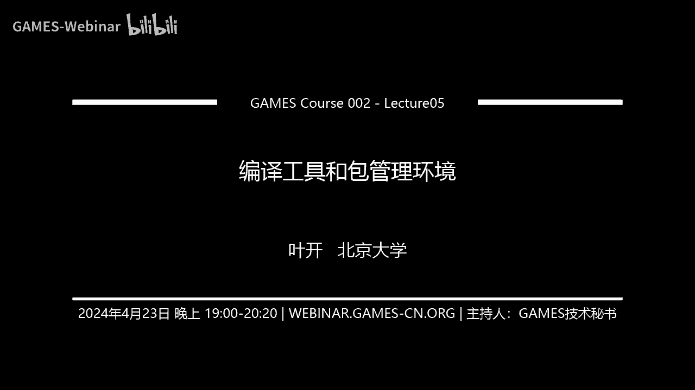

# GAMES002-图形学研发基础工具 - P5：编译工具和包管理环境 🛠️

在本节课中，我们将要学习图形学研发中至关重要的两类基础工具：编译工具和包管理环境。我们将分别介绍C/C++的编译构建工具（如make、CMake、xmake）以及Python的包管理工具（如Conda、pip），并简要探讨性能探查的重要性。掌握这些工具将帮助你更高效地管理项目、处理依赖和优化代码。

## 编译型语言与解释型语言

上一节我们介绍了课程概述，本节中我们来看看编程语言的两大类型。C和C++是编译型语言，需要通过编译器将源代码转换为可执行的二进制文件。相比之下，Python等解释型语言则通过解释器实时将代码转换为机器码执行，虽然速度较慢，但带来了便捷性。

在Windows上，我们通常使用本地IDE（如Visual Studio）进行编译。然而，在服务器环境或需要跨平台协作时，我们往往需要通过命令行进行编译。一个简单的编译命令如下：

```bash
g++ main.cc -o main
```

这条命令使用`g++`编译器将`main.cc`源文件编译成名为`main`的可执行文件。

## 为什么需要构建系统？

直接使用命令行编译简单项目是可行的。但当项目变得复杂，例如需要链接第三方库（如OpenGL）时，编译命令会变得冗长且难以管理。此外，不同的机器可能安装了不同版本的编译器或库，导致相同的命令无法复现。

为了解决这些问题，我们需要使用构建系统。构建系统通过读取配置文件，可以在不同的操作系统和编译器环境下，自动化地完成编译、链接等任务。它还能智能地检测代码变更，只重新编译更新的部分，从而提高效率。

## Make：基础的构建系统

在Linux环境下，最常用的构建系统之一是`make`。它通过读取名为`Makefile`的配置文件来执行构建任务。

一个`Makefile`文件的基本结构由目标、依赖和命令三部分组成。以下是其基本格式：

```
目标: 依赖项
    命令
```

例如，一个用于编译LaTeX文档的`Makefile`片段可能如下：

```
paper.pdf: paper.tex references.bib
    pdflatex paper.tex
```

这表示要生成`paper.pdf`，需要先准备好`paper.tex`和`references.bib`这两个文件，然后执行`pdflatex`命令。

对于之前那个简单的C++编译例子，对应的`Makefile`可以写成：

```
main: main.cc
    g++ main.cc -o main
```

`make`还支持一些特殊目标，例如：
*   `make install`: 将编译好的文件安装到系统路径。
*   `make clean`: 清理编译生成的文件。

常见的`make`用法包括：
*   `make`: 执行默认的构建任务。
*   `make -j4`: 使用4个线程并行构建以加快速度。
*   `make -C build`: 在`build`目录下执行构建。

然而，手动编写复杂的`Makefile`仍然非常繁琐，尤其是对于大型项目。

## CMake：跨平台的构建配置工具

为了简化构建配置，我们通常使用CMake。CMake本身不是一个构建系统，而是一个构建系统生成器。它根据`CMakeLists.txt`配置文件，生成对应平台的原生构建文件（如`Makefile`或Visual Studio项目文件）。

一个典型的CMake使用流程如下：

```bash
mkdir build
cd build
cmake ..
make
```

首先创建一个独立的`build`目录以保持源码清洁，然后在该目录下运行`cmake`生成构建文件，最后使用`make`进行实际编译。

一个最简单的`CMakeLists.txt`文件示例如下：

```cmake
cmake_minimum_required(VERSION 2.8)
project(HelloWorld)
add_executable(hello hello.cpp)
```

这段代码指定了CMake最低版本、项目名称，并声明从`hello.cpp`生成一个名为`hello`的可执行文件。与手写`Makefile`相比，CMake自动处理了许多编译细节。

### 使用CMake管理多文件项目

当项目包含多个源文件时，CMake可以方便地管理编译和链接。例如，一个项目包含`sqrt.cpp`（定义函数）和`main.cpp`（主函数），`CMakeLists.txt`可以这样配置：

```cmake
cmake_minimum_required(VERSION 2.8)
project(MyProject)
add_library(sqrt_lib sqrt.cpp)
add_executable(main main.cpp)
target_link_libraries(main sqrt_lib)
```

这里，`add_library`将`sqrt.cpp`编译成库，`add_executable`创建可执行文件，`target_link_libraries`将两者链接起来。

### 使用CMake查找和链接第三方库

对于第三方库，CMake提供了`find_package`等命令来简化配置。例如，查找并链接Eigen库（一个只有头文件的库）：

```cmake
find_package(Eigen3 REQUIRED)
include_directories(${EIGEN3_INCLUDE_DIR})
```

`find_package`会查找系统中安装的Eigen3，并设置相关变量（如`EIGEN3_INCLUDE_DIR`），我们只需将其包含到头文件路径中即可。

此外，还可以结合Vcpkg等跨平台包管理器。安装库后，Vcpkg会提供对应的CMake配置语句，直接复制到你的`CMakeLists.txt`中即可使用。

## xmake：现代化的构建工具

xmake是一个集构建、包管理于一体的现代化C/C++构建工具。它使用Lua脚本作为配置文件，语法更加简洁直观。

一个基础的`xmake.lua`配置文件如下：

```lua
target("hello")
    set_kind("binary")
    add_files("src/*.cpp")
```

这四行代码就定义了一个从`src`目录下所有`.cpp`文件生成可执行文件的目标。xmake还内置了包管理、编译器管理等功能，并且兼容Vcpkg。它甚至可以直接生成Visual Studio项目：

```bash
xmake project -k vs2019
```

运行构建也极其简单：
```bash
xmake
```

xmake的设计更符合现代开发习惯，但在生态和复杂场景支持上可能不如CMake成熟。

### 构建工具对比与选择

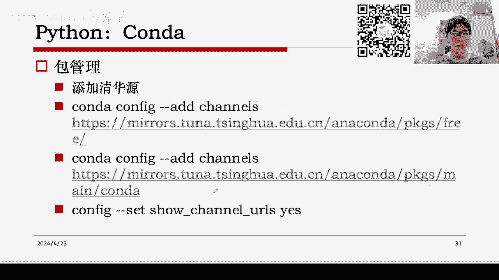

我们来总结一下这三种工具：
*   **make**：基础，配置灵活但繁琐，了解其概念即可。
*   **CMake**：当前事实标准，跨平台能力强，是发布项目的首选。
*   **xmake**：新兴工具，配置简单，集成度高，适合快速上手和个人项目。

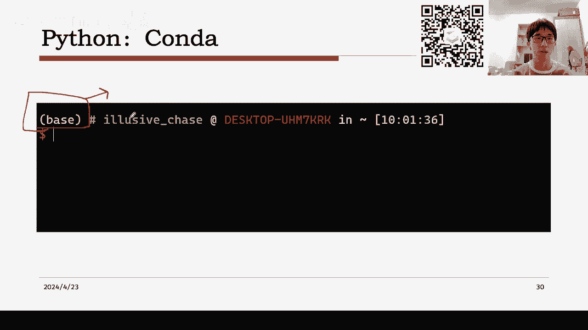

对于初学者，建议从CMake学起，它是目前最流行、资源最丰富的工具。

## Python包管理与虚拟环境

讲完了C/C++的编译，我们来看看Python的包管理。Python作为解释型语言，没有编译环节，核心在于管理第三方包和环境。

Conda是一个强大的包管理和环境管理工具。MiniConda是它的一个轻量级发行版。安装后，默认会有一个`base`环境。

为了提高国内下载速度，建议配置清华源等国内镜像。配置好后，基本的包管理命令如下：

```bash
conda install package_name        # 安装包
conda install package_name=1.0    # 安装指定版本
conda remove package_name         # 卸载包
conda list                        # 列出已安装包
conda clean -a                    # 清理缓存
```

另一个常用的包管理工具是pip，其命令与Conda类似：

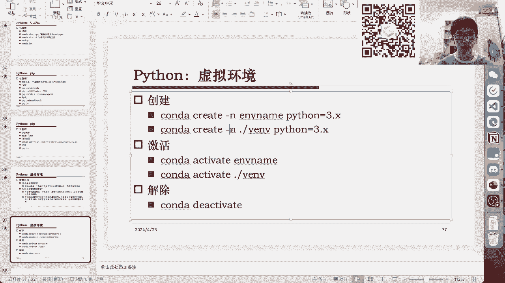


```bash
pip install package_name
pip install -r requirements.txt   # 根据文件安装
pip uninstall package_name
pip list
```

### 虚拟环境

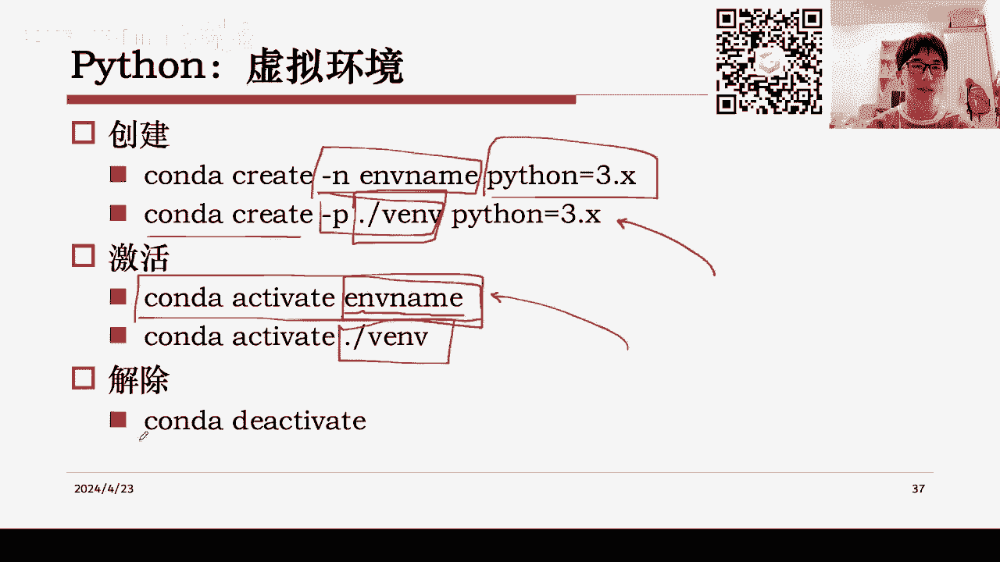

虚拟环境是Python开发中的核心概念。它是一个独立的目录，包含特定版本的Python解释器和一套软件包。不同项目可以使用不同的虚拟环境，从而避免包版本冲突。

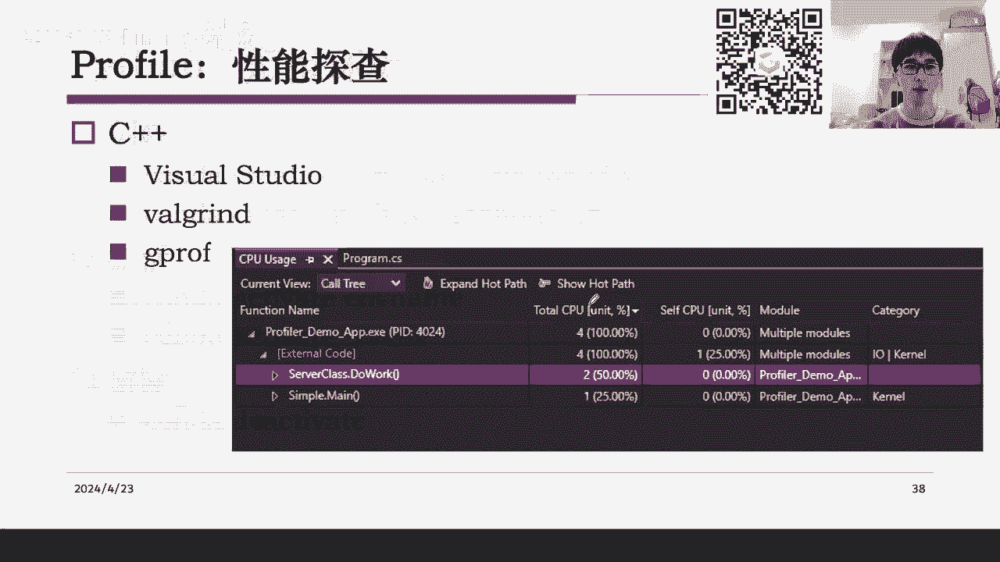

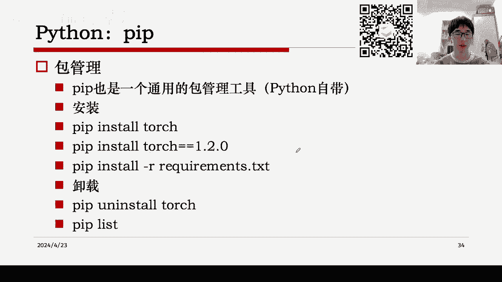

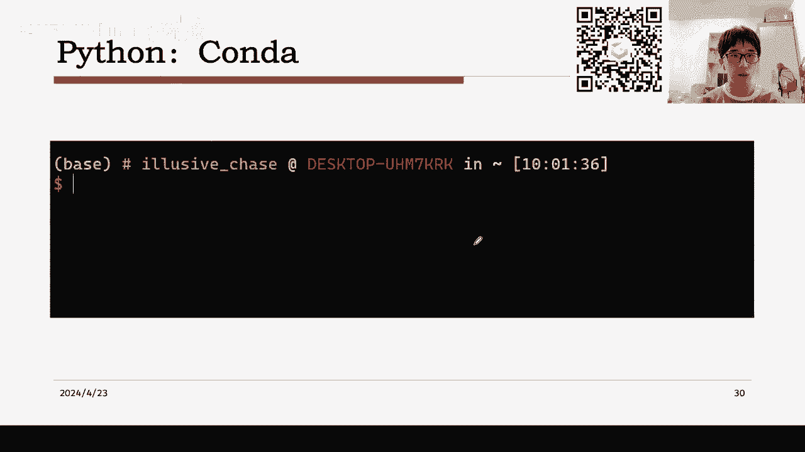

使用Conda创建和激活虚拟环境的命令如下：

```bash
# 创建名为myenv的虚拟环境，并指定Python版本
conda create -n myenv python=3.9
# 激活环境
conda activate myenv
# 退出当前环境
conda deactivate
```

你也可以指定虚拟环境的安装路径，以节省系统盘空间。

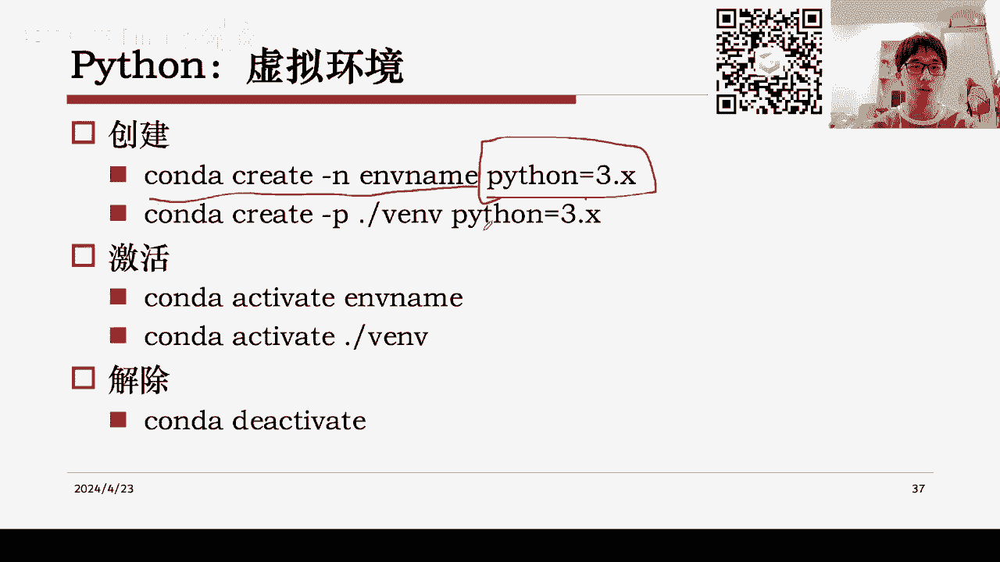

在实际开发中，我们经常需要复现别人的项目。通常项目会提供一个`requirements.txt`文件，列出了所有依赖包及其版本。我们可以按以下步骤设置环境：

```bash
conda create -n project_env python=3.8
conda activate project_env
pip install -r requirements.txt
```

**注意**：尽量避免在同一个Conda环境内混用`conda install`和`pip install`，以免引起依赖冲突。建议主要使用其中一种。

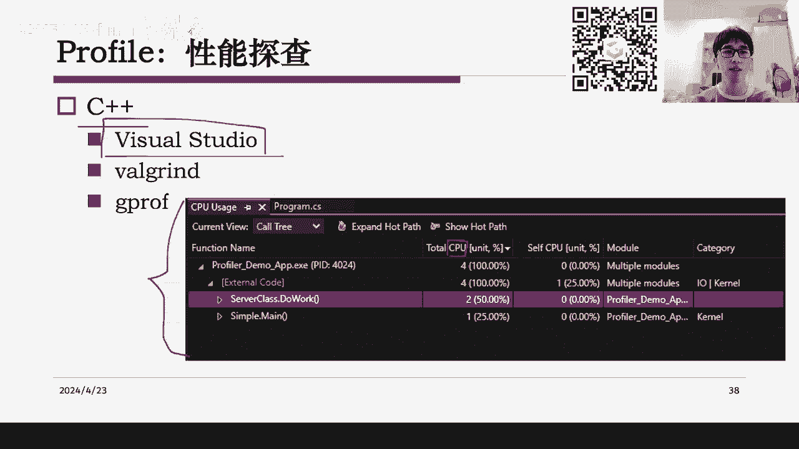

## 性能探查简介

最后，我们简要探讨一下性能探查。无论是C++还是Python项目，优化代码性能都是重要的一环。性能探查工具可以帮助我们定位代码中的瓶颈。

对于C/C++项目，可以使用IDE自带的性能分析器（如Visual Studio Profiler）。它会以表格或图表形式展示各个函数的CPU时间占比，帮助你找到最耗时的部分。

对于Python项目，可以使用内置的`cProfile`模块，或者结合第三方可视化工具（如`snakeviz`）。`cProfile`可以生成详细的性能报告，而`line_profiler`工具甚至能分析到每一行代码的执行时间。

例如，通过性能分析，你可能会发现某一行检查元素是否在列表中的代码`if item in my_list:`占用了93%的时间。这提示你，对于频繁的成员检查，应该使用集合`set`而不是列表`list`，因为集合的查找时间复杂度是O(1)。

性能探查的意义在于：在开发初期，我们应优先关注实现功能的正确性和开发效率；在功能稳定后，再利用性能工具进行优化，从而在长期迭代中节省大量时间。

## 高效编码实践建议

从性能探查引申开来，以下是一些高效编码的实践建议：
1.  **准备与阅读代码库**：利用IDE的跳转、调试功能阅读他人代码，不要只当纯文本阅读。
2.  **快速起步与验证**：初期使用最高效的方法（如Jupyter Notebook）验证想法，快速迭代。
3.  **延迟优化**：先确保功能正确，再使用性能分析工具进行优化。
4.  **善用调试工具**：使用IDE进行交互式调试，必要时保存中间结果与标准输出对比。
5.  **记录与计划**：记录实验参数，明确开发计划和瓶颈，平衡时间与精力。

## 总结与作业

本节课中我们一起学习了图形学研发中的核心工具。我们介绍了C/C++的构建系统演进：从基础的`make`，到广泛使用的`CMake`，再到新兴的`xmake`。我们也探讨了Python的包管理工具`Conda`和`pip`，以及虚拟环境的重要性。最后，我们简要了解了性能探查的意义和基本方法。

掌握这些工具，将为你后续的图形学项目开发打下坚实的基础。

---

### 作业二

本次作业共22分，其中6分为选做。

**第一题（8分）**：请在A（C++）和B（Python）中任选一题完成。
*   **A (C++)**：编写一个简单的“Hello World” C++程序，并为其编写一个`CMakeLists.txt`文件，使其能够通过`cmake`和`make`命令成功编译运行。
*   **B (Python)**：安装MiniConda或Anaconda。创建一个新的虚拟环境（例如名为`test_env`），在该环境中使用`pip`安装`numpy`和`matplotlib`包。最后，列出该环境下所有已安装的包，并截图。

**第二题（8分）**：请在A（C++）和B（Python）中任选一题完成。
*   **A (C++)**：实现一个简单的排序算法（如冒泡排序）。生成一个包含大量随机整数的数组，对其进行排序，并记录排序时间。尝试使用性能分析工具（如`gprof`或IDE内置工具）分析代码热点。
*   **B (Python)**：实现一个简单的排序算法。生成一个包含大量随机整数的列表，对其进行排序，并记录排序时间。使用`cProfile`模块分析代码性能，并简要说明分析结果。

**第三题（选做，6分）**：
*   **A (C++)**：尝试使用`xmake`构建一个简单的C++项目，体验其配置和构建过程。
*   **B (Python)**：尝试更复杂的虚拟环境操作，例如：导出当前环境的`requirements.txt`文件；根据该文件在另一个新环境中复现安装；使用`conda env remove`删除一个虚拟环境。

**提交要求**：将代码、命令、运行结果截图等内容整理到一份PDF文档中提交。
**截止时间**：6月4日晚上。

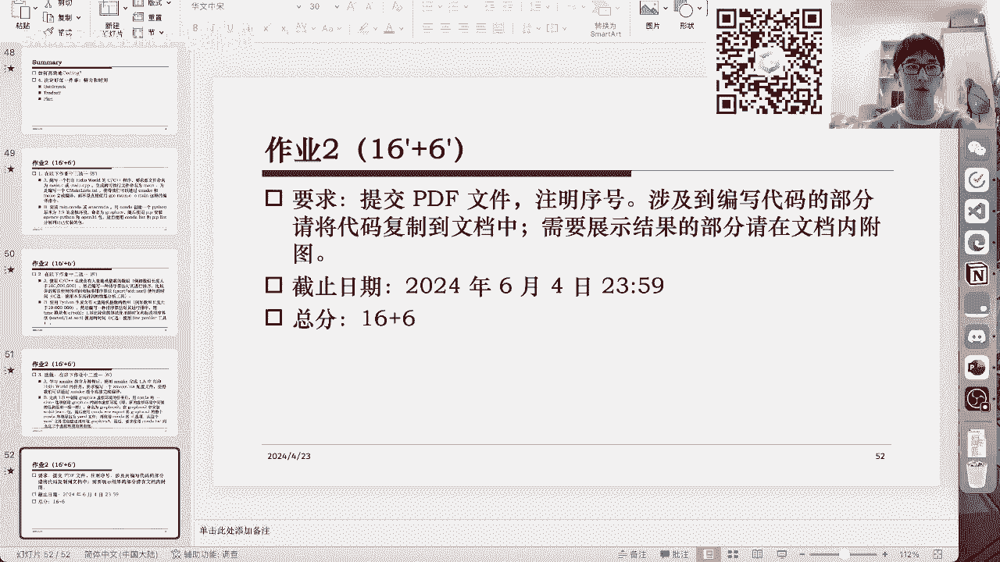

如有疑问，请参考课程主页加入QQ群进行讨论。