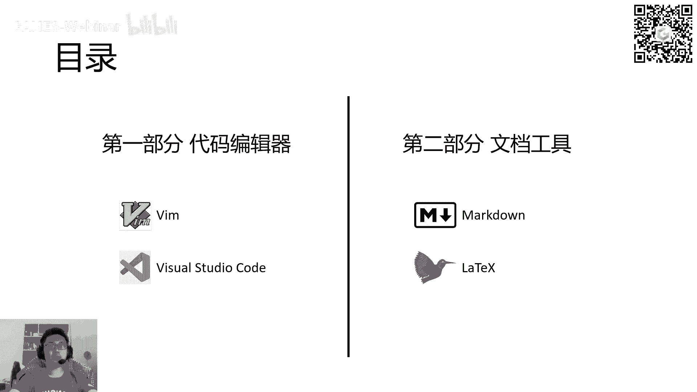
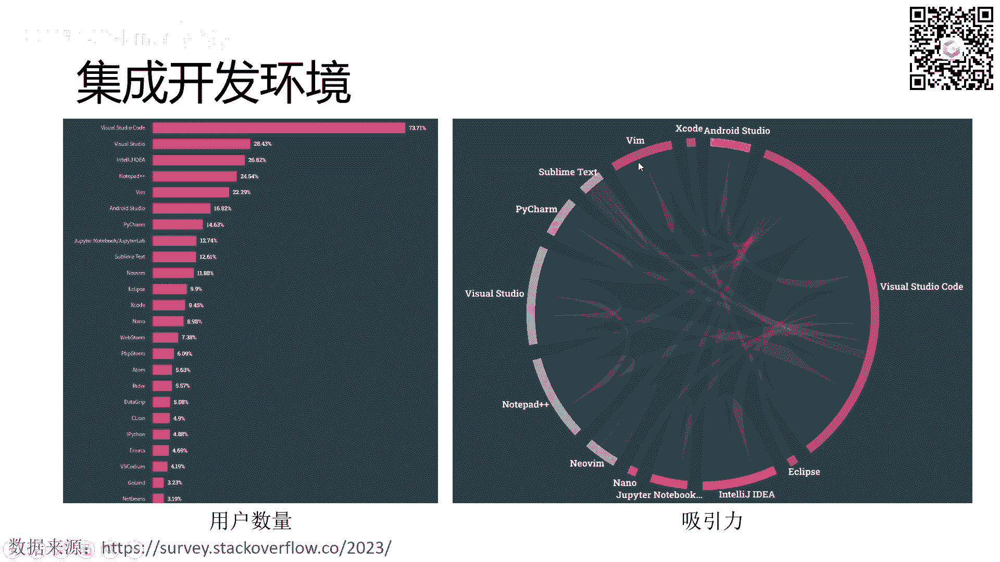
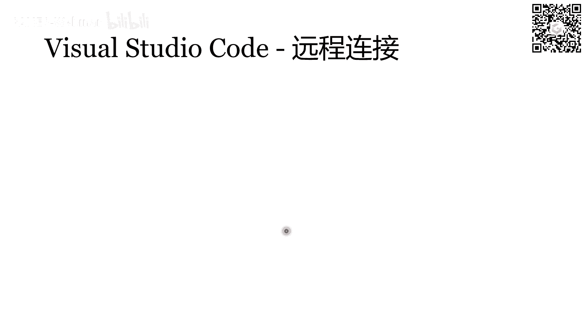
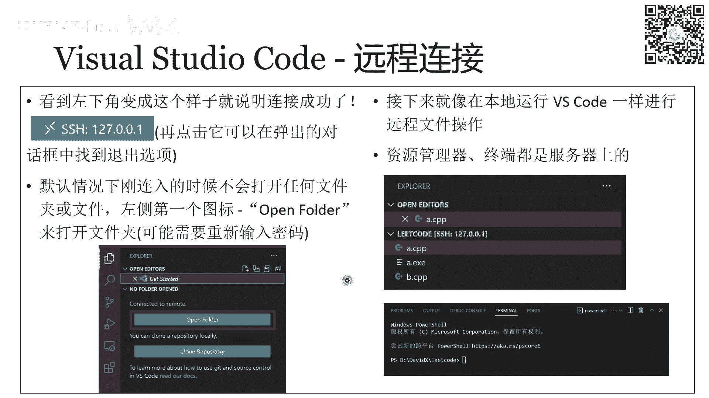
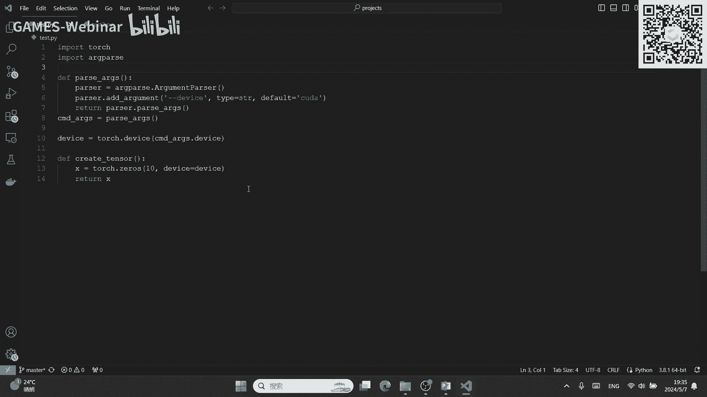
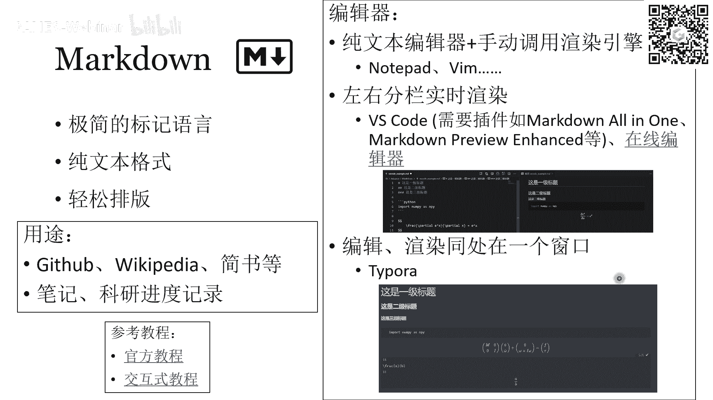
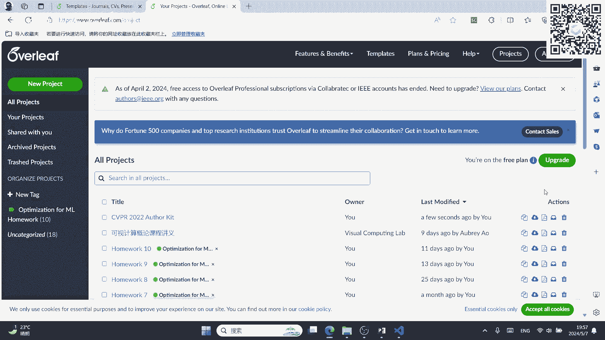

# GAMES002-图形学研发基础工具 - P6：代码编译器与笔记软件使用技巧 - GAMES-Webinar - BV1cC411L7uG

行啊，各位B站的朋友们大家好，各位同学们大家好啊，也是好久不见呃，上一周是五一，然后我们停了一次课，然后希望呃，相信大家也过了一个比较愉快的假期吧，嗯今天我要给跟大家讨论的一个就是呃。

讨论的一些工具呢是和代码和文档编辑相关的，好我们直接开始啊，今天讲的部分主要是要分为两个，我我我主要会讲四介绍四种工具呃，前两种vim和visual studio code呢，他们都是代码编辑器。

就是用来编写代码的，然后后两种是markdown和呃lay tech呃，这两种工具呢是用来写文档的行，我先把这个摄像头关掉啊，以后避免之后挡内容。

行，我们呃我们首先去介绍一下，什么叫集成开发环境，集成开发环境的意思呢，就是呃他其实简单理解呢就是呃它最主要的，但最主要的功能就是让你去呃，编写代码的一个地方，然后此外呢它还可以去集成一些其他的工具。

能让你的代码编译或者运呃，编译运行或者调试等等，其他的呃一些一些呃一些功能都可以有啊，这边呢我我我展示了两张统计图，这两个统计图都是截止到2023年的一个，统计的信息，今年的统计信息还没有出来。

嗯这呃首先左边这张统计图呢显示的是呃，目前最热门的一些呃集成开发环境的使用的数，用户的数量，我们可以看到visual studio code其实处在一个断层，第一的状态啊。

就是说visual studio code它的用户其实是最多的，用户基数是最大的，然后他的第二也是同样为微软公司开发的visual studio，也是一个呃，它是一个更加强大。

然后也更加大规模的一个呃一个集成开发环境，然后此外呢我们还可以看到，就是今天要讲另外一个win也是比较常常见的，也是排的比较靠前的呃，再往后看可以看到拍唱，还有jupiter notebook。

然后也是如果写Python的，同学们可能会比较熟悉这些呃，一般这两个这两个应该是呃比较专业，也比较常用的Python开发的工具，当然是除了visual studio code之外的工具啊。

然后右边这个统计图呢显示的是常用的几个呃，代码编辑器的用户的对用户的吸引力，这个图的意思是什么呢，就是它每一个半圆，每一个扇形，它对应一个呃，对应一个代码编辑器，然后每一条这样的透半透明的边。

其实代表就是比如说它从A连到B，他的意思就是我这个用用户正在使用A，然后他对这个B感兴趣的一个数量，对这个边应该越粗，就代表的数量越多，然后我们可以主要关注三个。

就一个是visual studio code，一个是WM，一个是new wm，然后其中new wm，其实就是win的一个更新的版本呃，我们可以首先看到visual studio code的部分呃。

前半就是前面这个小小段呃，它它代表的是就是从visual studio code指出的一些编，指出的意思就是我这个用户正在使用visual studio code，但是对其他的一些软件感兴趣呃。

然后后面这个更大的一个更大的半个部分呃，它是指入的边，然后他的意思就是我用户正在使用其他的软件，但是对visual studio code感兴趣，然后其中也包括一些就是粘性很高的用户。

就是正在使用visual recode，并且我也只对这一个软件感兴趣的用户呃，然后我们可以看一下，更有意思的是new win呃，这个边它是从visual studio code指向new wm的一条边。

也就是说，这一部分用户代表的是正在使用visual studio code，但是对new wam感兴趣的，然后最有意思的是，其他部分所有使用new vm的用户，他都只对自己这一个软件感兴趣。

他不会去看其他的就可以看，大概的看出来就是呃，其实如果是实习惯使用win这这类风格的编辑，编辑器的这些用户，他们可能就很难去接受其他的编辑器了，呃，然后包括win也是WM只有一条比较细的边。

是指到vivisual studio code，然后这也是因为visual studio code它应该也是可以配置成，就是跟win的操作几乎一样的这种呃这种样子的，所以还能够符合这个win的操作习惯。

OK接下来呢就是给大家来介绍一下win，然后因为不涉及到特别高级的一些呃一些功能，所以就是new vm和VM都适用的呃，这些接下来的内容其实是new vm和VM，它都是用的一个一些操作，呃。

我个人其实是不会用win的，就是我我只知道他们怎么工作，但是我用的特别不熟练，所以我也不习惯用win，然后呃这次课给大家介绍这个win呢，主要是有两个有两方面的目的，第一方面就是对于那些。

如果你听完这个WM的介绍之后，你对WM非常感兴趣的话，那么欢迎你继续去查WM的文档，然后就可以拿我这个PPT做一个引子去呃，去开始尝试WM，然后并且慢慢的熟悉它，然后呃需要提醒你的是。

这个win他的学习过程可能会很困难，他会很慢嗯，然后第二个方面呢，是对于那些对V不太感兴趣的同学呃，你们需要知道呃，你们一定需要了解的几点是呃，第一是win它的模式，它这几个模式就像右下角这个图一样。

它其实WM其实就是一个五个状态的自动机，然后自动机之间的状态是怎么来回切换的，你们要清楚，你们要清楚它是一个自动机的模式，然后第二就是很重要的，就是呃你们要知道怎么打开win之后怎么退出。

对如果说你完全不会使用的时候，因为你有的时候可能会避免不了打开VM呃，然后那个时候，如果你连退出或者保存都不知道怎么做的话，那就会陷入很麻烦的很麻烦的困境了，OKWM它的特点呢主要就是使用广泛。

以及它的历史很悠久，因为它其实是比这种比如说像windows这种操作系统，其实历史还要悠久的，它是在这种图形化界面的操作系统之前，就已经有了一个编辑器啊，是它是，所以它说它是可以完全运行于命令行的。

而且它也只能运行于命令行，也就是说比如说你要在现在来讲，如果说你要去远程SSH连接到一个服务器上，然后那个服务器很可能是没有图形化界面的，那这个时候你用文本编辑器，大概率就要用到WM。

当然也有一个更加接近现代编辑器的嗯，叫做NANO呃，那个功能应该就不如WM强大，但是可能会更接近于现在的，更加接近现在的这个编辑器，然后WM的话刚才说过，他确实非常难以学习。

但是学习如果你能真的能使用呃，这个熟练使用的话，收益是非常高的啊，就是一般来讲用win的这个用户啊，它的开发的速度，还有打字速度等等，应该都会比用其他的嗯，用其他软件的一些开发者要快一些。

效率要高一些呃，ram还有一个大特点，就是它可编程，然后有高度的自由性，就是你可以很就是有高度的个性化的这个能力，你可以把它配置成你想要的样子呃，它的可配置的东西，包括但不限于重视重映射键盘。

然后设置你自己想习惯的快捷键，然后也包括一些高亮和那个语法，就是高亮和什么缩进等等的规则，然后WM的配置文件，也是类似于我们之前讲过的BHBH的配置文件，有一个点BSRC。

然后WM的也有一个叫做点WMRC的东西，然后如果是new wm的话，会不太一样，一眼它是它叫做INIT点win呃，总之有一些更高级的设置，都可以在配置文件里去去这个呃去设置。

然后另外呢vim他会也会借助一些呃，借助很多大量的第三方插件去实现，其余的功能就是在编辑文本之外的一些功能，好的嗯对，在此之前我还是要去让大家看一下，就是记住右下角这样一张图。

这这个图就代表的win有五种状态，它最常用的状态也是呃我们WM刚打开，刚进入WM的时候，所处在的状态是中间这个叫做normal，normal状态下，可以通过呃，normal状态下。

它其实跟我们现在的文本编辑器不一样，你在键盘上敲一些字符，它不会直接的去在光标注插入那些字符，而是会把你敲入的字符识别成一些命令，然后这些命令作为这个自动机转换的一，些转移条件，比如说你敲一个大写的R。

那它就会从normal去切换到replace，这样一个状态下，然后在replace这个状态下呃，replace之后也会讲，他其实是主要是呃，只是用来去替换一段文本的，替换一段长文本来使用的。

然后呃另外还有一个insert状态，insert状态是最接近于我们现代文本编辑器的呃，常常态的，也就是说在int insert状态下，你输入一些字符，它会真正的在光标处插入那些字符。

像呃就是正常的去编辑这个文本，然后呃右下角的是visual状态，visual状态是用于选择一段文本的，就好比我们现在文本编辑器用鼠标去呃，选中一段呃，去框选一段这个内容。

然后还有一个叫做command line状态，command line状态就是命令行呃，也就是说呃在这个状态下，你可以去输入一些呃，输入一些字符，这些字符会被解析成命令。

然后让呃然后让这个win这个编辑器去呃，做你指定他做的事情，好的，我们接下来就是一个状态，一个状态来讲，首先呢是normal这个状态下M1呃，normal这个模式下。

最主要的要知道的就是在normal模式下，上下左右移动，可以用分别用这个KJHL这四个键去代替，然后大家可以看一下键盘上呃，HJKL其实是E就是一排连续的四个键，所以这个跟我们的上下左右键的分布。

是不太一样的，大家要注意一下，然后为什么我们要用这个这四个键去移动呢，这是因为呃WM它有一个宗旨，就是它尽可能的不用鼠标，它不仅不用鼠标，还呃让你尽可能的少用键盘使呃，就是用键盘的区域，就是它能让你。

他会让你就是所有工作都能够在那个数字键，以及常规的字母键，然后再加上ESC以及一些，比如说shift control的一些呃，普通的普通的这种快捷键呃，就是你五个手指最容易够到的地方呃。

这些地方的按键就足以完成所有的任务了，如果是呃对于旁边那种小的数字键，你可以用，但是你可以你也可以不用，你用了的话，就相当于是浪费了时间，然后报甚至于这种呃上下左右的箭头，这些箭呃也可以不用用了。

也是浪费时间，这就是WM的哲学之一啊，为什么还有两个哲学啊，就是首先它是区分模式，刚才说过，然后不可编程，就是配置自由，刚才也也说过了，OK那么在懦弱模式下，是用HJKL这四个键去进行光标的移移动的。

然后呃不只有这四个移动，这四个移动很是最基础的移动，还有其他的花式的跳转，比如说我们可以跳到单单词的开头结尾，然后括号的左左半部分和右呃，就是左括号和右括号，或者是行内段落间。

或者说上下翻页这些很高级的，现在编辑器里有的功能，win里都有，就是它们对应的，就是在normal模式下的不同的按键，然后具体的案件也是在PPT里有讲，我就不一一念了，大家可以在课后的话呃去看一下。

也可以照着这个按一下去实践一下啊，然后另外呢就是我们要介绍的就是insert模式，插入模式，进入插插入模式的方法，就是在normal模式下按小I键，就直接按那个I就可以了。

然后呃进入insert模式之后，他做的事情就是在当前光标位置进行编辑，然后还有一些其他的进入insert模式的方法，也是一些花式进入insert模式的方法，比如说我可以先跳到行首。

当前行的行首再进入insert模式，就是把当前的光标先移动一下，再再insert，那这个实现就是用大写的I，也就shift加I就可以了，然后还有一些其他的先体移动光标，再进入insert模式的方式。

也在这个PPT里有呃，然后此外还有一些就是你可以不需要进入，有一些比较简单的修改，对文本的修改，你可以不需要进入insert模式，只在normal模式下就完成它，比如说啊我们在左边可以看到。

就是有一个按S可以删除当前字符，然后再输入，我不知道大家能不能看到我的鼠标，我我我切一个激光笔，激光笔啊，这样会更明显一些啊，就是左边可以看到S小写S在呃，对在normal模式下。

按小写的S是相当于是删除当前的字符，然后再进入insert模式，但是等价的有一个就是按X按小写的X，那它的按X这个操作就是它只会删除当前字符，然后不会进入insert模式，然后类似还有一些其他的按键。

就是可以让你更快的就是不用进行模式切换，就进行最简单的一些编辑操作，然后还有一个replace模式，就是按大而进，replace模式它主要是用于长文本的替换，这里呢我也就没有详细介绍了。

因为它确实不是一个很常用的模式，一般我们最常用的模式还是insert模式，就是用来编辑文本啊，OK接下来就是呃接下来要介绍的就是visual模式了，就是WM里的选择文本。

首先呢VIVISUAL模式它的这个visual模式下，它是说呃你按那个刚才的移动键，就是包括这个上下左右键，以及刚才的在normal模式下的，那些高级的移动键呃，用这些移动键去移动光标。

然后光标所移动的这个道路上会框选住呃，移动的道路上会框选住这个所有经过的文本，就是你移动光标就可以框选文本，就这么简单，然后进入威慑模式也有三种方式，第一种是小小写的V进入V呃。

小写的V代表的是进入微show模式之后，我们是就是按照现在最常呃，现代文本编辑器中最常用的那种框选模式，就是移动光标经过的字符被选中，然后如果你按大V进入维修模式的话，相当于是光标经过的行整行都被选中。

然后如果是CTRLV进入的话，那它就是光标所经过的列也被选中，呃它是一个列选择模式啊，对呃接下来呃就是在选中之后还处在visual模式，这个时候你可以有两种选择，一个是按Y按Y表示我复制选中的内容。

然后按Y之后，这个visual模式将退出回到normal模式，然后剪切D也是同理，D也是同理，然后就是在你复制或者剪切完之后，你可以就回到normal模式了吗，在normal模式下再去按一下P。

就可以在当前的光标位置进行粘贴，OK所以就是我们可以看啊，就是其实呃我们可以稍微比较一下vim的操作，和我们现在文本编辑器的操作，现在文本编辑器如果我想复制一段话，到文本的开头，我是不是就是框选住。

用鼠标框选住一段话，然后按CTRLC，然后再把用鼠标点一下开头，然后再用CTRLV，然后如果你不想用鼠标也可以，你就是用上下左右键去，先先移动到你想框选的位置上，先把它框选住，然后CTRLC完之后。

你可以按一下home键或者Ctrl home键，可以回到整个文档的开头，然后再按下CTRLV进行粘贴，然后但是在WM里面它是怎么操作的呢，你首先需要呃把光标移动到呃，在normal模式下。

把光标移动到你框选的开始位置，然后进入visual模式，然后移动光标，直到你把所有的想copy的文本都框选下来，然后再按一下Y，然后再退回了normal模式，在normal模式下。

你再移动光标到文本文本的开头，这个时候你再按一下P，这个是我们刚才的CTRLC和CTRLV的全部过程，是这样的，所以WM它相当于和呃，我们平时的这个操作的一个最关键的区别在于，我们平时的快捷键。

其实都是通过一系列组合键，来实现它的复杂性的，而WM它的复杂性都在于这个状态机，就在于模式之间的切换，所以你会看到就是WM的熟练的使用的人，就是熟练使用win的人，他们经常会把ESC敲烂。

就是因为他们经常需要回到normal模式，以最常用的回到normal模式的这个按键就是ESC，好的嗯，然后最后一个win的状态叫做命令行状态，就命令行模式呃，这个命令行模式就是通过在normal模式下。

进入冒号去进入的呃，命令行模式的话呃，会在就是整个整个终端的窗口的最下面一行，显示一行，就是显示一行，然后这一行的开头是冒号，然后接下来你输出输入的所有字符，都会在冒号后面显示。

然后这后面的呃这一串字符呢就会被解析成呃，解析成你要WM干的指令，就解析成一个命令，然后最常见的命令有几个，接下来的命令是大家需要记住的，就即使你不对V不感兴趣，不使用为你也要记住这些。

首先呢是按W就是单个W，你敲完W之后再回车，就表示你敲完这个指令了，就是按回车表示结束你的指令输入，并且直接执行，然后你敲完W回车，就是说保存文件，然后W后面跟一下叹号，SODOT百分号。

它的意思就是用SUDO的权限去保存文件，也就是说如果你没有用SUDO呃，就是你没有以管理员，没有以root的身份打开WB，而你又编辑完了这个文本，你不想说退出再重新编辑的话，你可以用这个方式。

就是使用SUDO的权限，就是用root权限直接去保存呃，还有这三个是等价的啊，就是WQ小X，还有大写的ZZ都是保存并退出的意思，然后Q叹号和大写的ZQ表示的是退出，但不保存，OK应该是这些。

对上面这四条我觉得大家是需要记住的，就是你即使不用win，你要记住，这样的话你至少知道怎么保存，怎么退出嗯，然后接下来呢，后面后面的这些勇士是一些更高级的命令，然后这些的话就大家自己看就可以了，好吧。

嗯接下来我们就到这个vi visual studio code的介绍呃，首先我们要明确两个概念，那就是visual studio code和visual studio，这两个其实是没有什么太大关系的。

他们两个是完全不同的概念啊，visual studio呢它是一个功能更加强大，更加完整的一个集成开发环境，它有一套完整的工具链，包括呃编译器呃，链接器，然后以及调试的功能，调试程序，然后各单元测试。

所有的功能都集成在一个程序里，集成在一套软件里，这个叫做vs，也就是说你下载VS之后，编译器链接器调试程序，还有那些单元测试功能都是一并给你下好的，这就是为什么你安装vs可能会安装，一整天都有可能。

但是你安装vs code就不一样了，你可能222分钟就可以把它下完，然后安装完，这是因为VN vs code，它是其实就是一个就一个裸的vs code，它其实就是一个轻量的文本编辑器。

它只做文本编辑的功能，然后其vs code它其实更像一个浏览器，但vs你完全不能把它等价为浏览器啊，vs code你如果去打开它的那个属性的对话框，你可以看到啊，他这里有几个几个属性。

其中有一个这个chromium，chromium表示它的内核，它这个浏览器的内核，也就是说visual studio code，它所用的内核其实跟我们的chrome浏览器。

和我们的edge浏览器是一样的，呃然后V但是我们也会经常看到visual studio code，它也可以实现非常像vs一样强大的功能，也可以调试，也可以运行，也可以编译，这是为什么呢。

这都是呃这些就都归功于它的插件，就是vs code，它刚下下来是其实是只带，可能只带很少的插件，甚至是不带插件的，那然后随后如果你想去编译一下，比如说让v vs code去能够编译C加加。

或者能高亮显示C加加的语法，还有Python什么的，你都需要去安装这些extension，你需要额外的去安装，对包括语法高亮自动补全这些功能呃，刚开始是都是没有的，他其实刚下下下来。

你可以把它理解为它就等价于notepad，就是微软就是嗯windows下面那个记事本呃，Vs code，它也是一个高度可配置的软件，然后它的他的这些配置文件的都是JASON格式，JSON格式。

visual code studio code和vim不同了，就是它比win要好用的多，就基本上不需要上手吧，你就你只要会打字就能用，然后它也是图，因为它也是一个图形界面的这个应用程序。

所以它自然会有呃，一自然有这种易用性，OK之前其实我们已经有介绍过，就是远程连接SSSH命令对吧，然后应该也介绍过visual studio code里面，怎么去运用这个命令。

然后这里我也解释了，这里我我我PPT里也写详细的介绍了一下，怎么去呃，怎么去连接一个远程服务器。

用v vs code去连接，然后怎么去添加一个配置，然后让你呃。

让你在第二次以及之后更多次连接的时候，就不用重新配置了，就是你可以点一个选项就可以直接连接上，然后vs code，visual studio code它远程连接的一个好处就在于呃，你连上之后。

它会弹出一个新的窗口，这个窗口就好像是在你在远端服务器打，远端服务器打开的一个visual studio code一样，然后呃，它主要体现就在于左边那个文件资源管理器，里面，就是显示那些目录和文件。

显示的都是那个那个远程服务器上的，那些文件系统，所以就就好像你在本地一样去操作，但实际上你操作的是远程服务器上的内容，所以这是它的一个非常非常方便的一点，然后具体怎么做，其实也有讲，我我就我就跳过了。

嗯对，然后接下来可以给大家简单的介绍一下，威神vs code的基本的设置，还有它的一个多光标的一个小特性啊，就是呃它的设置的方法就是vs code，整个软件它的一个设置方法，通用的设置呃。

是在那个左下角的一个齿轮图标的，那个齿齿轮图标就是它叫做settings，你点击它，然后就可以呃，你点击它就可以进入到这样图片的一个界面，这个图片所示的这样一个界面啊，然后在这里面可以设置一些最基本。

最基本的属性，就比如说是tab字符的宽度，是四个还是八个还是两个，根据你的习惯，然后还有自动缩进，是否要自动缩进，然后是否要自动删除，行末的多余的空白字符等等，这些基本的编辑器的属性可以在这里设置。

然后这些设置也是可以多设备同步的，然后如果是更高级的设置的话，呃可能首先第一可能是跟可能会跟插件相关，那对于插件的设置，你要点到那个extension里面，然后选中那个插件，在插件里面有一个齿轮图标。

你在那个齿轮图标里去设置就好了，然后插件的设置以及vs code，在当前一个有一个工作区的设置，它都是通过JASON文件去配置的，然后在JSON文件里去指定它的每一个属性。

呃然后具体这个JSON文件的配置其实也是有很多，很多东西也也挺复杂的，呃大家可以就是我个人的建议，就是你遇到什么问题，就去网上搜搜对应的配置哪一条，然后嗯对如果想系统性的了解，可以去看那个文档。

然后还有一个小小功能，就是有一个多光标的功能，就是在vs code里面可以产生一下子产生多个光标，就是你的当前位置不只是一个位置了，可能是多个位置嗯，产生多光标的方法有两种，一个是按住鼠标的中键。

然后拖动一个矩形区域，然后你就会呃选中那个矩形区域，然后矩形所涉及到的所有的行，都会给你生成一个新的光标，另外一个产生多光标的方法就是按住Ctrl shift alt键，然后再按这个上下的方向键。

就可以往上或者往下一行产生一个新的光标呃，这个多光标的作用就是你可以同时删除，也可以同时插入，就比如说我在这个图里面，它呃呃这几行都是货对吧，都是按位或，我想把它们全都变成按位异或，我就可以多光标选中。

然后直接按一下异或就可以呃。

全都改一下子，全都改过来了，所以这里很方便，OK接下来我们就要进入到那个呃文本文本编辑，也就是文档的写，就是文档的写作，这方面就是前面的呃，代码编辑器的部分已经讲完了，大家有什么问题吗。

哦vim里面是叹号的意思，我这里有解释，我刚才没说，但是PPT里有解释，就是叹号其实表示一个shell命令的开头，就是W里面后面加了一个叹号，叹号后面跟的其实是一个效命令，然后其实你也可以不用加那个W。

就是你直接用叹号开头后面跟一个shell命令，它就会让他就是指他的意思，就是在shell环境下执行后面的命令，vs code有没有办法啊，一次输入多光标，多行下的一什么意思，WM大概要多久可以掌握。

这个我不清楚，因为我没学过，我感觉反正慎学好吧慎学，如果你是真的想追求极致的体验，极致的代码体验，那那可以用VM，但其实大多数情况下，我个人认为就是呃，你用普通的编辑器速度足够了。

这个我觉得你可能如果你想了解，就是WM怎么学，或者说要学多久，建议找一个vim大佬，我个人是不会用win的，不不不不熟练使用win的，按123的递增，多行的递增额，一次输入多光标下。

嗯对你的意思是就是多个，比如说我有三个光标，第一行的光标在第一个位置，第二行光标在第二个位置，第三三行光标在第三个位置是吗，这个呃这个我也不太清楚啊。

我不知道他能做到这个吗，就是你可能可以通过一些特殊的呃。

特殊的方法卡成这个位置，这样吧，我呃但他可能不太能做到，就是你每一行任意指定那个位置，就是多光标，每一行任意指定它的位置，可能还是比较难做到的。

呃我可以给大家做个示范，就是我先打开一个vs code，Sorry。

Ok anyway，嗯大家不知道能不能看到我的屏幕啊，OK可以看到我屏幕现在是个vs code，就是这个光标，它其实只是一个方便使用，它可能没有太大的任意性，就比如说我按中键，我产生了呃多行的光标。

然后在这个时候其实你可以做任何呃，呃按任何就是快捷键，你你把它当做一行来编辑就可以了，比如说我想全选整行，我就直接按住shift再按这个按键，就可以把这些行都选中，然后比如说我直接按住and。

我就可以把所有光标放到航墨，然后按住home就可以把所有光标放到行首，然后这样的话就可以实现，就是它的所有光标其实也不一定在一条竖线上，总之就是嗯你可以去这么使用，然后我还可以比如说我把它移到航母之后。

我再按住CTRL再按方向键，这样的话就可以让所有的光标都同时按照，一个单词，一个单词这样的跳跃的方式去移动，所以根据你的需求去做吧，他可能自由性没有特别大，没有那么大。

哦第一行输入一，第二行自动二，这个可能没有吧，这个应该是没有的吧，这个还是需要自己弄一下，就我我现在还不知道有这个功呃，有没有这个功能，我目前了解是没有这个功能了，一般遇到这种情况，我就自己手打了。

如果你比如说，如果你实在是一个要编辑，一个特别特别特别长的文本，你可以写程序去做，你可以写个脚本去改他的字符好吧，行嗯好嘞，嗯很好，我看到有个弹幕说，建议先在自己熟悉的编辑器里装win插件。

嗯是是是可以的啊，就是这样的话，你可以做到很方便的去拆卸这个WM，如果你用不惯的话，你可以随时回来，但是其实WM大多数情况下，如果你用的win linux的话。

然后windows里的WSL它其实都是自带的WM，就是你只要打开那个终端就可以，就可以用WM了，LINUX上用的多，是因为LINUX很多时候都不需要图形化界面，所以这个时候你用不了vs code。

你只能用V吗，然后刚才我所说的那个用vs code，SSH去远程连接服务器，应该也是要求你的那个远程终端也要装vs code的，不然也是没办法连的，OK我看可能大家没有更多的问题了，那我们就继续吧。

好吧。

呃接下来就讲的都是呃，就是文档的文档的编辑器了，其实他也不一定是编辑某个编辑器啊，它就是它其实是文档的编辑的一种语言，首先第一个是markdown，markdown它的图标是这样，就是一个M1个下降。

就是Mark和down很好记，markdown它的特点是，它的它是一个很简单的标记语言，非常简单，然后呃就是markdown其实是所有里面最易学的，我今天讲的所有东西里面最容易学的一个东西。

它其实甚至不需要学习，你就照着照着某个文档抄一两遍就会了嗯，第二个就是它是纯文本格式的，就是它的markdown文件，它的后缀名是点MD，然后这个MD文件它就是一个纯文本的文件呃。

然后walk down可以让你轻松的排版呃，在我们就是常见的就是用途当中，一般就是在GITHUB上的read me，就是都是用的markdown来写的。

然后WIKIPEDIA的这个页面其实也是用markdown写的，然后包括简书一些其他的也都用它，然后他其实还是一个你平时做笔记以及科研，科研记录进度的一个绝佳的工具，因为它特别简单。

它又不像latex了，它又不像呃LLTC一样，就是需要很复杂的，就是你呃比如说你想加一个公式，或者加一句话，或者加一个表，加一个图片什么的，不需要输入一长串代码，就直接加就行了。

直接加你的文本内容就可以了，所以markdown记笔记什么的，平时用还是非常方便的，呃教程有两个，第一个是官方教程，它是更系统更全面的，第二个交互式教程，大家可以在我PPT发下去的时候点进去看一下。

他其实非常有意思啊，就是呃它是一个网页，然后它会一步一步的指导你了解每一个语法，它会让你自己去输入那个语法，去了解它的它是怎么工作的，它的交互性比较强，OK呃然后哪些编辑器可以用markdown呢。

其实首先其实任何一个纯文本编辑器，都可以用啊，都可以去写一个markdown，但只不过是它能不能渲染的问题，你比如说用WM，用notepad其实都可以写markdown，它其实因为它就是一个文本的文件。

然后如果你用vs code的话，你需要装一下markdown的插件，然后才可以做到实时的渲染，就像这个图片里所展示的一样，呃另外markdown官方的呃。

就是有一个还有一个就是编辑markdown的一个软件，叫做type啊，这个这个软件应该是要付费的，这个付费呃，这个，但是这个软件它渲染出的markdown效果比较好看，然后他也是就是能做到呃。

就是怎么说呢，你就是编写实时渲染的，就是它还不是像vs code一样，左边分栏，左边是源代码，右边渲染，结果他是说你type a是你直接编辑，它就可以直接给你预览当前编辑的效果，就相当于是直接在一个。

直接在一个渲染好的地方，渲染好的上面去修改。

呃然后他的一些常用的语法就简单的过一下吧，首先是标题用井号来表示，然后井号的个数越多，表示标题的级别越低，就是他的他的级数越高，也就是说它它的字体越小的意思，然后还有一些强调，就是两个星号。

如果呃你用两个星号框住一段文本，表示把这个文本加粗，然后用一个星号框住的话，就是倾斜，如果又要加粗又倾斜，那你就用三个星号框框住它，就是两边各加三个星号，OK呃然后还有一些换行规则。

这个这个是比较重要的一点啊，呃就是它跟我们平时的编辑，比如说在word里的编辑是不一样的，呃，markdown里面他要敲两个换行才能是一个真正的呃，在才能在是一个真正的换行，才是一个真正的分段呃。

我们可以看一下下面源码的效果，就是如果你只敲一个敲一个换行，就是第一行这个啊，Sorry，就是第一行到第二行这个样子，就是他只敲了一个在源码里面只敲了一个换行，那么在渲染之后的效果呢。

呃它就是就是段落段落内的换行，就是这两这两个虽然它换行了，但是他还在同一个段落里，然而如果是你敲两个换行的话，它相当于是呃重新新开了一个自然段，然后对于有一些markdown的这个渲染器。

它它会直接忽略单个回车的情形，也就是说前两行它会直接并成一行，在渲染之后，然后呃后面一个语法是列表列表的方式，就是前面加一个短短横线，然后短航线就是代表着一个那个列表的开始符，就是那个这个小圆点。

然后呃在列表之后里面可以添加子列表，然后在列表里面也可以按照刚才的换行方式，敲两个回车或者敲一个回车，都是可以有这种效果的，呃对然后这里面是呃这里是缩进敏感的，大家要注意就是呃它识别你是二级二级列表。

二级列表的依据，就是说你二级列表的缩进比一级列表更靠前，就是缩进更更多，就是这样子呃，接下来是还有一个特殊的列表，是带复选框的，就是这种呃这种你可以点点到勾和取消点呃，就是你可以点击勾选它。

也可以取消勾选的这种呃复选框的列表，它的方法就是一个减号，然后空格再跟一个呃，中括号跟一对中括号，然后记住，如果说你想不选这个复选框，你要中间要留一个空格，如果要选的话，中间要加一个X。

Mark text是吗，我还没有听说过Mark text可以可以，如果有免费的版本也那那就更好了好吧，TAPA应该是一个比较官方的版本，它他其实以前也是以前也是不收费，以前也是免费的。

然后应该是近几年才开始收费嗯，对列表之后我们去讲这个公式啊，公式就是数学公式，公式的话一般是呃，用这个dollar美元符号去框起来，如果是单个美元符号框起来，那是行内的公式。

如果是呃两两个美元符号框起来就是行间公式，它的区别就是下面这个效果，这样行内公式就是在呃他不换行行间公式的话，它会强行给你换一行，让你这个公式单独处在一行，呃然后至于公式类怎么去打这个语法的话。

这个东西其实是呃latex的语法，就是呃接下来接下来这个雷tag应该会讲到啊，然后markdown还有一个引用的格式，就是它的效果是这样子，就是呃就是类似于你在文章中，比如说引用一段诗。

一首诗或者引用一段歌词，就这样的，或者说引用别的文章中的一个说法，一个一个一句话，他呃这样的一个效果，他的方法就是大于号加空格就可以了，然后如果多个太多，多个大于号的话，可以实现引用里面再加引用。

还有一个概念是块啊，就是markdown里面你可以输入代码块，如果呃代码块也分分为行，行内和行间就行内的话，你只需要用一个呃，一个这个斜点，这个符号就可以括起来就可以了。

这个斜点符号是在你的键盘的左上角，ESC的下面呃，大多数键盘的布局应该都是这样，就是在EC下面那一个，然后你不需要按shift打，打出来，就是这个符号，对，然后如果是行间的话，行间的代码块的话。

就是用三个这样的写点这个符号呃，然后这个代码块你也可以在呃，在其就是在前面这三个节点之后，去指定它的是哪种语言，比如说这里我就指定的是Python，你还可以指定是c#或者C加这样子。

OK另外一个常用的是超链接，markdown里的超链接，超链接就是的格式，就是用中括号括起来呃，你你想想你想对哪些内容去施加一个，去添加一个超链接，然后小后面跟一个小括号。

小括号里面是这个超链接所链接到的地址，它有点类似于，你在word里或者PPT里面去选一段文本，然后右键添加超链接，这个呃这样一个意思，然后只不过你那个右键选中的那个内容，在这里是用中括号框起来的。

这样讲应该大家都理解呃，然后除了这个链接到网页之外，还有一个锚点机制，就是比如说你在行呃，就比如说你在行内就是有一段内容，你想把你想把它变成一个可以点击的东西，然后点击之后会跳转到文本的另外一个位置。

那它的方法就是说，我我在这个中括号显示的内容，这个中括号的后面去跟一个中括号，注意这里跟的是中括号，而不是小括号，然后这个中括号里面是一个Mark marker，是你任意的一个字符串。

然后只要你在后面用同样的一个字符串，然后加上冒号呃，然后后面再指定那个跳转目标就可以呃，就可以把他们俩链接起来，就是所以其实他呃，他的意思就是说我这是成对的，我这里在呃在行内。

我会我会把这个显示内容框且用框框起来，然后后面跟一个Mark，后面我还需要定义一下，这个Mark跳转的目标是什么，然后至于这里跳转的目标呢，可以是像刚才一样一个网页的链接，也可以是某一个标题。

然后如果你想跳的是当前文档中，某一个标题或者子标题，任意以及标题都可以，这样呃，这个时候你必须在这个标题前面加一个井号，就是像这种呃marker冒号井号，TTITLE这样的一个格式。

这样的话你就相当于是呃添加了一个锚点，然后呃这个显示内容这这四个字，这就是这个框选的这个部分，它也会变成一个超链接的样子，就底下加个下划线，字体变蓝，然后你点击它之后，它就会跳转到。

就会把文档自动滚动到你这个呃，你指定的这个标题的的那个地方，呃另外还有一个插入图片的语法，插入图片和超链接是非常相像的，只不过在前面多了一个感叹号就可以了，呃感叹号呃，另外一个不同点呢。

就是中括号里的内容是它只是一个注释，有点像comment，这也就是说在它是在图片不可用的时候，就图片挂了的时候，或者说图片不存在的时候，它才会去显示嗯中括号里的这些文本。

然后如果你也可以把这个中括号直接滞空，然后如果图片正常的话，它就会正常的显示这个图片，这后面这个图片地址呢可以是本地的一个呃，目录，也可以是网站，就是网一个网站一个网址，对。

然后这里的话在markdown里面插图片，确实是一个问题，就是如果你想把它传到网上的话，很很有可能你需要把这个图片去，上传到一个图床的服务器上，就是说给你这个图片上传到某个服务器上。

然后给你这个图片生成一个固定的网址，然后你在这个小括号里填上那个网址就可以了，嗯但是比如说对于GITHUB的那个read me的话，read me里面你要插图，其实就不需要这样操作。

你直接不在后面那个地址，填一个相对路径就可以了，然后是目录，就是如果你想给这个文档插一个目录，你直接在那个地方加一个中括号，TOC就可以了，呃还有分隔线是三个星号表格对，然后一个比较重要的也是表格。

这个表格也会比呃LANTIC里面要简单的多，就是它的方法就是这样，你你手打一个表，手搓一个表格出来就好了，然后大概就是现在我PPT里展示的这个样子，它就对应于下面这样一个呃也一个表格。

然后这里面有个细节啊，就是第二行它会指定，就是你看第二行它有冒号和减号这几个字符，它其实指定的就是，你当前这一列是左对齐还是中对齐，还是右对齐呃，左对齐还是居中还是右对齐，然后这里也不难看出。

如果是左边只有左边有冒号的话，是左对齐，只有右边的是右对齐，两边都有冒号，就是居中，ok markdown呃，这这里就是markdown的全部内容，然后我们接下来再讲一下LTC。

我呃我我这里一直在读LTC，是因为我最近查了一下这个发音，我之前其实都是很习惯读它了，TX或者LTX，但是实际上呃，当这个这个词专指我这个文本编辑器的话，呃我专指我这个文档工具的话。

它的读音是LT就后面那个X只发一半的音，呃这个具体的话可以去找那个创始人，他的那本书可以他有一个介绍嗯，latex就是这个单词，其实还有一个意思，它叫做它应该是乳胶的，意思就是没有大写啊，全都是小写。

那他当他表示乳胶的时候，它的读音就是latex，他有这个X是正常发音的，但是当它在我们现在这个语境下，它就应该读成LTC，然后但是这个不重要了，你只要大家都明白，你随便怎么发音都好呃。

latex它的主要的特点就是它是一个很高效，也很高质量的排版系统，它所生成的文本一般来讲会比markdown的要多呃，要要专业的多呃，一般来讲就是你发paper什么的。

发paper甚至出书他都是用LILLATEX写的，不会用不基本上不会去用markdown写，markdown相比于他来说还是更随意一些，但是雷泰克它有一个缺点，就是它需要编译。

它不像lock markdown一样可以及时渲染，就是markdown有点类似于我及时解释，然后它是很清亮的，就相当于是一种mapping，就是字符串之间的mapping一样的一样的简单操作。

但是LTC不一样，latex它是类似C加加这样的一种语言，它是你把这个整个代码写好之后，它需要编译你这个代码，然后从而转化成PDF的输出，latex它也是有很多很多的红包的，就跟正规的编程语言是一样的。

都是需要各种外部的包的，然后这个红包也是可以开发的，也也是可以，你你你也是可以自己开发的，然后这里我们有也有一个LTC的官方文档，大家如果就是遇到很详细的问题，可以去搜一下呃。

至于LTG一般用什么编辑器呃，最常用的还是overleaf，overleaf就是呃一个网站，它是3W点，overleaf点com这样一个网站，啊对，然后这个网站呢，它其实就是一个管理你所有LT文档的。

一个一个网站，一个服务器吧，然后每一个文档你其实都可以添加合作者，然后这些合作者就都可以就是协同的在线编译，就有点类似于现在的腾讯文档，它是实时的编译的，就是你现在敲一个字啊，你协同的人如果在线。

他就可以立马看到啊，而且要网好啊，当然然后嗯LTC还有一个比较方便的点，就是它有很多的模板可以使用，这里我可以给大家展示一下PPT，没有涉及到，我可以告诉大家这个雷tag要怎么，怎么去找他的模板。

OK呃就是你进入到overleaf主页之后，你登录之后，它会直接到你的这个project页面下，然后你点呃，上面的上面这一栏的那个templates就好了。

然后你会发现有很多很多的模板。

包括书啊，还有那个文章，还有引用等等等等。

呃如果你想搜一个，比如说我我也不知道能不能搜到，我随便搜一个CVPR的模板，文章的模板它理论上是可以搜到的，你看每一年的呃都是可以搜到的，然后点进去就可以了，你可以你可以直接open。

然后然后把这个把这个存下来保存下来，它其实你open之后它会自动存下来，然后你接下来改个名什么的，然后呃它渲染出来是这个样子，接下来也就呃改一下对应的，比如说作者信息。

还有你的正文信息摘要啊等等等等就可以了，所以这个还是非常方便的，对，就是你你会发现我这个已经多了一个这个，CVPR的文档，就是你刚才只要打开它会自动给你保存下来。

行，回答的事情OK另外一个这个编辑，另外一个写latex的编辑器呢是vs code，也是vs code，但是同样的，你还你也需要安装那个Lt text live的编辑器，还需要配置编译环境。

然后你的vs code里面也需要安装对应的插件，这样才能呃才能这个充分的利用起来啊，就是我个人还是推荐使用overleaf的，只要你网好，嗯latex latex的一些常用语法呃，我这里也介绍一下吧。

首先是它的一个基本的框架，就是一个最简单的文章的一个框架，是什么样子呢，他首先要用document class来指定一下呃，文档的类型，比如说article，这里可以是article。

然后如果你要文章中要中文的话，你需要换成这个c tax art，然后呃LTC里面像一般的编程语言都一样，呃和编程一般的编程语言都一样，它也有这个注释，行注释的话。

就用那个这个这个叫什么百分号开头就可以了，嗯接下来接下来就是跟着的就是一个begin document，就是进入document的这个环境，在document里面才是你真正的想要显示的内容，在呃。

包括什么图，就是所有的文本图片，表格标题什么的列表，所有东西都在document这个环境里呃，去输入，有点类似于你C加加里的main函数，就是你真正要执行的代码都在这个环境下面。

然后在document外面是什么呢，中间有一个导言区，导言区的意思就是有点像呃Python里的import，或者说是C加加里的include，就是说你要包含哪些红包。

然后也也有一些predefined的变量，就比如说作者作者的名字，然后还有你可以去在latex里面去定义一些呃，command就是一些快捷的命令，然后定义command的方法。

就是用new command这样一个指令去定义，所以导言区就类似于引入红包，然后声明全局变量有点这个意思，好的，接下来是标题和章节怎么去做呃，现在我因为要用中文。

所以这里换成了document class，换成了c tx art，然后添加标题的话就是title斜杠，title指定这个文档的标题，然后接下来是这个，author就是指定他的名字呃。

只指定这个作者的名字，然后接下来还可以指定一下它显示今天的日期，当然这个我我我这个，我截图是比较早的一个截图了，所以日期是很早的，大家忽略这一点就好，你呃但是你在呃你在编辑的时候。

你用这个斜杠today表示的就是今天的日期，嗯然后接下来呃，但是呃这里你要注意，就是我们现在只是在导言区定义了这个文字，和定义了这个文档的标题和，作者的名称以及日期，但是呃它并不会让它显示出来。

你要真的让它显示出来，得在document这个环境里面写一个make title，好，这个make title就会把刚才你在导言区域，定义的所有东西打出来，呃然后如果你想开一个新的章节。

就用section，如果是新的子章节，就是subsection，这就类似于markdown里的一级引号和二级引号，这样子嗯对然后还有以此类推，Subsection。

下面还可以有sub subsection，但是应该最多就到sub subsection，在在之后就嗯，在之后就理论上不应该再分更细的章节了，如果你想再分的更细的章节的话，你可能需要用一些其他的。

比如说字体加粗加粗的方式，但是LT的这个允许你应该就只允许你做，做到subsection这这么多呃，后面的话再往后其实还有一些类似paragraph，就比如说呃一个段的断手。

你可以用那个斜杠paragraph，来来指定那个断手的一个小标题，呃是这样的，然后类似于markdown latex里面也有列表呃，如果像markdown里那种圆点的列表的话，你就用这种items环境。

就是begin itemize，然后每一个条目都前面都需要跟一个呃，就需要加一个杠，斜杠item，然后如果是以数字开头的列表，就换成enumerate就可以了，然后这里面还有更多的样式的调整。

也可以点击这个链接去看一下嗯，latex里面也可以去插入公式呃，你像这种begin equation and equation，其实就对应于markdown里的那个双引号括起来的呃。

公式它就是行间公式嗯，然后行内公式也是和markdown一样，就是用一个单引号就可以用，用一个单引号括，用一对单引号括起来就可以了，然后latex其实也可以不用这种equation的环境。

你可以也可以像markdown一样，用双引号括起来一个公式，它也可以变成行间公式，但是和它的区别就是呃，equation会给你带一个后面的label，然后如果是用双引号括起来的。

他就不会给你带那个label，嗯然后还有一些更高级的公式的方法，就是一些更高级的公式环境，比如说你如果想写多个等式并列的写的话，可能需要用line环境，line环境就是说呃它可以让你指定就是多行公式。

并且可以让你比如说只对对齐等号，或者对齐最左边或者对齐最右边，这些都可以设置，然后呃如果要用这个环境的话，你应该是需要加一个这个a s a m s max包的，然后这句话use package。

这句话就放在刚才所说的那个导言区就可以了，好creation，嗯这里面我我我这里还讲了一下，就是引用的问题，就是呃比如说如果你想引用一个公式，那你就在这个公式的这个环境里面加一个杠。

label这样的一个呃这样一句话，然后label后面表示的是你这个引用呃，就是相当于声明的一个变量，这个变量所代表的就是这个公式，然后你接下来想去引用这个公式的话，就在行间使用这个斜杠呃。

而呃rap rap它是reference的缩写，就是rap，然后rap后面那个大括号，写同样的这个变量名就可以了，呃这里这个这个代码其实就是个例子啊，在这个括号里我引用了这个呃这个公式的label。

所以在这一行里面，这个label所对应的就是一，然后在生成PDF之后，你也可以就是点一下这个一，它就可以自动跳转到呃公式所在那一行，还有就是LTLT里面插入图片的方法，就是用这个figure这个环境呃。

你当然可以直接插入图片啊，就是直接使用include graphics，然后中括号里面写的是参数，一般就是用来指定这个图片的缩放，比如说是0。7倍的text wise，就表示我的图片的宽度。

就是我把图片缩放到它的宽度，等于0。7倍的文本的宽度嗯，然后后面大括号跟的是图片的文件名，如果你在overleaf上插图片插图的话，你需要在overleaf这个项目里面去导入这个图片。

然后呃这里的路径也就是overleaf项目里面，那个图片所对应的路径，如果是本地的话，这个路径相当于就是一个相对路径，你也可以只是这个绝对路径，呃但是我们一般不会直接用include graphics。

去查图，因为这样的话他不会有，比如说标题以及对图片的引用，这些都不太行，然后包括我们想控制图片的位置也也也很难，所以一般插入图片，我们都会把它放在一个浮动体里。

所谓的浮动体其实就是这个figure环境呃，然后我们就看这个代码就可以了，这include graphics放在这里面，然后他还有一些其他的选项，比如说居中，Century，表示。

我想把这个图片放到整个文档的居中的位置，然后还有我可以加一个caption，就是标题呃，然后后面我还可以像公式一样去加一个label，然后后面我也可以通过和同公式一样的方法，去引用这张图片。

然后我们还注意到一个细节，就是在begin figure这一行之后有一个中括号，中括号里面有HTP3个字母，这里表示的是H表示的是here，就是我希望让这个图片尽可能的放在我呃，当前的位置呃。

T呢表示的是top，就表示我希望这个图片尽可能的放在文本文呃，这这一页的顶端，然后B就是bottom底端的意思，然后还有一个P这里没打，他还有一个P的话表示的是a page of float。

也就是说图片单独放在一页里面嗯，这里呢其实这个中国号给他的是lettuce，是其实是给LT一个排版的建议，就是说你优先去考虑能不能放在here，放在现在当前这个位置，如果不行，比如说图片太大了。

不行的话，那你再去考虑能不能放在某一页的页手，就是叶顶端，然后再不行的话再去考虑放液底端，然后再再不行的话，再去考虑其他选项呃，但是这其实也只是去给latex的一个建议，他有的时候在一些情况下。

他其实是不会采取你的建议，他会直接忽略这些呃，如果你想坚持的话，想坚持你的想法，就是想强烈的建议他，你可以在这前面加一个叹号，如果但是这个时候，内tag还是有可能忽略你的建议呃。

这个时候如果你想再坚强的表，强制，再坚强的强制他安排，这个图片放在当前位置的话，你就可以用这个大写的H中括号，大写的H来表示，然后这个强制强制放图片位置的这个做法，其实一般是不提倡的。

然后latex的宗旨也是嗯，尽可能按照LTX他自己的呃，按照LTC那个编译器的审美，不要按照你的审美去排版，因为如果你按照你自己的审美去排版的话，很可能会去产生大量的空白，然后导致不美观。

然后我们一般都是按照LTC的这个，latex的这个习惯，去LTC他自己的习惯去排版图片就好，好然后图片之后是表格，表格也有和图片一样的，就是这个安排位置的方式，你也可以用中括号去建议他放在哪里嗯。

对然后表格的方式，这里的表格的话，可能就会比那个markdown里面要难一些，首先我们可以借，就是先先去生成一个最简单的表格呃，最简单的表格就是在中间这个tabular，这这一段里面。

我我生成一个四元的表格，就是一行只有两个字母诶，只有只有两个项目，然后呃它是在tabular后面，会跟一个大括号框起来的cc，这两个C都表示的是居中的意思，对啊，就是说当前列都居中。

当前列列的内容都居中，然后两个C就表示两列都会居中，然后还有这个字母也可以替换成L或者R，L表示左对齐，R表示右对齐，很好理解，然后接下来呢这个怎么去排版这些格子的内容，就是呃就是说你先输入东西。

然后如果想切换到同一行的下一个格子，你就加一个雨，加一个这个雨的符号，然后再输入第二个格子的内容，如果你想换行的话，就用这个双斜杠，双反斜杠就表示换行，换到下一行，再用同样的方式呃，输入C然后再加个雨。

再输入D，这样的话我们就生成了一个2×2的表格，AB和CD呃，但是这样的表格显然非常的low，他什么都没有对吧，我们想如果想添加竖线的话，就在那个tabular前面，那个C和C中间去加一些竖线。

就表示我表格的这个行间是是由竖线分隔的，然后如果要横线加横线的话，就是你不仅要换行，你在换行之后，你可能需要一个哦，对你在换行之后，你还需要加入一个单独的行，就是斜杠h line。

然后h line之后再换行，这样的话才会在行与行之间去添加一个横线，然后这里我们要注意啊，就是比如说我现在在我这个换一个比，如果我们在这个这个这个地方，就是A和B和C和D中间加一个这个杠，H line。

哎呀不好意思，在这个地方我就不写了，就是在这个地方加一个h line，然后呃，它只会在A和B和，C和D这两行之间加这么一条横线，然后上面和下面其实是不会加的，如果上面和下面还要加的话。

你必须要在A和B的前面也加一个h line，然后C和D的后面也加一个h line，然后这个东西应该就是，呃latex的表格，它应该还会有很多很多其他的选项，也有很多其他的排版，高级的排版方式。

然后这样的这个东西你们不用愁你，我这里有一个工具，就是excel to late，你可以点进去，它是个网页，你可以直接在那个网页去，你可以上传一个excel，或者或者说你可以在网页上。

直接去手动编辑一个表格，然后它可以自动给你转化成latex代码，然后你复制到复制过来就好了，呃然后最后应该这应该是最后一个了，就是LTG的最后一个语法是论文引用呃，论文引用的方式呢。

就是一般它会采用这个BTEXT的格式去引用，你需要做的事情，首先是你在这个LTC项目里面，添加一个点BIB的文件，这个点BIB文件就是BTX的，就是存有beef text格式的所有的文献的引用。

把所有文献引用相当于列个清单，在这个文件里保存下来，然后你在正文当中呃，先去你在正文的就是刚才不是有一个document，就是document的环境吗。

你在document的环境and and document环境之前去，也就是说正文的最后的地方去加上这个引用呃，加引用的方式是首先去用这个bibliography style。

去使用指定它的引用的风格呃，然后去，嗯然后然后在之后去使用那个bibliography，bibliography这样一个命令，然后呃后面的大括号跟的，就是你这个BB文件的文件名。

注意这里的文件名不要加那个后缀名，然后这个文件名的话就是指定你用哪个呃，big text文件去作为引用的，这些也就作为引用库吧，然后接下来你只需要在行文当中去加呃，如果在行文当中需要引用某一篇文章。

比如说要引用爱因斯坦这篇文章的话，你直接在那个地方输入斜杠赛，然后在里面写这个爱因斯坦就可以了，然后这个爱因斯坦这个词呢就是每一个BBTX，每一条BBTX它都是遵循这样一个格式。

然后它的格式中的第一个参数呢，就是你set后面跟的那个字符串，然后后面这个其他的参数会指定他的文章名啊，作者名，然后哪些哪个journal上哪个哪一页哪个号，然后年份等等的信息。

都可以指定在这个bb text里面，然后如何去就是如何去找到这种一个文献的，beef text是什么样子的呢，你可以在谷歌学术上面去呃，找到一个条目的这个引用，然后点一下它会弹出来一个这么一个对话框。

然后对话框里面你再点一下这个BBTX，它就会弹出一个页面，然后页面里显示的就是它真正的BTX的格式，就是你直接复制到你的BB点，BB文件里面就可以了，呃然后呃但是想要要注意的是。

就是谷歌学术里面的这个格式，可能包含的信息并不完全，有的时候你直接复制它是不太可信，是是不够的，就有些文章他可能这个信息不完全，然后这个时候你可能需要找到这个文章，他他作者的主页。

然后去找作者主页里面那些他的publication，去找他那个作者自己写的那个那个B不text格式，O这应该就是今天所有的内容啊，对于后面这两个就是markdown和LTC。

大家有什么问题也可以来提问一下啊，对啊markdown和latex其实打公式的语法是一样的，就他们其实都是他们的格式，应该都是text math，都是text math，就是其实这个公式这个事情。

最开始markdown是不是不支持的，但是markdown其实是加了一些扩展，才能够支持latex里面的数学公式，所以他们数学公式其实就是一样的，语法就是一样的，放figure就有点太麻烦了。

而且在很多时候放figure也不不规范，所以最好还是手打一下攻势呃，其实这个东西公式这个东西你用vs code的话，它会有一个就是有一个作弊，作弊版，叫什么snippet panel。

它会告诉你那那个公司里边那些符号都怎么打，typist应该也是一个哎我我其实没用过tape，我不太了解，ti它也是，也是一种新的语言是吗，他好像是类似latex的语言，我我我确实没用过，可能很方便吧。

之后我也了解一下，但各位记住，我觉得现在啊最最最主流的会议，你想投会议什么的，还得是用latex排版，他们一般只接受用latex或者用word排版的格式，用其他的可能就不接收了。

哦只需要类似markdown，那那还挺方便的，对大家一定要注意，就是正规场合一般都是都是要用LTIC的，投会议他一般会有要求的，就是不是你随便编辑一下，一个PDF就能交上去。

包括你甚至你挂那个r cave，就是呃大家应该知道archive吧，就是可以搜那个archive点com去上上那个ark网站，啊sorry，是ark arcad，点ORG，2KD点ORG。

然后如果你想把一个文章，传到2K点ORG的话，其实是很麻烦的，就是他不接受直接传PDF，你必须传一个一整个LTC项目，然后他帮你，他帮你去，他帮你去编译它，然后它它的编译器还经常出问题。

所以传2K也是一个很复杂的事情，是一个很麻烦的事情，所以说这个就是为了提醒大家，就是很多正规的场合，他都是要求用latex的，可以传PDF吗，好像不行吧，我记得我上次传过一次，然后还没传上，很复杂。

就不是很复杂，很难用，好看点，ORG这东西，就是其实就是一些没有正式发表的，你你可以先提前挂到RCP上，然后让所有的学界的所有的同行看到，这样的话相当于你占了个坑，就不会让大家冲题了。

就是不会出现冲题这种尴尬的事情，啊word可以生成PDF，是但是呃就是word这个东西，怎么我怎么说他呢，哦其他就哦这个意思，其他制作方法可以传PDF，OKOKOK谢谢谢谢你。

这个我也是第一次了解word，也没有说不规范，其实呃就是有一些有些会议现在还是接收word的，就接受word编辑的PDF的，但是嗯word它并不是你想象中那么简单，它可能需要很高级的操作。

有的时候word也需要写一些脚本才行，然后word它涉及的用法，涉及到这种高级的用法，可能就要比LETIC要难多了，要复杂的多了，和发表之后那些出版商下载要钱的不会冲突吗，你指的是什么呀，你指的是什么。

发表之后paper吗，paper的话一般是这样，就是archive是这样，就是一个你正在研究的东西，你不想被别人呃，就是你不想让别人跟你研究的重复了，就说明说明你是第一个研究他的。

所以你就先提前把你的那个paper挂到ARCAVE上，可能你想投某个会议，但那个会议的DDL还没有到，你还没有去投他，你可以提前挂到r cave上，表示你要你，你正要投了，然后其他的人想做这个。

想做这个问题的人，就先先停一停吧，因为我已经做掉了，你们就不要再抢了，大概是这个意思啊，Ok arcave，这个事情我不多说了，我都说了，我怕我说错，因为我个人也没有用太多ARCAVE。

然后呃这个事情如果大家感兴趣的话，可以自己去了解，我怕误导大家，因为我个人也没有用太多这个东西，然后我们的作业今天也是没有作业的，然后我呃下我我我我自我的，下一次作业会在最后一次课给出来，然后最后。

所以那次作业，可能大家就只有一周的时间来做了，如果如果是需要延长的话，那可能大家在群里提一下吧，如果大家需要延长的话，在群里提一下。

