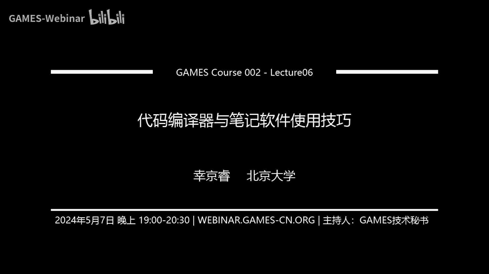

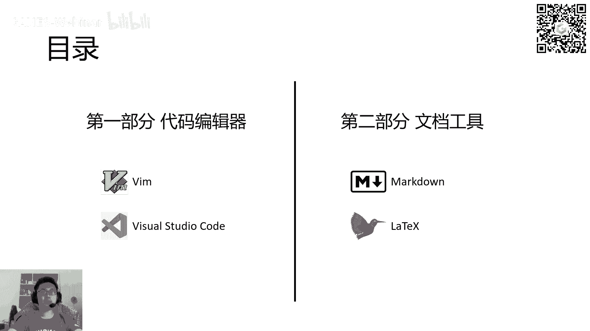

# GAMES002-图形学研发基础工具 - P6：代码编译器与笔记软件使用技巧 📝💻

在本节课中，我们将学习两类在图形学研发中至关重要的工具：代码编辑器和文档写作工具。我们将详细介绍 Vim、Visual Studio Code、Markdown 和 LaTeX 的核心概念与基本使用方法，帮助你提升开发与写作效率。

## 集成开发环境概览


集成开发环境的主要功能是提供一个编写代码的平台，并集成了编译、运行、调试等其他工具。

以下是截至2023年最热门的集成开发环境用户数量统计。Visual Studio Code 处于断层第一的位置，用户基数最大。同为微软开发的 Visual Studio 排名第二，它是一个功能更强大、更完整的集成开发环境。今天要介绍的 Vim 也较为常见，排名靠前。此外，PyCharm 和 Jupyter Notebook 是 Python 开发者常用的专业工具。

以下是常用代码编辑器对用户的吸引力统计图。每个扇形代表一个代码编辑器，每条半透明的边代表用户正在使用 A 但对 B 感兴趣的数量。边越粗，代表数量越多。我们可以主要关注 Visual Studio Code、Vim 和 Neovim。Neovim 是 Vim 的更新版本。

从 Visual Studio Code 指出的边代表用户正在使用它但对其他软件感兴趣。指向 Visual Studio Code 的边代表用户正在使用其他软件但对它感兴趣，也包括只对它感兴趣的高粘性用户。

更有意思的是 Neovim。从 Visual Studio Code 指向 Neovim 的边代表用户正在使用 Visual Studio Code 但对 Neovim 感兴趣。而所有使用 Neovim 的用户都只对自己这一个软件感兴趣，不会去看其他的。可以看出，习惯使用 Vim 这类风格编辑器的用户，可能很难接受其他编辑器。Vim 只有一条较细的边指向 Visual Studio Code，这是因为 Visual Studio Code 可以配置成与 Vim 操作几乎一样，所以还能符合 Vim 的操作习惯。

## Vim 编辑器 🧑‍💻

上一节我们介绍了集成开发环境的概况，本节中我们来看看经典的命令行编辑器 Vim。接下来的内容适用于 Neovim 和 Vim。

介绍 Vim 有两个目的。第一，如果你对 Vim 非常感兴趣，欢迎你以本 PPT 为引子，继续查阅文档并尝试熟悉它。需要提醒的是，Vim 的学习过程可能很困难，会很慢。第二，对于对 Vim 不感兴趣的同学，你们需要了解几点。第一是 Vim 的模式，它就像一个五状态的自动机，你们要清楚状态之间如何切换。第二很重要，你们要知道打开 Vim 后如何退出。如果完全不会使用，有时可能避免不了打开 Vim，那时如果连退出或保存都不知道怎么做，就会陷入很麻烦的困境。

Vim 的特点是使用广泛且历史悠久。它比图形化界面的操作系统历史还要悠久，可以完全运行于命令行，也只能运行于命令行。例如，现在远程 SSH 连接到一个没有图形化界面的服务器时，大概率要用到 Vim。当然也有一个更接近现代编辑器的叫做 Nano，功能不如 Vim 强大，但可能更接近现在的编辑器。Vim 确实非常难以学习，但如果能熟练使用，收益非常高。一般来讲，使用 Vim 的用户开发速度和打字速度都会比使用其他软件的开发者快一些，效率要高一些。

Vim 还有一个大特点，就是它可编程，有高度的自由性，可以进行高度的个性化配置。可配置的东西包括但不限于重映射键盘、设置习惯的快捷键、以及高亮和缩进等规则。Vim 的配置文件类似于之前讲过的 Bash 的 `.bashrc`，Vim 也有一个叫做 `.vimrc` 的东西。如果是 Neovim，会不太一样，它叫做 `init.vim`。总之，一些更高级的设置都可以在配置文件里设置。另外，Vim 也会借助大量第三方插件来实现编辑文本之外的功能。

在此之前，需要让大家看一下并记住右下角这样一张图。这个图代表 Vim 有五种状态。最常用的状态也是 Vim 刚打开时所处的状态是中间的 Normal 模式。在 Normal 模式下，键盘上敲入的字符不会直接插入，而是被识别成命令，作为自动机转换的转移条件。例如，敲一个大写的 `R`，就会从 Normal 切换到 Replace 状态。Replace 状态主要是用来替换一段长文本的。还有一个 Insert 状态，最接近现代文本编辑器的常态。在 Insert 状态下，输入字符会真正在光标处插入字符，像正常编辑文本一样。右下角的是 Visual 状态，用于选择一段文本，好比用鼠标框选一段内容。还有一个叫做 Command Line 状态，即命令行模式。在这个状态下，可以输入字符，这些字符会被解析成命令，让 Vim 编辑器去做指定的事情。

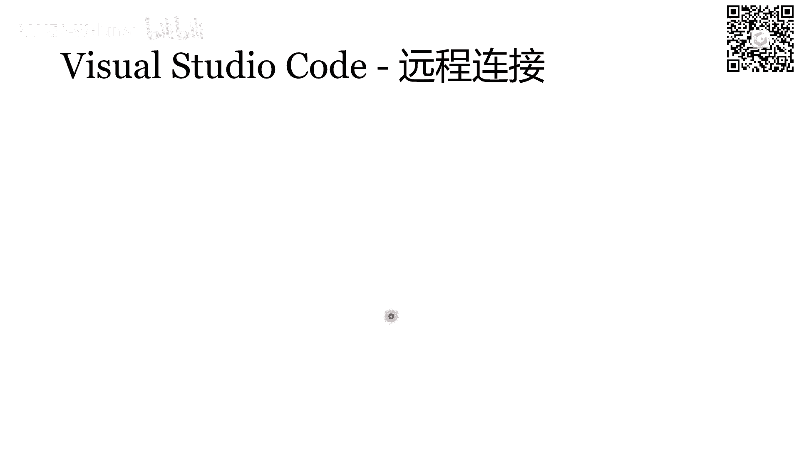

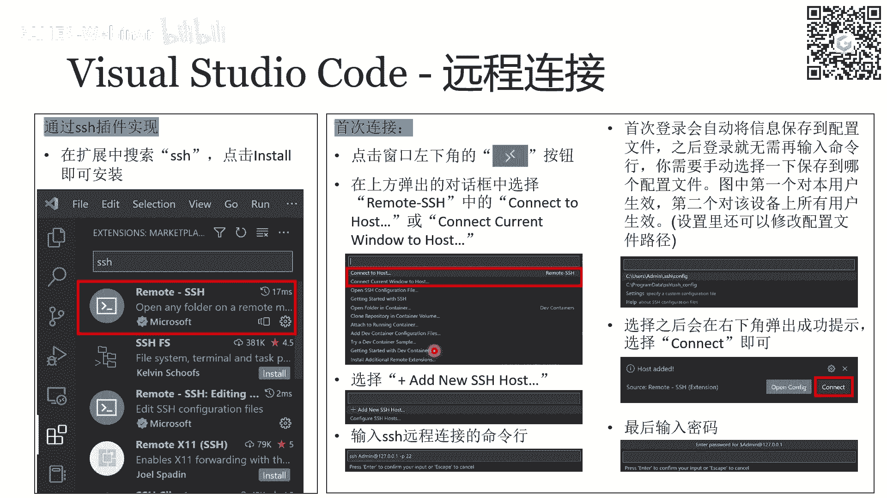


### Normal 模式

我们接下来一个状态一个状态来讲。首先是 Normal 模式。

在 Normal 模式下，上下左右移动可以用 `K`、`J`、`H`、`L` 这四个键代替。大家可以看一下键盘上 `H`、`J`、`K`、`L` 是连续一排的四个键，这与上下左右键的分布不太一样。使用这四个键移动是因为 Vim 的宗旨是尽可能不用鼠标，并让你尽可能少用键盘上不易触及的区域。它让你所有工作都能在数字键、常规字母键、ESC 以及一些普通快捷键（如 Shift、Control）这些手指最容易够到的地方完成。使用旁边的小数字键或上下左右箭头被认为是浪费时间。这就是 Vim 的哲学之一。另外两个哲学是区分模式和高度可配置。

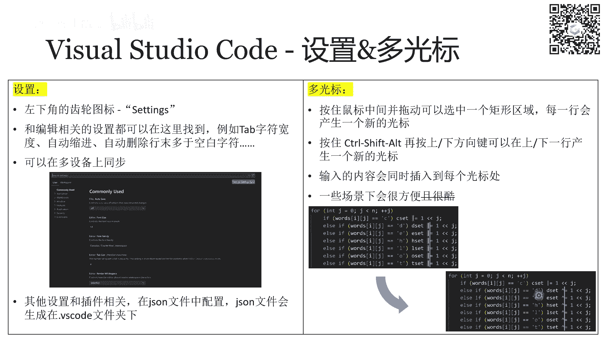

在 Normal 模式下，是用 `H`、`J`、`K`、`L` 这四个键进行光标移动的。不只有这四个基础移动，还有其他花式跳转，例如跳到单词的开头结尾、括号的左半部分和右括号、行内段落间或上下翻页等。现代编辑器里的高级功能 Vim 里都有，它们对应 Normal 模式下的不同按键。具体按键在 PPT 里有讲，不一一念了，大家可以在课后看一下，也可以照着实践一下。

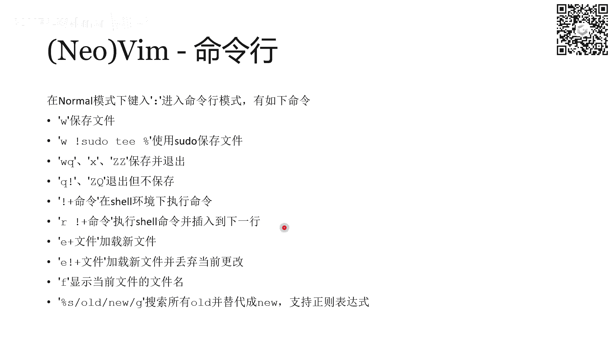

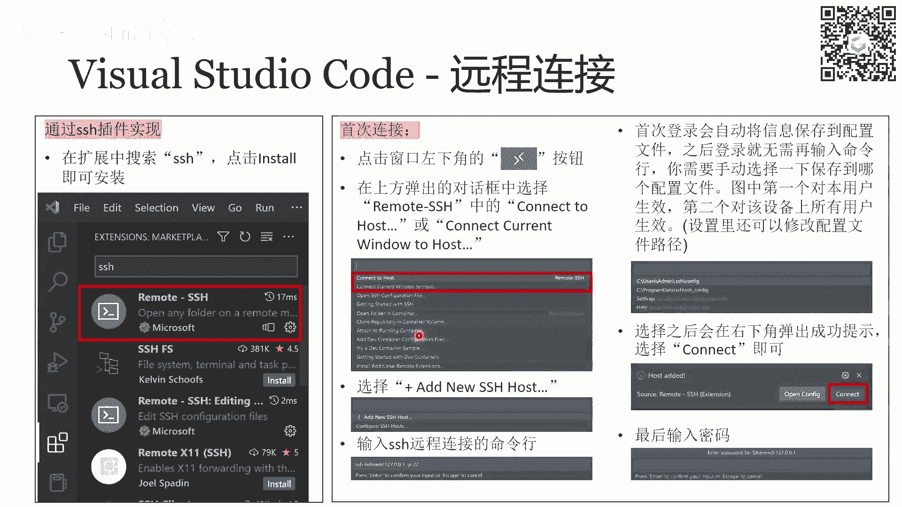

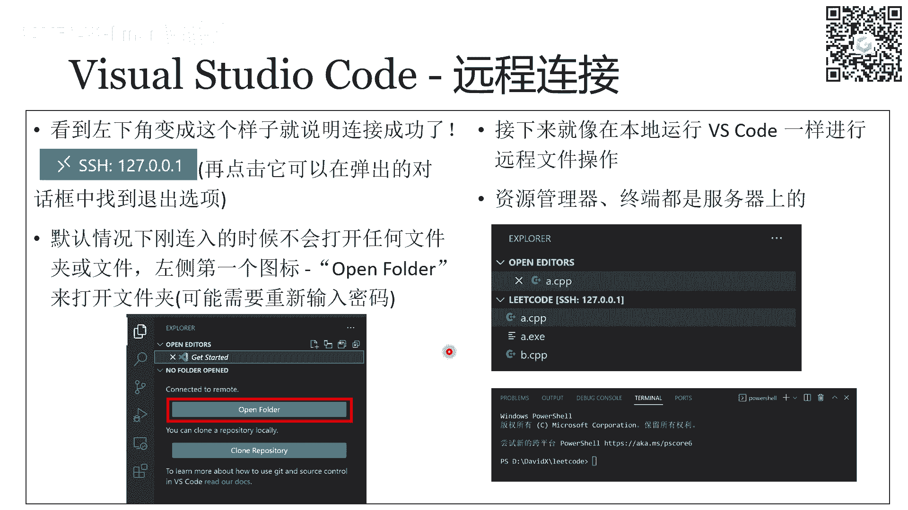

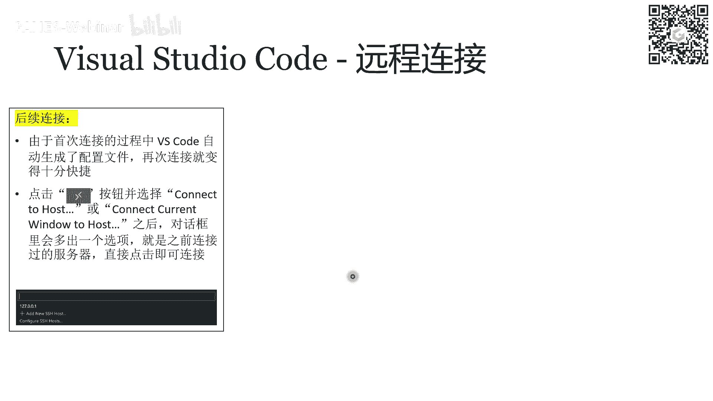

### Insert 模式

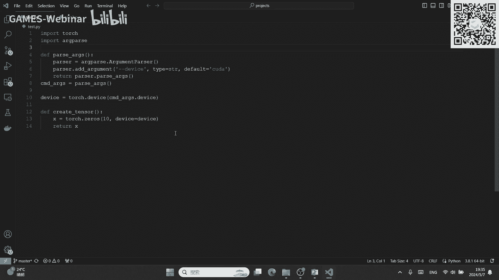

接下来介绍 Insert 模式，即插入模式。

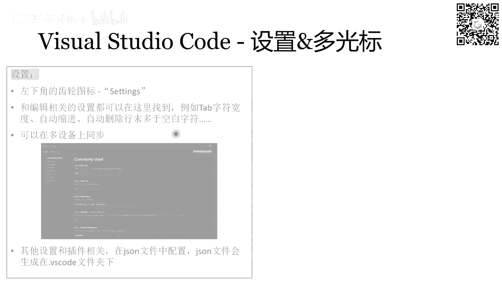

进入插入模式的方法是在 Normal 模式下按小写 `i` 键。进入 Insert 模式后，做的事情就是在当前光标位置进行编辑。还有一些其他花式进入 Insert 模式的方法，例如先跳到行首再进入 Insert 模式，实现方法是用大写的 `I`，即 `Shift` + `I`。还有一些其他先移动光标再进入 Insert 模式的方式也在 PPT 里。此外，有一些比较简单的文本修改，可以不需要进入 Insert 模式，只在 Normal 模式下完成。例如，在 Normal 模式下按小写 `s` 是删除当前字符再进入 Insert 模式。等价的按小写 `x` 操作是只会删除当前字符，不会进入 Insert 模式。类似还有一些其他按键可以让你更快地进行简单编辑操作，无需模式切换。

### Replace 模式

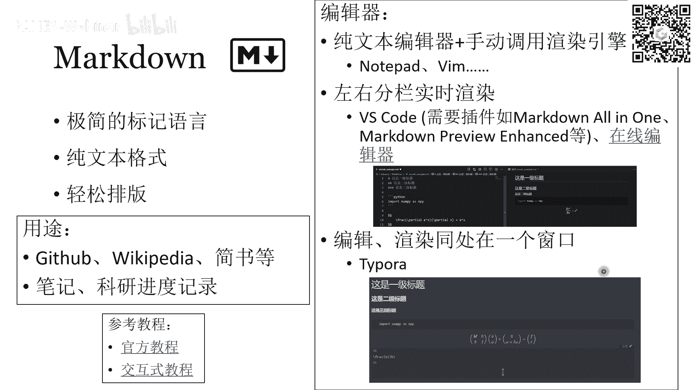

还有一个 Replace 模式，按大 `R` 进入。它主要用于长文本的替换，这里没有详细介绍，因为它确实不是一个很常用的模式。一般我们最常用的模式还是 Insert 模式，用来编辑文本。

### Visual 模式

接下来要介绍的是 Visual 模式，即 Vim 里的选择文本。

在 Visual 模式下，用移动键（包括上下左右键以及在 Normal 模式下的高级移动键）移动光标，光标移动道路上会框选住所有经过的文本。进入 Visual 模式有三种方式。第一种是按小写 `v` 进入，代表移动光标经过的字符被选中。如果按大 `V` 进入，相当于是光标经过的行整行都被选中。如果是 `Ctrl` + `V` 进入，它就是列选择模式。

在选中之后还处在 Visual 模式时，可以有两种选择。一个是按 `y` 表示复制选中的内容。按 `y` 之后，Visual 模式将退出，回到 Normal 模式。剪切 `d` 也是同理。在复制或剪切完之后，回到 Normal 模式，再按一下 `p` 就可以在当前光标位置进行粘贴。

我们可以稍微比较一下 Vim 的操作和现代文本编辑器的操作。现代文本编辑器如果我想复制一段话到文本的开头，就是用鼠标框选住一段话，然后按 `Ctrl` + `C`，再用鼠标点一下开头，然后 `Ctrl` + `V`。如果不想用鼠标，就是用上下左右键先移动到想框选的位置，把它框选住，然后 `Ctrl` + `C` 完后，可以按一下 `Home` 键或 `Ctrl` + `Home` 键回到整个文档的开头，再按下 `Ctrl` + `V` 进行粘贴。但是在 Vim 里面，首先需要在 Normal 模式下把光标移动到框选的开始位置，然后进入 Visual 模式，移动光标直到把所有想复制的文本都框选下来，再按一下 `y`，然后退回 Normal 模式。在 Normal 模式下，再移动光标到文本的开头，这个时候再按一下 `p`。这就是 `Ctrl` + `C` 和 `Ctrl` + `V` 的全部过程。所以 Vim 与平时操作的一个最关键区别在于，平时的快捷键是通过一系列组合键来实现复杂性，而 Vim 的复杂性在于状态机，在于模式之间的切换。所以你会看到熟练使用 Vim 的人经常会把 `ESC` 敲烂，因为他们经常需要回到 Normal 模式。最常用的回到 Normal 模式的按键就是 `ESC`。

### Command Line 模式

最后一个 Vim 的状态叫做命令行模式。

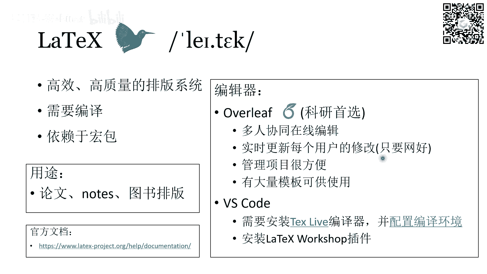

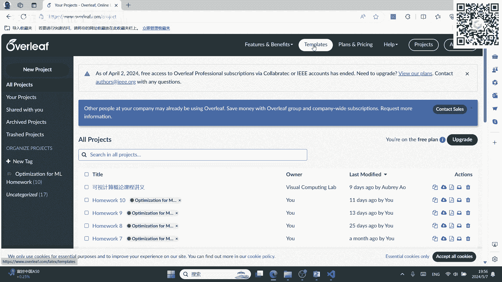


命令行模式是通过在 Normal 模式下输入冒号 `:` 进入的。命令行模式会在整个终端窗口的最下面一行显示一行，开头是冒号，接下来输入的所有字符都会在冒号后面显示。这一串字符会被解析成你要 Vim 干的指令。最常见的命令有几个，接下来的命令是大家需要记住的，即使你不使用 Vim 也要记住这些。

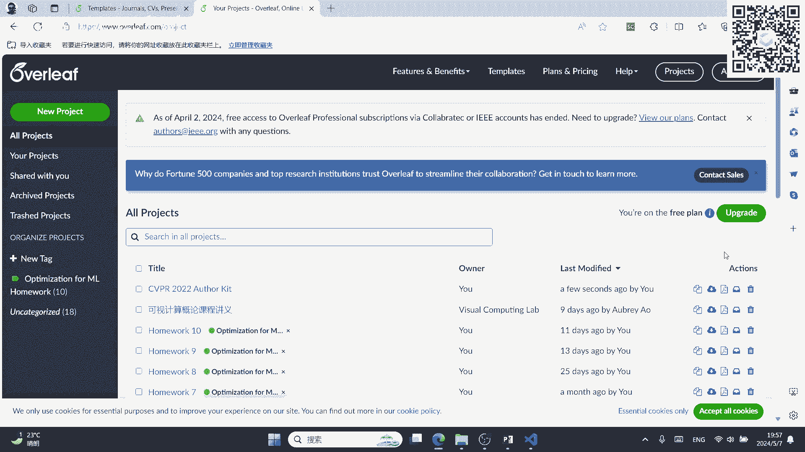

首先，输入 `w` 再回车，表示保存文件。`w` 后面跟一个叹号 `!` 和 `sudo %`，意思是用 `sudo` 权限去保存文件。也就是说，如果你没有以 `root` 身份打开 Vim，而你又编辑完了文本，不想退出再重新编辑，可以用这个方式，用 `root` 权限直接去保存。还有这三个是等价的：`wq`、`x`、大写的 `ZZ` 都是保存并退出的意思。`q!` 和大写的 `ZQ` 表示的是退出但不保存。上面这四条大家需要记住，即使不用 Vim，也要记住，这样至少知道怎么保存、怎么退出。接下来后面这些是一些更高级的命令，大家自己看就可以了。

## Visual Studio Code 编辑器

上一节我们深入了解了 Vim，本节中我们来看看目前最流行的现代化编辑器 Visual Studio Code。

首先我们要明确两个概念，那就是 Visual Studio Code 和 Visual Studio 这两个其实没有什么太大关系，是两个完全不同的概念。Visual Studio 是一个功能更强大、更完整的集成开发环境，它有一套完整的工具链，包括编译器、链接器、调试程序、单元测试等所有功能都集成在一个程序里。这就是为什么安装 VS 可能会安装一整天，但安装 VS Code 可能 2 分钟就可以下完安装完。这是因为 VS Code 其实就是一个轻量的文本编辑器，它只做文本编辑的功能。VS Code 其实更像一个浏览器。VS Code 如果打开它的属性对话框，可以看到有一个 `chromium` 属性，表示它的浏览器内核，它所用的内核跟 Chrome 浏览器和 Edge 浏览器是一样的。但是我们也会经常看到 VS Code 也可以实现非常像 VS 一样强大的功能，也可以调试、运行、编译，这都是归功于它的插件。VS Code 刚下下来是其实只带很少的插件，甚至是不带插件的。随后如果你想去编译一下，比如让 VS Code 能够编译 C++ 或高亮显示 C++ 的语法，你都需要去安装这些扩展。包括语法高亮、自动补全这些功能刚开始都是没有的。它刚下下来，你可以把它理解为它就等价于 Windows 下面的记事本。VS Code 也是一个高度可配置的软件，它的配置文件都是 JSON 格式。VS Code 和 Vim 不同，就是它比 Vim 要好用的多，基本上不需要上手，只要会打字就能用。因为它也是一个图形界面的应用程序，所以自然有易用性。

之前我们介绍过远程连接 SSH 命令，应该也介绍过 Visual Studio Code 里面怎么去运用这个命令。这里也解释了怎么去连接一个远程服务器，用 VS Code 去连接，怎么去添加一个配置，让你在第二次以及之后更多次连接的时候就不用重新配置了，可以点一个选项就直接连接上。VS Code 远程连接的一个好处就在于，你连上之后，它会弹出一个新的窗口，这个窗口就好像是你在远端服务器打开的一个 Visual Studio Code 一样。它主要体现就在于左边那个文件资源管理器里面，显示的那些目录和文件都是远程服务器上的文件系统，就好像你在本地一样去操作，但实际上你操作的是远程服务器上的内容。所以这是它的一个非常方便的一点。具体怎么做也有讲，这里就跳过了。

接下来可以给大家简单地介绍一下 VS Code 的基本设置，还有它的一个多光标的小特性。它的设置方法是在左下角的一个齿轮图标，叫做 `Settings`，点击它就可以进入设置界面。在这里面可以设置一些最基本的属性，比如 `Tab` 字符的宽度是四个还是八个还是两个，根据你的习惯。还有自动缩进是否要自动缩进，是否要自动删除行末的多余空白字符等等。这些基本的编辑器属性可以在这里设置，这些设置也是可以多设备同步的。如果是更高级的设置，可能跟插件相关。对于插件的设置，要点到 `Extensions` 里面，选中那个插件，在插件里面有一个齿轮图标，在那个齿轮图标里去设置就好了。插件的设置以及 VS Code 在当前工作区的设置，都是通过 JSON 文件去配置的，在 JSON 文件里去指定它的每一个属性。具体这个 JSON 文件的配置其实也有很多东西，也挺复杂的。个人建议是你遇到什么问题，就去网上搜对应的配置哪一条。如果想系统性地了解，可以去看那个文档。

还有一个小功能，就是有一个多光标的功能，在 VS Code 里面可以一下子产生多个光标。产生多光标的方法有两种，一个是按住鼠标的中键，然后拖动一个矩形区域，就会选中那个矩形区域，矩形所涉及到的所有行都会生成一个新的光标。另外一个产生多光标的方法就是按住 `Ctrl` + `Shift` + `Alt` 键，然后再按上下的方向键，就可以往上或者往下一行产生一个新的光标。多光标的作用就是你可以同时删除，也可以同时插入。例如，在这个图里面，这几行都是按位或 `|`，我想把它们全都变成按位异或 `^`，就可以多光标选中，然后直接按一下异或就可以全都改过来，所以这里很方便。

## Markdown 标记语言 📄

上一节我们介绍了两种代码编辑器，本节中我们来看看用于文档写作的标记语言 Markdown。

Markdown 的特点是它是一个很简单的标记语言，非常简单，是所有里面最易学的，甚至不需要学习，照着某个文档抄一两遍就会了。第二个是它是纯文本格式的，Markdown 文件的后缀名是 `.md`，这个 `.md` 文件就是一个纯文本的文件。Markdown 可以让你轻松地排版。在我们常见的用途当中，一般在 GitHub 上的 `README` 都是用 Markdown 来写的。Wikipedia 的页面其实也是用 Markdown 写的，包括简书一些其他的也都用它。它其实还是一个你平时做笔记以及科研记录进度的绝佳工具，因为它特别简单，不像 LaTeX 一样需要很复杂的代码。比如你想加一个公式、一句话、一个表或一个图片，不需要输入一长串代码，直接加就行了。所以 Markdown 记笔记什么的，平时用还是非常方便的。

教程有两个，第一个是官方教程，它是更系统更全面的。第二个交互式教程，大家可以在我 PPT 发下去的时候点进去看一下，它非常有意思。它是一个网页，它会一步一步地指导你了解每一个语法，它会让你自己去输入那个语法，去了解它是怎么工作的，交互性比较强。

哪些编辑器可以用 Markdown 呢？其实首先任何一个纯文本编辑器都可以用，都可以去写一个 Markdown，但只不过是它能不能渲染的问题。比如用 Vim、用 Notepad 其实都可以写 Markdown，因为它就是一个文本文件。如果你用 VS Code 的话，你需要装一下 Markdown 的插件，才可以做到实时的渲染，就像图片里所展示的一样。另外 Markdown 官方还有一个编辑 Markdown 的软件叫做 Typora，这个软件应该是要付费的。但是这个软件它渲染出的 Markdown 效果比较好看，它也是编写实时渲染的，它不是像 VS Code 一样左边分栏，左边是源代码，右边渲染结果。它是说你直接编辑，它就可以直接给你预览当前编辑的效果，就相当于是直接在一个渲染好的地方上面去修改。

以下是 Markdown 的一些常用语法：


*   **标题**：用 `#` 来表示，`#` 的个数越多，表示标题的级别越低，字体越小。
    ```
    # 一级标题
    ## 二级标题
    ### 三级标题
    ```
*   **强调**：用两个 `*` 框住一段文本表示加粗，用一个 `*` 框住表示倾斜，用三个 `*` 框住表示又加粗又倾斜。
    ```
    **加粗文本**
    *倾斜文本*
    ***加粗倾斜文本***
    ```
*   **换行规则**：敲两个换行才是一个真正的分段。如果只敲一个换行，是段落内的换行。有些渲染器会直接忽略单个回车，将前两行并成一行。
*   **列表**：前面加一个短横线 `-` 代表无序列表的开始。列表可以嵌套，通过缩进来表示层级。
    ```
    - 项目一
      - 子项目一
    - 项目二
    ```
*   **复选框列表**：`- [ ]` 表示未选，`- [x]` 表示已选。
    ```
    - [ ] 任务一
    - [x] 任务二
    ```
*   **公式**：用美元符号 `$` 框起来。单个 `$` 是行内公式，两个 `$` 是行间公式。公式语法是 LaTeX 语法。
    ```
    行内公式：$E = mc^2$
    行间公式：
    $$
    \int_a^b f(x)dx
    $$
    ```
*   **引用**：用 `>` 加空格表示引用。多个 `>` 可以实现嵌套引用。
    ```
    > 这是一段引用。
    >> 这是嵌套引用。
    ```
*   **代码块**：行内代码用一个反引号 `` ` `` 括起来。行间代码块用三个反引号 ``` 括起来，并可在后面指定语言。
    `行内代码`
    ```python
    print("Hello, World!")
    ```
*   **超链接**：格式为 `[显示文本](链接地址)`。还可以使用锚点链接到文档内其他位置。