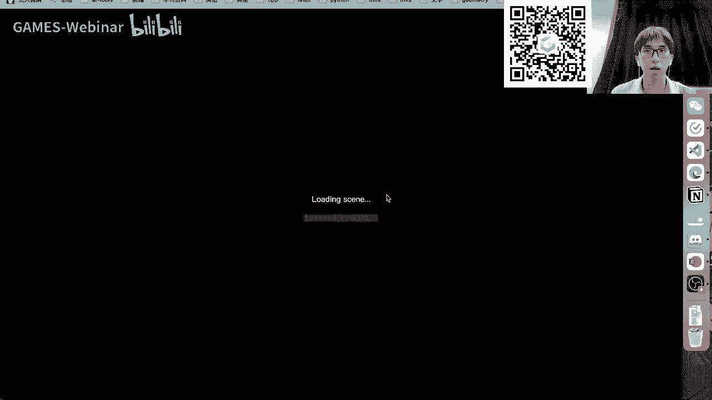

# GAMES002-图形学研发基础工具 - P7：网站搭建基础 - GAMES-Webinar - BV1cC411L7uG

## 网站搭建基础

在本节课中，我们将学习网站搭建的基础知识，包括Web服务的原理、前端和后端的概念，以及本地IP和公网IP的Web服务应用。

### Web服务原理

Web服务背后有一套复杂的机制，包括用户操作、浏览器处理、服务器处理和响应等步骤。以下是一个简化的Web服务流程：


1. 用户在浏览器上操作，如点击按钮或输入文本。
2. 浏览器将用户操作发送到服务器。
3. 服务器处理请求并返回响应。
4. 浏览器将响应渲染成网页显示给用户。


**公式**：


```
Web服务 = 用户操作 + 浏览器处理 + 服务器处理 + 响应
```

### 前端和后端

Web服务可以分为前端和后端两部分：


* **前端**：负责用户界面和交互，使用HTML、CSS和JavaScript等技术实现。
* **后端**：负责处理业务逻辑和数据存储，使用服务器端语言和数据库等技术实现。


**代码**：


```html
<!-- 前端代码 -->
<!DOCTYPE html>
<html>
<head>
  <title>示例网页</title>
</head>
<body>
  <h1>欢迎来到我的网站</h1>
  <p>这是一个简单的网页示例。</p>
</body>
</html>
```


```python
# 后端代码 (Python)
from flask import Flask, request, render_template


app = Flask(__name__)


@app.route('/')
def index():
  return render_template('index.html')


if __name__ == '__main__':
  app.run()
```


### 本地IP和公网IP的Web服务


* **本地IP的Web服务**：部署在本地机器上，只能在本机访问。
* **公网IP的Web服务**：部署在公网上，可以由任何机器访问。


**应用场景**：

* **本地IP的Web服务**：用于开发调试、可视化展示等。
* **公网IP的Web服务**：用于个人主页、项目展示、在线服务等。

### 实例


以下是一些Web服务的实例：





* **本地IP的Web服务**：使用Python的Flask框架搭建一个简单的Web服务，用于展示三维模型。
* **公网IP的Web服务**：使用GitHub Pages搭建个人主页。


### 总结


本节课介绍了网站搭建的基础知识，包括Web服务的原理、前端和后端的概念，以及本地IP和公网IP的Web服务应用。希望这些知识能够帮助您更好地理解和开发Web服务。