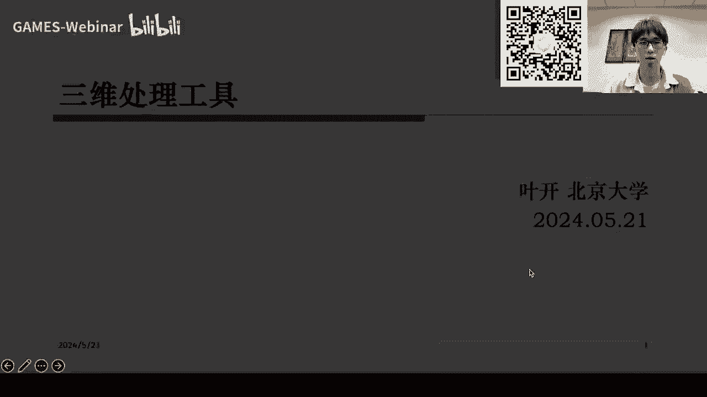
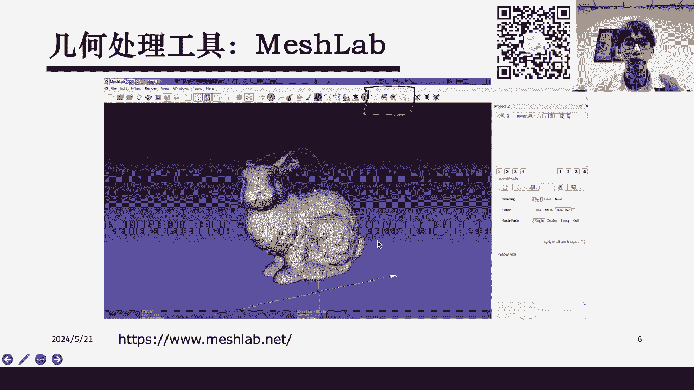
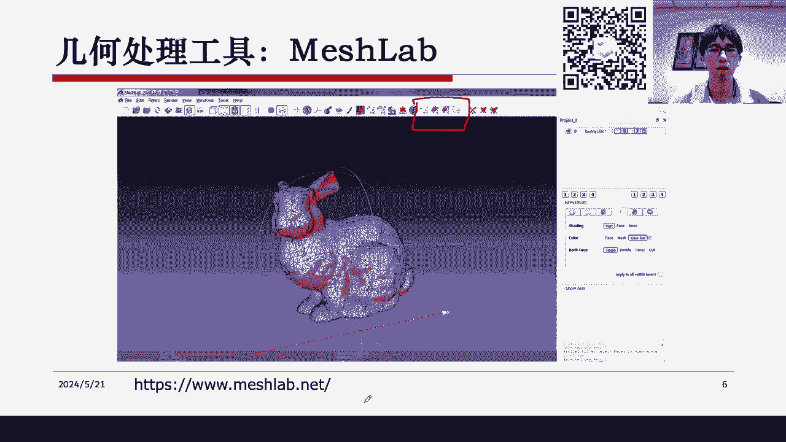
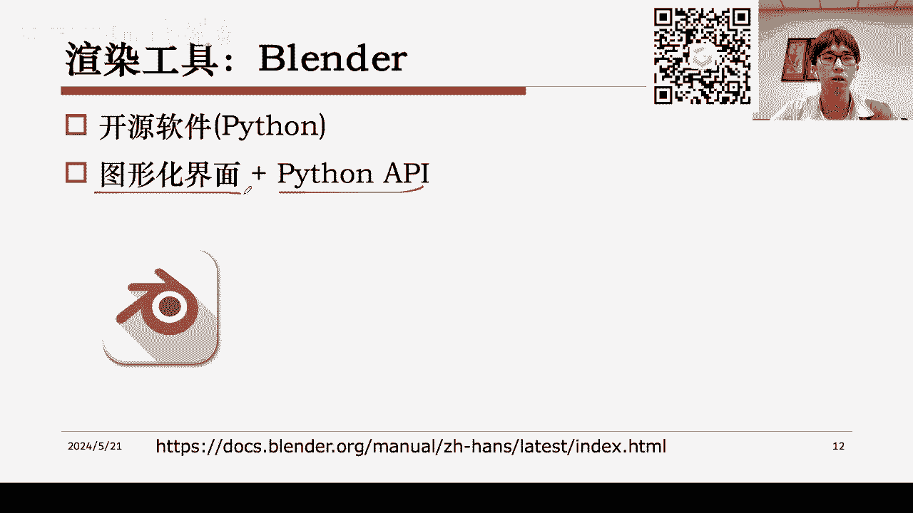
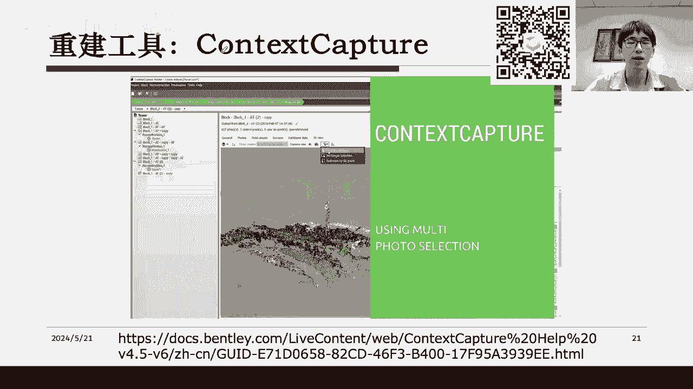

# GAMES002-图形学研发基础工具 - P8：三维处理软件 - GAMES-Webinar - BV1cC411L7uG

大家好，今天是我们Games002课程的倒数第二节课。

## 三维处理工具概述

在本节课中，我们将学习三维处理工具，这些工具在图形学中用于几何处理、渲染和重建。

## 几何处理软件

### Cloud Compare

Cloud Compare是一款开源软件，主要用于点云处理，也支持网格处理。它具有以下特点：

* **开源**：C++源码可在线获取。
* **图形化界面**：提供插件和自定义插件。
* **功能**：点云显示、变换、过滤和分割。

### MeshLab

MeshLab是一款开源软件，主要用于网格处理，也支持点云处理。它具有以下特点：

* **开源**：C++编写，提供Python API。
* **功能**：网格处理、简化、图包计算等。
* **可视化**：网格显示、编辑和操作。

### Open3D

Open3D是一个C++代码库，提供Python绑定，支持各种3D算法，包括点云处理、网格处理和计算几何算法。

## 渲染工具

### Blender

Blender是一款开源的渲染工具，具有以下特点：

* **开源**：Python编写，提供图形化界面和Python API。
* **功能**：复杂的渲染系统，支持各种功能。
* **学习资源**：官方手册、教程和社区。

### 其他渲染工具

* Houdini：电影特效和游戏特效工具。
* KeyShot：真实感渲染工具。

## 几何重建工具

### CodeMap

CodeMap是一个开源的重建工具，用于从图像中恢复3D模型。它支持稀疏重建和稠密重建。

### Context Capture

Context Capture是一个商业软件，用于户外场景重建。它提供图形化界面和Python API。

## 总结

本节课介绍了三维处理工具，包括几何处理软件、渲染工具和重建工具。选择合适的工具取决于具体需求和项目情况。

## 作业

* 作业一：对Stanford的Bonding模型进行网格简化。
* 作业二：使用任意软件对模型进行渲染。
* 作业三：提交PDF文件，包括代码或操作示意图。

## 课程群

如有问题，请加入课程群进行交流。