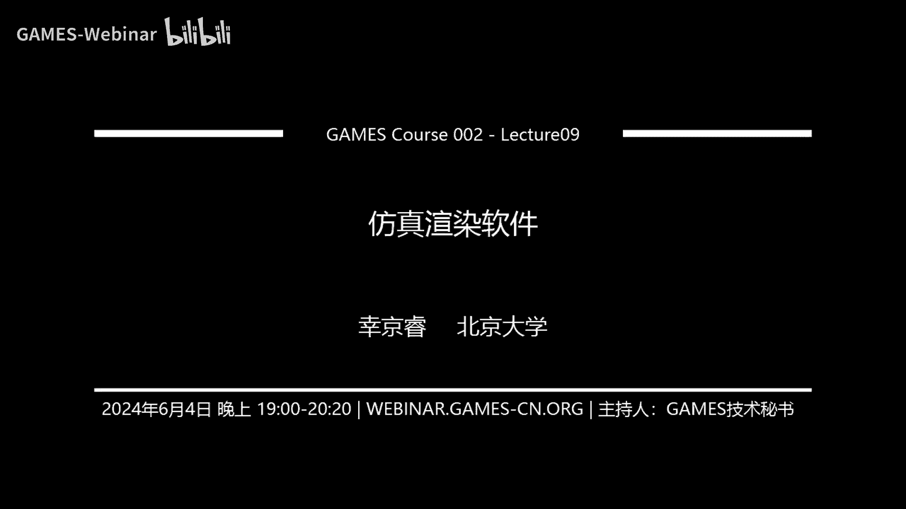

# GAMES002-图形学研发基础工具 - P9：仿真渲染软件 🎬

在本节课中，我们将学习如何使用两款重要的仿真渲染软件——Houdini和ParaView。它们是在图形学科研中，用于结果预览和高质量渲染的关键工具。我们将通过两个具体例子，分别介绍它们的基本使用方法。

## 概述 📋


在图形学科研过程中，最终通常需要展示3D结果，无论是通过视频还是模型。从算法生成3D模型或序列，到最终渲染出漂亮的结果，一般会经历以下流程：生成模型 -> 可视化预览 -> 调试算法 -> 最终渲染。其中，可视化预览和最终渲染是展示成果的关键步骤，而手动编写3D可视化代码非常繁琐。因此，我们需要借助专门的软件工具。


本节课将分为两部分，通过两个例子分别介绍Houdini和ParaView的基本用法。

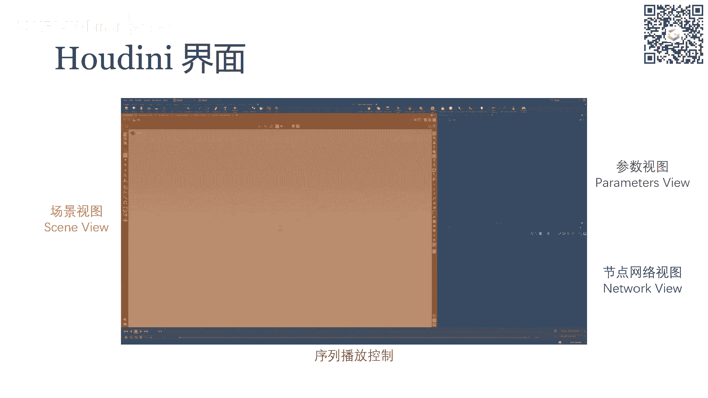

## 第一部分：使用Houdini渲染流体动画 💧

Houdini是一款功能强大的3D动画和视觉特效软件。本节我们将通过渲染一个水滴动画的例子，学习其基本操作流程。这只是Houdini功能的冰山一角，更多强大功能可在其官网的“Learning Paths”中探索。

### Houdini界面介绍

打开Houdini后，界面主要分为几个区域：
*   **场景视图**：最大的区域，用于预览3D场景。
*   **参数视图**：右上角区域，用于调整物体、光照、相机等参数。
*   **节点网络视图**：右下角区域，Houdini通过拖拽和连接节点模块来构建工作流。
*   **播放控制条**：底部区域，用于播放动画序列。

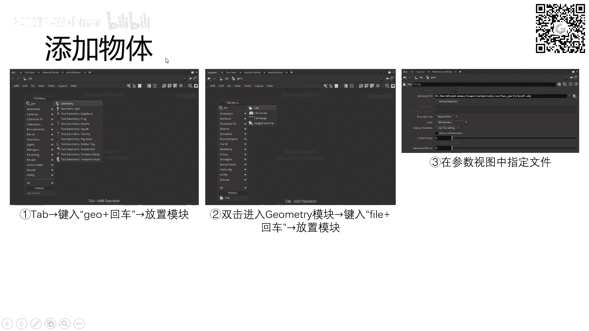

### 第一步：添加与导入物体

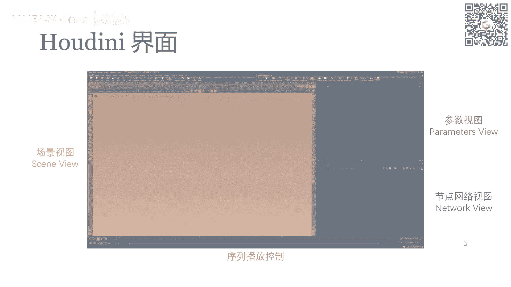

我们的目标是导入一个水滴粒子序列和一个圆锥体。

首先，在节点网络视图中，按下 `Tab` 键，输入 `geometry` 创建一个几何容器节点。双击进入该节点，在其内部再次按下 `Tab` 键，创建一个 `file` 节点用于导入文件。

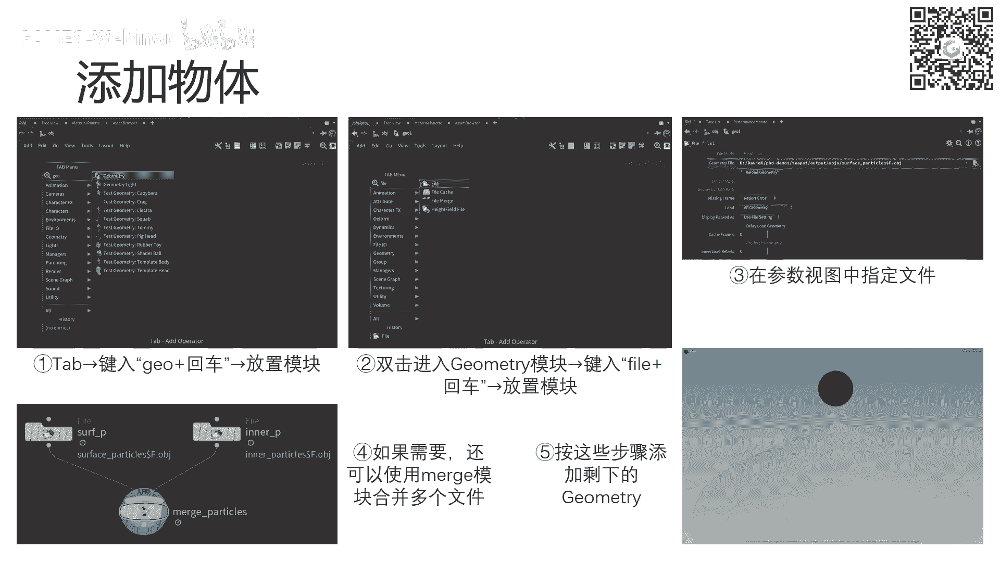

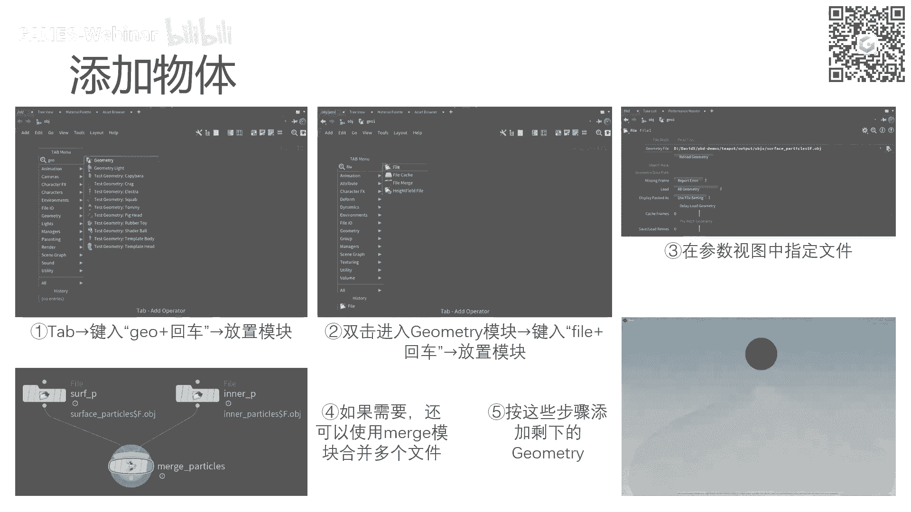

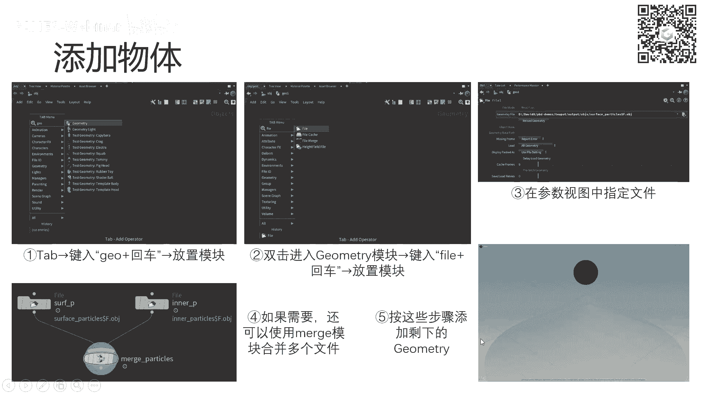

在参数视图中，配置 `file` 节点的文件路径。对于动画序列，文件名通常包含帧数变量 `$F`，例如 `surface_particles.$F.obj`。Houdini会自动将其替换为 `0001`, `0002` 等序列号，加载所有OBJ文件。


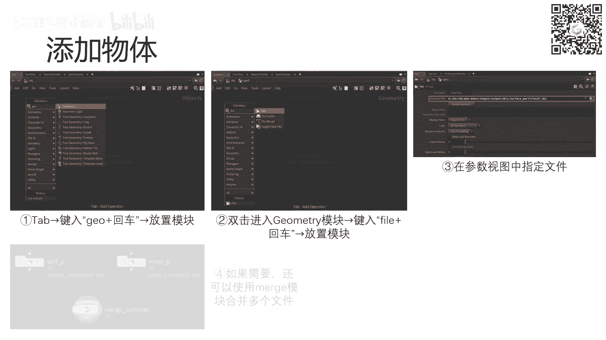

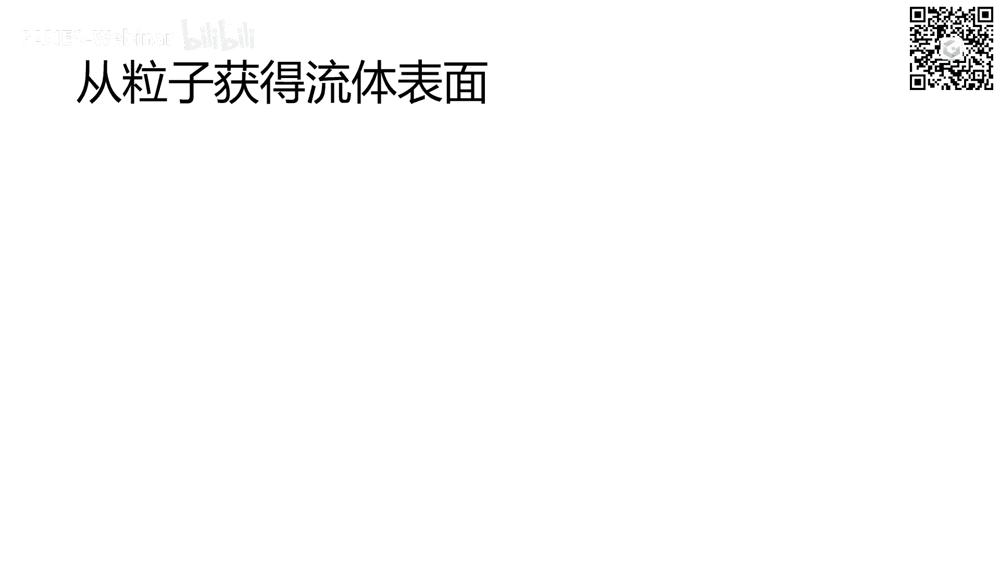

**OBJ文件**是一种描述3D模型的文件格式，可以存储三角网格的顶点坐标和连接关系。粒子数据可以视为只有顶点坐标、没有连接关系的OBJ文件。

导入文件后，可以在场景视图中看到粒子。如果场景有多个物体（例如还有内部粒子），可以使用 `merge` 节点合并多个 `file` 节点的输出。

接着，用同样方法添加一个圆锥体（`cone`节点），并在参数视图中调整其半径、位置和高度。

至此，基础场景搭建完成，点击播放控制条可以预览粒子动画。

### 第二步：将粒子转化为流体表面

预览的粒子需要转化为连续的流体表面。思路是将每个粒子扩展为一个小球，然后计算这些小球合并后的表面。

在粒子数据节点后，添加一个 `particle to vdb` 节点。其核心参数包括：
*   `point radius scale`：控制每个粒子扩展成球的半径。太小会导致表面不连续，太大会导致模型穿模。
*   `voxel size`：体素网格大小，应小于粒子半径以保证表面精度。

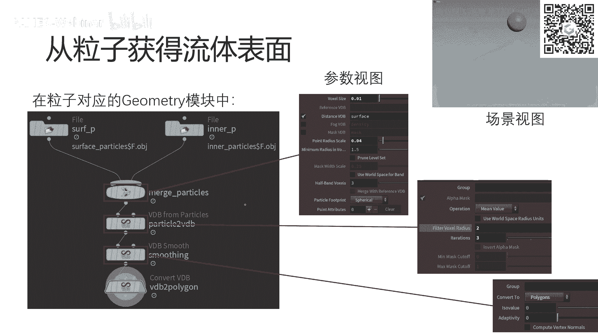

添加 `smooth` 节点对粗糙表面进行平滑处理，可调整平滑强度和迭代次数。

最后，添加 `convert vdb` 节点，将体数据（vdb）转换为多边形网格（`polygon mesh`），以便渲染。将其参数 `convert to` 设置为 `Polygon`。

完成这步后，场景视图中的粒子就变成了连续的流体表面。

### 第三步：赋予材质

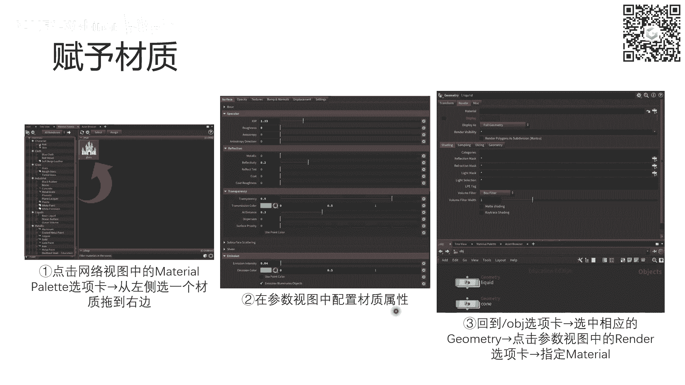

接下来为表面赋予材质，使其看起来像水。

在节点网络视图切换到 `Material Palette` 标签。从材质库中拖出 `glass`（玻璃）材质，模拟水的透明特性。同样，可以拖出 `gold` 材质给圆锥体。

选中 `glass` 材质，在参数视图中调整其属性以更像水：
*   `IOR`（折射率）：改为 `1.33`
*   `Reflection`（反射率）：改为 `0.2`
*   `Transparency`（透明度）：改为 `0.8`
*   `Emission`（自发光）：改为 `0.04`，颜色调为淡蓝色。

配置好材质后，切换回物体层级（`obj`标签）。选中水滴对应的几何节点，在参数视图的 `Render` 标签页，将 `Material` 属性指定为刚才创建的 `glass` 材质。同样为圆锥体指定 `gold` 材质。


### 第四步：设置相机与光照

渲染场景需要相机和光照。

**添加相机**：在场景视图右上角点击 `No cam`，选择 `New Camera`。勾选 `Tie View to Camera or Light`，此时移动视图视角会同步调整相机参数。调整好视角后，取消勾选即可。

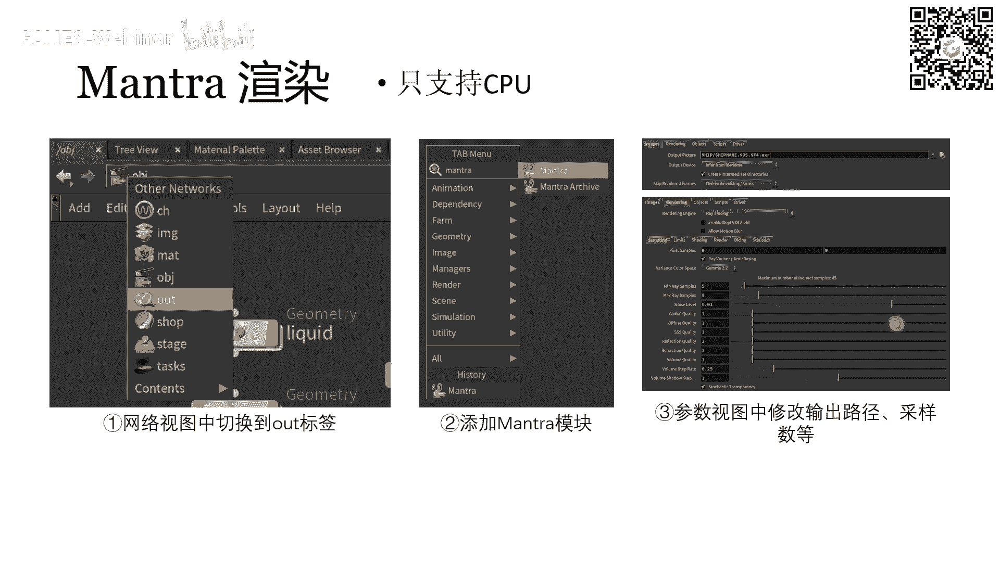

**添加光照**：在节点网络视图中，按 `Tab` 输入 `light`，选择 `Environment Light`（环境光）。在参数视图中可以调整光照强度、颜色等。环境光可以选择是否在渲染背景中可见。

### 第五步：渲染与输出

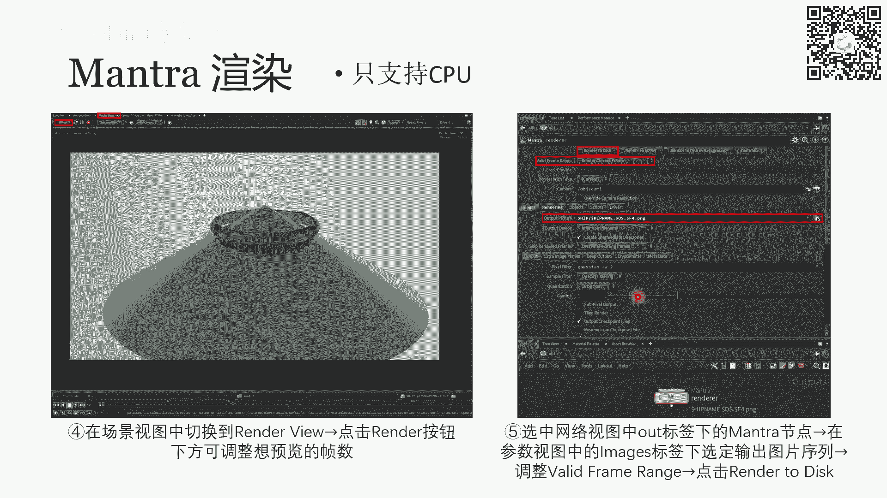

Houdini主要有两种渲染器：Mantra（CPU，功能全面）和Karma（支持GPU加速）。

**使用Mantra渲染器**：
1.  在节点网络视图切换到 `out` 标签，按 `Tab` 添加 `mantra` 节点。
2.  在参数视图的 `Images` 标签页，设置输出图片的路径和格式（如PNG）。
3.  在 `Rendering` 标签页，调整渲染质量参数，如 `Pixel Samples`（每像素采样数，值越高质量越好越慢）。
4.  切换到 `Render View` 标签，点击 `Render` 按钮预览单帧效果。
5.  要渲染序列，在 `mantra` 节点参数中，将 `Render` 从 `Current Frame` 改为设置帧范围（如 `1-100`），然后点击 `Render to Disk`。

**使用Karma渲染器**：
1.  将顶部选项卡从 `Build` 切换到 `Solaris`。
2.  在节点网络视图（`stage`标签）添加 `Scene Import` 节点，在参数中填入需要导入的物体、相机、光照名称（用空格分隔）。
3.  添加 `Karma Renderer` 节点，它会自动创建渲染设置节点。将场景导入节点与之连接。
4.  在渲染设置节点的参数中，指定输出路径、相机，并将 `Render Engine` 改为 `XPU` 以启用GPU加速。
5.  在 `Solaris` 界面右上角可切换到 `Karma XPU Render` 视图进行实时预览。
6.  点击渲染设置节点下的 `Render to Disk` 渲染序列。

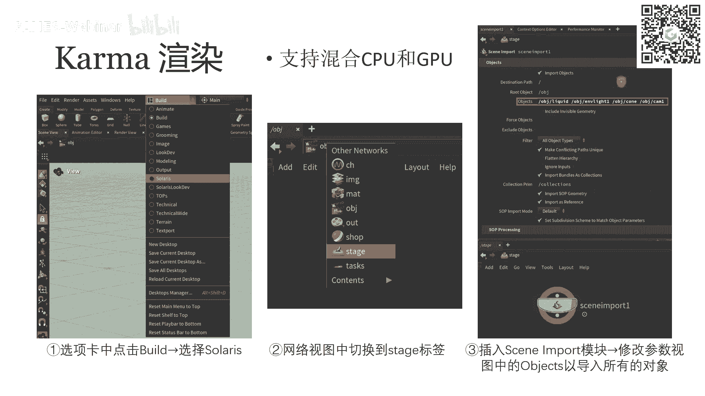

---

上一节我们介绍了如何使用Houdini渲染流体动画，本节中我们来看看如何使用ParaView进行体数据可视化。

## 第二部分：使用ParaView可视化体数据 🌪️

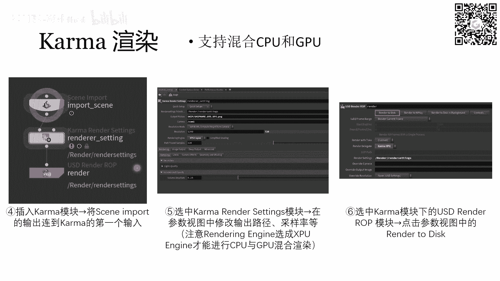

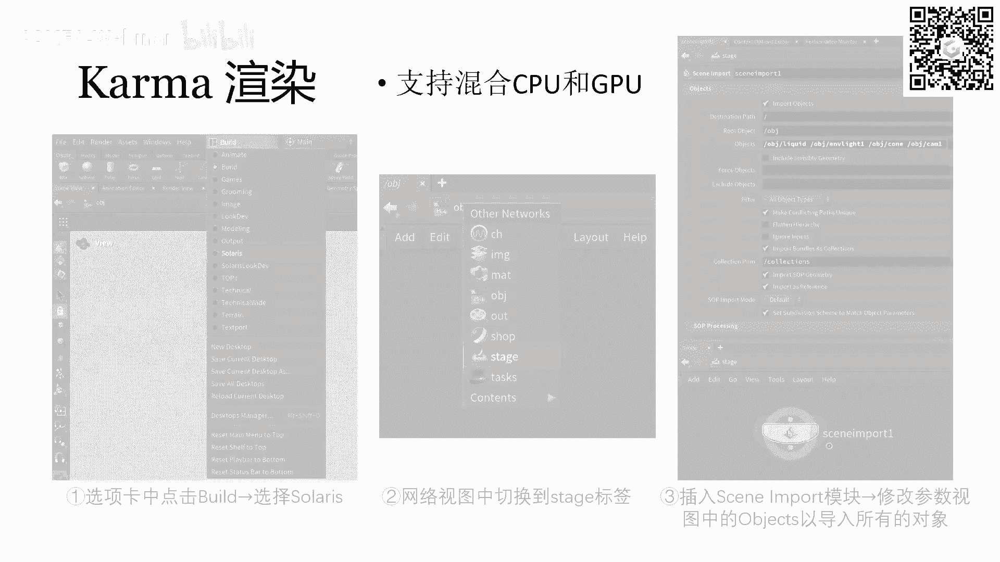

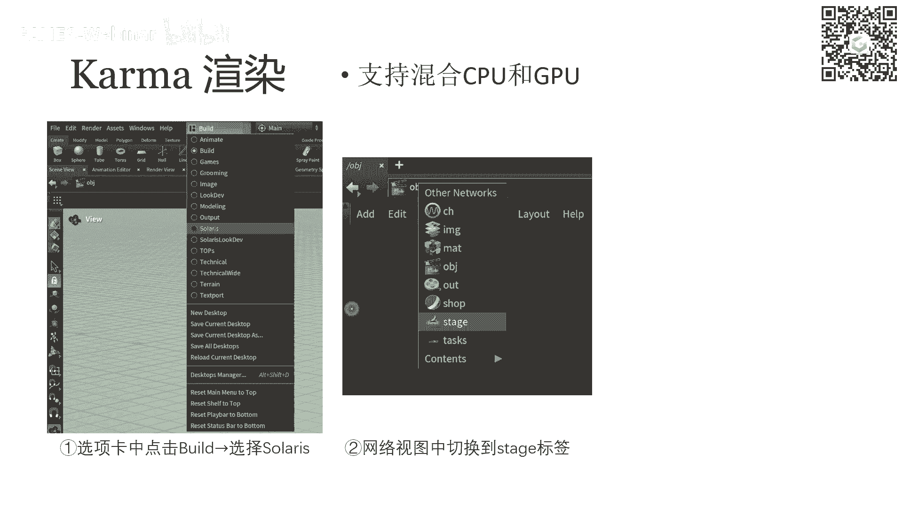

ParaView是一款开源的科学可视化软件，特别擅长处理大型体数据。本节我们将通过可视化一个涡环碰撞的速度场例子来学习其基本用法。

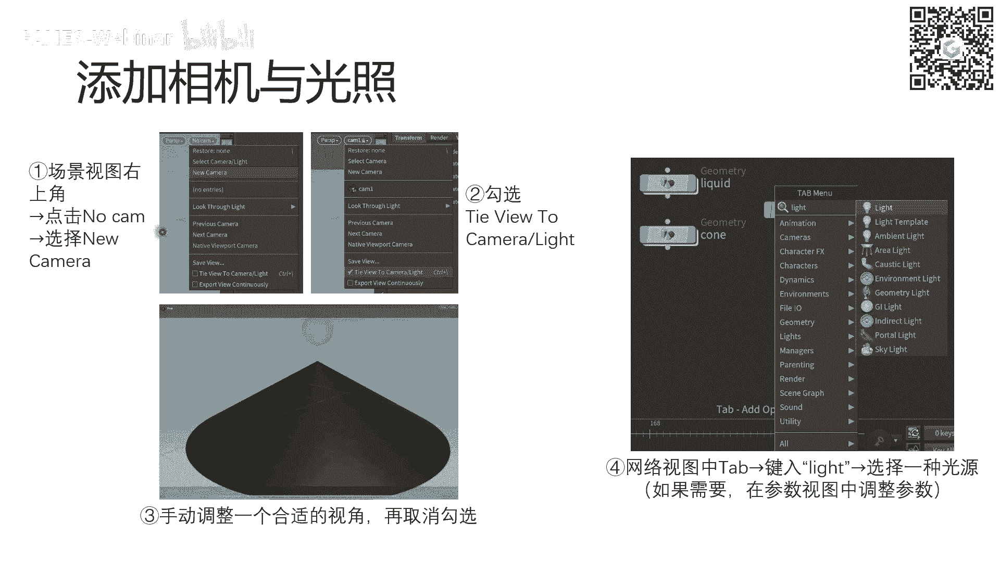

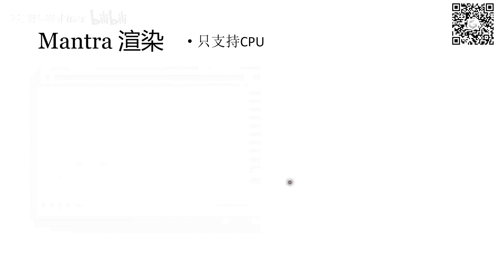

### 什么是体数据可视化？

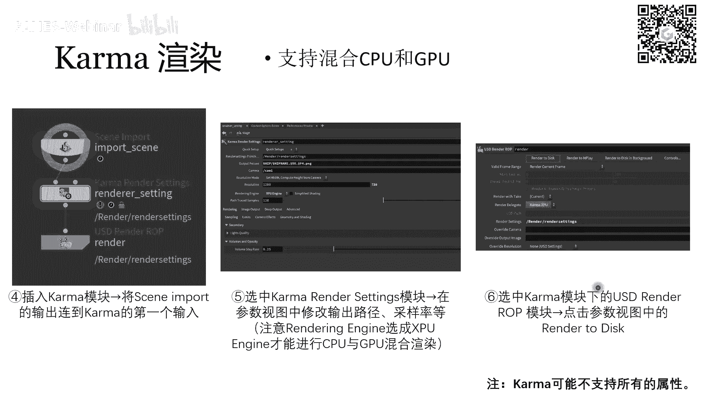

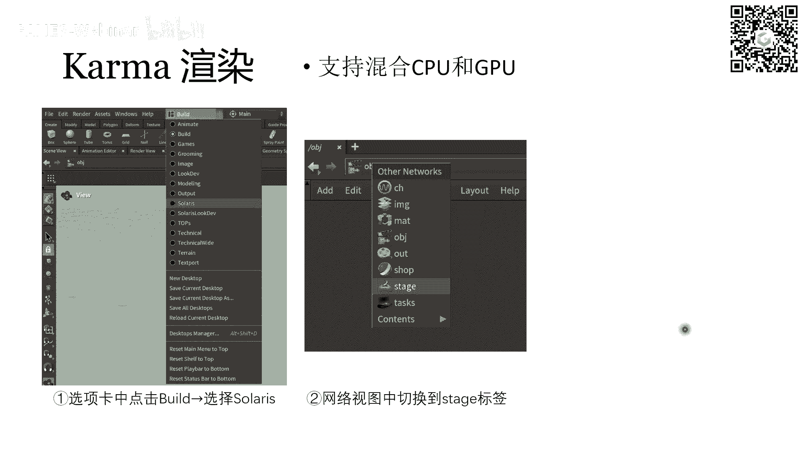

体数据（Volumetric Data）指在三维空间定义的数据场，例如流体的速度场、温度场。在计算机中，它通常被离散化为一个三维网格（体素），每个格点存储一个值（标量或向量）。

常用的可视化方法包括体渲染、等值面提取和切片可视化。ParaView在医学成像、材料科学等领域有广泛应用。

### 第一步：准备数据

我们的例子是可视化两个碰撞涡环的涡量场大小。涡量是描述流体旋转快慢的物理量，我们可视化其模长。

假设我们已通过模拟获得一个三维NumPy数组 `vorticity_magnitude`，形状为 `(XN, YN, ZN)`，表示在空间范围 `[x_min, x_max]` x `[y_min, y_max]` x `[z_min, z_max]` 内的涡量大小。

需要将其转换为ParaView可读的VTI格式文件序列。以下为Python代码示例（依赖VTK库）：

```python
import vtk
import numpy as np

# 假设 vorticity_magnitude 是形状为 (ZN, YN, XN) 的numpy数组
data = vorticity_magnitude.astype(np.float32)

# 创建VTK图像数据对象
image_data = vtk.vtkImageData()
image_data.SetDimensions(XN, YN, ZN) # 注意维度顺序
image_data.SetSpacing((x_max-x_min)/(XN-1), (y_max-y_min)/(YN-1), (z_max-z_min)/(ZN-1))
image_data.SetOrigin(x_min, y_min, z_min)

# 将numpy数组数据导入VTK
flat_data_array = data.flatten()
vtk_data_array = vtk.vtkFloatArray()
vtk_data_array.SetNumberOfComponents(1)
vtk_data_array.SetArray(flat_data_array, len(flat_data_array), 1)
image_data.GetPointData().SetScalars(vtk_data_array)

# 写入VTI文件
writer = vtk.vtkXMLImageDataWriter()
writer.SetFileName(“vortex_ring_001.vti”) # 按帧命名
writer.SetInputData(image_data)
writer.Write()
```

对每一帧数据重复此过程，生成序列文件（如 `vortex_ring_001.vti`, `vortex_ring_002.vti`）。

### 第二步：导入与基础可视化

打开ParaView，将生成的所有VTI文件拖入主窗口区域，或通过 `File -> Open` 选择多个文件。文件会以“组”的形式出现。

在左侧 `Pipeline Browser` 选中导入的数据组，点击眼睛图标使其可见。此时场景中可能只显示一个包围盒。

在上方工具栏，将可视化方式从 `Outline` 改为 `Volume`。此时，体数据将以体渲染方式显示，颜色映射表示涡量大小（通常红色高，蓝色低）。在视图窗口中拖动鼠标可以旋转视角。

点击工具栏的播放按钮，可以流畅播放整个动画序列。

### 第三步：增强渲染效果（阴影与光照）

为了得到更逼真的渲染效果（如阴影），需要进行以下设置：


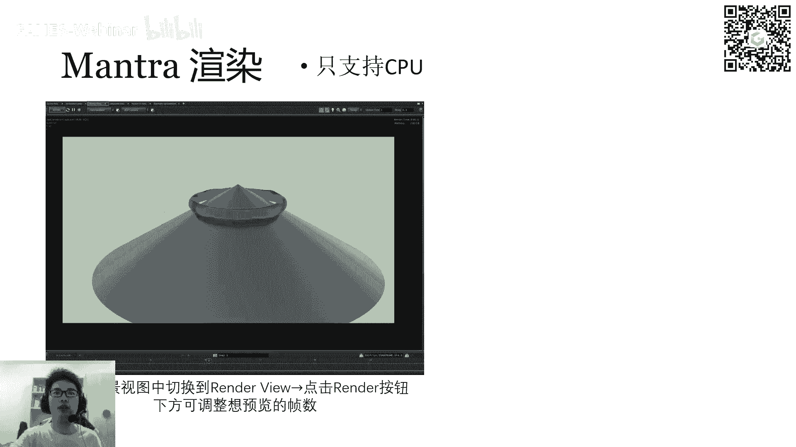

1.  **添加地平面**：导入一个作为阴影投射面的平面OBJ文件（一个简单的正方形网格）。在ParaView中打开该OBJ文件并显示。
2.  **启用光线追踪**：在左侧 `Properties` 面板底部，找到 `Ray Tracing` 部分，勾选 `Enable Ray Tracing` 和 `Shadows`。启用后交互会变慢。
3.  **添加自定义光源**：在 `Properties` 面板取消默认 `Light Kit` 的勾选。通过 `Sources` 菜单添加一个 `Directional Light`（平行光）。在光源属性中，设置 `Light Position` 和 `Focal Point` 以定义光线方向，从而产生阴影。


### 第四步：导出动画

场景配置完成后，通过 `File -> Save Animation` 导出。
在保存对话框中，设置文件名和路径。`Suffix Format` 使用类似 `%04d` 的格式，会生成 `file_0000.png`, `file_0001.png` 等序列图片。
最后，使用FFmpeg等工具将图片序列合成为视频文件。FFmpeg命令示例：
```bash
ffmpeg -framerate 30 -i file_%04d.png -c:v libx264 -pix_fmt yuv420p output_video.mp4
```

## 总结 🎓

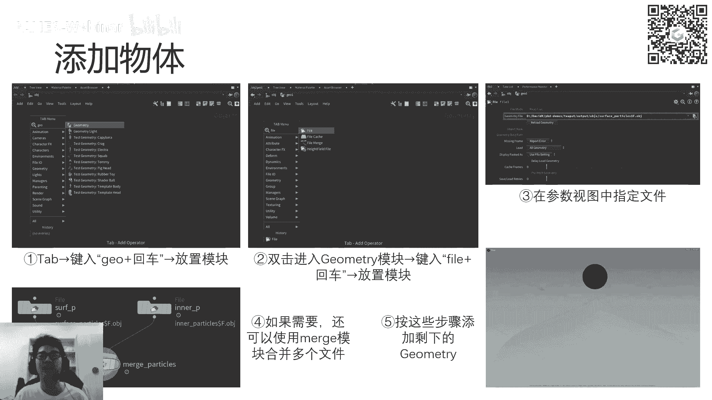

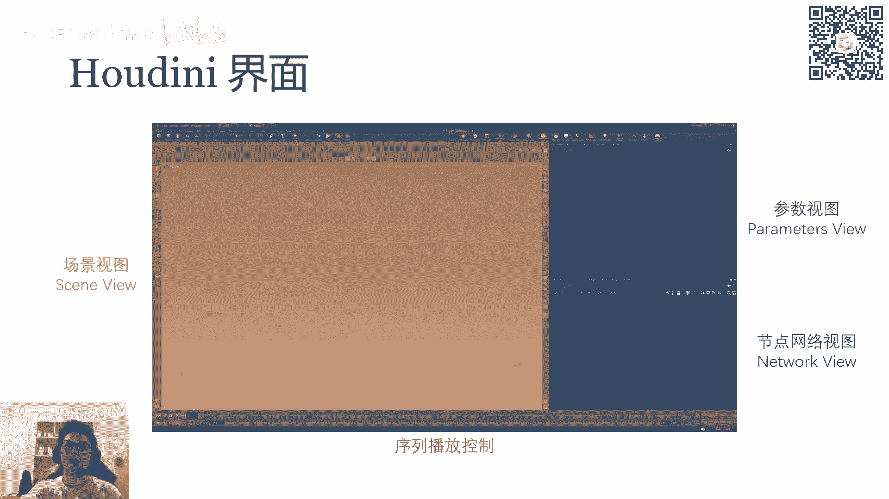

本节课我们一起学习了两种重要的仿真渲染软件。
*   我们首先学习了 **Houdini**，通过渲染流体动画的例子，了解了其节点式的工作流程，包括导入几何体、将粒子转化为表面、赋予材质、设置光照相机，以及使用Mantra或Karma渲染器进行最终渲染。
*   接着，我们学习了 **ParaView**，通过可视化涡环体数据的例子，掌握了其导入体数据、进行体渲染、添加光照阴影以增强效果，以及导出动画序列的基本方法。


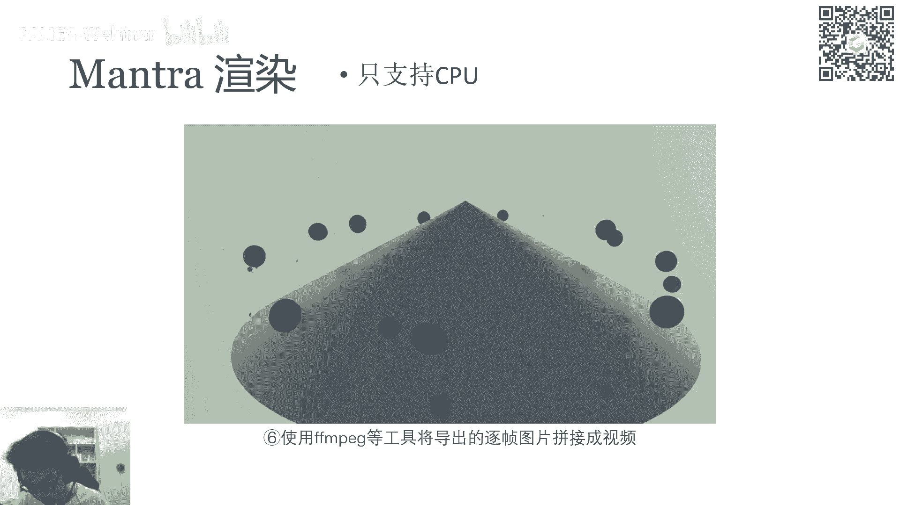


这两款软件功能都非常强大，本节课仅介绍了入门知识。鼓励大家在课后积极实践，并查阅官方教程和文档以探索更多高级功能。在图形学的学习和科研中，熟练使用这些工具对于高效地展示和验证你的工作成果至关重要。