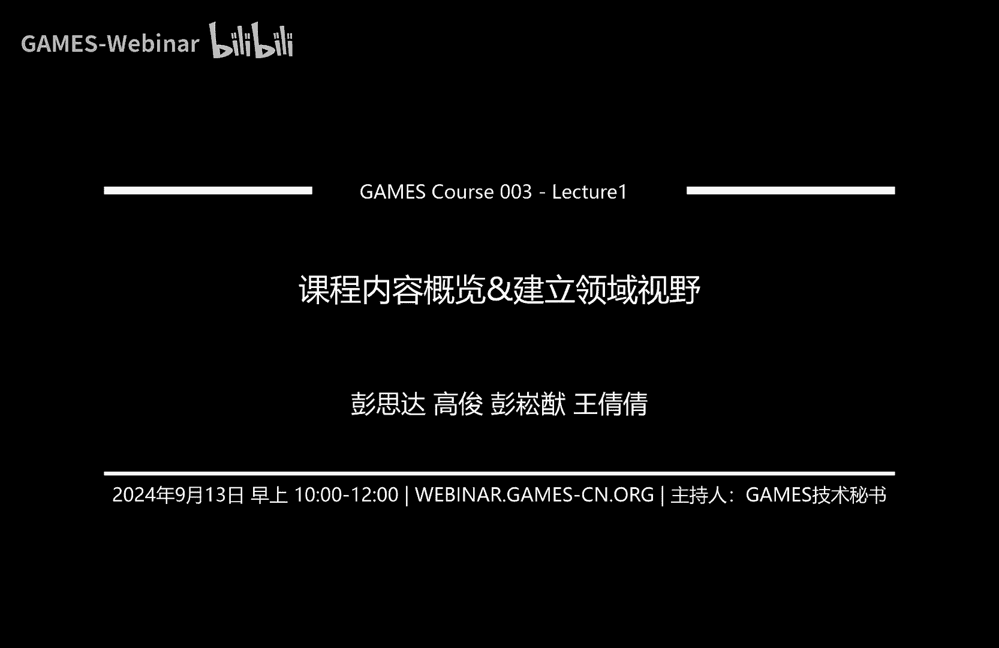
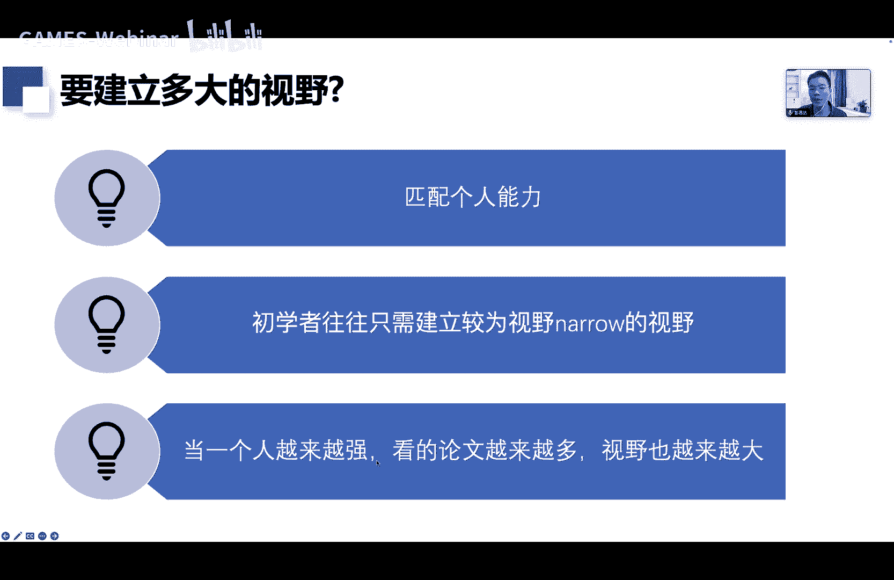
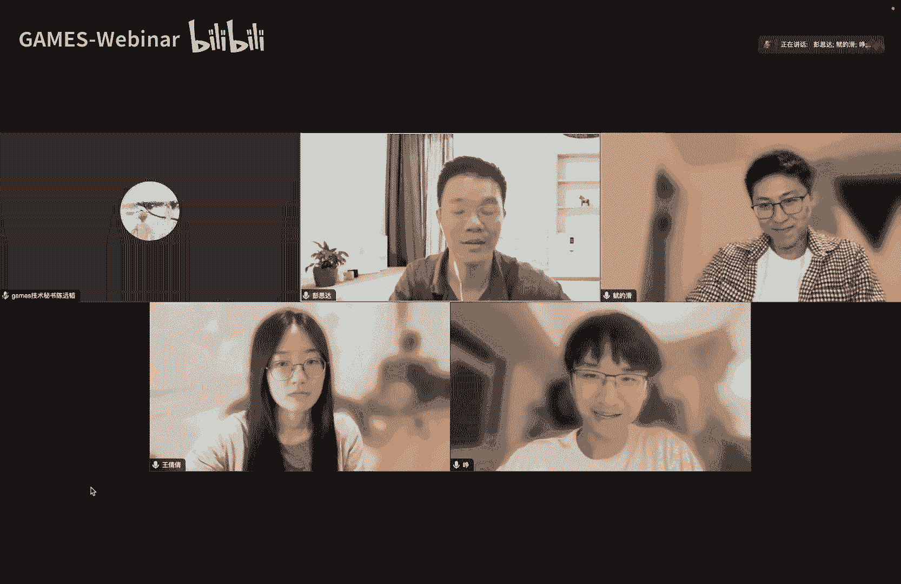

# GAMES003-科研基本素养 - P1：L01-课程内容概览&建立领域视野 - GAMES-Webinar - BV1RitTezEa9

然后我们就开始这学期的课程哦。

就是嘶啊，我是今天的讲者叫做彭斯达，然后我们这一门课的话是有四个讲者一起讲的，分别是啊，我自己还有高俊，彭松友和王倩倩三个老师啊，我们的信息已经写在了这个在课程主页上，大家都能看到。

那今天的内容就是去首先是概览一下课程内容，给大家讲清楚，说这节课是想讲啥的，然后的话我会讲第一部分内容，就是怎么去建立一个领域的事业，那我今天就开始正式的内容了，首先我先介绍一下我们这个课程的。

他的一个动机啊，这个课程主要是针对低年级，或者是刚入门科研的同学嗯，就是我我其实我从高年级指导实验室同学啊，以及我工作以来，其实自己有经常体会到一个地方，就好多低年级的同学他不知道怎么做科研。

然后这个东西也没有一个具体的指南嗯，所以的话嗯他他跟本科生课程很不一样，本科生课他是有一个很很系统的教纲的，你学微积分就是从第一步，第二步，第三步怎么学，就知按部就班的去做就好了。

但嗯科研我至少我没有见过这样的一个课程，所以的话嗯，所以就是很多同学他缺少一个研究的策略，导致他他就是像一个无头苍蝇一样做科研，那显而易见，科研是一个很困难的事情，他需要特别多的技能能力。

所以他们很容易就面临着科研困难的问题，呃一般来说好多同学都是觉得自己是有热情，有兴趣做科研的，但只要花三个月或六个月不断的碰壁，遇到各种各样的困难情绪，没有一个正反馈的话，很快就是情绪低落了。

那就可能慢慢的就不做科研的，或者是摆烂躺平了，那针对这种情况的话，我们就希望我们的课程呃，能去教基本的一个科科研方法论，有一个基本的研究策略去教怎么去选题，设计方法，怎么去做实验，怎么去迭代方法。

以及最后怎么去做学术论文的写作与宣传，我我们希望说就是同学们学了我们这个课程，能在科研过程中，就通过这套方法论自我来提升科研能力，嗯至少在做科研中是有正反馈的，是能快快乐乐的，这是我们的一个目动机。

嗯好那这门课的一个课程安排啊，有两大部分，第一个部分就是给同班同学们去讲，这个科研流程去解释每一步，就是哎我从一个从零开始一个project，我们每一步要做啥，同时我能去配合案例去说明。

那科研流程有哪些步骤呢，首先能分成三大方面，一个是去初始化自己project科研课题，然后是去迭代技术方案，最后就是去做论文的写作，那初始化科研课题的话就分三个部分，我要去选一个科研课题。

我首先我要懂得怎么去建立啊，我对这自己科研方向的一个事业，我能知道自自己这个科研方向，有哪些没被解决的问题嗯，有哪些能去做论文的点，就是视野，然后的话我我就是去选一个目前比较重要。

然后也符合自己能力的一些科研课题，有一个具体课题以后，开始去想着解决方案去设计，但很多时候啊就有一个一开始想的技术方案，其实他都是不成熟的，所以的话我们必须要有第二个大的步骤，去迭代这个技术方案。

迭代的话就是有两个部分，首先是我嘶有一个自己的一个技术方案以后，我能基于这个方案去设计实验，呃，对这这里写错了啊，这是基于技术方案去设计实验，然后我能知道怎么做实验以后。

我去基于实验结果来去提升我的一个技术方案，因为很多时候这个实验结果不是那么理想，那我去分析结果，我还去提升自己的方案，那最后的话就是论文写作，论文写作的话包括嗯写作规划，故事梳理，论文画图。

论文写作以及论文评审，嗯嗯除了这个科研流程以外，嗯这个课的最后一两节课，两节课，还希望跟大家去分享，说做科研中所需要的一些软技能，一些非技术相关的一些技巧，比如怎么去做报告啊。

或者一些对自己很有用的一些研究方习惯，好那这边的话还是需要跟大家讲清楚啊，就是大家对这门课的一个预期，得知道我们能教什么，不能教什么呃，首先我先说我们不能教什么吧，就比如说有些同学他是做呃。

三维重建或者是做图形绘制的对吧，我们不可能去教一些具体的技术，具体的一些已有的技术范式，所以的话既然没有这个东西，我们就不会去因，直接让这些同学在三维重建或者是图形绘制上，有想idea的能力。

这是不可能的，然后同时我们也不会去手把手的去教指导说，怎么去编程，怎么去对现在自己project里面的实验分析，实验去分析，这些都是必须要有一个具体的project来去辅助的。

所以既然没有一个这样的手把手教学环节，也不能直接教你们，怎么去在自己的领域里面去做实验，最后的话呃论文写作的话呃，这门课就不像自己导师一样嘛，导师可能会手把手去给你的中文做comment。

这门课也不会只是，所以就是我们不会去教实际的创新能力，技术能力，实验能力和写作能力，这是没法教的，机械能力都必须得通过实验，经实践的经验来培养，那讲完不能教什么以后再讲，我们能教啥嗯，能教什么呢。

我我们这边能去讲清楚，说做一个research project，它一个具体的步骤和过程，比如说我我会想我们会讲一些很通用的方法论，比如说我去做一个三维重建的时候，我怎么去建立他的一个视野。

我相信如果有一个这样的方法论，然后结合自己一些领域的相关的内容，是可以执行的，还有选题，还有设计方法，以及是后面做实验的流程，相如何去做实验，最后的话就是写论文的一些嗯步骤流程，一些技巧。

我们这个整个的一个思路，就是去讲清楚每一步要做什么，有有一些具体的可执行的指南，去解释哪一面的每一步，OK所以的话，如果知道了这个课程，就是能教什么和不能教什么以后，那怎么去最好从这一门课里面去受益呢。

嗯首先就是从这一个课里面去学，这个科研流程中每一个步骤，那的一个方法论，首先是了解科研过程中的每一个步骤，以及每一个步骤它的一个方法论，然后这是我们教给你们的，那自己必须得去根据自己的科研经验去思考。

并总结出自己一套方法论，嗯说实话很多时候嘴上讲一讲都是比较简单的，所以的话嗯必须是通过实践去熟悉，通过就是我不只是知道怎么做，我还知道我还能真正的去很熟练的去熟实践，这些方法论，这是第三步。

然后最后的话当自己做过一些project以后，能去总结出自己的一些研究方法，这是我从我角度能从通过这个四个步骤，通过熟悉方法论，通过实践来最好从这门课里面去受益，好那先接下来就是我会把里面的嗯。

三个就是整个课程的嗯，内容大概的概览一遍，对答案，然后这里面每一步我都会讲的比较的简单，在课程干干染部分嗯，就是因为这里面每一部分，我们后面其实在课程里面都会详细展开。

好那我现在就是先对每一部分都简单的过一遍，首先的话是怎么去初始化科研课题，这边的话分为三个部分，建立领域试验，选择科研课题和设计技术方案，OK那这边讲一下什么是领域的事业啊，嗯首先我们选择某一个领域。

就是其实就是一个特定的科研方向，比如说自己是做三维重建的，做图像生成的3DHC的，他们都是有一个特定的输入和输出，有一个具体的一个科研方向，那什么是对领域的视野呢，这边主要是涉及到两个部分。

第一的话是对于技术演变的一个实验，就是比如我做三维重建嘛，那我知道说三维重建，从2015年到2024年，他在这些年份里面都有哪些呃，技术范式，有哪些里程碑式的论文，然后的话我能去了解说。

这些技术是怎么随着时间的推移而演变的，这是非常重要的，是对整个领域的历史技术发展脉络有非常熟悉，这是一个试验，第二的话是对领域他想解决的问题的实验，就首先我们能知道这个研究方向，它一个终极的目标是什么。

比如说像三维重建，大多是想从图片里面重建出三维形状嘛，那他的一个可能的目标就是说，如果能达到像三维扫描一样的效果，那这这个问题就几乎终结了，那这是他的终极目标，那我能清楚到2024年。

今年这个领域达到什么样的水平，这是自己要回答清楚的问题，如果那么达到这个水平的节点，还有哪些重要问题没有被解决，这也是需要回答清楚了，最后的话我们还能去了解说，比如说2024年。

大家在三维重建领域都会关心哪一些问题，大家都在做什么，这也是非常重要的，那我们为什么需要去建立领事领域视野呢，因为领域视野是其实是所有额科研过程中，几乎每一个部分的一个基础。

首先自己选择某一个课题的时候，肯定要知道说呃，我这个方向还有哪些问题没有被解决，这是课题选择，那在方法设计的时候，因为我们必须得提出新方法，提出有用的方法嘛，所以的话我们是必须得先了解说这个领域。

他已经有的一些技术范式，它一些技术发展的呃，啧一个脉络，因为很多时候如果我们知道技术发展的脉络的，很容易我们就能推测出，接下来一两年他可能继续的一个趋势，这是对方热法设计的帮助。

第三的话是在实验中去迭代提升方法，因为这个对对于跟领域事业的一个关系，在于说唉很多时间过程中，我发现自己也方法它不work，那我这时候怎么去提升呢，就是我因为自己很了解这个领域技术。

我就很有很多的一些经验，跟这个领域特定的经验，知道说它不好是不好在哪，是由什么原因，这是在迭代方法一个嗯，对迭代方法一个帮助，然后第四的话是故事梳理，就是论文写作上的故事学梳理。

我们能知道说诶我要写论文的时候，我肯定得去写一个吸引人的故事嘛，那我肯定要先讲说现在现有领域的SOTA方法，它还不能解决哪些问题，嗯这是领域试验，最后的话就是论文写作，论文写作就跟故事书记是很接近的。

只是说这篇论文写作会涉及到一些更嗯，detail的技术细节，那这时候也是要求我们对这个领域的技术脉络，已有的技术非常熟悉，那一旦说实话，我们做科研，可能在读硕士，读博士的时候。

就是不断的在锻炼这六个方面，那把这个六个事情做好以后，我们就肯定是能成为一个领域的专家了，OK那了解以后了解领域事业的重要性以后，我们就是会，去想说怎么去建立领域的事业，那这边的话我只是大概讲一下。

很可能大家一听还是一头雾水，等一下还会详细展开，就是首先是我们要能去确定这个领域，有哪些底层碑式的论文，然后对每篇里程碑式的论文找到以后，能知道它的前身，它的一个基础性技术是什么。

以及有哪些论文去follow他，继续去做改进的，然后第三步的话就是说，我们能去把每一篇论文都好好读一遍，能去了解这些论文它解决的问题，以及他们具具体的一个流程，以及他们里面的一些inside。

那我当我去把这些论文都读清楚以后，我就可以开始去梳理说这一个领域，它一个技术演变的轨迹是怎样的，我能去跟有一个这是了解技史历史，整理这一个领域的一个历史，了解历史以后，我就是要开始去预测未来。

我能预测接下来可能的新技术，然后去跟踪并预测，这是技术方面，然后的话，第二个大的部分也是去了解这个领域的问题，我能去整理说哎，我们当前领域从2015年到2024年。

他们一直以来的一个关注的问题是怎么变化的，呃，我了解这些问题以后，我就能去预测，也是说了解历史就能去预测未来，我知道以前的问题怎么演变的，我就能知道说哎接下来大一两年内，可能大家会关注哪些新的问题。

好那建立领域事业以后就是去选择科研课题，嗯课题上的选择的话，嗯我们首先我们要知道课题选择，我们要做什么，其实有两两件事情，我们得先去明确说这个project setting，我们去知道输入和输出。

第二的话是能去确定，想了解想解决的一个FAUCASE，机器背后就是我想现在想解决这个setting，它现在SOTA还存在哪些FAUCASE，以及背后的一些技术挑战，深层次的一些技术原因。

这是课题选择上的好，那这边的一个课题选择啊是非常重要的，很多时候一个论文的高度，那论文的高度是由很多东西决定的，包括课题啊，方向啊，研究群体，他的一个技术深度技术创新性，那这边的一个课题。

相当于说是直接影响了后续的一些大部分的，一呃东西，相当于说很很多时候我们都会说，嘶额选择比努力更重要嘛，那这边的课题选择就是这一个意思，一个好的课题会让自己的这个project变得非常容易。

那什么是好的课题呢，我这边有一个自己的定义，首先是说这个课题，他一定是提升空间还是比较大的，第二的话他不是那么卷，就比如如果有十个同学同时跟我们竞争的话，那我觉得其实很多时候不只是十个同学。

可能有100个，全世界有100个，那就是我相信即使这篇论文做出来，也大家也不会觉得很酷，因为会同时有100篇类似的都能做出来，这是第一个，第二的话是任务的难度和个人能力是相匹配的。

有时候我们知道有些课题特别有意思呃，比如举一个极端的，我知道说去发去发明可控核聚变非常重要，但问题是这一事情跟自己的能力不是相关的，所以这也不能做出来，所以如果一些任务任务太难，他就会导致没法去完成。

然后如果任务太简单，就反而可能是一个是影响力不是那么大，第二的话其实做了好像跟没做一样，自己的一个科研水平还是跟原来一样，OK第三的话就是要考虑一个课题，他的一个影响力嗯，就是因为很多时候。

我们肯定是想让这些科研是有学术影响力的嘛，那具体学术影响力就体现在课题上，有些课题非常重要，是这个领域的重点问题，所以他而且他的一个研究群体特别大，那这时候他的影响力就一般比较大，那如果有些问题。

它可它可以发论文，但他的一些问题并不是大家觉得重要的，那他的影响力就不就不大，可能就只是一篇论文，那这边怎么去找到一个好的课题呢，这是我个人的一个理解啊，首先是有四个步骤，先去建立领域事业。

我们能知道这个领域它有哪些关键性的论文，里程碑的论文和技术范式，我们知道这个领域，他们这些技术流程是怎么随时间而演变的，知道哪有哪些重要问题，然后我这时候我们去列出，领域内能仍难有的一些课题就是什么呢。

具体是说这个领域能难被被解决的重要问题，然后有哪些问题是当前时间点最应该去解决的，这是第二大步骤，第三的话是判断说哪些课题是好的课题，能去评估一个课题，他需要去评估一个课题。

他一个竞争程度和一个可提升的空间，第二的话就是去考虑这个任务，他的难度和当前自己的能力是否是相匹配的，最后的话就是在选题上尽量追求更大的影响力，呃当然这是带有我个人色彩的一个选择啊。

就一般说希望说任务它影响力越大越好，然后选择一些更带有技术风险性的课题，一般会有更大的收益，那这边说end time的意思就是最好选一个课题，他刚好超过了自己一个能力，超过一点点。

达到自己能力上限去做的话，一个是他的影响力可能很大，第二的话做这个过程中，也能很大的提升自己的一个技术能力，然后除此之外，我我个人还觉得不同阶段可能嗯不同的同学，他们选择科研课题的方式也不太一样。

首先是就是不管是论文还是资深的一些学生，他可能都要选择一些发展空间大，晋升小的一些课题，但是比如说对于一些低年级初入门的学生嘛，他们最好就是选一些技术风险没那么大了，比较小的一些课题，而对于高年级学生。

他应该去选一些更有更未知的，不知道这个东西能不能做成功的这种课题，然后最后的话是哦，我发现初初年级同学因为他很不了解，不太熟悉整个科研的一个流程嘛，所以最好不要让他们去做这种。

已有defined task，就是可能这个任务的输入输出都没有定义清楚，需要自己去定建立这种benchmark，这种课题对于低年级学生来说是很不友好的，那对于高年级学生来说。

就是我觉得做you define task挺好，相当于是在开坑，很可能就是很多人来follow，那不管是低年级还是高年级的学生，其实很多时候去做well defined task。

我觉得都是一个好的选择，因为一个课题它的好坏，不不在于说他是不是也有define或will define的，而在于说他这里面的问题是否是这个领域，当前时间点觉得重要的嗯，那对于初入门的同学。

我是一直都是推荐先做一个will define task，因为这种任务是往往是有一个一个很好的备赛，也有一个这样的代码，我就很容易去上手去学习好，这就是科研课题初始化的对。

然后到第三个部分就是怎么去设计技术方案，这边讲一下什么是方法设计啊，就是说在选定课题以后，我我我现在有一个任务嘛，那我现在就是还需要设计一个PAPI。

来达到这个setting下面的一个soup performance，这就是反法设计，那为什么要有个方法设计系统性思路思路，首先我我我，其实个人觉得，设计方法是很难有设系统性思路的，因为我们讲创新嘛。

他是无迹可寻的，但有时候突然就发现，某一个方法就特别很有意思，就好像是叫灵感迸发一样，这是我早期的一些想法，但当我去好好整理这门课程的时候，我发现可能创新也是有有迹可循的，它至少是有一些基本的流程。

步骤是需要去遵守的，只是说我们在里面的某一些地方，需要有一些灵感的启发，那这边的话就是假设我我这门课程真的教了，同学们这些系统性的方法设计思路，我相信有一个清楚的思路，是能更有效地解决问题。

达到一个soa performance，第二的话是我们很多时候我们做这个方法，设计方法更有动机能量，最后的论文也很自然自然，而不是一个去讲故事，一个编故事的一个过程。

第三的话就是能去保证自己设计出来的方法，是很normal的，以免最后写作文的时候，审稿人在说他没有任何novelty，这是很不好的嗯，最后的话是，如果我们有一个这样的专门的方法论。

那我相信能很有效的提升我们的一些技术，Insight，这是系统性思路，一个好处四大好处，那怎么去设计方法呢，这边也是讲的很简略啊，就是第三周的时候会讲这个事情，设计方法的话就有一个四个基本步骤。

我们不管设计怎么发吧，首先我们要有一个动机，但这个动机来源于说能知道原先方法，为什么不work，所以需要先分析原因，分析原因怎么分析啊，这边先讲一个词啊，叫第一性原理。

第一性原理就是说不管我要做什么事情，我先去发发掘它的本质，那我们这边要做的就是去分析，为什么当前它的收纳方法效果不够好，这是第一步，知道一个原因以后去设计方法，设计方法。

就是说我根据自己分析到的这个技术原因，我能去有一个靶子，我能或者说有一个钉子，我能找到一把合适的锤子，去找锤这个钉子，设计一种能达到SOTA的一个方法，或者说能解决问题的方法。

第三个就是去说去判断自己提出来的技术，是否合理，因为很多时候我们会考虑不全嘛，这很正常，最后的话就是去改进方法，改进方法就是可以通过跟同学讨论啊，做实验啊，去改进这些事情，那这边有三个要点啊。

就首先我们不是工程师，我们是在做research，所以我们设计方法的时候，一定要保证的方法是很很有创新性了，为什么会有创新性，我后面我第三周会展开讲嗯，第一第二的话是能争取在PAPON层面。

就是去设计具体的一个呃解法，而不是只是说我在某一个小的模块，小的步骤上做小修小改，争取提出新的技术范式，第三的话是我们设计方法时候，我们需要不断的去问自己，说，我去做这个事情有没有足够的技术贡献。

有没有给领域带来新的知识，新的认知，新的观点，有的情况下，这种情况下是真正在做科研，而不是在做工厂好，然后到第一个部分，我这边有个字写错了，是首先是要迭代技术方案嘛，我们要基于现在的技术方案去设计实验。

然后这是怎么去设计实验呢，首先我就讲实验设计是什么，实验设计师去规划要做哪些实验，能去那实验设计有有两个好处啊，一个的话是能让研究变得简单，能让我们想清楚实验的目的明确呃，我我现在要怎么去做这些嗯科研。

第二的话，我很多时候我设计清楚的实验，我能把实实验的难度给降下来，能提高实验效率，那怎么去设计实验呢，这边就有一些核心原则啊，这是我个人的一个经验，我们一定要去减少一个实验中包含的，探索点的数量。

这个探索点是什么意思，就是我可能要做一件事情，里面有两个同时的额风险点，那如果两个风险极点同时存在，一旦实验不work靠，我就不知道是风险点A还是风险点B出现问题，那如果我能有效特别有效降低这些风险点。

那我如果一假设每次实验只有一个风险点，他如果错了，那我就是专门研究这个风险点就好了，这是让自己额事后分析，实验会变得非常轻松的一个方法，那怎么去减少风险点呢，一个的话是我们一定要去分解排败。

一开始我们可能提出来的派派是一个很，一个比较相对复杂的一个排班，那我们要把它拆解成不同的组件，从可控的一些模块开始去添加，具有探索性和创新性的模块，第二的话是也可以去分解实验设置。

就可能我有时候这个数据特别难，或者是数据里面啥都有，我先从一些较为简单的setting开始探索，逐渐增加难度，那我们这边还要去考虑说探索点，它的一些重要性，然后去通过实验做一些优先介意的排序。

那有的一般设计完实验，我们去做实验嘛，然后我们就要去实验去提升方案，那这边为什么要去改进方法，因为很多时候很现实的，我们提出来的idea，可能以为我们一做实验他就会杠。

但实际情况下我们做实验他一般就是不work，所以我们需要不断的去分析，那怎么去改进方法呢，我我我这一个阶段就是把这个改进方法，流程也当做一个嗯HGD优化过程，怎么说呢，就是我提出一个idea以后。

我会去评估的idea，或者是直接做实验，然后这时候我会得到反馈，得到发现它不是我的一个理想的idea啊，那有一个这样误差以后，我再去计算梯度，根据这个梯度去改进这个id。

这是这就是一个典型的一个HGD优化过程，那怎么去改进方法呢，我这边就是泛泛而谈讲一下啊，一般来说有一个idea以后，我们不是直接做实验的，我们要通过学习额外学习来直接改进。

这个idea可能是从文献中学习，也可能是从其他的研究人员那边学习，那去有这样学习，我可能就会去直接在理方法层面，理论层面去迭代改进了，当然也可能有他们先，我可能还会发展出一些更多的一些技术的VARI。

那有了这些以后，我去做实验，一个一个尝试去实现它，设计实验，然后分析实验结果并获得梯度，根据现在的一个分析去改进，那id啊就是一个这样一个流程图，这个的话在第五周会去详细展开好。

那第三个部分的话就是去讲论论文写作，论文写作的话就是有几个部分啊，啊我觉得论文写作应该是做科研里面最简单的，就因为它是一个套路满满的过程，很可能我我现在给你们讲说每一步应该怎么做。

我甚至呢我能抛出一个论文的模板，你们在用GPT结合这个作文模板，就可以写出一篇看着还不错的一个论文，那这边的话论文写作部分有有五个步骤得规划，这些写作，梳理故事，论文画图，论文写就是文字写错和论文评审。

那这边的论文规划，写作规划的话有一般我觉得一个写一篇文论文，它有九个步骤，首先是不管做什么，我先能去把自己的一个排版figure给划清楚，能理清楚方法的流程步骤，同时抵清楚以后。

我就能有一个store在了，有一个出有一个intro的初稿，第二的话是我得先清楚说我这边的问，要做哪些对比实验和applation study，然后清楚以后我就开始去写仿写method部分。

同时去做实验，把method和intro都写完初稿以后，其实论文就基本做好了，那第四个步骤是去改进intro和method的，第五个步骤是呃，我现在实验也做完了，前面也写好了，我开始去写实验部分嗯。

第六我觉得reality work可以在这里面去去写，第七是我现在论文有一个基本完整的稿子，我要自我去评审论文，去改intro，改配置，改experiment。

第八的话就我把论文的abstract写出来，去取个名字，第九的话就是反复的review论文，改论文，这是我个人觉得比较好的九个步骤，那为什么我们需要去规划自己的整个写作呢，哦我发现一个很重要的事情啊。

就是如果能提前一两个月就开始写论文，这篇论文基本是没啥问题的，很可能就是能中的就是能大幅度提高投稿率，第二的话就当自己做的更轻松，就避免最后几天熬夜，说实话我我自己我读博士的时候，我做论文。

我都是提前提前至少一周或两周把论文做完了，所以当时我就从来没有熬夜，也或者是有熬夜也是象征性的嗯，表现给自己导师看，我自己就没有去真正的去熬夜，但是说实话，就是当后面有跟一些低年级同学合作以后。

我就不得不去熬夜帮忙改，但我发现这个这样好像也没有什么帮助，所以我现在又开始变成我干脆不熬夜了，因为我感觉如果需要熬夜去赶的论文也没啥用，都是一些去抽彩票的一个事情，所以的话有一个写作规划。

能提前把论文做好，这才是嗯能让自己科研变轻松，提升自己中考率一个真正有效的方法，然后第二的话是怎么去梳理论文故事啊，我觉得论文故事要梳理清楚啊，必须得把自己的论文图先画画的有一个草图，我们人是视觉动物。

看清楚了这个可视化可能整个流程就清楚了，那这边就是首先是文字简单描述一下，后面是怎么绘制一个非常简单的一个流程图，那这边拿我以前一篇论文来举例子啊，我就能把它每个输入模块一输输，中间输出都讲清楚。

先这么列出来，然后的话我去选一个很简单的排版，这个流程度不用不用很好看，就随便我就列一个特别草的草图，但有这样的流程图，我就大概知道我方法都有哪些模块，它们一个数据流是怎么去构形成的。

那有一个这样的流程以后，我就很容易去梳理论文的故事了，那这边的话就是一般我是怎么喜欢，通过回答问题来梳理故事，我们能去回答清楚自己的派派有哪些贡献，这些贡献有什么好处。

这些我们论文带来什么insight，然后我们能去通过怎么介绍以往的方法，来引述我们关注的技术挑战和insight，那这样的话我就是回答清楚问题以后，我就能把这个论故事给梳理一遍，首先是介绍论文的任务。

然后去通过这讨论以前的方法，来引入我们技术挑战，第三的话是应对技术挑战，我们提出某某贡献，我就是讲方法，然后最后的话我们这些技术贡献都有哪些，技术优势，有哪些insight，这是梳理故事部分。

然后的话是论文画图，论文画图，首先论文里面一般有哪些图片呢，一个是流程图，梯子定量结果定性结果，所以的话嗯那为什么我们要好看的图案，其实很简单，就是为了提升中稿率，就大家应该是有发现。

如果是那种大大主很牛的那种，他们的审美，他们论文质感一般都是比较好的，就是他们相当于技术做得好，论文的展示也做的很好，那怎么画图呢，其实这前面刚刚两个步骤已经讲了，先文字描述拍不烂。

然后去绘制简单的流程图，第三的话就是能可视化，把各个步骤呃个个的输入输出给可视化好看，然后能去配色，最后的话呢继续去优化布局，那我这边就拿这个例子啊，就刚才我们不是画了一个很简单的流程图吗。

那比如说这是我们最初始的一个流程图，那他后面最后一个效果是长这样子的嗯，那这里面的一个线条框图，元素可视化配色都非常重要，那我这边就一个一个讲，首先是线条，我们人他是一个喜欢。

一个是最近一个喜欢的风格是低饱和圆润，所以这边框图一般是有点圆润，有点圆角那种感觉，这是框图，第二的话是元素可视化，比如说我把这些点匀，把这些嗯网格，把这一个渲染过程可视化搞好看，这非常重要。

然后这一般元素可视化也是最难的一部分，但其实不需要创新啊，很多时候我们只要积累就行了，就我们知道点云网格，为什么它按什么可视化好看，我们到时候类似画一个就好了，然后最后配色就整体的配色不要太花。

它有一个和谐的感觉，这配色也非常重要，好，那接下来讲怎么去写论文的方法，我这边因为时间问题，我会讲更简约一些，就当我们画清楚一个pipeline的草图以后，我我们就针对根据这个排版的草图去说。

去把每一个模块，每一个step action讲啥先列上来，然后就开始具体去写每个subsection，我按我个人经验，所有的method subsection都有三个部分，讲清楚具体的设计。

第二的话这个模块它的一个motivation，第三的话就是这个模块，它有一些什么具体的技术优势啊，那很多同学不清楚的是，他可能连怎么描述机线组建，源模块都怎么设计的，不知道，那这边一个很简单的方法。

就是去用这一个句式就能很清楚的讲清楚了，就我给定了什么什么输出输入，第一步做什么，第二步做什么，第三步做什么，最后得到什么样的输出，这是模块具体设计，然后的话是模块的motivation基础优势。

那这边有一个简单案例啊，就以前我的一篇论文，我里面的所有方法都是有这三个元素在的，首先我会去讲清楚我的module design，模块具体怎么设计，然后讲清楚以后，我去讲他的一个技术优势，这是33。

1section，3。24section也是一样的，我会去讲清楚这个motivation，讲完motivation以后，会开始去介绍他具体怎么做的，就是module design，3。

3也是讲清楚model desig，两个三个都是在讲model desig的好，OK然后最后的话是论文自我评审，就是我做完论文以后，我肯定得知道说嗯，审稿人可能会指出哪些潜在问题，那为什么需要自我评审。

也很简单啊，就是我提前预判的，他可能攻击我的地方了，那我防出去了，那我就提升了我论文中稿率，那这边怎么自我评审啊，我觉得这是一个很嘶呃，一个很套路的事情，就是把每个点呃分别过一遍就行了。

这个是一个checklist，OK那就我就把嗯所有流程概览一遍，然后今天讲，今天具体一个内容是怎么去建立领域事业，OK那怎么建立领域视野呢，我这边其实刚才已经讲过了，领域视野。

就是能知道这个领域它一个技术流程，能知道这个重要的问题都有哪些，那我这边举个例子啊，比如我做多视角重建，我如果是一个专家，我能回答清楚这两个问题，这个多视角重建的技术，从2015年到2024年。

他怎么随着时间的推移而演变的，那我能知道说嘶这该方向还存在哪些重要问题，这是所有的专家都能回答清楚的两个问题，那为什么要建立视野呢，刚才也说了，就是有视野以后，我能知道怎么去选择科研课题，怎么设计方法。

怎么迭代方法，怎么去写作，这是视野，那这边的一个案例啊，比如说我能知道，假设我知道2023年one two three four five，它出来的时候，知道当前的一个。

可能接下来会很流行的是这一个技术路线，用diffusion来去帮助三五都市讲三五重建，然后同时我知道这个领域到2023年，技术视角重建还非常重要。

那我可能当时年初就开始用diffusion model去做，可能我在2023年的CPI，就能去做一些这样的事情，就能去引领技术发展，甚至可能更大佬。

比如说我在2022年看到的diffusion model出来，我就能知道，这个技术肯定能用在系数视角重建上，那我在2023年初我就能去引领技术发展，这就是一个领域视野的一个，当自己站在一个足够高的地方。

就能足够超前，OK那这是一个简单案例，OK还有的话怎么去建立领域试验，刚才也说了啊，就是有一个这样的一个流程，我知道这个领域有哪些里程碑的论文，我能知道这些论文的一个前景和follow up。

然后我能去梳理技术流程，能去梳理有哪些重要问题，那这边的话有个例子啊，就比如多视角重建，我能知道最早是call map，传统MATERISTEREO，那2018~2020是n vs net。

2020~203是NERF这些方法，然后从2023~2024，是一些像dust three啊啊，Diffusion model，diffusion model这些的一个流程。

这就是一个经典的一个呃技术范式演变，那怎么去识别milestone paper呢，很很简单，其实就是引用量比较高的，引用就是比较早的一些论文，或者的话就是找找这个领域，经验丰富的人员去推荐，那怎么去找。

说哎之前的论文之后论文那就是向前赘述嘛，说这个论文都印了哪些论文，那向后追溯的话是去看引用了这个论文的论文，他的一些follow up，那怎么去梳理说一个领域，它的一个技术发展脉络了。

那我我这边就又我很喜欢发明一些数据结构啊，就我这边就发明一个词叫视为时间轴思维导图，这是一个印象，我先给大家讲怎么做，怎么梳顶啊，我首先先初始化一个时间轴吗，从2015~2024，然后把论文都列。

根据他们的一个公开时间，都列到时间轴上去阅读每篇论文，然后去确认哪些论文是一个经典的，早期的提出技术拍摄的论文，哪些论文是某博论文的follow up，然后最后总结这些论文嗯。

比如这些maon paper它的一个技术范式，然后follow up paper做出来改进，那比如这就是一个时间轴思维导图嘛，像2016年，像call map，当然我这边没有更早结束啊。

call map肯定是某篇传统multiview stereo改进，然后2018年n vs net，这绝对是第一篇这种登领的技术范式，中文还有2020年的NERF，2021年的PPERCEIVERIO。

嗯这样的工作嗯，这就是一个时间轴思维导图，然后今天的作业也会希望大家能去梳理清楚，这个思维导图，Ok，那怎么去梳理大家所关心的问题的发展脉络呢，我觉得这个很简单，就是记录每一领域。

他大家每一年他们的热点问题是什么，然后能回答清楚这四个问题，我们这个领域它的一个终极目标是什么，这个领域他已经达到什么水平，然后还有哪些重要问题没有被解决，那现阶段的一些热点话题是什么。

那我没这就回到我一开始说的，其实我们上我们这门课，没办法直接给你讲这些问题的答案，但我能给你说，你要做好这件事情，你需要回答清楚哪些问题，比如你不管是做video diffusion model。

图片生成多模态感知，不管你做任何领域，你都必须得回答清楚这四个问题，你才能选择一个好的课题，当然这是带有我强烈个人色彩的，一种研究风格啊，然后最后的话还讲一下说怎么去有效阅读论文。

我觉得阅读论文可以去借助种我，我自己又发明一种数据结构，叫论文解析数来去解决这个问题，就是把阅读论文的过程转变成回答问题的过程，那这个比如说哎我看完摘要吗，我能去解析出这一个数据结构。

我能知道任务是什么，我能知道他们想解决的技术挑战是什么，我能知道说这句这篇论文，他一句话能讲清楚的一个核心贡献是什么呃，呃以及它每一个地方，它一个具体的技术贡献，然后这是intro，Intro。

也是每一个地方就是一个填空，能去回答清楚就好了，呃这是method，也是类似的，然后method的一个很重要的是，我们看完method能自己用口头复述一遍，第一步做什么，第二步做什么。

第三步做什么好，那建立领域事业基本讲完了，最后还打个补丁啊，就我们一般要建立多大的事业，这个其实跟个人能力很有关系啊，就比如自己是很入门的，那就是很很小，很specific的一个领域方向就好了。

那如果是一个大佬或者是高年级同学，他肯定视野越大越好，那初学者一般就是建立一个较为，narrow的视野就好了，那当一个人越来越强。

他看的论文越来越多，他的一个视野肯定是越来越大的，OK那建立领域事业，还有一些额外的方法，就是比如说去跟别人去看一些talk，像一些大佬，他们talk，他们会去讲一些自己对领域的理解。

还有的话是跟别人交流，比如说实验室的同学啊，导师啊，一些知名研究人员对吧，好，然后比较重要的啊，我我刚才一开始就说，我们这个要通过实践来去啊推动自己，那比如我今天给大家讲清楚了。

我自己设计的这种时间轴思维导图，那大家这个作业，就是说自己在做某一个研究方向，能不能去整理一个自己的时间轴思维导图，然后并总结出来，那我刚才问了那四个问题，或者你就回答一个问题就行。

说当前时间点仍然没被解决的，重要问题有哪些好，然后这个可以说有个思维导图啊，有个一些文字放在一个word文档转成PDF，然后提交好，这是这一节课的课程，就是对，就是有很多是可以展开，就是慢慢讲的。

但因为时间有限，我接下来就是进入一些QA环节吧，OK那这个的话我是整理一下，就是我发现有些人问些是入门时候会遇到问题，然后有些人问的是一些做一做，做project时会遇到问题，我先回答一些入门时的问题。

我觉得这个问题特别好，因为我觉得我当老师以来特别重要，就是得知道同学他在科研方面有什么问题，我觉得中国人有一个很大的问题啊，就是好像师生之间的交流是不够充分的，那比如说我们这节课。

能每次匿名的去收集一些问题，能知道学生是想了解什么呢，我觉得这个对当老师是有非常大的帮助的，那我就开始回答这些问题啊，首先是有同学问嘛，说最近开始读论文了，感觉深入理解论文和代码都是有难度的。

有什么建议吗对吧，首先读论文，我刚才已经讲了，你可以把它当做一个填空解题的过程，你这样的话会有一个好处，第二话，其实读论文它很多概念是比较抽象的，那这时候嗯我们还是得去读它的代码。

但很多情况下看代码效率特别低，为什么呢，因为它没有目的性，我即使看完代码，我知道他的逻辑，我不知道这个看代码有什么用，不知道自己满足自己什么需求，导致自己没有收获，那这边我我更去思考过这些事情。

我觉得有一个技巧，就是我不管去学什么论文和改什么算法代码，我都能先去设计一个很简单的改进任务，然后完成这一个任务，这个就跟玩游戏里面新手村的任务一样，我去有一个明确的目标，在完成这个目标过程中。

我把代码论文的算法都学懂了，同时我因为这个任务比较简单，往往是可以完成的，那我就有一个正反馈，觉得自己能行，这是比较好的一个方法，OK还有话说，有同学问，怎么去快速的有效建立对一个领域工作认知。

还有有同学问一个特别具体的问题，比如说三维重建领域怎么系统学习，那我刚才上课已经讲，就是你去构建自己的试验，构建一个这个时间轴思维导图嗯，对于想了解三维重建领域的，可能就是直接拿我这个去学就好了。

这个比较简单好，然后入门时，就是有有同学说自己感觉自己基础不够好，有有些老师他呃可能课题太难了，就不知道反而不知道怎么入手了，我觉得不管是对于新手还是高年级同学，在进入一个新领域的时候。

最简单最好用的方式就是去上手一面，一篇开源的best and paper呃，就因为它开源了嘛，我跑一下，甚至我搞一个小的改进任务，去学习它的代码和算法，我很快就知道这个领域它的需要的，它的概念。

它一些坑在哪，这是最好一定得去上手一篇开源的best sine paper，不要就是一下子就自己瞎，不是瞎嘛，就是不要自己就是天马行空去实现某某方法，因为这样会踩很多坑，这个我在第三周也会讲这个事情。

第五周也会讲嗯，好然后再接下来的话是有一些呃，做一做的时候遇到问题啊，就怎么去选一个具有较长发展，或者是探索前进的研究方向，呃，我觉得我这个问题具有非常强的个人色彩啊，就是自己参考一下就行。

我其实我非常喜欢angel davison，他的一个研究风格，他自己做科研，是有一个明确自己想实验的产品的，就是产品就是落地的产品，然后他会不断的去思考，说当前我的一个研究的SA和我想做好的产品。

还存在多大gap，这个图不是我画的，是angel angel davison，他画的我，我自从听过他那个talk，我觉得我科研就是水平进步太大了，就是我我的科研会有更强的目的性的，我能去。

那这时候比如说我要去选研究方向的时候，我就在想哎，我现在嗯我比如说我想去做实现三维重建对吧，三维重建它一个product可能就是一个三维扫描仪，那三维重建和嗯成熟的三维扫描仪之间，还存在多大gap。

如果发现gap很小，那他可能就没啥好研究的，不过gap还很大，我觉得就很值得研究，然后怎么选择科研课题呢，那刚才已经讲到了吗，你要有视野，然后能知道有哪些问题能去跟人讨论，判断是不是好的课题。

然后尽量追求更高的一个学术影响力，那怎么从怎么在实际工程中提炼科学问题，我觉得这个首先得先判断你这个实际工程，是不是真的有很大的提升空间，读过它就没有提升空间，那不可能有科学问题。

有有大的一个gap才能有科学问题，第二的话是发现仍然存在一些重要问题，能把它列出来，D3的话能通过一些第一性原理，去分析这个问题，他不行，是的本质原因是什么，这样的话就提炼出来的他的科学问题了。

好有同学问的话，是怎么去快速判断一个课题是否值得深入研究，我觉得就是两个吧，这个嗯就是有就有没有就没有的，没有一个方法论啊，就是如果自己的领域试验和实验经验都很充足，就是能判断。

如果没有这两个部分就是没法判断，要么就是找人求助，多跟别人去讨论，OK那怎么去确定最好具体的解决方法，这个第三周会讲，反而这个流程就是分析原因，实际方法，判断合理性，改进方法嘶那有海量的技术路线怎么选。

一个最合适的，那这个跟刚才差不多啊，就是依赖个人的领域事业与实验经验，然后可以多和人去讨论嘛，好然后还有一个project时间规划，我我我个人很喜欢这个问题啊，我我我们实验室内部是有一个这种表的。

但这个表可能井空就可能只有实验室，每个实验室的风格是不一样的，情况也不一样，所以没法直接套用，就一边一般来说我觉得CB领域或者是同学领域，现在因为都用神经网络嘛，工程量小很多。

可能一般六个月是能搞得定的，那每部分要投入哪些时间呢，首先就做一篇论文嘛，就有六个步骤能知道任务，能知道非洲case，能有一个具体idea，能去设计实验，能去把这个事情做好，能去做demo，做展示。

最后能去做论文对吧，这个的话哪个步骤就就列在这边了，可能一般其实规划project task，我这边只写一周是多，不是在我们实验室，可能在其他实验室可能不是那么合理，所以这个是case by case。

这仅供参考就是了，然后比如说其实规划task，有些同同学他只花个一两个月，是两三个月对吧，可能要去找到非洲case，可能又要花两三个月嗯，去设计方法，如果没人带，我相信这个估计啊，两个月可能都不止啊。

怎么去验证，如果没人带，我觉得也是，反正是这时候同通过这个表，就能特别明确的看出，有人一步一步的带，做科研和没有去代做科研是差别很大的，就是时间时间规划上是完全不一样的，好。

这个的话就是额这个这一节课的所有的内容呢，就是包括了QA环节。

那接下来的话就是进入panel discussion的环节啊，我我我这边喊一下其他奖者上来，哎哈总就等一下我把PPT，我我把PPT关掉。

诶，你们能看到对吧，哈喽哎，哈喽就是对，然后就要不嗯应该也不用跟同学自我介绍，就因为那个主页上都写了，然后的话我我就是四个人，我今天就代为主持一下，我自己当做一个主持人吧。

然后panel discussion的话题，就是嗯就是之前的微信公众号上写了，有七个问题，首先先自我营销一下嘛，说我们这门课希望通过怎样的方式来去帮助，帮助想做科研的同学去入门是吧。

那就是要不先请高军老师先开开展，第一个问题，就是怎么通过啥方式，来帮助想要做科研的同学入门，呃对呃，其实我想的是，我们其实想从在我看来，有这么几个角度来帮助大家入门，首先大家如果看这门课的课程设置。

其实我们的每一个每一门，每每一堂课要讲的内容，其实都涉及到一个科研的每一个环节，所以在我看来就是说，当大家能够把我们每一个课程的每一节课，都从头到尾听到尾，其实你是三炮，类。

似于是跟着我们一块走过了整个的科研的过程，从比如说从最开始的怎么想idea呀，然后呢怎么去做实验，去验证你的idea啊，怎么improve你你的idea一直到后面，比如说怎么写paper。

怎么做presentation，其实这是一个这是一个做科研的一个流程吧，然后呢，希望如果说我们能够通过这么一个，通过这么一门课，然后来告诉他大家这样的一个流程，大概是什么样的。

然后这是第一个我觉得能够帮助到大家的点，第二点其实就是说更细节一点，就比如说在每一个环节当中，其实会有很多的在我还是一个信息差的东西，然后所谓的信息差其实就意味着说，比如像我们比较像一些比较新颖的。

可能大家已经经历过这个流程，那么我们会有一些心得，然后说或者说会有一些啊大家踩过的坑啊，或者是大家觉得能够somehow improve，然后使得其他人能够做得更好的一些习惯。

这事情是我觉得我们可以作为一个分享，然后能够把我们的一些经历或者是经验，能够分享给呃，其他的没有经历过这个环节，或者是在这个环节里面碰到一些困难，然后去帮助这些呃，正在就是做科研这些每个环节的呃。

同学们，然后这是第二点，然后第三点，其实我觉得呃其实如果从科研整个角度上，其实科研每个人有自己的风格，每个人会有自己的style，每个人做科研的方法论，其实也会有一点点不一样对吧。

然后这也是为什么这门课，我们会有四个不同的讲者，因为我们也希望能够，从更多的角度来告诉大家说，可能每个人觉得可以这么做，然后另外一个呢可以大家这么做，就是可以更加的有不同的，有多样性。

然后大家能够集思广益，然后希望能够给大家一个更加全面，更加更加更加全面吧，如我们争取能够达到更加全面，但它是不是全面，这个不一定，但我们争取我们能够达到更加全面的，来告诉大家这个做科研的一些经验啊。

方法啊，流程大概是什么样的，然后这是第三点，然后最后一点，其实我觉得另外一点，其实哦做科研这个事情呢，其实我们讲的很多东西，其实更多的其实还是一个比较偏向于，纸上谈兵的过程，所以我其实另外一点。

我其实更加希望的过程当中，就说哦大家可以跟着我，我们这样走过来一个过程当中，但是我其实也很希望大家，比如说当你们之后，如果碰到了可以在某个环节当中，你碰到了相应的困难，你可以回过头重新看这个视频。

那你可能会有一些更加啊新的收获吧，就是这是我觉得就是如果像这个课，因为这个课程他也是online放的，然后大家会有呃呃视频也会在网上，所以当你之后遇到在对应的环节当中，你遇到相应的困难。

你可以回过头来重新再看一遍，我们讲的这些东西，所以那个时候也希望因为你已你已经有了实践，然后当你有了实践，你再去看我们所为什么要谈那些方法，或者为什么要讲那些问题，你可能会有一些更全新的一些收获。

所以这是我觉得呃，这门课能够帮助大家做科研入门的，这个呃四个方向对，嗯嗯我我特别赞同就是高俊老师的的说法，然后呢像曾有宁有什么就是你你你觉得是对，我觉得高高俊说的非常好，就基本上都没有什么可以说的了。

所以难怪也是做教授了，对没有，就但就是其实我自己可能补充一下吧，就可能哎就说这门课程，希望通过什么方式来帮帮助对吧，就可能就像高宁前面说的，我们可能四个人有四个不同的研究风格。

然后我们其实在准备啊课程的时候，我们每个人都在把自己的一些经历放上去，然后每个人的经历其实又不一样，然后有一些可能是完全对立的观念，有些可能是互相补充的东西，然后这样你也可以让你有不同的一个思路。

去思考，诶，你是更喜欢哪一个呃，相来说你的风格或者说怎么样，然后因为本身1000个人做科研，1000个人都有不同的科研风格，所以可能还是要找到自己适合自己的方式嘛，对吧。

就我们可以提供一个大概的一个相来说，框架说好怎么思考，然后怎么怎么做科研，但是具体最后还是落实到你自己，所以可能我觉得这个是一个比较有意义的，就不是说好我有一个人，就你就只能按照一个方式来做科研。

所以我觉得可能这个是一个额外的点，我可以补充的对，然后另外可能还有一个点，就是我们因为也也有这个什么个这么多个群，然后也有答疑呀什么的，所以可能这个也是一个，我觉得是一个挺好的方式。

有什么问题可以大家在群里面问，然后我们如果说可以的话，都会回答对，是大概就这样，那倩倩对我觉得大家讲的都很全面了，然后我补充一点，就是我因为我们讨论的是怎么帮助同科研同学，做科研同学入门嘛。

那很多同学的他可能就是刚刚结束，比如本科，然后是一个以完成学业的方式，在就是就是就是就是比如课堂作业，然后呢就是有分数对吧，所以他的反馈是非常及时的，你看到你的你你的这个考试成绩，你就知道你做的怎么样。

但是其实科研的反馈周期是非常长的，但对我们来说可能没有那么长，因为我们就是六个月或者多长时间，你就呃你要做出一篇工作来，但是这个周期还是，尤其是对于新的同学来说还是很长的。

所以说我觉得如果你知道你有什么问题，能能够及时的，就是这个课程可能提供的是一个，让你对自己做自我诊断的一个过程，就知道什么样是对的，什么样是可能不太好的，然后这样的话就可以及时的给你反馈。

然后你就可以及时更正自己的做法，然后我觉得另外就是说他确实可以告诉你说，做科研需要哪些技能，因为我回想我自己，比如刚开始做科研的时候，我做的不是特别顺利，然后呢我也不知道为什么不顺利对吧。

因为呃如如我现在回头看，我发现我是缺少了一些，就是说独立做科研的的技能，比如说啊独立想idea的能力呀，或者之类的，所以这样的话其实也可以帮助大家去知道，就是说你需要去培养哪些技能。

然后可以及时的查漏补缺，大概是这样哦，我觉得三个老师讲的特别特别好，特别全面，我我这边就是在嗯补充一点，也是想再pr一下嘛，我我这边想强调的是，我们跟就一些大佬分享talk，就是分享经验。

肯定经验会有一些区别，我我经常我读博的时候经常看，包括现在也经常看那些大佬，他们分享的科研经验呃，我觉得可能有一点区别，在于他们很多时候是高屋建领的，就是讲哎呀应该怎么怎么做啊。

就是但他不会说把这个财产拆散成每一步，第一步，第二步，第二第三步，他可能不是一个算法流程，因为他们是大佬嘛，他们很多时候讲一下，他们好多时候带的学生都特别特别优秀，可能就悟了，就是像禅宗一样。

然后我觉得我们这门课可能更多就是想面，面前的是没做过科研的同学，我希望是我们这门课能像算法流程一样，把科研变得更呃代码执行啊，当然我我知道这个这个方式，它可能不适用于一些天马行空，很天才的啊大佬啊。

但我相信是能适用于很多同学的啊，比如我自己，我觉得我就很实用啊，这可能是我们课程跟其他课程，或是其他一些大佬经验分享的一个区别，然后的话我们每节课也是会去布置作业嘛，写以及有一个具体的QA环节。

可能互动性会更强一些，嗯好那这就是第一个第一个议题，然后第二个议题的话是说，入门时大家都遇到什么困难，怎么解决的，然后刚才前两天也有提到，说自己入门时的一些额，是遇有遇到一些小小困难。

那要不就从先前这边开始，对我可以大概介绍一下我个人的情况，就是我是大概就是本科期间做一个科研，然后呢当时就很顺利，因为有人带我，就是周晓薇老师，当时在宾大跟他数研，然后基本上就是说题已经选了。

然后他也大概知道，我说这个东西你就这样做就能做出来，所以呃我其实并不知道科研是个什么样的过程，但是我就很幸运，然后呢我只需要负责，怎么说呢，就是大概111部分就是需要一部分的，就是执行。

就是肯定需要很强的执行能力，但是呢也需要一点点就一点点，就是说像idea的能力，所以我不知道我其实是有欠缺的，然后呢我就是博士第一年，我是当时是就是只能就是说当时的情况是，我直接跟教授做。

然后没有没有人带我，然后呢，呃因为我不具备就是自己独立想idea的能力啊，也没有，就是说就是说执执行，执行整个project这样的一个能力，所以我觉得还是进行的不是特别顺利的。

然后还有一个原因就是当时在呃，就因为方因为一些就是就是founding的限制，就是呃在选题上选的也是一个比较传统的，然后发展比较平缓的，然后研究空间也比较小的问题。

所以说这样就导致就是说难度就会更大一点，然后我又需要去了解这个领域，然后呢我的能力又有限的情况下，就是做的比较慢啊，这这这大概就是我一开始遇到的一困难，所以总而言之就是啊，我的能力并没有到。

能够自己独立的执行一个项目的一个程度，但是呢我又需要去做这样一件事情，对那然后怎么解决的，嗯嗯解决的话我觉得也没有什么，我现在回想起来我也不知道我是怎么解决的，反正就是我觉得就是很踏实。

就是说你就是把它走完一遍对吧，就是嗯然后呢就不要轻易放弃，就是其实每天你都能得到一点点的梯度，每天都得到一点点的gradient，然后日积月累，其实你就已经提升了很多了，但是你要说有什么非常大的转折点。

我觉得好像好像也没有，所以对，好然后那生有你了，我看你是读了硕士，然后在读博士，那对是对对，我其实一开始的情况和亲家还也是有点像，就一开始最开始最最最最一开始做科研的时候，也是哦和一个相应说教授做科研。

然后他其实已经有一个比较明确的id，然后什么都已经相应说帮你搞好了，你就是相信去实现就行，然后对也是一样的一个过程，然后但是中间过程当中也会有很多问题嘛，对吧，就是肯定不可能是真的就一帆风顺的。

但是就整体来说是算是顺利的，但就可能说的这个什么陷入的困难，其实就方方面面都会有困难，比如说好的，那实现我实现不出来，那要怎么debug，这也是困难对吧，这些都是一些困难，然后就我现在也想不起来。

我是具体怎么样子解决啊，这些问题的就是说可能也是说好，你当你遇到这些问题的时候，不一定是一个具体的什么的问题，然后你可能就我觉得可能需要多去交流，就比如说你可以和带你的人一起去多交流。

假设没有真的有人带你的话，你要想方法说好，我这个方这个问题我应该去找谁去聊，然后可以去嗯，可以帮助我解决这个问题，就是现在说你要有一个主观能动性在，因为都是这样子的嘛，对吧，你做科研。

然后你写目标是把这个科研课题做好，然后所以就你往往从方方面面去想想办法，怎么去解决这个问题，然后对可能就是我可能主要就是和别人多沟通，然后然后然后可能慢慢慢慢，然后就会也就走出来了。

对最开始的时候是这样子的，对，那小君你你呢哦，其实我可以讲的事情是这样子的，就是其实我最开始做CD research的时候，我们group其实是在CD这个领域里面，几乎是zero的积累，然后呢。

其实但是这个是我们当时碰到的最大的困难，就是就是大家都没做过，所以相关的research，然后我导师也不是做随意出身的啊，这是我我们当时碰到，所以入门随意对我们其实很艰难的过程，在可能是19年的时候吧。

大概是嗯，然后怎么解决呢，其实我觉得maybe可以有借鉴意义，然后但是他是一个非常specific，就非常特一个特殊的例子，但我觉得他是三炮，可以借鉴的是嗯，就是其实前面松有可能倩倩应该也提到一点。

就是多跟周围人讨论，比如说在我们当时是我们group里面，除了我之外，还有另外三四个我们都大家都是PHD，然后呢大家其实都在往随地方向做，大家基本上都是刚开始往随地方向做，大家都处于入入门的方向。

然后呢，当时大概是比如说像我可能会看很多，跟STUDIREPRESENTATION相关的的文章和paper，然后还有另外一个他专门做，比如说做defensible rendering，就是可微渲染。

还有人做一些专门跟lighting，或者是材质相关的一些东西，还有人可能更偏一些geometry相关的一些东西，就是我们大概有那么三四个，大家就是非常关系，大家都非常nice的朋友在一块。

然后呢我们当时其实是经常的一块讨论，然后讨论的频率可以比如说一天有很多次，然后呢一天可以有很多次，然后一一周有七天，然后七天每天大家都在一块讨论，比如说黄忠讨论形式基本上都是。

比如说是哦我challenge，你你challenge，比如说我觉得你想的不对，你觉得我想的不对，什么什么，大家因为大家我觉得科研讨论就是challenge，没有任何问题的，甚至是比如说大家吃饭的时候。

都是在啊challenge里，比如说大家互相交流，你觉得这个时候什么是对的，大家觉得什么东西是不对的，这样子，因为大家在讨论过程当中，你才能够知道这个fundamental的东西是什么，然后呢。

然后比较nice的事是，大家的expertise也有点不一样，比如说我是representation，别人是是是different，defensible render的。

那我其实可以去学很多different，虽然我不是expert，但我至少能够知道他们那边在干什么，他们怎么能够用到我这边，然后他们也可以从他们角度，问我们这边一些问题，比如说有defender。

他专门做mesh的，有defender给给给给给给implicit function，做difference对吧，然后呢，参保他对representation，也有一些什么什么什么期待呀，要求啊。

表达的就是这种，我觉得是一种类似于叫什么，比如说大家有不同的领域，然后大家互相之间的就是challenge，就是一定要challenge，然后呢这种频率肯定很高，可以大家比如说大家没事。

大家比如大家都到一块吃，吃中午饭了，中午饭没啥聊的，大家聊research对吧，吃完饭大家聊research，大家出去玩时候，开车的时候闲着无聊聊个research对吧，我觉得这都是一些怎么说呢。

就是哦找一些能够跟大家志同道合，大家的方向，其实more or less很接近，因为大家都是做3D嘛，但是呢还是有一点点的区别，然后这样子大家能够有些互补，然后也能够互相帮助。

这个是我们当时嗯怎么样开始积累自己，在3D这个方向的一个一个一个东西，因为那段时间其实大家都很艰难，包括如果大家看我们当时发的一些paper，都是非常的you know。

我觉得是现在来看还是比较啊比较一般的paper吧，但是哦但是大家还是那样慢慢的走过来的，所以我觉得这是一个比较，我觉得可以share给大家的一个一个经历，然后我也很感谢我，我们当时的那些啊那些朋友们对。

OK然后然后我的话就是，首先就是我我相比于三个讲者嘛，我基础开始做科研的时候基础会差一些，我我属于啥都不会的那种，然后所以我我开始入门的时候，我比如我读论文，我读半天，我可能要读一周。

我感觉里面的一些概念都特别晦涩难懂，不过也很一开始也会有点畏难心理吧，那我是怎么去解决的，很多时候就是说，然后当时我的导师嘛都小伟老师，他就鼓励一下对吧，然后就是每天慢慢磨磨，我发现很有意思啊。

就人人好像是有一个界限的，过了某个界限以后，他突然就觉得这些东西变得好简单，就我所以我感觉关键在于，当自己觉得某个论文算法很难，代码很难的时候，就是想像菜根一样，就是坚持去去学，去积累。

到了某个时刻就变得简单了，这是嗯入门时候我遇到一个最大的一个困难好，那我们这个第二个topic就到这里，那第到第三个了，仍然是和困难有关的。

这是不是入门是真的自己一做做research project的时候呃，遇到的我相信大家都会遇到一些困难，停滞不及前，然后想问问是怎么解决的呢，那要不僧友你开个视场哦，对我可能就有一个具体的例子。

就是我之前有一篇paper的时候，就相当说已经做了好长一段时间，就一开始还挺顺利的，就嗯一开始觉得idea不错，然后试了一下，然后试可能就没多久，然后就做出来了。

但后面嗯想要做另外一个application的时候，就是怎么都做不出来，就做了，不知道那个两个月三个月就怎么样都调不出来，就是就做梦都在想这个东西怎么做不出来对，然后后面后面就其实我的解决方式。

就是不做它了，解决方式，最后就是我停下来，因为他反正已经停下来了，就停滞不前了，然后我就想说，那我就脑子我就不想他了啊，就强迫自己去相信，说去帮助其他的同事去做他们的项目。

因为当时正好又有另外一个deadline，然后下来说好，我就以这个为契机，我就把我的项目，自己的项目先停一下，然后去帮助一下我的同事，他的项目，然后哎相来说做了差不多一个月这样子。

然后面我又就那个deadline赶完了，我就回来做自己的项目，后面后面又就相当于又重新看了一下，又想了一下，就说哎为什么我要钻钻这个牛角尖，一定要把这个东西搞出来，然后为什么我不可以换个思路去嗯。

对就去做去去去去approach这个东西对，所以就我解决的方式，就是有时候可能你不去做它，或者说就是放一下，稍微缓一缓，然后换换脑子，有可能你就又又觉得又又可以了，然后可能真的就就就可以了。

所以就我觉得是说如果是真的是卡死了，卡的不行，然后你还不如就先停一下，然后换脑子，一定要把让自己不要想这个事情，然后再回来再看，对可能是我的一个一个项目的这样解决的方式，对嗯好那想想高娟，OK哦。

其实我的我的我的例子跟宋勇非常接近，对对我也碰到过有我，我大概是在我可以讲的，具体点就是大概是在20年到21年，应该是20年到2021年，这个也是这个这个区间的，那是因为疫情的原因了。

也有可能maybe有可能吧，但是但是但是但是就是就是那段时间，我确实非常的一个很bottle neck的一个一个节奏，确实非常嗯，我多段时间大概有大概有快一大半年，大半年甚至接近一年的时间。

在一个一个项目里面没有做出来，对对，然后然后呢怎么怎么克服，那个这个事情是这样子的，是啊是是是一个事情，我首先我很感谢我老板，因为那那段时间我我就跟我导师说。

我觉得我我觉得这个方向不make sense，就是我觉得这个项目不make sense，我觉得idea不make sense，但是我导师问我一句一个一句话是，那我觉得什么是make sense的，对。

这句话让我让我们开始觉得，就开始重新的去思考，说如果说我们要做三维生成什么样，是一个make sense的，3D的生成是什么样，对我而言是更fundamental，我我觉得他是对的，然后呢，然后呢。

这段时间就是就是所以那段时间我我做的事情，就是抛开我们之前大半年做的事，抛开先不管它，我们觉得对这个领域，而对3D生成为什么是最make make sense，那么好，我可能可能花了两两周或者是多久的。

whatever去思考这个问题，然后当然也看了一些paper，然后呢当我有了更多的更CONQU的事情，我该做什么，再去跟我老板去propose，说，我到底该我觉得是make sense。

然后我我导师跟我说那么好，既然我们觉得这是make sense，那我们就换一个方向，我我们去做我们觉得make sense的东西，然后那这是既然之前那个觉得不make sense，那我们就可以。

只要你我能够有一些很好的reason，你说我觉得我为什么觉得觉得他不make sense，以及为什么我为什么觉得他make sense那么好，那我们就换项目，所以在我看来能总结一下。

就是让我跳出那么一个非常struggle的一个阶段，事情是跳出之前的那个圈子，跟宋有竹非常接近，就是跳出之前那个圈子换个脑袋，然后呢想一想啊，zoo提一下，想想对于这个领域而言。

什么是最make sense的future，那么我们就work on那个事情，然后就开始了整个的research，其实就有了一个非常大的转变，在哦21年的时候对，哦哦对，那几天前对。

我记得刚才两位老师说的都特别好，其实就是就是说，其实就是你当你陷入瓶颈的时候对吧，就是需要一定的重构，就需要一定的就是重新的思考，这个可大可小，有的时候是你的这个问题的定义就就有问题。

所以你可能不管怎么样，你你你就是说这是一个错误的方向对吧，你就不应该再是一个错误的方向，所以你应该去重新思考，就这个方向是不是对的方向，那有的时候你遇到一些困难，可能是一些技术的难题。

就是说你的你的方法效果不够好，那可能是你的方法上需要做一些一些改变，或者说需要一些创新，所以我觉得我觉得就这个不同层面的这种，这种瓶颈，在我的就是项目当中我都遇到过，然然后我想说的就是，就你你再做一个。

我就没有一个项目是很顺利的，就是说很开心的做完就基本上会都有一段时间，就是非常非常的煎熬，然后呢就卡住了，对所以所以我觉得首先对我来说，我感觉呃就要有信念，就是说你要相信你能够。

就是说以不管以什么样的形式，你可以你可以解决这个问题，但是这个就这并不是说，你一定要沿着一个方向做下去，而是说你可以去，你可以去，就是找一个新的角度，找一个不同的角度，就是你要相信你之前的努力。

之前的工作不会被浪费，然后你要相信你能找到一条路，就是其实就有很多限制，然后你在这很多的限制当中，你可以找到一条就是能够通向光明的路，就是我觉得这个信念还是要有的对，那具体的一些呃一些就是就是说做法上。

我觉得首先有的时候，我们当我们以为我们陷入了困难，但其实其实可能可能并不是这样，就是所以所以我觉得第一步应该是诊断，应该是找到问题是在哪里对吧，你要确定你是不是真的陷入了瓶颈。

有的时候你可能就是你的代码里，有个有个奇怪的bug，所以如果你因为这个就放弃了，就是你就放弃的太早了，对所以所以我觉得第一步，如果你觉得那陷入平行，你应该先去做一个很深度的，一个一个一个一个一个诊断。

然后你看看就是到到底真正的核心挑战是什么，然后这个核心挑战是不是就是，当然这个就是见仁见智，就是是不是你能够解决的，或者是不是在你的这个能能力和，时间和各种限制范围能够解决的，然后你再决定。

然后你再就在决定，就是说你要做一个多大的跳跃，就是就是说你你是可以沿着这个方向继续走呢，还是说你需要啊稍微改变一下方向，这样子对，所以所以我觉得我的很多项目在做的过程当中，都在在被一直不停的在重塑。

就是说根据我对这个问题的理解，根据我对什么方向更有前景，然后不停的去重塑它，所以我最后最后做的东西，可能跟你一开始想做的东西呃，并不是完全一样，但是这个是我觉得是非常常见的。

就是research的一种常态，对嗯对我，我读博的时候遇到问题跟浅浅应该是一模一样，一模一样，然后解法上也一模一样，那我这边就不重复了啊，好那我们就到第四个议题啊，那大家什么时候开始。

感觉自己科研能力是迅速提升的，我觉得这个问题很有意思啊，我感觉我还我自己本人也能学习一下，啊那要不像高俊老师教授来教教我们吧，没有我还没有成为教授呢，我还是学生，我还没有毕业呢，我我还没有毕业呢。

我还还我毕业还没有答辩呢，嗯OK回答这个问题啊，就是科研突飞猛进，其实也没有突飞猛进，在我看来嗯，我发现首先我讲一个这个事，我我们学校我们学校就多伦多大学，有一个。

就是每个pg都要过一个叫oral qualification的东西，我发现包括我以及我周围的朋友，都是经过了这个all acqualification的洗礼之后呢，都突飞猛进了。

然后呢大概讲一讲为什么大家会突飞猛进，其实跟跟跟跟思达最开始在这门课的讲的，那个就是梳理对整个领域的理解非常有关系，因为在那个all acqualification，大家的要求就是说我选择一个领域。

然后呢把这个领域里面的呃脉络讲清楚，比如说我讲studio representation，那么representation从历史到现在它是什么样的。

这个历史是甚至是是可以before deploying，之前的历史对，然后呢现在是可以就是right now，以及我还要讲明白未来我觉得是不是make sense的。

这是我的我的ORACQUALIFICATION，然后呢我周围的朋友，比如说有人做material estimation，就是他们做light teestimation，那么之前的领域是什么。

然后呢之后是什么，以及这个领域fundamental的问题是什么，因为为什么大家要研究这个领域，首先我们得想清楚，以及为什么大家有不同的方法去解决这些，这个这个领域的东西对吧，有人从这个角度。

有人从那个角度，这个角度的最大的区别是什么，以及它们的联系是什么，我们得把这整个这一套东西给梳理清楚了，其实这个事情是，我觉得就是就是我觉得是一个帮助大家去，首先是两个事情，一个事情是帮。

首先对这个领域而言，你有一个非常全面的认知，不管是历史到现在还有未来该怎么走走，你自己想明白另外一个事情是一个方法论，是说我们通过这样的一个因为这是自己的领域，所以呢我很容易知道怎么样。

就是我我我我能想出来它到底是什么，我能通过这样的一个一套思维的训练吧，就是告诉我们该怎么样的去学会，去看一个big picture该长成什么样子，这个领域的现在到现在是什么样子。

这个picture长啥样子，这些方法之间的connection是什么呀，然后它们的区别是什么呀，他们为什么要这么搞啊对吧，它们的最核心的点在哪对吧，我们把这事儿给梳理清楚了，然后呢。

那么接下来我们如果要做我们之后的research，其实也基本上也都是按照这个，这个这个角度去想，就是他的mental里challenge在哪，我们到底该怎么走对吧，我们现在已经有哪些。

然后这些领域进展是什么，每天每篇每发一篇新的配表，咱们都可以把它归类到我们之前的那个，big picture里面去对吧，他可能improve的这个角度，或者improve的那个角度，Whatever。

所以我觉得这是一个这个all of qualification，是对我周围的，包括我我自己，还有我周围的所有人的一个非常大的，一个非常好的一个帮助吧，对我们的一个洗礼，所以这是啊。

我觉得这是我的这个这个这个这个这个例子嗯，那能听见你呢，嗯对嗯，我觉得就是科研能力，就是它有各个不同层面的的能力对吧，也有一些可能是支持技术层面的呃，就是说你你学一个新的东西。

就OK在这个层面上对我来说，我觉得最快的就是能力提升最快的就是NERF，NERF刚出来的时候，因为在nerve出来之前，我们我们其实就想做就是这个问题，然后他出来之后它效果这么好。

然后我们大家都非常对非常有兴趣，然后都都一起学习，然后然后然后我觉得是在这个跟实验室同学，一起学习的过程当中，其实是你可以收获很多，你可以你可以学到学的很快，然后你可以发现很多他的一些一些特性呀什么。

就就学习他，然后这后面也是就是说，我觉得对我后面的一些研究是呃非常有益的，而且我们当时开始也比较早，所以所以我觉得这是一个比较好的事情，那那我觉得就是还有一些科研能力，是一些更高层高层次的一些能力。

就比如说你的一些习惯呀，或者说你对如何做科研的一些理解呀，然后面对各种情形怎么做这样的一些事情，嗯那那我觉得在这个层面上，我可以能力提升最快的，我感觉我就有点听上去有点矛盾啊，我感觉其实是我科研最不顺。

就是我我的论文就是连着被拒的时候，我觉得这上面能力提升是比较大的，因为因为在这种情就，所以所以我对于有类似遭遇的同学，我觉得他不见得是件坏事，因为他对你来说是一个对你的一种一种督促，对你的一种诊断。

就对我来说，我第一次被拒的时候，确实我觉得那个paper就是确实不行，但第二次就是我运气有点差，对然然后但是两如果两次都被拒了的话呢，你就会你就会怀疑自己，你就会想是不是我在哪些方面做的还是不够好。

对吧，那那这样的话呢你的你的姿态就放的很低，你就特别愿意去从身边的同学身上去学习，然后呢你就会更愿意去积累，然后我觉得对吧，时间长了你就会有一个这样的厚积薄发的过程，所以我觉得你你看起来。

现在对你来说是是坏事的事情，可能长期是一件好事，所以就是说要抓住一些嗯，你你可以静下心来，就是去去学习提升的机会，然后要看到身边的人的优点，然后然后说到这点，我觉得其实PHD或者说你在一个环境里面。

就是大家大家就看看到学习，或者说你你成长很多，你以为就是说从课本，或者说从跟就是说从书或者从论文中学习对吧，其实其实更重要的学习，是从你身边的人身上学习，就是因为因为你身边的人。

你可以看他是怎么是怎么做事的，就是说你可以学到这种方法，然后每个人做事方法都是不一样的，所以我觉得这种这种这种其实是我就是读PHD，或者说在现在我在做post stock，能收获最大的东西对。

因为因为如果你没有看到别人这么做的话，你其实没有办法，你不你意识不到这样是是可以这样做的，但是当你意识到是可以这样做的时候，你会发现其实你也你也可以这样做，你也可以养成好的习惯，对大概是这样好。

那骚扰我觉得没有什么可以说的了，我就倩倩讲的太好了，对，我觉得可能和我这也是，就就是这个反直觉的事情，就是尤其是当你觉得不顺的时候，然后那段时间，然后你可能各方面因为你不慎是有原因的对吧。

就说明你在这个地方欠缺，或者说是就这样那样的原因，然后你解决了这个问题本身，那就是相当于说对你一个提升，比如说甚至就从low level到high level一样嘛，就比如说好。

我一开始觉得自己写文章跟屎一样对吧，然后就就然后那个就写的很差呀什么，然后后面就会思考为什么自己写的这么差对吧，然后但是同时因为有你的导师，或者说就你一起同事，然后带着你或者说和你一起去讨论啊什么这些。

然后你就知道哦，他应该是这样子做这件事情，然后你就会得到提升了，所以我并没有觉得我自己是有一个什么阶段，是觉得自己科研能力迅速提升，从来没有，我都是觉得说哇就是一步一步的，然后就可能你过了一段时间。

然后就回过头来看才意识到哦，哇我好像写文章好像也还可以了，什么这样子的对，就是好我我我的话我觉得甜甜说的特别好，就是可能我们很多时候遇到困难以后，就开始反思，总结以后会迅速提升，所以其实我我我。

我觉得我自己有三次很大的科研提升了阶段，第一次确实跟倩倩一样，就是被论文被拒了，我所说会反反思自己有什么不足，然后第二次和第三次分别是，第二次是我可能博四博五了，我要开始赌了，待一年级同学的对吧。

我发现我好像我的科研经验，是没法用在他们身上的，或者说我那时候没有科研经验，那我这时候他们带他们，他们搞不出论文，或者是他们做出来的论文一直被拒，这是我第一遇到第二个，第一个困难就是在带人上。

后面当我工作以后，我遇到第二个问题是，我发现我好像指导出来的论文都很无聊，好像就是不是就是一篇论文，它没有什么意义，然后我感觉长期以往没有什么不是一个好事情，就没有真正对科研做贡献。

然后这时候我就开始反思，所以的话对第一个我呃，呃其实第一个事情就是催生了，后面为什么会写一个learning research，甚至是为什么要开这门课，我希望说很多时候，我自己都可能以前在带同学之间。

我可能没有那么多套路，我只是因为自己的技术能力强，对这个领域了解很深，但我让我真正去迁移到其他领域，或者是真的让我从头再来，我可能不能那么好的复现，但当我能去从头去思考，我作为一个第零基础的学生。

我要去学一个全新领域，我用什么方法论去做，我能去总结出来的时候，我觉得我能力提升了，我能稳定的去在一个新的领域，在新的技术上去发表论文，但我知道这是一个很最基本的科研素养，所以我们叫科研基本素养课程。

那当我工作以后，我是带来的同学更多了，我视野更广了，我发现如果只是一直发一些即时引用的，我就是没有没有什么好，不是一个好事情，就因为嗯对没没有对领域真的有帮助，这时候我又是开始去提升，去思考我。

我首先是我也是遇到这个困难，我去思考说那领域，那他们那些做的很好的论文，他们是不是真的有一些背和规律，我会去总结去嗯，然后去发现背后的一些原理，然后总结出一套，但这个不会在这门课里面去讲。

但我觉得这个对我来说特别有帮助，总之的话我觉得是有两个大的点，第一个是自己遇到的科研上的困难，这个困难驱动自己去改进，去反思，第二的话总结去发现，某些事情背后的规律是特别重要的。

有为什么有些人总是能发很多东西，他肯定不是运气，在这边，他肯定是有他的一些技巧方法的，只是我们没有人去总结它，我们可以自己去总结，总结过程中自己就学会了这个事情，这是我我的三三个改进的阶段嗯。

best sper很难学，老师对对，其实basa paper我觉得就是很难学，但我觉得比如像三亚啊，或者是像NANGELSK哥，他们总是能发高引用的论文对吧，这个这不用，这是完全百分百的。

好像那都不是运气，每年都是会有，为什么呢对吧，或者像michael black对吧，我觉得这个非常需要学习，那行那就是到第五个一题啊，就是为什么要加速啊，因为不知道就我们一共有多少时间。

因为可能高建那边也很晚，对确实，那我们加速一下，再加速一对好，那为什么现在选择现在的研究方向，嗯就要不高卷你一下哦，哦轮到我了，OK哦为什么，现在研究方向，其实呃其实其实我的研究方向是有一个脉络的。

其实哦我最开始其实并不是做3D的，对我们，但是我其实一开始其实就从我本科时候开始，当时是苏浩带着我们一块考虑事情是什么样，是一个PROMETRIC，就是参数化的表示for anything。

然后呢一开始是研究画的是一维的曲线，然后呢然后呢这是我本科时做的事情，就是一维的曲线非常简单，就是怎么样参数化来表示一个一维的曲线，因为那时候本科嘛啥都不懂，然后呢就做一个非常简单的东西。

然后呢然后呢当我读PHD的时候，最开始呢因为一维的曲线的下一层面，就是二维的，二维的这个这个二维的面对吧，二维的面，然后呢就是然后，所以所以当时PDD，最开始前两年在做二维的面的一些表示。

然后呢做完那些二维的面，做了可能做了两篇paper吧，然后就开始二维的面板之后，那下一步就是就是就三维嘛，然后就开始三维的体对，然后就开始搞三维的体了，这是这是我这边为什么开始做现在。

所以他是一个其实比较偶，也不能说偶然就是第一个做一维的曲线，是个偶然，因为这确实我之前没有预料到会做一维的曲线，但是当我有了一维的曲线开始，后面是一个非常非常非常自然的，一个一个一个过渡，对。

这是大概就是我这边的思路就是没有，可能也没啥可以借鉴的，只能分享一下对，确实好像选择科研方向是比较，我觉得还是挺随机的，借鉴意义上会小一点，要不我们就跳过，因为时间也比较晚，我觉得可以回答最后一个问题。

我觉得这个问题也挺有意思的，就是大家做科研的动力是什么，就是怎么去找到做科研的动力热情，啊这个要不倩倩来，我觉得倩倩应该是我们这里面最卷的啊，没有吧，呃我觉得OK。

首先我觉得做科研的动力肯定是有内部动力，就是说跟你就是自己想做的事情，就是对，就是就是说对，肯定有内部动力和和外部动力对吧，那那内部动力是什么呢，我觉得对每个人都是一样的，就是说你你呃也不一定都一样。

但是我觉得很多情况下，都是你对这个世界的好奇心，就你对新的东西的一种好奇，然后这种好奇驱动你去探索它对吧，那对于我们这个特殊，我们这个这个研究领域来说，其实不仅仅是好奇心对吧，你并并不是只是去理解，你。

还要创造对吧，所以我觉得内部的动力主要就是你的好奇心，还有你的你的创创作欲，有的时候我觉得做做论文和做一个艺术品，是差不多的，在在某些层面上对嗯，所以所以我这两个事是我的啊，也就是内部的研究动力。

那那外部研究动力的话，我觉得在不同的阶段都是不一样的，就比如说你你比较你对吧，你是一个nobody的时候，没有人知道你，你这时候你想证明自己能做科研对吧，然后你证明，然后你发了几篇paper。

你证明自己能做科研之后呢，你又想看，那我能不能做好的科研对吧，嗯或者或者啊K没有说，就是还有一个东西就是你肯定要毕业嘛对吧，你不管在一个什么样的项目，不管在一个什么样的呃情况下。

你肯定是有要满足一些呃基就基本要求的对吧，OK你你证明自己能做科研之后，你又想做好的科研对吧，当当你能做好的科研之后呢，其实你就开始想，就是说怎么能够推动这个真的去做一些事情，可以推动这个领域的发展。

所以所以我现在呃，我现在到到我目前的阶段的话，我觉得我我K这也可以是一个内部的动力，但是我觉得确实就是我是希望能够能够帮助，就是说能够做一些事情，能不能让让，就是真的能够推动这个呃这个领域的发展。

就大概是这样子对哦，那你怂恿你呢，哦哦就是还何倩说的也很类似吧，对我觉得是不同阶段的，就比如说你最开始的时候做科研的动力，就是说好这个有意思，然后我就就想要揍他，或者说就是很酷。

我就想做一个酷的东西出来，他对哎就比之前发的好好很多呀什么的，然后就感觉哇这个太牛了，就觉得就觉得很很好，就这就是不断有这个内驱力嘛对吧，就是这个是一种动力啊，另外一个就是说啊你对某一个task。

然后是有他的好奇心的，就是说好就是我怎么样子去解决它，哎为什么别人都这样解决，我为什么我不可以这样做这件事情呢，对吧，这又是另外一种动力，但是就觉得不同阶段的动力也是不一样的，所以我现在也也想不出。

我现在自己做科研的动力是什么，可能就就觉得说哈哈对我，我做可研的动力是啥啊，现在这个哈哈，所以这时可以补充一句，就是没有动力也是很正常的，就是research就是有起起落落对吧。

就大家如果找不到动力的话，其实我觉得没有什么问题，就是说我自己很多时候也就感觉没有动，就很没劲，做什么都很没劲，所以所以，所以我觉得这是一个很很正常的一个现象，对有时候时候又又特别有动力，然后就到了。

比如突然出了一些片什么paper来说，偶尔这个好酷啊，但是他没有做什么，然后我就很想做这个事情对，然后你就想要解决这些问题，对，或者说还是或者你有一些，比如说你已经有一个很长远的目标。

然后你就不断的往那个目标靠近，就像思达啊，他就是这样，如果对思达的理解没错的话，是有一个long turn go，然后我现在就想不断的朝那个方向靠拢，的时候呢，这个动力就一直在对嗯嗯那高高俊。

嗯呃呃呃我我很同意他们俩，其实就是我先说我的吧，哦我其实我的动力可能跟大家不大一样啊，首先我的做科研的第一个动力是啊，我想告诉大家是我觉得什么是对的，就是我可能觉得有些人做的东西是不对的。

然后我想告诉大家，我觉得东西我觉得我们做的东西是对的，或者是因为其实这可能是，就是可能是我们做旅社的一个风格吧，就是包括最开始的时候啊，我们得想什么东西，是我们自己觉得是make sense。

make sense意味着它是是我觉得合理的，我觉得未来我们应该做这个方向，或者是我觉得未来我们应该，或者是given这个给定这个问题，我觉得应该按照什么样的思路去解决这个问题。

就是我们自己我们自己的想法，然后呢接下来我们需要去做科研，去去去证明我们自己想的东西是对的对吧，当然我们自己想的也可能是错的，但我们需要东西来证明它，但如果你真的是你你自己做的东西。

你自己真的觉得是对的，然后你还证明他做的东西是对的，那么我觉得他是一个非常有valuable的一个，一个research problem，所以在我看来，就是就是我会想很多的一些一些问题。

但是呢包括这个问题一个事情是啊怎么解决啊，然后以及这个领域该怎么走啊，我有自己的想法，然后我希望去去去通过自己做的东西，来告诉大家说，我们就我我觉得这条路是对的，然后我们也证明他是对的。

这是我的第一个第一个第一个驱动率，然后第二个驱动率其实更啊也可以叫矫情一点，说实话，但是呢我觉得是另外一群是是是大家要做什么，这个这个做什么并不简，简，单是做科研是做什么。

而是说就是就是我们这辈子要做什么对吧，然后其实这个问题呢我呃我想了很久，然后呢，其实最让我有感触的事情是是是，是疫情这段时间对，然后疫情这段时间让我想明白一件这个事情。

就是我可能讲过这个这个这个story，然后呢，是我觉得疫情这期间，最伟大的人是是是是疫苗的科研工作者，然后这里面有很多人，不包括是做包不包括做生物的，还包括所有这一一串。

因为他们确实是save the billions，Save the millions of lives in，就是拯救了这个这个世界，我我我觉得自己，我觉得我们需要多亏这些开发疫苗了。

然后呢这些科研工作者是literally，就是真的是拯救了所有人，然后呢他们每个人就是，比如说像我们很难成为牛顿，爱因斯坦这样的这个这种人太难了，但是我们可以成为类似于像这些开发疫苗的人。

的背后的人一样去去去，Do something to change the world，对，这是我做科研的动力，当然我也有些时候会没有动力，就是有些时候太懒了，就是不想干活这事儿，这是人的惰性。

是是是是经常有的，然后我的动力其实我动力不是像松友说的那样，我我我虽然我想实现一些东西能够，但我我自己的动力不来自于这里，因为我不是执着，一定要完成某个目标的这种性格，我的动力我做科研的动力很简单。

我就无聊，我我发现我是一个闲闲不下来的人，所以我得总得找一些事情做，但我发现呃，我虽然我是96年的，到现在快30岁，也挺年轻的，但我发现很多事情我都体验过了，没有没有那么有意思，就好像都是重复的。

做某个事情，好像已经陷入某种循环，但只有在科研上，我总是能找到新的东西，我不想，所以他不会让我觉得无聊，这是我做科研最基本的一个动力，让自己觉得不要让自己觉得无聊，那所以可能对我来说。

我不用找到某个东西，而是说我的一个天性就是这样的，那我我想回还回答一个问题，是可能是怎么去保持自己对科研的热情，我发现好多现在好多博士太卷了，就每天的都干到12点，甚至熬夜去做。

这很我就很担心说他们会不会在读过前几年，做出来那几篇工作就觉得没意思啊，好累啊，还不如去就差不多work life balance一点，所以去保持科研热情，我觉得很重要的是说不要太拼了。

只要让自己开心快乐去做科研就够了，嗯这是我对这个问题的回答，嗯对我我其实这个是我最想说的点对，这就是说你其实是说不到底，是你要从这里面可以获得一些乐趣，或者说，因为其实做科研本身是一个枯燥的过程嘛对吧。

就你99%的时间都是在fail，但是可能你快乐的时候，就是那1%的时间哦，他他work了对吧，但是就是嗯这个过程本身其实就是你努力半天，其实就为了那1%的时间的快乐，或甚至都没有1%。

但这就是可能你那个心中的火苗，然后让你可以一直可以有动力去做，对，那就不要让这火苗熄灭，对嗯对，这这点我也很支持，其实让我最开心的事情是想明白了一个问题，比如说我发现了一个东西啊。

比如说一直发现一个bug，一个东西一直不walk，但是我突然之间想明白为什么他不work，然后的一个很小的fix让他就work了，这是让我非常非常激动的时候，就是可能他就是一些。

就是我觉得事情是增加了我们对这个世界，这个叫什么真理的一个理解，或者是对这个方法的理解，包括不管是NER法JS啊，就是在我们是做实验的都过程当中，我们多了一份新的理解，这是我觉得做科研的乐趣。

对我我我对这个也非常有感触啊，就是我非常同意大家说的，就是如果你你长期想保持这种热情的话，他一定是就一定是能给你带来快乐的，就是你不能就是说让他变得对你，你你不能就把它变成是对自己的一种一种压榨，对吧。

你你就强迫自己每天工作很长时间，那这样是不可持续的，你有你有一天你会觉得对吧，你太不开心了，你想做点别的事情对吧，所以如果你想要长期长久的做科研，保持你的这种热情的话，我觉得就是要找到一个让自己能够。

就是能够就是可持续的一一种一种节奏去去做，然后这是其一，其二就是我觉得我特别同意宋有说，就是说你在做科研，其实99%的时间都都是都是失败对吧，然后呢，但是呢那1%的时间，就当你真的做出来的时候。

这种这种成就感，这种这种愉悦，是是任何事情都没有办法比拟的对，所以所以我觉得这是一个很大，就如果你有这种正反馈的话，其实后面你是会很有信心的，但是在没有这种正反馈的时候，可能会会是比较艰难的。

但是呢另外一种角度就是说，并不是说你在99%的失败的时候，你就你就应该感到沮丧，就你应该享受，就是说当你得到了一点点信息，当你对这个事情多了一点点理解，哪怕是通过失败的情绪去理解它对吧。

你不能把它看成是一种完全的失败，而是说你知道的这条路是行不通的，那那你就相当相当于是你也学到了东西对吧，然后你你可以在就换到别的路，所以我觉得心态上也是一个很重要的点，就是说不要把失败看成是一种痛苦。

就是你就以一种正面的看方法去看他，他其实会把你带到一个正确的道路上，对我特别赞同，我觉得通过这次讨论，我也学到很多好，那我行那行，因为就是那我们今天的panel discussion就到这了。

就是你们那应该也很好玩的啊，辛苦你们了，嗯好那我们就先这样子吧，嗯嗯谢谢大家，谢谢大家。

