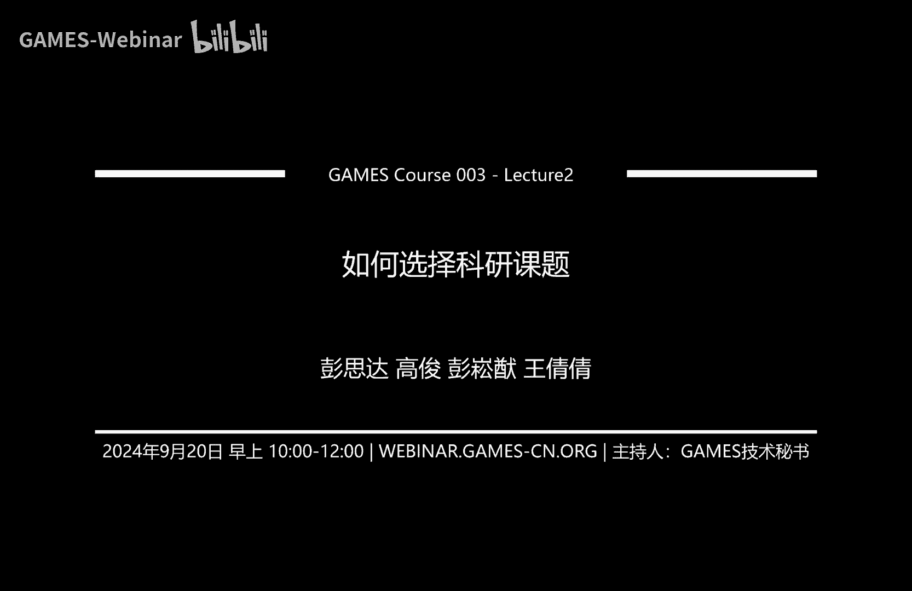
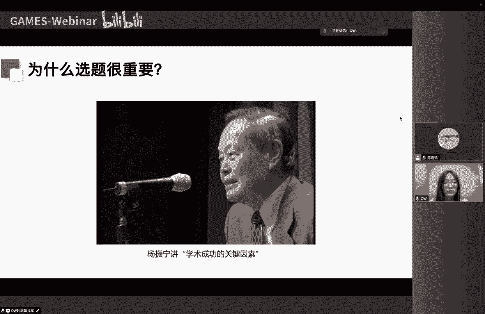
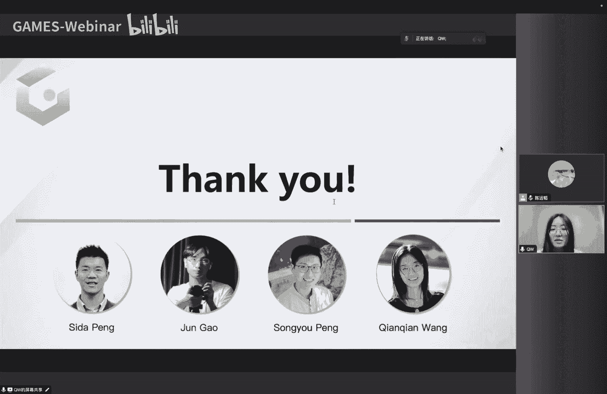

# GAMES003-科研基本素养 - P2：L02-如何选择科研课题 - GAMES-Webinar - BV1RitTezEa9

OK嗯大家好啊，欢迎大家来到这个game，403科研素养课的第二周啊，我叫王倩倩，然后我现在是在加州大学伯克利分校，自我博士后，然后呢我今天讲一下就是怎么选择科研课题啊，因为我们现在是第二讲。

所以呢我还是先讲一些，就是一些比较一些high level的一些东西，比如说对吧，就是科研是什么，这个这个地方我参考了一个呃，这个这个matt mind的一个。

他说是illustrated guy to a p h d，就是他讲的是这个PD是一个什么样的过程，我觉得是一个比较有意思的一个呃，一个一个一个图示，就是说先画一个圈，就是正是我们所有的人类的知识对吧。

然后呢当你上完小学的时候呢，你知道一点点嗯，你上了高中之后呢，你知道的更多了一点对吧，那你呃这个读完你的本科的时候呢，你其实就有了一个一个专场对吧，比如说啊可能很多同学学的是计算机。

或者是跟这个工科相关的，那你就有这样一个一个专长，那比如说如果你现在在读硕士的话，其实你这个这个专长就会更加的深入啊，当然对我们来说啊，很多同学他的硕士可能也是一个啊，就是一科研类型的硕士对吧。

然后呢你通过阅读这个啊论文呢，或者说一些做一些科研相关的一些训练呢，其实这个呢你就来到了，就是说人类知识的一个边界对吧，然后呢在这个边界上呢，你就非常的你就你就就是说你不可能否。

就是你不可能就是关注很多很多的问题，可能就在关注一个问题，然后呢你就不停的去去推动这个这个边界，然后呢直到有一天这个边界它有一个小额鼓包，然后呢啊这个这个这个本来的这个这个呃文献。

他其实讲的是说这个小的鼓包，就是你的博士学位，然后对你对你来说，这个鼓包其实非常的非常的大，但是呢在整个这个圈上来看，这个鼓包就是很小一个鼓鼓包，但是呢我这地方想讲的是啊，其实这就是一个科研的一个过程。

就是说你在探索呃知识还有技术的一个边界啊，这就是一个大概的一个一个一个一个基础对吧，就是我们怎么样去理解科研这个过程，那嗯如果让我去回想，比如说我自己刚刚开始做科研研的时候，其实啊我并不知道科研是什么。

因为我之前就是一个学生对吧，我本科毕业之后呢就开始读博士了，所以呢其实我觉得我一直有个误区，尤其是刚开始的时候，就是尤其是关于就是说怎么从一个学生的思维，学习的一个思维转到一个做科研的思维上面。

所以是这地方我也想简单的讲一下，就是说我在我看来就是说呃，学习和科研有什么样的一个区别，尤其是对一些刚入门啊，做科研的同学来说，首先我觉得就刚才已经说到了，第一个区别就是学习的话。

你是在学习人类已经有的知识对吧，科研的话其实你是要去创造，去去发现，去发明一些新的知识，那第二个区别就是说在你学习的时候对吧，你比如说你学呃这个微积分或者什么的。

所有的课程它都是有个固定的课程大纲的对吧，你学习的东西呢啊你知道考试会考什么，然后你学习的时候，就是按照就是说考试，就是会划定的范围去去学习，但是对于科研来说呢，它是没有一个边界的对吧。

也没有人告诉你说你应该去啊研究什么，没有人给你画这个重点，就是说你连去学习什么都是要你自己去啊，去去去决定的，所以这也是为什么就课也比较难，以及今天我们要讨论怎么选题的啊，一个原因。

然后呢还有一个很大的区别，就是因为学习他是你学一个很很就是已知的，或者说一些比较呃，就是说固定的东西，然后他比较是一分耕耘一分收获，就是说你付出的越多，你就感觉这个这个反馈还是比较及时的对吧。

比如说你啊你你努力学习一下子，然后你可能在期中考试或者考试中，你就可以立竿见影的看到自己的成果，但是科研的周期是比较长的，并且呢它是一个比较随机的过程，就有的时候你可能在一个错误的方向。

就是尝试呢啊即使你付出了很大的努力，就是最后你可能面临的还是一个一个一个，不好的结果对吧，所以呢就是说对于对于一些，比如刚开始的同学来说，他可能觉得很沮丧，就是说啊就怎么总是做不出来对吧。

是不是自己不擅长做科研，是不是啊自己有什么问题，所以说这时候其实对于这个失败的概念的定义，就要做一些转变，就是说不是说一定要做出来才是成功，而是说如果你每天能够学到新的知识，学到新的东西。

然后你对这个问题的理解啊，又增进了一份，哪怕你今天没有，就是说真的做出来什么东西，但是我觉得这也是一定意义上的一个成功，所以说这种思维方式上的转变，其实或者说是心态上的调整，也是一个就是很重要外。

很重要的一个一个场外的因素，那还有一个区别，就是比如说对学习来说，你你学的东西大部分都是真理对吧，就经过大家啊无数次的验证的啊一些东西，但是呢做科研，因为大家都在这个这个边界上对吧。

没有其实实际上没有没有人是以绝对的权威，也没有人能够预测未来会怎么样，所以说呢就做科研的时候，就不能够把别人的话就是奉为圭你，比如说不管是你的老师的说的话，还是所谓的权威说的话，其实你都要去就敢想。

然后敢质疑，就举个例子，比如说之前NERF刚出来的时候，就是大家都觉得啊这种implicit的方法，它非常有前途对吧，就觉得啊要把它发扬光大，然后它的优势很大，就相比传统的这些更更更显示的方法。

那高深SWEDDING出来之后呢，大家又觉得哇这种显示的方法它非常的好，然后很快，然后效果又好，所以所以说就是说大家的这种，就是说嗯我们都是有很大的历历史的局限性的。

就是我们的这个想法也是会被很多东西影响的，所以说我觉得就是说嗯，就是说还是要就是啊比较比较就是说啊，能够批判性的去看待很多事情，包括我今天说的话，或者我的很多观点可能都是啊不是很准确的。

所以大家也要就是能够呃有自己的判断。

OK这是一个就是大概的一个背景上的，每一个一个介绍，那回到我们今天的一个主题，就是说选题这个问问题对吧，首先我想强调一下选题的重要性，然后呢这是一个影片，就是啊我之前也看到过。

就是说杨振宁他讲学术成功的一个，关键因素的一个影片，我觉得比较能够好的就是诠释他，他讲的其实是一个大方向上的选选，择一个重要性，但是呢我觉得同样的道理，也适用于选题的重要性，我现在放一下啊。

在座的年轻的同学呃，我想我有一个建议，就是你们比如说是你去念研究院，这是我所有的研究生，我都跟他们这样讲的，呃，你到研究院去，你到一个还好的研究院去念书的话，你就发现多半你的同学都很好。

都是要不然他不会进到这个学校里来的，可是过了10年，过了20年以后，你就发现他们的贡献悬殊，有的人做得非常好，有的人费了很大的劲不成功，这里头最最重要的一点，不是说是。

哪一个人比另外一个人就聪明的那么多，也不是说一个人比另外一个人就努力那么多，这些当然也有点关系，这都不是最重要的，最重要的是有人走进了有发展的领域，有人走进没有发展的领域，甚至是强弩之末的领域。

这个是每我认为是每一个研究生，对于他自己的前途最重要的一个决策的地方，就是你得走套一个前途能够发展的地方，怎么能够走到一个前途有发展的地方呢，你必须要把你的天线伸得远远的，而且你要能够因为你单是看文章。

这个现在这个文章多的不得了，连这个评论的文章也都都多的不得了，你得要能够啊掌握住哪些是可靠的，哪些是能够发展的，而如果你能够找到这么一个领域，又与你的呃喜好，与你的背景很接近的，那你向这个方向进军。

将来成功的可能性就比较大，我自己就是觉得我是很幸运的，走到了当时正在要发展的这个领域，所以能够在里头做出一些贡献，对所以说就是杨振宁他讲的是，就是说你选择一个大的方向呢。

就是这个对于你一个整个研究生生涯或者，博士生涯的一个重要性，那这个同样的道理也适用于说你在选题的时候，对吧，他对你整个项目的成功的一个重要性，就是你在一个正确的方向上努力，其实啊是非常重要的。

不然的话你可能就是说不管你能力再再怎么强，对吧，有的时候如果这个方向是错误的话，那你就是很难就把它呃做出来，对嗯对。

然后呢下面我就想讲一下，为什么选题是一个很难的一个事情，就是很简单的道理，就是说你在做这个课题的时候，你是不知道将来会发生什么的对吧，因为你是站在一个已知的地方。

你要去你要去相当时你去预测位置会会怎么样，所以它的不确定性非常大的，就是在你刚开始做一个课题的时候，他的命运你是没有办法预测的，尤其是一些你觉得就是有意思比较有意思，或者说呃嗯不是就是说这个有意思。

也是因为他比较未知，所以导致它有意思，那如果你选了一个课题，然后你觉得我就我就能我就能推测出来，他肯定能能能work，那这种情况下，你就会面临一个另外一个问题，就是说你在投的时候对吧。

大家就会觉得啊你这个novelty是不太够，所以说这个就是说它有多就是未知，以及说他啊有多能做出来，它中间是一个啊互相，也就是说就是就是说你要去平权衡的，一个事情啊。

啊所以说就是说这个未知性就带给了很多，就是一个像很大的就是可能不同的走向，一种走向，就是说你可能就根本做不出来对吧，他可能就是条死路，那有一种可能性就是你做着就会发现，诶啊那个可能更更更有希望一点。

然后诶那个可能更有希望一点，然后呢就是说你最后做出来的东西，可能跟你一开始想的东西不完全一样，这也是非常常见的一种情况，那还有一种情况就是说唉，大家都在做同样的一件事情啊。

这个现在在我们这个比较拥挤的领域，其实也是比较常见的呃一种情况，那还有一种情况就是说唉，我这整个整个整个局势，发生了一些比较大的变化，就是比如说我之前我用干做这件事情。

那现在可能啊用diffusion来做就会效果更好，所以说这个也会颠覆，就是说你你的这个小的课题的一个命运，所以说就是选题，它也是一个就是多多人，就是这种玩家的游戏对吧。

它不是一个你自己一个单人的一个游戏，所以说就是有很多因素，你你你会呃需要考虑，那这地方其实我想讲你想强调一个点，就是说啊心态上面，就是说你要能够接受这种不确定性，就你不能说啊我选定了。

我就一股脑就要把它做出来，你也不能说就是说啊，嗯就是或者就是相反的一种做法，就是说我觉得要建立一种正确的心理预期，就是说啊有的是该变的时候呢就要变，然后呢该坚持的时候就要坚持，但这句话说起来比较简单。

实际上做起来还是有很多呃需要把握的地方，第二点就是说我们要做的事情，就是要降低这种不确定性，因为你你对这个知识，对于这个问题的理解越充分，其实你将你将要把你的已知扩的越大对吧，你的位置对你来说就越小。

那你就越能知道就是哪些地方可能比较有希望，哪些地方可能没有希望，所以说不断的更新和加深，加深自己对问题的认知也是非常重要的，那我还是想要就是一个就比较想提到的点，就是说啊其实寻找科研课题。

这这件事情本身也是科研，然后他也是科研非常重要甚至最重要的环节，对我来说嗯，就所以就是对有些同学，他可能觉得哎我有一个想法，我就立马对吧，我就马上跳到这个实现的环节，这样其实也是不对的。

因为你没有仔细的去，就是说去验证你这样一个想法，或者有的同学可能觉得唉，我花这么长时间在读论文上啊，我其他同学都已经开始写代码了，我还在读论文，就这种焦虑也是没有必要的，因为就是说你要把寻找科研课题。

它本身也当成是科研的一个一个很重要的部分，并且呢就是说你找课题的这个过程，其实呃你可能想象中，你觉得哎我就是想到了一个idea，然后呢我设计这个方法，我做实验，然后做出来了就就结束了对吧。

这是一个完全单向的一个一个事情，但其实不是这样的，就是说你你在寻找课题，或者你想idea这件事情本身，它通常会贯穿一个项目的始终，也就是说你对吧，你可能是在呃设计方法的时候发现诶，这方法有点问题。

要要回去去想对吧，你可能啊做做实验验，发现哎有一个地方它有点问题，或者是说有一个小的设计，我需要大家想一想，所以你又又又会去想D，所以说实际上就是说你你这样一个过程，是一个非常循环往复的一个过程。

你要不断的去啊优化自己的一个想法，不管是在大方向上做优化，还是说在一些方法的小的具体的设计上做优化，所以它是一个啊非常非常就是说啊，在一个课题里面，各个阶段都会面临的一个问题，OK这是一个比较啊。

一些比较啊基本的一些我想说的事情，那下面我们就看一看，就是说你在选择课题的时候，有哪些比较关键的因素，首先我想要说的是就是课题的选择，这是一件非常因人而异的事情，因为每个人的情况都非常的不一样对吧。

有一些就是首先不一样的，是你的个人的自身的情况不一样，你可能有不同的兴趣啊，然后不同的背景，然后呢大家所处的阶段也不一样，有的同学可能刚刚入门，有的同学可能已经有一定的经验了对吧。

然后你的目标标也不一样，你是只是想发发表一篇论文呢，还是说你想解决一个非常非常啊核心的问题，那你的这个小环境也有很多的不一样，比如说你们导师对你有什么要求啊，然后他是会给你一个方向呢。

还是会让你自由的探索，然后包括你实验室的情况，就有没有在某一个方向有一定的积累，还是说啊整体上是一个比较起步的一个阶段，包括你的实验室，就是就是你的合作者的情况对吧，你能不能找得到很好的合作者。

或有没有人带你，还是说你需要独立探索，包括整个大环境对吧，就是说整个领域发展到什么样的一个阶段了，整个领域的活跃程度怎么样，然后未来的发展潜力怎么样，所以说我觉得大家都可以去想一想啊，自己的这些啊。

就是自身的情况呀，小环境和大环境，然后接下来可以就是做更好一些判断，那说到这个选选择课题的一些关键因素的话，我觉得主要有这么几个因素，首先就是你个人的兴趣，还有喜好，然后呢。

这个其实是决定了你在做的这个过程当中，你就是说做得开不开心，然后呢，第二个因素我觉得就是一个课题的可行性，就是说他到底能不能做出来，它决定了你这个课题能不能做出来，嗯第三个因素就是它的一个影响力。

或者说你这个课题的一个重要性，那它就决定了你做出来之后对吧，你这个关注度会有多高，所以接下来我就会啊，逐一的去分析这几个关键的因素，首先关于这个兴趣和喜好这个问题，就是我觉得我还是非常想强调一下。

就是你这个兴趣，还有你的这个热情，对于科研的重要性的，就是举一个例子，就是呃一定程度，因为因为我觉得兴趣很大程度上，不仅决定你做的开不开心，它其实也决定了你能不能做出来，以及你做出来之后的影响力有多大。

就他是一个非常一个一个有根本的一个，一个驱动力，然后呢我想举一个我自己的例子，就是说我在博士第一年的时候，我就问过我的老板啊，我在康奈尔读的博士，然后老师是NOAHDAVEY，然后我就说他有没有。

我就问他有没有什么意见对吧，我怎么能够啊读好我的这个博士，然后呢他当时说的是啊，你找一个你非常感兴趣的问题，然后我觉得这个当当时对我来说，我就给我留下了很深刻的印象，因为我原本以为他会说一些。

比如说啊你要养成良好的科研习惯，然后呢，比或者说你每天要工作多长多长时间以上对吧，然后我没有想到是是是这样的一个一个回答，然后我当时其实不能完全的理解他，他就是这样一个一个一个答案。

我觉得是有点奇怪的一一个说法，然后但是当我真的读完了我的PHD之后，我我真的觉得这确实是一个非常根本的因素，因为如果你真的很想把一个东西做出来，如果你真的对它很感兴趣的话，这个这个因素其实是高于其他的。

比如你科研习惯或者什么因素，因为你会想尽办法，你会绞尽脑汁的想要把它给做出来，所以这是一个我觉得更根本的一个一个驱动力，然后呢为了这门课，我也我也问了一下呃，Alashephs，我就是博士后的一导师。

然后他是加州大学伯克利分校的一个教授，然后我就说哎你你就选对于选择课题对吧，你有什么建议，然后她的建议就是说你要做一个，你真正就是享受做的一个事情，因为呢做科研业其实有非常非常多的随机性，对吧。

嗯你可能很幸运对吧，你做如果你的东西，如果你做的东西它变得非常热，热门的话你你是很幸运的，但是呢如果它不是热门的，而且这种情况是非常可能发生的，那至少你还在做的过程当中，你还比较开心。

这这就是你的一个收获对，所以所以我觉得这有一点点啊，有一点点就是说有点理想化了对吧，因为它假设的就是说，你没有任何的外界的限制对吧，你的老板没有对你有要求或者什么之类的，但是对于可能对有些同学。

他确实是一个比较理想的这样一个环境，条件的话，我是非常推荐，就是大家去找一个自己比较感兴趣的问题去做，相比于一个你可能不太感兴趣的问题去做，然后对我自己来说也也是一样的，就是我我自己就觉得，就是说。

当我做一个，我自己兴趣感觉非常一般的项目的时候，就是有点像上班打卡，就是有点当一天和尚撞一天钟的那种感觉，但是当我做一个，我觉得兴趣非常啊浓厚的项目的时候，就是真的是会不自觉的会花很多时间在上面。

比如说你可能吃饭的时候在想这个问题对吧，你可能嗯你洗澡的时候也在想这个问题，所以这样的话就哪怕你中间走一些弯路对吧，哪怕你你你的能力可能没有达到某一定程度，但是你不停的试不停时，我觉得总是就从长期来看。

就是说你你成功的概率还是很高的，因为你有很大的决心，然后你你花了很多的精力，哪怕你有一些错误的尝试，也是会最后回到正正正途上的啊，对所以说啊我刚才强调了说研究兴趣非常重要，那那下面的问题就是说。

哎我怎么找到我的一个研究的兴趣或者热情，对吧，嗯首先我觉得就是啊要了解自己，对，了解自己，其实是一个比大家想象的还要难的一件事情，对吧，就是说很多同学他其实不是非常了解自己，喜欢什么啊。

也不了解自己擅长是什么，所以所以我就首先要了解自己就擅长什么对吧，因为因为喜欢和擅长，他你很难分得清是什么导致的什么，有的时候你可能是因为就是擅长，所以你喜欢，有的时候可能是因为你喜欢，所以所以擅长。

所以我觉得比如说大家可以想想自己有什么，就比如说你可能更擅长编程呀，或者说你动手能力更强呀，或者说你的数理基础更好呀，然后这样的话你可以啊，就是结合这些特点，自己的一些特点来选择一个研究方向。

然后还有一个就是啊，如果就是说你确实就是比较入门，就是不不知道什么特别多的这种呃，关于这个领域的呃的一些呃问题的情况下呢，啊，你至少可以了解一下，你对什么样的风格的问题感兴趣对吧。

有的人他可能比较喜欢唉实用性，他就想要做出有一些，比如说重要的实际应用的东西，提升这个速度和效果，然后这样的话对吧，这样的话就觉得唉这个东西可以给大家用，这个事情让我感觉非常非常非常兴奋。

然后我觉得非常有动力对吧，有的人可能他就是比较喜欢做一些天马行空的，比较新颖的有趣的啊问题，然后就想做大家没做过的，然后呢或者说效果做的非常好，我觉得这也是啊一种一种，就是说一种风格的问题。

然后呢可能还有同学他比较喜欢啊，优就是数学上比较优优雅的，就比较严谨的问问题，或者说能用数学解释的问题，这也是啊一种风格，然后呢我觉得就是说通过读论文呀，和大家交流啊。

一般是可以大概判断自己对哪一类风格的问题，更感兴趣的，对，然后刚刚讲的主要是就是说，对于说你如果你是什么都不知道，然后你刚入门的话，你可以先对自己做这样一些分析，那如果说如果说我如果我想讲一下。

就是说真正的研究的兴趣和啊，这种比较浓厚的比较怎么说呢，比较扎实的兴趣是建立在什么呢，其实是建立在你对一个问题有过真正有过探索，然后产生了深刻理解的一个基础上，因为因为就是说你比如我刚才讲的这些兴趣。

其实它都是一个大致的兴趣对吧，它并不是一个非常非常实在的一个兴趣，但是呢如果你真的去对一个问题，有了啊自己的探索，那你这时候他这个兴趣，他就是一个就比较切实的一一个兴趣。

就比如说啊我我的老板就是NORASAI，他之前是做这个重建的对吧，然后呢他就一直对这种重建有就是对称结构，因为对称的结构它其实是比较啊比较有这个嗯，嗯就比较ambiguous。

就是说你不知道就是到底在看东边还是西边，如果他是一个对称的结构的话啊，为什么他对这个问题有这么浓厚的兴趣呢，就是因为他早期就在他PH的时候对吧，他做这个重建的问题的时候，就是这种对称的呃。

建结构的建筑物的重建总是会失败，也就是说什么呢，也就是说就是当你真正尝试，然后你就看到了这个问题，你就这个问题就一直会在你的就脑海中存在着，然后你就会想，比如说有新的工具出现对吧。

你就会一直想唉这个问题能不能解决，我想要解决的问题，所以当你真正去探索过一个问题之后，你就跟这个问题有了互动，你就有了产生一种连接，然后你就想可能更更想去解决它对，然后呢我觉得还有一种做法。

就是你可以跟大家交流，然后了解别人对什么问题感兴趣，因为他肯定是就是有原因的，就他可能探索过对吧，他可能有自己的原因，他为什么觉得这东西有趣，然后这样的话，其实也可以给你一个大概的一个概念。

就是说什么东西你可能是比较感兴趣的，然后呢，呃我觉得我觉得这个确实就是这种这种热情，或者研究兴趣呢，它并不是一个必需品，就我们时而感觉到没有研究热情，也是一件非常正常的事情，就没有人能够一直保持。

就是对，对于这个呃对你自己的研究非常非常有热情，因为他也是跟你目前在做一个什么问题，是是要有直接相关的，所以我就想说，如果大家目前或者是说在某一个阶段，觉得没有什么研究热情是一件非常正常的事情。

嗯并且呢就是你能如果真能真的能找到一个，自己很感兴趣的课题实习，是一件很幸运的事情，然后呢我觉得就是这种起起伏伏是非常多的，但是呢比较重要的事情，就是要一直保持着好奇心，还有求知欲。

然后如果你是一个有好奇心和求知欲的人，你总是会找到你觉得感兴趣的，有意思的问题，就不管这个领域在发生什么样的变化，我觉得这也都是嗯都是可以的，OK那第二个因素就是一个非常非常重要的因素。

就是说这个课题的可行性到底怎么样对吧，那可行性的话也有非常多的影响因素，一个就是这个课题他本身他的研究空间怎么样，还有难度怎么样啊，竞争程度怎么样，然后包括你自己的背景对吧。

然后包括你能获得的资源和支持，那我们先看一下这个研究空间，对这个研究空间也非常好理解，就是说一般情况下来说，就是说一个新兴的领域，它的研究空间通常比较大，因为它刚刚出现对吧，大家需要去理解它啊，啊。

需要去就在他的基础上做一些呃，一些开枝散叶的工作，那相相应的就是越成熟的领域，它的研究空间通常就比比较小，比如说NERF在2020年刚出来的时候对吧，就是大家有非常多可以研究的一些方向。

比如说你可以对它进行进行重光照呀，你可以把它变得可以泛化呀，你可以把它做到，就是说啊就是in the wild的场景上呀，你可以对它进行加速呀，是做动态场景对吧，就是这是他刚出出来的时候。

那比如说我现在2024年我再去做，那时那我还能做什么呢，因为这些比较好，就是比较比较比较重要的一些方向，大家都已经试过了对吧，你在2024年再做这样问题的话，你你只能在上面。

在他们上面做一些非常小的改进和提升，所以这时候其实就不是一个很好的，去做这个方向的一个时间了，就因为他研究空间就有点太小了，所以说我觉得一个可以衡量的方法，就是你可以针对一个方向想一想。

就是说你还能想到多少个，对你自己来说，你能想到多少个不同的研究方方法或者角度，然后这是大家还没有做过的，这样你可以大概的感受一下这个研究空间，然后第二个我想讲的是这个课题的难度对吧。

嗯首先我想要澄澄清一下，就是说这个课题的难度呢，它其实并不等同于这个问题本身的难度，就是这个问题本身，比如说你现在解决啊，1+1=2呢，还是你在解决，比如说3×5对吧。

它并不是说这个这个科学问题本身的难度，我想说的难度其实是啊，因为因为你要因为你就是说做研究，你还是要提升，就是大家已有的这个认知，然后在前任的工作上做得更好，所以这个难度其实是你相较于前任的工作。

做出更好的效果的难度，所以说比如说越成熟的领域，比如说这个图像分割，你要你要做出更好的效果，难度就会更高，因为已经有SAM种非常非常好的工作存在，那还有一个就是说这个难度其实是，你相比前任的工作。

就是前已经做的工作，你能挖掘出新的角度的这样一个难度，因为有的时候其实你这个领域他不是特别成熟，当然也有可能大家探索的就角度比较全面了，那这时候你再想到找到一个新的角度，可能会比较难。

那这时候你可能坐坐着，这就可能撞车，或者说哎找不到啊，也可以挖掘的方向了，所以这时候我觉得也说明，这个课题的难度会比较大，然后还有一个我想说的，就是说它难道它并不是一个绝对的东西。

就是说啊你的这个所有你在做科研中，很多东西都是可以调整的，包括这个课题的难度，因为比如说如果一个目标太难的话啊，你是可以考虑适当的降低难度，这个也是我们在作业科研当中是啊不停的呃。

就是会遇到的一个问题对吧，你通过简化问题的设定也好呀，或者是说一些其他的方式也好，来降低这个问题的难度，那还有一种情况就是说啊，你在做到一个方法的时候呢，你会发现你这个方法，它在某一些方面虽然有缺点。

但是他在其他方面有很大的优点，那这个时候呢，你就可以想办法把你这个你这问题设定改一改，然后呢让这个设定呢更能够符合，或者更能够让把你的这个方法的优点，来把张扬出来，那这个时候相当于相当于说。

你这个问题难度也降低了，所以你通过调整问题的设定的方法呢，其实是可以啊，调整问题的难度的，然后呢另外一个一个影响因素，就是一个课题的一个竞争的程度啊，通常情况下呢就是大家越关心的问题啊，竞争程度越高。

比如说我觉得去年或者说今年前段时间，或者现在对吧，大家对于三维生成模型的关注度是非常高的，因为他可能有很多的就是呃就是工业的应用呀，或者之类的，所以所以这个问题他就变得竞争非常激烈。

所以大家可以看很多很多的工作对吧，当然也也是跟就是这个这个这个做法，他比较呃比较成熟，就或者说比较呃比较promising有关，那同样的就是说你越容易想到的问题，它的竞争度也比较高。

比如说之前我刚才讲过，就是nurse有一些拓展的方向对吧，那高深SPDING出现之后，这所有的拓展方向，你都可以尝试把它做到高深SPREADDING上面，所以就相当于是说嗯有点有点像感觉。

就是这个啊新瓶装旧酒的感觉，所以说是这种就是说比较啊，直接比较容易想到的课题，他的竞争程度也比较高，然后呢我的一个大概的建议，就是说，我觉得大家还是应该去尽可能的去避免，竞争非常激烈的问题。

而这也是这也是就是阿廖沙，他也也是这么跟我说的，就是说他就觉得你选了一个竞争很激烈的，问题呢，比你随便选都要差，因为竞争很激烈的话，其实就是大家就是就是说，相当于是说你要做的非常好才可以对吧。

但是呢呃如果说你有一个比较独特的角度，就是你觉得这个角度他不是特别容易想到，或者说你有些优势，比如说你你想你要就是你做这个问题，你的背景非常相关对吧，你可能本来就是这个领域的专家，那你可以跟别人搏一搏。

或者说你的手很快，或者说你的合作者，他他他是就是说跟这个这个工作，就是呃他懂得很多或者之类的，在这种情况下你可以试一试啊，所以这还是一个根据你个人情况，你要去判断的一个事情，然后呢然后就是想讲一下。

这是一个课题的一些因素对吧，那还有一个我自己的一个因素嗯，我觉得就可以大家去想一想，就是说你你的一个你的基础的情况怎么样对吧，你的编程能力怎么样，或者你的数理基础怎么样，这个是不管你有没有人帮你想id。

就是啊你在做一个一个项目的过程当中呢，你都是啊需要的一个比较基本的一个能力，就哪怕你是只是执行这个项目，你也是需要这样的能力的，然后呢，再一个就是你对这个研究领域，是不是有充分的了解啊。

如果你要从头去想一个idea的话，我觉得这种这个能力是需要的啊，但是如果说你有别人帮你，比如说你有老师带你啊，那你可能这个了解你就不需要，就非常非常充分啊，所以所以说就是说我觉得，如果你是要从头想的话。

那这个了解还是要达到一个很高的一个程度，还有一个我觉得会影响到啊，呃就是可行性的一点，其实是你对这个科研流程的一个把握的程度，把握的能力怎么样，因为其实做科研有一个比较需要经验的事情。

就是说你要知道啊在什么时间应该干什么，不然的话你可能会花很多时间，在一个比如说不重要的，或者说一个比较比较小的问题上，然后或者是说你应该放弃的时候，没有放弃或者之类的。

所以说这个也是你随着你做科学员比较多，你有经验了之后，你可以更好的判断的一个事情，那如果你没有办法做一个很好的判断，我觉得你就是要需要多跟别人沟通，然后呃看一下别人是不是有一个，比较好的一个建议。

所以说呢我觉得对于刚入门的同学，我觉得啊，还是以就是锻炼自己的这个科研技能为主，然后呢尽可能去选择门槛比较低的，然后难度比较适中的，然后风险也比较低的这样这样的一个课题，然后就说你你的目标是什么。

你的目标并不并不是说哎，我要做一个多么多么好的论文，我觉得主要还是以就是成长这样做一个目标，就是说尽可能去培养自己的科研的技能，然后建立科研的信心，尤其是我觉得就是说对于低年级的学生来说。

如果你啊已经发表了一些论文，你现在心里面就有底了对吧，然后你在高年级的时候呢，你就可以更多的去探索一些比较难的啊，或者说比较有风险的问题，对这个对我来说也是这样这样的一个过程。

但如果你很长时间没有没有一些很好的正的，反正向反馈的话，你可能就没有信心，然后这时候你可能在接下来的时间也会啊，比较挣扎，所以所以我真的建议大家就是说啊，一开始对自己预期不要特别高。

然后就主要主要以培养自己能力为主，然后呢呃有一种可以的做法，其实就是你找一篇你比较喜欢的，然后代码维护比较好的论文，然后你去深入理解它的方法，然后呢去跑它的代码，然后再在这个基础上对它进行改进。

我觉得这是一个啊，至少可以让你熟悉一篇工作对吧，你熟悉一篇工作之后啊，这是你就可以进行一些举一反三，然后呢我觉得也是可以尽可能的去选择，自己能够得到比较足够的支持和指导的课题。

就是因为科研里面有一些东西，其实你知道了一次之后，就是说不管你是通过自己呃尝试的，还是说别人告诉你的，你知道了之后，其实后面可能就啊比较轻松了，就比如说啊一些啊对吧，写作业呀，或者说一些啊。

一些这种这种这种一一这样一个技能啊，所以说我觉得，如果能得到比较好的支持和指导的话，还是应该尽可能的去寻求这样的机会，那么对于有一定科研经验的同学，我觉得你要不然你可以选择去啊。

深度的去挖掘一个问题的难点，因为你可能在一个方向已经进行了一些啊，一些探索和尝试了，然后你可以去尝试解决里面的一些核心的问题，那你也你也可以就是说啊，我这个问题我已经做了一段时间了，我其实对他啊。

已经有点已经有点审美疲劳了对吧，那你可以适当的去探索一些别的方向，这样的话你可以丰富你的，你的技能和知识的储备，然后如果你对两个方向都有好的理解的话，其实你更有可能去产生一些一些新的。

或者说一些可能出其不意的，大家没有问，就是没有很好想到的这样一个一个idea，然后呢其实影响可行性还有很多其他因素，然后这边列举几个啊，一个就是说你这个问题，它的定义的清晰的程度怎么样。

就说你可以试一下对吧，你能不能用比较简洁的语言来描述，你的一个核心的研究问题，有的时候你可能你会发现你这个问题的定义，它就不是很清晰，或者它就不是很合理对吧，你可以呃，你可以就列一下这三个问题。

比如说你要解决的问题，是一个什么样的问题对吧，然后呢你的方法为什么能解决这个问题，然后解决了这个问题之后，他能给你带来能力，这个领域带来什么，就是如果你能把这三个问题都很清晰地，描述出来的话。

其实你觉得你的这个核心的研究问题，可能就是一个比较合理的啊，一个比较unreasonable的一个一个问题，然后指导我刚才也提到了对吧，就是说啊能不能找到有意义的指导，如果不能的话。

能否找到相人来指导我，然后还有一个一个很重要的问题，就是说你能不能及时得到反馈啊，就是说因为有的时候有的时候，比如说如果你做这个问题，你还要提前去收集数据集的话，你可能要等好几个月，你才能知道你这个啊。

你这个想法行不行对吧，所以说有些课题，它每每个课题它的这个特点都不一样，然后呢你要根据它的特点啊来判断，就是说他就是说你能不能及时得到反馈，那肯定是选择，你比较能及时得到反馈的课题会更好。

不然的话你可能又会花花上很长时间在呃，在就是说啊没有没有信息的这样一种情况下，还有就是需要考虑，就是说你这个项目所需的时长，是不是符合你的一个时间安排，比如说如果你要可能马上你要去做实习了对吧。

你现在只有两三个月的时间，那可能就不适合做一个啊非常非常有意义，就是很宏大的一个项目，然后还有就是需要考虑到一些资源上的问题，因为呃有一些课题，它是对计算资源的需求是很高的，比如说如果你要去训这个啊。

一些嗯就是一些foundation foundation models对吧啊，然后有些可能是他他可以租，但是他们没有数据集对吧，所以说这个资源上的考虑，也是大家需要去呃去注意的。

还有一个就是说你这个课题他能不能比较有，有没有一定的灵活性，就是说如果你想到这个id它不work的话，你能不能想到就是你能想到多少个，就是说对它进行变换，或者说一些啊一些备选的一个方案。

或者说你多容易去回收，你已经有了探索的成果，有的课题可能就是说你有一个想法对吧，他不work了，你就就就没了对吧，有的课题可能是哎我有这样一个目标，然后呢呃我就沿着这个目标去做，然后我可以降低我的目标。

所以不同的课题它的灵活性是不一样的，然后呢呃就是可行性方面，然后关于影响力啊，我可以讲一下呀，就是我觉得一个工作的影响力，它是等于就是说这个领域它总体的一个关注度，然后再乘上你这个工作的一个显著流程度。

所以说如果你这个领域，它本来就是一个非常小众的领域的话，那你这工作它总共它这个对吧，总共这个这个基本面就这么大对吧，或者说如果你的工作，其实他在一个非常热门的领域，但是呢他并没有推动很多的话。

那你的影响力其实也是比较有限的啊，通常来说的话就是说你越重要的问题，或者说越越general越普世的问题，或者说当下对吧，大家啊最热门的问题，就这种问题，他的关注度都是比较高的。

那就是举一个比如比较重要的问题的例子，就比如说这个对应关系就是correspondence，它就是一个很重要的问题啊，然后这是一个比较有名的引用，就是这个professor，他就说啊。

这个三个最重要的问题都是APERSONI啊，为什么呢，就是因为这个对应关系呢，它不管是对重建来说对吧，就三维重建来说，还是说对于这个目标追踪来说，或者是对所有的问题，它其实就是都可以。

就是它都都是一个这些问题的一个源头，就是如果你能解决啊，Fundamentally，如果你能解决这个correspondence的问题的话，很多问题其实都可以迎刃而解，然后另外一个例子。

我觉得就是说比如说单目深度，估计也是一个很重要的问题，因为你有了这样的一个关于这个场景的，这个几何理解之后，其实很多问题啊都可以从中受益，那嗯举个小众的问题的例子，就是我我随便编的啊。

就是说啊我要我们要解决这个在鱼眼相机下面，这个马的姿态的估计问题对吧，这这这就是一个很小人的问题啊，问问原因就是说首先这个设定就很多对吧，就是这个或者说一个很具体的一个设定，然后呢这个问题呢大家可能对。

也不是很关心这个马的姿态，估计对吧，我可能更关心人的姿态估计，所以这就是一个非常小众的例子，那你的受众就会比较小，所以说一个可以思考的一个方法，就是说你可以想一想，就是说你研究这个问题呢。

哪一类人群会对我的课题比较感兴趣啊，比如说如果我能做出来一个比transformer，更好的架构的话，那基本上就是所有的这个AI领域的这个从业者，都会对啊我这个课题感兴趣对吧，那如果我能啊。

有一个从视频里面得到更好的，相机参数的算法的话，其实做三三维啊，或者443D和4D重建的问题，或者说做内容生成的人都会感兴趣，因为你如果你知道相机的话，你可以就是提升这个视频，这个模型的一个可控性。

然后呢我还想说一点，就是说影响力它有不同的表现形式啊，如果你能真的把它做的非常有用，就是能解决一些核心的问题和挑战的话，那当然是一个会是一个很有影响力的工作，但是呢我觉得很多时候呃有用它并不是必要的。

就如果你能做出来很特别的工作，然后能给大家留下了很深刻的印象，我觉得这个也是会非常有影响力的，就对我来说，然后呢我想举两个有比较特别的例子，比如说这个就是他就是就是这个。

它叫它叫infinite images，就是说他这个图片它通过一些方法，然后你会感觉它一直啊可以无限的去去延伸，这样子嗯，然后你看到这样一个结果之后，其实他就会给你留下一个呃，一个比较深刻的印象。

因为他有点是这个composition的photography呃，photography的感觉，就是说这个本身它就是一个啊，一个很有意思的事情，然后还有一个例子就是最近的一个一个工作呃。

就是他们就是用diffusion models来做一些啊，一些呃，嗯这个怎么哦对，那来用diffusion mo来做一些illusions嗯，看一下诶，这个就可能有点卡，但是它的大概的概念。

就是说你这个图片在很小的时候，它看起来像另外一张图片，然后放大的时候呃对就小的时候是一张图片，然后放大是另外一张图片，其实这个时候你也可以大概感觉到这个啊，他现在看起来。

就如果你看他这个他的这个低频信号的话，它其实是这个爱因斯坦，如果你看到的高频信号的话，它其实是一个一个一个画对，所以这个我觉得也是一个非常有意思的一个呃，一个工作，然后呢，接下来讲到。

就是说你怎么去扩大你的工作的影响力，首先我觉得根本上，你肯定还是要通过提升你工作的质量，来扩大你的工作影响力，但是我觉得很多时候这个这影响力，他其实有很多啊，跟你工作无关的，也不是无关。

就是说他有很多额，有有很多因素对吧，就是说首先你能控制的因素是，你可以更好的去呈现它，就不管你这个你工作已经做完了对吧，在这种情况下，如果你的工作已经做完了，他是什么就是什么。

那如果你能把它呈现的更好的话，也会让人更啊更多的去关注到你的工作，然后这是通过哪些方式呢，首先我觉得就是说要提升论文的写作，因为你写的越清楚，如果你越能让人感觉到你的一个一个愿景的话。

他们就越容易注意到，就是说他觉得你这工作很好或者很重要，所以我觉得论文写作是很重要的一点，然后呢就是说最好大家能够及时的开源代码，这样的话有代码的话，大家就额可以更多的去去去试试一下。

你的这个方法也会影响提高影响力，然后再一个就是做好这个项目的主页包，包括就是多放一些比较好的结果呀啊，然后更好的这个可视化，来突出自己的工作的这个优势和特点，OK然后这就是讲到了一些。

就是一些选择课题的因素，那那下一面就是讲说啊，到到底要怎么去选择这个课题，就是它到底一个是是一个什么样的过程，首先呃这个是呃啊，四大在第一讲已经讲过的一个点，就是说你需要对领域建立一些基本的认知对吧。

然后呢，你可以去尝试去整理出一个领域的，一个发展脉络啊，就如果你想要去快速了解一个领域的话对吧，你可以找到每一年他的一个关键的论文，然后怎么知道它关不关键呢，你可以通过他的citation呀。

或者说你通过阅读relative work，看大家是怎么概括啊，就是说以往的工作的，然后呢你去整理这些论文之间的联系，比如说哪一篇论文它产生了，就是说他就是说产生别的论文呀。

或者说啊就是论文之间的对比对吧，这个论文有什么这样的优点，那个有什么那样的优点，然后呢尝试去总结，就是每在每个阶段大家都在解决哪一些呃，哪些问题，然后以此来判断，就是说这个领域。

它还有目前还有哪些重要的可以解决的问题，然后呢呃我刚才也提到了，就是说啊你在寻找课题的时候呢，它其实是一个循环循环往复的过程啊，你想idea了之后呢，你要去就是评估这个id对吧。

如果他啊比较promising的话，你可以尝试去深入的去探索它，如果大家不promising的话，其实你又要回到去想idea对吧，也有可能就是说你在深入探索之后，发现A他不work。

那你还要回到这个小AD这个过程，所以说啊我觉得就是寻找课题，两个比较重要的环节，就是说你在你就想想id这个过程，以及你评估id的这个过程，所以说啊我现在也会讲一下，就是你在想idea。

还有评估idea的时候啊，有哪一些啊，就是可以的做法对，其实小店无非就是这么几个啊，这么几个形式对吧，你可以通过阅读的方法去想对吧，你可以跟他人交流，你可以实践，然后你可以做这所有的事情来啊。

来来来想想一个id，我先讲一下这个阅读，就是我觉得在你想id的时候，你去读读一篇论文的时候，如果你现在读一篇具体论文对吧，你其实应该是带着问题去去阅读啊，比如说最最最基本的就是说。

你要就能看到这篇论文它有哪些不足的地方，而这些不足的地方其实就是一个机会对吧，你可以提升他的一些机会，然后除此之外呢，我觉得你还要去看，就是说这个工作它带来了哪些新的机会，就是他有些什么优点。

他开启了哪些新的可能性，然后呢这个这个这个这个工作人员这个对吧，他他的优点，或者说啊，他本身啊，跟我想解决的问题之间有什么样的联系，就是说所以所以说就是说，如果你本来就带着一个你想解决的问题。

去看这些工作的话啊，我觉得会有一个更好的效果，我觉得一定的误区，就是说啊，你可能完全关注在一个工作不足的地方，因为如果如果这个他工作不足的地方啊，是一个很明显的问题，或者说嗯就就就总而言之。

就是说我觉得一个工作他不足的地方，他这个作者他会比你更知道对吧，如果他是一个很容易提升的事情的话，作者可能已经就会把它做了，所以说我觉得呃，就是说需要去关注一个工作不足的地方。

但是呢不能完全的去啊去去去去，就只focus在它不足的地方啊，啊，另外一点，就是说你也不能完全的相信一个论文的结论啊，对啊ELSA说的就有50%的对吧，一个论文有50%的东西可能都是错的。

但这是一个比较啊，就比较比较开玩笑的一种一种说法，但是就是说确实就需要不停啊，就是说自己去比对不同啊论文的一些结论，然后啊包括实践的方法去啊去，就是说去判断呃一个论文里面的一些信息。

然后还有就是说要要广泛的去阅读对吧，你需要去对不同论文之间，但了解的一篇论文之后呢，你你你要对不同论文之间做一些横向的比较呃，整理他们这的脉络，然后识别出来说哎，有哪些东西可能是大家现在还做不好的。

或者说啊没有人做的一些事情，然后呢我还想要呃就是说突出的一点，就是说你其实啊，就是说这个其实很很多人也提到过，就是说你不能就是只读最近一年两年的论文，你需要去呃阅读一些比较比较经典的文。

然后啊这个也是我之前请教廖山，他说的就是说你应该去读这个旧的文章，然后他说这个啊history does not repeat，But it rhymes，就是意思就是说历史不重复。

但是呢它会它会有这种韵律，就是它会有一些嗯就是这个怎么理解，就见仁见智，但是就是说他还是有些相似的地方，也有一些共通的地方对吧，然后呢呃针对这个阅读，这个阅读的话，我其实有一些个人的案例啊。

一个就是关于就阅读，就是说以前的文章呃，方面就我做一篇ISCV的啊，一篇工作叫OMEMOTION，然后呢在这个brainstorm的时候呢，啊我其实就我其实OK我一开始的时候。

我其实就想做一个跟跟motion相关的，就跟这个呃跟tracking相关的，然后呢我就会发现诶，怎么大家要不然是做这个sparts feature，Tracking，就是说它比较的sparse。

但是呢它是可以是long range的，要不然呢就是在做这种dense optic flow对吧，为什么没有人做，就是说既是长时序的，然后又是比较稠密的这种就种啊，这种就是说呃tracking的问题呢。

然后NOVA就推荐我这篇就是18年前的一个工作，叫这个particle video，OK我先放一下我这个结果对，大概就是我们我们这个我们这论论文，其实在做这样一件事情，但这个可能有点卡。

对但是我这边想说的事情就是啊我读了之后，我就发现唉，原来这个大家在18年前就已经想了，想做的，想到了做这件事情，然后呢，嗯然后呢读着问论文，让我感觉就是说，但大家在18年前。

对于这个问题的理解都已经这么深刻了，所以说这个是不受工具的限制的，就是说对这种比较比较核心的比较啊，重要的问题其实可能很久之前很很长时间以前，大家就对他的理解就已经非常深了。

这是我当时呃带给我一个比较大的啊，一个一个呃一个冲击的一个事情，对，所以说我觉得，如果你研究的是一些比较经典的问题的话，其实一些经典的文章里面啊，会些比较老的文章里面，他可能会有深很深刻的见解对。

但如果你研究的是一个非常前沿，就怎么说呢，一个很新的东西，比如说你要研究transformers这种，他可能就本来就是啊最近才出现的东西，那你去看20年前的文章，你可能他这种联系就会啊比较弱一点。

但如果你研究是一个经典的问题的话，我觉得经典的文章还是会有很大的呃，给你很大的启发的，然后刚才说的是一个读经典的文章，那我觉得嗯还有一个同样的一个例子，但是呢是读比如说啊最近的文章。

就是说我在做这个工作的期间呢，其实啊我意识到就是说啊，这个我在找这个对应关系的时候啊，我是希望有一种有一个网络，它能给给我这样一种一致性的，也就是说一个一个点map到另外一个点对吧，然后呢。

因为他们之间应该是一个一个，就是有sal consistency的，所以我希望能够在再把它给卖了回来，然后我就需要找到这样一个一个一个，一个一个一个东西，一个一个网络结构，然后呢这个时候在这个呃期间。

我就读到了这个呃这篇公文叫KDX，然后它里面用的这个一本通大会，其实就是我们需要的，所以说我觉得读到这篇工作，其实解决了我们呃这个呃这个论文里面的，一个技术难点啊，也是我觉得是非常非常重要的一个。

一个一个发现，所以说啊阅读真的是会就是说带给你很多啊，不管是在大方向上的一些灵感也好，还是说帮助你解决一些核心的技术挑战，所以就是说一定要呃广泛的阅读，然后呢当然就是说你在想ID的时候。

也需要跟他人交流，或者说跟他人交流也会给你很大的收获啊，我觉得就是很多时候你需要找到一些，跟你研究兴趣比较相比较相同的，就跟你比较志同道合的同学，然后最好是你们的技能，还有些互补性的同学一起来讨论DS。

然后呢嗯你也可以选择跟你，你也可以就是说同时跟啊老师啊，或者说啊比较资深的研究者来交流，这样的话他们更有一些比较宏观的视野对吧，它你可能想的东西，他们啊这些在不同的场景下，不同的情境下啊。

有过一些探索呀，或者是有过一些体会呀，然后这这种交流也是非常有帮助的，然后再一个就是很多时候啊，你这个idea它其实来自于一些呃，没有目的的一个闲聊对吧，就是你可能并没有啊什么想法。

但是你比如说你午饭的时候，跟实验室同学一起吃，然后这这时候你们在聊一些啊，聊一些research的时候，它可以帮助你啊，了解到一些行行业的或者领域的动态呀，然后也可能会诞生research ideas。

所以我觉得啊很多时候就是要啊，就是多跟大家交流对，然后同样，然后同时就是说你你这个小idea，也是通过你就是真实的去实践来得到的对吧，就是说你你通过上手去跑代码呀，你可以深入的理解一个方法的机理。

然后呢你可以去理解它有哪些不足的，可以提升的地方，那嗯那你想一个新的解决方案来提升这个效果，这个这个过程本身其实也是在想id，所以说你也通过可以通过实践的方式来，来来来想来id，那嗯我还想说的就是说啊。

就是说显然练其实有两种方法对吧，嗯如果你有目目标的话，那你可以就是遵循这个go追分的这种research的方法，就是说你有这样一个目标，然后你寻找这个呃实现这个目标的方法，这就有点像是啊。

你拿着这个钉子找锤子对吧，就是你这是你要解决的问题啊，然后呢，你要找一个合适的锤子去解决这样的一个问题，那另外一种就是做法，或者说一种情形，就是说唉我就想到了一个新的id，我也不知道他会怎么样对吧。

我也不知道他啊能解决什么问题，但是呢我就坐着看，然后啊然后看能不能解决这个问题，所以说这个地方这个idea和你这个go，它中间是一个一个互相匹配的一个关系对吧，就是说你要找到一个好的idea。

然后呢你也你也要找到一个就合理的一个go，然后你可能中间，你可能中间有很多种不同的选择，然后你在不停的去匹配他们，然后最后找到一个匹匹配的方法，就是或者说一种啊，一种组合是你的idea能够很好地实现。

你能够的，或者说他们之间是啊就是非常make sense的嗯，所以说就是我觉得小AD很多时候，就是在不停的从两头往中间就是延伸，然后找到一个他们能够接上的那那那一种方法。

OK我们刚才讲到就是说怎么去啊想id啊，那接下来我们看看，就是说你想了idea之后，比如说你有的人他可能下能想来十几个id对吧，那这时候你就要去评估这些id，然后从里面选选到一个啊。

最有希望的一个idea去进行深入的探索，那评估id的话其实也是一样的，一个一也是一些一样的方，通过一样的方式对吧，通过阅读要跟他人交流或者实践这些方法呃，但是呢这时候你的这个关注的点。

你的这个呃focus的这个点可能不一样，所以呢嗯接下来我就想讲一下关于评估idea的啊，一些一些细节，那首先就是说啊评估id有哪些标准对吧，你从哪些角度去去评估你这个id。

首先第一个就是说他这个新颖性怎么样，或者他的novelty怎么样，然后再一个就是可行性和影响力，但是这个我们在刚开始的时候已经讲过一些了，所以说这时候呃，我们就主要focus在这个新颖性上面。

OK嗯新颖性啊，novelty这个问题啊，其实是一个非常有有争议的问题对吧，包括很多同学，如果有投稿经验的同学，你可能就会感到每一个审稿人，他对于这个novelty的定义都是不一样的，对吧啊。

然后这是一个非常嗯，非常就是大家很难达到一致的啊，1111个事情，然后呢michael black就是这地方呃这边写的呃，他其实写了一篇文章，来来来讲，就是说在在science里的novelty是什么。

然后给review一个一个guide，然后我推荐大家可以去去看一下，然后对我来说，如果我要总结一下他这篇啊这这个blog posts的话啊，我觉得首先就是说嗯很很很自然的。

就是说如果你这个id越是新颖对吧，越意想不到的，那那那确实就会越让人耳目一新，就是说他这个给你的这个啊surprise，一个程度是什么样子，那同意，那那就是稍微有点点啊矛盾的。

就是说哎有的时候大家可能觉得哇，你这个越复杂的idea，它呃它越noble，但其实并不是这样的，因为如因为就是说越复杂的事情，它其实就越有可能有一些有在不同的情形，情形下有一些问题，所以说其实嗯。

我觉得就是说如果一个东西越简单，但是呢它又在在简单的同时又非常有效的话，那这样的idea他的潜力是很大的，因为它很可能就更容易的去被嗯，就是应用到不同的领域，所以我觉得就是说简单和有效这样一个组合。

这种这种这种idea它是有巨大的潜力的，然后呢他也应该是被考虑成NOL的，因为因为就是你发现了一个一个好的，一个一个一个recipe，就你发现一个好的方案对吧，那这个这个方案他一定是他如果真的效果很好。

他一定是有道理的，哪怕就是说他看起来很简单，他表现很简单，但是他的身在它的机理上肯定是有他的，就是独到之处的对吧，那我觉得最好的idea它是一个什么样的形式呢，我觉得对于我来说。

最好的idea就是我看到那篇文章的时候对吧，我我看完之后，我觉得哇这个非常的合理，对吧，这个问题就应该是这么去解决啊，怎么之前没有人这么解决，或者说怎么我之前没有想到，所以这这个对我来说是嗯。

让我觉得比较normal的一些工作的一些特点，然后然后对于NAUDIO还有一些呃自己的看法，就是我觉得我的观点是比较啊比较宽松的，就是对我来说能够给领域带来一些新的增量的，一些工作都是脑补的工作。

那这个增量可以是比如说一些信息的增量对吧，比如说什么东西不行，什么东西行啊，或者说带来新的知识或者带来新的技术，这种就是只要能够就是有些新的东西的话，那其实都是我觉得有novelty的工作。

然后呢其实在一定程度上来说，所有的工作都是A加B对吧，因为所有的工作他都不是就是空中楼阁，他都要站在巨人肩膀上，他都会，他都要就是说汲取前人工作的一些一些优势，然后啊也会有前人的工作的影响。

因为因为就是说呃很很经常的，就大家对一个工作的now，所以批判的是A你这个工作就是A加B，所以五我这边有一个呃，我的个人想法，就是说所有的功能英雄上都是都是A加B，那但是不同的是什么，就是什么。

导致有一些工作可能大家觉得更恼火，有些工作没有那么novel，其实我觉得是一看你这个组合，就是你这个组合，它是不是有你就是要解决的问题所带来的一种，怎么说所驱动的一种自然是必然的解决方案。

如果你的这个解决方案，它就是就对你的问题要解决问题，他是一个浑然天成的一个一个解决方案的话，那那我觉得这个就是说，就这个这个这个这样一种设置，这样一种选择，本身它就是novel的。

因为你必然是尝试了很多不同的就是方法对吧，那你找到了一种最好的解决方法，那这种最好解决方法，它本身就是有很大的信息量的对吧，那嗯那我觉得但是呢在那种情况下，就是说你如果你是A加B的这个组合。

是大家在一些类似的情况下，已经验证了能够能够work的，那大家就会觉得你这个NT就会比较低对吧，因为这个结论，或者说你并没有带来一些新的新的信息，新的增量，因为大家可能一看就觉得啊啊这很大概率。

这是可以成功的，或者或者之类的对吧，所以说这个组合是不是一个比较嗯怎么说呢，要大家不不知道的，就是说不知道答案的那种组合啊，也是一个影响，然后呢，嗯然后呢，关于就是说你怎么去培养你的这个研究品位，对吧。

就是说这也是呃一个呃一个一个，一个很大的问题，就是说嗯一开始你可能没有研究评论，但是随着就是你研究就是说就时间越来越长，你可能就是会逐渐形成自己的研究品位，但是呢呃这地方其实就是有一些啊。

可以练练习的方法啊，然后这这段我就举几个，也就是培养的研究品位的一些练习方法啊，这是看了这样这这一篇啊文章对吧，嗯他说的第一个方法就是什么呢，就是说你先写下来啊，一些研究的想法。

然后呢你找一个你比较你表比较崇拜，你就比较较尊敬，比较信任的一个一个一个导师或者一个mentor or，来去评价你的这个啊你的想法从1~10，然后呢，你看看就是说嗯你看就是说你啊哪些地方。

你跟他们的你的意见不一样，然后呢然后再去再去进行反思，所以这样其实就是你这个你可以通过去they still，你这个导师的这个研究想法来啊，提升你的这个呃研究品位，提升你自己的研究品位。

或者就是说用种种方法，就是说你去啊看看就是别人试过哪些，你想到过的想法对吧，那这个，然后然后你看看他这个结果，跟你的预期是不是符合的，因为这是一个很好的啊，对你来说一个很重要的信息。

因为你想到过这个id对吧，你其实是想知道就是这这个idea，它最后会会变成什么样子的，如果你能建立这样一种联系的话，就是说你这个idea和就产生了结果，这个联系的话。

其实你就在train你自己的一个一个一个就是啊，预测一个模型，那你下次再有啊一个研究idea的时候，你可能就会有一个比较好的直觉，就是说你的这个你的这个想法，他会造会带来一个什么样的结果。

所以说你收集这样的啊这样的信息，就是说你的这个想法和结果，这个信息可以去帮助你去提升你的这个呃，学术的直觉，嗯然后呢嗯这个是说你可以去对吧，多去啊采访别人对吧，采访他们的研究品位是什么。

就他们为什么要做他们现在在做的工作啊，在座的问题，然后他们是怎么选择问题呢，然后他们对于他们的这个research的，一个长远的一个愿景是什么对吧，这个也是可以让你了解到，比如说啊就大家的研究。

学术评委为是是什么样子的一种方法，然后这个说的是啊，你可以去读一些啊，就是科学史的一些书，这个我我没有做过，所以我也不知道这个啊会不会有帮助，但这个可能是稍微有一点点啊过于宏观了对。

但是呃如果对于历史比较感兴趣的同学，也可以尝试做一下这种事情，还有一个就是说啊，你可以尝试就比较批判性的去去反思，你自己的一个学术品味，或者说你周围这个大家的这个学术品位，就是说嗯这样的话。

其实也是一个比较好的一个纠纠正的一个啊，一个一个一个做法，因为你的学术品位，很可能是受你周围的人的影响，比如说你的这个啊合作者呀，你的老师的影响，然后你可能并没有意识到你的你的学术品位。

可能是有一定的有一定的偏差或有一定的误区，所以你通过就是说去反思，去批判自己的研究评论也可以啊，实现一定的就是啊纠正的一个一个一个功能，然后呢这个地方我就啊因为我这已经超时了，我就不仔细讲了。

反正就是你就是通过啊阅读和啊跟他人交流，你可以判断你的问题没有做过呀，然后啊有没有成功的经验呀，然后嗯你可以通过设计最简单的实验，来验证你这个核心的想法，然后这个设计实验验这个。

接下来我觉得啊接下来的课程会提到，所以这地方我就不展开了啊，然后影响力这个呃一个最简单的想法，就是说你可以去设想一下好吧，如果你觉得啊难点所有的难点都解决了，你最后的效果是不是足够的惊艳。

嗯对这个我就啊快速的讲一下，然后呢嗯然后执行层面上来说来说的话，就是说这这这是一个大概的流程，但是具体的每一个每一个决策，每一个节点你要怎么做，其实是有很多种策略的，对吧。

嗯啊有的人就是我观察我周围的这个不同的呃，就是researchers，有的人他可能是他同时他有很多id，很多想法，然后呢他都会对他们做过一些初步的尝试，然后呢在这个之后呢再选一个最promising的。

然后做一个深入的探索，就是它有点像有点多线程，那有的人他会大概谨慎地，选择好一个大概的方向，然后他确定这个方向呢它是有研究空间的，然后呢他在这个方向里面再去根据实际的反馈，对这个id进行行调整和提升。

嗯所以我对我来说，我觉得我比较偏向于是第二种，就是说我可能会大概想一想哎，我确保就是说这地方它有研究空间，然后我对这个问题感兴趣，然后呢啊在这个前提下面啊，我再去啊去不停的去refine。

我的idea就通过做实验，然后通过啊对这个问题加深理解，然后最后可以做出一个呃一个就是一个东西来，所以说这个地方的策略，大家也可以根据自己的这个特点来进行选择，那啊这个时候也会有一个非常嗯。

非常非常棘手的一个问题，然后也是我觉得啊，就是包括到现在不到任何一个时间节点就到了，就是说不管你多么的啊自身你都要去啊判断，就是说什么时候应该放放弃一个idea，然后这也不是一个啊非常简单的事情啊。

那我觉得什么时候应该放弃来验呢，首先就是当你觉家里有硬伤的时候，你可能就要放弃它了，那什么叫有硬伤呢，就一个就是说如果你是核心的对吧，你最想要卖的这个有卖地点的，这个核心卖点已经被人做过了。

那你确实就啊不能继续做下去了，或者说你这个id你试了对吧，这个核心的这个id它不work，那也没有办法继续做下去，或者说你这个的contribution不够对吧，如果你有一个目标的期刊或者会位移。

然后呢，你可以尝试把你现在有的一些contribution，给列出来，然后你判断一下这个contribution，是不是达到你的这个目标期刊和会议的标准，那如果你自己判断不了的话，那你可以求助。

比如说啊有经验的人，或者说发表过这些期刊和论呃，论文或者会议的人来来帮你判断，然后在一个论文，在一个就是项目陷入行陷入瓶颈的时候，这其实是非常常见的啊，一个情况对吧，在项目的任何阶段，你都可能陷入瓶颈。

然后这时候我觉得如果他没有这种很严重的，这个硬伤的情况下，我是建议不要完全放弃的啊，因为什么呢，因为就是说啊，瓶颈是每个人都会遇到的一种情况对吧，嗯如果你不经过这个瓶颈的话。

你你就是说很多人可能是在这个瓶颈地方，停下来了，所以说就是说我觉得嗯，你可以你可能通过再多试一点，你就可能就是说越过这个瓶颈，然后你就可能能够就是呃，就是说有一个比较好的解决方案。

所以说我觉得第一个就是说你陷入瓶颈的时候，你要去就是尝试所有能想到的解决方案，对，就是说你能把你，你要把你能想想到的东西都都试一下对吧，然后呢如果他们都不能解决问题的话，你要总结一下。

他们不能解决问题的原因都是什么，然后看看这些问题，这些原因呢他是不是啊一些致命的原因对吧，然后呢嗯或者说嗯有的时候，如果你实在是卡住了对吧，你应该去啊跳远一点，就是说啊从远处去看一下你。

你整个的就是整个的这个项目的情况对吧，是不是你哪地方思路有些不对，所以说这个时候可以就考虑做，对这个问题做一些大的一些一些重构对吧，嗯重新调整一下它，然后呢也有可能就是说哎我有个固定的。

我有特定的功能或者特定的模块，现在没有工具能够实现这一点，那这个时候你可以把它放一放，对吧啊，你可以去做别的事情，但是呢你一要一直的去啊关注这些事情啊，因为一旦这个工具真的出现了啊，然后呢。

这个工具又是解决你这个问题非常重要的啊，一个东西的话，那那这个时候你你你就可以成为最快的去啊，用这个工具来解决这个问题的人对，所以说啊，大家都说这个机会是给有准备的人对吧，那你之前的这些探索。

你对这个问题的理解其实并不会被浪费掉，而是说啊你需要就是说啊，你这之前这个积累，其实就是啊给你提供了一个很好的啊，就这也可以说是一个对吧啊，就是说啊，就是说呃就是follow新的技术。

或者追赶热点的一个能力，因为呃因为就是说你你把这个热点，或者是一个新的技术，就跟你之前想做的东西做一个很好的结合对，然后呢哦我再说一些啊，一些就是一些建议对，首先或者说一些我。

我就是发现这位同学一些常见的一个错误，一个就是说对这个领域了解不够，或者说对这个前沿了解不够，导致就是说你研究的方向呃，其实明显不不能达到SOTA，但是呢你自己却不知道。

你可能在沿着这样一个啊本来就比较呃，没有没有很有前景的方向来继续研究，那这个呃，比如说你没有在最好的方法基础上进行改进，或者说你没有用最先进的工具，那这个其实解决方案也非常简单，就是你要去多读多问。

然后多了解对吗，然后呢还有一个比较常见的错误，就是说你在深入探索一段时间之后，就在你深入有一定深入探索的情况下，然后你去放弃了它，然后呢去做一个啊不相关的项目，这样不好，原因是什么呢。

是因为你浪费了在一个方向上积累的一些一些，Insights，还有一些技能啊，这个说的就是说如果你已经深入探索一段时间，不是说你一开始就放弃了，所以所以所以说在这种情况下。

我觉得啊还是要尽可能对这个项目进行重构，然后找到一个相关的项目，然后再重复的利用在你这个项目里面，学到的知识和技能，因为就是说你就是这基，有点像是在做research的一个过程。

就是说你其实已经探索了很多了，但是你就是离离就是说你挖到这个这个矿，可能就是差一点点，但是呢因为你没有一直没有反馈，所以你就觉得啊我好像什么都没有获得，所以说这就是啊，我觉得就大家不能轻易放弃的原因。

就是因为你已经积累了很多的啊技能，很多的这个对这个问题的理解了啊，所以说如果能够重新的利用它的话，其实是啊，就是说对你自己这个科研的成长，是比较有帮助的，嗯然后还有最后一点。

最后几点就是说啊我觉得啊我在想id的时候呢，会去维护一个文档，然后把我所有的想法都记录下来，然后这样的话你其实每次一打开你就能看到，你就能回想起来，哎我有这么几个id嗯，然后呢他这个记录的本身呢。

它可以帮助你理清思路，比如说哎我为什么要做这个对吧，然后啊我要怎么做这个，然后他做有什么好处，就是你可以把它都就整理下来啊，你的资源会更清晰，然后呢，这时候然后呢，在一个文档里面有很多不同的idea呢。

也方便你对这些这些idea做事做一些啊，比较还有融合，然后这样的话，其实啊你更可能会产生一些新的idea，或者说更容易进行比较的，就是你更喜欢哪一个，或者说你觉得哪一个更有前景好。

OK这就是我准备的一些内容了，然后呢，啊接下来就是说呃一些同学在群里面提问，提问的问题，包括上次呃在那个panel上面的一些问题，然后第一个问题就是啊，大家问我要我分享一下。

在ccv best student paper的经历，那我可以这都大概把我这个这个paper的一个情况，给分享一下啊，首先我为什么要做这个东西，对我做这个东西的原因是，因为我在做上一篇工作的时候嗯。

我给three moments，它是什么，它就是把两张图片，然后变成一个啊一个一个一个4D的，一个一个小动画的一样的感觉，然后呢其实你就要去把他的这个几何呀，就是说这个这个场景的death。

还有这个motion给这种给用起来，然后呢，在这时候我就发现，这motion其实是一个最大的难点，就比如说当你你这个你可能并没有觉得，一个很大的一个人的运动，都会给他造成很大的困难，所以这这就让我导致。

就是这就是导致我对这个motion的问题，产生了很大的兴趣，然后呢一开始呢我们是想尝试做这个呃，4D的重建，也就FORECONSTRUCTION，然后发现太难了。

因为你要做food construction的话，你要把camera给factor出来，就是你要你要把KA的motion，还有这个场景的motion给大家给分开啊，这难度太大了。

所以呢我们就打算就是OK，那就降低这个问题难度对吧，我们就不把就是说相机的运动，还有这个场景的运动给分开，我们就啊确保就是说他这个在2D会上的投影，就是说啊这个这个问题。

就是只要这个2D的CORRESPONSE对就可以了，所以说其实我们这个地方，就是把问题的难度给降低了啊，啊然后省掉了一部分，就是说啊我们没有做一部分，其实就是啊比如说这个啊。

就是这个相机和这个场景的真实的3D运动，它的它的这样一个decomposition，我们没有做，然后我们只需要去，我们只想要保证，就是说它在这些这些点的运动对吧，它在2D上面的投影是正确的就可以了。

然后其实这也是一个很难的问题，就他大概降低了难度一点点，但是还是很困难，所以一开始效果是非常差的，然后呢，呃然后那段时间我觉得就是每天都在质疑，就是说哎我为什么要做这个事，我做这东西是不是有意义的哦。

然后到底能做出来吗，所以这个状态其实持续了很长时间，我觉得可能有有大半年的时间都在，就是尝试不同的东西，然后啊效果也不好，然后后面就呃就是了解到了这个univeral networks。

然后就是感觉有一点点希望了，然后就是说还是不行，然后还有另外一个很重要的一个technical的啊，一个就是一个一个ingredient，就是说这个connect volume。

这是我们的paper里面一些细节，它必须要是邓词才可以，不然它就优化不出来对，反正就是解决了一些技术的难点之后呢，它还有一些比较基本的效果了，然后有了比较基本效果之后呢，其实这时候就已经有比较有信心了。

就是觉得这这个项目，就是至少它有一个比较清晰的方向了，然后呢就在尝试去改进这个效果，但是呢，就是其实这个改进还是也花了很长的时间，但是其实没有并没有什么明显的提升，就是因为他可能他这个方法。

就是我们这技术路线，他上限就在那里对吧，但我也不知道他上线到底在哪里，所以就花了很大的精力去还是提升他，但是没有明显提升之后，我们其实也就也就投稿了，然后投了之后呢，呃就是去呃呃我们这个问题。

因为它是一个比较新的一种一种输出，所以就是怎么去做好这个生化，怎么做好demo，这个我们也花了很大的精力，就是呃为了做那个那个项目主页，我还我还去这个淘宝上就买了。

就是说就是就是相当于找找人去帮我做这个啊，一个一个就是那个interactive，一个一个呃可就是一个interacted的一个一个demo，对因为我并不是很熟悉啊，就是JAVASCRIPT。

还有这些东西，就反正就是真的是花了啊，很大的精力就在各个环节上，我都想把它做到一个比较好的一个一个效果对，然后我觉得这对其实其实做了很长时间，就是一开始可能是我觉得可能做一年多对。

然后很长一段时间我都每每每天都在这个质疑，就是说做这东西到底到底有没有用，到底有就这个方向到底对不对对，所以说嗯我这之后跟我同学聊，然后他们就说嗯就跟我的合作者聊，他说中间有一段时间就大家都在说。

你要不然换个问题做吧，然后但是我还是一定要做这个，就我自己可能没有感觉啊对嗯，然后我我回头想了一下，我觉得是因为就是就是一种直觉，就是觉得这个问题它不应该这么难，就是说嗯我觉得这个问题。

就是就总觉得这个问题是应该有，可能有有一种方法去解决它的，所以可能就是这样一种这样一种执念，这样一种直觉，让我能够就是没有去去轻易的放弃他，所以也很难说，就是这可能就是嗯对一些比较难以传授的东西，对。

然后还有些别的问题，比如说啊大家要问说啊，在你确定了一个大方向之后，怎么去精准的关注到这个领域的大牛和强组嗯，这个我觉得应该是一个比较简单的，就是应该是比较可行的事情，就是你可以看一下硬指标对吧。

就是说啊你看一下这个这个citation呀，然后一些一些扣的呀，然后或者说你就比较你这个论文的方法对吧，看他那个表格里面哪一个哪一些方法它啊，这就是比好呀对吧，然后你看如果看到很多这样的啊。

这样的这配方本之后，你大概就有感觉，就是说哪一个啊，哪一个组，他在这个领域是比较领先的，然后或者你也可以去看社交媒体，然后通过跟大人交流或者开会，你也可以感受到，其实开会是非常非常容易感受到一件事情。

因为就非常的具象化的，比如说唉大家都在讨论谁谁谁的工作，那这个时候你可能就有很清晰的一个一个感觉，但是呢我还是想就说一下，就是说不要去迷信就是所谓的大牛和强组，因为如果首先。

如果他真的是一个大牛和强组的话，那这个时候你再去跟进，跟进可能就已经比较晚了对吧，那对于一个比较新的领域来说，那这个时候其实大家的起点都是差不多的对吧，就大牛或强度，他的他的工作可能也并不见得。

就比呃一些可能你不知道的做的工作要更好，所以我觉得还是要去啊看这工作本身的质量，就是说你你要对这个工作本身有一定的判断对，然后呢还有一个同学问，就是说怎么能够一直follow新技术，就我觉得每天啊对吧。

而CD有那么多文章出现啊，有这么多新的技术，就是任何人的精力就是都是有限的，你不可能说什么东西我都啊都能follow得住对吧，所以说这是这地方就有一个有针对性的，follow的一个问题。

就是你要有的放矢，就如果最好情况就是说你自己有个长期目标啊，但是这个是你通过做research慢慢就可以建立的啊，一个一个感觉，就是你就慢慢你就有自己的一个目标，或者说你想要解决一些问题。

然后呢你要看一下，就是说这些这些目标，他是不是跟你就就是这个新的技术对吧，是不是跟你的目标相关，如果是跟你的目标相关的话，你可以去进行一些仔细的了解，然后详尽就是想办法去去follow他。

那如果是你英语目标不太相关的话，那我觉得至少要有一个基本的了解，就是你达到一个基本了解之后啊，可能就够了对吧，就是说不需要再花很多时间去去搞清楚，里面的细节。

然后呃另外另外一个就是一直follow新技术的方法，这也是啊前段时间对吧，我跟一个同学聊，因为那个同学他就是嗯一直都能够感觉啊，非常非常非常就是说快的去啊follow1些技术。

然后嗯然后可以有很多有很多就是说工作对吧，在一些很新的甚至不一样的技术上面，然后这个同学就是说啊他的策略是什么呢，他的策略就是说他他就会去，他每次都会找最这个领域最强的人合作，也就是说他从这个领域。

就是或者说他这个新的技术对吧，相关的最强的同学身上去学习啊，那这样的话你肯定的成长速度是很快的对吧，当然这个也是很见仁见智的一件事情，因为如果你每次都找最强的同学去合作的话，那他们的他们这个就对吧。

你可能做出来的工作，他们就会觉得别人就会觉得啊，这是另外那个同学他做出来的对吧，因为他可能有更深刻的积累呀，或者就是或者说你本来就已经啊在这个基础上，或者在这个方向上已经有有名字了啊，或者之类的。

所以一所以我的感觉就是说啊，这个对于这个方法也是非常呃，就是说它也不是说一个啊完全呃没有没有啊，没有就是呃但没有劣势的一个做法，嗯然后这里面还有一些呃其他的问题，我不知道我要继续吗。

还是因为我已经对08：30了，OK我就接着说了，然后这个问题就是说，当时是怎么选定第一篇论文的课题的，嗯对我来说呢，第一篇论文其实就是呃有人带我对吧，他就是我在本科期间。

然后嗯就是做了一个就是多图的一个，匹配的一个问题，所以说我其实在比较幸运的是，就是在第一个论文的时候，就已经嗯就是说我不需要去去不要不需要去，就是担心选题的问题啊，我只需要去执行。

然后熟悉这个科研的流程这样子，所以说啊这个并不是我自己决定的，但是呢在我博士期间的第一篇论文的研究课题，虽然这个大方向是啊老师定的，就是做一个呃图像匹配的问题，但是呢呃具体就是说怎么样一个idea。

还是就是花了很多时间去去打磨的，然后因为那那个时候并没有啊人给我一个id，所以说当时是花了很多时间去了解这个领域，然后去啊试不同的方法，然后去慢慢的想到了一个一个研究的啊，一个课题对，然后第二个问题是。

刚入门的研究生应该选什么样的课题上手啊，这个其实刚刚啊已经提到了，就是说你应该选嗯，就是说你可以，比如说选一个一个比较好的一个论文，或者然后从他出发啊，去研究它的代码，然后去去开始上手啊。

或者说你可以去找呃对吧，呃就是说如果你有比较好的合作者，或者说有人带你的话，我觉得也是啊更容易上手的，嗯然后下面说啊就是在选题的时候，是不是啊一定要按照这样一种方法去嗯，嗯呃呃对这个问题的话。

我觉得是啊不需要的，因为啊你在就是，如果你是在围绕着一个工程问题，在试不同的解决方案，就是我觉得这是完全正常的，就是说不不一定是说，你一定要有一个非常固定的，非常啊就是说规规范的一个时间轴。

就因为你在做研究的过程当中，他各种情况都有可能会出现对吧，所以说呃我觉得这个是不需要担心的，这是一个合理的啊一个情形，然后下一个问题是呃，有没有在实验过程中发现选题做不动，然后调整论目标的情况啊。

这个我刚才其实讲到了，就是说我24C那篇论文的时候，其实就啊因为因为做不动，所以调整了论文的目标，就简化了这个问题，对对我看一下啊，OK那就没有了K哦。

