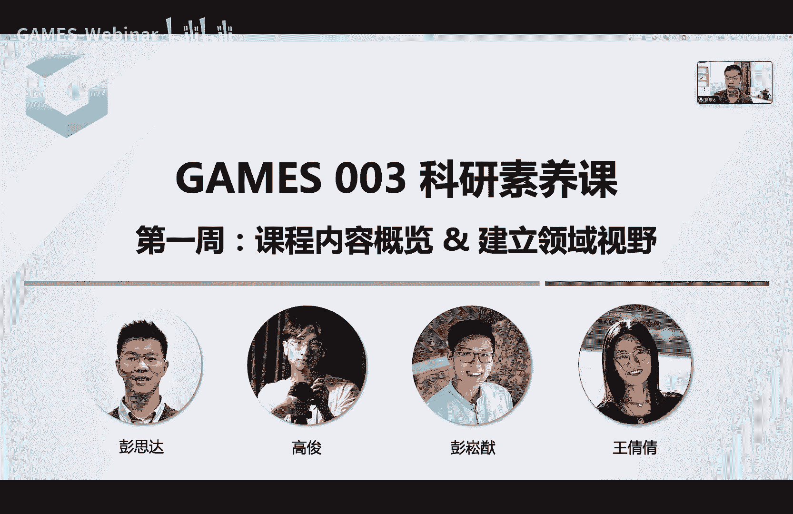
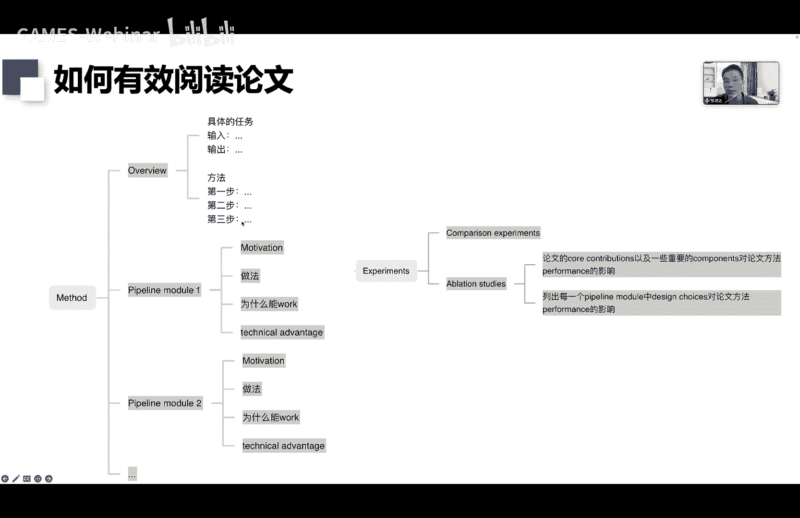
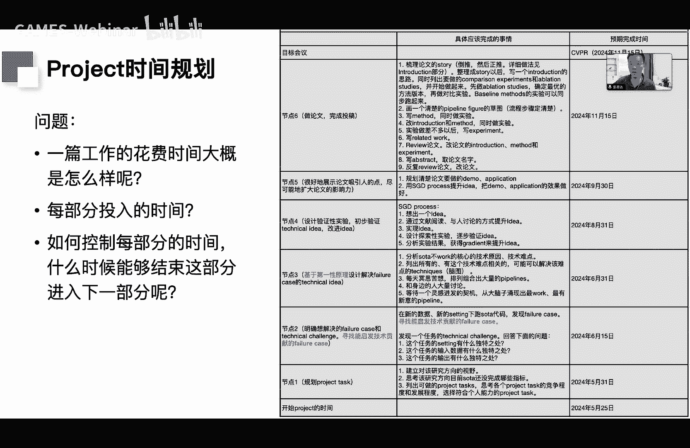
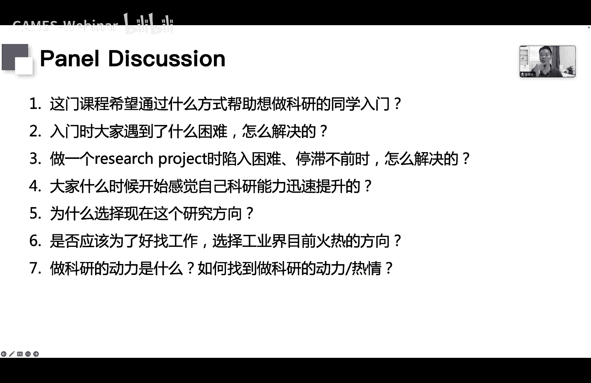
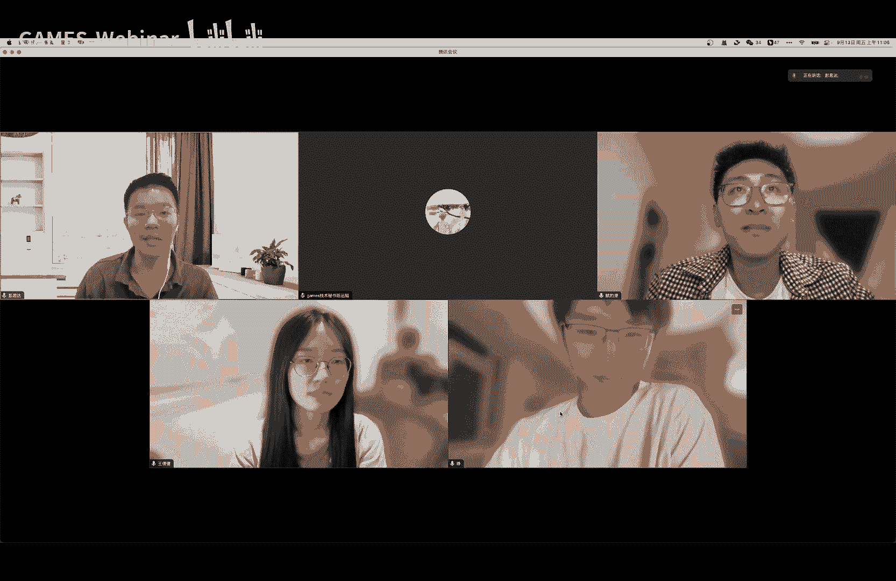
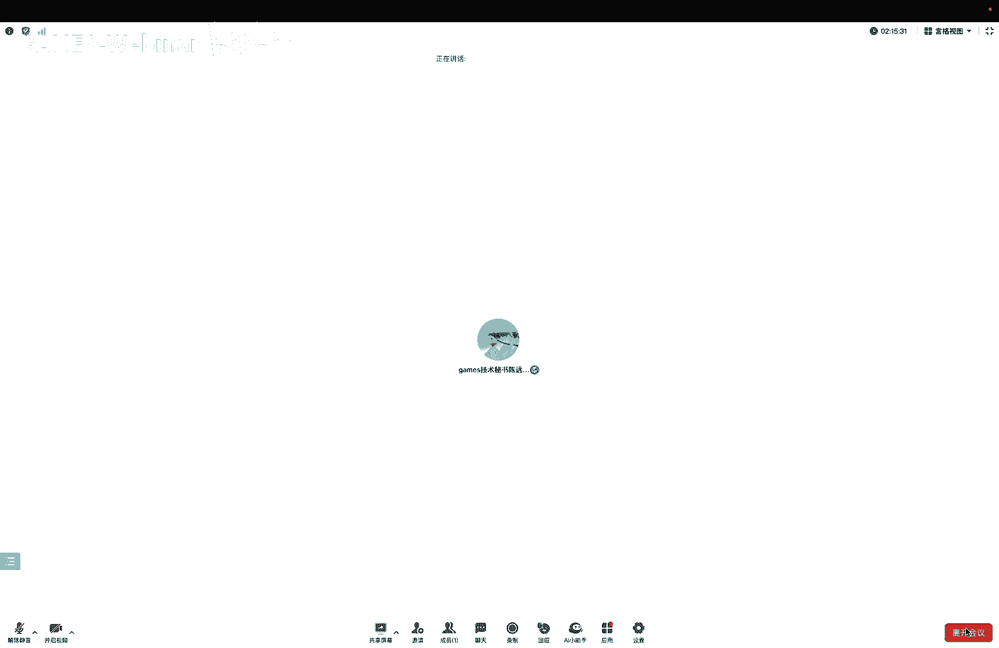

# GAMES003-科研基本素养 - P1：L01-课程内容概览&建立领域视野 🎯

## 课程概述

在本节课中，我们将学习《科研基本素养》这门课程的整体框架，并深入探讨科研入门的第一步：如何建立对一个研究领域的宏观视野。这门课程由四位讲者共同讲授，旨在为低年级或刚入门科研的同学提供一套系统的方法论，帮助大家理解科研流程，克服入门困难，并获得持续的正反馈。

## 课程动机与目标

许多同学在开始科研时，缺乏明确的研究策略，导致过程困难重重，容易因长期碰壁而失去热情。本课程的目标是教授基本的科研方法论，涵盖从选题、设计方法、实验迭代到论文写作与宣传的全流程。我们希望同学们通过学习，能够提升科研能力，并在科研过程中获得快乐和成就感。

## 课程整体安排

本课程内容分为两大部分。

**第一部分：科研流程详解**
我们将逐步拆解一个科研项目从零到一的全过程，并结合案例进行说明。科研流程主要包含以下三大方面：
1.  **初始化科研课题**：建立领域视野、选择具体课题、设计技术方案。
2.  **迭代技术方案**：基于方案设计实验、根据实验结果提升方案。
3.  **论文写作**：规划写作、梳理故事、绘制图表、撰写文字、应对评审。

**第二部分：科研软技能分享**
在课程的最后，我们将分享一些非技术性的重要技能，例如如何做报告、培养有益的研究习惯等。

## 课程预期：能教什么与不能教什么

在开始学习前，明确课程的边界非常重要。

**我们不能教的：**
*   具体领域（如三维重建、图形学）的专有技术与范式。
*   手把手的编程指导或针对特定项目的实验分析。
*   像导师一样逐字逐句修改论文。

**我们能教的：**
*   一个科研项目通用的具体步骤和过程。
*   可执行的方法论指南，例如如何建立领域视野、如何选题、如何设计实验流程、如何撰写论文。

## 如何从本课程中最大程度受益

为了最好地从这门课中受益，建议遵循以下四个步骤：
1.  **学习方法论**：理解科研流程中每一步的核心方法。
2.  **结合经验思考**：根据自身的科研实践，思考并内化这些方法。
3.  **通过实践熟练**：在实际项目中反复运用这些方法，达到熟练程度。
4.  **总结个人方法**：在积累一定经验后，形成适合自己的研究方法论。

接下来，我们将对课程的核心模块进行简要概览。

## 模块一：初始化科研课题

科研的第一步是找到一个好的起点。这包括建立视野、选择课题和设计方案。

### 1. 建立领域视野

**什么是领域视野？**
领域视野是指对你所研究的特定方向（如三维重建、图像生成）的全面理解。它包含两个核心部分：
1.  **技术演变视野**：了解该领域从早期到现在的技术发展脉络，知道有哪些里程碑式的论文和技术范式。
2.  **问题视野**：清楚该领域的终极目标是什么，目前达到了什么水平，还有哪些重要问题未被解决，以及当前的研究热点是什么。

**为什么需要领域视野？**
领域视野是几乎所有科研活动的基础：
*   **选题**：知道哪些问题是值得解决的。
*   **设计方法**：了解现有技术，才能提出有效的创新。
*   **迭代方法**：当实验失败时，能基于领域知识分析原因。
*   **故事梳理与写作**：能清晰地阐述现有工作的不足和自己工作的贡献。

**如何建立领域视野？**
以下是建立视野的基本流程：
*   **识别里程碑论文**：找到领域内引用量高、开创性的论文。
*   **追溯脉络**：了解每篇里程碑论文的前身（它基于什么工作）和后继（哪些工作改进了它）。
*   **深度阅读**：仔细阅读这些论文，理解其解决的问题、流程和核心思想。
*   **梳理技术史**：整理出领域技术演变的轨迹。
*   **预测未来**：基于历史脉络，预测可能的新技术趋势。
*   **梳理问题史**：整理领域内关注问题的变化历程，并预测未来可能的热点问题。

### 2. 选择科研课题

课题选择至关重要，一个好的课题能让后续工作事半功倍。

**什么是好的课题？**
一个好的课题通常具备以下特点：
*   **提升空间大**：当前方法存在明显不足，有改进余地。
*   **竞争程度适中**：不是过于“内卷”的方向，避免陷入同质化竞争。
*   **难度与能力匹配**：任务的挑战性略高于个人当前能力，既能带来成长，又具备可行性。
*   **影响力大**：解决的是领域内公认的重要问题，研究群体关注度高。

**如何找到好课题？**
1.  **建立领域视野**：这是基础。
2.  **列出潜在课题**：基于视野，列出领域内尚未被解决的重要问题。
3.  **评估课题**：判断每个课题的竞争程度、提升空间、与自身能力的匹配度。
4.  **追求影响力**：在可行范围内，选择影响力更大的课题。

**给不同阶段同学的建议：**
*   **初学者**：建议从 **`well-defined task`**（定义清晰的任务）入手，这类任务通常有现成的基准测试和代码，便于上手学习。
*   **高年级学生**：可以挑战 **`ill-defined task`**（定义模糊的任务），这类任务更具探索性和开创性。

### 3. 设计技术方案

选定课题后，需要设计具体的技术方案（`pipeline`）来达到先进的性能。

**为什么需要系统性思路？**
虽然创新看似需要灵感，但遵循一定的流程能更有效地解决问题：
1.  **提高效率**：清晰的思路有助于更快地找到解决方案。
2.  **增强动机**：使方法设计更有目的性，论文故事也更自然。
3.  **保证创新性**：避免设计出创新性不足的方法。
4.  **提升技术洞察**：系统性的分析能加深对问题的理解。

**如何设计方法？**
设计方法可以遵循以下四个基本步骤：
1.  **分析原因（第一性原理）**：深入分析当前最好方法（`SOTA`）效果不佳的根本原因。
2.  **设计方法**：针对分析出的原因，设计新的技术方案。
3.  **判断合理性**：从理论层面审视设计方案的合理性与完备性。
4.  **改进方法**：通过讨论、简单实验等方式初步改进方案。

**设计要点：**
*   确保方法具有足够的**创新性**。
*   争取在 **`pipeline`** 层面提出新范式，而非小修小补。
*   不断自问：这项工作是否为领域带来了新的知识或认知？

## 模块二：迭代技术方案

初步方案往往不成熟，需要通过实验进行迭代优化。

### 1. 设计实验

**什么是实验设计？**
实验设计是规划需要做哪些实验，以验证或改进我们的方法。

**为什么需要设计实验？**
1.  **简化研究**：明确实验目的，让科研过程更清晰。
2.  **提高效率**：降低实验复杂度，提升实验效率。

**如何设计实验？（核心原则）**
核心原则是**减少单个实验中的风险点（探索点）数量**。如果一个实验同时测试多个不确定的改动，失败时将难以定位问题。
*   **分解流程**：将复杂的 `pipeline` 拆解为多个组件，先从可控的模块开始，逐步加入创新性模块。
*   **分解实验设置**：先从简单的数据集或设定开始实验，再逐步增加难度。
*   **优先级排序**：根据重要性对探索点进行排序，优先验证关键部分。

### 2. 通过实验提升方案

**为什么需要改进方法？**
现实情况是，第一次提出的想法往往不奏效，因此需要持续分析改进。

**如何改进方法？**
可以将改进过程视为一个优化问题：
1.  **提出想法**：生成一个初始方案（`idea`）。
2.  **评估/实验**：通过实验获得反馈。
3.  **计算“梯度”**：分析实验结果，找出不理想的原因。
4.  **更新“参数”**：根据分析结论改进方案。

改进的具体途径包括：从文献中学习、与同行讨论、提出技术变体、进行实验并分析结果。

## 模块三：论文写作

论文写作是科研中套路相对清晰的部分。

**论文写作的五个步骤：**
1.  **规划写作**：制定写作时间表。
2.  **梳理故事**：构建论文的核心叙事逻辑。
3.  **论文画图**：绘制清晰、美观的图表。
4.  **文字撰写**：撰写各个部分的文字内容。
5.  **自我评审**：模拟审稿人视角检查论文。

### 1. 写作规划

提前规划写作可以大幅提高投稿成功率并减轻压力。一个推荐的写作流程包含九个步骤，从绘制流程图、梳理故事开始，到逐步完成初稿、实验、反复修改直至定稿。

### 2. 梳理故事

好的论文需要一个吸引人的故事。梳理故事的有效方法是：
*   **先画草图**：绘制方法流程的简单草图，可视化有助于理清思路。
*   **回答问题**：通过回答“贡献是什么”、“有什么好处”、“带来了什么新见解”、“如何引出技术挑战”等问题来构建故事框架。

### 3. 论文画图

精美的图表能提升论文质感与中稿率。
**绘图步骤：**
1.  文字描述 `pipeline`。
2.  绘制简单的流程图草图。
3.  将各个元素（点云、网格等）可视化。
4.  进行配色。
5.  优化整体布局。
**要点**：使用低饱和度、圆润的风格；元素可视化要清晰美观；配色和谐统一。

### 4. 撰写方法部分

在画出 `pipeline` 草图后，撰写方法部分会变得简单。
*   **结构**：每个子章节通常包含三部分：
    1.  **具体设计**：描述该模块如何工作。
    2.  **动机**：为什么需要这个模块。
    3.  **优势**：这个模块带来了什么好处。
*   **描述技巧**：使用“给定输入X，第一步做A，第二步做B，...，得到输出Y”的句式，可以清晰描述模块设计。

### 5. 自我评审

在投稿前进行自我评审，预判审稿人可能提出的问题，并提前修改，可以有效提升中稿率。可以按照一个检查清单逐项审视论文。

## 本节课重点：如何建立领域视野 🧭

现在，我们回到本节课的核心内容：如何建立领域视野。

**什么是领域视野？**
以多视角三维重建为例，一个具备领域视野的专家应该能回答：
*   该领域的技术从2015年到2024年是如何演变的？
*   该方向目前还存在哪些重要问题？

**为什么建立视野？**
拥有视野后，你才能更好地选择课题、设计方法、迭代方案和撰写论文。它让你能站在更高处，预见并引领技术趋势。

**如何建立领域视野？（实践指南）**

**1. 梳理技术发展脉络：创建“时间轴-思维导图”**
这是一个有效的可视化工具，帮助你理清历史。
*   **步骤**：
    1.  初始化一个时间轴（如2015-2024）。
    2.  将阅读过的论文按其发表时间放置在时间轴上。
    3.  区分里程碑论文（开创性工作）和跟进论文（改进性工作）。
    4.  总结每个里程碑论文提出的技术范式，以及跟进论文所做的改进。
*   **示例**：在三维重建领域，时间轴上可能依次出现 `COLMAP`（传统）、`MVSNet`（深度学习早期）、`NeRF`（神经渲染）、`Diffusion Models`（扩散模型应用）等关键节点。

**2. 梳理问题发展脉络**
记录每年该领域的研究热点，并回答以下四个问题：
*   本领域的终极目标是什么？（例如，达到三维扫描仪的效果）
*   目前该领域达到了什么水平？
*   还有哪些重要问题未被解决？
*   现阶段的热点话题是什么？

**3. 有效阅读论文：使用“论文解析树”**
将阅读论文转化为回答问题的过程，提高阅读效率。
*   **摘要**：解析出任务、技术挑战、核心贡献。
*   **引言**：填空式地回答背景、现有工作不足、本文贡献。
*   **方法**：读完能用自己的话复述第一步、第二步、第三步分别做了什么。

**4. 视野的范围**
视野大小应与个人能力阶段相匹配：
*   **初学者**：先建立一个相对具体（`narrow`）的领域视野。
*   **高年级学生/研究者**：应努力扩大视野，寻求更宏观的理解。
视野会随着阅读、交流和思考的深入而自然扩展。

**5. 额外途径**
*   观看领域内资深研究者的讲座（`talk`）。
*   积极与实验室同学、导师及其他研究人员交流。

## 实践作业 📝

为了巩固本节课所学，请完成以下作业：
选择你正在或感兴趣的一个研究方向，尝试整理一份该领域的“时间轴-思维导图”，并回答：在当前时间点，该领域仍有哪几个重要问题未被解决？
请将思维导图和文字总结整理成一份 `PDF` 文档提交。

## 总结

在本节课中，我们一起学习了《科研基本素养》课程的整体框架，并深入探讨了科研起步的关键一步——建立领域视野。我们了解了视野的内涵、重要性，并掌握了一套可操作的方法来梳理技术脉络和问题脉络。记住，广阔的视野是做出优秀科研工作的基石。从完成本次作业开始，迈出你系统化科研训练的第一步吧。

---
*注：以上内容根据课程视频整理，保留了原讲者的核心观点与案例，并按照要求进行了结构化、简化和格式优化。*