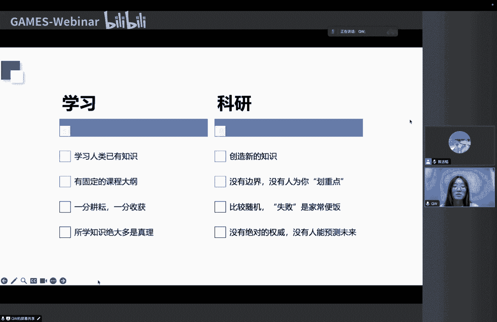
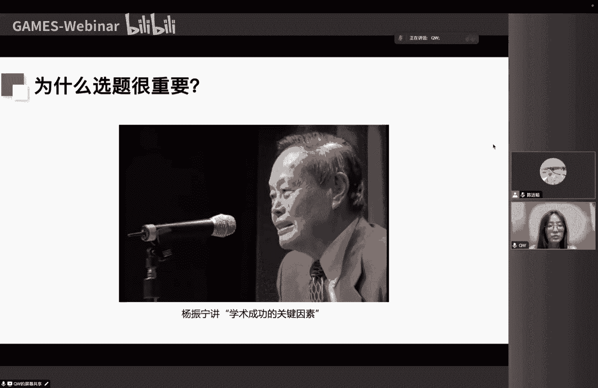
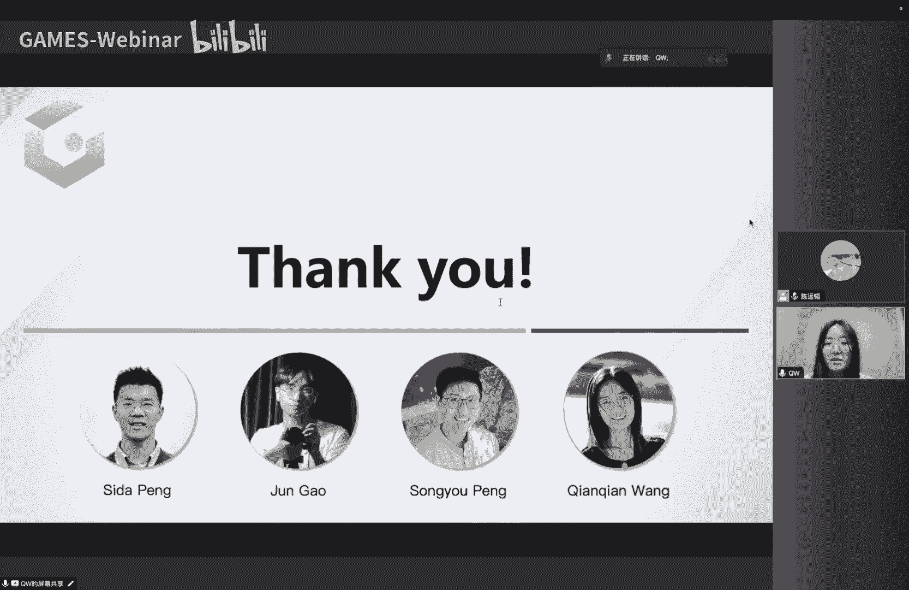

# GAMES003-科研基本素养 - P2：L02-如何选择科研课题 🎯

在本节课中，我们将要学习如何选择一个合适的科研课题。这是科研旅程中至关重要的一步，一个好的开始往往能事半功倍。我们将从理解科研的本质开始，逐步探讨选题的重要性、关键考量因素以及具体的方法论。

## 理解科研：探索知识的边界 🌍

上一节我们介绍了课程背景，本节中我们来看看科研究竟是什么。

科研是一个探索知识和技术边界的过程。我们可以将人类已有的知识想象成一个圆圈。小学、高中、本科的学习让我们在这个圆圈内不断积累知识，形成专长。而硕士、博士阶段的科研训练，则将我们带到了这个知识圈的边缘。在这里，我们专注于一个具体的问题，通过阅读文献和实验，努力推动这个边界向外扩展，形成一个小小的“鼓包”。这个“鼓包”就是你的科研成果，它对你个人而言意义重大，但在整个人类知识体系中可能只是微小的一步。

对于初学者而言，一个常见的误区是难以从“学生思维”切换到“科研思维”。以下是两者的一些关键区别：

*   **目标不同**：学习是掌握人类已有的知识，而科研是创造和发现新知识。
*   **路径不同**：学习有固定的课程大纲和考试范围；科研则没有边界，无人为你划定重点，学什么、研究什么都需要自己决定。
*   **反馈周期不同**：学习通常是“一分耕耘一分收获”，努力能较快地在考试中看到成果；科研周期长且充满随机性，可能在错误的方向上付出巨大努力却得到负面结果。
*   **内容性质不同**：学习的内容大多是经过验证的真理；而科研处于知识前沿，没有绝对权威，需要敢于质疑和批判性思考。

因此，心态的调整至关重要。科研中的“成功”不应仅定义为做出成果，每天学到新知识、加深对问题的理解，本身就是一种进步。

## 选题的重要性：方向大于努力 🧭

理解了科研的本质后，我们来看看为什么选题如此关键。

杨振宁先生曾指出，学术成功最重要的因素往往不是智力或努力程度的悬殊，而在于是否“走进了有发展的领域”。这个道理同样适用于具体的课题选择。在一个正确的方向上努力，其重要性远超过在错误方向上的埋头苦干。选题决定了你整个项目的潜力和最终能产生的影响力。

## 选题的挑战：与不确定性共舞 🎲

既然选题如此重要，为什么它又如此困难？

核心原因在于**不确定性**。在课题开始时，你站在已知的边界去预测未知，未来充满变数。这种未知性会导致多种走向：

1.  根本做不出来，是条死路。
2.  做着做着发现更有希望的新方向，最终成果可能与最初设想不同。
3.  与他人的研究“撞车”，在拥挤的领域面临激烈竞争。
4.  技术范式发生重大变革（例如从GAN转向Diffusion），彻底改变课题的命运。

因此，选题是一个需要与不确定性共舞的“多人游戏”。我们需要建立正确的心态：既要能接受不确定性，知道何时该灵活调整，何时该坚持；也要通过不断学习和加深对问题的理解，来主动降低这种不确定性。

此外，**寻找课题本身就是科研的重要组成部分**，它并非一个单向、线性的过程，而是一个贯穿项目始终、循环往复的环节。你需要不断地在思考、实验、评估之间迭代，优化你的想法。

## 选题的关键考量因素 ⚖️

在具体选择课题时，需要考虑多个因素，且这件事因人而异。你需要结合自身情况（兴趣、背景、阶段、目标）、小环境（导师要求、实验室积累、合作者）和大环境（领域发展阶段、未来潜力）来综合判断。

以下是三个核心的考量因素：

### 1. 个人兴趣与热情 ❤️

兴趣不仅是让你在研究过程中保持开心的因素，更是一种根本的驱动力，它深刻影响着你能否坚持做出成果以及成果的影响力。

*   **如何找到兴趣**：首先需要了解自己擅长什么（编程、数理、动手能力）。其次，可以思考自己喜欢什么风格的问题（注重实用应用、追求新颖有趣、偏爱数学严谨）。广泛的阅读和交流有助于判断。
*   **兴趣的深化**：真正扎实的研究兴趣往往建立在对一个问题进行深入探索并产生深刻理解之后。当你与一个问题产生“连接”，它会持续驱动你去思考。
*   **保持平常心**：没有人能始终保持高昂的研究热情，起起伏伏是常态。重要的是保持**好奇心**和**求知欲**，这样你总能发现有意思的问题。

### 2. 课题的可行性 🔧

可行性决定了课题能否被完成。它受多种因素影响：

*   **研究空间**：新兴领域通常研究空间大；成熟领域则较小。可以自问：针对这个方向，我能想到多少个尚未被尝试的研究角度？
*   **课题难度**：这里的难度通常指相比现有工作，做出显著改进或发现新角度的难度。成熟领域或已被全面探索的角度，难度会更高。**难度是可以调整的**，例如通过简化问题设定或调整目标以发挥方法优势。
*   **竞争程度**：越受关注或越容易想到的问题，竞争越激烈。通常应避免红海，除非你有独特角度或特殊优势（如相关背景深厚、执行速度快）。
*   **个人与资源**：
    *   **个人基础**：编程能力、数理基础、对领域的了解程度、对科研流程的把握能力。
    *   **资源与支持**：能否获得足够的指导（尤其对初学者至关重要）、计算资源、数据集、反馈速度、项目时长是否匹配个人安排。
    *   **灵活性**：当初始想法不奏效时，是否容易调整目标或回收已有成果。

**给初学者的建议**：初期应以培养科研技能、建立信心为目标，选择门槛低、难度适中、风险低的课题。例如，深入复现并改进一篇代码维护良好的优秀论文。对于有经验者，可以选择深挖一个方向的难点，或适当探索新方向以融合不同领域的见解。

### 3. 课题的影响力 🌟

影响力决定了工作完成后的关注度。一个粗略的公式是：

**影响力 ≈ 领域总体关注度 × 工作的显著程度**

*   **领域关注度**：越重要、越普适（General）、越热门的问题，关注度越高。例如，**对应关系（Correspondence）**、**单目深度估计**等都是经典的重要问题。相反，过于小众或设定具体的问题受众较小。
*   **扩大影响力的方法**：
    *   **根本在于提升工作质量**。
    *   **更好地呈现工作**：清晰的论文写作、及时开源代码、制作精良的项目主页（突出优势和可视化结果）。
*   **影响力的形式**：除了“有用”，**“特别”** 也能给人留下深刻印象，从而产生影响力。

## 选题的具体流程与方法 🔄

上一节我们分析了选题的各个因素，本节中我们来看看具体的实践流程。

### 第一步：建立领域认知与想点子（Ideation）

首先，你需要对目标领域建立基本认知，整理其发展脉络（关键论文、联系、阶段性核心问题）。寻找课题是一个“想点子（Ideation）”和“评估点子”循环往复的过程。

**想点子的方法主要有三种：**

1.  **通过阅读**：
    *   带着问题读：这篇工作的**不足**（改进机会）和**优点**（开启的新可能性）分别是什么？
    *   不要完全相信论文结论，需交叉验证。
    *   广泛阅读，进行横向比较，识别未解决或做得不好的地方。
    *   阅读经典旧文章。对于经典问题，旧文中常有深刻见解。（“历史不会重演，但会押韵。”）
    *   *案例1*：想研究长时序稠密跟踪，阅读18年前的《Particle Video》论文获得核心启发。
    *   *案例2*：在研究过程中，通过阅读《LoFTR》论文，发现了解决技术难点（互注意力机制）的关键工具。

2.  **通过交流**：
    *   与志同道合、技能互补的同学讨论。
    *   与导师或资深研究者交流，获取宏观视野。
    *   甚至午餐时的随意闲聊也可能激发灵感。

3.  **通过实践**：
    *   动手跑代码，深入理解方法机理，从而发现其不足并构思改进方案。
    *   有两种模式：**目标驱动型**（拿着钉子找锤子）和**想法驱动型**（拿着锤子找钉子）。最佳状态是在两者间找到匹配点。

### 第二步：评估与筛选点子

有了多个点子后，需要评估筛选。评估标准主要包括**新颖性（Novelty）**、**可行性**和**影响力**。

**关于新颖性（Novelty）：**
这是一个主观性较强的概念。一些判断角度包括：
*   **惊喜度**：是否让人耳目一新、意想不到？
*   **简洁与有效**：简单而有效的组合往往潜力巨大。
*   **合理性**：看完后是否觉得“问题本就该这么解决”？
*   **增量贡献**：是否为领域带来了新的信息、知识或技术？
*   所有工作都可视为“A+B”，新颖性在于这个组合是否是解决特定问题最自然、最必然的方案，并且其结果具有一定不可预测性。

**如何培养研究品位：**
*   **对标学习**：记录你的想法，请尊敬的导师评分（1-10），反思差异。
*   **建立直觉**：关注你想到过的点子最终被他人实现的结果，与你的预期对比，训练预测模型。
*   **采访他人**：了解他人的研究品位、选题理由和长远愿景。
*   **批判性反思**：反思自己及周围环境的研究品位是否存在偏差。

**评估的具体操作：**
*   **通过阅读/交流**：判断问题是否被做过、有无成功先例。
*   **通过实践**：设计最简单实验验证核心想法。
*   **设想影响力**：如果所有难点都解决，最终效果是否足够惊艳？

### 执行策略与常见问题

**执行策略：**
*   **多线程探索**：同时初步尝试多个点子，再选最有希望的深入。
*   **单点深入迭代**：选定一个有空间的方向，在其中根据反馈不断调整和提升点子。后者更常见。

**何时应该放弃一个点子？**
*   **存在硬伤时**：核心卖点已被他人发表；核心实验验证失败；贡献度明显达不到目标会议/期刊标准。
*   **陷入瓶颈时**（建议不要轻易放弃）：
    1.  尝试所有能想到的解决方案。
    2.  总结失败原因，判断是否致命。
    3.  跳出来，从宏观角度重构问题。
    4.  若因缺乏关键工具而卡住，可暂时搁置但保持关注，待工具出现时快速结合。

**初学者常见错误：**
*   **对领域了解不足**：在明显落后的方向上浪费时间。**解决方案**：多读、多问、多了解。
*   **轻易放弃已有积累**：在深入探索后放弃，转而做完全不相关的项目，浪费了积累的见解和技能。**解决方案**：尽可能对原项目进行重构，或转向能利用已有积累的相关项目。

**实用建议：维护一个“点子文档”**，记录所有想法、理由、做法和潜在好处。这有助于理清思路、比较点子、甚至融合产生新想法。

## 问答与案例分享 💬

以下是针对一些常见问题的解答和讲者的个人经历分享。

**问：如何确定大方向后，关注该领域的顶尖学者和团队？**
*   **方法**：看引用量、开源代码、性能排行榜；关注社交媒体、学术会议上的讨论。
*   **注意**：不要迷信“大牛强组”。在新兴领域，大家的起点可能差不多。更重要的是**判断工作本身的质量**。

**问：如何跟上层出不穷的新技术？**
*   **策略**：有的放矢。如果新技术与你的长期目标相关，就深入跟进；否则，保持基本了解即可。
*   **另一种策略**：与掌握该新技术的最强研究者合作，快速学习。但这需要权衡个人在合作中的可见度。

**问：你的CVPR最佳学生论文是如何选题和完成的？**
*   **动机来源**：源于之前工作中遇到的真实难点（运动估计）。
*   **调整过程**：最初目标（4D重建）太难，于是**简化问题**，放弃分解相机与场景运动，只保证2D投影正确性。
*   **艰难时期**：大半年时间效果很差，不断自我质疑，但直觉觉得“这个问题不应该这么难”，凭执念坚持。
*   **突破**：了解到关键工具（相关体积、稠密关联），效果有了基础，建立信心。
*   **打磨**：后期花大量精力在可视化、交互演示上，追求最佳呈现效果。

**问：第一篇论文课题如何选定？**
*   **讲者经历**：本科第一篇论文由导师给定方向；博士第一篇论文大方向由导师定，但具体点子需自己大量阅读、实验后打磨出来。

**问：刚入门的研究生如何上手？**
*   **建议**：从一篇优秀、代码维护好的论文出发，复现并尝试改进；或寻找有经验的合作者/导师带领。

**问：实验过程中发现做不动，能否调整目标？**
*   **回答**：当然可以，并且这很常见。讲者在CVPR工作中就经历了从“4D重建”到“2D运动估计”的目标调整和简化。

## 总结 📝

本节课中我们一起学习了如何选择科研课题。我们首先理解了科研是探索知识边界的过程，并区分了科研与学习思维的不同。我们强调了选题的重要性，指出方向往往大于努力。接着，我们深入探讨了选题面临的挑战——不确定性，并给出了应对心态。

课程的核心部分详细分析了选题的三个关键因素：**个人兴趣**（根本驱动力）、**可行性**（决定能否完成）和**影响力**（决定关注度）。我们提供了评估这些因素的具体思路。

最后，我们梳理了选题的具体流程：从建立领域认知开始，通过**阅读、交流、实践**来产生点子，然后从**新颖性、可行性、影响力**角度评估筛选点子。我们还讨论了执行策略、何时放弃、常见错误及实用建议。

记住，寻找课题本身就是科研，是一个需要耐心、不断迭代和调整的过程。希望本课能为你开启科研之路提供清晰的指引。