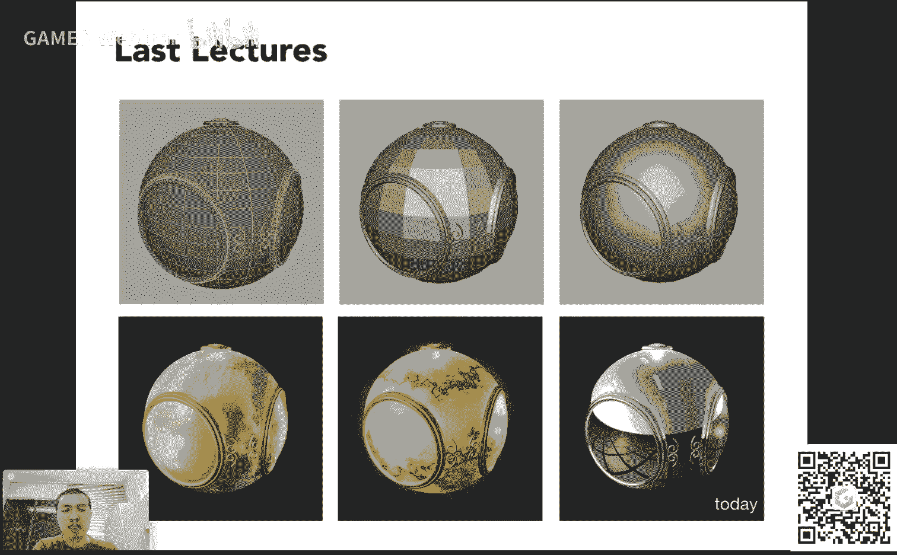
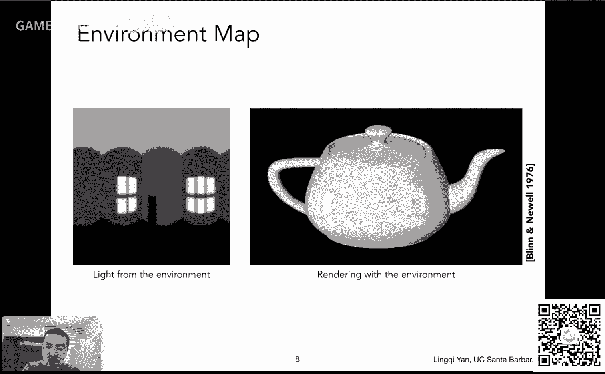
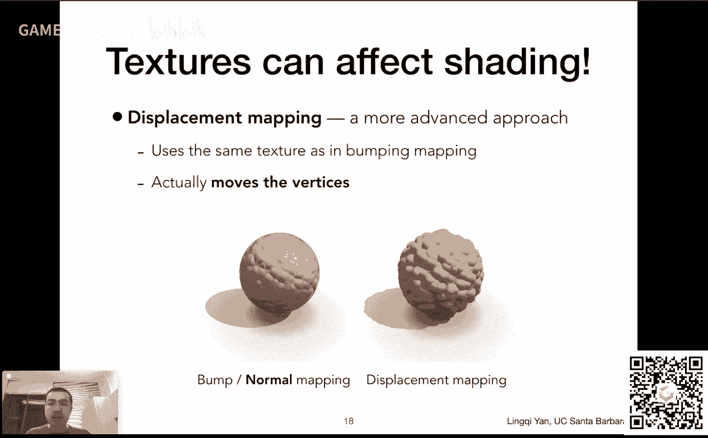
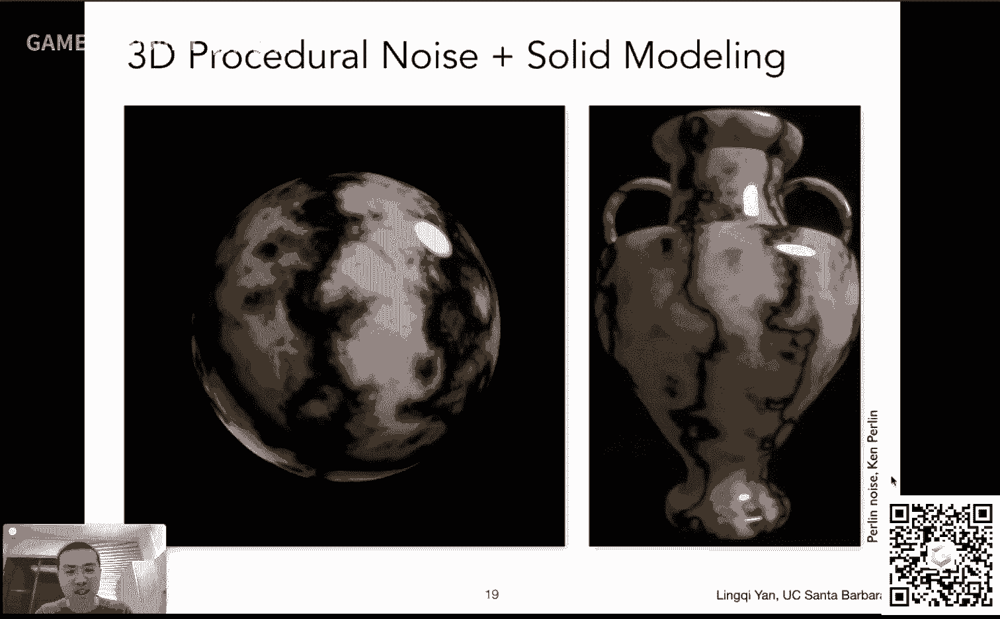
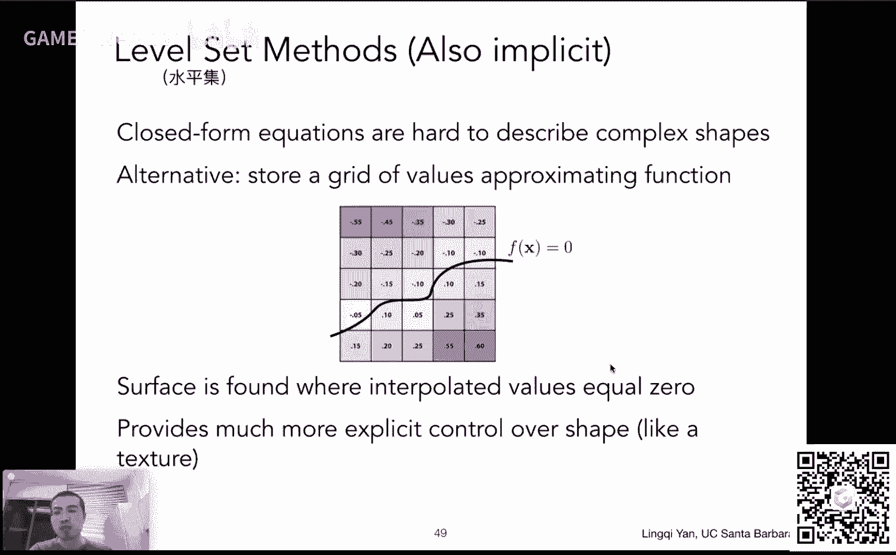
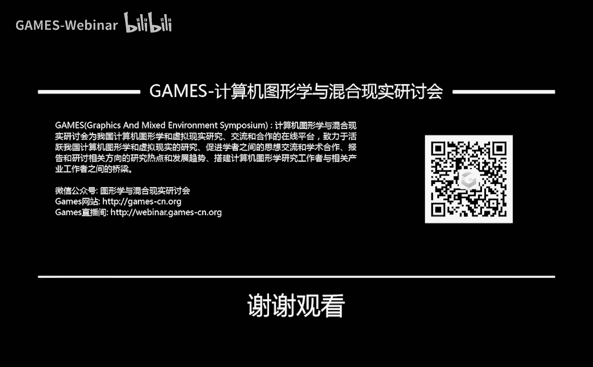

# GAMES101-现代计算机图形学入门-闫令琪 - P10：Lecture 10 Geometry 1 (Introduction) - GAMES-Webinar - BV1X7411F744

感谢大家一如既往的支持，咱们今天啊这开始说这个第十节课，大家知道这意味着什么吗，这意味着说完这门，说完今天的课程，咱们这门课就过半了哈，然后正常这个我们安排的这个课是20个课时。

然后呃也许吧可能加个一节或者干什么，大概是这么安排啊，然后这个目前进展一切顺利，然后不知道大家作业做的怎么样啊，这个呃行，那咱们这个继续开始啊，一半了不容易啊，再坚持下去呃，可以嗯，大家可以看到啊。

今天咱们要说一个新话题，这个几何对吧，然后几何也会花个几讲，来来来去说这个事情嗯，然后呢这个嗯大家从这个下面四幅图啊，不知道大家注意这个事情没有，一直都有这四幅图。

这四幅图呢其实就是说我们这个课呃主要给大家说的这个事情啊，就是第一个就是左边这个左下角这幅图啊，不是我那个两个车子那个呃是说这个光栅化成像这么一个事情，然后第二个呢我们说几何这里的几何的例子是一个蝴蝶。

大家可以看到是一个用曲线来表示的一个蝴蝶，然后这块是要着重给大家说的嗯，三维的，然后第三个部分我们就会这个回到这个图像的生成来来来说，然后这个是说一些关于这个光线追踪路径。

追踪一些这个这个现代化的一些这个生成图像的方法，然后我们要和光栅化方法做比较，然后最后一块咱们来说这个这个呃这个动画与模拟啊，然后大概就是这么这么些内容，那么今天咱们来说几何嗯，在这个之前呢。

这个呃还是有一些事情，关于这个课程内容啊，一个是我们今天啊先把这个上一次没说完的一部分文理的应用说完，这是一个，然后呢嗯就是说我们提到的一些稍微高级一点的话题，比如说说这个如何生生成阴影。

如何这个做这个简单的呃，就是说近似的这个啊动态的全局光照，在这个实时渲染的这个这个框架里面，咱们就把它放在这个嗯，之后说光线追踪的时候，那个时候一块给大家提啊。

然后这节课这门课呢其实目前来说进度一切顺利，其实比我们的这个英文课的版本要快了一节课了已经，所以说我们其实有时间说啊，大家不急，我们先把这个基本内容先给往下说。

然后大家就会发现这个这这一块儿呢这个和这个光栅化就是几何呀，和光栅化和这个后面的光线追踪都有关系行，那咱们继续进展，那课程之前还是一如既往做一个这个这个一些这个这个呃，有些事情宣布啊，一个是这个作业三。

作业三呢我们这个助教同学辛苦给大家发布了一个新的这个嗯，做一个框架，然后稍微这个有一些内容稍微改动了一下啊，大家记得看一下，然后在这个在这个bbs里面都可以找得到。

以及bbs里面呢我们加了一个这个呃常问问题啊，就是f a q，然后这个呃这个大家呢做作业的过程中，很有可能会遇到这些问题，让大家看一眼，然后基本上来说可以防止大家这个这个这个就跳跳进同一个坑里面。

就是这个意思好吧，然后这是一个事情，然后呢，我们很高兴，我们这个这个又有两位助教同学加入到我们的队伍里面来啊，分别是与朋同学和郭文轩同学，然后分别来自这个北航和这个浙大，然后大家可以看到他们的联系方式。

然后如果在就有有问题的话之后，欢迎去这个麻烦两位助教啊，行没问题，那咱们这个继续好啊，今天呢啊是这么回事，今天的网络刚才我们测试的时候就不是特别好，然后这个如果有这个电音的话，问题不大，为什么呢。

我这边自己也在录音，然后在这个课程结束之后，然后我们把它给拼成视频的时候，然后会用我这边的录音，所以说呃不要紧啊，好吧嗯行，那么咱们回顾一下之前咱们一直在说着色对吧。

咱们花了两节课着色时间来说这个着色模型，一个特定的这个b林凤呃模型，然后呢我们又提到说这个在什么地方做着色，然后计算机的硬件如何做着色，以及我们着重提了一下这个关于这个呃这个纹理映射的事情对吧。

用纹理来定义这个主点的一些属性，然后呢我们这个呃上节课又给大家说这个怎么样做差值，比如说我们定义了一个三角形的属性，然后在三个顶点上定义的属性，那么在三角形内部任何一个点我们应该怎么样去做啊。

我们要用重心坐标对吧，然后呢我们就提到说这个纹理贴在表面上可不是这么简单，我们贴了两件事情，第一纹理太小怎么办，我们要放大，要做差值对吧，然后如果纹理太大，反而会出现另外的问题，我们需要做范围查询。

而一个很不错的结构能帮我们做近似的方形的快速的范围查询，就是mmap相当于给一个这个呃纹理，然后我可以生成很多个小的这些纹理，然后这个从而得到一个类似图像金字塔的东西，对啊有同学提到一些具体的问题。

比如说这个呃纹理呢，如果如果纹理这个它的大小它并不是二的n次方，这个要怎么办，对有一些这些这些特定的这些方法，就是说就是说嗯到了一定程度之后，然后他就开始会出现一些近似的事情对吧。

比如说你这个就是3x3，你再缩小一倍，这到底是1x1还是2x2对吧，这涉及到具体问题，咱们这上这个课上我们就不再说了，嗯这个更关注一些理论上它就可行的事情，就是二的多少次方的边长，好吧啊。

那今天呢我们接着这个话题，把这个文理这块给说完，这样的话着色就可以这个暂告一段落好吗，然后咱们再拿到这个高级的部分再去给大家说，那么根据前几节课我们知道给一个网格好，然后呢这个呃我们可以做这个着色。

我们可以做这个flat shedding，然后一个这个这个呃格子我们做一个shading，然后就会得到这种格子状的效果对吧，我们也可以做一个很好的shading，比如说我们在这个呃格子顶点上。

然后这个得到他们的发现，然后在这个呃中间做差值对吧，然后然后然后在每一个像素去做一个协定，就可以得到缝隙里，然后我们可以在这个协定的基础上呢，在上面贴个图。

然后贴个图可以看到这个各种各样不同的这个呃带有不同的，带有这个shading的，但是呢在任何一个点它的颜色又不一样的呃这么一种表现对吧，呃这个然后我们当然可以用各种各样不同的图对吧。

然后这个是纹理映射的部分，那么今天我们能够给大家说的一个事情是这么一个事情，这是什么呢，大家看到这个球它其实在反射，对不对，它反射出来一个类似于一个这个天空和一个地面的一个这么一个结构。

那么它反射出来的东西是什么，我们拿什么东西去表述它对吧。

这里就是给大家说的一个这个今天要说的这个纹理的应用，特别的对于这个例子呢叫做这个环境光照啊，这个很快就会给大家说，然后呢今天我们会进入到第二部分，然后来开始说几何好，那么我们接着刚才的话题啊。

我们要这个这个探讨这个纹理还能有什么其他的应用，首先呢这个我们做一个这个呃这个这个概述吧对吧，所谓文理呢是这么回事，我们之前提到说文理其实就是一张图，没错呃。

然后呢文理本身呢这个呃它可以做各种各样的操作，比如说mmap，我们说的对吧，mmap因为它用的非常广泛，所以现在硬硬件都是可以支持mmap的，那么我们可以理解成什么是纹理，在这个现代的这个gpu里面。

我们可以把纹理理解成就是一块内存，或者说过滤滤波对吧，是一个道理对，然后也就是说我们可以把它理解成有一块区域，我可以做点查询，可以做范围查询，然后可以做的非常快，然后呢这个就非常有用了。

就是说纹理啊完全可以理解成是这个呃一块数据，可以做这个不同类型的查询，然后没有必要把它这个完全限制在一个这个图像上对吧，然后呢这个从这个角度上出发。

这个纹理呢可以表示东西就太多了嗯，比如说啊这里先给大家举一个例子，这就是这个这个环境光照，然后有人管它叫环境光映射或者叫环境贴图啊，都是一回事，叫environment map。

然后environment map是什么意思啊，就是就是这样想，比如说呢大家站在一个比一个一个房间里面吧，然后呢大家这个可以往四面八方看，大家会发现来自四面八方都会有光对吧。

大家可以四面八方都可以看到物体，所以来自四面八方都会有光，然后呢这个这个任何一个方向，不管它是这个直接光照，它是光源也好，还是说它是反射来的光，所以任何一个方向大家都可以看到光。

那如果我把任何一个方向来的光都可以记录下来，诶这就是我们说的这个环境贴图，就是这个意思，或者说环境光照，那什么意思呢，比如大家看左边这幅图，这幅图呢大概就是描述了在一个屋子里面，你要是往四面八方看。

大概会看到什么，大家可以看到这四堵墙，这就是类似一种展开式的这种描述方法，往四面八方看，可以看到有这个门，看到窗户看到什么，这些都可以理解成他们会有光从那个方向进入到人的眼睛。

我们不区分它到底是直接光还是反射光，对吧好，那没问题，那么我们就可以用这幅图拿过去做渲染，做渲染呢我们可以渲染一个这个茶壶，然后这个茶壶呢这个呃这个会被这么一个环境光所照亮。

也就是说它会被任何一个方向的光所照亮，换句话说它可以反射出任何方向来的光，那大家就可以看到诶，这上面反射出了一些这个这个窗户的结构，大家还可以看到有一一对应关系啊，这个是个2x3的这个窗户对应这块。

然后右边呢这个2x2的窗户对应这块，所以说没有问题呃，可以用这个呃，而且大家如果看得清楚这块，其实这个门啊就是就是就是说他也是被反射出来的，没有问题，所以说这个就是说啊。

我可我们可以用呃纹理去描述整个环境光长什么样，然后呢我可以用这个环境光去渲染这个其他的物体，这就比一个点光源要好很多了，当然这个怎么算呢，咱们之后之后再说好吧，然后就是说在纹理可以用来表述环环境光。

那么这里呢我给大家提两个事情，第一是这个茶壶，这个茶壶是有名字的，这个茶壶叫做犹他茶壶叫utah teapot，然后因为这个最早是犹他大学他们来做的一个东西啊。

就是就是说这个在图形学上得到了一个广广泛的应用，然后另外呢这个呃还有一个呃，就是说啊在图形学上有很多这个被广泛应用的经典模型，这是其中一个之后大家很快会接触到。

还有叫做这个stanford bunny和stanford dragon，就是斯坦福的一套这个这个扫描出来的这些这些雕塑啊，就是实际存在的物体扫描出来，变成这个数字化的模型，然后有一个兔子和一个龙。

然后很呃呃这个得到了广泛的应用，还有一个很有用很很很这个经常被用到的一个模型叫做cornell box，是一个康奈尔的一个盒子，然后这个盒子广泛用来被大家这个验证各种全局光照技术。

然后呢这个当然我希望有一天会有一个什么santa barbara，什么什么什么什么对吧，这个非常不错，当然我更希望哪一天会有国内的china什么什么什么对吧，呃这样会比较好啊，那这是一个事儿。

跟大家说一下经典模型，经典的名字也这个犹他茶壶，另外一个呢是说大家用纹理去描述这个环境，光的时候，自然而然有一个假设，什么假设呢，我认为环境光都是来自无限远处，也就是说我直接记录一个不同方向就行了。

我们说来自某个方向的这个光照，那也就是说我不管我自己在哪儿对吧，我不管我在哪儿，然后环境我认为他离我比较远，所以我在我的这个活动范围内啊，我觉得啊从同一个方向来，它的这个这个强度都是一样的。

那如果大家可以想象这个屋子比较小对吧，大家从一个一个这个位置走到另外一个位置，然后即使是这个同一个墙上的同一个点，然后在不同的位置看上去，它的方向就会发生变化对吧。

所以说其实这个光照咱们不能简单的用这个呃方向来定义，咱们这个最好是方向和位置都会有，但是环境光照，或者或者说这个环境贴图这块是假设，我们这个光源是只记录它的方向信息。

也就是认为他们无限远没有什么这个实际的深度意义。

好吧，这个事情说清楚，那么就是这两个事情，那么咱们回到这个这个这个呃应用上来哈，如果咱们可以把这个环境光描述在某一个这个纹理上，哎那就不错，我们就可以用它来渲染一些东西，那么这是另外一个例子。

大家左边啊，这里看到的是一个环境光，这里环境光是怎么看的，大家可以理解，我在一个屋子里面放上一个这个这种金属球，非常光滑的金属球，或者说镜子的球，那这个镜子反射出来的东西可不就是整个的环境光嘛对吧。

也就是说这其实给了我们一种这个呃存储环境光的说法呃，办法什么呢，那就是说我可以把这个环境光就存储在球上，并且我像这个展开一个地球仪的这个这个表面一样，把它展成一个世界地图啊，我可以把它给展开。

也就是说环境光我可以通过这个呃记录在球面上，然后把它放在各个不同的这个方向上呃，有记录一个点，然后我再把这张图给拉开啊。

那么这就是我们要提到的这个这个spherical environment map，就是我我就真的可以把这个不同的这个环境光啊，给这个记录在不同的这个这个呃球面上，那么我就真的假设我有一个镜子的球。

然后或者说我认为有一个这个什么鱼眼形状的这个这个呃摄像机，或者说我可以多拍几张图，把它合成一个什么所谓360度的，什么呃，720度的之类的图啊，就是这个意思就是说我们可以把这个整个环境光记录在球上。

并且把它展开，展开成什么呢，展开成这样的一幅图，那么大家可以看到啊，我当然可以把它展开，但是呢这个大家就会看到这个如果我把环境光记录在球上，然后把它给展开，这里会有一个问题，什么问题，扭曲问题是什么呢。

大家可以看到我说扭曲问题啊，是指上面大家可以看到这些这些这些树木在这个上面这块啊，大家可以看到像像中间扭曲，这个呢大家可以从世界地图上想象出来，为什么呢，因为其实啊大家这个要是看过一些科普文章。

大家会知道欧洲没那么小，南极洲更没那么小，其实都挺大的，然后为什么在世界地图上看起来那么小呢，那就是因为它是一个球面的图，它人人把它展开的时候，它其实对应这个纬度高的地方，它会它会占区域相对较小。

然后呢这块也就是说你这个描述，整个这个这个呃球上不同的位置是做到了，这就是它的一个问题，它会在这个呃这靠近极点的地方会出现一些扭曲的现象，那么怎么办呢，人们就发现发现了一个这个办法来解决它怎么办呢。

那我假设说啊，我还是这个用一个球，原本是用用用用这个球的表面呃的任意一个位置，然后我来记录这个来自任何地方的光线，那我原来记录在球上的任何一个位置，我假设从球星往这个位置连一到线继续往前走。

直到他打到这个这个立方体的表面上诶，那当然是可以的，对不对，也就是说我啊不存不把这些这个这个呃这个光照信息，存在这个球的表面上，而我存在一个立方体的表面上，没有关系，对不对。

然后呢呃也就是说大家会得到呃这个六张图，为什么六张图啊，一个立方体有六个表面，咱们还可以展开看一看，果然是这样，对不对，比如说咱们在这个这个教堂里面，然后呢我可以把这个环境光。

然后给这个记录在一个立方体对应的这个各个各个面上，并且咱们把它展开，这个好理解吧，就是说大家看中间这里，这算是这个前面的一幅图吧，然后呢大家可以把这个上面的这个呃这个呃面向前，左边面向前，后后。

下面面向前，然后呢这个右边的这两个面，这两个在一块的是两个面，然后咱们先把它给这个向前叠，然后再叠一次就可以得到这个面就是背面好吧，这是分别对应这个四个侧面，这里四个侧面，这是正面。

然后右边这幅这个是背面，所以这样一来就可以得到一个完整的这个形状，那没有问题，这样的话就是说立方体呢，所以说它很少有这样的这种扭曲的现象发生，所以说还是不错的，当然那他有他的问题对吧。

就比如说你要是原本有一个方向呃，这个呃你想看，比如说来自某一个方向，我们说sa和fa好吧，然后他这个呃这个方向的光照是多少呢，那咱们原本可以在球上很容易的求出来，现在呢给你任何一个方向，你还得先判断哦。

这个方向我把它记在这个立方体的哪一个面上了，当然肯定行对吧，因为这是一个一对应关系，就任何一个方向你总能找到这个立方体的某一个面，记录了这个方向，当然需要一些额外的计算，但是非常快，然后这就是为什么啊。

这个叫做这个这个方法呢叫做cuba map，就是说我们之前说记在球上叫spherical map，这个叫做cube map，然后就是说这种不同的这个这个方式来描述环境光，但是它们的本质是一样的。

都是为了描述来自不同方向的光照信息啊，然后然后我这里再再强调一遍，就是说这个光照信息不不一定只是这种直接光照，比如说这里直接能看到太阳光，就是说你这个你看到的任何物体。

一定是因为有光线从它到达了你的眼睛，它们反射过来的光同样也是这个来自于这个方向的这个光照信息，没有问题啊，然后那这样一来就是说我们把这个整个的环境都给表示出来了，好那么咱们继续这个这个往后进展啊。

那么文理还可以干什么，那答案是纹理还可以做很多很多很多的事情，比如说有一个非常重要的应用应用叫做凹凸贴图好吧，然后这个凹凸贴图是什么意思呢，就是就是这么一个意思。

就是说呢这个纹理啊谁也没有规定说我只能用它去描述颜色，比如说咱们之前用纹理是为了替换咱们这个这个这个呃，不灵魂模型里面的这个kd这一项，对不对，然后就是为了替换这个漫反射像它的颜色。

然后呢就是说它可以做其他的事情，它可以定义任何不同位置，任何不同的属性，比如说这里我可以定义在一个表面上啊，任意一个点它的高度是多少，什么高度啊，相对高度就是认为啊比如说原本有一个这个基础的表面。

可以这么理解啊，然后呢我认为这个我的纹理可以定义它在这个基础的表面，沿着它的法线方向往上往下各走多少，所以是一个相对的高度，它可以定义这么一个事情，那定义这个事情有什么好处呢，那咱们想这么一个问题啊。

右边大家看到这个类似橘子的东西啊，这是什么呢，原本来说它就是一个球，这个球呢可以用很简单，比如说一两百个三角形来表示，那如果我想这个表示这么复杂的一种一种这个几何啊，就大家看到球上凹凸不平啊。

这些如果都想把它表示出来，那我得用多少个三角形，对不对，但是如果应用凹凸贴图的话，其实我们就可以定义，比如说我们还是定义在这个这个呃三角形的顶点上有这个纹理的坐标。

三角形内部任意一个点都也是有它的纹理坐标，可以查询出来，它的这个相对高度是多少，也就是说我们在不把几何形体变复杂的情况下，我们可以通过应用一个复杂的这个呃纹理，从而定义任何一个点它的相对的高度。

然后大家知道这个相对的高度一变，那这个法线就会发生变化，对不对，然后就是说这个这个法线发生变化，什么会发生变化呢，shading的结果，着色的结果就会发生变化，那人们看到不同的明暗对比。

一定程度上就是因为这个法线发生变化，然后咱们这个产生了这个着色上的明暗对比，我们就认为这儿会有凹凸的东西对，然后也就是说呢，这里其实如果我们这个这个呃用这个所谓啊这个凹凸贴图。

或者说法线贴图这一系列的办法，其实我们在试图这个嗯就是说人为的做一个这个这个假的法线出来，然后在任何任何一个点都可以这个求出一个假的发现，通过这个呃这个纹理映射对吧。

然后呢呃通过这假的发现可以给一个假的着色结果，从而欺骗人的眼睛，然后可以可以做到这个呃让人觉得有这个凹凸的效果，而实际上我们并没有改变这个几何，所以这就是这个凹凸贴图它的这个基本原理。

那刚才我提到凹凸贴图，又提到法线贴图，其实两个是一回事，这个取决于啊这个纹理本身它定义的是什么，比如说大家看这个纹理，这个纹理如果我认为好黑的地方是这个呃零，然后这个这个白的地方是一。

而这这里呢基本上我们就可以认为是这个呃，这个嗯所定义的任何一个点，它沿着这个法线移动的虚拟的移动的一个距离对吧，也就是说它的这个这个相对高度，相对高度在任何一个地方都可以不一样啊，有些地方不改变。

有些地方改变的比较厉害，那这样的话就会引起这个法线的差异，直接定义它的新的法线是什么，这是一个意思，就是说凹凸贴图和法线贴图，以一定程度上来说就是为了改变这个这个任何一个点，它的法线好。

但是这这这这一块啊那行，那咱们这个这个好好说一下这个这个法线贴图到底做了件什么事儿哈，就首先啊我们这个先把这个事情搞清楚，通过法线贴图，我可以定义一个复杂的纹理，但是我并不去改变任何的几何信息。

所以该多少三角形还是多少三角形，然后呢我是把任何一个像素它的法线都做一个扰动，怎么样去扰动它呢，就是说我就是说这个通过定义的这个呃不同位置的高度，然后它临近的这个位置的高度差来重新计算它的法线。

然后就是这么个意思，就是说我们这个纹理定义的是任何一个点，它的这个相对的这个高度的移动，然后然后呢我们就可以通过这个高度的变化来改变这个法线，那咱们看这个例子，首先呢这个黑色的这个这条线。

它其实就是这个原本的这个光滑的物体表面啊，然后呢我们应用了一个这个法线的这个这个这个凹凸贴图，然后凹凸贴图其实告诉了我们，一个相对的这个这个嗯高度应该如何变化，比如说啊咱们找这个点，这个点我们就知道哦。

相对来说这个点应该运动到这里，当然是假的哈，就是正定义一下好，然后对于任何一个点p，它实际上来说会被这个呃会被这个凹凸贴图认为啊，你这点变成了这里，那么这个点在这，那通过凹凸贴图我可以看出来哦。

它的这个法线应该是朝这儿对吧，是向这个方向，而我们原本预测它它的法线一个光滑的法线呢，它是它这个反向方向向这里，然后就是说通过凹凸贴图，我通过改变它的相对高度，然后改变了它的法线，那就是这么一个意思。

那么现在来说我们如何去真正的计算它这个法线应当如何变化呢，那很简单，咱们看看这个这么一个这个例子大家就知道了，首先呢我们先把这个问题简单化，我们先不考虑说二维的贴图。

然后三维的空间我们考虑啊就是一个这个变化的这么一个一维的函数，好吧，这个呢平常他也是有名字的，叫做flatland case，然后对应另外一边叫three deca好吧。

然后flatland呢就是这个意思，假设任何一个点原本呢它是一个平面，原本是平面，我们现在画的这个蓝色的这个波浪线，是是由这个凹凸贴图定义出来的啊，原本说这个几何这个平面，那么法线是向上的。

所以原本的法线在p点，它的反舰是零一没问题，然后呢如果我定义了一个凹凸贴图，那么我在任何一个点处，我如何计算它这个这个凹凸贴图给出来的，它这个嗯在任何一个点，它的梯度。

或者说它的这个这个函数的导数就是这里，就是说如果我站在某一个地方，然后我向右移动一个单位距离，那么向上会移动多少距离，就是这么一个意思，也就是说这这个这条曲线上的任何一个切线应当如何计算。

大家都知道切线的计算正常情况下就是一个导数问题对吧，用这个呃，用这个呃相邻两个点它的高度差对吧，然后这个点点p然后它的下一个点是p加一，然后他们两个的高度差，然后除以这个间隔就是一。

然后当然我们这里引入某一个这个呃常数，然后用来这个定义说这个凹凸贴图影响到底大不大啊，这个没问题，就是做一个简单的这个呃缩放而已好，然后我们用的方法就是一个差分方法，很简单。

这个这个是求这个近似的切线的办法，取邻近的两个点一减就知道了，对吧好，那么我们我们用这种方法得到切线，但是呢我们想要的是法线，对不对，然后就是说如何从切线变到法线呢。

那么这里我们可以从这个例子上可以很容易地看出来哦，法线其实就是垂直于切线的一个一一个一个方向，那切线我们求出来这个这块儿我们用一个向量来表示它吧，是什么呢，这个我们刚才说啊。

这个导数的定义就是水平方向移动一个距离，竖直方向移动多少，那竖直方向移动dp我知道怎么做，那么对应这个切线，它的向量就是一逗号dp，就这么一个一个向量，那么我们如何从切线变到法线，很简单。

把切线逆时针旋转90度，那就是法线，因为法线要跟它垂直，那么这个一dp逆时针旋转90度，大家记得旋转公式吗，超级简单，直接把这个特别是90度啊，很简单，x y兑换，并且把y加上个符号。

也就是说这个法线立刻我就可以求出来是负dp 1，当然记得大家最后要把它给这个这个这个作为归一化，因为它的长度一定得是一，才能是一个这个法线，那就没问题了，那么这个思路就在这儿了哈。

我们用这个凹凸贴图去定义切线，然后呢我通过切线算法线没问题，那在这个在这个呃flatland或者说一维的情况下是这么做，那么在实际的情况下，咱们有个两维的贴图，有个两位的贴图，在任何一个点。

原本啊咱们假设它的这个法线是001呃，那咱们现在就是要看这个贴图如何去影响他这个这个这个点的，这个呃法线，那么同样道理，我们仍然可以求出来它的这个呃梯度，然后什么梯度呢，也就是说在这个点呢。

如果在呃我我这个呃纹理水平方向上运动一个呃格子的时候，就是说我原本的水平，假设这个点它的这个纹理坐标是u v那么如果它变成了u加1v对吧，然后这种情况下，然后呃我应该会得出一个什么样的缺陷。

就是相当于它有两个方向的切线，就是纹理上不是有u和v吗，两个不同的方向，然后u变化一个单位，然后这里这个点应当如何变化，就是这么个意思，同样道理我们也可以做v变化一个单位。

然后这个点应当如何如何变化对吧，然后然后就是说这两个呢，就是这个嗯这个当前的点p对于这个u和v两个不同的方向的变换，求出来的导数，那么这样的话我们就可以把这个呃切线方向写出来对吧。

然后然后同样道理我们也可以这个切线算出来之后，然后再算倒算这个法线旋转90度，那么咱们这里这个直接简化这个过程啊，就是说这个过程虽然没有推导，但这个过程是大家常用的一个做法。

就是相当于是你在任何一个点求出来它的这个呃不同方向的导数之后，然后把这些导数这个这个类比于之前的这个flatland的情况，把它写成负的呃，这个倒数一呃，负的导数二和一，这就是三维情况，然后三维情况。

并且把这个法线也给这个嗯归一化变成一个单位向量，然后就是这么个意思，这里呢类比一下中间这块推导相对麻烦一些，然后这块就不给大家说了好吧，然后然后嗯道理就是一样，通过算出来的这个呃这个这个导数。

然后或者说微分对吧，或者说是梯度啊一个道理，然后如何去这个呃计算这个嗯给出来的法线，然后公式大概就是这样，然后这里有一点要给大家指出的事情是说我们这里一直在假设哦。

在这个这个fladland或者一维的情况下啊，这个嗯任何一个点啊，它的这个呃我要考虑它的法线如何变化，我先假设它的法线是向上的，是零和一，那么三维的情况下，假设的法线也是向上的001。

但是实际情况下它发现有可能是往各个不同的方向，对不对，那么这里呢我们就假设一个呃一个事情呃，什么呢，就是说在局部我们都可以定义一个局部的坐标系，我就认为这个局部的法线是这个001。

然后并且它有又有两个这个垂直的分量呃，一呃这个我们管它叫s t吧，然后就是s t和n形成了一个局部的坐标系，然后在这个坐标系里面，大家这个认为发现永远是001，然后在这个坐标系里面。

我们把这个呃这个法线的方向，通过这个纹理映射的办法稍微改一点对吧，然后我们把算出来的这个反弹方向再给重新计算回这个世界坐标里面，这个问题不大哈，这涉及到一个简单的坐标变换这块呢。

呃是在这个在这个作业三的这个呃常见问题里面，我们会给大家这个更详细的来解答这个事情，因为这个事情要说明白的话，这个课上的时间肯定是不够的，那我们现在就是就是简单的把这个思路给大家说一下好吧。

然后但是基本思想就是如此，然后咱们回到刚才的这个这个凹凸贴图，或者说这个法线贴图一个道理，我们要去这个做一个任何一个地任何一个点上都给他一个假的发现，通过用这个呃纹理映射的方式定义它的这个这个返现对吧。

然后通过改变它的高度呃，呃定义它的一个虚拟的一个高度对吧，然后这就是我们的这个呃这个凹凸贴图在做的事情，那么有一个更现代化一点的做法，然后这个做法叫做什么呢，叫叫做位移贴图。

叫displacement map是什么意思呢，首先他们的这个起点是一模一样的，什么呢，就是说凹凸贴图和这个呃这个位移贴图，它们定义都是用一个纹理定义它们的任何一个点。

它应该有的一个相对的高度的这个这个差别，所以他们的输入完全一样，用的完全相同的这个纹理，只不过呢这个位移贴图它实际上会把这个这个不同的这个顶点，三角形面啊，不同的这些顶点给真的做一个位置的移动。

是这个意思，而不是说我们通过这个位置的移动，我们把它换算成这个法线的变化，然后去做一个假的这个这个呃这些这些顶点的移动，实际上它这个在位移贴图里面，他真的去移动了顶点顶点的位置。

然后呢大家就会通过这两个对比图，大家就可以看的很明显，为什么呢，因为凹凸贴图它实际上没有改变任何几何，所以在一个地方会露馅，什么地方呢，就是在它的边缘的地方，这是一，第二是在这个自己的这个几何相对复杂。

会产生自己的阴影，投影到自己的这个情况，然后他会投影到自己上面，而在这边就看不到这个现象，所以说这个实际上没有改变几何，但是通过这种方法欺骗人的眼睛，让人觉得这里面这个法线的变化会有这种这个凹凸的感觉。

这是这个凹凸贴图所做的事情，而位移贴图实际上改变了各个三角形的这个不同的这些呃顶点的位置，那么大家从这个事情上来看啊，首先这个位移贴图显然这个结果要更好，对不对，然后但是他肯定是有代价的。

那么它是什么代价呢，那自然就是说他要求这个呃这个模型啊，它本身的三角形得足够细，为什么呢，因为它改变的是三角形顶点的不同的位置，那如果一个三角形比较大，在三角形内部还有一些需要改变的这些这些位置。

那肯定是，那那他就改变不了了对吧，也就是说如果他需要你的这个这个呃模型，能够跟得上你所定义的这个纹理的变化速度，它得要求你的三角形，它得足够细细到这个三角形的这个这个顶点之间的间隔。

要比你的这个这个纹理定义的这个频率还要高才行啊，那么这里又回到跟之前完全一样的采样的这个情况，对不对，就是说我们希望这个模型能完整的反反应这个纹理所定义的高度变化，那么我就这个采样率就一定得足够高。

那也就是说模型得足够细致，那么这个大家就在想，大家不希望说这个模型无限细致对吧，那我用一个模型超级细致的三角形，非常非常多的，非常非常小的，那当然是可以，这样我就可以应用一个这个位移贴图了，对不对。

但是我不希望这样啊，呃就是说我能不能呃我开始先用一个这个这个稍微粗糙一点的模型，这个三角形少一点，然后呢我应用位移贴图的过程中啊，我来检测一下我是不是应该把这个三角形变得更小，变得更细。

然后如果我需要我把这个三角形拆开，拆成很多小三角形，然后我再继续做位移贴图，是不是就可以了呢，是没问题，这个就是这个嗯这个direct x这是另外一套这个呃图形学的api啊，和open gl是一个类比。

然后当然只能用用在windows上面嗯，direct x提供了一个一个方法叫做动态的这个曲面细分，叫dynamic tillation，说的就是这么个意思啊。

我就是说我我不需要说我一开始先有一个足够细的模型，我根据需要我来做他的做做他的戏份，就是这么一个意思好吧，那这里这个这个说明白啊，好然后啊没问题，那这里就是说我们把这个纹理的这个应用呃。

呃差不多这样就都交代到了，就是这个中间的计算可能会非常麻烦，然后这个呃但原理基本就是这样好。

那么呃和这里就是关于这块啊，然后呢咱们再说纹理还有其他的各种各样的作用，首先这个我们刚才所说的所有的纹理的应用啊，唉它都是二维的纹理呢，我还是把它当图来看，对不对，然后其实啊这个纹理也没有必要。

咱们把它限制在这个二维的一个区域，纹理也可以是三维的，比如说像这里大家可以定义一个三维的纹理，所谓三维的纹理就是这样的，比如说这么有有这么一个球，然后如果你把这个球砍一半，然后你可以看到它内部是什么。

那我们原本说这个这个纹理贴在物体表面的吧，你把它砍掉一半内部你什么也看不见，对不对，就是说这里呢实际上定义了空间中任何一个点它的值，而这里就是说这个这种特殊的纹理，而且更特殊的是对于这种纹理来说。

就是我们定义这种大理石啊，这些纹理他们实际上没有真的生成这个纹理的图，那他们他们做了件什么事情呢，就是说他们定义了一个定义在三维空间中的一个噪声的函数，所以在空间中任何一个点它都有一个解析式。

能够算出这个这个噪声的值是多少，然后这样一来就等于三维空间中有一个噪声，这个噪声呢我可以经过一系列的处理，我可以做二值化，我可以做某些这个这个这个这个这个嗯就是说呃减多少啊，加多少乘多少啊。

这些之后的操作都是可以的，然后我经过一系列的操作之后，我就可以把它变成一些这个我需要的这些这些呃样子，就比如说像这里这个大理石他们的这种裂缝，这些东西就是可以通过这些三维空间中的噪声函数来来来定义它。

而呃特别的这个例子来说啊，这个叫做pinnoise，这个这个三维空间中的这个噪声函数得到了非常非常广泛的应用，然后它可以表示一种比如山脉在任何一个地方，它的起伏高度什么都应该是多少，这都都可以动态的。

这个得到就是说通过这个嗯这个party noise定义一个三维的噪声好吧，然后这是这么个意思，然后呢这个纹理还可以干什么，文理还可以记录一些之前已经算好了的信息，什么呢。

比如说这里大家知道shading怎么算的，对不对，着色在任何一个地方都可以做着色，但目前呢我们还不知道怎么样做阴影对吧，但是事实上来说，如果大家对比这个左边这幅图和右边这幅图，右边这幅图呢。

比如说这个人的眉毛，这个地方，这个眉毛这块它显然眉毛这个本身或者说这块骨头，它会遮挡住这个内部的这个这个眼睛，这个眼圈这块也就是说啊他会投影一部分阴影过来。

然后也就是说我们之前算谁定的时候完全考虑不到这个信息，那如果说我要把这个这块信息给算好，那这块是比较这个费事了，这个这个这个算法当然可以算，然后而且有实时的做法。

这个叫做叫做ambient occlusion，环境光遮蔽是有办法可以算的，然后我们之后这个再给大家说，然后呢，但是这里我们就先放在这儿，简单的给大家提一句。

这部分我们可以计算好了之后写进这个一一张这个纹理的图，然后到时候我们再把纹理给贴上，所以贴上呢这次我们就是把这个相当于乘上了对吧，因为如果可见，那就是一如果不可见，就是零中间就是一个过渡的状态。

然后咱们把这个结果就是说呃着色的结果乘以我计算好了的环境，光遮蔽的这么一个这个这个这个纹理，然后我们就可以得到这么一个结果，那这就非常快了对吧，这样的话就是说我们就可以把很多计算啊拿到这个这个之前去做。

做完了之后，然后我们再再去用它，然后这就是说我们可以用这个纹理去计算一些这个呃，去去记录一些已经计算好了的信息，那所以这个是非常好的对吧，呃从另外一方面也就说明纹理当然不止可以存储颜色对吧。

可以存储各种各样的信息之后，看你如何在这个着色器里去解释它，就是这么个意思。

那么文理呢刚才我们已经提到纹理可以做这个三维的纹理，然后三维的纹理呢，我们这个广泛应用在这个呃这个这个这个体积的渲染里面去，什么叫体渲染呢，就是说我们原本一直在说这个光照模型啊。

各种各样的东西都是只说我们考虑一个表面，而事实上来说，比如说像在这个医学里面，然后大家这个会嗯用比如说核磁共振成像或者c t成像，然后去扫描这个比如说人体的这个组织的某一个某某一块。

然后呢这个返回的信息可以返回一个三维空间中信息，任何一个点上，它的比如说密度啊，然后呢我们就可以这个通过这些信息，然后记录下来，然后拿过去做这个渲染，然后得到一个结果。

关于这个题渲染呢之后我们详细给大家说，就是说这块信息既然存储在空间里，然后我们也把它当成一个纹理，当然它是一个这个呃三维的纹理，所以说这个纹理啊到现在这个概念已经得到了一个广泛的延伸了。

就是这么个意思好，然后呢这个这块讲完，基本上来说着色就已经说完了，然后咱们今天这个正好把这个呃几何的部分正好开个头，今天的内容这个非常非常简单，关于几何这块儿啊，然后这个呃好。

然后嗯我们会先给大家说一说这个一些具体的几何的例子，然后呢再给大家说不同的几何表示方法，那就是今天的这个这个呃大概思路好吧，然后呢嗯咱们从最简单的这些这些几何形体上来看啊。

大家现在看到了一堆这个玻璃的杯子对吧，然后他们其实上面有各种各样不同的这些这个呃曲线对吧，然后这些都是如何去描述的，如何得到这些这些呃不同的几何对吧，这是一这是不同形状的几何。

第二大家可以看这个嗯车子对吧，车子的各个不同的部件，它是一个非常光滑的曲面，关于曲面我们应当如何去定义它，然后就是说我们实际上来说，在生活中，我们离近了，看这个车子这个曲面。

任何一个地方我们可看不到任何三角形，对不对，看不到任何这个平的地方，基本上来说它是一个非常非常光滑的一个一个过渡，那么这就说明这个嗯世界上是真的存在说这种所谓光滑的曲面的，不管我们离多近。

都看不到这种这种这个这个离散的一些现象，那么在几何里面，在图形学里面我们如何去解释描述这些几何的形体对吧，然后这是一些这个相对复杂的一些东西，大家可以看到这个齿轮对吧，这应该是个发动机啊。

这个里面有各种各样不同的这种这种叶片啊，齿轮啊，这种东西这么多，然后这些应当去如何去描述它，然后这个呃各个不同的部件，然后这个嗯大小各不相同，然后位置这种摆放都是怎么样去设计。

这些都是几何里面要研究的一些问题好吧，然后还有一些几何，比如说大家看到这里嗯，这里呢是一个这个衣服对吧，或者说布料这些这些的这个几何形体，这些几何呢很显然它不是一个简单的表面，为什么呢，因为它是透明的。

大家可以看到这里可以看到这个人的胳膊，然后背后这里可以看到这个这个天空对吧，然后也就是说这个这个这些布啊，这些东西它们是什么样的一种几何呢，如果在研究过这些东西怎么支撑的啊，这跟毛衣什么的相似。

就是一堆一堆的线，一根压一根，然后这个这个最后通过它们之间的摩擦力所形成的一个结构，当然它们中间可能会有缝，另外单说一根线是如何形成呢，一根线本来也就不是一个纤维，纤维很细的。

然后一根线本身就是由不同的纤维拧成不同的这个骨，这个古英文中叫做play啊，然后我们说纤维fiber，所以fiber通过扭曲形成poly不同的polite，然后在一块扭曲会形成会形成这个呃thread。

然后这个thread之后会被这个编成各种各样不同的这种形状，所以它是一个分级结构很复杂的，所以说这个这个布料和衣服啊，这块这个嗯关于这块的建模之后，也就简单给大家提一下好吧，然后这当然是一种几何没问题。

然后水滴比如说大家有一滴水滴进了一个111111碗水里面对吧，大家可以看到这样的这个水花四溅的这么一个现象，当然这是模拟的一个部分，就是说如果我们要在图形学中重现这么一个事情啊。

那自然是一个这个模拟问题，我们要模拟说任意一个时刻，他会这个有什么样的力，然后并且下一个时刻应该形成什么样的这种，这种这种水花飞溅的东西对吧，然后呃我们所说的是这个水呢，你滴进去之后。

大家可以看到也会形成一个这种表面，水是有这个表面张力的对吧，然后有一些这些这个水花飞溅出去，有一些还没有还连在一块儿，对本身这些就是相对复杂的几何。

就是说呃这部分如何用这个几何去描述这些事情都会比较复杂，然后呢这个例子就会更复杂，大家可以看到这是一个城市，然后城市这个复杂在哪儿，复杂在它东西多，为什么呢，大家可以看到这只有很多楼对吧。

一个楼里面成百上千个不同的屋，这屋有可能通过某个窗户还能够看得见，然后从这个地方大家可以看到这是好多不同的树，然后离近了之后可以看到树叶，然后第地面上还有这个草地，草地离近了看还会看到这不同的草叶。

很多的就是说这是一个非常非常非常复杂的一些一个这一这种几何，然后这些几何呢就是说在图形学上它的表述自然而然，这个呃就带来两个问题，第一几何我自己怎么存储它，这是一个超级大的一个一个这个这个存储量对吧。

然后第二我就算把它存储下来了之后，我怎么拿去渲染这么大级别的这个这个这个几何的这些量，对不对，然后大家如果之前看过一个第一次，你的动画叫做叫做big hero six，这个不知道中文叫什么来着。

嗯就是就是里面有机器人叫大白那个啊，这个嗯行吧，大家自己讨论吧，就是说这部电影啊它发生在一个城市，一个结合了东西部的城市叫san franciako。

然后当然san fran cisco和tokyo的结合哈，然后这个电影里面就充斥着大量的这种这个整个城市的这种，这种这种远景，然后他们为了做这个这个渲染，然后做了很多这方面的研究。

如何去简化这个几何模型，而是有道理的，离得远的话，我根本看不见这个某一个屋子里面长什么样对吧，然后另外一个就是说如何去利用光线之间连续性，这个之后再给大家说吧好吧。

然后就是说呃复杂的几何会造成非常非常这个这个，这个这个复杂的情况好呃，当然复杂几何在一个在一个很近的距离，大家就可以看得到，比如说看大家看这个狗对吧，然后他的这个这个这个身上的这个毛。

形成了一簇一簇的这种形的这种形状，然后这个当然是非常非常复杂的几何，因为大家看到这里已经绝对不是说他的这个身体表面是一个表面了，它是任何一个这个这一股毛发对吧，他这个都非常复杂，然后如果我们要表述出来。

大家可以看到有一些这种非常非常细小的这些毛发，在这里也可以看得出那些毛发要如何去表示它，它的背上对吧，可以看到有一些这个飞出来的这些毛发，那我们要把它表述成三角形面，那还得了，那得有多少个三角形。

是不是，所以说这个事情呢就非常非常复杂，所以说这里呢嗯对，所以嗯这里大家可以看到，即使是在非常近距离几何也可以无限的复杂，像这样，那么在什么近距离呢，在这种进到这个细胞啊，什么蛋白质啊。

这种呃这种距离上大家都可以看到，会有一些这个这个这个微观的一些几何呀，虽然平常也看不到，但是在显微镜下，比如说大家看这里，我不知道这是什么，假假设这是个细胞，然后上面呢有各种各样病毒，这个这个长条。

这个假设病毒啊，然后这个比如说或者大家看这个新冠的这个病毒的这个这个这个样子，大家也可以看到哦，这么近距离几何都可以这么复杂，那我离远了之后，我看不到这些几何，他们哪里去了对吧。

然后就是说什么时候我应该用什么样不同的这个几何表述方式，而如果说我什么时候用简单的，什么时候用复杂的中间的过渡怎么办，这中间全都是问题，这就是说这个几何呀给大家带来了非常非常多的问题，好没问题。

然后咱们再继续看，比如说二维的这个情况下啊，大家画这些各种各样不同的话，大家可以看到一棵树，单说一棵树，它的几何就非常复杂，它有树根，树干树枝，然后树枝上又生出来小的树枝，树枝上又长出更小的数值。

然后呢本身又可以有这个树叶对吧，所以这些本身都是一个非常非常复杂的一些这个几何的形的这个情况，所以啊几何绝对不是一个容易的事情，绝对不是说所有东西都能拿三角形面都能表示的事情，对吧好。

然后呢这个我们简单的对我们之前所说的，或者说之后要说的这些几何做一个归类，然后我们在图形学里，我们会管这个两个不同的这个这种这种不同的几何，一个呢我们管它叫做这个影视的集合。

就是implicit geometry，然后另外一种管它叫显示的几何叫explicit geometry，然后这些都是什么意思呢，这个很快就会给大家讲，就是说呃我们有不同的方式来表示不同的几何。

就是这么个意思，然后这里呢咱们直接进入到这个后面内容，然后咱们直接给大家举一举例子，什么叫隐视，什么叫显示对吧，那咱们从这个影视的这个几何的表述开始好吧，那影视的是什么意思呢。

影视的表表示实际上是说是可以告诉你，这个你比如说拿了这个这个任何空间中的一个点吧，然后咱们为了表述一个这个几何的一个面吧，这样说，那么我这个影视的几何方法，我不会告诉你这些点具体在哪儿。

我告诉你这些点满足的关系，比如说满足一定特定关系的一些这个点，我认为它都在一个什么样的这个表面上，就是这么一个意思，它是它是把这些点做一个归类，就是这么个意思，咱们举个例子啊，说这个有一个球对吧。

求大家大家都知道，就是单位球，如果写在这个三维空间里面，可以写成一个式子，x平方，y平方和z平方之和等于一对，然后然后这就是一个单位求他说了一个什么事情呢。

说你给了任何xyz我都可以判断它是不是在这个定义的表面上，也就是球面上没错，所以他就是一个球的这个影视表示，那如果求的显示表示呢有很多种不同的方法，咱们之后还会说那一个简单的方法。

就是把这个球给拆成不同三角形面，不同的三角形的位置，我们表示出来不就行了吗，对吧，然后然后这是一个显示的表示，那么隐士表示还是回到刚才的定义上来表示一定的关系，并不给你实际的这些点。

那么这里就是这个这个求，然后另外一个例子啊，就是说把这个概念给推广，就是说我们定义的任何x y z需要满足的关系对吧，满足的关系，那自然就是一个函数了，那比如说大家看这个球这么一个式子。

只要满足这么一个函数，那么我就说这个几何呃，呃这个这个这个点xyz就在这个几何所描述的这个面上，那么我们可以可以把这个一拿到左边去，拿到左边去，变成x平方加y平方加z平方减1=0。

那么对于一个更通用的情况，我定义任何一个函数f，然后它是某个函数，是谁的函数，xyz的任意某一个函数等于零，我只要能找到这样的x y z满足这个条件，我就认为这个点xyz就是我定义的表面上的一个点。

然后我要是能找到所有的点，我就可以把表面画出来，然后比如说这里的例子来看看，红的表示正的，蓝的表示负的，那我定义这个f呢，如果是零，这表示某一种这个这个表面，那么就找到所有的这个零。

然后都把它给这个描述出来啊，这就是我要描述的这样一个这个隐士的几何，没问题好，这个这个它会存在有一些好处，有一些坏处，就是这么个意思，然后呢嗯嗯这个比如说这里大家看到这么一个影视的几何的表示方式。

比如说x y z空间中的某些点，然后这些点满足这么一个关系，我就认为这些点是在这个这个面上了，但是如果我要问这么一个问题，说这哪些点呃会满足这么一个式子，这是一个相对困难的事情，对不对。

然后也很不容易看出来，但是大家看这个例子，这是已经给大家画出来的，它其实是一个圆环哈，大家如果说做一做这个这个这个函数的某些变化，感觉其实可以看得出来，他确实应该是一个圆环，把这个东西变成零对吧。

把自己给拿到右边去，然后这个它是一个圆环的结构，但是从这个式子来说，那太难了，很难看出来它是一个圆环的结构，对不对，也就是说啊如果我想这个这个呃呃说这个整个一个形状它是什么，这是一个非常难的事情。

就是对于隐含的这个表示来说，这个比较困难，但是隐含的这个这个影视的表示啊，它有什么好处，他当然也有好处，比如说他判断任何一个点在不在这个面上啊，这两个上啊，还记得吗。

刚才我们说的问题是这个面它它都有哪些点啊，这个很难，也就是说这面长什么样嘛，对吧，这个很难，但是给你一个点，你判定说这个点在不在这个面上，这是超级容易的一件事情，为什么呢。

因为你只需要把这个点拿进这个函数里面，这不是x y z和这个关系嘛，然后具体给你一个点x y z，你把这x y z带入到这个关系里面，得到一个值后，你发现他是一个呃正的负的或者是零，那如果是零。

它就在表面上，那如果是负的，我们认为在这个这个物体内，然后如果是正的，我们认为它在物体外，也就是说啊，这个隐士的表示很容易让我们判定一个点是不是在这个这个呃物体内，或者外诶，这个很容易。

但是你想把整个的一个这个面上所有的点都给找一遍，这个很难，那么相对的那这个呃图形学上呢，就有另外一种方法叫做叫做显示的这个表表达方法，那所谓显示是什么意思呢，对吧，那自然就是说最简单的理解。

那就是说我有一个这个模型，我们之前所用的三角形面，它就是一个典型的显示表达方法，我把这个面上的这些点，我真的我就表示出来没问题，然后这是一种显示的方法，还有一种显示的方法听起来没那么直观啊。

这个显示的方法叫做这个通过这个参数映射的方法定义的表面，比如说这里啊，大家可以看到呃，如果我定义一个空间u和v上面有任意一个点，然后我用这个坐标uv表示。

并且呢我可以定义任何这个点对uv都会映射到空间中的某一个点，也就是说我这个我可以定义一个函数呃，给你的是uv，然后你输出的是xyz，也就是说你把所有的uv都给走一遍，你就可以找到它对应的所有的xyz。

对于这个例子来说，你把这个uv也就是平面上的所有一个点都看一遍，然后你就会发现他们这个对应到这个呃三维空间中是一个什么形状，对于这个形状叫做马鞍面啊，马鞍面在这个这个几何里面得到这个很大的应用啊。

不是很大应用的，也很喜欢这样一个一个模型，本来又简单，又有一些问题啊，什么问题我可以给大家指一下，这个点上会有一些问题啊，这个啊好没问题，然后咱们回到这个显示的这个这个表示方法来啊。

然后这个显示的表表示方法要么直接给出，这是最简单的，要么通过参数映射的方式给出，这就是这个这个显示的表示方法，那么比如说咱们看这个例子，这个例子呢这个它定义了一个函数，记得啊这个参数映射。

它把这个u和v这两个这个参数映射成了这个空间中实际的一个点，是知道的，y写成这个形式，知道z写成这个形式，也知道为什么我们还管它叫显示，就是这么一个意思啊，就是说呃这样的话呢。

比如说我想知道这个表面它长什么样，那没关系，我刚才说了对吧，它既然是一个映射，我只要能把这个uv上的每一个uv我都测一遍，然后我就可以这个把每一个uv都给都给映射成xyz。

然后我再把这些点都给显示出来啊，当然这里表示的是同样一个模型，还是这个圆环啊，呃所以说这个是一个很有趣的一个一个一个现象好，然后呢也就是说大家还记得吗，刚才影视的表示里面我并不容易发现这个表面上呃。

就是这个表面本身长什么样，或者找到所有的这些点，这个不容易，但是对于显示的表示很容易，对于这里来说啊，特别对于这里，这是我知道这里有稍微有点绕，说我既然写成了这么个公式，为什么还是显示的没问题啊。

就是说我刚才说呃很多方式理解，因为x和y和z它们等于什么都写得清楚，然后另外一点它本身是通过参数映射，把u和v映射到这么一个空间上去，我只要把所有的u和v都找一遍。

我就知道对应的这个呃空间中的这个这个形状它长什么样好吧，然后这就是说为什么这还是显示的，然后为什么它显示这个呃这个形状很容易就是因为这个好，那么什么东西会相应的变难呢，那就是说对于显示的这个表面来说诶。

那那就是说我想判断任何一个点，现在他在不在表面上，或者说这个呃他他这个在表面内还是y这就非常困难了，那比如说像这里给大家一个这个显示的这个公式啊，呃呃没错，显示的公式因为是从uv映射到x y z嘛对吧。

通过映射方式定义的，那么它是显示的表示，然后它是什么，你不知道，通过这个式子来看，你不知道对吧，然后问这个点是不是在里面，你更是无从下手，那么除非什么呢，除非你从这个式子你看出来了哦。

它定义的其实就是一个球，那定义的一个就某个单位球，然后这个单位球呢这个这个任何一个点，那我自然就知道它是什么了，那当然了，那就是说除非你把这个形状给画出来之后，你才能知道它是什么对吧。

也就是说对于显示表面什么变得难了呢，就是这个在里面在外面这个事情变得难了好吧，那所以说有不同的表示方法，为什么要用不同的表示方法呢，在自然大家就已经可以看得到了，为什么呢。

因为这个有一些问题很适合用影视的方法来表示，有一些问题他就适合用显示的方法，所以咱们根据需要来取对吧，好那没问题，咱们总结一下这个几何，到此为止应该已经很难了对吧，我们说了这么多种不同的几何。

然后我又说了这个显示和影视到此为止为止，这个这个我们总结这个目前为止没有什么好的办法，能这个完全的解决几何的问题，我们得根据需要去选。

这就是为什么作为这个呃皮克斯的这个这叫什么senior research scientist，就是说这个嗯资深的这个这个呃科研的科学家，然后然后这个david他就说他这个痛恨这个这个这个面啊。

这个或者说曲面，然后在他这个他没有想到这个东西这么难，这个东西怎么这么难啊，就是这么个意思，然后这个大家可以看到作为这么一个级别的人物，他会这个做出这样的感慨，那当然就说明几何确实很难啊，没问题好啊。

ok那么我们刚才总结的是什么呢，就是说我们根据需要来选择我们到底要用什么样的表示方法对吧，那咱们就可以这个看一看这个到底这个不同的这个表述方法，到底能带给我们什么，那么刚才这个提到我们有这个显示和影视。

然后通过这个公式的这个写法，但是呢这个表述方法呃，对几何的表示方法远远不止这么些，那咱们从这个影视的方法开始，我给大家多介绍几种好吧，这个影视的表示方法还有哪些种。

这个大家可以看到有很多很多很多不同的方法啊。

这里给大家举几个例子，第一呢要给大家说的是这个最最最最简单的，就是也就是说呃最最直接的吧，也就是说刚才给大家已经这个覆盖了一部分了对吧，我们就用这个不同的这个这个呃这个数学公式我就表述它好吧。

数学公式表示它有一个严重的问题，那就是不直观，大家已经完全可以看得出来，非常不直观，因为这个球写的还算是明白，圆环就已经稍微难一点了，右边这是什么，右边这个是什么，这个不知道，但是大家可以看得出来。

x和y和z的关系，他们要满足的一个函数，所以它一定是个隐士的表面，没问题好，那么他这个这个影视的表面，它表示的是什么呢，不知道，直到我看到他我才知道哦，他是一个星星啊对吧。

所以说对于一个新型这么一个简单的这个这个呃几何，我都需要这么复杂的公式去描述它，那当然他不是特别好，但是他这个对于一些简单的情况，他描述的确实非常到位对吧，所以通过这个这个这个算术方法直接表述。

它当然是一个简单方法，咱们直接忽略它好吧，那对于复杂的情况怎么办对吧，对这个奶牛你如何去写出一个这个这个式子去描述它，当然有人这个闲的哈，就是我知道这个这个有人用各种各样的数学公式。

什么matlab去画一些各种各样不同的形状，这个这个做得好，提出鼓励，然后这个我没这么坚持啊，这个这个这个对于这种复杂的模型，我相信大家也可以发现各种各样不同的曲线去描述它啊，然后没问题啊。

但是会很困难，那咱们这个给大家提到一个这个嗯，另外一个事情就是说这个几何这个几何的隐士表示呃，可以不只是这个嗯通过代数方法来来描述什么呢。

这里给大家举了一个例子叫做呃constructive solid geometry，人们管这个东西简称叫c s g，当然这里呢我就不太清楚中文怎么说了，咱们就管它叫csg好吧，所谓csg是什么东西呢。

很简单，它就是说啊通过一系列这个几何的基本几何的基本运算，然后我来定义新的几何，那比如说这里a和b一个圆柱，一个球，它就是基本的几何，那什么叫他们的布尔运算很简单哈。

就是说我们定义比如说aaa和b的并是什么呢，就是这两个放在一块儿啊，然后以这么一个位置放在一块，形成了一个这么一个集合哦，它就是a和b的b，那a和b的交同样道理也可以理解，就是他们公共的部分对吧。

公共的部分如果这个同样对于这种摆放来说，公共的部分就是这块，然后他们的差也可以定义，就是从a中间减去这个b所占据的a的部分，或者同样道理b中间也可以减去a里面的部分，得到另外一块对吧。

就是说我们可以定义这么简单运算，通过这些运算和一些简单的这些这些基础的集合，我们就可以形成一些复杂的集合，什么意思呢，比如说这里这里大家这个看到这么一个一个形状哈，然后大家看这里到底发生了什么。

说白了他就这个就是这么几种，那x y u v w这么几种基本的几何做个什么事情呢，x是一个方块和这个y是个球，先做一个交操作，也就是说这两个的这个交出来的操作，像是一个这么一个像是一个筛子的形状啊。

然后呢对应这边我有两个这个圆柱，我可以把它叠成一个十字架，这是一个病操作，然后我再跟另外一个方向形成一个这个三个方向的这个这个轴啊，然后形成一个这种十字架，然后这两个十字架之后呢。

我把左边这个筛子形状减去十字架形状，是不是就得了一个镂空的筛子的形状对吧，也就是说我可以通过这一系列的方法得到这么一个这个这种基本操作，那这种操作得到了这个非常非常广泛的应用。

所以这个这个这个呃呃这个max maya啊，这个auto c a d啊，各种各样的东西都支持这么一种方法，这个是非常非常常见的操作，然后也就是说呃通过这种方法，我自然可以把简单的几何给变成复杂的几何。

而这种几何我我完全没有说这个这些这个呃不同，他们的点都都都在什么位置对吧，我就说只通过这么一些这个它们之间的相互关系啊，最后我还可以把写真给表达式啊，这个几何是这么一个几何，然后写上这个表达式。

所以它当然是一个这个影视的表示方法，然后咱们再回到他的名字啊，cs g好，然后呢还有一个这个这种表示方法呃，然后呃这里简单给大家说一下吧，好吧，就是说呢这个呃我们管它叫做这个这个这个定义。

一个叫做距离函数的东西，那用这个东西来表述几何，那这是什么意思呢，就是说啊我我这个对于任何一个几何我都不直接去描述它的表面，我去描述任何一个点到这个表面的最近距离，然后这个事情怎么理解，咱们马上再看。

我们先看它的一个例子对吧，然后这里大家可以看到什么呢，看到两个这个球，然后当这两个球这个这个逐渐靠近，逐渐靠近对吧，大家可以看到这个这两个球发生了一个形状上的，所谓的这个这个融合对吧，最后会形成一个球。

特别是中间这个非常有意思，然后他们拓扑结构会发生一些变化对吧，这个事情是怎么做到的，这个事情就是通过对几何的这个这个嗯所谓距离函数做这个呃blend，或者说融合形成了一个一个一个呃结果。

那这是什么意思呢，我们刚才说这个距离函数，我们这里再重新说一下，这个距离函数是指空间中的任何一个点，到你想要表述的这个几何形体上面的任意一个点，它们之间的最小距离啊，这个这个距离又可以是正的或者负的。

如果我认为有一个点在这个物体表面外面好，那那这个点它的这个最小距离算出来之后啊，我加个正号，它是正的，如果有一个点在这个物体内部，那同样也可以算出这个内部的一个点。

它到这个物体的这个表面或者边界上的最小距离，并且我认为这个距离是负的，那我可以这样定义，也就是说我把任何空间中任何一个点都定义出一个值来，然后然后是这么一个意思，那么我把这两个不同的物体啊。

它们两者的这个距离函数都算出来之后，然后我就可以把两个距离函数给做一个不ending，然后也就是融合，然后我们再把它恢复成原来的这个物体，就可以得到这样的一个变化，所以它非常适合做这种这种工作。

这里给大家举一个例子，就是说呃啊这样哈，稍等一下，我先说一个事情，这个这个这个这个好吧，好像没什么办法，我尽快啊，然后这个嗯，好那么咱们现在先看一下这个具体的例子哈。

然后这个例子就是应用这个距离函数的一个例子，大家应该可以看到这两行啊，这个是什么意思呢，大家可以看这个输入和输出是两张不同的图，我们认为它是一个表示某种几何的一个边界哈，假设有一个物体啊。

然后这个挡住了这个你能看到的这些这个视口，整个的左边整个1/3，然后另外有一个物体或者说这个物体经过一些移动之后啊，它挡住了左边的2/3，然后这个嗯我希望把这两个呃运动，或者说这个球出在这个这个物体啊。

它这个从左到右移动的时候的一个中间状态，那么我们来看哈，如果说我们考虑这两个这个不同的图，如果我认为它们就是两个不同的图好吧，然后我要想把它两个融合起来，我做一个简单的线性的这个bland，也就是融合。

那会得到一个什么呢，也就是说左边它覆盖的这个区域啊，还是会被覆盖掉，在这个地方，我会直接把这两张图叠在一块，然后求平均啊，然后我会发现左边这1/3部分他还是会这个挡住的，然后中间这1/3部分呢。

因为a这个图里面啊这个没被挡住，然后b这个中间挡住了，所以他算是一个这个这个ban被挡住这么一个状态吧，然后右边这块自然是谁都没有挡住，那么如果把它作为一张图。

然后把两张图给做一个简单的这个所谓线性的这个bend，然后我可以得到什么呢，我可以讲我我可以得到一个图什么呢，就是左边我可以认为挡住了黑的，右边没挡住白的中间呃不对，中间得到一个是灰的诶。

那我得到这么一个状态了，那也就是说它并不能表述这个这个一种所谓的运动信息，比如说左边这个a这张图这1/3左边是黑的，右边是1/3白的，然后b呢2/3黑的100/3的，那我想要得到什么。

我想要这个得到它一个准确的一个运动的过程，我希望他两个不land之后得到的结果是左边一半是黑的，右边一半是白的对吧，我希望得到这个，但现在不是，我们如果把它理解成两张图，黑白的图。

做一个bl得到一个黑的灰的白的，那怎么办呢，怎么办才能把它做对呢，那就是说我们先求出来这个所谓有效的距离函数，那这里s表示signed啊，我这这里说清楚是因为它有正有负，其实就是这个距离函数一回事啊。

就是a呢我求出一个距离函数了，什么距离函数大家还记得吗，这个比如说我认为这个边界，那这就是物体的一个表面，那我说距离函数是什么意思啊，任何一个点到这个边界的最短距离，那就是说任何一个点往下做垂线呗。

这个对吧，最短距离，那我知道靠近这个这条边，那我得到的距离函数都是值比较小，接近零啊，如果在它右边我认为是正的，在左边认为是负的啊，然后我就可以这个这个靠近它的值呢是比较小的，远离它的值是比较大的。

然后像这里这些值就比较大，所以它是距离函数，是这么一个变化方式哈，我用不同的这个线就是为了表示这么个意思，然后然后这个对于a可以这么做，b也可以这么做，我可以得到在这个附近啊，它有一个接近零的值啊。

然后在这个离他比较近的地方都比较接近零，然后离得远的地方远离零，然后根据它的正负，我们再把它做做出来，那么也就是说我们得到了这两张图，这两张图是一个渐变的颜色啊，就是这么个意思。

然后把这两张图我做一个这个bland的操作，然后我就会立刻得到这个呃，大家都知道，还有这个，比如说像这个位置和这个位置它正好正负性是相反的，然后我这个在正中间的时候不land出来的值一定是一个这个零。

然后左边还是负的，右边还是正的，那么如果我把这个这个东西给恢复成原来的一个一个这个这个呃形状，就是恢复成这个呃，不是sdf，就是通过这个sdf恢复成原本它对应的一个形状。

那么我知道零的地方就应该是是它的这个边界非零的地方，不是，那也就是说我通过blend两个对应的s d f，我就等于是在不烂他们的边界，对不对，在这里我就可以真的不断的出来这么一张图。

我最后得到结果左边是黑的，右边是白的，没有问题，也就是说啊这个s d f非常有有用的对吧，然后就是说这个这个呃正负的这个这个方向我们说清楚呃，在外面在里面这样就可以了，没问题。

那就是说啊这是一个这个这个例子，就是说我们可以对这个所谓距离函数做一个blending，那么现在大家这个这个道理，这呃这个例子就比较好理解了，那么我为什么有这么两个不同的这个这个函数，这个对吧。

就是两个物体，为什么我把他们两个做bend，我可以渐渐地得到这么一个最后的这个结果，道理就在这儿，就说我其实我分别把他们两个对应的距离函数求出来，在这个三维空间对应在这里是个在平面空间内。

任意一个点我都知道它们对应的距离函数，然后把它们不拦起来，再恢复成这个原本的这个面，所谓恢复成原本的面，我说的清楚，就是说这个sdf的值是零的时候呃，那个就是他们的这个面所在的地方，就是这么个意思好。

那么这个距离函数可以做什么，大家就觉得这个可以看到这是一个例子，这一这个例子呢同样也是这个shader toy的这个例子，之前给大家呃看过一个蜗牛，对不对，那个蜗牛他就是用这个距离函数表示的。

就是它没有实际的这个几何形体，它的几何的表示都是隐式的表示，然后呢它这个几何和几何之间如果要做一个这个比较，这个圆滑的一些过渡啊，它中间就是靠这个距离函数把它不烂起来，那距离函数非常厉害。

它可以表示各种各样的东西，大家看到这个瓢虫，可以看到这个这个蘑菇，然后可以看到这个草还是草叶对吧，就是说他这个表示能力非常强的，所以说这个嗯是这个距离函数是一个非常非常有用的东西，好吧，这也就是说啊。

也就是说这个影视的表示可以有很多种，那么我们既然提到了距离函数，我们说啊距离函数blender出来之后得到了一个函数，我最后如何再把它恢复成这个表面呢，很简单。

我就把这个距离函数对应的零的位置全找出来对吧，距离函数如果是fx我认为它等于零好，我就可以把这个这个对应的这个位置呃给找出来，我就知道哦，这个函数等于零的时候啊，那对应的就是物体的表面没问题。

是的对于说我知道这个距离函数的某一些表示方法，那对于一些特定的情况，比如说我把这个这个嗯这个比如说距离函数啊，它不太好写成这个某一种这个解析的形式，就不容易拿式子去写这个sdf没问题。

这个距离函数只要我能够通过某种方法表述出来就可以了，比如说这里大家看到的叫做水平集方法叫level set，他的这个这个想法跟距离函数其实完全一样，仅仅是什么呢。

仅仅是它的函数的表述是写在这个一个格子上的，大家可以看到这个函数在不同的地方有不同的值，然后呢在一个格子上的不同位置，我写好它的这个这个值是多少，我只需要找到那个在中间某一些地方，它的值是零的。

这个这个地方我就可以把这个，这我就可以把整个这个函数所试图描述的这个物体表面给提取出来对，所以道理就在这儿，它的区别和之前的这个距离函数的区别，就无非就是说这个函数本身通过什么形式来表示。

但我要的结果呢还是这个最后的函数等于零，那么大家可以看出来，如果函数等于零呢，得到这条曲线，函数等于0。1得到另外一条曲线，函数等于别的形成另外一条曲线，那这个概念其实早就大家早就在用了。

这个在地理上得到了广泛的应用，这个叫做等高线，对不对，就是说这个东西就是这个这个就是为了描述一个函数，在在在这个不同的位置有个相同的值，特别的就是这里对于水平集来说。

我们关注的是这个函数在什么地方等于零，那当然这里大家之前咱们已经学过双线性差值了对吧，对于这么一个例子来说，很简单，我当然知道这个它在什么地方应该等于零，我们得解得出。

对，没问题好，那么这里就是这个这个水平级水平机，也没有人说一定得定义在在二维上的一个格子，可以定义在三维空间中的格子，而这就和咱们之前说的这个纹理联系上了，如果我们有一个三维的纹理。

表述的是人这个不同位置呃，人体的不同位置，它的这个密度可以这么这么理解，那我从这个三维的信息如何去提取出物体的表面呢，我可以让就是说这个密度这个函数fx他得到了这个密度等于某个密度，比如说五点对吧。

然后我找到所有的这样的这样这个这个位置满足这么一个密度函数，等于相同的密度的诶，我就可以找到一个表面，那这个就是水平级的在三维空间中的一个应用。

当然又和纹理结合在一块，所以这些知识都是这个互相融合贯通的对吧，水花跟水花这个结合在一块了，这种东西我们要如何去描述它，同样道理，这个也可以通过水平集的方式，或者说通过前面的这个距离函数的方式呃。

道理是一样的，我们把这个水滴和水滴就可以这个blend融合在一块对吧。

然后并且提出融合在一块儿之后，它的表面长什么样，没问题，然后呢这个应该差不多了哈，我这还有一点点例子，就是这一个这是什么呢，几何还有一种特殊的描述方法叫做分型，叫fractal。

然后这个分型是什么意思呢，分型是指自相似的意思是什么意思呢，就是说它这个这个就是说自己，然后它的一个部分和它的这个整体长得非常像，然后这个其实和我们计算机科学里面说的递归完全是一个道理哈。

然后这个就比如说大家看雪花啊，大家如果看过科普文章，大家就知道这个雪花呢，但如果你这个放大了看，会看到他的这个这个是六边形，每一条边上其实它又有一些六边形，然后再看这更小的地方，它每条边又有一个六边形。

就是这么个意思，就是他不断在重复，那么这里呢着重给大家说中间这个例子，中间这个东西呢它有名字的，这是一种植物，它是一种这个这个西兰花啊，它是一种西兰花，它有名字叫broccoli，然后这个名字非常奇怪。

然后呢它有一个这个呃呃这个明明显的一个性质啊，什么性质呢，一个一个的这个这个这个格子，如果你放大去看它，它又有好多小的，所以它自己这个自带三形啊，当然对于这个自然界来说，它不可能分行。

到最后他还停不住对吧，也就是说这个它它是这个自然界的一个这个分型的一个例子吧，就是非常有趣的一个例子，这个分型呢这个有不少人研究这个东西，如何去描述这个这个分型的几何，如何去这个这个表示出来。

在图文学上的应用不是特别多，但是这个它会引起很多这种复杂的情况，就比如说咱们说这个romanesco，这呃这个嗯这个这个哦对等一下哈，我这里说的不对哈，对西兰花来说，统称叫做叫做broccoli。

这个这这一种特定的西兰花叫roman nico啊，是这个意思，然后然后就是说对于这个romanesco来说，它最复杂的地方就在于它会引起强烈的这个呃叫什么来着，就是就是就是在渲染的时候会引起强烈的走向。

就是这么个意思，因为它的这个变化频率实在是太高了，所以说这个这种类型的几何对于这个之后的渲染，对于描述来说都是一个非常大的挑战，好吧哦，当然有同学反映这个看上去会有密集恐惧症啊，这个行吧。

不多给大家看这个这个例子了哈，然后我们简单总结一下，今天差不多就可以了，然后这个呃说了什么呢，就是说啊这个影视的函数，它这个通常表述起来都很容易对吧，要么拿一个函数直接来表示。

然后呢要么是通过一些这个并不是特别明显的方式来定义的，比如说我们定义这个这个这个呃这个距离函数的时候对吧，然后就是说正常情况下，它这个都不是说明确的把这个呃，不是这么个意思对吧。

就是这就是为什么它是隐士的，然后它的好处是说他这个通常会写的比较容易，然后写一个公式我就可以描述一个形状，那当然对于存储是非常有利的事情，那么它还支持这个查询到底在里面在外面，咱们刚才已经说了。

判断一下对应的函数在里面，这个小于零还是大于零就可以了，然后呢我们之后会给大家说，引这个嗯，用隐函数描述的这个影视表面，是很容易做这个光线和它的这个嗯求交的，当然对显示的来说也并不难看。

就是说这个呃不管怎么样，咱们之后会给大家说这个事情，比如说这光呃这个平面，或者说这个球如何和光线求教啊，这个意思之后咱们再给大家说，然后呢诶呃呃稍等嗯嗯ok然后这个就是说正常情况下来说。

这个嗯我们想这个严格的描述一种什么样的物体，比如说那种心情在任何一个地方，他应该都有一个正确的这种弧度，用这种这种呃影视的表示方法是非常好的，然后这种呃拓扑结构，其他东西它都是很适合用来描述啊。

当然它的问题咱们这个之前都已经说清楚了，比如刚才说那个奶牛对吧，很难拿一个什么样的这种这种很规则的一种函数去描述它对吧，然后这就是为什么我们需要用到这个显示的表示，然后那这块呢咱们就不再往后说了。

显示的表示其实内容挺少的，咱们就直接这个下节课提一点，然后就可以直接进入到后面的这个呃曲线和曲面这一块的介绍了，好吧，那这就是咱们今天介绍的几何部分的内容，然后总结一下就是呃打纹理的应用说了一说。

然后这个关于凹凸贴图和这个位移贴图这块还需要更多的知识，这里面我们先强调一下，就是这里面如果要实现这个作业的话，还需要好好参考一下我们的这个呃常见问题，呃好吧，这是这个。

然后呢我们关于这个几何这一块儿啊，说了各种各样不同的几何，说了影视和显示，然后我们又说了这个影视的这个各种各样不同的表示方法，特别的说了一下距离函数对吧好，那咱们今天这个就说到这吧好吧。

然后这个这个这个啊好。

那咱们把这个时间呃教会给技术秘书同学啊。

