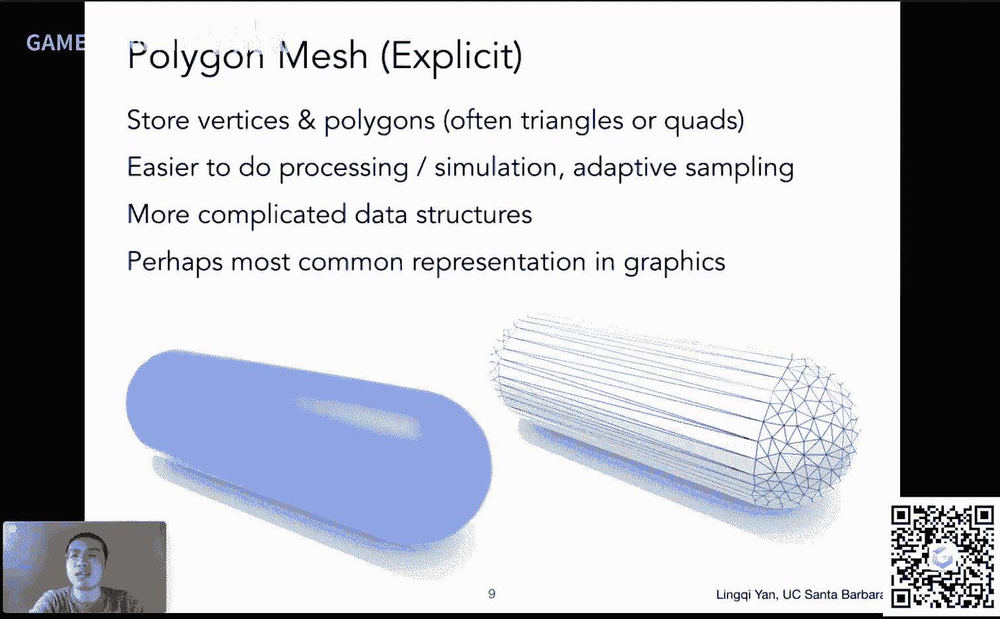
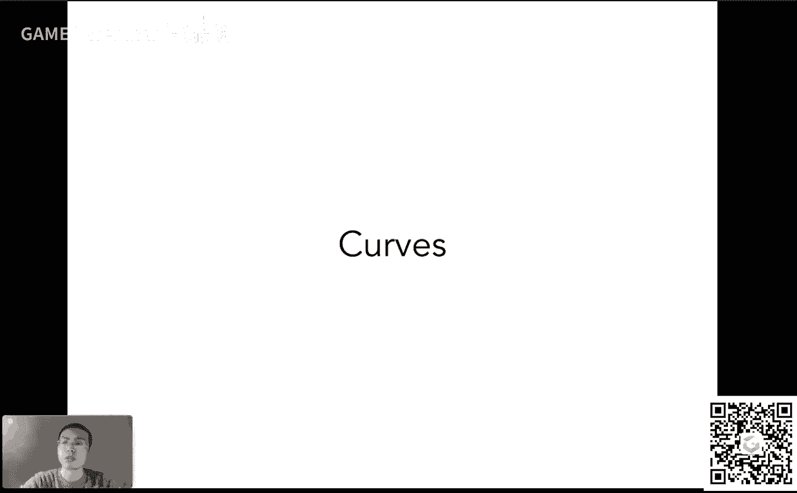
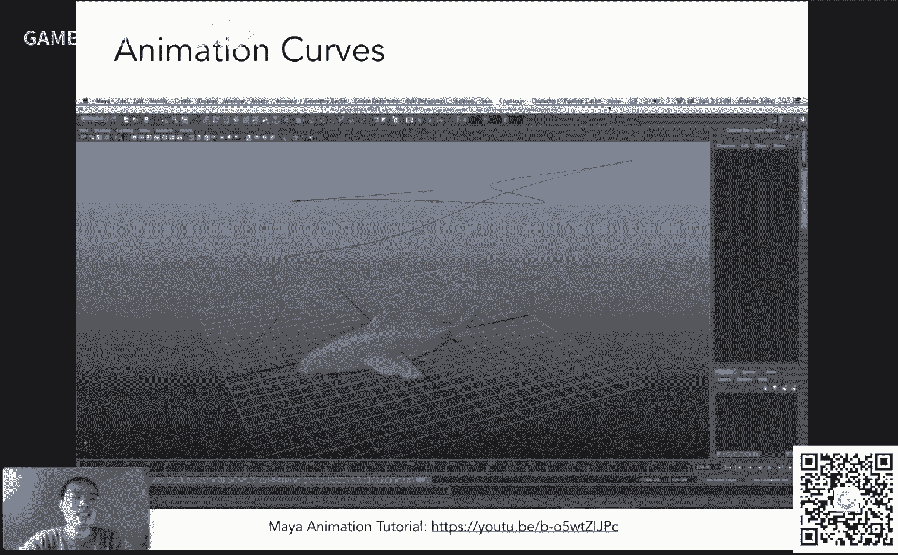
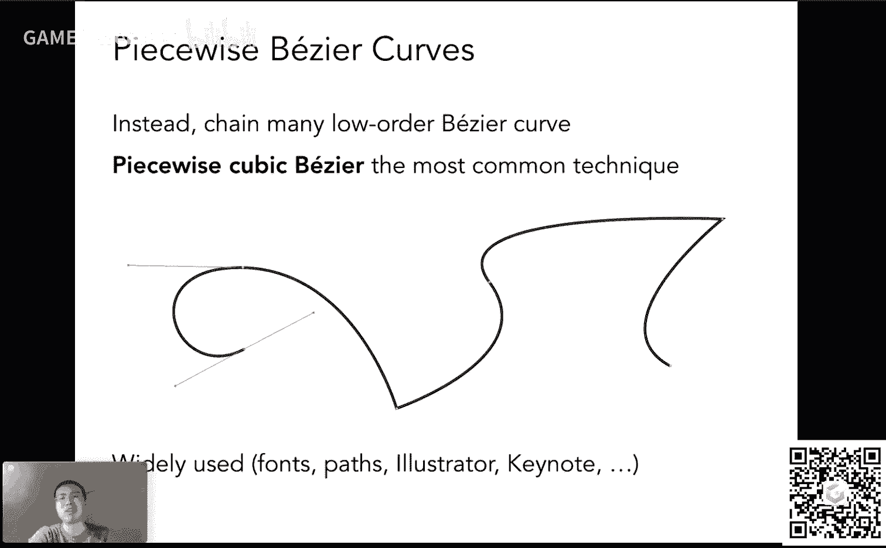
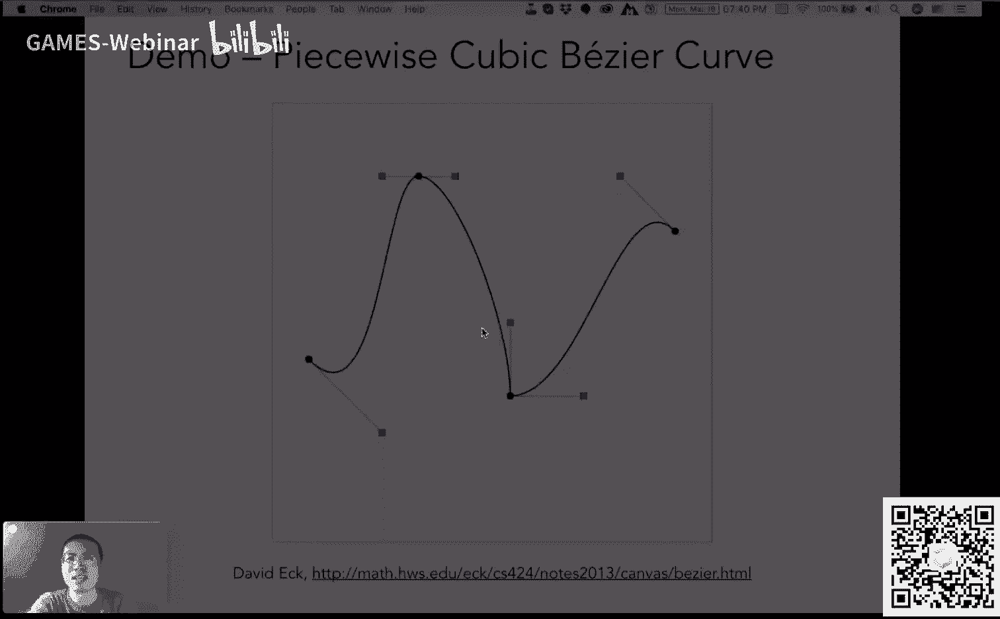
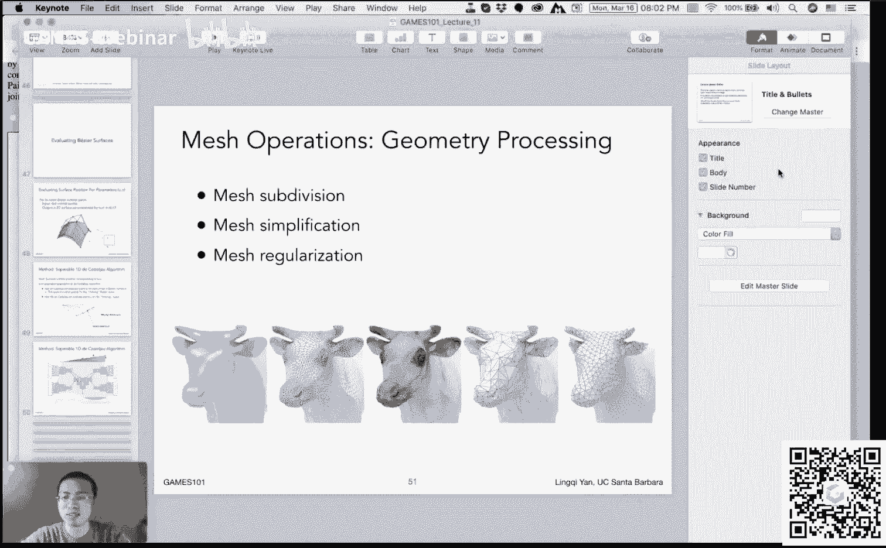

# GAMES101-现代计算机图形学入门-闫令琪 - P11：Lecture 11 Geometry 2 (Curves and Surfaces) - GAMES-Webinar - BV1X7411F744

感谢大家的支持，咱们今天这个我们上一次已经说了对吧，这个课程过半，今天是第11节，如果顺利的话，咱们20节结束，然后如果还还需要多讲一些，我就再多安排个一两课，然后咱们今天讲几何的第二部分。

我们来讲这个呃这个这个曲线和曲面好吧，没问题啊，然后咱们这个继续进行嗯，在课程之前啊，我们先说一下几个上啊，一个是我考虑到大家这个这个作业三，最近这个这作业三任务比较重。

然后大家写作业三会出现一些问题啊，或者干什么，然后考虑到这些事情，我们把它延期了两天，然后延期到北京时间周四的晚上好吗，嗯ok那没有问题好哦，我看到有同学反映说。

希望我讲一下关于这个tb n到底是怎么样运作的对吧，然后这我们作业里面会出现涉及到这个这个嗯凹凸贴图和其他的行，没问题，那这节课这节课够呛啊，我看一下不行的话，我就星期四哦。

那就是国内星期五可能来不及这样吧，中间如果说我没时间讲的话，我画几张图吧，然后作为这个课程的这个这个这个这个辅助的这些内容，然后再把它给放出来好吧，这样总归让大家能明白一点，就是这个计算确实不太容易哈。

这块在作业里面我们也刻意把这个给略过，所以如果大家真的想多了解一点，没有问题，好吧啊，那这是一个上，然后呢嗯这个最近这个这个新冠病毒在这个北美现在越来越严重了。

然后上周三我们这边开始这个这个学校开始停课，然后之后到周末就开始要求这个这个要封校的，然后不能去了，然后我们下学期的课也是在这个嗯这个这个这个远程进行，然后这个在北美的小伙伴们注意安全，少出门好吧。

多囤点粮食，然后这个啊我现在呢大家看到这个背景跟之前就不一样了对吧，所以我只能在家里面这个这个这个呃直播，然后呢这个家里面的网络和这个光照条件都不如学校，但是这个没办法，就先这样吧。

这看着显得我阴暗一些，对不对，这个还是不错的啊，ok那是今天的这个这个课程之前我们说这么几个事儿啊，然后我们回忆一下上节课我们提到了几何入门对吧，我们说了一下这个几何呢，这个呃各种各样不同类型的几何。

然后呢几何我们区分主要是两大类，一类是这个影视的几何，一类是显示的几何，然后影视呢给大家说了很多，然后包括这个什么距离厂啊，包括了这些这个这个呃这个这个呃level set呀，各种各样不同的方法。

然后就是去定义各种各样影视的这种几何，然后今天咱们这个开始说显示的集合，然后今天大概是这么几个内容吧，显示的几何先大体说一下，然后我们开始说曲线与曲面，如果有时间的话，这个能说完不行。

咱们就拖到下一节课，你要佛系一点啊，然后嗯大概是这么个安排方法，那么咱们这就开始好吧，从这个呃显示的几何啊开始，那么我们上节课提到说影视的几何可以有好多种不同的表示方法。

同样道理显示的几何也也是有这个各种各样不同的方法去表示，那么我们可以看一看，这里呢大概做了一些总结吧，有很多不同的这些方法，比如说什么三角形面啊，然后什么这个贝塞尔曲面啊，还有各种细分曲面。

这都是什么意思呢，然后还提到一个点云对吧，然后这些呢咱们这个一给大家介绍一下，首先就是说给大家介绍一下最这个简单的吧，算是最最最最简单的这个显示的这个呃物体的面呢表示什么呢，叫做点云，那点云很简单。

也就是说我们不考虑这个物体是一个表面，而是它表面上的一堆点，我把每一个点都给表示成一个点，那只要这些点我表示的足够细对吧，然后我自然而然就看不到这个这个点与点之间的缝隙。

我就可以看到一个表面这么一个概念，那一个点的表示呢自然空间中x y z就够了，所以你就是一个x y z的一个列表，非常简单，那咱咱们大家看这个右边这个例子哈，这个大家立刻就可以看到这个嗯，这是一个雕塑。

然后呢他的这个上半部分大家可以可想而知，这个这个点云的密度啊非常大，然后这就是为什么大家已经可以看到这些这个物体的表面，然后呢随着这个点名的密度降低，再往下的这个过程中，大家看到当这个点源稀疏的时候。

大家就不太容易看出这个是一个这个面对吧，所以点云呢如果你要把它给表示成一个这个非常复杂的模型，那你就得需要特别多的点，特别密集的点，就是这么个意思，然后呢点名当然从这个道理上来说。

它理论上可以表示任何不同类型的集合，只要你的点足够密就可以，对不对，然后通常呢人们这个做一些这个三维空间中的扫描啊，或者干什么，得到的输出应该都是一堆的点云，然后之后自然而然就会涉及这么一个问题。

给一个点云如何，咱们把它变成三角形面，这是有很多这个研究在做的好吧，然后这个嗯这就是我刚才说的啊，点名经常会被这个嗯这个之后变成这些这个多边形的命啊，然后呢正常情况下，如果你的点云密度很低。

就像这个雕塑的下面这块，那自然而然就不太容易把它画出来，所以所以这就是为什么人们平常不是特别多用点语，除了这个呃扫描出来的这种最原始的这种数据啊，然后大家这里看到了另外一个典型的例子，然后左边是一堆点。

然后这个我们可以把它变成各种各样不同的面，然后呢我们有各种各样不同的设定方法，然后自然而然就可以得到一个看上去比较连续的面对吧，那点源很简单的表示方法啊，一堆点，然后呢我们用的最多的一种。

这个显然嗯这个大家如果接触过这些什么三维的建模啊，或者什么大家都知道嗯，在图形学中得到最广泛应用的就是这种多边形面，然后特别的是三角形或者四边形的面，然后呃这个在整个图形学中得到非常非常广泛的应用对吧。

然后这些呢比较好表示任何的面也是一样，我可以把它拆成各种各样小的三角形，然后大家可以看到这个类似胶囊这么一个例子啊，也可以看到在两个这个这个球冠的这个部分，然后这个三角形这个长得比较这个规则一些。

然后在中间这个这个这个中间仍然用三角形表示，让三角形长得细长一些，但是肯定是可以的对吧，然后就是说我们完全可以用这个三角形或者四边形，去描述各种各样复杂的这个物体，然后呢这个呃显而易见啊。

这个三角形什么东西呢，它自然而然就涉及到连接关系，一个三角形和另外一个三角形怎么样连的对吧，然后这些嗯自然就会造成比这个电源要更多的一些困难，然后自然而然这个人们去研究这个研究的比较多啊。

这里简单给大家介绍一下，当然我们刚才已经提到，这是最几乎是嗯这个在图形学中得到最广泛应用的一种显示表示的。

然后呢这里既然提到三角形面，然后顺便给大家讲解一下，这个我们平常在图形学中是如何表示这种用三角形面形成的物体，那么这是什么意思呢，大家可以看这个嗯，这里给大家指出的是一种特定的嗯这个文件格式。

这种格式呢呃一个文件存储一个物体或者一个场景没有关系，然后这个文件格式啊叫做wave front object file，然后人们简称叫object file。

或者它的后缀是点o b j和那个编译出来的o b g不是一回事儿啊，这个这个文件呢就是说是一个文本文件，然后文本文件里面呢它其实说了什么呢，他就只是把这个空间中的这一堆点一堆顶点。

然后一堆法线和一堆这个纹理坐标分开来表示，然后再一块把它们给组织起来，形成一个这个模型，那这是什么意思呢，咱们看下面这个例子啊，这是一个文件啊，一行显示不下，显示成两部分啊。

然后这个文件呢其实描述的是一个立方体，咱们知道一个立方体，那它总共有八个空间中的点，然后这个空间中的点分别是什么呢，用这八行这种格式这个v，然后x y z z xyz就表示每次加一个这个点容易吧。

这就定义八个点，然后呢这个大家知道这个呃这个嗯一个立方体它有六个面，也就是有六个朝向，也就是说这个立方体上只有六种不同的法线，所以说它这个文件同样定义了六种不同的法线，大家说这里有八行，其实不是。

这是因为自动的建模啊，有很多冗余的地方，比如大家29 30行是一回事啊，不考虑这个数值精度的问题啊，一回事，然后就是说其实是定义六个法线，然后呢我们再定义12个这个纹理坐标对吧。

然后这个当然这里也有荣誉，大家忽略它没有问题，因为这个就是说我每个面我都要定义一个这个呃，这个嗯不同的这个这个呃四个点的纹理坐标对吧，然后当然它中间也可以也可以共用，那不是12个了。

应该是最多是24个对吧，一个面有四个点，然后就是说涉及到这些纹理坐标，中间涉及到共用的问题，它不用定义这么多，那么我先把一系列的点，一系列的这些法线，一些一系列的这些呃呃这个纹理坐标都定义好之后。

然后我定义它们之间的连接关系，也就是说哪三个点会形成一个三角形，这个怎么定义呢，用这个f来定义，就定义一个face this呢，它这个它的格式是这样的，就是呃v的坐标，然后v n的坐标。

反向的坐标和这个v t它的坐标就说是坐标，其实就是它第几个数啊，比如说这里它是v一点v2 ，你知道v8 是这个意思，然后也就是这里就告诉你啊，我们用第五个顶点，第一个顶点和第四个顶点形成一个三角形。

并且这这三个顶点上分别用第一个法线，然后第二个法线，第三个法线，并且这三个这个这个嗯顶点上分别用这个呃啊我说反了哈，第二个应该是说是这第二个参数指的是这个第几个这个纹理坐标哈。

第三个是指这个嗯第几个发现，所以他就是通过这种关系啊，把每三个点，然后给这个联系在一块，并且定义他们用什么样的这个法线和纹理坐标，那当然这样一来我们就可以这个定义一个完整的这个这个嗯物体了，对不对。

然后就通过这种形式定义很多不同的这个嗯这个三角形面，然后当然这样的话其实挺省的对吧，因为每个三角形，比如说每两层三角形共用一条边的话，那我们不用定义这么多，这重复定义这些这个顶点对吧。

我们共用这个顶点就好了，没问题，那这就是这个常用的一个文件格式，我们来定义这个嗯嗯一个一个一个一个用这个三角形形成的一个网格。

然后在空间中，然后形成一个什么样的物体啊，然后嗯今天差不多咱们就从这个呃曲线开始，然后咱们把这个显示的几何，然后给说清楚好吧，刚才是几个不同的例子，下面咱们从这个曲线这一块来这个明确的这个说明说。

在这个嗯图形学中啊，我们到底还有什么其他不同的方式来定义各种各种各样不同的。

这个曲线局面，然后咱们从这个一个例子开始看好吗，然后嗯这里可以大家可以先看一个动画哈，这个动画是什么呢，这个动画其实这个反映的应该是一个某个什么高新技术园区的这个，这个建造啊。

然后然后这里大家主要着重需要看到的其实是这个嗯，这个摄像机当然一个虚拟的对吧，然后他在一个空间中沿着某一条曲线去运动，并且呢还可以转换它的这个不同的方向啊，或者不同的这个就是说它这个不同的朝向对吧。

然后向上方向什么东西都可以这个自由的发生扭曲，它会沿着一个这个某种这个曲线去往前移动对吧，这些曲线我们当然可以定义好它，然后定义好它之后，我们就可以让一个这个这个不管是物体也好，不管是相机也好，跟着走。

对不对，然后就是说那我们既然要定义好一个曲线的曲线，势必是这个呃通过某种形式来描述，咱们待会描述好吧，然后呢这里再给大家举另外一个例子，那么在这个三维建模的一些软件这里呢。

这是一个这个玛雅这么一个三维建模的软件，然后这个软件呢呃可以定义一些这个这个曲线，呃，比如说大家看到的这个三维空间中的一个曲线，然后呢我就可以让任何的模型沿着这个曲线去移动。

这就是这就是刚才那个这个摄像机啊，如何去移动的一个一个制作过程嘛，就是外完全一个呃完全是一个意思好吧。

然后就是说嗯这里呢这个这就是一些曲线上能够得到的一些应用，然后同样道理，咱们的第一节课其实就说过这个事情啊，就是说嗯这个用这个曲线我们可以定义一些字体，然后字体呢我们可以加入一些所谓控制点。

大家可以看到，比如说这个点诶，然后这个点，然后这个点这个点，这四个点呢形成了一个能够定义这么一段曲线的一个一个方法，对不对，然后我刚我这个第一节课啊，我还提到这个事情。

说我们这个嗯如果可以无限的放大这个曲线的某一个区域，我可以看到任何地方它都是这个光滑的，不会说我出现放大了之后出现这种格子这种情况对吧，那这是怎么回事呢，这就是我们今天要说的一个贝塞尔曲线。

也是一种显示的几何表示方法，好吧，那么这里咱们就进入这个贝塞尔曲线呃，然后这个这边呢英文普遍念作basia curve，显然它不是一个英文的单词啊，然后这个这就是为什么叫做贝塞尔曲线好。

那么贝塞尔曲线其实是这个做了一个什么事情呢，首先咱们搞明白啊，它是要用一系列的控制点去定义某一个曲线，然后这些控制点呢它会这个定义这个曲线满足的一些性质，比如说啊这个这个他要满足这个曲线呢。

他在这个一开始从t0 开始，并且沿着由p0 到p一这么一个方向为切线往前走，然后同样道理呢，这个曲线会在p3 结束，大家看到这四个点定义的贝塞尔曲线啊，这个曲线会在p3 结束，并且最后结束的时候。

它一定是沿着p2 p3 这个方向往外走，然后大家会发现啊，这里有一个这个有一个这个系数三对吧，这是怎么回事，就是说为什么他的这个切线长度也有讲究啊，那这个大家待会儿咱们学的这个代数部分立刻就会明白好吧。

那咱们咱们现在先把这个给说明白，就是说这通过这四个点我可以定义这条曲线，它的起始点和终点一定得在p0 和p3 上，并且它的这个这个这个起始的切线和结束的切线一定都是p0 。

p一方向和p2 p1 p3 方向好，那么这样的话我们就可以得到一条唯一的曲线，只是这么一个曲线，当然了，这里有一点跟大家说明白啊，就是说这个控制点并不要求这个这个呃曲线一定要经过这个控制点。

这取决于我们怎么定义它对吧，我们只定义说这个这个曲线一定要经过这个题指点好吧，是这么个意思，这就是为什么得到这么一条光滑的曲线，好吧，这就是这个呃贝塞尔曲线。

那么最重要的事情是说我们怎么样去画一条贝塞尔曲线，对不对，给这个大家如果给定了一些点啊对吧，一些控制点呃，这里刚才大家看到的例子是四个点，然后咱们还这个呃有其他的例子，比如说这里看到的三个点。

然后呢这个我可以用任意多个不同的点，但是两个这个定义就只能定一条线段啊，然后如果说我们用任意多个点，我们如何去画出一条贝塞尔曲线好吧，这就是这个我们这个现在先要给大家介绍的一个概念。

叫做这个decastle dio算法，然后这个中文我实在是没本事翻译啊，这个基本上来说就是这么呃这个这个呃这么一个念头，然后呢这个显然也不是这个这个英文的名字啊，然后这个大家可以看到这两位大佬。

这个贝塞尔和这个呃比卡斯特这两个人，然后嗯那我们回到这个算法上来哈，我们要干什么，给定一系列任意多个的控制点，咱们怎么把一条贝塞尔曲线画出来，对不对，那怎么画出来呢，呃这个很简单啊，有一个确定的算法。

这个算法只要来听明白，然后一直做就没有任何问题，那咱们现在先把这个事给说明白啊，我们现在给定三个控制点，它生成的贝塞尔曲线是有名字的，叫做二次贝塞尔曲线，就quadratic basie好吧。

那么怎么样画一条线呢，大家应该还记得这个这个说，首先他一定要从b0 开始，他一定要在b2 结束，然后b一决定了它要往哪哪方向，one大大概是这么个意思对吧，那大家可想而知。

应该是画出一条这么一个弯曲的曲线对吧，然后大概是这么个意思呃，而事实上呢就是这么回事，然后只不过有一个更加精准的方法来控制它，怎么控制呢，咱们假设哈这条曲线我可以定义它的起点是在时间零。

然后它的终点是在时间一，那么我想要画出这条曲线，实则就是什么呢，实则就是我要把它在任意一个时间t在0~1之间的时间，t这个曲线的点对应在空间中的是这个平面上哪个位置，然后我把它找出来就好。

说白了也就是说给你一个时间t在0~1之间，你告诉我这个点在哪就没问题，那么这个decasting算法告诉我们的就是这么一个算法，怎么样找这个点啊，大家记得哈。

这里就相当于是我们把画整个一条这个曲线的算法，转化成了找一个点啊，大家给任意一个时间t怎么找这个点呢，很简单，大家看到这三个输入的点啊，形成了两个线段什么呢，b0 b1 b1 b2 对吧。

然后假设方向就是按照他输入的顺序，b0 到b1 ，b一到b2 ，然后呢我们不是已经得到了一个时间t人家这个给定的对吧，然后我在b0 b一上，我认为b0 是零，b一是一，那时间t是多少。

比如说像现在这个t大概等于一个约等于1/3吧，那我就在b0 b一上找到的1/33的位置好，找到这么一个点，同样道理，我在b1 b2 上我也找这么一个1/3这么一个位置。

这个点这个这个就是说t大概等于1/3这个距离啊，找这个时间t是多少好那这样一来呢，我就找到了呃，三体三个点形成了两条线段上的两个点对吧，那就是说原本三个点对吧，经过这一步过程中，我们得到了两个点。

那么我们把这新得到的两个点连起来，然后我再认为这条线段又是从0~1，那我再找这个t时间t是多少，这里t还是基本上找个1/3位置，大概在这个地方，然后再点上一个点。

这里呢我们就发现哦这两个点形成了一条线段，我找到了一个点，那找到这里就结束了，我们不可能找到更多的线段了，那么这一个点就是这条曲线，就这条贝塞尔曲线在时间t在的这个位置，好吧，没问题吧。

好然后这个有同学说，为什么这个这个贝塞尔算是显示表示呢，因为上节课咱们提到显示表示是要么是直接定义，要么通过参数来定义，那么这个t自然就是一个参数了，对不对，然后就是通过这种方式来解释好吧。

然后我们这里这个这个任意一个时间t，我们都可以用类似的方法找到它，那么我怎么画出一条完整曲线呢，我只要枚举所有可能的时间t，当然大家说这个t是个连续的量，不可能枚举的对吧，那当然这个只要能画一个点。

理论上来说我们就可以画任何其他的点没问题，所以我当然可以把整个一条这个呃这个这个线画出来啊，好那么我把所有的时间题都找一遍，我自然就可以找到对吧，整个这这条曲线，所以这是一个很简单的算法啊。

是一个这个大家听上去感觉就是一个很递归的一个算法，没错吧，就相当于我们这个每一段整啊，一直找，直到找到最后一个点，那么咱们同样可以这个回顾一下这个算法，咱们看下下面一个例子啊。

下面一个例子给定了四个不同的点对吧，用这四个点我们定义一个贝塞尔曲线，那么这个贝塞尔曲线同样要从这个开始到这个结束，它要经过b0 和b3 ，那么中间这两个点用来控制它对吧，那怎么做呢，同样道理。

我们同样用这种递归的方式来做，那假设说我找一个t，它大概是这个0。5左右，那我就相当于是找这条b0 b一上面的0。5左右，然后呢再找b1 b2 上的0。5左右，然后同样道理b2 b3 上的0。5左右。

然后我把它连起来，这样的话呢我就把这个问题原来四条线段对吧，现在我呃呃原来三条线段啊，四个点三条线段现在变成了三个点，两条线段问题规模减小了，然后同样道理呢，我把这个新生成的这两个线段上同样找t等于0。

5左右，然后呢这这半边也找t等于0。5左右，再把它连起来好，现在变成了两个点，一条线段，那么最后要干什么，这个大家清楚，最后这一条线段再找它的时间t，这里大概又是约等于0。5的时间t。

那么这里呢大家就可以找到一个这个在时间t等于假设说0。5，这个时候它的这个贝塞尔曲线它所在的位置，那自然这个点我们就可以把它点出来好，那么这个算法当然非常简单了，对不对。

然后就是说它是一个很显然是一个递归的算法，然后从这个从这个这个呃很多个点，每一次我让他少一个对吧，每一次我就找他们形成了线段点，一个点，那当然就少一个点，然后这不断做下去，直到最后剩下一个点。

那就是这个贝塞尔曲线上的点，那么这个过程呢可以通过这个呃一个这个动画来表示，比如大家看这里啊，这里大家可以看到这个给定一个时间t，这个第一步我们可以找到两个线段上的这个呃这个时间t，然后形成了一条线段。

这个绿线段，然后我们在这个绿线段上再找时间t，这样的话在不同的时间上诶，我们就可以把这个过程不断的做，我们就可以做出这个正确的结果来，那当然对于四个点完全一个道理啊。

大家可以看到这三个紫色线段上找三个点，形成两个绿色线段，两个绿色线段上面，然后在在这个找两个绿色点连成一个连蓝色线的蓝色线段上面，取蓝色这一个点我们就可以画出这么一个整个的贝塞尔曲线，对不对。

然后所以这是一个这个呃其实是一个很直观的过程，然后呢呃这里咱们就这个给大家这个动画演示就看到这里好吧，然后当然这些控制点的移动，会引起这些这个这个这个这个这个贝塞尔曲线本身的移动对吧，没问题好。

那么咱们这个嗯算法已经说明白了，但是这是一种直观形式的解释，对不对，那么这个我们通过这种直观形式的解释，我们看能不能推出一些这个代数上的一些形式，就是说啊大家这样想，首先这个贝塞尔曲线怎么来的。

它它是由我们这个不同的控制点对吧，咱们假设说四个控制点，那是由四个控制点决定的，呃，这个贝塞尔曲线在时间t上，它在哪里，所以嗯任意时刻给另一个时间t，那么贝塞尔曲线上的任何一个点。

一定都都得通过这四个控制点怎么样操作来得到，对不对，所以相当于是我们把这四个控制点的位置和时间t放在一块儿，我们一定有一个代数的表示方法可以写出这个这个嗯贝塞尔曲线呃，他在这个时间t它的点在哪。

那这就是咱们要做的事情，那咱们看一看啊，比如说仍然是四个不同的点，b0 b1 b2 b3 对吧，呃b0 b1 b2 b3 ，这是输出的输入的这四个点，然后呢这个呃我们怎么做的来着对吧，每两个之间。

然后我们找他的时间t，就相当于是在他们两个之间做了一个位置的线性差值，对不对，就相当于是这个t乘以b0 加上一减t乘以b1 ，就是这样得出这个b01 这么一个点，这个点对吧。

然后这每一层就相当于我们之前这个找个线段求它的时间t的点，没错吧，然后找这个第二阶段，找第三个阶段求出这两个点，然后这两点呢，然后我们再把它合成这呃一个点这两个点，然后这个线段我们再找出一个点。

然后最后这两点合成一个线段，找出这么一个点，所以它是一个整个是一个这么一个线性差值，线性差值，然后然后最后得到最后一个值的这么一个算法，那咱们可以显示的把它写出来，那比如说我们知道这个b0 坐标值的。

b一坐标值的，然后这个时间t呃，这个我们可以写得出来，然后就是说呃这里考虑时间t啊，t是这个靠近左边的这段距离，靠近左边质量距离，所以应该是线性组合起来，应该是一减t去乘以左边，这个加上t乘以右边。

这个呃为什么，比如t等于零的时候，t等于零，它就应该完全是b0 对吧，t等于零，完全指最左边，t等于一，完全指最右边，那也没问题，这样写写才是对的啊，就是说用一减t乘以左边的，加上t乘以右边的。

那可以找到在这条线段上的某个时间t的位置好，那么我一开始用b0 b一得到b01 ，然后b1 b2 就是这条线得到b11 ，那么得到这两条线段好吧，然后啊我们这这两点啊，这两点连成一条线段之后。

我再找他的时间t那很简单，我把这两个点呃，新得到这两个点再做一次线性差值不就可以得到这个b02 t对吧，就是这个点就是咱们要的最终的点，那咱们这个过程我当然可以把它展开，对不对。

这个b01 怎么求出来的，在这b11 怎么求出来，在这咱们展开之后就会发现哦，这个点呃，呃这里啊首先跟大家说，这跟四没关系啊，这不是指平方啊，这这只是一个表示方法，表示第二次这个这个这个计算了哈。

就是就是第二层，相当于是然后这里会发现啊，我们要的这个最终的这个点给定时间t在这个贝塞尔曲线上，给定时间t的点，它是输入的b0 b1 b2 的一个组合，没错吧，然后这就是很符合咱们刚才最早的分析。

任意一个时刻，贝塞尔曲线上的任意一个点，当然得由这几个控制点的坐标来决定，当然还得跟t有关系对吧，然后就是说这个几个控制点是如何组合起来的呢，大家可以看到这个这个式子看起来很熟悉的，对不对。

这个式子看起来分这个非常像这个一的平方的一个展开时，则什么叫一的平方，就是一减t再加t，然后再括号平方，大家会把一减t当成另外一个数，比如当成s那就是s平方加上2s t加上t平方。

这可不就是它的这个这个这个这个自己的某一个展开嘛对吧，就是相当于这一点体再加t，然后它的平方的展开，那同样道理呢，大家说如果说有四个点怎么办，那咱们继续往下写，对不对，然后这个点我知道。

然后另外一条这个这条边上的肯定也知道，一个就是b呃，我想想啊应该是b12 对吧，然后我就可以得到b03 对吧，那我同样可以解开，解开之后大家就可以看到这个系数写的应该是1331对吧，这个就很熟悉。

为什么熟悉呢，这个其实就是相当于s加t的n次方的展开式，然后这里呢我们做一个总结对吧，就是说啊它是一个这个多项式嗯，什么意思呢，咱们把这个事情给说明白啊，就是说给你n个控制点。

然后呃呃不给你n加一个控制点，然后这个这个这个这个点分别是012，一直到n啊，n加一个控制点，我们可以得到一个n阶的贝塞尔曲线，这个贝塞尔曲线在任意时间t，它都是之前给定的这些控制点的线性组合。

然后呃这个说线性没问题，是线性组合没问题，然后呢这个这个它组合的系数就是一个多项式，这个多项式是跟时间的一个呃有关的一个多项式对吧，我们刚才说这个这个贝塞尔曲线在任意时间极限点，是这个控制点的组合。

怎么组合，用这么一个多项式来组合，这个多项式就叫做伯恩斯坦多项式，然后这个多多项式呢非常非常简单，其实就是描述二项分布的这么一个多项式，我刚才已经已经说了对吧，就相当于s加t的n次方，那如果是三个点。

那也就是说二阶的这个就是n等于二啊对吧，n等于二，所以是s加t的平方展开之后，那自然就是s平方加2s t加t拼装，再把s换成一减t不就行了对吧，这个伯恩斯坦多项式说的就是说这个任意一项是多少。

那么大家可以看到这个i呢对应就是从零一直到n，它相当于这个多项式，这个他他在这个就是说这个121还是1331，是这这么一个呃，就是它有它有多少项，就是这个意思。

然后分别乘到这个呃对应的这个控制点上就可以了，那么这个咱们再把这个规则简化一下，很简单，就是说这个呃我们不考虑多少层了，我们现在就直接把这个式子写出来，那么任意接触的贝塞尔曲线。

任它上面的任意一个时间t呃，这个点的位置就是由伯恩斯坦多项式作为系数嗯，对这个呃给定的控制点的加群没问题哈，那这样的话就没问题了，然后这里有一个例子哈，这里呃例子想说明什么呢。

想说明通过这么一个简单的这个这个推导哈，然后咱们就可以得到一些这个很不错的这个性质，比如说我们完全没有必要限制我们这些控制点在平面内，在空间中，我仍然可以得到一个这个贝塞尔曲线。

那我只要把这个不同的这个控制点输入成这个三维的坐标不就行了吗，然后我同样用伯恩斯坦多项式去对它进行这个差值没问题吧，哎所以说这个非常好，那这个呃如果我把它展开嗯对吧，任何一个这个控制点。

然后我们这个不管它是什么，那就是说在时间t他一定会通过这个这么四个不同的系数，把这四个这个b0 b1 b2 b3 可以组合起来，形成这个呃贝塞尔曲线上的一个点好，那这就没问题了。

这就是说把这个问这个之前的这个d cotto算法，用这个数字把它给表示出来而已，没有什么这个特殊之处啊，然后这里多看一眼这个伯恩斯坦多项式啊，波恩斯坦多项式我刚才说了，就是说这个这个多项式呢。

其实是一个就相当于对一自己的这个n阶展开，所以说它这个多项式呃，在同一街上把几个多项式的值加起来就是0123啊，比如说它有这个这个三阶，有四个不同的多项式，分别对应i等于0123。

然后它加起来肯定都等于一，这就是为什么咱们从这个图上看，给任何时间t啊，画一条竖线，那四个竖线的交点的值，这个y坐标啊加起来肯定得等于一，没问题，然后呢这个这个这个曲线大家可以看到是一个相当对称的。

这两个这个这个这个比如说这个b一跟b2 就是对称的，b0 跟b3 就是对称的诶，这个反应在组合数学上大家就知道ni和呃，就是说这个从n项中取，而像呃的组合是等于这个从n个数里面取n减a项的组合对吧。

所以说从这个事情上来说，就是也是可以解释的，没有问题好，那么嗯这就是这个伯恩斯坦多项式啊，挺简单的嗯，但是基本上来说啊，就是这么一种思路，就是说我们通过一些定义一系列跟时间有关的多项式。

来对这个不同的控制点进行插值对吧，这就是一个差值嘛，组合也是差值嘛，一个道理，然后得出一个新的点，这个点就是我们定义的曲线上的点，这个概念不止应用在贝塞尔曲线上。

也应在这个其他的各种各样的这个更复杂一些的曲线上，咱们马上再说好吧，那么这里就是几何和代数上把这个贝塞尔曲线说明白，那咱们总总结一下啊，呃这倒不是总结哈。

就是说我们来看一下贝塞尔曲线有一些这个不错的性质，分别都是什么呢，啊首先这个咱们从最简单的开始，贝塞尔曲线规定了它必须过起点和终点，所以他在t等于零的时候一定在起点，然后在这个t等于一的时候一定在终点。

这没什么好说的啊，这个实际上是规定方法，那如果对于呃这个性质是特定的，对于这个呃这个三次的贝塞尔曲线，也就是给四个控制点的啊，就是说第二个第二个这个性质就是说呃一开始这个曲线往哪儿走，它的这个方向。

它它的这个起始的这个位置的切线一定是三倍的b一到b0 ，然后就是说这个咱们还是之前规定的这个事情啊，结束的时候一定是这个最后的一个线段的这个朝下是这个意思，而这个三倍啊只和这个嗯。

因为你只是因为我们这里有这个四个这个控制点，如果呃控制点不一样的话，这个并不是三啊，并不严格，是三好，那么嗯这里呢有一个不错的性质，这个贝塞尔曲线，贝塞尔曲线的一个一个好的性质，就是说它在仿射变换下呃。

它是有一个好性质是什么呢，就是说我可以直接对这个不同的顶点做仿射变换，然后我我再重新对这个变换之后的顶点画一条贝塞尔曲线出来，这个贝塞尔曲线一定和另外一个贝塞尔曲线是一样的，哪一个呢。

就是说我已经通过原始的这个这个控制点，然后画出一条贝塞尔曲线，然后我对这个曲线上面的每一个点做仿射变换，嗯，这样这样两个这个方式得出的啊，贝塞尔曲线是一模一样的。

这也就是说这个给了我们一个很好的性质是什么呢，那也就是说如果我想对一个贝塞尔曲线啊做仿射变换，那没问题，那我只需要对它的这个几个控制点做仿射变换，我再重新画出来就好了。

对仿射之后的这些控制点重新画一条贝塞尔曲线就好了，所以它有一个非常好的这个这个性质，这也不用你一直把这个曲线上每个点都给记录着，这个不错，但是呢这里大家看到是什么性质呢，在仿射变换下有这么个性质。

但是这个呃并不能说这个对其他的变化也是如此，比如说对于投影就不是这样啊，大家在这个空间中某一个平面上画了一个这个这个呃贝塞尔曲线，然后呢我把它投影到某一个摄像机看到的这个这个平面上。

然后这时候我再重新对这个投影过后的这几个控制点，再画一条贝塞尔曲线，那可就不是原来的贝塞尔曲线了啊，记得哈就是说这里呃专门限制了得是仿射变换投影是不行的好吧，然后还有一个性质非常有趣。

而这个性质是什么呢，就是说啊这个这个性质叫做突破性质，什么叫凸包呢，这是一个在这个计算几何上得到了一个广泛应用的一个概念，然后这里简单给大家解释一下啊，在解释之前先给大家说一说啊。

就是说呃这个突破性质对于贝塞尔曲线说的什么意思，就是说你画出来的贝塞尔曲线一定得在几个控制点，就是所有的控制点形成的凸包内啊，那这就好说了啊，那咱们看这个例子啊，这个什么是这个凸包图包。

其实概念很好理解啊，它有它有很多这个这个定义啊，比如说它有一个定义，就是说呃能够这个包围这个一系列，给定的这些这些这些几何形体的最小的凸多边形，那这个要求挺高的啊，最小又得是凸多边形。

然后这个定义其实不直观啊，这里给大家一个直观的定义啊，什么呢，很简单，这个比如说啊大家想象这个平面上或者一块板上面，大家定了很多钉子啊，这些黑点就是钉子啊，呃定这么些钉子呢，然后你有个橡皮筋。

大家知道橡皮筋呢这个东西可伸缩对不对，然后假设说你可以把这个橡皮筋啊拉得非常大，先把所有钉子都给都给包住啊，就是外面这一圈儿呃，呃这个包住，然后你突然松手，你突然松手会发生什么呢，这个橡皮筋会收缩。

对不对，会收缩，最后呢这个橡皮筋会收缩在这个这个这些物体形成的某一个外框上，这个框大家就可以理解成是这个这个图暴简单了，就相当于是这么一个过程嘛，这样好想想对吧，呃呃这就是说我们得到这么一个图标。

这个是什么意思呢，就是说我们回到刚才说这个这个图包性质哈，呃脱发性质是什么意思呢，就是说呃任何一个贝塞尔曲线，你把它画出来之后，这个贝塞尔曲线上的任何一个点就是在任何时间体啊。

一定都在给定的这几个控制点所形成的凸包里面，就是这么个意思，那如果我有四个点，那四个点大家可以形成一个这个类似这个梯形这种形状哈，就是多边形四边形对吧，然后就是大家画出来的这个这个呃贝塞尔曲线。

一定是在这个四边形之内的，那么还这个我们立刻可以应用这个图标的性质哈，咱们回到这个图标的性质上来好，那么这个比如说啊我给大家一系列的点，这些点排列很有意思，正好是从左到右一个一个排列排列在一条线上。

那这个比如说第0号，第1号一直到第n号排排列在一条线上，那这些点我说他是他们是这个我要画的贝塞尔曲线的控制点，那么我问画出来的这个贝塞尔曲线是长什么样的呢，那这个时候大家可以立刻告诉我答案，为什么呢。

因为这个时候有突破性质，那我给定了一系列控制点，都在一条线上，那很简单的图包肯定就是这条线自己，那么我们说贝塞尔曲线又有图包的性质，那贝塞尔曲线无论如何不能超过图包的范围。

那么这个贝塞尔曲线一定被限制在这条线上，所以这个贝塞尔曲线一定是这条线自己，对不对，会得到这么条直线对，所以说这个这个嗯就是一个简单应用啊，然后就是说贝塞尔曲线有这么一个不错的性质。

就是你你是可以知道它绝对不会超过这个凸包的范围内，谁的图包给定的控制点形成的图包啊，ok那么就是这么个意思，那咱们这个下面来说下面一个话题吧，就是说贝塞尔曲线咱们已经说了，给定任意多个就给你十个点。

你肯定可以画出一条贝塞尔曲线来，但是它有一定的问题，这就是说我们为什么要引入这么一个概念，叫peace wise，被在而去，现所谓peace wise就是相当于是这个逐段的啊。

贝塞尔曲线相当于我一段一段简单来考虑，那为什么要这么做啊，这里给大家看一个例子，这里n等于十，也就是说给了11个点，对不对，然后这个呃稍等哈，1n等于12345678 90 11没问题啊，11个点。

然后n等于十，然后我们就可以画出一个贝塞尔曲线的，没问题，那咱们这个这个十个无非就是多一点呗，十个n等于十，形成了十个这个线段，然后十个线段呢每个片段都取时间t，然后我全连起来，形成了九个线段。

然后再回到这个一直做到一个线段，这就找到了一个点，那咱们这个工作费时一点，总归能画出来，对不对，画出来之后我们得到这么一条曲线啊，这两条曲线就是说大家看到是对的，没有问题，但是它并不直观。

你可以看到这个它并没有往这边这个扭曲对吧，也没有往这边去，它基本上来说在中间它这个变成很平很平滑的一个这个曲线，是这么个意思，那也就是说这个曲线呢不好控制，不太利于用这些中间的控制点来控制。

当你的控制点多的时候，就不太容易这个这个得到一些你想要的形状，不那么好操作啊，当然形式肯定行啊，这个时候呢人们就发现说，我干嘛要一次用这么多的这些控制点去定义一个贝塞尔曲线呢。

那我能不能说我用这个每一次我用很少的控制点，我定义一段贝塞尔曲线，并且我把这些贝塞尔曲线给连起来，那是不是可以，那就没问题，那这样这样的话呢，这就是人们发明了这个这个这个所谓peace wise的方法。

就是逐段的定义，那么特别的来说，这个逐段定义，大家非常愿意把这个逐段的贝塞尔曲线定义成每四个控制点，可以定义一条贝塞尔曲线，也就是说大家喜欢用这个peace wise cubic。

大家喜欢用这个三次贝塞尔曲线，四个控制点，那么什么意思呢，大家看这条曲线就可以看得明白啊，大家可以看到这里有一个控制点，起点没问题啊，然后整个这条曲线呢是由不同的贝塞尔曲线对起来的，怎么体现呢。

在这里这个点上它显然发生了一个拐弯嘛，剧烈变化，它显然不会是通过这个原始的这个正确点一下，求出来的一条贝塞尔曲线对吧，这个点也发生了一个拐弯对吧，然后就是说它是拼起来的，怎么拼的呢，每四个控制点。

然后定义一条这个贝塞尔曲线，哪四个呢，这个起始点这一个点啊，这一个点这一个点，然后以及这个点，那那么这四个点就可以形成一条这个诶光滑的贝塞尔曲线，诶形成这么一段，那同样道理，我通过这个点。

然后以及这个空间中某一个肯定在这啊呃的一个控制点，再通过这个控制点，然后再通过这个控制点，这四个又可以形成这么一段，那同样道理，我后面可以继续再形成更多的段，只不过呢人们为了这个方便这个这个呃来看啊。

咱们平常不愿意把这四个点给连一块，这四个点连一块看起来很难看，所以他们这个这个中间这个点啊，这个并不把它给画出来，就是说这这两个点是控制点，这个起点和这个这个终点也仍然是控制点，它们地位完全一样的。

没什么区别，就是0123这个顺序仅仅是这里为了显示他没有把它画出来而已，好吧，然后呢这种定义方法就得到了非常广泛的应用，因为大家可以把这两个控制点啊，中间两个控制点当成一种这个控制杆一样的东西。

可以拉着这个这个这个曲线哎，往不同的方向去对，如果大家玩过这个photoshop对吧，这正是这个photoshop里面的钢笔工具给大家带来的。

这个这个画曲线的这个能力，然后咱们在这个给大家一个例子哈。

这个我确认一下啊，我不知道大家能不能看到我这个嗯这个这个网页哈，这是头一次在这边打开，我自己也看一下这个啊，好没问题啊，没问题，那是这样嗯，就是说嗯大家可以看到哈。

这个就是以呃这里画出来的就是一个这个分段的啊，分段的或者逐段的贝塞尔曲线，而且是分段的三次贝塞尔曲线，也就是每四个控制点是一个这个形成一一小段三次贝塞尔曲线，那么咱们看这一段哪四个控制点呢，按顺序来啊。

起点它，然后这个然后这个算是第二个点，然后这是第三个点，这是第四个点，然后这四个呢会形成一个贝塞尔曲线，咱们还可以这个拖拽它，你看比如说这个这四个点1234形成一个贝塞尔曲线对吧。

然后呢这四个点1234又可以形成一个这个贝塞尔曲线对吧，然后这个这个呃所以说这个通过这种方式啊，咱们这个每四个点咱们定义一个贝塞尔曲线，然后就可以把它连起来，那么自然而然大家肯定要问这么一个问题。

那我怎么保证我连起来的曲线还是光滑的呢，比如说在这个地方它就发生了一些转折，对不对，这个地方折了当然更厉害，那么现在呢先告诉大家这个结论怎么样才是光滑呢，首先他们这个无论如何。

肯定是这个物理上是连起来的，我们说光滑不光滑，是指它的这个切线方向是不是光滑，就是所谓说如果以为是蚂蚁，它就爬啊，爬到这儿它不用转向，它自然而然往前走，他们这个就是有一个光滑的过渡，那么这个怎么保证呢。

大家还记得这个三次贝塞尔曲线的性质对吧，就是说最后这个曲线的切线一定是这个往这么一个方向啊，往这个方向来的，什么方向呢，就是由这两个点定义的方向，由这个第三个点，第四个点定义的方向。

那同样对于第二段来说，那它的起起始方向一定是通过第一个点和第二点定义的一个方向，并且他们前面有个系数三，所以说如果我们把这两个控制杆啊，相当于是把它给拉到诶贡献这个状态。

并且他们又是和这个中间这个点等距离的话，这个时候我们就说哦好，我们得到了一个光滑的曲线，然后这个这样的话，你看不管我这个这个控制感怎么怎么怎么牛对吧，然后都可以得到在这一点唉他们两两段的切线对上了。

没问题，那有同学会问说我这样算不算对上对吧，这样就是说如果有个蚂蚁在这儿爬，爬到这儿的话，突然爬得快了些，但其实他这点方向也没变化对吧，那这种通常咱们不算。

咱们会把它认为说如果认为两个曲线在这个切线意义上延续，我们认为切线不只是方向一样，大小也得一样，所以这两个距离得是一样的，这个得拖出去啊，拖不出去算了吧。

这个这个就这样吧啊这这时候就差不多基本上认为是连续的好吧，那那就是说啊我们要求的就是说它的导数要连续，也就是说布置方向还是这个呃这个大小。

那咱们回到这个好。

回到咱们的这个ppt里面啊，好那咱们这个继续啊，既然我们提到了连续性，咱们在这里多给大家说一句对吧，这个连续性是什么意思呢，就是说如果你这个给定了两个这个贝塞尔曲线呃，那左边一段。

右边一段大家可以看到都是由四个控制点构成的，那如果说这个呃叫什么呢，在这个控制点上呃，这这两个在几何上这两个曲线都通过这一个点，那么我们就说这是一种最简单的连续对吧，我们说曲线连续。

我们刚才说的是切线上的连续，我们现在先说个最简单的情况，几何上得连续对吧，就是说他们在这个点只要接触，那就是连续，那我通过我的这个这个分段的这个贝塞尔曲线的定义呢，这一点肯定可以保证。

当然这一点呢有它的名字，只要说第一段的终止点等于这个第二段的起点，我们就管这种连续叫c0 连续，那这个c呢表示continuity就是连续性，连续性叫c0 连续，然后这就表示几何上只要挨在一块。

不管它形成多么大的锐角，这种没关系啊，只要挨在一块，这就是连续c0 连续，那么我们再定义一种连续，就是说它的切线我希望也也也能够连续对吧，那切线怎么样才能连续呢。

那我们刚才说这个这这这两段距离要是一样的，呃对吧，然后这个a n就是这个这个点等于b0 ，当然是了，然后他们两个就等于等于什么呢，等于这个前面这个点嗯就都在这个位置啊。

这个这个位置自然是左边这个点和右边这个点他们的这个中心位置，这就是为什么可以这么写对吧，然后就是说白了就是说这两个控制点离这么一个公共的点，它们的距离要是一样的，并且方向也是一样的。

就是说这个在呃贡献方向相反，距离一样，这个时候我们管这个连续性，就是因为它是切线连续嘛，我们就管它叫c一连续，那么大家可以认为就是一阶导数的连续对吧，然后这就是我们定义这个这个不同的连续性。

当然有同学问这个这个那么再高阶的导数，二阶导数或者什么什么这些呢，有然后人们管它叫曲率连续，有很多各种各样不同的连续性的要求，有时候呢大家会觉得说哎这个c一连续看起来已经挺好的了。

但是有时候这个在制造上大家会觉得说仍然不够，我们得保证说c2 连续，那自然而然我们也可以定义不同的方法对吧，我们刚才提到了这个代数的表示方法，然后我们刚才这个又说这个啊这个这个这个就是说c0 连续。

相当于是直接这个呃两个函数在值上连续，然后呢如果c一连续就是导数连续不续，那c2 连续，那就是二阶导数连续，那自然而然我们就可以这个把它们通过代数形式写出来的，是没有问题的，好吧。

这里呢简单就给大家介绍到这里，基本上来说这个如果大家再往后学习，这就已经够了，作为这个这个呃入门啊，好那咱们介绍了两种不同的连续性，那么这里呢这个已经等于是把这个贝塞尔曲线相关的内容说完了。

这里呢先说一下有一个重要区别哈，我们这门课说这个贝塞尔曲线的时候，说的是一个反的顺序，这个之前呢这个在大家如果接触过其他的图形学课，嗯，大家会看到大家是这个贝塞尔曲线，先从代数定义上面来。

然后如何去推导公式，然后我们在这个做这个几何上面，这个怎么样把它画出来，用这种方法，然后咱们这次是从几何开始到这个代数上，然后希望这样的话能够好理解一些，因为这个贝塞尔曲线它涉及到这个g函数就不容易。

就是我们说的那个伯恩斯坦这个这个多项式啊，这个就不容易，所以咱们先直观的来看好吧，然后呢嗯这门课咱们马上会说到这个事情，就是说关于曲线部分不做多这个解释，然后呢嗯这里简单给大家介绍一下贝塞尔曲线。

当然不只是这个这个这个图形学上应用的曲线，还有各种各样别的曲线，比如说这种叫做splin的曲线，这种splay呢呃中文叫样条啊，我应该加个中文在这儿的呃，样条呃。

这个什么样的那个这个这个这个就怎样的样啊，调试这个这个条目的条一条两条的条，然后呃样条，然后呢什么意思呢，相当于是对曲线的一种总结啊，就是说这个定义很清楚，就是说一个连续的曲线，然后是由一系列的控制点。

这个这个控制的，然后呢它能够满足一定的这个这个连续性，就是这么个意思，在任意一个地方他都会满足一定的这个连续性，几阶的连续没有关系啊，然后这个取决于具体的这个这个呃例子。

然后大家可以看到这是一个这个早期啊，人们如何去画一条曲线，他们会运用一个树枝一样的东西啊，然后拿各种各样不同的东西把它给固定住，固定住，然后就是就保证了说这个呃样条会经过这些点对吧。

然后这个中间怎么样弯曲，那自然就交给这个这个树枝自己了对吧，然后就是说啊呃一个简单总结就是说一个可控的曲线，这就叫样条好吧，然后样条里面呢用得多的叫做这个b样条，这个b样条它是一个缩写啊。

叫basis supplies，就是指基函数样条，然后基函数呢咱们刚才提伯恩斯坦多项式的时候没有明确提，就是说我用我我我这个啊可以理解成用伯恩斯坦多项式。

在时间t它的几个不同的像对这个不同的这个控制点做一个加权平均，我也可以理解成我用这个控制点的位置，对这个伯恩斯坦多项式这个进行进行一个加权求和，那么这个波斯坦多项式我就就理解成是一个基函数。

就相当于由不同的这个函数，通过不同的不同的这些方式组合起来，可以形成别的函数，那这个函数就叫做基函数啊，就是basis的意思，那么就是说啊这个b样条到底是什么意思呢。

就是说它是一个对这个贝塞尔曲线它的一个一个呃相当于一个扩展，它比这个贝塞尔曲线的能力要更强，为什么呢，因为贝塞尔曲线刚才咱们看到一个例子，n等于十的情况下对吧，11个点，我其实动一个点，如果我动一个点。

整个一条曲线在任何一个位置都会发生变化，而这个在设计上经常来说大家不太喜欢这样的性质，大家想要什么呢，大家想要的一个性质是说，我我我如果说我觉得其他这个这个这个一条曲线啊，其他部分都挺好的。

就有一个地方我需要改一改，那我在这个周围，如果我就动一个点的话，那整个曲线都要改，那可不是不太好嘛，那就是说啊我希望有一种性质叫做作为局部性，那么局部性是什么意思呢，就是说这个这个我改变一个点。

我知道这个这个控制点至多影响这条这条曲线影响到哪个范围内，好吧，就是说这个这个b样条就有这么一个功能，那大家肯定会说，那之前说这个贝塞尔曲线，如果我用这个分段贝塞尔曲线，那可不就有这个局部性吗。

是没问题，就是说就是说大家希望提出一种更加容易控制的，我不需要分段对吧，我用很多个点，我只用点就可以了对吧，然后我中间要改，我就只用拖拽一两个点，那是非常好，没问题，就是说b样条它有这么一个好的性质。

就是局部性好，那么这里呃这个不再多说哈，然后就是说关于这个b样条，咱们就说到这里，为什么，因为b样条极其复杂，很有可能是整个这个这个这个这个图形学里面啊，最复杂的一块，如果大家需要学的话。

这个咱们这节课啊，这这这个这个呃叫什么入门课，我们这个呃不是我们的，基本就是我我这个想法我是这么觉得，就是说通过学习这个贝塞尔曲线，你已经有足够的能力去掌握这个，如果说这个b样条到底是怎么样运作的。

然后不管是从几何上还是从代数上分析方法是完全一样，只不过它的这个g函数要更加复杂，然后算起来也更加复杂，包括这个b样条，以及包括比它更复杂的一个东西，叫非均匀有理，b样条叫nerves，嗯好吧。

然后这个这这些东西呢，其实其实呃nervous相当于是b样条的一个呃更延伸的一步啊，然后就是说嗯通过学习到这里，关于贝塞尔曲线如何分析，你肯定是有能力去继续去学这个b样条，那么到此为止。

咱们这节课这这这这这个课咱们就不多说了好吧，然后嗯并且其实关于这个这个样条这块儿还有更多的东西，比如说我嗯有两个这个贝塞尔曲线，把对在一块儿，然后我要把它变成一个高阶的贝塞尔曲线，这个怎么做对吧。

或者说我高阶的贝塞尔曲线，我就会把它给拆开对吧，然后然后或者说我原本有100个控制点控制了一条贝塞尔曲线，然后我现在只希望有90个点来控制一下，我希望得到的曲线跟之前的曲线差不太多对吧。

像这些问题如何去解决，一些在这个曲线上常见的一些操作，这里我们就没再说了，好吧，只是简单的给大家提一下这个关于这个曲线这一块的知识，以及分析方法，那如果你想多学的话，很简单，这里有传送门对吧。

这个这个呃这是我之前在清华的导师，这个这个胡志明老师他的这个一门一门课，然后很早了，但是关于这个曲线曲面这块说得非常的深入透彻，也非常难啊，这个大家这个欢迎去这个访问这个这个地址，然后大家可以看一看。

如果大家有兴趣，可以学到更多的呃关于这些呃样条的这些这些知识，好吧，那这里咱们这个这这一块儿关于曲线，我们就说到这儿好吧，那今天呢我们这个有一点时间可以先把这个嗯，这个呃曲面先简单的说一说啊。

那没问题啊，咱们就这就简单开始，那么说曲面啊，显然他这个会比这个曲线什么东西要稍微复杂一点，但是咱们这个其实理解上倒是更好理解一些啊，首先就是说对于曲面来说，我们如何去得到它。

我们知道它也是一个显示的这个呃这个物体的表示方法对吧，那我们自然可以把这个曲线的概念给延伸到一个这个平面上对吧，比如说像这里这个嗯这里给大家看到的就叫做贝塞尔曲面，然后这个贝塞尔曲面。

比如说左边那个大象，这个还是一个分块的，或者说这个也是这种这种分段的吧，就是贝塞尔曲面，大家可以看到一个一个这个块儿把它给拼起来，然后并且中间肯定不能有缝对吧，然后这这些要求应当如何去满足对吧。

这都是几何上要研究的一些比较困难的问题，包括右边这个茶壶也一样的，可以可以看到整个一个壶身，它是这个通过一些一应该是一整个这个这个贝塞尔曲面去描述的好吧，然后这个这是一些例子吧。

然后我们现在仔细来看一下，就是说用这个贝塞尔曲面的曲线啊，如何去得到贝塞尔曲面对吧，然后这是这个概念上的延伸，虽然容易，但是具体怎么做，咱们先搞明白，首先呢对于这么一个块儿来说，这个块来说。

它是这个是一个嗯一个曲面啊，怎么理解呢，给理解成一个平面，然后中间这个有一种力把它给这个这个拉上去啊，是这种感觉，然后呃这么一个意思啊，然后它是怎么得到的呢，它是由16个控制点，说白了是4x4个控制点。

然后得到，然后呃这个大家可以看到上面这些不同的黑点啊，这些不同的黑点，然后我也可以理解成某一种这个力，我可以直拽着这个呃表面，然后它得到一定的形变，没问题，那具体是怎么做的呢，就是非常简单。

其实就是相当于是还是之前咱们说的双线性差值的理解啊，在两个方向上，我分别应用背在而曲线就可以了，那咱们看这个动画啊，首先我在平面上定义4x4这么个控制点，我认为它有四行对吧，我认为它有四行，每一行诶。

我拿出来四个控制点得到一个这个曲线，没问题，这个曲线在时间t啊，然后这个不同的时间t，然后它会这个在不同的位置上，对不对，然后这个然后如果说啊我们把这个得到了这四个不同的点。

认为是另外一个贝塞尔曲线的控制点，我们可以画出一条这个蓝色的这么一个线啊，就是这么个意思好，然后这个线在不断的扫这个过程中，在呃这个给定另外一个时间t，在这个不断扫过这个这个呃空间中的过程中。

就会得到一个平面，所以没问题呃，不平面啊曲面，然后就是说你你也可以任意的改变他的这个贝塞尔这个控制点的位置，所以没问题，说白了其实就是说水平方向做一下，然后这个得到了四个点，再把它们当做控制点。

然后在竖直方向再做一下，当然通过这种方式，我们可以定义非常非常复杂的这个曲面对吧，然后嗯对这里这个示意图呢就说明了这个意思，就是四四条这个线分别做这个呃这个这个贝塞尔曲线，然后呢我把这个得到了四个点。

再当做控制点，生成另外一条贝塞尔曲线就可以了，很简单的事情对吧，然后当然了，这里面又忽略了很多这些计算过程啊，比如说呃不是计算过程啊，有很多复杂的事情，比如说这个你不同的贝塞尔曲面怎么样拼在一块。

才能保证它的边边界严格，这种严丝合缝的，这个放在一块儿，它不会去这个露出11111条出来对吧，就这种，然后这些呢自然就是说嗯不太容易，咱们这课上就不说不不多说了啊。

然后嗯然后这里呢我们就简单说一下这个这个具体怎么样做，其实刚才这个过程已经比较明确了对吧，然后这里我们要找到这个嗯这个贝塞尔曲面上的任何一个点，那么我们通过刚才的过程来看啊。

其实是我们需要两个不同的时间t对不对，在水平方向上走，我找同一个时间t然后呢我找到了四个点之后，这四个点要连成一个曲线啊，还得有个时间t所以说其实它得需要一个二维的一个控制的东西。

所以我们管它叫uv就可以了，或者叫t1 t2 没关系，然后呢我们就完全可以用这个这个这个某一个u对吧，某一个u然后沿着这个呃四条得到了这个呃曲线上，我找到它这个呃时间u应该都是在哪儿。

这样我就可以得到四个这个蓝色的点，那么我再给任何一个这个时间飞，然后呢我就这个在这四个蓝色的点形成的曲线上找时间v，那我就找到了这个最后的这个点，它所在的这个位置，那这个点的位置。

那自然就是这个曲面在uv这个参数下面的位置，那么大家就可以看到这么一个事情啊，我们把一个参数uv都在0~1这个范围内，就可以映射成这个曲面上的任何一个点，那这自然就是说为什么贝塞尔曲线是显示的表示。

因为它是通过参数映射过去的，没问题吧，那这样的话就是说和之前的知识咱们就联系到一块儿了，呃这个怎么做是非常简单，写得也清楚啊，啊这这个刚才大家在动画里面看到了这么一个这个举个例子对吧。

然后就是相当于是这四个线上，我我分别得到一个点，再连成一个这个新的线，就是这么回事，好啊，那没问题嗯，这样的话呢我们这块儿这个涉及到贝塞尔曲面这块儿，简单的给大家说了一说啊，大概是这样。

然后呃还是一样啊，刚才我们提到这个事情，说，如果大家希望多学一点，这个这块知识，然后大家欢迎大家参考这个更难的课程，这个这个胡志明老师的课程好吧，然后嗯这里呢呃我们已经说了这个贝塞尔曲面。

当然咱们一开始就提到说这个用来表示空间中的这种这种这种呃面啊，他们的这个几何形状用的最普遍的一种方法，还是得用这个呃所谓match也就是网格对吧，然后我们用这个三角形的网格也好，用这个四边形的也好。

然后咱们这里呢以这个三角形的为例呃，最简单的一种网格，然后呢，我们既然用三角形来描述这个各种各样不同的空间中的这个表面，那自然而然对于它形成的网格，我们会有一定的操作，涉及到什么操作呢。

这就是我们所说的几何处理，然后这一块呢有这个这么几项操作，这是这个呃，希望说给大家的好吧，呃分别是什么呢，分别是这个呃这个嗯就是网格的细分，所谓细分是什么意思呢，大家可以看到。

比如说这个牛它是用了这么些个三角形这个描述的，那我如果用更多的三角形，是不是可以得到一个更光滑的一个物体表面，那这个就是网格的细分好，然后还有一个它的逆过程，那我用更多的这个这个面。

我可以表示更细节的一些东西对吧，然后呢我如何我我如果用更少的面呢，那我可以节省很多的存储，如果我有一个这个模型，我觉得这个他用不了那么多三角形，我在保持它的基本形状的情况下。

哎我能不能用更少的三角形来描述它，那就非常好对吧，当然它肯定有损失，但是这个损失如果能在一定的接受程度内，如果能提出一种好的办法控制它的损失，那就非常好，还有一种这个这个面上的操作呢。

这个操作简单提一下，就是说这叫mesh regularization，所谓regularization就是让它更正规化，所谓这个正规化的意思呢，其实就是说让这个三角形呢不至于出现那种特别尖。

特别长的那种三角形，然后就是说在这里基本上都变成一个跟正三角形相似的一些三角形，就是从这个例子上面看出来，这些三角形现在呢基本上大小形状什么都差不多，这样的话会有一些很不错的性质啊。

也就是说嗯关于这个在这些面上就是有很多这个不同的操作，然后咱们这个放在下节课给大家说三角形网格呃的这些具体操作好吧，然后也会给大家举一些例子，那咱们今天基本上来说这个呃这个速度应该是没问题。

然后基本上来说就是把这个曲线这一块嗯，简单说了一下这个关于贝塞尔曲线这块的嗯，几何和代数理解，然后这块呢呃很快会有作业反映出来，就是说让大家画一条贝塞尔曲线，非常简单的事情。

就是说只要正确实现这个decastle这种算法就好了，然后嗯没问题，那咱们下一节课呢再给大家继续这个话题，把面呃这个这个这个这个呃网格这块儿给说明白，然后咱们再继续后面的内容，然后我再安排一下。

看要不要说一些更复杂一点，困难一点的内容，还是说咱们直接进入到后面的这个这个呃光线追踪这个话题里面去，因为后面很快就要就要用到咱们这个几何介绍的这些知识，好吧，那这个今天呢咱们就说到这儿啊。

这个挺简单的这个话题，那咱们把这个时间现在交还给我们的呃技术秘书同学好啊。

这样好。

