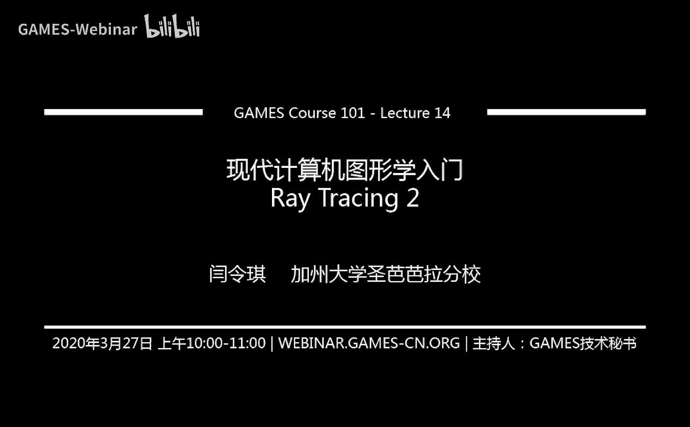
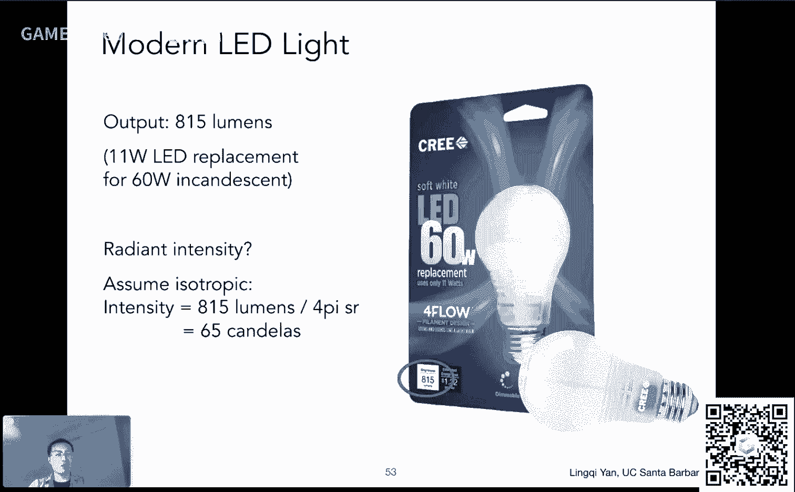

# GAMES101-现代计算机图形学入门-闫令琪 - P14：Lecture 14 Ray Tracing 2 - GAMES-Webinar - BV1X7411F744

亲爱的同学们，大家好，欢迎来到我们的第14讲啊，今天我们讲第二部分光线追踪的第二部分，然后如果时间呃还有的话呢，咱们就把这个呃剩下来的这个辐射度量学给说一说，然后呢呃在这个课程之前。

咱们还是有几件事情嗯，先给大家说一下，一个是呢有同学反映到说这个呃重新提交的这个作业，那我们什么时候批改，什么时候给大家反馈分数呢，这个我们正在积极的这个处理这件事情，这个我现在正在安排啊。

大家稍安勿躁好吧，最后肯定还是会有这个呃这个批改分数的没问题啊，好然后呢这个因为这个星期啊，这受美国的这个新冠疫情影响，然后gtc呃，gtc呢这个我简单给大家说一下啊。

是这个由这个英伟达公司呃组织的一个叫做gpu technology conference，这主要是他组织一个会，这个会呢原本是这个线下的，大家是一起这个这个参加这个会啊，非常热闹。

然后但是由于这个疫情呢，这个嗯gtc这个会议呢变成了线上，然后线上呢他就不会不断会公开这个这个新的技术啊，当然这个现在呢gtc目前公开了两个和这个嗯渲染相关的一些技术吧，然后这里说给大家啊。

一个是doss，还记得吗，super emply对吧啊，然后这块就是相当于是嗯他在做什么呢，这个技术相当于是在做，比如说你去呃光栅化生成一个很小的图，比如说720p的图。

然后它可以把这个图给拉大变成4k的图，并且还不损失这个呃太多说的性能，并且还能让结果看上去不模糊，还还是非常这个的，就是就是非常清晰的结果，那自然就就很好对吧。

就相当于免费得到一个这个4k的这个这个画面呃，非常不错，然后在这里呢我说一下这个技术的主要研发人员叫做刘诗秋，他呢前他他是这个曾经可能是我的师弟哈，我当年我老板给他发offer。

但是他最后还是决定去梅利亚工作啊，呃超级大神，然后他做了这个这个工作呢，呃最近推出二点，而而且他写了一个专栏文章，在知乎里面，大家没事可以看一看啊，然后关于技术方面呢是这样，就是有一个这个嗯gtc上嗯。

应该是这周吧就会发布这个已经录好的一个视频，然后关于这个dlss的技术，我再跟大家说什么时候放出来了，好吧啊，这是一个技术，另外一个技术呢这个gtc，然后它这个呃又有另外一个技术叫做rtx全局光照啊。

rtx gi啊，那这个技术呢目前来说我们还没跟大家说这个关于全局光照的事情，虽然我们一直在提这个事情对吧，然后具体这个到底怎么回事呃，然后为什么我们要放在离线渲染里面来讲，然后它难在哪里。

然后为什么说这个今年大家把它给搬到这个实时渲染里面，然后得到一个非常好的结果对吧，然后像这块咱们之后学了之后的两三节课吧，差不多就应该能理解说这个啊这个实时嗯实时光线追踪。

或者说这个实时的全局光照到底有多么难，然后大家写作业的时候，大家会发现，如果让大家实现离线的嗯，这个全局光照都会花很长很长的时间，然后这是如何做到实时的对吧，都是非常不错的技术啊。

就是这些嗯图形学有一个好处，就是说这个工业界和学术界都在同步的推进嗯，可能关注点各不相同，但是在这两个方面各有各自的这个前沿的这一方面的研究，所以都很有意思，好吧嗯。

简单给大家说一说这个gtc目前我听到的一些这个有有意思的事情，好吧，之后再再再看有没有后续的跟进或者更新啊，那么这是一个嗯通过这两个事情呢，我感觉到说这个最近啊由于这个rtx技术的发展。

然后有很多啊原本是离线的这些算法，然后渐渐的都能够被搬到这个实时的里面来，当然要经过各种各样的改进，然后嗯中间肯定有各种各样的这个需要攻克的问题对，然后但是这应该是一个大势所趋。

就是说之后的这个实时的这些呃，这这这就是应用吧，或者说游戏或者什么就说会更多的用到现在的这些这个离线的技术，当然就会让这个结果变得更好，没问题，但是大家就会问以前的这些这些我们说实时渲染这些东西。

光栅化这些我们教了这么长时间，这个会不会被取代呀，嗯以我个人的感觉是5年之内是不可能的哈，就是说甚至在5年之后，嗯就是说嗯当这个嗯比如实时光线追踪全面的这个普及开来之后。

我仍然会觉得这个光栅化本身有它的价值，然后肯定在很多其他的领域会有这个嗯非常普遍的英语，所以这点呢我倒是不担心啊这么一个意思哦，然后呢这个挡住了一点哈，就是说从这节课开始之后的课可就不容易了，好吧。

这个这可是大家自找的，哈哈哈哈哈，大家想听这个之后的这些这些内容，稍微现代一些的这个生成这个嗯更具有真实感的图像的一些方法对吧，但是话又说回来，这个我本来其实就准备说的没有问题啊。

这个算是现代计算机图形学我们肯定需要接触的一些内容好吧，那今天这个课前咱们说这么些事情好，然后呢咱们从上节课这边开始啊，嗯我们上节课说了什么对吧，我们说光线追踪基本的做法，那从为什么要做光线追踪开始。

然后我们提到有各种各样的方法，我们可以去做光线投射，然后呢waited对吧，turner waited这个大神，然后来提出了一个这个呃这种递归的光线追踪的方向盘，然后光线在任何一个地方都可能发生弹射。

然后弹射之后，然后在它的任何一个焦点都要去算它的这个这个着色，然后最后加回来加到一个这个像素上，那它就是这么一个原理，然后呢这个我们又提到说光线和物体怎么样求教，这是最基础的内容。

说我如果不知道这个怎么算，我怎么知道光线在场景中如何弹射呢对吧，那么嗯我们提到了几个事情，一个是光线和这个影视的表面怎么样去求教对吧，和各种各样的形状。

然后特别的我们提到和这个三角形的球角这块是嗯相当于是最重要的，因为我们这个整个一个图形学里面用到特别多的三角形，所以光线和三角形求角非常重要，然后嗯这块我们提到了，然后我们就提到说。

那我实际在做光线整个场景求交的时候，我是不是真的能光线和每个三角形都求一次交点，再取最近的呢，那是不可能的对吧，因为三角形数量实在是太多了，那怎么办呢，我们上节课引入了一个办法。

嗯叫ex is aligned bounding box，然后从这个逻辑出发，其实咱们不理解成一个盒子，只是理解成各种各样不同的这个相对的平板对吧。

然后对三维情况就是x y z3 个轴上分别有这个一对这个相对的平板，然后我们说根据这个概念怎么样去做光线和a a b b的求交，然后这是这个嗯我们上节课讲的一个相对较难的话题啊。

大家这个呃一样花点时间去了解他，然后把这个这个逻辑想清楚就没有问题，那么上节课我们说到光线和这个a b b求交了呢，咱们假设说现在咱们知道了，那咱们怎么用利用这个光线和这个盒子求交。

那么这就是咱们这节课要提的内容，那么我们会介绍两个概念，另外一种是这个空间划分好，那么嗯在这个之后咱们看时间啊，如果有时间的话，咱们会这个嗯继续说这个这个呃辐射度量学相关的内容叫radiometry。

然后啊这个待会再给大家介绍好吧，那咱们就从这个光线和a a b b求交这里开始，那么现在大家想吧，假如说场景非常复杂，我要去用这个光线啊，和这个场景中这个呃任何一个物体，我想去求教，那么现在来说啊。

就是说我们已经知道，那我先跟这些盒子求教，那我先做这么一个判断，然后如果我认为光线和这个盒子求教非常快，然后呢我这个嗯嗯就是说啊就是说如果呃盒子里面啊有物体，那我先和盒子求交。

然后再考虑是不是要用光线和这个物体求交，那么对于这里就是直接应用这么一个思想，什么意思呢，就是说我先找到这么一个场景，大家看到啊，这里有个场景，当然了，这里画的这幅图呢，能当然更好对吧，这个没有关系。

就整个一个场景呢，呃这确实是一个对的贸易合，没错吧，就是说我在这个做任何光线追踪之前啊，咱们说的是在做光线追踪之前，所以相当于是对场景的一个预处理，预先处理啊，把这个盒子给分成一堆格子。

这里看到的大家二维的场景呢，就是二维的格子了，就是大家看到一个小方块对吧，那么呃划分成格子之后，我们做一个什么操作呢，我们判定啊这些哪些格子里面可能有物体，也就是说格子和物体与物体相交的这些格子。

咱们都把它给标记成某一个类型，这里呢就简单涂成灰色对吧，然后我们说这个和物体相交呢，其实是说这个和物体的表面是否相交啊，我们说的这个并不考虑他这个内部什么对吧，大家知道这个几何上我们表示都是物体的表面。

它内部是空的，而时的咱们不管对吧，然后所以说这个格子咱不涂，就是道理就在这儿啊，那这里呢是有一个地方涂的不对哈，这个右上角这一块，其实这个地方当然也应该涂成这个呃这个颜色的没问题啊。

那嗯这里呢咱们就把这个场景的预处理的解决掉了，那么预处理之后我就知道啊，这在这个场景里面有一些格子呃，中间可能有物体，其他格子都不可能有物体，那么我现在就可以做光线追踪，怎么做呢，那我光线啊。

大家看到这里有一条光线，从左左边这个地方出发，然后大概往右上角去啊，然后他会他会率先和第一个这个这个盒子相交对吧，然后发现这个盒子是有交点不错，可是这个盒子里面没东东西啊。

所以说不用做任何与这个实际物体相交这么一个操作，那当然这里呢我们是假设光线和这个盒子求教是非常快的，光线和实际物体求教是非常慢的啊，咱们这么假设，那这样的话就是说大家会看到这个光线啊，在往这走。

往这个方向走的过程中，它会相交到这么些格子对吧，然后这个格子这个格子，然后然后呢比如说他走到这个格子的时候，走到这个格子的时候，嗯，大家会发现哦这个格子呃光线和它有交点嗯，而且这个格子里面有物体唉。

这就说明什么呢，这就说明光线有可能与这个格子内的物体有焦点，没错吧，那么这个时候呃就会做一个光线与物体的球交，发现啊没交点，没交点呢，没事儿对吧，这个逻辑上说得通的光线与这个盒子相交。

并不意味着光线一定要和这个物体盒子里的物体强调对吧，然后呢呃这个盒子同样判断呃，你和盒子有交点，但是嗯这个和物体没交点呃这个也是一样判断，然后当你考虑到这么一个这个呃格子的时候。

你就会发现哦光线与这个盒子相交，那我判定光线是否和这个盒子里的物体相交呢，诶我发现是和这个物体相交诶，那我就找到了一个交点，那同样道理，我们继续这个光线，然后我们就可以这个找到所有的焦点。

那如果说我们想找到第一个焦点，那么到这儿就可以停了对吧，找到了一个焦点了，也也已经是最近的了行那那这个问题就得到了解决，也就是说啊我只需要做若干次这个光线与盒子的求交对吧。

然后呢我可以避免我这个光线和这个场景中的所有物体求教，当然了，这里大家不要抬杠哈，这个是示意图，这当然就画了五个这个圆圈，就和五个圆圈求教，多简单啊对吧，这个咱不能这么理解啊。

就是说这个我们始终认为啊光线和盒子求教呃是一个很容易的事情，那么这里可能有同学会问这么一个问题啊，就是说我怎么知道这个光线从左边进来啊，会打到这个格子，那他下一次会打到哪个格子对吧。

我怎么知道他下次就是再继续往右这个右上这个传播的过程中，它会打到哪个格子，难道我得每个格子都判断一遍吗，不需要，这里呢简单给大家提供一个最最最最简单的思路啊，这个当然肯定不会是这么做的啊。

最最简单的思路是这样的，这个时候光线往右上方打，那么它当前在某一个格子，那么他下一个打到的格子要么在他这个这个右边，要么在它上面买对吧，所以只有这两种可能我就判定和这两个格子是否有交点，不就完了吗。

然后再取最近的，我就可以把这个光线往右或者往上移动一个格子，那这样走就对了，那么我说这个算法吧其实是有道理的，为什么，这就是在我们的光栅画里面，其实没有提了一个话题，叫做如何光栅画一条线。

这个我们之前说我知道如何光栅画一个三角形，对不对，那如果说我要画一条线怎么办，我在屏幕上画一条线怎么办，这个线可不存在什么内外对吧，然后那这样的话这个线会占据哪些不同的这个像素呢，对不对。

然后这个道理就是就是说啊这个大家如果读这个相关的书，就比如说咱们那本古书啊，这里面就会有就是光线就就如何光栅化一个一条直线，这里和这个光线如何在三维空间，在二维这个平面内啊，找这个格子。

而是完全一样的道理，那么在三维情况下，同样也是这个有一定的算法能够直接告诉你啊，告诉你光线在格子的某一个位置，并且往哪个方向去，然后它的下一个格子是谁，这个是可以得到的好吧，那咱们这里不多说。

那么道理呢，其实就是说啊我多做一些这个光线与盒子求交对吧，当然我不想多做光线与这个物体求交，那没问题对吧，那么这个时候呢自然而然就会有一个这个事情，他会问说我把这个空间划分成格子。

那么我们现在先来看一个最简单的情况，那我假设说啊，我把这个整个一个空间划分成一个1x1x1的格子，那也就是说我基本跟不画格子一模一样对吧，然后呢这是一个极端，那另一个极端大家可想而知啊。

这个时候是格子太稀疏了，那如果格子太密集了，怎么办，那格子太密集，就意味着你得做好多好多次光线与格子的求教，对不对，那这样的话是不是这个效率就下来了对吧，所以中间呢一定得有一个平衡，然后正常情况下呢。

这个人们发现了一些这个启发式的算法，说白了就是找到了一些这个这个在实际中呃，这个效果不错的数是什么呢，大家去找说这个我要把这个空间划分成多少个格子，然后这个这个格子的数量啊。

应该是这个嗯这个这个某一个常数乘以这个场景中物体的数量啊，这个常数正常，大家试出来这个耳机这个没有什么意义啊，就基本上来说大家知道这里有一个平衡在里面，就是说呢就是说格子不能太稀疏，也不能太密集。

这就对了对吧，然后呢呃当然这并不是大家在实际中这个采用的方法对吧，因为大家会看到这里，毕竟这个光线还是要走过他所相交的所有格子还是挺费的对吧，那么呃我们回到这个格子这个这个解法上来。

那什么时候效果会比较好呢，那那咱们看这个例子，这个例子里面啊，大家就单看这个离地面一段距离的这么这么一个例子，大家会发现啊，在这个场景里面，基本上来说各个地方都有一些几何的这些物体对吧，而这种情况下。

它这个格子的这个这个效果就比较好，我们可以期望比如说经过几个格子就会达到一个什么样的物体对吧，这是一个意思，然后我们看另外一个情况，对于这个场景来说就不是的，这个场景咱们这个这个之前提过这个嗯。

一点点对吧，然后就是说这个格子反映的是什么问题，这个格子反映的是大家看整个一个场景啊，就是说呃有各种各样的数目啊，什么东西，但是这次咱们不看，这次咱们看的是什么呢，咱们看的是场景中空的地方。

什么什么空的地方呢，比如这个楼，这个楼它是一个这个四面都有这个墙对吧，中间围出来一个整个空的地方，虽然有树啊，有这些东西，那比如说大家看这个整个这么一个区域啊，这个可不都是空气嘛对吧。

那这这块就是非常非常空的地方啊，整个这些地方也是非常空的地方，就这个场景啊，会会存在一个什么问题，就是这里说的问题，所谓teapot in a stadium problem是什么意思。

就是说在一个运动场里面的运动场，就是各种球场都非常大对吧，那中间放了一个这个茶壶，那这样的话大家你想你要把这个这个运动场，我给切成空间中的一个这个格子，但我得多少个格子，我得走多少格子。

我才能达到这个场景的中间，找到这个和这个茶壶的这么一个焦点对吧，这就是说啊场景呃它在这个不同的这个这个位置呃，像这种出现这种这种大规模的集中这种情况，然后大规模的空白，来解决问题对吧，那当然了。

这是最早期大家的一个简单尝试啊，然后就是说其实其实直到今天在某些的这些应用上啊，这个格子这些方法仍然是挺好用的，特别是在一些这个gpu实现的一些算法上，好吧嗯咱们这里给大家说到。

就是说为什么还要提这个技术，是因为这个技术在某些情况下确实挺好用好吧，叫做空间划分好吧，然后这个空间划分到底是什么意思呢，那其实就是基于咱们这个刚才这个格子啊，它的不足之处，那我们想一想啊。

这个格子它这个比如说它的大小各处都是相同的对吧，但事实上来说，我们觉得这个格子在指在这些稀疏的地方，是不是不需要用这么这么多格子，你比如说在整个一大块全是这个空气的，这这种情况下。

我用一个大一点的格子不就完了吗，干嘛要用那么多的小格子呢对吧，然后在这个物体它这个分布的比较密集的地方，我多用一些格子是不是就ok了，用一些更小的格子对吧，这这这样一个想法就非常合理。

那么这个空间划分呢其实就是说的就是这么一个道理，那咱们看几个例子啊，这个空间划分，这是这并不是说从这个图形学上产生了一个问题啊，这个问题很早很早就有呃，然后呢在计算几何上大家有各种各样的研究啊。

图形学呢作为一个应用，然后它这个应用了各种各样的空间划分结构，大家看到三种，这个给大家举个例子哈，这个所谓ocr左边啊，这个呃说说是叫ocitory啊，然后就大家正常连读就念成ocitr。

然后kd tree和这个bsp锤，然后哎这都是什么意思呢，这个大家直接看这些图就非常明确了，比如说咱们看左边的这个orchestr，这个orrin呢呃它是中文名字叫做八叉树，八叉树太好理解了对吧。

大家学过二叉树呢，八叉树不就是一个节点，它有八个子节点嘛对吧，然后他为什么八个子节点呢对吧，怎么想这么一个问题，其实他做了一件什么事儿，他是把整个一个场景啊，为什么是切成八份，因为它是空间中的一个对吧。

一个一个这个立方体，类似一块豆腐对吧，我横着竖着这个这个，然后在这个前后这么切这么一刀，然后三刀下去，那就是八块，那么这里呢简单是画成了这个二维的情况，那当然我切了两刀刀，最后变成四块对吧。

然后也就是说啊这个这个八叉树它在二维情况下其实是个四叉树对吧，如果是个线段情况下，它就是个二叉树，道理是一样的，就相当于我把这个空间啊切成，咱们就以这个这个呃平面上来看啊，切成四块。

然后呢我对于每一个子节点，我再把它切成四块，然后然后就是说这里呢只给大家画了这个左上角切成四块，事实上来说啊，这些地方都需要切成四块好，然后然后这个这个右下这块也是，然后到什么时候呢。

比如说咱们可以定一个规则，什么时候不切了，比如说我可以切出一个，咱们以这个右下角为例哈，咱们再切成四块之后，我会发现诶这三其中有三块它都和任何物体都不相交，那这三块我就没必要继续往下切下去了对吧。

就保留这么大就可以了对吧，然后呢，那如果像这边是这个呢，往下切，我发现我切了已经够小的了，然后下面还是有那么几个物体，那就差不多咱们停下来就好了，就是说啊这个呃停下来什么时候停下来。

这是取决于各种各样不同的标准，但是有东西这个这个当你这个划分到某一个格子，它是空的，或者说里面有足够这个数量的物体，足够少数量的物体，那就差不多可以停下来了，对不对，然后并且把它组织成了一个数据结构。

那么这里呢八叉树一个最直观的理解方式，但是呢人们不喜欢用这个八叉树呃，什么意思呢，就是说这个刚才咱们也说了，在这个平面情况下，八叉树其实是四叉树对吧，然后在三维空间中它是八叉树。

那要是维度再高一点怎么办，那比如说四维或者其他的维度嗯对吧，然后那就变成二的多少次方的这个这个差的数对吧，那这样的话显然并不好，那怎么办呢，人们就发明了一种这个办法，然后能让这个这个呃这个空间得到划分。

并且呢它和维度也没关系啊，那这当然非常好，这就是大家发明的叫做kd tree，就是这个意思，那么所谓这个kd trade是做了什么事情呢，和这个这个八叉树啊，我几乎完全相同。

只不过只不过每一次他找到了一个这个这个格子，它总是沿着某一个轴把它给砍开，就砍一刀，把它砍成两个，永远是这么做，那大家来看哈，这个整个这么一个空间，它是一个呃方形诶，我砍一刀这个水平的啊。

然后呢形成了上下两块，对不对，然后上下这两块呢，我再分别这个数值的砍一刀对吧，然后呢咱们就比如说就看上面这块呃，我竖直的看一道，然后呢这个左边这个右边，然后我再这个继续做下去，然后水平的砍一刀。

然后呢这个这个左边的这个上和下呃，我在各自这个竖直的就这么砍一刀下来，那那整个这个这个空间就被划分成这个类似二叉树的结构对吧，每一个节点它都都是只有只有这两个差，它只会这个被分成两个区域。

并且从我刚才描述的这个过程中啊，大家应该是不是看到这个这个叫什么来着，就是说这个这个嗯有一点嗯我说的一个细节上的一个事情啊，就是说呃为什么一开始我在第一个格子这里啊，就算是水平的做那个划分。

然后形成了这两个格子竖直的做一次划分，然后他们再形成了两个格子，我又水平的做了一次划分，然后之后呢再形成两个字，再做数值的划分，大家会发现它是交替的对吧，而我水平的划分形成了两个节点。

唉这两个点再在同一层上，我都用数值的来划分，然后呢在这个在他们的下一层，我再用水平的来划分，而这样一来呢，我就可以保证这个空间啊，那要不然我一直沿着x划分，一直水平能看出来对吧，这就变得越来越窄。

越来越窄，那肯定是不好的对吧，那所以说我们用这种方式呃，那么在三维情况下怎么办呢，那就是每一层我分别沿着x分成两个，然后下一层给的l y，然后再下一层沿着z。

然后再回来x y z x y z不断这么循环，那这样一来他就会发现哎，最后我当然是把这个这个空间分成了这么些这个不同的部分，并且这个嗯嗯仍然这个怎么说呢，保持了一个二叉树的一个性质，那所以它就非常好。

那这个就是我们说的这个kd tra的原理，那么同样道理，这里呢还有很多不同的这些划分方法，比如大家看到这里的这个bsp数，这个b s b数呢，这个它这个是对空间的一个二分的方法啊。

然后那么它的划分的方法其实也很简单，就是每一次呢我选一个方向，我去把这个这个呃节点给砍开，比如说像这里啊，这里先选这么一个斜着的方向，然后对于左上和右下呢，我们再选这个这么两个不同的方向。

然后这个不同的这个空间我再选不同的方向，那么它和kd tree的区别就在于它不是横平竖直的看的对吧，那我们之前说我们教大家这个aa bb对吧，a a b b的好处就是说我是非常好计算，它是横平竖直的。

xyz分别都是平行的对吧，那那这样的话，那也就是说bsp锤，那当然在这方面上赶不上这个kp税，所以这就是为什么咱们这节课呃，主要给大家介绍的就是这个kd锤这个意思，并且bsp税还有一个问题。

就是说它在维度高的时候，仍然仍然是有一个不好计算的这个这个这个情况，而且会越来越不好计算，为什么呢，因为大家现在看到一个二维的一个这个格子，我需要砍开，我用一条一条线就行了，那如果是三维的格子。

我想把它砍成两半怎么办呀，我得用一个平面，对不对，那如果是四维的或者更高维的，我们就需要需要用一个所谓超平面，那当然会越来越复杂啊，然后当然这个kd是税，这是最简单的对吧。

每一次我沿着x或者y或者z拆成两份，两份就可以了，那大家问高维怎么办呢，比如说四位x y z w就这样说对吧，那这个一直这么循环往复对吧，所以没问题好，那么这就是这个基本原理，那咱们实际看一个例子啊。

就是说我们说这个kd tree同样它的构造是在我做光线追踪之前，咱们把这个事情先先明确下来，给你一个场景，先建立k地税，我们再考虑如何与光网线求交好吗，那么这里呢就是就是咱们看一看这个呃这个例子。

那首先呢咱们看整个一个这个场景，最大的这个盒子，然后呢我们先假设呃，我们一开始沿着这个竖直的方向把它给分成两部分，一个是蓝的，一个是绿的，没问题啊，然后诶对于这两块咱们说清楚啊，对于刚才那个蓝的。

就是左边这块和右边这块，咱们都需要把它给砍开啊，这个我说清楚，然后只不过这里呢给大家这个这个介绍这个这个例子呢，然后咱们用这个其中一半，然后来给大家做解释啊，也就是说这个蓝色要如法炮制。

然后继续往后面做这个空间划分啊，然后我们看到这个右边这一部分呢分成两块上下的两块，然后呢我们如果在看这个右下的这块，当然还是一个道理，右上也要分啊，只不过没换啊。

右下咱们再分成这个用竖的把它分成左右两块对吧，形成三和这个这个地区也就是四和五的这个这个呃并集对吧，然后这个地区我们再考虑它是在这一层，让我的水平能把它分开，分成四和五三，当然也要分开啊。

就是说呃我们这里画的是这么一个这个这个呃，每一次我就考虑一个格子应该如何往下划分，但是都要划分啊，那么它就会最后形成一棵树，很简单对吧，那么嗯这就是它这个这个实际过程中如何去操作，那么我们想象一下啊。

就是说如果我把一个整个一个空间划分成了，那么我其实呢在这些中间节点的a b c和d我只需要记录好，它会被划分成呃其他的什么样的格子长什么样对吧，我只需要在叶子节点，只需要在它的叶子节点。

就是我决定不再划分的这些地方，我来实际存储它的这个嗯就是三角形啊，或者什么，就是说和这些和这些地方相交的这么一个和这些格子相交的几何形体，都存在这个叶子节点上，好吧，那就是这么个意思，那咱们总结一下。

就是说啊咱们这个如果要设计一种数据结构，那咱们就是说对于任何一个这个节点，然后我都应该知道它是它当前是应该沿着哪一个轴去这个呃划分，那我当然知道，如果它就生成了这个子节点之后。

那当然就会变成他的下一个对吧好，然后就是当前节点沿着哪一个轴划分，然后并且这个划分在哪儿，咱们之前给大家的例子一直都是划分在中间，其实谁也没规定，一定得划分在正中间对吧。

然后我可以这个随便定义一个没有问题，然后这中间就有各种各样的技巧，怎么样定义是最好的做法，画在中间是不是最对的对吧，就是好像大家做二分查找一样，这个谁也没告诉你，一定得在正中间做这个二分查找。

然后但是嗯对吧，大家都这么做，但是你也可以这个不画的重点嘛，对吧好，然后呢对于中间节点来说，一定有它的这个子节点，子节点咱们刚才说清楚了，既然只划分一次，也就是说一定是两个子节点，没没问题啊。

然后这个呃我们说一下呃，实际的物体或者三角形，咱们不存在中间节点上，只存在这个这个叶子节点上，好吧，那这样一来整个一个这个数就算建成了，那刚才呢咱们是说这个呃叫什么呢。

就是说这个呃一个这个kd tree啊，他是怎么样建立的对吧，我们我们刚才说他是在这个之前，在我们做光线追踪之前，那么咱们可以看看这个结构将如何，那咱们看一看，现在实际上来说呢。

咱们假设有一个光线从左上到右下对吧，那从左上到右下，那我就就做这么一个判断啊，首先他能看到的哦，然后他判定一下是否和a有交点，没问题，他发现有交点对吧。

那也就是说嗯嗯那这条光线就有可能和这个和这个盒子的左边和右边，这两个子节点都有可能有交集，所以他说他也应该继续看下去，那然后呢这个大家看到啊，这里是发现有焦点没问题，然后这就说明这个他需要考虑呃。

和这个最大最大的外面这个盒子所在节点，要考虑它的子节点是不是也有交点，那他会发现哦，它在这里呢和这个呃和这个左边这一块儿，也也就是说这个1号这个区域，蓝色这个区域啊也有焦点。

他找到了tmt max嘛对吧，然后呃这里有焦点嗯，但是这里呢咱们假设说这个数就长这样哈，就是说假如说我到这个一这个地方，我真的不划分了，但是一是一个叶子节点，那那咱们就听着表示说啊。

那这个时候我这条光线应该和这个叶子节点里面的所有的这些物体，都要求交了对吧，没问题，然后如果这这就是这里哈，咱们把这个说清楚，左边这个区域按理来说应该是要继续划分的，但是在这里咱们认为它不继续划分。

因为我们给大家的这个例子来说，就是这么这么画的一个很很y的一个这个kd锤，然后这个这这里这个左边这个蓝色区域就认为是叶子节点了哈啊，ok那这样的话，那它就会和叶子节点里面所有的物体求交好，然后同样道理。

我刚才说啊，整个这个光线和最外面这个盒子有交点，那它势必要和两个两个这个这个子节点都要判定一下是不是有交点，没问题哈，然后那它同样要跟这个右边这么一个区域也要求焦点，他会发现哦，右边也有交点，好没问题。

那么怎么办呢，这个时候就意味着这个b会分出二和c这两个区域来，就意味着光线既然和b相交，那就有可能和二相交，和c也相交，那这两个区域都得派那行，那咱们现在呢就是说再判一下这个二这个区域。

这个区域发现还是有交点好，没问题，但是二这里仍然我们认为啊，假设它不再往下分了，它是一个这个叶子节点，那我就要和这个叶子节点里面的所有的物体求交好，没问题，那么呃这里呢我们再看嗯。

它和这个上面这个判定了交点之后，还要和这个右边这个判定焦点对吧，然后呃和和和这下面这个判定焦点啊，然后发现同样一个焦点没问题，那也就是说啊光线和c这么一个一个节点有交点。

那也就是说他必须得判定c的这个两个子节点是否有交点，那么同样道理啊，继续判定和这个三呃有交点，发现在这里，那而且30页的节点就要和这个三里面的所有物体就交，然后呢这个和左边的这个这个d同样道理啊。

再怎么回到这个这个上面来，和左边这个这个d这个区域同样应该去这个求教，直到你这个求交到这个这个呃所有的这个和他们相交的叶子节点对吧，那么在这里呢。

这个五也就是对应这个粉红色区域和这个光线是没有任何交点的，所以说光线没有必要判定和这个五里面的所有的这些嗯，三角形是否有交点好，那么这就是实际这个我们如何去利用这个kd tra。

大家会发现其实道理很简单，如果光线和某一个这个格子对吧，没有焦点，那什么都不用做，那如果光光线和某一个盒子有交点，那我就知道光线和它的两个子节点可能都有交点，所以都判一下，直到什么时候呢。

直到说光线打到这个叶子节点，那么什么都不用做，那么如果说达到叶子节点，并且光线和叶子节点有交点呢，那就是光线和这个叶子节点里面的所有物体都要求这个交点啊，那就是这么回事了，那也就是说啊，咱们想象一下。

如果这个这个呃光线啊，这个光线，当然这这个里面呢它和很多东西都有交点，如果这条光线往右边偏了那么一点点啊，往右边偏了一点点，那这样一来呢我就会知道哦，这个光线和这个蓝色的这个整个一块都没有交点。

那不管这个蓝色里面有多么多的物体，不管这个蓝色的区域下面有多少个子节点，什么我都不用再看了，就等于一下就可以排除掉好多好多不同的这个这个三角形，因为什么，那光线怎么可能和里面的东西有交点呢对吧。

所以道理就在这儿，那通过这个这个呃kd税的这个这个建立，咱们就可以用一个类似这种二分查找的方法，找到这个光线和什么样的物体有交点好吧，那当然了，如果要求最近的焦点，那咱们就一直这个这个求出所有的焦点。

并且记录永远记录最近的这个好吧，那这里就是这么做的一个呃这个这个简单办法哈，然后唉最后会找到这么一个焦点，那然后咱们进入下面一个这个话题哈，嗯就是说啊空间划分，这是一种方法。

然后呢通过这种kd trip的这种空间划分，我们可以找到一个交给，那么呃现在呢有一个事情给大家说一下啊，有的同学会问到这个事情啊，说我怎么我我我我怎么这个呃，我们不是说我们对这个对这个场景做这种划分吗。

然后划分出来这些格子，然后这些格子这个到底和哪些物体相交对吧，比如说我们知道这个粉红色的格子和这个圆圈就相交对吧，这这些我怎么判定这些很难排的真的，然后就是说我们一直没说这个事情。

就是因为对于这个kd tree它有一个明确的问题，问题是什么呢，如果对于这个场景来说，这个场景全是三角形构成的，那么你通过空间划分的方式，势必产生一个问题，就是说啊嗯我给你一个节点啊。

我得知道它和哪些三角形有有交集，这是一个非常非常难的事情，很不容易写对哈，这个算法是有的，但是你很难判定一个三角形是否和这个和这个嗯这个框有交集，或者和一个这个的立方体也有交集，为为什么呢。

你比如说大家可以想一个简单的办法，那比如说嗯三角形是不是只要有一个顶点在这个嗯，在这个盒子里挑两个就算相交了，呃是没错，但是有时候会出现三角形的三个丁点都不在一个盒子里，但它们却是相交的，怎么怎么办呢。

很简单，你想象一个这个平面中的一个三角形，然后有一个很小的这个盒子是插进去，这这可不就是说对于这种情况来说有交点，但是呃这个就说这个这个三角形一定会这个被会被这个盒子表示对吧，这个这个盒子肯定会表示哦。

它和这个三角形有交集，所以说他一定会把这个三角形放在这个盒子呃，所表示的这些物体里面去，那这这个交集就非常难判断对吧，所以说这就是为什么说这个嗯就是反正在最近的10年之内吧。

就是渐渐的大家就再也不用这个kd吹了，这是其中一个原因，它不太好写，它需要涉及到这么一个问题，你要真有一个三角形，我怎么才能把这个这个这个三角形和一个aa bb是否有交点，这么一个事情给做对好吧。

很难啊，没问题，那么这是一个事情要给大家说的另外一个问题是这样，就是说啊大家比如说看这么一个圆圈啊，这个圆圈它其实和很多不同的这个呃这个a a b b啊，它都有交集。

比如说它和这个大的这个这个这个框对吧，然后这个小的框也是右边这个橙色的这个框它肯定是有交集的，那这个物体同样又和这个粉红色和这个左下角这这么个颜色嗯，有这个颜色有点奇怪，左边应该是这个应该是紫色啊。

右下应该是粉红啊，也就是说这个圆圈它可能和不同的盒子都有交集，那如果这几个盒子咱们都认为对应345对吧，都是叶子节点，那么我在三这个这个节点里面，我要存这个物体，我在四这个节点，也就是这个节点哈。

它和它和和这个物体有相关对吧，那也就是说四里面我也要存一个这个物体，五里面同样这个五对应这么一个区域啊，它和这个圆圈也有相交，那就说明五里面我也要存这个物体，那就说明什么问题啊。

就是说一个物体有可能出现在不同的，或者说多个这个叶子节点里面，当然是有道理的，因为一个物体它确实有可能和很多不同的这个这个呃节点相交嘛对吧，那没问题，那就是说这么一来的话，就是说它有这么一个性质。

其实并不怎么好对吧，人们不希望这样，人们希望说我一个物体，最后我就在一个叶子节点里面多好，我干嘛要这个把它这个考虑到几个节节点里面，都有这么一个物体这么一个性质对吧，所以从这个角度上来说。

kdj在这一点上并不直观，那么我们现在已经提到这么两个问题了对吧，一个是物体可能存在于多个不同的格子里，然后呢另外一个说kd税的建立并不简单，需要考虑三角形与这个呃这个盒子的求教对吧。

我要我要把这两个事情做对，很难，那么怎么办呢，人们就发现了啊，于是我有另外一种办法，同样呢也可以做划分，但这次的划分咱们不是从空间做起，咱们是从物体做起。

这就是我们要给大家介绍的所谓object partition，我们通过物体来划分，叫bounding volume hierarchy，这个结构得到了非常非常广泛的应用，在图形学里面，现在几乎来说了。

大家做各种各样不同的，不管是实时的这个光线追踪还是离线的这些结构，嗯，大家基本上用的都是这么一种结构，因为他解决了刚才这个kd税的两个问题好吧，怎么解决了，咱们看一眼好吧，那么同样道理。

这个一开始给你一个场景，这是一样的，那么这个b v h是怎么运作的呢，呃咱们可以看一看啊，这个b v h我刚才说了，它划分的不是空间，它是把物体分成两个部分，比如说这里大家看到啊。

那肯定根节点它就对应一个这么一个方框，然后呢我把这些物体也就是说啊这个方框里的所有三角形诶，我把三角形分成两部分，有分成左边一部分和右边一部分，至于这个左右怎么定义，咱们再待会儿再说啊，就是说无论如何。

你可以想一种办法，把这个这个这个一个盒，一个盒子里面的所有三角形组织成两部分，组织成两部分之后怎么办呢，那么大家就会看到啊，这里把这些三角形分成蓝的和黄的两部分，形成了这么两个节点好，那没问题。

那然后同样道理，咱们继续划分划分谁，还是划分这个这个呃物体啊，比如说咱们以刚才的那个蓝色节点为例，现在呢咱们又把它分成两对三角形，对应这个蓝色的和这个绿色的，当然这个黄色的我们同样也往下划分啊。

然后就是说划分到什么时候为止呢，那当然也是划分到，比如说嗯一个节点里最多只有五个三角形，那就差不多咱们就不再划分了，可以没问题对吧，那然后这个划分呢同样道理也可以用类似kd tree的方法。

比如说我在某一层诶，我是按照左右划分，然后再看下一层，我就按照上下来划分，那么它的一个这个和这个kd税的这个区别，咱们就这就说清楚了，对不对，ttree呢，我不管怎么样，拿到一个节点，先把它分成两半。

再考虑这两个这个节点和和这些物体的这种相交情况对吧，然后呢这里a b v h呢做的事情是说我把物体呃里面分成两堆，我分别在重新求它的这个这个呃呃bounding box对吧。

那么这里看到了这个b v h里面的，这样就明确的可以看到它的一个性质了，什么性质呢，物体一个物体只可能出现在这个一个格子里面，没有问题吧，呃就比如说这个大家看这个绿色三角形。

但它却不在这个蓝色的这个格子里啊，没问题啊，就是说他解决了kd是这么一个问题，并且啊咱们通过刚才的过程来看，a把三角形分成两堆呃，挺好做的，就取它们最小的x最最最大的是最小y最大y z然后z对吧。

这这就是说我完全不涉及到数三角形和这个保温和求交的，对不对，所以省去了这么一个问题，非常好，那咱们不用判这个事情诶，那当然大家很喜欢对吧，那么就是说啊这个bvh避免了kd吹的这种问题。

就是说呃一个一个呃几何结构会出现在多个不同的格子呃，叶叶子节点里啊，然后嗯但b v h引起了一个问题，什么问题呢，就是说啊b v h它对空间的划分其实并不是这个严格的划分开，就是这个意思。

也就是说啊这些不同的这些呃所谓bounding box啊，这个它可以相交的对吧，我原本说这个绿色的这个这个呃，蓝色的这个这个稍微大一点的这个格子还是长这样，然后我把它分成两部分之后。

那有可能相较也没什么问题对吧，我们这个就是说啊我们把物体反正组织成这种形式，只要说我不是说把这一堆三角形啊，咱们说比如说我认为这个大的这个绿色三角形也是蓝色的啊，然后我认为这个左边这个蓝色的三角形。

它是绿色，就等于是说我这个划分画的不好，对不对，就是说我要想把这些不同的几何，然后给给用一个很好的方式划分，我觉得尽可能的让他们的这个这个之间的这个所谓重叠啊变得少。

就是说大家看到这种方式其实画的不错的对吧，但其实来说，比如说这个黄色三角形，你也可以把它给画画给左边这个区域对吧，然后就是说关于怎么划分很有讲究，这就是为什么说这个bbh这一方面。

这个有很多很多不同的研究在做这个事情好吧，诶那这样一来，那关于b v h和td税，咱们就说说清楚了对吧，咱们在这个同样可以看一些这个实际的这些做法，咱们刚才说的时候其实没有继续继续讲哈。

咱们比如说再继续看左边这个蓝色的这个框啊，左边蓝色的这个框我们还可以继续分，比如说把它分成上下两个部分啊，然后这个把物体分成两堆，诶，然后我就可以得到这两个部分对吧。

然后就是说我这个过程可以继续进行下去，指导说我这个嗯表示我每一个这个叶子节点里面，这个三角形数量都已经比较少了，就差不多了好吧，那咱们可以总结一下怎么做的呢，这么一种方式把它拆成两个部分。

那这个这个过程就可以无限这么递归下去呃，那么什么时候停下来呢，正常情况下我觉得当叶子节点里面，正常情况下只要有足够少的三角形就够了，那么同样我们把这个物体实际的物体记录在叶子节点里。

那么其他的部分都用来做这个家族结构的判断好，那么这里就是bbh怎么做的好，那么这里呢刚才其实已经给大家提到了，说我实际上如何去划分一个节点对吧，然后就是说啊啊那我肯定也是要选一个维度去划分。

我每一次呢我选择一个不同的维度，我这次取x下次呢我就用y，然后呢呃有一些其他的一些技巧，比如说这里的一个技巧很简单，就是说啊当我发现啊，比如说我的所有场景，就是整个一个场景啊，都在一个长条里面。

都在一个长条里面，那我划分了之后，其实两个节点还挺长条的对吧，那我应该还是按照这样这样数值吧，来给这个看开对吧，也就是说人们发现啊，为了让这些这个三角形嗯，每一次就是说给我任何一个节点，我什么都不管。

我就只沿着它最长的那一个轴把它分成两半诶，这其实是一个挺好的做法对吧，他就让这个让这个最长的这个轴变短，通过这种方式来保证这个之后通过划分，xyz也都差不多长度对吧，哎这是一个不错的办法。

然后呢当然也有很多其他各种各样不同的这个这个做法哈，然后咱们这里呢在这里呢再给大家说另外一个，这个人们发现出来的技巧什么呢，就是说我我一个这个节点里面啊，现在我知道他要怎么样去沿着某一个轴去划分了啊。

比如说这个都在一个长条里，然后我沿着这个这个轴的某一个位置，把它不是沿着某个位置啊，就是说我怎么把这个呃这个节点里面的所有这些物体分成两半，然后并且我再分分别来求呢。

那么人们发现了一个简单办法是如何把物体分成两半呢，我取中间的那个物体，所谓中间的这个指的是这么个意思，就是说啊咱们假设说有1163角形，从左到右，然后一直这么排着。

然后从一到到n那咱们就找这个它的中位数，也就是d d2 分之n个三角形对吧，你比如说啊这个嗯这n个三角形它有好多三角形都挤在左边，只有一个三角形挤在在在右边对吧，像这种情况下。

他找到的是一个中间的这个三角形啊，就是就是说这样可以保证一个什么事情呢，就是当你把这个三角形呃，呃这个分成两部分之后，这两部分的三角形数量差不多这么个意思，这个三角形数量差不多呢。

那关于这个事情我就不再多说了啊，数据结构里面经常大家会说这个事情我要保证这个数平衡，然后让他的这个两边的这个叫什么呃，深度尽可能差不多，那咱们既然是把物体分成两半，那我每一次左右两边都用相同数量的物体。

那这个数可不是能更平衡吧，更平衡就意味着最大的深度小啊，就意味着我平均的这个这个搜索的次数是小啊对吧，这里不再多说啊，数据结构大家上过都应该明白，那么就是说我是这个把这个物体呃找到它的d呃。

这个二分之n个啊，假如说有n个的话好，那么这里呢大家就想这肯定涉及到一个排序问题对吧，我假设我已经决定了要沿着某一个轴去这个嗯把三角形给考虑进去，那怎么办呢，我把这些所有的三角形都取它的重心。

因为三角形它本身有大小嘛，咱们假设说就取三角形的重心，然后呢三角形的这个这个重心呢，然后它的这个呃比如说我要沿x轴，我就沿x轴做排排一个序啊，然后呢排个序之后，那我就知道他的这个中间的那个在哪里了。

然后这个把这所有三角形给分成两个部分，当然是可以的，但是呢这个过程中啊，就是说呃你其实如果只要找一个中位数的话啊，这个是不需要排序的哈，这里就是说嗯简单给大家提一下吧，就是说既然这个课是一般应用嘛。

咱们刚才说数据结构让这棵树尽可能平衡，咱们现在再说一说算法，说你这个怎么样把这个嗯一个一个序列吧对吧，你有一系列的数对吧，你要快速的找出它的中位数，这个算法是时间复杂度是多少的呢。

那如果你要把这个把这个所有的这些呃物体啊，呃呃不是所有这些数啊都排个序，那就上来就是n log n对不对，然后呢你再取中间的那个就是它的下标是中间那个没问题，肯定是可以的。

所以n log n你肯定能够找到它的终点，但事实上来说你是不需要的，就是说啊对于这么一个问题，咱们简单简单这个总结一下啊，嗯这不要总结一下，这算是这个给大家说一说一个更更更通用的这个算法。

给你任意一列数无序的啊，然后说你要找到它第n大的数，然后这个这个呃这个n说的不好，di大的数吧好吧，然后就是说你要找它最大的数呢，就是第一大的数，然后你要找它的中间数的这这个中位数。

那就是d2 分之n大的数没问题吧，然后就是说啊呃这个通用的说法就是说给你一系列无序的数，然后呢你要找他的d i大的数，这个问题是可以在o n时间内解决的，而且这个算法呢叫做快速划分算法。

这个算法是受这个快速排序的启发，只不过呢它只对对这个呃你划分出来的两边的这个某一边进行操作，那咱们这里说到这儿就不用再多说了，好吧，之后想了解这个算法的同学们，自己随便去找一找这个各种各样的资料就好了。

也就是说啊我们回到这个话题上来啊，人们发现了这两个比较聪明的做法，第一我永远沿着最长的轴把它分成两部分，第二我分成两部分，一定保证说两边的这个三角形数都基本差不多，好吧好。

那么这里呢给大家这个这个就说到这么一个这个这个概念上哦，我说错了哈，快速选择，快速选择不是快速划分了，快速划分是快速排序中间的一个部分啊，ok没问题，就是说啊这个这个一定是有n n的算法的。

这个不是欺骗大家啊，然后大家在这个作业中会实现这个事情啊，就是bbh这个我要这个呃把它给分成两块，然后要找它的中位数，这个大家随便啊，可以可以排序啊，没有任何问题。

而且c加本身有标准库是可以直接调用它的排序的，挺方便的啊，然后就是说嗯没有什么必要说这个一定要我要实现这个on的算法，就是这个意思好吧，哎这里说到这儿啊，算是多说一句。

我们之前也说这个课没事给大家多说一些这个对吧，这个这个相关的一些内容，然后这个呃对有兴趣多研究一点，这是好事情啊，那同样道理啊，咱们刚才说这个嗯bbh是要不断做划分，然后划分到什么什么情况。

我刚才说和kd税基本差不多划分到当这个呃某一个节点呃，如果它里面只有比如说五个这个三角形小于等于五吧，然后我就不再划分了，那就差不多了对吧，就是这个意思好，那么就是说呃这么一来呢，那有同学问说。

如果场景是动态的怎么办呀，那物体动了一下怎么办呀，然后加了一些新物体怎么办呀，对呀这种情况下你知道没办法，是得重新去计算一个新的这个bh好吧好，那么没问题。

那这样的话呢这个呃继续咱们这个把这个bbh给说明白好吧，然后b a h的存储，咱们刚才说这个k d税的数据结构，那b v a h同样道理，然后和它的这些这个子节点的指针，然后一直到叶子节点。

我们才实际存它实际的这个这些物体嗯，行没问题，ok那这样一来呢，那b v h就算是做好了，那咱们总结一下算法哈，就是说咱们之前说的怎么样去这个呃去做这个光线和bb h的求交，咱们不再赘述。

刚才的那个实际的过程啊，咱们直接给出这个伪代码嗯，就是这个和ktree并没有本质区别啊，怎么用它这个方法是完全一样的，好吧啊，比如说你要判定这个光线和整个一个这个bh的，比如说根节点在这个裘江。

我要找到和它这个节点里面的这些物体的最近的这个焦点怎么办呢，那如果这个光线和这个整个这个bh节点都呃不想交，那就什么也不这个不会发生对吧，那就是后面的内容了哈，就是说如果和和这个节点相交。

我就知道那有两种可能，第一这个节点本身就是叶子节点，那最简单，那这种情况下，就是说我就需要光线和这个叶子节点里面的所有物体都要求求个角，但对于这个物体来说啊，你们就是三角形啊，然后返回最近的那一个。

那呃剩下的情况呢就是这个这个光线和这个节点求交，并且这个节点呢又不是叶子节点，那怎么办呢，它是中间节点，那逻辑上告诉我们，那光线可能和它的这个节点的两个子节点都有可能有交点。

那么我分别求出他俩的交点对吧，然后呢我再返回最近的那个，那当然是一个递归算法了，大家看到intersect在自己调用intersect，挺简单的逻辑啊，然后就是说通过这种方法。

那最后我自然而然就可以把这个呃把这个问题解决掉啊，好吧行啊，没问题啊，好那这里呢b v h那就是这么做的，那咱们之前说啊呃kd税是对空间的划分，然后呢这个我们说bbh是对物体的划分。

那这个空间划分呢和物体划分这个区别咱们就看得出来了，比如说呢kd tra我们刚才其实都已经说了对吧，总结一下，然后就是说我划分的是空间，并且呢这个空间和空间之间，它肯定是就是说任何的节点之间。

他肯定不会有交集，我们把空间划分开了嘛，但是会有一些物体，比如像这个大三角形，他有可能又在左边，又在右边，那没办法，他就是得又在左边，又在右边对吧，他因为和左边右边都有交点吗，那bbh我划分的是物体。

我把物体分成两部分之后，没问题对吧，不耽误，然后呢这个呃就是说呃在实际的这个过程中啊，就是说必备句得到了非常广泛的应用，也就是因为它的这个实现容易，那么这就是这么回事，然后咱们这个目前来说呢。

好那咱们到这里嗯等于是呃光线追踪怎么样，这个算光线与三角形求交呃，我们已经这个知道，我们都说明白了，那这样一来光线和场景的求交就可以在很快的时间内完成好吧。

这就算是这个整个的所谓witted风格光线追踪应该讲的内容，那咱们之后就要讲什么了呢，就是说要开始说一说这个辐射度量学，就是这个意思，还说我为什么说讲这个光线追踪怎么讲，这讲突然讲到辐射度量学呢。

咱们之后很快就会给大家这个介绍这个事情，在这之前先给大家说一说这个事情啊，就是说目前涉及到新课呃，我考虑了一下，就是从这个时间上来考虑，就是说加两节课的内容，其实时间上也非常紧张，所以说呢呃我打算这样。

我打算这个这个从现在开始，我就这么做了，好吧啊，就是就就就这么解决，然后没办法，咱们这客容量实在太有限了，这个这个不容易啊，这个这个算是大家这个这个嗯对吧，对我支持啊。

那咱们今天把辐射度量学稍微多说那么一点点啊，好嗯，然后呢呃这里当然大家看到这个广告的，这我非常自豪啊，这个事情就是说嗯从这里开始，应该就是国内的图形学课不会覆盖的内容，就是说从从这儿开始的话。

就是说我们讲完了wait风格光线追踪之后，剩下来的更高级的光线追踪的方法，然后这里国内不会提，然后咱们呢把这个这个呃这一块儿尽量能够说明白，对于这这个课程本身呢也是一个新话题。

就是说我这门课呢涉及到说是要给这个三学期制的学校上课，就是英文课啊，然后所以说本来客容量就小，所以说可能讲不到这里，所以说这里算是新的这个呃内容，然后就是无论从这节这个课程上来说。

或者说从整个的这个图形学教育的角度上来说，是新的啊，挺好我也很开心啊，那咱们从这里开始说，那那自然而然有同学要问了对吧，咱们说光线追踪，说着说着开始说辐射度量学，所谓radiom对吧，这是什么意思对吧。

那咱们要先把这个问题了解清楚，那就是说啊我们提辐射度量学为什么要提呢对吧，然后得有些这个动机对吧，那咱们看啊，有一些这个事情其实大家之前已经观察到了，比如什么呢。

比如说啊咱们在这个这个呃第三次作业里面对吧，好像是之前才做过，说我们把这个布林冯这个模型写出来，课上咱们也说了对吧，这不林风模型，它这个涉及到一些光照怎么样去做，其中有一个概念。

有一个概念说这个这个光的强度，咱们之前定义它的所谓intensity对吧，然后定义一个i对吧，还记得这个这个这个概念吧，比如说咱们定义这个i是等于几的，i等于十，假如说啊这个代码里面到底给的是多少。

我忘了，咱们假如说l等于十好，那l等于十是是什么对吧，l等于是是是什么东西，十十个，对不对，这不合理对吧，这个光源等于等于十什么呢对吧，我们也不知道他肯定得有个单位，他肯定得有自己的物理意义。

就是这么一个意思，而之前在我们的布林防的这个模型里面，我们把它极大地简化掉了，它就是一个数，那肯定是不对的对吧，那么这是一个方面，另一方面从大家这个已经做了的这个嗯，就是有同学正在做吧对吧。

然后之后算是夹子结构对吧，算是这些作业我们做的是什么呢，就是这个wait风格的光线追踪，那咱们看这个vt的生成这幅图来说，有没有同学会觉得他是真实的，我其实很怀疑这个事情对吧，这是不可能的。

大家一看就知道这个非常假的嘛对吧，这个看上去看上去这个这肯定不是真实存在中的一个场景，因为我们中间做了很多很多各种各样不同简化，大家还记得吗，比如说这里哈大家能看到这个高光。

就意味着说我们做了这个缝shading，对不不不，这个不灵缝的模型做了这个着色对吧，但是如果说是这样的话，那就意味着说我一根光线打进来之后，它应该会反射到一定的区域里，而不是沿着这个完整的这个就呃。

就是说不是沿着完美的镜像方向去对吧，但我们又假设它的反射是这个沿着完美的是镜像方向去对吧，然后折射同样道理也是这么这么回事，就是它能量损失多少，每一次折射不知道没算过对吧。

然后这个可以我自己随便定义一个什么量，这也不对，没错吧，然后就是说嗯并且啊咱们这个回到这个模型上来，这个不灵，从咱们从一开始就在说它有很多不对的地方，虽然有很多地方听上去很有道理是吧。

咱们分析什么这个能量衰减啊，或者干什么很有道理，但是呃它确实在从从一定上角度角度上来说，你想一想单位都没有，怎么可能对呢对吧，所以从这个角度上来说，那咱们回到这个呃辐射度量学的角度上。

我们为什么要学这个，是因为辐射度量学就是一个精准的给我们这个这个实际的这个呃光的，一系列物理量的一个方法，好吧，就是说我们把这个光精确地定义出来，精确地描述出来，然后并且说这个这是涉及到什么呃。

我们刚才说到光源啊，材质啊，呃对吧，光线的传播方法，咱们也精确的把它给做出来，只有这样我们才能最后得到这个最正确的结果，那这里呢就是说我们为什么要去学这个辐射度量学。

而整个一套路径追踪的体系就是之后很快要给大家说的，可以大家可以理解成是所谓高级的这个嗯这个光线追踪，而不是这个wait的风格光线追踪好吧，那都是建立在这个基础上的，所以咱们学啊，道理就在这儿。

那这里就是说为什么啊，那这个到底说我们会学些什么内容呢，对吧，那就是这里就是说啊这个辐射度量学，它表示的是说这个嗯就是说如何去描述这个这个光照，就是这么个意思好吧。

然后它定义了一系列的方法和一系列的这个这个单位，然后呢这个它能给我们光各种各样不同的属性，然后给我们属性，这里呢多说一句，是表示在这个空间中的属性啊，然后咱不说这个光线在时间中的属性。

并且还有一点辐射度量学，仍然是基于这个这个几何光学来做的，就是说我们认为光线还是直线传播，然后就是它没有什么波动性，什么这这些性质啊，咱们不说，那么它定义了这个光光照的若干属性。

咱们这里呢呃我简单停一下，是这么回事，我很努力的在找他们的这个中文翻译，我发现中文翻译的非常混乱，然后就是说就是说这个你用各种各样量的，这个这个这种这种介绍方法都有。

所以说我决定在这里呢这几个概念咱们之后不再说中文了，然后说中文的话，其实我也记不住，然后我基本上用的时候也是就直接用这几个英文的概念说什么呢，主要是这个radiant flux，intensity。

irradiance和radiance，这都是什么东西对吧，那把这个事情搞明白对吧，肯定是物理量了，所以这个辐射度量学其实相当于在五在物理上一个准确的定义，这个光照的一个方法，好吧。

说这些还是挺空虚的对吧，然后但是到这里呢简单给大家介绍一下，这是作为我个人算是这个告诉大家一下，说我个人如果我要学一些什么东西啊，我会怎么去学呃，就是这么一个意思，就是大家会看到啊，这里有这么几个概念。

如果我要去学一个什么东西，我肯定会按照这么一个顺序来，就是说呢我会先问说我们为什么要去学这个东西，然后我们学的是什么，就这个东西是什么，最后最后才会去解决我们要怎么样。

这个就是说这个东西到底是怎么样运作的对吧，然后它的具体的一些方法，这个是整个一套思路，我觉得是一个比较合理的一套思路啊，咱们比如说这个辐射度量学对吧，咱们先说咱们为什么要研究它。

根据这个现在已有的这么一些问题对吧，先先搞明白咱们为什么要用到它，然后它到底在说些什么，然后最后才是说我们如何去用它对吧，然后这个号呢是最不重要的事情，就是说这个这是我这么理解的啊。

就比如说咱们学下来这门课之后最容易忘的其实就是这块，就是还有这一块就具体怎么样做各种各样的东西，嗯，我们这个不希望去做这个呃光线和每个三角形求角，对大家看出来是一个这样的这种树形结构对吧。

然后说我们怎么样去建立这棵树，怎么样用这个数，那都是最最最最次要的问题，好吧，那咱们通过这种办法能够把这些问题这个给了解明白好，那咱们现在就开始来研究这个how这么一个事情，就是说到底是怎么回事。

这个辐射度量学叫radiometry好吧，那么这几个概念又都是什么，那咱们从前面两个概念开始好吧，我们会说这个所谓radiant energy and flux，然后这这这是什么好吧。

那咱们这个尽量能够把这个事情说清楚啊，在这之前先说一下，所有这些量都有明确的物理概念，咱们希望把这个这些这些概念啊和这个真实生活，咱们把它给对应起来，这样好理解好吧，那首先呢最简单先定义第一个量。

所谓radiant energy，然后这个radiant energy是什么东西呢，你这一看energy嘛，能量嘛对吧，然后就是说它是这个这个电磁辐射的能量，那也就是能量，但是知道这些学过物理对吧。

能量是能量用什么来表示对吧，它是用一个单位叫做焦耳这么一个东西来表示这个能量是什么对吧，大家理解成比如说它这个还是一样太阳能板哈，然后大家这个这个在太阳照射它的时候，它会发热，对不对。

然后他会把这个转化成电能，然后这个存下来呃，道理就在这儿，就是说啊这些这些呃就是光源辐射出来的东西，它肯定永远是能量对吧，然后呢首先我们先用能量的去描述它对吧，这是一个好。

然后呢这个呃咱们再定义下一个概念，然后呢就是所谓radiant flux，然后这个flux呢然后人们又经常叫它power啊，这两个是一个概念，就是说呃还是一样啊，这里咱们就不用中文来说了，但是有一点啊。

就是说通常有时候人们也管它叫能量啊，但事实上它不是能量，然后然后它是什么，咱们看啊，就是说这个是能量什么呢，能量这个emitted reflect，transmitted received，这不管啊。

这是也就是说定义这个能量能量什么energy per unit time是单位时间的能量，好吧，单位时间的能量呢是什么意思对吧，就是说给你一个单位的能量，你去除以它的单位时间，大家学过物理。

知道如果我这么做的话，我得到的东西其实是这个功率对吧，没错吧，然后就是说这个这个单位时间内就是产生吧，或者说什么样的能量，这当然就是功率了对吧对吧，就是就是就是这么一个意思。

然后功率的安慰就是w不是w啊，就是就是瓦特，然后缩写上w，然后特别的说一点，就是说我们为什么要研究这么一个单位时间内的能量，或者说功率这个这个概念。

然后呢呃也就是说对应在光学上管管它叫做radiant flux或者power，然后就是说为什么要研究它呢，是因为很简单，就是说如果还是以太阳能为例的话，你照的时间越长的能量可不是越多吗。

那如果我要分析的这个能量来说，我肯定要固定某一个某一个短时间对吧，那所以说在这个光学的这个这个研究中间啊，呃几乎是这样，在咱们整个的这一套这个辐射度度量，这个呃这一套体系中。

大家考虑的都是单位时间的性质好吧，就是说那不管怎么样，你照的时间越长，他肯定就会这个这个越热对吧，物体就是就是这样的，然后呢那我们考虑某一个单位时间，这是有道理的好吧。

那也就是说我们研究的是这么一个问题，就是它的所谓功率就是flex power啊，然后嗯这个在光学中间呢，呃我们要想描述一个物体的功率呃，其实是还是有另外一个单位的，叫做这个缩写成lm，叫做刘明呃。

这个这个说白了其实说明什么呢，说明了比如说一个光源它有多么亮啊，就是就是这个意思就是说啊定义这些是物理上的事情，要理解这些咱们可以对应到生活中去，咱们可以用不同的这个这个能量的灯泡对吧，就是不能量啊。

不同功率的灯泡对吧，然后呢当然比如说我们用个60瓦，60瓦的灯，那肯定不如80瓦的灯来的亮对吧，然后呢就是说就是呃道理就在这对吧，然后就是说我们定义这个功率是有道理的，当然这个灯开的时间越长。

耗费的电费越高对吧，那这个就是咱们上面说的这个能量的意思对吧，然后这个所以说呢这个功率呃，这个这个在这里呢我们就定义它是flux或者power，咱们通常用这个大写的法语来表示啊。

然后就是这么一个定义就表示了这个光的亮度，好吧，这个好理解啊，给你一个灯泡，它有多亮啊，ok那么这个flux这个概念还可以从另外一个角度上来来定义，就是什么呢，就是说我给你单位的时间，我们知道光线传播。

其实光线在辐射各种光子，那如果说我有一个某一个平面，比如大家看到这里啊，这里有一个平面，如果我认为这个平面是一种感光的一种什么东西啊，给你单位的时间，通过它的这个光子的数量。

我们就认为这个就是它的flux，就这个道理其实也很好理解的对吧，然后就这个这个呃一个灯泡它看上去更亮，是因为它单它单位时间内辐射出更多的光子，没问题啊，那也就是说这个这是另外一个这个物理上的。

这样这样一个实际对它的一个定义哈，咱们这里简单给大家说一下，当然那咱们回到刚才这个flax或者说power上面，其实就是定义这个啊所谓灯泡的亮度啊，好。

那咱们现在呢这个知道了这个energy和这个呃power这么两个不同的，这个概念之后呢，咱们现在就可以来研究这个其他的嗯这些呃物理量，比如说咱们这里会介绍什么呢。

就是说这个光源会辐射出来各种各样不同的能量，对不对，我们如何去定义这些东西对吧，然后呢我们还要定义说这个在任何一个这个物体表面，它会接收到多少能量对吧，这也是我们要定义的一个问题。

然后呢以及说这个光线的传播过程中，它的能量应该应该用什么样的方法来定义，这就是说啊我们这个对这些话题都是非常感兴趣的，当然当然对应着他们呢都有不同的物理量，那咱们从这个开始对吧，第一个开始嗯。

一个光源它往四面八方都有可能辐射能量，那么我会定义一个方向性的，这个跟能量相关的概念就叫做radiant intensity，有时候人们就直接说intensity啊，然后呢这个呃光源呃。

这个这个一个物体表面它接收到多少这个光的能量，这块也是有有这个呃概念的，叫做irradiance好吧，然后呢这个光线在传播中，然后它应该如何去度量它的这个能量是什么东西。

我们用的是这个radiance这么一个概念，那咱们从第一个开始说啊，争取都把它说明白，咱们今天是这样哈，尽量能把前两个给给解决掉，然后后面一个就不再不再多说了，嗯这大概就是时间估计哈，很快啊很快。

那咱们先说第一个这个概念，然后这个呃什么呢，就是说说这个所谓intensity好吧，然后所以所以我们每一次引入一个新的量，都要和之前的量去做一个对比，它是怎么回事哈，radiant intensity。

他在说什么呢，他在说的东西啊，就是叫做呃叫做什么呢，看定义power per unit，大家知道刚才我们才定义功率对吧，flux或者power它指的是那个功率，就是灯泡有多亮对吧，就这个概念。

那power per unit，这是什么东西对吧，这我知道怎么翻译叫立体角啊，这个没什么悬念，然后呢就是说这个这个立体角是什么对吧，通过这个这个定义来说没什么问题啊，就是它的能量去除以立体角。

当然都都考虑单位的话，就是就是differential能量除以differential的这个立体角啊，ential power哈，这个意思哦，然后呢它的单位自然就是说它的这个power的单位就是瓦对吧。

然后除以立体角的单位s2 啊，然后这个同样道理，这个功率也可以用留名的方式来来定义对吧，这个是不同的，这个是在光学上还是在这个这个这个叫什么热血上，这些不同的这些单位啊，那表示同一个量。

而且它其实是这个这个单位一个复合单位出来之后，也就是告诉我们，intensity本身也有一个单位，它定义成流明除以这个立体角，然后定义得出来的这个这个单位缩写成cd叫做canada，是这么一个单位。

而且它还是标准单位制中的这个单位，当然这个单位啊多给大家说一说，这个没什么没什么这个问题啊，就是说嗯不管怎么样，它的定义啊，就是所谓power呃，就是每一个单位立体角上的power。

那咱们现在就只剩一个问题呢，就什么是立体角对吧，哈哈就是这个意思，那咱们来看所谓立体讲嗯，我们知道啊，在这个呃物理或者说数学上啊，咱们如何定义一个角对吧，我们之前说我们可以用多少度来定义这个角。

当然这个定义呢并不是多么这个，这个就是说在在科学上并不是那么常用啊，那人们更常用的定义是用弧度来定义一个角对吧，怎么定义这一个角度，比如说这个c塔是多少呢，很简单，我们认为啊这个角从一个圆心出发。

往往某一个角度张开一个一个角度哈，然后这个这个它会对应达到一个这个圆的一个诶弧长上面，诶这个这个圆弧上让它对应一段弧长，就是说一个角呢它总会对应一个圆的一个弧长。

这里l然后并且这个圆呢它可以是一个呃怎么说任意的半径，它的半径是二，那么我定义这个角度，那就是这个弧长除以这个半径对吧，这是非常简单的事情，那当然大家会发现这个嗯怎么说呢，如果我这个圆放大或者缩小。

那不影响这个角度，为什么呢，因为这样的话弧长和半径会同步的放大缩小，那这个定义就说明这个角度挺合理的对吧，没问题好，那这个弧长除以半径啊，这是这是角度的定义，然后呢我们知道整个一个圆角度是多少呢。

自然就是说我这个弧长总共就是这个圆的周长，再除以它的半径，那么就得到二派对吧，所以整个一个圆对应的角角度或者弧度吧，弧度就是二派弧度对吧，好，那没问题，那同样道理。

立体角其实就是说这个角度在三维空间中的一个延伸好吧，那这个是什么意思呢，就是说啊在三维空间中，我们去这个呃这个找某一个呃球好吧，没有某一个球，然后从这个球出发。

然后形成某一个这个这个这个嗯有一定大小的一个锥哈，以形成一个锥，然后这个锥呢会打到这个球面上，然后会对应球面上的一个面积好吧，然后这个立体角很好定义，这个这个定义呢就是这个球面上的这个这个面积a去除。

以它的这个呃这个半径的平方来，这里呢其实相当于是对这个这个角度这个弧度制的，在空间中的一个延伸，这弧度制原本不是弧长除以半径的，那这个这个就是整个一个球，它对应多少立体角呢。

这个立体角你是可以把它给积分出来的，我们知道球面面积是四派r2 平方，那这样一来除以二平方，那整个一个球就是四派的这个这个立体角好吧，然后他也有单位叫stradi好吧，然后这就是立体角的定义。

说白了就是空间中的一个这个角有多大啊，就是这么一个意思好呃，那么比如说啊嗯这个大家平常会定义一个所谓单位立体角，那单位立体角是什么意思呢，它从刚才我们这个定义上来看啊，这个我说是立体角呃。

某一个这个面积除以它的这个半径对吧，那对于一个单位这个立体角，那我们就找一个单位的，就是一个一个挺小的一个这个呃范围挺小的一个这个这个面积，那么我们现在可以定义一个这个方形的面积。

然后这个方形的面积是多少呢，那咱们可以这个首先在球面上定义一个方向，大家知道我们可以通过c大y的方式来定义，那么theta是什么呢，就这个方向离这个z轴，它形成了一个夹角theta。

然后fine呢相当于它绕着z轴旋转形成了一个角啊，所以说这个通过这两个两个角度，我就可以定义唯一的一个球面上的一个方向，那么就是说啊我这个这个我们可以看，如果我取一个这个单位面积，这个单位面积怎么算。

我认为它是一个矩形的话啊，然后这个单位面积对对于呃这这两条边来说，我们应该算出来它这个两条边呃，这个就是就是这条横着边和这条竖着边，他们的这个长度各是多少好吧。

然后呢我我觉得这里面呢我们这个这个再画起来就会越来越复杂了，然后呢我们会会其实会发现啊，其实会发现这个横着的这条边，其实相当于是这个这个defi这么一个长度，然后呢这个竖着的这条呃，呃这这条边。

然后它其实是应该是r sin theta的这么一个长度好吧，然后就是说我们通过这种方式，然后定义出来这个这个小方块的这个程度啊，这个这个面积，那它就应该是这个叫什么来着。

这个哦说起来是这个def只能定义这个角度对，还得还得这个算出它的实际的程度哈，这里暂时不给大家多说了啊，就是说算一个单位的这个这个小的面积是多少，在一个球上面。

如果我知道他的这个方向是这个c和y表示它就会是这么一个成绩啊，然后这个单位面积算出来了之后，你会发现它是r平方乘以sin c的dc的defi，那么根据这个立体角的定义，就是说这里的计算并不重要哈。

立体角的定义是重要的，就是说它是用这个单位的面积除以它的r平方，那很简单，这个立体角得出来的结果就是sin c的dc的d法，那也就是说啊我们在一个球面上，如果任意一个方向。

我拿这个这个呃就是c大f表示的话，我就可以这个简单的算出来它这个对应的这个所谓differential solid，两个，或者说叫单位立体角，或者说叫微分立体角，然后这个概念呢是之后肯定是要用的好吧。

那嗯这里呢就是说对于整个一个球来说，整个一个球来说，如果我要把它所有的方向对应的单位立体要给激起来，然后这个积分得到的结果就应该是四派，就是整个一个球对应的立体角。

那么这里呢自然就是涉及到这个这个物理和数学相相对，这块东西多一点哈，然后就是说关于这块要怎么计算，这里我不知道大家还记得不记得，就是说这块呢因为我们之前这个课程给大家补充了线性代数的知识。

然后这个微积分这块就没在没太多说哈，就是说关于这个例题讲怎么样去在整个球面上积分出来，是四派这么一个概念，咱们就先放在这，然后这里呢他就直接可以利用这个概念。

就可以这个这个嗯先去把这个例题讲这个搞明白好吧，所以单位立体角的是是sin thetdc大d fi这个结论指导就足够用，好吧好，ok，然后呢。

这个嗯嗯就是说在这个这个就整个一套这个呃所谓呃辐射度量里面啊，如果我们表示一个三维空间中的一个方向，我们通常就会用一个omega来表示它的方向。

然后我们知道这个omega可以用theta和fire的方式来定义它的位置，并且可以通过这个呃这个sc在dc的d fi来算出它的一个单位立体呃，他的这个所谓ential微分立体角啊，或者单位立体角是多少。

然后那咱们用这个概念之后可以解释很多问题，那么咱们先把立体角的这个概念放在这儿好吧，就是说怎么做，这是和稍微麻烦一点，但是它的定义挺简单的，就是一个面积除以它的距离平方对吧，呃这个嗯所以说这样一来呢。

我们可以利用这个立体角，我们再回到刚才所说的所谓intensity这么一个问题上来好吧，那么我们说啊这个呃我们定义一个这个点光源，我们可以定义，比如它就是一个灯泡对吧。

我们刚才可以定义它的flux或者是它的这个呃power对吧，它同一个概念用这个多少瓦来定义对吧，这就是这个光源它本身的亮度，那么现在我们再回头看这个intensity的定义，其实就是它这么一个光源。

它在任何一个方向上的亮度没问题吧，他总共的这个这个亮度是是这个flux或者power，我们要除以它对应的单位立体角，也就相当于我从任何一个方向上看过去，对应着它的亮度。

那么这里就是这个这个他们对应的关系了，那么我既然说这个呃这个i intensity是用def除以这个domega对吧，来定义的这么一个概念，那我们自然反过来积分。

我把这个所有这个方向上单位立体角the intensity积分起来，一定还可以得到power，所以没问题，ok然后这样一来呢，这样一来我就可以通过这个式子得出，那么非常简单。

这里就是就是说任何一个方向上对应的intensity就是它的power除以四派，那也就是说我们可以得到方向上对应的所谓的强度，ok那这就是intensity，好吧，那看来行吧，从时间的角度上来说。

我觉得已经已经这个荒唐的不行了，那这个嗯这样吧，那咱们就把这这一个这个实际的例子看明白就好了吧，那这是什么意思呢，大家实际上看一个这个灯泡啊，然后啊其实现在大家当下课没什么问题啊，简单给他多说一点。

这算是生活小知识啊，这个嗯大家看这个灯泡啊，他写的是l e d灯，然后是60瓦，然后呢这个这个实际上来说啊，如果大家实际上买过这个led灯，大家就知道哈，他们所称的这个多少瓦。

实际上是相当于它这个和这个白炽灯相比，它相当于多少瓦的这个白炽灯，然后它实际上它的这个这个叫什么呃，它的能量开销其实很低的，就是这个意思，就是说比如说对于这个灯来说。

它实际上它的这个它的这个耗能就是实实际上是11晚，ok所以但是它很亮，就是这个意思好吧，然后呢就是说它它对应到这个这个嗯，就是它看上去像是60瓦的白炽灯，就是说的这个意思啊，那么行。

那咱们还回到这个灯泡上来，那它实际上是1瓦的啊，没问题，然后呢这里它这个灯泡自己的规格写清楚了，815流明对吧，这就是就是说它这个叫什么来着，他的这个就是对应这个11瓦啊。

这一回是它的power和这个flax啊，然后如果我认为这个这个呃灯，它往四面八方辐射出来的这个能量是一样的话，那我可以算任意一个方向，它的intensity是多少，那很简单对吧。

那就是815流明是它的这个flux，或者说是呃这个叫做power啊，然后我除以四拍，然然后撕拍立体角吧，然后我知道刘明除以立体角得到的结果就是candy的，然后是815÷4派得到65。

65对应的就是它这个这个就是65candl，就是对应它在某一个方向上，它的intensity是多少，那也就是说这样一来，咱们就等于是把这个那这个各种不同的量，这就算是联系起来了。

那咱们回到刚才我们定义能量，我们又定义flux和这个power是一回事，然后就是定义它的功率对吧，就是灯泡有多亮，我们又引入了一个概念，是方向性的强度，考虑这个单位立体角。

然后为了解释这个咱们引入立体角的概念哈，立体角这块说的稍微仓促一些，时间有限，然后这块如果大家想看推导的话，就把那个式子理解清楚就好，不想看推导的话没任何问题，距离也就是这个叫什么。

就是一个球面上的一个这个这个嗯面积除以这个呃半径的平方，就是这么一个定义，很简单，相当于是这个简单的角度的一个延伸，这就表示在球面上张开了多大的角度，就是这个意思好那行到此为止，那咱们算是这个呃。

今天这任务算是圆满完成了，那这个另外一个咱们留到下节课再说吧好吧，然后简单预告一下，下节课开始可是越来越难啊，这个是没问题，就是说这块如果要弄对的话，就是说中间涉及到各种各样不同的亮光学。

这些量就要花很长时间，没什么问题，就是如果大家觉得这块稍微难一点，很正常，没问题，稍微多花一点点时间应该就能弄明白，并且呢实际在做这个我们做这个路径追踪的时候，嗯，其实有很多概念不需要理解到这么透彻。

就是说这个咱们只需要知道它的定义是怎么样就可以了，好吧，咱们今天这个就说到这儿好吧。

时间已经非常晚了，感谢大家啊，这个嗯之后那我再想办法看看之后的课程这个怎么样安排，尽量咱们能不拖沓就不拖沓好吧，ok那这个今天说到这儿，咱们把时间交还给技术秘书同学。

然后各位同学这个赶紧吃午饭吧，啊ok行啊，这个大家也辛苦啊，不只是我ok行呃，大家加油。

