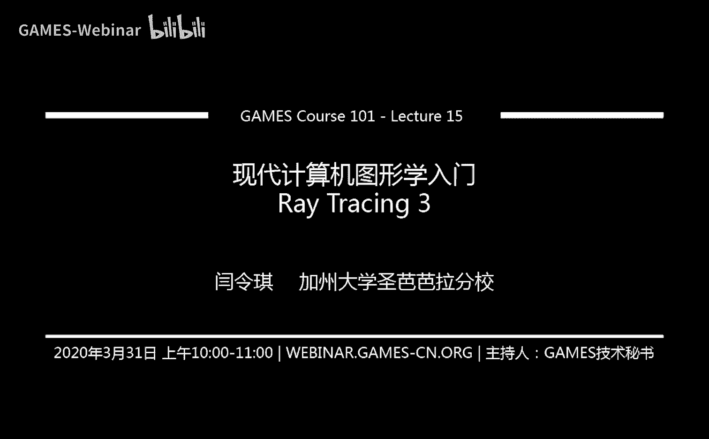
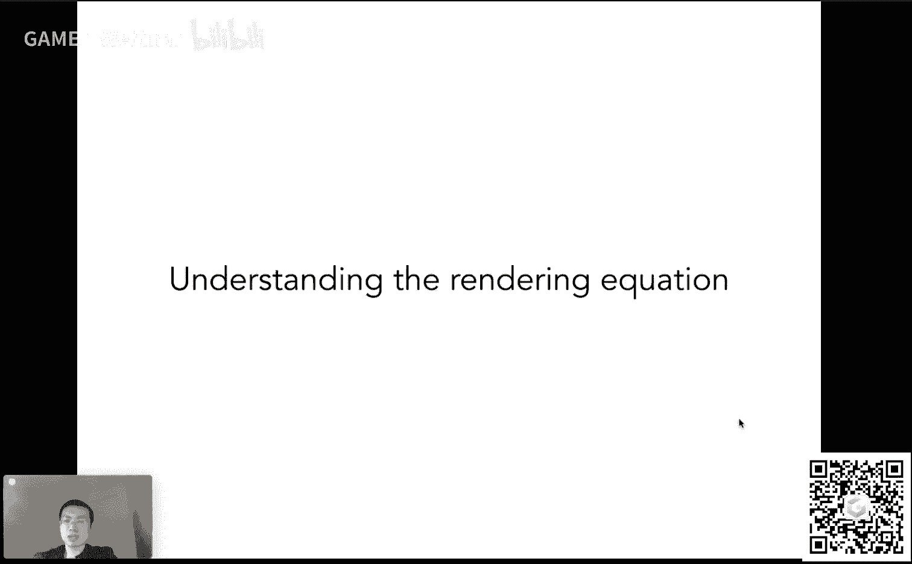
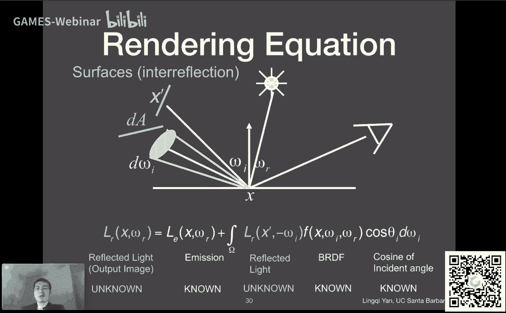
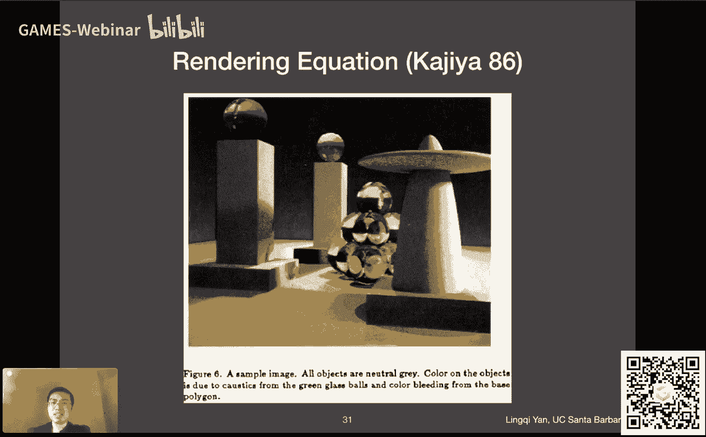
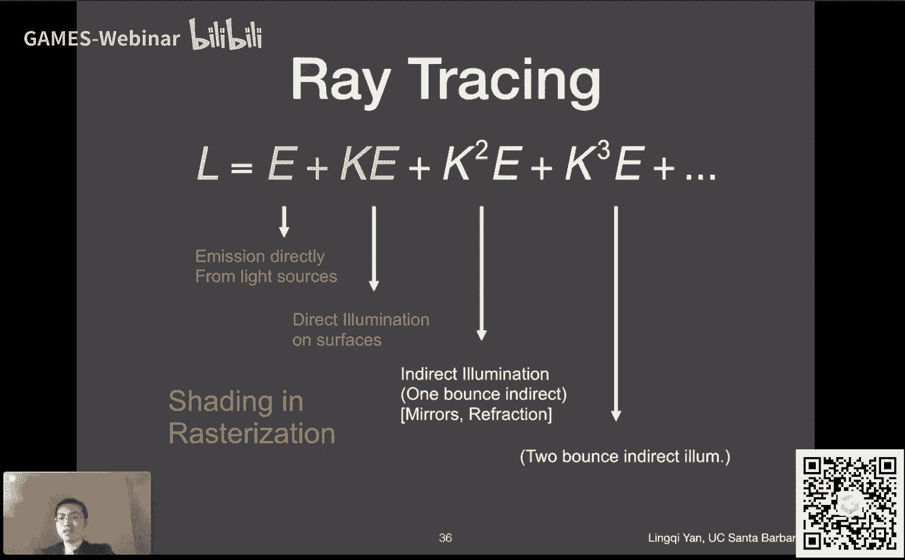
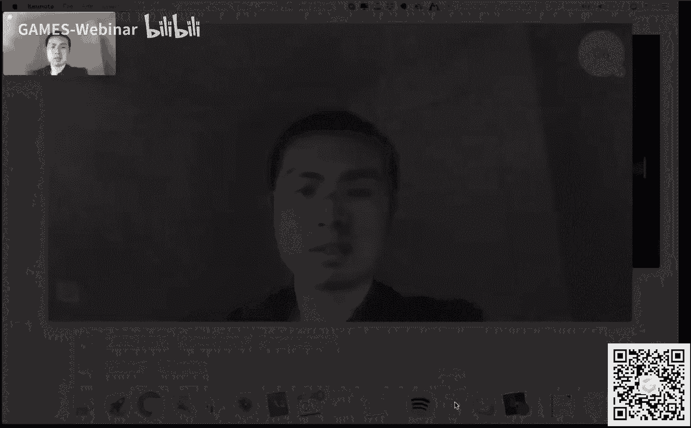
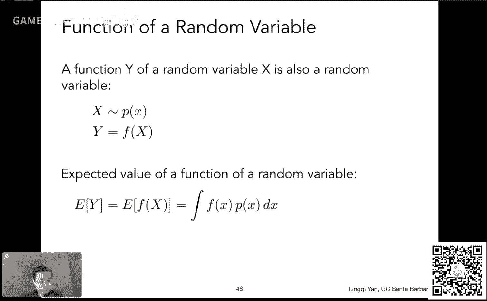
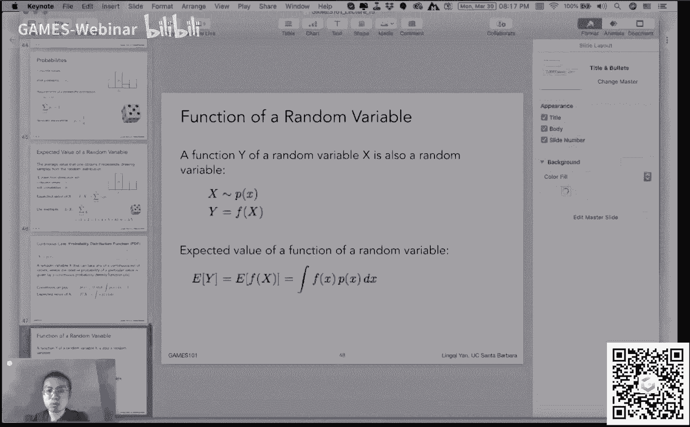
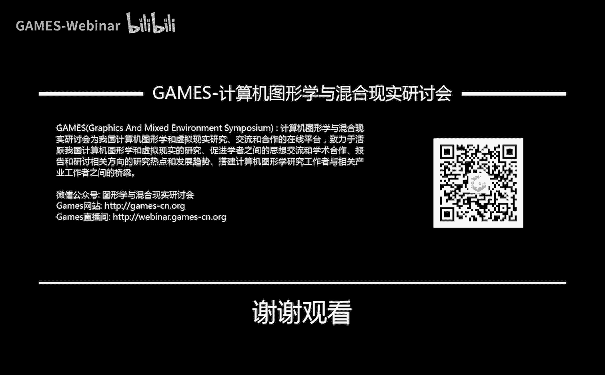

# GAMES101-现代计算机图形学入门-闫令琪 - P15：Lecture 15 Ray Tracing 3 - GAMES-Webinar - BV1X7411F744

那那今天呃咱们这个大家可以看到光线追踪第三部分，咱们开始说光线传播和这个全局光照啊，啊没问题，那咱们这个呃这就开始在课程之前还是说几件事情，一个是我们的作业五，然后目前这个240份作业提交挺好的啊。

然后这个因为大家刚刚接触这个光线追踪这一块，然后写这个作业我肯定涉及上手问题对吧，然后不错啊，嗯然后呢我们之后的两次作业简单说一下呃，作业六作业七，咱们刚刚说过对吧，b自己写一个一个作业期新作业。

关于这个这个路径追踪这块，当然路径追踪这块呢，咱们这个呃在下节课就会给大家讲完，然后呃算法什么的应该都有，所以说这个不用特别担心啊，新作业而已，那么这之后的两次作业呢，考虑到大家的这个工作量对吧。

然后把这个作业现在变成了嗯1。5个星期一次，也就是说嗯嗯作业六和作业期大家都有更多的时间来完成，那当然作业八相对容易，一个星期就够了哈，然后这就是我们的八次小作业，目前安排很快乐啊，这就是作业。

然后呢我们的课程网站稍微更新了一下，然后整个课时现在变成了22节啊，而且多了这个作业期，就是刚才跟大家说的这个好吧，呃这是这个，然后呢嗯咱们还有一些其他的这些内容，嗯就是嗯首先呢给大家解释一下。

呃这是因为呢嗯我们的嗯games 101这门课，它其实是从我这边的cs 180这个课的，嗯，嗯怎么说呢，就是从这个课改过来的，而我之前cs 180呢这个课的安排是一个小时到1。25个小时。

所以说正常情况下一个小时本来就讲不完，然后呢我主要想是说把它变成中文之后，按说中文利索一些对吧，然后应该能讲得比较快，一小时应该可以讲完，后来事实证明我这个想法膨胀了，这不太对啊。

就是说是有可能出现这个讲不完的情况，所以说会出现在一小时到一小时15分钟之内这个浮动的情况啊，所以是呃是因为有这么一个情况，所以才会涉及到说课程内容总是显得这个长一些啊，就是大概有这么个安排。

那呃我是尽量讲快一点啊，这样好，然后呢我注意到呃，课程的bbs上面有很多同学问各种各样关于作业的这些问题，非常好，没问题，大家互相帮助一下也是对的，然后说一下对吧好啊。

那么我个人这边呢倒是更鼓励大家问一些关于不清楚的这些概念啊，或者是这个嗯比如说课程中间出现一些什么问题，什么样的理解，然后这些东西啊我个人来说我更关注这些问题，如果我可以看到的话。

然后到时候及时给大家解答好吧，呃这是这个事儿啊，好然后呢有同学会问这个事情，就是说关于我提到的呃，实施现场这个这门这门课程，这门课程呢这和学校协商，这个确实没办法得是内部的这个直播。

所以直播过程肯定是不可以拿到外部去，这是一个嗯，也就是说暂时是不能这个同步给大家直播哈，也不也不可能有办法能够录下来，然后拿出去，但是呢我现在这么想啊，我和games这边和这个刘丽芳老师也都在联系。

然后说也许可以在咱们经过了下一门课之后，然后再给大家在这个暑假的时间呃，给大家说一说这个呃用中文哈，把把这门实时渲染的课呃再说一说，然后实时渲染本身呢我也经过这一个学期。

然后也可以再把这门课再改的好一点啊，应该是没问题啊，那至于说这个对吧，我提到说我们这门课之后会有另外一门课对吧，呃另外一门课是谁开呢，会讲什么呢，当然是一位超级大神啊，然后这这个呢呃暂时先不给大家说啊。

先这样大家想一想好，那么呃嘿嘿啊，我们这个课呢还有大概三星期多对吧，挺好的，然后我们这个争取顺利表说完，那这就是这一节课，我们主要给大家这个课前啊，说一说这些内容啊，那咱们这就可以进入到呃今天的新课。

当然同样道理，今天的课也同样不会简单，但是我希望咱们能够把这个事情说清楚，好吧好啊，那么嗯上节课或者说上两节课，咱们都说了什么呢，咱们提到了光线追踪怎么做的对吧，光线如何和这个物体求教和三角形求角。

和一般的物体求教，和a a b b求教，并且呢如何用a a b b对空间进行划分，要么是直接空间划分，要么通过物体划分对吧，我们说kd tree的方法或者是b类h的方法。

然后特别的我们提到说对于一个树形结构，呃主要说这个内容，然后最后我们有点时间说了一下这个辐射度量学，然后我们说目的是干什么呢，是为了理解咱们这两节课的内容对吧，我们要说清楚这个路径追踪这块是怎么回事。

蒙特卡洛积分怎么回事，我们得把这一套呃准确的物理定义被定义好，我们才能准确地解除光线真正传播了之后，它的样子对吧好，那么我们上节课提到这个呃这这块radiometry这块呢，这节课再把这个结束掉。

嗯在这之后我们就已经有办法可以引入复杂的光线传播的理论了，然后我们会讲到反射方程和渲染方程，然后之后会提到全局光照，然后如果我们有时间的话，我们再讲一讲这个简单的概率论，因为下节课开始我们需要用到。

那这就是这节课的基本安排，好啊，没问题啊，嗯好的，那这样一来呢，呃我们从什么开始呢，我们从上节课讲到的一些简单概念开始啊，一点也不简单啊，就是说这个上节课提到的一些概念吧，首先咱们讲到能量对吧。

能量不管是什么样的呃，这个光源呃，他们总是在不断的辐射出来的能量，而这个能量我们之前提到说，基本上啊在图形学里面我们不嗯很少用这个概念啊，为什么很少用呢，是因为我们知道说如果我这个太阳能板。

它接收的这个能量，光照时间越长对吧，它吸收能量就越多，所以正常我们为了分析一些能量什么的问题啊，我们都考虑是这个单位时间的能量，这就是为什么我们引入的所谓radiant flux或者叫power。

就power这个这个词用的更多吧，我这么觉得，然后power呢，其实我们对应到这个灯泡上，咱们上节课对应了一下对吧，就是灯泡的功率，功率就是这个做的功，也就是能量单位时间内的能量对吧。

那这个事情我们就之后就一直这么用，那如果我这节课里面我会提到能量啊，提到这个或者说我这个无意中说到energy，其实我指的都是power啊，就是因为我们图形学里面就基本不用这个实际的能量。

用的这各种各样的能量考虑都是单位时间啊，那咱们就不管这个power也管叫能量，也知道我说的是这个意思，就好好，那么这是power，然后呢我们提到一个概念叫intensity对吧。

所以intensity是什么呢，很简单就是在一个立体角上的能量，那我们说嗯在这个过程中就要引入立体角这么一个概念，我们说立体角怎么定义呢，很简单就是它在空间中的这个面积去除以他的这个在呃相应的球呃。

就是距离球星的这个距离平方啊对吧，然后当然这个面积呢咱们上节课讲的有点仓促，这个面积等于是正对着这个这个嗯球星也就是从从什么呢，从球星往这个物体看过去，然后他会和这个单位球会交出一个面。

而这个面积去除以单位球的距离平方，也就是一的平方，而这个面积我们就可以认为是嗯立体角，所以这里呢给大家另外一个定义吧，就是说不管是任何一个物体，我们把它投影到一个单位球上。

就是相当于把它这个往单位球的球星去连线了，然后在单位球上它会框出一个范围内来，这个这个范围就是它的立体角好吧，因为单位求r等于一嘛，咱们刚才说了好吧，然后这就是立体角的定义，那说白了立体角是什么呢。

就是空间中的一个角度对吧，比如大家考虑一个追这个追张开的多大对吧，那么怎么怎么描述它呢，就用一个立体角好，那呃我们说intensity呢就是这个呃单位立体角上的能量，嗯好嗯。

那这就是上节课咱们提到的一些内容，好啊哦有同学问说能量是这个一直比如物体一直接受照，然后为什么它的颜色没有一直发生变化对吧，因为他一直照射，它一直能量也在往外辐射，那所以就是这么一个道理。

当然对于一些特殊的材质，比如说这些荧光的这些东西，它就得考虑这个问题了对吧，那咱们暂时不考虑这个问题的话，就考虑任何时候都是瞬时的一些呃这种这种现象，好吧啊，ok那这是为什么我们不考虑时间行。

那咱们上节课提到这些概念哈，上节课还有一个讲的仓促的地方，在这个呃这个微分例题讲呃对吧，这个微分立体角我们说是什么意思呢，就是说啊任意空间中的一个方向，我们知道我们学过数学或者物理，任任何的一种方式。

我们都知道这个任意空间中一个方向，我都可以这个把它投影到所谓球面坐标系下，然后我用一个c一个file就可以表示它这个方向，那seer什么意思呢，就是这个方向和向上方向的夹角对吧。

就是大家看到这里就类似于这个方向向上方向和任意一个方向，它之间的夹角叫塞塔，然后呢他fly是什么意思呢，fi就是等于它绕着这个向上方向应该转多少度啊，这个就是就是呃这个five这个角，那就有这么两个角。

我就可以确定空间中的一个方向，那么现在这个微分立体角说的很简单，就是我这两个角都各自变化那么一点点，比如c大我变化dc塔，诶，这个fi呢我变化defi啊，defi啊，大家看到这么一个小的区域。

这个defi dc它就是这个区域，然后呢，呃对应的方向在球面上肯定会框出一个小的这个这个方框来对吧，那这个方框它对应的立体角是多少啊，那我们就管这个立体角叫做微分立体角，就是一个极小的立体角。

就这么个概念啊啊那这个立体角等于多少呢，那自然根据它的定义来对吧，它是这个这两这两个边，我们把它求出来，然后求出来之后呢，这就是它的面积的乘积，就是它面积对吧，乘积是面积，然后除以距离的半径的平方。

就是r平方，就可以得到这个微分立体角，那么有一点我们直接看这个结论，那微分立体角大家发现啊，c他变化那么一点点，φ变化那么一点点，但是我形成的这个微分立体角却不是简单的这个c，它的变化乘以y的变化诶。

它前面还有一个sin theta，也就是说它跟它实际的theta的位置是有关系的啊，也就是说啊当这个这个方向靠近这个极点的这个方向的时候，和这个方向靠近赤道的情况下。

虽然说我的theta可以变化一个同样的范围，但这个对应的立体角的变化是不一样的啊，也就是这告诉我们，这里多说一句，是这个意思好，那么所谓这个微分例题讲，说白了就是这个意思呃。

theta和fine各变化一点点，然后它会引起多大的立体角的变化，就是这么个立体角好吧，那么微分例题讲这个呃，之后我们会用得到，那今天我们就继续这个话题啊，我们从什么开始呢。

从一个新概念开始叫做irradiance好吧，那么irradiance是什么，那咱们就首先来看它的定义对吧，那么irradiance大家看这里啊，就是所谓power per unit area。

对后面什么东西，这些这些这些销售的东西就不用看了对吧，这个power per unit area是什么呢，那我们知道power我们之前定义过power，不就是这个这个fine吗。

per unit area，那就是说它对应多大的面积，我就除以多大的面积，那如果我有一个微小的一个面积，这个面积上面有一个微小的能量，那么用这个微小能量垂直微小的面积。

那不就是power per unit area吗，那所以说我们通过这种方式，我们就可以定义一个叫做irradiance的量，最重要的事情就是要和之前其他不同的概念做区分，那跟谁区分呢。

跟这个intensity咱们区分一下，intensity是什么呢，大家还记得吧，就是每一个立体角上对应的能量，那这里定义的是什么呢，这定义每一个面积上对对应的能量没问题啊，两个不同的概念。

那么大家看到这也一样，有它的这个单位对吧，这个瓦特除以平方米，这是这个标准单位制，当然这个流明也是标准单位制，除以这个平方米，它自己还有一个这个这种单位的技法叫拉克斯，当然这个我们不需要管太多啊。

知道它的定义就行了，什么power per unit area，但这里呢多说一句什么unit area，得是和这个power就是所谓你这个入射的这个光线啊相垂直的这个方向。

就是这个才算是这个这个接收到的这个范围大小，唉就是说如果是不垂直的情况下，那这个时候得把它给变成这个投影过的垂直的方向，就是这么个意思，就是说你这个面呀要必须和你这个光光线垂直这个才行，如果他歪了一点。

那会他他得到了这个能量，它就不再是这么多，那说到这里呢，大家会觉得呃非常熟悉，为什么呢，是因为咱们之前提到过这个话题，在什么地方提到的呢，那大家肯定这个也能回想的起来。

我们是在这个呃不离冯这么一个呃着色模型里面，我们在这个defuse部分，在漫反射部分提到有一个叫lambers cos and law，对不对，那cos i love说的是什么呢，说我有一束平行的光。

然后打到一个这个单位的这个这个这个呃面上啊，如果是垂直的，那把这个比如说大家看到这六根光线全部都接收到了对吧，那如果说这个面歪一点，那那它其实只能接收到三根光线，那如果说他这个歪了一个某一个角度对吧。

某一个角度，那它接收到多少呢，接收到的能量乘以cos c的，那么咱们现在反过来呢，我们就可以把这个问题真正的给理解清楚对吧，那是怎么回事呢，正是因为我们定义所谓irradiance。

定义的是必须得是垂直于这个光线的这个这个这个面积，或者投影到垂直方向上的面积，那才算是我们要的面积是吧，那那那也就是说呃其他情况下，那那不能算，那所以说呢呃像这种情况，虽然呢你这个面积还这个。

比如说这个长度还是一，你投影过之后，它其实只有这个这个呃一小部分，就是这个意思对吧，然后就只有一半这个角度上啊，正好一半，那通用的一些情况下，这有一个cos c的，就是就是正确的意思好吧。

那那就是说它是这么一种定义方法好，那就是说当当呃这个面如果说这个不垂直这这些物体的时候，它接收到呃和不垂直光线的时候，接收到能量要变小好，那没问题，道理是一样的，那不管怎么样哈。

咱们回到刚才的定义上来看，就是说我们平常不会提这个就是垂直的或者是投影的面积啊，那但是我们说的是这个意思，就是说啊呃就是说能量就是power punit area，然后我们其实这背后都指的是这个嗯。

就是说嗯在这个投影的这个这个呃区域或者说面积上好吧，那这里暂时没有写cos theta，那么这里就是呃关于它的理解，以及我们这些前提到这个概念对吧，说我为什么地球上不同地方有冬天有夏天呢。

那是因为啊这个阳光和不同区域它的夹角是不一样的对吧，然后然后就是说如果阳光始终垂直于某一个区域，诶，那他接受能量就多，然后如果它这个阳光不垂直，那它接收能量就少，那没问题。

那这个radiance呢就是power punit area，就是这么个意思呢，好那么我们之前还有一个概念，也可以通过这种方式来把它给得到一个正确的解读，什么呢，就是说光线，我们说这个光呢。

比如一个点光源，然后它在传播的过程中，它有一个r平方的衰减，大家还记得这个事情对吧，就是说我们写这个呃布林冯这个着色模型的时候对吧，就是我们提到说这个点到达呃，就是这个点光源辐射出的能量。

到达这个着色点和这个着色点本身就是吸收，这都有能量损失，那到达这一点其实也可以通过irradiance来解释，怎么解释呢，我们这样解释，就是说我们认为啊我们可以定义点光源的power没问题对吧。

这个fine对吧，然后就是点关功率嘛对，然后呢他往这个周围，我们认为它往各个方向都是均等的辐射出能量的，那么呢我们之前所说的理解是说把能量分布在这个壳上对吧，然后他当然壳越大，它每一个地方分布的越少。

那么同样道理，那我们直接用这个irradiance来分析是不是更简单，就是什么呢，irradiance怎么定义呢，是是单位的面积上对吧，接收到的能量，那它能量是f那这个对于这个中间的这个圈来说。

假如说半径是一，那就是spa平方，这个fire除以spa平方呃，就就得到这个这个地方的irradiance好，那就是这个面积上单位面积接受的能量，但离远了呢，那就是离远了的一个单位面积接收到的能量。

那我说总共能量是fine，然后呢整个的面积是四派r平方向传播的是一个实际的r，那那这里呢对比这个在单位距离上的这个能量，那自然就是按二平方衰减对吧，那所以说我们这里可以得到一个更准确的这个理解。

谁在衰减并不是intensity的衰减，intensity这个词在这里就不对了，没错吧，就只有irradiance，它是在衰减，intensity并没有。

大家还记得intensity的概念是说这个单位立体角上的能量，那我在传播的过程中，如果我画一个椎哈，这个追越传播越大，你会发现传播到这个地方，它对应一个比较小的这个面积。

这个远处传播到远处对应的比较大的面积，但立体角始终没变，所以说intensity其实是没有变的，irradiance才是在衰减好吧，那这样一来咱们可以把这个很多事情就给解释对了。

这也就是我们这个辐射度量学，我们为什么要学它，对吧好，那我们说了irradiance之后，再说一个重要概念叫做radiance，而这两个又不一样啊，这个一下引入不少概念的。

那么radiance又是什么呢，那大家可以看到这个radiance呢，我们发明它是是是为了描述这个光线这么一些属性，就好像说我们要研究光在一条线上的传播过程中，它会有一个什么样的属性。

说白了就是这么一个意思对吧，然后那大家可以想象说诶我既然提到光线，又提到他传播中带的能量，那这个是不是就要和我之后说的这个路路径追踪，正确的这个所谓正确的光线追踪时间方法有关系，是就是这么回事。

这就是为什么说radiance是一个非常非常重要的概念，通常和光线在一块讲好，那咱们看看啊，radiance是干什么的呢，vance定义大家直接就看就可以看得明白嗯，radiance是什么呢。

是呃power，然后这中间又不用看了对吧，power per union，per projected unit area，这就有意思了，他这个是是什么呢，是说power在在在单位立体角。

并且在单位的面积上有多少，那说起来意思就是说我这个power我要做两次微分，一次是跟立体角相关，一次是和这个投影过的呃，投影过来的这个这个立体角度有关系，呃投不是投影过来的这个呃面积有关系对吧。

它是两次的微分，一个是单位立体角，一个是单位投影面积，诶，那这样就是说我可以把它写成这么一种形式对吧，那那些看起来就变得越来越复杂了，原本说我这个power power什么。

还是一个对我们说intensity是power power sangle，我们说irradiance是power per jan area，然后呢这里是radiance。

是power persuit on the angle project area，嗯那所以说它更复杂，那怎么理解呢，大家看这里哈，就是说就是说我们考虑一个呃单位面积，然后他可能有一个朝向对吧。

它和这个光不一定是正好朝向对吧，我们说投影面积吧，就是这个道理诶，有一个这个呃单位的一个一个一个一个微小的一个面板，然后呢从某个从某个这个呃呃方向上啊。

然后他从这个面然后往这个方向上再辐射出某一些能量诶，这个听上去很有道理的对吧，就是说我确定一定的这个区这个区域，然后呢它会往某一个确定的这个方向呃，也就是这里的一个立体角d，我们应该去辐射能量。

哎这个这个听上去是是确实是对的，因为什么呢，比如说这个面他可能往各个方向都会辐射能量对吧，那我们要研究这个面往一个方向辐射能量会怎么样对吧，是一第二，那这个面本身它的大小有关系对吧，它这个这个面本身大。

那它这个往各个方向辐射的东西就多，那这个面本身小辐射的就少，那所以说我们考虑一个某一个确定的微小的面和某一个确定的方向，那么这两个都在一块考虑，那这里大家就会发现诶这里就好像和光线很有关系了对吧。

这个光线呢肯定也是从某一个很小的这个表面被辐射出，然后它会往不同的方向去这个辐射，那所以我们通过这种方式来定义它，好，那没问题，咱们回到定义上来啊。

这个power produangle for project unit area，好，那么咱们这里呢可以继续往下去理解，那么radiance这里越理解呢，就会发现它和之前的概念就越有关系。

比如说大家看这里对吧，这个概念咱们刚刚说它是微分两次诶，但是呢我们刚才说irradiance就是power project unit area呃，然后他和这个radiance差距不远。

intensity是power perslide，angle和radiance离得也并不远对吧，那我们可以通过这个他们两个的定义以及radiance自己的定义。

我们可以把radiance和前面两个量联系起来，怎么说，就是说radiance我可以理解成以radiance personally的angle对吧，因为ance本已经这个按照这个这个这个这个面积。

已经相当于除以了一个面积，然后我再出一个soliano，那可不就是radiance嘛对吧，那所以radiance同样道理我也可以理解成是intensity，per project unite area。

没问题哈，这这两个量分别都是说这个我进行一次的微分，然后radiance是两次，那我把另外一次做了就就可以了，但是呢这么做虽然简单，但是它给了我们很多的启示，比如说我们看第一条，我把主播。

就比如说啊我们看这个irradiance，irradiance是什么呢，是什么呢，就是说这一点这个这个这个小的这个da对吧，收到的能量对吧，然后然后这个irradiance呢。

就是说这个能量我要往某一个这个solid某一个方向去扶手，然后就是说我这个能量本身可能会辐射到各个不同的地方，但这个能量往这个方向去辐射，会辐射出多大的强度来诶，这跟我们刚才那个解是一样的对吧。

就是说我们刚才说这个就是说这这一个小的这个这个面积上，然后他接受的能量往某个方向辐射，诶这里我们就就就可以解释这么一个问题，然后呢反过来道理是一样的，就是我们可以理解成什么呢。

理解成是就是说我从一个一个方向，然后打到一个这个这个小的面上面去对吧，然后这个到达这个面的时候，然后他应该会是有一些能量，然后这个能量是什么，这个能量就是irradiance对吧。

然后这个irradiance本身呢，如果我考虑来自这个环境中四面八方不同的方向的能量，那我自然可以得到说我这个da总共收到了多少能量，但我现在考虑说我就考虑从某个方向进来的能量。

被这个这个da收到了多少，那这个概念就是所谓的radiance对吧，那所以radiance跟radiance的区别就在于是否有方向性，能，说白了就是这个意思对，那也就是说我考虑从一个方向过来。

并且被dna收到的能量好，那这里就是incident radiance，就是我们考虑入射过来的，那么刚才其实已经提到了哈，就是说关于这个呃一个一个面发出去的能量诶，也是可以这种类似理解是什么呢。

我们就考虑说这一个小的面，这个小的面呢，然后如果我考虑这个呃它的intensity，他这是什么意思呢，就是说这个这个这个很小的面，它会往各个不同的方向去这个发出能量。

然后呢就我们知道intensity怎么定义的呢，intensity是每一个立体角上的能量是多少，那我们现在就看它往这一个确定的第omega这个立体角上去，它是有多少的intensity。

诶这里我们就我就可以通过这种方式来解释，就是这个da呢它它是往某一个方向辐射出去的能量，然后然后我们用intensity的这个方式来解释，那也就是说啊，我们现在等于是把这几个概念放在一块儿去去这个理解。

这样的话也体会他们的不同，也体会说这个我们用两种不同的方式来解释，radiance到底能给我们什么样的物理意义，好吧，那也就是说啊我们一个说的是这个呃入射进来。

那这个我们用的是就是所谓从单位某一个方向啊，它的周围接收到的能量是多少呃，那我们这个用irradiance和radiance的关系可以解释，那如果一个小的面辐射出去，往哪个不同的方向去诶。

我们可以用这个呃这个呃intensive方式来解释，确定这个intensity是五王哪个不同的立体角区好，那这样一来就是不管怎么样吧，就是说把这个radiance啊，我们要这个考虑成两个部分。

一个是一个很小的面，一个是一个很小的范围好吧，不管是这个进来还是离开啊，这个都是一样的好，那么关于这个呃概念，我们就把它放在一块儿了，那么这里呢尤其要讲到一点，这个这个概念比较重要。

就是说这个irradiance和radiance这两者用得非常多啊，然后就是说我们为什么同行学上，我们这个花这个这个呃大力气去试图去理解这个事情呢，那咱咱们这个很快就可以看得到。

说我们为什么要定义他们俩之间的关系，那我们现在看看它到底什么关系好吧，那irradiance是什么呢，irradiance其实就是说我这个da他收到的所有的能量对吧。

不是不是这个相当于power po unit area嘛对吧，就是某一个小范围他收到的能量是多少，哎那就可以，那么这样呢嗯就是说对于radiance来说，它又定义的是什么呢。

他说的就是说啊我还是看一个很小的这个范围，他会收到不同的能量，但我就考虑他从某一个方向进来，然后能让dna收到的能量诶，也就是说irradiance我们刚才其实提到了对吧。

radiance无非就是在irradiance上增加了一个方向性，那咱们可以把这个式子写出来，写出来什么呢，写出来就是说啊我我这一个小的范围，然后他收到的这个能量呃，然后我这当然可以写成一个这个呃。

就是这个ering的形式，我也可以把它写成这个radiance的形式，就是说它从某一个方向进来对吧，某个方向它的radiance是这个l，然后还有这个面积本身它有一个朝向cos theta。

然后乘以cos theta，然后考虑这个立体角，就是说从这个立体角地欧米伽来的立体角度，所有的能量诶，我是可以通过呃这个嗯通过这种方式诶，把erradiance和radiance联系起来。

然后我可以把这个式子整理一下，整理一下怎么做呢，我两边分别积分，两边分别积分之后得到的结果就更好理解了，那就是就是我们刚才说的意思啊，这个e p什么呢，这个p点就是它在这个点他所收到的所有能量。

就是嗯从每个方向过来的能量，把它积分起来，所谓积分就是求和道理是一样的好吧，这个这个这个很好理解对吧，从这个呃da收到能量，那自然就是说da从每一个可能的这个方向或者立体角进来的能量，求和加起来。

那就是这么简，那这样一来呢，我们就把irradiance和radiance联系起来了，好吧，那当然了，这这块内容相对比较麻烦哈，然后就是说这块特别涉及到概念刚刚介绍，然后这个这个就得需要这么理解。

这个还得回去，比如说大家在之后再好好体会一下这是怎么回事，但是不管怎么样吧，就是irradiance和radiance，这中间差的是方向性，这点就够用了，咱们之后就可以看到这个怎么来定义它。

那咱们之后就是立刻要给大家介绍的这个概念，就叫做b2 df，用的正是这么一个概念好吧，那咱们看看是什么，br df是什么呢。

叫做by directional reflectance distribution function，那么说的就是双向反射分布函数，这个非常非常复杂的一个这个概念啊，他当然他有自己明确的物理定义。

然后他叫这么个名字，那咱们看看看它到底是干什么的对吧，那咱们还是沿用刚才的这个思路，刚才我们说这个呃irradiance是什么呀，是是来自四面八方的这个radiance，咱把它记起来对吧，就那么回事。

那现在我们试图用这种方法来理解一下反射到底是什么，那那咱们想象一下反射，那当然是咱们讲，比如说有一根光线打到一个镜子，然后它会这个反射到某一个方向去，哎如果这个光线打到某一个这个漫反射物体。

它会往四面八方都会去对吧，那我得有一个函数得能描述它的这么一种性质，那这个性质怎么描述呢，那我就描述成诶，我从某个方向进来，并且反射到某个方面上去。

这部分能量应该是多少诶那我觉得如果有一个函数能够定义这个概念，那就不错，那也这也正是b2 df做的事情，他会告诉你有多少能量，如果从某个方向进来，它会往不同的方向去怎么样去分散。

就是说不同的反射方向上会分布多少能量好吧，然后那我们这是这个从对反射的理解，我们来说这个b2 df到底是什么意思，那咱们马上在正式来说，但在这之前我们先想象一下说这个反射到底是怎么回事。

为什么有反射这么一个概念对吧，那我这个光进来之后，我打到一个物体，然后呢呃它它就这个被弹走了，改变一下方向对吧，这是一种理解，另外一种理解，我们也可以把它理解成什么呢。

理解成说啊光线达到了某一个物体表面被吸收了，被吸收了，然后吸收了之后再从这个物体表面再把这部分能量给发出去，这当然是可以的，经过一个中间过程，对不对，我们这么理解，那如果我们能这么理解的话。

那这样的话我们就可以用我们所学的irradiance和radiance的知识，来解释反射，那么大家看，那么这个这个反射呢，首先我们得有一个这个光线达到这个物体上的某一个位置上面去对吧。

我们就假设说从某一个这个立体角，然后呃进来某一个这个能量，然后然后这个达到一个小的表面叫做da好吧，那么我们看从欧米伽还来的radiance啊，就是就是l对吧，radiance，然后它会达到这个da上。

那我们说这个radiance它本身这个这个考虑的是什么呢，考虑的是这个呃能量，嗯嗯就是每每立体角每单位面积对吧，那如果我现在就限制好这个单位面积，它收到多少来自于这个立体角度能量好。

然后呃会被这个这个小的这个范围所吸收，然后吸收了多少，我再把它原样的这个发出去，然后相当于入射的radiance会在这里转化成能量，也就是power，然后这个power又会辐射到另外一个方向去。

就是这里的这个这个出去的这个radiance，所以我们通过这个能量呢，我们可以把这个radiance啊，这个入射和出色的给联系起来，那咱们现在看对于这个小的块儿来说，它接收到多少能量呢。

就是说我们单考虑从某一个方向来，他接收到多少能量呢，那自然就是说考虑某一个方向，它的立体角，它的radiance，然后这个他们把它撑起来之后，我就可以得到这个这块接收到的这个以radiance是多少。

没问题啊，就是说这irradiance这里，然后这个嗯它会被转化成这个radiance再出去，然后就是说这个这就是这部分这个反射出去是有，是这个到底是怎么来的啊，是这个意思，那现在就有这么一个问题了哈。

就是说我对于这么一个小块儿，我知道他从某一个方向接收到了某些能量，然后我知道他要把能量都给辐射到四面八方去，那我不知道他往这个方向辐射出去是有多少能量，那么我们现在就定义一个这个一个函数。

专门来描述这么一个概念，就是说啊我考虑单位呃，就是微小面积da，从某一个微小立体角dm一个i接收到的irradiance，然后会如何被分配到这个各个不同的立体角上去，然后这里其实就是一个什么呢。

一个比例就是说啊我对于任何一个出射方向，我算出来它的这个这个radiance，然后我就除以这么一个小块儿接收到的radiance，这就是b2 d df的定义。

他会告诉我们这个这个表面如何把一个方向的收集到的能量，反射到另一个方向去，那大家看到正是这么一个比例啊，就是说这个小块收到的redients我们是可以算的，刚才已经说了。

然后呢就是它会辐射到各个方向都会有，至于它是漫反射的还是镜面反射呢，它它就是会有一个这个往各个不同方向上这个分配的一个问题，那么这个b2 tf就是定义如何去分配好，那咱们这个通过这个b2 df呢。

我这个定义我们可以把这个嗯这个小块对吧，收到的这个redients，我们刚才一直在考虑这个问题，然后我们不是说反射是两部分嘛，第一这个入射光会让这个dna有一个呃收到一个irradiance。

那我们就是说入射光的radiance，然后乘以这个呃它对应这个方向来的立体角，那就是入射光在它对应的这个立体角上，然后给这个da它的dience是多少好。

那么就等于把这个这个啊irradiance和radiance刚才的关系呃，把它给展开就会变成这么一个式子，好啊，那行那是这么回事，这就是一个b2 df它的正经的定义哈。

它就相当于是呃任何一个出色方向上的这个呃嗯radiance的微观，然后除以一个是这个叫什么呢，就是在入射点上，然后它的一个以radiance的规范，这是为什么用radiance除以以radiance。

道理就在这儿，就是刚才咱们分析的这么一个事情，当然这个过程会很复杂啊，然后嗯这块儿也就是为什么整个理解正确呃，radiosity这块不太容易好吧，然后但不管怎么样吧，就是说b r d f这个定义。

这是它的算是数学或者物理上的定义，但我们的理解其实好理解对吧，就是说啊我从一个方向进来，达到了某个物体之后，我我往这个不同的位置上，在不同的方向上去反射，然后它的能量分布相当于这个意思对吧。

那如果说它是镜面的，那我就不知道哦，它反射出去的这个方向上分布了所有能量，其他的方向，那只要不是镜面反射方向，都会有任何能量对吧，这就是镜面反射，他就会告诉我好，那我这个进来的这部分能量会被均等的分到。

分到这个呃各个不同的这个出去的这个方向上对吧，它就会定义这么一个事情好，那么b2 df讲到这里呢，就是说我们如果忽略它的这个推导部分啊，就是说它的概念其实就是描述了光线和物体是如何作用的。

那正是因为他们这么这么一个概念啊，他会决定说这个嗯物体不同的材质到底是怎么回事，因为就是b r d f这么一个像它定义了不同的材质，是这么个意思对吧，然后那行这个材质部分呢，或者说b2 df部分呢。

我们之后会再再给大家说，但是不管怎么样，到目前为止哈，然后这个概念就应应应该已经很清晰了，是什么意思呢，哎因为b2 df告诉我们的是哦，我从某一个方向上考虑它的入手啊。

然后这个它往某一个方向反射出去会是什么样的结果，那么我现在如果我盯着整个某一个反射出去的方向啊，然后呢我认为我看到了这个点呃，某一个这个着色点吧，它可以接受来自四面八方不同的这个光照。

那我们就考虑对于每一个入射方向啊，对于某每一个入射方向，那是不是都会对应这个入射方向着色点和出射方向这么一个b2 df，b2 df会告诉我它从某个方向进来的光反射到出射方向有多强诶。

那我就把每一个方向上的这个呃这个入射的光的强度，也就是它的radiance乘以b2 df乘以cos c的，这是他的之前的这个定义，然后呢我们把这个把每一个方向上，它对这个出射方向的贡献都给加起来是吧。

都给加起来，那我们就可以得到这个就是说这个点在所有可能的入射光下，最后反射到这个方向上，看过去是什么样的了吗，诶大家可以发现这个我们渐渐地就从这个这个物理概念的定义啊。

我们就可以总结出来一些这个真正的光线传播的规律了，像这里就是在考虑这个问题，所谓反射方程定义的是什么呢，定义的是说任何一个着色点，它在这个各个各种不同的这种光照环境下。

然后呢我们就考虑它是任何一个输入的这个方向，就是光照的进入方向，然后对我一个观测的方向，也就是出色的方向的一个贡献，我们把这个所有的这个入射入射的方向的贡献都给加起来。

那么自然就可以得到这个呃他最后应该长什么样，诶对吧，这个听上去很有道理，他这是就是一个怎么说呢，就是一个很通用的这种解释方法对吧，那这样一来大家可以看到它就是一个嗯我从某个方向看某一个着色点。

它其实就是一个积分，这个积积分考虑的就是任何一个不同的方向，我们一个i我去找寻找这个所有不同的这个方向，然后考虑它的呃radiance到这一点对吧，然后并且radiance进来了之后呢。

然后他会经过b2 df，然后会会被变成这个这个出色的radiance对吧，然后这样一来就没问题了，或者是什么呢，或者大家把这后面这这块这三项啊。

这个入射的radiance乘以cos a c乘以d那个i就变成了这一个小块，这个dna它收到的e radiance，那么它的radiance乘以b2 df，那就会变成出色的radiance。

然后再把它积分起来，那就对了，好，那所以说各种不同的理解，都是建立在这个大家对之前这几个概念的定义上面的，这么这个这个熟悉程度好吧，就是说嗯这么一来，不管怎么样推导，这就算完成了，然后这个反射方程。

这直接就告诉我们，对于任何一种着色模型，我们定义它的b2 df知道是什么就可以了，然后它的光线传播就是这么简单的来做，好吧啊，没问题，然后这就是反射方程，那咱们说提到反射方程之后。

我们就要提另外一个概念叫做渲染方程对吧，然后渲染方程之前我们先提一下有一个困难哈，什么呢，就是说啊这个反射方程告诉我们一个呃事情什么事情啊，就是说我要从某个点观察某个方向啊，观察某一个着色点。

那我得考虑它这个能够到达这个着色点的所有的光线对吧，可是这个能能够到达这个着色点的所有的光线，可不只是光源能够到达这么个点，如果我这里有其他的什么物体啊，比如这个着色点，其他的物体也会这个被光所照亮。

也会反射光，也就是说从其他的物体也有可能会有光被反射到这么一个点上去，然后也就是说我考虑的入射的所谓radiance啊，可不止来自于光源，也可能是经过一次反射之后，别人反射出去的这个呃这个radi诶。

那这个事情越想就越变得递归了对吧，那就是说我任意一个面，这他接收到光源的照射啊，它会反射出去呃一些radiance，那这些radiance又可以用来被照亮其他的面，对不对。

那也就是说这就是我们之前提到的，说光线在这个场景中可不止弹射一次，就是道理就在这儿对吧，任何出色的radiance都有可能作为其他的点的入射的radiance，所以它本身呢是一个唉这么一个呃怎么说呢。

叫做递归的一个定义方式，没错吧，就是说如果我只考虑光线就弹射一次，那自然就是说我这里的入射的光线，那只能是光源对吧，那如果说光线不止弹射弹射一次，那什么都有可能。

那咱们在之后对这个呃渲染方程的这个理解上啊，我们在再进一步理解，那咱们现在就直接先把这个问题放在这儿，我们知道好，它是一个递归的问题，有点麻烦，但是在这之前我们先做一个通用化是什么呢。

就是说啊我们要从这个反射方程，我们推出一个更加通用的东西，叫做渲染方程，嗯，是这样哈，在这个早期的这个中文翻译里面啊，rendering被翻译成绘制，所以呢早期这个渲染方程会被称为绘制方程这一回事啊。

一回事，那咱们刚才说这个反射方程考虑从任意一个方向来的能量，然后经过b2 df反射到了这个出色能量上去对吧，可能记起来，那么有一点啊，我们忽略了那什么呢，就是说如果这个物体自己会发光对吧。

那他怎么反射光，我清楚了，如果这个物体自己会发光怎么办呢，那很简单，咱们把这个发到光加上是不是就可以了呢，对答案就是没有问题，那在大家看这个框里面的，这里就是叫做渲染方程，说白了就是这个这个物体啊。

我们看到一个点，它往某一个方向出色的光，由两部分构成，第一它自己产生的，它自己这个发射出去的对吧，它可以从一个点往一个方向去发射出一个这个readings，第二通过别人这个这个过来的这个反射过来的。

或者说其他光源照亮的这些这些入射的这些这个radiance，导致它经过b2 df反射之后往这个方向去的radiance，那也就是说这这个这radiance分成两类，一类是自己发光的，一类是反射别人来的。

那这个就是很完备的一个定义了，没问题吧，就是说所有的一个这个都是嗯，就是说所有的光线传播都可以用这么一个简单的公式来总结，那也就是说这这个叫做渲染方程，然后这个渲染方程呢这里嗯就是呃这样吧，先说一下。

就是说这个渲染方程里面啊，我们会还是一样，跟之前那个呃不林缝着色模型一样，我们都假设所有方向都都朝外，都朝外，那就是说嗯嗯这个比如说欧米伽i，我们分明知道他是从别的地方打到这一点的对吧。

但是我们其实写作a还是写作向外，然后呢就是说我们考虑所有可能的这个入射来的方向，那就等于是从这一个球星往整个半球上这个各个不同的方向上去，那就是这个d omegi，那这个半球的定义就写作呃。

这个omega加号或者是这个h平方啊，都表示半球呃，当然这个半球的概念大家还记得吧，就是说为什么要用半球啊，就是说如果这个入射光线啊，注射光，比如有一个平面在这儿，它是反向向上的，冲着上面的。

那如果有一根光线从底一下打到他，这是不可能的，如果我们考虑这个呃反射的话，这种情况是不可能的，而这种情况下我们就会认为说这个贡献是零，这就是为什么以前我们这cos theta上面要加一个零哈。

max cos theta 0还记得吗对吧，我们忽略另外一半，就让我们认为下半球贡献过来的光肯定是零好吧，然后这里呢还有一个事情，就是说我们把在渲染方程里面啊，我们把之前那个cos theta。

我们直接给写成了这个呃法线n点乘入射方向一样的哈，这就是cos c的没有问题，然后就是说啊这样一来呢好，那就等于说我们通过一个方程就可以描述所有的光线传播，就是这么一个道理。

那就是说这就是我们之前定义各种各样不同的量对吧，然后各种各样不同的操作理解，然后非常麻烦，然后最终会推出这么一个结果来啊，但是最后发现这个是没有问题的，对的。

然后呃the rendering equation呢本身是当年很早期的时候呃，这个呃一个叫做卡基亚的人，然后他这个做出来的，然后非常非常厉害，然后就是说这一个渲染方程基本上是现现代图形学的基础。

可以这么说，然后就是说所有的光线传播都在试图解决这么一个这个问题啊，当然这话说的不对哈，就是所有的这个限制在物体表面上的光线传播，都在都是满足这么一个这个这个呃渲染方程的好吧，然后下面一步。

那自然就是说我们知道渲染方程，然后要怎么解，好吧对吧，那这个呢我们下一节课会来讲这个事情，嗯，然后嗯就是说嗯在这里呢，我们可以继续去说对于这个渲染方程的理解方式啊，我们马上就会说在这之前先多说一句。

这个当时我就说发明是渲染方程的嗯这个人，然后他写的这个论文的名字就叫the rendering equation啊，从这个角度上来看，就是现在来说大家很少能见到学术论文有这么短的名字。

然后就是说这个名字越短，事情越大对吧，这个事情是这个嗯这个这个世界上普世的一个道理哈，呃没问题啊，这个非常好，the rendering equation好啊。

然后呢到目前为止咱们就要试图去理解这个渲染方程了啊，那么在这里就是如果大家还沉浸在之前这个推导里面啊，现在已经没有必要了，就是说我们现在可以通过这个概念性的方法来理解它的，就是说呃我们有一个一个点呃。

我们看到的这某一个方向上，它的readings，那肯定是他自己辐射的readings，加上它反射的readings，就这么理解就对了对吧，反射的原因呢，它可以从任意一个不同的方向反射到这个方向上去。

只要我们能定义这个b2 df，告诉我如何从一个方向反射到另一个方向，就ok那行行没问题啊，这样的理解就会比较容易方便大家理解，说这个render equation呢到底是怎么来的。

那咱们先来看一看啊，就是说啊我们首先从这个反射方程上来看，假设说我们有一个点光源，那么反射方程式就是说我看这么一个点啊，我看这这，么一个点，然后我会看到多强的能量，那自然就是它反射过来的能量。

就是li从某一个方向呃，这个注射进来，并且经过b2 df反射到这个方向上去嗯，然后当然要考虑cos的，然后这部分能量是多少啊，就到这里已经是在反射方程的基础上加了一项了，加了一项这个自己的发光效好。

那么这里是对于一个点光源的简单情况对吧，那我们刚才说嗯这个这几个概念分别就是反射的光，就是自己发的光，到余弦好啊，这一，个点光源非常好理解，那现在假设说我们有好多点光源怎么办。

那自然就是说我把每一个点光源照亮这一个点，然后呃反射到我的我的观测方向上，诶它这个能量多少，把它加起来就可以了，那当然大家在生活中可以看到这个性质对吧，你开的灯越多，那当然就越亮。

这个事情是就是光线传播的一个叫做线性的性质啊，这个非常好的，我们可以把它加起来好，那没问题，现在我们更进一步怎么办，然后就是说啊我先考虑的是这不是点光源吗，那如果我有个面光源怎么办对吧，如果有个面。

光源，那我们理解是面光源可不就是一堆点光源的集合吗，那如果我可以把以前的一堆点光源加起来，点光源贡献啊加起来，道理是一样的对吧，那也就是说我就积分这个面光源所占据的立体角，然后考虑它所有覆盖的方向。

从这个方向来的radiance经过b2 df反射过去应该是什么样的，这个radiance出去对吧，唉这样一来就等于是我把这个面光源考虑进去了，对面光源这里用的思想就是呃面光源它其实就是点光源的大集合。

对，吧好然后所以之前求和变成了积分好，那么现在呢是这么回事，我们考虑说这个都还是光源，对不对，但是我们刚才说了，这个照亮到这一个点，它的radiance可不一定就是光源直接发出来的radi。

它有可能是其他物体反射来的radiance，那怎么办呢，那如果我有一些其他的一些什么物体也没有关系，那我们就考虑说这些物体它们反射出去呃，并且是正好会照亮这个x呃的这个这个radius是多少。

那同样我考虑这个物体覆盖的立体角，然后他过来的radiance是多少，就是从x prime到x对吧，这东西是多少，那其实我，就等于是把这个反射的物体或者反射面就给当成是光源了。

这样的话它们没有什么区别对吧，我光源也是辐射出radiance，然后我的这个反射面也是反射出radiance，对对对，那对于这一点来说，它是一样的，来来做这个渲染方程。

但是到目前为止我们其实就已经知道了，好我这一点它往某一个方向上辐射出去的，radiance，它是依赖于其他的点辐射出去的radiance的，也就是说这个就是我们刚才所说的这个递归过程对吧。

那么我们这么理解的话，有一个什么。

好处呢就是说我们可以把它写成一个简单形式，在这之前啊，这就是当年这个渲染方程，它对应的这张图啊，当时渲染方程可以支持光线弹射多次，然后我们就可以看到，而这里可以看到一些这个反射或者阴影之类的东西啊。

应该是反射啊，没问题，就是说当时这个跨时代的一个一个一个这个发明吧。

这么说好，那我们刚才说啊，就是说我们把这个问题理解成递归的，有一个什么好处呢，是说啊我从某一个点我看向呃，我从某个方向看向一个点，我不知道我看到的是两面是多少，我不知道，需要解对吧。

那从其他的物体反射到这一点的readings，我自然也不知道，我也需要解，那其他的项目其实都知道都知道什么呢，知道任何一个物体它是怎么发光的对吧，我可以提前定义光源，那我可以定义这个物体不同的材质对吧。

各种就是说这个物体是defence的呀，还是glossy呀，specular啊对吧，我这些都可以定义好，那也就是说对于这个式子来说，大家看这边有有有这么些像有这么一些像里面不知道的。

就是说各个物体反射出去的呃，或者说各个点吧呃反射出去的呃，radiance是多少，好，那没问题，那在数学上，呢就会这个有一些简单的简，这个怎么说呢，表达方式可以把这个复杂的这个式子给写的稍微明白一点啊。

就是就是这么一个情况，所以我们可以通过一种简化的方式把这个式子写出来，就是说啊我这l l不就是相当于我在两个不同的位置呃，辐射出去的这个这个radiance嘛，那我两个不同位置我就用uv。

然后辐射出去这个呃这个radiance呢我就用l吧，那就是l u等于什么呢，等于e就相当于发出来的能量在，就是就是说我看的这个这个所谓着色点，它自己发出来的能量加上从其他的这个，物体的表面。

然后通过b2 df把这个从其他物体的这个这个反射，也可以反射到这来的这个radius反射到这个呃位置上，反射到我们当前看的这个设定point的位置上。

然后这个会有会有多大的这个呃能量反射到我们观察的方向上，而这里方向所有方向都已经忽略掉了，好吧，那就相当于是我们把这个式子通过了一个数学的简写，把它写成这么一个积分啊，然后变成这么一个积分。

这是干什么的，当然这个这个中间这个过程有很多省略哈，就是为什么可以这么写啊，ok那嗯就是说我们现在，是试图要去理解这个这个渲染方程到底怎么回事，我们才会做这种简写的啊，然后不管怎么样啊。

这里就是一个简写的渲染方程，甚至呢我们还可以更进一步再把它简写一下，简写成什么呢，我们把这个b2 d f啊，连着积分什么东西，我们都把它写成一个这个某种这个操作或者叫算子，这个在数学上有严格定义的啊。

但是在这里咱们就直接说了啊，就是说写成什么呢，我也不管什么uv了啊，我就是就是说我对于所有的这个物体，它辐射出来的所有的能量，然后我把它写成说这个是等。

于是这个光源所有的光源辐射出来的能量加上这个什么呢，加上这些辐射出来的能量，被反射之后的能量对吧，这样想，那咱们可以这么写，就是说对应上面这个式子来说啊，我们把这个积分写成乘积形式，写成k乘l。

然后呢这左边写成l等于这个e加kl，所以现在就等于是我是一个呃，咱们回到前面这个式子哈，整个渲染方程其实说白了就是说我们把它简化成一个简写的形式，就是这个l是我们要算的东西，等于e发辐射出的呢。

就是说这个光源本身发出能量加上k乘以l就是，相当于这个反射这个k我们可以理解成是反射操作符，可以把这个辐射出来的能量反射掉哦，那就是这些了，那我们写成这个形式要干什么对吧。

我们这个这个这个这个写写写这么一个一个一个式子干什么，然后就是说首先来说这么写是对的啊，就是说中间这个大家觉得难，是因为这种你忽略了太多东西，就是说到底我们为什么怎么可能能把一个积分给写成一个。

这个这个乘积形式是吧，就是说不管怎么样，他这块就是说肯定是可以这么写，我们这么写呢，方便能理解，怎么理解呢，那咱们看一看，就是说l等于e加kl，我们要解l对不对。

说白了就是说我们这么写呃的目的最终是为了解渲染方程，也就是得到我观测出来，就是说任意一个方向看，看到这个场景，然后我呢看到什么，那这就是他最最终出来的这个这个l是什么对吧，然后我要解的就是l。

而这个l是一个递归定义的，l等于一加k l那这个怎么办呢，我怎么把这个l解出来呢，唉大家会发现啊，我可以通过数学上的一个变化，我认为数学非常变换怎么做呢，就相当于把这个kl移到左边去，我把l给合。

在一块，那我知道l那就等于i乘以ii就是identity，就是这个就是这个单位矩阵对吧，然后我可以写成i减kl等于一诶，然后怎么办呢，我再把这个一呃这个i减k啊给移到右边去，给它移到右边。

就相当于是用e是除以i减k，那就等于l诶，那我发现这样的话，唉我其实就可以解除l了对吧，哎我把这个i减k，然后这个求一个逆就可以就可以这个解除l，但是这里就是说啊写成这么一种算子的形式。

它的聪明的地方聪明的地方在于什么呢，再者说这个算子本身啊，它是这个它同样有这，种类似什么呢，类似泰勒展开的这种性质是什么呢，比如说大家想象哈，比如给你一个函数，比如说呃这个就对应这个函数吧。

如果咱们写成一减x然后分之一哎，我们是可以通过开了展开，把它写成什么呢，把它写成一加x加x平方加x3 次方，就这么展开唉，然后我们发现这个a减k这个求逆他们虽然是矩阵，但它也有这样的性质。

它可以写成i加上k加上k平方加k3 次方一直加上去，唉然后我们再把这个外面乘的这个e移项一下都给乘进去，然后就是说我们做了各种各样不，同的操作提这个算词，最后其实就是为了得到这么一个形式。

就是说中间困难一些，但是这个形式最后挺简单的，l等于e加上k e加上k平方e我们说刚才k是干什么的，k是反射操作符，对不对，然后就是相当于是我们可以把我们最后看到的这部分能量诶。

就是我看到最后一张图分解成分解成什么呢，分解成哦，我直接看到光源会看到什么，加上我这个光源辐射出来的能量，经过一次反射之后，我会看到什么，再加上光源辐射出的能量，经过两次反射之后会看到什么。

然后多次反射，也可以，那这就是自然而然是对于一个这个光线传播的，这个这个所谓弹射次数的一种分解，那如果光线一次都不弹射，直接打到人的眼睛里，这就是我直接看到光源，如果光线弹射一次。

我看到的东西就是这个直接光照对吧，光源达到一个什么物体，然后打到你的眼睛，然后如果光线弹射两次，我们看到的东西就叫做间接光照，当然三次四次更多了，那就是就是更多的这个这个间接光照，那么间接光照。

比如说光线弹射两次，什么是，反射啊，比如说咱们看一个镜子哈，嗯假如从眼睛出发，打到镜子弹射一次，再打到它反射出来的物体又弹射一次，再连上光源，弹射两次呢，这里就是说反射本身也就是一种间接光照。

哎这没问题，也就是相当于是啊我们通过我这种分析啊，相当于是把这个呃渲染方程拆成这么多项诶，我们自然而然就可以就可以得到一个说，我对这个不同的这个呃弹射次数的一个分解，那么在这里呢就是为什么要这么说。

是因为这么说就可以给大家介绍一个概念，叫什么呢，就是说我们的呃全局光照的概念，那我们刚才说光线弹射一次得到的结果叫直接光照，光线弹射两次得到结果叫间接光照，那么光线弹射这个叫什么呢。

就是所有不同的光线弹射次数全部加起来，这个得到的结果就叫做全局光照，那就是说啊全局光照不是等于间接光照啊，而是这个直接和间接光照的集合，好吧，这么小好，那么另外一个角度上来理解这么一个这个这个式子哈。

呃怎么看呢，就是说我们看这个光栅画可以做什么对吧，我们之前说，光栅化可以干什么呢，可以说把物体投影到这个这个屏屏幕上，然后我知道这个光这个光源的位置，我可以作所为着色，那着色我做的是什么。

就是这个直接光照，那当然我光源自己我可以直接投影到这个屏幕上来，对如果我可以看得到光源的话，那也就是说我这个呃光栅化能够告诉我们的光线传播的内容，其实就只有这个零次和一次的弹射。

那后面的部分就是光栅化比较难做的，我也，不是不可能啊，也不是不可能，就是说可以做的，然后嗯但是比较麻烦的内容，就是说这就是说我们另外一个理由说，为什么我们要用这个光线追踪的方法，然后来解决光线传播问题。

因为它可以很容易地做后面的部分就是间接光照的这一部分好，那么这就是对这个这个渲染方程的一个理解方式哈，就是说呃它中间的这个最那个部分就是最困难的部分吧，就是说把这个写成算子形式。

把这个光线传播啊写成算子形式，并且通过这一个数学的方法让它展开，然后就是得到这么一个结，果那咱们这个经过这个复杂的这个这个呃数学部分吧。

咱们看一看这个一些稍微直观一点的例子，然后呢这里大家看到的是诶，我得把我移动一下。

稍等哈，好，我们回到好啊。

没问题，那这里大家看到的是什么呢，看到的就是直接光照，就是不管你光源是什么样的，就是你光源直接能够达到的地方，那就是有颜色的，你打不到的地方就是黑的，比如说你现在站在一个走廊下面。

这个光呢他肯定沿直线传播，它一定不可能打到右上方这么一个区域，那么就是说直接光照能告，诉我这么结果结果，那么如果我把这个一次间接呃，这个对没错没错，一次间接光照，也就是这个光弹射两次部分引起的间接光照。

加入这个直接光照之后，我就会发现哦，这个p点现在它就变得亮了，我就可以看得到它了对吧，没有问题，也就是说我们刚才看到的是直接光照，现在是直接光照加上这个间接光照，ok然后呢那我们还可以让光线弹射更多次。

比如说这个光线再多弹射一次，也就是说我考虑光线在场景中弹射三次，这里two bounce global ination，意思就是说我考虑这个这个两次更多的啊间，接光照，也就是说我会考虑光线弹射一次。

两次和三次，然后总共的这个呃全局光照的效果，那我可以看到这里变得更亮，没问题啊，然后那我可以再再加上若干次对吧，呃再加上两次，总共五次弹射啊，然后它的这个全局光照是长这样更亮了。

然后这个p点现在清晰可见，而且有一点啊，我回去一点回去一点，然后大家会看到这个怎么回事，注意到这个灯没有对吧，那如果说我这个考虑这个光线总共弹射三次啊，然后这个灯这块看起来是完完全全是黑的。

这里当然是应该是会有个玻璃哈，然后如果我考虑光线，它是四次，这个光这个就不再是黑的了，怎么回事啊，如果有同学问问这么个问题，很简单啊，这个呢就是说呃嗯就是说这个光线啊，如果弹射只弹射三次的话。

它这个只够从你的这个这个摄像机进入到这个物体里面，它出不来，就是它得经过若干次这个这个弹射，它才能够出来，很简单，你想象一个玻璃球至少得弹射两次才能出这个玻璃球对吧，这个道理就是这样。

如果说他的这个玻璃本身是双层的，那就是说经过两次弹射才只能进去，再经过两次弹射才能出来，对，吧这样讲就是说这里是有道理的哈，就是说不是说突然亮了，这出现了一个问题啊，没有这个问题好。

那么这里呢就会发现四次它就更亮，那如果八次它就更亮，但是就是说啊没有那么明显了，大家可能会发现对吧，没有这么明显了，然后呢如果16次他又亮了一点点，但是又是一样没有那么明显的对吧。

那这样一来就是说啊啊我现在问这么一个问题哈，如果我真的能做无限次数光线的弹射，最后的得到的结果会是什么一种可能性，a它会收敛到某一种亮度之后，就不是不会再出现特，别剧烈的变化，基本上就是这么一个亮度了。

二是这个这个这个呃它会一直变量一直变量，一直到最后出现类似于镜这个叫什么呢，就是就是说你的呃就是胶卷上出现的这种过曝的效果，就是最后变成全白啊，就是说这两个结果哪一个才是真正可能出现的情况呢，对吧。

像呃这个时候我相信大家应该都知道应该是a对吧，这是肯定的，而且因为我们实验这个基本已经看到了对吧，从八次到16次基本已经没什么变化了，再往上面去应该就不会再有变化对吧，那从另外一个角度上去。

理解这个自然界也没有这个事情发生，对不对，大家看到所有的这个自然界中所有东西都是全局光照对吧，都是全局光照，那么那么大家也没有见到说会出现说我一直照就会变得越来越亮，这种情况，然后对吧会出现这种情况。

那么呃就是说自然界也是告诉我们，最后这个全局光照一定会收敛到某一个这个亮度呃，会有这么一个情况，然后为什么会这样呢，咱们之后再学这个路径追踪的时候，然后也会把这个问题解决掉，对另外一个有同学反映的对。

这是能量守恒的道理，就是说能量，可是不可能一直增加的，当然了，我刚才提到这么一个事情的时候啊，同时也可以解释另外一件事情，我说如果是相机的话，你对着一个场景一直这个保证它的这个这个就是快门是开的。

然后会出现什么现象现象，这一定会出现这个最后出现过曝的现象，对不对，然后这个没问题，这反映了什么呢，这反映了咱们一开始定义这个辐射度量学的时候，说我们要考虑能量，考虑单位时间，其实是有道理的对吧。

然后就是说我如果一直按着快门，然后就是说让它一直曝光，然后就会越来越亮，越来，越亮这个是对的，没有问题，因为它积累的能量时间是越来越长越来越长的好吧，这这是两个事情啊，就是说好啊，那这样一来呢。

就是说我们把这个相当于全局光照的概念，这就引入了好吧，那么之后的问题就是怎么样去解这个全局光照的问题，那么这一节课我稍微给大家提一些，最最最最简单的这个这个基础知识吧，很快就可以说完。

然后嗯下一节课咱们说正式去想办法去解这么一个呃，全局光照的这么一个方程，或者说就是解这个渲染方程怎么做对吧，然后我们会发现哦这个路，径追踪其实就是一种在解这个全局光照，或者说嗯渲染方程的一种方式。

那咱们今天这个给大家说一点什么，说的就是这个简单的这个概率论回顾好吧，然后为什么要用概率啊，这个是因为下节课我们就需要用到这个知识啊，然后咱们看一看吧，这个概率论很简单的对吧，概率论说的都是随机变量。

然后随机变量是什么对吧，随机变量就是一个这个呃可能取很多值的一个数对吧，然后随机变量呢它的这个分布又是什么呢，是说这个随机变量啊，可以这个取某些值也有一个大的概率，取另外一些值呢有一个小的概率对吧。

然后这个没问题，然后这就是这个这个随机变量的意思，那咱们举个例子啊，比如大家看一个这个骰子，一个骰子六个面对吧，然后这123456点，然后正常大家认为这个骰子的这个就是你摇骰子的话出现的呃。

任何一个面向上的概率都是相等的对吧，也就是说出现这个一在上面，或者说出现六在上面都是一样的，概率都是1/6对吧，然后就是说呃这是一个最简单的这个这个随机变量，和它的这个概率分布的概念好吧。

就这个随机变量，可以取123456，并且它们出现的几率都是1/6对吧啊，这个简单，然后呢那我们说提了随机变量之后，那肯定就要提这个概率啊对吧，那么随机变量可以取不同的值。

并且呢它会以不同的概率去取不同的值，比如大家看右边这个例子对吧，这就比如说有四个不同的值吧，然后1234这个随机变量取这个二这么一个数字，它的概率就挺大的，然后它比这个取一的概率也要高出一倍来对吧啊。

这个挺简单的好吧，那么没问题嗯，这样一来呢，就是说我们总结一下这个随机变量，和它的概率之间要满足一个什么样的属性，首先呢概率肯定都是这个非负的，然后然后就是要么顶多不出现吧对吧，不会出现负的。

并且呢我们刚才说为什么骰子这个摇出来，这每一个面都是1/6啊，因为所有的概率，所有的可能性你都把它加起来等于一对吧，那所有的概率加起来得是一，那不可能更容易了，那就是说对于概率来说。

咱们知道这些差不多了啊，然后嗯这个骰子咱们刚才说每一个都是1/6对吧好，那咱们继续就是说啊对于这个随机变量来说啊，呃还有一个重，要的这个呃概念叫做期望啊，然后这期望是什么呢。

期望其实就是说我不断去取这个随机变量，然后我然后求他们的平均，这个就是就是期望对吧，这是我们这个课上这么理解，没有任何问题啊，然后就是说呃这是什么意思呢，就是说啊我取任何一个值都有一定的概率。

然后那么我问这个我如果我就取一次，我期望我就是说希望能够取到某一个什么值，就是这么一个意思，那咱们看现在的这个情况啊，就是说呃对于这四个不同的这个选择，每个选择呢都有都有一个这个值。

后每个选择都都对应一个概率叫做p i那么它的期望怎么算呢，很简单，然后把这个所有的这个这个这几个不同的选择啊，全加起来就可以了，那这就是这个变呃，这个嗯期望的意义好吧，然后这是一个很简单的事情对吧。

然后比如说啊咱们咱们看一看，对于一个这个还是一个骰子，一个骰子呢它可以取123456对吧，也就是说它的值可以是123456，然后呢它的概率是多少呢，它的每一个值的取值的概率都是1/6，所以它的值。

123456分别乘以1/6，加起来就得到这么一个东西，然后期望是3。5，非常正确的事情，因为123456嘛，中间的值正好是3。5，这就是他的期望对吧，那我们说这个事情是为了说什么呢。

是为了引入我们后面的一个概念，而这个概念呢就相对麻烦一些，就是我们说在连续情况下，我们如何去描述变量和它的分布，那这个其实概率论上也会涉及这个事情对吧，就是大家如果学过的话，会没有任何难度，怎么说呢。

就是说啊我们刚才说一个这个随机变量，它的取值可以是，一些离散的只是说一些一些固定的这些值，但现在呢我们说这个变量可以取，比如说这里啊，大家看这么一个呃分布啊，我可以取-3~3里面的所有的值好吧。

然后呢取任何一个变量的概率是什么呢，这里说清楚，就是说啊这个取任何一个变量的概率是说呃呃任何一个位置哈，任何一个位置它周围取一个很小的这个这个微元，然后呢然后我这个取这么他呃怎么说呢。

就是说呃这个值它周围的这一段儿，然后如果往往上连线，我会连出一个类似梯形的东西来，也就是说嗯就是说这，一段在这个曲线下形成的这么一个面积，这个叫做概率，对应到这个前面的概念是什么呢。

就是这个就是这个不同的这个条形，它的面积就是大家可以想象这个条越来越多越来越多，然后它就会变成一个这个每取一个值，它都有一个很小很小的范围，但对应一个很细很细的一个一个一个调上去啊。

就是说我们看这么一个函数，这么一个函数，它本身它的这个y的这个坐标就是它的纵坐标并不表示大概率，而是什么呢，而是说你任何一个点取它周围一定的，比如说任何一个点叫x周，围我取一个dx。

然后我往上连它的左边接右边界往上连线，形成一个区域，这个区域里面的面积，这个才叫这个概率，那么这条曲线叫什么呢，这条曲线就叫做概率密度函数。

叫做probability distribution function，简称pdf，那这个pdf这个概念非常非常重要，在在咱们这个呃之后的这个蒙特卡洛积分里面啊，很快就要用到这么一个概念。

就是说我有一个随机变量，然后呢这个随机变量可以取一些连续的值，并且它取的概率密度是符合这个这个px的好，那么这个概率密度满足一，个什么性质呢，咱们回顾刚才这个呃离散的随机变量。

所有概率加起来等于等于一对吧，那同样道理给你一个概率密度函数，那所有可能的取值，然后它对应的这个概率呢就是整个一个这个概率密度函数，它下方形成的面积，然后这个就是说把概率密度函数按照完二次积分起来。

结果等于一，就是说呃原本是求和等于一，现在是积分等于一，ok然后呢就是说嗯他的随机变量的一个期望怎么算，我们记得刚才这个离散的随机变量，它的期望怎么算呢，就是任何一个取值乘以它的这个概，率。

然后把加起来求和，那现在呢同样道理，任何一个取值x乘以它的概率密度，并且把它积分起来，就可以得到它的期望，哎所以这个概率是一样的，没什么问题啊，挺简单的这个这个课程啊。

然后这个算是把概率论之前这块连续的这个随机变量，也也也这个分析一下，那么这个时候再多说一句，就是说我们刚才考虑的是一个变量，他的这个这个分布对吧，以及它的期望，那么如果我现在考虑一个函数函数呢。

它本身这个它是一个随机变量的函数，就是这个随机变量满足一定的这个pdf就，是概率密度，然后呢它这个我有一个另外一个这个函数y它是x的一个函数，那么我现在问这个y他的这个期望是多少呢。

哎这里就是其实就是求这个函数fx的一个期望，很简单，只要是求期望，不管是什么，我就把这个这个值啊fx诶去乘以它的概率密度，并且积起来就这么回事，嗯那也就是说啊呃如果你有一个随机变量的函数。

那么我也可以可以算出这个函数得到的值，它的这个这个呃他的期望是多少，好，那就没问题了，那就等于说哦我可以找一个这个随机变量，并且任意对它进，行操作，只要它是一个函数。

然后呢呃我最终我就可以得到最后得到的结果，他的期望是多少，哎咱们说这个是为了做什么呢，是为了做之后的这个哈哈这个这个嗯蒙特卡洛积分，那咱们今天我觉得就说到这里就可以了。

就是说最简单的这个概率论的一些内容，然后我们回顾一下啊，就是说今天说了什么，今天从辐射度量学开始说，非常这个困难哈，嗯嗯辐射度量学首先引入了一些概念。

特别重要的概念是以radiance和radiance，并且咱们分析了说这个这些概念和之前的这些比如intensity，他们这些概念，是怎么样联系在一起的。

特别的是说irradiance和radiance，它们两个之间的关系，能够告诉我们这个物体是如何这个反射不同的光的对吧，然后呢从这个概念开始，我们就可以呃写出这个这个定义反射的一个函数叫b2 df。

并且呢我们可以把这个反射出来向某个方向去的光，我们可以写成是这个考虑所有入射到这个呃入射点上的这个光，然后经过反射，然后形成了一个这个出射光，然后这么一个积分对吧。

然后渐渐的我们就通过这种方式可以定义出来反反射方程，并且再加上这个呃更通用的，这个能量产生的这一项对吧，然后我们就可以得到渲染方程，然后我们又提了说渲染方程怎么样去理解。

通过算子的方式可以把它给展开成不同的这个光线，这个经过反射的次数，然后通过这么一个这个不同次数的展开呢，我们就可以理解到说嗯，这个呃我可以把光线的传播拆成这个不同次数的光线传播。

比如说零次就是光纤直接看到光源一次就是直接光照两次或者更多，就是间接光照，直接和间接就是全广场，那么这就是基本上来说我们这节课的主要内容，当然这个概率论呢，这块咱们下节课立刻就会用到。

下面就是怎么样通过概率的方法去解这么一个渲染方程，真正能够得到这个这个最后我们看上去能够得到一个正确的渲染结果，好，那没问题嗯，同样道理啊，这节课还是相当困难的。

然后就是说之后如果大家这个愿意这个更多的去理解，这这个还得花点时间去看好吧，然后下节课相对来说嗯怎么说呢，就是说呃就已经开始脱离这个我们说的这些物理的这些概念去了，更多的就在这个统计学上。

就是如何去做这个嗯这个对一个函数的积分呃进行求，解进行数值上的求解，我们要提蒙特卡洛积分，这也就是说啊，为什么渲染这个领域会比较困难，是因为它涉及的实在是太多各方面的知识，然后这个没有办法好吧。

然后就是说啊这一块呢这个我觉得只要这么按部就班，这么进展下来应该没有问题，下节课咱们就会讲路径追踪好吧，ok那没问题，这样一来，今天咱们就把时间再交还给技术秘书同学，然后啊ok哦是这样哈。

就是说我看到经常会有同学在这个之后去这个这个课后啊，或者中间会问些问题啊，有时候我来不及回答，像这些我，都希望大家能够在这个论坛里面去啊，就是说清楚好吧，然后这样的话我到时候能看到。

就给大家这个呃解释一下啊。

没问题好，然后那今天就到这儿吧，啊感谢各位同学啊。

ok好啊。

