# GAMES101-现代计算机图形学入门-闫令琪 - P17：Lecture 17 Materials and Appearances - GAMES-Webinar - BV1X7411F744

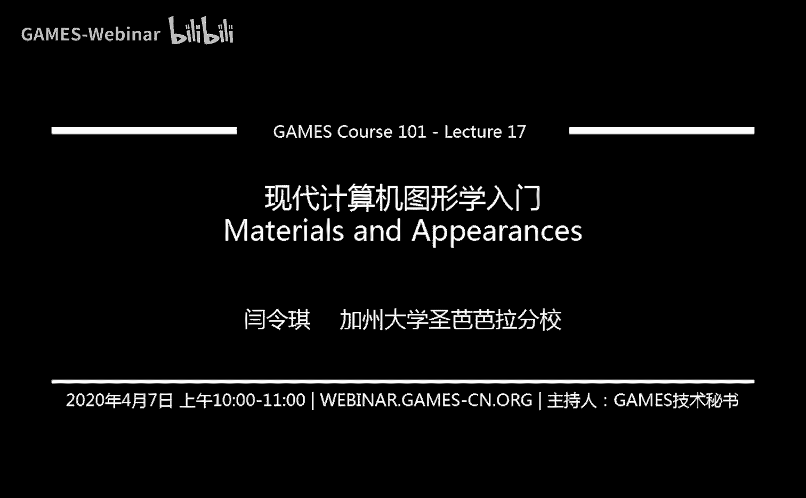

今天开始给大家讲这个新话题，咱们的retracing部分就算是圆满结束好吧，然后这之后就不会再有困难的事情了，大家可以看到这块呢我们说什么呢，我们说这个材质与外观，然后这里呢花两个课时来说。

这节课简单说一说这个基本的一些东西啊，然后这个嗯咱们下节课再说一说复杂的一些，这个时代这个前沿的一些东西，嗯，这节课呢要求嗯要能明白，然后下节课的话稍微听一听。

嗯表示知道这个现在大家都在做什么就差不多了好吧，那么在课前还是一样，咱们说几个事情，第一呢啊作业六目前来说这个82分提交非常好啊，然后记得咱们这个作业61。5个星期啊，不需要现在提交，应该是到周五吧。

我如果没记错的话啊，应该是到周五，然后作业期也是好吧，那么作业期呢就是关于这个pass tracing这一块，然后现在这已经我们这边制作差不多了，然后基本上是按照咱们上节课的这个课件里面提供的伪代码。

然后大家照这么做应该就没有问题好吧，然后呢这个咱们这周五应该是没有意外的话啊，然后上一个作业提交，这次作业在这个发布，那么嗯另外一个大家关心的事情，然后就是嗯大作业对吧，大作业做些什么，然后这个很快啊。

我们也在这个积极的准备中，当然大家已经可以自己着手去思考一些这些这些方面的，这个这个自己想做的一些东西了好吧，然后至于具体要求啊，或者别的什么东西，然后之后很快就会放给大家。

有可能这周可能是要不最晚是下周二吧，差不多好吧，那这么个安排，那么今天啊这是按照之前这个保证的这个事情啊，从今天开始，这些复杂的这些课基本上就没了。

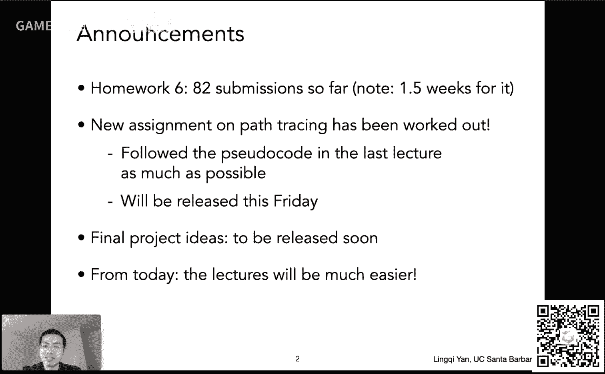

后面几节课应该相对轻松啊，好那咱们这就开始今天的正式内容，今天咱们讲什么呢，今天没有任何一个大纲啊，今天所有的内容都是围绕着这个嗯所谓材质的外观来这个描述的好吧，那材质本来和外观它其实就是一回事对吧。

有不同的材质，然后在某些光照下，它会就会表示出不同的外观，所以说这个外观呢算是这个光线和材质共同作用的结果，那所以说我们要研究的其实是各种各样不同的这种光照呃，与这个不同的材质是这个之间的这种作用方式。

这算是我们这个最主要的研究话题好吧，那咱们先看看这个自然界中啊，自然界中这种材质这个成千上万对吧，有可能会更多可以看到这种日出这种这种或者日落啊这种现象，然后这些海浪大家看到海浪有什么现象呢。

这个可以看透过去，对不对，然后大家知道这深海跟浅海含盐度不一样，就是各种各样的这种也会影响到这个海浪的颜色对吧，然后像这里这里呢有一束光透到这一个洞穴里面。

这个洞穴里面呢你就会看到这个有一个这个类似光洙的东西哈，然后这个是怎么回事对吧，然后这些都是这个材质这方面的内容嗯，特别的对于这个光柱来说吧，咱们举个例子哈，就是说我们看到东西大家都知道。

这一定是因为有光纤到达了人的眼睛，那如果我在这个点看到东西，那就一定得是在这个点上有一个光到达了我们的眼镜，那这个光既然是平常是直线传播的，它往往下面打他为什么在这个中间它会被我们看到，这是不对的对吧。

也就是说肯定得有光线，会不会被这个这个重新导向到另外一个方向上去，这个概念我们管它叫散射啊，然后这这块儿，然后呢咱们看这个中间这个例子可以看到这个头发对吧，这个很艺术感的头发，然后这头发呢有明显的现象。

在这个周围这一圈啊，它这个透光性非常的强对吧，正常情况下人们的头发都应该是这样的，没有问题，然后这个是怎么回事，就是投票和光线到底是如何作用的对吧，特别是成百上千跟头发，咱们刚刚讲过这个这个什么呢。

呃全局光照对吧，那从一个面弹射到另外一个面，这光线要经过一次弹射，那我如果从一根头发弹到一根头发，那这样的话我得弹射多少次才能出得来对吧，这有很多问题啊，材质和这个光影传播是紧密结合的。

那就这么一个意思，那咱们看这个不对吧，这个布料为什么大家一看就知道是不，然后呢它又不是这个这个这个这个金属是吧，这这这这就很奇怪，为什么我们一眼看上去就知道它是布呢对吧。

那肯定是因为它在外观上表现出来一些布的独特独特属性，它和金属就不一样，那自然就是这个布的材质和金属的材质不一样造成的，那么我们再看这个左下角这个蝴蝶啊，大家知道这个蝴蝶的翅膀都是由各种各样的鳞片组成的。

对不对，然后为什么各种各样不同的鳞片堆在一块儿，然后它就可以显示出不同的颜色，如果大家小时候看过10万个，为什么对吧，说这些鳞片啊，很多都是他们自己是没有颜色的，然后呢他为什么叠起来之后。

这个就会显示出各种各样不同的颜色呢，这个就很神奇对吧，以及这边这边大家看到彩虹现象，事实上如果你仔细看，这是双彩虹现象对吧，就是说为什么我们会看到彩虹，以及为什么说我们能够看到双彩虹。

然后为什么更多的高阶的这种彩虹我们就看不到对吧，然后这些都是我们要研究的问题，然后从这个角度上来说，我们看到了什么，我们看到这个光线传播啊，它和这个材质它确实光光线是不是光线。

它们两个之间的关系是是紧密联系起来的，所以我们在研究材质的时候啊，其实更多地表示了就是光线如何与材质进行作用，那就印证了我们这种说法对吧，那右边这个更更加复杂了对吧，就右边这个是这个寿司这些东西对吧。

然后嗯这边如果说有这个光线打到这些什么鱼肉啊，这些东西上面那这些就更复杂了，这鱼肉多少能显示出来一些透明的这种感觉对吧，但是他又不它又不是完全透明，它就是出现这种这种这个很神奇的这些这些现象。

就光打进去之后会变成一大片，然后再出来这种呢我们管它叫次表面散射，然后这节课这节课不会给大家说，下节课再给大家说，就是说关于很多这种类似的这种现象啊。

就是说很多都是说我们这个嗯通过对这个光线的传播的研究，来研究这个自然界这种各种各样不同的材质，那么这里给大家多说一句哈，就是说这个材质这个东西，然后反映在咱们的这个渲染器里面对吧，它肯定也是有的。

那么自然界中的材质何止成千上万，对不对，但是我们现在就是说我个人啊见过最成熟的渲染器，那就是这个维塔数码的这个蒙多快渲染器，应该是世界上最强的渲染器了，然后它支持多少种多少种材质呢，40种啊，40种。

然后这个和这个自然界中的才是数量，那肯定是没有办法比的对吧，那为什么他们还可以做出这种非常非常惊人的这种，这种超级真实的画面呢，呃那当然中间肯定有一大部分工作是这个归功于这个呃，非常厉害的美工的对吧。

然后有这些只是这些美工们这个记忆是出神入化了，这早在当年这种材质啊，基本只有这什么不连缝这种材质的时候，然后大家就可以通过这个美工啊，用各种各样的纹理啊，用各种各样的贴图啊。

贴出各种各样的这种不同的感觉啊，也就是说这块嗯非物理的方法，这个美工们是非常厉害的，或者说艺术家们是非常非常厉害的，这点啊还是得敬畏科学啊，这个也是科学，没问题啊，咱们只是从一个方面在试图解释问题。

好啊，ok那咱们现在回到这个材质的问题上来啊，那么在图形学中什么是材质，这个是我们关心的问题对吧，自然界中我们先看到了，没问题，那我们刚才也说了，那自然就是光线与这个不同材质的这种作用。

把它给这个描述出来，那就是不同材质，那咱们看这个嗯嗯目前这个例子哈，咱们看到左边这个图嗯，这是一个很明显三维空间中的网格模型，而且是四边形模型对吧，然后这个这个大家反正现在接触这个接触了不少了对吧。

那么右边两个是什么，右边两个就是这一副这一个相同的模型啊，我们渲染出来的不同结果对吧，那么这个呃为什么会渲染出不同的结果呢，那自然是因为我们可以给这个不同的部件指定不同的材质。

比如说大家可以看到很明显的是盘子的颜色对吧，都是这种陶制的对吧，然后大家为什么看到它是陶制的呢，因为它有些明显的现象，一个是它本身有一定的这个高光嗯，或或者说不叫高光吧。

就是说它的这个反射镜面反射挺明显的，在镜面反射背后呢，他又有这个这个漫反射，而事实上他就是这样的这种这种陶陶的东西啊，大家知道这个怎么做的对吧，烧这种陶土，陶土烧完之后者成型啊，或者怎么样。

这个咱们不关心，但最后有一个工序要在上面上一个东西叫做you，没问题吧，然后这又是什么呢，就是一种氢气哈，这种清晰意思就是说它本身作为一层覆盖在这个这个材质上面。

那首先它能够反射出来一部分这个已镜面方式反射出来一部分能量，然后呢光线总归能进去，还跟这层底下的这种真正陶土，这些跟这个呃漫漫射材质作用诶，那也就是说等他再反射反射出来，那就形成了又有一个这个镜面反射。

又有一个漫反射的东西，哎真是很神奇对吧，然后嗯当然我们可以这么指定，然后呢这个咖啡这块本身啊，这个黑咖啡还是卡布奇诺对吧，这个这个呃讲究还是挺多的，当然我相信对于这个艺术家来说，他应该是直接往上贴了。

不涂啊，然后但是不管怎么样，大家看到这个渲染是非常不错的，那所以说呢在图形学里面，我们是指定不同的这个呃不同的这个物体，然后它有各种不同的材质，然后我们这个知道他们是如何和这个光线作用之后。

我们就可以把它渲染的很对，没有问题，因为我们知道pass tracing啊，这些东西都是本身就是对的，可以呃相信那咱们就是说把这个材质描述清楚就可以了，那么现在我多问一句对吧。

那这个材质既然可以这个这个描述的这么好，那我们又知道在光线传播里面，这个呃the rendering equation对吧，渲染方程它本身是严格正确的东西，那它一定在这个渲染方程中描述了某一种材质对吧。

咱们之前课上其实提过对吧，那么我现在多问一句，在这个渲染方程中，哪一项是跟材质有关的呢，它的材质是什么样子呢对吧，我们知道有这个入射光对吧，有b2 df对吧，有cos对吧。

然后还有发这个自己发的这个光对吧，那么哪一项是决定它材质的呢对吧，那这里这个我相信大家都可以直接回答得出来，这就是b2 df对吧，为什么呢，因为b r d f直接决定了光如何被反射嘛，那所谓材质来说。

咱们不说这些这个空间中各种各样不同材质，咱们就说这个表面，那么表面它的材质是什么，无非就是它反射不同的光的方式，对不对，就是这个意思，那谁定义反射b2 df。

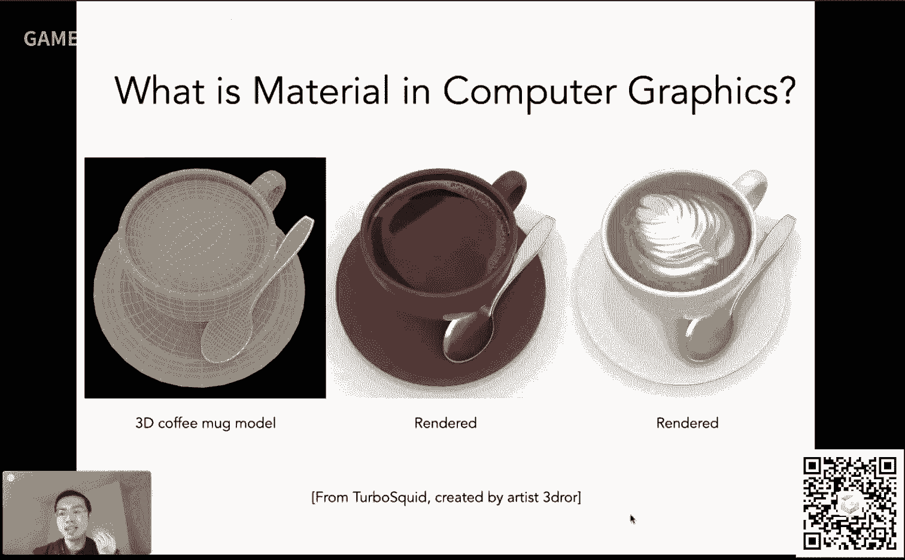

所以说我们这个最重要的一个内容就是关于材质的，最重要的内容就是材质等于b2 df好，那么我们这么说是有根据的，咱们之前给大家看过一个呃这个例子对吧，就是说这个材质是什么呢。

这个才是之前大家的这个已经能够回答了对吧，任何一个光线打到任何一个点上，然后它会被这个居民的分散到各个不同的方向上去，那当然这就是漫反射材质。

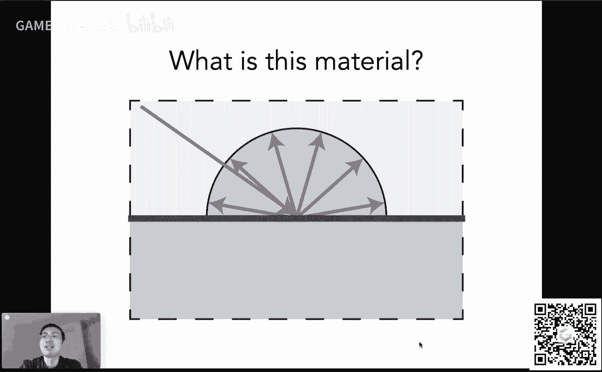

大家刚才呃呃呃这之前也见过这样对吧，然后说漫反射材质呢，我们可以定义它在任何一个点上，它还可以有一个不同的漫反射系数，嗯，虽然都是漫反射对吧，它各个点它这个光被吸收的部分不同。

所以会显示出不同的颜色对那这个是漫反射。

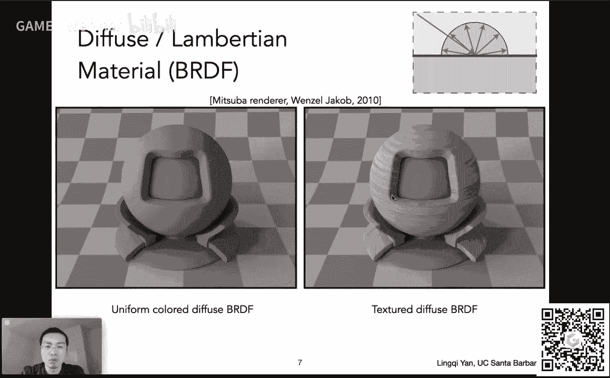

那同样道理，那咱们还可以定义其他各种各样不同的这种反射方式，在这之前呢，咱们先把这个漫反射这一块儿啊，先给说对，为什么呢，因为咱们之前提到这个吸收这个这个事情啊，呃我们是怎么定义这个漫反射系数的对吧。

我们是在布林逢模型里面定义这个漫反射系数的，我们说啊这个光线多少，这个当时我们用的概念还是intensity对吧，多少intensity到达，然后吸收，然后呢我们再给它一个颜色。

然后这个颜色在0~1里面，然后这个也就是说它会被吸收多少对吧，如果rgb 3个通道各不相同，那就会引入颜色，那就是这样了，那当时这个是一个经验性的定义，现在呢咱们可以把这个漫反射系数给定义对。

怎么定义呢，咱们想这么一个情况，就是左边这幅图啊，左边这幅图呢，首先我们先说清楚这个材质是漫反射，那就意味着说任何的光线进来从哪个方向进来，然后它都一定会被反射，那咱们现在人为地做这么一个场景。

我认为啊空间中从任何一个方向进来的这个光，它的radiance都是一样的，也就是说它进来的光也是所谓uniform的，那它反射出来的光，由于它是这个defuse，他也肯定得是uniform的。

那这有什么好处呢，如果我们这么假设，我们就可以利用一个东西叫做能量守恒，所以能量守恒，那意思就是说如果这个点啊它不发光，ok啊不好意思，如果这个点它不发光，那么它又不吸收广。

那也就意味着说我所有的这个光呃，进来多少，那就得反射出去多少，那我们考虑能量，能量进来的光的能量拿什么表示啊，是这一个这个着色点周围的一个小的区域。

它收到的能量也就是power per unit area，这是什么呀，这是irradiance对吧，那也就是说我进来多少irradiance出去就得是多少，irradiance一模一样，如果不吸收。

如果这个物体是白的啊，不吸收光好，那咱们这么假设之后，然后这样有一个什么好处，是因为我们刚才不仅假设了说这个入射跟这个叫什么来着，就是说这个材质是devs啊，那这样想啊，入社和出色的radi是相等的。

并且他们两个都是r都是这个radiance都是uniform的，那就意味着入射光的radius和出射光的radiance也得是一样的好吧，那这就是我们的一个一个观察，那有这一个观察之后。

那咱们就可以直接用这个呃这个呃渲染方程啊，然后因为没有这个自己发光下，那是什么呢，我认为啊这个入射光我们看i从任何一个方向来，它经过漫反射漫反射，也就是说b2 df是个常数啊，然后经过漫反射之后。

它会被反射到欧米伽o上面去对吧，那这个这第一个这个式子写出来，这就是渲染方程，那这个渲染方程咱们可以这个简化一下对吧，为什么呢，因为我假设入射的radiance是常数。

然后b2 df就是debus也是常数，所以拿出去这两项拿出去之后，发现他就是对这个半球上一个cosin函数的积分，那么我们知道半球上直接对半球的这个立体角积分得出来是二派对吧，大家可以自己试一试。

对半球上一个cos theta的积分积出来是派啊，然后这个这个是挺简单的事情啊，记出来是派之后，我们刚才说什么来着，我们说假设这个呃这个呃能量守恒对吧，能量守恒我们得出来结论是什么呢。

入射的radiance得等于出色的radiance，那所以l i得等于l o那得出什么结论，得出b2 df得等于派分之一，没错吧，那我们说派分之一的时候，永远是π分之一。

这个时候就是完全不吸收能量的b2 df，所以大家发现什么，这不是一啊，这是派分之一，这才是对的，然后呢我们可以定义一个所谓反射率这么一个概念叫lb的，然后b逗呢这个可以是一个单通道的，是一个优势。

也可以是三个数，rgb，也可以是这个光谱都可以，就是说lb逗呢我们定义一个反射率，它在0~1之间，那这样的话就是说我们可以引入不同颜色的b2 df，那这个b2 df的值就是lb都除以派好吧。

这就是说我们一个正确的defuse的bdf是多少，好吧，这样我们就说清楚了啊，所以它是从零到1%的啊，不是这个0~1好，那咱们把这个device这块说明白，那我们刚才说啊，呃材质当然还可以有更多的种类。

对不对，然后比如说这种这种是什么呢，这种入射光一根这个打到一个这个物体上，然后反射出去一个方向对吧，咱们之前也看过这个例子，这个说明的是什么呢，说明的就是说它很像镜面反射，但是呢它又不是完全的镜子。

它比镜子要粗糙一些。

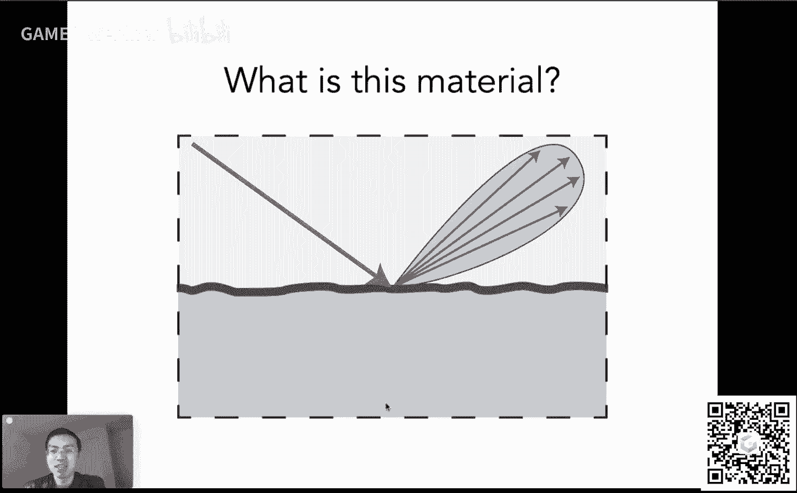

正常情况下，这就是我们所说的这个所谓抛光了的金属，就是这个意思，我之前给大家提到过这个概念，说这个古代大家拿什么照镜子呀，拿铜镜对吧，这个铜镜呢大家就是说这个在上面打磨的足够光滑，但是足够光滑的。

它和这个现代的镜子也没法比对吧，基本上来说就达到跟左边一样，这种稍微有点模糊，但是你能看出来它反射的这种这种项目好吧，这种材质我们管它叫glossy啊，就是多少有一点镜面，但是没那么精面。

这种叫glossy好，然后呢这个不同的这个材质呢，它反射出来的这个性质也不相同，比如有一些金属呢像铜，它看起来就是发紫发红对吧，这个意思，然后如果是鲤鱼，它就发白，就是这种感觉。

然后它就会有这么一些区别，但是大家可以看到这个地方怎么会有一个什么尖儿。

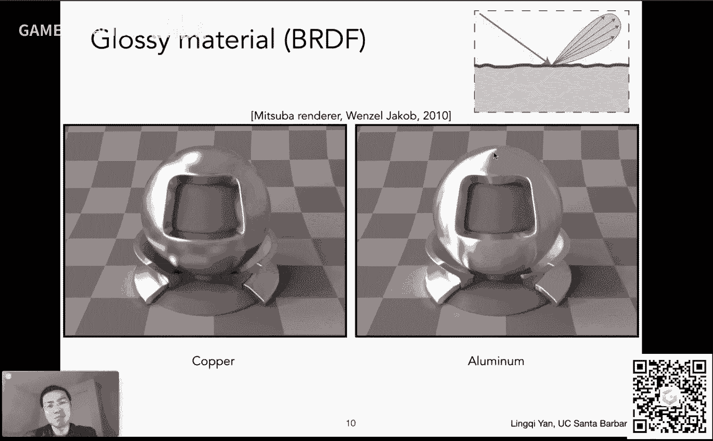

这是怎么回事对吧，马上给大家解释这个话题好，那么这个是我们说的这个glossy的这个这个呃物体，然后呢嗯对于这种材质，这是什么，大家可以看啊，比如说这里进的这一根光线打到这里。

然后呢他有一部分能量沿着镜面反射出去了，有一部分能量呢它它进去进到这个物体这个这个这里面去了，诶反而发生了一个现象，叫折射对吧，有反射有折射，而且都挺光滑的对吧，这种东西是什么呢，那大家可想而知对吧。

非常简单的这个就是呃这种材质是什么对吧，就是玻璃或者水对吧。

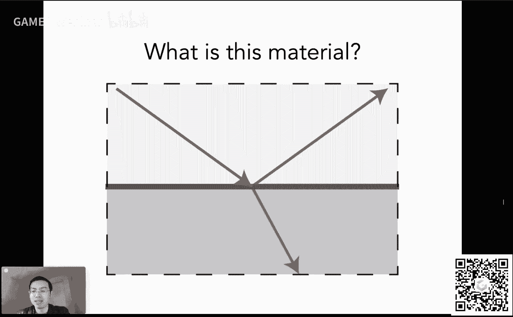

然后大家可以可以想象我们平常见到的正是如此，比如说左边我们可以认为是一个玻璃球，当然他这用的是水的性质差不多，这个大家可以看到有一部分能量被反射呃，正因为被反射。

所以你才能看到那边反射出来的这个环境光嘛对吧，然后呢这个这个左边就是这么回事了，就是说有光还会进去，这是为什么你能看到里面的这个灰色的这个球的这个这个圆球对吧，那么更有意思的是什么呢，是右边这一部分。

右边这个地方它有意思在哪儿呢，它是它是因为这个你这个反射出去的这个能量归反射啊，这块不管我，我我们关心的是这个折射的能量，哎就是说我首先我看到它有颜色，为什么它有颜色呢，呃然后我们看到能量。

这个就不不就是说这个颜色从哪来对吧，颜色是在这个玻璃的是球壳内对吧，在这玻璃球壳内来，那就说明什么呢，那就说明这个光啊，它在这个折射的这个折折射光在玻璃里面传播的时候，它会被部分吸收对。

因为它也不是完全吸收，完全吸收就没有光出来，那就变成黑的了对吧，它会部分吸收，有一些能量会被吸收，然后有一部分还继续往前传播着，那能量一杯吸收，我们就知道这个时候这个光线就来了对吧。

那这样一来呢就说我们就可以解释这个呃各种各样不同类型的材质，对吧好，然后然后这里就是说我们对于这个反射和折射。

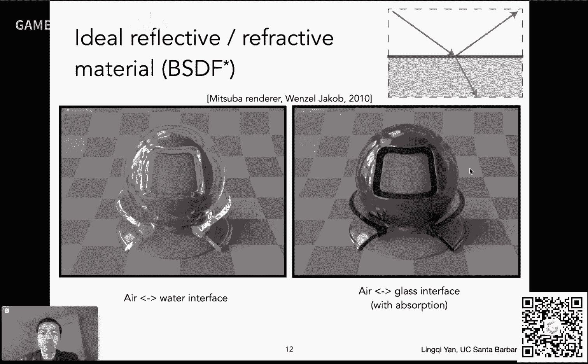

那对于反射和折射呢，咱们还可以研究更深入一点点哈，然后大家都知道啊，这个这个物理上咱们这个学的再清楚不过了对吧，反射定律，反射定律就是说什么呢，所以对于这个镜面的这个物体啊，如果你反射。

然后有一个入射入射方向，有一个法线方向对吧，然后呢这个出色的这个方向一定是这个呃，怎么说呢，就是说出射和入射它们的正中间一定得是这个反射方向对吧，或者说出射角等于入射角对吧。

然后然后就是说这里这个实验做的非常明白，从45度入手，然后可以看到45度出手对吧，呃然后这个呢我们就可以通过这个定律，我们可以写出反射的公式来呃，为什么呢，咱们可以看啊。

反射的公式有两种不同的不同的理解方式哈，怎么怎么理解呢，一个是说我就直接用这种反射的这个这个定律来嗯，怎么说呢，就是说我的这个入射光的方向和出射光的方向，那他们两个的正中间方向一定得是法线方向。

我们利用利用这么一个性质哈，那这样的话我们就可以利用这个平行四边形法则，把这个欧米伽i啊，跟我ωo这两个加起来加起来之后，它一定得得沿着这个n方向对吧，沿着这个n方向，那么它的这个长度是多少呢。

那长度是多少呢，那我们知道它一半的长度是这个红颜色的长度对吧，上面这部分跟这部分一样，然后一半的长度是红颜色长度，红颜色长度是什么呢，是这个入射方向投影到拔线方向的长度，那我们知道这个投影怎么投对吧。

一个点击就可以得出这个这个入射方向和入射方向和这个法线方向，它的点击呃，这就是这个红颜色的长度两倍，红颜色长度就是这个长度，然后这个呃法线方向它是沿着这个法线方向的，那我们得出出热光加入射光等于这些。

那咱们要想呃给定入射光和法线，那我们就把入射光挪到右边去，出射光方向就可以算出来，对不对，那也就是说算这个呢非常简单对吧，那还有一个更简单的这个解决方式啊，那就是说我们把这些呃。

这些角度给投影到一个这个局部的坐标系上面去，这个怎么怎么说呢，就是说啊你认为说这个任何一个方向它和法线的夹角，这个叫做仰角哈，然后这个呃当然这个不是从这个这个水平方向来的，它是从这个竖直方向开始记。

就是说这个c他呢咱们以这个c大o为为例哈，c大等于零，就意味着它是沿着反向方向，c大等于90度，它是意味着是平着往右边去啊，是这个意思，这个theta是这么一个角度，然后另外一个角度我们定义什么呢。

定义一个fi角度，这个发育角度是什么呢，我们规定比如说在某一个平面上啊，我们应该i我们a o和n它们在某一个平面上，这个认为是这个φ等于零，那如果这个平面它绕着这个n它一直在转诶。

这个就是就是说引起的一个角度叫方位角，叫塞塔，然后我们通过这种方式呢，可以把任何的这个角度拆成c塔跟f，但事实上来说，咱们之前在那个在立体讲上这块，其实大家这个也就见到了对吧，这块其实已经用的比较多了。

基本上来说任何一个这个角度我们都可以这么拆啊，然后这样的话呢我们可以看到，如果我们对于这个左边这个场景啊，咱们从上往下看，从上往下看，看到的就是这样这么一张图，然后呢我们这个入射方向假设还是朝外的哈。

入射方向跟反射方向，他们两个在方位角上的朝向正好是相反的，你会发现这么一个一个这个神奇的事情对吧，那么在这个角度上相反，其实就是加上一个派对吧，然后我们知道这所有的这些角度都是按二派来循环的。

所以说我们这个出色的这个这个five，或者方位角和入射的方位角的关系是什么呢，就是入射方位角加上一个派或者减上一个派都是一样的，然后这个对这个二派求魔。

我们就可以求到这个呃这个出射角的这个f那初始角的c塔，那再简单不过了对吧，这个是反射定律，直接说了呀，c它必须一样，theta肯定得等于c大i那有sa有fi，那么入射方向而出射方向我自然就可以算得出来。

没问题吧，那这样一来呢，就是说不同的方法来算这个角度非常简单啊，这块儿没什么问题啊，然后我想了想啊，这里应该是嗯我想想哈，这里应该有一点哈，就是说我们之前在提布林逢模型的时候啊。

我们说这个布林音缝和缝他们两个区别是什么呢，就是说我们要考虑这个所谓half vector，他们这个omega看o的中间方向和n它俩是不是足够接近对吧，我们不考虑什么呢，我们不考虑说是反射光和出射光。

是不是就是镜面反射光和出射方向是不是一致对吧，那个是为什么呢，就是因为大家看啊算这个反射的这个毕竟不是很简单，它得算一个点称对吧，然后还得有这个这个加法什么东西的。

然后这个算这块肯定是不如你直接算这个两个这个half vector简单，只要加起来normalize就可以了，对吧好嗯，这块是多提一句啊，那么反射方向咱们可以这么算，然后反射方向算的对了呢。

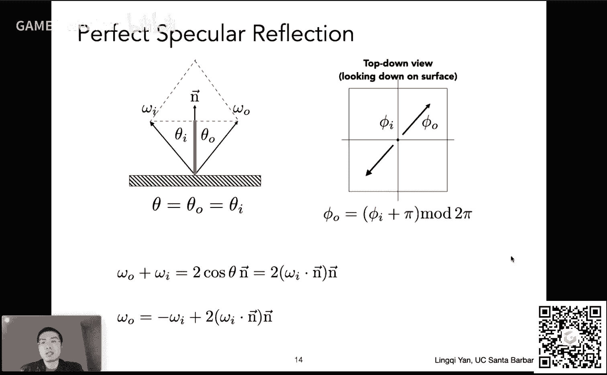

自然而然就可以得到这么一个这个这个情况啊，就是说我们任何一个光线从呃试点出发达到任何一个位置，比如像这里啊这里，然后他正好反射出去，应该这个情况下是正好反射到了某一个这个这个光源哈。

然后就会看到这么个效果，然后镜面函数写对了之后呢，肯定这样这样就是对的，但是有一点哈，咱们这节课里面给大家忽略了一个事情，那大家想所有的反射可不是都能拿b2 df来描述嘛对吧。

那么这个镜面反射那肯定也能够拿一个b2 df来描述，那么这个b r d f的值是多少，他这个就很就很麻烦了好吧，这里涉及到一个这个这个嗯呃所谓delta函数这么一个概念哈。

在这里我们这个就不给大家多说了啊，就是说他呃b r d f我们理解成是在一个固定了入射方向之后啊，在出射方向上应该是一个分布对吧，然后它现在的分布就集中在镜面方向上，一个方向镜面反射方向上。

所以说写出正确的b2 df没有那么容易，然后折射上更是如此啊，那咱们这里是算是多说一句，有兴趣的同学们自己推导一下是吧，然后那我们现在开始来说这个折射啊，那么折射是另外一个现象，大家这个见得多了对吧。

然后这个铅笔在这个水中会显得发生了折断，然后这个呃这个折射光通过了一个某一个什么物体之后啊，它会发生在这个路径上的平移对吧，然后以及说一束光线平行光经过了棱镜之后。

它会被折射成这个呃呃会会因为它的各个不同的这个波长，有不同的折射率，被分解成不同的这个光线对吧，然后有不同颜色的光线，那这些都是折射现象啊，然后这里说清楚一点啊。

咱们这个折射现象在这个光的这个所谓色散这么一个呃这个现象中，仍然是采用这个几何光学的形式来描述这个折射啊，并没有什么什么涉及到波啊或者什么东西的，并没有。

仍然还是认为他是这个这个啊几何光学光沿直线传播传播，只不过啊它有不同的折射率，不同的波长，不同折射率，那么这右下，角这幅图呢这个现象大家看到的是什么呢。

这个现象呢在图形学中我们管它叫做cost stics，costcs，在国内有一个翻译非常不合适，叫做焦散啊，胶是聚焦的，焦散是散射的散，然后这个呃我认为不合适。

是因为这个看到costx永远的原因是因为聚焦，而不是因为这个散射，所以从这个角度上来说，我们就管它叫costics，这个costx怎么形成的，是光线打到这个海水的表面，但是这个海水表面凹凸不平的对吧。

然后就就是说肯定它这个这个光线会往不同的方向去折射，那么对于这个这个海底的某一个点来说，它，势必呃应该是有几率就是几率接收到来自于不同方向上，然后打过来的光都正好打到这个位置上去。

那这种情况就好像拿放大镜把光给聚在一块，那这块就显得特别亮对吧，那就是说这种情况下，就在某些地方呢，它正好会形成这么一些条状的这些东西，哎这个就就非常有意思。

当然这一块呢对于渲染来说是一个灾难性的这个这个这个这个考验哈，就是对于这个我们教的pass tracy是不适合这么做的，咱们下节课给大家多说好吧，好，咱们回到反射折射什么的事情上来啊，折射现象非常。

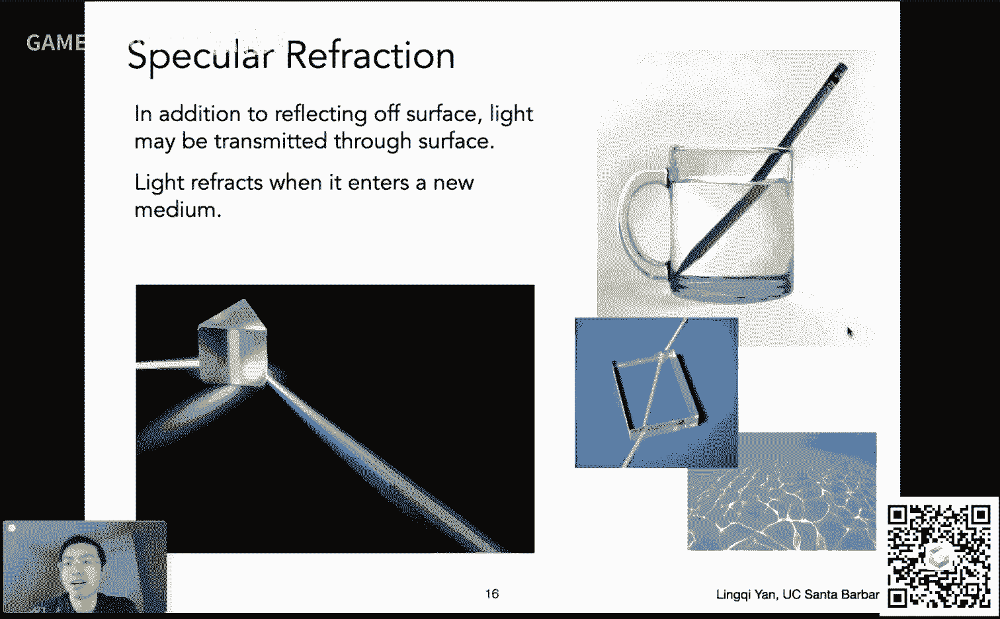

多对吧，折射呢怎么给定这个折射入射方向和这个法线怎么算这个折射方向呢，这也是有办法的对吧，这个定律呢叫做这个斯内尔定律，然后又叫折射定律对吧，这个大家之前这个肯定也是学过的啊，这边稍微挡了一点哈。

折射定律说了什么事情啊，首先这个折射和反射一样，都会发生在这个入射方向和这个呃法线形成的平面内，然后呢咱们就可以针对这个平面来看，那么他说了一件什么事呢，如果我们定义这两个夹角啊。

分别是这个呃注射和法线以及折射和反向的反向延长线，它，们之间的夹角分别是c塔x c大t也是入射角和折射角啊，他满足什么关系呢，那就是入射角的正弦啊，然后和这个折射角的正弦。

他们之间满足一个这个折射率相乘相等这么一个关系，那什么意思呢，就是说不同的材质我们可以规定它有不同的材呃，不同的这个折射率，然后呢我们认为这个水比如说1。4或者这这种折射率啊。

然后这个折射率呢就是就是说我们承载它对应的这个入射入射角啊，这这折射角啊就是在这个在这个材质内的这个角，它的正，弦得到的结果永远是相等的，哎这就非常好，这说明什么呢，这说明有这个折射率啊。

我就可以算出c的诶对吧，因为我们刚才说的c加fi分解还是还是存在的，然后这个theta呢这个这个入射角知道，那么这折射角c塔就可以算出来，那我们刚才说theta跟fine是不是都一样，算对吧。

然后呃然后这个在的话，我们我们这个跟反射一模一样，这块儿这块儿就是说嗯大家可以看到，如果我从上往下看它的这个方位角度来说，这个无论是折射还是反射，它的这个方位角的朝向，它都是这个和他们就是。

折射光啊和入射光相反，然后反射光的入射光也是相反对吧，哎这样的话就不错好吧，那这样一来的话折射我们也可以算出折射方向的对吧，然后呢我们刚才说的折射率这么一个概念，然后空气基本也是一水呢，差不多算是1。

333啊，我刚才说错了哈，我以为是1。4，然后这个玻璃它就更大一点诶，然后大家发现这个钻石是非常可怕的，这个钻石是2。42，这个折射率折射率就非常高，那折射率非常高，就意味着这里这个光啊进来之后。

它会被折射的非常厉害，就是折射的非常小对吧，这个折射角就非常小，然后呢以及它折射率非常高，它就会体现出各种各样不同的这个这个呃波长的光，它会被这个折射的这个不同程度就会就会被这个这个钻石体现出来。

这就是为什么我们看钻石的时候，就会觉得他这个闪闪发光啊，这个它会有各种各样的这个不同颜色，五颜六色啊，呃原理就在这儿啊，就是因为它折射率非常高，好那么这是折射率，那么我们刚才说啊对吧。

这个有了这个折射定律或者4。2定律，那这之后呢我们是不是就可以把这个嗯，这个折角给算出来对吧，给定这个入射光和法线，那这个太好算了，这剩下的这个这直接我们就可以写出来这个式子的。

只不过是写这个式子的时候呢，我们不是算算折射角，而是我们要算它的这个折射角的余弦，为什么要这样算，大家很快就会知道说我们为什么要这么算，那折射角的余弦自然是一减正弦平方开根号对吧，那正弦呢等于什么呢。

把这个呃左边这部分呃，把这个折折射的这个嗯被折射到的这个这个戒指里面的折射率啊，拿左边去，然后这边我们会发现可以展开变成这，么一个式子变成这么一个式子，然后这里呢大家就会发现一个现象，什么呢。

就是说啊我们要算出来一个夹角的，不管是多大的夹角吧，然后我只要求余弦，我肯定能算出来一个有意义的实数对吧，是这个意思，那如果说我这个公式这个这个得不到这么一个有意义的石柱，那就意味着折射不可能发生。

哎这个事情就很神奇对吧，为什么呢，大家可以看到这个式子确实有可能在某些情况下啊，它是没有什么，是在实数上是没有什么意义的，什么情况下呢，因为很明显大家看到一个根号，根号，在什么情况下是没有意义的呢。

那就是在这个根号内部的这些东西小于零的情况下，是是不是没有意义的对吧，那我们想一想啊，在这个根号里面这么一串数它要小于零，那是不是得保证右边这一项它得是大于一，有可能大于一，没错吧。

那右边这项有可能大于一，那这个我们知道这一减cos平方怎么也不可能大于一，那如果要大于一，只有可能是这个比例大于一，那这个比例大于一反映了什么呢，反映了说这个这个呃一塔i呃。

大于一塔t也就是说啊我们得出了一个什么结论呢，在这，个e太i大于一大t的情况下，也就是说当我们的入射的这个戒指啊，就是从某个戒指来啊，折射到某个戒这戒指去啊，入射的戒指和折射的戒指，那入射的介质。

如果它的这个折射率是大于折射的介质，折折折射的这个介质的折射率的诶，这种情况下就有可能会出现没有折射这么一个现象，而这个现象大家很熟悉，这个就叫做全反射现象，对不对，这里我们就是说简单的推导了一下。

这个这个这个全反射现象发生的条件，那我们说啊啊只有说在入射的介质是一个更密的介质上对吧，才会出现这种情况，其实情况嗯从这个呃空气到水里是不可能的。

因为空气里面一大i一定小于水的一台t这个比例绝对不可能的，ie对吧，那只有可能说反过来反过来什么呢，那咱们来看这么一个现象，这个现象叫做这个snail's window或者叫snails circle。

他是什么意思呢，就是说人在水底对吧，人在水底往各个不同的方向去看，我们可以看到嗯，这个只能看到一个这个锥形的一个区域，这是在水底拍了一张照片，大家可以看到在这个追星我们可以看得见诶，在这个追星之外。

我们什么也看不见，为什，么看不见呢，大家可以看左边示意图，因为如果我从这个点，然后我往这边发射光线呃，呃发射一条光线到到这边的时候呢，它的折射角就已经达到90度了，所以基本上往平的方向去了。

如果这个角度再大一点，它就会直接所有能量都会反射反射到池子底下，那当然光源来自于上面啊对啊，所以说到底下我就看不见了，如果我认为光线就弹射一次的话啊。

那这样的话就是说我们只有一个很小的区域是可以看得到的，那这个区域是多大呢，这个还有人算出来这个角度啊，97。2度，然后所以说这个还是很有意思的一个事情啊，就是说全反射现象很容易发生，为什么要提这个事情。

是因为这个嗯嗯在之前大家做这个光线追踪的时候啊，其实大家就应该遇到这个现象了，但是没有遇到是怎么回事呢，是因为大家在这个trace一个这个球的时候啊，这个trace球的时候球是有一个很好的对称性质。

就是你折射进来的光一定可以被折射出去，这个是没问题的好吧，然后这些自己大家可以画一画，它就会发现这个在球上啊，或者在圆上这种折射他这个呃它的这个入射点和出，射点有一个很明显的对称性质。

然后嗯这样的话可以保证你折射光一定可以出来，但是你比如说大家想象一下，如果大家在做这个retracing，做一个这个呃兔子好吧，有一个兔子，然后这个它各种各样复杂的形状，那是光线可以穿进去。

假如是玻璃兔子啊，光线穿进去之后，它有可能就是在内部会发生全反射，然后这个这块是需要检验的，没问题啊，说这块就是说我们为了把这个光线追踪做对很多这个物理现象，所以都是都是需要考虑的，好吧啊。

同样道理回到我们刚才的话题上来啊，我们说这，个折射肯定也得对应一种b2 df，但是呢这里这个我们说b2 df这二是什么意思呢，是反射对吧，它表示的是反射，那折射它显然不是反射，那它应该叫什么呢。

它应该叫b t d f对吧，然后这个t表示的是transmit，是指这个折射的意思对吧，然后就是说呃这个这个呃b pdf和b2 df其实统称起来，我们可以管它叫bs d f，就是s表示散射。

就是这个不管是反射还是折射啊，我们都认为是一种散射对吧，呃被这个嗯某个光线，某方向光线被散射到其他方向上去了，叫b s d f，所以之后大家见到，b s d f其实是一种统称啊。

b r d f加b t d f，平常情况下呢，如果大家直接说b2 df也基本上也是这个意思吧，很少有人是严格意义上区分这个反射和折射好，那就这个意思了，那咱们呢现在再来提另外一个事情啊。

就是说关于反射跟折射这一块，有好多这个各种各样不同的这种这种这种性质啊，有趣的性质，这个给大家讲的一个性质呢是叫做什么呢，叫做非念，而像这个菲涅尔项目是干什么的呢，哎大家可以看到啊。

这个呃我们有这么一个例子，我们可以看看这三个不同的情，况这是什么呢，这是一本书啊，这是一个书桌，首先抵着墙放，然后呢这个书就是竖着这么放，就是就是靠着墙，然后他和这个周二有垂直啊。

然后咱们可以以不同的这个视角啊，看过去，看过去之后我会发现有一个神奇的问题，什么问题呢，就是说如果我是垂直往下看，这个时候我几乎看不到什么反射，那如果我几乎是凭着这么这么往前看。

然后我会发现这个桌子反射出来这个这个呃书反射都特别明显，对不对，会有这么一个情况唉，也就是说啊有多少光被反射，其实这个是有讲究的，就是，说这个是和你的这个入射光有关系的，你这个入射光进来之后。

和它的法线的角度决定了有多少能量被反射对吧，那我们为什么要提这个话题啊，是因为咱们刚才说这个这个有有有光呢，达到这个这个呃物体某个表面啊对吧，然后它会有一部分能量反射，有一部分能量折射，那到底是多少。

那通过菲涅尔向我们就可以来解释到底有多少能量发生了反射，有多少能量发生了折射，对吧好，那我们刚才说啊，一个基本的观察是这样的，就是说啊嗯在我这个角度入射的角度哈，如果一根光线。

入射角度它和法线几乎是平着的，那么就认为大量的能量会被反射掉，呃那这里这张图我们可以看得明白，比如说咱们就只看这个红线，马上再说别的哈，先看这个红线来说，这就是这个菲涅尔想告诉我们的。

如果说啊一根光几乎和这个物体表面完全平了，那它就会完全被反射掉，那如果说这个这个光呢和这个物体是垂直着的对吧，呃那这样的话呢这个呃嗯就是更多能量会直接穿过去，就是会发生折射，反射的能量就非常少。

智力才大家看到低于5%对吧，就这个意思，那么这里，呢有几个事情说一下，一个呢是这块儿啊，这个嗯另外两条线表示的是什么呢，表示的是一种所谓的极化性质，这个呢和光线的这个波动性有关。

就是光线啊它其实是沿沿着各个不同方向，它有震动的，然后这个极化就是说它只沿着某一个方向震动，s和p呢是两个不同的方向的这个这个极化或者说震动，然后就是说正常我们认为光呢这个s方向也有p方向也有。

基本就是s和p方向的这个平均，所以咱们平常不用管这个这个呃极化现象，目前也没有什么渲染器真的在考虑这个，这个极化了的光它们是个什么样的情况好吧，然后就是就是这么回事，那么呃这里我们就只看这个红线就行了。

那么这是一第二要跟要跟大家讲的事情，就是这么回事，如果说大家坐车子啊，不管是做什么车子有玻璃窗的，然后呢你这个你可以完全观察到这个现象，什么现象呢，你如果对着窗子看，就是垂直的窗子看。

你是可以看到外面没问题，可是如果你看前面几排的人的窗户，然后你会发现你基本上看到的反射出来的这个司机啊，或者是这个车子前面的东西，哎，为什么呢，是因为你，看前面那几个人，这几排的人的窗户。

你这个这个视角这个方向基本上来说是这个这个几乎跟这个玻璃平行，或者说跟反应垂直对吧，那这种大量的反射会发生，你就会看到反射的东西，就好像那是镜子对吧，垂直的时候你就不是诶，所以说很多东西可以这么解释。

那是菲尼尔像呢说的就是这么一个意思，哎哎呀哎呀，不好意思啊，嗯是这么回事，我刚才不知道说到了什么，这个触发了，嘿siri嘿嘿真是心好吧，这个可以啊，嗯当然了，这里呢只是一条曲线。

它是反映了对这个某一个材质它的折，射率是1。5的一种这个呃绝缘体啊，这他是这么一个情况，但是我们既然提到这儿哈，就是说绝缘体是一种这个呃嗯有着某一种特定的这个飞鸟尔像，那么对于这个呃叫什么呢。

就是导体对于导体来说，它又是另外一种飞鸟而下，咱们回回回到这个话题啊，我们刚才说什么来着，说这个对于金属来说啊，金属来说它的这个菲尼尔像就和这个绝缘体就不太一样对吧，导体的这个菲涅尔像。

即使是在你垂直看着过去的情况下，它也是这个反射很多的诶，那这就反映了一个问题啊，什么问，题呢那就是说这个嗯我们为什么这个照镜子，我们用的是这个这个银质的镜子对吧，或者说我们用的是这个铜质的镜子。

是因为这个这个他们在任何情况下反射率都挺高的对吧，都有大量的能量被反射，这样我们可以看清自己，你很难见到谁去这个这个叫什么，去把一个玻璃擦得非常亮，然后当镜子对吧，这是不可能的。

因为玻璃是呃是这个叫什么绝缘体对吧，那所以绝缘体和导体它又有这个区别，然后呢这个我们刚才说这条曲线啊，它这个是先降再升，这个也很也很神奇对吧，也就，是说有很多这个很神奇的各种各样的这个这个现象发生。

然后对于不同的金属肯定也各不相同对吧，那么菲涅尔向到底应该怎么算呢，那答案是如果我想很准确的把它算出来，公式就已经有了这个非常非常非常复杂的这个公式，就是用来算这个菲涅尔项目是什么呢。

就告诉你有多少能量，这个会被反射出啊，就是一个0~1之间的数，有多少能量会被反射，这里算是什么呢，大家看到s和p熟悉吧，刚刚讲过，这就是极化，两个不同的极化会告诉你两个不同的这个呃反射率，然后呢我。

们平常考虑不极化的光，那我们就让就是把这两个反射率给这个平均起来就好了对吧，这是我们平常的考虑，然后这个这个大家来看哈，不管它计算多么复杂，它一定得跟入射光的这个这个和法线的夹角有关系。

也得跟这个材质有关系，就是介质啊，就是说你这个入入射的戒指和折射的这个介质有关系，所以肯定跟这个n1 n2 ，就是我们之前说的一带一和一带二有关，也得跟c大i有关系，注射光有关系对吧，哎这样想就行了。

没有任何必要去知道它，但是呢人们通常会觉得这个算，起来太麻烦了，怎么做呢，所以有一个这个呃简单的简化方法叫什么呢，叫十ex approximation，然后他做了个什么事情呢，很简单。

你这个曲线我就认为它是从某一条某一个地方这个开始，然后呢长到这个90度的时候能长到一对吧，从一开始这个0度的时候，它是某一个值涨到90度，长到一就跟那个绝缘体一样，对于导体来说。

我也不考虑它下降再上升了，我就考虑他从比如说90%，我要上升到这个百分之百对吧，但都是这么一条曲线，这么一条曲线我拟合出一个曲线感就好了吧，那我认，为它的基准反射率也就是相当于在0度的时候的反射率。

垂直入射的反射率是和他们两个的折射率有关系的，然后这么算出来，然后呢我考虑它和这个它这条曲线要上升，上升到90度的时候，正好得等于e，大家看到啊，90度cos等于零，这这一项等于1-20。

然后加起来就等于一诶，很对的啊，然后就是说嗯在0度的时候等于二零，在90度的时候等于一好，那这样的话它不管是对导体还是这个绝缘体哎，他都可以这个近似的非常好。

那所以说ex proximation得到了非常非常广泛的应用，在，这个图形学里面啊，就是只要不是说对这个材质的追求非常非常高，就是说正常情况下它是一个不错的近似好，那么讲到这里呢，这个呃折射率哦。

有同学反映说导体的折射率是负数，说的太对了，没有任何问题，我这里没没这个这个叫什么，详细展开说这个事情啊，就是说导体的折射率，你正常情况下不仅要一个n还要一个k，其实相当于是这两个数。

或者你理解成它是一个负数，然后就是说这个没有那么容易，但是就是说正常情况下我们实现起来还是不是这么复杂的好吧，那这里说，到这那么为什么要提这个所谓菲涅尔像呢。

就是说我们这里要引入一个真正的基于物理的材质，这种材质叫做微表面材质或者叫微表面模型好，那么这个微表面模型是什么意思呢，就是说我们先考虑一下啊，到底是到底是怎么回事，什么要提出这么一种模型呢。

对这里呢我们就先看这么一个这个这个卫星图啊，相当于是这应该是宇航员在某个空间站拍的这个图啊，然后嗯这个图在看什么，据他们的这个这个这个文章来说啊，这里看到的是这里有一个高光，而且这个高光是发生在。

澳大利亚啊，是这个意思，然后这个高光怎么来的哈，大家可以看到这上面，这应该是这个这个能够反映出太阳应该是在某一个方向上啊，然后观察点在这边，然后我们看向这个地方去，我们可以看到有一个高光。

然后这个高光呢这个呃大家可以看到呃，挺完美的对吧，就好像说我们在渲染一个这个球面一样，然后得到一个相对完美的高光，然后这个就很神奇了，不对对吧，大家觉得不对不对，在哪儿不对。

在这个我们感觉这个这个地球它的这个表面上来说，它又有山，又有一些建筑物啊，有，些树啊，这些东西完全看不到，我看到的就是一个平面，对不对，然后我看到就是这个平面上会产生一些高光。

这个高光看起来还有一定的粗糙程度，对它不像这个镜子对吧，诶那这就说明什么呢，这就说明从远处看啊，从远处看我看不到各种各样不同的细节，就是像这些这个树啊，人啊动物啊，在这个这个角度我绝对是看不见的。

我能看到的是什么呢，我能看到的是整个一个这个表面，我如果认为它是瓶子，它应该有一定的粗糙程度对吧，然后这里其实还可以这么解释，这个看到了，如果是，澳大利亚我信了哈，就是说如果真的是澳大利亚的话。

大家知道澳大利亚的地形，这个呃正中间有一大片全是沙漠对吧，沙漠这个东西呢，你就可以理解成是一些这个这个呃，某一些这种高低起伏的这么一些分布对吧，你虽然从远处你看不到这么些分布，你认为它是平的。

但它其实可以把光导到不同的这个方向上去对吧，那也就是说这个沙漠从远处上看，看过去来说，就好像是一个平面，然后它本身可以以一定的所谓粗糙程度来反射的这个光，那么我们提这个微表面模型啊，其实就是。

基于这么一种假设，只要当我离得足够远，我们看向一个物体的时候啊，很多这种微小的东西我们看不到，我们看到的是他们最终形成了一个对表面的一个作用，对这个对这个光的最终形成了一个这个这个总体的一个效应。

是这个意思，那么微表面模型呢说的就是这个意思，那咱们来看看所谓微表面模型呢，它做了一个这么一个事情，它假设物体的表面是粗糙的，没问题，但是我会假设说呢，我这个从远处看呃，我看到的基本上就是平的一个表面。

没问题啊，就是这个就跟我们刚才看这，个卫星的图一样，只是相对的对吧，从远处看东西是平的，然后从近处看，我们确实能看得到这个一个一个的小的这个微表面，micro的这个这个层级对吧。

从这个远处看叫macro的层级，看到的是平等，那么这个微表面模型假设这么一个事情啊，首先我从远处看看到的是一个平面，并且是粗糙的好吧，就是就是这个意思，所谓粗糙就是它的所谓它的材质看上去是粗糙的。

没问题，那么如这个从近处看过去，我可以看到凹凸不平的表面，并且每一个这种小的这个表面的微圆，我认为它都是一个这个，这个完完全全镜面反射的一个这个物体，但是之前学过物理，其实也解释。

也是这么解释这个漫反射物体的对吧，什么是漫反射，它可以把这个光反射到四面八方去，那为什么呢，那是因为你可以认为所有的微表面它都是像一个很小的三角，微小的镜子，他说这些镜子超级小超级多。

然后在这各部规则啊，最后形成的这个分布，所以其实大家不知不觉中啊，再用这个微表面模型，那么总结起来就，是微表面模型，认为从远处看看到的是这个呃，看到的是材质或者是外观，从近处看看到的是几何。

这个概念其实是非常重要的，一直在现在的图形学的研究中，还在用这个概念啊，就是说如果如果我从这个近处看，我可以看到不同的几何，在我把镜头拉远的情况下，不同的几何会消失，并且会变成材质，就是这个意思。

所以本质上来说材质和几何是有一定的关系的，好那咱们回到这个微表面模型上来啊，大家这个在这个理解清楚，就是说每一个微表面我认为它都是一个微小的镜面，好吧，然后呢它这个微小的镜面。

每一个呢它都有自己的朝向对吧，然后每一个微表面有自己的法线，就这么个意思好，那么我们研究这个干什么呢，正是因为我们可以研究这些微表面，它们本身法线形成了一个分布，这是什么意思呢。

比如说啊咱们看这个表面看起来挺平的对吧，就意味着这些微表面，其实他们分布这个法线基本上来说差的也都不太远对吧，像这样基本都是朝上的，就是这个意思，所以如果我们把它的分布给画出来。

它其实基本上来说他们的法线会集中在这，个这个嗯这个宏观的表面的这个法线，它的周围这一圈对吧，离得非常近，差得不远，把这个分布画出来，哎这样的材质它就对应就是所谓glossy的材质。

那大家肯定会说这个那镜面，那肯定就是说这个所有的微表面朝向都是沿着这个宏观表面上对吧，他这个理想情况是的就是这么回事好吧，那么另外一种情况，那大家可想而知对吧，那如果表面粗糙，什么叫粗糙呢。

粗糙就意味着所有微表面它可能会沿着不同的方向对吧，它是这个朝向是往各个不同的这个方向上去对吧，它往各个不同的，方向上去，那就意味着它在方向上散非常开，如果说我要把它给画出来的话，它的分布哈。

然后那就离这个中心它可能离得非常远，都会有它的分布的值，这种情况下，这个微表面它它这个就会形成一个所谓这个defuse的这种材质，就是慢慢这个材质，那也就是说什么呢，也就是说通过这个微表面模型。

我们可以把这个表面的粗糙程度啊，用什么来表示，用这个微表面的法线分布来表示，对不对，它的法线分布集中，那这就是glossic，它的法线分布分得开，这就是这个漫反射，所以说微表面模型正是利。

用了这么一个思想怎么做的呢，大家可以看到这个右边哈，呃下下面哈，这个微表面模型它本身只是一个b2 df，对不对，b2 df考虑入射方向，出射方向对不对，然后b2 df呢首先他考虑了一个非念而降。

这个菲涅尔想告诉我们说啊，对这个根据我不同的入射方向有不同不少这个就叫叫什么来着，就是说不同呃这个程度的这个反射对吧，也就是说如果说我的观察方向，我入手方向和这个法线几乎是平等的，大量能量被反射对吧。

如果垂直就少量能量飞跃而下对吧，先把能量做对，那么，下面一步我们先忽略中间啊，先下面一步我们考虑它的这个法线分布，对它的法线分布，我可以用某一个分布来表示。

然后这个分布呢表示了它在这个任何一个给定方向上，它的这个呃分布的值是多少对吧，它可能是这个集中在中间的，那么这里呢我我会发现我又用到了这个概念叫half vector。

这have vector是干什么的呢，这个大家还记得对吧，给定这个入射方向，出射方向，我现在要问有多少这个这个所所谓微表面啊，有多少微表面能够把入射方向的光反，射到出射方向上去，我问这么一个问题对吧。

那那那这个是怎么怎么来理解呢，就是说啊，只有当这个微表面，它的这个法线方向和你这个half vector所谓中间方向完全一致的时候，这样的微表面才能把入射方向反射到注射方向上去，那否则的话。

因为它是完全是镜子嘛，还记得吧对吧，微表面我们都认为是完全的镜子，那只有它这个在法线方向沿这个中间方向才有这种反射的可能性，那么我现在就问在我所有的这个分布里面，有多少微表面。

它的法线方向是沿着这个方向去的呢，那自然就，是对这个呃这个这个呃法电分布诶，往这个方向上的这个分布的值进行一个查询啊，这个这个这样理解就没有问题了，好吧。

就是说你只要能够理解说什么样的微表面才能把入射反射到出色对吧，就可以了，那这就是它的这个法线分布这一块，那么这里中间一块叫什么呢，叫shadow in masking term，这一块又叫几何项啊。

然后就是写成g那么这项表示的是什么呢，这项其实表示的意思是这么回事，大家可以想象一下啊，就是说我这些微表面啊，它本身它既然是这个排在这个物体表面上去的，那有可，能他们本身会发生互相遮挡，有这么一个情况。

你比如说啊我有一束光从左边打到右边这么一个这个这个微表面上啊，一个一束光从左边它非常非常斜着啊，他和这个和这个这个呃发现非常垂直呃，像呃像这种情况下，然后几乎和面都是平的了。

那么左边这些面很有可能就会挡住右边这些面，那就有很多就是右边有很多这些面接触不到光对吧，那也就是说他们会发生自己给自己的投影阴影对吧，反过来道理一样，如果说你从另外一个角度看过去，就是说光是一个方向啊。

你这观察，方向也是一样，你从另外一个角度看过去，也有可能说诶我这个有一部分因为遮挡，我看不到这些这些微表面哎，那也就是说嗯在这种情况下，我们会发现这个有一些微表面啊，失去了它们的作用对吧。

然后也就是说原本我算出来是某一些反射的能量，但其实没反射那么多能量，有一些被挡住了对吧，也就是说这个shadow in masking考虑的就是这么一个现象，那么我现在多说一句。

什么情况下比较容易发生这个这种自遮挡，自投影这种现象呢，那就是说我的光线几乎是平的，打到这个表面上的情，况我们给它起一个名字，这种入射方向我们叫grazing angle。

就是所谓grazing angle，就是几乎和面平着进来啊，这种就是说啊，无论是光线方向还是观察方向，只要他们接近这个grazing angle，那这种情况下这个shadow masking。

shadow in masking就容易发生，那也就是说如果没有这一项，我们可以想象，如果去渲染一个球，那么在他的球的这个边界上，我们知道这个我们打过去一根光线，它几乎是brazing angle对吧。

然后这种情况下它边界的时候会特别亮，然后呢如果我用了这个shadow mask边界的就没，有那么亮，好吧，那这么说，那么这三项都非常有道理对吧，呃这个菲尼尔像表示总共有多少能量被反射，然后能量。

那么到底这个是怎么反射的，决定性的这个这个性质就是它的法线分布到底是集中开始发散，然后咱们为什么要查询法线分布上这个往这么一个方向上去，confect方向我们也讲清楚了。

那么后面这些剩下的呢就是为了这个各种各样推导的时候，中间涉及到的各种各样的变换，他们的这个所谓结构变是什么东西，都是怎么算，的这块就不给大家多说，那么这个微表面模型就这三项最重要，好吧，咱们说明白。

然后呢微表面模型咱们为什么要提，因为它太强大，强大到什么地步，大家可以看到这么几个这个例子。

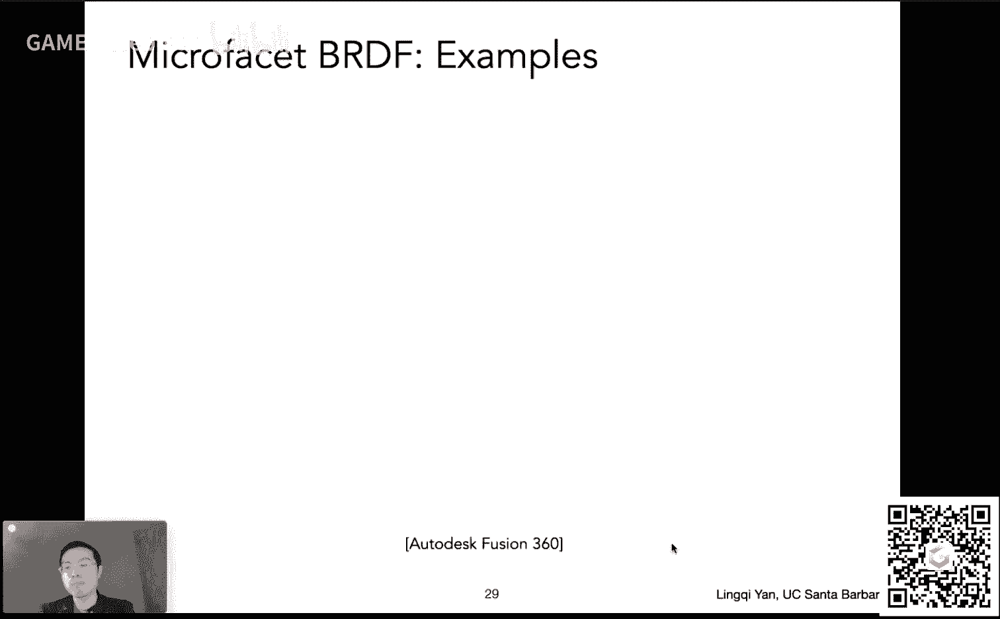

大家可以看到这是一个用autodesk fusion这个360这个渲染出来的图，这个摩托啊，然后这个非常非常的这个高质量，大家可以看到这个它可以表示各种各样本邮箱啊，这块仪表盘啊，这块对吧。

然后仪表盘显然是这个defuse的了对吧，呃外面这个玻璃呢显然它是玻璃这种材质了对吧，然后这个金属这块和这这个，嗯非常光滑的金属，就近似于这个镜面了哈。

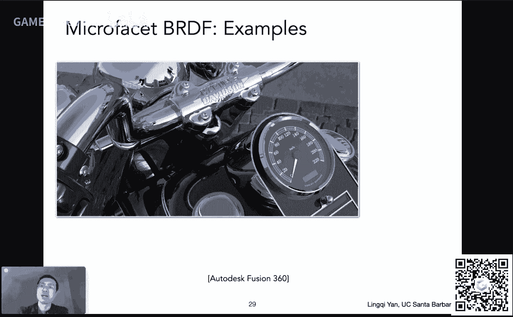

然后就是说非常厉害，但他还可以不止表示说这些金属这些东西，就是说微表面模型可以描述的东西特别特别的多，大家看到这个皮的这个这个上面这个表示这也非常非常的好，但是它应用一些凹凸贴图什么的对吧。

大家可以看得清楚对吧，然后就是说这这块关于这个皮子上面这些表现，他表示也非常好，然后因为什么呢，因为这个微表面模型它就是基于物理的，对不对，那这个做的真的是，非常好，那当然它还可以做什么呢。

它甚至还可以表示这个不是皮子这些东西啊，像这些这个木头，它也同样可以表示对吧，像这些这个微表面模型，它本身可以描述的东西实在是太多，当然这里跟大家多说一句啊，描述这个木头需要更复杂一点的。

基于这个呃微表面模型之上，还要再研究出来一些新的东西，才能描述这个木头的这个这个呃这个感觉哈，就是它如何和光线进行作用，但是不管怎么样，这是微表面模型，它的一个这个非常非常厉害的地方，好吧。

那为什么要提，这就是所谓state，of the art，这就是大家现在在用的这个这个模型，然后这个模型基本上来说现在是只具有统治力的吧，这么说就在各种各样的电影里面啊，如果大家提到所谓pb 2。

也就是physically based rendering，呃，或者是shading，他们大家就一定会使用这个微表面模型，当然微表面模型有自己的问题，比如说他的diffuse，像这个这个很少。

就是有时候这个呃人们需要在上面额外的加入一些这个呃，漫反射的东西，然后当然这样就不是基于物理了对吧，然后就是有很多各种各样的这个这个呃做法，那么这里，呢再给大家多说一句，就是所谓这个微表面模型呢。

这是一个统称啊，统称有很多不同的微表面模型，比如说cook torrence模型，比如说word模型，就有很多各种各样不同的模型，但都遵守这个呃微表面这一套好吧。

然后这个呢咱们下节课也会稍微给大家再多说一些，这个这些各种各样不同的这个微表面模型好，那么呃当然这非常厉害，那咱们下一个话题给大家多说一点，就是这个嗯什么呢，另外一种区分材质的方式。

我们刚才其实已经在用这个概念了啊。

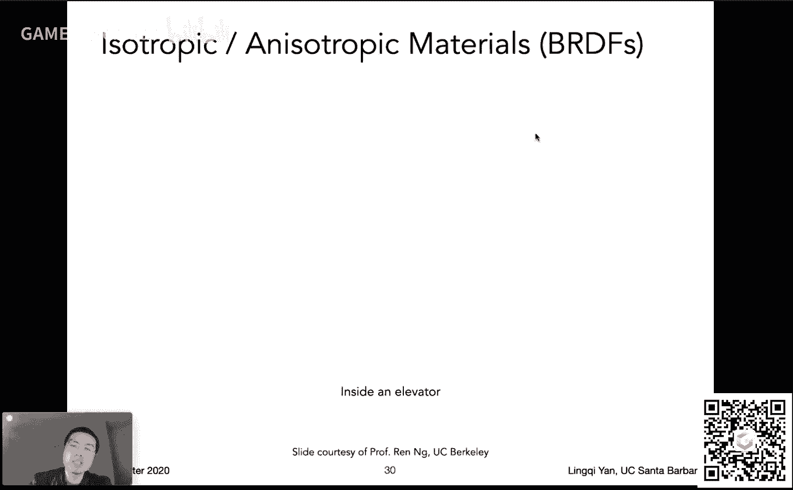

咱们看这幅图，这个图是在干什么呢，这个，图是一个电梯间的内部啊，咱们把这个事说清楚，电梯间的内部，那么电梯间正常大家都知道是四面，几乎全是金属对吧，那金属的话是平面对吧，然后呢这样的话。

如果说我有这个头顶上有一些小灯，而电梯间就是这样的对吧，一些小灯它会打到这个金属的表面上去，它会形成高光，那是肯定的对吧，那新生高光大家说这个我们学过高光呢，这高光可不是出来应该是一个圆或者一个椭圆嘛。

那怎么会得出来会是这么一些这个这个神奇的这些，直接一条一条的这种现，象咱们先不考虑多次这个反射，就考虑一次，就考虑直接光照，这种情况下，这个为什么会看到这种现象呢，那如果有同学仔细看这个这个材质的话。

大家会会看出来一些问题对吧，那首先肯定是因为材质，因为因为说这里面就是看到不同的外观，就是因为不同材质嘛，咱们从一开始就在说，那么这个材质到底发生了什么，难道它不是金属吗，它是的。

但是它有一个什么问题呢，它是一个被磨过的金属，大家如果仔细看，从这个图上都可以看得出来，它是沿着这个向下方向上下方向啊，它是这，个这个这个这个往往一个方向磨过的金属，所以如果从微型微表面的结构上来看。

你会看到说哦它基本上来说从上到下它是一条沟，一条沟一条沟，这样这样形成的一个金属表面，它不是一个平滑的哎，这种情况它就会造成这个非常非常奇怪的，这个或者说看起来很很不错的这个这个嗯叫什么呢。

就是奇形怪状的高光啊，这个这个非常有意思，那这个怎么怎么回事啊，这就是我们要给大家说的呃，区分材质的这个一类的方法，什么呢，就是我们把材质分成两类，一类叫做各向同性材质，一类叫做各项异性材质。

就所谓iso tropic是各项同性，an isotropic是各项异性，那么从这个意义上来说，大家第二次接触这个概念了对吧，咱们一开始在说这个各项异性过滤对吧，我们提过这个事情对吧。

这个各项异性过滤是什么意思来着，我们不是说这个它可以支持这个这个长方形的查询对吧，然后就是说不一定要求正方形，那么同样道理啊，这个各项同性各项异性其实这个在图形学里面，这个基本体会的意思是一样的。

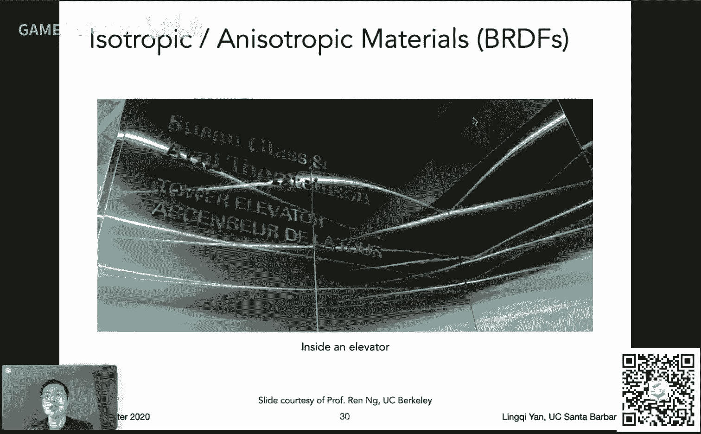

所谓各项同性就是我们认为它的微表面并不存在一定的方向性或者方，向性很弱这个意思啊，然后比如说啊咱们看这个这个物体的表面，然后但是呢如果我们显示它的这个法线的分布，我们会发现哦，就是说它没有一定的方向性。

那么对于刚才电梯间，很明显水平和竖直方向完全不一样，对不对，那如果说找一个这个这个物体的面的法线，然后这个呃不是找一个，就是把这个整成一个面，它的法线分布画出来，你会发现法线分布也是具有明确的方向。

性对吧，这就说明从微表面的方向性，我们就可以看出这个材质它是属于各项同性还是各项异性，而且各项异性呢它会有各种各样不同的神奇的性质。

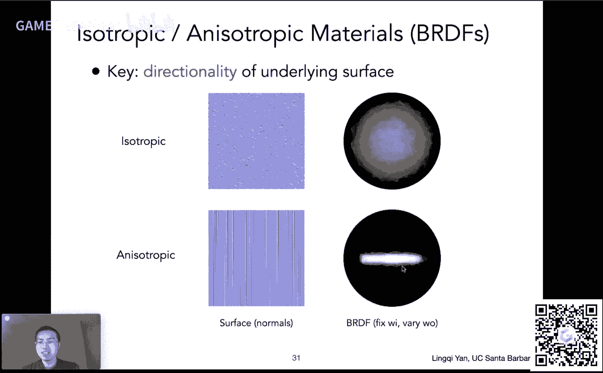

好吧，那就是这个意思，那各项异性呢，我们这个呃这个具体上来说反映在b2 df上是怎么回事，那也就是说b2 df原本是两个方向的函数对吧，c大对吧，c大呃不set down fc到c的fi这个输入方向。

c大r fr是输出方向，哎，这是整个的b2 df，如果这个b2 df它不满足说在方位角上旋转，然后得到的还是相同的b2 df，我们就管它叫做这，个各项异性的材质，什么叫在方位角上旋转，很简单啊。

大家假设说是这样哈，就是说我我现在这个有个平面，然后我的入射角和方跟出射角是这样的啊，这这样一个这个这个这配置啊，现在就假设是这样，然后呢如果我是这么旋转，你会发现啊，这个入射角和出射角的这个方向啊。

它们的相对的方向几乎没有变化对吧，只是说他们的方位角都在都在进行着旋转，也就是说如果我认为我这么旋转这两个这个弱热点方呃，和入射的这个方向和出射方向的话，如果我旋转之后，我看到的是相，同的b2 df。

那它就是iso topic，就是各项同性，如果说他们不止和相对的方位角有关，还跟绝对的方位角有关，那也就是说这个b2 df就是各项异性的，那这是从b2 df的角度上来考虑，这个从微表面也可以考虑。

从b r d f也可以考虑，没问题，那这样的话咱们看两个例子啊，这个球很显然左边这个球大家看到这个高光很熟悉各项同性，然后这个高光形成了一个圈，看看非常神奇对吧，然后这个这块儿就是各项异性。

那么对于这个门把手来说，大家可以发现啊，他异性的地方还不一样，它是，一溜一溜的拥有各自不同的各项异性属性对吧，可以看到这么一个性质，然后这个cd上也可以这么理解吧。

但是正常情况cd我们会认为它是另外的一些性质来解释啊，咱们这个不多说啊，各项异性从b2 df角的角度解释。

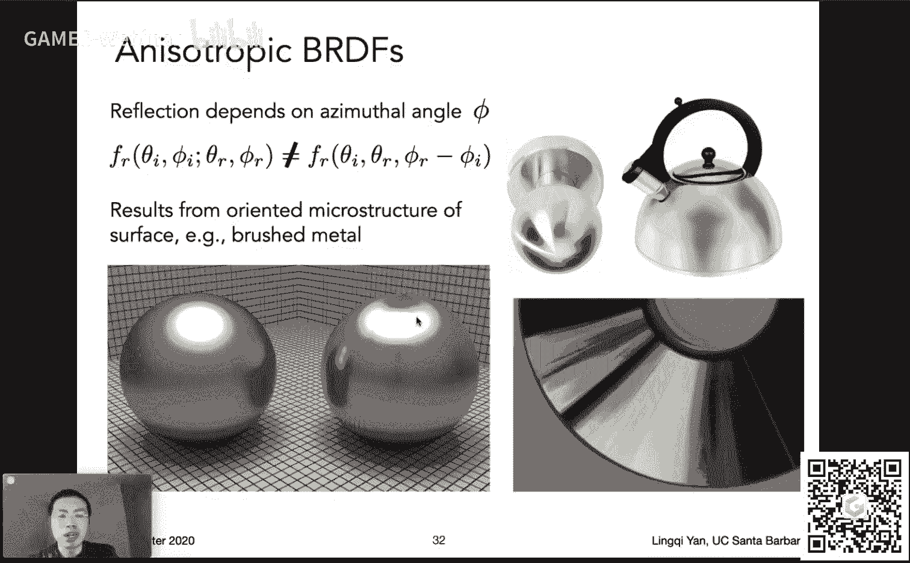

就是这个意思和方位角，绝对方位角有关好，那么大家可以看到在生活中啊，有很多各项异性的材质几乎是人造的哈，就是说这个大家可以看到这个锅的底对吧，这个锅的底大家很明显，这个这个自己应该都观察过。

很明显大家知道他是怎么被刷的对吧，肯定是绕着，这个连心这一圈一圈一圈这样被刷的诶，正是因为他这么一刷，使得它任何一个地方有这个呃这个这个所谓的各项异性，你就会看出这种辐射状的高光对吧，这就非常有意思。

那左边这里呢大家看到这个这个这块形成了一个竖条的这个高光，那这个跟这块就不一样对吧，那所以说就是说我们通过它这个这个长成什么样子，我们其实还可以推断说他的这个嗯，嗯实际的这个微表面的分布是什么样的对吧。

知道他们怎么被刷的，那总之呢就是这么个意思，当然这里仍然是一个渲染的，图啊这个vr简单给大家多说一句，商用渲染器啊，在这个和各种各样的这些建模软件，像什么3d s max呀，玛雅都有一些联系。

然后就是说得到广泛的应用还是不错的哈，然后虽然有人比他好，ok那么这个嗯各向异性的材质啊，那咱们还可以再看一个这个例子哈，就是说各项异性材质，我们这里提一个这个尼龙，这个尼龙怎么回事呢，大家可以看到啊。

就是说对于不同的这个布料来说啊，布料基本来说都是织在一块儿的哈，那这个大家看到正常的尼龙的织法很简单，一根压一根，水平竖直，啊各各有呃一根，然后这么无限延伸下去，那这个看起来已经没什么太多方向性了。

所以说它基本上来说我们说它是这个呃各项异性，其实完全是说他的这个水平和数值是一样的，但是它的对角线上是不太一样的，比如说往这个方向对吧，斜着的这不一样，这块不一样。

也就是反映出来之后分布它更像一个正方形，而不像是一个圆形啊，刚才大家看到这个例子，但它已经很接近这个各项同性了啊，这么个意思好，那么我们再看这个例子，这个是什么呢，这个叫velvet，所谓天鹅绒。

天鹅绒呢它有，一个这个这个很神奇的现象啊，天鹅绒他这个它其实咱们根本不应该把它当成是表面，为什么呢，因为它的这个底下织物，它那底底层哈，在底层上面它会有各种各样的这个一一条一条这个伸出去的。

这个这个呃fiber哈，就是这个意思，就一根一根的这些植物，它会伸出去，所以它其实形成了一个这个体积，它并不是说定义在一个表面上，但如果我们认为是在这个表面上。

那么我们就考虑他这个不同的这些一根一根的这个这个纤维啊，它往各个不同的方向上去，我认为可以认为是这个各项同性，但是呢我们认为它是各项异性，是为什么呢，是因为诶大家应该都玩过这个对吧，这个我非常喜欢呃。

什么呢，就是说你可以把这些天鹅绒啊，它的这个表面，把这些这种这些纤维啊给拨到一边去，那拨到一边去，你可能就是人为的造出了一些这个各项异性的效果嘛，对不对，也就是说啊你其实可以通过自己来设计微表面。

然后来改变这个他们的各项同性或者各项异性，从而改变他们的材质，从而改变他他们最后的外观，对不对，那所以说啊这个所有事情都可以这么解释的对吧，那非常好，那么嗯到这里呢，咱们差不多已经把这个材质这部分呃。

算是就基本材质啊，算说差不多了，那咱们现在回头把这个b2 df的一些性质总结起来，刚才咱们说了这么些对吧，然后嗯今天我们就把这个性质说完吧，然后后面涉及到这个b r d f的哦，哎这样这样再再再再看吧。

再看吧啊我先这个我先想办法把这个说完好吧，那么b2 df的属性我们回头来总结它，是因为我们现在已经见过了各种各样不同材质，然后现在差不多，也对b2 df的理解算是更深刻。

首先呢最简单的材质b2 df的值永远是非负的，它表示了一个这个能量的分布，对不对，那不可能说出现了什么负能量什么，当然我希望这样真出现了，这样只是巨大的研究机会了。

然后这是一个另外一个bdf的所谓线性性质，就是linuity，这太好理解了，这个线性性质是什么呢，咱们之前老早就在用，就是我们说布林防模型的时候，我们是不是分成三块。

分成diffuse和这个spllar和什么这个ambient，我们分别把它算出来了之后，也就是说这个bdf，本身我可以拆成很多块，把这很多块呢分别拿去做这个光线传播，然后我再把各个块加起来。

得到的结果跟我用整个b2 df做光线传播一模一样，没问题啊，就是说它的线性性质好，那这都好理解，那后面稍微麻烦一点呢，是这个b r d f的这个可逆性啊，我们之前说光路的可逆性对吧。

说这个我们把这个一一条光路，它的这个所有的这个方向都给反过来，仍然是一条这个嗯合理的光路，没有问题，就是光线还是会这么传播，然后呢b r d f的这个嗯所谓这个可逆性啊，更更好理解，很简。

单就是你交换这个入射方向和出射方向的角色，你得到的这个b r d f的值一定是一样的，那也就是说你的b r d f你给它一个入射方向，一个出射方向，现在你把入射方向出射方向调换，调换之后。

你会得到我严格意义上数字也完全一样的b2 df的值，这是它的这个基于物理的定义的一个好事情啊，就是说这个中间不会涉及到任何的转换，这两个是一模一样的，就是嗯b r d f啊，这个意思，那么另外一个性质。

其实咱们刚才已经在用了哈，就是我们刚才说这个在算这个入射光和，出射光算那个defuse对吧，是是应该是多少，我们考虑能量守恒，所谓能量守恒，就是说b r d f的存在，绝对不可能让能量更能量变多。

就是这个意思对吧，当然会有吸收，那么就是说如果是完全反射它的能量，也也就是原来的所有的入射的能量，然后如果说他是这个呃，就是说有部分被吸收，那它的能量就会比原来的小。

那这里呢就是简单的把这个入射的这个能量li换成了一啊，那这个积起来小于等于一，没有问题好，那这个我嗯能，量守恒这个挺重要的，因为如果不满足这个能量守恒呢，呃会出现一个问题。

就是你在做pass string的时候，咱们之前问过这个问题对吧，说这个经过了无限次的光线弹射之后，最后能量会收敛还是会爆炸，大家都会说收敛收敛是因为什么，收敛就是因为b2 df的能量嗯。

这个energy conservation静止啊，如果说不满足这个性质的话，你要稍微多一点，最后社会爆炸好吧，这是这个b rdf的性质，然后呢我们刚才提到了b r d f有两种各项同性，各项异性。

那么刚才说各项同性的话，就意味着指这个b2 df的值啊，只和这个呃相对的方位角有关，也就是跟这两个方位角的差值在二减fi有关，唉这样一来的话，它有什么好处呢，我可以写成这个形式对吧，写成这个形式。

大家立刻就会发现原本四维的b2 df对吧，和f各两个嘛，四维的b2 df如果是各项同性材质，其实它就是三维的诶，这样的话整个维度就降低了一个，这是非常好的。

然后呢更好的事情是所有的b2 d f不管它是各项同性，各项异性，它总归得有这个性质吧，得有这个嗯叫什么来着，就是就是呃可逆性吧对吧，那可逆性就意味着说如，果我交换他这个到i跟呃，不不不。

这个这个入射光和出热光的这个角色对吧，他们两个得到的结果应该是一样的，那也就是说它们的相对的这个方位角其实还不用考虑正负，就是这个意思，他们的方位角就是谁比谁大多少，这个是没有关系的对吧。

这个是从对称性上推出来的，这样的话我们就可以把它写成这个后面的这个方位角之差，再加个绝对值，我们不用考虑谁大谁小对吧，这挺好的，那这个性质好在哪儿，好在说我们后面要这个嗯给大家讲这个下一个话题的时候。

会需要呃，就，是关于b2 df测量与储存，那这样吧，嗯是这样，我现在想法是下节课的内容啊相对较多，然后这节课如果我花再花三五分钟把这个什么，把这个b2 df的测量讲完，这节课就不用再多说了。

这样下节课我们就有机会给大家多说，那个就是关于这个局部的坐标系tb n这块怎么算这块事情，因为我原本想安排的这节课，然后这个又有点多哈，这个行吧，那我就干脆把这个测量b2 df讲完啊，非常快啊。

这个就是b r d f呢，我们可以用各种各样不同的模型去描述对吧，但各种各样的模型才，仅仅是说我基于物理的一种描述或者近似，那什么才是真正的b2 df，只有说测出的b2 df才是对的，b2 df。

那走吧，那这样想，那么我们为什么要测比二df呢，那如果说我之前的模型足够准，是不是就可以了呢，那显然是以前的模型并不足够准，大家可以看到啊，这个就是对于菲涅尔项目来说。

然后如果说我们真的通过某些物理方法，我们可以测出一些非内尔向，我们会发现诶，这个绿线和这条红线好像和我的这个这个是ek proximation，或者说我们之前那些理论上的那些曲线，看起来好像完全。

不一样对吧，也就是说实际上来说这个菲尼尔像非常复杂，好像这个不是我们用那种简单公式可以描述的，那这样一来的话，这个是不是就是说我之前那个模型是不是就不太准对吧，但是确实是这么回事。

也就是物理上有很多得出来的结论啊，这些都是这个有很多简化的和实际的这个嗯这个结论还是不太一样，所以说有很多情况下需要去做测量，这一第二呢如果我可以测量，我是不是就可以不推一些模型了。

我直接用我测的数据对吧，这是非常好的，那所以说这是很有道理的，那么，我们需要去做b2 df的测量，那b2 df测量怎么算对吧，咱们想一想这个b r d f是什么，它不就是两个方向的一个函数吗。

一个入射方向，一个出射方向对吧，那如果我盯着一个着色点看啊，就比如说我现在给你一个样本，我就盯着他某个点看，那我改变它的这个入射方向，就是我我找一个灯往从四面八方来照它。

然后呢我再拿一个这个这个这个相机，我从四面八方去拍它，那这样的话是不是我就可以覆盖这个整个b2 df，它的所有可能的输入方向，可能的输出方向，对没错吧，这样一，来我们就可以做这个测量呃。

这个当然理论一些，但事实上来说它就是这么做的，大家可以看到这是一个仪器啊，这个仪器有名字叫gameal reflect tometer，名字超级长啊，然后对于这个这个特定的这个仪器呢。

它在一个球面上旋转，马上给大家解释，它又叫做spherical gantry，然后这是一个真实存在的机器，我用这个机器做过的论文啊，然后这个是在这个我的老板的这个学校ucsd啊，然后嗯现在仍然还在。

然后这是一个巨大的机器啊，这个不是照片上显示这么小，它直径得有个2米3米那样，然后就是说他能干什么，它是一个这个机械，它有两个爪子，一个爪子呢可以抓一个相机，另外一个爪子可以抓一个光源。

然后呢他把这个样本放在这个正中间，就放在他的所谓球星上，这两个爪子呢可以让这个相机和这个这个这个光源啊，而且呢它这个非常大，而且又非常精确，它可以精确到0。1度这种这种级别啊。

然后他就是和我们刚才说的这个这个测量方法完全一样，给定入射出射对吧好，那没问题好啊，ok这样的话呢呃我们就可以直接得到一个非常简单的算法，我们去枚举所有的出射方向，然后把这个光源放上去。

我们去枚举所有的这个这个出射方向，我们把这个相机放上去，没关系，然后我们测一下它的这个得出来的结果的radiance是多少，这不就是b r d f吗，不就是四维的吗。

但是大家想象一下四维这个操作可非常这个费事啊，比如说刚才那个机器，你固定了你的这个摄像机之后，你的整个的这个叫什么呃，唉这个这个这个这个光源哈，你不走一遍这个这个球面才能覆盖所有光源的方向。

那你下回换一下，你的这个相机的方向，你就得把这个光源在整个球面上再走一遍，下面再换一个相机方向，这还得了，这是四四维，对不对，二维成二维这个东西我们之前说过。

这叫curse of dimensionality，诶坏了，我们说过没，但没关系啊，反正就是说维度往上一涨，数据量立刻就上去，就是这个意思，那么怎么才能这个解决这个问题呢，之前我们提到一个这个事情。

如果我们认为我们测的b2 df是各项同性的，那么它其实是只有三维的对吧，我们就可以把这个四维降到三维哎，然后呢如果我们就用这个这个b r d f的这，个肯定性，我们只考虑相对方位角的话。

又可以砍掉一半的测量对吧，然后就是这么回事，然后我们可以设计更好的一些思路，我比如说我不用这么把这个呃球面上所有这些点，对这些这些方向对我都可采样的，我只用采样若干不同方向，我剩下的东西我可以猜出来诶。

这个是可以的，现在也是时下的热门啊，就是说关于b2 df的一系列的更聪明的测量，然后就是说呃这是这是一个方向，然后呢当然有各种各样不同的这些，类型在这里时间所限啊，这可是不给大家多说了啊。

然后嗯就是说我们测量出b2 df之后啊，肯定是要把它给这个嗯怎么说呢，肯定要把这个b2 df给存起来，表示起来对吧，我之后还要用对吧，那我要把它给表示出来，或者说存下来，那肯定涉及到大量的存储，对不对。

那这个怎么办，对不对，然后这就是就是各种各样不同的这个呃，测量b2 df之后的存储要求对吧，然后这个呃也一样，同样不给大家多说了啊，关于这块这个存储的事情，也有大量的这种这种压缩呀。

然后这种这种方面的研，究也有说用什么神经网络来做压缩，然后也是算是一个比较热门的话题，对于b2 df来说好吧，那么这里呢给大家介绍一个很有名的bdf的库，这个库是什么呢。

就是叫做moral database啊，这个m e r l叫三菱电子实验室啊，这是当时和mit在一块这个合作的项目，然后这个非常非常有名，然后这个项目呢就是说他做了一个什么事情。

他是测量了这个很多不同的这些材质，而这些材质它们假设都是这个各项同性的，当然后来他们又改进加了一些各项异性啊，咱们就先从这一点版本说，就是说他，们这个各项同性的材质。

我们知道各项同性材质b2 df 3维我只能测这个呃，两个c带和方位角的这个绝对值，方位角相对方位角的绝对值就好了对吧，那这样一来呢，他就取了90x90x180这么多次。

这个测量就每一个材质做那么多次测量，你算一算，这是超大的数啊，然后就是说这样一来，然后他就可以把这些材质都给表示出来，并且把最后的结果存到一个三维的数组里面去，好没问题，那是当然了。

大家可以看到它如果不做压缩的话，那是一个多么大的这个这个存储对，吧然后这个没问题啊，然后这个就是今天的这个所有话题了，差不多到此为止，咱们今天这个任务完成，下节课呢给大家讲这个更复杂的嗯，这个嗯材质啊。

光线传播方法就是最新的一些内容吧，然后大家这个下节课就是当这个对这个听一听，然后这个看看大家现在都是在做什么就好了好吧，然后那现在是这样，如果说呃有同学有问题，那我现在可以这个这个回答一下。

那要是嗯没有的话，咱们现在就可以当这个下课了好吧，没问题嗯，我看一下哈，有有同学说这个哦这块物理模拟哦，我，明白了是这样哈，就是说我们讲完了材质这一块之后，这节课和下节课讲完了之后。

我们就开始来讲这个呃动画这一块的内容，哦，哦不对，中间还有一个这个涉及到这个广场啊，以及颜色这一块的知识，然后这块也是图形学里面得有的东西，然后我们还有最后两节课来说这个呃这个呃物理模拟这块。

然后物理模拟呢这边算是开个头，也就是这个呃嗯怎么说呢，就是就是就是嗯完全的入门的内容吧，几乎说一说这是什么欧拉视角，拉拉格朗日视角之类的东西，然后呃时下的m p m，然后。

之后呢就会紧接着接到下一门课啊，我之前说过，有位大神要给大家讲这个物理仿真，然后以及怎么样在他的渲染器上来来做这个这个这个物理仿真啊，之后就算是接上了啊，大概是这么个安排法嗯，ok那其他呢我想一想哈。

嗯多讲一讲学术界最新的东西，我尽量哈就是新的东西说起来会更难一些，但是至少rendering这块讲到这里差不多算是入门的这个东西，下节课吧，下节课可能会多多讲一些这些，好吧啊，漫反射的。

以radiance为什么不用距离平方反比，不可能啊，肯定是要用的这块，这个不知道，什么情况好吧，然后有同学问积分为什么是一好吧，这些讲起来就稍微麻烦一点啊，这个嗯这样吧，这之后大家还是还是那样吧。

还是发到这个这个呃呃bbs里面，然后我看看助教同学们能不能这个给大家回答一下，这个ok好，那那咱们今天就到这吧好吧。

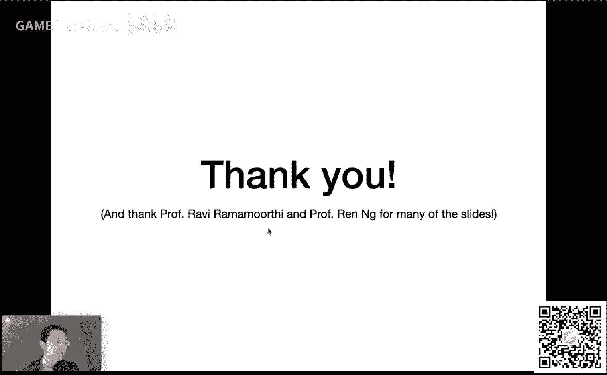

这个感谢大家啊，那咱们把时间在嗯交还给技术秘书同学嗯。

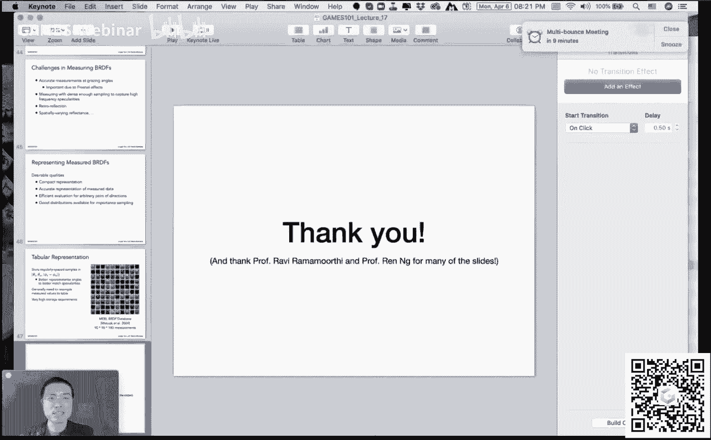

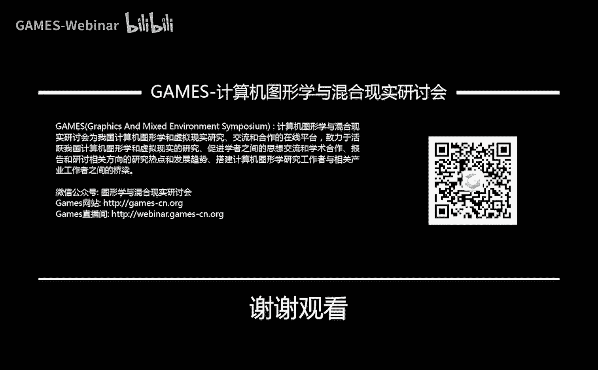