# GAMES101-现代计算机图形学入门-闫令琪 - P18：Lecture 18 Advanced Topics in Rendering - GAMES-Webinar - BV1X7411F744

亲爱的各位同学们，大家好，欢迎来到咱们这个这个现代计算机图形学入门的第18节课啊，很快就要结束了啊，然后这个剩下来几节课呢就是相对轻松愉快啊。

特别这节课这节课讲的东西虽然是所谓advanced topics对吧，然后这个对对这个其实挺容易，因为我们只会说一些大概的内容哈，那咱们就从呃这个呃老安排开始，我们先说一说这有几个事儿啊，简单提一下。

一个是作业期啊，作业期现在我们的助教同学正在这个辛苦的这个工作中，因为作业期以前不存在嘛，然后我们家的一个作业期用来做呃路径追踪的，然后路径追踪这一块呢嗯嗯涉及到这个实现起来，这个要实现整个框架。

然后要把这个呃让大家写的代码，然后去掉，然后这个在调试弄好事情挺多的，以及涉及到文档注释对吧，然后大家理解一下，现在稍微晚了一点，然后我们尽量今天能够发布，不行的话，咱们稍微晚一点好吧，呃那做演戏呃。

然后呢这个呃我们说一说大作业对吧，大作业呢我们现在安排了一个时间，什么时间呢，嗯也就是说下周二也是14号，14号会给大家放出这个大作业的一些参考的想法，就是大家不知道做什么就可以从里面参考。

没有问题好吧，嗯然后这个是这么安排的，然后大家之后会有几天时间去思考啊，我到底要做什么，确定下来有那么几天好吧，然后这这几天时间呢大家思考一下，就是说呃呃欢迎大家联系我或者是助教问一问。

比如说我有个其他什么想法，我觉得挺好的，然后能不能作为大作业呃，这个这个欢迎咨询啊，没问题，到19号咱们把事情定下来，然后大家提交一份这个呃所谓proposal啊，其实就是告诉助教们，你准备做什么。

大概是这个意思，然后到了5月5号，大家发现中间时间挺长的，然后得有两周半的时间，然后呃大家可以开始做这个作业，然后做完了之后到那个时候来提交好吧，然后这么个安排法啊，然后呢有一点注意事项啊。

就是说嗯首先如果大家要选题的话，如果从我们给定的这个这个呃一些想法中间选没问题，那如果大家要自己提，一定记得哈，他得是一个图形学的这个题目，它不能是这个比如说这个人机交互的，或者是这个呃呃这什么啊。

这计算机视觉的哈，这就不算是咱们的这个图形学的范畴了啊，然后啊大作业呢以个人为单位自己完成啊，我们不组队，然后这是因为这个现在组队也不方便，就大家自己来做好吧，呃ok大概就是个这么个安排法。

咱们的大作业啊之后可能会调整啊，但是基本就是这些啊，好然后呢咱们今天会讲些什么呢，今天会讲这个高级的光线传播和材质，其实说高级啊不一定多么高级，它不一定比这个所谓什么pass string啊要难。

只是说呢这块我们在这个呃基础图形学入门里面呢，咱们就不再多说这些这些话题，大家是有办法自己来掌握这些的好吧，所以我们管它叫做提高啊，其实并不是说他们有多难，另外一点呢嗯挺多。

然后呢我会这个就以最最主要的思想来说，把这个思想大概大概思路说清楚就差不多了，然后不会提到各种各样的技术细节，所以这次基本上不涉及到什么数学啊，什么东西的啊，然后很简单嗯，大家就听一听。

这节课就当10万个为什么啊，就是这个意思好啊，当然了，欢迎大家踊跃提问哈，我就在说的过程中应该会非常快，然后今天然后如果大家提问中间我要想办法停下来回头看啊，咱们这节课就这么安排。

那么咱们就先从高级的光线传播开始来说，那么高级光线传播，我们这次主要说什么呢，首先我们说一下这个这种无偏的光线传播方法，至于什么是有偏，什么是无偏，咱们待会儿再说啊，无偏的里面的代表这个双向路径追踪。

以及这个metropolis光线传播好吧，然后呃涉及到有片的方法，我们会提到光子映射ptmap啊，然后和呃呃所谓v cm这个vertex connection merging。

这个结合方法结合了光子映射和和双向路径追踪，我们简单提一下，然后我们会提一个这个另外的方法，这个方法叫实时辐射度算法，其实相当于是把这个呃把这个呃间接光可表示成很多很小的光源啊，反正再说。

那么我们以这个呃框架来进行，那咱们先说一个最重要的事情在这儿已经出现了对吧，什么是有偏的ambiased，呃，不不不，什么是无偏的ambiased，以及有偏的biased，这个是什么意思呢。

这就涉及到了我们做这个光线追踪，很多方法不管用什么都是在用这个蒙特卡罗的这个估计，蒙特卡罗的估计呢它是有嗯这个性质的，就是说啊蒙特卡罗的估计方法有一些我们管它叫无偏的，什么叫无偏的呢。

就是说我们的蒙特卡罗的这个呃估计出来的那个那个结果，如果永远他的期望永远都是对的，就不管你用多少个这个样本，他的期望永远都是我们要的那个真实值，那我们就管这个方法叫做无偏的，那那这个是怎么理解呢。

就是说我之前想啊路径追踪，大家还记得吧，比如说路径追踪，咱们之前提出蒙特卡罗方法怎么去解一个这个积分对吧，我解个积分，我可以用不同的数字，这个不同数量的这个样本，但我不管用多少个数量的样本。

他们的期望最后得出来对吧，得出来的这个估计值，它的期望永远都是这个真实的，这个我们叫做定积分的值对吧，这样想就是说我们会得到一个这个无偏的估计，嗯，那么相应的什么是有偏的，所有其他情况就都是有偏的了。

就是说啊我的这个如果我的估计出来的值，它的这个期望，他的期望和我最后要的值它不一样，这种就叫有偏的，然后这个先先跟大家说一说，待会儿大家就会看到它的一个应用啊，然后在有片的这一个系列里面呢。

嗯还有一个特殊情况，什么特殊情况呢，就是说啊虽然来说呃我这个取多少个样本嗯，这个他最后得到的结果都是有偏的，但是呢在一个极限的定义下，就如果我用的样本足够多，多到这个无穷多，而这种情况下。

我得到的这个期望值会收到正确值，如果是这种情况，那当然还是有偏的对吧，但是我们对于这种情况，我们管它叫这个一致的，就是consistent，是这么一个情况，所以这里呢先说几个概念，这里大家肯定不明白啊。

没有关系，但是马上这个咱们去找一个例子看就知道了好吧，那也就是说我们返回头来说这个事情是为了说什么呢，说我们对一个这个比如一个积分的近似啊，它有可能是这个有偏的，有可能是无偏的啊，就是这么个意思。

然后反映在我们的渲染里面到底是怎么回事对吧，我们回头回头会看这一眼，然后我们说到光子映射的时候提这个事情好，那咱们从第一个这个方法来看啊，嗯这个呃双向路径追踪啊，那咱们说这个双向路径追踪是什么意思。

那这个顾名思义对吧，从字面上来看，那我们之前说路径追踪是从哪儿打的这个路径啊，从哪开始的路径啊，还记得吧，咱们利用这个光路可逆性，我们是从这个相机开始了呃，路径追踪产生一条这个路径，最后连接相机和光源。

对不对，然后呃这是我们之前产生的一条路径，诶，现在来说就是说嗯对于双向路径追踪来说，就把这个概念给拓展一下，怎么拓展呢，它会生成两个不同的所谓半路径或者子路径啊，然后这个怎么说呢，就是说大家看这幅图。

从光源呢我打出一些所谓light sub pass，就是就是这个从光源出发的这个半路径，然后呢我从这个呃这个摄像机出发，我可以生成另外一系列的半路径，然后这个双向路径追踪做一个什么事情呢。

把这个这个半路径的端点给连起来啊，这个就形成了一条整个路径了，没问题吧，这个思想是非常简单的，对不对，但是实现起来是非常非常困难的，不过呢这个双向路径追踪啊，它在有些条件下效果非常好。

比如说大家看这两个对比哈，左边呢是用的路径追踪，右边用的是双向的路径直走，大家就会发现，而右边双向路径追踪和这个左边的单向的路径追踪，都用这个每个像素32个样本。

但是我会发现哦这个双向路径追踪效果这么好，然后这个单向路径追踪效果这么差，为什么呢，这是因为啊我们这个光线追踪呃这一块儿，如果我想找到一条这个带有大量能量的这个这个路径哈，这个对于这个场景来说不太容易。

为什么，如果我们做这个呃，做一点点分析，我就知道大家看啊，这个场景有一个很明显的和这个其他场景能够区分开的一个性质哈，就是它有一个光源，光源往哪打，就往上面这一个角落打。

那么整个一个场景其实都是被间接光所照亮的，没错吧，就是光源啊，从这出发打到这个天花板，然后弹到哪儿，再谈到大家眼睛里，对不对，这样想哎，也就是说对于这种情况，如果我们做路径追踪的话，咱们从摄像机出版诶。

摄像机，然后打到什么地方呢，比如打到这个地方，打到这个地方，我们知道这里是一个这个漫反射的表面对吧，那所以说这下一次弹射它有可能被弹到哪儿去呢，谈到这儿去，谈到这儿去呢，他就接收不到这么强的光。

那只有说在这一点的时候，他谈到了这里这一个小的区域，它才会形成一个这个一个找到一个pass，这条pass带的能量会比较多，就是这种情况就是很多情况下。

因为你的这个这个pass tracing里面的第一个bce是def，导致你不好控制它能够达到之后之后能量集中的区域去，然后就会出现这个问题，那也就是说当光线传播在这个光源这半边，这个比较容易算的时候。

那这个b d p t就是双向路径追踪，就效果会很好对吧，像这种情况，那如果双向，那我从光源出发，我先打一个这个嗯，第一条光线对吧，那他肯定都会集中在这，然后我这边呢如果我在用这个呃。

这个从相机触发再打出来一堆光线，再把它们光线的端点连起来诶那我就会发现基本找到的都是很合理的，这些路径对吧，那也就是说这种情况下很适合bdp t，咱们把这个呃它适合的情况说明白就好了好吧。

然后呢b d p d大家千万不要小看，实现它的难度非常不容易啊，然后就是说这个想做对挺难的，然后如果如果你能把这个做对，基本上来说自己开发渲染器应该是没有任何问题啊，就是这个意思。

然后嗯b d p t呢另外一点是它相对来说比较慢啊，虽然来说大家看到这个都是32个这个样本，每个像素32个样本啊，但是这两个月的运行速度肯定是不一样的，就是b d p t肯定运行的要稍微慢一些。

而且甚至其实会慢很多，这是他的问题，好吧，咱们把这个好处坏处咱们都说清楚，ok啊b d p t说完了，咱们再说另外一个无偏的估计叫做这个metropolis，光线传播，我见过一个很扯的翻译哈。

大家把这个这个有人把这个metropolis直接这个字面意思翻译成大都市，然后把它管它叫大都市光影传播啊，和这个毫无关系，还是按人名命名的哈，这个metropolis like transport啊。

这个意思好，那么chocolate他的思想是什么呢，他的思想是这个用用一个这个统计学上一个采样的工具，就是这种工具能够帮你采样啊，然后这个工具名字叫什么，叫马尔可夫链，马尔可夫链mark chain啊。

然后这个马尔可夫链其实说白了非常简单的，它的这个意思啊，就相当于我当前有一个样本对吧，马尔可夫链可以告诉我哦，我根据当前这个样本，我可以生成一个跟他靠近的下一个样本啊，就这个意思，那咱们想象一下。

这种蒙特卡罗就不一样了，还记得之前积分吗，在a和b之间对吧，一均等概率选一个，那么我每次选的我跟上一个选的毫无关系，对不对，这里呢这个马尔可夫链的方法就是说我当前有一个样本。

然后我在它周围我可以生成一个新样本，然后我在这个这个去估计，用这些样本来估计我的这个函数的值，它有一个什么好处，这个我说明白就是说啊那他可以做到就给定足够的时间。

这个马尔可夫链蒙特卡罗方法可以生成一一系列，以任意的函数为这个形状的呃，这个这个样本呃，这样说不对哈，以任意的函数的形状为pdf生成的样本，那咱们之前说过说我这个呃蒙特卡罗方法诶。

我可以用任意的pdf来采样一个函数，但是我们并没有说用什么样的形状，用什么样的pdf采用了一个函数是最合适的，那我现在可以告诉大家，当你采样的pdf和这个和这个你要采样的这个函数和和和。

和你要积分的那个函数，就是fx和px他俩形状一致的时候，这时候是这个呃所谓得到的variance是最小的，那么这个马尔可夫链的办法能够让你任何的你未知的函数啊。

你都可以通过这个马尔可夫链的方法生成一系列的这些样本，使得这些样本的分布它就是和这个和这个这个被积函数它的形状一致，诶，这就非常好了对吧，那不管怎么样，这是统计学上的一个概念，咱们先跳出来啊。

就是说这个metropolis的光线传播方法用的是这个知识，那咱们想啊，既然是有一个样本，它可以变出更多的样本来，那反映在咱们的这个这个这个呃采样，或者说我们产生路径这么一个事情上。

那就是说啊在这个一个给你已经有一个路径的情况下，你可以产生它周围更多的跟它相似的路径，也就是说它是一个局部的方法，给你任何一条路径，它可以生成和这个路径相似的路径，那么咱们看一看这个是什么意思呢。

比如说啊大家看到有一条这个呃蓝色的这条光，这条光光度啊，pass已经找到了，那么他现在呢对这个公路呢做一些微小的扰动，就是改变一下他这些这个点上的这些各个的这个这个焦点啊，上面的这些位置稍微动一动。

它就可以形成一条新的这个路径，对不对，诶，这这就跟之前这个马尔可夫链做法完全一样啊，就是给你一个样本，在这周围怎么样找出一个新样本来诶，他就可以不断的通过这个这个在他周围产生新的样本的方法。

我们通过这种方法在周围在一个pass周围产生更多的pass，这样这可不可不就最后我就把整个的所有pass都给找到了，是这个意思对吧，那这样想这就是这个metropolis的方法好吧。

那么那trouble is的方法呢，这个这个当然在很多情况下，然后他其实效果是不错的，比如说咱们看这个对比，咱们刚刚说过双向的路径追踪，然后再对比一下这个rol，我们会发现哦，在这两种情况下。

我是布鲁斯效果非常好，为什么呢，这个metropolis方法特别适合做呃，什么呢，特别适合做这个复杂的或者困难的这种光路的传播，为什么呢，因为它这个你只要能找到其中一条作为种子，对不对。

然后在它周围这个这个就可以不断找到更多，那像这种情况，为什么我们说这两个场景稍微难一点啊，大家看到这个场景了，它半开着的门对吧，那光源或或者是光线啊，完全都从这个门这个挡住的这一小块区域进来。

也就是说这一小块才是直接被照亮的，其他所有东西都是间接被照亮，是不是很像之前我们说那个那个呃双向盘呃，双向这个这个光线追踪呃，路径追踪的那个一个场景对吧，这种情况就是相对比较难啊，越南的场景mt呃。

就是什么chocolate方法做的越好，然后像这种情况呢，这个这个更神奇啊，这种大家如果夏天去游泳池是一定可以看到这个效果什么呢，就看到游泳池底下会有一些这种波纹的这种形状啊，这是怎么回事呢。

这种东西啊叫做costics costx，也就是说这个是光线经过聚焦打在这个游泳池底，然后被你看见这么一个事情，那大家想象一下光线怎么样聚焦和光线要穿过这个水的表面，凹凸不平的对吧，它有浪对吧。

然后穿过这个表面有一些光就会被就类似于这个棱镜这种感觉啊，就会被聚焦到一系列的地方，然后这个水面呢正好他有办法把这个光聚焦在一系列的线上，所以你就看出来是游泳池地都是先是这种情况下非常困难非常困难。

这种这种渲染起来非常困难，为什么呢，因为你不管怎么样，你的游泳池底假设是def，然后呢，那这样的话你这个光线是不是得先经过一个specular的这个水面，对水面肯定是specular的对吧。

它是这个折射的specular，那么我这个这个使用之底的这个东西被我看见，是不是他也得经过一个这个呃这个水的表面，那也就相当于是我从那个嗯呃眼睛出发，或者说这个从上摄像机出发啊。

我要先经过一个specular，这个是水面啊，然后defuse这水底，然后specular又是水面，然后再到这个公园，这种路径我们简写管它叫sbs，也就是specular defuse。

specular path，这种非常非常困难对吧，大家这个这个嗯完全可以这个画一画，比如说大家画一条这个路径啊，就做路径追踪，为什么路径追踪解这个这种呃pass非常非常困难呢。

是因为当你的路径打到这个水底的时候，它才产生了一个defuse defuse，你可根本不知道王勃他会往哪去啊，但它只有达到很少的一部分的地方的话，才可以和这个在水面上和光源连线形成一条有效的这个光路。

那也就是说这种s b s pass是非常难的，但是只要你能找到一些这些这些ml t呢，它就有办法在周围能够找到更多，那效果就会很好好吧，那是它的好处，那咱们再多说一下它的坏处呢对吧。

任何一个方法不可能只有好处，那他的方法方法坏处就是这样，就是我们roblox方法很难在理论上分析他的这个呃，就是就是它最后会收敛的这样一个速度，这个我不知道，就是说我我比如说我给你一幅图。

我渲染多长时间之后，他大概会收敛呢，如果我用pass string，我大概是有一个这个估计的对，因为我知道这个他会以一个什么样的这个速度去收敛，虽然咱们没没提这个事情啊，就是说这个莫纳卡罗方法。

简单的莫纳卡罗方法是可以分析他的这个呃这个variance，然后就是说如果我要这个提高一倍的这个sample的数量，是不是能够降低一倍的，这个various是有这么一系列的关系啊。

然后就是说嗯metropolis里面呢很难很难估计这么一个关系，所以你不知道他什么时候这个受理，那或者说什么时候变成没有噪声的，那这种情况下呢，我放在那一天，一天够不够，不知道对吧，就会出现这种情况。

那那同样道理，它还有一个问题，那就是说它所有操作都是局部的，所有操作都是局部的，就意味着说我每个像素我自己做自己的，然后一点关系也没有对吧，然后这样的话有一些像素他收敛的快，有一些像素收敛的慢。

然后得到的结果就是图像正常看上去都比较脏，就像是下面这幅图，大家看到的这个情况啊，大家会看到这上面有很多这种这种一道儿一道儿这么讲，像像这个金属的这块对吧，这块有很多各种各样的点。

以及这个墙缝里面各个墙缝基本其实都不太能看啊，基本来说就是会出现这种情况，就是它得出来的结果会很脏，所以说所以说考虑到这些呢，还得出另外一个结论，那就是你根本不知道这一张图什么时候收敛。

那更不可能作为这个一个渲染动画的方法了，那如果大家用它的渲染渲染动画的话，就会出现很严重的问题，就是说上一帧跟这一帧他们两个各自有一些地方收敛了，有些地方没收敛，那看上去就是图像就抖得非常厉害，明白吧。

就这么一个概念，那所以它当然有它的问题，好吧，好处坏处咱们都说清楚，这就是metropolis光线传播啊，好啊，那咱们下面再提另外一个这个方法，叫做这个光子映射，光子映射呢我们刚才说这是一个有偏的估计。

那么它能干什么是吧，它能干什么，大家可以看到这个它特别特别适合用来渲染所谓的cost，好吧，这个costics大家可以看是什么，无非就是相当于是这一系列的光经过聚焦之后，大家猜啊。

这个左上角应该有一个光源打到这么一个复杂的物体上，然后经过折射出来之后，很多光会聚焦在某些地方对吧，然后至于有颜色没颜色是涉及到色彩，这个问题不大哈，比如说像这里这个类似戒指的东西啊。

如果有光从右上方打到这个内壁上，那么它的内壁大家看这个示意图就知道了，会把光给反射到这个地板上，所以就会形成一个新型的形状啊，这个是是非常非常常见的，大家平常在餐馆吃饭啊，平常都是可以直接看不着啊。

然后这种东西就叫costics，所谓costics，那咱们已经解释了，就是由于光线的聚焦，产生了一系列非常强的这种这个图案，这种就叫costics，所以说再次提一下啊，我我始终对这个国内的翻译耿耿于怀。

这个costcs国内翻译成焦散是绝对不合适的一个一个翻译，这个这个是只有聚焦，并没有任何这个发散这么一个概念在里面啊，嗯所以说这个我们就只管它念costx了啊，那么刚才我们说这个costx呢。

它适合那么photo mapping或者说光子映射还适合做什么呢，还适合咱们刚才说的很困难的这个这个呃这种反射呃，这种这种路径啊，叫做s d s就是光线会穿过一个spark再达到dps。

再达到sper上，这种是非常非常困难的，那么光子映射是怎么做的呢，光子映射就是说这个呃做的事是什么呢，这个是一个两步的做法啊，两步完全分开的两步啊，那么咱们可以看一看。

那这里呢给大家提一种光子映射的实现方法，光子映射的实验方法太多了，就是说这是其中一种啊，然后就是说嗯这个怎么怎么说呢，就是说啊呃光子呃，它光子映射的第一步是从光源出发的，那大家知道哈。

这个光源它是这个无时无刻不在往外辐射光子对吧，咱们可以认为是光线，也可以认为是光子，这个问题不大啊，就是跟正常的光线传播的一个道理，然后呢它会辐射出很多的光子，然后光子呢往各个方向打没问题。

如果碰到什么物体，它该反射，反正是该折射，折射没问题，直到什么时候呢，直到光子达到一个diffuse的物体上好，那就它就停下来啊，当然我们说了，这是其中一种做法啊，简单做法啊。

当光子打到defuse的物体上，光子就停在那里，ok那所以当这一个这一步做完了之后，那我就把所有光子都给整理起来对吧，我就知道这所有光子都在哪里，没问题吧，这是第一步，那么第二步是什么呢。

诶好第二步是我真正从这个眼睛或者是从这个呃摄像机开始，然后我们往各个不同的方向去去，这个呃还是一样打啊，各种各样的这个路径，也就是说打出来一些这个所谓的这个呃subpath，咱们咱们之前说了。

就是从这个camera出发的sub pass对吧，然后呢它这个同样道理，这些sub pass怎么走呢，这个也是该反射反射折射折射指导他们达到这个慢，它射到物体上，就是达到debu物体上。

那大家知道第一步我把所有光子都已经给记录在def物体上了对吧，那第二步我这个我从这个这个视角出发，然后我弹射很多次光线，也把它停在这个debu的视角上，诶那现在我就可以把这两步给合起来，可以做一个计算。

什么计算，我们要计算一个局部的这个这个这个叫什么来着，嗯，这个密度估计听着很难受好吧，不管怎么样，那咱们就管它叫局部的密度估计了好吧。

然后其实这个平常就我们平常说也就说成单词the estimation好吧，然后就是什么叫局部的密度估计呢，那它是建立在一个观察上，什么观察，那当然是你一开始不是说打了一堆光子，光子分布在物体表面了对吧。

然后呢他现在你这又找了一堆这个从这个camera触发了一堆光线，也打在物体表面上，那我现在问，那我看到了这个物体表面哪地方应该亮，哪地方不应当亮呢，那我当然是这个光子这个分布越集中的地方，它就越亮。

那如果光子分布的越不集中，它就越不亮对吧，那所以说我这个当我这个第二趟，我打到了这个各种这个不同的deduce物体表面的时候，我就要做一个所谓局部的这个密度估计，这个密度估计怎么做的呢，它是这么做的。

就是对于任何的一个着色点啊，嗯然后呢我们取它周围的最近的n个光子，那我们知道就是说嗯我知道所有的光子都分布在物体各个表面怎么样，他们位置什么我都知道，哎我现在给你一个点，我要找他周围最近的n个光子。

这是一个什么问题，这是一个nearest neighbor问题对吧，就是相当于这这是经典的算法，这个非常好解，怎么解呢，很简单，然后这样的话呢我可以迅速定位到我这个呃一个着色点周围，它有多少光子。

我们找他最近的一些，这是可以做的，没问题，我可以快速的得到任何一个点周围的n个光子，找到了之后怎么办啊，找到了之后怎么办呢，我就这个找他这个n个光子啊，所占的一个这个这个呃面的面积。

就是比如说像这里画的这个事情啊，大家找到周围的，比如说这是多少，12345个光子啊，找五个光子，这五个光子呢会这个占据这个你所在的这个着色点，它周围的一个面积，这个这个面积有多大啊，这个可以算出来好吧。

那算出来了之后呢，我们要算什么呢，我们要算光子的密度对吧，那所以密度是什么呢，那就是光子的数量n我知道，然后就除以这个他们占的这个面积，那我就知道光子的密度了，诶这个很简单对吧好，那么这样一来呢。

我们就可以这个用这个某一个n啊，我来这个考虑到底我应该能看到什么，但是这里可想而知啊，就是说我要做一个局部的这个光子的密度，那我肯定涉及到我这个n取多少的问题，大家会看到，当然也是可以想象得到。

如果大家用很少的这个光子的数量，就会得到一个很很有噪声的一个图，没问题对吧，就是说我我周围我就取两个光子对吧，我找周围的两个光子，然后这样的话这个噪声不会很大嘛，那我如果说任何一个这个着色点。

我这回找200个光子，那得到的结果是不是就好一些，但是会得到一个什么问题，得到的结果会糊啊，会比较模糊，为什么会这样，这也就是说我们来分析为什么光子映射是一个有偏的方法，为什么呢。

因为我们在做这个密度估计的时候啊，我们想算的这个密度，其实这个密度怎么算，应该是就是怎么算当前这一个点它的密度是多少，也就是说这个当前一个点周围取一个微小的面积da，然后还有里面有多少个这个光子对吧。

然后但我们不是这么算的，我们是给他这个一定光子数算它实际的这个这个面积，在正常情况下，这两个挺接近的对吧，但是这两个绝对不是一回事，就是说它毕竟是一个有限的光子的数量，有限的这个周围的它们覆盖的面积。

那这样的话我就是说啊对这个呃所谓密度的估计，其实是一个不对的估计哈，就是就是这一块就只有当这个dna无限小才是正确的估计对吧，呃然后那这里就不对，但是转念一想就有另外一个问题，那我刚才既然已经提到说。

当这个这个实际的这个覆盖面积足够小的情况下，我们认为它就越来越接近，对对吧，那么什么时候会逐渐会这个这个delta很小，那我们这样想，如果我这个打出1亿个光子，然后我现在改成我打出1000亿个光子。

那有更多的光子被辐射出去，那么如果我在任何一个着色点周围找这个同样数量的，也是找n个光子哈，原本我找100个，我现在还找100个，只不过这时候我找周围临近的100个，他们一定是集就是集中的非常厉害。

所以这100个就一定会覆盖一个更小的区域对吧，因为你总共的这个光子数量多了吧，然后那你我同样在一个点周围找100个，那肯定这这回找的这100个覆盖的这个区域就更小，那这个区域更小。

那这个区域就会更接近他的真实的这个da，那么这里大家看到什么呢，大家就会看到一个这个极限上的概念，当我有足够多的光子的情况下，我这么做就最后能够得到一个这个这个正确的结果。

那么这里就是我们说为什么他是这个consistent，它是一个一致的方法，也就是说当你这个光子这个打出去的足够多的情况下，然后你就会得到正确的结果，但是你只要光子打打出来的不是无限多。

那他得到的结果就一定不是正确的，它多少都会有一点糊，所以说这种这个方法就叫就叫做这个有偏的方法，但是是一致的方法好吧，那这样一说就明白了，那咱们这个再回头来看啊。

这个我们刚才说回头肯定会看这个所谓有片还是五片啊，在渲染里面很好理解什么是有片还是五片，你得到的结果只要他有任何一点的模糊，他得到的结果就是有偏的好吧。

然后然后就是说呃模糊是相比于这个正确的结果相比的哈，就是说这个它有一点模糊得出来的结果就是有偏的，那么什么是一致的，一致的，就是说它虽然是有模糊的，但是我只要这个样本足够多。

我就会最后让他收敛到这个呃这个这个不模糊的结果它就叫一致的啊，这是这么一个意思，那么这个时候肯定之前有同学在问这个问题对吧，我们怎么做的，局部的这个密度估计呢。

哎我们取一个着色点周围n个我固定的这个n找n个，看它覆盖了多大诶，那我能不能取这一个着色点周围，我就取一个面积，比如说这个面积是这个一个平方厘米，我数里面有多少个这个光子，那从理论上来说。

你这样做也可以，但是你这样得到的结果永远都是有偏的，而且是不一致的，为什么呢，因为你不管用多少亿个光子啊，你只要周围确定了一个大小的这个这个范围，这个范围里面你会找到越来越多的光子，对不对。

你这样计算出来得到的结果，你的delta永远不会跟dna相相同，因为你的这个delta不会自己变小，你自己规定的范围这样想，所以这样一来呢，你如果这么做的话。

那它就不再是一个consistent的方法了，好吧，这就是为什么photo mapping会选择说我取临近的多少个光子啊，这么一个意思好，那么photo ming就是这个意思。

那咱们这个顺理成章提到另外一个概念叫做vcm，就是vertex connection and merging，这个vcm呢其实他这个推导理论什么都很复杂，但是他的想法非常简单，就是说它是一个结合体。

它是把这个双向的路径追踪和这个光子映射结合起来啊，那么结合起来他的想法是什么呢，那行啊，就是说如果我们这个呃做这个b d p t啊，那相当于是我这个生成一个这个所谓sup这边一个sub pass。

把端点连起来，不是这么做的吗，就是说如果有的这些pass啊，满足这么一个性质，比如说我们看左边这个pass诶，这个pass和和这个右边这个这个绿色的pass，他们两个最后端点非常接近在同一面上。

那在同一面上，我不可能说我在同一个这个这个点，就比如说我这个x2 啊，我这个不可能这个再弹一次光，这个谈到这个x2 这个星号这个上面去，他们两个在一个在一个局部的这个面里面啊。

然后这种情况下这种呃路径不是我们不要浪费对吧，就是说他这个这个vcm的思想就是这样，这种情况下他就认为哈其中一半过来的就是就类似于光子，这个和光子映射就非常相似了对吧，比如说诶诶诶ok嗯。

就是说认为其中一半过来的这个就不在这个光路了，认为是个光子，然后这种情况下我就用光子映射把这部分的这个呃光路，他们两个sub pass的贡献也给结合在一块。

也相当于是它结合了这个双向的路径追踪和这个光子映射对吧，那两个结合起来呢，那自然就可以这个得到更好的结果，这里不再多说啊，v cm还是应用的挺挺广泛的，其实在这个电影这个这个行业里面。

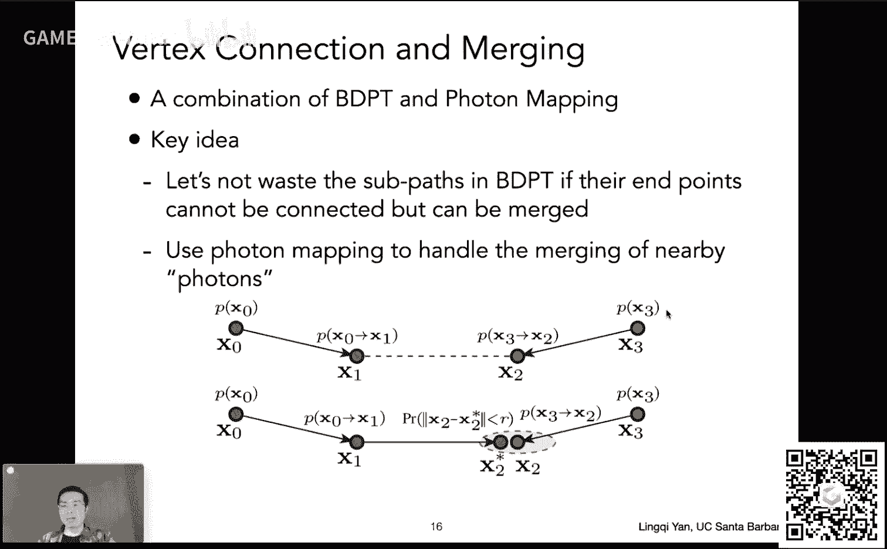

有很多这个电影其实是适用这种方法来做的，好吧啊，ok啊，那咱们的这个题另外一种和之前的方法都完全不一样的方法，叫做实时辐射度算法叫i r啊，instant radiosity，然后他这个什么意思呢。

这个有时候啊人们管这种方法叫做many light，这个方法就是很多光源的方法，听上去很土对吧，但是它确实就是这么回事啊，然后什么意思呢，很简单啊，我就是说啊我们之前这个分析这个光线传播的时候。

我们不是提到说，我们其实并不太区分说光线到底反射来的还是自己发出来的对吧，然后就是像这种情况，不管怎么样都是光线对吧，都是radiance，那这样一来的话，这个实时辐辐热度其实也是一直利用这种思想。

怎么说呢，就已经被照亮了的这些念对吧，这些这些地方我都可以认为他们是光源，然后用它们来再照亮别人，哎，这种就是这个这个实时伏热度的这个呃想法，那他怎么做的呢，很简单。

他一开始呢先从这个光源打出很多所谓的light sub pass，大家会发现这种双向的思想到处都是哈，从这个光源打出很多light path，它不会停在某些地方的，好，停在某些地方之后。

我就认为它停住的那些地方就变成了新的光源，看这里这里形成了很多这个这个绿色的这些点，他们是新的公园诶，他们是新的光源，那当我看到比如说这一个点的时候。

我就用所有这些新的光源去照亮这一个我看到的这个着色点诶，这样的话实际上来说不就等于是我考虑了光线弹射，比如两次嘛对吧，比如说这里你会看到这是直接光照，这些是我们新生成这些虚拟的点光源。

也就是vpl对这个点的直接光照而生成这个光源本身，这个之前真正的光源已经经过了若干子弹射，那所以就相当于我用直接光照的方法，我就可以生成这个呃，可以得到这个这个间接光照的结果，唉就非常好对吧。

那所以说总结起来就是相当于是它首先先去生成这一系列的所谓vpl，然后在你这个再去看下这个场景的时候，用这些vpl当光源去照亮你的这个桌子里。

简单吧，这个思想很简单，然后呢他就有他这个实际应应用起来非常快，然后呢啊就就就就单说这个many light rendering吧，就就不说这个嗯怎么说，就是就是就是一定得是这个vpl好吧。

就是说对于很多光源这种这个研究也是很这个呃，一个很很活跃的一个一个领域，比如说大家看这里，这是一个这个呃也是在一个盒子里面对吧，左边是一堆光源的，看到好多小的光源，右边也是一堆光源。

用这些来照亮这这一系列的物体，还是非常有意思啊，就是说它正常情况下，这是一个这个研研究的比较这个多的一个话题，但它也有问题，什么问题呢，就是说啊这里这个嗯这里这个比如说大家看右边这个渲染。

这个渲染呢就是在用这个vpl来渲染这个场景，这个场景就会出现一个问题，就是说这个有一些地方你会发现莫名其妙的会发光对吧，就是在一些这种这种这个这个窄的这种缝隙啊，这些接接缝啊，这些地方会出问题对吧。

至于这些地方为什么会出问题，我们就不再给大家多说，这里给大家简单提一句，这里和之前咱们推出来的那个距离平方向有关系，还记得咱们在推这个呃light sampling的时候，我们把这个对面积的采样呃。

就是把这个对这个立体角的采样改成了对面积的采样，所以产生了一个这个呃这个面积乘以cosn除以两点之间距离，大家会发现如果两点之间距离会极尽，那会出现什么情况，那就会出现我除以了一个极接近零的数。

得到一个结果就非常大，就会出现这种这种情况好吧，跟这个有关系，我们不多说，那么另外一点vpl不能做这个呃，glossy的物体就是稍微有一点这个经验的这种做不了好吧，那么这里差不多啊。

这个就是说光线传播方法呃，这个简单给大家这个梳理一遍，大概就是现在这个常用的一些啊，然后我看有同学问问题，说有没有无偏的例子，有啊之间pass string就是b d p t也是啊，ml t也是啊对吧。

然后呃就是这么回事，嗯，好有同学问哦，面积怎么定义，我猜应该是指那个吧，我猜应该是指photo mapping里面的对吧，说你这个找到了一堆光子之后，那这些光子到底覆盖了你这个着色点周围多大的面积对吧。

这块其实是挺那个的，挺这个所谓hack的一个做法啊，他所在的面求一个这个交集，就可以求出来一个橡胶的面，这个面的面积你就可以认为是这样，就是说这块的这个估计有很多各种各样不同的方法。

但是各种各样的近似啊，这样说，然后呢有同学反映说这个i photo mapping，这个是不是相当于是把variance和bias中间做了一个所谓的这个这个，那这个妥协对吧。

要么是更多的variance，就是就是噪声，要么就是更多的8月s就是模糊，对没错，就是这么回事，就是说有时候大家对某一样的这个接触接接受程度稍微高一些，有时候接受程度稍微低一些啊，大概就这么个意思好吧。

诶非常好，那行，那咱们这个哎没有有没有完美的方法，真的没有，目前来说完全没有啊，就是这么回事，目前真的没有什么好的办法可以把所有问题都给解决，那么多说一句，工业界现在在用什么办法啊，让我说清楚。

现在很多做这个这个呃动画呀，电影呀，这些非常厉害的公司到现在还在用pass tracing，因为它是一个这个虽然听上去没有其他东西这么高端，但是他是最可靠的一个啊，那么啊ok那咱们进入第二个话题啊。

我们要说一说这个呃更复杂的这个呃这个外观建模哈，叫appearance modeling，appearance modeling是什么意思呢，咱们之前说过对吧，外观就是材质，材质就是b2 df呃。

如果对于表面模型来说，它就是b2 df，那么咱们这里呢就是简单给大家提一些，这个就是我们课上这个这个比比我们课上说的要更深刻一些的内容哈，就是呃会提一些什么呢，我们会提到一些这个呃非表面的模型。

比如说涉及到这个散射介质，什么叫散射介质对吧，咱们待会儿看，然后我们会提到头发这个动物毛发对吧，这些东西，然后还有一些一粒一粒的沙子这种东西，这种材质这种都和表面无关，然后呢这个还会提到。

当然表面模型也有一些稍微复杂一点的，比如像这种半透明，然后像这个呃像这个布料，然后以及像这个复杂的这种模型，然后呃这个这种这个有有有细节多的模型，然后最后还会给大家提到一些这个所谓呃程序化生成的模型。

好吧，那这些都是什么意思，咱们简单给大家说一说啊，好那么呃ok那咱们先从这个非表面模型开始啊，我觉得已经说的慢了哈，我觉得这个这个够呛，尽量快尽量快，这样这是什么叫这个散射介质或者叫参与戒指啊。

叫participating media，我自己更愿意把它翻译成散射戒指，然后这个呃很好理解，就是像这些雾啊，这些云啊，这些这些材质啊，这些显然他们不是在一个表面上对吧，他们会定义在空间中。

它是这么一个概念，那么咱们怎么理解这种这个散射介质，或者说参与介质呢，很简单，当你一个光在行进的过程中，如果他穿进了一个这个散射戒指啊，想想象你有一根光线穿进了云啊，那么会有若干事情发生。

第一如果这个云中间有光源，它本身会发光，这个咱先不考虑啊，就是说在你这个光线行进的过程中啊，这个云里面有各种各样的晶体，小的这个冰晶对不对，它会把你的光线给随机的给打到其他的方向上去。

就是就是这里画的什么意思啊，从左到右过来诶，打到了一个小冰晶，它会被分散到各个方向去诶，这是非常有可能的，那么同样道理，在你传播的过程中，你也可能接受到从其他的方向散射过来的光对吧。

这个时候这是一对应的，你你可以往外散，你也可以接受到别人往外散，这个这个对这个点的影响对吧，然后呢在这个传播的过程中，当然有一些能量就是在传播的过程中逐渐逐渐逐渐就没了，想一想乌云对吧。

就是这个这个光线传播传不过去，穿不过去，就是相当于各种东西都被吸收了嘛，就是这个意思，那所以说最重要的就是光线在传播过程中会发生两样事情，第一被吸收，第二被散射，就是这个意思。

那么就有同学问怎么产生对吧，是不是说我这个光源往一个方向去，这个这个传播过程中，诶咱们类比一下这个物体的表面，说这个物体这个defuse的话，如果物体表面不是def话，那就不是，那同样道理。

对于参参与介质或者散射介质也是一样，那在任何一个点它都会发生散射，往各个不同的方向散，怎么散，由一个函数来定义，叫做fafunction这个相位函数啊，相位函数，还是说呢我这有一束光从这里打到这个点。

它主要的往背后闪，还是有还是说有一些情况，就是说它主要都向前散，这些就是说我来规定不同的这个散射的方法，这就很像b2 df对吧，它决定了光线如何反射，这就是决定光线如何散射。

道理就在这儿好，那么这个参与介质很好渲染的，然后怎么渲染呢，很简单，你这个你现在假如说你已经在参与介质中间某个地方了啊，然后你往某一个方向这个去去去走对吧，你把某个方向去走，然后你走走多远走多远。

这个决定说你这个这个戒指它的吸收能力有多强对吧，这是肯定的，就是如果他是个很黑的一些这个乌乌云这种东西对吧，或者有一些像这种薄雾这种东西对吧，那这种情况下就相当于它能穿上的更远，走多远由这个决定。

然后呢这个嗯就是说呃我走多远，停了下来，停了下来之后呢，我就就考虑说我这个时候应该把这个光线往哪儿放下，再重新倒，这就是散射对吧，这散射它就会往另外一个方向去唉道理就在这儿，同样道理呢。

你这你这样不是等于是你可以生成一系列的这些，就好像是这个光在这个呃物体表面做各种各样的弹射，一个道理对吧，只不过这中间这些点任何一个地方都有可能会发生这个方向的改变，但不管怎么样，你找到一个pass。

找到up怎么办呀，和光源各个这个弹射的地方相连，然后来计算它的这个这个整个一个路径的贡献，好吧，说白了就是这个意思，中间有很多的这个呃数学的计算。

然后这个我们这里能考虑的就不再是这个rendering equation了，因为渲染方程告诉我们的，只是说这个光线如何与这个物体表面这些东西作用嗯，不告诉我们和这个体积这些东西怎么作用。

这自然有别的方程来做好吧，但思想是一样的，我产生不同的这个pass就是了，对吧好。

那么他怎么骗人，当然他得到了一个非常非常这个广泛的应用，这里呢这个超能特工队对吧，然后这里我之前给大家说过对吧，这是一个这个中西的中西哦，这是东西结合的这个城市呃，叫做san franciao嗯。

这是旧金山和东京的结合体，然后各种各样的物哈，整个有很多场景发生在这个夜里，然后各种各样的雾的渲染啊，这是一第二呢，大家看到这里呢是一个这是一个游戏哈，各种各样的烟啊雾啊，就是那个时候产生。

所以说在这个实时渲染里面也有很多很多这种研究，说怎么这个很快的把这个这个这个呃散人戒指的这个效果给渲染出来，对吧这个就很难，然后呃总之人们很聪明和各种各样的这个研究。

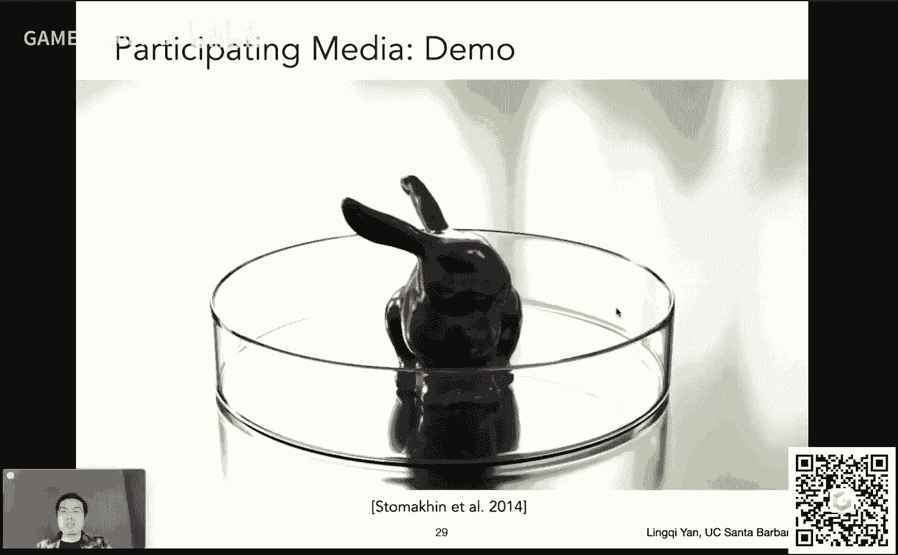

它对吧，这里大家看到另外一种散射介质啊，哎大家说这怎么能是散射介质呢，这不是云或者烟或者雾对吧，才看到一个这个融化了裤子，这个是涉及到这个模拟啊，流体啊这一系列的东西，但是有一点我想跟大家说的事情。

就是说很多材质基本上来说你觉得可能是一个表面的东西，但实际上不是啊，就是说光线是有可能进到这个物体里的，只是进的多还是少，比如说像云什么东西呢，这个光线可以进去的很多，然后有一些东西呢它比较厚。

那那这个呃这个比较厚的话呢就会出问题哦，哦有同学反映说我这个说的不对啊。

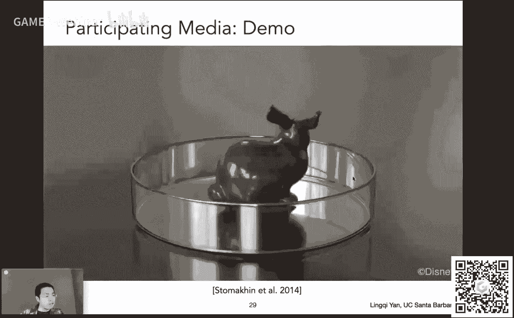

那个那个这个哦好吧，这是自己大家大家自己考证那个游戏叫什么吧，忘了我也忘了啊，行那么这个这也是一种散射介质，然后我想说的事情是什么呢，比如说给大家看一个实验啊，很简单，看哎呦喂闪瞎了啊。

大家看这是不是能看到这个，我用手挡住了这个这个这个这个这个摄像头，但是大家却还能看到光线穿了过去，没错吧，然后大家自己也可以这个用手去挡住这个这个闪光灯哈，然后就会发现就是这个光线啊。

其实它的穿透力很强的，它完全可以穿透人的皮肤，再从其他地方出来，这咱们待会儿就说好吧，所以这个对于这种巧克力这种材质来说，它肯定还是一种散射介质，只不过光线进去不久，进到这个材质里面不久就会消失掉啊。

这个意思好，那么我们现在来提另外一个这个话题啊，就是说这个另外一种材质呃，也是不是定义在物体表面上呃，这是什么材质呢，头发大家知道这个头发这个叫什么来着，他是一根一根的都对吧。

那如果他说他梳理的比较平整好，我们说他在一个表面上还行，那这是正常情况下不能这么假设，有很多头发都是飘出来的对吧，一根一根的，那所以说我们描述一个头发的这个它的光学属性。

我们要考虑光线和一一个这种这种这种曲线如何去作用，它就不再是和一个面如何作用了对吧，是这么这么一个意思，那咱咱们看到这个人的头发很神奇，它会有高光，高光，这个看起来很碎的对吧。

但高光呢大家看到其实有两种不同类型的高光，哪两种呢，大家从这可以看得出来啊，一种这个无色的高光，这种这种这种稍微发白一点的，大家看到没，这是一种无色的高光，另外一种有色的高光。

就是哦这边有一个这个这个图啊，就说唉哟不好意思，就是说啊这个啊有色的高光是怎么回事呢。

就是这两种高光是怎么形成的呢，对吧，那这样一来啊，我们分析一下这个问题啊，从一开始就是说嗯嗯有人研究头发开始，人们就广泛地采用某一个简单的模型，这个简单的模型是怎么做的呢，就是说我这个有英文光线。

然后打到一个圆柱上，我们刚才说这个头发的模型嘛，我们说成是圆柱，然后光线打到圆柱上呢，它会往四面八方散射，然后对于头发来说，我们把它给这个考虑成什么呢，考虑成会散射出一个圆锥来，就相当于是这样啊。

有一根光纤过来之后，如果它是一个表面，它会往这个方向去对吧，但是它现在不是表面，它是一个这个圆柱，它就会产生一个这种跟这个这个这个漏斗型的这种形状哈，就是往这个这些方向上都会散射。

然后同时这有一些光线它又会被散射到四面八方去，这就好像是diffuse和specular两个加起来对吧，和之前的这个表面很像。

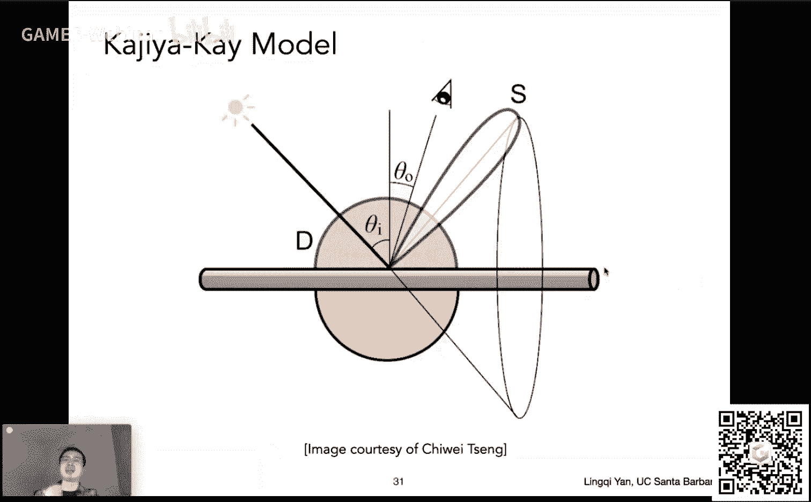

那么把这个做出来之后呢，大家会看到这种模型啊，叫做kaji k model对吧，那么这个卡西k这个模型呢，它是看上去就不怎么好对吧，因为它显然不是真的，他看上去就好像之前我们做的不灵风模型，没错吧。

那所以说会出现这种情况，那那它不对。

那自然就会有人来研究说，那真实的头发到底和光线如何作用，那这里呢就是一个广泛应用的模型，叫做marshine model，然后呢这个模型考虑了什么事儿哈，考虑的时光线我打到一根圆柱的时候。

肯定有一部分会被直接反射掉，没问题，也有一部分会穿进去，穿到这个这个头发里面去，这个发生折射对吧，穿到我头发里面去再穿出去，那这种情况下我们考虑这个反射，把它记作r啊，然后把这个穿进去穿出去。

这种这种穿透的就记作t那么我一根光线要想穿透一根头发，那得穿两次，所以说会产生一个tt这种光线的传播方式，还有一种呢就是光线进到这个这个头发里面了，在头发的内壁上发生一次反射。

也就是说发生了第一次穿透之后，发生了一次内部的反射，然后再发生第二次穿透，这个叫做t2 t对吧，然后这个这个就是通过这种方式啊，我们可以定义各种各样不同的光线传播对吧。

然后就是说我我们怎么样描述一个材质对吧，我们之前说的清楚，就是要描述它和光线怎么样作用，那这就是这个所谓marginal model的这个做法，他怎么做呢，他把这个头发当成一个玻璃的这个这个圆柱啊。

他当然可以扭曲哈，局部我们认为是一个直的，然后它有两个结构，外层叫做cuticle，叫表皮啊，然后里面叫cortex cortex，我忘了叫了什么啊，然后就是说呢他认为这个头发呃。

这个这个它本身内部有色素对吧，这也不是认为它实际上就是这么回事，头发内部当然有色素，如果有光线穿进头发，在传播的过程中会被部分吸收，然后他再传出去，那如果说我们说人的头发是黑的，那就是头发的色素多。

那如果我说头发是基因发或者什么这种这种就是它里面吸收少对，就是就直接就传出去了诶所以可以可以解释很多问题啊，那也就是说把这个头发理解成这么一个这个玻璃柱，然后然后经过玻璃珠的时候呢。

会有这个光线的这个这个能量损失，这产生颜色得非常合理对吧，那么这里呢就是marsher模型考虑了三种这个光线和这个圆柱的作用，第二光线穿进去就穿六穿出来tt啊，第三光线穿进去。

然后在内壁一反射再出去叫t2 t那么把这些综合考虑在一块，它就可以得到一个非常好的所谓marsha的模型，对吧啊，ok好，那么这个大家可以看啊，这个margin的模这个模型以及这个它之后的这些模型。

那能够得到一个非常非常好的渲染结果，没错吧，那当然这里呢我这个多给大家提一句，肯定有的同学已经想到这么一个问题了，我定义的是什么呀，我定义的光线如何和一根圆柱进行作用对吧，光线和一根圆柱进行作用。

那我只能算光线和一根头发怎么作用对吧，那如果这个光线和多根头发怎么样作用，可想而知，光线会打到一个头发里面出来，再打到第二根头发再出来，再打到第三根，第四根意识到100根，最后出来被你看见。

真的是有这么一个过程的，没问题啊，这个就是所谓我们说的多次散射，如果我们认为光线和一次这个一个头一个头发的作用叫单次散射，那么这个就叫多次散射，那多次可以多了，多的没边儿对吧，可以多到100次。

没有任何问题，那这就是为什么对于这个头发来说，这么渲染这么困难，因为它要求的计算量实在是太大，这个光线这个真的得模拟它在头发内部一根一根头发之间弹射，然后最后出来是什么好吧，但是不管怎么样。

只要和一根我知道怎么做，然后我根据光线传播，然后我自然而然我就可以把最后结果算出来，没问题啊，对这有同学反映这计算量对吧，这计算量确实是真的大，这就是为什么头发渲染非常难啊，好但是不管怎么样。

头套的模型挺好的对吧，然后呢大家会看到这个头发的这个模型在各种游戏中的应用啊，这个是最终幻想15，这个大家会看到他的各种各样不同的这个这个人物的头发啊，这灰白的以及这个黑色的。

这个这个也是染的可守各样不同的这种这种头发啊，就是最终幻想系列一直都是这么一个风格的，头发是特别认真的来做啊，ok啊好，那没问题啊，这里不给大家多播放这个的，然后另外一个例子呢。

当然在这些这个这个动画电影中间，大家也会见到，像这里大家看到的是这个疯狂动物城对吧，在这个这个会看到有这么多根的毛发，每一根都是一根一根的做出来的，对没有问题好吧。

然后这个这里是一个卡通的一些这个呃应用，然后呢我们就提到另外一个事情，我们说到人的头发对吧，那人的头发能不能用来描述动物的毛发呢，那之前就有人试过啊。

就是说这个这个如果我们用人的头发模型应用在动物上会发现不对，怎么渲染出来，看着一点也不像，我们想要的是右边这个效果，但是我不想要左边这个效果，但是这个我用人的头发模型得到的就是左边这个效果。

那就说明这个啊人的头发的模型不足以，这个描述光线如何与这个动物毛发进行作用，那这到底怎么回事呢，那我们可以看一看这个生物上的结构哈，就是说啊如果我们研究人和动物的毛发，我们会发现一些共同点。

什么共同点呢，就是说这个毛发如果我们切开啊，一根我又发现唉，它有三个结构，第一外面这个表皮叫cuticle，然后第二里面这个东西叫cortex，还记得吧，人的头发之前就有就有这个这个部分。

然后它能够这个吸收这个这个光对吧，然后这个第三层这个最内层这个东西很很神奇，但有个东西叫做水质啊，叫mada，然后这个水质是干什么呢，它能够这个它这个内部的结构非常之复杂。

那光线进去了之后会好像进入了散射介质一样，然后直接被打到四面八方去诶，那就是会有这么三三层结构，那人和动物都有，比如说咱们看右边没人，人的这个表皮这个call tex以及中间水质啊。

在这儿看见没诶但是我又发现了一个区别，什么呢，对于动物来说，它中间的这个水质大的可怕，对不对，它和人相比来说完全不一样，这个水质特别大，也就是说光线进去了之后更容易发生散射，诶这就是一个问题诶。

我发现了一个这个这个之前的模型没能描述的一个一个东西，然后我们来验证一下它到底是不是这么回事呢，就是这个水质的作用到底有没有那么大呢，那这么一看诶，一目了然，当然这是一个这个所谓鸡和蛋的问题啊。

这是因为这个已经这个模型做出来了，大家可以看到这个结果对吧，就是说嗯看来模拟这个水质是是有必要的，就是之前的这个玻璃柱模型忽略水质是不对的，那所以我们要引入这么一个东西，那同样道理放在人的头发上。

人的头发水质这么小，就百分之十十五左右，它的直径啊相当于是一根头发直径的15%这么小诶，但是它的作用就很大，那没有和这个一个小的这个这个这个水质诶，它就有这么大的区别。

就是这里大家看到明显这里亮了很多对吧，这里暗很多对吧，那会有这么一个情况，所以呢就有人提出了这么一个模型，然后这个模型叫做什么呢，叫做这个双层的这个这个圆柱模型啊。

然后这个双层的这个圆柱模型它做了个什么事儿，其实就是把这个水质给这个精准的描述出来，就真的用两个圆柱中间的这个是髓质，来模拟这个光光光线和这个呃这个双层的这个呃圆柱它的一个作用呃，怎么说呢。

这个作用就是这样的，当然这个光线打到这个表面上之后，还是可以被弹走对吧，然后这个光线有可能这个穿过这个呃结构的过程中，他没达到水质是吧，或者打到了之后嗯，这个没有发生散射对吧，这是有概率的。

然后也就是说还是有可能跟之前一样，有这个rtt和t2 t，然后同样道理这个也会有这个有一部分光啊，在穿过这个双层模型的过程中，在中间的这个穿过水质的时候被发散到各个方向去啊，这里叫tt。

然后呢这里这个这个这个这个这个t2 t也是一样的，就是这个在穿过这个水质的过程中，两次都有可能会被散射，会形成一个t2 t s诶，那也就是说这个我们就可以用五个这个不同的这个分量，还记得吧。

咱们之前说这个不林风模型有三个对吧，那咱们这里呢这个头发模型有有三个，那咱们在这个头发模型上呢加两个加两个这个散射的结果，大家看到这散射的结果确实对这个总共的贡献啊是有不少的，所以咱们不能忽略。

所以之前看着m就是因为这个当然有同学好像发现了这么一个事情，对不对，这个我说有人发明了这个模型，这就是我发明的这个这个这个动物毛发的模型啊，这个没问题啊，这个ok所以大家来看一看例子啊。

大家看到的这个是所谓仓鼠对吧，hamster应该是仓鼠，然后呢他这个是由六多少60万根这个毛发组成的，然后所以大家看到的根本不是什么表面啊，真的是一根一根的这个这个曲线描述出来的哈，就是60万根。

然后我们这个渲染了多久呢，每一帧渲染了将近40分钟，然后这把各个针联系起来，然后还看到一个转动的这个仓鼠模型诶，非常好，对不对，然后这个诶可以可以，然后会看到这个动物毛发的表现力非常不错，当然了。

这个这个双层的这个嗯这个援助模型啊。

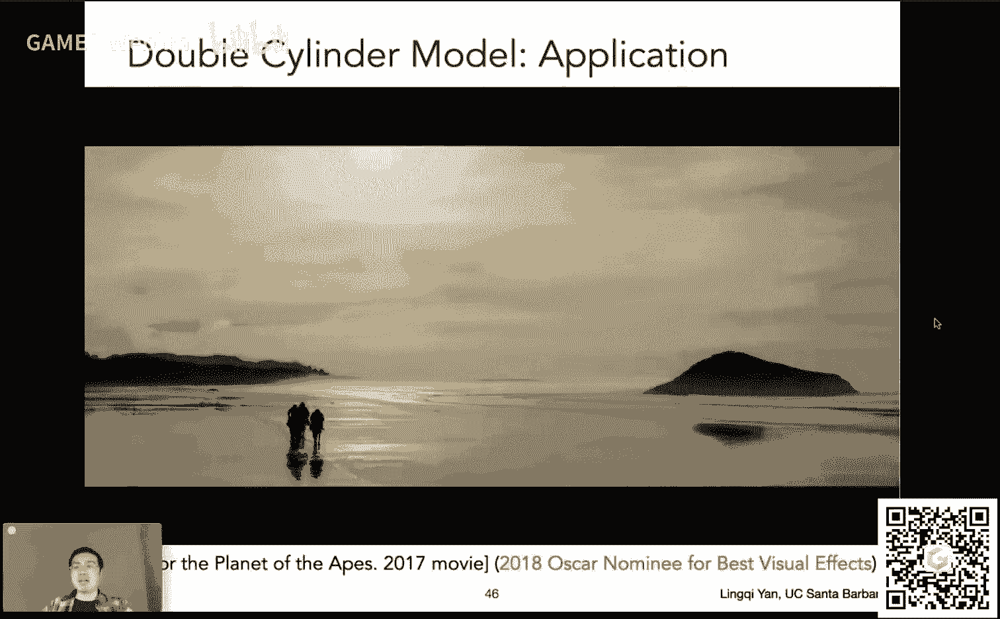

他得到了这个广泛的应用，比如这里看到了这个星球崛起啊，这部电影它是所有的这个呃这个人员啊，都是用这个这个双层的圆柱模型来做了它的毛发啊，所以做的非常好。

所以才被这个2018年这个奥斯卡拿去这个当这个最佳视觉效果奖。

提名啊，这个意思，然后呢同样道理到了这个2019年又有一部电影应用了这个技术，然后这个电影就是狮子王hd，然后这个同样也拿了这个2019年的奥斯卡的，这个最佳视效的提名啊，大家会发现有一个问题对吧。

为什么大家用了我的模型之后，都只能拿提名，拿不到最终的奖对吧，我也很纳闷这个事情，当然了，话又说回来，这个奥斯卡的视觉效果又不是光说是这个制作的难度或者干什么，视觉效果有很多东西呢，特效那些东西对吧。

都要考虑的，所以从这个角度上来说，我自然很希望自己能拿一次奥斯卡，当然拿的也不算，我的算是这个电影公司的啊，ok好那么这是这是闲话，就是说一说这个模型的不断发展。

那大家不需要知道这个双层的这个圆柱模型到底是怎么推的，都是中间怎么做的对吧，但是这个是一套科学的研究方案，就是说之前的一个这个头发模型不行，那他肯定这个结构决定性质嘛对吧。

他肯定有一些地方这个能够被改进，所以说这个需要看一些这个生物方面的这些文献调研，然后再把它总结成这个这个图形学的模型，所以这些大家就会更加体会到这个图形学好像是什么都涉及对吧。

咱们之前一直在说什么数学呀，呃物理啊，统计啊这些东西，现在又来个生物对吧，各种东西都有，是的没有问题，所以说这个啊没什么问题啊，这个好，那么这里呢再给大家多说一下。

这个这个这个另外的其他各种各样不同不同的模型啊，这种模型叫做granular的这个这个材质，所谓granular这里我这词穷啊，我实在是这个没办法翻译啊，这个这就是granular。

所以granular呢就是一粒一粒的这种模型，大家可以看到这个香料啊，什么盐啊，糖啊，一个一个的晶体对吧，每个都很像，你会发现整个这个这它是一堆这么些小东西形成的，这个整个的这个这个表面模型对吧。

诶不是不是表面啊，就是形成的这么一种模型，所以他会很很麻烦对吧，然后他确实是很麻烦，然后这个人们这个发现这个计算量非常非常的大，然后但是这个人们可以做一些简化，比如说认为啊这个就比如一个沙子堆成的城堡。

然后它的每一个这个单元上啊，有好多不同的这种这种不同的石子来构成，各自成分都是百分之多少，然后大家就可以拿过去渲染。

大家可以看到这是一个沙丘的模型，然后诶离得非常近的情况下，就可以看到一粒一粒的对吧，然后离得很远的情况下，看到的就是一个沙丘诶，对吧啊，当然了，这生成这么一张这个这个图花的时间是非常非常厉害的。

所以到现在来说，granular材质并没有得到一个非常好的解决，目前来说是这么回事，诶好感谢有同学帮我翻译哈，颗粒材质非常好，非常好啊，我觉得挺合适的，你就翻译成颗粒嘛啊。

ok然后这里呢大家看到的是一个这个pika的一个短片。

pika呢不止推这个长篇动画啊，还有有些短片，这个短片呢就叫做叫做玉啊，就那个鹬蚌相争的那个玉就是piper，然后这个pepper呢这当然看这个短片涉及东西很多，但是其中有一些啊，大家可以看到这个沙子。

这可不就是granular material嘛对吧，所以说这个是这个皮克斯也是在不断的这个通过这些短片来炫技，也非常非常厉害啊，然后呢，那我们刚才说了啊，非表面的模型好，那咱们这个再提表面的模型对吧。

我刚那个沙子那肯定不是在表面，而是在一个体积里对吧，那么表面模型呢，这里再重新咱们提回刚才的这个这个现象，就是说这个散射介质的现象，那我们提一个东西叫做玉石，玉石呢是一类这个物体。

一类材质的一个典型代表，这个代表是什么呢，叫做半透明这个材质，这里同样是另外一个，我对这个翻译非常不满意的一个一个一个这个词汇啊，translucent，translucent绝对不应该翻译成半透明。

应该semi transparent才是叫半透明，就是说translucent和和和这个半透明它其实有区别，就是说它不是说光线在穿过这个透明介质中，它中间会涉及到吸收，它本身还涉及到散射。

它说明什么问题呢，说明光线可以从某个地方进入这个表面，再从另一个地方出这个表面是这么一个意思，那刚才大家看到我用一个手指去按住这个这个这个呃手机的光源对吧，然后大家会看到我手指发红对吧。

那光源就从这个面这个钻进这个手指对吧，然后从另外一面钻出去的光线，当然可以这样，那这个东西就和这个这个半透明，其实怎么说呢，就是说这个中文的词汇就不太合理啊。

那么我们管它叫还是叫半透明吧啊translucent啊，大家知道这么回事就行，就不是说他这个沿着一个方向传播，并没被吸收，它可以被导到其他方向上去啊，那么玉石就是其中一种。

大家可以看到这个光可以从一个地方进来，从另外一任何一个地方钻出去对吧，然后那同样这个海里面，大家看到水母也是这么一个道理，就是光线进入它里面这个头，然后他在这个头的内部会发生一些散射。

然后再从另外一些地方钻出去对吧，所以这个单透明这些物体大家平常都很喜欢啊，看起来比较好看，那么反映在这个这个呃物理上呢，它说明什么问题，就是我刚才说的啊，光线从一个点进入了某个表面。

在底下发生了大量的散射，从另外一个点钻出去，道理就在这没错吧，那对于一些常见的物体，像牛奶对吧对吧，像这些物体大家就可以看到很明显的这些这种现象，人的耳朵，像这里比如说人的耳朵背后有光进来。

然后它这个会穿过人的耳朵出来，对没有问题，所以说呢这个这一块儿，这个这个嗯为了描述光线的这么一种呃散射方式，我们管它定义成叫做次表面散射，所谓sub surface scattery。

好吧，次表面嘛就在表面下面发生了散射，好理解啊，那么次表面散射呢可以理解成是对b rdf概念的一个延伸，为什么呢，因为我们平常说b2 df是光线打到了这个点，并且又从这个点出来对吧。

像这个比如说debu物体光线进来之后诶，往各个方向不同不同方向去，那就是所有的这个作用都发生在一个点上，那另外一点就是说在这个b s s r d f上，我们就可以理解成他把概念延伸到好，我从一个点进来。

然后我当然是以任意方向进来，我可以往任意方向出去，但是我可以从任意一个其他的地方出去，所以大家看这个d s s r d f就是就是说这个呃和b r d f概念一样。

中间加了一个subsurface scattering啊，然后就是次表面反射对应的这个所谓b s s r d f，它其实就是规定了时光线从哪个点进来，从哪个方向进来，哪一点出去，从哪个方向出去好吧。

相当于是对b2 df概念的一个延伸，那么延伸了之后，相应的这个渲染方程也要也要这个改一改啊，就是说我原本是对这个各个方向进行积分对吧，然后现在就不是了，现在就是说我考虑这一点。

那如果这个表面有次表面散射性质，那我如果有另外一种光达到了这个点，然而这个点它也是有可能贡献到这个点，并且研究方向去的，哎对吧，也就是说我不能只考虑从各个方向进来的光。

我还得考虑从各个方向进到其他点的光，所以说我要对方向进行积分，也要对面积进行积分，这就是说这个b s s r d f相当于是对b2 df概念下的一个延伸，然后呢这个这个当然算起来很复杂了对吧。

那么人们就发现啊，其实怎么说呢，比如说大家自己可以试一试啊，把这个手机摁在手上，手心上啊，然后打开这个这个闪光灯，大家会发现这个闪光灯周围就好像说产生了一片，这个往外走的这个光源一样。

就好像是你的手心底下有一个光源在发光一样，诶这里就是这个这个这个这个基本思想，人们会发现啊，这半透明介质就好像这么一个原理一样，我有一根光a一光线打到了一个什么物体上，就好像这个物体底下出现了一个光源。

然后呢这个会从底下照亮我周围的这个打打的这个着色点，周围的一片诶，这种情况就就就非常好，当然为了物理上的真实哈，物理上的真实，就大家推出来说，这一个光源不够，还得是对应上方也得有一个光源。

所以相当于是有两个光源，然后用这两个光源去照亮周围着色脸，这一块就很像次表面散射得出来的结果，好吧，这样想，那么这个这样理解的话呢，呃就差不多了，好吧，就是用这个大ipo方法。

就是这两个这个光源嘛叫大ipo，然后呃用这种方法来近似这个次表面反射散射的这个效果。

那当然得出来的结果不错，为什么说不错呢，咱们看这个呃，这是一个雕塑对吧，呃然后这个呃假设它的渲染都是b2 df对吧，都是b2 df，没有次表面散射，那看上去就是大理石啊，不是大理石啊。

就相当于是这个这个石膏一样这种这种效果啊，那如果有这个四表面散射呢，大家会发现诶效果就完全不一样，就完全看上去像是这个这个大理石这种效果了，就是光线在哪看的比较明显的，在这个鼻子这啊，我现在切回去啊。

b2 df，那当然这个鼻子背后有光的，这个正面照不到光的，就完全是这个阴影了，那如果有b s s r d f，大家看的非常明显的光线，就可以钻出去对吧，这样就可以得到一种就是看起来所谓珠圆玉润。

就是这么一个效果对吧，那两面反射非常有用的东西，然后这里呢渲染正是用这个呃。

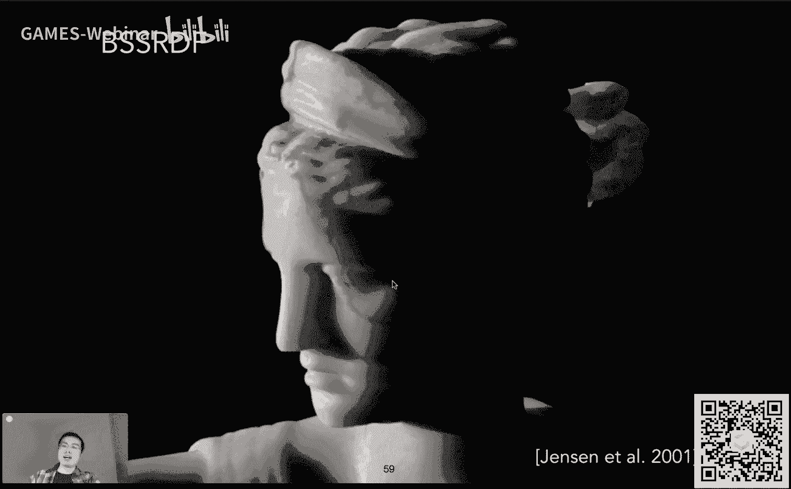

就是打ile这么一个估计来近似的好吧，那么这是一个同样的另外一个例子，咱们看如果说用这个b2 df来渲染人脸，得到结果看起来很干对吧。

那如果说我去用b s s r d f加入次表面散射渲染同一个人脸，那我就发现哎结果呢好的太多了，对不对，这就已经很像真实的人脸了，那同样的道理，为什么说它真实了些呢，那就是因为他这个在实际的情况下。

光线它就是能进入人的皮肤，在这个一个局部这个散射出去对吧，那所以说他这个人的皮肤真的就应该有这个次表面反射散射的静止，所以说这个加入的时候自然效果会好啊，没问题。

那么四条边弹射在这个科研上也有各种各样的应用，比如说这里是我这个当年我的老师的作品啊。

呃徐坤老师的作品，然后他做过这个这个嗯这个次表面散射材质的编辑啊。

就是你可以动态的改，比如改的更像石头啊，然后或者是改得更像玉石，然后颜色也可以变，然后这个或者更像蜡烛对吧，然后像这些东西都是可以调的，然后所以这个这个挺有意思的事情啊。

就是说对于b s s r d f给大家这个这个说一下，就是说大家现在研究的还是这个非常非常不错的啊。

有很多人喜欢这个，我自己也很喜欢啊，然后bs d f有多么厉害，但是厉害到了一定境界哈，大家看这三幅图，这三幅图有一个什么共同点能告诉我们，我直接告诉大家吧，好吧，这个三幅图都是假的。

这三幅图的渲染都都是渲染来的，没有一副是这个真实的照片啊，然后就是说这个大家看看这三幅图觉得好，现在这个是真的厉害对吧，就是真的皮肤这块，然后这个大家如果用了这个次表面散射之后。

会得到非常非常真实的皮肤对吧，然后这个效果就非常非常好，然后呢这里还给大家推荐一个网站啊，这个叫什么呃，这个这个地址大家没事看一看，说是十个这个这个这个就是渲染的最真实的嗯人物模型。

然后你可以可以看看这个大家这个艺术家是有多么厉害，以及现在这个四表面散射到底有多么强大，当然了，即便如此，有同学可能会说这个确实看上去还差那么一点点对吧，至少左边这个这个看起来还稍微差一点点啊。

ok啊好没问题。

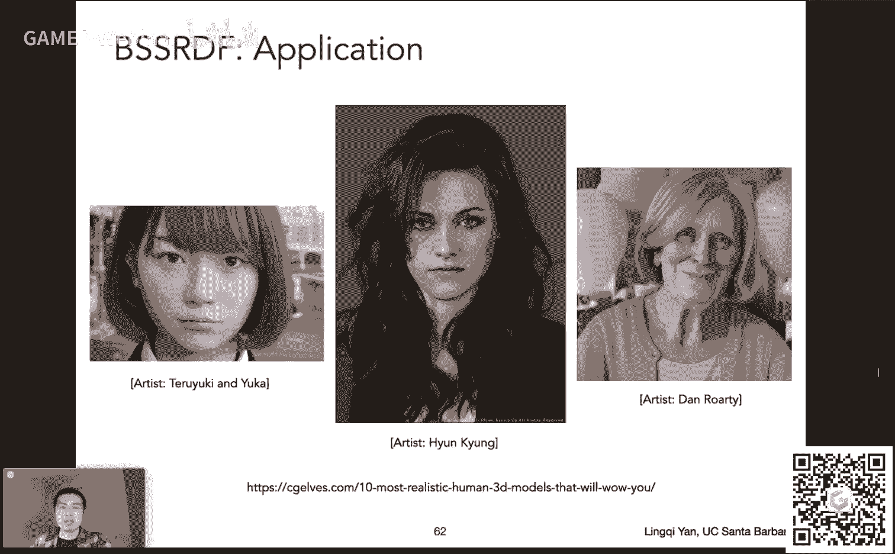

那么呃这就是留个后话吧，好吧，那这里再继续给大家说，那么我们说完次表面散射呢，我们再来说另外一个这个也是跟表面相关的材质，这个材质是什么呢，布料啊，就是cloth，那么为了理解这个布料啊。

我们得先理解他的这个制作原理，那布料是怎么来的啊，布料是一系列缠绕的这个呃纤维构成的，这样说没问题，但是它的缠绕啊，它有几个不同的层级，这个我给大家说一说啊，然后就是说这个这里涉及到很多概念什么呢。

我们就说这个纤维是最原始的概念，一根一根那个就是最原始的时候，你用羊毛那一根羊毛，那就就是这个就是就是它的最基础的这个纤维啊，化纤也是一个道理，那么这个这个不同的这个这个这个fiber啊。

就是纤维经过第一次缠绕，可以缠绕成不同的鼓，什么叫鼓，就是这个ly poly就叫鼓啊，然后这个这个不同的股再经过不同这个这个缠绕会形成线，那线就是一二，大家会看到这每一根啊，这个颜色它都是一个这个一股。

它本身就是有很多的纤维绕成的，而这第一层缠绕，第二层缠绕很多骨绕一块会形成线，线本身也是涉及到这个这个各种各样不同的这个这个呃缠绕，好吧啊，这个fibre缠绕形成play play缠绕形成第二。

然后第二之后就有了线之后要么被支撑，要么被这个呃得这这两个词中文反正都是知啊，我说的一个是这种，比如说这个机器这个一根压一根，这种算是这种这种这个桌布啊之类这种东西的做法啊，还有一种是你手工织的。

跟打毛衣一个道理啊，就是这种，但是道理是一样的，没什么问题好吧，就是说我们把这个不理解清楚，不是由各种各样不同的这个所谓纤维缠绕而成的。

这样就对了好吧，那么对于这种布来说，它既然是缠绕而成的，那如果要算它的这个表面模型，他就会非常非常头疼，这个这个因为什么呢，他肯定和你的这个针织啊，或者说这个纺织啊这种方向的有关，就跟你织出来的这种。

比如说你隔多少根及另外一根去压着一根，这这这种织法有关，就是和你织出来的这种形状有关系，诶那这个就是说根据这种形状，我就可以来定义这个你得出来的这个最后的结果他会怎么样。

如果我认为这个布料它就是一个物体表面的话啊，然后我可以通过这个各种各样不同的这个这个所谓编织的这个图案，我就可以来窜出来，它到底应该是得出来是什么样子好吧，那这自然而然我们就得到了一个b2 df的模型。

那当然了，有同学会说这个这个这个b2 dm模型肯定有问题吧对吧，那如果说我这个布它本身真的是在一个平面上，我认为他是在表面上行，没问题，咱们之前见过他对吧，然后然后这个我之前提到说有个材质叫天鹅绒。

天鹅绒这种东西，它所有的纤维它往外这个都是往外一根一根一根这个这个分布的对吧，根本它就不是一个平面，那我怎么能拿b2 df来表示它呢。

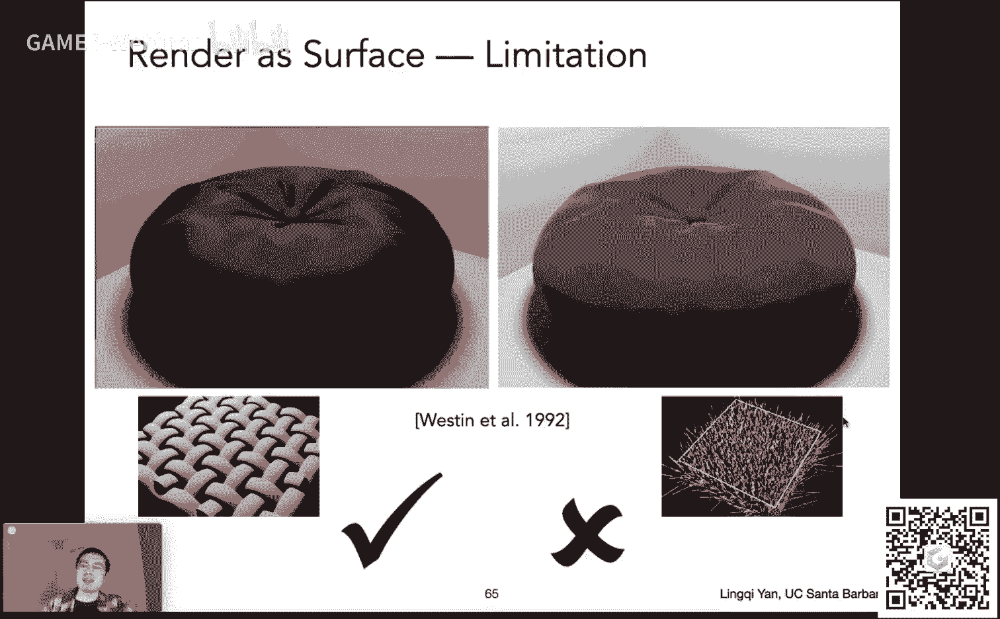

其实并不合理，对不对，那所以说一个更准确的做法，那就是说这个我们把这个织物啊给认为是在空间中分布的体积。

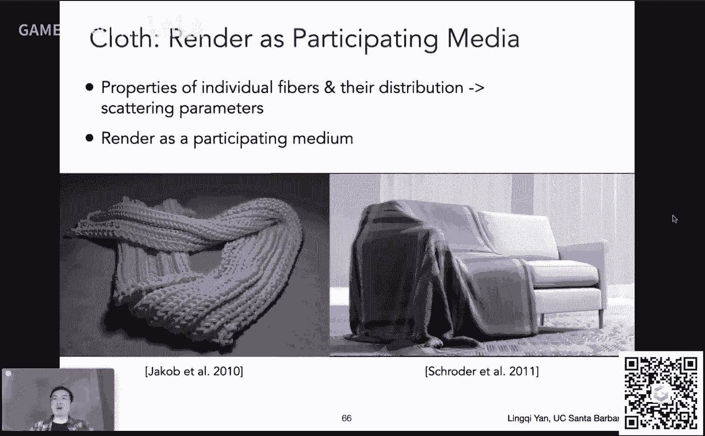

然后光纤中分布体积，我就可以把它划分成超级细小的格子，比如说大家看到左边那个围巾，然后呢右边这个沙发的这个这个这个布，它就相当于是把这个空间分成了非常非常小的这种格子，每一个格子里面诶。

我大概知道他的这些这个纤维它的已经大概朝向分布呀，然后它的复杂程度呀是这些东西，那么我就可以把这些性质给转换成这个光线的这个吸收和散射，这样的话我就好像是在渲染云一样，我把这个性质啊。

把它的性质给转换成这个这个嗯，就是对这个呃语音烟雾这种散射介质的渲染诶，我不再把这个布料当成是这个什么物，把把当成一个面了啊，我把它当成是一个体积，然后体积中间的任何一个微小的块我都知道它的性质。

这么做，那当然大家可想而知，这个计算量是很夸张的，对不对，这是确实是这么回事啊，这生成一幅涂掉要花好多好多个小时啊，然后就是说呃当然能够得到相对准确的结果，肯定比你认为它在一个平面上这样对对吧。

那所以说这个又是一次大家体会这个事情啊，就是渲染中间有很多这种所谓trade off，就是你要想要更好的结果行没问题，多花点计算量，多花点时间对吧，那么我们说这是一个办法。

能能够把这个这个布料啊当成散射介质来做，还有怎么做呢，那因为这个布料本身它可它就是纤维对吧，那我知道它是纤维怎么样缠绕的，那我自然而然，那我就说一个最暴力的做法，我把每一根这个纤维我都给渲染出来。

不就完了吗对吧，那比如说像左边这一幅，大家可以看到哦，每一股对吧，这里不是鼓了，这每一个省，每一个这个县啊，样儿上面它都有很多的这个这个不同的这个play，上面有很多不同的这个这个版本。

那么每一根fiber我都渲染出来，就把它当成人的头发对吧，把当人头发渲染一模一样，那么得到的结果自然而然得到了非常真实的结果，没有问题，但是同样这个计算量也是非常非常惊人的。

那么直到今天这个这三种方法啊，就是三种渲染这个布料的方法都有人用，好吧，就是说把它当成这个散射介质，当成实际的这个纤维以及当成是物体表面都有人用，而且这个考虑到各种各样不同的这个应用场合。

如果你要更准确的结果，那就去多花点时间啊，大概这个布料我们就说到这儿好吧，不料呢给大家看一个某个看一个这个例子，ok啊大家可以看到这个布料呢，显然就是不是在这个不是当物体表面算的啊。

就是它本身会非常复杂，ok然后这里呢是一个电影，这个电影本身呢并不是多知名迪士尼的，然后叫做这个big friendly giant，然后说一些巨人的故事啊，然后他们身上穿的这种亚麻的衣服。

然后做的非常真实，然后嗯就是说这个布料嘛当然会被应用在各个方面哦，这里多说一句，这个布料用的就是这个b r d f的模型啊，然后最简单的这个模型啊，但是其实效果也不错，对吧好。

那么这里呢这个再给大家说下面一种材质，这种材质呢就是一种这个复杂的材质哦，说起来是这么回事啊，就今天这个课我就随意说了，然后就是说有同学想随时撤就随时撤吧，没什么问题啊。

就是说本来这个就给大家这个随便说一说，作为这个这个这个这个呃扩展一下视野啊，那我这个继续往后说啊，那么这个复杂的这个嗯有细节的材质到底是怎么回事呢，对吧，那我们先看这个例子啊。

就是说我们看这个现现金的这些渲染器渲染出来的一些结果，那其实看上去非常不错，这是一第二是其实还显得并不是多么真实啊，这个为什么不真实呢，对吧，是因为很多情况下得出的结果过于完美。

你比如说像这个车子哪有现实生活中哪有这么完美的这么一块，这样这样这样的这个这个车子，任何的再次自行车对吧，上面都有各种各样的不同的划痕，不同的这些这些东西，这个鼠标现在看上去完完全全是整板一块对吧。

然后得到的结果非常完美，反而这样就不对了。

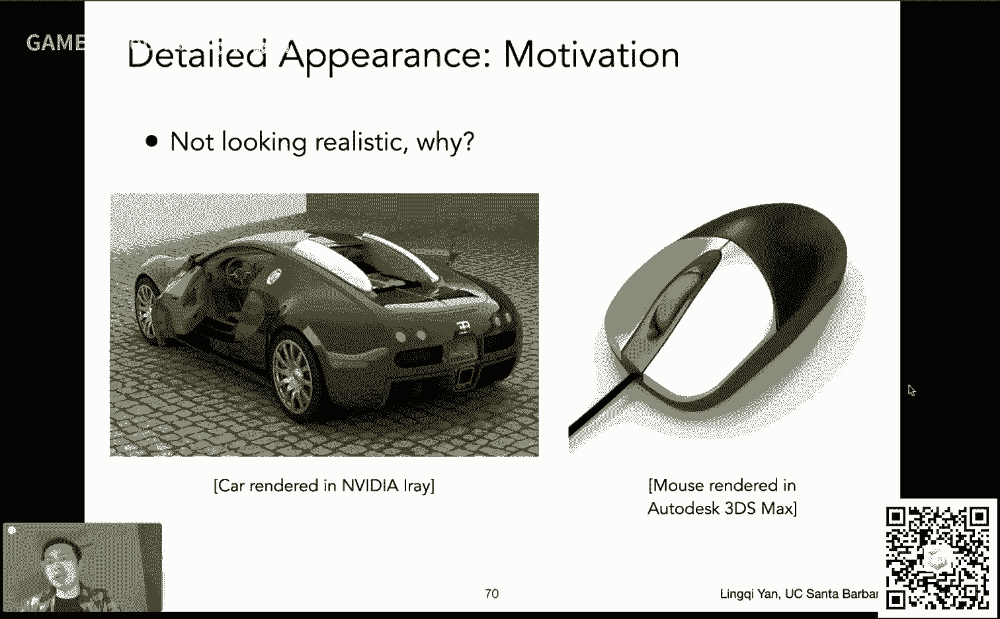

为什么真实情况下确实不会有这种情况，大家现在看到是真实的世界啊，就是说这个真实的世界里面呢，大家会看到这个车子上面会有这个高光，高光周围有类似这种蜘蛛网结构的这种东西，这种东西就是这个划痕。

划痕发生在哪儿，发生在这个空气中，各种各样不同的这些灰尘颗粒和你的这个车外层的那层清漆之间，还没到那个车的这个油漆部分啊，然后就会有这种现象出现，所以在强光照射下一定可以看到这个效果。

也可以看到这个是有一个高光不错，这种形成的高光诶，这个总共这个构成本对吧，所以说呢这些并不是什么这个特别这个这个呃光滑的一些东西，所以说真实世界反倒是不完美的。

但是我们的这个这个描述方法呢确实能够得到一些很完美的结果。

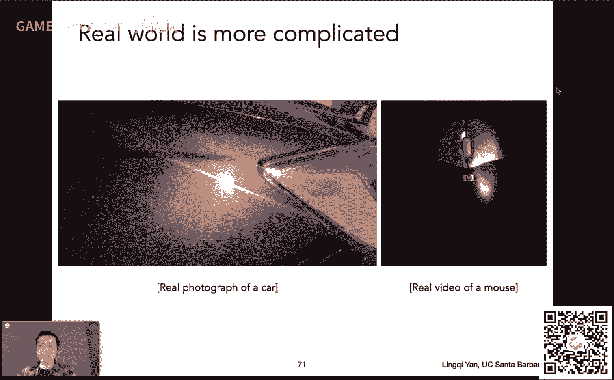

这是什么，这是那个呃微表面模型啊，microphysmodel，我们之前说过他非常强大，比如说结果非常完美，但是之前看那个摩托车也是这么回事对吧，但是呢这不真实，什么是真实的呢，这个是稍微真实一点。

这个是这个是说这个呃我们加入了各种各样不同的这种，这种呃实际可能产生了一些不完美的地方，比如说像这个这个划痕这些东西，大家看到这个有划痕的情况下，旋转起来是可以看到高光还是高光对吧。

但是你还可以看到各个不同的这种划痕，这一第二呢你甚至也可以去模拟这个这个是什么呢，就是物体表面了，然后这个一这个我刷过的这个这个呃所谓各项异性的材质还记得吧，我沿着一个方向去刷这个物体这个金属的表面嘛。

然后大家可以看到这一条一条刷出来的这个划痕都在，所以你能够看到这个很明显的这个高光，它随着你的视角你可以看到不同的这种划痕，对吧，那像这种情况，那就是这个这个细节的模型能够给大家带来的真实感。

那这个就是说我们为什么要研究它啊，诶大家有同学就发现了啊，是这是我的作品啊。

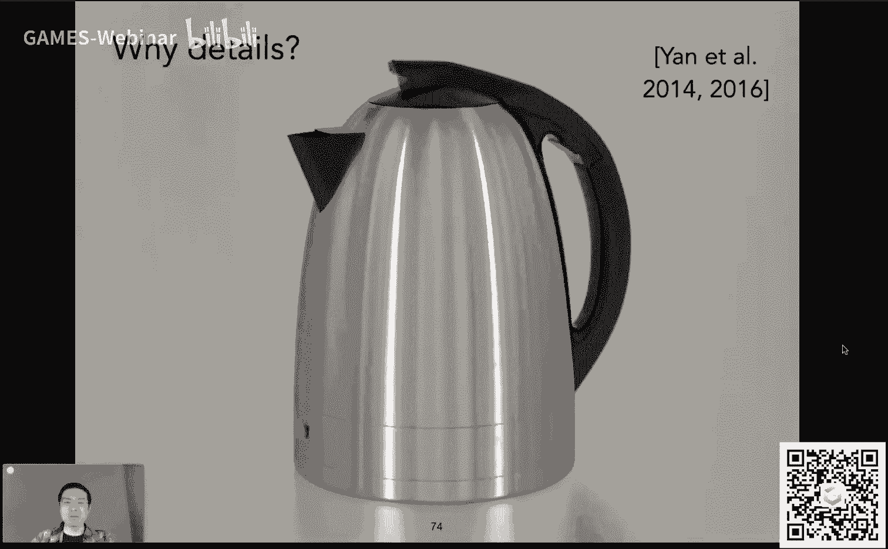

算是代表作啊，应该是说是这博士中间的这几年我的这个呃几个贡献之一吧，就是这个这个这个细节的这个渲染是一个萌发的模型，是一个呃real time retracing，是一个嗯差不多就这么几个哈。

然后这个啊那我们就接着说啊，就是说这个微表面模型咱们之前提过对吧，微表面模型说最重要的是什么呢，是它这些微表面的这个反向分布对吧，但是我们之前提到的是不是就就就说到这儿啊，但是我们说这个分布上啊。

实际上来说大家应该是这个嗯，怎么说呢，就是说大家描述这个分布，他用的是一些非常简单的一些一些模型，比如说我们用一个什么正态分布啊，高斯啊之类的东西去去描述它。

那我用一个这个这个这种分布去描述这个法线的分布，那么得到的自然而然是一个这个看上去并没有什么细节的结果对吧，因为它反向分布本身我就没有体现出各种各样不同的变化，各种各样的细节。

但是其实我们要的是它这个这个法线的分布啊，它基本符合这个这个统计规律。

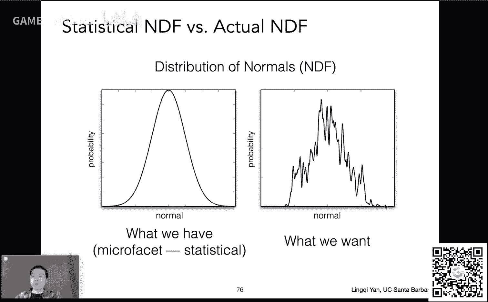

但它又有自己带的这个细节，那如果我们能把这些考虑进去，那自然而然就可以得到这个这个呃好一点的结果，比如说像这里大家看到这个蜗牛啊，在这蜗牛的壳上，我们贴了一个非常大的这个这个呃这个呃所谓法线贴图啊。

之前咱们说这个纹理映射的时候，我们说过这个事情可以定义每一个点上它不同的法线，那么用了多大的反思法线贴图呢，200k乘200k大家自己算一算一算，这是什么概念啊，这个这个是超级大的一个行业。

贴图贴上去之后，那每一个面它可以产生一个高光，所有的高光形成在一块就会变成这么一个大的高光啊，那么如果这个大家从远到近可以看到这个a，可以看到每一个高光都是什么样的对吧。

那就是说确实一个大的高光是有很多高光形成的。

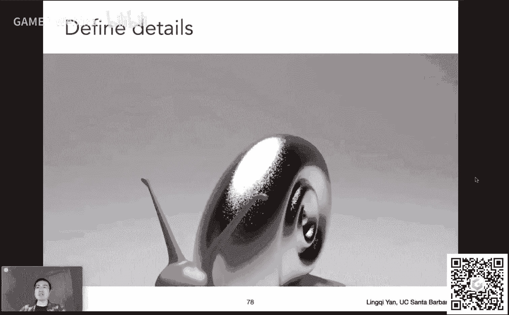

那么同样我们可以换另外一种模型对吧，不同的这种法线，比如说像这里就在模拟这个车子，大家知道这个车子大家有很多人愿意在这个车子里面加呃，不是车子车子的这个喷漆里面加亮片，这个亮片非常非常小。

但是它就会形成一个一个的这种不同的这个方向，不同的方向它就有就有不同的这种反光，得出来的效果就应该是这样的啊，然后所以说会得到这个非常真实的结果啊，ok好。

那么这里呢这个虽然我们可以定义各种各样不同的细节，但是渲染出来他们非常困难，比如说大家看到我真的用pass tracing来做哈，要多久要多久，比如说花了两个小时之后还得不到这个结果。

这个结果咱们认为是这个药的结果哈，然后两个小时之内和开得不到这个结果，那多久可以得到呢，我算了一下这个时间啊，需要大概将近一个月，然后就是渲染渲染在那一个月能够得到这么一个结果好吧。

所以大家可以想象这是一个多么困难的渲染问题，那么它到底困难在哪儿，那么这个根本原因在于我们认为这个微表面啊，每一个小的微表面是一个镜面，那既然是镜面，那咱们如果想象是一个这个呃这个这个呃针孔摄像机。

然后和一个点光源的话，那么我从摄像机打一根光线过去，我打到了什么样的表面，然后我就知道它的法线，我就知道它镜面反射方向是什么，那我就很难很难很难通过反射的方式，让这根光线反射的光线打到这个光源上去啊。

这就是为什么它难，然后这个光源打过来也是一样，它这个达到了一个微表面呃，知道怎么反射，但它就是反射不到这个这个呃这个摄像机上去，那所以怎么做呢，所以这里考虑就是说这个考虑一个像素啊。

它会覆盖很多的这个微表面唉，如果我们能够把这个微表面的分布给拿出来，就是把这个在一个小的范围内，它的微表面的法线分布算出来诶，那这样的话我就可以替代原本的这个光滑的这个分布。

然后并且用在这个微表面模型里。

像这里大家应该听懂都没有问题，然后呢这里这个嗯我如果考虑说一个像素它覆盖了多大的这个范围，那会得到各种各样神奇的这个这个反向分布啊，ndf，然后就是说如果大家想想这个一个像素覆盖了非常多的微表面。

那这些微表面自然而然就会显示出来一些统计学的规律对吧，这看上去就挺圆的，就很像是这个这个高斯分布对吧，那如果说这个覆盖的范围小，它就会显示出来一些很独特的一些性质。

就是说它这个反向分布看上去就很很这个有特点，而且呢不同这个类型的这种反应分布啊，不同类型的这个这个呃这个法线呃贴图啊，然后会引起不同的法线分布，比如说像这种刷过的。

那很显然会得到一系列这个叫做呃各项异性的这个这个分布，比如说像这种离散的这些亮片，每一个这个这个这个亮片都是一些离散的这个发现，那所以我就会得到很多离散的点哎，这就非常有意思对吧。

那所以说我们只要能把它算出来就行了。

当然这里就不给大家说怎么算出来，给大家多少看一看这个得出的结果就好，这是一个这个这个嗯这种模型啊，这个叫什么来着，就是blender，就是一个一个杯子吧，水杯还有一个金属的这个表面。

它一看到这里是一个磨过的对吧，这里是向这个方向磨的，跟橘子皮一样，然后这些都算进去之后，得到的结果就就能够把这些细节都给反反映出来。

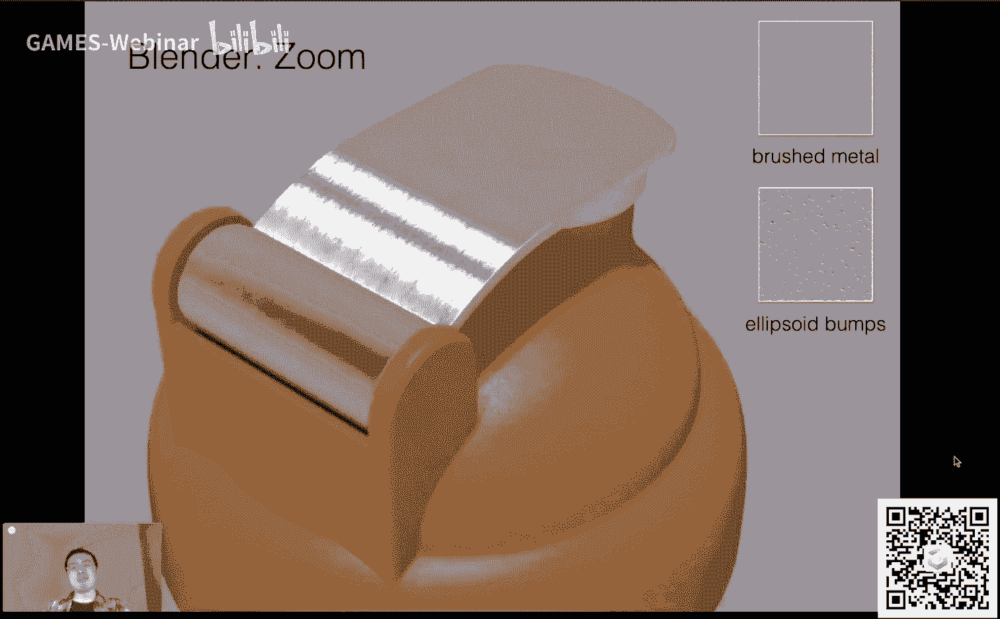

并且呢大家可以看到同样道理哈，任何的这些这些呃宏观的东西都一定是由这些微观的东西构成的，没问题吧，然后这样我们就可以看出来这是一系列的这个这个这个怎么说呢，一系列的点形成了这种现状的高光啊。

ok那么其实来说啊，之前我给大家说过这个事情对吧，就是说我们看一个卫星图是不是拍摄一个地球，那这个远和近微观和宏观是相对的，那如果我们从远处看一个海面，那我可以认为海面的这个这个波纹对吧。

它这个是一个很细节的这些东西，那我也可以通过这种方式把它描述出来，描述出来之后呢，我每一帧用一个不同的细节，那就可以得出这个这个这个海面上的这些所谓波光粼粼这种效果啊，对吧，就是这个意思对吧。

那这样一来就可以得到这么一个效果，然后呢同样道理，这个方法呢也在游戏中稍微得到了一些应用，就是像这里大家看到这个古墓丽影这个三部曲之二吧，我记得是，然后大家看这个雪地啊，雪地大家会看到这个这个位置。

待会我会看的更明显一些，然后会有一些这个嗯嗯这些发光点对吧，当然这里是在实时渲染中的一些应用好吧，然后这里一个ok那么这个这里在这个把这这怎么说呢，就是说这些细节就算是这么解决了吗，答案是不对。

为什么呢，是因为当你引入这些细节的时候啊，其实如果大家还在用这个几何光学来解释就不对，大家这个之前学过物理，这个物理上说什么呢，这个物理上说啊，这个这个这个啊就是说当这个物体啊非常小的时候。

小到什么程度呢，小到和这个光光线的这个波长相当的时候，你就不能再假设光线的传播是沿沿着一个直线传播了，你就得必须假设这个光是一个波对吧，因为会试着叠到各种各样的现象，发生什么衍射干涉这种现象发生。

那这种现象在这种这种微型的这种细节上就会发生，那么有很多人研究过这个问题，然后这个大家看到这些各种各样不同的效果。

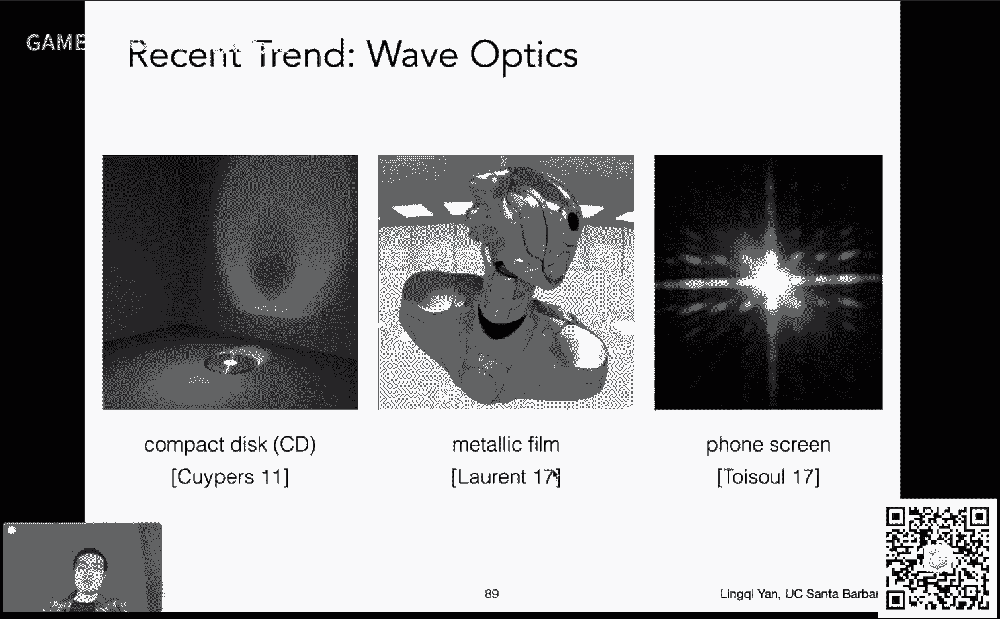

然后当然了，我也研究过这个问题，然后这个这个问题是反映在什么上呢，比如说你在一个小黑屋里面，真得小黑屋啊，其他光源都得关掉，就只能用一个这个点光源，比如说你手机的光去照亮一个就是金属片。

你会发现金属片上金属原本是一个原则，但是你却在这个上面会看到各种各样不同的颜色。

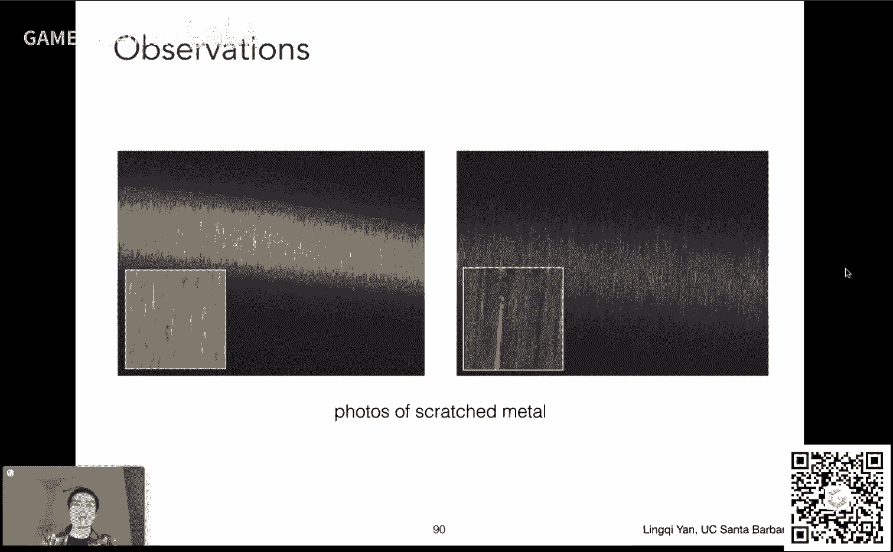

同样道理，你比如说拍这个，我有一个macbook，我拍他的背后哎，我拍出来之后通常是白的对吧，但事实上如果我就用一个光源，然后我放大你能拍出来一张图，然后放大我又看到其实根本不是白的。

是各种各样不同的这个颜色的点对吧，诶那这样的话呢，这个这这这就反映什么问题啊，既然我用白光来照射一个物体，它就反射出来就应该是白的，如果不是白的，一定有波动。

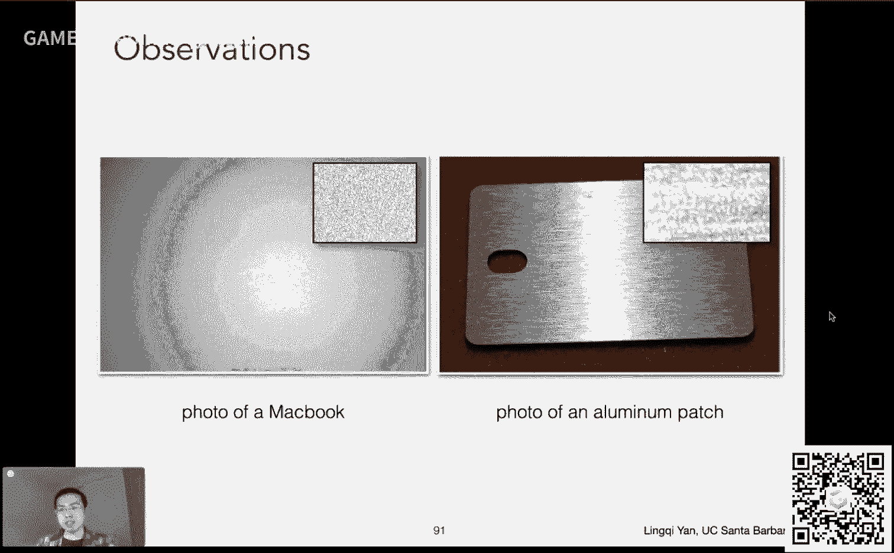

光学发生了对吧，那所以说我们就把这个波动光学给解出来了，我就就说到这儿，波动光学的公式我完全不想提，我的天，我觉得这个完全是劝退的东西，这个太复杂了，这是在在这个叫什么这个复数域上做各种各样的基本啊。

这个非常麻烦啊，不多说啊，大家就看什么呢，看到说波动光学得出的b r d f啊，跟几何光学得出的b r d f挺像的哈，但是又有自己的特点，什么特点不连续的这些特点为什么会不连续呢，大家学过物理。

知道这个光会发生干涉对吧，光干涉会引起有一些地方加强，有些地方减弱诶，它就会形成这么一条一条这种这种不连续的效果诶。

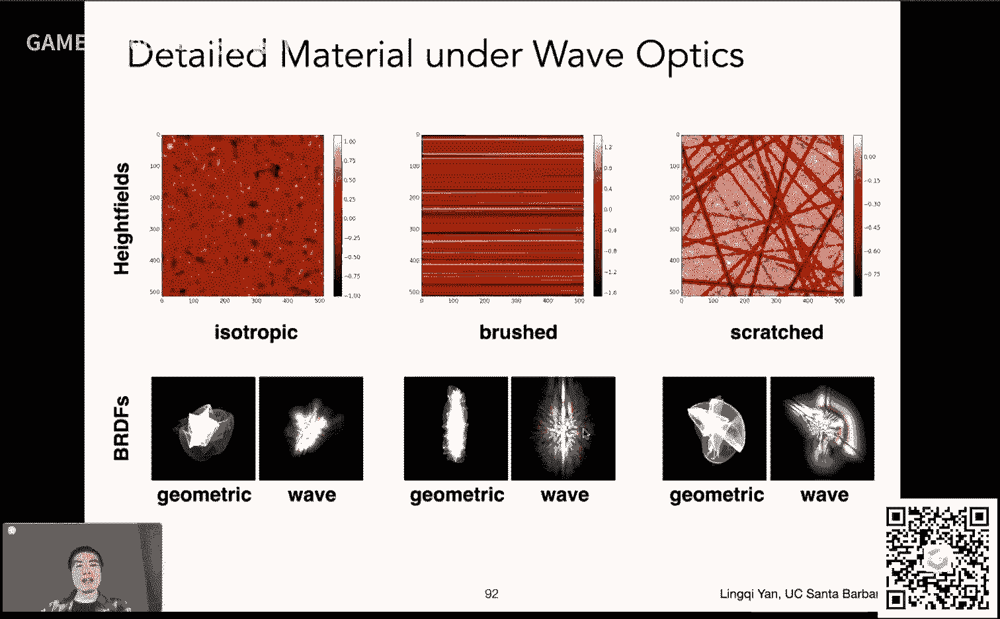

然后我们拿这个东西过去渲染啊，说渲染大家看到这幅图，这个真的是渲染出来的，然后这个这个并不是这个照片啊，然后我把它拿去渲染，并且用这个所谓的波动光学。

然后大家可以看到在我这个放大的过程中放大放大再再再放大，放大到这儿，大家就会发现真的是这样，这个没有什么表面是白的啊，基本来说都是这种这个各种各样不同的这种颜色的这种形状怎么样，是不是非常神奇对吧。

然后这个所以就给大家介绍一下啊，然后这里呢如果大家去餐馆吃饭。

有各种各样不同的这种这种高光，使用过程中产生这种划痕，这种划痕关键是肉眼可见的，可以看到中间是有这个这个呃这个彩色的啊，这个我是说真实生活中是一定可以看得到的好吧，ok那么最后最后最后一个话题啊。

叫做这个呃程序化生成的这个表面或者说材质或者说外观啊，那么这个程序化生成是什么意思啊，就是说我用一定的方式来指导它的生成，而我不需要真正的去生成它，我可以这个动态的去查询它，什么意思呢，比如说这里啊。

我这个我可以定义各种各样不同的这种花纹，比如这个这个这个花瓶啊，这个花瓶，然后比如说我这个这个花瓶打在地上摔碎了，然后我还可以看到这个花瓶内部它的花纹到底是什么样的对吧，我可以定义一个所谓三维的纹理。

但是大家知道这个存储量啊，在三维的情况下瞬间就上去了，我存一张图还行，我存一个三维的体积，在各个地方我都存这么细节的东西，那是不可能的，那怎么办呢，我不存，我什么时候需要用，我什么时候去查。

就好像我有一个空间中的函数f x y z啊，然后我给任何x y z，我立刻可以得到它的f值就可以了，那如果有这么一个函数，那就非常好，而答案是事实上就是有的有那么一些函数。

这种函数呢就叫做noise函数，叫噪声函数，这些函数允许你这个得到一些很神奇的一些noise，比如说看起来像木头纹理的这个noise啊，然后是在空间中的这个我说清楚啊，这个定义在空间中。

然后也就是说如果刚才那个木头的纹额纹理里边砍成两半，你可以看到它的切面上长什么样，那就不行对吧，那么这个用一些这个三维空间中的噪声函数，就可以得到一些这些这些结果，那这个是为什么叫procedual呢。

那就是随用随取的意思啊，就是这么个意思，所以其实翻译成程序化生成也不太合理啊，就是说procedure更多的意思就是说我不生成，我需要用的时候，我去找就好了好吧，然后这就是这个事情。

那么比如说像这个这个游戏里面很多应用的车子上面的这个叫什么，这个秀啊，这些东西就我就可以生成一系列的这种诶，我生成这些噪声之后呢，我可以这个我可以对这个噪声做一些操作，比如说这些秀肯定是有些地方有。

有些地方没有对吧，噪声如果我认为是00~1对吧，那我就认为比如说这个噪声函数值大于0。8的，那我就认为是e，然后小于0。8，认为就是零，我把它二值化对吧，对于这个噪声函数我可以做任意的操作。

这种后期的处理，只要我处理得当，我就可以得到任意的不同的这种效果。

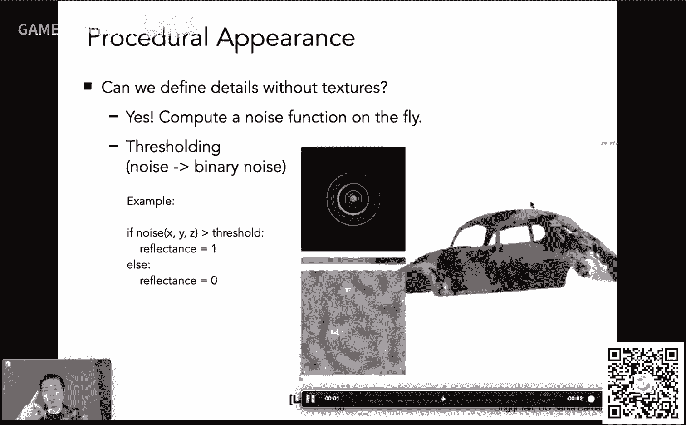

那么这个噪声函数呢，这个普遍大家会应用几种啊。

就目前来说，这个应用最广泛的叫做pin noise，然后之后还会有各种各样神奇的什么，good bye noise啊，各种各样不同的这种噪声函数，但它们的共同点就是这样，你不用管它是怎么样得到的。

就是说它允许你给任何空间中xyz，它会返回给你一个值，就这么回事好吧，那么噪声函数非常非常有用，比如生成地形这么复杂的地形，然后这个山上各种各样不同细节都有诶，这个造成函数就可以做，没有问题。

水面也是一样，然后这个就是不同的这个位置啊，然后就是有不同的这个高度，像这种水面到底应该是用一种什么样的噪声来说，这个都有人研究好吧，然后呢还有这个比如说这个工作台，大家知道这个木头。

因为木头各种各样纹理，它肯定是三维的对吧，它肯定生长这个产生的嘛，那么这个autodesk他们做了一个这个工作啊，然后就是呃可以这个呃生成三维的木头，并且你不用生成。

你可以直接去查询这个三维的木头中间的任何一个部分，然后就是说这个木头你可以任意切割，它都可以得到内部的这个任何的东西对吧，同样道理它就是控制这个函数，它应该长什么样来模拟这个数的年轮啊。

然后书里面各种各样这些传输的这些传导的这个东西叫什么纤维，什么树，我忘了，反正就是说这个他能够把这些真实的这些物理的这些东西啊，和它的这个程序化生成结合在一块儿，可以得到非常非常真实的结果，好吧。

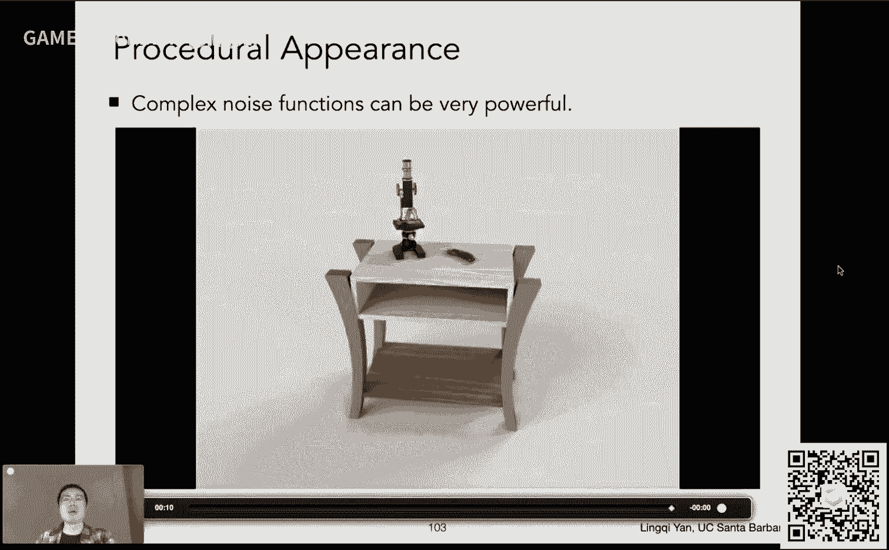

那么这里是它的这个一个例子啊，就是说对于这个吉他来说，在这个这上面的这些纹理完全都没有，之前经过定义，就是直接去查询这个它产生的这个木头对应的这么一个三维的函数，就可以得到，好吧，也非常厉害啊。

那没问题，那这样的话咱们今天这可是说的不少啊，那咱们就说到这儿，然后我现在呢我先看看大家有没有什么其他问题啊，好呃呃对有问题也欢迎也欢迎在这个机问啊，嗯我想一想啊，能量集中哦，这应该不是什么问题。

好ok说有什么高阶的内容之后再讲是吧，那涉及到这个之后的更复杂的这些课，这会有的会有的，然后咱们之前不是说过这个合成安排嘛对吧，咱们之后这个课之后很快会有一个模拟的这个这个课啊。

关于模拟仿真的课结束之后回来有可能是暑假，我来给大家说，要么说实时渲染，要么说高级的这个呃也就相当于是要么说高级的今天讲的这些内容，把今天这些这一节课给拓展到这个呃，每一块都讲清楚啊，嗯这是一个。

然后有同学问说这个程序化材质是不是老方法，并不是一直都有人研究，到现在还是一个很火的一个话题啊，然后这个好吧好吧，我来看看啊，嗯procedure有什么最新的东西哦，最新的东西其实这样说也挺难。

这个这个木头这可能算是它是一个挺是怎么说呢，集大成的一个东西了，然后有一个软件是专门做程序化材质的呀，叫hudi啊，然后这个在工业界得到了很大的应用，只不过它的程序化材质是真的是先程序化生成。

然后你再拿去用啊，是这个意思，它和我们这个理解并不太一样啊，就是我们这个是不用生成，直接去查询啊，ok然后这个ok有同学反映这个没有ri老师的贡献，是的，这这次并没有啊，哈哈哈呃没问题啊，好啊。

然后另外是这么回事，其实我说这个这个也有其他老师的贡献，特别是对于今天的这个这个嗯这这课件来说啊，绝大部分是我在伯克利的时候，作为助教，我做的那节课也是我讲的，是这么回事啊，就是说这个这个今天拿过来。

然后再加了一些新的东西啊，是这么个意思好吧，然后呃波动光学的渲染能讲吗，不能不能真不能啊，这个波动光学讲完要死人的，这个是你们要是感兴趣的话啊，感兴趣的话访问一下我的个人主页。

你随便点点一个这个点一个这个我的波动光学的这个文章，你看一眼就行了，你觉得能看下去，我就给你讲怎么样，唉这个这个简直了，prostring是肯定是这个我们不是说了嘛对吧。

然后复杂的光线传播我可以讲没问题啊，好啊，那ok那没问题，那这样的话这个这个呃咱们今天就说到这儿啊，然后咱们之后这个这就算是这个呃复杂一点话题。

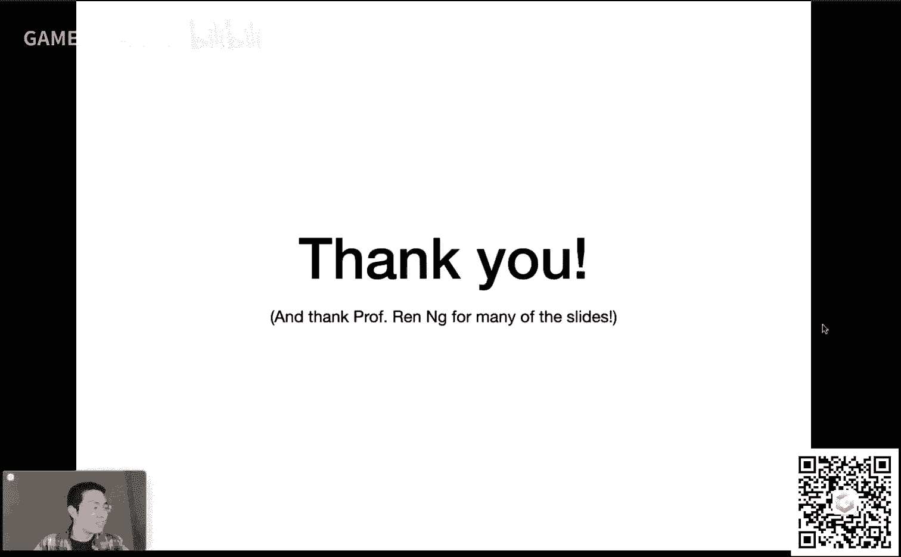

但是就是就是随便听一听啊啊，那咱们之后把这个时间交还给技术这秘书同学，然后好感谢各位同学大力支持。

咱们下节课再见啊。

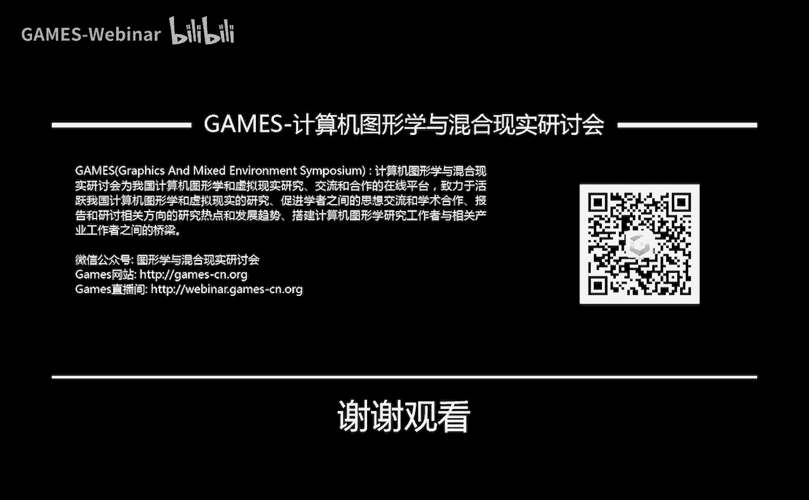