# GAMES101-现代计算机图形学入门-闫令琪 - P21：Lecture 21 Animation - GAMES-Webinar - BV1X7411F744

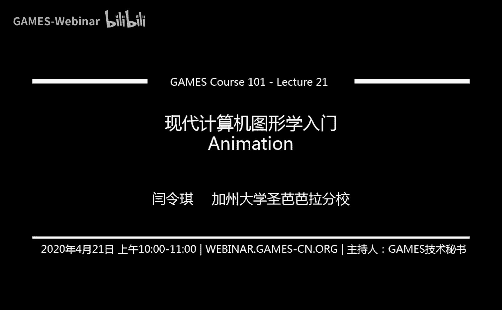

各位同学大家好啊，咱们今天给大家说本课程的第21讲，我们开始进入到第四个话题，也就是嗯，这叫什么来着啊，动画啊，动画与模拟这一块儿好，然后嗯咱们还是一样，在课程之前有几个事情，然后给大家说一说啊。

什么呢，关于作业啊，作业七目前有95份起叫挺好的，然后呢啊我没想到哈，所以大家更愿意去在我们给定这些范围内去选大作业的参考题目不错，也没有什么问题，就是目前来说有18个同学提交了。

说这个我有不同的想法啊，很不错，如果你真的愿意再继续提交的话，没问题啊，就是说嗯你也可以随时联系我，说我这个突然想做某个什么项目行不行行，其实应该是可以的啊，啊另外有同学反映大作业有没有框架呀。

有呃不是有啊，是是是说这个框架我们不再提供，就是说你自己随便去找，是这个意思啊，你可以用任意的这个已有的框架，然后或者说就用咱们之前作业的一些框架都没有问题，好吧啊，这是一个关于大作业啊。

然后另外一个事情是我自己发现的啊，我自己发现我自己有一个坏习惯，坏习惯之你分享给大家啊，这个有错，我这肯定要承认什么呢，就是说我用这个，你看我又用了，我用这连词用的用的非常频繁啊。

然后特别是刚才大家听英文的时候说了很多ok和so对不对，然后这边也是嗯嗯怎么说呢，老外平常他们也会这么说，会是会用很多各种各样的连词，很奇怪的这种用so当作发语词之类的。

然后我自己听了一下我之前的中文的讲座，我会发现我经常会使用这个和，然后对不对，然后呃好吧，所以说呢嗯这块儿我自己的感觉是这样的，我自己在高速思考的时候，然后我实在是注意不到这个事情，然后你看我又用了。

然后所以不管怎么样吧，我想办法来避免他们好吧，但是从另外一个角度上说，如果我再这么用，就说明这块的逻辑应该不会有问题，因为我在思考啊，怎么样把这个事情说清楚啊，好吧，那就这样嗯，咱们看一看啊。

回到课程内容上来啊，我们的课程呢之前说有四个不同的方向啊，四个不同方向我们提到光栅化是最早的，我们说我们不叫open gl，我们来说这个光栅化是怎么样实现的，然后自己也可以去做，然后学完这块之后。

自己肯定可以掌握open gl的基本用法，没有问题吧对吧，然后呢我们提到几何怎么样表示曲线曲面，然后之后我们又回到说渲染这个方向，然后我们提到更准确的渲染，所谓呃这个渲染方程，然后以及呃光线传播。

对不对，然后复杂的一些呃光线传播方法也给大家提到材质对吧，那咱们今天这个在讲完了两个额外的一个话题之后，对吧嗯一个是颜色，一个是所谓啊相机啊，广场啊这块儿的事情对吧。

嗯然后今天呢我们开始进入第四个话题啊，叫做呃叫做动画，或者说模拟，或者有人说仿真其实是一回事啊，然后就是说我们在计算机图形学中，我们目前所说的所有东西都是基本是静态的对吧，你已经有了一个场景。

你怎么样把它给表现出来，包括这个呃几何，我怎么样拿各种各样不同的这种几何形状来描述它对吧，然后包括给定了几何之后，给定了光照之后，怎么样把它渲染出来，让他看着真实，那么现在就有一个问题说这些场景啊。

这有很多这些而运动的这些东西啊，我们应该如何表示啊，然后他们是怎么算出来的，怎么做出来的对吧，这就是我们要关心的这第四个话题，然后呃那我们今天就开始说这个事情，好吧好啊，来我来看看在今天的课前哈。

有些同学问问题，然后嗯有没有问些这些问题，有同学说反映我这么说没什么问题啊，这也还行，感谢大家，我自己发现在b站上面看，如果用1。5倍速或者二倍速来看的话，好像是中间这些连词并不是什么大问题啊。

有同学反映右下角这张图的sp p有多少，这张图是用photo map来做的哈，然后这块其实我也不知道有多少，但是最后得到一个相对干净的一些图，至少肯定如果你用ptracing得用嗯。

应该是1k sp里以上啊，嗯有同学问嗯，大作业的截止是哦，大作业的截止时间没问题啊，大作业是这么回事，就是有很多同学反应要要延期啊，我现在非常倾向于延期，如果说没有什么意外的话。

我可能下节课我就会给大家通知，说会这个延期一周或者更多的时间好吧，那那这块儿大家暂时不用太担心这个事情，好啊，没问题，那就先这样啊，那咱们进入今天的正式话题哈，今天其实内容还是挺多的。

然后我希望留出来更多的时间给这个下一节课啊，那么今天我们会讲啊，计算机动画入门，然后我们讲些什么呢，大家可以看到我们会讲到计算机动画的历史，我们会讲他的一些啊基本的制作动画的方法，比如说观点之争对吧。

然后我们也会说一些关于物理模拟的最基本的思想，然后关于运动学和这个所谓reading到底是做什么的呢，然后今天我们一个给大家介绍，然后这两节课的主要安排是今天的课我们会主要说呃一些基本的概念。

然后下一节课咱们主要说解法是这个意思啊，下节课和嗯目前来说学术界的研究可能更接近一些，今天的课呢相对有趣一些啊，这个这个意思首先呢我们既然提到动画，那么动画是什么对吧。

那么动画最初它的定义是reanimation，它定义就是说把一些物体变成活的对吧，然后什么让他活的呢，就让他们能够动起来对吧，那么动画是作为一种这个交流的一种工具。

然后呢给别人展示各种各样的这个动起来的东西，然后呢本身动画更关注的是所谓美学，它看起来好看不好看对吧，同时呢大家想早期作动画肯定是手画出来的，然后大家并不太关心说我这画的到底对不对啊，是不是符合物理啊。

这让它看起来差不多对，那就差不多对吧，所以从一开始来说啊，动画是做这么一个事情的，然后呢我们在图形学里也可以把动画理解成什么呢，理解成对于建模，或者说这个啊几何啊它的一种拓展呃，什么意思呢。

就是说我的动画无非就是说我在不同的时间或者不同的帧，它有不同的几何形状，对不对，我动画就是说我为了得到这些这些不同的几何形状，我应该怎样去做，怎么样去计算，但是算出来之后，我无非就是每一帧有不同的图。

也就相当于我们把3d的模型给延伸到了一个，嗯时间的一个维度上面去对吧，这么理解也没有问题，那么动画是怎么样形成的，很简单，我就只需要把很多的图按顺序按一定的速度去播放它就可以了。

因为人眼呢咱们之前说颜色有一个视觉暂留的效应，就是人们看到一个图，它会记忆一点点时间，然后呢这就说明我们不需要在整个一个时间范围内去呃，非常非常非常集中的去采样对吧，我只需要嗯比如说对于电影来说。

只需要每一帧我放24张图，也就是24fps对吧，就是呃每秒钟我播24张图，然后我就可以让人觉得他是一个很连贯的一种呃动画了，然后呢对于正常一些的视频，就是平常大家一提视频啊，经常会提到说呃。

我需要这个30fps，就是每秒钟要有30帧，这样看起来更流畅，然后又有又有的这个比如说我们要打游戏，我们打游戏呢，我们要求这个体验要比较好，我们要求得这60fps，如果打的游戏是这种射击类。

要求要求非常高，要求连贯性非常高，现在甚至会到这个144Hz，也就是144呃，这张图每秒好吧，是这么个意思，然后呢有一点我特别提一下，就是关于虚拟现实的事情，那么虚拟现实这点啊。

嗯为了让人们嗯戴上头戴式设备看这些呃，其实是离自己很近的这些东西嘛对吧，然后为了让人们看头戴式设备觉得不晕，有很多不同的要求对吧，咱们一开始其实应该提过这个事情，就是说有很多要求，但其中我们提一点。

我们听其中提一点呢，是就是说啊他对帧率的要求非常高，就是你要是觉得不晕的话，它必须非常流畅，两个眼睛都必须达到90fps啊，这就说明啊不同的应用对吧，它对这种动画它的要求是不一样的啊，那么对于动画啊。

咱们这个入门说到这里哈，那咱们现在可以看看动画到底是怎么样呃，这个逐步发展过来的对吧，那么早期的时候啊，人们发现了这个早期的人类在洞穴里面这些壁画，然后大家可以看到呃，语言古的人类啊。

在这个墙壁上画了很多各种各样不同的图，然后如果我们把这些图都给截下来，然后我们把它在一块播放，我们会发现啊，这里画的是一个动态的狩猎的图对吧，好像是在打猎一只鹿对吧，然后所以可想而知啊。

早在公元前多少多少年，我们就已经可以做出这样的动画了，然后那时候人们也明白，这个动画其实无非就是在不同的时间，然后有不同的图，然后把它播放出来，没错吧，只不过那个时候没有播放设备而已。

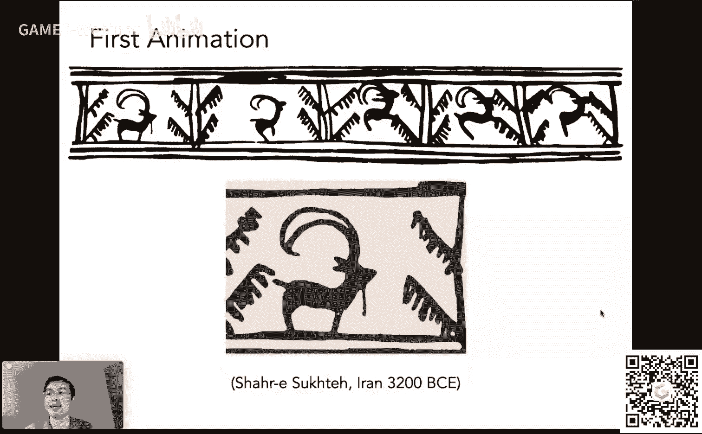

对吧好，那么那是那个年代，后来那人们就发现这个事情啊，就是说这个随着科学的各种各样的进步，人们想办法去人为地制造一些真正能够看到的一些动画，怎么做呢，很简单，最早期啊有一些圆盘类似的这种呃物体啊。

然后这个圆盘固定在某个中心，它可以旋转旋转的，然后我们可以理解成在六点钟方向就是这么个位置啊，有一个小的窗口，也就是说你只能通过这个窗口看到的那么一小块儿看到什么呢，就是这边的图，然后呢我转动这个圆盘。

那也就是说不同的时间我肯定会看到不同的图对吧，那如果说我调整这个速度，调整正好我就会看到诶，正好在某一个时间它会显示某一张图，我就可以看到一个动画，这就是早期的一些这个动画的一些做法，对不对。

然后这个其实大家小时候应该也玩过对吧，经常经常会在输液呢这个书书的脚上画上一些图，然后大家就用手这么一划，然后人家可以放出很多种很多张图，然后做这个动画，我小时候就玩过啊啊原理是一样的对吧。

就是呃显示一些图按一定的速度，那么嗯到了一定的这个科学技术发展的阶段了，人们就开始真正发明了电影的技术，只不过呢最早期这个电影技术并不是用来娱乐的，而是用来当做一种科学的研究的设备。

比如说这里呢大家可以用电影去拍一个呃这个奔跑的这个马对吧，我们就可以研究在任何一个动态下，这个马的这个四肢它应该是一个什么样的摆放，我就可以把这个生物学的这些事情给研究明白对吧，只不过渐渐的发展呢。

人们发现人们非常喜欢看这些动态的东西，所以渐渐的这个电影业就变成了娱乐业，就是这么回事好吧，那么这里呢就是第一个所谓科学的这个研究造成的第一个电影啊。

好啊，那么还有一些里程碑式的作品啊，简单给大家介绍一下，我们嗯提到动画，提到电影其实本质上是一回事，只不过是内容上多少有区别对吧，那么我们放在一起考虑，那么我们考虑第一步什么点什么样的动画呢。

第一步这个啊所谓feature lance的动画，feature length是什么意思啊，就是说完整长度是相当于是跟电影长度一样的动画，大家可以理解成剧场版啊，这样理解就没有问题。

那么这是第一部手绘的这个剧场版动画，这么理解吧，嗯什么呢，就是白雪公主和七个小矮人，然后这是手绘的手绘的，什么意思，大家可想而知对吧，每秒钟我要放24帧，那我就得每秒钟把这24帧的这些图都给画出来。

放在一块儿，然后播放对吧，那么画这些图要花多长时间呢对吧，那咱们待会儿会给大家介绍，那么这确实至于第一步啊，手绘的嗯，对咱们理解成呃feature length的动画好，那么计算机本身呢也可以生成动画。

只不过这个其实发展的比大家想象的还要早，大家可以看到这么一个视频啊，这个视频他其实用了一个这个早期的非常非常呃古老的一些显示器啊，然后也可以上1963年，这是什么概念对吧。

然后这时候就已经有这种呃类似这种触控笔之类的，只不过不是触控对吧，应该是这种遥控，然后它可以做各种各样的旋转缩放啊，然后可以很精准的定位，大家可以看到这个呃圆锥的这么尖儿对吧，对上这个不同的这个点。

所以做得非常好。

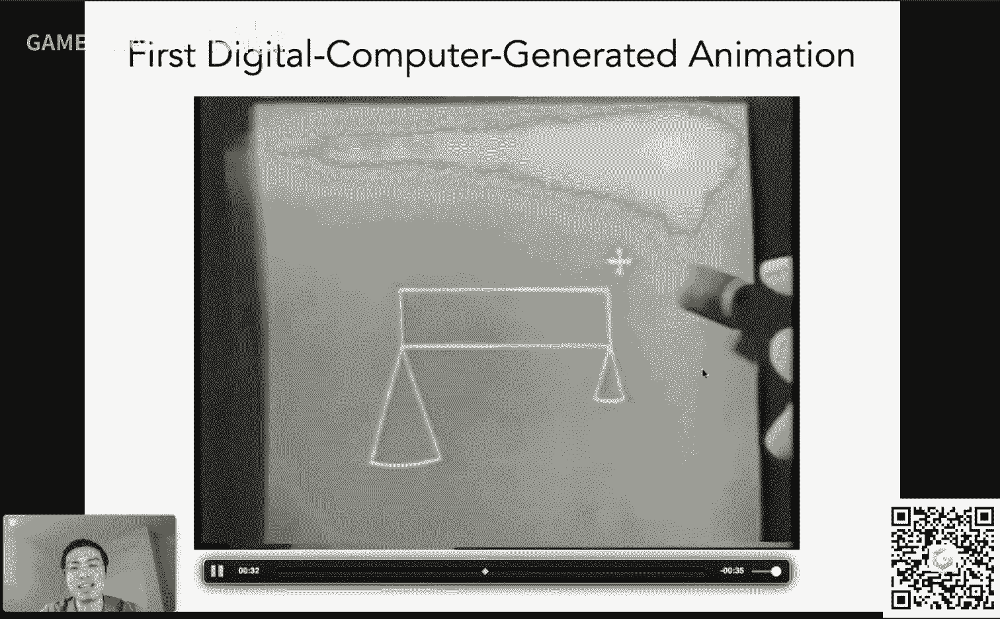

也就是说那个年代就已经可以做出所谓的数字的动画了对吧。

所以想想当时科技是发展的是非常厉害的，那么呃后来呢有一些大神的啊。

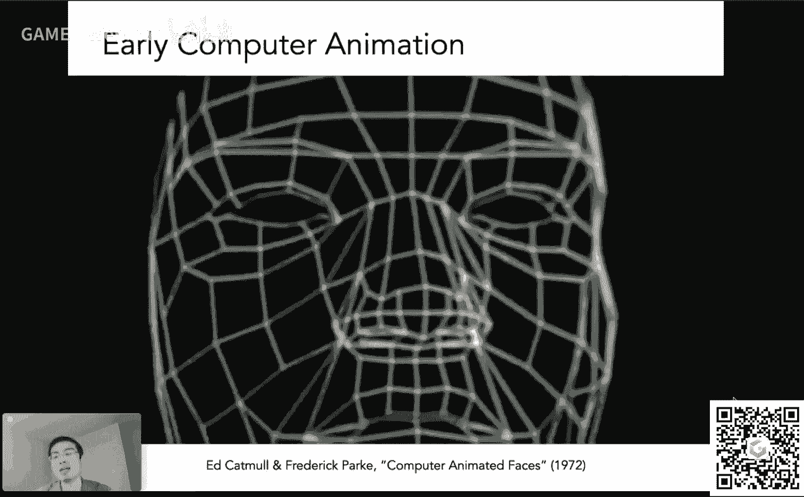

他们还做了一些这个各种各样的其他工作，比如说这里呢大家看到的其实是在一个呃这呃在显示一个什么呢。

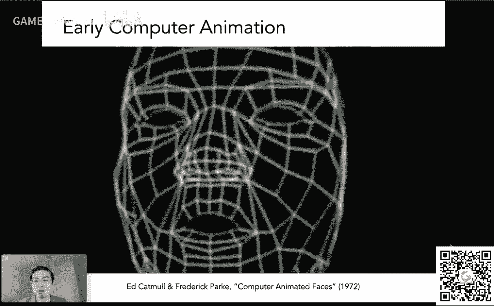

在显示一个人脸的这三个我们格的模型，这是后来的，大家可以看到这个作者是谁对吧，ed cal是不是很熟悉诶，正好被挡住了啊。

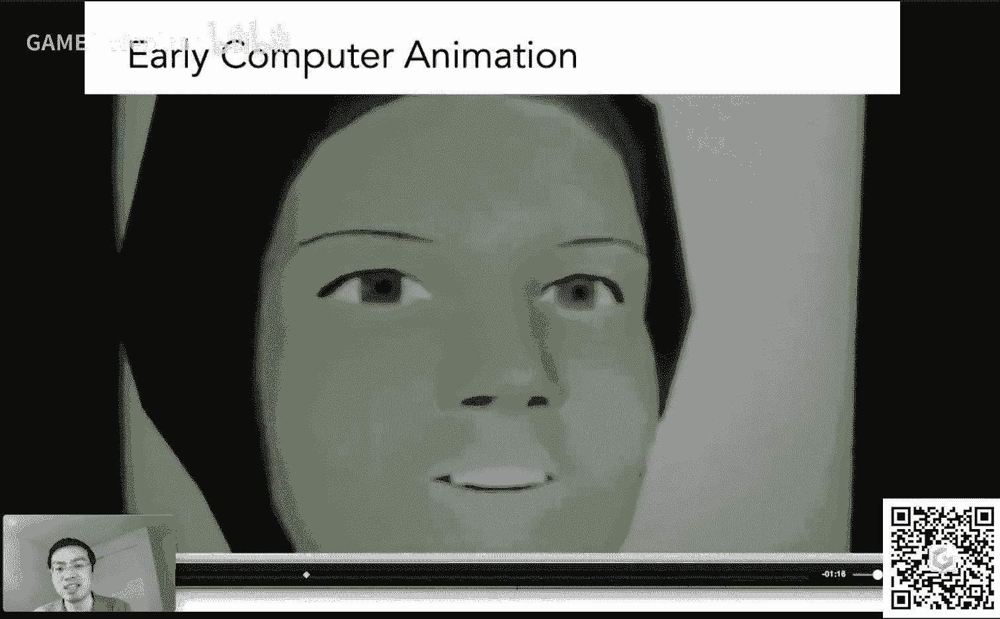

没少啊，就是说这里算是这个非常非常早期的一个这种计算机动画了，用当时的计算能力。

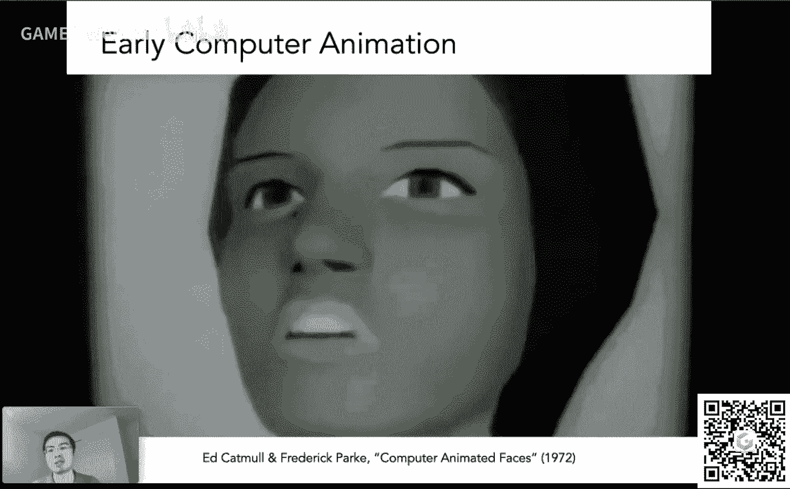

当时数量的多边形大家可以想象，但是已经可以做到各种各样人物的这种面无表情的级别了对吧，然后我刚才说了，让大家看这个人物是谁，如果大家还记得的话。

哈哈哈，这位就是就是这个图灵奖今年投影奖的获得者之一哈，at cat o，咱们之前还学过他的co呃，clark的subdivision算法对吧。

对表面的对多边形细分算法好，那么在这个科学技术啊渐渐渐的进一步提高的过程中，然后人们就又做出了更多更多更酷炫的东西，比如说另外一个里程碑式的作品是侏罗纪公园，那侏罗纪公园，但这个电影虽然相对古老哈。

但是嗯不管怎么样，当时是30非常非常轰动一时的一个作品啊，他们真正的把这个用电脑生成的恐龙直接给放到了这电影里面对吧，还是算是一个非常非常非常大胆的一个尝试，并且效果非常的真实，当然了。

那个年代你们看上去分辨率啊，各种各样的都不怎么样，然后画面整个比较暗，然后我们看到这个恐龙会觉得说诶挺真实的，现在我们但是这么看过去其实有点不太能看对吧。

那就说明大家审美观其实也在随着科技的发展而也在进步着对吧好，那么这是也算是一个里程碑的作品哦，我们把这个声音关起来了啊，然后呢我们这里要给大家提到另外一个里程碑，那什么呢，就是皮克斯做的玩具总动员。

那么玩具总动员他到底是反映了什么呢，他就是说整个一个电影完全都是用计算机生成的，所谓cg这里应该是指computer generated的啊，用电脑生成的呃。

feature lap也是就是完整长度是一个电影长度的这个动画电影，那么他是第一个，所以它是里程碑式的作品，那么这里多给大家说一句啊，这里呢生成阴影，然后这各种各样的这个呃效果吧。

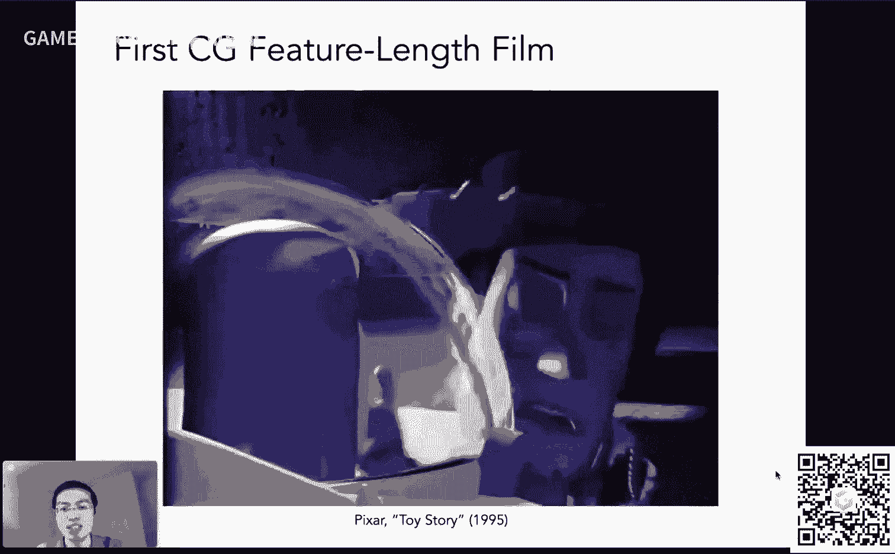

就是说他用的还是黄山画啊，就是那个年代还没有光线追踪啊，然后用的是光栅化的方法，然后已经可以生成这么一种效果了，所以说我觉得如果大家做做大作业，是不是也应该瞄准这种效果来做，对不对，哈哈哈哈呃好吧。

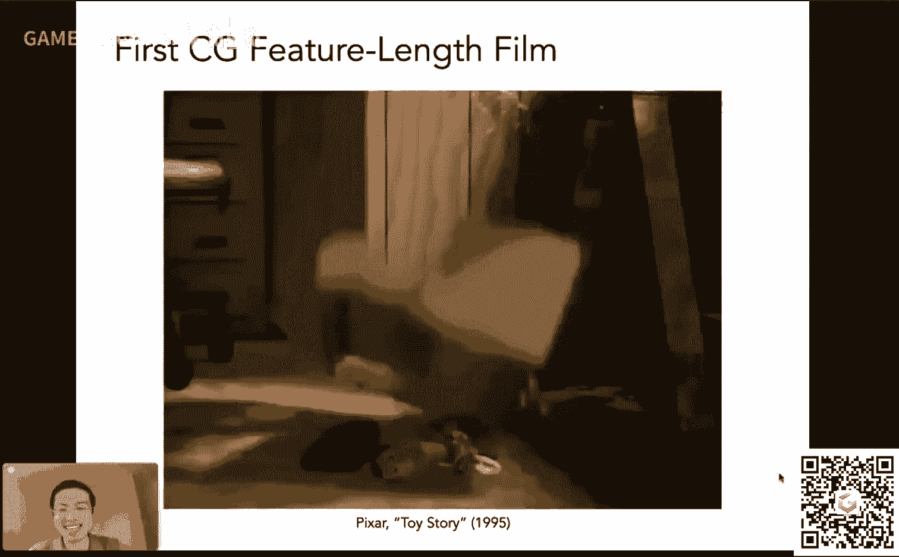

不管怎么样啊，另外一个里程碑，那咱们可以看一下，到了10年前。

动画发展到了一个什么阶段呢，就发展到一个已经看上去非常非常不错的一个阶段，但是这个电影没什么太大名气哈，就是说呃大家可以看到是天上在下这个观正啊，然后主人公非常开心，大家可以看到bug掉到水里面。

这个模拟还是现在做的并不是特别好对吧，这10年10年之前啊，水面上起的这种思维涟漪，然后效果这个看起来仍然不是特别的真实对吧好。

然后呢，那咱们到了这个现在也不是现在去年去年呢，这是冰雪奇缘二，大家可以看到这里呢就充满了大量的细节，比如说这个植物上面的各种各样的花瓣啊，然后草地啊，然后各种各样的特效啊，比如说这个火焰，像这里呃。

这风暴啊这些东西对不对，然后就是说现在的动画电影里面包含的技术是越来越发达。

然后现在做出来的东西嗯。

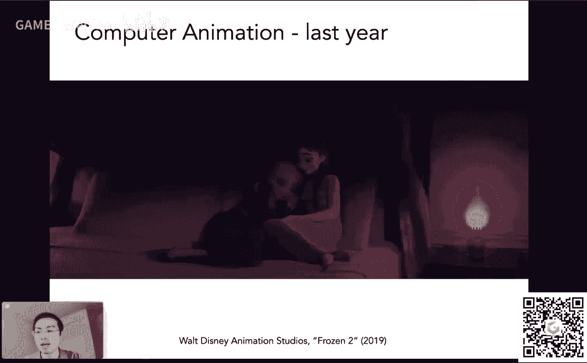

考虑到是这么回事，首先呢它是动画，它有很多东西啊，需要做一些这个呃就是看起来像动画的一些操作，所以说他并不要求说严格意义上要基于物理。

要看上去非常非常真实，他要求要看上去非常非常像动画，是这么一对吧。

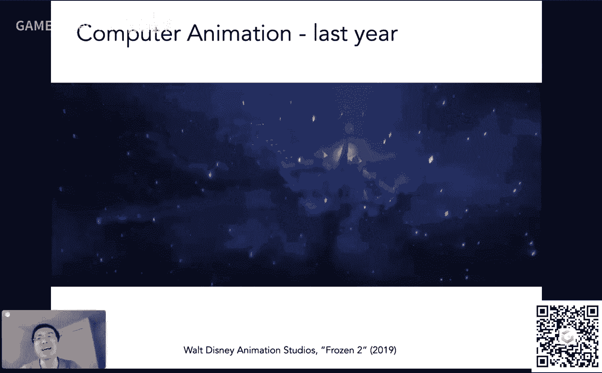

但是不管怎么样，现在的技术已经这个远远不是之前可以比较的了。

那没问题，那简单给大家介绍了一下啊，动画的一些基本历史哈，那么啊我们下面来看什么呢，我们来看动画是怎么制作出来的对吧，那首先我们要提到的一个事情就叫做关键帧动画，那什么叫关键帧呢，关键帧其实很好理解。

什么意思呢，我们可以看这么一个对比图，比如上面这一行的其实是一个人物，他在不同的时间它有三个不同的动作，然后呢我们下面这个图其实在干什么呢，相当于在两个动作之间呢，我补出它这个过渡的动作。

大家可以看到对吧，就是中间这个对应的这些位置，啊我们可以理解成哦这些位置是重要的位置，然后这些对应的真就叫做关键帧，keep frame，然后在中间的过程呢，然后就会呃我们希望得到一些过度的一些结果。

比如说这里大家看到这个人举了一个钩子，对不对，然后他渐渐的举越举越高，正好举到这里，所以这个钩子运动按说是应该有一个这个呃一种一种渐渐的一种变化，可以变到这一帧来对吧，那所以中间的这些过程都不是关键帧。

就是关键帧能够定义整个这个动画的走向，差不多是这么个意思，那么关键帧动画是怎么做的呢，大家，可想而知啊，它是一个它是一个费时费力的过程啊，就当年最早期的时候。

那肯定是由最厉害的这些艺术家们来画出这些所谓关键帧，然后他们会有一些手下，有些助手，对不对，这些助手们然后会帮忙把这些中间的这些真给做出来对吧，直到现在也是一样的对吧。

现在这些漫画家们他们画画出来的各种各样的啊，那就是一格一格的漫画嘛对吧，然后如果要做成动画的话，那势必有大量的人力投入，要做出来各种各样中间的这些过程，对不对，然后这些风格也需要统一，然后就是说每一。

个这个艺术家他们工作量都非常大，然后呢我想起了什么一个事情，就是我小时候啊有一款软件叫做flash，这个flash呢红极一时啊，就是它可以做什么呢。

它可以做的事情就是自动生成这个关键帧和关键帧之间的过渡，也就是说如果你想做一个动画，你给他说干关键帧啊，中间只要它中间过程不是特别复杂，它就可以自动的算出这个呃中间的一些过渡应该怎么做。

所以当时很多人喜欢玩这个自己做自己的各种各样动画啊，当时我也学过一点点，然后只不过我自己的艺术细胞相对少一，些，然后暂时这个不是特别擅长这一方面啊，但是不管怎么样吧。

就是说反映了人们对这个自动化生成这个中间的这些过度的一些追求，对不对，然后就是如果中间的过程当真可以都通过自动化的方式实现，那是非常好，如果不能的话，至少也可以帮助这些助手们减轻很大的压力。

然后在这个呃自动生成的基础上改一些东西就可以了对吧，那所以这自然是一个方向啊，那么我们现在回到关键帧的技术上来，那么关键帧我们刚才说了，它无非就是说给定了一系列不同的帧，中间我们要，插值出来。

这就好像什么呢，这就好像我认为啊每一个真里面啊有若干重要的点，然后这些重要的点在其他的针都应该是长什么样的，对不对，然后我把这些重要的点呢，他们一对应之间的关系找出来之后。

我们就可以把这些这些点在不同的帧中间通过差值的方法算出来，但差值的这这个肯定很容易想到对吧，我比如说我有这个第一针和第十针，那么它对应的这些点都应该在哪里，假设我们知道，那么它中间第五针它肯定在正中间。

它它不一定是在正中间啊，就是说他肯定在中间的，某个位置就是差值是一个和也是一门学问哈，就是说我们之前交过所谓线性差值，那当然是最最最最简单的，大家看到这里面的过渡就已经不是线性了对吧。

他不是说从这儿连一条线到这，它已经有一个某一种什么样的过度了，当然这里的过渡怎么样，看着自然怎么样才是真实对吧，这就很有讲究，那就是这么回事，所以呢嗯关键帧动画本质上就是一种差值的技术，就是这么回事。

我们刚才说啊差值很多方法对吧，那线性的差值是什么呢，给你任意的啊连续的这些点对吧，然后你可以，把它连起来连成线段，那自然而然就是一个差值了，你形成了一条光滑的曲线，没有问题对吧。

但是呢有时候人们会希望要求更好的连续性，比如说要求c一对吧，大家还记得这个概念吧对吧，就是说我要求在这个地方不要突然拐弯对吧，要求他们的速度到达这一点的时候也是要一致的，然后比如说到这里。

由于动画的需要，我需要他这么变化，可以没问题，就是说啊就是说希望有一种东西能够控制这种差值的效果，那么这个时候这种曲线或者样条就是非常非常重要的，这也就是说这。

个动画和嗯我们之前所说的几何这块是非常非常有关联的，是这么一个意思，好吧好，那么呃我们刚才说到了这个关键帧动画是最最最最最简单的做法，没错吧，中间就是差值，只不过那是人为的方式还是自动的方式。

那么更多的情况下，人们是怎么怎么做的呢，人们用的是一种所谓叫物理模拟或者叫物理仿真的一个方式，就simulation模拟或者仿真一回事，那么物理模拟是是怎么样一个运作方式，那么理简单给大家介绍一下。

那么最简单的物理对吧，是牛顿的运动定律，大家都知道怎么呢，就，是说我应用在一个物体，它有一个质量对吧，可以认为这个质点啊，它这个物体呢这个有一个质量，我应用在这个物体上一个力叫做f。

然后呢它就会获得一个加速度，然后他们的关系就是f等于ma，然后大家知道有呃有加速度我就能算速度，然后有速度我就可以算位置，也就是说我基本上只要知道了这个物体上面有什么样的利益，以及它的一些初始条件。

比如说他一开始的位置在哪儿，一开始速度如何，然后我就应该可以动态的能够更新他们的这个下一个时刻它的位置，对不对，我，可以算得出来，这怎么算呢，就是用这个物理公式，那所谓模拟或者仿真啊。

其实就是在这个嗯推导，或者说我实现各种各样不同的这种物理公式，然后用作这个模拟来运来计算出一个物体，它应该有一个什么样的一种形状上的变化，就这么一个意思好吧，或者位置上啊，那么f等于ma大家都知道对吧。

然后f等于ma呢，然后这里比如说我扔个小球，我从这个位置往某个方向扔个小球，大家会知道它会形成一个抛物线对吧，最简单的道理是，因为他始终受到一个呃重力的作用，然后它的受，重力的作用呢。

它自然而然就会有一个加速度，然后有有加速度的，然后就影响速度，有速度就影响位置，那么这是一个简单的情况，那么对于这个衣服来说，因为大家看到这个衣服，衣服呢它这个是用各种各样的网格来形成的。

那么我自然也知道什么呢，我自然也知道这个任何一个位置上，比如说我认为这个顶点上它有一定的质量，他肯定要受到重力，他肯定也是因为和其他的这些顶点相连，他肯定也会受到来自于其他的点的各种各样的作用力。

那没关系，道理是一样的，虽然它复杂，我，们把所有的力都给考虑在一块儿，我们自然而然就可以算的加速度，算出来之后，我自然而然可以更新速度和位置，这都没有关系，只要我们能够正确地把它的受力的模型给建立出来。

没错吧，那这就是呃就是我们的物理仿真它背后的这些呃数学啊，物理啊这些模拟的思想好吧，那咱们可以看一个实际的例子啊，这个例子就是一个呃衣服的一个模拟，或者说布料的一个模拟。

然后大家可以看到这个角色他是穿着某个衣服，他可以做各种各样的动作，然后呢这些呃大大家知道哈，比如说，嗯他在做各种动作的时候，然后这个衣服为什么会跟着他的这个手和脚会动呢，那自然是因为这中间会有摩擦力啊。

然后中间会有各种的压力啊，然后把各种各样的力都算出来之后呢，自然而然就可以得到正确的结果，对不对，那这里呢简单给大家补充另外一个这个说法啊，是这么回事，就是说如果你模拟的好的话啊。

就是说正常情况下你绝对不会出现这些反物理的现象，比如说什么呢，比如这个衣服，然后进到人身体里面去，然后像这个裤子，然后他跑到这个就一条跑到另外一条腿，上去这种正常是不会发生的啊。

这种情况下我们在这个就比如说打游戏里面，我们会经常会管这东西叫做穿模模型，穿到另外一个里面去啊，就是说你模拟的对的话，不会出现问题，这里呢肯定涉及到大量的所谓碰撞检测之类的这一类这一系列的问题。

但不管怎么样啊，我们回到这个呃模拟预防针这个话题上来，只要你能够正确建立它的物理模型，自然而然可以通过解一定的方程。

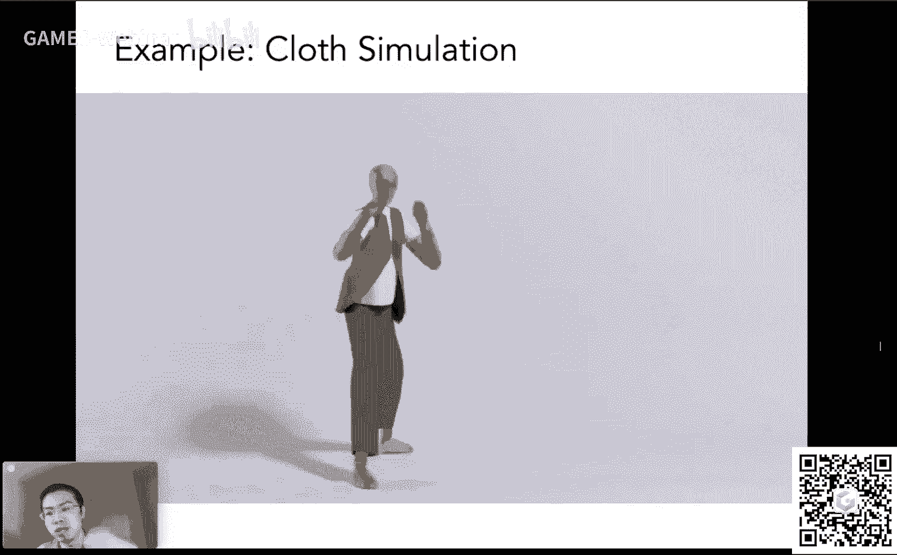

大概可以算出来没有问题啊，好那么这里是另外一个例子，这个例子呢就不再是啊跟物体表面相关的，这种布料而是一种流体啊，流体是一个在仿真领域研究的非常非常多的一个话题，特别是对于这种水。

然后这种水呢大家怎么看待它分成了两部开，第一呢我先模拟这些水它是怎么运动的，它是水滴各种各样不同的地方，它是怎么形成的啊，这是一第二当我模拟了它的位置，然后呃形状各种各样的东西之后，然后我拿去渲染。

告诉我他长什么样，这两步是割裂开的啊，这正常是这么一个运作方式，所以大家看到这里呢，我正常不会去关心它的渲染会怎么做，而是会关心他这里，比如说这，个水花四溅，这到底是怎么样做出来的，没错吧。

这么一个感觉啊，好那么啊这里是流体模拟，那么在这里呢我们既然已经提到了，说我们只要正确的建立物体之间的相互作用力对吧，我们把这个作用给解释明白，也写清楚，那自然而然就可以模拟正确的效果，没错就是这样。

那么我们这里呢就给大家说一个最最最最简单，而且也非常实用的一套系统，叫什么呢，叫质点弹簧系统好吧，然后这个记得哈这个max这质量spring呢，这里不是春天啊，然后也不是喷泉啊，这里是弹簧。

这点弹簧系统啊。

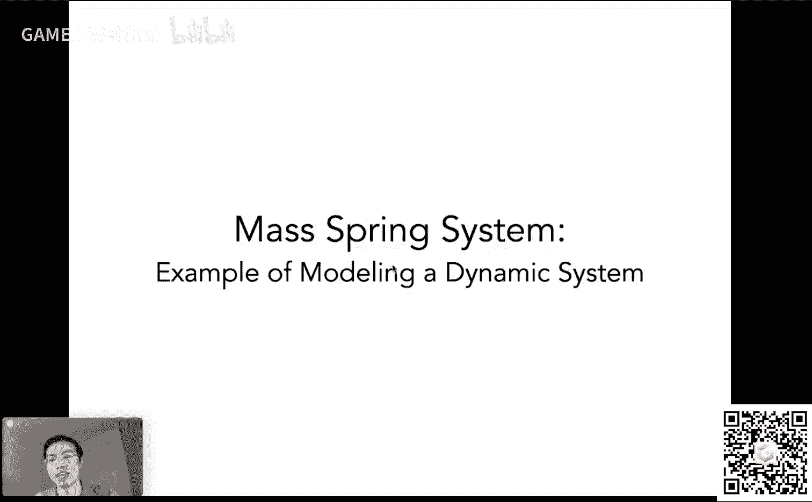

这么，回事，那么这个质点弹簧系统能干什么，比如说啊大家可以看到这么一个例子，这个例子就是大家的第八次作业啊，第八次作业绳子模拟器，大家可以把一个绳子模拟成很多小的弹簧，连接在一块的。

看到分成好几段小弹簧，然后连接在一块，然后我可以把它这个这个呃让它在重力的作用下来回摆，然后我还可以拖动它，当然这是属于高级操作啊，就是说嗯大家还可以看到他在尖端上面。

有时候有时候有时候会有一些鬼畜的一些效果，然后这个这怎么回事啊，咱们之后都会说啊，ok好，那，么这里是大家的这个这个作业的内容哈。

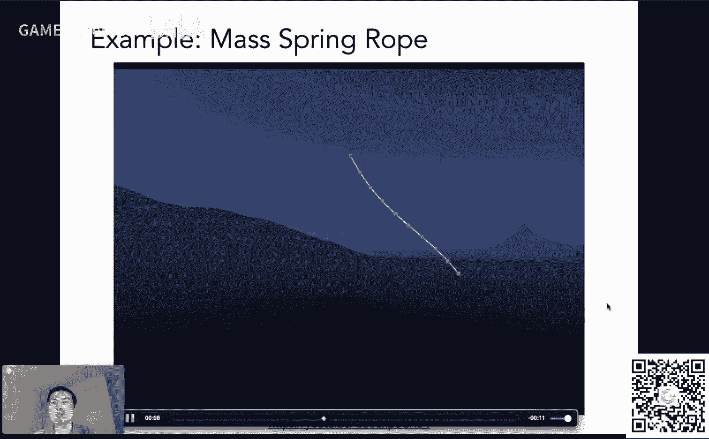

那么这里是另外一个事情，还是一样啊，咱们把呃所谓物理仿真和渲染两个事情分开看，就这里呢我关心的不是说头发怎么样渲染的真实，而是关心的头发在各种各样不同的作用力下啊，它是会有一个什么样的变化。

比如说这里大家可以看得很清楚，有有一个这个风力对吧，可以把这个头发吹起来，那么大家就想啊，这头发本身要受重力吧，那头发跟头发之间肯定有摩擦力吧，然后就是说这个这些各种各样的力他们综合在一块。

哎我们就可以，模拟出来非常非常准确的头发的效果，而且这个是应该是nvd啊，他们做的一个效果，它可以达到实时啊，非常好，然后呃当然中间有各种各样的模拟，然后这个月是呃对时间要求高，质量上肯定会损失的越多。

但目前这个作用已经是非常非常不错的，没问题啊，头发的模拟，那么我们说啊这个弹簧呃，这质点弹簧系统呢还能干什么，这点弹簧系统呢还可以做这个呃。

比如说一块布，我们刚才说是布料啊，本身它这个既然是这种网格描述的对吧，很自然而然我们就可以用各种各样不同的呃，这，种所谓智点弹簧系统来描述它，那这里大家可以看到一块布，然后我可以拖着一个点来拽对吧。

形成这么一个效果，然后呢我们之前给大家看过这么一个例子，对不对，然后这个例子是说什么呀，是说我呃如果对一块布，我只要建模的足够好，然后我的模拟和仿真是完全可以达到以假乱真的效果的，大家可以看到这对吧。

我左边这一列是啊。

照片右边这一列是渲染，是模拟仿真出来的，并且渲染出来的结果大家可以看到几乎是一致的对吧，然后呃除了一些像这些细节，像这里像这里就是，有区别有区别是肯定的，因为在真实的这个世界中啊。

很多东西它是不是这么容易能够这个表示出来的，对吧好，那这里给大家看到这，那所以说啊这个物理是非常非常重要的对吧。

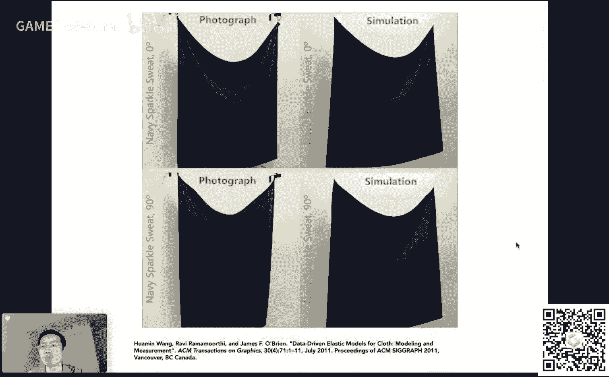

在这个过程中，我们把作用力建立出来，那现在咱们回到我们说的质点弹簧系统上来，那我们既然说质点弹簧系统，那么先介绍一下质点弹簧系统是什么，是一系列相互连接的质点和弹簧，那么它的最基础的单元是什么。

就是一个弹簧左右连接着两个质点啊，一个弹簧左右大家可以看到a和b两个质点，那，么我们知道哈，首先我们假设一个理想化的弹簧，一个理想化的弹簧是什么呢，没有长度啊，呃先绅士没有长度，然后呢他被拉开了多长。

它就会产生相应的多大的力，是这么个意思啊，那么看比如说这个作用力从呃从a到b，然后是什么意思，就是a应用在b上的作用力啊，就是就是唉反了反了，就是说这个弹簧弹簧应用在a上。

使得a往b方向去这么一个作用力啊，就是从a到b这么个意思，然后从a到b的作用力是是多大对吧，是多大呢，那取决于a跟b之间有多远，所以那肯定是跟，这个b减a有关，那同时这个作用力是往哪呢，大家想象一下。

比如说我把它给拉长了对吧，原本是他俩挨一块的，没有长度啊，先这么假设，然后拉长了之后，那么b减a大家可以看到这是向量哈，b减a它们两个位置一减是一个向量。

从a指向b那这个向量这本身呢是和它的长度是有关系的，对不对，然后也就是说b减a它越长，那这个力越大，那这样来说我就可以可以精确地写出诶，这a点受到的往b方向去的力，没错啊，这样想。

那么这里呢还有一个系数叫做进度系数啊，这大家之前，学过高中物理，这个非常简单，然后这个定律叫做胡克定律，然后由于力的作用相对相对性啊，那么呃a受到了相对右的力，那b受到的肯定是向左的力，没问题。

它两个互为相反，那么这里大家可以看到我们所有的表示都是向量表示非常方便啊，b减a本身又表示方向是对的，是从a指向b然后又表示长度对吧，然后k s是一个系数，是这么回事好那么这里呢是一个简单的弹簧。

它有什么问题啊，很显然哪有a啊，很显然哪有弹簧是呃零长度的对吧对吧，所以说弹簧正常情况都应该有，一个正常长度，这个长度呢叫做restless，我们可以这么定义啊，它叫做l也就是说你一开始什么也不做。

它正常情况下就是l这么长度，然后呢你可以把它拉伸，你也可以把它挤扁啊，没什么问题，那么我们分析的时候，我们就考虑拉伸就行了，那几点的时候正常情况下就是直接也是可用的，没有问题，那么怎么做呢。

假如说啊我们还考虑应用在a上的力，那它肯定是向右的对吧，然后我把这个这个a跟b拉开啊，这这样的话应用在a上的可能是向右的，然后b跟a拉开之后，b跟a之间的距离，可能是b减a的距离对吧。

这个距离减去它的原始的长度，那就是被拉开了多长，那拉开了多长，一定会决定它受到多少例，没错吧，那么它受到多少力，那就是拉开了多长，这么一个距离得乘以它的受力的方向，受力的方向是什么，b减a这么一个方向。

从a指向b并且规划也就是说b减a规划，这只表示受力的方向，然后右边表示这个受力的大小，前面该进度系数还是进度系数，简单嘛对吧，这是这是最简单的一个弹簧，然后呢，那他有什么问题，他有什么问题。

它会永远的震动下去，为什么，呢因为能量守恒，这里呢动能跟势能它始终一直在经过一个转换的过程，对不对，你只要把b拉开松手，他一定一直会左右弹，永远不会停用，我们这个模型啊永远不会停对吧，那怎么办呢。

那我们就加入一个相所谓摩擦力，让它能挺对吧，在这之前我们先引入一个在在这个物理仿真或者模拟啊，这块经常用的记号，就平常呢大家会用比如说x来表示位置，那么大家知道x打一个撇对吧，x prime。

这应该是表示速度，是表示它一阶导数，但是在模拟仿真中，正常情况他就大家会用点来表示，就是，在他头上点一个点表示一阶导数，然后点两个点是二阶导数呢，只要位置二阶导数自然就是加速度啊，这是一个常用技法。

那咱们知道就好好，那么呃那么我们刚才说啊，这个弹簧永远会震动对吧，那么不希望它震动怎么办呢，我不希望它震动的话，那我就给它加一个所谓摩擦力，让它能够停，那就是所谓单ing force，就是这么意思。

那么我要给它加一个单品，这个单品是什么意思呢，这个单品就想了，让这个物体停，那大家想一想是不是这个意思，对于任何一个运动的质点啊，如果我想让它停，那，么我这个力的方向肯定得跟它的速度方向相反，没错吧。

这样想，那么那我们看对于任何一个物体，比如说这个b这个物体，它的速度必打一个点啊，记得打一个点之速度哈，这个它是速度，那么它速度往哪儿，我这个力我就让它相反，就跟他跟跟跟他反作用。

那这样的话最后他肯定要停下来，没错吧，那么它有多强加一个系数就可以了，没问题，那负k d就是这么解释，那么他有什么问题呢，诶他有什么问题呢，因为他这样呢会引起所有的运动都会停下来，这个怎么理解呢。

很简单，大家想一想，啊这么回事，假如说我有个弹簧a跟b，然后我a跟b同步的向右走好吧，同步的向右一直在一直在移动，那这样的话会出现一个什么问题会出现，其实a跟b之间啊，它并没有这个相对的运动。

也就是说对于这个弹簧来说，它一直没有拉伸，然后呢它整个它不会震动，然后最后呢还会被你停下来，也就是说你描述的这个摩擦力啊，只能描述外部的力，你描述不了弹簧之间的这种内部的这样一种力，没问题哈。

然后或者另外一个想法啊，就是这里说的，那咱们拿一个弹簧正对这个弹簧质点，弹簧系统a和b啊，竖着放，放进来，一松手，它往下往地下掉了，往地下掉了，大家都知道他作为一个整体来说。

它这个下落的速度应该定的对吧，那那如果说我对这个a和b它都应用赢了这么一种所谓摩擦力来说，它就会整个让这个啊弹簧往地上掉的越来越慢，当然空气阻力是这样的哈，但是这个空气阻力相对非常的少啊，没什么问题。

就是说他表示不了弹簧内部出现的损耗，是这么个意思，咱们把这点理解清楚就好了，那怎么办呢，那咱们就想办法把它给加进去，大家会看到这么一个，过程啊我们在逐渐完善这么一个质量弹簧系统啊，那么大家想象一下啊。

我们刚才既然提到a和b同步运动，那也就是说啊，其实来说，我这个内部的摩擦力应该是得跟他们相对之间的关系得有关系，对对对，相对之间的运动都有关系，没错吧，那也就是说我们要考虑的是什么呢，首先啊不管怎么样。

我呢我要考虑的这个所谓的摩擦力，他要做什么事儿，他最终是希望弹簧恢复到正常程度对吧，他希望能够做这个事儿，那也就是说只要a跟b被拉开了，那么a肯定会想办法往b方向去靠，那么这个力肯定是想办法让它往哪去。

就这个意思对吧，那所以说我们考虑这个比如说应用在这个b上面的这么一个例子，那大家知道他是应该是呃什么方向呢，它应该是向左的，对不对，如果把它拉开啊，然后就是说呃那它是向左的。

那你看b减a除以b减a的长度，这就是归一化的方向，b点那个长度是向右的，然后呢本人加了一个负号，那就是向左的，没问题，方向对了，方向对了，那么现在我就问他应该有多大，就这么一个意思，它应该有多大。

那我们现在我们可以想象一下，你一下啊，就是说呃肯定和a跟b之间的所谓相对速度有关系，没错吧，那就不不是说取决于一个的速度，我们考虑它们内部的损耗嘛，那么相对速度是什么，b减a是b b点到a点啊。

大家看这里啊，b的速度减a的速度，那肯定跟相对速度有关系，那么这么想，那么这里又是什么呢，b减a除以b减a h，这是这是什么呢，这其实是从a到b的方向诶，那么我我会发现啊。

这个归一化的b减a向量和这个相对速度向量两者之间点乘，而这里其实应该多打个点哈，其实点乘，那么这点成什么意思，大家，还记得吗，一个向量点乘一个单位向量，其实就是往这个方向上做投影，没错吧。

然后我就可以得到投影的长度是多少，这就应该是所谓相对速度，投影在ab方向，它的速度是多少，还是这么个意思，那么为什么要做这个投影啊，因为相对速度本身还解决不了问题。

因为我们刚才说相对速度肯定比绝对速度要有效，因为我们要考虑他俩的这个整体，他们俩一块移动等于没移动对吧，这是对的，但是还有一点，有一些速度并不能让你的弹簧引起它的长度改变什么样的速度，比如说我把a摁在。

这然后我把b让它做圆周运动，哎大家就会发现这里不对，为什么呢，因为b组在对a做圆周运动的时候，它的速度它是垂直于这个弹簧呃，这个方向a到b对吧，那这个时候他这个速度来说是绝对不应该。

引起这个弹簧本身内部的所谓摩擦力，让它损耗，让它停在它的自然长度上，对吧啊，就这个意思，它本身b让a做圆周运动不应该受影响，那怎么办，那就是说我们考虑这个点乘。

也就是说我把相对速度给分解到沿着ab方向诶，这个相对速度才会对整个的这个塌方镇子这么一套系统，造成一个所谓的衰减也是这么一个意思，那这样讲的话，那咱们就可以明白了，没问题啊，那咱们整理一下。

就是说啊我们考虑应用在b上的这个所谓所谓摩擦力啊，就让它能够恢复到原始长度，那如果b拉开了之后，那我知道这b减a方向出这个规划，那就是从a到b，从a到b加个负号，就是从b到a。

然后加上它的进度系数乘以进度系数，没问题啊，就是方向一定是从b到a的对吧，那是没问题的，那么下面它的它的大小是多少，那当然是相对运动越快，大小越大，没错吧，那就是说我们，求出来它们的相对速度。

b减a的相对速度，那么这样的话呃是不是解决问题呢，并不是我们其实要考虑的是投影到沿ab方向，它的相对速度是多少，然后这里整个红框算出来是一个数啊，是一个标量scale，好吧。

那这样想就明白了好那没问题啊，那这样的话整个我们对于这个弹簧在这个系统，那现在就建立了比较好了啊，这里一定记得这里打个点啊，这里是速度的意思啊，好那么当然了，这只是一种一种系列的这种摩擦力啊。

还有各种各样别的各种方面，我们只要能够把它给分析的明白，对吧，写成物理公式，那就没问题，剩下一步就是怎么做，怎么模拟出来对吧，内部相对简单啊，好那咱们回到现在哦，不现在不是零长度啊。

就是说这里长度跟这个我想一想哈，长度并没有关系，因为这里摩擦力呢，其实只跟它们相对之间的这个相对运动的速度有关系，这个就是说我们这里应用的摩擦力哈，就是说这这是这是另外一个力。

我们之前说弹簧和弹簧之间相对拽的那个力跟长度有关系，这摩擦力呢跟长度没关系啊，啊感谢这位同学提问啊，没问题啊，就是说这是两种不同的分析，那我要考虑最后他们的运动怎么办呢。

那么就把这两种力就是弹簧自己相对这种专业的这么利啊，跟这个呃摩擦力本身就内部损耗摩擦力，这两个力都给考虑进去，然后再模拟是这么个意思啊，这样想好，那么我们既然已经说了一一截弹簧对吧。

一截弹簧连着两个这个不同的质量，他们应该是111个什么样的这种物理模型，那么我们现在自然而然要问说我这些弹簧经过各种各样不同的组合，可以组成组合成各种各样不同形状对吧。

那我是不是说我可以把它安排成各种不同形，状比如说这里呢我想表示一张纸，我是不是可以用这个方块哎，这么连接对吧，把它一根一根连起来没问题啊，就是每两根它共用其中一个质量，这是没有问题的。

然后呢我也可以在三维空间中用各种各样的这些呃连接，然后把它连接起来，大家会想到这个很像什么这个所谓分子模型啊，对不对，就是这么个意思，就是说啊。

我们这些物理原理其实都是对这个真实物理中存在的现象的一种抽象，或者说简化啊，然后这是没有问题的，当然我们可以这么描述，那么我现在啊我们来分析一个，非常有趣的一个话题哈，就是我们现在不考虑弹簧内部了哈。

弹簧假设我做得非常好吧，那我现在用各种不同弹簧，我想模拟一块布，模拟一块布怎么办对吧，我想让它模拟的非常像一块布，那怎么怎么办呢，我可以诶，就是把它当成一张纸呗，这么一连哈，这么一连就可以了。

然后当然它无限大啊，各种各样其他地方都有连接，但是我发现啊它有个问题，什么问题呢啊其实很多问题啊，第一个问题什么，第一个问题切变它会受影响，什么叫切片啊，很简单啊，很简单啊，就是说我如果拉着这个步。

子这两个角哈，大家看到这这这两个角，我我这么一转，往这个这两个方向一转，大家会发现这个自然而然这个形状会被我们给拽成一个两边，往中间收对吧，这两边被拉长，拽成这么一个形状，那也就是说明我应用这么一种力。

它就会发生这么一种形变，但是我发现在真实的布里面可不会有这种情况对吧，也就是说啊我们对呃，对于这么一种简单的结构来说，如果让他去模拟一块布是不合理的，因为布呢他平常可以抵抗这种切片的力。

然后不会影响形状，但是这里的结构会影响形状，在，这里说明它不合理，这一第二是什么呢，第二是在就是说如果有一种力，能够让这个整个一个形状变得不是一个平面。

哎我们就管它叫做out of plane bending，就让它在这个不是一个平面内发生弯曲，我们知道一块布，他平常来说啊，他这个叫什么来着，我很难像一个纸一样的。

我把它对折成这个严格意义上把它对成一个所谓的所谓的嗯，怎么说呢，就还是一样哈，沿着这个对角线，我一折折成俩三角形，对一块儿啊，这个意思折成一张纸这么个感觉，那不很难这么折对吧，那也就是说不本身呢它会有。

一个对抗这种这种折法的这种力，但是很不幸的是，现在这个结构是肯定是可以把它折成类似一张纸，把它折成俩三角形的啊，就是沿着它的这个斜着对角线吧，然后咱们这么这么一折，它可就可不就变平了。

然后你会发现这些其他的弹簧完全没有受到各种各样的力，也就是说这种情况是显然可以发生的对吧，那就不对，怎么办呢，咱们想办法把它给改进一点，先改进什么，先改进啊，这个呃所谓的切片，那么切片什么意思呢。

咱们刚才说了，拉了一下对吧，然后它会它会变成窄长的形状，现，在我在这个形状里面加入这种斜的对角线哈，然后加到这个对角线之后，我发现我再拉他就不能变成这个形状，为什么，大家想象一下啊，我如果这么拉的话。

那我这些新加进去的这些蓝色的这些线，这些呃质点弹簧系统啊，它会被压缩，对不对，它会往里挤，没问题吧，整个形状会变瘦，他会被往里挤，然后弹簧你知道他会想办法往外抵抗它，那自然而然它可以抵抗这么一个力。

没有问题啊，挺好的对吧，那么这就是这么一个问题啊，就是说呃他算是解决了，但是但是什么呢，但是你会看到这个，结构不对称啊，对于一块布来说，我不管怎么样旋转的话，从各个方向拉它对吧。

他应该的这种行为都应该是一致的，对不对啊，是这么个意思，没错吧，就是行为是一致的，也就是说我这个呃加了这么一条线之后，它变得不对称了，这个非常不对啊，有点像各项异性的意思啊，就是说这个不合理。

那另外一点呢就是说呃我能不能通过加这么一根连线，然后让它能够抵抗这个，让它把它给单程不是一个平面的这种力对吧，然后发现还不能，那虽然在这个方向上好像是能了啊，就是说沿着这个我，们看看这两个角是可以的。

但是另外一个方向是不行的，你可以看另外一个方向，我们看到这个主对角线上，这边如果我这么一折还是一样，所有弹簧的形状都没有发生变化，所以说这种情况是完全可以发生的，所以说仍然不行，怎么办呢。

哎那咱们想办法改进改进怎么带，我们把它再加上一个这个斜的这个线啊，就是另外一个方向的对角线啊，然后这样的话呢，首先但一边他就已经可以抵抗这个呃所谓切变的力了啊，然后那加上另外一边肯定也会没问题。

但是这个形状仍然不能抵抗，这个所谓非平面的这种弯曲，那这个怎么理解呢，但是他发现这里其实我沿着两个对角线去去这么弯折的话，一定会引起其他弹簧发生形变，所以一定会让他结果这个回到这个状态呀。

那就大家说的这个意思，但是是哈就是说还有一种情况可以让它变得不在一个平面内，很简单竖着，大家可以看到这么一条线啊，比如说咱们沿着这条线竖着，这么这么这就是这个意思啊，怎么这么折过来不就行了吗，对吧。

就沿着这么一条线，然后把它给折过来，同样道理，它不会引起其他的任何一种变，化，所以说呢他没办法解决这个非平面的这种弯曲这么一个问题啊，怎么办呢，那咱们再进一步改进，怎么改进。

加一个所谓我管它叫做steep connection，我从这个深度学习借了一个词来，然后这个这个怎么说呢，就是说大家也可以看到我加了什么，加了红线，这个红线怎么加的呢，很简单啊。

就是说任何一个点它都跟它隔一个的点，连那么一根线啊，看见没，就这个点，因为它在左上，所以它不跟上面和左边脸哈，就是你看比如说这个点啊，跟上面跟他左边，如果右边还有的话，应该还跟右边，如果下面还有。

应该跟下面隔一个都是隔一个嗯，所以说我管它叫叫做这种steep connection，加了之后呢，大家就会发现诶，这回那是真的，你不管怎么样去玩这个呃，平面它都会引起一些弹簧的这个长度发生变化了。

比如说刚才咱们说这个数值的这个如果你这么搬的话，那势必会影响这一条，咱们说清楚这一条从这个点到这个点，势必会引起它的长度的变化了对吧，那也就是说他会这些弹簧会想办法抵抗诶。

这样一来我是不是就把结构给做的更好了，对不对，那也就是说啊我们就想办法通过我们这些不断的，这些设计改进哎咱们这分析的这些都有道理，然后咱们呢就可以把这些呃这些问题都给解决。

那么这里呢其实我我再多说一个事情，就是说关于这个红线啊，红线的这种连接，它它是其实是非常弱的，就是说它本身呢就是说正常地方布其实也可以弯过来吧，比如一个桌布对吧，在这个桌边上的肯定自然垂下来。

也就是说它并不是多强，强是强在哪强，是在布置这个这个本身啊，它自己的连接，也就是说这个蓝线其实非常强，红线只起辅助作用啊，有同学反映说用红线是不是就不用对角，线了啊，这里就可以解释啊，就这么个意思。

红线其实仅仅是加那么一点点让他抵抗，是啊非平面的弯折这么一个事情啊，那不管怎么样呢，呃这个这样做我们就可以得到一个质点弹簧系统来描述的一个裙子啊，这非常好，当然这里肯定还涉及到各种各样摩擦力。

和这个本身的这个呃模型到底应该怎么样作用，那咱不管啊，就是说正常情况下，就是说这么描述的话，基本上来说对于一块布料，比如说你拿一块布，然后放在空中，一松手来落在了地上，哎这块模拟是已经绝对是够用了的。

是这，么个意思，当然大家说这个是不是已经足够精确的，肯定不是对吧，真实的这个我们之前学过布布料的渲染，对不对，我们分析过布料是怎么形成的，三三个层级结构的，这个嗯怎么怎么说缠绕对吧，还记得吗。

这个所谓纤维缠绕形成鼓，就是就是fib缠绕形成play啊，然后鼓呢就缠绕形成线，所谓ly缠绕形成thread，然后然后thread呢再通过这个这个不同的针织方法对吧，编织吧或者针织。

然后可以形成各种各样不同的这个真实的不良，那他们实际上是这么连的，还是会旋转的这种螺旋的东西，你知道，是不是描述出来了呢，并没有对吧，那所以说我再次强调这个事情啊，就是说物理模拟来说。

这肯定是对真实物理世界的一种表示方法，但通常都是一个简化的表示方法，就看你的最后的要求会怎么样对吧，这么个意思，那么质点弹簧系统肯定是非常好的，那当然这里呢简单给大家提一下。

就是说有没有除了质点弹簧系统以外的其他的系统有啊，比如说这个东西就叫做有限元方法，叫finite element那等，有些人方法被广泛应用于什么，应用于这个车子碰撞，大家知道，就比如说有一些汽车厂商啊。

他们为了在发布一个新车之前，他们先去做一些模拟，把这个车子撞向一个墙，对撞向了一个墙，那么就是说大家会发现这个接触墙的地方受力对不对，那为什么车一直到车尾巴都会被撞坏掉对吧。

因为力之间它肯定会有一个传导的作用，这就好像是热之间也会有一个传导作用，比如说我要去考一个什么这个这个金属勺子，然后让你拿着，然后你肯定这个我就考那个勺子的尖端，然后你肯定一会儿就觉得烫对吧。

道理就在这，就是说热和这些力啊，这些东西都会有传导，这些传导的这，些过程啊，就所谓扩散过程叫diffusion，这个过程很适合拿有限元方法来做啊，有些原方法非常不好不好做哈，就是说写起来也很头疼。

但是就是说他肯定是另外一种对这个世界的建模方式，对他表示了说我力从一个地方扩散到另外一个地方，应该长什么样，这里呢我就不再用呃，所谓指点弹簧了对吧，也就是说不同的方法都是有的，这么个意思好吧。

那咱们可以继续进行下面的话题啊，就是说后面的话题呢是简单给大家说一说，关于这个动画目前都有哪些东西哈，就是我们刚才说质点弹簧，系统它可以描述一些部位啊，这些东西挺好的，没问题对吧，那么有一些东西啊。

它其实不太适合拿质点弹簧系统来说，怎么说呢，我们这里来说一个另外一个系统叫粒子系统，叫particle system，那么粒子系统是什么呀，非常好理解啊，就是一堆很小很小很小很小的东西。

比如说这里大家看到一些很小很小的球啊，这一动啊，然后是这么回事，然后呢呃建模的方法也很简单，它不是一堆很微小的东西嘛，大家放过烟花，对不对，大家看到那个烟花打上去之后。

一下分散成好多好多好多小的这些东西诶，就，是这么回事，我把一个一个都给建模出来，好建模出来之后呢，然后我怎么办呢，我来定义每一个粒子它会受到的力，他受到了力肯定有来自于内部的，来不不不是内部的。

就是说来自于粒子之间的，就粒子和粒子之间可能会碰撞吧，就像台球一样对吧，一个碰一个，然后呢向外部的力也会有像重力，对不对，然后粒子这可往往地上会掉，然后还有粒子本身可能会非常轻。

它可能会受到这个风力对吧，然后它会改变各种各样的这些位置，这都有可能我们把它描述出来对吧，然后呢那我把人描，述出来，剩下的就可不就是模拟了嘛对吧。

那么这个粒子系统呢很容易呃呃这个去营造这样一种各种各样的，所以这个什么魔法的效果呀，然后想各种各样的啊雾啊，什么这些东西，灰尘啊，这些东西就非常合理，你用这些东西来模拟我们在游戏中呢。

它得到了一个广泛的应用是怎么回事，那么大家可以想象这个例子越多，那我其实模拟的可以越精细对吧，然后但是肯定越慢，那用勺那肯定越快，但是效果肯定也就是说呃跑起来肯定就就就就越快，效果肯定差一些对吧。

就这么一个意思，然后呢嗯这里就是说用粒子系统肯定会引起各种各样不同的问题，比如说粒子系统甚至可以来模拟什么呢，模拟这个流体，那么流体我当然可以拿各种各样的这个呃神奇的一些数学去描述它们，没什么问题。

把它当成一个整体来看，我也可以认为一个流体它就有很多很多小水滴相互组成，刚才给大家看的那个流体模拟啊，就是一个在一个小块中间中间有个灯塔，那一个用的就是把把这个小水。

就把这个整个一个流体当成很多的小水滴，然后他们之间的相互作用我们考虑进去就，好了就是这么个意思好吧，然后呢嗯粒子系统还会涉及到各种各样的问题，咱们刚才说啊，比如说来自于内部的作用力。

粒子和粒子之间的作用怎么作用呢，粒子和粒子之间可不一定只有碰撞，有可能还有引力，想当日万有引力嘛对吧，粒子跟粒子之间肯定得有啊对吧，这个错不了，那么我要想想考虑引力，我肯定得找，比如说我当天有个例子。

它周围的最近的多少个例子，大家听起来是不是很熟悉，对不对，是不是很像光子，那么我要找这周围的一些例子怎么样做呢，那我自然而然需要一，些加速结构或者干什么来做，然后呢粒子的位置还会经常移动，我还得更新它。

所以说整个一个这个粒子系统的视线啊，还是有很多问题的，呃不是叫问题啊，就很多这些啊，就是说呃挑战性的是这么个意思好吧，那么实际上来说怎么做呢，其实这块有一个最最简单的算法，这个这个算法其实听上去很像。

怎么把大象关在冰箱里分三步那个意思，然后这里说的实在是非常简略，怎么做呢，首先如果有粒子，它会这个动态的会生成啊，有一些粒子它会突然出现生成这么一个意思，然后呢粒子，的作用力考虑进去内部的外部的。

然后呢根据作用力来这嗯更新任何一个粒子的位置和速度没问题，然后如果粒子呢它有一定的存活时间，有一些粒子会死亡，有些新的离子补进去嘛，刚才说了对吧，然后最后我算出来每一帧物这个粒子的位置之后。

我就把它渲染出来，那当然听起来是非常非常简单的一个过程哈，但是其实它确实来说就是这么简单，就是说它的困难的地方在于怎么样去办，粒子之间的作用力模拟的清楚，如果你说把粒子之间的作用力描述成。

就好像水水滴和水滴，之间的作用力一样，把它模拟出来的结果就会像是水，然后你要是模拟说像是这个灰尘，那就是灰尘，那就是这个作用力就会决定他们看上去最后的结果，就是像是灰尘的影分布没有问题的运动哈。

然后就是说嗯真正困难的应该是在于这一步，当然还有另外一步，就是说你得到了这些作用力之后，你如何去计算他们的这个更新，他们的位置啊，或者干什么，这是关于怎么去解它，所以在整个一个这个模拟的过程中。

模拟仿真的过程中就是关于定义这些相互作用力，这是一关于怎么解这，是另外一个事情，就是学术界呢更关注怎么样去解这个事情啊，就是说定义这块是属于model这么一块的过程，其实另外一方面相对难一些啊。

这么讲好，那么呃粒子系统之间它肯定有各种各样的作用力，咱们刚才说了哈，就是粒子和粒子之间可能有吸引力，可能有电磁力没问题啊，然后呃如果说他之前有这个所谓斥力对吧，这个当例子离得足够近才会有斥力。

然后可能有一些这个弹簧什么东西在里面，或者没有连接都行，然后呢肯定有摩擦力，然后有这种什么粘滞力对吧，空气阻力，这里，摩擦力，然后碰撞粒子和粒子自己肯定要碰撞，然后呢跟墙啊，跟那些容器啊。

这些东西还是一样，不能穿模对吧，还记得这些事情，就是说这个啊碰撞肯定是要做的对吧，然后早期呢我们之前打游戏有一个系统，人称叫布娃娃系统，就是你把人家打倒了之后啊，人家这个呃这尸体，然后他会倒在一个墙上。

然后他应该一个怎么样的一个一个方式啊，虽然不是例子哈，但是道理是一样的，碰撞检测肯定是都要做的对吧，否则那就真的穿过去了，就是这么意思啊，这么理解，那么呃比如说咱们举一，个例子就是关于这里的呃万有引力。

万有引力当然大家都清楚啊，再简单不过了，g m e m2 除以距离平方对吧，然后既是一个常数，那么呃再大再小的物体都会满足这么一个规律，然后呢自然而然对于这些呃，就是这些灰尘啊。

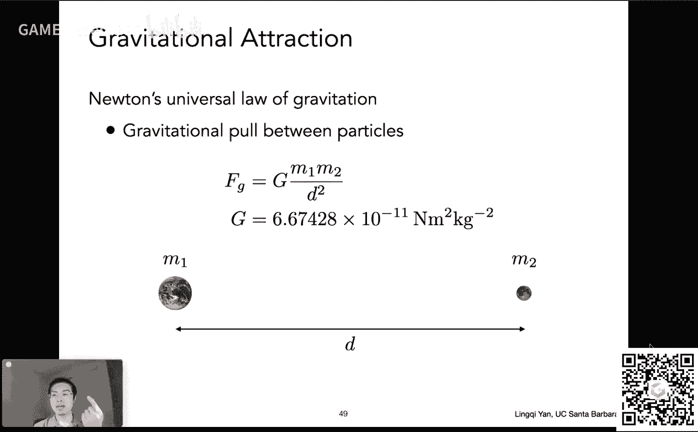

这些例子啊，这些时间肯定会有这么一个作用力，我们把它考虑进去就可以了对吧，那么对于星系来说。

同样也是这么一个道理，大家可以看到这里是一个这是nasa提供的一个呃。

你这叫什么来着，这个这个渲染图啊，就是说对于一个星系的一个模拟。

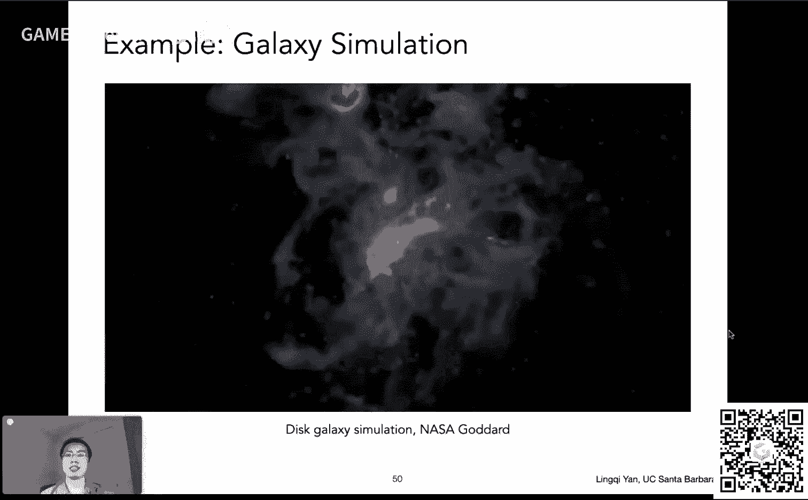

然后大家可以，看到这些各种各样的看起来像是一些烟什么东西啊，其实不是。

其实是成千上万个不同的例子啊，至于最后每一个粒子它应该如何被画出来对吧。

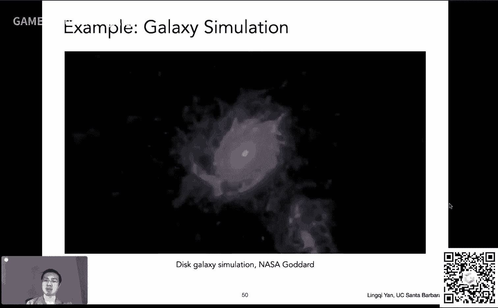

我们肯定不能把它当成一个点，当成个点就看不见，那肯定会这以一种形式把它给渲染出来。

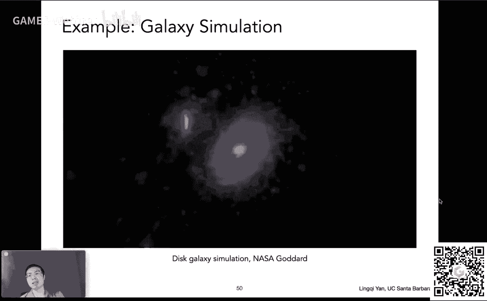

那这还是我之前说的，就是说诶大家可以看到这个不同的星云绕着其他星云去旋转啊。

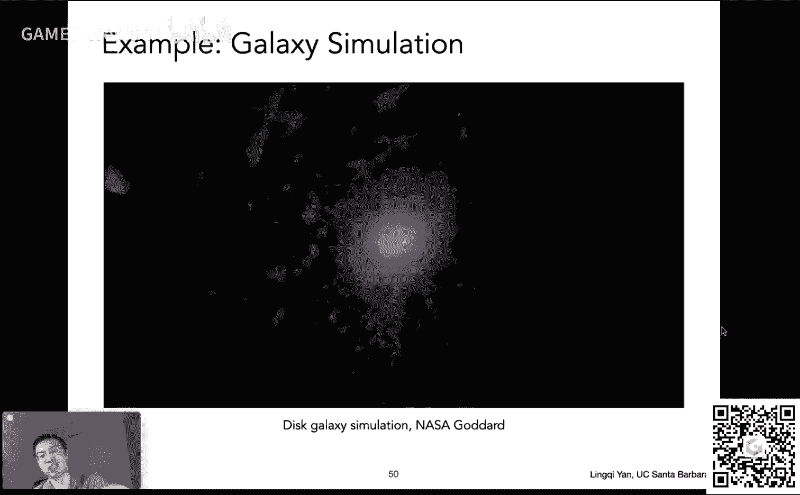

这个意思还是不错的对吧，就是说呃我刚才提到这个事情，就是先模拟后渲染。

这两个过程一定是分开的，好吧好刚才咱们这个说流体模拟，咱们是不是可以把它，描描述成一个整体对吧，之间的相互作用力也可以把它当成粒子，然后它这个粒子呢大家可以看到就是一对小球，这些小球呢。

然后他们之间模拟这些碰撞啊，这些过程都给模拟出来，剩下的就是渲染对吧，你至于把它渲染的像个玻璃，还是加上这些白沫，这是另外一回事，就是说我们现呃我们模拟呢就是模拟的是这么一个过程。

那大家看到这个浪打到这个呃兔子的时候，还看看看这里对吧，它会形成各种各样飞溅的所谓水花对吧，就是这么个情况，然后诶没没有问题哈，就是说我们只，要正确的描述这个作用力就可以了，好的。

那么呃这里呢我们就在把这个所谓粒子系统啊往前延伸一步，什么意思呢，就是说啊粒子系统可不一定只是用来描述这些，最简单的是一些点哈粒子系统这个例子要看你怎么样去理解，对不对，在一个很大规模的范围内。

有很多小的重复的东西，这些东西就可以理解成粒子，就是说一个群体中的个体，比如说这里呢大家看到这个模拟其实就在模拟一个什么呢，模拟很多的鸟，一个鸟群哈，然后这个呃用一些简单的规则说个体的鸟应该如何听。

从于集体是这么个意思啊，然后这些鸟显然要复杂一些对吧，但是仍然而然仍然我们可以定义出来他们之间的相互关系什么呢，就是说啊这个呃首先这个肯定任何一只鸟他都不愿意落单，对不对。

然后所以说呢任何一只鸟一定会找到它周围的一些的鸟，并且试图融入到中间去对吧，就是这么意思，所谓attraction很好理解，很合动物的风格对吧，那么repulsion也是另外一个风格。

就是说任何一个鸟呢，他都不希望和别人太近，所以这些鸟和鸟之间呢，它肯定会有一个相互之间所谓的类似斥力的东西，但这个东西呢是存在于这个感知上的对吧，就是鸟和鸟之间他都不愿意离得太近好，这也没问题。

那么朝向也是一个很重要的事情，如果说啊大家都往某一个方向去飞的话，那么我肯定会有一有一只鸟，他因为不愿意这个离群嘛，他肯定会沿着他能看到大家飞的主要方向，也就是说仍然要考虑周围的一些鸟对吧。

然后呢考虑大家飞的平均方向是不是非常有道理，那这样我就定义了所谓个体的一些运动的属性，那有了这些属性之后呢，然后我自然而然我就可以通过粒子系统的方法，把它解出来，对不对，那咱们这节课仍然是这样哈。

这节课给大家说一些概念，不说怎么解，咱们下节课说啊，这个意思好，那么就是说啊呃那肯定在实际过程中还会有一些各种各样复杂的情况，对不对，那如果我们都能考虑进去，那自然而然就可以描述这个非常非常复杂的情况。

对吧，这鱼啊这个密封啊都是这么一个道理。

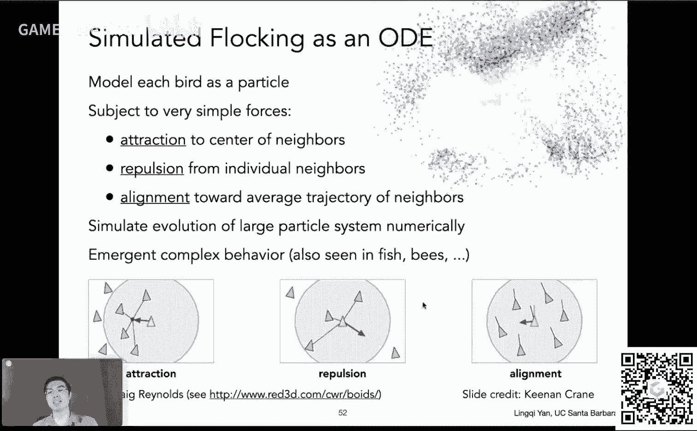

大家可以看到这里是在模拟一个所谓分子分子的结构，就是说哈同样道理，粒子系统刚才说了，本质上就是在定义个体与群体之间的关系，那么这里呢就是定义各种分，子要如何运动，然后它们如何形成这么一种群体。

只要有一定的规则，他们就可以形成，没有问题啊，所以说大家要把粒子系统给理解的更透彻一些。

还有什么呢，这个例子我是最喜欢的一个。

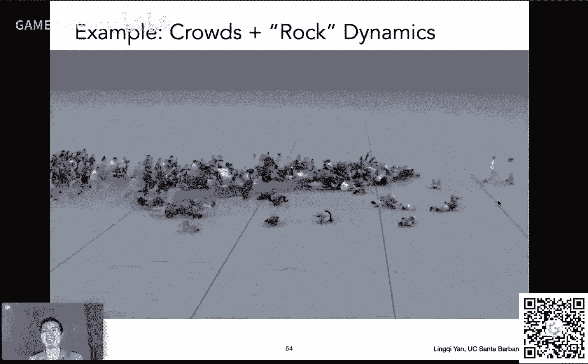

嘿嘿嘿呃模拟仿真的例子呃，这里是这个大家可以看到这每一个人呢，其实它都有自己的一个呃运动的方式，然后呢是下面有一个这个无情的这种横杠啊，不知道是在干什么，把这些人都给扫倒啊，然后我非常喜欢嗯。

这个大家可以看到这些呢当然是粒子系统的范畴啊，只不过每一个个体的行为更，加复杂了，它可以跑对吧，每一个粒子它和这个呃各种各样的地面啊，和这个横杠啊，它们之间的相互作用它都是这个那非常复杂的。

但是仍然有个体群体这么一个这种定义方式啊，没有什么问题，好嘿嘿嘿嘿好，最后那所有人肯定都倒了，对吧好，那没问题好，那么咱们现在讲完了这块粒子系统啊，我们现在可以进入下一个话题，我们来说什么呢。

我们来说运动学，那么运动学呢其实这个相对简单啊，就是说我们通常在图形学里会把运动学区分成正向的和反向的，来来应用所谓的正义运，动学和逆运动学，那么更难的是逆运动学，那么我们现在先从简单的来说啊。

运动学运动学说什么呀，是说啊我就是说我如何做出一种动画来啊，还是刚才咱们最早的一个思路，怎么做动画，怎么做动画呢，我要描述一个骨骼系统，这个骨骼系统呢能够表示跟人类似的一种呃。

这个骨骼连接的所谓拓扑结构就是什么和什么相连哈，然后就是说我可以定义各种各样所谓不同的关节，就是这个意思，大家可以看到右边是类似一个机器人，对不对，然后呢它有各种各样不同的关节，什么呢，有三。

种不同的关节，第一这种关节啊是钉子，就是钉上的关节，这个关节是什么意思，我只要钉上之后，它就往一个方向旋转，是什么意思啊，就是大家看这么一个这个例子，它可以在这个所谓定住的这个平面内旋转。

那么另外一个关节更复杂一点，这个关节叫做b这个bd好理解啊，就是说大家至今应该这个建各种各样模型也都见过，有一个东西它能够包住一个球，是这么个意思，而这个球呢它可以任意的在在这里面旋转。

也就是说相当于你这个旋转可以不发生在这个平面内啊，它比这个king，多的自由度是这么个意思，另外一个叫prismatic joint，这个非常好理解，它就可以拉长，就是说大家看看这里。

比如说一个一个胳膊大腿连着小腿，然后它中间可以拉长一点，这么个意思，就是说它可以有一些移动在里面，也就是说它可以定义一些简单的关节模型，可以形成这个整个一个复杂模型是如何相连的，这意思啊。

然后本身呢它又可以把整个一个结构形成一个所谓加速结构，一个树形的结构，咱们这里不多说啊，是这么个意思，就是说啊一个简单的情况就是这样的，然后大家可以看到一个，简单的关节，我们刚才说这是定上的关节啊。

只能在平面内发生旋转，那么这样的话呢我就会看到哦，我这里有一个点啊，然后呃这里呢呃有第一个类似手臂这个这个相当于大臂这一块啊，然后这里相当于小臂这一块，然后那当然是可以。

这两个不同是类似于尖这类类类似于轴啊，这个意思他可以这么旋转，那么旋转之后我就问这么一个事情啊，来比如说我第一段诶，我旋转，比如说c大一度，我假设向上是不旋转啊，旋转c大一度。

那第二段旋转c大2度就是他他的这个时候的自然方，向朝这儿的继续旋转，c大2度，我问这些尖端在哪儿啊，这个简单吗，这就所谓运动学对吧，我告诉你是每一个关节都怎么运动，然后你告诉我最后才停在哪儿。

就是这么个意思对吧，怎么算再简单不过了对吧，我先算出这个点的位置对吧，用这个cos和sin c塔一来算，然后呢，我知道这个c大二是在c大一的基础上旋转的，所以到这个点之后，我要再算p点的位置。

我就用cos和sin的c带1+3+2来算啊，这个太简单了，没什么问题啊，也就是说关于这个正向的运动鞋，只要我能够定义好各，种连接方式定义他们之间的各种位置，我自然而然可以找到各种各样不同的点。

它的位置没有问题对吧，然后呢我甚至还可以画出一些曲线，随着不同的时间，就是说我这个c大应该怎么样去变化这个意思啊，然后呃我我只要知道任何一个时间c带一。

c带二是多少，我就知道他这个尖端它会停在哪位置，没有问题，那么这个呢呃正向的运动鞋其实早就得到很广泛的应用，对于人的走路来说对吧，像这些骨骼什么东西呢，人是非常容易把它给做成这么一个形状的。

我只要定义各种各。

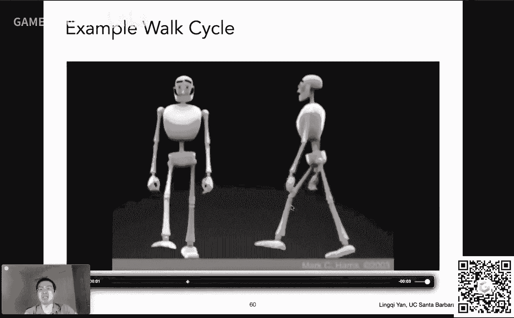

样不同的关节，我让它旋转就是了对吧，这个意思，然后呢运动学有一些问题啊，就是什么问题，就是它的定义什么东西都非常的物理，大家有没有发现，比如说我定义什么东西旋转多少角度，什么东西旋转多少角度对吧。

但是呢就是说嗯这个艺术家们可不喜欢这种东西，艺术家们喜欢，比如说拽着一个什么东西把它给拽到一个什么地方去，对不对，是这个意思，这样的话才能够这个更好的帮助大家去创作一些动画，没有问题吧。

就大家可不喜欢调什么角度，什么东西对吧，直观直接拿着这，个到到处转，这样非常好，那么这是它的问题，那么运动鞋其实有好处，什么好处呢，就是说它实现很容易，咱们刚才说了，告诉你任何一个位置。

我当然可以算出任何一个这个不讲任何一个地方，他会停在哪儿，对吧，没问题哈，那么我所以说呢，为了让这个艺术家们能够更好地使用这套运动学系统去调这个呃，所谓这些骨骼啊，这些不同位置，这时候就引入了一个概念。

叫做逆运动学，那这个概念就非常重要，那逆运动学是在干什么，大家可以看到这是几个例子哈，那你运动学是在做这个事情，假如说你可以手里捏着它这个尖端尖端，看这有个球，对不对，你捏着这个尖端，你可以到处移动。

然后呢它会自动的去调整它的这些关节，它们的位置，使得它这个阶段就是在你要的这个位置上啊，这这就是逆的吧，我要的是最后这所谓尖端的位置，我要的是不是中间我怎么调，中间怎么调，你自己决定诶。

这个就是逆运动学啊，这么个意思，那么逆运动学就是说我固定这个p点，你告诉我c带一四带二哈，这么想就很简单了，那么其实结起来就非常难了哈，告诉你p点的位置，然后你怎么解，c单一个最大二。

你就会发现这里这个式子就变得非常非常复杂了，这还是最简单的一个关节，连一个关节的再多连几个怎么办，对不对，也就是说啊就是说对于逆运动鞋来说，这块就非常不好做，那那而且呢它还有一些独特的问题。

逆运动学有时候啊他的解并不唯一，什么什么什么意思呢，比如说尖端，我希望这个这个整个一个机器人的手尖端停在这，然后呢我可以有两个不同的这个排放方式，大家会发现这两个方式啊都会让尖端停在这儿。

那我取哪一个吧对吧，就会有这么一个问，题啊，然后同样道理啊，间断我放在这儿，而同样这这两种方式都可以的，大家会发现这三个连在一块，可能会出现更多的这种出现这种重合的这种情况，这可怎么办，对不对。

会出现这样的情况，然后呢还有一些情况其实挺惨的，比如像这里啊，大家看这是什么意思啊，这一个呃一段哈，连了这段骨骼啊，然后这段骨骼呢可以这么旋转，那么底下的这个骨骼呢可以这么旋转，那么可以看什么呢。

可以看到这一个点，它可能在哪儿，它可能在这条虚线上都可能出现，没错吧，那么在这个点虚线上的，任何一个点我又可以通过旋转这一段的方式，使得这些点呃，我的尖端它停在这么一个圆上，那么我最后得到的结果是什么。

我得到的结果就是说我所有可能的这些这些尖端啊，所有可能的位置就只会在这个外层的这个圈和这个圈之间，那如果你告诉我后，我要把这个尖端放在这儿，那对不起，不可能他根本到不了这儿对吧。

如果我要把这个尖端放在这个内部，那也不可能他根本也到不了这儿，他有时候还没解，那多解和无解情况都会有，那出现这种情况，那就是自然而然它是这个逆，运动学的一些问题对吧，那么怎么办呢。

正常情况下人们都会采用一些所谓优化方法啊，然后去直接去通过优化，然后来找到他们对应的这些位置，就是说我不是要最后的结果，不是已经有了吗对吧，然后我现在如果我调整，我比如说还是刚才那两个啊。

c带一根c的二，我去调呢，可以让端点形成在某个地方，现在我要让他的目标到达某个地方，那我应该如何去反过来去优化我的c大一跟c大二，这是一个点呃，典型的优化问题啊，优化问题这个优化问题，正常情况下。

如果大家学习机器，学习的话应该会非常熟悉，用什么方法来解，用这个呃梯度下降法来记啊，就是说我知道我离的这个目标有多远，然后我应该如果我调整c大一跟c带二，我可以让我的新的这些点往哪个方向去。

是这么个意思啊，然后我就根据这个这些信息来调整啊，就是如果我调整下来一条c带二，它会影响最后的结果位置在哪儿，这就是一个梯度，就是最后的位置啊，根据c单一和c加二这两个东西在他们的梯度啊。

好这样讲就没问题了，那所以说正常情况下，用一些所谓牛顿法啊，或者别的一些，啊这些优化方法来做，那咱们这个课上就不再多说了，就是说呃这是人们正常解的方法。

而不是通过数学的方法真正去写那个什么呃这个archical sign这些东西啊。

是这个意思好，那么就是呃这个所谓所谓逆运动学呢。

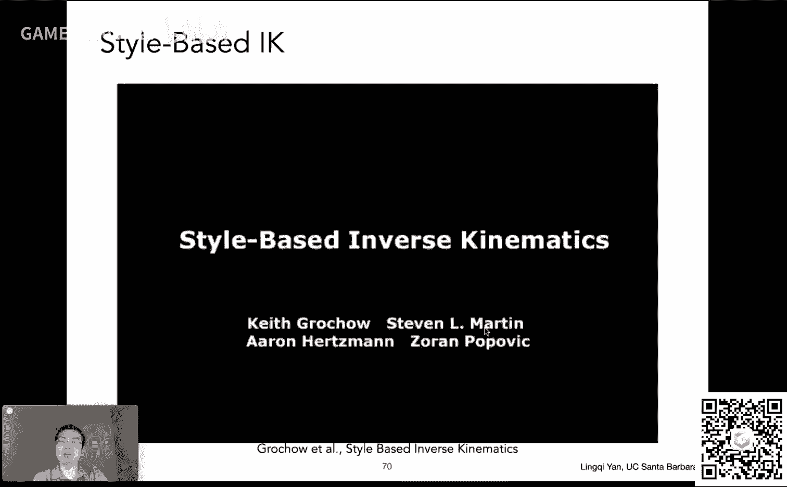

他这个得到了很大的这个广泛的应用啊，大家可以看到就是这是一个典型的利用运动鞋，我可以拖各种各样不同的位置，然后可以让这个小人儿形成各种各样不同的形状啊，然后就是说呃这个当然是一个不错的做法对吧。

然后就是说啊当然这篇这是这是一篇论文了，它本身，在做什么。

这是另外的事情了，就本身来说，这就是我们要应用的学的效果啊，好那么时间所限啊，我们还是多说一点这个这个其他这块内容，咱们把内容解决掉啊，今天可能还得要稍微晚点啊，好那么下一个环节我们来说reading。

reading这个事情实在是没有办法翻译哈，就是说这个嗯就在这边整个一个这个动画的行业，就基本上来说一直在说rigging这个事情，那我们来看看reading是什么，reading是什么。

reading其实就是说对于一个形状它的控制，说白了是什么，reading其实就是这个木偶这么一个操作哈，什么意思呢，就，好像说你用这个各种各样不同的线对吧，你去提这个木偶，它的各种部件。

它的不同的位置啊，然后它自然而然就会形成各种各样不同的一个呃，这个这个这个某一种造型对吧，通过这种方法来控制它，在一定程度上来说，这就是这个逆运动学的一个定一个应用啊，对不对。

所以这个过程就叫rigging，那么对于这个动画或者电影界啊，大家就会呃应用这个reading，然后呢给各种各样的这个角色做出各种各样不同的动作，是这么个意思啊，就是给东西添加动作。

或者是呃做各种各样的动图能造型，这，就叫reading好，那么这个reading本身呢它这个不容易做啊，然后就是说呃如果你是艺术家的话，你要你你可能会这个用过什么这个建模软件对吧，像3d s max呀。

像玛雅啊这一系列建模软件，你得先怎么办呢，给这个物体加上骨骼，然后所谓你要知道你要操作哪些点，会影响其他的哪些点对吧，就是各种各样不同的这些这些效果就是所谓软选取蒙平提。

这些操作都是属于说在这个呃工业界用的一些一些术语哈，然后这些呢我们就暂时不是这么理解，而且也很简单啊，就是说我们给一个呃一个，物体或者说一个角色各种不同的地方给它不同的所谓控制点，让他能够拉着啊。

这个概念就是和什么非常像呢，和那个我们之前说贝塞尔曲线非常像对吧，贝尔曲线我调到控制点，我就可以调这个曲线，那对于3d的情况，比如说人脸上我给分布各种不同点，然后艺术家去拉各种各样不同的点对吧。

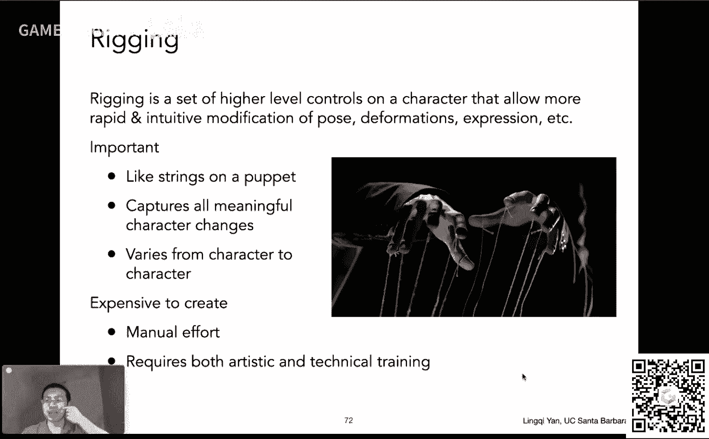

就可以调出各种各样不同的表情，道理就在这就是reading啊，那咱们给大家看个例子哈，这个例子是一个非常非常明确的一个例子，就是说他的也可以通过各种各样不同的这个方式来控制这。

些呃呃这个这个人物大家可以看到是熟对吧，非常自然的运动啊，然后这里稍微有点不自然哈，翻转180度，好吧啊。

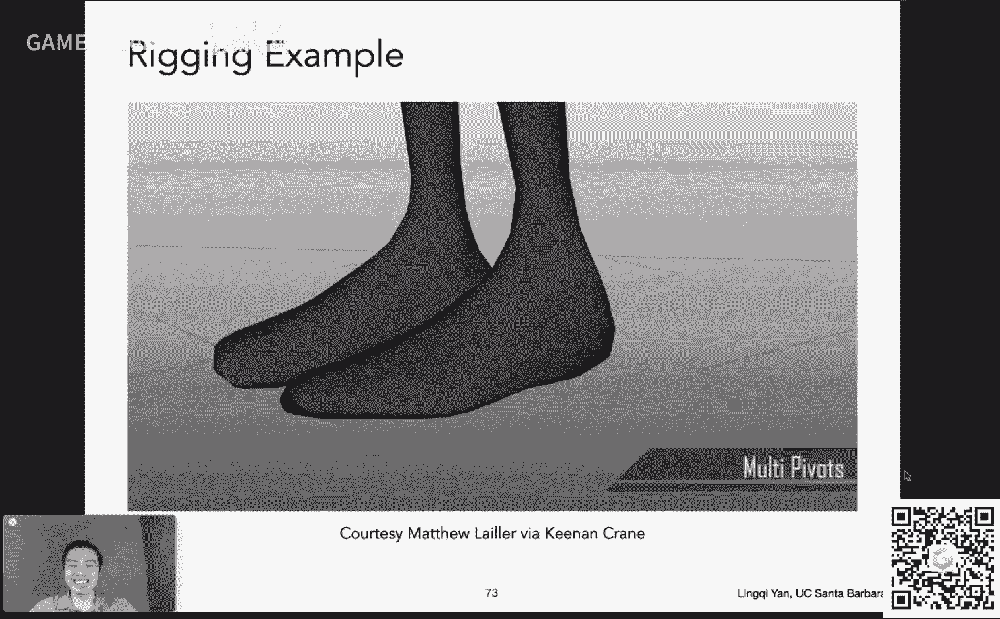

大家可以看到对吧，就是说它的控制点可能不在这个物体上，然后刚才看到脚踝背后有一个这个控制点对吧。

然后这里呢有各种各样的这种这种这那大家可以看到面部表情，唉，也是通过各种各样控制点我来控制它，那那大家可能要问，那这些点我应该怎么样定义，那这些不是大家要关心的事情啊。

这些只作为一个合格或者优秀的艺术家应该掌握的技能，就是这个意思应该定义在哪，使得控制会比较好，这个意思，那眼珠头啊都可以运动，没有问题好。

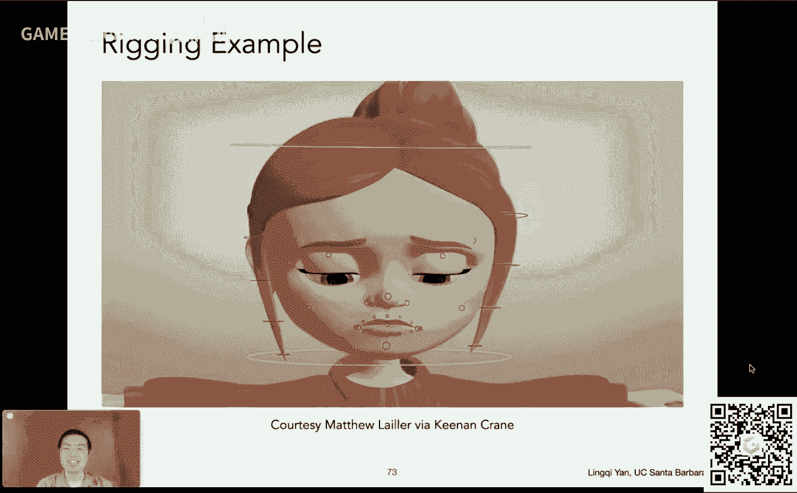

那么这里就看到这儿啊，然后另外一种方式我可以怎么做呢，就是说就是说我如果说考虑人物有两个不同的动作哈，有两个不同的动作，然后呢我这两个不同的动作之间，我可以可以通过插值的方式来做啊。

然后就是咱们之前不是说关键帧动画嘛对吧，那么关键帧来说，大家可想而知啊，这样想就刚才我们已经有很多控制点了，那么现在如果我有一个艺术家，我建立了一个同一个角色，他的两个不同的呃所谓造型。

然后呢我中间有差值怎么做呢，那我控制点和控制点之间的位置做差值就好了，是不是这个意思对吧，那也就是说说白了就是你之前有一个形状，后来有一个形状，你可以把它给混合到一块，这就叫black shape。

其实本质上不是在做blend shape，而是在black所谓控制点以及他周围能够影响的一些区域，是这个意思好吧，那么就是说这个中间怎么样一个过程。

那自然是用各种各样曲线来定义好吧，就这么个意思，那当然这里呢也有一个例子。

而这个例子和之前这个例子是几乎是呃相重合的哈，就是说我可以定义若干不同的位置，大家这里要关注的就是它的中间的状态啊，中间的状态就是可以生成的，比如说这个舌头它这个足足短了，他是如何过度，眼珠是怎么样。

这个流畅的转动是这么个意思对吧。

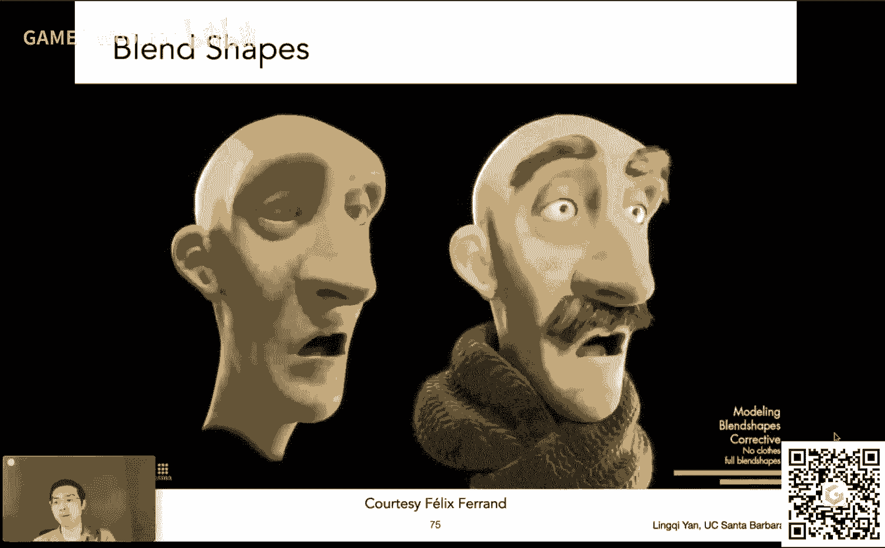

我定义两个关键帧自然而然就可以做一个所谓blind啊，这么一个意思好，那咱们可以再继续呃，下面的这个话题啊，快结束了啊啊是这么回事，就是说我们既然提到了，说好。

我可以通过给加这些控制点做reading这种方式来生成动画，对不对，那我我说我为什么不可以真正的给真人各个不同的地方，加上一些所谓的控制点，让这些控制点的位置直接反映到虚拟的造型上面去呢。

哎这个过程就有人想到，那这个过程就叫做动作捕捉呃，这个叫motion capture啊，是这么一个意思，怎么说呢，就是说你希望真人的动作真实的反映到虚拟的人物上面去。

要建立一个所谓虚拟的人物和真实的人物之间的关系对吧。

那大家可想而知怎么做，就要用一系列的控制点，而控制点呢大家质疑对于真人的控制点来说，其实有时候就显得非常奇怪，比如说看大家看这个角色对吧，哎这个这个角色呢上面有各种各样不同的这些求。

这些球呢就可以当做各种各样不同的控制点，哎只要说我这个人在做做动作的时候，诶，我把它拍下，我可以知道各个都不同的位置，我就可以把这些球的不同位置反映到对应的这个虚拟的人物上面去，没有问题吧。

那所以说我们就可以找各种各样的动作演员，然后演各种各样的这些实际的动作。

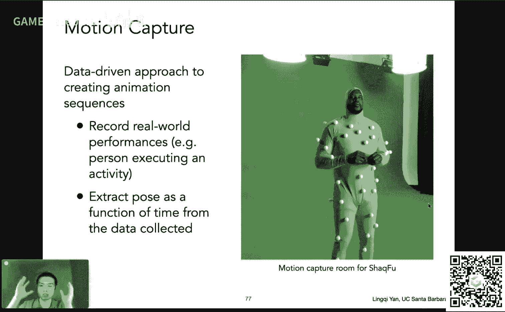

然后就不需要艺术家们来调，这就非常好对吧，那这是这是基本办法啊，就是说动作捕捉有没有什么好处啊，对好处，那当然了，能够更贴近真实对吧，真实感非常强，然后呢就是说我可以迅速的做出来，我找一个这个演员。

然后贴上这些呃所谓的控制点之后，我可以让他演一上午就可以得到大量的数据，没问题，如果我要让艺术家们去调，我们可能花好长时间才能调一个动作，对不对意思，那么它的问题在哪儿呢。

首先大家看那刚才那个衣服肯定不容易穿对吧，穿上之后是不是很痛苦，然后放上各种各样的点，是不是会不自然对吧，然后呢这这是一个就设置这些场场景啊，就本身呃这个呃要开始做动作捕捉，有很多事情要准备，这是一个。

然后呢嗯就是另外一点，就是说你你找到的这些呃，你你你其实啊捕捉出来的这些动作到底合理不合理，你比如说找一个真人，你让他去演一个动画人物，那动画人物大家都知道这个表情都非常夸张的，对不对，像真人平常来说。

我们嘴动的不多，但动画人物经常会嘴一下脸都大，对不对，是这个意思，那么这种情况就是说有时候啊他和对预习预期的目标是不一样的，那怎么办呢，这时候肯定还需要一会咱们去跳，就是有时候会这样。

当然更重要的问题在于，有时候你根本捕捉不到一些好的数据，就是说你的捕捉条件有限制，然后或者说呃还是刚才那个人啊，他在正面的情况下诶，他有这些不同的这些呃，呃能够被我们看到的这些所谓的这些控制点对吧。

那如果它背面也有，那刚才那个角度就看不到怎么办呢，背后加一个摄像机，那那这是不是要成本对吧，那我背后一个正面一个够不够正常不够正常，有好多得好几十，然后呢我在这个呃不同的方向都放了摄像机。

是不是就够了呢，也不一定，因为什么呢，有可能人物各种动作的时候会遮挡一个，他胳膊会挡住他身上哪一块，这可怎么办，对不对，也就是说有各种各样的问题存在，那就是说你拿到的这个捕捉信息到底可用不可用。

以及说这个准确度怎么样对吧，这是一个，那么其实呢不止有这么一种定义，所谓控制点的方法有各种各样别的东西，比如说这里呢它其实就是一些点人，人们呢穿上绿的衣服，那么直接白球就非常显眼。

那我自然而然直接用摄像机拍出来的照片，我用计算机视觉的方法去分析到底哪些是我们控制点就可以了对吧，那有一些呢稍微厉害一些，比如说像这种这个这些东西啊，我这个呃比如它可以发出某种磁场或电波啊之类这些东西。

然后我自然而然知道他在哪里不受遮挡影响，可以没问题，还有一些各种各样其他的方法，什么机械的东西，就是说我真正在这个在人人上面贴上一些这个所谓的机械的这些东西，知道这机械怎么样运动，就是机械会跟着人运动。

立刻就会反馈出来，就是这个意思就不需要经过一些视觉过程啊，这个意思好，那么就是说啊关于这些呃不同的方法来说，应用最广泛的是什么呢，应用的还是光学的方法，也就是说真正要贴一些所谓的mark贴在人身上啊。

要么是贴片啊，要么是这种小球都是有的，然后呢他会用特别特别复杂的一些呃，这些摄像机肯定不止一个，到处都会放对吧，然后然后我希望能够非常准确地把它给诶测出来，这些不同的这些点在哪儿，大家看。

比如说这样一个情况，他需要用呃超过八个相机，每一个相机得240Hz去捕捉这个动作，大家可以想象是多么一个高频率的捕捉对吧，然后真的还是出现了遮挡之后。

那确实就很难了对吧，就是这么个意思，然后呢实际的情况大家就是这样的，比如说大家可以看到这个真正的动作演员，然后它身上会穿各种各样的东西，大家看到这些小球。

它其实也是各种各样的这些所谓呃也是用来感知的一些东西对吧，然后包括这里呢，这里其实是相当于用各种各样不同的摄像机去拍一个这个角色，大家可以看到为了360度无死角。

这个嗯大家可以看到得用多少多少不同的相机。

对不对，是什么意思，好吧嗯，ok但是这个事情那当你测出来了之后，你其实测出来东西很有趣的，自然什么呢，这些一堆杂乱的曲线是什么意思，就是一个所谓的控制点或者marker啊。

这些marker它在不同的时间，它会出现在三维空间中的哪儿啊，你把它显示出来，显示出来之后，你会发现人真是非常神奇，这些曲线测出来的这些呃这个感觉哈，所以说这就是你得到一系列的数据嘛。

那也可以可以可以想象嘛，你肯定是对某一个呃任何一个呃控制点，然后进行不同时间上的追踪，告诉他在三维空间中的坐标在哪里对吧，每一个都这么追踪，就是精神很多这种不同的曲线就是这么个意思对。

然后呢人们现在在这个研究过程中啊，嗯会发现这么一个事情，就是说人们会发现通过这种动作捕捉方式，然后通过各种各样真实的这个动画生成的方式啊，人们会得到更非常非常非常真实的一些这个呃动画。

比如大家看到这里其实还不是多么真实啊，这基本上来说就是说呃一些呃已经很真实了，但是还没到非常非常以假乱真的这么一种地步哈，然后但是现在已经有人开始在思考这么一个问题啊，呃很有深度的问题。

但是很难现在来说能够下定论什么呢，就叫做恐怖谷效应，叫uncanny valley，说白了意思就是人类怕这个被人工智能统治世界哈，就是这个意思，道理是一样的。

人类也会怕说这个如果我生成的这些东西过于真实了怎么办，如果有人用它来做一些这个这个坏事情会怎么办呢，就会有这么一个事情啊，这很正常，就是说呃总会有人来关心这么一个问题啊。

然后呃不过呢我们回到技术问题上来，这是我更愿意探讨的话题啊，就是技术问题上来就是这么回事，就是这里呢呃我们在第一节课就给大家说了这个事情，就是阿凡达这个电影呢它是里程碑式的效应，到底是为什么。

就是因为他用了面部的动作捕捉，然后他的面部动作捕捉是这样的，大家可以看到人脸上有各种各样不同的颜色记号对吧，然后就是说这些记号分布的非常这个呃密集，然后如果人们面部有各种各样不同动作。

立刻他就可以反映在这个人物的角色上。

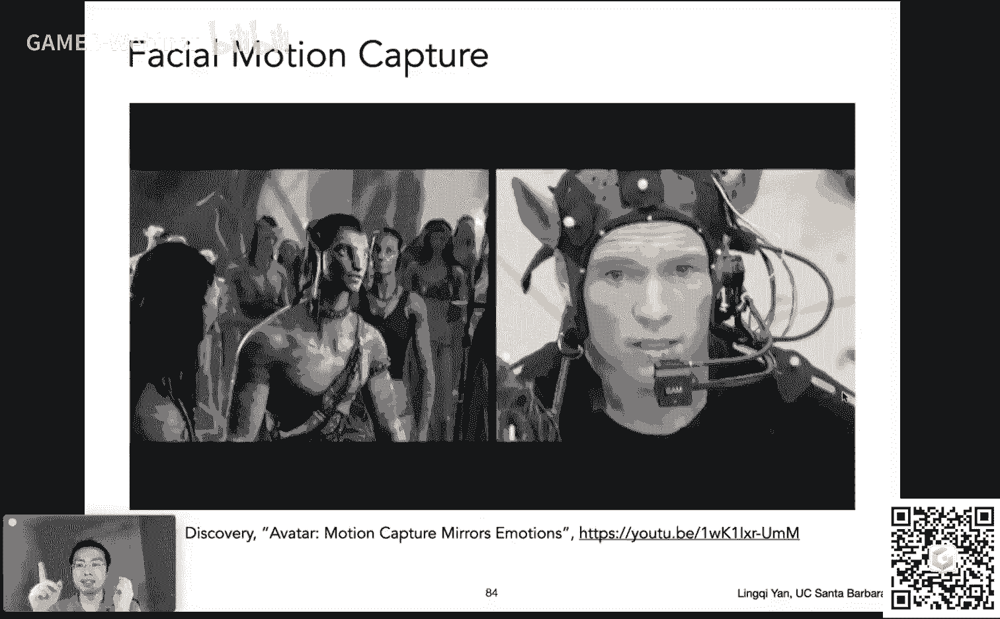

虚拟的人物角色上，对不对，然后就是这么个意思啊，大家可以看到这里更多是指导演在说话。

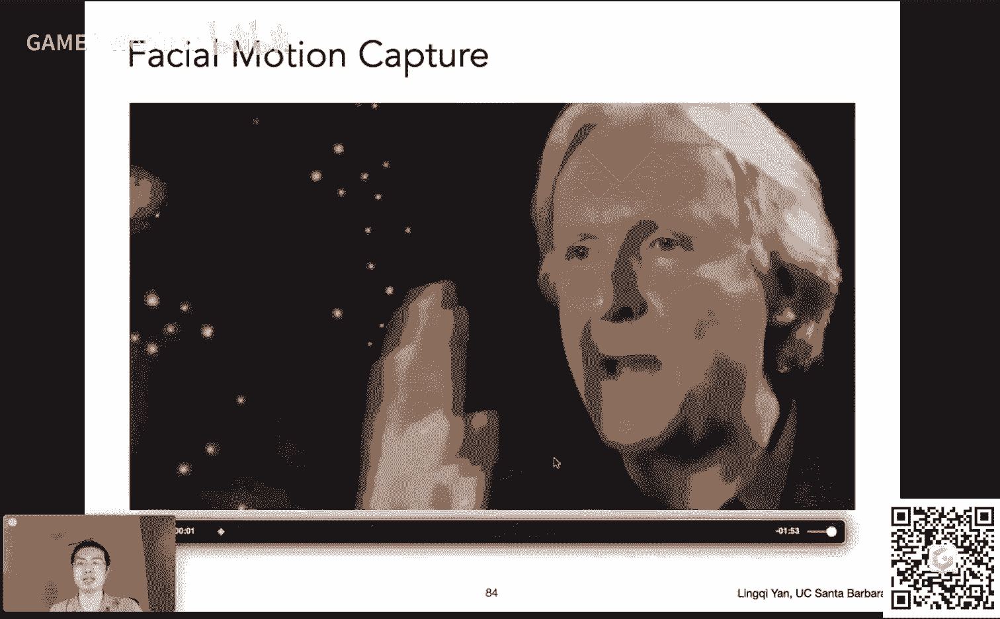

我们稍微这个过一点哈，这里大家可以看到是哦，我只要这么一点就没有动画了，好吧，我这么拖过来吧。

大家可以看到人物在实时的做一些动作，立刻可以反映在电脑上啊，这就是想给大家展示的这块内容，那这里又是一个情况，眼珠也是一样，都可以运动，包括这些大幅度的运动，自然而然这些更简单。

因为面部表情它通常都是非常微小的，对不对，看这里对吧，人物的面部表情立刻会直接反应到这呃虚拟的角色上。

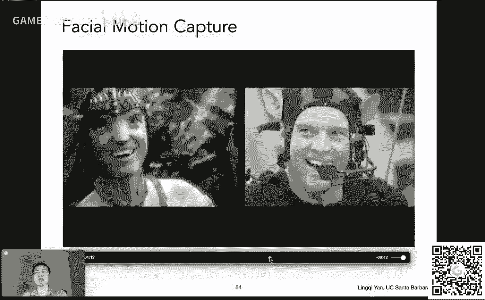

对吧，哈哈哈哈行，那没问题啊，这也是这么一个意思，然后呢啊讲到这里，差不多咱们就已经可以给整个一个啊动画或者电影，它的生成过程定义下来了，怎么做呢，大家可以看到这是非常非常全面的一幅图哈，大家可以看到。

比如说有一天哎谁起床了，想到一个办法呃，想到一个，比如说我要做一个电影，比如说我想做一个冰雪奇缘啊，然后呢呃召集大家开会，告诉大家啊，我要写这么一个故事，非常不错，然后呢大家觉得一拍即合，非常好。

那咱们画一些这些简单的最简单的一些场景，直接手绘啊，画出了一些最简单的一些草稿，然后也就是所谓的原话啊，然后来表示说哦，我大概有这么一些场景几十个，然后每个场景大概都要说一些什么内容，没问题啊。

然后这个播放给大家看，当然这个播放呢就是放幻灯片这种方式啊，播放给大家看，对对对，但是觉得好就是设计师呢在中间在设计各种各样不同的场景，应该长什么样啊，别的什么应该怎么样，就说到这里来说。

基本上来说就已经在脑海中，已经有一个说我对整个一个动画的一个基本把握了，包括任何一个场景应该长什么样，包括我需要哪些场景，然后故事怎么样说，那当然了，图形学之外的内容到这里进入到产品线以后。

立刻就要开始做各种各样的实际操作，什么呢，就是说啊人们会呃做一些这些工作，比如说嗯咱们可以看这里当然是实际的这些场景，比如说他们不是用这个三维动画来做的哈，咱们假设是说真正的我要做一些这个动画。

比如木偶戏这些东西啊，然后我要把物体放在不同的位置上去，得有人研究对吧，光线应该这个呃应该放在哪儿，这是后面的事情啊，就是说整个一个场景应该如何布置，然后我关于我要的这个呃主人公他长什么样。

都要把建模出来，这个建模是真的见过哈，比如说这打印成一个纸板啊，然后我在上面这个涂上各种各样不同的这些呃这些颜色什么，这可不就是给它一个不同的呃叫什么呢，纹理嘛对吧。

然后呢下一步就是rigging和这个model，基本上是这个非常非常吻合的一个事情，就相当于是这个这块之后，然后让它能够动起来，然后这个各种各样的这个不同部件我可以操作它，那反应在三维动画上。

就是我刚才说的，通过各种控制点，我可以让它也有各种各样不同的造型，那么下面呢我就可以做成一个把它做成一个动画，比如在一定的时间内应该是一种什么样的方式，比如一个奔跑的兔子啊，就这么一个情况。

然后呢这里就会涉及到说好，我要差不多可以准备渲染了，我场景搭好了，然后物体在这儿了，然后这个他应该怎么样运动，我都设计好了，然后现在我给他各种各样不同的光照，我希望他能够这个看上去像我要的最后的效果。

这叫lighting，然后呢比如说这里大家看到了一个很形生动形象的东西叫visual effects啊，就是说在在这个工业界啊，fx正常就是effects的这个缩写啊，就是效果的缩写。

所以其实我一向不赞成把它翻译成这些特效，special effects才是才是这个特效啊，各种各样不同的效果，比如说这里着火啊，各种各样的效果，也就算是这里面中间的一部分啊。

而光线把动作把这个场景所以都布置好之后怎么办渲染，然后也就是说什么呢，也就是说到前面这一步，所有模型什么都得到了，然后所以模拟仿真啊，什么东西都在之前就在这个reading啊。

这块animation这一块啊，然后渲染渲染完了之后得到一个三维的图对吧，这就是等于是我渲染出来已经结束了，结束了之后，然后我就可以把各种各样拍出来的东西呢。

大家看这个还是这个兔子和各种各样的场景结合在一块，比如说一些背景啊，什么东西怎么弄，就好像说我拍一个真人，我拍绿布对吧，把人人像给拿出来给它放在哪儿，这属于后期合成结合成合成了之后呢，在二维的情况下。

也会有一些各种各样的这些这些各种各样不同的效果，比如说我要给它变成什么老照片的这种效果啊，以前的坏掉的胶片的这种效果呀，然后或者是像下雨呀，或者别的什么东西啊，如果如果说我可以在2d的情况下做。

我就在这儿做啊，这个意思，然后后面就是说我要发布产品了，我要调一调做一次，做一做微调，我要保证各个场景看上去都比较好，然后各种各样的问题我都修复好，然后以及包括说如果有这个嗯呃怎么说呢。

就是说啊深度的这些东西啊，3d的电影，然后之前渲染出来应该是有两个不同的这个方向的对吧，然后两个不同方向还要结合在一块儿做的对，然后还要字幕各种各样的东西，最后形成产品，大家可以看到这么一个过程啊。

非常非常合理的一个现代化的，一个整个一个动画的公司在做的一个事情，所以大家可以想象这是一个多么大的人力物力的消耗，然后别的我不知道啊，首先美工的这个工资开销，这是一个非常大的一块。

然后渲染本身它需要计算能力的开销，咱们之前说过对吧，像迪斯尼什么他们都需要所谓render farm，就是很多很多的这个计算机形成了集群cpu的集群，然后拿过去做渲染，然后是是非常非常贵的事情。

每时每分每秒都在烧钱啊，这么个意思，这就是为什么说呃做动画电影做出来的这个成本要请演员还要高，大家想象一下这个演员这个工资就已经非常高了对吧，但是做动画电影就是全3d的，是更加更加费事的。

呃费这个这个这个怎么说呢，呃预算的哈，这个事情好，那么这里呢我差不多就说到这儿，那这就是今天的这个主要内容，那么最后一个话题啊，最后一个话题就是我们下节课会主要给大家说。

我们到底怎么样去把这些事情解出来，就是说我给了各种的这个力啊，物理啊，理论呢我怎么把实际的运动给解出来，我用什么样的方法来做，那么这里呢给大家一个提示，然后大家看过jojo的话。

会知道这个空调承太郎对吧，然后他在打架的时候会说什么呢，哈哈哈哈哈哈呃好吧，我来看看弹幕有没有同学来告诉大家啊，嗯看看啊看看啊，稍等这边啊直播一向有延迟哈，好哎不对不对，还啊啊哈哈哈哈哈。

可以可以可以有同学已经这个知道这梗了哈，好没问题啊，然后那个呃下节课啊给大家说欧拉方法啊，就是欧拉啊，然后当然还有其他的方法，拉格朗日方法，各种各样别的什么方法，然后以及说咱们结课。

然后还有一些其他的内容好吧，那咱们下节课再来说这个事情啊，好那么今天咱们就说到这儿啊。

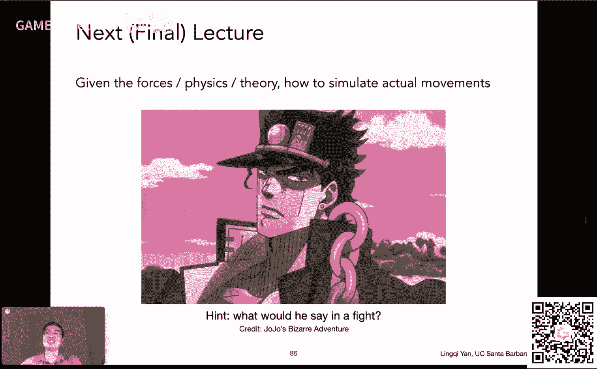

感谢大家支持啊，咱们呢还有最后一节课啊，啊这个非常好非常好啊，那咱们今天就到这儿，我也不再多留时间了，今天我时间非常紧张啊，然后我差不多这还有其他事情，然后如果大家有问题的话。

那大家欢迎到论坛上面去问好吗，然后如果我能及时看到这就是回答，那咱们就现在就把呃时间交还给技术秘书同学啊。

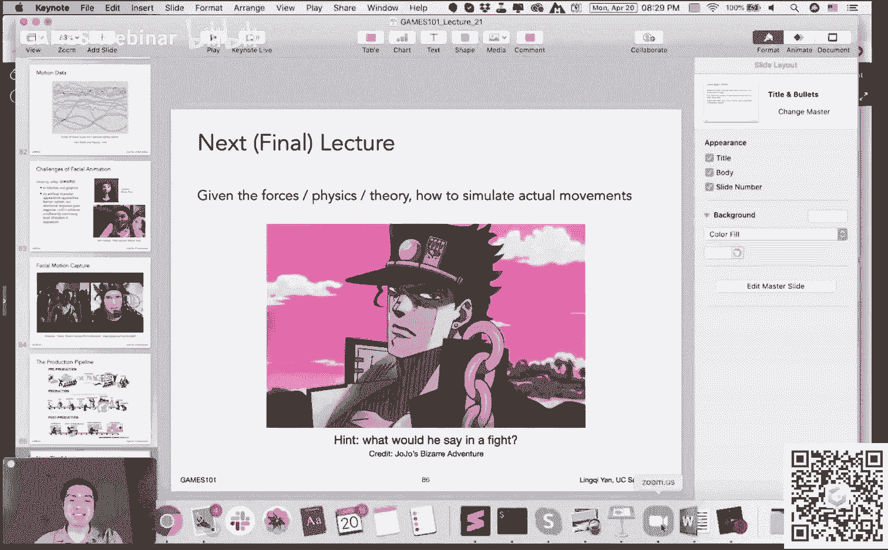

诶好像不是这个啊，好没问题啊，感谢大家啊，大家再见啊。

