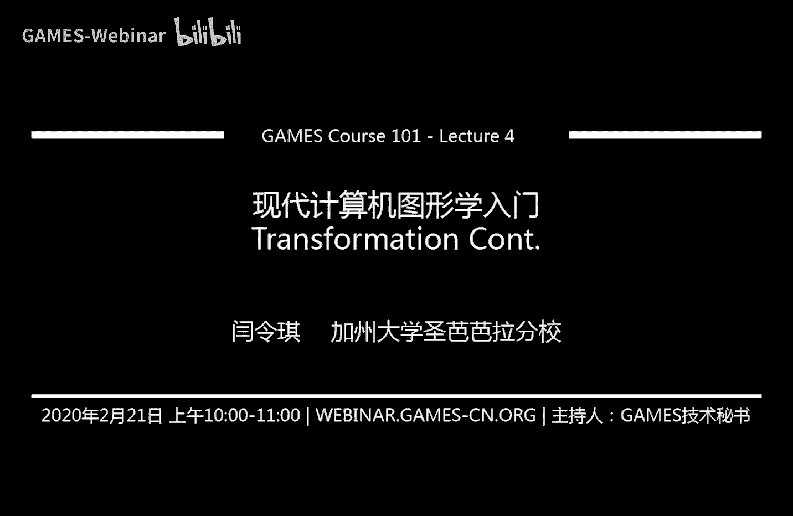
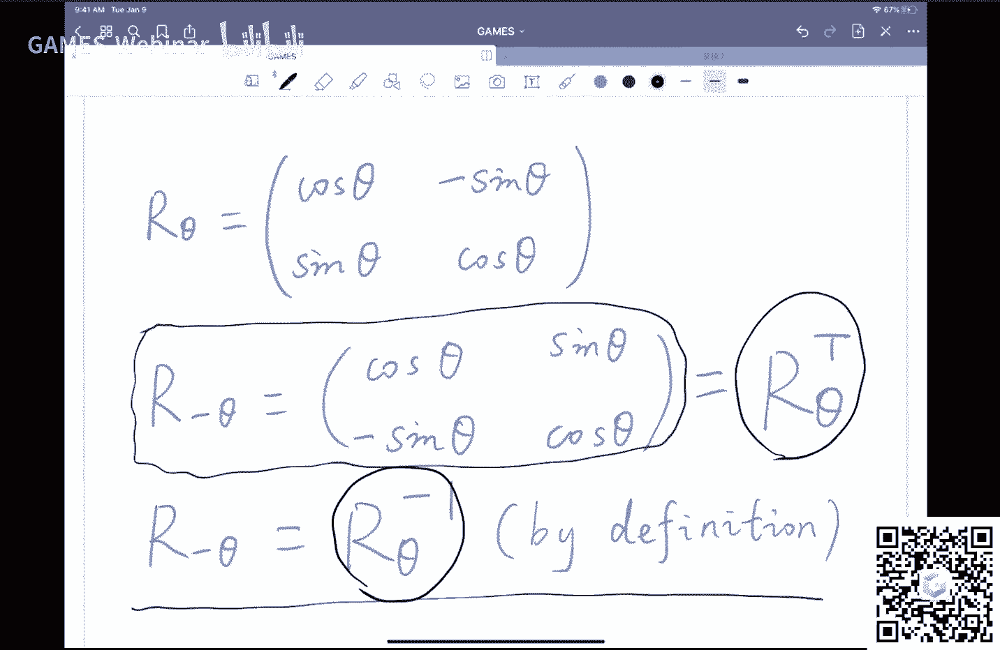
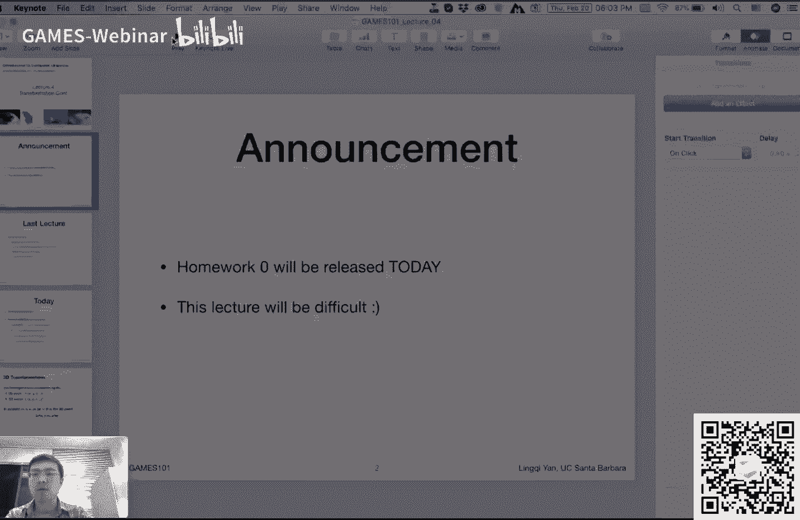
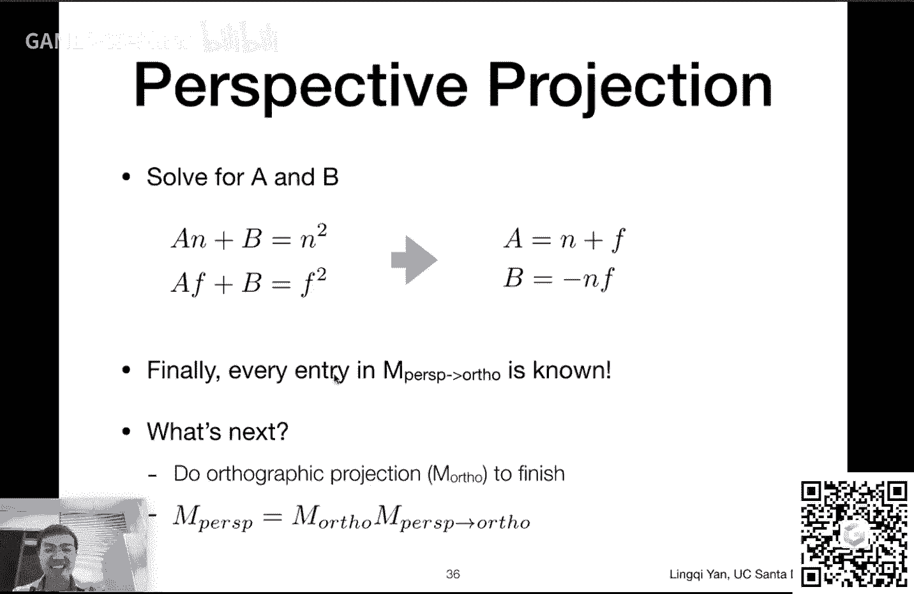
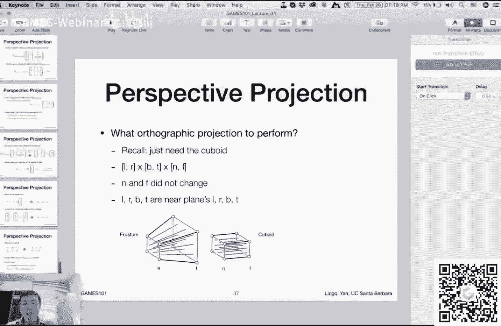
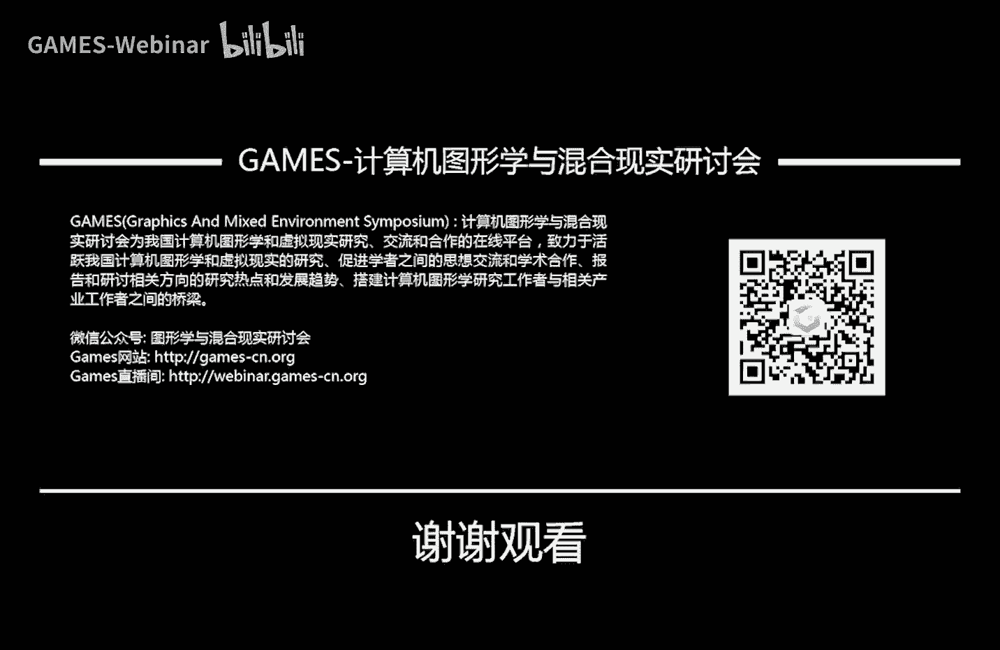

# GAMES101-现代计算机图形学入门-闫令琪 - P4：Lecture 04 Transformation Cont. - GAMES-Webinar - BV1X7411F744

好谢谢大家的大力支持啊，这个图形学入门咱们已经讲到了变换，然后这节课我们真正要深入讲一些，这个这个变换的一些内容好吧，然后呃我们简单说一下啊，在课在这个这节课之前，咱们先做一做这个呃一些事情的宣布。

一个是呃大家期待已久的作业零嗯，咱们这个如果顺利的话，今天应该会放出来，然后到时候大家这个呃，时刻关注这个微信上面，这个消息就好了好吧，然后作业零非常非常简单，只是给大家配置环境上手用。

基本没什么实质内容好吧，这是一个，然后另外一个这节课大家做好心理准备，这节课不容易啊，这个可能是这么头几节课以来，最困难的一门课呃，一一节课了啊，然后但是我希望咱们这个呃，把这个事情一块。

咱们把这个事情探讨清楚，所以应该还可以，所以也没有什么心理负担啊，咱们就这么听下来，然后在这个之前呢啊，我上节课其实有一块内容，希望给大家补充一下，然后但是上节课给忘了，然后咱们在这个之前。

先把先把这块儿给说明白，这个也就是我现在给大家写的这个白板，再看这个这这里我是在说什么呢，我是在说这个，上节课我们提到了这个，二维情况下的这个变换啊，如果我们不考虑这个齐次坐标，那么二维的变化。

基本上就用这个2x2的这个呃，矩阵来表示，那么呃旋转怎么写呢，就是旋转一个c塔角度，这个写作这个cos副词i，然后一个sin，一个cos就是这样，那么咱们想一个问题哈，那如果我们要想要想写一个这个嗯。

旋转副c塔角呃，那这个矩阵应该怎么写，大家可以看到这是在这个第二行，这里就可以看得到对吧，这个呃负theta很简单，把之前的这个theta都用负theta来代替。

我们知道cos把sa换成副theta之后不变，它还是cos thet，然后如果是sin的话，它就得在前面加负号，那就是说sin负最大等于负sin it的，那这样的话就会变成呃。

这个右上角变成了sin阶段，左下角变成了负sin the对吧，然后大家会发现啊，这个矩阵和上面一个矩阵如果我们相比，我们就会发现这个旋转副c塔角度，其实就是把这个旋转c塔角度，这么一个矩阵。

做了一个转置行和列对换对吧，然后然后这是一个可以观察到的情况，那另外一个情况是什么呢，就是从定义上来看，咱们大家来看这个第三行，从定义上来看，那我旋转c塔角跟我旋转副c塔角，正好应该是一个互逆的操作。

然后从咱们之前介绍这个矩阵的这个逆，这么一个一个一个定义上来看，那么旋转副c塔角，其实就应该是旋转c塔角得到的，这个矩阵的这个逆诶，所以大家就可以看到一个有趣的，这个关系啊，咱们用这个黑色把它圈出来。

在旋转里面啊，旋转的这个矩阵，它的逆就等于旋转矩阵的转置，那么这是一个不错的性质，为什么咱们今天要说这个呢，是因为咱们今天会用到这么一个性质啊，如果我们想求一个旋转的密呃，旋转对吧。

就是往相反的方向旋转相同的角度，那么很简单，我只是要写出来一个正向的旋转，然后把这个矩阵给转制过来，这自然就是它的逆，另外呢在这里多说一句，在数学上，如果一个矩阵的逆等于它的转置。

那么我们管这个矩阵叫做正交矩阵好吧，这里是一个这个算是稍微加一点点知识。

然后这节课也需要稍微用到一点，那咱们继续啊啊。

那上节课我们主要说了什么内容呢，这个呃说的就是最基础的变换对吧，从这个变换的应用上来看，我们说变换是非常重要的东西，然后呢，变换我们着重说了几种二维情况下的变换，这个旋转缩放以及切片，没错吧。

然后我们说啊有一种变换它很特殊，是什么呢，那就是这个平移这么一个变换，这个变换它特殊在，你不可能把它写成一个矩阵，乘一个向量的形式，你非得在后面加上一个这个平移的这个量，那么为了这个不把这个平移。

变换当做一个特殊情况怎么办呢，人们就这个研究出，用这个这个旗子坐标来表示这种变换，这样的话呢，就是不管你表示的变换在多少维度，那么它都是增加了一个维度，就比如说二维情况下。

我们原本xy表示一个点或者向量，然后呢我们在后面加一个一或者一个零，来表示它的这个呃，这个在齐次坐标下的点和向量，然后呢同样道理，这个呃相应的矩阵也多加了一圈对吧，相当于是这个意思，然后在二维的变换下。

应该是一个3x3的变换矩阵，那这样的话的好处，就是说，我可以把这个这个各种各样的这个呃，线性变换和这个呃平移变换可以写在一起，然后就不用有任何的特殊情况，然后我们还说了啊，这些矩阵可以乘在一起。

并且可以这个根据结合律可以任意的进行，这个先运算矩阵，还是先运算这个，这个这个呃矩阵应用在向量上对吧，然后我们还提到了这个呃各种变化，如何去分解它，如何去合成它，然后我们提到一点点关于这个三维的变化。

那么在这节课上呢，我们先把这个三维变换给说完好吧，然后今天我们先把三维变换结束掉，然后之后我们主要来说，这个相对比较困难的一个，我们管它叫这个view in变换，那这个其实说我这个做了不少调研啊。

我发现这个国内的教材，其实更多的是把这个观测这么一个变换，给分开来，来这个这个命名，一个叫做view transformation，咱们管它叫视图变换。

然后呢一个叫projection transformation，咱们管它叫做这个投影变换，那么很少有人把这个视图和投影，放在一块儿，管它叫做观测变换，另外其实我真的不知道他是不是应该叫做，观测变换啊。

那如果没有之前没有人定义，那我就这个我就这么定义了，好吧，哎咱们这个是大概就是这么个意思，就是说咱们今天着重要讲两个，一个是视图变换，一个是投影变换，其中投影变换呢，咱们会讲到两种不同的投影。

一种叫正交投影autographic，还有一种叫做透视投影，叫perspective，然后这两个都是什么意思呢，咱们把它给说清楚，这么一个关系啊，大概就列在这里了，那么大家可以看到这个三维变换。

其实我并不准备这个说得特别深入哈，基本上来说按照二维的这个变换理解一下，然后咱们大概就知道，这个三维变换是怎么回事的，那么三维变换咱们上节课提到这个事情，就是说啊三维的情况下，如果我要用呃。

其次坐标来表示三维的点或者向量，那我们那我们就在这个三维的这个坐标，x y z之后加一个一或者是零，然后用来表示这个点或者是向量嗯，这个跟二维情况下完全一样，那么它的操作呢也是完全一样，就是在这里。

这个我们认为如果有任何一个三维的点，x y z w，然后这个w呢只要它不是零，我们就把这个所有的x y z都除以w，那么我就认为x y z w这么一个三维的点，表示的三维的点就是x除以w。

y除以w和z除以w，那这个咱们这节课还会这个，更多的去用到它，好吧，那么这个我们上节课差不多停在这里对吧，我们提到说嗯，在三维空间中，我们一样可以用其次坐标，然后来表示这个三维空间中的变换。

那么三维空间中的变换原本的3x3，那用了齐次坐标之后，那自然会变成4x4，然后我们说了，对于仿射变换，也就是线性变换和平移这两个合在一起，这个嗯他们的这个啊仿射变换的这个矩阵，这个4x4的矩阵。

它是仍然满足一定的规律的，比如说最后一行还是0001，最后一列的前三个仍然是平移的量，tx t y t z，然后左边的3x3，仍然表示这个正常的这个这个呃线性变换，比如说像什么缩放对吧。

xyz都可以这个同步的缩放，然后其他的这些变换也都一样，然后我之前问了问了这么一个问题，就是说那么在这个矩阵的表示下，那我们是先应用线性变换，在这个在在这个点上xyz一上，还是先应用平移。

然后我们刚才回到了我们之前上节课，最后啊回到了这个二维的情况下，大家看了这个展开的式子，你会发现啊，原来是先应用线性变换，然后再加上一个平移量呃，所以在三维空间中是一样的，没有问题，那么类比的来看呢。

这个三维的变换其实非常简单，比如说咱们看这个呃缩放，缩放呢x和y和z可以这个自由的缩放，然后三个轴这个缩放的量和可以各不相同，然后呢这个每一个缩放就会影响自己的轴，所以它是左上角的3x3的一个对角阵。

sx xi和sz，然后这里没有问题，那么平移呢平移也是一样的，就是说这个大家看到只有最后一列，然后它有tx t y t z，这是指表示平移，左边的3x3呢是一个单位矩阵，然后这个没问题。

那么三维空间中的最复杂的操作，可能就是旋转对吧，然后呢，旋转这里给大家把这个式子列出来了啊，就是说这里在说是一个什么事情呢，如果在三维空间中，我希望把一个这个物体进行一个旋转。

我想写出来这个旋转的这个这个嗯矩阵嗯，对于任意的旋转，那当然很难写对吧，那咱们先从简单的开始写，假如说这个物体，三维空间中的物体，都是绕着某一个固定轴旋转，比如说要要么绕着x，要么绕着y。

要么绕着z对吧，然后大家看右边这幅图，右边这幅图呢，这个呃描述的就是呃，我有一个什么样的物体对吧，比如说这里有一个平面，然后它绕着x轴旋转，大家会发现绕着x轴旋转，反映了一个什么问题呢。

反映了它的这个y和z啊，都是再进行旋转的，然后但是这个任意一个点，它的x是不变的对吧，然后这就是一个特殊情况，反映在这个矩阵上面，大家可以看这个矩阵，这个大家可以看到左上角3x3的矩阵，x是不变的。

所以所以这个第一行是100，然后第一列同样也是100，然后呢，这个大家可以看到右下角，这个2x2的矩阵，这个是不是非常这个很熟悉对吧，因为这个矩阵其实就是在对y和z进行，alpha角度的旋转。

所以说这个呃绕x轴旋转非常简单，同样道理呢绕z轴旋转也非常简单，大家可以看到这个绕z轴旋转，那就是z对应的这一行，这一列没有变化，左上角的2x2，x和y还是一模一样的对吧，那也就是说这个非常简单。

但是有一点，如果大家这个这个细心看的话，现在就已经能够看出来了哈，就是说如果大家看这个绕y轴旋转，是不是发现有一些问题对吧，然后是什么问题呢，大家会发现啊，这个cos和sin。

这个在这个2x和r z这两个矩阵里面，哎，他们都是这个右上方，这个这个sin它是负的，然后左下角它是负的啊，它是正的，然后在这个r y里面正好相反，对不对，然后呢这个这是怎么回事呢，是不是哪儿写错了呢。

嗯答案是不对呃，是这里写的是完全正确的，只是这个这这里的理解会不太一样，这个要怎么想呢，就是说这个涉及到我，我们怎么样去思考，这样一个这些轴的相互顺序啊，比如说我们说这个轴是x y z。

那么就是说x x乘y，还记得右手螺旋定则对吧，x x乘y得到z，同样y差成z得到x，所以大家如果把这个这个给写的这个呃，把x y z啊这个反复的抄写很多遍。

就是x y z x y z x y z这么重复下来，你会发现给你xy你会得到z给你y z，你会得到x就给你任何两个，你都可以得到最后面的一个，那么这样哈，就是说就是说嗯，在这里。

大家会发现这个这个性质叫做这个嗯，循环对称的性质，然后呢，嗯这里这就可以解释，为什么这个y得出来的这些结果是反的，因为大家可以从右边这幅图上来看，谁和谁差成，可以得到y是z差乘x。

得到y并不是x差成z对吧，所以这就是为什么它它是反的，这如果是x长成z，那么正常写这个x和z这么四个四个数上，应该还是跟原来一样，但这里是z差成x是反的，所以说这个这就是为什么这个r y这里啊。

看起来要稍微这个跟其他的不一样一点，但是没有问题好吧，然后这个就是说三维空间中，最简单的一些旋转就是绕轴旋转，那么咱们自然而然要问这个问题，就是说如果是一般性的旋转，应该怎么样处理，对不对。

那么嗯嗯在这个图形学里面啊，大家通常都会思考这么一个问题，就是说我们能够解决一些简单的这些问题，但是对于复杂的一些问题，我不会不会没有关系，我们可以把它转化成一些这个这个这个呃。

简单的这一些这个呃问题的组合，比如说像这里就是这样，就是说我任意对于这个某一个这个，这个旋转啊，我不知道要怎么样把它给分解成这个呃，任意绕轴的旋转，但是呢就是说我们可以先思考这么一个问，题。

就是说这个给你这些简单的这些旋转，绕着这三个轴的旋转，你是否可以通过这个旋转，把某一个方向旋转到任意一个方向上去，就首先证明说，我们能够做到用这些简单的旋转，来这个描述复杂的旋转。

那么在这里就是这么个意思，大家可以看到上面有一个公式，这个公式其实非常简单，意思就是说这个你的任意一个，这个3d的这个旋转，然后我们都把它写成绕x轴轴，绕y轴，绕z轴的这个旋转的组合。

然后呢绕x y z轴三个这个轴的旋转的量，分别是alpha角，贝塔角和伽马角，然后这三个角呢又被称作欧拉角，然后这是这个我们数学上这么个定义方法，那么在这里就是说如何证明，说这么一种做法是合理的呢。

那咱们大家就想象一个这个正常飞机啊，它这个运行的这个方法，这个飞机假设它在向前这个运动，那么它可以做几种不同的旋转呢，第一它可以抬头或者低头对吧，这是一个可以做的这个旋转，然后另外一个呢。

这样向左或者向右，这样一个一个方向的这个旋转，还有一个旋转呢，大家在这个坐飞机的时候会发现很常见，还有一个旋转是把飞机歪过来，这样旋转，对不对对对，就是这么这么一种旋转，大家可以体会一下区别啊。

这样一种旋转和这样一个旋转，是完全不一样的，所以说这分别对应了这三种不同的操作，我刚才说这个旋转基本上叫做这个roll，这个操作，然后呢我们说的那个左右这个这个旋转，这个旋转叫做这个要这个操作。

然后peach这个旋转操作，那大家可以想象说这个飞机啊，基本上来说诶，他他这个通过这么几种不同的旋转，它当然可以把它的这个飞机的这个头朝向，调整到任何一个方向，也就基本上这个事情。

就就是说给了我们一个怎么说，一个直观上的想象，那就是说确实是可能复杂的这个旋转啊，绕任一轴的旋转，咱们都可以把它分解成这个最简单的，这个绕这个xyz轴的旋转的组合，那确实事情也是这样。

那这里是呃在图形学里呢，就有人这个发明了一套这个办，法，然后可以把任意的一个旋转，给写成这么一个矩阵，这当然就是通过把任意一个旋转给这个，分解成这个x和y和z，三个不同的这个呃轴上。

然后分别做旋转得出来的结果，那这个公式呢，大家可以看到叫罗德里格斯旋转公式，然后这个旋转公式啊大家可以看到呃，非常复杂不错，然后推导怎么推导的呢，这里这个在这节课后，我会把这个我自己手写了一份。

这个这个推导的一个一个一个嗯过程啊，那咱们课上不多说，我把这个推导的过程，放在这个课程的补充材料里面，这个在课程，的网站上，在这节课之后都会能够这个看到，那这里其实我着重要说一点什么呢。

就是说大家可以看到，这个罗德里格斯旋转公式是在干什么，他是给我们一个旋转矩阵，它这个旋转矩阵的定义了一个旋转轴呃，n对吧，大家可以看到旋转轴n和一个旋转角度，那旋转角度我好理解。

旋转轴似乎不能这么简单的定义，对不对，因为一个旋转轴来说，你只用一个向量来表示一个旋转轴，是不是不太合理，这个旋转轴首先得跟它祁连有关系，然后跟它方向有关系对吧，假如说我让它沿着y轴旋。

转跟沿着这个这个嗯x和z各等于一，并且也是沿着y方向这么一个向量，就是方向一样，但是他们起点不一样，那整个结果肯定不一样，所以说我只说一个这个轴的方向，似乎是不够的对吧，那么实际上来说呢。

这里是大家默认的一个想法，就是说我说沿着某一个轴的方向旋转，其实就认为这个轴它是过圆心的啊，不是圆心啊，过圆点的，然后这个这样的话，它的起点就认为在原点上，它的方向就是这个n这个方向。

然后旋转角度是alpha方向，所以没有问题，那么大家在这里肯定是要问这么，一个事情啊对吧，那如果我真的要让它沿着任意轴旋转，怎么办呀，就是说这个轴如果我可以平移怎么办，那么这个时候就是考验大家。

上一节课其实我们提到过这么一个事情，我们在讲这个呃变换的分解的时候，我们说这个我们会做一个二维的旋转，绕着这个圆点来旋转，但我现在如果我想绕着任意一个点来旋转，怎么办呢，那么大家如果还记得对吧。

我先把这个这个旋转的这个点，中心点给平移到这个原点上去，再做旋转，再把它平移回来，那么在这个这，个三维的空间中里面是完全一样的做法，就是说如果我要沿着任意轴旋转，而这个轴的起点并不在原点，没关系。

我们先把所有的东西都给移到这个这个呃，使得这个轴的起点在原点这么一个条件下，然后再旋转，然后再把所有的东西都给移回去，这样问题就解决了对吧，那就是说所以说我们这个知识啊，都是触类旁通的。

就是说这个在三维的情况下，也同样是这么一个道理，那这是第一点我想提到的一个事情啊，然后第二点我想提到的一个事情，就是后面啊这个大家看到有个大括号，括起来有这么一个n对吧，这是一个矩阵。

然后这个矩阵不知道，大家看着熟悉不熟悉啊，这里当然了，这这个又涉及到我们之前课上说的东西，对吧，我们提到向量和向量是可以做叉积的对吧，或者插成，那么向量的叉乘是可以把它写成一个，这个呃有一些公式啊对吧。

差成最后的结果得到的是一个向量，我们也可以把这个第一个向量给写成一个，矩阵形式对吧，然后呢，我们再用这个矩阵去乘以第二个向量，然后得到的结果，这个就是就是这个差成的结果，那么这个对应的矩阵就是写作。

这么一个形式，所以如果大家记得这个事情的话，就是说这里其实就是在说，如果我想运用某一个插成，然后我把它写成矩阵形式会是什么样的，那么整个这个式子看起来，这个相对复杂一些。

但其实推导来说是一个很直观的事情，虽然这个推导过程比较繁琐，但其实思想很简单，大家之后这个看一眼这个这个推导的，这个过程就好，那么到此为止啊，就是说对于这个三维的变换，我并没有说特别多，就是说嗯有很多。

这个这个嗯知识点基本是相通的，像一些基本的线性变换，然后向平移向，旋转就是稍微麻烦一点，然后呢旋转这里有一个概念，我并不打算在这门课里面说，但是简单跟大家提一下嗯，在旋转上，这个图形学的课啊。

大家可能会学到一个概念，叫做四元数这么一个概念，这个概念并不是说这个概念就非常古老，所以我不再说了，而这个概念其实现在还在用，就是说呃四元数这个概念，其实它这个它的引入嗯。

是更多的是为了这个旋转与旋转之间的差，值这么一个目的来做的，是什么意思哈，就比如说大家写一个二维空间下，咱们还，还不考虑这个什么呃，齐次坐标，二维呃，二维的旋转呃，比如说旋转个15度。

然后呢那我可以写出一个公式，2x2的对吧，然后我还另外写一个公式，旋转25度，然后如果我把这两个矩阵加起来求个平均，那么相信大家应该知道，这个结果并不是旋转这个20度，这么一个结果对吧，然后也就是说呢。

这个旋转矩阵这么直接写出来之后，是不太适合做差值的，是这么一个过程，就是说嗯考虑到这一点，这个四元数在这方面就得到了一个，不错的应用，但在这门课里面咱们就不再提了，好，大家去找到四元数。

并且找到这个如何与这个矩阵来进行转化，这个应该就可以解决问题，那咱们这个三维的空间变化，基本就说到这儿，那么今天最主要最主要的内容呢，还是说这个要把这个呃这个viewing，这么一个变换啊给说明白好吧。

投影变换，然后咱们挨个说，先把这个视图，或者说这个相机的变化给说明白，然后再说投影，那么在这个之前我先确认一下啊，看看大家这边有没有什么问题，ok大家之间有有同学问这个说这个y特殊。

是不是因为右手这个细的问题呃，并不是啊，左手系的话也一样会存在一些特殊的轴，这个没有关系，ok其他好像并没有什么问题，ok啊有同学拼了一下这个四元数的英文，拼错了哈，这个稍微改一改啊。

ok然后其他应该就没什么，那么咱们这就开始说啊，这个这个viewing呃，或者说观测这个变换，那么这是什么意思呢，就是说我们学了那么多变化啊，咱们别忘了最基础的这个目的，我们为什么要学这个呢。

最终我们试图把这个，三维空间中的物体给变成二维的一张照片，对不对，在这个过程里面呢，这个这个到底发生了什么，咱们要把这个事情给搞明白，而这个过程大家可以想象啊，从三维原本三维空间中的世界对吧。

然后变成一张图，那自然变成了二维，那这个过程肯定，这个这个涉及到从三维到二维的一个变化，那么这个变化肯定非常复杂，那咱们这个把这个事情给给这个，想清楚对吧，那我们学这个矩阵现在要开始用了。

ok那么咱们一开始先说啊，这个我们这个拿到一个场景，那我肯定要规定这个场景，然后呢这个呃我肯定还要规定一个，比如说这个相机的位置，或者说我人眼的位置对吧，然后我得到某一个这个投影出来的图。

这个是应该是一个比较直观的，这个这个思想，否则的话给你一个三维的场景，你从不同的地方看看到东西肯定不一样，所以怎么看这个东西，这是很重要的，所以说咱们从这里开始，ok那么我们说首先什么是视图变换。

这里呢就让大家思考一个简单的问题啊，什么问题呢，思考一下我们怎么样拍一张照片对吧，我说现实生活中怎么办呢，首先找一个好的地方，把所有人都集合在那里摆好pose对吧，这一步。

我们在这个图形学里面有一个相应的对应，我们管它叫做模型变换对吧，相当于把模型什么都摆好，把这个场景搭好，这是第一步，第二步我们要找一个好的角度对吧，大家都知道这个拍照最重要的是什么角度，对吧。

然后找一个好的角度，或者说找一个好的位置对吧，我先把这个这个相机放好，然后往某一个角度去看，唉这一部分我们就管它叫做视图变换，就是说我们改变的是这个相机好吧，这是一个布置相机的位置哈。

这个咱们把这个都之后都说清楚，那么这两步都完成之后，下一步是什么呢，哎下一步自然就是茄子，对不对，然后这个时候就已经可以拍照了，那咱们这个时候，就等于是这个从模型和视图，这两个变换之后，然后做一个投影。

这样的话把这个三维空间就可以投影到，一个诶二维的这个这个照片上去，那么自然就是这三部，那么在这个实际的生活中，我们就是进行了这么三步，来这个得到一张照片，那么在这个图形学中是完完全全一样的。

那我们做的也是这三个变换模型，试图投影变换，简称mvp变换，ok所以这mvp的意思是这个是model view projection啊，不是这个most valuable player，好吧啊。

这里这个嗯就简单给大家说一下这个过程，那么咱们这里这个主要说的就是这个view，对吧，这个这个视图变化，那么怎么做这个视图变换呢，那咱们想一想这是在干什么，咱们回忆一下啊，刚才咱们已经说了。

视图变换是在摆照相机，哎那咱们怎么摆照样机，大家先想一想，如何才能确定一个相机的摆放，那首先相机的位置一定非常重要，那相机放在哪个地方，这个对吧，这个都没有什么这个，这这不就是说相机放在什么位置。

是很重要的，所以说这个相机的位置，首先我们要定义它，然后呢这个只定义这个位置没用啊，就比如说我我现在在这里，对不对，然后我现在坐在这，然后我可以向侧面去看，我可以看这个方向，我也可以看背后对吧。

假如说我脑袋这个相机啊，然后就是说我放在哪儿，这是第一位，第二是我往往哪儿看，这当然是为了定义这个相机，我肯定得定义它这么一个这个这个属性，往哪看呢。

咱们管它叫做look at或者叫gaze direction，就是说我们这个往某一个方向看，我们剪辑做这个g向量好，然后呢这个相机其实呢还有另外一个属性，光定义在哪儿，光定义说往哪儿方向够吗。

不够还得再定义一个什么东西呢，叫做向上方向很简单，大家在拍照的时候拿着一个相机，然后向前拍照，如果大家把相机给旋转过来，就变成竖的了，对不对，那如果大家旋转45度，拍出来图45度的。

也就是说相机本身它这个旋转，这个这个肯定会影响到你，最后拍出来这个图是什么对吧，那么是什么呢，那就是说就是说我们用一个向量，来定义它的向上方向，这样的话就可以把这个旋转给固定住。

那这样的话经过相机的位置呃，看的朝向以及向上方向，我们就已经可以把这个相机给定义下来了，那也就是说，这就是我们需要的这个观测矩阵，这个所需要的一些这个初始的一些定义，对吧。

那咱们有这么些这个这个需要用的东西，那么下一步是什么呢，下一步就是说这个我们要想如何去进行，这个呃视图变换，那么我们思考一下这个问题啊，就是说嗯在这个现实生活中也是这样，比如大家坐在这个车上。

如果不往窗户外面看，大家是感觉不到自己在移动，对不对，这个东西物理上太简单了，这个叫相对运动，那么在这个这个观察上面同样是一个道理，拍照片也是同样一个道理，假如说大家是在摄影棚里面拍照呃，相同的人。

相同的相机，相同的摆放位置，相对位置，那么不管在哪一个摄影棚，大家拍出来的这个结果呢是一样的，那也就是说啊，当这个相机和所有的物体，所有的东西都一起移动的时候，那这张图就拍出来这张照片一定是一样。

对不对，那也就是说我们考虑到这一点来说，那我们直接就可以分析得出一个结论，什么结论呢，那就是说当这个呃，就是说就是说我移动这个物体啊，移动不同的物体，假如说我移动的都是呃完全一样的，这个方式。

或者说我移动这个相机，其实有可能得出来的结果是一样的对吧，只要保证它们之间没有相对运动就可以，那更进一步思考，那既然是这样的话，咱们为什么不把这个相机放在，永远让相机放在一个固定的位置上对吧。

我们就认为所有东西都是这个，其他物体在移动，相机永远不动，并且相机永远是放在原点，相机永远在往负z方向看，相机永远在这个以y轴为向上方向，唉为什么要这么做呢，这个就是说大家约定俗成的一个事情啊，对吧。

然后这个啊嗯所以道理就在这儿，就是说我们把这个相机，原本他在任何一个某一个位置上，然后咱们把它给硬生生都给移动到，这么一个这个固定的位置上，那其他的物体当然是同样，随着这个相机也这么移动对吧。

那得到的结果肯定是一样的，没问题，为什么要要这么做，因为这样做可以让这个操作简化，因为这个相机放在000有很多的好处，相机沿着负z看也有很多的好处，当然会造成一定的问题，咱们待会儿会说好吧。

那也就是说这里是一个最重要的这个观测，就是这样，咱们把相机先放在一个所谓标准位置上，就是呃大家在这个回忆一下，000是中心往负z方向看，向上方向是y，当然这里大家如果做一个这个右手的这个，螺旋定则啊。

大家可以看看x x乘y是等于z啊，大家我这个画的这个轴，这里是向右的，这个轴是负z，没有任何问题，这还是右手系啊，那么这步怎么操作对吧，我们要把这个相机从任意的一种摆放，给放到这样一个标准位置上去。

那咱们做一个一一对应就好了，那么这个相机原本它的中心在e这个位置，那那这个它的朝向是指向g方向看，并且上方向是t，那么现在我们要把它给改成原点向负z，并且向上方向是y那么怎么做呢，很简单。

咱们一一对应就好，咱们把这个中心从这个e方向，先给移到零对吧，先先把这个e放e e这个位置啊，移到零，所以先把这个e做一个平移，那这个不够对吧，然后我还得把这个观察的方向，给旋转到负z上去。

把这个g旋转到负z上去，大家看到这个红颜色的点啊，红颜色的这个向量，我把这个方向旋转成跟负z一样，把这个向上方向t呢给旋转到y方向，然后呢自然而然这个x方向也就对上了，没什么问题对。

然后呢这个这就是基本的思想，就是说我们先把这个这个呃，摄像机给摆放好，o那么对于这样一系列的操作，咱们如何把它给写成一个矩阵形式呢，其实挺简单的哈，大家这个呃应该还记得，我们先做什么操作呢。

把这个e这个点就是相机原本的中心点，给移到这个原点上去，那么这个平移量自然就是负的，x e y e z e，那么就是一个简单的平移，那么在平移之后咱们再考虑这个旋转诶，大家这里就应该能意识到说。

我为什么一开始先这个先这个呃，给大家这个思考这么一个问题啊，如果我们写一个这个矩阵，这个用齐次坐标写，是先做平移，还是先做这个其他的线性变换对吧，我们知道如果写一个矩阵，它是先做线性变换，再做平移。

而这里呢我们先要做平移，所以先写出一个矩阵了，在他的左边，我们再单独写这个旋转这一系列的变换，那么旋转谁呢，我们把这个这个g方向也就是看的方向啊，look at的方向。

这个呃当做这个啊呃旋转到这个负z方向，然后把这个向上方向t旋转到y方向，然后g差成t，那就是它的另外一个轴旋转到x上面去，那么这里其实是不好写，为什么呢，你要你要把一个这个这个任意的一个轴。

给旋转到一个规规范化的轴，比如说负z是什么零零-1，对不对，你要把任意的某个什么x g y g，z g给旋转到零零-1，那么这么一个数不好写嗯，然后同样道理，t旋转到y这后面这个旋转的x都不好写。

但是有一个事情很好写什么呢，反过来写对吧，大家想一想他这个x x轴，x轴是什么，100，咱们要把这个100，可旋转到某一个这个这个点上呃，这个这个方向上去，这个gg乘以t然后呢这g g插成t。

它肯定能够写成某种xyz的一种表示方法，所以你只要把100给，旋转到那个方向上去，然后同样道理，010旋转到t，然后001旋转到负极就可以了，那么这里正是说，我要求这个原始的这个旋转不好求。

那我们先求它的这个逆旋转或者逆变换，那逆变换很好写，咱们这就可以把它写出来，大家看到左下角这个方呃，这个这个矩阵，这个表示的就是这么一个逆变换，大家可以看一看，比如说啊大家可以看这个100。

如果说我们把这个啊，把这个矩阵应用在一个向量上，比如说x向量也就是1000，没问题吧，第四维应该是零，因为它是向量，那么这个矩阵乘以1000之后，得到的是什么呢，得到的就是这边的第一列。

也就是这个呃对应的这个x y z，这个g g差成t这么一个向量，它对应的x y z，那么说明这里是对的，那么同样大家也可以验证这么一个矩阵，是不是乘以0100，也就是y是不是得到这一列呢，答案是是的。

它会得到这么一列，然后也就是说，就是说左边这个矩阵它是相对好写的，也就是说我们实际要求的旋转矩阵，它的逆变换我们已经可以求出来了，那么我们如何才能得到他的这个他自己，这个这个旋转应该是什么呢。

这里就要用到我们刚才这个课程，最开始给大家说的这个知识对吧，我旋转多少，这个这个从哪儿旋转到哪儿，这个不好写，我先算这个反过来旋转，那么我只需要对这个矩阵求个逆就可以了，怎么对一个旋转矩阵求逆呢。

那这里大家会想到偶旋转矩阵是正交矩阵，所以旋转矩阵的逆就是它的转置，所以咱们把它直接转制过来，这里这个呃这个这个这个呃，我们要的这个旋转这里就可以得到了，没问题吧，哎也就是说我们通过这么一种简单方法。

然后我们把这个这个问题先这个反过来解，然后呢我们再把它给变回来啊，那么回到这里啊，大家可以看到这个r view，这个矩阵就是旋转的这个矩阵，我们已经得到了，那么配合上一开始的这个平移的矩阵。

先把这个圆点对上对吧，先把它原本的中心移到原点，再做旋转，那么得到的这个变换，这个mv有这么一个变换，就是叫做这个这个视图变换，那么我们刚才说了，相机要通过这种变换，把它变换到一个这个所谓的一个呃。

固定或者约定俗成的一个位置上去，那么其他所有的物体，也都需要跟着做这么一个变换，对不对，呃，因为我们为了保证这个相对运动不变，得到的结果不一样呃，得到结果一样对吧，然后就是说呃这呃这么一个矩阵到此为止。

那咱们这个呃这个视图变换，咱们就已经说清楚了好吧，那么呃这里是一个简简单单的总结好吧，就是说这个我们任何时候，只要是相机和物体都应用同样的变换，或者说同样的移动方法，然后只要这个相机能够移动到一个这个。

这个规定的位置上，那其他的其他物体自然也就落在了，他们这个需要的位置上，ok然后呢这里需要着重给大家多说一点，这个呃旋转呢，呃呃不是旋转这个视图变换的对吧，操作的是相机，然后其他的物体跟着变换。

那咱们刚才提到说这个相对运动，这么一个概念对吧，也就是说我移动这个移动完这些物体之后，呃，然后呢，我又把这些物体按照这个视角视图变换的，这么一个矩阵做了一次变换，因为它要和相机一块变换。

所以大家会发现啊，不管是这个模型矩阵，就是我一开始怎么摆这个物体呃，还是说这个视图矩阵，我最后呢，都是把它给应用在这个物体上的对吧，因为只要做了这个操作之后，我立刻就知道好的，我的相机一定已经在这个呃。

这个我之前设置好的位置上了，所以说这个这两个矩阵本质上做的事情，差不多一个意思，然后就是说模型或者视图变换，这两个变换经常在一起被大家称作模型，视图变换，也就是这么一个呃。

这么一个这个这个这个定义的方法对吧，这个呃，那么大家可以看到这个model view之后是什么呀，大家还记得吗，mvp对吧，p就是projection，咱们之后就要说这个投影。

那就是说当一切这个相机的人已经站好，相机已经摆好，下面就是要做一个三维到二维的一个投影，变成一张图好，那么这这里呢就是说呃，我们之后就要立刻来说这么一个事情好吧，那到这里我先这个停一下啊。

我来先看看大家有没有什么其他的问题好，我们看一看啊，啊，啊好好像这个有一个问题，就是大家有同学提到说这个啊，向上方向是什么，对吧啊，向上方向啊，咱们举个例子，就比如说我正常我这个脑袋啊。

然后我再假如他是个相机，我在看一个什么东西，我看到这个照呃，如果如果说呃，我看到这个世界它是正的对吧，然后就是说如果我把我脑袋给骗过来啊，如果把脑袋偏过来，那我看到的就是一个偏着的一张一张图。

那么同样道理对于相机也是对吧，相机也是，然后就是说如果我在相机上面，这个插一根这个草之类的东西啊，然后竖直的，然后我把这个相机这个呃旋转过来，大家会发现这个草跟着这个，这个这个相机在移动哈。

这个草的朝向就是就是这个向上方向好吧，这个就表示了这个相机是怎么样旋转的，对吧，即便是你规定好了位置，知道往哪儿看，不同的旋转得出来的结果，肯定是这个这个旋转各不相同的好吧。

或者你可以理解成方向盘的正中，然后它的向上的那个朝向，如果你旋转方向盘，那这个朝向就会这个也同样会被歪过来，对吧，道理是一样的好，那么就是说这里就是这个向上方向，那么嗯其他的问题呢，咱们之后再说好吧。

那那这里这个我们就继续来进行，这个可能是这个课嗯最困难的一部分，但是如果这部分大家这个听下来，然后觉得没什么太大问题，那我觉得就挺好好吧，然后如果大家有疑问之后，这个也没有问题。

先记下来自己的问题是什么，然后咱们之后再试图这个呃一点点解决，那么大家看这里咱们要说什么了呢对吧，要做这个投影投影，我们我们提到其实有两种不同的投影方式，诶，两种不同投影方式都是什么呢。

咱们这个各做一个解释啊，一个叫autographic，是指正交投影，然后另外一个perspective叫做透视投影，那么他们两个分别表示什么呢，大家可以看到这个这个就是这本书啊。

就是这个tiger book这本书，他们这个这画了一个这么一个例子，这个例子非常不直观啊，就是说我在看一个立方体，然后这个可以看到这个这个不同的结果，左边和右边，他们两个分别用了两种不同的投影方式。

然后大家可以看到啊，这这里这个嗯，嗯左边这幅图大家可以看到有一个现象，就是说我知道立方体啊，它这个不同的面，它有各种这个不同的这些这些平行线对吧，比如每一个面有两组不同的平行线组成。

那么左边这幅图我看上去嗯，它这个原本说在这个面上平行的，这个线仍然是平行的，然后右边这张图就不是了，我看一个立方体，我会发现，如果我延长了两条这个这个对应的线哈，比如说这上面这个面，它它对边的两条线。

然后我把它给延长，大家会发现它会相交在某一个点上，然后左右这两条也是大家这个把它给延长，会发现它会相交在这个底下这么一个点上，或者说素描啊，这这一系列的这些画画，大家就知道说这个人眼的成像吧。

其实是更类似于右边这种，就是说右边这种就是所谓透视投影，透视投影呢会有一个性质，就是说你会看到平行线不再平行，他们都会相交到某一些地方去，当然这个事情说的这这个之后，我们会说的更多啊。

就是说这个左边的这个这个呃正交投影呢，更多是用来做工程制图，然后但是这样说的话并没有说到本质，最本质的是什么呢，就是说正交投影，并不会给大家带来一种现象，叫做呃这个近大远小的现象。

而这个呃透视投影会有这么一个现象对吧，大家知道有个成语叫做一叶障目，对不对，什么叫一叶障目呢，有一个叶子叶子多小啊，对不对，但只要它放的足够靠近人的眼睛，那他就会挡住这个所有视野对吧，道理就在这儿。

然后呢，这个还有一个这个稍微通俗一点的，叫做道理我都懂，但是为什么鸽子这么大，这是个梗哈，这个这个诶嘿嘿嘿嘿，之后这个大家有兴趣自己查吧，然后就是说这里也是在说这么一个事情啊。

当一个鸽子离你非常近的时候，你就会这个拍摄到一个超级大的鸽子，比背后的行人要大，那么道理就在这，这里，就是应用了这么一个这个这个透视投影啊，那么这两种投这投影本质的区别就在这里，是否有呃。

这个啊近大远小的这么一个一个性质，那么我们反映在数学上，怎么样去说这个事情，然后那咱们这个呃，马上就这个给大家说这个事情好吧，那么这里是两个这个这张图啊，两张图来解释这个两种不同的投影。

这里这个左边就是透视投影，所谓透视投影呢，我们就认为这个摄像机放在某一个位置上，然后摄像机我们近似，我们认为它是一个点，那么这个点我们去连出一个，在空间中的一个锥，好吧，这里是一个四棱锥。

大家可以看到这个在四棱锥里面，我希望把这个四棱锥，从某一个深度到另外一个深度之间，的这么一块区域，这个区域我们管它叫frost，把这块区域里面的所有东西都显示出来，然后呢这是透视投影的做法。

那么相应的对于正交投影，它其实就是假设说我的这个相机，离得无限远好吧，离得无限远，这样的话就相当于是当我这个呃一个相机，这个比如说我从这个透视投影这里，把这个相机拿的越远，越来越远，越来越远。

越来越远的时候，跟远处的平面就会越来越接近，越来越接近，直到你把这个呃这个这个相机拿到，真的无限远的时候，那就会发现近和远是这个完全一样的大小，那么这样投影出来大家可以看到，不论这个物体有多远。

那得到的这个这个，这个就单讲这个场景来说啊，得到这些球的大小都是一样的对吧，那其实这是另外一种理解，那么就是说这两个呢咱们之后都会讲好吧，ok然后呢，这里哎这个这个这个呃。

咱们就从最简单的这个正交投影开始讲，那么正交投影呢这个很简单，非常好理解，我们刚才说了，它其实就是相当于是远处，不管远处还是近处，咱们一股脑把它给挤到这个某个平面上去，就可以了，那这个事情怎么样做呢。

这个非常简单，首先呢我们先把这个相机放在一个位置上，大家可以看到这里，这个这个把相机放在原点上，往负z方向看，并且向上方向是y诶，大家会觉得很熟悉啊，因为这个相机这个摆放，基本都是这么一种摆放方式。

然后这里最关键的一步操作，就是如果这么摆放，那么有一个好处，就是说把z坐标给扔掉，得到的结果，自然就是一张这个平面上的这个图了，就是x和y平面上的一张图，大家可以看到这个示意图啊。

这里有一个三维空间中的字母e，还有一个这个这个小方块啊，他们两个在不同的这个方向上，一个在这正向，一个在反向，然后呢呃只要我把它们对应的这些，不管是什么物体啊，这个对应的z给扔掉，那么只剩下x和y。

那得到的结果可不就是这个，大家看到xy上面这么这么一张图吗，那右边这里是一个侧面的这个观测啊，就是说我看的是y z平面，然后然后就是说如果我从侧面看呢，这个e应该在这这个小的这个格子在这。

那我把这个z都给扔掉之后呢，可不是都被都被挤在这个x和y上面，得到的就是这么一张图，对吧嗯那么这里这个有同学会问了，那如果我要把它给这个z都给扔掉，我如何区分物体的前和后呢，这是个问题对吧。

那这里之后我们再想办法去解决，然后呢这个啊这里没完哈，这个当你把这些这个这个呃z扔掉之后，所有东西都只都是在x和y上面的对吧，都在x和y上面呢，咱们再做一个基本的操作，不管它x和y范围覆盖多大。

咱们都把它移到-1~1乘，-1~1这么一个这个小的这个矩形上，然后然后这样的话就可以得到一个这个，正交投影的结果，那至于为什么咱们要把它移到这个，-1~1，-1~1呃，呃呃这个这这样一个这个矩形上面呢。

这是也是同样是一个约定俗成的一个做法，就是说这样做可以可以方便之后的计算，好吧，那么这里是一个简单的理解方式，但在实际操作中，这个啊我们图形学上啊，这样操，这样操作。

其实并没有我们要说的这一种操作来方便，所以说我们来给大家说一说，这个这个正式一点的做法是什么，好吧，那么我们的平行投影，实际上在做一个什么操作，首先我们定义空间中的一个立方体好吧，大家可以看到左下方。

这里定义了一个立方体在这里，然后这个立方体很好定义，我们只需要定义说什么呢，定义立方体的左右在x轴上都是多少，然后下上在y轴上都是多少，然后远近在z轴上各占多大的范围，我们把这个立方体这个给描述出来。

那我只需要这六个数对吧，xyz 3个轴的范围，没问题，然后呢我们把这样一个形状给呃，试图给映射到什么样的一个形状呢，映射到右边这么一个最右边这么一个形状，就是我们管它叫这个正则或者规范。

或者标准立方体好吧，然后这个英文叫做canonical cube，就是说我们不管我给我什么样的一个空间，中的这个长方体，我都可以把它给映射成成，这么一个标准的立方体，那么这部分怎么做呢。

那大家可以看到中间经过了这么一个过程，我们先把这个立方体的中心给移到原点，然后呢，我们把x y z的轴分别都给拉成这个负，1~1-1~1-1~1不就行了吗，对吧，所以这样做其实非常简单。

然后事实上来说呢，我们这个就是这么做，然后呢这里有两个事情跟大家提一下，第一这里和我们之前所说的这种，简单的把这个z给扔掉，这个呃是有一点这个不一样的地方，就是说我们先做这个呃，这个呃平移。

然后我们再做这个呃，这个叫什么来着，这个缩放缩放，ok然后这是第一点，这也是一个正规的做法，我们是这么个做法，然后第二点咱们回到前面一样，这里可以看到哈，在x轴上我定义左和右。

那是因为它这个左比右小对吧，然后在y轴上我定义一个下和上，bottom top嘛对吧，因为下比上小，然后在这里其实有一个并不直观的一个，这个定义，在z轴上，我们定义的是这个这个物体，离我们远还是近。

但是大家会发现远近就是f和n啊，其实远呃和这个近，它们各自代表的这个z的这个值，大家可以看一下，这个z的方向其实是向y的对吧，我们是看着负z方向，所以如果一个这个呃一个面离我们远。

其实意味着它的z值要更小，然后如果一个面离我们近，那就意味着它的z值其实要更大对吧，那也就是说呃这个圆其实是小于近的啊，这里是这么一个这个做法，这里的这个原因很简单，就是因为这个这个呃。

我们是沿着负z方向去看的，就是就是因为是这么一个一个事情，因为我们为了保证这个右手右手坐标系，这也是为什么说这个呃这个呃啊，ok，这，这也是为什么说这个在一些这个图形学的，a p i里面。

比如像open gl，他们会假设说我们用的是左手系，因为左手系在这一点上会相对方便一些，但它会造成别的问题，x x乘y不等于z对吧，就是说这个好处坏处肯定都是有的，那咱们仍然坚持右手系。

那就是这个意思好吧，那这个就是说对于我们正交投影来说，就是呃，我们会把任何一个这个形状给变成，这么一个这个canonical的，这个这个这个这个立方体啊，标准立方体好，然后呢，这个我们现在要做的。

自然就是，把这么一个变换给写成数学的形式，用矩阵来做，那么这里就非常非常非常直观了对吧，怎么做呢，我就把这一个立方体，首先这个平移把它的中心啊，中心什么是中心呢，就是左和右的中心是什么呀。

就是l加2÷2对吧，把这个中心移到原点，那就是沿着这个负的方向去移动，那同样下和上也是近和远，也是远和近也是对吧，我们先做一个平移，把这个中心移到这个圆脸上，然后呢咱们在这个在在这个呃做一个缩放。

把x y z他们的这个宽度啊都给变成二，为什么变成二呢，因为-1~1吗，它覆盖的范围是二，那它原本的覆盖的范围是什么呢，比如说左和右，那它覆盖的范围就是r2 减l对吧，那我要把它给变成二。

这就是我要在它上面乘以一个这么一个，缩放的因子，使得说这个最后我缩放完了之后，xyz各自覆盖的范围都是-1~1呃，所以说我们管它叫-1~1的三次方，定义的这么一个这个标准立方体，那自然而然这个非常好写。

所以说对于这个呃，这个这个正交投影非常简单，就直接写成这么一个形式，两个矩阵相乘就可以了，那么这里也就呃呃结束了好吧，然后这里之前，我这两点就已经给大家提过了，这么个事情啊，就是说啊。

就是说这个首先一个是，因为我们是沿着负z的，所以说近其实大预言，然后呢，另外一个，这就是为什么像这个open gl类似的api，他们用左手系，然后呃这个没有关系，然后所以如果大家之后涉及到。

比如说作业啊或者干什么，可能在网上看到的结果，跟我们结果正好相反，这个是很很很正常的事情啊，也就是说这个考虑到大家用的这个这个，坐标系的不一样，还是有各种不同的好吧，那么这里就是这个这个正交投影。

那么咱们这个呃好吧，再说这个透视投影之前呢，呃我我先看一下啊，大家有什么各种各样不同的问题，嗯好有同学问平移为什么是负的啊，平移是负的，是因为你要一个空间中的x y z。1~0。

那你可不是要按照负x负y，负z z去移动它，它才能得到这个零对吧，这是一个另外一个说这个啊，有同学说啊，为什么不考虑旋转啊，这个事情就相对复杂一些，那么之后再说吧，那这个说嗯ok再看一下啊。

哦说如果我们把一个这个原本的这样，一个长方体这个这个范围哈，然后如果我们把它给这个缩成一个立方体，那这些物体难道不会被拉伸了，会会一定会的，但是这个这就涉及到我们之后会说的，另外一个b变换。

在所有的变换做完了之后，这个物体在这个呃，就是说所有物体都在这个-1~13次方，这么一个这个立方体里面之后，还要做一个叫做视口变换的事情，这里还会做一次拉伸，所以说这个之后我们再考虑好吧。

就是说这里不是问题，就是说做完了这个投影变化之后，确实这个物体是什么东西，不管它的长宽比原本是什么样的，都会被拉成这样一个这个这个呃标准，这个这个嗯立方体好吧，然后呢我看一下啊，这里啊变换。

有同学问为什么不用坐标系来呃，坐标系的变化来解释这一点，其实是我个人非常反感的一个事情啊，个人个人啊，就是说这个我觉得变换一些物体什么东西，这些都相对好理解，变换一套坐标系。

从一个坐标系变成另一个坐标系，导致其他的物体，这个坐标都会发生一系列的变化，这个我觉得不直观啊，不好理解呃，虽然来说本质上是一样的，没什么关系啊，ok归一化的长方体怎么得到的啊，也就是一开始的输入对吧。

一开始的输入是这个，当然是这个规定好的对吧，如果我们要对某个空间中的某一块儿，然后进行这个呃这个这个正交投影，那我们先把这块儿给规定好，我到底要要让它显示什么，这当然是我们自己说了算好吧啊。

就是就是这么个意思，然后嗯精度上会有问题，这个之后我们会嗯不一定有时间吧，有时间我就会提这个事情好吧，那咱们这个就先说到这儿，其他的问题看起来相对复杂一些啊，然后这个嗯o嗯，那那咱们就继续说。

那咱们刚才已经说了，正交投影，正交投影是相对简单的一个投影对吧，那咱们现在要说这个复杂一点的投影，但是咱们应该已经说明白，这个这个正交投影了，那么这个透视投影啊其实就并不难。

首先透视投影是用的最广泛的一种投影，然后在各种各样的这个这个，图形学的应用里面，几乎都是这样的投影，然后呢近大远小满足这么一个性质，然后呢这个这个嗯他能够带来的视觉效果，就是平行线就不再平行了。

大家可以看到这个a b这么一条线段，在投影到这么一个这个一个平面上之后，它就变得不再和这个之前平行，当然之前平行的线，现在看上去也不会暂时平行，这个呢，这个大家可以通过这么一个例子来看。

首先呢在这个欧式几何，就是欧几里德规定的几何里面，但要是这个这个定义的清楚，什么是平行线永不相交的两条线对吧，然后那平行线永不相交对吧，这是对的真理对吧，那么在这张照片上大家会发现不对不对啊。

这两条铁轨显然是平行的对吧，而且他们不仅在这张照片上相交，而且我还可以把这个相交的交点指出来，那就是在这儿，对不对，这个这个我们完全可以看得到，轻而易举的看到它确实会相交，在某一个点上。

那这个到底是怎么回事呢，那也就是说啊在同一个平面里面，然后这个两条线段呃，呃两条这个平行线肯定是不会相交的，那么在透视投影的这个情况下吧，这个嗯一个平面，它相当于被投影到了另外一个平面上去。

然后在这种情况下，它就不再是平行线了，这一点就是这个透视投影带给大家的一些，这个不同的地方，这也是为什么大家会觉得，这张图看上去很自然，那如果说真的用正交投影去生成，这么一张图。

那大家就会看到非常不对劲的一个效果，就是这两个这个这个这个这个铁轨，是不是永远不会相交，这样大家反而会觉得别扭对吧，那么呃这里就是这么回事了，就是说欧式的几何，指的是同一个平面内的啊。

那咱们这里是涉及到更多这个不同的平面，不同的角度，那么这个我们在这个，具体说这个事情之前啊，然后这里相对困难，然后我看一下啊，这节课不好意思，要不然的话咱们拿到下节课说，估计又得花更多的时间。

那么这个呃不管怎么样吧，咱们希望把这个事情说清楚好吧，那我们在做这个透视投影的时候啊，有一些这个数学上的基础，我们需要这个再回忆一下，呃什么呢，就是我们之前说的这个齐次坐标，它有一个定义对吧。

就是说我们看啊x y z1 ，它当然表示空间中的点x y z，那么只要我乘以一个4%个数，都乘以任何一个k，只要这个k不等于零，那么我这个k x k y k z k这个表示的点。

它就也是这个三维空间中的xyz这么一个点，没问题，那么这里我们更进一步，那么我们既然可以说，那我乘谁不是乘呢，我我我乘以z好吧，x y z我都还有那个一，我都让它乘以z。

那可不变成了x z y z z平方和z吗，那它表示的点还是这个空间中的x y z点，没有问题对吧好吧，那这个这个当然了对吧，因为z也属于任何一个数，这么一个范畴对吧，所以当然是可以的。

那么我们为什么要着重说这个事情，是因为我们要用到它好吧，然后这个例子当然非常简单，1001和2002，表示的点都是同一个点，并且是100好吧，这个简单但有用，咱们之后就会知道，那么对于这个透视投影来说。

我们怎么样去理解它对吧，我们回到这个透视投影上，我们刚才已经说了啊，这个这个叫什么来着呃，正交投影啊对吧，正交投影这个大家已经知道怎么做了，就是空间中的一个这个长方体对吧，我们规定一个这个呃。

进和远这两个平面没问题，那么同样道理，我们刚才说透视投影怎么来的呀，是从一个这个呃一一个点开始，然后往外延伸出来一个四棱锥对吧，这个点就是我们的这个相机，然后我们现在认为哈。

就是说我们从一个点往一个这个呃，这个方向上去看，然后同样我们定义一个进呃，和远这么两个平面好吧，然后在这里就是反应在左边这么一个东西，上面，这个这个叫做frost好吧，然后然后这么一个形状。

也就是说大家可以对比一下，这个形状和空间中的一个这个呃长方体，它的区别是什么呢，首先都有一个近有一个圆，然后呢但是这个圆的这个平面，这个相对大一些，然后这个这个在这个立方体里面。

这两个平面是一模一样的对吧，那么大家会发现，那这是不是就是它这个这个主要区别对吧，就是说大家可以看这个，透视投影和平行投影的区别，无非就是说这些线大家可以看到啊，这个上面这个这个frost也好。

对右边的这个呃长方体也好，这个他这基本上要做的事情是什么呢，就是说把这个线的右边这头给投影到左边，这头就可以了对吧，我们要做的这个透视投影也是如此，对我们看到后面这些东西，为什么大的东西会变小啊。

因为这些线都在往里收缩嘛对吧，然后它就会变成这上面这么这么几个点，好吧，就是相当于是大家看这几道线就可以看到，那么主要的区别是什么，这一目了然，大家可以看到，那么一个基本的思路就产生了。

那么我们怎么去做这个透视投影，透视投影非常困难对吧，然后我们如果要直接写出来，当然是可以的，而且大家可能会看到很多图形学教材，就是在做这个这个直接写，咱们硬生生把这个呃这，个透视投影的矩阵写出来。

但是我觉得这样不好理解，好理解的做法是什么呢，咱们假设说啊，大家能看到吧，这个我鼠标线的短暂停留一下，这么四个点，咱们把它往里挤，然后他们是这个在同一个高度上，然后就把它给挤成了一个空间，中长方体。

没问题吧对吧，那所以说我们可以看这个呃，我们可以做这么一个操作，那做完这个操作之后怎么办，大家会看到这些线，然后经过，这个正交投影就可以把它给投影到这个，对不对，也就是说我们把这么一个透视投影的过程。

拆成了两半，第一我们先把圆平面，以及它中间的这些位置，比如说像这个终点，它当然也要往里挤，然后这个靠近它的这个点也要往里挤，先把这个frost的形状给挤成这个长方体，然后我们再做一次正交投影。

问题就解决了，那么正交投影我们知道怎么做，那么现在的问题就是，这这不给这个操作怎么做对吧，那呃这个事情呢，首先我们是口语化的定义，但是我们要把这个事情给说清，楚有有几点事情得规定。

那么在挤的这个过程中啊，咱们定义几个事情，或者说规定几个事情，就是说我们对应这四个点，就是说这四个点在这个经过挤压之后，它仍然得是这四个点，它完全不会变化，而且任何一个点，其实这个平面上的任何一个点。

在这步操作下都不会变对吧，那么这可以这么这么理解，那么呃远处的这个平面呢，远处的这个平面，大家可以看到这个它的这个呃z值是f，然后我们还规定一点，它它当它挤了之，后呢它的z值仍然是f。

就是说它的z不会发生变化，它只是说在向向里面收缩好吧，在这个平面内向里收缩好吧，那那这一点我们也规定好，然后呢我们再规定一个事情，大家看这个中心啊，就单讲这个我鼠标线的悬停的这么一个点，那我挤了之后。

这个是不是它还得是中心对吧，然后我认为这个中心点它也不会发生变化，那咱们就说了几个不同的这个，这个这个定义了吧，基本上把这几几个规定都给做到之后，那可能得到的，就是这样一个挤压的做法。

就是一个唯一的一个解法，那么这么做就是有什么好处呢，咱们之后很快就会看到，那咱们再回到这个透视投影上来看啊，我们知道正交投影怎么做，现在的问题就是，如何把frost给挤压成这么一个，这个长方体。

就这么一个事情，然后我们要求这个矩阵，这个矩阵写得清楚，叫做perspective to autographic，就是从透视到正交结束了之后，我再做一遍正交投影就可以做做，做完整个透视投影。

那咱们就现在针对性的做这一步，就是挤压这一步怎么做，那么这里怎么做呢，我们假设说我们，可以从侧面往里面看啊，往这个这个整个一个这个frost上面看，也就是说大家可以看到左边哈，这个点。

这个点呢就是说我这个相机摆放的位置嘛，然后它向上方向是y，他再往复这方向也就是右边看，然后也就是说右边看到的这么一个区域，这块的区域，就是这个我要看到的近和远的一半哈，就是说它其实这个下面这一半。

也是应该画出来，但是只看这一半应该能说明问题，那么我想知道啊，对于任何一个点x y z x y z，假如说它这个呃原本在x y z，那么它经过了这个呃挤压之后，它，会变成什么点对吧。

那么呃这里怎么样去理解呢，大家可以看这里，就是说大家看到这么一个点，这么一个点，这个嗯他会被挤压往下面去，这个点一样，也就是说这个点最终会移到和左边这个点。

x primary primary prime一样的这个高度对吧，没有问题吧，然后然后也就是说大家看到这一个，这是一个侧面的视图，也就是说，我可以找到一个y之间的对应关系，就是说大家看这幅图的时候。

就会发现原本的x y和z别的我不管，我就只盯着y来看，我会看到一个，相似三角形在这里，这里相似三角形怎么形成的呢，我是沿着这个方向往这边看对吧，这这是一条边，我知道是near，然后呢演的这么一个距离。

我知道是是是这个范儿对吧，然后就是说近和远这么这么两个这个距离，我也都知道，那有这个相似三角形我就可以算出来啊，原来我原本的这个y经过挤压之后，会变成y prime。

那么y prime和y之间的关系是什么呢，也就是这么一条线段，和这右边这个长线段之间的关系，那么它们两个的比值根据相似三角，形我们知道一定是等于n和z的比值对吧，就是说它对于任何一个深度的z啊。

不一定是这个范儿，对于任何一个深度的z，然后它和这个n的比值，一定都等于这个任何一个xyz点，它的这个y的高度和y prime的比值对吧，那这样的话我就可以得到y prime，就等于n除以z乘以y。

也就是说什么呢，也就是说任意一个点它的y会被如何挤压，这个事情是相对清楚的，因为其实从这个上面这个也可以看到，这些都是线性的变化的嘛，就是说只要给你任何一个点，你知道它的xy和z，然后你就知。

道他这个被挤压之后，它的y是什么，也就是说对于这个远处来说啊，它这个会被会被挤压的，和那个呃这个呃和这个近的这个点，它的这个y值相同，对不对，然后对于对于这些内部的点，然后它会经过什么样的一种挤压方式。

都可以通过这么一个相似三角形算出来，并且都满足这么一个规律，好吧，那就是就是这里，我们先找到了一个对应关系，就是说经过挤压之后，这些点它们对应的x和y都怎么变，这里是看y那对于x是同样道理。

那就是说我们可以得到啊，任何的这个呃呃给你x，y z经过了这么个挤压之后，用n除以z乘以它对应的x或者y，就可以得到它的新的坐标，x prime和y prime对，然后呢这里就是已经告诉大家很多信息了。

为什么这么这么说呢，大家可以想，原本给你任何一个x y z这么一个点，你会把它变成这么一个x变成这么一个y，而且z我不知道对吧，就是说我知道这个经过变换之后，x和y都怎么变，z不知道没关系。

然后我就写hno，我就是不知道，然后反正他是一个点，它最后肯定是一，那么我给你x y z1 ，我左边乘上我们需要的那个那个挤压，的那么一个矩阵之后，一定可以得到这么一个值，现在这就是要用。

我们刚才给大家说的这个事情了，就说这不是表示一个点吗，其次坐标表示一个点，那我把xyz和这个一，我都乘以某一个这个这个固定的一个数，得到的一定是同一个点，那咱们就把它都给乘以一个z。

那大家看到这四个项我都乘以一个z，那n x除以z，也就是它新的x乘以一个z变成了n x，然后ny除以z乘以z之后就会变成ny，但不知道不知道，乘以z之后还是不知道，然后呢这个这个一乘以z那就是z哎。

也就是，说根据我们刚才这个对于任何一个点，我们知道它xy也就是上下这个如何挤压，就不涉及到前后如何移动，咱们不管就是上下如何挤压，我们就已经可以得到好x y z，一会被映射到右边缘这么一个向量诶。

那也就是说现在就是这么个事情了啊，我希望算出来它左边的这个矩阵是什么，它4x4的矩阵，它乘以这么一个向量之后，有三个数我都已经知道了，那么我是不是就已经能够填上这个向量里。

面若干的这个这个这个这个值了呢，答案是可以的啊，然后呢这个大家可以看到这个，我们左边的有一个4x4的这个这个矩阵，乘以x y z1 ，得到这么些东西，那么回忆一下咱们矩阵成怎么做呀，对吧，咱们看右边啊。

四行一列，那么第一行第一列从哪儿来，从这个矩阵取第一行，从这个向量取第一列，也就是说有一个向量呃，四个数点成x y z1 ，一定得等于n n x那那这个向量是什么呢，这个向量就已经非常明了了。

只能是n000 ，为什么呢，n乘以x的n x后面的零乘以y得零，然后零乘z得零，0x1也得零，ok没有问题对吧，这样一来呢，就是说这个通过这一个数，我就可以看出来啊，第一行是n000 。

那么通过第二个数n y，我就可以知道这个矩阵左边这个矩阵，它的第二行一定是0n00 ，同样的道理对吧，因为这个大家可以试点乘一下啊，0000点成x y z1 ，得到的结果就是ny。

然后第三行我不知道对吧，不知道没关系，那第三行不知道，我放在这儿，然后第四行我知道第三行我怎么知道呢，就是说什么向量点乘x y z1 ，可以得到z呢，那就是0010，对不对，也就是说啊。

我们根据这个任意的一个x y z，他们的x和y如何变化，我们就，已经能够推出那么多个，这个这个矩阵中那么多元素了对吧，那就只剩一行了，只剩一行嘛，咱们把这一行给填完，任务结束对吧。

那么这一行大家可以看到，那势必要跟z有关系，那么我们我们刚才的这个这个推导，上来看哈，我们只知道说根据相似三角形，他这个原本的这个y和x都应该变成什么，新的y跟x，那我们可不知道它z会怎么变。

我们我们也从来没有规定说它的z不变，好吧，它们的z不变，而这也就够了，这就是我们现在需要的这么，这么两两个这个呃小的观察啊，虽然很小，但很有用，然后呢呃大家看这两个观察是什么呢，第一任何一个点。

也就是说这个矩阵它对于任何的x y n1 ，这样的点，为什么x y n一呢，对于任何的x y n1 ，然后运算完了之后，一定还得到的是同一个点xyn没有问题，然后呢圆的平面两个平面。

虽然它的x y会往里挤啊，但是它的z没有变化对吧，这也是咱们刚才规定的远处的这，个平面上，它的z经过变换之后也不会发生变化，那咱们把这两点给利用起来，那么怎么把它利用起来呢，啊大家可以看到这里。

我我说如果说这个左边，这是一个这个通用的这个写法啊，那我把z认为是n，也就是说对于这个xyn 1，他永远会被映射回他自己，xy n一就乘上这个矩阵之后，一定等于他自己等于他自己这事儿，可可是这没5万哈。

就是说我只说他会表示相同的这个这个啊，相同的三维空间中的点，可是没说在齐次坐标下的表示一定得一样，对吧，那他自己xy n1 ，那也可以写成什么呢，也可以写成n x n y n平方和n没问题吧。

就是我把四个数都乘以n，那我表示的点当然还是他自己x y n，没有问题，所以把这一个向量是可以通过这个矩阵乘，映射成右边这么一个向量的，而这四个这这个向量，它们它们两个向量表示的都是同一个点。

x y n，所以没问题，那么咱们现在再看这个信息，可以告诉我们什么呢，这个信息可以告诉我们哦，这个unknown这个数，现在它现在我们知道啊，对于一个这个呃给定的这个呃深度n，那么呃我们。

可以知道呃得出来的结果，左边就是这个向量xy n1 ，左边乘以m之后，它的这个第三个数是n平方，那么我们可以把它写出来对吧，矩阵的第三行呃，四个数，这四个数乘以这么一个矩阵，得到的是这第三个数n平方。

那么呃我们想象一下啊，这个n平方显然和x和y都没有关系，所以如果一个向量点乘这么一个向量，可以得到n平方的话，那么我前两个数必然得是零，它不能是任何的，比如说零点多少x加多少y，它跟xy一定都没有关系。

零零后面两个数我不知道，有同学说了，那后面两，个数会不会是n和一啊，因为n乘n得的平方一啊，不n和零哈，就是说0x1得得零，n乘n的n平方加起来是n平方，可是这个事情说不准，为什么呢，你可以a等于零。

a等于零，零乘n等于零，然后b等于n平方，n平方乘以一也可以得到n平方，所以说呃通过这这个一个性质啊，还不够还不够啊，就是说我们的第三行大家还记得吗，刚才这个矩阵缺第三行，通过这个方法。

我们已经可以把它的前两个数都填成零了，那么现在就只有说这个这个a和b，这两个数我不知道，但是没关系，我，知道这么一个式子了，已经就是零零ab乘以x y n一等于n平方，那咱们现在只用了一个性质。

然后呃任意一个点，我们都可以通过他们这个在变换之后，不变这么一个属性，然后来这个推出这个两个数，那么别忘了咱们还有另外的两个数对吧，另外不是另外两个数，另外一个观察到的现象。

仍然是这个满足这么一个性质的什么呢，并且咱们就取一个点，什么点呢，那，咱们先回到前面的这几页上面去啊，这个大家还记得吗，我们刚才说啊，经过挤压之后，但是有一个点很特殊，在这个中间的这个点上。

它的x y都是零，经过挤压之后，它不仅他还在这个x y z上，x y f上，它位置也没有发生变化，它仍然是00f对吧，所以00f这个点经过这个变换之后，挤压之后，它仍然是这个面的中心点。

所以咱们再回到这一页上来看，00f这么一个点，经过变换仍然等于00f，并且呢咱们还回到，刚才这个式子上来看，大家看到x y y z，一会被映射到这个最后一个数，得是z来看啊，这个这个数等于是z。

所以所以说咱们同样道理，00f一映射回00f一之后，但不够，我们希望最后一个数是f，那么就把所有东西都乘以f，00f1 ，跟00f平方f表示的完全是同一个点，00f没问题。

所以呢咱们现在就看这个零零ab这个向量，也就是原本的这个啊，矩阵的第三行乘以这么一列，得到的结果应该是这么一个结果，那咱们可以把它展开，咱们也可以，把它给这个展开，那么我们就得到了两个式子啊。

我们得到了一个式子跟ab有关，我们得到了另外一个式子，这个式子呢也是也也是跟ab有关，那么把这两个式子放在一块儿，我发现啊，近和远我们都知道那两个式子，两个变量我们当然可以解除，a跟b都是什么。

好到此为止，咱们终于把这个矩阵给填完了，哪个矩阵，这个perspective to orthographic，也就是说，我们把这个这个这个，这个从透视投影的这么一个frost。

我先把它给挤成了一个这个长方体好，那么，我们把这部分完成了，完成的时候怎么办呀，还要继续做正交投影对吗，这也就是说我们先把这个矩阵呃，这个做完再做另外一个正交投影，结束了之后，这两个再合在一块儿。

这就是我们要的透视投影，我们最终就可以把一个任何一个远处的，是什么点被投影到一个这个这个上面嗯，好，到此为止，咱们的这个这个呃透视投影，咱们就已经这个说完了，我这个给大家留下一个问题。

而这个问题绝对不容易，那咱们这个，嗯还是这么来看啊，就是说呃我们在这里呢，这个这个呃做了这么一个挤压的，这么一个过程中啊，我们一直在考虑说啊，对于普通的点x y z啊，它的x跟y要怎么变。

它的z不变没错，那么我现在的问题就是说，对于中间的任何一个z，比如说在n加f除以二，这个中间这个位置上啊，对于中间的任何一个点啊，然后呢对对于对于中间任何一点x y，然后某一个z然后经过变换之后。

然后它的z会变小还是会变大，还是会不变o所以是这么一个问题啊，它的z经过变换，经过挤压之后都没有发生变化，但是我的问题是对于中间的某一个点，然后他这个呃，经过这个挤压的这个变换之后。

它的z到底会变小还是变大还是会不变呢，然后另外一点是这样，就是说涉及到小跟大这么个关系了，因为我们涉及到这个这个呃，往负z方向看啊，所以这个n其实其实这个呃小于啊，呃其实大于f哈对吧。

所以这样比较容易混乱，那我问一个更直观的问题，就直接这么直接这么看，就是说当你的任何一个点x y，然后z等，于二分之n加f就是在这个正中间的时候，然后经过这个挤压之后，还是会被推向圆的平面。

大家回去可以思考这么一个问题，好吧，呃当然这个其实这么一说呢，就已经帮大家排除了这个点不动的可能性，哈哈哈哈啊对吧，我说z方向z方向不动的可能性，然后这个听上去有点不可思议对吧，我做这个挤压。

为什么还会让这个中间的点，他们的z向前或者向后移动对吧，所以这个呃是大家之后可以思考的问题，大家可以把这个z显示的写出来，然后大家就可，以看到这个这到底会发生什么变化，是会变得更像f还是更像呃好吧。

那咱们这个今天咱们就说到这，感谢大家这个持续的支持啊，咱们推了这么困难的一个，这个这个这个呃矩阵啊，当然如果大家能够理解这个那就太好了，没有任何问题，就是说这应该就是这么一个呃，我们前几节课。

或者说整个一节课涉及到最复杂的推导了，很可能就是这个好吧，如果大家觉得有什么难度，没什么问题好吧，那么呃再重申一下作业零呢，咱们今天会这个这个放出来，然后我们的助教同学还在这个努，力的这个工作中好吗。

然然后这个呃其他还有什么呢，我这样，我之后关注一下这个大家论坛上面，问题或者干什么，如果大家这节课有各种各样的疑问，欢迎提出，然后我和助教们都会这个，想办法来给大家讲解，那咱们今天就说到这儿啊。

大家这个抓紧去吃饭啊，嘿嘿嘿嘿嘿啊。

ok那咱们下期再见啊。

