# GAMES101-现代计算机图形学入门-闫令琪 - P6：Lecture 06 Rasterization 2 (Antialiasing and Z-Buffering) - GAMES-Webinar - BV1X7411F744

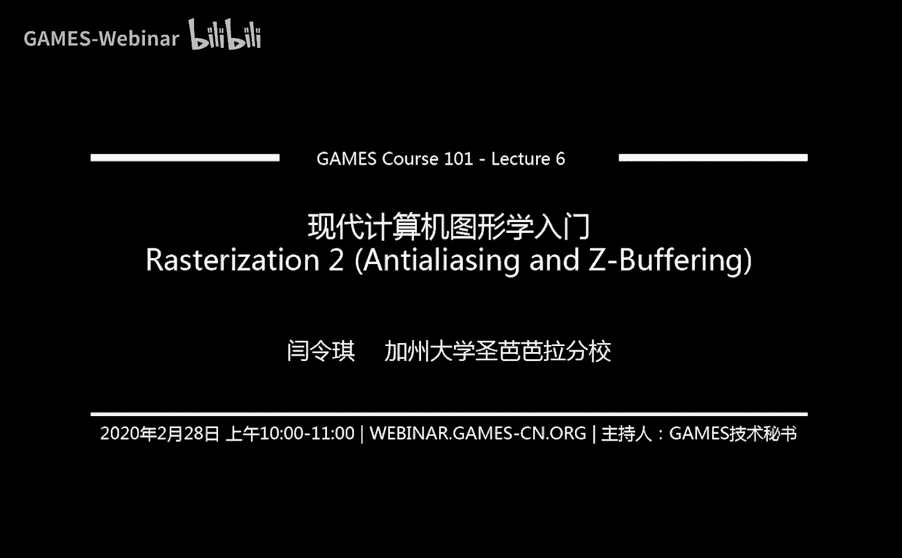

好诶可以可以，那咱们准时哎呀，这就开始了哈，行行行，没问题，那咱们现在开始播啊，好这个亲爱的同学们，大家好，这个咱们今天给大家讲咱们这门这门这个现代计算机图形学的第六讲。

然后咱们今天要把光栅画的内容基本给讲完啊，大家可以从这个标题看到，这节课咱们主要说这个反走样和这个深度缓冲，然后这么两个技术，然后这个呃主要是反走样啊，这是今天的一个呃很重要的一块内容。

然后在这个课程之前呢，就我们说几件事，一个是这个嗯作为一对一，目前为止已经有这个49份提交了，这个非常好啊，这个感谢大家支持，然后我估计这个咱们到截止日期应该这个呃有非常多的提交，然后呢我们这些作业。

然后因为是每周进行，然后每一次放出来之后，希望大家早点进行，然后这些作业呢基本上作业框架也经过了，这个这个算是两轮这个英文课的挑战啊，按说这个做作业框架啊，嗯就算是有问题，应该是不会出现特别多的问题。

应该是早点开始，不会有什么损失啊，然后这样的话这个省的之后，大家开始如果说碰到什么问题卡住了，然后这个这个就比较麻烦好吧嗯行，然后啊这是第一个啊，第二个今天啊咱们相比于上一节课给大家介绍光栅画对吧。

光栅画呃就是一个简单的这个这个在屏幕空间的采样对吧，然后相比于上节课，这节课要难得多啊，然后特别是说如果同学们之前没有学过这个信号处理好吧，或者什么信号与系统之类的这一系列的这个课程。

可能会觉得这个非常困难，但是没关系，咱们尽量把这个课给说明白好吧，呃然后如果之前啊大家没有学过信号处理啊，没有关系对吧，然后这个呃就按部就班，这个听起来应该还可以，然后这节课首先是这么一个问题，有点难。

然后这节课本身内容就比比较多，所以呃我之前想了一想，决定发挥这个网课的优势，然后我就快点说，如果中间有什么这个问题的话呢，咱们之后这个对照录像，然后可以呃可以可以可以着重看一下这个呃困难的地方好吧。

那咱们今天大概就是这个策略，然后尽量的把这个内容给完成啊，ok然后呢这个上节课啊，大家应该还记得对吧，咱们这个呃提到了一个在这个啊mvp这个变换之后呢，呃我们提到一个这个视口的变化。

也就是说最终咱们会把这个-1~1的三次方这么一个空间，给映射到这个屏幕空间上面去，我们还专门定义的屏幕对吧，然后呢上节课这个呃我们就提到说啊，当所有的三角形都已经在屏幕上的时候。

那咱们就要把东西画在屏幕上，那这个过程就叫光栅化，然后最重要的这个这个思想就是说我们要利用这个像素的中心，对这个三角形可见性这么一个函数进行采样，然后这是一个这个这个比较麻烦的解释啊。

但是这个我上节课提到说，咱们学完这节课之后，就会明白我们为什么一定要通过这种方式来理解，因为这样的方式方便我们去理解这个呃走样的，这个这个成因以及解决办法好吧，那大概就是上节课说了这么些内容。

那咱们这节课继续好，ok这节课大家这个从标题应该已经可以看到，我们这个会讲这个反走样，然后以及说涉及到这个呃遮挡与这个可见性的问题，然后分别我们用什么样的办法去解释，然后关于反走样。

咱们首先要给大家说一说关于这个采样的理论，这也就是说我们说为什么这节课要和这个信号处理有关系好吧，然后呢这个呃我们就说实际的这个图形学中，大家是怎么做这个呃反走样的好吧，那咱们从这个呃呃问题先开始。

那么上一节课我们提到说一个三角形，那自然是一个连续的某一种信号或者函数对吧，它定义在屏幕空间内，然后现在这个因为已经做完了各种变换了嘛对吧，然后我们可以给定任何一个点，然后可以是浮点型对吧。

任何一个点我们都可以测试这个点是否在三角形内，那对于像素来说，然后我们就用像素的中心，然后这个来检测这个三角形呃，这个这个像素的中心点是不是在三角形内对吧，然后就是像大家看到的这么些这个红点和白点。

这个红点表示三角形内，白点表示在三角形外，然后呢我们把对应的像素就给涂成这个颜色，要么是这个红的表示三角形这个覆盖了这个像素，然后呢要么是白的表示三角形没覆盖，那么上节课我们提到说，如果我们这么做的话。

会得到一个类似三角形的图案，长这样对吧，但其实呢我们希望看到的三角形应该长这样，那也就是说这个中间呢有一个很明显的差异对吧，而且我们可以看到有问题，我们可以看到很明显的锯齿这么一种效果对吧。

那事实上来说，我们不希望有这个呃锯齿怎么办呢，那也就是这节课我们要解决的这个呃，要要提出的这个这个这个解决办法叫做叫抗锯齿或者反走样，那么这里先把这个概念理清一下啊，我们现在看到的这个东西这个现象。

这是锯齿，然后锯齿的学名叫做这个走样叫ali，然后呢我们可以看到这个a d c呢，这个出现在这个这个各种不同的情况下，像这个左边这幅图，它有这个三角形的尖。

然后如果咱们放大是可以看到很明显的锯齿或者走样的现象，那咱们要做反走样，这个反走样就叫做antasy，好吧，然后嗯那我们这个从什么开始说呢，那咱们先从这个呃采样的理论开始说。

我们先分析一下到底是怎么回事，把这个锯齿的这个问题想明白对吧，那么首先我们上节课提到这么一个概念，说这个啊采样在图形学中是一个广泛存在的一个一个一个做法对吧，我们提到说这个光栅化的这个过程。

其实就是说在这个屏幕空间用一系列离散的点，也就是像素的中中心进行是否在三角形内这么一个函数的采样。

然后呢呃对于任何一个这个我们拍出来的这个照片啊来看呃，如果我们把它放大都可以看到一个格子，然后这当然也是这个这个这个我们表示这个图像的基本方法，对不对，然后一个图像本身也有分辨率。

也就是说它有多少个不同的格子，然后我们也管它叫做像素好吧，然后就是说呃呃一幅照片，那自然就是说呃，就是所有到达这个这个这个这个这个感光元件的所在的这个平面，嗯的这么一些光学的信息。

咱们通过这个把它给离散成这一系列的这个图像上的像素，这么一个过程来做的采样，对不对，所以说这个呃这个这个这个照片呢同样也，是一个采样，然后另外还有一个有意思的现象啊，采样可不止可以发生在这个不同的位置。

它也可以发生在不同的时间，比如说咱们再说这个这个呃视频对吧，什么叫视频呢，这个或者动画呢对吧，也就是说这个我们把一系列的图，然后按照一定时间我们把它给放出来对吧，然后就可以形成一个一个动画诶。

然后这个动画实际上来说就是这个在时间中进行的采样，为什么这么说呢，因为我们本质上来说，你们没有见过任何连续意义上面的这个动画，比如说咱们看这些图，如果说我们把，这个这个动画这个拆开。

我们会发现这个呃这个动画是定义在一帧一帧上，所谓一帧就是一幅图，每秒呢给给大家这个放出，比如说四呃，24帧这个这个图像，然后连在一起，大家就会觉得哦这是一个这个呃，这也是一个光滑的这个过渡过程。

让大家觉得这是一个动画对没问题，但实则是我们看到的每一幅图，每一帧其实都是在一个特定的时间点上的对吧，并不是在时间中是连续的，比如说咱们可以把每一帧都叠叠在一块，看这么一个动画。

咱们就可以看到这个网球选手这个击球，和发球的这么一个过程对吧，然后其实每一帧大家可以看到这个可以看到明显的这个离散的，这个球拍的位置以及球的位置对，那也就是说视频其实相当于是在这个图像中呃。

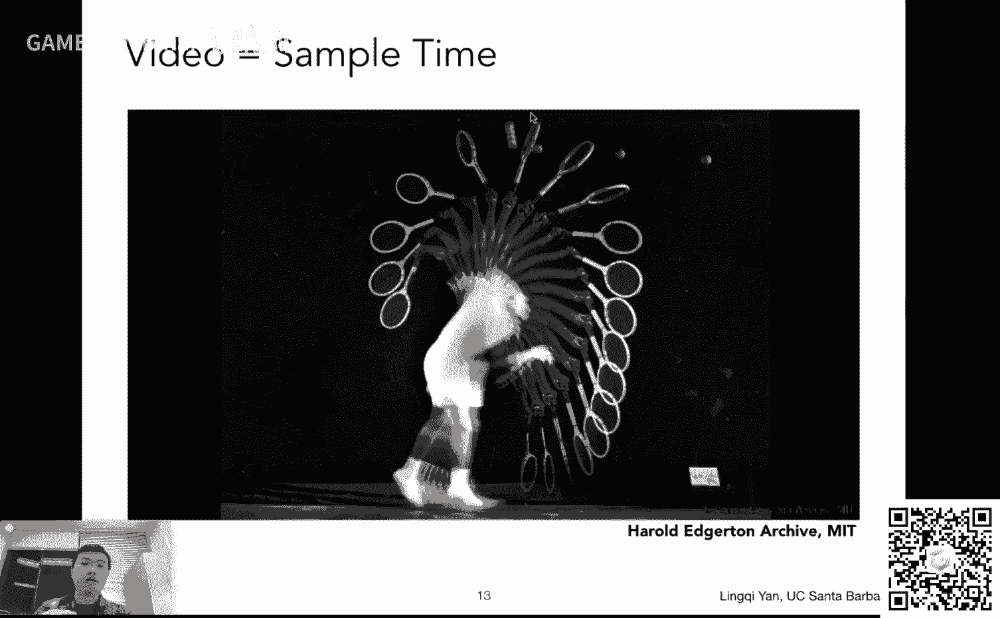

这个这个时间中的一个采样，所以采样呢是广泛存在的，那么同样采样所产生的问题也是广泛存在的对吧，然后这里呢给大家定义一个这个词叫做artifact，所谓artifact呢其实就是在这个图形学里面。

咱们这个这个这个呃的一个黑化吧，可以这么说，就是说这个图形学上的一个概念，这个概念就表示了这个错误或者是，这一切这个不准确，或者说我们不希望看到的结果，就是说一切我们觉得这个这个看上去不太对的东西。

我们管它叫artifacts，然后这个中文呢其实有翻译的叫做瑕疵啊，但是这个比较别扭，所以说以后碰到这个情况，我就管它叫artifacts好吧，就好像这个frost中文叫视锥，然后这还是有点别扭的对吧。

然后这个呃行，咱们回到这个话题上来，然后就是说呢这个采样会产生一系列采样的问题，那首先第一个问题咱们之前已经见到了对吧，我们一直在说的会产生锯齿，然后这个锯齿呢很像一些这个这个，楼梯的一种形状，对不对。

然后就是说这个嗯这就是采样产生的其中一种artifact，那还可能会有什么呢，大家可以看这两幅图，然后这两幅图表示的就是采样所产生的另外一个这个artifact，然后他也有名字，它叫做摩尔文。

然后这个摩尔纹是怎么产生的呢，很简单，这个假如说左边这个有一幅图，然后呢，这个假如说啊，我可以把这个左边这幅图的这个，这个这个这个基数行和基数列全都给去掉，呃，也就是说这个左边这幅图会变成一个小的图。

但是变成小的图的方式，我刚才已经说了，是把基数行和，基数列都给去掉，然后再把它重新对在一块，变成一个小的图，然后显示我还是把它显示成一样大，那我就会看到右边这张图这个效果诶，这个就很奇怪。

大家可以看到这个原本左边可以看到这个衬衫上的这个这个很明确的，这个这个纹理的这些这些方向在在这个右边完全就扭曲了，特别是大家如果看领带，可以看到领带上原本是一个个的格子，对不对。

然后现在这个变成了一个一个这个这种条，呃，这个很神奇这种现象，然后呢呃这个其实大家这个日常生日常生活中也可以看得到，比如说这个拿手机去拍一个这个呃显示器的屏幕对吧。

大家也可以看到会产生一些一系列的扭曲的，这些这些呃这些纹纹路对吧，那这些是怎么产生灯的呢，这些这个也是同样采样带来的问题，咱们之后都会继续说，好吧好，然后呢这里给大家看一个动画啊。

这里考验这个这个网络了啊，然后就是说大家可以看到这是一个纸片，纸片上画到画了一个画了各种各样不同的条纹，然后咱们把它旋转起来诶，大家可以看到这个纸片很显然它是顺时针旋转的，但是呢大家会看到这个在不同。

的这个位置上，怎么会发现这有一些条纹，显得像是在逆时针旋转对吧，在生活中大家也经常会看到这个现象，比如高速行驶的汽车，这些问题都可以通过采样来表示，然后特别就这个例子来说，是是什么采样出现的问题呢。

是我们的人眼人眼在时间中的采样，就好像和那个这个视频是一个道理啊，人也在时在时间这个这个呃上面的采样，然后它跟不上这个运动的速度，就会出现这么一种情况好吧，那然后咱们做一下，总结。

然后我们刚才提到了三种不同的采样，当然还有更多更多啊，这三个只是例子，就是说这第一种这个呃不是采样啊，这个三个artifact对吧，三个不同的瑕疵，不同的错误啊，第一种叫做锯齿，第二种叫做摩尔文。

第三种这个咱们管它叫这个车轮的这个效应对吧，然后嗯这个三三者都分别说明什么呢，前两个说的都是说我在空间中或者说在不同位置上采样会产生的问题，然后第三个说的是时间，但本质上都一样，采样带来的问题。

然后呢这个那么采样造啊，造成这么些这个这个这个呃走样，的问题呢，这个这个本质都是因为什么呢，其实这里给大家做了一个总结啊，就是相当于是信号，也就是函数啊，这个信号的变化太快了。

以至于你的采样的速度跟不上它，在这种情况下，就是说我们这个采样会产生artifact，并且这个artifact我们管它名这个命名叫做这个走样好吧，然后那这是什么意思呢，就是什么叫这个信号变化太快了。

导致这个采样的速度跟不上它变化的速度呢对吧，这里呢我们就需要这个通过这个频率这么一个呃，这个这个这个这个事情来分析它，而这个呢当然本身是完，全可以作为一门课来说的。

但是这个在这里咱们这节课就快速的给大家普及一些这个频率的分析，背后的结果好吧，主要从这个角度上来说，那咱们先看这个这个事情，就是说呢呃我们如何做反走样，我们先给大家这个一个结果。

然后咱们再分析为什么好吧，那这里大家看得清楚什么呢，在采样之前我先做一个模糊，或者说这个滤波叫filtering，好吧，哎那这个这个采样之前做的模糊是什么意思啊，这个这个操作，那大家看这个例子。

那之前说我们为什么会产生这个这个走样问题呢，我们用这，个像素的中心去采样这个三角形，然后呢这个这个这个呃我们会发现这有些点这个完全三角形内，有些点完全在三角形外对吧，所以这些点要么是红的，要么是白的。

然后我们把画出来，这就会产生走样，那么我们说之前做一遍模糊是什么意思呢，大家可以看这么一个这个这个例子，我们加了一个这个过程对吧，首先大家拿到一个三角形，先做一个模糊操作，把它变成一个模糊的三角形。

然后然后呢我再去这个用这些像素的中心点，我仍然去采样，采样的是什么，采样的是这个模糊的三，角形它该是什么颜色，就什么颜色，就比如说咱们看右边这个材料直接点。

这有些点采样到这个模糊的三角形的这个边界才变成一个粉红色对吧，离这个边界远点儿就偏白，离这个边界近点就偏红，就会出现这种情况诶，所以说呢这个呃看起来好像是可以的，对不对。

就是说我们这个这个呃对原始的这个函数或者信号做一个模糊，再去或者说滤波，然后我再去做采样，然后就可以解决这个这个这个呃这个这个锯齿这么一个问题，也就是说我们可以抗锯齿，或者说我们可以做反走样诶。

那呃嗯对就是这么一个意思，然后这里呢有一些这个这个频率的东西，这里就不给大家说了好吧，然后大家可以看看在实际中这个效果会怎么样呢，当然效果是不错的，这个呢是呃呃之前看到的这个怎样的结果。

而这里呢大家看到的是这个啊经过反走样之后的结果，也就是说我先对三角形进行模糊，然后呢我再去用像素的中心进行采样，采样出来的这个颜色该是什么颜色就什么颜色，然后大家会发现诶效果不错的，即使放大了的话。

也没有像之前锯齿这么严重，对吧，诶那是不错的，所以说也就是说这是一个解决办法，然后呢咱们从这个例子上来看也是如此，哎咱们可以看到左边这幅图很很严重的这个走向现象对吧。

然后呢我们如果说先对这个这个不同的信号做这个这个这个滤波，再去采样，然后我们可以达到右边这这么一个这个这个结果啊，然后效果还是不错的对吧，然后呢这里大家就有同学会问这么一个事情啊。

哎我们刚才提到说怎么做反怎样来着对吧，先对这个信号做模糊，然后我在这个进行采样，这么两个操作就可以完成反走样，那么有的同学会，问说我能不能反过来对吧，我先去采样，采样，完了之后不是得到一个怎样的结果吗。

哎然后我做一个模糊处理，然后或者说我做一个滤波，那这样行不行，然后答案是不行，咱们可以看到这个这个左下这个这个呃这个字啊，写的是sample than filter好吧。

然后就是说这个我先去这个采样采样出来，这个呃有这个走样的结果，然后呢我再去做这个呃滤波呃，或者说模糊操作，然后发现结果不对，这不是我想要的结果，右边才是我要的结果，对不对。

右边这个看上去比左边这个要要真实很多，那么这个到底，发生了什么，就是说到底有什么问题对吧，然后其实呢我们先做采样再做模糊，它还是有名字的，叫做blurred aliing。

大家可以看到就是说他其实还是怎样，但只不过走样了之后又被模糊了。

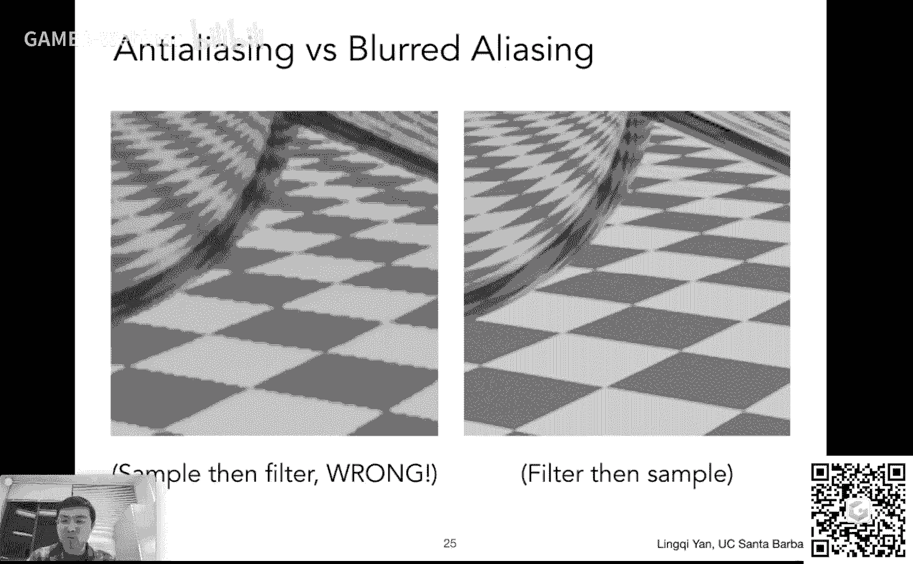

是这么一个意思，而跟反走样不一样好吧，那到底是为什么对吧，然后我们说这个为什么说我们采样这个呃速度跟不上信号变化的速度，就会产生走样诶，为什么说我这个呃这个这个这个呃先去做这个采样。

再去做这个呃模糊操作，然后这个达不到这个反转向的效果对吧，那咱们为了弄清楚这些事情，我们就，需要分析这个评语方面的知识了，好吧，那咱们首先我们来这个分析一下这个这个频玉是什么意思啊。

这里frequency是频率，然后frequency domain，然后中文管它叫做频率啊，好然后这个什么意思呢，首先咱们从最简单的事情开始看，这个没有什么东西会比这个这个正弦和余弦波更简单了对吧。

然后就是说这个大家可以看到上面这个函数余弦，然后下面一个函数正弦，然后呢这个大家可以看到这个唯一的区别，就是他们两个之间相对有一点不一样对吧，左右平移了一些，然后呃用这个这个正弦和余弦，有什么好处呢。

如果大家这个这个把这个呃正弦和余弦，这个就是cos x啊，就是这个x之前的这个系数考虑进去，大家会发现这个有意思的事情，为什么呢，因为这个呃通过调整这个嗯x前面的这个系数。

比如说上面一个函数是二派x cos 2派x，然后下面一个函数是cos啊，四拍x，然后他就会发现啊，这个这个通过调整它前面的这个系数，然后我会得到这个各种不同不同的这个这个余弦波。

然后呢这它们的不同在于什么呢，它们的不同在于它们的频率不同，然后这里我们定义一个这个，这个事情就是说就是呃cos比如二派前面再乘以一个k，再乘以个x，然后呃或者说二派f后面再乘以x这个f这个等于多少。

然后我们就管它叫频率是多少，比如说第一个我们就是二派x那就是f等于一，就是就是频率为一的这个这个余弦的函数，然后这个f等于二呢，就是下面这行就变成四派x，然后大家看到这个用这个频率f呢。

我就可以定义这个呃余弦波，它变化有多快对吧，这f等于二，它很显然它变化就比f等于一要快诶，那我们就可以用这个东西来定义，然后同样道理，对于一个这个函数来说，我们还可以定义它的这个这个这个周期。

比如说这里这个啊余弦余弦波，它的周期就是这个频率分之一对吧，然后就是说呃所谓周期就是说每隔多少这个函数会重复自己一次，大家可以看到上面这个例子，当然是每隔个一呃，这个呃这个函数会重复一次。

然后下面是每隔这个呃0。5它就会重复一次对吧，然后呃就是说这个周期是频率的这个导数，它们俩有这么一个关系好吧，那这里是简单的说一下，然后那我们为什么要介绍这个正弦波余弦波，而且他们。

有不同的频率呢啊那这里呃需要大家去回忆一个事情，大家都上过微积分对吧，微积分里面大家都会提这个概念，就是说这个一个函数的展开，然后函数展开呢咱们提到各种各样不同的展开是什么方法，什么泰勒展开。

要什么别的展开，但是有一个叫做复里叶级数展开，这里是要给大家说的这个这个事情，就是说再说这个富里叶变换这个概念之前，先说一下这个富里叶级数展开，什么叫复利的技术展开呢，就是说任何一个周期函数。

我都可以这个把它写成一系列正弦和余弦函数，它，们的线性组合以及一个常数项，像比如说比如说这里大家看右上方这两个图啊，然后大家可以看到呃这个嗯大家看到我们要描述的这个函数是什么呢。

是这个黑色的这个这个曲线啊，是一个跟城墙一样这种函数啊，突然一下又没了又凸出，凸出来一块又没了啊，然后咱们可以用这个呃这个呃这个是是两个函数来描述它。

一个是大家看到的这个这个左下角这个二分之a a就是它的高度啊，呃二分之a相当于把这个函数的中心往上提，把什么，函数的中心往上提呢，把一个另外一项某一个cos函数呃，大家可以看到一个cos函数。

然后它中心往上提诶，他这个基本上提完了之后就变成右上角这个这个图诶，然后我就看到，然后算是一个进四吧对吧，用一个cos函数去近似一个这样的这种这种我们管它叫这个呃，这个叫什么方式，叫box方式。

也是一个这个是一个周期性重复的box函数好吧，然后这我们当然可以用更多的象来描述它，比如说我们可以引入更多的这个这个余现象，比如说我们这里大家可以看到引入了一个绿色的这个，现象。

然后经过一系列的线性这个这个操作，比如说乘以2÷3派对吧，这些都是算出来的，没问题，然后就是说诶加上一个这个cos函数，诶，我可以用呃，右边整个一个这个这个绿色的这条线。

来近似这样一个类似城墙的这么一个函数对吧，诶我发现这个近似的就准确一些，唉然后我还可以再继续往上加入一个函数，加入一个函数，经过他们的一些线性组合，我又可以看到右边这个就是第三行呃。

第二列诶这个近似的结果就更像这个我要的原始的这个函数了，诶诶我可以再加更多，那，我加更多得到的结果就是越来越像，越来越像，那我可以加无限多项，然后他就会呃这个无限的接近这个呃这样一个周期函数。

这就说明一个问题，就是说我们用这个负离叶函数展开诶，级数展开这么一个办法，就可以把一个这个函数描述成很多不同的这个正弦余弦，像呃的和像这里这是一个特殊情况，只有余弦没有正弦，对对吧。

然后呢呃这说明一个什么事情啊，这个事情就是说呃这个呃傅里叶级数展开，它是和另外一个概念是紧密相连的，这个概念叫什么呢，叫做傅里叶变换啊，所，以这两个其实不是一回事啊，但是但是这两个概念非常相似，什么呢。

大家可以看这个给定任何一个函数，我都可以让它经过一个相当相当复杂的一个操作，变成另外一个函数，然后这个复杂的操作大家完全没必要去看它啊，大家就只需要看左边小写的f x，右边大写的一个fx，它是一个变换。

把一个函数变成了另一个怎么变，写清楚了，但不需要知道，然后呢这个我还可以把这个函数呢，这个这个变换过的函数就是这个大写f，然后这个函数给通过一个逆变换，还可以变回原来的这个，这个呃小写呃。

这个f这么一个函数诶，这个也就是说啊我可以把函数变成另外一个，并且可以把它变回来，很简单，这个操作就叫做复里叶变换和逆弗里叶变换呃，然后呢我们为什么要提到这个事情呢，那咱们回到上面一页来看。

就是说啊大家知道不同的正弦和余弦函数，我们刚才已经分析了，它有着不同的频率对吧，然后呢如果大家看这里这些不同的这个余弦函数啊，这里你会看到说在这个在这个比如欧米伽之前，他有这个呃不同的系数。

比如说t3 t5 t7 t，然后大家就可以，看到哦这些余弦函数它本身都代表着不同的频率，也就是说什么呢，通过这个护理液级数展开，我们知道啊，任何一个函数都可以分解成不同的频率啊。

也就是说这个比如说二分之a它和cos根本就没关系，然后这个这个是这个最最最最低的频率，然后呢这个稍微高一点频率是这个cos，然后也就对应这个左上角这么一个这个变化很缓慢的cos对吧。

然后呢这个我们加入了下一项cos，在加入的是这个呃频率相对高一点的这个这个呃函数，所以说这个相当于是我们可以把任何一个fx照，这么分解把它分解成频率从低到高这么一个形式。

那么这里就结合上这个复里叶变换了，所谓复理叶变换其实就是把这个函数给变成这个不同的这个频率的段，然后并且我们把这个不同的频率的段给显示出来，那是什么意思呢，那咱们先从这个例子来看好吧。

然后这个例子试图说明一个什么什么事情啊，大家可以看到首先有五个不同的函数在这里，f一到f5 对吧，从上到下，然后这五个函数，那咱们经过刚才的分析已经知道哎这五个函数有着不同的频率，频率从高到低呃，呃从。

低到高，从上到下啊，然后呢我们假设说我们用完全相同的采样的方法，就是每间隔这么一段对吧，对这些函数进行进行一次采样，然后我们会发现哦，我们可以采用第一个函数诶，这个这个这个这个采用第一个函数。

我可以采用出不同的点来，然后我们把这些点连起来，我们发现啊，基本上来说我可以大概知道这个原来的这个函数绿线啊长什么样，通过我们的这种采样方法，那第二个函数我也可以这么做诶，第三个函数我一样去材料。

然后这里到第三个函数，大家就已经发现不太对了，对吧，到第三个函数，如果说我还是这么采样，能把它给这个不同的采样点给连起来，我发现对吧，采采样完了之后，我就只知道这些采样点，如果我想恢复出这个函数来。

那我最简单的办法就是把它连起来，连起来，我发现这个恢复的不怎么样啊，这个大家特别是后面这段大家会发现这个恢复出来，这个跟之前的这个呃f3 这个绿色的函数变得越来越远，然后呢大家会发现在后面可想而知对吧。

可想而知，咱们用相同的采样的方法采样f一还行，采样f5 ，我就发现f5 这个我通过我的，采样点可以恢复出的这个函数，那这就差的不行，和这个f5 就就完完全全比不了对吧，和实际的f5 。

那也就是说这里会出现问题，那这里说明什么呢，这也就是说这个这个通过这个频率的这么一个分析啊，我们就可以体会到这么一个事情，什么呢，就是说我们对于一个这个这个函数来说，诶。

它本身应该有一定的什么样的频率对吧，然后我们采样也应该有一定的什么频率，对对于我们这个这个例子来说，我们采样的频率就是通过它的间隔，我们就可以体会得出来，如果间隔很小，就是，采样非常密。

也就是采样频率很高，那当然我们就可以用很高频率的采样点，然后恢复出很高频率的这个这个函数了对吧，那如果说函数本身频率很高，像这个f5 它变化这么快，那我们采样的频率很低，那就跟不上它的变化。

我就没有办法把这个这个原始的这个信号给恢复出来，哎道理就在这儿好吧，所以说这个采样和这个这个函数的这个这个啊频率是非常有关系的，那咱们举这个例子，就是为了说明后面的这个这个呃傅里变换到底能带给大家什么。

然后呢咱们在这个之前，我们，先说这个呃，说一个这个这个通过频率来分析这个走样到底是怎么回事对吧，我们这这样看，比如说我们可以看这么一个函数好吧，还是一个变化挺剧烈的一个函数。

然后呢假如说我们可以采样间隔什么东西，我们自己说了算啊，随便选一些，然后这是我要的采样的间隔诶，然后我会采用出这个函数的呃这一系列的点来，然后大家会发现这个采样的不太行对吧，因为我如果把它恢复出来。

这个会恢复成这么一个黑色的线对吧，这就这就有问题，然后呢这里我们可以再想另外一个问题，假如说我有两个函数，第一这个函数是这个这个蓝色的函数，第二这个函数是这个黑色的这个这个线表示的函数。

就假如说这个黑色的线不是我们恢复出来的，但是另外一个函数，那么我通过这这样一种采样方法，然后我会得到一个什么样的结果呢，得到的结果是我用同样的一个采样方法采样两种频率截然不同的信号。

但是我采样的结果确实是完全相同的对吧，大家可以看到我通过这些白色的这个空心采样点，我来采样这个蓝色的这个函数呢，我得到的也是这么些采样点，我所，以采用这个黑色的函数。

我得得到的还是这么一个这一系列采样点，而这两个函数原本来说他们两个频率差太多了，像这样一种现象，就是我们的这个正规的定义，说这个走样到底是怎么回事，也就是说同样的一个采样方法。

采用两种不同的频率的这个这个函数得出来的结果，我们无法区分它，这就叫做这个走样好吧，那然后就是说这个走样的概念，咱们现在已经在这个这个频率的分析上已经把它给定义好了。

那咱们刚才又已经定义了这个负离叶变换，那咱们现在就可以真正的分，析一些函数它到底拥有着什么样的频率好吧，然后那呃在讲这个概念的时候，咱们就和这个呃和这个这个这个一个重要的概念叫做滤波，咱们放在一块讲。

然后所谓滤波filtering啊，然后它是什么意思呢，就是从频率的角度上来说，很简单，它就是把某个特定的这个频段就是频率呃，就是就是就是说如果有一些这个在在这个频率上，是某一些特定的这些这个呃频率的话。

我们就把这些特定的频率给抹掉呃删掉，然后说这个对应的信号到底如何发生变化，是这么个意思，这就叫滤波，滤波就是，去掉一系列的频率好吧。

然后那我们刚才说这个复离叶变换可以帮助我们理解这个事情。

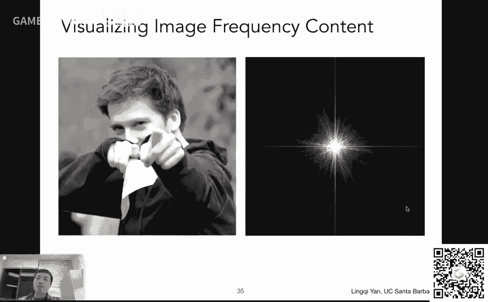

对吧啊，确实如此，这个傅里叶变换它可以把什么呢，它可以把一个函数从食欲变到频域，这就是这个傅里叶变换的作用，比如说咱们看这幅图，这左边这幅图，这是一个一个一个一个人，不管是什么样的这个这个图像版。

然后我们可以对它做一个傅里叶变换，然后复利叶变换会把这个这个图像从时域变到这个频率啊，虽然哈这个图像本身不代表任何时间的信息，但我们认为这个空间上这个不同，的这个位置啊，也也算是食欲。

这只是它的一个名字啊，就是说呃就是说从这个图像的空间，我们把它变化成了一个频率的空间，那么频率的空间右边这幅图咱们怎么理解呢，很简单很简单啊，这个大家可以看到这个中心我们把它定义成最低频的这个区域。

然后呢这个周围咱们把它定义成这个高频的区域，那就是从中心到这个周围，它的频率呃会越来越高越来越高，然后呢在不同频率的位置上，它到底这个这个有多少信息在这个不同的频率上，然后我们通过它的亮度来表示。

比如说，大家看这个这个图像的这个频率，大家会发现哦，这个图像啊大多数信息都是集中在低频上的，为什么呢，因为它这个主要是中间比较亮对吧，高频信息你说有没有有，当然有。

比如说这个周围大家就可以看到这些不同的这些东西对吧，这个显然不是零，然后高频的信息有，然后但是相比于低频那少的太多了，而事实上来说，对于自然的图片来说，基本都是这样的。

如果大家去真正自己去这个写一个这个傅里叶变换的这个代码，非常简单，不用自己手写，就是说有很多库直接提，供这种这个这个做法就是说呃富里叶变换一张图，大家就会发现啊，真的是这样，就是很多图片都是这样。

这个低频信息集中在中间呃，这个非常多，然后高频信息在外面非常少呃都会有这么一种性质，然后呢这里可能有同学问一个事情啊，说这为什么有水平和竖直的这个这个道对吧，水平一道竖直一道特别明显。

然后看起来和其他都不太一样，这个是怎么回事呢，简单跟大家说一句，这个原因是这个我们在分析一个信号的时候，我们会认为啊它是一个这个周期性重复的信号，那对于，不周期性重复的信号怎么办，比如说对于这张图来说。

它哪是重复的对吧，呃没重复，那我们就认为它其实是比如说他到了右边界之后，他又重复他这个左边的内容，然后继续往右，就好像说这张图在水平方向上被叠了好多个，然后竖直方向上也挨个放了好多个。

就是说它有无限多个这这种这个这样的图好吧，那么我们会发现这个正常情况下，很少有图像的右边界和左边界完全一致的，然后这个这个呃如果我把这个图从左搬到右边，那么它图像左边界跟头像的右边界，它两个要放在。

一块对吧，然后在这条边界上会发生剧烈的信号变化，也就会产生一个极其高的高频，然后像这种情况下，这就是这个这个为什么说我们做这个呃，复里叶变换会看到这么两条线啊，咱们为了分析这个图内部的事情。

咱们忽略这两条线好吧，那然后现在就是说啊，副理变化能够让我们看到这个图像在各个不同的频率长什么样，这也就是说呃更通用来说，任何信号在不同的频率都长什么样，咱们管它叫做频谱好吧，然后就是这么一个概念。

然后呢假如说咱们可以做这么一个操作，刚刚才，咱们大家已经提到了对吧，这个滤波什么叫滤波，去掉一些频率的内容，那就叫吕布，那剩下来的部分是什么，咱们再把它弄回这个原本的图就可以看到对吧。

那咱们现在看这个相比于上一幅图啊，这里发生了什么变化，大家可以看到啊，这里我在这个频率的这个这个空间啊，就是说所谓频率把这个低频的信这个信号完完全全都给抹掉了，没有了，现在大家会发现诶低频的再也没有了。

留下来的就只有一些高频的东西对吧，那我高频的东西它应该长什么样呢，大家还记得逆了也变化，咱，们把它变回去就好了，变回去一看，我发现哦这个高频的东西在图像上好像还是有意义的对吧，特别是对于这张图来说。

我看的特别明显，它其实表示的就是图像的边界，不是图像这个四四边这个边界，我说图像内容上的边界，比如说这个人的这个这个衣服，这个人衣服这个这个校考和这个背景差的就挺多的对吧。

然后就是说它会把这个边界给提取出来，然后就是说我们我们我们做了一个什么操作呢，就只做了一个说这个我们把这个低频的信号抹掉了，然后就做了这么一种滤波，而，这种滤波是有名字的，叫做这个高通滤波。

所以所谓高通滤波意思就是说我通过应用这么一种这个滤波器啊，让这个只有高拼信号可以通过，所以管它叫高通啊，所以高通滤波器就意味着说我们只剩下高频，这个并不要搞错啊。

然后呢这个高频信息剩下来的这些我们分析一下啊，为什么说这个高频信息，它就对应到图像的这些这些这些内容上的边界呢，对吧，我们想这么一个问题，那咱们回到这幅图上来看对吧，我们会发现什么叫边界。

比如说如果我要我要问你，直接直接让你自己来，回答就是说不通过任何数学，什么东西，什么叫边界呢，那咱们其实可以想得明白对吧，什么是边界，那就是说当这个图像这个边界，当某一个地方吧。

它的这个左边跟右边或者上边跟下边突然发生了一个突变对吧，差得很多诶，这个时候我就认为这里是边界，比如说咱们看这哥们衣服，然后这这个地方诶，它下面是这个这个这个衣服，它大概长这样。

然后上面是一个模糊的背景，然后也就是说在沿着这条边左右，它发生一个非常非常剧烈的变化对吧，它发生了剧烈的变化，咱们刚才说这可，不就是这个信号本身蕴含的高频的信息吗，对不对。

这样想就是说这个信号变化非常大对吧，然后那这就是高频信息，那咱们再回到这个这个例子上来，那我自然让他让，如果我让它只显示高频的这个对应的这个这个信息，那我自然就会找到这些边界的内容诶。

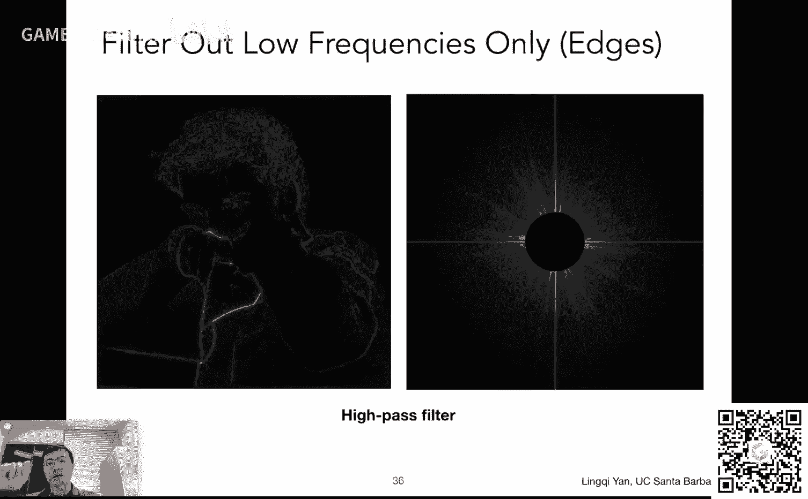

所以它是有道理的，那咱们可以再做另外一组实验，那这个实验我们在做什么，这个实验咱们看咱们看一下啊，右边这幅图还是右边这幅图呃，这幅图呃还是频域对吧，那和之前这个原始的图的频率，它是发生了一个什么变化大。

家可以看得很明确，就是说我只留下了这个低频的信息，我把所有的高频信息全都抹掉了，全部都抹掉了对吧，然后我只留下这个低频信息，然后我再把它给变回这幅图，我会发现什么呢，哦我会发现得到了一张相对模糊的图。

对不对，然后就是说我基本还能看清啊，这是这是人，然后说绝大部分细节所有的东西基本上比如说这个衣服上褶皱什么，我就再也看不见对吧，然后这个这个就是说嗯。

就是说我们这里就相当于是对这个信号应用应用了一个所谓，低通滤波器，什么叫低通呢，就只，让低频率通过高频率都被筛选掉了，去掉对吧，然后那高频率被去掉了，大家可以从另外一个角度上来分析。

那高频率就意味着边界，那边界被去掉，就意味着边界我再也看不着了，那从这个角度上来说，确实是这样的，边界看起来就很模糊了，就不再有这个原本的这个边界的概念了，对不对，那所以说唉这就这是有道理的。

那么有同学可能会问一个事情啊，说说老师我看到一个现象，说这边看起来像是这个水波纹的这种东西，这到底是什么东西对吧，然后然后这个东西呢这这个就稍微复，杂一点，咱们待会儿就会给大家说啊。

说到这个这个这个box filter的时候，它是一个不完美的低通滤波产生了问题，然后咱们咱们马上再说啊，那也就是说这里咱们先忽略它呃，不管怎么样，这是一个实验，那咱们还可以做另外一个实验。

这个实验就很有趣了，哎大家可以还是看右边这个这个这个图哈，右边这个是频域，那这次咱们去掉了什么，留下了什么，大家会发现我们把高频信息去掉了，我们把低频信息也给去掉了，留下一些信息算是某一段的频率。

但是这个不怎么特别高，但是也挺高的，但不是低频，那么我们就会提取到在左边啊，就会提取到一些这个不是那么明显的边界特征对吧，那那这个也是有道理的对吧，最明显的这个边界特征对应最高的频率。

咱们在外面已经去掉了，然后中间的一些这个大面积的这个这个相同的这种色块，咱们也给去掉了，因为它是低频信息，所以剩下的自然就是这么一种信息，那同样道理对吧，如果我们这个把这个圈给扩大对吧。

我们留下来的是另外外面一圈，大家会发现啊，我们留下来这个频率更高频了，所以我们现在看到了这个这个，结果哎这个更像是这个高频的这个这个呃边界对吧，所以这一切都是有道理的，这都是可以想明白的对吧。

所以说呢这个这一块儿呃，就是基本上来说是通过这个频率上面的分析对吧，咱们把这个不同的频率和这个信号的变化，咱们就建立起这么一种连起来了对吧，这块我这个是一个呃怎么说呢。

就是说图形学上正常不会特别多说这个事情如果要多学的话，需要学一门课叫数字图像处理好吧，然后就是说这个这门课正常情况下就会教大，家如何去这个这个通过这些不同的这种滤波的方法。

去这个做任何的这些这个这个图像的操作，当然这是经典的操作啊，这多说一句，然后就是说大家嗯平常就很少去做这些评语方面的这个这个操作，但是不管怎么样，咱们这个分析这是很有道理的对吧，咱们把这个弄明白就好。

那咱们现在继续进展对吧，我们已经说了这个滤波对吧。

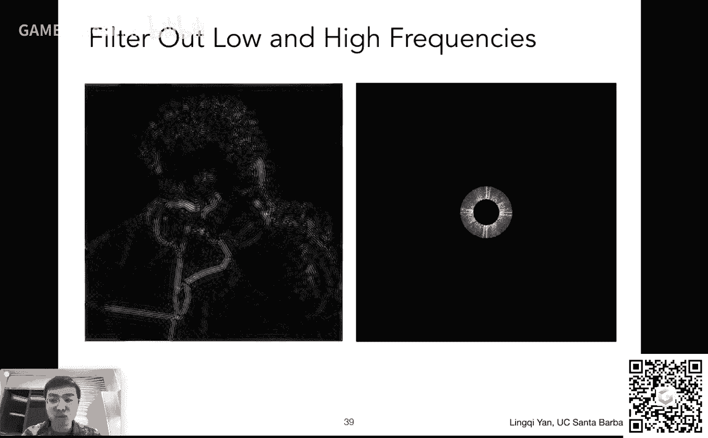

是什么，然后就看了一下这个傅里叶变换到底能给我们带来什么，然后呢我们现在再回到这个滤波的，过程上去，那滤波我们刚才说是等于去掉一个一一个特定的这个，这个这个频率的信息对吧。

然后呢这个滤波我们可以从另外一个角度上来分析，滤波又等于平均，又等于卷积，好吧，这一下又产生各种各样不同的概念啊，就是说平均这个好理解哈，average，比如说我们这个这个怎么说呢，就是低通滤波器。

大家还记得吧，就只留下低频信号，就好像这图像被模糊了一样，而模糊就是一种这个平均操作啊，咱们马上就讲，然后卷积又是什么，就是这个convolution啊，这这是什么东西，为什么这个东西和这个这。

个这个滤波有关系，而且卷积听上去像是一个什么样的运算对吧，是的没问题，然后这个呢如果要接触信号与处理呢，接触那再常见不过了，那咱们给大家简单说一下好吧，从咱们图形学的角度上来说，有很多简化了的定义。

然后所谓卷积是什么呢，咱们可以看，比如说我们有一个信号，管它是一维的还是二维的对吧，这里我们这个一维的信号也就是一维数组，然后呢这个这个滤波器叫filter filter，这个呃就好像是一个窗口一样。

这个窗口呢可以在左右这么进行滑动好吧，然后像这里正好这个，窗口是对齐了这个信号的，左边这个窗口也可以向右移动一格，移动一格，然后这个窗口的大小呢是三个格子，这三个格子分别上面都有个数。

那这是要干什么对吧，这其实是要做一个卷积操作，所谓卷积操作很简单，就是说我在移动这个这个呃窗口的过程中啊，然后我把这个窗口，这是对应这三个数和这个窗口所覆盖的信号的三个数。

做一个点乘得出来的结果写回这个窗口的这个中心值就可以了，哎大家再回顾一下这个过程啊，这个这个滤波器和覆盖这三块呃，信号覆盖这三块哎，然后他们做点乘怎么做，点乘一一乘起来加起来对吧，哎1x1/4。

3x1/2，5x1/4加起来诶，我发现等于三，然后这结果写回这个格子，也就是说这个这是我要的结果，在这个格子上的的的值好吧，那我们我刚刚说的，就是说这个卷积操作呢是把这个这个这个滤波器。

或者说窗口一直在这个信号上面移动，那么可以向右移动一格，移动一格呢，我们发现诶这个还是这个滤波器，然后这次覆盖的这个这个内容是353哎好，然后呢这个我们把它乘起来，3x1/4，5x1/2。

3x1/4哎一平均而四好吧，a会发现啊，这其实就是一个平均嘛对吧，说白了是什么呢，就是在原始的信号，它的任何一个位置，我取它周围的这个这个呃总共这三个数，然后求一个平均，当然是加权平均。

然后呢我就任意一个数都是周围的数呃，若干数的平均，那得到的结果可不就是最后会得到a a，会得到这个写满了这么一个一个这个最后结果呃的一个新的信号对吧，也就是说这个卷积是作用在一个信号上。

然后呢我用一个这个呃某一种滤，波器对它进行卷积操作，然后并且得到一个结果啊，那就是这这样一个操作就叫做卷积操作，当然这个定义不对哈，这个是不是数学上的定义，这是我们这个图形学上简化了给大家的定义好吧。

然后我刚才说了，从这个上面大家也就可以看明白，其实就是信号在任何一个地方，在它周围的一个区域做了一个平均而已好，这就是卷积，那么卷积呢其实是有一个这个定理的，然后这个定理怎么说呢。

这个这个给大家这个简单说一下，这就给大家下一个结论吧，就因为这个东西其实是证明的，就是说呢嗯实际上如果我想对两个信号进行卷积，那么它其实对应到这个两个信号各自的这个呃频域上。

是两个信号的这个呃频频率的这个乘积，所以卷积操作啊其实和乘积这两个操作是挺接近的，说白了这是什么意思呢，对吧，咱们待会儿看一个例子就可以看明白对吧。

那么这个通过卷积定理我们就可以知道说我如何做一个卷积好吧，我可以直接拿到一幅图，然后用一个某一个卷积的这个这个呃这个滤波器，然后去做一个卷积操作，我也可以把这幅图先复了一些变换，变到频。

域上把这个卷积的这个滤波器变到频域上，把两者相乘乘完之后得到频率的结果，再把它逆附力的变换变成食欲上就没有问题了，所以这两个操作是一样的，所以大家就这个，而且呢呃怎么说呢，就是卷积定理，这只说了一半。

另外一半是如果是在这个呃，在时域上，如果是乘积，那就意味着是在频域上的卷积。

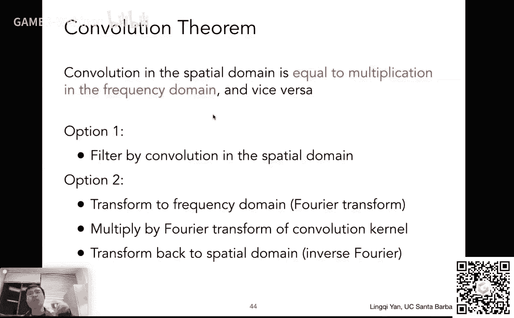

它是有这么一个对应关系的，那咱们看这么一个例子，就可以理解这个到底是想说什么哈，就是说比如说大家看诶，这是一幅图，这是一幅图呢，然后我们想应用一个平均或者是卷积，操作诶。

然后这个这个卷积操作是怎么做的呢，大家可以看到哦，它是一个3x3的一个一个窗口，什么意思呢，就是说我对于任何一个像素来说，比如说呃这个像素在这个屏屏屏幕上，呃，在这个图像上。

然后我取它周围的这个3x3的格子，也就是九个数求一下平均，然后再把它写回这个这个像素本身，诶，这样的话我得到的一个结果大家可想而知哈，任何一个像素都是它周围3x3像素的平均。

那得到的结果可不就应该是一个模糊了的，想这一个图像嘛对吧，那这个操作其实就是每，一个像素取它周围并呃3x3和这个这个呃呃滤波器，或者呃数学上我们管它叫卷卷积核，一个道理做一个这个卷积操作，然后写回去啊。

ok然后呢呃做做一个点乘操作，然后写回去，整体上这个过程叫做卷积，那么我们也可以怎么做，我们刚才说了这个卷积的这个定理对吧，卷积的定理告诉我们，我拿到一个图，我可以先把它做复联的变化。

变成食欲而变成频域上的这个这个结果，这就是大家看到的频率频率上的这幅图好，然后呢我的这个卷积核本身也可以，这个在在这个嗯频率上，写出来，也就是说把这个这个3x3的这么一个一个呃，就可以变成这幅图。

那我们刚才说了，这个时域上我做的卷积，那对应到频域上，我就要把这两个信号乘起来乘起来，其实大家发现哦这个卷积核呃应用到这个呃频率上面去啊，绝大多数地方都变成了黑的。

只有中间这块留下来的一些这个这个白的东西，当然大家会发现有一些r对吧没错，然后这个马上我们再给大家解释，但不管怎么样，绝大部分能量集中在这个地方，那如果我拿这个函数去乘。

以原来的这个呃图像对应的这个呃这个频率上的信息呢，我们得到的结果就是这个结果右边这幅结果，而右边这个结果呢我可以通过逆弗里变换变回这个原来的支付图，然后这里就会发。

大家就会发现诶这个好像这个卷积定理有道理，为什么有道理呢，是因为当我在这个频率上把这两个信号他们的这个啊频谱乘起来之后，我会发现，实际上就好像说我对这个呃左边这幅图，它的频率进行了一个低通滤波对吧。

我就只让他留下了最低频的内容，然后我们刚才分析过这个事情了，低，频内容是什么来着，如果我们把低频内容给这个逆弗里叶变换过去，就是这个图像对应的模糊的图像，哎也就是说这个是对的，没有问题。

也就是说我们通过这种方法验证了一下，这个这个这个嗯这个卷积定理是对的，没有问题，那么就是说呃重复一遍时域的卷积等于频域的乘积，当然了，这个仍然是不是多好理解的一个内容啊。

这个就是说这个本来应该是很多节课在信号处理课上说的内容，然后咱们现在就已经直接给大家下结论了，但是接受起来可能稍微慢一点，没关系啊，就是说，呃我们卷积定理有道理，并且咱们可以解释它可以好。

那么呃我们回过头来看这个卷积核，也就是说这个滤波器自己这个滤波器是什么东西啊，我们看到它是一个3x3的一个盒子对吧，然后这个3x3的盒子，然后还这个成了个1/9x1/9，是为了干什么呢。

是为了让这个呃这个经过卷积操作之后，这个图像的这个整体的颜色值跟以前不会发生变化，如果都是你比如说大家想吧这个任何一个像素取它周围的九个像素，然后呃然后分别和这个这个这个box对吧，上面的每。

一个1x1下，然后加起来，那可不就等于一个像素，等于周围的九个像素之和了嘛，那可不是图像这个这个月这个月滤波越明亮了嘛，那可不对嘛对吧，所以我们要做一个这个所谓这个归一化的操作。

把这个嗯所有的这些系数都变成1/9，这样的话这个卷积就不会引起这个呃整个图像亮度的变化，就这么个目的，那这就是一个典型的一个一个这个呃滤波器，而这个滤波器我们刚才看到了哈。

我们刚才已经分析过这个滤波器放在这个频率上，我们看到基本都是这个低频的信息，和其他的这个嗯频率的内容撑起来，就只留下了其他的这个频率内容的低频这个部分。

所以这个box filter也就是这个呃盒子形状的这个滤波器。

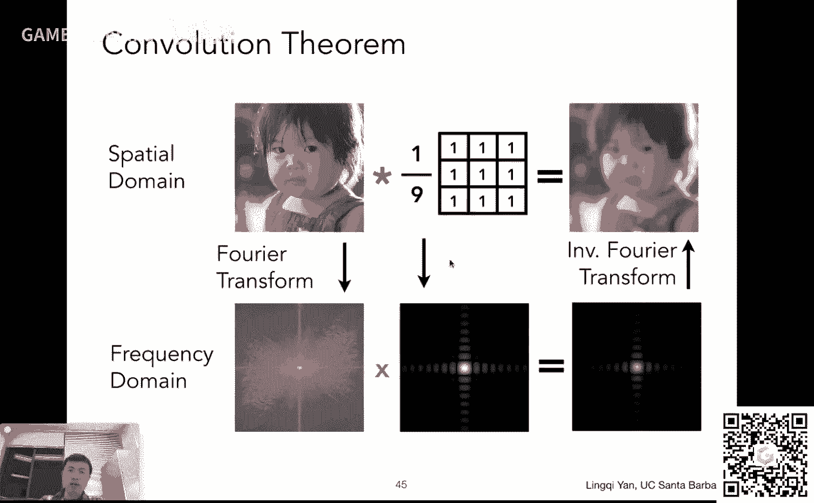

我们管它叫做这个低通滤波器啊，就是这么一个意思，然后呢这个呃我们可以这个再做一个简单的实验哈，这个嗯一个盒子它显然有一定的大小对吧，然后我们可以把这把它这个从左边，这这是它在时域上的一个信号对吧。

就是一个小的小的一个格子，然后咱们把它给变成这个频率上诶，变到频率上会发现哦对应是这么一个形状，那下面我有，一个问题对吧，如果这个这个盒子在食欲上它变大了，它就变大了的话。

诶在这个频率上它应该如何变化呢对吧，或者说这个这个如果这个盒子在实际上变小了，在频率上应该如何变化呢对吧，大家可以先想一想，那咱们现在进行下一页对吧，那大家会发现如果说我把这个这个盒子变大了。

变大了的话，它对应在这个频频率上反而变小了，诶这个要怎么理解呢，其实理解起来是完全正确的一个事情，比如说什么呢，咱们之前为了模糊一张图，咱们用一个3x3的一个卷积核对这个图像，进行滤波对吧。

然后我们会得到一个模糊的结果，那如果大家想象一下，如果我不用3x3的，我用一个比如21x21的对吧，我用63x63的，像这种这么大小的这些这些这个这个呃box。

然后呢我对于任何像素我都取它周围那么大一块区域，然后再平均起来，那得到的结果大家可想而知对吧，我用一个更大的这个box去这个对这个对这个呃图像做这个卷积操作，那得到结果肯定会越来越这个这个模糊没错吧。

越用越大的这个这个box它越模糊，当然也可以这么想，比如咱，们用一个超级大的box，用一个比这个比这个图像还要大的这个box，那得出来结果，那各处基本都一样。

因为因为把这个所有的这个图像上的这个像素都给加起来了，或者说我们再想一个极端，如果我用一个超级小的box，如果这个这个box比一个像素还小，那不等于是这个完全没有做滤波吗，对吧，那也就意味着说。

如果用一个超级小的这个box，那么它对应的频率上面的范围就会超级大，他把所有的频率都留了下来，没错吧，那所以我用一个大的这个box，我就只能留下更低的频率，也就是说让，结果变得更模糊。

所以这是非常有道理的一个事情对吧，那通过这种分析，我们就这个呃看了一下诶，我这个不同的这个这个卷积核，它本身它这个频率应该怎么样去理解好。

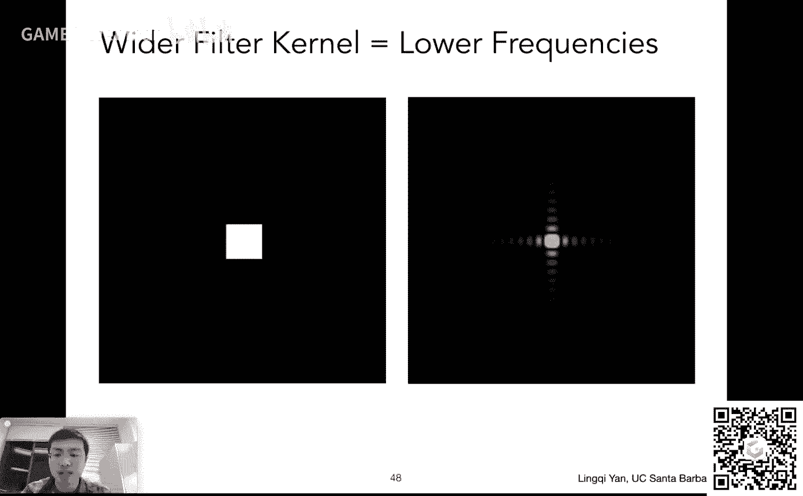

那么咱们刚才已经提到说好这个滤波等于卷积，等于在这个频频率上进行这个留下一段的这个这个频率对吧，然后呢呃我们现在在定义另外一个事情，那咱们从频率的角度上来看什么是采样好吧。

然后采样这里大家已经看到结果了啊，什么是采样的，采样其实就是在重复这个频率或者说频域上的内容，诶这是，什么意思呢，咱们可以理解一下好，那咱们看这么一个例子嗯，左上角大家看到的这么一个函数。

它是一个这个这个某个连续的函数好吧，然后假设它这个反映在这个频率上，它长这样，这是他复联的变换的结果啊，长这样，然后呢，假如说我要采样这个函数，那咱们现在这个想一想啊，诶什么叫采样呢，对吧。

我我要把这些函数变成一系列离散的点对吧，我就只留下这些在某一些位置上，它的这个函数的值不就行了吗，这就好像什么呢，好像说我在这个这个函数上去乘以一个另外一个函数，大家可以看另外一个函数是什么样的。

是说只在一系列的这些这个呃固定位置上有值，而在其他地方都没有值，就或者说为零啊，结果为零，那咱们可以想象，那如果说我用这个函数呃，就是c这个函数吧，乘以a这个函数得到了什么呢。

得到的可不就是这个这个a函数上面的一些离散的点嘛对吧，然后呢这个c它其实这个一个一个箭头啊，这它是有名字的，叫做冲击函数，然后这个冲击函数的定义就是就只在这个位置上有值，然后在这个其他位置上没有值。

然后大家这么理解，应该问，题不大好吧，然后乘出来的结果就是这个e这个结果其实其实就是一系列的点啊，和之前咱们画的那些空心的白点是一回事，就留下了一堆点，那这就是采样对吧，给你一个原本的信号。

你留下它上面的若干个点，那咱们现在呃已经说明白了对吧，怎么做采样呢，给你一个原始的信号a然后呢你去乘上一个这个一系列这个冲击函数，这个叠在一块儿对吧，这个这么一个函数就可以得到采样的结果诶。

那大家可以看这是在时域上了，这个函数乘以另外一个函数得到采样的结果，那如果，在频域上大家还记得这个卷积定理吗，对吧，就是说啊食欲上的乘积对应到频域上是什么呢，是卷积，那好那我们这个原始的这个函数。

它对应的这个频率不频率呃，上面的这个频谱我知道，那采样的这些函数，这个我可以告诉大家，这个经过傅里叶变换之后，它会变成另外一系列的冲击函数，间隔不一样，但还是一堆冲击函数。

那么我们说这个呃实际上的乘积等于频域上的卷积，也就是说我要把这个两个对应的函数a和c对应的频谱，b和d在频率上把它扯，把它卷积起来对吧，那么卷，积起来的结果就是b卷积d得到的结果是f诶。

大家就会发现这有一个神奇的现象啊，这个这个大家看一下这个呃，有一个函数原本是连续的，我把它采用了之后，变成一系列离散的点，其实我在频域上做的操作是什么呢，就是把它这个原始的这个函数。

它的频谱给复制粘贴了很多，对不对，就是就是做了这么一个操作，所以咱们总结起来这个略过中间的这个采样过程，那也就是说采样是什么，采样就是在重复这个一个原始信号，它的频谱对吧好。

那这样理解的话就可以就可以想明白，说这个为什么会产生怎样现象了，好为什么会产生怎样的现象呢，是因为我们这这个这个采样啊，采样的这个这个不同的间隔会引起频谱，以不同的这个这个另外一个不同的间隔来进行移动。

那如果说我的采样，假如说啊原本的这个函数，它的这个这个或者是信号，它的频谱长这样，然后我把它复制粘贴，按照这么一个不长来复制复制粘贴啊，大家可以看到啊，好我可以看到啊，这是原本的频谱啊。

这也是原本的频谱，这左边也是原本的这个信号的频谱，没问题，那如果说我采样这个采样，率不足，或者说我采样的不够快，采用的不够快，就会造成一个问题，就是说这个原始的这个信号啊。

它的这个复制粘贴它这个呃这个中间的间隔就会非常小，ok就是说我采样的不够快，意味着我我的采样点之间的距离很大，然后对应到这个频谱的这个复制粘贴上，就是说原始的这个信号，它这个呃复制粘贴它这个频谱嗯。

他自己的频谱啊，它中间的间隔就会越小，所以大家会发现食欲跟频率有好多相反的关系啊，你采样的越越这个稀疏，然后其实对应频频谱上他这个班级这个频谱的，这个内容就班尼特别密集，然后我就会发现单一的太密集了。

就会发现一个问题，说这里原始信号的这个这个这个信号和我复制粘贴的这个信号，在这一块混在一块叠在一起了对吧，唉像这种情况下，我就说这种情况下发生了走样，所谓怎样在频率的角度上来说。

就是嗯频率的这个这个频谱在经过这个复制粘贴，或者说班尼的情况下发生了这个混合，然后这种情况或者叫混叠啊，这种情况就是这个产生走样的原因好吧，然后那我觉得说这个是有道理的，为什么呢，大家可以想象一下。

啊比如说咱们还是原原本一个三角形，咱们回到光栅画上来看诶，原始的三角形，如果说我这个下面有好多好多像素对吧，然后像素非常小非常小，然后那我这个去一个像素去采用对吧，相当于对这个同样一个信号。

我采样的密集了诶，我看到的怎样的现象就会少很多，那如果我每个像素都非常大，像素跟像素中心间隔非常大，那就相当于我用稀疏的采样，那产生的走向现象就很严重，对道理就在这没问题吧。

所以说那这就是一种对这个对这个走样现象的解释，那么咱们就可以通过这，个这个事情来分析，那什么是反走样好吧，咱怎么样，那咱们可以看看有几种不同的这个不同的做法，比如第一种其实已经跟大家说了啊。

第一种就是说我可以增加采样率，增加采样率呢是这个终极解决办法对吧，比如说我的显示器，我原本显示器是一个古老的显示器，640x480的分辨率，这个一个像素非常大，很明显可以看得出来对吧。

那然后我要去用它去这个光栅化一个三角形，那当然看起来锯齿很严重，那我如果说我用现在的这个视网膜显示器，分辨率几千乘几千对吧，那，这种情况下像素就小一些，像素小一些意味着什么。

像素跟像素之间间隔小意味着采样率频率高对吧，意味着在频频谱上，它频谱的班级它的间隔大就不容易出现这个这个频谱的婚礼，哎所以说呃这当然是一个解决办法，但是这个是嗯这个并不是这个这个呃怎么说呢。

反走样要做的事情，因为你想啊这个反走样我们是在同一块屏幕上做的事情对吧，然后我不可能说我通过开启某个反走样的选项，我可以让我分辨率增加很多对吧，受制于物理限制，那它当然就不是我要的这个反走，样对吧好吧。

然后呢这个呃另外一个做法就是说如何降低这个走样的这个问题，那我就是说我真的要做这个反走样，那么反走让大家回到刚才一开始这个课之前啊，咱们给大家定义这个这个反走样的一个操作，怎么操作来着对吧。

先做个模糊再做采样，那这个有没有道理呢，那通过我们刚才的频率分析，我们这个这前面都是铺垫啊，算是这个意思，就是说通过前面的频率分析，我们就可以知道好，我们这个先做模糊再做材料，它是有意义的。

然后对应到这个频率上来说，什么叫模糊模糊，就是说低通滤波对吧，什么叫低通滤波啊，就是说我把这个高频的信息先给拿掉对吧，这就是模糊好，那我们把它重新翻译一下，怎么做反走样，先把一个信号高频信息拿掉。

然后再采样诶，为什么这样行，那咱们可以看这么一个例子，那对于还是对于这么一个函数啊，这个函数自己它就是对应到频谱，它就是中间长这个梯形，然后呢就是说大家还记得哈，如果说我原本的这种这种稀疏的采样。

在这个地方会发生一个这个频率混叠对吧，那就那就会产产生走样，那么如果我们先对这个原始，信号进行一个模糊，也就是说我把它的高频信号砍掉，砍到哪了，砍到这个这个这个呃方块，这个虚线方块之外。

我认为是高频信号，我不要了好吧，那砍掉了之后，那剩下的信号是什么呢，剩下的信号就是这样的一个一个形状对吧，这么一个形状的一个一个信号，然后我再以这个原本的这个稀疏的这个采样率来采样它诶。

我发现在这个时候他这个这个这个信号，它它它对应的这个频谱在这个位置它就不再发生混叠了，诶是不是这么回事啊对吧，就是说这样一来哎我先去做一个模糊砍，掉高频，让这个频谱它覆盖的面小。

然后我再以这个原本的间隔去复制它，就不会发生混叠了，那这就是我们的解决方法，反走样好，那这个就就把这个我们的做法啊，这个模糊操作和这个这个评委的分析结合起来了，那咱们再回到我们的做法上面来好。

原本说我们这样采样，直接采样不出问题，那咱们现在这个先对这个信号做模糊，把这个三角形变成一个模糊的三角形，然后我再采样出来结果。

那自然得到的结果就是对的了对吧，然后呢我们实际的操作中，实际的操作中我们用什么，这，个这个这个滤波器对吧，来进行一个信号的这个这个模糊操作。

或者说这个卷积操作对吧，那这是一个问题，就是说我们回到上面来，那就是我我到底怎么才能把一个三角形变模糊对吧，这是大家要问的一个问题对吧，后面采样我知道怎么做。

那就是说现在所有问题就在于我怎么做这一步这个滤波操作，把三角形变成模糊三角形，那很简单，那我就用一个呃一定大小的这个低通滤波器，对它进行卷积就可以了对吧。

卷积也就是平均就是把一个这个三角形任何呃某一个位置的一个点，让我取周围的一块，然后把这一块的结果平均起来。

唉这就是对这个对这个三角形进行模糊操作的办法，那么是取什么样的块呢，很简单，最简单的这个这个块儿，那在这个图像上对吧，最简单的一个块大家很好理解，就是一个像素，这一个像素自己它正好是一个小方块。

然后这个小方块呢它这个就是一个box filter，咱们之前说了对吧。

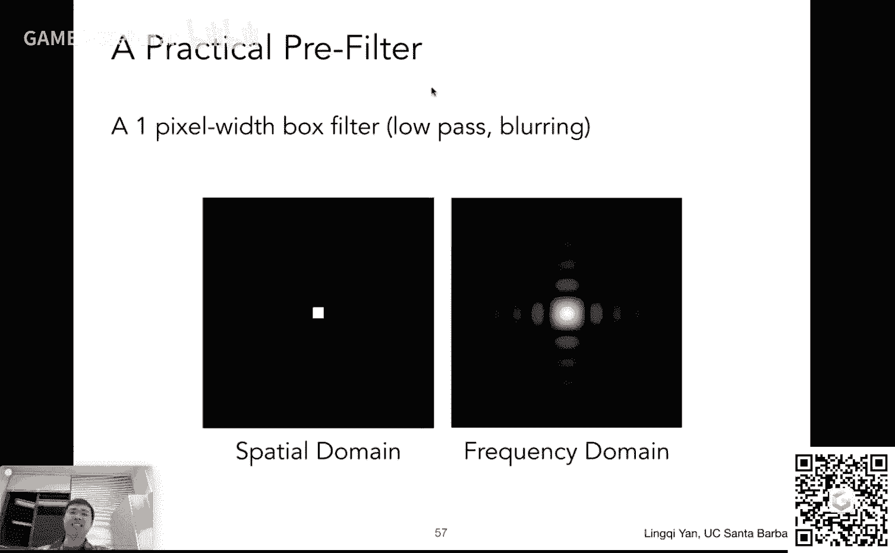

它是一个低通滤波器，它起到的作用就是这个这个模糊操作，那咱们要怎么做呢，那其实就是说呃先做一个模糊操作，也就是卷积，那大家知道原本三角形它是，一个这个要么这个点在三角形里，要么三角形在三角形外对吧。

它是一个这个二值的函数，然后现在呢我们就是说我们要把这个函数做一个卷积操作，用每一个这个像素对应的这么这么一个小的box对吧，我做一个卷积操作，或者说我求个平均，然后我再把这个球的平均值的中心采样。

哎对对，其实不需要采样的，对平均值这个呃就是一个值，咱们待会儿会看的对吧，然后也就是说这里就是我们的做这个呃卷积操呃，不是不是做这个这个反怎样操作的基本方法好，我对于每一个像素我，把三角形求个平均值呃。

然后我再做采样，那么这就是我们要做的事情，大家可以看到对于任何一个像素，我都知道这个三角形可能会覆盖，比如说要么完全不覆盖它，要么覆盖完，要么是一部分覆盖对吧。

也就是说比如说我这里看到的都是不同的像素好，不同的像素，这个这个在这个像素里面，三角形覆盖了它的左上角，然后这里覆盖了它的一半，感觉他很多，然后呢我刚才说对于任何一个像素内部。

我们都对这个覆盖这个面积啊，求一个这个平均对吧，比如说像这里，比如说覆盖了咱们，说1/8啊，那它的这个值就应该是这个1/8的这个亮度，然后呃呃然后这个呃然后这里覆盖了一半，那它的值就应该是一半的亮度。

然后呃不是不是亮度啊，覆盖多少，就意味着这个就是就是就是说没覆盖的7/8啊，就是覆盖大概就是有这个87%的y85 的八是多少来着，12。5对吧，87。5对的这个这个白色，然后呢如果覆盖完了。

那自然就是全黑对吧，那也就是说在这里我把这个呃呃怎么说呢，我把这个这个像素内部它的这个这个值诶，给这个平，均起来了对吧，这就是我们所说的这个卷积操作好，那么如果我们可以这么做的话，那问题就解决了。

然后在实际中要如何操作啊，好吧，这个好像没什么办法啊，而且是这样，其实连这个第一部分都没说完的，好吧，这个感谢大家理解，那咱们刚才说到哈怎么怎么做来着对吧，把一个三角形。

然后对于对于它覆盖的每一个像素诶，我都这个这个这个求一下它覆盖面的平均对吧，或者说没覆盖面的平均，然后但这事儿说着容易做，着难啊，怎么才能这个这个这个把一个三角形在三呃。

在某一个像素里面覆盖的区域算出来，这个这个不容易对吧，这个而且说这个计算量也挺挺多的对吧，那呃怎么办呢，所以说人们研究出来的一种近似方法，所以说咱们现在把它给说清楚啊。

就是说我们现在所要给大家介绍的叫做multi simple anta类型，也就是说用更多的这个采样点来进行这个反走样，那么那么它是一个这个对反走样的近似，它并不能严格意义上解决这个开某样的问题。

那么他是怎么样工作的呢，就是这个m s a a怎么，样工作的呢，就是说对于任何一个像素里面，我原本不是这个，假如说我用这个这个一个一个一个点，这是我这个像素能裁掉的这个点对吧。

然后我认为一个像素被我划分成了好多个小的像素，这个这个这个划分成好多小的像素，就好像现在大家看到这个这个像素被划分成了这个4x46个像素，然后呢呃然后呢每一个小的像素假如说它有个中心对吧。

然后我可以这个这个嗯判断这些点是不是在这个三角形内，然后我们再把这个判断的结果平均起来，是不是就是我对这个这，个三角形对这个大的像素啊，它的覆盖区域的一个近似对吧，如果我有非常密集的点。

比如说100x100个点诶，那我就可以得到一个相对准确的近似，那如果用4x4得到的不准确，但没关系，效果还是挺好的，比如说咱们看这个，看这个结果对吧，然后呢呃这里可以看到一个一个这个这个例子。

什么例子呢，但是这个一个三角形覆盖了若干像素，每个像素挺大的，然后呢假如说我可以把一个像素内部多加一些采样点对吧，比如说我用到这个两个这个这个呃就是2x2的一个这，个这个更小的这些这些点嗯。

然后呢这些每一个点我都可以判断是否在三角形内，那咱们挨个判断，比如左上角这四个小的点诶，这都没被三角形覆盖，所以覆盖率是零，然后这个得到结果是零，然后同样道理一直可以做做下去，考虑到这个像素的时候。

咱们把它加入，这就考虑这四个点，这四点我会发现啊，刚才啊刚才会发现这四个点有一个点在外面没被覆盖，三个点被覆盖了好，那我就认为这个像素它在三角形对，如果说我要求这个三角形在这个像素内的平均的这个值。

或者说覆盖，率，那它就是75%，就是这么个意思啊，咱们可以继续进行，咱们可以看到这个这个像素呢，它我用了四个不同的点去感知是否这个像素，而是否这些点在三角形内，那我会发现有一个点被感知到。

也就是这个点会在三角形内，然后其他三个都不在，那覆盖率就是25%，然后就是说这个这个呃得到一个这个覆盖率相对较低的结果，也就是说我把这个像素的值写作这个这个像素，这个三角形在这个像素内的近似的覆盖率。

也就是25%到红色，然后就是通过这么，一种方法来做诶，所以说我们可以把这个这个呃那通过这么一种方法，然后我们可以做一个这个抗锯齿的这么一个效果对吧，然后在这里我们稍微停一下，是这么回事。

首先呢有一个有一个这个这个概念得得这个说明白，我们刚才说了啊，这个m s a a通过更多的这个这个样本，然后我们来近似的是什么，近似的是第一步就是反走样的，第一步也就是模糊这么一个过程。

然后呢模糊完了之后，就相当于是每一个像素内部，我已经知道这个三角形的覆盖率，我这个求了平均之后是什么，的，然后就会得到这么一个结果对吧，得到这么一个结果之后，算是第一步做完了，模糊操作做完了对吧。

相当于是我用一系列的这个box去模糊这个三角形，这步做完了，然后咱们再采样采样很简单，这里就变得无比简单，因为一个格子它是同一个颜色，你采样在它中间，那它就应该是这种颜色。

所以说得出来的结果就应该是这个结果，所以说在这里强调的一点是，m a n m s a a就是说它解决的是这个这个嗯，对这个信号的模糊这么一个操作，这个这个这个操作，而下一步操作的采样，这。

部分操作相当于是这个隐含在这个过程里面了，但其实如果大家认为真的下一步有一个采样没什么关系，所以也就是说msa绝对不是靠提升分辨率直接解决的这个走样问题，因为大家可以看到就是说我通过那么些采样点。

增加了这么些采样点，我只是为了近似一个合理的这个覆盖率而已，并没有真的提高这个像素呃，这么些这个比如说屏幕上的分辨率对吧，它该这么些像素还是这么些像素，所以说通过这种方法来理解才是一个这个正确的。

对这个反走样的理解没问题吧，就是说，嗯不是说通过提高了采样率而完成的，我通过那么多不同的这些点，仅仅是为了呃得到一个近似的这个三角形和覆盖而已好，那么说到这儿应该就比较明白了。

所以这个呃这个m s a a基本就是这么一个工作原理，然后咱们看这个效果自然是可以看得出来的，这是没有这个抗锯齿的，然后这是有抗锯齿的对吧，所以这个效果挺明显，然后呢呃这里masa a说到这儿。

然后咱们可以停下来做一个非常非常非常简单的思考对吧，说我这个通过msa a啊，然后呢这个这个这个这个呃可以得到，一个抗锯齿的效果，而且效果还不错，但是我们知道这个对吧，no free lunch对吧。

没有这个免费的午餐对吧，那么呃我们为了引入这个m s a a，我们为了做到抗锯齿这么一个效果，然后我们到底这个牺牲了什么东西对吧，这个事情很很显然，这个这个大家应该这个一目了然的事情。

因为我们用更多的点去测试是不是在三角形内对吧，那当然是增大了计算量，通过增大计算量，然后这个这个得到的抗锯齿的效果，而且增大了多少计算量，我其实这个可以说的明白对吧，比如说一个像素，我用这，个呃4x4。

那就是16倍的计算量，然后如果2x2，那就是四倍对吧，然后就是说我这个通过这种方法呃，来来来做这个抗锯齿，那么现在多说一句，就是说啊人们都是这个很贪婪的，对不对，人们根本不希望用那么多的这个材料。

这个这个数量去这个去呃，怎么说呢，就是说呃达到这么一点点这个效果，大家希望说这个我只需要用很少一点的这个这个采样的这些点，然后我也可以达到这个这个嗯比如说4x4这么一个一个格子，这个采样点的效果，嗯。

我假如说我只想用八个零，对吧哎然后人们就会发现这个事情是可以的，而且事实上在工业界的应用上来说，人们用的并不是一个这个像素，咱们把它规则的划分成比如说4x4个点。

取中间的一些这些这些更小的这些所谓此像素，它的中心不是这么做的，然后人们会用一些这个这个更加有效的一些图案，来分布这些不同的这些点好吧，然后把这些采样点分布在一定的这个这个图案上面。

然后有一些点还会被这个临近的不同像素所附用，所以说通过这种方法来说啊，就是说这个这个大家就会可以看到，我们刚才说m s a a专门强调说他用的这个不同的这这这么些点数，不是说增加分辨率来解决这个问题的。

那么通过这个工业界的做法，咱们可以得到另外一个体会，对确实确实是这样的，因为有一些这些采样点，它是会被各种各样不同的像素去复用，仅仅是为了通过这些点来去检测三角形的覆盖而已，所以说从这个角度上来说。

这就是为什么我们可以用一个不规则的一个呃，这个这个分布来描述这个嗯，增加了这么些采样点，所以这就是为什么比如说大家打游戏的时候，大家会，发现好，我采用启用抗锯齿，我用m s a a的方法。

然后我用这个四倍，然后我发现帧率往下掉的可没有，这个没有那么多，不会掉到原来的1/4对吧，道理就在这儿，但这个有很多的这些这个这个样本得到了复用，所以非常好，当然在这里。

这个不给大家都说这个这个具体说它到底是一个什么样的分布了好吧，然后咱们在之后的这个光线追踪这块啊，给大家稍微说一说，这个涉及到一些随机数，或者涉及到一些这个怎么样去分布这个样本。

才能达到一个最好的覆盖效果，咱们之后会，说然后另外一个事情给大家总结的事情就是什么呢，咱们这里提到了一种抗锯齿，但咱们这个课叫现代计算机图形学对吧。

这个一种这个抗体是显然无法代表说现在腾讯学的我这个发展，然后呢呃我们这里就给大家介绍两种吧，这是我个人的理解，就是说抗锯齿方案有特别特别多的抗锯齿，不同的抗锯齿的方法，我给大家提另外两种。

一种叫fx aa，一种叫ta a我认为这两个是算是这个除了msa之外最重要的两个了，而且个人意见哈，就是说而且这两种方法呃得到了工业机的广泛应。

用那所谓fx aa是一个缩写叫fast approximate，aa，就是说这个快速近似抗锯齿，他怎么做的呢，它和这个这个呃增加这个样本数就没有任何关系，它是一个图像的后期处理。

就是说我先把这个这个这个一个这个有锯齿的这个图得出来，然后我再做做一种什么样的操作，然后我把这个锯齿给弄掉对吧，是这个意思，但是大家大家还记得吧，如果我先得到一个有锯齿的图，我再去对他做这个模糊操作。

这是不对的，咱们一开始就已经说了对吧，然后大家有兴趣的同学也可以从这个频率的分析上来看，那，么咱们再回到这个fx a a上，他怎么做的呢，很简单，这个得到一幅图有锯齿，然后他把这些边界都给找到。

通过一些图像匹配的方法找到，并且把这些边边界给换成没有锯齿的边界，简单吧这么一个操作，而且非常非常快，所以说它是一个和采样无关的，它是另外一个在图像层面上做的这个抗锯齿，然后效果挺好的。

然后呢这个t a a是什么东西，ta是最近几年才刚刚兴起的一个这个抗锯齿的方法，但是非常非常简单高效，什么呢，大家从t可以看出来，这个t叫temporal，temporal的意思就是与时间，相关的。

然后意思就是说我怎么样去做抗拒什么，我去找上一帧的信息，咱们比如说这个意思啊，比如说这个我们还是用这个像素呃，内的一个点，一个点没有做m s a a来来来感知是否在三角形内。

然后假如说我们看到的不是一个运动的场景，假设说一个静止的场景，相邻两帧显示的东西一样，但相邻两帧我可以用一个像素内部不同位置上的点，来感知这个三角形呃，这是我在三角形内。

那大家会发现这个这个在时间范围内得到了这个静态的，这个场景的图啊，会各不相同，在这个边，界上有一些之后出现了边界，有的时候没出现边界，然后这个temporal aa。

他的这个思想就是说我复用上一帧的这个这个这个感知到的这个结果，然后就是说上一帧的这个每个像素的值在这周还会继续发挥作用，然后被应用进来，然后就就是说这相当于什么呢。

相当于是我把m s a a对应的这些样本给分布在了时间上，然后并且在当前这一帧来说，我没有引入任何额外的操作，所以这是一个非常这个这个这个聪明的做法，当然了，对于这个运动的物体怎么办。

这个咱们之后在这个实时光，线追踪上给大家说好吧，因为那个用的核心思想其实和这个呃temporal aa的思想一样，这里多说一句哈，对于这个工业界，它是美国的工业界来说。

这个temporal aa大家都倾向于念成temporal aa，因为temporal本身还有这个暂时性的这么一个意思，所以大家为了区分这个意思，大家把这个这个音译读了，这个读成这个temporal。

所以人家这么说，说了一个事儿啊，好然后呢这个啊这里再多说一句，就是算是今天的这个内容总结吧，就是说嗯在这个提到这么一个抗锯齿这么一个概念的时候，一定还得提另外一个和他很相。

似的一个概念叫做super resolution，其实相当于这个中文叫做超分辨率，所谓超分辨率的概念和抗锯齿就不太一样，但是本质是相似的，就是说超分辨率什么意思，比如给给大家一张图。

比如说是512x512的，我们要把它给拉搭乘1024x1024的，然后但是呢大家知道如果把一张小图给拉大，那看的全全都是锯齿对吧，然后就是说我想把这张图拉大，但我又不想让他看到这个锯齿对吧。

那其实说白了是什么呢，说白了其实就是说呃大家有一幅这个呃高分辨率的图，但是你的这个采，样的这个这个率不够，就是说你高分辨六的图是1k乘以1k的，可是你采样到的结果只有512x512的。

你想把这个高分辨率的图给恢复出来，所以可以这么理解，从这个角度上来说，那这个超分辨率这么一个过程和这个这个这个嗯怎么说呢，就是说这个这个我们的抗锯齿这么一个过程。

或者说m s a a这个抗锯齿的这个过程，这是非常相似的对吧，都是要解决这个样本不足的问题，这里就介绍一种这个做法，叫做d l s s，然后咱们把这个这，个呃这个超分辨率这个过程做出来什么意思。

就是说原本有张小图把拉大了之后，那肯定有些细节缺失缺失怎么办呀，没关系，咱们猜出来就好了对吧，猜出来怎么猜呀，什么技术适合猜呀，这个事情相信大家都比较熟悉对吧，一切涉及到猜测的这些技术。

然后我们可以给他足够的这个经验性的东西告诉他啊，出现在在任何一个局部，然后我应该如何把细节补上去，一个一，那我刚才就是说这两个事情不是一回事，但是本质相同好吧，那这个好吧，没办法。

因为这个内容相对来说难一些，然后又多一些，然后咱们就说到这儿，而且还没时间说这个怎么样去呃，考虑这个深度测试，以及这个这个这个嗯就是遮挡啊这一系列的事情，那咱们就留到下节课了来再说好吧。

那这节课到此为止，那关于抗锯齿这块，那咱们就已经完全说明白了，说的内容相对较深，然，后这节课难，然后咱们这个之后如果课后大家就愿意多花点时间，这个这个多看一下这个这个视频。

唉也欢迎大家这个呃踊跃讨论好吧，ok那咱们这个就暂时说到这好，然后之后这个嗯就交给我们的技术秘书同学。

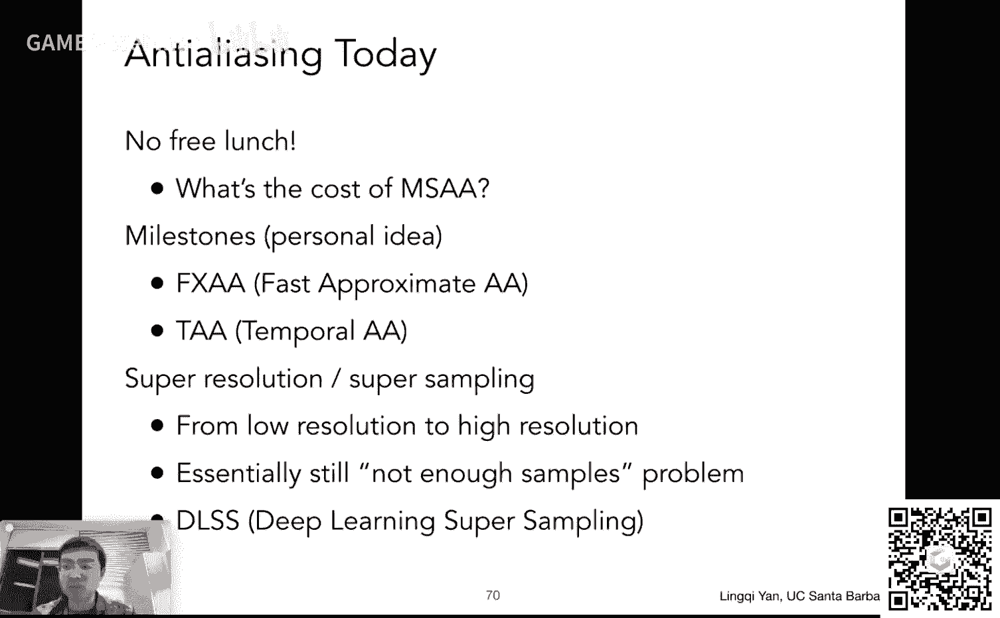

然后这个各位同学这个赶紧去吃饭啊，实在是不好意思行。

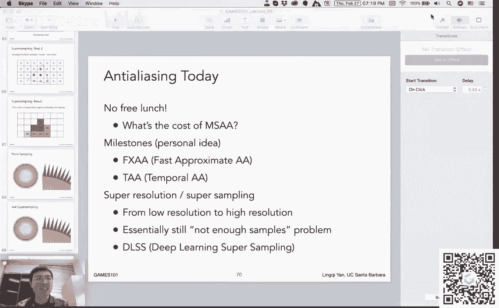

ok那就说到这儿，咱们下节课再见啊，宝贝啊。

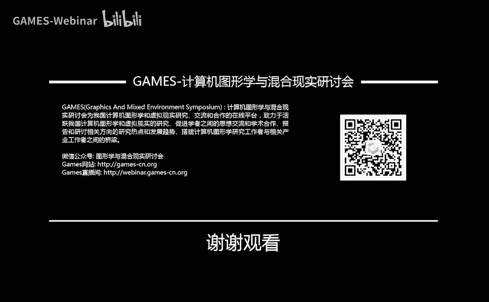