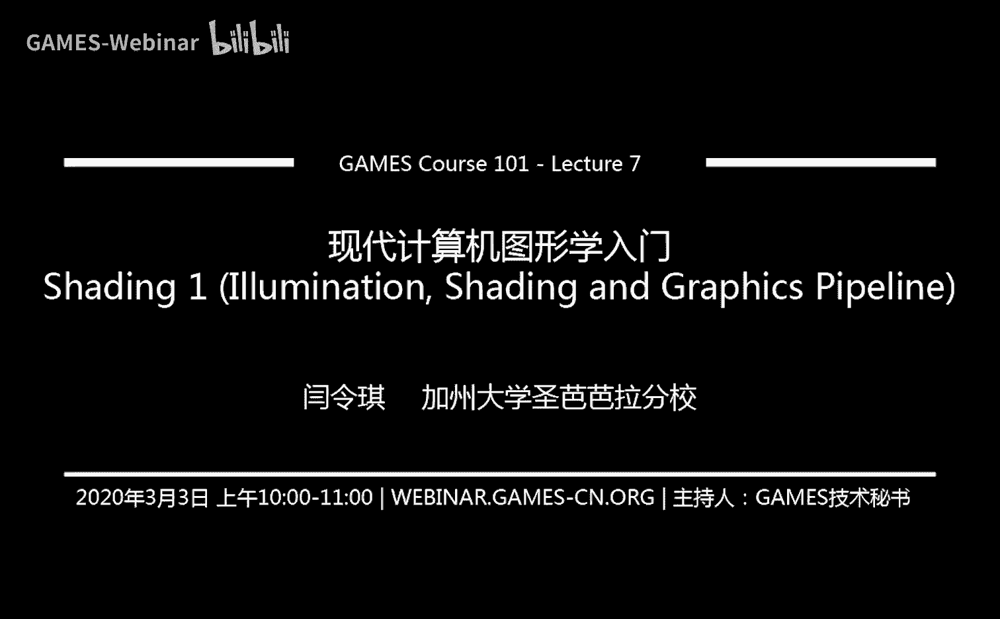
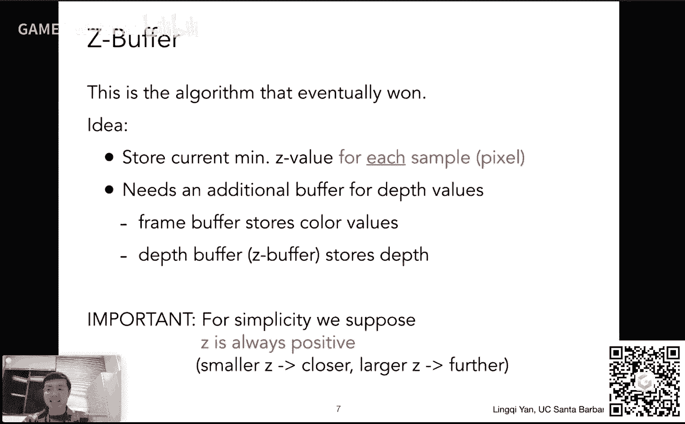
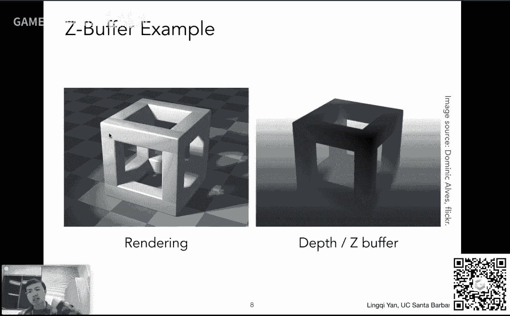
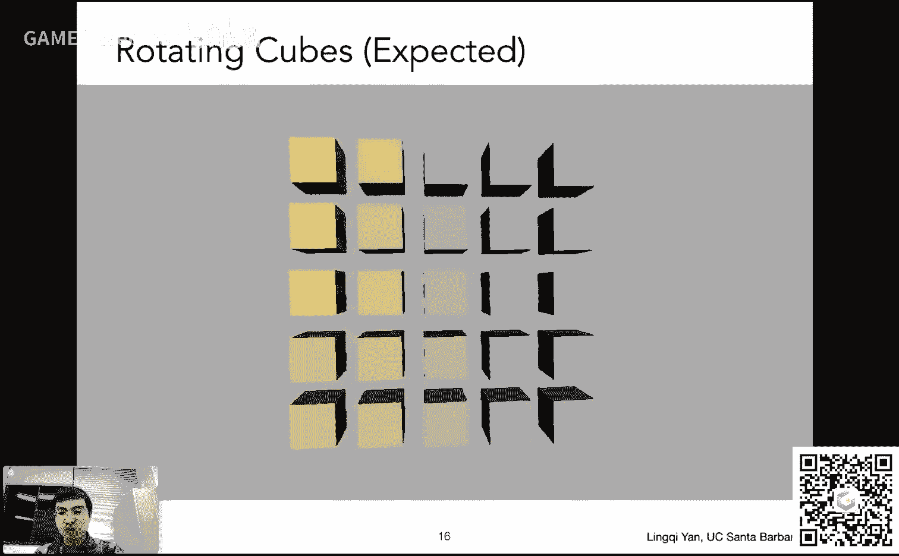
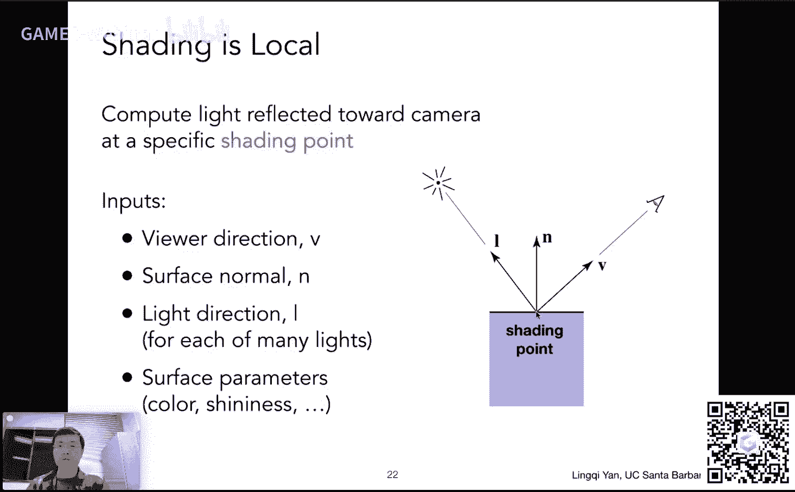
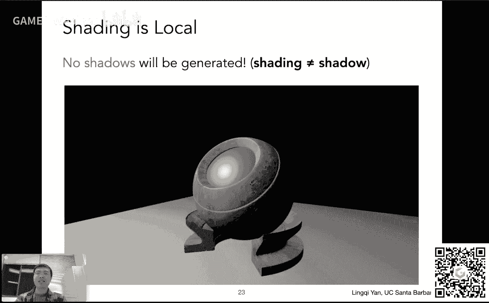

# GAMES101-现代计算机图形学入门-闫令琪 - P7：Lecture 07 Shading 1 (Illumination, Shading and 
Graphics Pipeline) - GAMES-Webinar - BV1X7411F744

感谢大家一如既往的支持，那咱们今天开始讲第七课啊，第七课大家可以看到这个从这节课开始呢，咱们要开始讲着色shading啊，然后之前咱们这个光栅化这块部分就算是这个顺利结束了，但是呢有一小块知识。

关于这个深度测试这块，咱们还没说，那咱们今天这节课一开始先把它补上好吧，那咱们今天这节课要讲一些这个这个光照这个着色嗯，图形管线，然后这都是什么意思呢，咱们很快就知道，那么在这个课开始之前。

我们说几个事儿啊，第一是这个这个大家非常踊跃啊，我发现这个目前为止作业一诶已经交了300多份提交了，呃，这个这个非常夸张的，因为作业零我上次记得说是200对吧，然后所以一竟然这么多那行，那从这一点来说。

我们确实需要更多的助教，然后所以说啊那我们会从这个这个之前已经提交了申请了同学中，然后开始这个这个招募助教，然后我们看看这个嗯，这样的话到时候回答大家问题应该也方便一些好吧。

然后呢这个啊嗯作业二今天一切顺利的话，咱们就会把作业二放出来，作业二关于什么的呢，就是关于咱们这个很快待会儿要说的这个呃关于深度测试的，然后就是说呃当你有更多很多三角形叠在一块的时候，它们之间互相遮挡。

这个问题如何解决，然后然后呢这个我刚刚才在课前问大家，这个作业一，大家觉得难度如何，大家反映难度还可以啊，这这样的话呢这个作业二肯定不成问题，作业二相对简单好吧。

然后呢嗯这个我在想我们原本安排了这个着色，我们要讲两节课，然后说一说这个实时渲染的这个动态，嗯我这里发现一个问题，就是着色这块内容相对较多，可能着色自己可能就需要讲三节课。

然后这个咱们尽量这个稍微稍微说这个快一点啊，在保证这个说明白的情况下啊，说的稍微快一点，然后咱们看看这个这个要怎么安排好吧，那大概这个就是咱们现在的这个呃课前的一些这个要说的内容吧。

那咱们这个立刻进入课程内容，那么在之前的几节课里面，我们提到说这个光栅画要怎么做对吧，特别的我们提到一个事情，就是说如果你有一个三角形，我们要如何把它给画在屏幕上对吧。

我们提到了说哦屏幕它其实就是一堆像素，一堆像素就是每一个像素是一个这个这个这个小方块，并且颜色是一样的，个数是一样的，那么咱们就用像素的中心对这个三角形覆盖这么一个信号做采样。

然后我们分析了说这个这个为什么我们这么采样会产生走样问题，以及说我们如何做反走样，一个基本思想就是先做模糊，然后再做这个这个这个这个采样，这样就能解决问题。

那么我不知道有没有同学这个课后思考过这么一个问题啊，那我们说这么做是对的，可是我们没有说在这个频域分析的情况下，怎么呃，证实说我这个先采样在做模糊是错的对吧，这里给大家一个提示哈。

先采样就是把它这个信号的频谱进行翻译，然后它会有频谱的混别，然后这里采样呢相当于是在混叠了之后，然后再把这个信号给截断，那这个时候大家就会发现这个混别的信号还是混别的信号啊，这里是算是一个提示。

关于说这个为什么另外一种方法做不行，那么咱们上一次就说到这里对吧，然后到这里我们就已经可以把一个三角形给画在屏幕上了，然后这里这强调了一下一个三角形对吧，那这个大家自然会问这么一个问题。

那实际的场景有很多很多不同的这个这个三角形，组成好多这个空间的三角形，然后不同的形状，然后这个各自呢离这个这个这个相机的距离也不一样对吧，然后咱们如何把这个这些三角形这个画在屏幕上。

并且让它们的遮挡关系是对的，近处的永远要遮住远处的，那这个问题今天咱们来解答，也就是说我们要回答这个可见性或者遮挡这么一个问题，嗯然后呢我们解决方法这里也写清楚了。

我们的解决方法叫这个深度缓存或者深度缓冲啊，就是或者叫z buffering啊啊啊，或者这个英文叫做depth buffering一样，然后呢这个呃我们在这个之后就进入这个着色这个环节。

咱们提到这个嗯怎么做着色，怎么样分析光照，然后这个现代的这个硬件的图形管线，就是说现在的硬件中是如何做着色的，咱们把这个问题说清楚，那今天这个咱们尽量把这些都覆盖到好，那么咱们要说的是什么呢。

是这个嗯可见性这么一个问题对吧，那大家想这个场景中有很多不同的物体，那我要把这些物体都给放在这个屏幕上，那自然涉及到一个顺序的问题对吧，这个我要先把什么放上去，再把什么放上去，然后这样使得这个图啊。

最后我看上这张图是对的，那么这个很直观的一个想法是什么呢，那我应该把这个最圆的物体啊，先把它给画在屏幕上，然后呢我这个逐渐的把近的物体再给这个补在这个屏幕上。

让它覆盖这个以前的这个这个这个远处的物体对吧，逐渐的我这个从远到近，这样把这幅图给画出来，就可以得到准确的做法呃，这个这个准确的一个一个结果，那么这个正是这个以前啊这些画油画的这些画家。

然后他们是如何作画的，对吧，比如说这里这个大家看呃，这里呃再画一幅图，然后呢这里这个画家们先画了一个呃远处的山对吧，然后呢这个画家又在这个基础上画了一个近处的这个草地。

然后遮挡住了一部分这个远处的山对吧，然后呢在这个草地上面，画家们又在上面加了好多树，然后这些树呢又挡住了之前画的草地，当然还挡住了一部分山对吧，这样的话就等于是把这个这个过程完完整整的给做了出来对吧。

而这个算法什么算法，就是说我们有一个场景，我们先把远处的东西画好，画在屏幕上，然后远处的东西先做光栅画，然后近处再慢慢慢慢慢慢，这个这个把光栅化做完。

我们就可以得到一个处理了正确遮挡的一个一个正确结果啊，所以人们管这个算法叫做画家算法，就叫pandas algorithm啊，那么这里多说一句啊，这个画家是指油画家啊，就是先把这个远处的东西画完。

在网上画新的东西的时候，会覆盖掉以前的这些东西，而不是说比如说我要画一个素描或者是干什么，然后我再把它一点点画出来哦，这个就不不涉及顺序了，这是两个事啊，我们说的是这个会永远这个新化的东西。

会覆盖这个这个以前画的东西啊，这样的话这个画家算法这就好理解了好吧，然后呢这就是这个人们怎么去画这个这个这个呃这么一幅画，那在图形学里面是可以这么做的对吧，比如说咱们如果要画一个立方体啊，画一个立方体。

那立方体要怎么画呢，那咱们沿用这个画家算法，咱们可以先画最圆的这个这个面对吧，嗯假如说就是前后两面，然后当然后面这个面咱们先画，画完了之后，咱们再考虑画周围四个面对吧，比如说这个左面下面右面上面诶。

这四个面画完啊，然后呢咱们在画这个呃，中间那就是就是就是就是最前面这个面，最前面这个面最后画上哎，把这个之前这些都给挡上诶，然后大家会发现这挺有道理的对吧，然后这个这个得到了正确的结果，没问题。

也就是说画家算法在一定情况下是适用的，但是呢如果有同学在这里啊，稍微抬杠一下啊，这个呃有个地方没说清楚，因为我说我们把这个周围的这四个面给画好，呃，我说先画左边下边右边上面。

可是咱们如果不是这个顺序怎么办，这个我们都知道这周围的这四个面，对于我来说，我觉得他们离我是差不多远的对吧，都比这个这个最远的这个面要稍微近点，都比最近的这个面要稍微远一点。

那么这四个之间的顺序是怎么样的呢，那比如说我要是先画右边这个面，再画上面这个面，再画左边这个面的时候，大家可能就会注意到，比如说这里当然我没有画出来，就是这个鼠标，我现在题目的地方。

这里应该就会出现一道线，然后呢嗯咱们在画完下面这个面，再把前面这个面填上之后会发现不对，得到的结果就是在这个基础上，这里多了一道竖线，那也就是说我画的这个顺序啊也挺讲究的，就是说我这个是巧合。

先画左边这个面可以画对，那我要是先画右边上面在左边的下面呃，然后再画前面，这样做就不对，那也就是说我想定义这个深度啊，其实挺难的，就是相当于距离，就是离我们这个观测点的这个距离，我们管它叫深度。

这个不容易对吧，当然了，这个这个啊在一定程度上，咱们说这个画家算法其实是可以的，然后呢呃它可以比如说我在这个所有的物体，然后它的深度我把它排序，然后从远到近，然后咱们把它给画出来。

然后大家都知道哎这个排序要花多长时间呢，需要n log n的时间，如果有n个这个三角形呃，那我们花这么长时间，然后一个个把它关上画上去就可以了，但是有一个情况非常特别，大家可以看是这么一个情况呃。

这是一个什么情况呢，这个也就是我刚才提到的，说这个我们呃我们刚才说这个立方体周围四个面，这还属于简单情况，这里是一个更复杂的情况，诶这里发生了什么，大家可以看到啊，有三个三角形，这个都是空间的三角形嗯。

p q2 这么三个三三角形，而这三个三角形呢，如果我问大家这个三角形谁在前面，谁在后面呢对吧，谁离我的这个这个相机更近一些吧，谁谁覆盖谁，大家就会发现有有一个很严重的问题。

因为他们两两之间都存在一个覆盖关系对吧，这个p3 角形会覆盖q3 角形，那q3 角形覆盖r3 角形，偏偏r3 角形回来又覆盖这个p3 角形，那这个时候就形成了一个环。

也就是说他们在这个在这个深度上存在一个互相遮挡的关系，那在这种情况下，那我就没有办法定义他们之间的深度关系，那我自然也就不可能用这个画家算法，然后我提前把它给排个序呃。

然后我在这个按照一定顺序来来这个把它画出来，因为那样永远都会是错的，对吧，哎那这样的话呢这个这个嗯这就反映说呃不行，说我们这个嗯实际上的实际的做法中呢，咱们不能用这个画家算法，所以为了解决这个问题。

在图形学里面大家是怎么做的呢，大家引入了一个概念，叫做这个深度缓存或者深度缓冲or z buff，然后呢这是一个这个现在大家广泛采用的一个算法，那么这个算法是在干什么呢，那么这个算法其实也是很简单的。

这个算法呢它其实就是在说好吧，那我既然说对于这个空间中的三角形，我不好，这个排一个这个他们之间的这个相信这个这个呃远近这么一个顺序，那我对谁比较好排呢，我对每个像素来说，这个挺容易分析的对吧。

如果我每一个像素，然后我认为它会看到哦，这个三角形或者那个三角形或者另外一个三角形的某些部分，然后这个每一个像素我就可以在这个像素内永远去记录这个像素，所这个表示的这个这个几何，它的最浅的深度。

也就是离我们最近的这么一个距离，那么这是什么意思呢，这个当然我们马上就会给大家来说，那么为了完成这个深度缓存，这个通常大家都在这个图形学中的做法是这样的，就是说我们这个会渲染最后的这个成品的这个图。

也就是我要的这个这个这个结果啊，就是说我要的最后一张图像，然后呢再生成这个图像的同时，我们也会生成另外一个图像，这个图像呢只存这个任何一个像素，它所看到的几何物体的这个最浅的深度的信息。

然后我们管这个图叫做深度图或者深度缓存，也就是说啊始终我们是同步生成两个不同的东西，一个是最后的结果，咱们把它叫做frame buffer，我们把它给存在这个frame buffer里。

然后另外一个呢是生成这个我当天看到的场景，任何一个像素对应深度，然后就是说它存在一个叫做depth buffer，就是深度缓存里面，然后这么两个两个东西同时生成，然后我们利用这个深度缓存的这个这个想法。

然后我们来这个这个这个维护遮挡信息，那咱们说了这么些，还没开始说怎么做呢，对吧嗯在这之前我们提一个上，如果大家还记得的话，我们在这个在这个变换中间啊，我们提到这么一个事情。

说我们始终假设我们的相机是放在原点，并且是往负z方向去看过去的对吧，那这样的话我就是说我看到的所有的z都是负的对吧，并且如果这个数字小，反而说明这个这个这个这个呃离我们远，然后数字大呃。

反映了离我们近对吧，是这么个意思，那么在这里呢为了简化这个计算，我们把这个之前看到的这个z啊，然后给这个这个换一个概念好吧，换一个概念就是说我们认为现在啊我们这个呃固定相机，我们往场景中间去看。

我们得到了一个普通的深度，这个深度大家就可以理解成是这个点到这个到这个呃摄像机的距离，而这个距离呢永远都是正的，并且越小的距离表示越近，越大的距离表示越远，那咱们就是说单单纯对这个深度的测试来说。

咱们正假设这样比较好理解一点好吧，那咱们这样就可以来继续看这个这个深度缓存的工作原理了，在这之前呢先给大家看一眼这个深度缓存。

如果我们做的对，应该得到一个什么样的结果啊，我刚才说说这个对于一个场景来说，我们最后要渲染出一幅这个画面，也就是我们左边要的这幅图，然后呢我们同时还要这个维护。

说这个这个这个呃所谓任何一个像素看到的深度，那咱们看右边这幅图，就是说这个深度这张图，而这两张图永远是同步生成的，那右边这幅图的深度如何理解呢，咱们可以看这么一个位置。

比如说大家都知道这个立方体如果这么放的话，那我相信这个角应该是离我们的这个这个呃这个试点，或者说眼睛诶或者摄像机最近的地方，那它的深度就应该浅，那它的值就应该小对吧，然后呢呃我们知道比如说这个点。

这个点呢呃离咱们的这个试点那就相对较远，然后呢那它对应的深度就大，然后深度就大，反应在如果把它给反映在颜色上，就会它会越白对吧，对任何的像素我们都这么去记录它。

比如地板这里我会发现哦这个地方这当然地板离我们近啊，深度要浅，然后这里地板离咱们远，那咱们这个这个深度就就就这个这个这个呃相对较大一些对吧，那那这里就说明这个是对的，没问题。

那这一个深度的图或者说这个深度缓存嗯，就是我们渲染这幅图的时候，这个对应要产生的，那么呃我们说这是最后的结果呀，那咱们一开始这个这个算法应当如何去进行对吧，然后其实很简单，那咱们可以想象一下。

比如说啊咱们看这个呃，同样是这么一个物体，它有很多三角形组成，然后呢每个三角形都有可能会覆盖某个像素，那咱们现在盯着一个像素来看，比如说就这个三角形吧对吧，假如说呢这个这个这个像素啊，这个像素。

然后我一开始先画了这个地板，那我知道地板由三角形构成，这个三角形有可能会覆盖到我现在鼠标停留了这么一个像素，然后呢那我就会把这个a地板在这个点上对应的深度给记下来。

诶那么现在如果我又把这个物体给放上去了，那我就知道我现在这个物体上一定又有一些三角形，它会这个覆盖到这个像素，然后这个时候我们做一个什么操作呢，我们就考虑说哦在这个像素上。

这个这个这个物体的三角形会告诉我们哦，这个物体在这个像素上它应该是一个什么样的深度，然后他看了一眼，说我这个当前的这个深度啊，是记录的是这个地板的深度诶，我会发现我要画上去的这个东西。

然后就是说这个物体它在这个点上深度要小于这个地板，在这一点上，这个这个这个之前记录好的深度，那么就意味着好我新画进去的这个物体，在这个像素上，至少他要遮挡住这个地板，于是呢我要把这个点画上去。

画到左边这幅图上，并且我要更新右边这个图，他写的这个深度是多少，然后把这个深度更新成一个更浅的深度。

那整个算法大概就是这么一个流程，咱们总结一下啊，就是说这个深度缓存怎么做呢，首先我认为所有的这个深度缓存中的所有的像素，他们一开始记录的这个这个距离或者深度都是无限远的。

然后呢咱们这个咱们这个把这个这个这个一个个三角形，咱们以任何一个顺序啊，这个往里面做rest orization，我们刚才说刚才说了，就是说这个呃深度缓存。

它的最基本思想就是我每一个像素内记录它的最浅深度对吧，那么对于任意一个三角形诶，然后我都可以把它光栅化成这个不同的像素，所以我们就可以找到它这个任意一个三角形覆盖的任意一个像素。

这就是之前的这两个for循环的意思，那么我找到这个三角形对应的像素呢，我就知道哦，我这个新的三角形，如果我要画在这个像素内，那对于这个像素来说，它的这个这个深度在我这个新三角形上应该是什么样的深度。

然后如果这个深度小于我这个深度缓存之前记录好了的深度，那么我就把这个深度缓存的值，这个这个更新成这个小的这个深度，并且把这个新的这个三角形在这个像素给画进去对吧，我们所有操作都在一个像素上进行。

那如果说哦我这个我要先画进去一个三角形，比如说这个呃，我已经知道他要覆盖哪些像素，然后我可以算出偶在这个像素上，它应该对应的深度是多少，但深度很远比我现在已经记录了的深度要更远。

就意味着那他百分之百要被我这个当前已经记录的深度的这么一个，物体给遮挡，所以我就不应该这个把它给画在这个最后的结果上，我也不应该这个更新这个深度缓存，那么它就是这么一个道理。

那么到这里应该就是比之前这个要清晰多了，那么咱们再通过一个例子，然后可以这个更清楚地看到这么这个深度缓存到底怎么工作的，好吧，其实非常简单，看这个例子，还说这个就应该可以完全明白了。

那么一开始呢深度缓存我们存的全都是无限大的值，这个r呢咱们就认为它是无限大的值，这里多说一句啊，这个c加加里面是有无限大这么一个概念的，有一个in这么一个数，然后呃然后呢如果这个大家用不好这个数的话呢。

也可以把它定义成一个足够大的值，比如说这个这个这个十的十次方对吧，这也非常大，然后就是说只要它够大，我们认为它无限大好吧，那么一开始所有的像素它的距离都是认为哦深度是无限大的。

那么咱们现在先把它先把第一个三角形，这个红色三角形啊，咱们把这个三角形给光栅画，或者说画到这么一个屏幕上去，那么怎么画呢，那这个三角形我知道哦，它要覆盖，比如说左上角这个像素唉，然后它会覆盖这个像素。

它会覆盖好多像素，那对于每一个像素来说，咱们都做这么一个判断，好这个三角形它肯定我知道它这个这个不同位置，它对应的深度是多少，诶这个咱们下节课给大家说怎么算啊。

这但是每一个三角形它肯定自己不同位置有不同深度，这咱们应该知道好吧，那这样的话就是说对于左上角这个像素，我们发现哦三角形深度在五，然后这个左上角原本我记录的深度是在无限大诶，那我就说这个三角形。

我应该把这个三角形画在这个这个frame buffer上，并且更新这个左上角这个像素，它当前当前的这个最浅深度已经变成了五，那么对于其他的像素都是一样的，比如说这个左下角这里诶，我发现我和这个像素相比。

这个新的三角形呢要比原来我记录的深度要浅，所以我就要把这个新的三角形在这一点，在这个像素上把它划进去，并且更新深度缓存，那么这里更新完了深度深度缓存之后，大家就可以看到哦。

这里啊这里很多这个这个这个数字对吧，这也表示了这个深度，然后右边这个右边这个这一部分呢，由于这个三角形没覆盖到，所以影响不了，所以再次强调咱们这个深度缓存是发生在任何一个像素内的好吧。

然后下面这个就是这个相对有意思的一个情况了，那对于上面这个情况来说，那简单，那是三角形上的每一个点，它深度都比这无限要小吧对吧，那么如果我们在这个基础上想要再插入另外一个三角形，比如说这个三角形。

大家可以看到这个蓝色三角形，这个蓝色三角形呢大家就会发现哦，这个蓝色三角形它这个左下角这么一个点啊，离我们这个是这个视角要更近，然后它这条边离我们要更远，大家可以想象一下这是个什么样的三角形啊。

这是一个这个这个从这一个一个离我们很近的这个左下角这个点，然后我们这个空间中这个更远的方向延伸的一个空间三角形啊，是这么一个东西，然后呢咱们把这个呃把这个三角形药呃光栅化到整个这个这个屏幕上。

那咱们怎么做呢，同样道理，我们考虑每一个这个覆盖了的像素，那我们知道好这个新的三角形会覆盖这么些像素，咱们如果看它的左上角这么一个像素诶，我发现这个像素新的三角形对应的深度是八。

而我的屏幕上已经有一个三角形占据了这么一个像素，并且它的深度是五，我们就会立刻知道哦，这个新的三角形它肯定要被原来的这个三角形，它的深度是五的，这个三角形给这的，就单说在这个点上，在这个像素内呃。

所以说我们对于其他的这些判断也都应该是如此判断，比如说这个不是这个七啊，这个七这个这个位置这个像素我发现和这个五相比啊，它它仍然大于这个五，说明我们新的三角形在这个像素上一定会被原来的三角形所遮挡。

所以咱们什么事都不用做，直接忽略它就可以了，那么有一些三角形就不是这么回事了，比如说咱们看左下角这个这个三对三这个这个数来说，诶，我发现如果我要把它给画在这个像素上，我发现哦原本深度记录的是五。

说明原本那个三角形离得挺远呢，在这个点上，那么我新的这个三角形在这个点上离得要更近，那也就是说新的三角形会遮住原来的东西，那咱们做两个事，第一把这个像素涂成新的三角形的颜色，也就是说新的三角形会被看到。

第二更新这一个像素对应的这个深度值，那当前这个像素所看到的最这个近的深度，那就应该是三了，就不再是五了，那咱们对所有的这个像素都这么操作，哎那可不就是能得到一个准确的结果了吗，那在这里就可以看到哦。

原来这两个三角形啊，这个各自会覆盖另外一个三角形的一部分对吧，然后就是说呃通过这样一种办法，我们就可以维护一个逐像素的深度，那这样就可以得到一个准确的结果对吧。

那所以说这就是我们这个这个深度缓存算法的这个核心啊，再重复一遍，所有的操作都是针对任何一个像素来说的，我们要通过一个深度缓存去维护任何一个像素，像素当前能看到的最浅的深度。

然后呢这个这个呃整个一幅图都是都是这么同步的，把这个渲染的结果和这个呃和这个深度图这个同步更新，然后我们就可以最后最后最后就会得到一个准确结果了，那么在这里这个我们分析一下啊。

我们刚才说画家算法我们有n的三角形，把这n的三角形排序一遍，要花n2 n时间对吧，那么在这里呢大家可以看到，如果说如果我有前提啊，认为每个三角形大小都不是特别大，不是特别小。

它会覆盖一定的这个常数个像素好吧，我们假设是这么一个概念，比如说一个现像三角形都会覆盖，比如100个左右的像素，那这样的话，那这个深度缓存它的这个算法复杂度是多少呢，那大家可以想象。

我无非就是一个一个三角形往里填，每个三角形考虑它覆盖的常数个像素，那就是常数乘以三角形个数那么多个操作诶，那那那也就是说对于n个三角形来说嗯，就应该是o n的一个算法诶，那么这里有同学要问了诶。

我们现在是要做一个这个顺序这么一个问题哈，你怎么可能通过这个这个呃o n的算法就解决了这个顺序问题呢，就是有这么一个遮挡的问题就已经通过解决了，我们学算法课可不是这么说的对吧，我们说这个理论上来说。

要想对一系列的数字排序，然后这个得到的结果呃，就就应该是这个至少是n log n的时间复杂度对吧，那么在这里这个诶我确实得到了一个正确的顺序，谁遮挡谁对吧，但是呃这这里为什么只花了线性的时间呢。

为什么是o n呢对吧，那么这里其实是一个误解，这里我们并没有排序啊，这里其实来说我们对于任何一个像素都始终是在记录，只是在记录他这个当前所看到的最小值对吧，比如说大家这个去买东西，去买东西的话呢。

这个这个我想知道这买同样同样东西，这个到底这哪家最便宜对吧，那么我只需要这个挨个把每一家看过来，唉我始终记得说我这个当前最便宜的这个价格是多少对吧，这就可以了，那也就是说我们这个呃深度缓存的算法。

其实只是在对每一个像素一直在求最小值而已，他并没有说求求这个呃这个除了这个最小值以外，其他三角形之间这个互相的遮挡关系好吧，那这个时候咱们把它说清楚对吧，大的直接就扔掉了，就那么简单好。

然后这里是它的复杂度，那么问一个问题对吧，这个这个这个这个我们刚才提到说，画一个红三角形和一个这个紫色三角形哈，然后如果我先画那个紫色的三角形，然后我再画这个红色的三角形，得到的结果是否会不一样呢。

呃当然这里我们假设一个事情啊，就是说这个不会出现这个两个嗯不同的这个三角形，在一个像素上有相同的深度，这么一个情况好吧，如果我们假设这么一个前提的话，那么大家会发现这个这个顺序啊。

这个这个呃就是说我们这个深度缓存这个算法它有一个非常好的性质，那就是他和这个深度是没有关系的对吧，就是呃不深度啊，它和这个这个这个顺序是没有关系的，不管你通过什么样的顺序，先画哪个三角形。

后画哪个三角形，你只要维护对了这么一个深度缓存的算法，最后得到的一定是一个这个这个同样的一个结果啊，假设不会有这个任何这个两个两个三角形，在同一个像素拥有相同的深度，这个假设，那么我们多说一句。

为什么我们假设这个事情啊，因为其实来说这个假设是有一定的道理的，因为在这个嗯图形学中或者任何的这种几何的这种表示方法里边啊，很多的这些这些数字我们都是用这个浮点型这么一个精度来表示的。

就是说啊就是我们很难去准确地表示一个这个有理数，所以我们用浮点型总会造成一定的误差，然后浮点型和浮点型判断相等，是一个非常非常困难的事情，就是说在实际情况中，你几乎不可能说两个浮点型的数字。

特别是通过运算来的，两个浮点型的数字是一样的，那么基本上来说可以认为两个浮点型的数永远都不会相同，那如果我们认为这个事情的时候呢，那自然就不会有两个完全相同的深度值，当然这是一个强行解释。

在实际的这个过程中啊，这个确实真的会出现这个这个这个深度完全一样的情况，跟这种情况如何处理，咱们这节课这些课上就不做多说了好吧，然后呢这个可以，那咱们就是就是嗯把这个事儿给说清楚。

然后呢总结一下这个深度缓冲或者深度缓存，这是一个非常非常非常重要的一个算法，然后在这个算法呢就是广泛的应用在几乎所有的这个这个硬件中，目前来说所有的光栅化都会做一个这个深度的这个测试。

然后就是说呃这样的话每一个像素，然后我维护一个这个深度的这个测试，然后就可以就可以得到正确的遮挡算法好吧，这是一个这个非常实用的算法，然后这里再多说一句，咱们之前是不是提到说为了做这个反走样。

为了做反走样，我们可以用这个m s a a的方法，我一个像素内部取好多好多不同的这个这个采样点对吧，那这些对于不同的采样点来说，如果我们要应用这个深度缓存，那我们就需要对于每一个采样点做一个。

它这个这个他所能看到的深度这么一个信息，也就是相当于这个z buffer，其实这个还得考虑到说这个嗯，这个呃可能是不是对每一个像素应用一个深度，而是对每一个这个采样点进行一个这个这个呃z版本。

这么一个一个记录好吧，然后嗯这就是啊我为什么提这个事呢，是因为咱们这个作业二里面有一个提纲内容，就是说为大家感兴趣的话，大家可以说可以可以对这个m s a a的结果做一个这个深度缓存。

然后如果做的对的话，大家这个应该会看到这个这个非常不错的，这个美观的这个这个边界的这个效果，好吧啊行，那没问题，那咱们说到这儿啊，这就是深度缓存，目前来说有什么问题吗，同学们，我正好我也看一下啊。

这个这个有没有同学问这个事情哦好吧，有同学问我说说为什么我这个说左手这个右手我总是反的啊，这是因为这个这个这个我这边这个摄像头这个是反的，对，这是好问题，比如说我现在举的手是我的左手啊，没有问题。

然后这个这个这个这个呃我我想想办法看这个要怎么处理啊，嗯然后有同学说为什么这个近处是黑的，因为近处是这个深度直小啊，这个如果把深度值变成颜色值，颜色值小可不是意味着是黑的嘛对吧，这个意思好。

然后我看有没有新问题哈，嗯嗯好，应该差不多，那咱们这个深度缓存，这里说到这儿，到此为止，咱们这个呃关于这个这个这个嗯光栅化这块就应该已经说的明白了，那咱们下面继续进展。

那当然这个感觉效率又稍微低了那么点好吧哦，有同学问透明物体怎么处理，透明物体处理不了啊，the buer一定处理不了这个透明物体的深度，然后然后这个需要特殊处理好吧，然后ok那咱们先继续进展，好吧好。

那咱们说完光山话再说这个这个着色，那咱们为什么要说着色呢，比如这个咱们可以先看一看我们目前都学了什么，然后先这个这个从这个稍微高层次的理解一下，我们现在到这个到目前为止都讲了什么。

比如说呢这个大家可以看左边呃，左上角，然后我们有了这个那么一个模型对吧，空间中我也可以定义一个摄像机，然后呢我可以把这个模型通过某些变换，然后变换成某种姿势，像这个机器人对吧。

然后呢我可以通过这个啊这个视图变换，然后我把这个呃摄像机始终放在000往负z看对吧，大家还记得这个这个view这么一个一个一个变换对吧，然后然后呢这个嗯变换完了之后。

那我自然就要把这个三维空间中的东西变成这个二维的，那么这就是投影这么一个变换啊，这个变化完了之后，我知道所有东西都在这个二维的呃这个屏幕上了，那么根据它二维的屏幕上的这个这个呃。

二维的屏幕和这个和这个嗯就是我们做完了这个投影变换的，-1~1的三次方这么一个这个立方体这么一个互相关系，我们就知道x和y应该如何映射，也就相当于这个三角形在屏幕上会覆盖哪些。

这个屏幕空间上面的这个坐标，然后呢咱们会把它给变成一个这个这个呃采样了的结果，也就是光栅化对吧，那也就是说我们做过model view projection，然后再做这个viewport呃。

这个做完了之后再做realization，现在我们已经可以把它给填在这个屏幕上了。

那么我们目前所做的可以给大家一个什么样的结果呢，大家可以看这么一个例子，是一个动画啊，这个大家可以看到是一系列的这个呃这个这个立方体对吧，基本上来说是立方体，然后这个就在屏幕上这么这么旋转。

当然这这张图这个看上去大家可能会有些视觉误差，有同学告诉我，他是这个逆时针转的，有同学说这是顺时针转的，所以到底是怎么回事呢，这个是正是因为出现了一些问题，让这个我们的大脑啊无法接受，这到底是怎么回事。

因为因为这并不是我们期待看到的结果，我们期待看到的是什么呢，我们期待看到的应该是这么一个结果，没错吧，就是说我们期待看到的是这些这个这些立方体，大家可以看到，虽然每个立方体是同一个颜色诶。

那么那么在同一个立方体，同一种颜色的立方体的不同面上，大家可以看到这个不同面的朝向啊，这个为什么会给我不同的颜色，而反而这样看来我觉得更真实些，比刚才这个对吧，大家可以看对比一下，这是之前的这个结果。

然后对于这个这个新的这个结果诶，每一个面它颜色略有不同对吧，这个为什么看上去就更真实一些呢，这也就是说我们这个下一步要做的操作，也就是着色，就是当我把这个不同的三角形都给画在了这个屏幕上之后。

它都变成不同的像素之后，我问这么一个问题，这些像素的值或者颜色都应该是什么呢对吧。

那么这就是着色的内容，那么从这张图大家可以看得非常明确对吧，比如说这个真实的世界，这个是是是这个非常非常非常复杂的，当然这并不是真实世界啊，这个是渲染的结果啊，就是说呃这个呃大家可以看到。

比如说像这个这个这个应该不是咖啡啊，某种巧克力奶茶对吧，然后看到他这个这个泡沫对吧，看到这个比如说这里这个杯子里面这个这个这个茶吧，咱们假设是这样，然后蛋挞，比如说这个葡萄。

当然这葡萄看起来不怎么真实对吧，为什么大家看到的这个这个不同的东西啊，它这个这个呃会显示出不同的颜色对吧，为什么可以看到这个五彩缤纷的这个世界对吧，然后呢在不同的光照下，比如说咱们这个都可以想象。

比如说我这个光源挪一下什么位置，诶我看到的这些物体还是什么些物体，它们并没有发生位置上的变化，但是诶颜色上发生了变化，但也就是说这就是说我们目前来说暂时还没开始解决的问题。

这个问题就是所谓着色这么一个问题，那么呃到这里呢，这个如果有同学之前看过这个games系列啊，有一节这个给大家说这个着色的课，我们在这里这块儿是跟那个应该是很相似的，那咱们这个呃如果听过的话。

如果没听过的呢，咱们这个这个呃就把这一块儿，然后算是从从头学起来好吧，那么所谓着色，那我们既然已经用了这个概念了呢，咱们就一开始先给它一个定义对吧，那什么是着色呢，那咱们查一查字典。

可以查到这个尾式的字典告诉我们哦，这个这个着色呃，shading啊，名词，然后说是干什么呢，说可以说是这个这个这个着色的意思就是darkling or coloring of an illustration of。

diagram with parallel lines or a block of color，这说的什么意思呢，首先他做了两件事情，第一引入明暗的不同，所谓darkening。

有些地方呢会有这个呃明亮一些，有些地方会暗一些诶，然后color ing相当于有些地方有颜色，有些地方有不同颜色，有些地方没有颜色对吧，然后就是引入这么的一个过程，那通过什么办法呢。

自然这里说的是说在绘画上通过什么办法引入明暗和颜色的不同，然后呢我们所说的是在图形学上有什么不一样对吧，那么大家可以想象，如果大家学过呃这个素描哈，比如画一个球，然后我知道有一个这个光源。

然后光源这个这个打到的这个这个球上某一块也会形成一个高光，挺亮的，然后呢这个背向光源的这一面又由于接受不到光，然后它就比较暗，然后呢这个会产生一个投影，然后这个影子里面就是这个比较深的颜色对吧。

然后就是说谁定的，在我们途经学里面，这个做的工作大概是就是这样，然后呢说明这个这个字典定义的没什么问题，但是呢对于咱们这这门课来说，我们把它定义成什么呢。

我们把它给定义成对不同的物体应用不同材质这么一个过程叫做着色，那么这个好理解，比如说这一个一个一个球，它可以是一个石膏球，它可以是一个金属球，可以是个木头球，那各不相同。

为什么说这个这个呃一一个同样的球诶，看上去各不相同，正是因为它有着不同的材质，所谓材质，也就是说这个呃不同的材质，肯定和光线的相互作用有不同的一个方法对吧，那么那么这就是表示了这个不同的材质。

那么咱们这么理解就可以把这个着色和材质放在一块儿去讲好吧，那咱们这么这么想好，那么这个ok那么我们这里呢给大家举一个举个例子，说一个最最最最基础的这个这个着色模型对吧，然后这个叫做什么呢。

叫做bling phone，可以看到啊，这是一个这个这是它的名字叫blaying phone，这是这个呃这个命名呢是考虑到这么两个人，然后把这个名字结合在一块这个布林峰。

然后这个或者呃大家可以看到叫做反射模型，所有反射模型呢我们就是说这个光线如何与这个这个材质进行作用，并且是如何去反射的，好咱们把这个事情搞清楚就可以，那么这个bling缝反射模型。

就是我们要说的一个这个呃这个着色模型好吧，那么呃咱们可以先看这么一个例子，说我们要说的这个模型到底是怎么回事儿哈，就是说大家可以首先看这么几个这个茶杯对吧。

然后我可以看到说哦这个茶杯应该是在这个呃某一个光源，应该这个光源在这个右上这么一个方向上的这个一一张照片对吧，然后这个光源呢这个照亮了整个这个这个这些茶杯，我可以基本的看到说啊。

这个茶杯上大概有那么些这个不同的地方，我看到它这个这个这个颜色啊，有那么几个这个有特征的地方，第一我可以明显的在每一个茶杯上看到一个高光对吧，这个是这个是算是这个绘画上的一个术语，叫做高光。

就是特别亮的一块对吧，然后呢我们又可以看到一个什么现象呢，我们又可以看到哦，基本上来说整个一个这个这个嗯这这个茶杯的这个表面啊，除了高光，其他的是一个变化，相对不是那么剧烈的一个一个颜色的变化。

比如这里从黄颜色变到这个深颜色的这个黄颜色对吧，然后这里红颜色这里相对较浅，这里红颜色相对较深，那么对于这一系列变化不是特别明显的这一块呢，我们管它叫做漫反射部分好吧，所谓漫反射。

大家这个学过物理对不对，这个漫反射很好理解，强就是一个漫反射，什么叫漫反射，这个光线，一根光线啊打到墙的这个墙面上，然后它会被这个反射到四面八方去，说明这个墙特别粗糙对吧。

然后会被反射到各个不同的地方去，然后这个高高光同样也可以这么理解，高光是怎么来的呢，那就是说如果有一个表面特别光滑，那么我我有一根光线打到一个表面上去。

那他就会就会往这个它的这个这个这个所谓镜面反射方向附近，这个去反射，那这个我们就管它叫做高光这一项好吧，然后呢另外一项比较有意思，咱们这想一想这么一个问题哈，这里有一个光源在右上。

那按说哈按说这一个这个位置，就是我们这个鼠标线所在的这么一个位置，按说他应该不能被这个光源所照亮，也就是说他他看不到这个光源，那我们学过物理知道说如果有一个点，它看不到光，接收不到光。

那么这一点应该是黑的对吧，那我们看到东西之所以看到东西，那也就是说这个点肯定是接收到光了的，那这个是怎么回事呢，这个时候啊我们说这个点接收到的光照，它并不是直接光照，它是一种间接光照，什么叫间接光照。

我给大家举个例子，比如说特别是这个这个图上来说啊，比如说这个光源会达到这个墙面某一个位置，比如说这儿，然后这个墙面是漫反射，那总有一部分光会打到这儿，打到这桌子这个地方，打到桌桌子这个地方。

这个桌子稍微有点镜面对吧，然后他这基本上来说他会这个肯定多少有一点光会打到这里诶，打到这里之后，他再会经过这个反射回到人的眼睛里，诶，这样的话我们就说这个点确实他接收到了一部分光，接收到什么光呢。

光线打到墙，打到桌子再达到这个点诶，也就是说它不是直接接收到的这个光照，它是通过别的物体反射接收到的光照，那么这个时候我们管的这个这这部分光照叫间接光照，那当然了，对于间接光照来说，这部分相对复杂。

咱们在之后的这个这个路径追踪这块给大家介绍，然后呢这一块儿呃，在这里我们做一个假设，假设什么呢，假设在这个点上，这个点它可以接收到来自四面八方的不同的反射光，而这个反射光基本上来说只是是一个常量。

咱们这么理解好吧，就假设说任何一个点上，它都会接收到这个来自于环境的反射光，然后这个反射光很复杂，但咱们把它简化掉，就是这么个意思，那么咱们总结起来，从这幅图上我可以看到说这个着色呀。

就单单说从这一个这个光源上来看，就会形成三种不同的部分对吧，一个是高光，一个是漫反射，一个是这个环境光照对吧，然后然后呃呃然后呃是是在这个位置对，那咱们把这三部分分别都分析表示出来。

咱们自然就可以做出一种材质，使得它长得跟这个这个杯子基本上很相似对吧，那咱们可以看看这个如何进展好吧，那么在进展之前，咱们需要定义一些东西对吧，我们定义一些什么呢，定义一些关于这个这个表面啊。

啊这个那这个光源啊，这个观测啊，各个不同的这些方向，咱们把这些事先说明白，那咱们可以看右边这幅图嗯，我们现在考虑的光照呢是考虑任何一个点上对吧，然后就是说我们可以假设说啊。

我们看到的这个点叫做shading point，就是这个这个这么一个点，我要考虑这个点它的着色结果是什么，那么对于一个shading point，他应该在一个物体表面上，它在一个物体表面上。

物体表面可以是曲面对吧，但是我们认为在一个局部的一个非常小的范围内，它永远是一个平面，那在一个一个极小的范围内，我可以这么理解，然后呢同样道理，我可以在这个平面定义平面的法线。

所谓法线就是指这个垂直于这个平面的一个一个方向好吧，然后然后这个呢就就就对对应到这幅图里面，这个发现就是这个n这么一个向量，然后这个我同样呢可以规定另外两个方向，什么方向呢，第一观测方向。

这里比如说我的相机在这个位置，那么我们从这个shading point网相机去连一个方向哎，也就是这里指指的这个v这么一个方向，我们管它叫这个呃，观察方向或者观测方向无所谓。

就是view direction，然后呢这个同样道理，从这个点我看向这个光源，我也可以看到一个方向，这个方向我们管它叫这个光照方向叫l就light light direction好吧。

然后呃我们就定义这么几个方向好吧，shining point，然后发现然后观察方向v和这个光照方向l，然后这里呢多说一句，就是说呢这个我们既然定义它是方向，那么这些向量自然而然都应该是单位向量好吧。

这个v也好，n也好，l也好，如果大家还记得的话，我们只想表示方向哦，那那就是说我们把它定义成这个单位向量长度永远是一，那么这三个向量长度都是一好，那那是呃这一点，然后呢另外一点关于这个呃这个平面上。

比如任何一个点，就是这个shading point本身它是一个什么样的颜色对吧，我应该定义一些跟这些这个物体表面相关的属性，比如说它有多么亮对吧，比如说这个大家知道如果这个陶瓷的物体外面上了鼬之后。

然后就会看起来这个非常亮，然后如果没有的话，看上去基本上来说就就这个跟这个石膏很像对吧，所以这这样一个这个有有多么亮，这个我们管它叫shininess，这个和亮度没关系啊，这是不同的事，呃。

所谓shininess，然后color这也就是它的不同的颜色，比如说一个这个光打到一个这个这个这个木头上对吧，木头各处你可以看到纹路，但其实基本上反射这个光的这个呃方法是一样的。

仅仅是说各个地方有一个不同的颜色，然后那么肯定会有一些这个呃每一个点各不相同的，这个物体表面的属性好。

那咱们把这个给定义好之后啊，之后的就比较容易了好然后呢这个在进展之前我们再多说一句，就是说这个呃我们所说的着色啊，目前来说我们所说的着色，我们刚才规定了说哎这个着色的点shading point。

然后它的各种不同的方向，我们那考虑就只考虑这个点和其他几个不同的方向，我们不考虑说是不是这个点在阴影内，就是这个意思就是说所谓local就是说局部的意思。

就是说所谓局部意思就是说呢我考虑任何一个点的着色情况，我就只看他自己，然后就就就顶多就看光照和观测的这个这个范围呃，这个这个方向，那我不考虑说其他物体的存在，比如说像这里呃，我鼠标停留的这个位置啊。

大家可以看到这么一个物体，首先我可以猜测这个灯光可能是在左上角对吧，那么按说这个物体应该会投射出来一个阴影，在这个地方应该是有阴影的，但是在这里阴影我们不考虑，为什么呢，因为在这一点上。

我们考虑它的着色，我们只考虑这个光线来的这个方向，我们并不考虑这个光线是不是被别的东西挡住哈，就只看他自己，然后我们别的都不管，那这里就是说我们着色为什么它有局部性，就是我们这么说的。

那也就是说呃考虑了着色之后，大家可以看到明暗变化没问题，但是大家看不到阴影，那么阴影怎么生成呢，咱们之后再说好吧，那在这里其实问题并不大哈，因为说这个中文上这个并不会有一些这个这个企业的出现。

就是说这个shading和shadow这两个事情，一个叫着色，一个叫阴影，这两个上中文好区分，英文上稍微困难一点，可能大家会有会有一些这个问题好吧，那咱们说清楚啊，着色不考虑其他任何物体的存在。

考虑这个点自己。

然后这个所以没有意义好，那咱们这个这个继续往后进展哈，那咱们刚才已经提到了，说这个有三个不同的部分，咱们分别把它表示出来，那怎么表示呢，那咱们可以这个这个从最简单的开始，从漫反射这一项开始。

那么我们说啊什么叫漫反射，当你这个有一个物体达到这个物体，这个这个呃不有一根光线达到物体的这个表面努力点的时候，那这个就叫漫反射，那么呃这个这张图大家就可以从这里看到哦，有一个入射的光线打到这个点。

然后这个反射会向各个方向去，那咱们把这个事情表述出来就好了，对不对，然后呃这这个自然是如此，那么这个事情呢却没那么容易，比如说咱们可以看一下这个这么一个例子哈，就是说嗯当我的这个这个物体表面啊。

我考虑的是这个这个所谓shading point，他的这个表面的朝向和这个这个光照有一定夹角的时候，然后我会发现这个刚才大家可以看到那几个旋转的立方体了，对不对，我会发现这个得到的明暗是不一样的。

哎这个就很奇怪，同样的光，这个我照到同样的表面上，以不同的角度照上去，为什么得到的这个这个明暗不一样呢，诶这个这个时候呢就是说我们要分析一下这个这个道理，大家可以看这么三幅图，这么三幅图。

假如说啊这里我有这个六根这个光线，假如光是离散的啊，假如说光是离散的，然后这个我可以用不同的光线来代替，每一根光线代表了一个固定的能量，然后呢我假设有一个这个这个呃物体表面呃，在这里，然后我发现哦。

如果它和这个光线来源垂直的话，那它会接收到所有的六根光线，那如果说我这个表面旋转了某一个角度，在这里正好是60度啊，然后我会发现旋转了之后，这个表面只能接收到三根光线。

那也就是说这个时候呢这个物体表面就应该暗一点，那当然如果说我要把它推广到一个这个某个理论上去呢，那也就是说这个物体表面的法线和这个光线来源方向，也就是l方向和n方向这两个方向。

它的夹角决定了说这个物体这个呃这个物体表面应该有多么亮对吧，那么呃这里就是说我们通过观测可以找到的一个一个结论，那么这一个这个更科学一点的理解是这样的，首先呢我们要考虑说这个光啊，它是一种能量。

这个光是能量就说明什么呢，就说明这个呃我要看到的这些物体其实相当于是这些物体，它接收到了多少多少多少的能量对吧，那么我们说这个大家比如说这个都用过这个太阳能对吧，所谓太阳能大家用多大的这个太阳能板。

他就能接收到多少能量对吧，然后就是说如果我这个板用的大小不一样了，接收到能量自然不一样，那如果我要考虑一个这个shading point的自己，那么我要考虑他接收到多少能量，我就考虑它周围一个单位面积。

我认为他这个面积始终是不变的，然后这个它这个着色点周围的一个单位面积，它会收到多少能量，这样才有意义，否则的话它跟面积有关对吧，那这样的话这这这就说明不了问题，所以咱们用单位面积。

这就是为什么我们旋转这个的时候，这个这个这个呃嗯物体表面啊，它这个呃单位面积的大小始终不变对吧，然后呢就考虑接收到多少能量，然后那么我们想接触到多少能量，在生活中我们其实是观察到的，为什么呢。

我们想象这么一个问题，为什么说这个这个地球上有四季之分，为什么有冬天对吧，为什么，为什么这个这个有冬天夏天之这个区分对吧，那么这个是为什么呢，大家学过地理对吧。

这个并不是因为说这个夏天我这个太阳地球离太阳要近一些，然后冬天要离远一些对吧，那是怎么回事呢，其实是是这么回事，是因为夏天我们所处的这个位置，比如说北半球，然后它会被光这个直射。

这个光照几乎是垂直这个我们所处的这个地方的对吧，然后呢呃这就说明这就说明这个夏天和冬天的区别，或者说冷和暖的区别，其实是应该是因为这个光线和这个我们所处的这个地球这个表面。

当前这个位置它的夹角不同而造成的，而这个就解释了说为什么北半球是这个夏天的时候，南半球是在冬天，因为光线直射北半球的时候，然后这个时候光线就你不是在直射南半球，所以南半球那边接收到单位面积。

接受到能量要小，所以道理一样，那咱们说了这个这个之后呢，我们再回头看这么这么一个这个漫反射这么一个原理，那么我考虑任何一个shading point，它周围的单位面积会接收到多少能量。

那么它自然是和这个这个光线的这个角度呈一定关系的，那这个角度接收到多少能量，这个我们有一个这个定律叫lambert呃，余弦定律，然后这个这个numbers这个定律呢，这定义了什么呢。

定义的就是说哦我接收到的这个能量和这个光线方向和光照方向，和这个呃法线方向，它们两个之间的夹角的余弦是成正比的啊，当然有道理的，大家可以试试特殊值对吧，如果这个法师前方向和光照方向一样。

那就是直射就接收到所有的能量，那如果说他们两个不是直射对吧，然后就是说特别的一种情况，就是说如果他这个这个嗯物体表面方向，这个呃被旋转的这个嗯几乎和光照方向垂直了哈。

就是说它的这个法线方向几乎和光照的方向垂直，那也就是说啊光照方向几乎和这个表面是一平的情况下，那这个单位面积几乎就接受不到多少光对吧，那这样的这样说就有道理，那么咱们通过这个就分析说了。

说这个啊嗯给定一个嗯trading point，他的这个嗯漫反射部分，它会接收到多少光，那么我们提到了接收，我们再提提一个事情，就是传就是就是发生，就是说这个呃能量是从哪儿来的对吧。

我们知道东西这个物体不同的物体被这个光所照亮，那么首先这个光得得产生对吧，那咱们想象一下光是一种能量，如果我们假设这个光来自于一个光源，在这里呢，我们认为它是一个点光源。

那么这个点光源无时无刻不在以一定的这个呃这个这个方式对吧，往四面八方辐射出不同的能量，那么我们有一个这个很这个聪明的观测方法是什么呢，我们认为啊在任何一个时刻。

这个这个点光源辐射出来的能量往四面八方能量，如果认为往四面八方都是一样的，那么这能量一定集中在一个所谓的球壳上，就是这这么一个意思，比如说在某一个时间，这个能量集中在这里。

那么在下一个时间它会传播到这里，仍然在一个球壳上，因为往各个方向去的这个速度我们也认为是一样的，那么同样道理，过了很长时间之后，它会这个能量会集中在这样一个球壳上，但是呢我们所说的是任何一个时刻。

这个这个呃这个能量他们现在这个它它它的位置在哪对吧，这个时间零在这里，时间一在这里，时间多少在这里，但是有一个定律是能量守恒的定律对吧，对于我之前这个什么时候所辐射出来的这个能量。

然后没有任何的损失好吧，那么在这个中心离得离中心近的球壳上的能量和，在这个离中心远的球壳的能量上诶，应该是完全相同的能量对吧，这是正是这个远处的这一个球壳上能量，正是某一个时刻。

这个进出的是这个求和能量呃，传播过去的，那么我们发现一个问题哈，原本说这个能量都集中在一个小的轴壳上，就意味着这个球壳上每一个点或者每一个位置啊，它的能量是很多的，然后呢这个这个传播过程中球越变越大。

那球壳的这个这个呃表面积也越变越大，那也就意味说在某一个点上，在这个球壳的某一个点上，它其实对应的能量它是越来越少越来越少，对不对，那如果我们考虑能量守恒的话，我们考虑在一个单位的距离。

就是这个就假设说啊，这个球壳它和这个呃嗯这个点光源的距离是一的时候，那么我们定义这个光的强度是i记得这里是强度之后，我们会给大家说定义这个这个就光线传播的这个各种各样的物理量啊。

这里我们用强度其实来说并不合理，那么咱们在这里先这么说着好吧，就是说我们认为啊在这一个点上，这光的强度是i那么如果它传播到这个距离为二的这个距离，就是说这个距离嗯在这个球壳上这一个点。

那这个点这个时候这一个点上的能量就比在中间这么一个球壳上，这个点能量要小很多，那么考虑能量守恒，那么这一个点的能量在单位上面，然后如如果我们乘以它的球壳的面积是四派对吧。

就是四派乘以这个i应该等于什么呢，应该等于这个四派二平方乘以这个地方的这个呃光的强度，那这是能量守恒告诉我们的，那这个时候光的强度是多少呢，那一推就推出来了，就是i除以二平方。

就相当于这个事情告诉我们什么呢，这个事情告诉我们这个光线在传播的过程中，如果我们考虑单位面积在任何一个一个一个位置上，然后它这个这个呃所能接收到能量是和这个光线传播的距离，乘乘这个平方反比的。

就是说这个这个是r平方对吧，就是说这个呃光线传播的距离越长，然后它这个呃对于任何一个点，它接收到的能量，然后呃单位面积上接收到的能量是是这么一个衰减的规律，好那么现在我们就得到了第二个结论。

就是说我们假设知道一个点光源，然后呢我们就知道说呃这个我的shining point离点光源有多远，那我就知道有多少的光真正传播到这个点光源的附近了对吧，然后这就是说呃我可以呃这么算出来。

这么算出来这个呃有多少光传播到了当前的shading point，我们又知道有多少光在这个shading point上会被吸收，那我们把这两个结合在一块儿。

我们就可以得到这个diffuse的这个这个表示方法了，是什么意思呢，咱们看一下啊，就是说假设我们有一个点光源，这个点光源呢离这个shading point有一定的距离，这个距离我们可以简单的算出来。

然后这个距离就是二，那么我们就知道，如果这个点光源我定义它的光强度在这个呃这个单位面积上呃，单位距离上它的强度是i那么在这么远的距离上，在这个r的距离上。

它传播到这个shading point上的能量是多少，也就是说到达shing point的能量，我们又知道到达了这个地方的能量会被这个这个物体表面接收，而且接收多少取决于刚才我们说的lamber对吧。

余弦余弦定理，然后我们就知道说这个有多少能量会被接收，然后这个余弦呢自然就是这个两个两个向量，两个单位向量的点乘，就是这个夹角的余弦没有问题，那接收到了多少能量，然后呃然后呃到达了多少能量。

然后接收了多少能量，我们就可以算出来这个关于漫反射这一块儿，最后我们到底应该会看到多少能量，就是也就是说看到物体的明暗，就可以通过这个来算出来了，没问题吧，那这里有很多事情需要提啊，第一这个余弦好算。

两个向量的点乘，咱们老早就说过了，呃，单位向量的点乘，那么这里为什么要做一个max 0是什么意思呢，就是说当这两个这个这个向量点乘呃，得到了一个负数的时候，那我们就觉得这里应该没有什么物理意义。

因为有一个这个光线，就是说呃从下面穿过这个这个物体，达到了这个这个物体的这个表面，然后然后这种情况下才会出现说这个l和n的点乘是负的，嗯那这种情况下没有任何物理意义，因为我们考虑的是反射。

没没没说什么折射什么其他事儿对吧，那这种情况下我就认为这种呃是不可能有贡献的，所以说这个嗯当这个n和l点成成负数的时候，我们就认为它是零了好吧，那也就是说呃有多少能量到达，有多少能量被接收。

然后都考虑完了之后，还有一个事情呢，就是说我们原本考虑说是是是这样哈，就是说呃对于这个这个点来说，他自己本身为什么会有颜色，我们考虑一下这么一个事情，对于对于这个shading point有颜色来说。

只有一个可能性，就是说这个点它会吸收一部分的这个这个颜色啊，或者说能量，然后它反射出去的是它不吸收的部分，咱们学过物理对吧，那么我如果任何不同的点有不同的吸收率。

那我自然得出来的这个这个结果就会产生不同的颜色，特别是对不同波长产生的颜色对吧，那咱们在这里也可以去呃这个把这个事情给描述出来，如果我们定义有一个系数在这个多少这个能能量这个被接收了之后啊。

呃定义一个系数，这个系数定义成kd，然后这个这个呃就表示这个diffuse啊，就是这个漫漫摄像的系数，那如果这个系数它是一，那就表示这个点完全不吸收能量，那该多少能量进来多少能量反射出去，那是最亮的。

那如果说这个这个这个值是零，那就意味着哦吼这个表面是黑的，那意味着我这个这个光线打到他之后，所有能量都被吸收了，没有能量这个反射数据对吧，那如果那这样的话，就是说这个这就是这个这个这个表示了一个明暗。

表示了这个这个点本身它到底吸收多少能，那么如果我们把这个数量表示成一个向量，它有红有绿，绿有有有蓝，分别都是0~1之间，然后咱们就可以定义一个在当前这个这个呃shing point上。

就可以定义某一种颜色，就是就是这么一个道理好吧，然后就是说我们可以通过这种方式诶，我们这样把这个所有的事情都给这个描述清楚，那么到最后一步，我们说漫反射，那既然是光照对吧，打到这个点上。

那就意味着一个事件，就意味着我不管从哪儿观测它，就观察他观察这个点，那我看到的结果应该是一模一样的对吧，也就是说这个如果大家还记得这个光线啊，那么我从这个方面上看得到的应该是一个能量。

然后从另外一个方向看得到另外一个能量应该是完完全全一样的，也就是反映了说我们这个漫反射像啊，应该跟你的观察的方向完全没有关系，跟这个v完全没有关系，那么咱们从这个右边的式子上来看也是如此对吧。

我们考虑的是这个呃光线与这个法线之间的夹角，就是这个n点成l我们完全没有考虑这个杯的事情，而这是有道理的，那么到此为止，这个漫反射这就说明白了，那么大家可以看一下这个漫反射说明了一个什么问题啊。

比如说大家看这个比如石膏球这么一个物体，左边呢有一个这个左上角有一个点光源，它在照亮这么一个石膏球，我们会发现啊，这个太有道理了，为什么呢，因为我看这里是是是白的。

然后这个从白的这边这个渐渐渐渐过渡到黑的，那么为什么这里是不是白的呢，因为这里这个接收到了更多的能量，为什么接收到更多的能量呢，因为这里的表面法线对吧，法线是垂直于表面的这个方向。

它和这个光照方向是一致的，然后然后就是说这个这个当然就是那个cos那个夹角得到结果是一，那么为什么在这个侧面上它的结果会变黑呢，那大家可以想象在这个侧面上，比如说这里，那他法线是朝哪儿的。

那是朝我们这个这个方向对吧，然后我们知道这个呃light的方向从左上角来，也就是说我观察到呃，不好意思，这个观察到这个光光线的这个这个方向，这个l啊是往那儿去的，然后呢这个法线方向往这儿来的。

那么他们点成非常接近于一，而这些接近于零呃这两个方向非常接近于垂直，也就是说这会告诉我们嗯，这里接收到的能量要相对较小诶，所以这就说明它会有一个这么一个渐变这么一个过程好。

那这个就是说这个漫反射会告诉我们的呃，呃这个这个道理好没问题，那这个漫反射我们刚才说啊，前面有一个关于颜色的系数，那这个系数自然决定了它整体上有多么这个明亮，假如说每个点定义一个相同的系数。

这里呢这个就是一个很小的kd对应对应的值，这里就是一个相对较大的kd对应的值好，那到目前为止，咱们就把这个漫反射这部分说明白了，然后然后这里呢大家可以看到有一个现象什么呢。

就是说我们说漫反射表示了这个嗯在在这个任何一个点上，有光线打进来之后，可并不意味着说这个嗯大家看到的这个这个结果就是完全是平的，而是说跟他的这个呃当前的这个不同的位置，它的这个表面朝向是有关系的。

只不过意味着什么呢，意味着说不管你从哪个方向看这个点，比如说咱们还是看这个点，如果光光源位置不变，那就意味着l方向和n方向都不变，那么我们我从这个正方正的这个方向上去看这个点。

跟我从侧面去看这个点得到的结果，看到的结果亮度是应该是一模一样的，这个才是漫反射这个基本原理好吧，那咱们这个就基本上来说就说说到呃，今天这节课就说到这里，然后咱们下节课会继续把这个着色这块给说完。

然后咱们把另外的几几点，这个这个这个这个嗯嗯就是高光下和这个环境光下，咱们把它加在一块儿，最后能得到一个准确结果好吧，那那咱们说到这儿啊，我现在来看一下啊，这个嗯有同学问了一些问题啊，嗯ok嗯好哦。

有同学提到说这个kd呢这个考虑到能量守恒的原因，是不是应该加一个这个加一个嗯，嗯嗯某一个这个这个嗯常数其实应该是的啊，就是说我们之后会再提这个准确的这个模型上会给大家说这件事情。

我们目前所说的这个bling phone呢，这个模型是一个相对简单的模型，然后基本上来说不太考虑物理真实性，虽然大家看到中间还涉及到一点点推导对吧，其实有一点道理的，那么那么呃但是它不是完全准确的。

这里kd呢我们管它叫漫反射系数，但是确实并不是一个这个呃准确的物理上的写法，咱们之后会说好吧，还是一样，到了这个路径追踪这一块儿会给大家着重把这个事情说明白，然后所以它是一个经验性的模型。

并不是一个这个这个完全符合物理的模型好吧，然后呢这个呃前面有同学问说，为什么这个我要按球的表面积算，而不是按照这个圆的周长算，而是因为这个我们考虑三维空间中的这个这个能量的辐射啊。

比如说三维空间中有一个这个点光源，它当然是往三维空间中这个任何一个这个方向去辐射，那看到的自然是一个球的表面对吧，这么这么理解没问题，那这个好吧，嗯那今天这个咱们就说到这儿啊，然后偶稍等哈。

嗯嗯那是在模型空间哦，这个嗯并没有关系啊，这个这个在任何什么样不同的空间里面没有关系，就是说我们认为所有点都是世界坐标里面，然后就是说嗯所有的计算都是这个这个嗯。

就是就是就比如说把这个shing point，然后以及这个光源，也就是说发现所有的东西都是在这个世界坐标里面，这个描述的都是他的这个嗯就是xyz啊，然后我想象一下啊，嗯其他应该好像没有什么其他问题了。

差不多吧，那那咱们今天这个就说到这儿，然后这个这就是为什么这个我们需要三节课把它给说完对吧，原本两节课的内容我觉得太赶，而这样说的话，嗯ok应该能够好理解一些，那么课后大家需要理解的事情是这样。

就是说第一我们这边这个讲的第一个这个漫反射这一部分啊，希望把这个多少光这个到达shining point，然后以及说为什么有颜色，把这几块不同地方理解清楚，之前要写那个呃这个深度测试哈。

那一块相对较容易，然后那块儿稍微读一读伪代码，然后应该可以写得比较顺利，嗯大概就是这么安排，然后咱们下一节课把这个关于着色这块儿得说完，然后这个管线这块儿应该也可以说完，差不多好吧，那咱们就这么安排好。

哎呀行，那就谢谢大家，然后咱们之后得有问题，欢迎在这个论坛上踊跃提问啊，不一定非要和作业相关啊，和这些概念性的东西都可以问啊，那咱们把时间交给技术秘书。

然后同学们咱们下次再见，谢谢大家啊。

