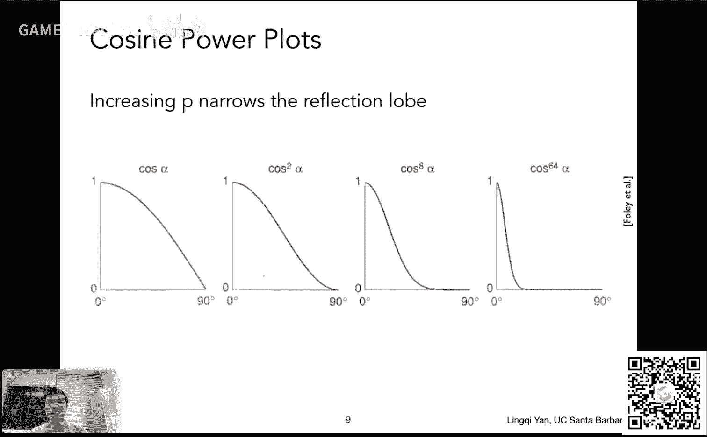
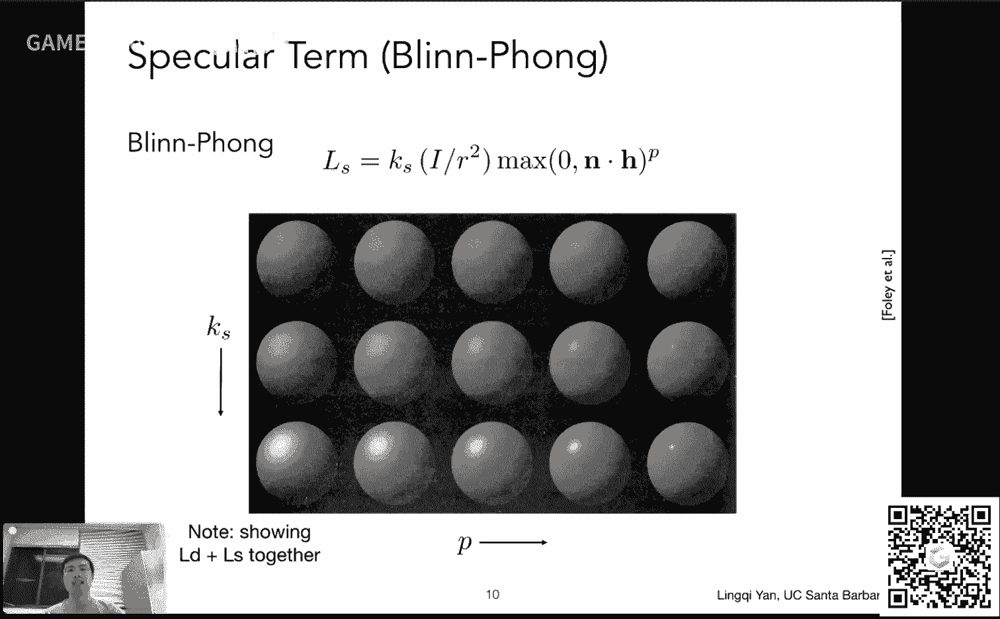
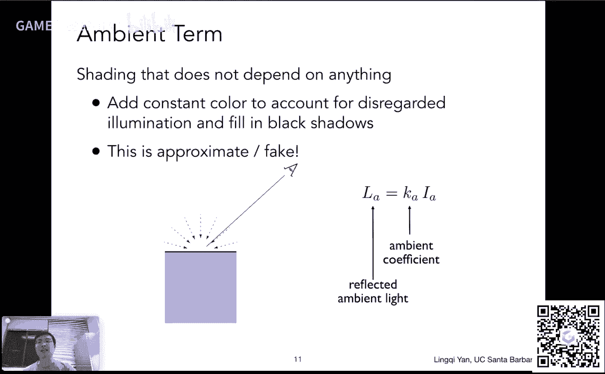
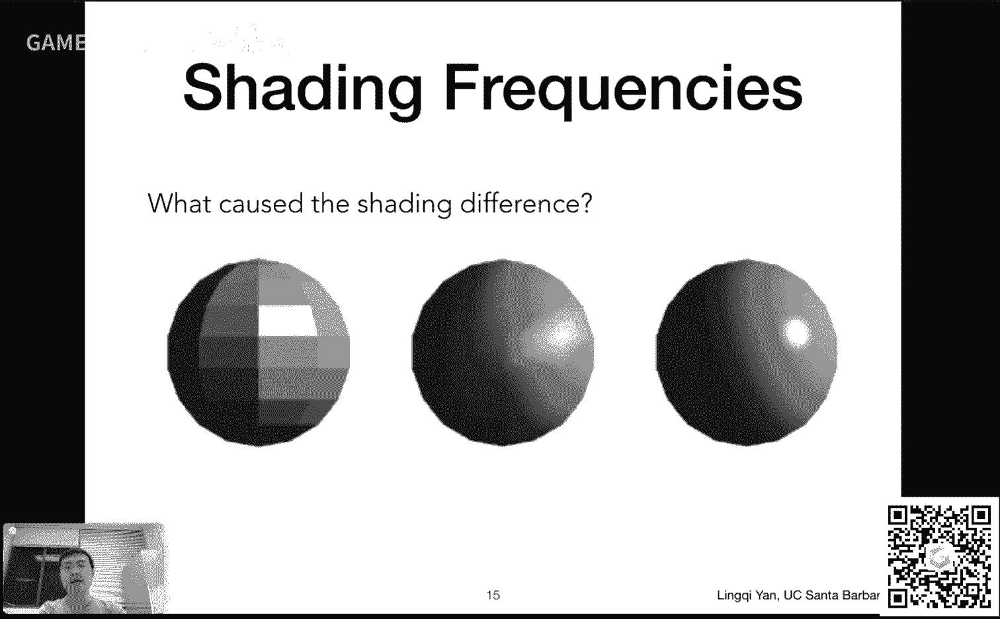
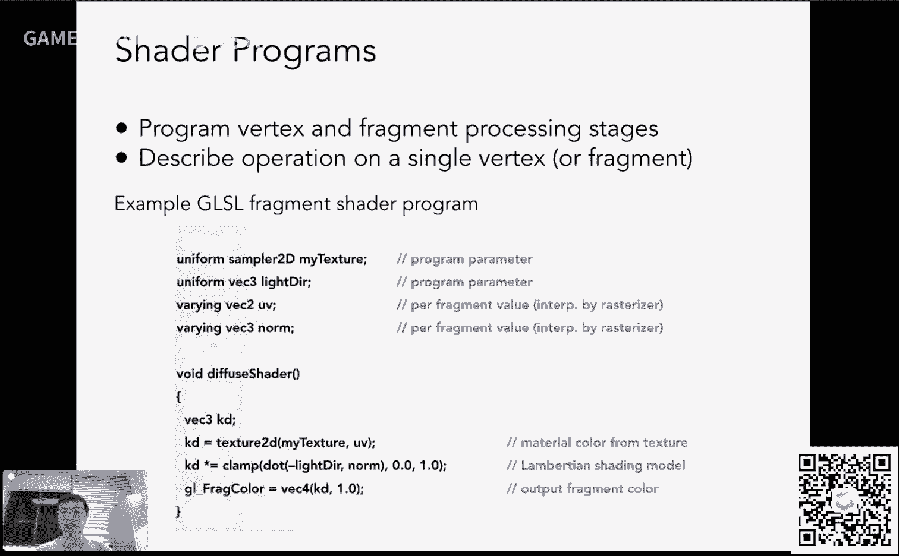
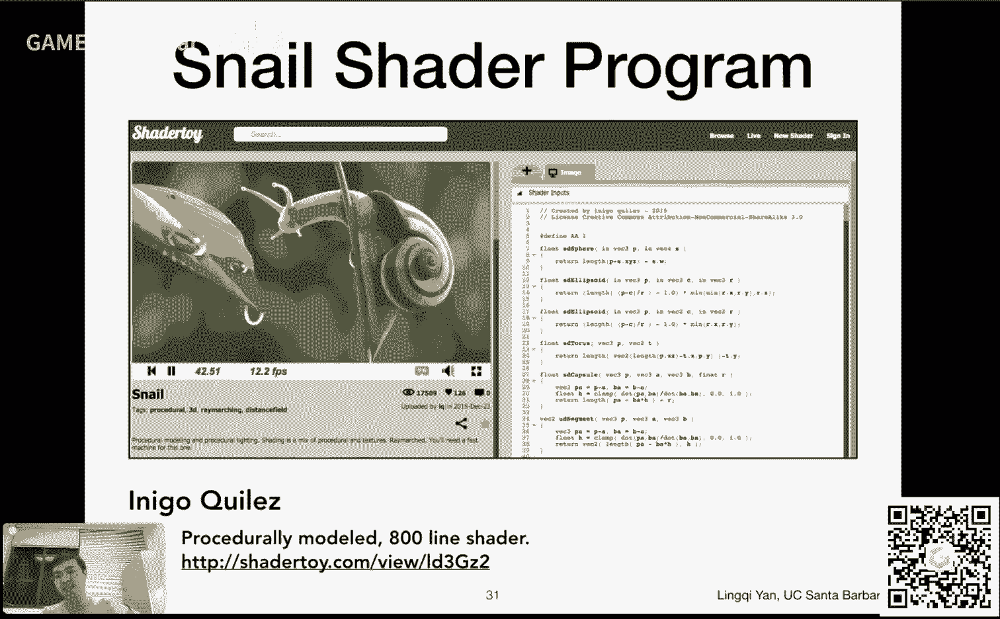
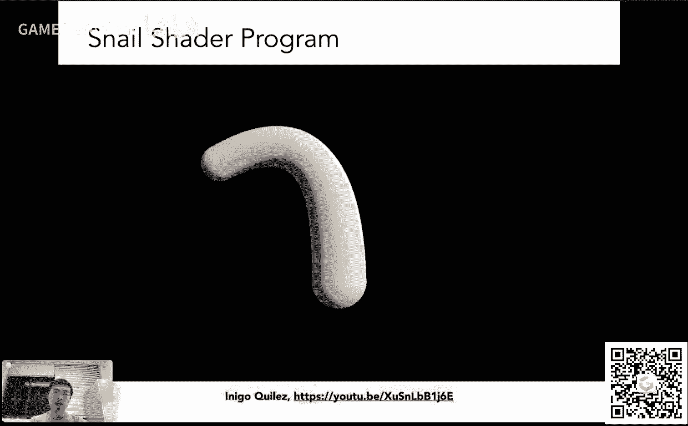
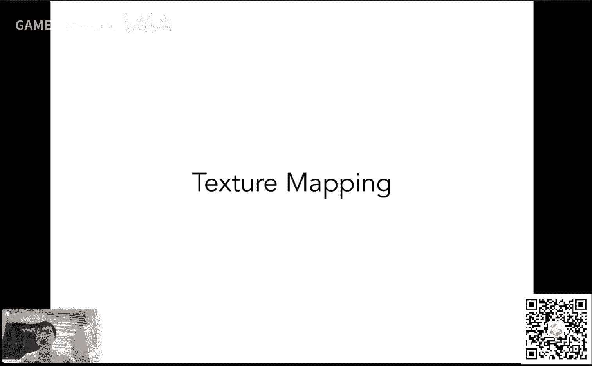
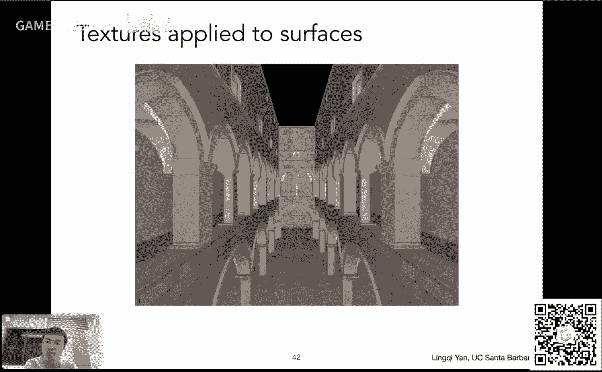
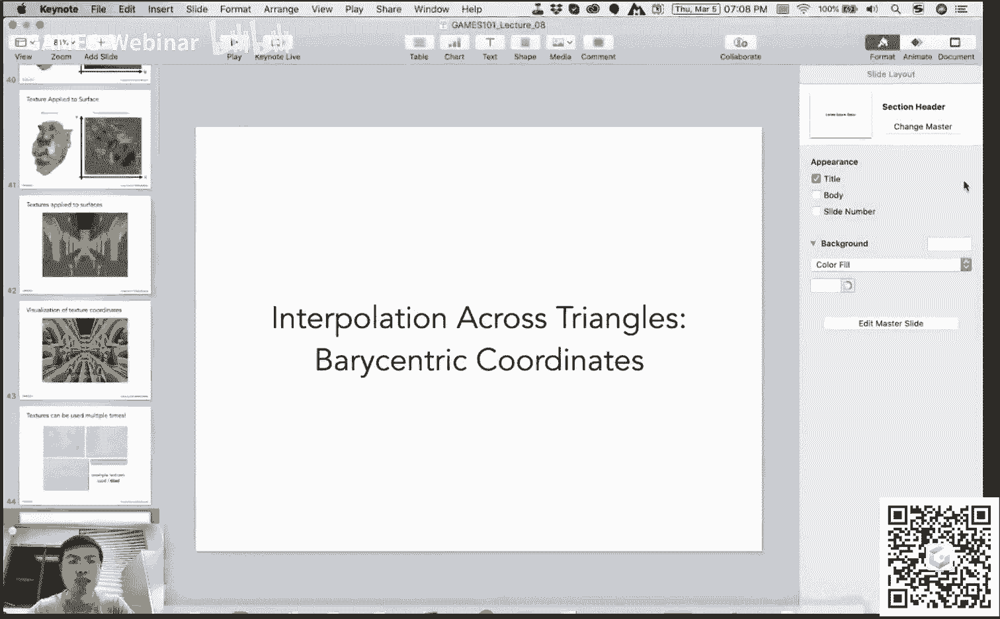

# GAMES101-现代计算机图形学入门-闫令琪 - P8：Lecture 08 Shading 2 (Shading, Pipeline and Texture Mapping) - GAMES-Webinar - BV1X7411F744

感谢大家的支持，那咱们已经讲到第八课了啊，这个这个呃不错，哎呀说起来这这这个啊我这个这个课程这个标题还没改成games好吧，那今天就先这么这么正，内容已经改过来了啊，然后就是说呃我是这么想的。

每讲一次呢，这个调整一系列的新东西，然后这个中文课肯定跟之前的英文课有着这个呃这个一系列的区别，好吧嗯，ok那咱们这个从标题可以看到，然后今天讲shading的第二部分着色二对吧。

然后把这个一个着色模型讲完这个不灵棚的模型，然后把这个图形管线和这个纹理映射给大家说清楚好吧，然后在这个这个课程之前呢，说几个事儿啊，一个是这个呃，你作业二作业二目前有45份提交，非常好啊。

然后这个还是鼓励大家尽早开始，然后我说了这个作业框架都是经过这个两字这个英文课的考验呢，所以所以说这个早点开始应该不会有什么问题啊，就是说不会涉及到说这个框架会导致大家早点开始。

会这个这个其实这个动作还会慢一些啊，然后有同学反映说得到的三角形这个上下颠倒，这个没有问题啊，为什么呢，一个是说首先就是说我们这个在这个框架里面，和我们这个推导里面可能会存在一些不一致的这个情况。

就会得到左手左手和右手系的问题，那么出现这个问题不用担心，然后这个就放在这儿，另外一点呢我们作业肯定不会说这个，比如说上一次作业，咱们让大家写这个嗯投影或者什么，那这次需要用到它，那只需要用到它呢。

如果这次产生这个上下颠倒的问题，就算之前用的是错的，那也不应该是这次作业的错误对吧，那所以说这个这个完全不会给大家会重复去扣除一些分数啊，或者干什么，而这次呢作业主要就集中在这个深度测试上。

大家把这个做好就没问题了好吧，然后呃当然能做对是最对了，否则到后面大家看到各种各样模型都是商业电脑的，那就那就不好看了对吧，不过也没关系哦，然后呢我注意到大家在论坛上面向大家讨论非常踊跃，这非常好。

特别呢我在这里感谢一下这个各位同学们，这个这个耐心的给其他的同学们解答，然后还出现了各路大神解答的非常非常的好，然后我这个感谢大家啊，也也是这这个就就觉得这个这个这个同学们都很厉害啊，这个这个很好。

然后又愿意来听我这个课，然后这个再次表示感谢，那咱们这个这个作业二说到这里，下一次的作业呢是关于这个咱们说的这个着色的部分，然后大家写一个不灵棚的模型，并且做这个这个呃纹理相关的东西。

做一个凹凸贴图和一个位移贴图这么两个事情，那这是什么意思呢，咱们今天会说好吧，然后呢今天我们会说一些这个很多这个这个内容，但是都挺简单的，所以咱们今天听下来，按说就没有问题，那这是今天的安排。

那上一次呢我们提到这个不林逢的这个着色模型，说起来就是说在一定的光照下，我希望算清楚一个点，它应该是这个这个是什么样的亮度对吧，有什么样的颜色，那我们之前分析从那几个茶杯的例子啊。

我们可以看出有一个漫反射，像有一个这个高光，像有一个这个环境光线，这三项我们都要把它考虑进去，那么上节课呢我们提到了漫反射想，然后这里呢有两个事情给大家这个呃再次强调一下。

第一我们说这个着色是在一个某一个这个这个shading point上，在对应这个这张图呢，大概就是这么一个点，在这张在这个点上来计算它，然后呢我们这个这个要想得到一整张图。

那我们势必要应用这个着色很多次对吧，在不同的地方应用，那这个就是待会儿要给大家说的这个着色的频率的问题啊，这是一第二呢嗯就是说我们提到的既然是各种方向。

那么其实我上一节课的这个嗯这个课件里面没有这么标哈，但其实我指的是这么个意思，比如说啊我说这个lighting的这个方向，就是这个光照的方向是从这个呃shining point指向光源呃，怎么算这个呢。

就是光源的位置减去10框的位置，然后求一个这个呃归一化，把它变成单位长度呃，然后就可以得到这么一个向量，然后所以说啊我现在提到的各种方向，法线方向n，然后之后我也就不标了啊，这里这么这么表示着好啊。

那行那咱们就可以继续了，对吧啊，然后这节课大家可以看到我们会把这个嗯布林风着色模模型说完，以及刚才说的着色的频率，然后渲染管线，如果有时间，咱们把这个这个纹理映射和这个呃重心坐标的内容说完好吧。

那么接上一册的内容啊，说我们提到了这个呃漫反射像，那漫反射像是做了一件什么事情呢对吧，首先这个光打到了某一个shading point上，那也就是说漫反射像和这个观测方向v没有任何关系。

从右边的式子也可以看出来，确实漫反射像和v没有任何关系，那么漫反射像怎么推导的呢，大家应该还记得，我们推导了一下这个光源，它在传播的过程中，会根据它传播的距离，然后产生一个能量的衰减。

那这个这一项呢i除以二平方，就表示了有多少能量实际到达了这个shing point，那么到达了还不够，还得被吸收，那我们分析了一下，关于这个冷热啊对吧，关于冬天夏天呀，关于这方面的原理，我们就知道哦。

原来接收多少能量，是和这个呃入射的方向和法线方向的夹角是有关系的，夹角余弦，夹角余弦，大家知道两个单位向量点乘90夹角余弦啊，就是这么个意思好，那么多少能量被这个到达了，这里多少能量被接收。

就是多少能量被这个反射出去，那如果说这个呃材质本身有颜色，那咱们在前面加上这么一个这个所谓漫反射系数，然后加上这么一个颜色，那当然大家可以看到这是一个很惊艳性的模型，但是它有一定的物理的道理在里面对吧。

那行那就是说这里就是这个漫反射像，然后慢慢车像长什么样呢，咱们可以看得出来对吧，是这么这个这个同样的一个球体，然后它这个比如说光源在左上角，然后它照亮了应该长这样。

然后不同的这个漫反射系数决定了它的亮度或者颜色没有问题，那咱们今天接着说啊，那么我们现在要把这个呃这个这个呃高光效给加进去，那么首先啊大家想一想这个什么是高光，或者说在什么情况下我能看得到高光。

那大家可以想一想，高光肯定是说这个这个平面啊，这个或者说这个物体它应该比较光滑对吧，那比较光滑的物体，它的反射都有一定的特性是什么呢，就是说它的反射的方向啊，呃都非常接近镜面反射的方向。

就是如果是个镜子，那当然这个物体是无限光滑的，那给入射方向给法线，那我们当然可以求出来它的出射方向就一个方向，这个二方向，那那如果说这个呃，如果这个物体它这个比较光滑，比如像光滑的金属。

那它没有像镜子那么光滑，那也就是说它的反射方向会沿着这个这个镜面反射方向二，然后有一个那么个分布，那什么时候我能看到高光呢，那自然就是说我的观察的方向和这个镜面反射方向接近的时候，我能看到高光。

那其他时候我都看不到高光，那就是说我们这是一个基本的观察啊，这就可以告诉我们好，这个呃这个高光下是由于这个观察的方向和反射和这个镜面反射方向，也就是v和二足够接近的时候，我们就得到这么一个高光效。

那这就是我们的一个一个经验性的观察，而且很有道理，但是呢我们这个不临风模型，他做了一个很聪明的一个一个一个事情是什么呢，就是说它看到了一个一个现象，就是说啊当我的观察方向和这个镜面反射方向二接近的时候。

其实就说明了这个法线方向和所谓半程向量很接近，诶，这是什么意思呢，那大家可以看就是如果我有一个这个入射方向l出射方向v，然后我可以求它的角平分线方向，大家都知道，如果说我这个有两个这个单位向量啊。

然后我想求它的角平分线方向，太简单了，把两个单位向量一加，比如说l加上v根据平行四边形法则啊，那我知道他加出来的方向一定沿着这个他们两个中间的这个方向，然后呢我再把它做一个这个归一化，把长度变成一。

这就是这个怎么求这个所谓半程向量h就是这个by sector，然后呢呃这个啊就是这个h和n接近，一定程度上，它就是反映了这个v和二接近，比如说大家可以看到这里。

这个l呢和v它产生的这个半程向量和法线挺接近的，那我们回到上一页，我们会发现哦，这个时候其实就是这个这个观察方向和镜面反射方向很接近，所以v和二接近就说明了h和n接近，它们两个之间是有一定关系的。

那么不灵风模型就是这里面这个做了这么一个聪明的假设对吧，然后这样的话呢有什么好处呢，就是说我为了衡量说我到底能不能看到高光，我只需要看这个n和h是不是接近，所谓半程向量和法线是不是足够接近就可以了。

那么咱们回到刚才的这个呃同样的漫反射的呃分析的思路哈，就是说怎么样衡量两个向量是否接近呢，很简单，还是一个点乘，如果说两个方向足够相近的话，那我们点乘的结果自然就是这个这个啊接近一，对不对。

如果说两个向量它离得方向比较远，那就是接近零，那当然是反过来方向的，咱不考虑对吧，那所以说大家从这个呃这个式子呢就可以看得出来对吧，多少能量到达了这个shading point还是一样考虑嗯。

只不过这里呢我们要考虑的事情，就是说呃我的这个半程向量方向是不是和法线方向足够接近，那所以说用了这个他们俩的点乘，然后呢同样道理，关于这个呃高光相呢，我们也会给它一定的颜色。

通常呢这里大家认为高光都是白的，所以从通常来说这个k s这个这个呃这个镜面反射系数啊，我们管它叫镜面反射系数，通常就认为是一个一个白的，一个是一个一个一个颜色好吧，然后这里呢嗯大家可能会注意到一个事情。

嗯对吧，就是有同学说啊，那你这个多少能量到达了这个点是对的，那这里怎么我们就不考虑多少能量被这个点真正吸收了呢，对吧，不管什么反射，我们肯定都得考虑这个呃，这个说的非常对没错。

就是说实际如果我们要做的对的话，我们确实还是需要在这个镜面反射向上，仍然也要考虑多少能量被吸收，然后就是有有之前那么一项这个呃l和n的电车呃，但是这里没有考虑呢。

是因为这个嗯不林风模型它是毕竟是经验性模型，它这一点把它给简化掉了，然后就是说我们主要关注的就是说我是否能看见这个高光，是否我的这些方向保证了我能够看到高光，就是n和h足够接近好，那这是第一点。

第二点呢就是说这个这个有同学问，那我为什么我要用这个这个这个半程向量和和这个法线，它俩是否是否接近，那我真的我就用这个反射镜面反射方向二和飞他们两个是否足够接近，他们两球会点成不也行吗，当然行，没问题。

然后那个模型就被称作这个phone reflectance model，然后如果说我们用这个这个n和h之间，他们两个是否接近，这个就叫不林风，the reflectance model，这个是一个改进。

那为什么说不林风模型是一个改进呢，是因为半成向量太好算，对于这个这个嗯这个向量来说，大家可以看到我给一个这个观察方向，给一个这光照方向加起来除以它的这个长度，就就就就可以得到它特别好算。

那如果要算反射方向可不好算，就是说这个给定一个入射方向，给一个这个呃法线，然后你如何得到法律的这个反射方向，你可以把它写出来，没问题，但是你可以看到它的计算量会增加很多好，那这就是第二个问题。

为什么这个布林防火模型用的是n和h的夹角好，第三个问题大家可能会接触到这样一个事情，呃不是注意到这么一个事情，大家看这里是什么对吧，大家会看到这里有一个指数的指数p在这里，这个跟之前就不太一样。

说我要衡量两个向量足够接近，是点乘确实能衡量他们足够接近，我为什么要在上面这个呃这个弄上这么一个指数呢，对吧，哎这里其实大家看这么个例子就可以看明白了。

说啊这个呃向量之间夹角余弦确实能体现两个两个方向之间，是不是足够接近，但是呢它它它这个这个容忍度太高了，就是这么个意思，大家比如说啊，大家可以看到当两个向量的夹角在45度的时候，我觉得他已经离得挺远了。

对不对，但是这个这个这个他们俩之间夹角余弦仍然告诉我们，它有一个相对较大的值，这就是说如果我们真的就用这个夹角余弦去生成这个高光的话，我们看到一个超级大的高光对，那这个就就不太合理。

我们平常认为这个高光啊都是非常非常亮对吧，集中那个很小很小的区域，这就说明什么呢，说明这两个方向只要他离开的稍微远一点，我就不算他是在高光里了对吧，当他们离得非常近，我才认为他在高光里。

所以说我们对这个夹角余弦做一个简单的操作，就是在它上面这个乘上呃，不是乘上，把它加上若干个指数，就是它的多少次方对吧，大家就可以看到随着这个指数增加，比如说增加了64次方，大家就会看到诶。

这个基本上可以了，大概说明哦在20度或者30度左右吧，呃这个基本上我就看不到高光了，如果说这两个离得非常近，在30度之内，那我能看到一点高光啊，这就很合理对吧，那通常来说这个这个系数呃就是指数啊。

用多大嘛，正常情况下在这个布林风模型里面，大家会用到100~200这么一个数字，也就是说64其实还不太够啊，正常情况下呢也可以想你看到那么小的一个高光，基本上有个3度5度。

基本上就已经这个这个看不到这个这个就是3度5度之外，基本就看不到对吧啊，所以说它是用来控制它这个高光到底有多大的，然后呢咱们可以实际看一个例子。

那么这里呢嗯大家看到一堆球，这是一个组成了一个矩阵对吧，那是什么意思呢，大家可以理解一下，就是呃这个这个其实显示的是漫反射像和这个高光像在一块啊，因为高光相实在太小了，然后就是说如果不加上漫反射像。

看到的就是基本上点啊，然后就是说嗯这里大家可以看到，如果我考虑不同的列，就是就是呃不同的行啊，从上到下看，那这就相当于是这个呃镜面反射系数，然后这个系数在增大，那这个系数就表示了它的亮度对吧。

这个并没有太大的意思，但有意思的地方在于横向来看，比如说咱们来看最后一行，这个最后一行呢大家可以看到随着这个指数p增长诶，我可以看到越来越小的高光诶，这个是非常有道理的。

我们这个指数p就是用来控制这个高光的这个大小，所以说啊那这个没有问题，这就是我们如何理解这个高光效好。

那高光像咱们这个这个这就到此为止好吧，然后呢，那咱们还剩最后一项，这一项是什么呢，就是环境光照相，如果大家还记得环境光照是什么意思啊，就是说呃我们之前说那个茶杯，茶杯有一系列的地方。

它这个根本不可能直接被这个这个这个光源照亮，但它却不是完全是暗的，为什么呢，因为有很多这个光线它可以弹射很多次，然后从四面八方打到任何一个其他的点上，所以说呢对于茶杯的背面的一些点也一样。

它能够接收到来自环境的光，那么大家可以可想而知对吧，来自环境中光，这是一个多么复杂的东西，那我们就做一个大胆的假设，我们认为啊这个任何一个点接收到这个来自环境的光永远都是相同的。

呃这个而这个强度叫做i a啊，叫做这个来自环境的这个这个这个光大概有多强，然后呢来自四面八方，然后呢我们就认为好任何一个点当然可以有自己的颜色呃，然后然后这个就是相当于环境光的一个一个这个系数好吧。

然后就是说呃把这两项结合在一块儿，我们就可以直接近似的得到一个环境光，那么这里大家从这个式子就可以看出来，或者从左边示意图也可以看出来，第一环境光不不讲究从哪个地方进来对吧。

它跟这个实际的直接光照的方向没任何关系，也就是说它跟这个l方向不应该有任何关系，那么另外一点，他不管你从哪儿看，你这得到的结果也应该是一样的，和你的观测方向也没关系。

那这样的话也就说明这个环境光和v也没有关系，那这个并且它这个和法线也没有关系，所以环境光啊其实是一个常数，那如果环境光是一个常数，大家想象一下，那基本上来说啊，其实就是某一种颜色，你看到某个物体对吧。

然后任何一个地方它都有一个常数的颜色，所以总会给你看到一个平的一个这个这个呃结果，那这就是环境光，环境光呢它的作用，就是保证没有地方完全是黑的，把所有的这些那其他的这些项都加起来，然后提升一个亮度。

就是做这么一个工作好，那当然这是一个非常非常大胆的假设，这事实上不是这么回事，然后事实上如果要计算这个很很精确的计算，它，我们需要应用到全局光照的知识之后会给大家说，然后嗯这块非常的难。

然后之后咱们再继续说，当然当然这里的这个环境光下就是一个非常大胆的简化。

那么咱们把所有的像头加起来，就可以看到诶这个环境光我刚才说了对吧，不管什么形状，不管在哪一个常数颜色，那这个这个漫反射光慢慢慢热像啊，漫反射像呃，和观测角度无关。

但是和这个呃光照和这个法线的方向角度诶有关好吧，那也就是说这里这个这个呃漫反射，想在这个这个比如说呃发现和光照方向不垂直的时候，诶它会减小啊，没问题，可以这么这这么得出一个这个例子来。

然后嗯关于这个高光下高光，像大家这这个刚才已经说了对吧，只有在很少的地方会产生高光，而高光会非常亮对吧，那么我们把这个所有的项目都给加起来，就可以得到右边这么一个结果，而右边这么一个结果。

但是看起来就觉得觉得非常这个呃有趣，有点像塑料，对不对，有一点有一种这个高光这个感觉，然后这个又有这个defuse，然后这个本身又不存在任何地方全是黑的，这是这种情况，然后把所有东西加起来。

那这里就是我们所说的不林冯这个反射模型，然后反应在式子上很简单，把这三项全部都加起来就可以了好吧，然后这里呢就是这个这个这这这三块，然后咱们把它都给加起来，这就是我们的着色模型。

那么这个下一步是什么对吧，我们刚才这个其实给大家提示了对吧，着色模型我们考虑了任何一个点，所谓shading point，而任何一个点它应该长什么样，那么下一步自然是要对所有的点。

然后做一遍这个这个着色操作。

那整个一个场景我就能够看得见，没错对，所以说嗯行，在咱们讲这个着色频率之前，我先这个停下来啊，我先看一眼这个大家这块有没有什么其他的问题啊，我有同学反映说，如果一个点它这个这个凹下去的话。

环境光是不是应该暗一些，嗯从这个嗯不林缝的模型上来看，并不是如此，那实际上应该是这样哈，就是说所以我说它是一个这个这个简化啊，啊有人问为什么不用这个逢魔性啊，道理就在这儿好，没问题。

然后有同学说磨砂表面是否没有高光啊，不能完全这么说，看磨的程度了对吧，然后这个diffuse不不考虑point view的距离，不考虑不考虑没问题，然后如不考虑物体到到观察点的距离造成的能量损失啊。

还是同一个问题哈，就是说这块要如何解释呢，这块想要弄明白得去学这个radiometry这块之后会给大家说，就是说大家就会知道说为什么我观测离它多远，其实是没有关系的。

就是说就是说这个这个这个而这个呃光光源离这个点呃离了多远，其实这个有能量的损失，但其实是这么回事，就是说我们其实一直在能量能量这么说啊，这个不合理去，这个就是说我们在这个呃这个光线传输的过程中。

我们用到更多的一个概念叫做radiance，然后这个东西和大家平常理解的概念这个并不一样，所以说呃如果说大家这个看一个东西，然后这个比如说离得远，觉得它会暗，然后这是另外一种现象。

我们之后再解释现在的这个知识不足以解释它好吗，就是但是但是没有问题，现在这么做，就是说和这个物体到观察点之间的距离是没有关系的，好吧呃先这样，这不算是什么解释了，给大家一个预告好吧。

之后我们会给大家说清楚这个这个呃一系列这些关于radiance啊，irradiance啊，这些概念怎么样去理解，怎么样去解释，怎么样精确地做出来这个光线的传播。

然后如何用它来解释这个现在大家用到的这些问题，嗯所以readings是不是辐射什么东西，不记得了，中文怎么翻译，之后到那个时候我们再说吧，好吧哎这里先先这么这个呃这么说着，那咱们先进展下一部分好。

没问题，那么呃这一部分我们要说的就是着色频率，然后着色频率是什么意思，就是就是大家看这么几个例子就可以看到了哈，大家可以看这这三个球，这三个球呢首先他们拥有完全相同的这个几何形状。

就是说它们的几何表示在空间中是一模一样的，没有任何问题，从哪儿可以看得出来呢，从这个球的边界对吧，这三个球虽然大家看上去它这个这个颜色什么东西长得各不相同，但从边界上就可以这个暴露这么一个信息啊。

这三个这个球其实他们模型用的一模一样，然后那为什么说我这个着色了之后，它的这个结果各不相同呢，那这时候就是我们所说的这个着色频率，所谓着色频率，这里给大家说一下，就是说啊这个着色我要把它应用在哪些点上。

咱不是说着色是应用在一个着色点上吗，确定point的对吧，那如果说我把这个着色应用在一个这个面上，比如说这里看到的不是三角形面，就是把四边形面那一个面，它是假如说它是个平面。

然后呢我就知道这个平面它有一个这个固定的法线，然后呢我这个求出来它的这个这个呃这个shading的结果是多少，然后我认为整个平面都长这个颜色好，那也就是说一个平面我只用做一次协定啊。

那我得到的就是这么一个结果，那自然看上去不怎么好对吧，那中间这幅图，然后这个做了一个什么操作呢，他做了这么一个事儿，就是说啊对于这个呃这个呃你每一个平面哈，然后它本身不是有四个顶点吗。

我每一个顶点我都算出一个它顶点对应的法线哦，那每个顶点有自己的法线，那我就每个顶点做一次着色，然后做一次着色之后，然后那那自然是这样，比如说这三个顶点围成一个三角形，那在三角形内部。

那那这些它他们三角形内部的这些点应该都是什么颜色呢，那没关系，我可以通过一种方法叫差值的方法算出来，所谓差值就是说啊我知道三个三个三个顶点呃，它们的颜色是什么，我问三角形内部某一个点。

它的这个颜色是什么，并且我希望它有一个平滑的过渡啊，这个叫差值之后给大家详细说，那呃回到这个问题上来，那么这里着色应用在什么上面呢，应用在每个顶点上进行一次着色，那右边这个我相信大家可以想象得出来对吧。

右边的这个着色应用在哪儿呢，它应用在每一个像素上，也就是说我对于这个呃每一个这个四边形或者三角形啊，顶点求出一个法线的，然后把这些法线的方向在三角形内部进行插值，然后就得到了任何一个这个像素。

它都有一个自己的法线方向，并且我可以做一遍这个着色，那就是说我这个着色应用在每一个像素上，那我可以得到一个非常好的结果而来，那就是这样的对吧，那这就是它的这个本质的区别。

那咱们把这些呃这些方法都做一个正规的定义好。

第一如果我说每一个三角形它是这个平面啊，然后呢我把这个这个三角形的这个法线求出来对吧，这个好求，然后怎么怎么做呢，这个三角形的两两边做一个差距，就就就可以求出这个呃三角形的这个法线，好求出一个法线。

然后呢我这个我这个根据我这个我这个呃lighting啊，view啊这个方向，然后算出一个这个设定的结果，那就是这个三角形长什么样，那自然对于三角形内部，它不可能有这个着色的变化。

也就是说得到一个完全一样的这个结果好吧，哎那也就是说可以得到呃右边这么一个结果啊，那当然结果不太好，然后但是呢他有他自己的名字叫做flat shady啊，然后我们叫叫这个名字，然后呢我们说的第二种方式。

哎这里有同学要问了，就怎么求啊，我不知道啊，给我一个这个3d的模型，我一个我这个比如说一个三角形，它的发现我会求，可是一个顶点的法线，我怎么求啊，马上就给大家说，现在咱们先假设这个顶点的法线能求哦。

那那那求出来之后每个顶点做一次着色，那每个顶点就有颜色了，那每个顶点比如三个顶点固定一个三角形，那三角形内部的颜色通过差值的方法算出来，大家可以看到结果比这个flat shading要好啊。

然后这个这个但是基本上来说，比如说像右边这个球，当这个三角形稍微大一点的是吧，这个高光什么我可能就看不见了，然后就会存在这种情况，当然这个对于这个球来说啊，这个嗯这样着色效果也并不是特别好对吧。

然后这样的着色在每一个顶点上进行一次着色，也是有名字的，叫gotiating，然后这个显然它这个不是个英文的发音啊，听起来发音有点像骨肉啊，就是这个意思啊，所以对比一下啊。

flat shading是一个三角形，grow shading是一个呃呃顶点，那自然对于每一个像素，如果说啊我我把这个三角形的三个顶点求出来，各自的排线在三角形内部。

每一个像素上我都可以插值出一个这个呃独特的法定方向，那么我对每一个像素进行一次这个着色，那么就可以得到一个相对比较好的结果，这个结果就叫做phone shing，然后这里呢呃区分一下概念。

我们之前提到一个这个呃这个着色模型，某一种着色模型叫呃不灵魂摆设模型啊，这个这是一种着色模型，然后只不过它中间出现了缝这个名字，然后呢这个这里的funciation指的是一种着色频率。

这是碰巧这两个事情是由同一个人来发明的啊，另外多说一句，这个冯这个人呐真是天才嗯，大家可以看到这个他这个至少在目前这个课上的，他就已经留下了两个事情的，第一是这个着色模型。

第二是这个呃逢时ating就是逐像素做这个着色对吧，然后但是很可惜是天妒英才啊，他这个读完博士之后呃，好像是这样，在博士期间好像就是这个和病魔作斗争，然后读完博士之后，第2年好像就去世了。

呃这个确实是一个非常惨痛的事情啊，然后这个嗯诶这个这个渲染界好像一直是挺惨的，然后去年还有一位这个欧洲的渲染的大牛，然后去世了，这个呃也是英年早逝啊，然后当然了，这个都给大家说一说吧。

这个这个之后的这个这个呃唉所以更应该把这个东西写好啊，就是这个意思行吧，那咱们提到的这三种不同的着色模型啊，flat shedding是逐三角形，grow shading，逐顶点风切ding是读这个呃。

主主主像素好。

然后就这三种，然后呢这三种其实大家要硬说它有什么样的区别呢，这个其实这也取决于具体的模型啊，然后就是说我们不能始终说这个，比如说这个呃flash shing，它就一定会很差，为什么呢。

大家看这么一个这个3x3的这么一幅图，这个图什么意思呢，就是每一行啊用的模型都是一样的，而行与行之间，比如说第一行跟第二行相比，第二行就用了更多的三角形，就这个几何形体本身更加的密集了。

就是几何形体本身定义的更加光滑，那就是说呃第二行跟第三行相比，这每一个这块几乎都几乎都小的看不见了，那在这种情况下，就是说呃大家可以看到哦，当我的这个几何足够的复杂的情况下。

哎我其实就可以用一些相对简单的这个着色模型，然后得到的结果其实还是挺好的对，然后就是就是说它有这么一种关系在里面，也就是说着色频率对吧，它取决于这个这个面或者点，或者说这个呃顶点，或者说像素。

它它们本身出现的频率，当我的这些面出现的频率已经很高的情况下，我就不再需要去用这么复杂的这个这个呃逐像素的这个呃着色，当然话反过来说就是这么一个意思，就是说啊这个我们如果看第一行，那我们知道啊。

phone shading自然会有更好的结果，但是由于每个像素都要做一次着色，那肯定要比这个flat shading这个开销要大，但其实呢如果这个呃模型变得足够复杂。

尤其是今天这样这样一个这个复杂的模型这么一个情况啊，这个这个嗯当这个模型足够复杂的时候，可并不一定说我这个竹这个面或者是猪这个顶点得到的效果，就比如像素要差，然后呢这个呃逐像素做也不见得。

就是说这个呃工作量要比这个竹这个表面呃要办，因为如果这些这个三角形面数量已经多得超过了像素数，那可不是说做flat shading，反而这个计算量要大的嘛，对不对。

所以说这个就是取决于啊具体的这个这个呃物体，当然对于这个常见的一些这些呃这个面本身不是特别特别密集的，那当然我们还是说for shing会给大家一个非常好的结果好吧。

这这里大概就是说这个关于这个呃着色频率的一个探讨好吧，那么我们留下了两个问题，对不对，留下了两个问题，什么问题呢，第一我怎么知道逐像素的法线是什么对吧，哎不逐顶点的法线是什么。

我只知道说一个三角形的法线怎么算，哎很简单，就是说呢呃有一个理想化的情况是，首先如果你知道你这个模型我是用一堆这个比如说三角形表示，但其实我是想表示什么对吧，比如说对于这个模型。

假如说我想表示的就是一个球，然后我拿一个三角形来表示，那没关系，那我知道任何一个顶点其实对应的是这个球上面的一些点，那那我自然可以通过呃他所在的这个球的这个位置算出来它的法线，那对于这些不同的顶点。

那它原本表示的是球对吧，那它的法线应该自然是从球星联想这个点这个方向诶，那这是好啊，可是你这个平常不可能有这么好的事情对吧，怎么可能知道说它这个背后视图表示的是什么呢，那么人们发明了一种办法，很简单。

怎么做呢，就是说任何一个顶点，这个肯定它都会和很多个不同的三角形有所关联对吧，就是说这很多三角形在这个例子上，大家可以看到这里有四个三角形，它们都共用这么一个顶点，那么很简单啊。

那我这个顶点的法线我就认为是它这个相邻的这些面的法线，求个平均就可以了，那这个就是大家发现了一个一个这个很不错的一个方法，而直到现在还是这个为大家所用，当然了，这里呢一个简单的平均也许说明不了什么问题。

就比如说这里有一个三角形超级小，有一个三角形超级大诶，那我们就想是不是这个超级大的三角形应该会贡献的更多，也就是说我要把这个四个法线求平均啊，可能做一个加权的平均，这个权可能就是三角形的面积。

会不会得到更好的结果呢，然后答案是是的，就是这么回事，就是说目前来说大家的算法，就是说这是一个诶很简单的一个一个一个算法，就是说这个呃就是把这个顶点所关联的呃面呃，三角形面也好，多边形面也好。

它们的法线求一个平均，不管是这个简单平面还是加权平均，那这就是我们如何去定义这个主顶点的法线好，那咱们这是一个，然后另外一个呢就是说啊这个如何去真正的定义一个逐像素的发现，也就是说在三角形的内部。

假如说我已经知道它的顶点的法线是什么了，那如何得到这个内部一个平滑过渡的一个法线呢，大家可以看这么一个例子对吧，这里这个左边这个法线我知道右边这个点它的法线也知道，那么它中间的法线应该是往这些方向去的。

但是有一点哈，这里要跟大家说清楚，记得法线所有的法线都是方向，所以应该求出来了之后，应该要给他求一个这个这个规划，把它变成这个呃单位向量啊，然后就是说保证它们长度和呃就都是相同的，这些对。

那么呃回到这个问题上来，嗯，给这个顶点的这个法线怎么样，查支书这个中间的一个这个呃发现呢，那这个就需要用到这个呃所谓的重心坐标，重心坐标马上就要给大家说好吧，然后这里啊到此为止。

这个着色频率基本上就已经说明白了好吧，然后啊咱们在讲这个呃渲染管线之前呢，我我正好也停一停，然后看一看大家这个啊回答的问呃，问的问题哈，看一下啊，哎呀呵呵呵呵，诶什么鬼，这个好吧嗯。

ok好好像暂时没有特别那个的问题哈，就是说有同学问这个这个这个这个这个呃怎么得到点所相连的三角形，哦，这个是属于这个模型在定义的情况下是怎么定义的啊，然后这个这个嗯暂时咱们先不说到了几何这里。

我们再说好吗啊，ok好啊，那咱们现在进入这个下一块吧哈那我们现在已经这个回忆一下啊，着色模型说了，然后着色模型怎么用说了，那么现在就是说我们把这些所有的东西都合在一块儿，那就已经可以说给我三维的模型。

给我这个不同的光照条件，我就已经可以得出这个这个呃渲染的结果，那把所有东西都合在一块，得到的东西就叫做图形管线，叫graphics pipeline，当然了，这个说法是以前古老的说法。

我更愿意管它叫做这个实时渲染管线，因为图形学的东西涉及的东西太多，就是说我们说了啊，关于实时渲染方面，就嗯在我们的课程里呃，都只能算上是1/4的内容，当然讲的这个课时数稍微多一些啊。

然后就是说嗯这个嗯对于其他的一些这个渲染方法，他当然不是这么做的哈，我们这里说清楚啊，好那嗯就是说我们要提到的就是图形管线或者实时渲染管线，什么意思啊，大家可以看一下。

就是说啊就是说我如何从这个场景到最后一张图，中间到底经历了一个什么样的过程，这个过程就叫做pipeline，就叫做管线，所以它其实表示的是一系列不同的操作，然后这些东西呢其实已经跟大家说明白了。

然后这个比如说咱们可以看一看它到底经过了什么过程啊，就是说呃大家看到呃从一开始输入呢是一堆这个空间中的点，然后呢并且这个呃经过了这个这个这个第一步之后啊，我们要做一个投影对吧。

我们之前讲了各种各样的这个变化啊，投影啊，我们最终首先是要把这个三维空间上的点，然后投影到这个平面上对吧，投影到屏幕上，然后呢这些点它们会形成三角形，然后形成三角形，我们知道形成三角形。

这个这个我们还要把它画在屏幕上呢，屏幕可是离散的，那怎么办呢，那咱们就通过这个光栅化把它给离散，成为不同的这个所谓fragment，这里借用的是这个open gl里面的一个概念啊。

然后就是说呃其实fragment就是类似类比于像素吧，就是在这个不做这个嗯，这个呃mi sample，anta lion，就m s a a这种呃，我们就可以认为一个fragment就是一个像素。

那咱们就说它是一个像素好吧，那么这个呃当我把这个不为三角形在屏幕上都打散成不同的像素之后，然后我就可以对它这个呃进行着色，然后每一个这个像素我都知道它应该长什么样，这应该是什么样的，最后一个颜色。

最后我就知道整个一个屏幕上应该是一个什么样的颜色了，那如果说我的这个呃这个用了这个，比如说m s a a，那就是指好多个不同的fragment，会形成一个像素的颜色，那如果大家已经做了这次作业对吧。

大家都知道对吧，然后我维护每一个这个fragment，它对应或者说sample啊，对应的它的这个这个深度，然后颜色，然后我最后再把它拼成一个图，我就不会拼出三角形的黑边啊，就是这么个问题好。

那么这一个呃整个一个过程呢，这就是我们处理这个呃，这个嗯从三维场景到最后渲染出二维的一幅图的一个基本操作，而这个操作是已经在硬件里面写好了的，现在的是整个一个这个显卡。

他所做的操作就是基本上是这么一个操作，整个在gpu里进行，然后呢这里有一点啊还没有给大家说啊，这里呢就是就是这个大家可以看到说我们一开始啊，就在说这个三维空间中这个不同的三角形。

然后把它投影到这个屏幕上去，那这里我是这个为什么说我把三维空间中的点投影到屏幕上去，然后再把它连成三角形呢，是这么一个意思啊，其实它没有什么特殊的意义，就是说我们如何定义空间中的一个模型啊。

咱们可以想象一下，我们可以定义它所有的三角形顶点，然后再定义每三个顶点会形成一个三角形对吧，我们把这两部定义给分开，其实一样的，跟我定义所有的三角形是一样的，我先定义所有的顶点。

在定义哪三个顶点会形成一个三角形，定义一系列的这些东西，那然后就是说我只用把三维空间中的这些呃点投影到屏幕上去，变成二维的，变成二维的，然后呢它它们之间的连接关系自然不会变，还是仍然是原来的这三个点呃。

现在投影了之后的三个点形成一个三角形，那所以说呢我只需要对顶点进行操作就可以了，所以说大家可以看到啊，这里面这个呃我们所说的这这三个大的步骤，第一是这个顶点的处理，也就是说这个嗯投影变换啊这一块的东西。

然后第二个步骤就是这里啊这个光栅化涉及到怎么样去采样，然后怎么样去做深度测试，然后把这个呃实际上在屏幕中能显示出来的像素给找到，然后第三块就是我们说的着色，那把这三块都合在一块儿之后呢。

自然最后就可以得到准确的结果，没问题，那咱们看几个例子哈，这个我们之前说这个做model view projection mvp变换，那个变换在哪呢，那就是每一个顶点我做一个变换对吧，没有问题。

那这个我这个涉及到这个对这个屏幕上面这个每一个像素中间采样，然后看是不是在三角形内，这一步是在干什么呢，这不就是在这个光栅化对吧，然后呢这个这个当我光栅化产生了一系列的这些fragment。

或者像素的时候，我要判定啊它是不是这个呃，可见那就是说呃是在这一步发生，当然严格意义上来说也可以把它归为光栅化的一部分吧，就是这里分的比较细啊，就是说z buffer就是我们所说的深度缓存。

就在做这个事情，然后呢我们说shading谁定呢，这里大家会会看到这么一个事情诶，这里是ding是发生在这个顶点和这个像素，这个这个这个都会发生，这是为什么呢。

呃这里呢其实就是说呃考虑到不同的这个着色频率，如果说我们考虑这个着色是这个groo shading，也就是每一个顶点我进行一次着色诶，那我自然就是发生在这个着色，就可以发生在这个顶点的处理上。

顶点可以做这个呃投影也可以做着色，没有任何问题，然后呢如果说我做的风水岭，那自然是得等这个像素都产生了，所以我们在fragment里面做，所以大家可以看到啊，就是说这这里重要的是什么呢，如果想做着色。

重要的就是这个顶点如何着色，或者是像素如何着色，然后在现代现代的gpu里面，然后就是就是这一套渲染管线，它是允许有些部分是可编程的，所谓可编程的就是你说了算，就是你说这个顶点如何去被着色。

然后这个像素如何去被着色，然后就是说你可以定义这个事情，然后定义了之后呢，自然就是说你写一段代码，然后让它能够生成各种各样的这个不同的这个着色的结果，那么这里说的容易就是说整个这个这个实时渲软件啊。

几乎就是在做这么一个事情，就是所谓写这个这个这这部分要如何运行，那什么样的代码来决定这些顶点和这个像素要如何这个呃运作对吧，这个处理如何运作呢，这部分代码我们就管它叫shader，这部分shader呢。

就是说这个是控制说这个顶点和这个呃像素是如何进行着色的，那就是这么个意思行，那咱们这个多说一句，马上就会给大家说这个硬件上的事情好吧，然后嗯这里呢我们有一块呃还没有说，这就是下一个话题。

我们很快就要给大家说呃这么一个事儿啊，什么事情呢，大家看右边这个三角形哈，这个三角形这个显然是说这个我没做任何的什么差值什么东西对吧，我这个这个呃我其实三角形内部它每一个点。

它的应应该是对应的一个这个这个木头纹理的上面的某一个点，对不对，是这么个意思，就是说在三角形内部能够看到一些这样的变化，这是怎么回事对吧，就是说我如何定义这个每一个这个像素，或者说三角形内部不同的点。

它都拥有了一个完全不同的属性，怎么样才能这个让三角形显示出这么一个这个呃，上面有一张图的三角形诶，这个就叫做纹理映射，好，咱们马上就要说好，在这之前我们把这个shader把这个概念完善一下。

刚才我们已经说了，现代的gpu允许大家自己去编程，来解决这个顶点和这个呃和这个呃像素如何去这个呃操作，就是如何做他们的着色，那么正常情况下呢，这个时候需要大家去写这个shader。

如果大家要实现一些复杂的东西，那么这个shader呢它本质上是一些这个呃能在硬件上执行的语言，咱们这里举一个例子，这个open gl这一块呢对吧，open gl是一个这个呃图形学的api。

然后呢你可以用它来写一些这个shader，那么shader首先我们说一下是这个意思，shader是每一个顶点或者是每一个这个呃fragment，或者说像素它的这个呃它会执行一次。

然后就是说你写的这个shader其实是一个通用的，你不用指定说每一个这个fragment，我每一个像素我怎么样去执行，我写一个通用的程序，那么每一个像素都会这么执行，是这个意思好吧。

然后这里先确定就是不需要大家写for循环，在这个shader里面，你就只需要管一个顶点或者一个像素怎么样运作就可以了，好那是第一个事情，第二个事情是这么回事，就是说如果我写的是顶点的操作。

然后这个shader就叫做vertex shader，叫顶点着色器，然后如果说我写的是像素的操作，那这个shader这个叫做fragment或者pixel color。

然后a pipixel shader叫做像素着色器，或者说这个fragment啊，这个其实大家翻译叫片段或者片段着色器或者像素着色器，其实一回事啊，然后就是说呃那就是说这是他们的名字。

然后呢咱们现在看一个具体的例子，那么对于这个呃像素着色器，然后他要干什么呢，他要告诉说这个像素最后的颜色是什么，那也就是说对于一个像素来说，我要写清楚怎么样算它最后的颜色，并且把它输出出去。

那么这里做的事情就是这么一个一个着色的过程，那么呃这里是一个简单的一个这个呃open gl的一个着色语言，让简称gl sl，它的一个这个呃像素着色器的一个小程序，这个着色器说的是什么意思呢，说的是啊。

我这个呃有两个全局变量，全局变量啊，跟c加加里面一个道理，这个uniform指的就是全局变量，而这个全局变量是一个纹理，纹理是什么意思嘛，你再说啊，全局变量里面有一个这个光照方向。

也就是我认为每一个这个像素它都有一个固定的这个光照方向啊，它不会变，然后呢，那么对于不同的像素，在不同在这个三角形内，它可能有一些差值的值对吧，比如说这个我们刚才说这个呃顶点的法线。

咱们这里忽略这个uv啊，然后我们这个看顶点的法线，这个顶点的法线是插值出来的，也就是说对于这个呃这个顶点它可能有三个顶点，有不同的这个呃发现，那么我不用管它，到了这个这个像素里面。

我自然而然这个这个整个一套open gl就替我做好了，我就知道他是这个差值出来，每一个像素它的法线是什么，叫nm这里，然后那么这里呢我们可以看它这个做了件什么事儿，我说了啊。

就是说我们指定的是每个像素都这么执行，所以不需要一个for循环，那每一个像素我可以拿到它一个这个kd就是它的漫反射系数怎么做的，这跟文理相关，咱们忽略它，那就是说呢我这个这个呃慢慢的系数。

如果乘以说这个假如说光照是一个常数啊，这是一个超级简化的版本，我只要乘以它的那个呃l和n的夹角对吧，呃夹角余弦怎么做到这个l的方向，然后和这个法线方向求一个点称它。

这里显然是认为这个方向这个入射方向是向内的哈，在跟我们的规矩是不一样的，我们规矩是这个入射方向本来就是朝外，所以没有这个负号，然后做一个max的零呃，零这么一个处理，当然它结果肯定小于一，没有问题。

就是说这里其实就是最最简单的逢魔型的漫反射的部分，写完了之后，把它给返回到一个这个值，这个值是一个固定的值，叫做gl flag color，就表示说我这个像素或者片段它的颜色是什么。

所以说从这个代码上来看啊，这个核磁加加非常非常非常非常相似对吧，它有全局变量，它有这个差值数的变量，然后中间怎么样计算，还有各种各样提供的方便用函数，比如这个点乘对吧，点成两向量，点乘dt什么什么。

然后这个如果要把它这个值限制在0~1啊，用一个clamp 01，然后中间的值这个就保证了它这个值一定就在零和一里面，然后最后返回这些值，然后呢我们写这个egg对吧，我们在c加里面用egg这个库。

我们写这个向量怎么写啊，bor 3 f对吧，表示一个float型的这个三个数的向量，那这里很简单，vex 3就解决，然后vex 4呃，可以这个比如说前面呃给他输入一个vex 3，后面再跟一个数。

那自然就变成vex长度是四个vector向量对吧，那所以说这个嗯g l s l呢其实很好写的，然后对于这个shader来说，你就可以指定好每一个这个像素如何去着色啊。

这就是说这个这个整个一个这个啊所谓着色器也就是shader啊，他到底在干什么，那咱们把这个事说清楚就可以了，他就是要能够能够定义呃任意的顶点怎么样操作，任意的这个呃像呃呃这个这个像素或者片段如何去操作。

那就是这一点理解到了就没问题，那咱们现在回到第一节课我给大家说的这个事情啊，就是说呃咱们讲到这个为止，其实就把这个整个呃图形管线的部分全部都涵盖到了，如果在这个大家把这个作业做下来，就会发现啊。

这个整个一套这个光栅化，整个一套这个成像这个实时渲染，它的基本思路，我就已经都给这个涵盖到了，那也就是说如果在这个基础上，这一系列图形的api，他们是如何运作的，然后他就会会发现非常简单。

我只需要指定这个场景中的东西，他们怎么样去这个运动，怎么样旋转，怎么样摆放，然后相机怎么样摆放，所谓的这些这些这个呃举证啊，都不用自己来做的，他这个都有这个很好的一些这个api帮你生成他们的举证。

然后如果你想写着色的话，很简单，你就在这个这个顶点，或者说在这个呃像素里面，然后实现这样的着色器，然后他们的语法也都很容易，然后可以可以这个很方便地写出来，那么呃到此为止。

大家就可以通过所学的知识去这个真正的写一些。

实时渲染的这个代码了，然后这里呢我给大家推荐一下这个呃一个网站叫做shader toy，然后这个这个网站是干什么的呢，这个网站就是说你可以自己这个免去你写这些什么open gl啊。

什么direct x啊，这一系列背后的东西，你只用关注这个场景怎么样去渲染，你就是说你只用写所谓的着色器，所谓这个这个呃顶点和这个呃像素他们如何着色就可以了。

那也就是说它是一个这个这个在这个网络上直接可以执行的，一个一个呃在这个网页上直接可以执行的这个程序，然后你把它这个写出来之后，你就可以看到这个结果是什么。

那么shader呢我刚才说这个我每次提到这个事情啊，我觉得这个shader真是千变万化，大家这个可以可以这个这个做的非常非常惊人。

比如说给大家看这个蜗牛的这么一个例子是什么呢，这个呃我们放起来啊，ok这个蜗牛呢它是由各种各样不同的几何形体来定义的。

我们管它叫这个隐式的几何形体，然后这个之后讲几何会说他并没有用任何的三角形啊，然后就是说它的所有的几何形体都是通过数学方法定义的，并且呢呃大家还可以通过shader来不断的来调整这个几何形体。

它就应该长什么样，就是说如何去这个得到这些几何形体的投影，这里和我们三角形的投影不一样啊，这一然后呢当然可以做cad，大家可以看到这个呃，这个壳壳的材质看上去就很像这个这个这些固体对吧。

然后蜗牛本身看起来就像是透明的，这个半透明的这么一种感觉对吧，然后就是说这是非常非常非常厉害的，就是说通过shader可以实现超级多超级多的这个好东西，然后这个呃链接什么的都有。

然后呢大家之后就是说学完这门课啊，或者说到此为止啊，没有什么压力，然后呢然后自己没事去写一写这个shader toy，这上面的这些shader，这是非常非常有趣的事情好吧。

然后呢这个呃这个例子当然了是超级高端的一个例子，然后大家都会觉得这个叹为观止，这个确实是厉害，当然了，这这里就是说这个动画整个的这个形成过程啊，真正如果大家访问这个网站，它会发现这个过年还会动啊。

它这个shader里面还做了动画，这是确实是大神啊，这个大家好好练就没有问题，好，那么这个呃这就是这个例子，那咱们现在说一说啊，这个这个现代图形学的发展很简单。

就是说随着这个gpu这个所谓这个graphics processing unit对吧，然后这个这个gpu的发展，然后我们现在的显卡可以同时在很短的时间内处理大量的几何，然后把它给放在屏幕上。

并且它的着色非常非常的快，高度并行，然后就是说你这个在你这个着色这个像素的时候，有很多其他的像素都在同步的进行着色，那大可以可想而知有多么快，对不对。

然后就是说这个现在的这个这个图形学发展就是往这么一个目标上去，我有一个超级复杂的场景，像这个场景，这个场景呢就是实时渲染的一个场景，是这个unreal，大家听说过吗，叫叫虚幻引擎啊。

这个虚幻引擎非常厉害，然后他们这个就相当于这个引擎啊，比如说我想做一个游戏，但我不需要了解特别多图形学的知识，不需要理解特别多这个人工智能知识，这各方面都已经写好了一些，这个你直接可以拿来用的这些方面。

那当然了，作为游戏引擎，它肯定要把这些方面给做好，特别是图形，那所以说就是他们做了这么一个事情，就是说他他们可以允许这个呃，这个有一些这个经典的算法就已经实现好了，怎么样去做阴影，怎么样去这个呃对吧。

怎么样做这个近似的实施是呃这个这个呃叫什么来着，全局光照也就这些事情，然后把它给放到这个呃一个实时的这个这个画面里面来，然后大家就可以关注游戏的开发，而不用特别关注这个图形图形呃，背后是怎么实现的啊。

那这是好事情，但是对于我们来说，我们希望了解这个事情对吧，然后就是说现在的图形，这些引擎都是可以支持这个呃非常多非常复杂的这个场景，然后也可以做得非常快，然后呃所以当然是一个很好的，对不对。

然后这个我也很期待，看到说之后这个这个游戏引擎应该往什么样的方向发展，能不能做得更好更逼真，对吧好，那这是一个事儿，然后另外一个呢我们刚才提到g p u对吧。

然后g p u自然就是说这个整个一套这个图形管线的这个呃，硬件实现对吧，我们这么理解它就是说嗯它在硬件的层面上就实现了，说比如说三角形怎么样去做这个呃，各种各样不同的这个这个这个这个光栅化。

然后怎么样去实现投影各种各样的东西对，然后呢有一部分是可编程的，就是我们所说的着色器对吧，我们提到了两个顶点着色器和这个呃片段或像素着色器，但其实随着这个gpu的发展。

随着说这个这个呃现在技术越来越进步，有越来越多不同类型的着色器产生，比如说这里给大家举个例子，有一个着色器叫做geometry shader，它算算是几何的着色器，它可以干什么，说是叫着色器啊。

其实相当于是呃某一种操作，你可以定义几何的操作，可以动态产生更多的三角形啊，这有什么好处之后我们会说啊，然后还有一种shader叫做compute shader。

computer shader就更厉害了，这个这个就是说它可以做任何形式的计算，你不用把它给这个呃理解到他只能做这个图形学内部的一些计算，用compute shader它就可以完成各式各样的。

我们管它叫通用的gpu计算，所谓general purpose，gpu叫gp gpu，就是这么个意思好，然后就是说现在这个shader呢是非常非常厉害的，然后大家学这个这个呃新的一些东西呃。

这个比如说direct x 12呃，大会学到很多很多各种各样新的技术，然后这些呢就是说在我们这个传统的这个基础上又有所这个加强，所以说这个是非常值得期待的一个发展啊，那么gpu提到这里啊。

啊说起来说两句啊，第一这个gpu呃分两种，一个叫做集成的显卡，这些大家打游戏都知道哈，这简单给大家提一下，第二呢就是说gpu本身，它这个大家就可以理解成是一个高度并行化的处理器，咱们经常说cpu对吧。

哪个什么i7 i9 ，48核不得了了对吧嗯，然后a amd推出了64核，然后就是说啊这些这个所谓核心的数量，咱们就可以理解成所谓可以并行的线程的数量，那么这个大家如果学过这个高性能计算的话。

还是知道gpu的这个这个呃并行度，也就是说同时进行并行的这个数字是相当相当惊人的，这个数字要远远超过这个cpu的几十，虽然每一个它的这个性能并不是特别的强，但是胜在它这个这个并行度很高。

所以特别适合做这个途径学的这个这个这个项目，就是说我很多这个这个呃像素它的着色方法都是一样的，对不对，然后就是说我们通过这种方法，然后然后就是说我定义一个，然后很多的这些呃像素他们执行的代码基本相同。

这就非常非常利于做这个并行计算，那这就是gpu的另外一个这个特点，那这给大家说明白好吧，然后呃那这里就是这啊，那咱们把这个gpu说好，ok那么咱们图形管线到这告一段落。

那么下一步就要说呃纹理映射的事情了，那么在这儿我先暂停一下啊，看一看大家有没有什么其他的问题哦，这个好诶，ok，好吧，好像这个这块倒是挺容易明白的对吧。

这个基本上来说就是对咱们之前所讲过的这些内容的一个总结，这个这个整个一套图形渲染是一套什么样的一个一个思路，然后每一块都是如何解决，那么咱们现在回过来解决这么一个遗留问题对吧，我希望得到一个三角形。

三角形内部是填充了某一张图的一个一个一个这个这个现象，诶，这个是是是什么意思，我们怎么做对吧，然后这里就要提到纹理映射这么一个概念。

那所谓纹理映射其实我们在做一个什么事情啊，这里这个通过这张图，咱们希望把这个事情给说清楚，那大家可以看到这幅图其实非常简单，两个台灯在照亮一个地板和一个球对吧，然后如果咱们只盯着这个球来看的话。

那其实他的这个着色我们会写对吧，如果我们认为台灯的灯灯光这个光源啊是一个点光源，那这样的话，那无非就是两个点光源，它的贡献都加起来了，如果我们用这个呃这个布林缝这个着色模型，那么大家可以看到。

如果我们只盯着这个漫反射来看啊，那漫反射系数，然后乘以它这个光要考虑一个这个嗯这个光源，然后他的衰减，然后他的接受啊，那没问题，这个是是可以这么做的。

然后但是呢这个球上面诶我可以看到它有不同的这个不同位置，有不同的颜色，大家可以看到诶这里有个五角星，然后这里是黄颜色，这里是蓝颜色，诶他们的基本区别是什么呢，他们基本区别是哦。

他们其实共用同一个着色模型，只是说他们本身的漫反射系数发生了一些改变，也就是说我们希望有一种方法能够定义对于一个物体，它上面的任何一个点，它们的属性，那呃怎么理解呢，对于这个咱们看另外一个例子。

对于这个地板来说也是如此对吧，地板来说，假如说它是漫反射的，那有灯光照亮它，然后它在任何一个地方啊，它其实有自己的漫反射系数，然后它这个慢慢技术反应在它这个呃木头的这个这个纹路对吧。

它也可以看得出来对吧，也就是说啊我们希望定义这个在物体不同位置定义一个不同的属性，那这里其实就是说我们呃引入这个纹理映射的一个最基本的思路，倒不是说我们完全需要用它来定义这个漫法式系数啊。

它可以定义任何任何各种各样不同的东西，就是说它的根本作用是定义任何一个点的不同属性。

那咱们现在继续进展，那么怎么定义一个这个任何一个点它的基本属性对吧，那咱们需要先理解说我们定义在哪，首先第一我们把这个属性定义在物体表面上，当然了。

我们要考虑这个任何物体表面任何一个点应该是什么样的颜色，我们要做着色对吧，那物体表面怎么样去理解，那这里呢首先我做一个这个呃，怎么说呢，声明对吧，任何一个三维物体，它的表面其实都是二维的。

哎这个事情怎么理解呢，这个其实其实很好理解，大家看这个这个地球仪对吧，任何一个地球仪呢显然是个三维物体，三维的球，它的表面，但是呢我们可以把这个必修一的这个这个这个它它上面这个呃，他的这个这个这个图啊。

呃给撕下来，比如说中间给割一道口子，然后把这个整个一张图给拿出来，拿出来之后呢，然后往平面上一放，诶那可不是变成一个平面了，对那这也就是说一个事情啊，就是说哦这个三维物体的表面。

其实呃虽说整个物体是三维的不错，可是对于表面来说，它们其实是二维的，那有同学要抬杠，说明我多个物体，那多个物体，那我可以把它的表面展开成多个平面，再把它放在一块呢，还是一个平面，对不对，就是这个意思。

所以说这个这个嗯就是说啊物体的表面其实通过这种方式呢，我可以和一张图有一个一一对应关系，那么这里我们就定义一个所谓纹理，纹理是什么，纹理就是一张图，这张图我可以任意的把它给比如撕开，用其中一块。

或者说把它给这个这个拉伸啊，压缩呀，或者怎么样，就是认为认为它是一个这个有弹性的这么一张图，我就把它蒙在任何一个三维物体的表面，这个过程就叫做这个这个纹理映射，那映射啊自然是一个一一对应的关系。

那我们就找到了一个这个物体表面，任何一个点和和这个纹理上面任何一个点，它们之间的关系，对不对，那就是这么一个思路，那咱们看一个具体的例子啊，咱们看这个左上角这个独眼巨人啊，这个渲染出来的结果。

这就是我们布林冯能够得到的一个结果，没问题，然后但是呢我想让它上面有一个图出现，那怎么办呢，根据我们刚才的思路，就是说啊，我们要把一张图给贴在这个这个表面上面去，那我们自然要知道怎么填对吧。

那我们想啊三维空间中最基本的东西是什么呢，肯定是一个三角形，那么如果我知道一个三角形，它在这个物体上，比如说这里有一个三角形对吧，在物体上它应该如何映射到一个纹理上，也就是说它在纹理空间上是哪儿就行了。

也就是说呃这个在物体上大家可以看，比如这个三角形哦，这个三角形啊，它在纹理上它对应的是呃在这里，也就是说啊我的任意一个三角形的一个顶点啊，它都都都能找到他在这个呃这个纹理上，它在哪个点上。

大家就有同学会问了，那这个事情我怎么知道嘛，哎这个事情呢就是说这个嗯有两个解决办法，第一就是说呃需要艺术家的这个这个创造，就是说现在这个很多模型都是这么做的啊，他做出一个模型。

然后大家把这个模型通过一种展开的方式，然后把它贴在这个呃放在这个纹理的不同位置吧，这个对应上这些是由这个艺术家们来完成的，或者说美工们完成的，就是说任何一个三角形它会被映射到哪儿，我们就认为已经知道了。

可是对于美工来说是一开发是一个非常繁重的过程，第二呢是一个自动化的过程，这个自动化的过程怎么做呃，就是说啊给你任何一个模型，然后我有一个我可以把它给展开成一个平面，然后展开成一个平面。

并且我还希望啊各个就是说这个产生的三角形尽可能的少扭曲，就比如说我原本三角形挺小，那我希望它这个展开到平面上啊，它还是挺小，然后这个这个这个三角形原本挺大的，还是应该挺大啊，那如果能保证这种性质。

那就更好了，那么如果还能保证说比如说我这个整个一个物体啊，它是一个完整的一个物体，它是个处都是无缝衔接的，那我如果说把它映射到这个纹理上面，它还能保证说他这个纹理上面，它对应的颜色也是无缝衔接的啊。

那就非常好的，那这个很难，这个是一个重大的研究的方向，叫做parameterization或者叫参数化，这块在几何上是一个非常非常这个厉害的研究，好吧，那咱们把这两个事儿说明白。

就是说啊怎么把这个空间中一个三角形映射到一个纹理上，我们不管，我们就认为已经有了这么一个映射关系，我们知道这个纹理要如何贴到这个三角，在三不同三角形上，是因为我们在三角形上的任何一个顶点。

我们都已经规定了它在纹理上的一个坐标，好吧，那么我们既然提到纹理上的一个坐标，那也就是说我在文理应该把它哦说起来哈，呃呃这样吧，这个稍微拖延一点点时间，这个应该很快啊，很快，那是这样哈。

就是说呃我们刚才既然提到纹理上面的一个坐标，那我们就应该在纹理上定义一个坐标系，然后真正能指定说文理上面任何一个点的坐标，那么文理上是有坐标系的，比如说这里啊，大家看得清楚，文理呢是右边这么一幅图。

这幅图其实相当于是给大家这个就是显示了一下啊，比如说这个红颜色这里就表示这个呃这个在u方向很大，然后这个绿颜色表示在v方向很大，那么整个这张图它就形成了一个颜色。

然后不同颜色就表示不同的这个uv就是纹理上的坐标，那么我可以把这个任何一个这个这个物体，它的一个三角形如何映射到这个呃这个呃纹理上，然后可以把它显示出来啊，那就可以看到哦，左边是这么一个模型。

右边是它的展开映射到这个纹理上的一个一个做法诶，所以是这么做的，那么定义一个uv，然后呢这里多说一个uv的范围，通常大家认为对于一张纹理来说，不管你这个纹理是不是方块啊，就是说即使它是矩形的。

长方形的也没关系，他都认为纹理的这个范围是u在0~1之内，也在0~1之内方便处理，那有同学问为什么这个也是一个约定俗成的一个事情啊，这算是相对简单的一个处理方法，不管它的分辨率是多少。

不管它的这个长宽比是多少，我都认为u沿一个方向0~1，另外一个方向0~1没问题好，那这里就是说这个呃嘿嘿呃uv好吧，然后纹理上有坐标的没问题，然后你看这个对于实际的纹理来说对吧，也是同样可以定义。

那么我们就知道啊，三角形三个顶点啊，每一个顶点都对应一个uv对吧，这就是纹理映射呃，还是一样哈，怎么知道的，我们就认为已经知道啊，然后呢纹理就是说可以应用在不同各种各样不同的物体表面。

而且啊这个大家可以看到，比如说对于这个例子来说，这是早期的一个渲染图啊，挺难看的，但是如果我们把它的这个任何一个点，它的纹理坐标可以显示出来，大家会看到是这样的，就是说大家可以看到哦。

这个呃有一块纹理在在在这里啊，这0~10到一啊，假如是这样的，然后我不断地重复它，不断的重复它，就好像贴瓷砖业啊，我把这个这个给给贴上对吧，这这里对应一块这个地板，这个石头的这个这个地板或者是墙面诶。

我把它贴上，然后不断地重复它，诶我就可以把整个一个物体给贴满，哎所以说啊这就告诉我们，谁也没说纹理映射，我说我纹理只能被用一次，我不同的位置我当然可以映射到相同的纹理的这个这个位置上。

也就是说呃比如说大家看这个位置跟这个位置，它映射到了纹理，其实同一个地方没有任何问题，也就是对应了纹理，我重复多次就是了对吧，那么这里其实有同学可以看到另外一个事情哈。

就是说诶我这个纹理我左右这么一重复，我很明显能看到诶这里有条缝，这上面有道缝，实际上对于我这个场景来说，回到这个场景上来说，我发现没有缝。

这个就说明很很有意思，这说明什么呢，这说明我们这个纹理本身设计的好，使得这个纹理它往上往下各复制自己重复的时候啊，这个这个会无缝衔接，也就是说这个纹理的右边自然而然会接上这个纹理自己的左边哎。

这上下也是这样，那这这就非常好了对吧，那那这个自然而然就有同学说，那我如何去设计这样的纹理，这是不是很难是很难对，然后这里呢就是说我们所设计的就是呃这个纹理。

在这个呃图形学里面就叫做table texture，tie，tie是一块啊，tiable就是table，然后然后这种纹理这种纹理的设计是需要各种各样不同算法的，其中有一种算法叫one tiling。

然后就是就是这个王这个这个姓氏的名字，然后这个one tile，然后现在是借这个，这是大家在使用的其中一种哈，就关于这个纹理的这种无缝衔接的合成，这是非常非常这个呃值得研究的一个事情啊。

那这里就给大家这个这个简单说一下，是有这么回事儿，然后呃呃关于纹理呢，那咱们就说到这儿下一个问题，下一个问题很自然而然的事情，对不对，如果说我知道三角形三个顶点对应的纹理坐标u和v诶。

那我如何知道三角形内部任何一个点，它对应的这个呃纹理坐标uv对吧，那也就是说这里又涉及涉及到这个差值问题了，那咱们今天这个讲的算是快的啊，这个前面文理已经提到了。

那么咱们从下一节课开始给大家着重说这个差值，所谓差值什么意思，这个这个通用性的来说，就是说三个三个呃三角形的三个顶点有各自不同的属性，那么我如何在把这个属性在三角形内部做一个平滑的过渡给我。

任何一个三角形内部的点，我都可以立刻知道啊，它应该是这个差值之后，它这个点上对应的属性是多少，那这就是我们要解决的问题，这里我们用的东西叫重心坐标，下节课再给大家说，那这节课就简单稍微拖点。

他就是说说到这儿就够了，那么呃我这个时候再看一下啊，有同学问问题，你好，没问题，你看啊，哇哇哇这个嗯纹理和着色的区别和关系啊，纹理是用来定义这个这个嗯着色的时候，需要的这个这个嗯各个不同点的属性啊。

就是这个意思就是说我不希望它着色的时候，每个顶点都以一种相同的方式来着色每一个点啊，然后我就用纹理的方式来改变一些主点的属性，就是这么一个意思，就是说嗯ok没问题，那看一下哈，其他应该没什么。

基本上来说应该说差不多有同学问作业跑出来的帧率很低，正常吗，正常没问题啊，因为我们用cpu模拟gpu的这个过程没问题好，然后行，那既然是这样的话，那我觉得啊ok那那如果没有其他什么问题的话。

那我觉得差不多啊，呃着色和材质有什么区别啊，基本没什么区别，不同的材质就是不同的着色方法，可以这么理解好吧，然后那行，那咱们今天这个就说到这儿好吧，然后这个呃下节课，然后我们给大家说这个怎么样做差值。

并且把这个呃着色这部分说完，就整个shading部分，然后咱们再看看有没有时间说一些稍微复杂一点的话题，那么今天大家可以看到啊东西多一点，但是相对简单啊，总结起来这个这个啊。

估计回去看一眼这个这个对应的这个课程课件就差不多了，好吧好吧，ok那我这就下了啊，这个把时间交还给我们的技术秘书同学。

然后同学们咱们下次再见。

