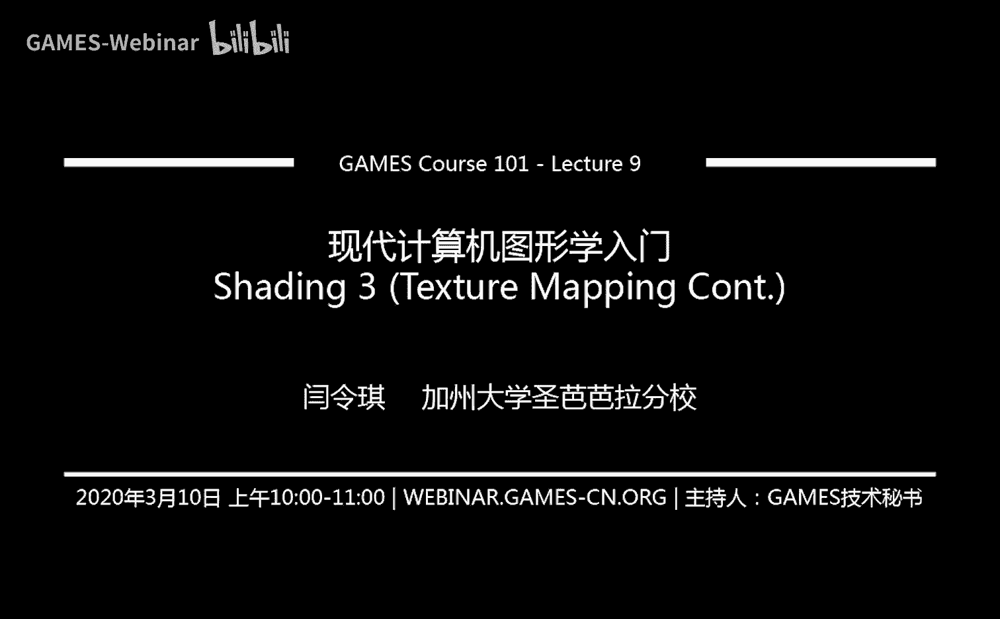
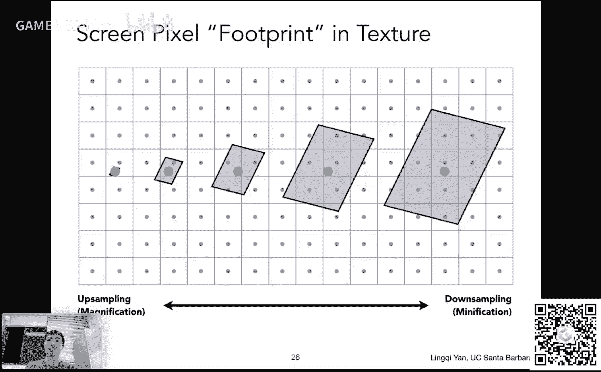
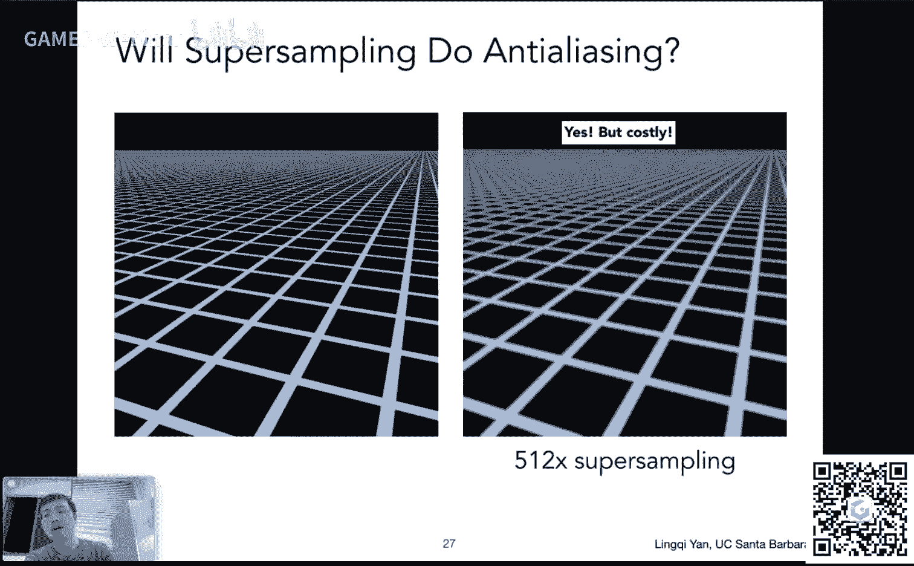
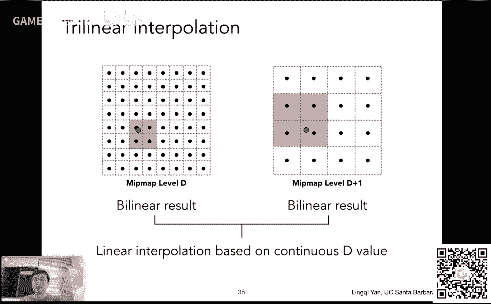
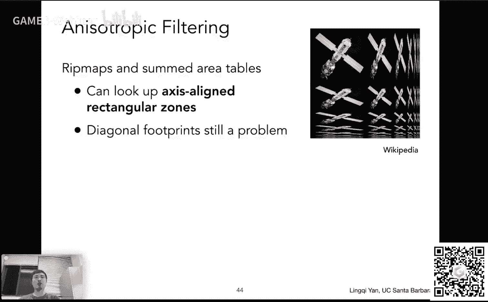
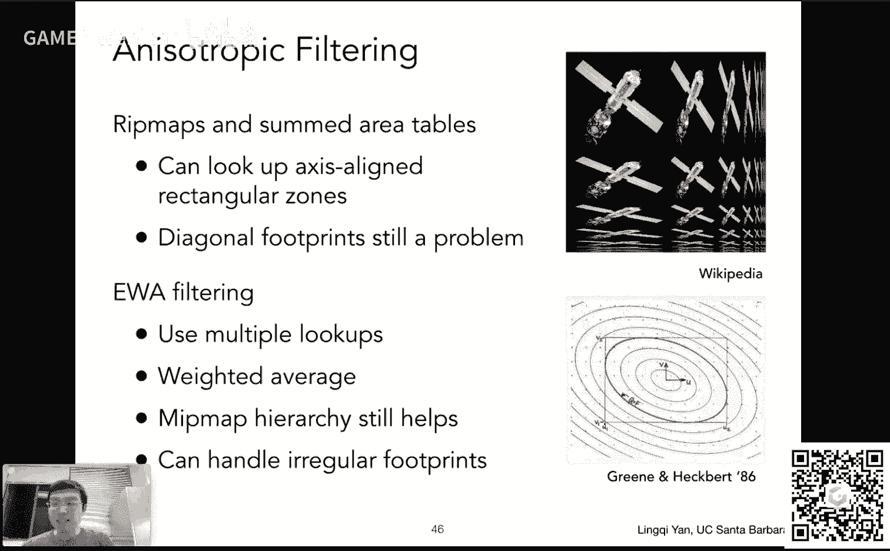
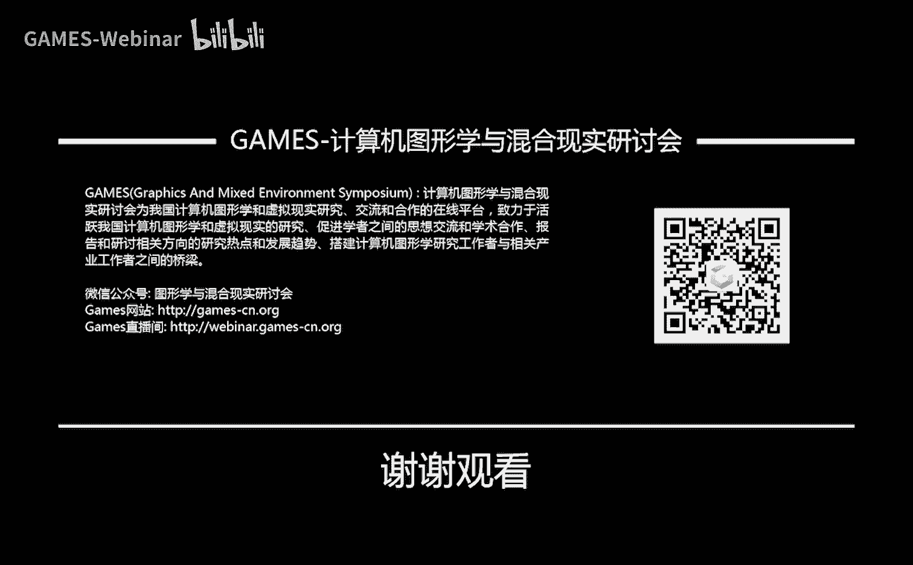

# GAMES101-现代计算机图形学入门-闫令琪 - P9：Lecture 09 Shading 3 (Texture Mapping Cont.) - GAMES-Webinar - BV1X7411F744

感谢大家一如既往的支持，咱们今天开始说这个啊，现代计算机图形学入门的第九讲，然后我们今天会把这个着色部分这个说完，说起来这部分啊其实和这个着色本身已经没有太大关系了，着色的基本原理咱们已经说清楚了。

那这一段节课咱们主要说的就是这个关于纹理的一些这个应用好吧，呃那么在课程之前还是一样，咱们这个有一些事情说一说，这次呢主要就是关于这个作业，然后呢呃有同学反映这个作业已经收到批改的结果了。

有同学说还没有没错，现在我们正在这个这个批改中啊，然后这个请大家稍微耐心一点，然后然后啊这个呃作业二目前这个收到了271份，其实一个小时之前了，估计大家这个应该跟我一样，赶deadline。

赶的都比较厉害对吧，然后我怀疑现在应该已经300了，然后这个这个这个这个不错啊，然后嗯嗯这个希望之后大家都是这么一个这个这个提交数量吧，这应该非常好啊，然后我们的这个作业三很快就要放出来。

然后关于这个这个呃着色这一块的内容，好吧啊，那这一次主要就是说一下这个跟作业相关的问题，那咱们继续啊好嗯，经过前面两节课，咱们已经说清楚了，这个关于嗯着色的主要内容，主要呢咱们从着色模型开始说。

特别的我们我们提到了一个这个布林缝着色模型对吧，我们还这个手推了一下，这个漫反射高光和这个环境光下对吧，然后把都合在一块，我们就可以得到一个这个看起来很像塑料的一种材质，然后我们的结论是什么呢。

就是说这个我们如何去定义不同的这个材质或者表面，与这个光线如何作用，呃，我们就可以得到怎样的一个这个这个这个看上去的一种外观对吧，所以说最重要就是研究清楚这个光线与材质如何作用。

这个呢我们在之后讲完这个光线追踪部分之后，还会给大家这个更详细的说好，然后呢我们提到说这个着色可以应用在不同的这个地方对吧，如果我们应用在这个表面上，这就是这个flat shading。

然后如果应用在这个呃顶点上，这叫gotiating，然后这个应用在像素上嗯，这个就叫做呃风险点，然后我们都提到说这个中间涉涉及到大量的差值对吧，如果我们要用grow shading。

我们可以算出在三个顶点它的这个着色的结果，并且在三角形内我们需要进行一个差值，然后如果做缝制定呢，我们需要这个呃三角形三个顶点上，他们的这个三个法线方向。

然后呢我们先把它对这个三角形内部的任何一个像素做一个差值，然后求出对应的像素它的法线，然后我们再做一次设定，是这么这么做对吧，但不管怎么样，我们会用到很多的这个这个差值的这些方法。

所以今天我们主要就是说这个事情好吧，然后呢我们提到了说在硬件中是如何实现的对吧，这个这个图形整个的一套光栅化的一个走为图形管线，或者说实时渲染管线就是最重要的事情，我们提到两点。

第一这个顶点呃的变换或者处理，然后另外一个是这个呃像素的，或者说这个片段的这个呃处理啊，然后这两个呢分别现在是都是可以编程的，然后我们如果要对顶点的操作进行编程。

那么我们写的东西就是叫做这个vertex shader，顶点这个呃着色器，然后呃相应的如果我们写的是像素，那这个就叫做呃像素着色器对吧，然后这个呢我们今天也会体现在这个体验到它的一个应用好吧。

然后我们提到了一个最简单的这个纹理映射的知识，其实呢就是把三维空间中实际上是二维的物体表面，然后贴上一张图，所以纹理其实就是图，然后我们这个提前会得到这个呃物体上各个不同的这个表面上。

各个不同的位置如何去映射到这个纹理的不同的地方对吧，那咱们就说了这么些内容，然后呢这个呃咱们今天就是沿着这个思想，咱们把这个呃着色部分讲完，如果咱们有时间，咱们会讲这个这个关于这个阴影的事情。

怎么样生生成阴影，然后我觉得今天应该没时间啊，那咱们就这个安心把这个着色部分说完，那咱们就要说这个三个部分，第一是这个嗯重心坐标，然后我们用重心坐标是为了做差值。

然后呢这个我们提到说这个纹理是可以贴在物体表面的对吧，这不能一句话就解决了，怎么贴，咱们要研究这个事情对，然后呢最后就说一下纹理的一些其他应用，它可以不是只单单去这个指定一些颜色。

它还有很多非常非常强大的这个应用，那咱们今天就从这里开始说，那么第一个话题，咱们今天要说这个如何在三角形内部进行任何属性的差值，然后为了做这一点呢，然后呃我们引入的一个概念就叫做重心坐标。

那么咱们先说这个事情啊，所谓重心坐标，大家看到英文啊，barry centric coordinates，然后这个重心坐标是为了做什么呢，是为了做这个三角形内的差值，那咱们首先啊在做差值之前。

先把这几个问题搞清楚对吧，首先我们为什么要在三角形内部进行插值，那刚才其实通过对上节课内容的回忆，咱们已经知道呃，我们要做的事情呃，有很多操作是在三角形的顶点上完成或者说计算的，然后在三角形内部。

我们希望它得到一个这个平滑的一个过渡对吧，就是为了做这么一个操作，所以说当我知道顶点的属性的时候，我希望在三角形内部的任何一个点得到一个这个值，并且这个呃如果每一个值点的值我都知道。

那其实是一个平滑的过渡，从一个顶点过渡到另外一个任何一个顶点对吧，然后是这么一个意思，这就是说我们需要差值，然后呢另外一点就是我们差值什么内容，这是一个这是另外一个事情对吧。

就是说这个定义在三角形的顶点上呃，可以定义各种各样不同的属性，比如说我们之前提到说这个啊这个这个在不同的顶点，我们可以定义任何一个顶点映射到纹理的哪一个部分对吧，就是空间中的一个三角形。

应该对应这个纹理上的哪一个三角形，这就是说把这个三角形贴过去对吧，那我知道说三角形三个顶点分别映射到这个纹理上面的呃，这些哪些uv，那么在三角形这个内部的这些地方呢对吧，然后这是一个啊。

另外呢也可以定义这些竹顶点的其他属性，比如说颜色对吧，一个三角形假设它的三个顶点是红绿和蓝，那么它的在中间应该有一个自然的过渡对吧，所以这个也可以插值，那么我们既然提到呃，逢shading同时定的话。

他这个一肯定是呃每一个顶点自己都有一个法线，然后在这个三角形内部要先把法线插值出来，那么这个法线的差值，这个就是就是呃我们呃差值的内容，就是定义在三角形顶点的这些呃法线，那大家从这一点上可以看出来呃。

这个差值啊，基本上来说可以对三角形顶点上的任意的这种属性进行差值，事实上也就是这样的呃，也就是说那在我们进行这个实际的这个差值过程之前，先把这个了解清楚好吧，然后呢怎么做差值对吧。

然后这个就是说我们了解清楚后，我们要插值某种属性，然后我们要得到中间的一个平滑的过渡，那么怎么做呢，我们就引入这么一个概念，叫重心坐标好，那我们提了那么多次重心坐标了对吧。

然后我们先看一看这个重心坐标到底是什么意思对吧，那咱们看这么一个例子，大家现在在看一个三角形，首先呢我们说重心坐标是定义在一个三角形上的好吧，就是说给你一个三角形，你定义一套重心坐标，换了一个三角形。

那是另外一套，是这么个意思好吧，然后首先你有一个三角形abc，那么呃重心坐标所告诉我们的事情，就是说在这个三角形a b c所形成的这个平面内，任何一个点x y都可以表示表示成这三个顶点a b c。

他们坐标的线性组合，什么叫线性组合呢，大家看这里这个这个阿尔法乘以a加上贝塔乘以b加上伽马乘以c，这些a b c指的都是坐标，就是它是x a y a就是这个意思，b的坐标就是x b y b道理是一样的。

那么呃我们回到这个定义上来，就是说啊这个空间啊不这个三角形所在平面上的任意一个点x y啊，都可以用这个呃三个顶点他们的坐标的线性组合来表示，只要满足一个条件就可以，什么条件呢。

就是说它的这个线性组合的系数alpha和贝塔和伽马加起来要等于一，在这种情况下，我们就管这个alpha贝塔伽马，也就是这三个数合在一起作为一个坐标，用来描述这么一个点x y啊，是这么一个意思。

也就是说啊，这里就是就是说我为了描述一个点的位置，我再也不需要知道什么这个这个什么直角坐标系啊之类，这些坐标系就是只要给我任意三个点，我不管它这三个点a b c是在什么样一个坐标系里面。

表示只要有一个点在三角形abc所在的平面上，我都可以通过阿尔法加贝塔加伽马等于一这么三个数，然后对这个阿尔法贝塔伽马做一个线性的这个呃平均嗯，然后我们就可以得到一个这个呃。

嗯这个任意点他在重心坐标下的表示alpha贝塔伽马，那么有同学要问这么一个问题，这个阿尔法加贝塔加伽马等于一嗯，那我有ala有贝塔，我不就知道伽马是多少了吗，对吧，它它是一减阿尔法在减肥的啊。

没有任何问题，就是这样，也就是说啊，实际上来说，这个重心坐标虽然是三个数，但由于这么一个条件的限制呃，那么其实它就是两个数，然后这个其实是有道理的，对不对，三角形所在平面自然是二维的，二维的。

我当时用两个数就可以表示了，为什么要三个呢，对吧，所以这样想有道理，那么我刚才没说完哈，我刚才说这个三角形所在平面上，任何一个点都可以通过a b c的线性组合来表示。

但是如果这个点在三角形内还需要满足另外一个条件，什么条件呢，就是说这个这三个系数就是alpha贝塔和伽马都必须是非负的，也就是说alpha大于等于零，贝塔大于等于零，伽马大于等于零，没问题。

然后就是说这个当这三个条件都满足的时候，然后我们就知道这个点在三角形内啊，这个是两个事啊，如果不满足这个非负的条件，这个点只要它阿尔法加贝塔加伽马等于一，这个点一定是在三角形所在平面内。

有可能在三角形外啊，但如果说满足了这三个呃，系数都是非负的，那这个点一定在三角形内，这就是中心坐标好吧，那咱们这个呃先说明白，然后咱们现在就可以利用这些这个重心坐标做一些事情，然后比如说我现在说呃。

那我问在这种定义下，这个a点自己它的重心坐标是什么，这里呢我这个摄像头稍微挡一点啊，那没关系，这是a点，a点他自己的重心坐标是什么，诶，那我当然知道这个a点可以写成一乘以a加上零乘以b，加上零乘以c啊。

没问题，然后呢这个这个也就是说这个呃a点所在的重心坐标呃，那就是alpha贝塔伽马等于什么呢，等于100，所以这个a点的重心坐标就是100，那如果b点呢自然是010，c是001，没问题吧。

哎这就是我们直接从它的定义，我们就可以知道这些呃这个a abc 3个点所所在的这个呃坐标好啊，刚才有同学问我说，为什么这个alpha加贝塔加伽马等于一哈，这个是这个重心坐标轴这个自己要求的一个事情啊。

如果这三个条件不满足的话，那么你得到的这个点不在三角形所在的平面内啊，这个我不再呃这个多解释，这个解释起来这个相对复杂一些啊，然后然后这个就是alpha贝塔伽马之和等于一。

是为了限制这个呃你所要的那个点在三角形所在的平面内啊，这是这是呃结论好吧，然后呢呃我们现在回到这个话题上来，我们刚才知道哈，从这个重心坐标的定义我就已经知道啊，好这个a b和c它们的坐标是多少了。

那么如果我要求任意一个点它的坐标，比如说像这里我给出任意一个点，它的重心坐标是多少呢，这里其实重心坐标给出了另外一个定义，什么定义呢，就是说啊这个点的重心坐标其实是可以通过面积比求出来的，什么面积比呢。

就是这么回事，比如说啊大家看这个点三角形内的任意一个点，我可以和ab和c都连上线对吧，连上线之后呢，我会我可以发现哦一个顶点它对面一定会有一个三角形，什么叫对面啊，就是大家看这个a。a点。

它对面的三角形就就是和它不相邻的这个小三角形，那就是这个三角形啊，这是a点对应的这个三角形，同样道理，b点对应的三角形也是在它对面和它不相邻的这个三角形，c点也一样，然后我们定义这么三个三角形。

然后我们就可以通过面积比什么面积呢，就是说这个这个阿尔法贝塔伽马，咱们以这个alpha为例哈，alpha乘以a加贝塔乘以b加伽马乘以c对吧，alpha呢就跟a相关，跟a相关，那它的这个重心坐标是多少呢。

就是这个a点对应的这个这个三角形的面积除以总总的三角形的面积，就是整个三角形abc的面积，大家可以看到就是呃我要求阿尔法，那我就找到a找到它对面的三角形，求出来它的面积去除以总三角形的面积。

这就是阿尔法，那同样道理，我要求比如说伽马，大家都会都知道，根据刚才定义哈伽马乘以c对吧，也是要跟c这个再在一起运用的，那咱们就找找到这个c点，找到这个c点，它对应的这个三角形，它的面积叫ac对吧。

它对面的三角形ac然后再除以整个的三角形的面积a a b c啊，那这样的话就可以求出这三个这个不同的重心坐标，这同样也是这个重心坐标本身这个它它们的这个定义，当然这个也可以推得出来哈。

这里就不用这个多给大家说了，这是我们如何去求这个呃，阿尔法贝塔伽马就是重心坐标，那么大家想象一下啊，就是说如果我给了任何一个点，那我又知道原本a b c3 个点在哪，那我就知道所有点在哪。

那比如说以这个aa为例哈，这个三角形小三角形为例，那我知道这三个点的位置，那我当然可以把这个三角形的面积算出来，没问题吧对吧，所以说这个呃没有任何问题，然后这就是这么一个定义方法，那从这个定义方法啊。

我们立刻可以得到一个非常特殊的点，它的重心坐标是多少，这个点是什么呢，这个点就是三角形自己的重心，这个三角形的这个这个重心呃，xy对吧，大家可以看到这个红点在这个a abc上。

然后这个三角形的重心它有一个非常好的性质，什么性质呢，如果你把这个重心和a b c非常这个联系起来之后，你会发现他把这个这个大三角形abc均等的分成了三份，然后分成了三个等面积的三角形。

那既然都是等面积的三角形，根据刚才的公式直接一算就可以算出来哦，这个重心它的重心坐标就是13/3分之一，1/3，没有任何问题好吧，这就是通过刚才一个定义，我们就可以拿到这个这个呃另外一个点。

那当然对于任意的一个点怎么计算呢，我们刚才说可以算面积对吧，算面积，但是呃这个有一个这个更简化一点的方法，这已经可以给出来嗯对吧，就是说呃大家可以去真正的算一下面积没有问题。

利用我们所这个教的这个这个差成，然后如果我们就这么做的话，其实也是可以推出来这个式子的，就是说啊任意一个点xy，然后他这个给定这个a abc的坐标。

这个对x a y a c l这个这个x b y b这些这些坐标，然后呢我怎么算出来这个任意一个点x y它的重心坐标呢，它的公式就在这里，大家会发现啊，同样它就算了，alpha和beta。

由于规定了这个他们这个alpha贝塔伽马的和是一，所以伽马不用算，直接剪辑出来，那这个道理就在这儿好，那么这个这就是我们说的这个重心坐标，它的一个一般的表达式。

那么这个表达式当然没有任何必要去记忆它对吧，就是说它的定义我们都已经清楚了，然后对于任何的一点，我们知道我们都可以算它的中心坐标，那就可以了，那么咱们就可以用重心坐标做一点事情，什么呢。

我们就可以直接应用这个这个重心坐标呀，去去这个做任何一个点，在三角形内部的点，它的颜色的差值，那么怎么做呢，呃是这样哈，大家知道任何一个点，比如说这个点是p点。

那我可以写成alpha加上贝塔b加上伽马c这么一种组合的形式，同样重心坐标所告诉我们的事情，就是说如果要做差值，那么我要差值的属性，同样也应该用重心坐标去把它给线性的组合出来，那么是什么意思呢。

假如说我这三个顶点有三个属性，va vb和vc，然后呢我这个我就可以通过任何一个三角形内部的点，它的重心坐标alpha的伽马，然后我把这些属性线性的组合起来，然后得到任意一个点，这个它的属性v这里。

所以这个属性可以是任何的属性，比如说位置，比如说这个这个纹理坐标，或者说我们说uv，然后说或者颜色像这里就是颜色对吧，然后这个呃或者是我们说的这个呃发现。

或者说我们之前提到说我们我们在做这个光栅化的时候对吧，三角形打散成这个这个这个像素，然后一个像素的中心它对应的位置它的深度是多少呢，当然也是通过这个在三角形和三个顶点定义深度，然后把它插值出来，没问题。

也就是说啊，重心坐标就允许我们说先算出它的这个位置的重心坐标在哪儿，然后我们在这个用重心坐标做差值好，那没问题，就是说这就是这么用的啊，然后呢这个有一点。

这里就是说如果大家这个读其他的这些这些open gl一些文章或者干什么，然后可能会涉及这么一个问题啊，就是说这里给大家说一下这个事情，就是说重心坐标虽然不错，大家看这个应用非常简单对吧。

任何一个点只要有中心坐标，我就可以插值任何的这个这个属性没问题，那么中心坐标有一个问题，也就是说啊他在投影下，在投影的变换下是不能够保证重心坐标不变的，是什么意思呢，就比如说大家现在看到这个三角形啊。

假如说是一个这个空间中的一个三角形，然后呢，它这个呃我可以算出这个点，这个v它对应的这个这个这个重心坐标在哪，那如果我把它投影到某一个平面上去，这个三角形形状会发生变化吗对吧。

然后我这个这个a abc和中间这个点呃，这个我都可以算出来它投影之后的这个坐标吧，那投影之后我再从这个投影之后的三角形，我再算一遍这个呃这个点的中心坐标，我会发现诶得到了一个不一样的中心坐标。

这个是很有可能的事情对吧，然后然后这个这个就是说啊重心坐标它并没有一个好的性质，就是说它在投影下不变，没有这么一个性质，就是说呃如果有个三维空间中的三角形，然后你这个有一个点投影了之后。

它的重心坐标就不一样了，那么也这个事情也就是告诉我们，如果我们想插值一些三维空间中的属性，我们就应该这个取这个三维空间中的坐标，就是这个a abc，然后这个取它的三维空间中的坐标。

然后取这个这个找的这一个点，比如说这个p中间某一个点，它的坐标也是三维的空间中中中的坐标，然后呢我来算它的这个这个呃重心坐标是多少，然后呃我再去做差值，而我不能在投影之后的三角形里面做。

哎这一点是呃专门为了说一个什么问题呢，我想说的就是深度，大家想象一下啊，呃我们之前说光山话三角形呢都已经投影到这个屏幕上去了，然后它会覆盖很多的像素，然后像素都有中心，然后像素的中心的这些点呢。

然后这个呃我可以知道它的投影了的三角形的哪里没错吧，然后我可以说在投影的三角形里面，对这三个顶点的这个深度的差值可以这么算吗，其实是不对的，是怎么应该怎么算呢，应该是这个呃，找到你这个像素中心点呃。

对应这个三角形位置，它的三维空间中的坐标，然后我在三维空间中，然后把这个a abc它的深度差值好放回来，是这么一个做法，这样才是对的，那至于怎么样把这个已经投影到屏幕上，在投影回去。

我们应用逆变换就可以了，这个没问题，这个大家在这个专业中会稍微碰到一点点，但不要求大家去做哈，然后这里是这个呃，我要说的一个事情好吧，这就是说在三维空间中的属性，建议是在三维空间中这里做差值。

然后这个这个这个呃，在这个把这个值对应到这个二维的这个结果上面去，好吧，是这么一个事情好，那这个这里把这个事情说明白，这个根本原因啊，就是重心坐标它本身在投影操作下会发生变化啊。

好那么重心坐标的差值很简单，咱们已经说完了，咱们下面一步就要说这个怎么把纹理给给应用在这个这个这个这个啊，实际的这个渲染中好吧，那么怎么应用呢，我们之前其实在提这个shadder的时候啊。

我们已经说了这个事情呃，什么呢，就是说我这个屏幕上的任何一个采样点啊，不管是像素还是说我这个呃用m s a a它代表一个采样点吧，反正就是说他自己肯定有一个位置，它有一个位置。

然后呢我就知道这个呃他嗯在这个位置上插值出来的uv，或者说纹理的坐标在哪里对吧，原来纹理的坐标都定义在三角形的顶点上，现在对于任何一个点我都知道它的三角形哪儿，然后做一个差值。

就用咱们刚才说的重心坐标可以算出这一个点，它的uv好没问题，它的uv算出来之后怎么办呢，在纹理上去查询一下这个uv的值，我就知道了，好没问题，我就知道这个对应的纹理呃，是这么个颜色。

那么我们就可以拿来用这个颜色，这个颜色可以怎么用呢，呃我们可以认为哦这个纹理定义的就是这个漫反射的系数，然后这个这个这个漫反射技术，这个大家还记得在这个不联防模型里面，它就定义这个kd。

然后我就可以直接用我取到的这个test color纹理上的这个值去代替这个kd，那不就等于是把这张图给贴在了这个这个这个这个呃物体上嘛对吧，并且这个物体还有这个这个风水岭能够带来的这个呃就是明暗的变化。

高光这一系列的东西对吧，就是这么个意思，那这就是我们怎么样去用这个纹理映射，太简单了，任何一个点找到这个屏幕上点啊，找到文理在哪儿，然后直接查怎么用，随便对吧，那行没问题，那这就是我们说到这里。

这这这就这就可以了，然后呢，那咱们这个呃进继续进展，下一步下一步是什么呢，我们看它到底出了什么问题，如果这么简单做会出什么问题好吧，咱们先看第一个问题，第一个问题我们管这个问题叫做这个呃纹理的放大。

什么叫纹理的放大呢，大家可以看这里有一个问题啊，就是说哈呃如果这个纹理太小了怎么办，什么叫纹理太小了怎么办哈，假设说我们有一个三维场景，我们把它渲染出来，然后我们对着一堵墙来看，这个墙上有一幅贴画啊。

然后然后就是就是这么回事，我们知道这幅墙这个墙上如果我要应用这个一个一个贴画，很简单啊，用到一张图上就好了，唉现在我问的问题是说啊，假如说我们看着一个一堵墙。

然后整个分辨率我们定义这个呃渲染出来分辨率是这个4k好，没问题吧，然后这是非常高的分辨率，但是我们的纹理只有256x256，唉这个怎么办，这也就是说啊，那我们看一个这个很高分辨率的强。

然后这个任意一个点，他去查这个纹理的时候，他会查到一些非整数的值，对不对，也就是说啊纹理太小了，纹理就会被拉大，被拉大了，自然就会看到这样的现象，就是说啊这个呃纹理本身太小，首先呢它是一个问题。

正常情况下，如果大家涉及到打游戏啊或者干什么，大家都会避免这个问题，就是说这些游戏的制作者，他不可能会让你说这个这个有一些很重要的一些地方，然后他用了一个很低分辨率的纹理。

但是啊这种情况普遍意义上还是会发生的，也就是说这个嗯嗯就是我刚才说的例子啊，看着一个高清的一个奖，但是它上面贴的这张图却很低级，那怎么办呢，那很简单，对于任何的这个这个呃墙上的一个点对吧。

一个像素这一个点我都可以找到它对应的这个纹理上的一个位置，然后这个位置可能不是整数，不是整数，怎么办呢，那咱们就把它给这个这个around成整数，就四舍五入成整数好吧，我把它给这个，比如说零点点四。

我认为是零啊，0。6我认为是一，那这样的话呢就相当于是呃在一定的范围内，就是我们要查找的是呃一个相同的这个纹理上的像素，然后纹理上的像素它是有个名字的，叫taxi，然后中文叫文理元素或者文素啊。

反正这个挺别扭，然后我就管它叫pixel和txo，这样来说吧，pixel呢就是我的这个生成的这个画面上面的一个像素，然后text就是纹理上的一个像素，那么我们现在可以看到啊，一个pixel一个像素。

它可能说在一定的范围内，然后呃然后就是说它周围的很多像素吧，比如说3x3或者5x5，很很多像素它都会被映射到同一个这个呃txt上去，这是因为纹理太小了对吧，所以如果我们去做一个简单的四舍五入。

我们会得到这么一张图，然后呢我我们不希望这样对吧，这看上去一个一个格子很难看诶，我希望说能得到这个这个中间或者右边这样的一种效果，也就是说我引入点模糊没什么问题，但我希望最起码得到结果是稍微连续一点。

这也就是说明什么呢，这就是说我这个当我在查询啊，查询这个纹理的时候，如果你给我一个非整数的坐标，那我应该如何得到它的值，对不对，这就是我们要说的这个呃这个双线性差值它的概念呃，所谓双线性插值。

咱们看一看啊，我我刚才说这个呃我们的一个高分辨率的这个这个屏幕，它上面一个像素里面的中心呃，它映射到了一个非整数的这个位置上，而我们现在看到的这个4x4的格子是taxo，就是像就是那个那个纹理啊。

然后它映射到这个位置，那我想知道好纹理在这个红点处它的值是多少，那么我刚才说啊，有一个最简单的办法找离它最近的嘛，就找这个点，那么说如果这个红点在这里，那也会找到这个点。

那整个这一块可不就显示相同的颜色了嘛对吧，然后然后就会形成形成一块一块，现在我不想，现在我想怎么做呢，我想这么做诶，我想知道这个这个像素的中心会映射到这儿，我可以找他临近的这么四个点对吧。

临近的四个点我总可以找得到，然后临近四个点找到了之后呢，然后我们还怎么办呢，我们在做这么一个操作，就是说啊呃我们知道这个屏幕空间我们定义过了对吧，从左下角开始向右向上对吧，然后同样道理。

这个四个点它总有个左下角，然后你的这个红点你可以找到说这个离左下角，它的水平距离和竖直距离啊，大家看这个水平距离，我们管它叫s，然后竖直距离管它叫t，这个s和t肯定都是0~1之间的，为什么呢。

因为这两个像素或者两个txt之间，两个txt之间它的距离是一，如果这样认为的话，那这个呃这里没考虑那个叫什么uv，它的定义是0~1哈，咱们就以这个呃一个一个像素这个单位为一好，那也就是说这个长度是一。

那么对于它投影出来的这个分量水平的这么一个距离呃，就管它叫s一定是在0~1之间，t也一样好，咱们现在找到周围四个点投影出这么两个这个长度好，下面一步怎么办呢，下面一步啊，我们定义一个操作叫做线性差值。

线性差值太简单了，什么意思呢，就比如说这个有两个，你有两个不同的值吧，在定义在两个位置上，然后呢如果我定义一个x是0~1，我认为这个这个x等于零的时候，x在这里，x等于一的时候，它在这里。

那么我问x等于0。5的时候在哪啊，它应该在中间对吧，x等于0。9的时候在哪啊，应该靠近这个这个这边对吧，然后这就是这个这个线性差值，然后大家看这个例子啊。

linear interpolation就是它的定义简称lp就是linear interpolation的意思，线性差值，线性差值什么差值，这个v0 和v一分别定义在位置零和位置一上。

所以x是一个0~1之间的值，那么咱们看看x等于零的时候，然后我们可以看到这个值等于v0 ，没问题，x等于一的时候，然后这个定义啊就是v0 加v一到v0 ，那就是唯一，所以x等于一的时候是呃只是为一。

那x等于0。5的时候，大家可以发现啊，正好是两者中间，所以他就做了一个这么一个线性差值，如果咱们定义这么一个操作的话，那行咱们现在就已经不用关心具体线性差值的这个公式怎么做了。

咱们就直接可以做一个差值什么呢，大家可以看到这两条线水平的这两条线啊，就是左下角右下角，然后我用x可以做一个线性差值，然后左下角这个点有一个颜色呃，这个点有一个颜色，然后呢它这个中间的位置。

这个我就知道它离左边距离是s，然后我就可以用这个s来对这两个点它的颜色进行一个差值，好，我得到一个这个黑点，同样道理，我对上面这条边对左上角和右上角这两个点，这两个既然定义在这个纹理上。

这两个有两个不同的颜色，然后呢我也知道哦，它水平距离离左边s，然后我就用这个s去插值这个左边和右边诶，我得到另外一个差值出来的值，诶，那我现在把这两个这个这个差值完成了之后怎么办呢。

我最后想得到这个红点处的值啊，那大家可以看到这个应该已经可以想象的出来了，对不对，然后这个我再做一次数值的差值就可以了，我把这个竖线上，我因为这两个黑点的值我已经算出来了对吧，我数值这个方向上我可以看。

比如说这这一个点，然后这一个点，然后我要插值出在t这个距离上的点，为什么是这个这个t呢，是在这儿啊，t这个数值的距离呃，这是这段距离是t然后我就用t来差值这个点和上面这个点，就刚才差值出来的两个点好。

我再用t把这两个值插值出来好，那么大家就会看到好，这里我做的呃两两种吧，差值第一种叫做这个水平方向的这这两个点，两对点分别进行一个差值，然后我得到两个点，然后我在竖直方向再进行一个差值。

那我就可以得到竖直方向这一个值没问题，那大家可以看到这个点的颜色，现在就综合考虑了它周围的四个点的颜色，并且呢咱们假设一下这个红点啊，如果非常靠近这个u00 ，你得到的结果就应该和这个u00 很像。

那如果说这个这个红点它在正中间，它就应该是这四个点的这个平均值没问题，这里就是说这两个通过这两步水平和数值的这个差值诶，我就可以得到一个平夸的过渡，在这个在这么四个点围城这个区域内。

就可以得到任意一个点，它的平滑过渡的颜色是多少，哎所以说这是一个不错的做法，所以呃这个就是说我做了两趟差值对吧，水平一趟，数值一趟，然后我们就管这个方法叫做双线性插值，因为做了两趟线性。

当然我没说两次哈，大家知道这个水平上做了两次，是不是让他做一次啊，就是指水平和数值都要差值，我们就管它叫双线性差值，当然有同学问这里这方向能不能反过来，能没任何问题啊，这个大家可以这个手推一推这个公式。

你就会发现先数值在水平一样的，没什么问题好吧，那道理就在这儿哈，咱咱们把这个这个这个呃思路先先这个搞清楚对吧，我们有一个很小的图，然后呢这个我要把它放大。

我要查询它在任何一个这个非整形位置上的这个值是多少对吧，我希望它平滑过度，平滑过度怎么办，找连续的，找这个最近的四个点，做一个这个双线性差值，就可以得到平滑过渡的结果。

那么这里中间这幅图呢就是大家看到的这个呃双线性插值的结果，而双线性差值大家可以看到啊，效果挺不错的对吧，然后呢这个比这个我就什么也不考虑，我直接把这个四舍五入坐标做这个。

弄到这个整形的这个这个txt的坐标上，然后我就这个直接找他，我就会发现很多像素都会被映射到同一个txo上去，然后就会出现格子，现在没有对吧，没有挺好的。

但是呢就是说啊这个这个双线性差值它当然也有它的问题，就是说它的质量和一些更高级的方法，它有这个呃这个还是差一些，比如说大家看右边这幅图，右边这幅图呢叫做这个这个这个这应该怎么说呢，这是嗯我想了想哈。

这个英文好吧，我们就管它叫白cubic吧，就应该是双向，这个这个三次的差值，咱们只能这么翻译啊，就是这这翻译不好，那咱们就用英文吧好吧，双线性叫白linear，然后这个叫做叫做by cubic。

by cubic呢，其实其实这个道理也好理解，他取的不是周围的这个临近的四个哈，他取的是这个你任意一个点取周围临近的16个，然后这16个也是做这个数值的和水平的这个差值。

只不过每次用四个做一个这个三次的这个差值，不是用线性的这个差值好吧，这里简单给大家提一下，那么这个这个by cubic这个这个大家可以想象，它肯定比把linear的运算量要大，它取周围的16个嘛。

把linear我只用周围的这个四个嘛，然后它它这个运算量大，但是它带来更好的结果，不知道大家这个图里面啊，这个经过了这个直播之后还看得清楚，比如说大家看这个眼角这段这段看得特别清楚。

就是说双线性插值在这里还可以看到一定的锯齿状啊，然后但是在这个by cubic差值这块，大家就看不到什么太那个这个这个差值了对吧，然后这个好吧，咱们呃大概就是这么个意思啊。

然后大家这个又一次体会到这个事情，在这个图形学里啊，呃我们频繁遇到这样一个问题，对就是说这个好的质量的东西往往都伴随着这个更高的这个开销，然后呢这个大家通常会提出这么一个东西，后来再去这个再去想说。

我怎么样把这个开销降下去，我又能得到好质量，这是基本上一个这个这个提高的一个思路哈，这个呃就简单跟大家说一说，这是关于这个纹理的放大问题好吧，这就说到这儿好啊，ok然后呢这个啊看不清问题也不大啊。

基本上来说这个双线性效果已经不错了，然后这里呢呃我们刚才已经提到了，说如果这个纹理挺小，那我看着一个这个很大的一个平面，然后这个图这个纹理肯定要被拉大，会出问题对吧，那么我们现在想另外一个事情。

如果这个纹理太大了会怎么样对吧，这是另外一个问题，但是大家这个这个想一想，这个这个纹理大了有什么问题吗，小了我当然需要这个差值出来，大了我不需要啊，到了怎么会有问题呢。

答案是这个纹理大陆的话反而会引起更严重的问题，而这个就是就是说和这个这个嗯这个这个这个第一想法不太一致，对不对，这个大家会觉得文理大的话什么信息都有啊。

这怎么会引起什么问题呢，啊咱们来看一看好吧，就比如说啊大家现在看这么一个这个平面，这个平面呢往这个远处延伸，大家可以看到前面这个地平线对吧，然后这个这个平面呢上面贴了一张图，这个纹理纹理是什么呢。

是一个格子，是这个格子水平竖直的啊，这样这样贴上的，然后咱们从某个角度上看过去诶，我们会发现啊，这个近处看到格子挺大的，然后远处这东西挺小的，没问题，我们做透视投影嘛对吧，这个肯定是这样的。

远处的格子会挺小，那么大家可以想象一下，如果我还照之前的操作啊，简单的这个应用纹理怎么应用来着，像素的中心对吧，找这个纹理坐标，然后求出这个纹理坐标上的这个值是多少，我们已经知道怎么差值了对吧。

所以任意的坐标都知道，然后然后它的值啊，然后我们把这个值写回这个像素，那如果说我们要做这个这个简单的操作会得到一个什么东西呢。

我们会得到这么一个这个这个呃，看上去非常非常不对的一个一个东西对吧，然后大家看到什么了呢，大家看到了很熟悉的东西叫摩尔纹啊，远处摩尔纹，然后近处当然大家看到了很严重的锯齿。

所以说大家这个从这个纹理上大家就会看出呃，和之前的一个现象完全完全一样的问题对吧，就是走样这个走样问题，那咱们这个又遇到他了，那么这个问题到底是怎么来的呢对吧，然后这我们怎么解决呢。

这就是我们下面要探讨的问题好吧，然后这个呃大家可以看到这个原处这个是越来越差越来越差。

从这进出多少还能看到远处越来越差好呃，然后这里问题在哪儿，那咱们分析一下，为什么呢，因为近处其实一个像素来说啊，它这个覆盖的这个呃这个纹理上的一个区域其实相对较小，就比如说像这里。

就像这里覆盖纹理上的区域相对较小，然后在远处那一个像素，它其实这个覆盖了一片纹理，覆盖了一个很大的一个区域对吧，那也就是说啊，这告诉我们屏幕上的这些像素，它们覆盖的这个纹理上的区域大小是各不相同的。

那如果说对于一个这个像素，它覆盖纹理上的一个区域挺小好，我用这个像素的中心查询一下它的值啊，我知道啊，这就是这个像素所覆盖区域的这个纹理的值，我可以近似的这么认为，没问题，可是如果一个像素。

就比如说以刚才为例，那些像素覆盖了纹理上面的很大一块区域，现在我还用它的中心，我去查这块区域，我说好，我就看这一个点，这个点的值我就认为是整个这一块区域它的平均值，那这个呃听上去就首先就不对对吧。

就是说我用这一个点如何能代表这么大一个区域，它的这里面这些不同的这些点，这些颜色的变化对吧，这是代表不了的，就是说当这个像素覆盖的这个纹理的区域大的时候，我们就不能这么简单的去采药了对吧。

就是说中间用用它的这个这个像素中心去采样了。

那这就是我们遇到的问题，那么这个大家自然而然就会问这么一个问题对吧，之前我们解决这个这个锯齿怎么解决的来着，我们做这个抗锯齿对吧，我们引入了这个这个这个呃这个m s a a。

或者说我们说超采样的都是差不多一个一个概念，怎么做的呢，其实就是说我一个像素，我用更多的这个呃样本对吧，不同的位置像在相同内对吧，我去感知这么一个变化的函数，没问题，这里我们同样也可以这么做。

比如说大家现在看到右边这幅图哦，如果我这个每一个像素里面我用512个点呃，这个这个采样点，然后我把这些点都给这个呃对应的位置，在这个管理上算出来，然后取出的值，然后对于远处的一个像素，比如这个像素。

它里面有512个点，我取它们的值的平均，然后就可以得到一个不错的这个结果，没有问题，说这个超采样能得到一个很好的结果，没问题，但是同样道理对吧，我们用很多的这些这个采样点。

肯定会让这个呃整个算法变得特别慢，那咱们不希望这么做对吧好。

那咱们回来看这个理论上到底我们应该如何分析这个问题，那首先我们遇到的是一个这个这个走样的问题，那走样是怎么来的呢，这个大家还记得吧对吧，就是呃信号变化过快，我们的采样的速度跟不上它或者采样频率对吧。

那么这个在这个问题上如何体现，就是说我们在这个纹理过大这个问题上如何体现这个采样这个概念呢，很简单，什么呢，就是说当这个纹理特别大的时候，你的一个像素里面像素内部哈，这块纹理它是在一直在变化。

然后也就是说在一个像素内，它的频率很高，可是你只用了一个采样采样点去采样，它那肯定是不行对吧，那么我们回到之前我们说的这个信号的这个概念上来，这个不需要任何公式。

咱们想就能想明白一个像素内它有着非常高频的信息，我希望把这个像素内的值给这个这个重构出来对吧，那我就应该需要一个更高频的采样方法，这就是为什么说我们需要这个这个非常多的这个这个这个采样点。

在一个像素内对吧，我们用这个超采样的方法对吧，然后我们一个像素内取好多个点采样这个这个纹理上的这个知识，并且平均起来，这就是我们要做的对吧，然后然后就是说这个这是一个这个沿着以前的这个方法。

然后咱们做了一个一个呃简单的一个思路分析对吧，那当然我们不想用这么多这个这个太阳点，那怎么办呢对吧，因为我如果一个像素真的就用512个采样点的太多了，咱们怎么办呢，我们这里提供另外一个完全不一样的思路。

什么思路啊，行采样会引起怎样，对不对，那咱们不采样怎么样对吧，如果我们可以避免采样，那什么叫避免采样啊，我原本说啊，这个大家还记得刚才那些这个像素会在这个纹理上覆盖，很这个很大的一块区域。

那如果我立刻就可以知道这个区域里面它的值的平均是多少，我我不采用，我如果立刻可以知道这个平均值是多少，那就很好了，对不对，诶，那如如何我们才能知道这个给你任何一个这个呃这个区域，比如说咱们看这里啊。

还是刚才这一页，任何一个区域你立刻可以得到它的平均值对吧，我们要解决这么一个问题，那这就是我们之后要说的这个所谓mile map这么一个概念，当然在这之前我们先在这儿停一下啊，这里就是说我想这个说一点。

就是这个问题其实是一个算法问题，这是在这个数据结构啊，在这个计算几何啊，在这个呃很多领域上都得到了一个应用，那那就是说啊这个是什么问题，就是说点查询问题和范围查询问题，然后点查询很好理解。

比如说这个以这个texture纹理为例，给你一个点，它的值是多少，咱们刚才说双线性差值，说什么都是这个这个道理，这叫点查询，另外一个呢咱们所说的是咱们不做采样对吧，给你任何一个区域。

你立刻可以得到它里面内部的平均值，这个就叫做范围查询，叫range query，range query是一个这个是一个这个呃经典问题，然后呢就是说在这个算法上，这个呃有各种不同的这个方法去研究它。

当然在图形学上大家找了一个非常非常近似的，但是很快的方法来做这个范围查询，另外多说一句啊，范围查询可不只是我们用的这一种应用叫平均查询，我们要求这个范围内的平均值，这是我们要的结果对吧。

也有些范围查询是要查范围内的最大值和最小值，这个问题就完全不一样好吧，然后然后就是说有很多不同种类的范围查询啊，那咱们这里就就说到这儿，那说白了就是说现在给你这个这个呃一个图上面任何一个区域。

你能不能快速地告诉我它的平均值是多少，这就是我们要的这个这个结果，然后呢我们以这个实际的渲染的这幅这幅图为例，比如说我们想渲染这幅图，那大家知道这块比如说这个窗台这块啊，离大家挺近的。

那也就是说这块一个像素覆盖的区域，这个范围相对较小对吧，在这个纹理上覆盖的区域相对较小，那么这块区域离我们很远，那这一个像素其实它覆盖在纹理上，它应该覆盖的非常大对吧，然后假设说我们用的同一个纹理哈。

然后好，那么就是说这个不同的像素有不同的这个呃在纹理上覆盖的大小，那所以我这个范围查询应该能够查询任意不同的大小对吧，那也就是说呃对这就是刚才说这两个区域上啊会有各种不同，然后呢这里我们引入了一个概念。

就叫做mp map，map，map是一个在图形学上得到一个广泛应用的经典概念，那么他能干什么，这里现在就可以告诉大家，它允许大家做范围查询，这正是我们要的东西，对不对，诶，但是我这里有三个这个不同的词。

这里啊第一范围查询做的快fast，然后第二是approximate，也就是说他做的范围查询是不准的啊，首先来说做的范围查询是不准的，它中间涉及到近似，但是因为它快对吧。

大家希望的东西能够跑得越这个越快越好，然后另外一个它可以做什么，它它可以做的是仅仅是方形，特别只有是正方形的范围查询，这点跟大家说清楚啊，就是说mile map是可以做范围查询。

但只能做近似的正方形的范围查询好吧，那咱们把这个事情说明白，然后其他要不是正方形不行，那是用什么呢，马上马上咱们再说好吧，咱们回到mile map这个概念上来。

那什么叫mile map，maple map非常简单啊，这个mirap大家可以看它这个拉丁语里来的这个东西啊，然后就是说这个mp的概念，其实就是说这个这个这个很多不同的小的东西对吧，这个合在一块儿。

那这个对应到咱们图上，其实mapmap呢就是从一张图生成一系列图嗯，那咱们看看什么意思啊，比如说大家有张纹理，这张纹理呢假如说原始的这个纹理，我们管它叫做这个第零层纹理，使得每一层都是这个上一层。

这个呃都都都是这个这个呃比如说第i层啊，都是第i减一层，它这个图缩小一倍，就是分辨率缩一倍呃，呃其实应该说是缩小到一半啊，这样说的比较明确一点啊，就比如说这个大家之前拿到的一个这个纹理。

它的分辨率是128x128对吧，那么呃这这是第零层，那第一层怎么办呢，把这个图分辨率缩小一半，那也就是说我要我把这个图重新表示成，这64x64的一个一个图，大家可以看到啊。

已经可以看到这个不同的这些这些像素被拉大了，对没问题没问题，然后这分辨率低了嘛对吧，这是为了显示哈，就是说大家看到这里它们的大小还长得一样，这只是为了显示告诉大家说现在它的分辨率是多少。

其实分辨率已经小了一半了啊，然后第二层在第一层的基础上再砍一半，就变成32x32，第三层在这个这个第二层基础上再小一半，然后这个这个这个呃16x16，那做到什么时候呢，做到最后还剩一个。

还剩这个这个这个一个点对吧，那大家知道这个总共有多少层呢，既然每一次把一条边砍了一半，那它的层数就是log 2这个呃这个这个分辨率对吧，那就总共有那么多层，就是log层好，那没问题。

那我们这个可以提前计算它，这就是关键，就是说大家拿到了一个这个纹理之后，那我先把这个纹理处理一遍对吧，在渲染之前，我先花点时间把这些生成，把这些对应的mmap都生成。

那么对应到mini map里面呢，然后这个这个我们生成的是什么，这个生成的是这么一个东西，就是第零层是原始的图像，然后上面这个小小了一倍，小了一半，然后这个又小了一半，然后一直到上面。

所以呢在这个计算机视觉界啊，大家不管这个叫mile map，管它叫image pyramid，叫叫这个图像金字塔啊，一模一样的概念啊，没有任何问题，就是说这个呃这块儿这个这个就是就是说给你一张图。

你要生成更多的图对吧，然后这个每一层我这个比如说第零层，第一层，第二层我管它叫d等于零，d等于d2 啊，就这么一个安排方法，那么现在呢我有一个问题对吧，在这个在这个应用map map之前。

先问大家一个概念，诶，我们原本有这么一张图。

然后他占据了一定的存储量，那咱们生成了那么多其他的这些图，那么总共我们引入了多大的这个额外存储量呢，就是说就是相比于原本的这个，如果认为原本的这个存储是一，那么我们算出来那么多不同的层数。

我们引入了总共引入了这个多大的这个额外存储量，就是说比原来多多少对吧，是多少呢，哈哈哈哈，这里大家可以猜一猜对吧，这个很显然不是八倍对吧，嗯比如说这里这个这张图，因为其他图都是越来越小，越来越小对吧。

然后我这里有一张图，我不能说我的这些图，其他图都跟他存储量一模一样对吧，就是log它的这个边长数倍，那肯定是不对的对吧，肯定比那个小小多少呢，大家可以算，这是一个级数求和的问题，对不对啊，大家想一想啊。

这每每次边长砍一半，也就是说每次存储量是原本的1/4，那就是1+1/4，加上这个1/16，再加上这个1/16x1/4，比1/64，再加上一直把它加上去，得到的结果是多少，43/3分之四是什么概念。

就是说原本的图存储量是一，我只是多了1/3的存储水源，也就是说啊所有这些其他的层这个把它们都给加起来，它们的存储量都加起来，唉我只是原来的存储量的1/3，这个事情很不可思议，对不对。

然后就是说这个这是这是一个这个很有意思的一个一个事情啊，这个当然等比数列这个都好算啊，没什么问题，这里呢这个嗯我想一想哈，其实有一个更简单的办法算这个我这里简单给大家提一句吧，如果大家有兴趣的话。

大家看这张图啊，看这张图，但是我这个这个怎么理解呢，就说我假设说我把我原原本的这个图啊复制三份，我们不是想说这个这个总共的存储量，额外存储量是多少嘛对吧，额外存储量是多少。

呃也就是说啊这个如果我把所有的每一层的这个存储都乘以三，那肯定不影响最后结果对吧，我要的只是一个比例好，那没问题，那咱们假设说我把原原图放在左上，右上左下，也就是说这三个都是第零层啊。

这三个第一个第二个，第三个，这三个都是第零层，那么我剩下右下角这一块，我知道我可以把第一层也复制了三份给填在这，这和这个位置好吧，然后又缺了一个右下角。

这个右下角我又可以把第二层这个左上右上左下填上去诶，然后我就可以一直填一直填一直填，我不管多少层，我最后得到一个极限是什么呢，得到极限就是整个这个块儿大小，那么咱们回到这个之前的这个概念上来啊。

这个每个图我都复制了三份对吧，第零层，第零层，第零层，其他全都不是第零层，也就是说额外的存储是多少呢，就是原本的1/3，对不对啊，这是一个这个很很很精妙的一个算法，这个当然了。

前提是你要是不知道这个额外存储是1/3，你也构造不出这种这种这种这个理解方式，对吧啊，这个方便大家理解啊，这也就是说呃对的没问题啊。

就是说mmap仅仅是额外的1/3存储，所以非常好，那么我们mile map刚才说什么来着，我们要用mp map做一个近似的，在一个正方形区域内做范围查询，我立刻要得到这个这个区域内的这个呃平均值是多少。

诶那这个这个就有同学问了对吧，那我怎么知道我上来要查询的区域，这个事有多大对吧，它长什么样，它是不是这个都可以映射到一个这个这个这个这个纹理上的一个区域，对吧，那这个区域我怎么得到呢，那是这样哈。

就是说有一个近似的办法很简单，大家可以看这里哈，就是说我们认为一个三角形它覆盖了一堆这个采样点，然后这些采样点呢比如说我们看这个蓝色点，它有一些它的这个邻居，红色点呢也有一些它的邻居，那很简单。

我想我想算啊，这一个像素就是说比如说这个红点它所占据的这个像素，它的覆盖面积，那我怎么算呢，我可以取他的这个他自己的中心和他邻居的中心，分别都投影到这个呃纹理上n去对吧。

那我就是说你看这个红点那会映射到这个红点，然后这个上面这个红点会映射到这个红点，然后右边的红点会映射到这个红点，那然后呢我就可以做一个近似，做什么近似呢，大家可以看啊，大家可以看这个点到它上面这个点。

它的距离其实差不多，这就是一个像素，没问题，然后这个点到它右边的这个距离，这是在屏幕上啊，这是pk总，这是像素，然后它到它右边距离也是一个像素，那么我就知道哦，他们这三个点分别映射到纹理上去。

它会占据多多长的这个距离啊，这个会占据多长的距离，然后就是说这个是可以求出来的，然后这里公式这也也已经写的清楚了，没问题啊，这里看着很复杂，其实完全不是这么复杂啊，这个这个呃其实目的就是为了求说。

这个我把这个这个它上面一个点扔到这个这个呃纹理上，然后它会在哪个位置，然后我我这个比如它右边这个点呃，扔到纹理上会是哪个位置，求它们的长度，求它们的长度之后，大家会发现啊。

这个长度或者说这个是这个这个点到它上面这个映射过去的点，它这个长度其实就能够基本上来说近似这个像素，也就是说这个粉红的这个这个区域，它那个所在这个纹理上，它的边长好吧，然后这是什么意思呢。

这个这个大家看这么一个框对吧，也就是说我可以用这么一个正方形框，来近似这么一个这个不规则的区域对吧，然后这里呢大家可以想象成什么呢。

就是说这里相当于再做一个这个这个这个finite difference啊，就是相当于在做一个这个这个怎么说来着，就是说我要算出来这个他们的微分。

就是就是就是说呃如果我在这个像素上这一个呃就是屏幕上一个点吧，呃移动某一个距离，往哪个方向移动某个距离，我要知道他在这个这个呃纹理这种空间上，它要移动多少距离，就是这么一个概念。

它算了其实相当于一个简单的一个微分啊，但是我们刚才说就完全没按微分这个理解，咱们就把这个对应的这个右边和上面的点给投影到这个纹理空间上，求他们对应的这个这个长度是多少。

然后这两个长度呢当然会可能会有所不同对吧，呃简单起见，咱们就取最大的就可以了，比如这样两个这段叫l1 ，就是这个这个点和它右边这个点他们映射的这个呃纹理空间上的距离。

那么这个点和上面这点映射的纹理空间距离叫l2 ，那么两个取一个最大值，我就可以近似的得出啊，如果我假设在纹理空间上仍然是一个这个一个像素，仍然会映射到一个这个这个这个这个呃矩形区域和正方形区域。

那它的边长应该是多少啊，就是这么个意思好，那么这就是这个这个这个正方形区域，咱们怎么近似得到哈，当然有同学说，那我能不能拿这个正方形的，这不就是说这个像素啊，他不是有四个顶点吗，我把四个顶点都扔过去。

然后我在这个用这个映射过去的四个顶点，然后我来算出四个边长，我在算这个这个这个它这个边长的最大值可以绝对可以没问题，反正都是进四对吧，就是说我们用这种方法也是进四，那么这里不是关键。

这里的关键是当我们可以把任何一个这个像素覆盖的区域，近似成为一个正方形的时候，那这个正方形它的查询我要怎么做，我如何去根据我的这个之前预计算好了的mmap对吧，我来查询说这个这个像素哦，不这个区域呃。

边长是l的区域，它的值的平均值是多少，那这里就是说这个mp map聪明的地方了，比如说啊我问大家这么一个问题，如果这个区域的大小就是1x1，就是一个像素，那我是不是就可以在最原始的这个这个图。

没有做过mapmap的最原始的那张那张纹理上找对应的这个像素，然后这是它的值对不对，那如果说我这个区域它的大小是4x4，那我就知道这个区域一定在第二层上会变成一个像素，为什么呢。

大家可以想象这个区域的大小是4x4，那么这个是是指是指在它这个最这个原始的那个那张图，它上面是4x4，那么如果经过第一层map map之后，这个区域会变成2x2，然后经过第二层之后。

它会变成这个这个1x1，也就是说这个区域l乘l这么个大小，它在这个d等于log 2 l在这一层上一定会对应到一个像素去，也就是说我要通过这个区域我求出它在第几层会变成一个像素的大小。

然后我就可以去查那个像素，我就可以立刻得出这个区域内的平均值是多少了啊，就是这么一个意思对吧，然后然后就是说我们是这么做的，这就是为什么啊，就是说我们在第几层去查询它呢，是在d log 2 l层对吧。

然后就是这么一个一个概念，那么大家可以看到啊，我们这个如果说我对于每个像素我都算它会投影到这个呃纹理上，对应一个多大区域，然后我把它这个这个多大区域给这个计算成。

我要在第几层me map上去找这个这个平均值诶，那我就可以做一个这个可视化，大家可以看到哦，这里离我们非常近非常近，然后这里颜色就非常非常深啊，然后这个就是说我要在很低的层去查询它，没问题对吧。

因为这里这个离我们近，能看到很多细节，我就应该在最低层去看看，然后这个这个地方呢大家可以看离离我们特别远，离我们特别远，为什么呢，因为这个地方一个像素覆盖的区域就非常大，一个像素才可能会近似这一个区域。

对不对，那我们这样想，然后这里呢大家会看到呃，基本上来说它是颜色有一个渐变，但大家会发现一个问题，这个变化好像不怎么连续啊，就是说我在第零层差，然后我突然发现a我到这儿，a我应该在第一层差。

然后我突然发现到这儿唉，我应该在第二层差，对不对，因为怎么算的呢，因为我们之前只算了离散的若干层啊，对不对，我们只算了这个第零层，第一层，第二层我们可没算1。5层是什么，那怎么办，对不对。

那我们肯定不希望说它这个在不同这个这种不连续的层上查询，那这样的话查询到的结果保不准在这个地方就形成了一道缝，不连续，那么不希望这样怎么办呢，我希望它真正的就能查询，比如说第一连八层是什么东西，怎么办。

那大家有第零层，大家有第一层，那怎么做，第1。8层呢，哎1。8哈，有第一层和第二层啊，然后你要查第1。8层对吧，那怎么做呢，很显然大家又想到这个概念了。

差值对吧，差值就行了，那比如说我这个我要查这个1。8层，那没关系，我先找第一层，我再找第二层，然后这两层内部我分别用这个双线性差值，把这个我对应的这个这个在这两层上的这个查询，我先把它做出来。

做出来之后怎么带对吧，做出来我们把这两个双线性差值的值合在一块儿，我就可以这个在这个层与层之间再做一次差值，然后然后这个差值就是就是说大家可以看到又不是水平，又不是数值，它是层与层之间的诶。

那我做了这个，这可不是第三这个这个这个不同的差值嘛，也就是说我总共做了三三步差值，对不对，然后也就是说这个呃双线性的，然后在上面再加一个这个线性差值，我们管它叫三线性差值哦，这里就是说我这个纹理。

这样一来我就可以呃计算离散的这个maple map层，不管它是整数还是还是浮点数，我都可以查他这个值是多少，那么现在大家可以想啊，在这个纹理的内部，我不管它是整数坐标还是非整数坐标。

我都可以这个双线性插值出来的一个平滑过渡的值，在层与层之间也可以说是也可以插值出来一些这个这个这个连续的值，那这样一来就没有任何死角了，对不对，对于任何的这个查询的区域。

然后我都可以这个呃通过三线性差值，然后做一次查询就可以得到这个区域，它所覆盖的这整个一个这个这个这个面积呃对吧，是这么一个意思呃，覆盖的这个这个这个面积内的平均啊，这个意思好，这就是三线性插值。

那么这里呢呃首先是这样啊，先给大家说一下，这个今天看来又没办法了，这个我们还有一块内容没说呢，然后这个我尽快我尽快啊，这么回事，这个三线性差值呢，它这个非常有用，这就是为什么在这个各种各样的这个游戏啊。

或者各种各样实时渲染中间的应用，它得到了一个非常非常广泛的应用，这个这就是这个这个因为呢因为他可以得到一个完全连续的一个表达，对吧，在这个层层与层之间和层内部都是连续的，没问题。

然后三线性差值这里面呢这个这个嗯嗯这个叫什么本身的开销呢，无非就是说这个呃做两次查询，然后做一次这个差值，所以说本身开销挺小，这就是为什么说这个现在游戏或者什么东西，默认都是有这么一项这个选择的。

然后呢大家可以在这个呃可以试一试打任何的游戏吧，然后都可以试着把这个呃这个差值给关掉，然后再打开对吧，然后比较一下效果对吧，然后呃那这里就先说到这儿，马上再给大家继续这个话题啊。

我们把3d应用差值就这么说完了好，那么三线性差值得到的结果是什么，那太漂亮了，对不对，就像这里大家可以看到哦，这里原本说是黑了一片对吧，这里黑的和红的有了一个过度了对吧，然后就是说这个在不同的区域。

比如这里黄的和绿的有一个过渡了，这里就是说不同的区域，它就确实有了一个这个不同的这个这个这个有一个连续变化的结果，当然大家会注意到柱子上有些问题啊，这是几何本身的问题，这个咱们暂时不说啊。

就是说这个就是基本上来说通过三线性差值，我就可以知道它在哪一层差呢，在某一个浮点型的连续的一个书上差好。

那这就是这个mp好，那么大家可以看到me map效果挺好的，可是me map是否真能完全解决问题，这是一个我们要思考的事情对吧，然后我们可以看一看这个，比如说我们认为哈。

如果一个像素我用这个512个这个这个采样点应该已经够了，那么咱们假设这个是一个准确的结果，就是说假设这个512倍的这个这个超采样，能够给我们准确的结果啊，也差不多，这如果是准确的。

那如果咱们看mile map，我们就会看到有区别什么呢，我们可以看大家可以看到这里发现mmap啊，不太对，mei map到了远处的地方，他会把所有的细节什么东西全部都给糊掉，大家会发现这么一个问题。

对不对，会发现这么一个一个一个一个情况，在远处出现了，这个我完完全全不应该糊掉的东西，然后这种我们就管它叫over ber，很简单模糊的过分了对吧，over不乐，然后为什么会出现这种情况对吧。

这就是我们要思考的问题，那么从什么地方可以来解解决这个问题呢，那就是说如果mmap是对的，那一定不会有这个问题，那他肯定哪儿不对，那不对，在哪儿，其实咱们一开始已经说过了对吧。

我说它首先它只能查询一个方块的区域内，然后然后就是正方形区域内它的这个范围查询它的平均值对吧，那那那如果不是，那就没办法对吧，然后它这个其他各种各样的近似涉及到它三线性差值本身，它也是近似差值嘛对吧。

毕竟不是说真正能算出来对吧，那咱们就先从这个方块的这个查询这个这个上面来说好吧，然后然后我们提到mmap会有这么一个问题，咱们马上再具体分析，但是有一个办法可以解决部分解决啊。

部分解决这个呃这个三线性差值所产生的问题，那么是用什么是什么办法来解决呢，这个东西叫做各项异性过滤，这个我相信大家这个要是打游戏打的多，估计也接触过对吧，这个各项异性过滤它的效果会比三线性差值要好。

然后再从这个例子上也可以明显的看出来对吧，远处的话已经明显可以看到细节了，不是完全糊掉的。

那么这是怎么回事呢，那咱们分析一下啊，就是说啊mmp map本身他做了一个什么事情，他做了这么一个事情，就是说啊给你一个原始的一张图，然后你把它长宽各缩小一半，缩小一半，缩小一半。

也就是说啊反映在这么一张图上，大家可以看到mile map计算的其实是这个对角线上的这么一些图片，然后呢就是有一些图就是说我这个长宽我不同的这个长宽比，做这个预计算诶，这个是弥补map没有的。

比如说像这里还是这么一个卫星的这个图啊，大家可以看到这个沿着这个水平方向，第一行大家可以看到这个这个图是这么回事，它的竖直方向没有发生这个长度变化，只是水平方向被压缩了一下。

哎然后这个每一行其实都是这么做的，大家看每一行都是水平方向，如果我看每一列的话，那就是每一列的话，它宽度都不变，它的高度会发生变化，也就是说它比这个mp map的结构要多了一些东西，多的是什么呢。

那么我这里问一个这个事情，就比如说啊在这这一幅图上，大家可以看到它已经被这个这个数值方面压缩的非常厉害了，那在这张图的一个像素上，如果我把它给回到这个这个原始的一张图上，就说这个图上的一张像素。

这个第三张图它的一个像素对应到原始图上是一个什么区域呢，大家可以想象得到是一个这个数值的拉伸了的区域对吧，也就是说是一个矩形的区域，然后也就是说通过我们这样一种方式的预计算。

我就可以查询任何一个被压扁了的图，任何一个位置我可以查到原始的对应到原始的图上的一个矩形的区域，而不用限制在一个正方形区域上，诶这样的话那效果就不错嗯。

那为什么会这样呢，是因为我们看这里这里像素上面的任何一，也就就是说唉屏幕上面有一个像素映射到这个纹理上，可不一定都是一个规律的形状，很有可能会出现这种超级斜着的这种这种气的啊，这些地方对不对。

那就非常不好对吧，那那这这种情况下，我要把它近似成一个框，那还得了，咱们把这个框给框起来，你会发现哦，那我可不是求了一个更大的区域的平均嘛，也就是说这就会造成over blog，对不对。

那也就是说如果我们引入了各项异性过滤的话，对于这种结果，对于这种基本长条形的这种这种问题就可以得到一个完美的解决，就是说这个各项异性过滤，允许我们对这个长条形的这种区域做一个快速的范围查询。

也不用限制在一个这个正方形区域内了，那自然得到的结果就会好很多，那么大家就会问了，那各项异性过滤，我对于这个生成的这这这些新的图啊，任意一个像素它都对应了一个矩形区域。

那倘若的我的我的查询范围查询真的特别坑，就像这样，它它它是一个斜着的一个区域，那你说你要拿一个这个矩形区域去框，它也不是特别好，对不对，也就是说各项异性过滤仍然没能解决问题对吧。

各各项异性过滤咱们咱们总结一下啊，解决了一部分问题，对于矩形的查询可以可以得到一个更准确的结果，比这个正方形的mmap差距要好，但是对于斜着的这种区域不行，没有办法。

那怎么办呢，人们就发明了一些这个另外的一些方法，这些这个给给大家举一个例子，这里叫做e w a这个过滤e wa过滤是什么意思呢，其实很简单，你有一个任意的不规则的形状，不规则的形状。

它都可以把它给拆成这个这个很多不同的原型去覆盖这个不规则形状，比如像这里它是一个这个这个这个一个椭圆吧，它可以把它拆成比如说三个不同的圆形去覆盖这个椭圆，然后每一次我就去查询一个圆形，然后我多次查询。

我自然就可以去覆盖这么一个这个不规则的形状，那当然可以，但是造成代价是什么呢，大家可以已经听出来了，对不对，多次查询嘛对吧，你查询肯定是要耗时的嘛对吧，所以说这个又一次大家体验到这个事情质量越好。

代价越大一定对，然后呢咱们回到刚才我说的这个各项异性过滤啥啊，各项异性过滤它本身生成了这些这个这个呃那么多其他的图啊，然后对于这个图来说，大家可以利用刚才mp map的分析方法，大家可以看到。

如果我要生成各项异性过滤的这个这个呃，那么些中间的这些这些图啊，压扁的这些图啊，然后总共的开销是原本的三倍，大家可以看到原本的这个开销是左上角嘛，现在这个总共的开销变成了原来的三倍。

大家对比一下mp map map map呢只是开销只是原本的1/3额外的开销啊，然后这就是这个代价对吧，然后当然了，各项异性过滤就是这种水平数值压扁的，它本身还有名字叫rap map生成的这个东西。

当然平常大家这个很少提这个概念，但是没有关系，就反正就是说这就是这个各项异性过滤的这个这个呃概念，当然这里多说一句，什么叫各项异性，各项异性就是说在不同的方向上，它的这个表现各不相同啊。

就是说我们原本认为这个这个矩形它的水平和数值上的表现完全相同，这种就叫各项同性，但是如果有同学硬要说，比如在各个方向上，它一个矩形它还是不一样的，对吧，呃确实是这样。

但是基本上还是我们认为呢是各项同性的，然后这个呢就是各项异性就是指这个意思，他可以考虑不同的所谓方向性，就这个意思好吧，也就是说通过这种方式，然后我们就可以把这个这个嗯最后的结果给给给做得更好好吧。

然后这一块就是整个的这个呃me map这块涉及的问题，然后呢我觉得唉呀好吧，这里这里要不这样吧，要不这样吧，这个纹理这块呢，我觉得我留到留到下节课再给大家说吧，然后就是说文里还有一些其他的这些应用。

然后这些应该花不了太多时间，然后这里在多说一句，给大家说完这个这个各项异性过滤吧，就更加异性过滤，大家如果打游戏的话，还会接触到一个概念多少x对吧，那其实意思就是说你计算多少层。

比如说这个这个2x各项异性过滤就基本上计算到这儿，就是只是方向上这个压缩了一次，你会看到这左上角的这么一个区域啊，呃这个区域我现在鼠标框的这个区域，左上角2x2的图的区域，然后如果说是4x呢。

它就是就是说在这个竖直方向上又压缩了一倍，压缩到这里会形成这水平方向上也是一样，生成这么一个区域，左上角啊，然后这个8x 16 x一样，大家会发现这个随着这多少x逐渐往上增加。

这个最后的结果会逐渐收敛到总存储的三倍，也就是说各项异性过滤它的存储量，其实来说你开多少x这个其实关系不大，这也就是为什么说这个用应用各项异性过滤，只要你的显卡显存足够，这里和计算力基本没有关系啊。

就是显存足够的话，这个尽量都开各项异性过滤，开到最高就好了，这个对这个对对对，就比如打游戏，它们的性能几乎不会有任何影响啊，他这个只是对显存的这个开销有一点这个这个要求而已，其实也没有多少对吧。

多那么一点点好，那那这里呢就是就是说这个这个啊差不多就到这儿吧，今天然后咱们这个下节课，我们再把这个剩下的这个纹理的高级应用说明白，然后再有空在这个继续说这个啊这个这个这个这个啊阴影。

如果说嗯不这么安排的话，那咱们就开始进行下一个环节了，就是几何了，也就是说到此为止啊，咱们可以简单做一个总结，到目前为止，除了阴影这块的技术没有说以外，整个的光栅化的一个过程，基本上咱们都已经涵盖到了。

就是说整个硬件上在做什么，然后就是说同行，现在现在大家这个在这个编程这个这个这个啊实时的这个渲染的项目，然后再做哪些内容，基本上来说就都在这儿了好吧，然后咱们课程总共大家这会注意到是四块。

然后咱们很快就要进入第二话，开始说几何好吧，然后那这个呃今天就说到这儿，这个背后呢就给大家解释了好多这个这个这个背后的原理，但是这应该不需要说这么细啊，大家这个能理解，那是最好理解不了，没有什么关系。

好吧啊，这个这个这个那就那我们今天就说到这儿，然后如果大家有什么其他问题的话，这个我看到大家确实有问题啊，今天可能不太来得及，然后这个呃有问题大家就欢迎到这个bbs上多问好吧，我有时间我也看一下。

然后我也这个督促一下助教同学们多给大家回答问题，好，那咱们今天就说到这儿。

然后我们把时间在这个教会给技术秘书同学，然后各位同学感谢大家支持。

咱们这个下节课再见啊。

