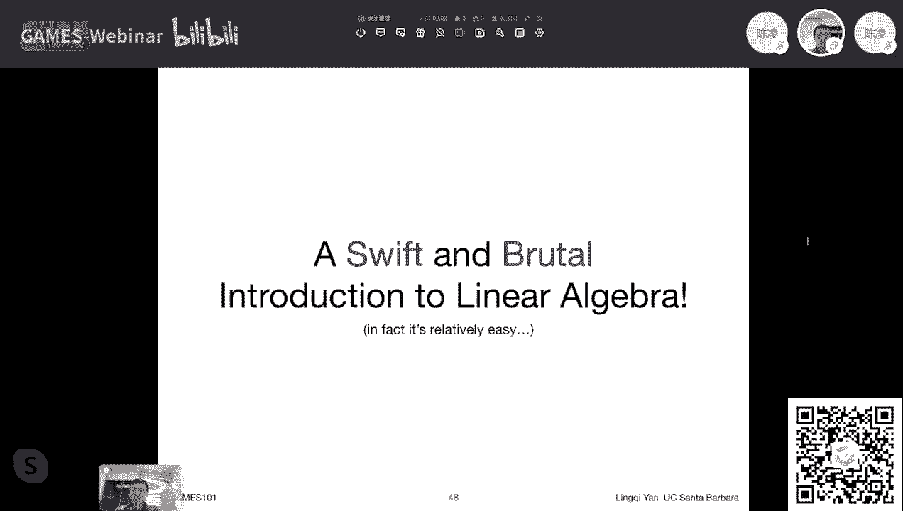

# GAMES101-现代计算机图形学入门-闫令琪 - P1：Lecture 01 Overview of Computer Graphics - GAMES-Webinar - BV1X7411F744

应大家要求，咱们往回退那么一点点啊，然后我刚才说到哪儿来着呃，算了吧，直接过一遍吧，反正挺快的，我是说啊欢迎大家大家这个共抗疫情，然后这个这个这个，这个大家都各自尽到各自的责任。

我这边呢就是能给大家提供入门这个图形学课，如果大家想学，那我非常开心啊，然后欢迎大家关于我，然后我是这个当了这个system professor，已经当了一年多了，然后之前是本科的PHD清华的本科。

然后这这是RESEAR，是个人个人主页，然后这个我是主要是做图形学中的所谓渲染，或者是这个啊这个啊绘制这个方向啊，然后各种各样的这个这个兴趣爱好，以及之前做的一些东西呢，被工业界拿去采用。

然后这个以及我是apex champion的，然后这个这个这个我们的几位助教同学，然后分别是这个刘广哲同学，石宇辰同学和邓俊辰同学，然后我们更多的助教会根据课程需求，然后来添加。

那么我们今天我刚才提到说，我们主要说这么几点，什么是图形学，为什么要学，以及课程的这个呃，有一些这个这个课程包括哪些东西，以及我们说课程的一些杂七杂八的，这个事情好吗。

如果有时间我们开始这个下节课的正式内容，然后图形学我刚才提到所谓合成和这个操作，这个视觉信息，这两样都非常重要，我们之后会这个都会提到这个事情好吗，然后那今天我说我们着不重来说。

这个就是说这个图形学到底有哪些应用。

我们为什么要去学习它，它到底好在哪里，对不对，那么刚才我们就提到这么一个事情，就是说呃给大家举个例子啊，这有一个只狼这么一个游戏，这个游戏呢大家都知道是一个不是都知道啊。

打过的同学都知道这是一个受苦的游戏，然后这个我也非常喜欢，然后呢这个这个游戏本身画面非常好，然后我正说到说，怎么才能辨别这个在现在这个时代啊，什么才是好的画面呢，假如说你这个平常一笑可能看不明白。

我就觉得他好，那从技术的角度上来说，什么是好的画面呢，我给大家一个标准啊，这个标准非常简单，就是这个咳咳就是直接看这个画面啊，是不是足够亮就可以了，为什么呢，这个体现了图形学中的一个。

或者说渲染中间的一个关键技术叫全局光照，如果全局光照做得好，那么整个画面就会亮，看起来就会很舒服，如果你看整个画面会比较暗，那么这个这个这个这个这个嗯，就会表现出这个一定程度上的技术不足，就是这个意思。

就是说纯粹从技术的角度上来说，这是一个不错的判定标准啊，也有可能啊，这个是这个算是这节课，就是说这个给大家普及的，这一系列的应用知识之一吧，这个以后我们会穿插着讲一些这方面的知识啊，然后这个。

那么我们说到这个嗯游戏的应用啊，这是第一，然后另外一个呢我想提的另外一款游戏，叫做无主之地三，然后呢这个呃无主之地三这个这个游戏呢，大家如果可以看到这个这个画面的话啊，啊应该是可以。

就是说嗯大家会看到这是另外一个风格，他和这个嗯只狼这个就完全不是一个风格，大家看上去这个这个图像啊，像是一种卡通的那种风格，就是说卡通这种风格，为什么你看着是卡通的呢，就是说在图形学中。

这个到底是如何通过什么东西来来，这个表述的呢，对不对，所以说我我这这一系列啊，都是这个我们这个在图形学中需要研究的，这个以及要解决的问题，那么这就是这个这是另外一个例子啊。

然后啊那咱们继续就是我刚才提到说啊，在这个电影里面，这个图形学得到了广泛的应用，然后这个非常非常早的时候呢，这个有一款这个电影叫做这个黑客帝国，然后黑客帝国是1999年的电影，大家想一想。

这已经过去了20多年了对吧，然后即便是今天来看，仍然是一个非常优秀的电影，特别是这些这个特效，像这些子弹时间，这些东西就是从这个电影里面衍生出来的，对不对，然后就是说关于这些这些这个人们把它管管。

它们叫做特效对吧，在电影里面叫做special effects，只是通过这个计算机图形学的技术，把它合成出来，并且和这个真实的演员的这些，真实的这些东西啊，这个这些这些这个呃实际存在的这些东西。

完美的结合在一块，让你觉得这个东西看起来非常真实，这就是整个这个电影这套特效的这套这个，工作方式，但特效呢这个是属于图形学中的一部分，但是特效这个事情我也多说一句啊。

就是说特效其实是最简单的图形学的应用，为什么我这么解释呢，当然个人理解啊，为什么这么说呢，因为它叫特效，因为你平常见不着它，对不对，你平常很难看到这种这种慢动作的这种电影，这个这个或者说这个录像。

说这个子弹是如何破空，然后这个如何形成这么一个这种空气的，这种这种这种波，然后你可以透过它可以看到这个不同，折射出来的这个物体对吧，你看不到，以及包括这个这个出现大爆炸对吧，这个这个坏人点燃了一个房子。

然后这个开始这个背对着这个这个这个房子走，然后从来不回头看，对不对，像这种情况，这你平常见过多少次爆炸，是不是，所以说像这种这个这个特效吧，包括这些爆炸啊，包括子弹啊。

包括111堵更强一般的这个这个浪潮涌过来，这个你平常见得非常少，然后平常这个这个如果做得不对，你也不会觉得有什么意外，所以这一点可能是，大家平常这个不会去往这方面想特效，其实最简单的，最呃最困难的东西。

往往是这个日常生活中大家常见的一些东西，然后比如说啊，咱们以现在的这个rendering这方面的研究为例，这是大家吃的这些食物，这些东西现在大家做的就非常的不好对吧，然后这个是后话了，就是从这一点。

这个电影都跟大家聊一句这个事情啊，然后电影呢还有另外一个里程碑式的作品，我简单给大家这个介绍一下，然后这个作品大家肯定啊，有很多同学都已经看过了，叫做阿凡达，然后这个电影里程碑式的这个原因啊。

是因为它引入了这个这个人的，这个看面部和动作捕捉，然后然后这个或者说他做得非常好，不是说之前没有啊，这个啊就是说在这个电影里面，大量广泛地运用这个技术，然后就是说由真人演员。

然后来这个做出各种各样的表情，然后直接可以反映到这个啊虚拟的人物中间去，那么这个技术是如何做到的，对不对，这个也就是说我们之后需要研究的事情，当然这不是这个一个简单的图形学技术，可以做得到的。

我们之后会慢慢的提到说，如何去这个这个做各种各样不同的动画，就是让这些这个虚拟的人物啊，在这个场景里面，不只是说我能够把它给这个显示出来，我还要明白他在不同的时间应该是如何运动。

那从演员的这个呃自身的运动中，这个是一个不错的，一个一个一个一个采集的办法啊，这是我们之后要说的一个事情，那么动画这是我要说的另外一个事情啊，动画呢这里自然这个也是不能忽视的，然后大家应该有很多同学。

这个看过这个ZUTOPIA啊，然后这个呃疯狂动物城啊，我要是没记得错，翻译的话，然后这个大家这个都会都很喜欢，毛茸茸的这个啊动物，然后这些小动物呢其实如果大家仔细看。

大家是真正可以看到这个一根一根的这个毛发，被这个做出来，然后显示出来很多跟不同的毛发，然后在一块儿会显示出一种什么样，什么样一种的效果，然后这个这个大家想想就觉得非常难，对不对。

你想一想这个动物身上有多少根头发呀，这个毛发呀对吧，像我们百万根够不够对吧，然后以及说这个每一根头发，他都要和光线去作用，然后这个光线和不同的头发作用，也就是说在不同的头发空间啊弹跳。

最后最后最后打到人的眼里面，我们知道人看到东西诶，为什么呢，就是因为光线进入了人的眼界，那么这么复杂的一个过程，我们应当如何去做，那这个就是我们之后要说的一个就是这个呃，首先涉及到几何这块。

如何去表述这么些复杂的这种几何形体，就像这种这个毛发这种，然后以及如何去渲染，把它给这个真正显示出来，然后计算光线在这些几何形体这个之间，这种传播方式，然后这个叫做渲染，然后这个呢我们之后都会都会提。

然后呢这个最最新的一个这个动画，也是奥斯卡的这个获奖者，这个冰雪奇缘啊，然后这个冰雪奇缘二，然后咳咳，这个当然这里面涉及到各种各样不同的技术，比如说呢这个大家看到ELSA，这个放出各种各样的技能啊。

然后这个可以看出这个，它它它这个各种不同的特效，比如说这个这个烟雾啊，这算是一个，然后就是说他这个不同的这种发光的，这种粒子啊，然后在空中盘旋啊，打拳啊，然后这种这种这个形成不同的这个。

这个不同的图案啊，像这些东西是怎么做出来的对吧，这些东西呢，自然就是说这个这个这个这个图形学下面的，另外一个重要的分支，咱们管它叫做模拟或者动画，然后这块就是在模拟这些东西，这个这这些微小的这些例子。

然后如何去运动，以及包括一些这个更大层面上的，比如说人物的这个衣服啊，在风的吹动下，它应该如何如何去变化，然后形状如何变化，以及说这个头发对吧，头发跟头发之间他们肯定互相有碰撞。

那么把这些东西真实的都模拟出来，那么我们就可以得到一个真实的这个，这个这个样子对吧，诶这里就是这个图形学也可以研究的东西，然后在这门课咱们也会给大家介绍一下好吧，然后呢再多给大家介绍一些别的东西。

比如说设计设计这个事情呢，这个这个事情大家可能听说过一个词呃，确切说一个缩写啊，叫做cad，叫computer aided design，然后就是说现在的这些设计，很少有这些手绘设计了。

基本上来说都是用电脑来辅助，那么这个设计可以做到什么，那我就举个例子，这里呢大家看到两幅图是同一辆车，只不过呢左边是这个电脑渲染出来的，这个假的啊，不存在，右边这个呢是真实存在的。

它是在这个AUTODESK公司的展厅，这个我还亲自见到过，就是它是一辆真实存在的一辆车子，号称是不同的地方，不同的部件，好像是3D打印出来的，然后把它拼成一块啊，这是一个真的车子。

然后他这个右边这幅它是真实的这个拍摄，然后他旁边呢就有一个电脑，这个电脑上显示的就是左边这幅图上，大家看到的东西，这个左边左边这个就是这个cg啊，computer graphics呃。

这个这个生成的这个这个呃车子，然后这个车子呢允许你做一些交互性的操作，比如说你可以移动它，然后你可以换各种各样不同的这个，这个这个环境光啊，就是说在不同的环境下，你可以立刻看到它长什么样。

唉这个就非常好，就是说关于这个设计呢，就是说可以设计各种呃嗯怎么说呢，就是从这一个例子我们可以看出无数的事情啊，比如说首先这个这个车子表面，它这种光滑的这种这种曲线，这个是如何设计出来的。

就是说它这个确切来说不是曲线曲面，他是因为在一个这个三维空间中的嘛对吧，他这个他这些面是如何设计出来的，然后呢，大家也知道，特斯拉最近推出一款这个非常丑的皮卡对吧，那那些面又是如何做出来的对吧。

这是这个是呃，我们都是这个图形学里面要研究的一个，几何的这些东西对吧，然后呢另外一个就光照，光照为什么这么多，在左边的这个cg这个图里面，那你可以动态的换一个光照，比如说就换跟右边这个实际的这个光照。

一样的光照诶，那我就可以看到一样的效果，那我可以把它放在室内，可以把放在把这个车子放在室外，然后放在不同的位置，我立刻可以看到不同的效果，那这样的话我就不用真的把这个车子拿过去，这个拿到不同的环境下面。

看它长什么样对吧，我可以拿这个可以在这个虚拟环境中测试，包括啊这个事情让我联想到另外一个事情，就是说有一些这个车子不是有一些啊，好像所有的车子都得经过这么一个这个，碰撞的检测吧，就是说车子做出来之后。

在实际这个上市之前，他们得这个这个把车子往墙上撞对吧，这这个这个这个应这么这这个这个烧钱对吧，然后就是说其实这些东西也是，在这个图形学里面，是可以这个通过这个模拟的方式，然后把这个整个一个这个车子与墙。

然后这个碰撞这么一个过程模拟出来的啊，就是说嗯这块呃，也是在背后有着各种各样不同的图形学的应用。

所以单从这一个例子，我们就可以看到很多很多不同的东西，那咱们继续啊，那这里大家看到的是一个什么呢，这里看到的是一个国外的这个家装网站啊，这叫做宜家IKEA，然后他这个网站呢他会给大家提供说。

就比如说我们设计出来一套厨房，然后这套厨房长这样，然后大家觉得啊看上去挺好的，然后这个这个比如说大家现在看到这个例子嗯，是挺好的，可是呢大家有时候可能意识不到，就整个这张图来说，它完全是由计算机生成的。

而不是一个真的这个这个装修的结果，就是说对于一些家具，然后这个整个一个这个室内这些东西啊，然后然后这个可能只需要这些艺术家们，把不同的这些部件，然后给摆在一块儿，然后给另一定的这种光照的条件。

比如说在这里，大家可以看到光线，主要是由右边这个大窗户进来的，然后呢进来之后会有各种各样阴影，然后这些在光线在这个图形中，各种各样不同弹跳，然后最后这个进入人的眼睛，这个过程呢叫做渲染render啊。

然后在这个宜家的网站上呢，75%都是这个渲染出来的，而这还是几年前的统计，我我我觉得现在可能会更多，然后国内呢现在也有一些类似的这些公司，类似酷家乐这种公司啊，在做这方面的事情。

就是说包括这些室内的这些设计，这些已经完全走入了，这个这个平常大家消费者的这个范围之内，然后大家可能平常甚至不太会去关注到，这个事情，但是这些都是图形学在背后的功劳啊。

然后嗯另外我们现在进入到下面一点啊，这个呃可视化我们提到可视化这个事情啊，就是就是说啊我们之前定义这个图形学的时候，我不知道大家这个还还有这个概念吗，就是我刚才说图形学啊，他会这个操作这个可视化的。

这些这些这些视觉信息，对不对，然后所谓一种一种这个实际的操作，视觉信息的方法，这个就叫做可视化，然后这个可视化就是把一些这个，比如说我们之前这个测量出来啊，这个呃人体。

人体呢经过一些什么三维的扫描和CT啊，或者什么什么核磁共振啊，这一系列的扫描，可以扫描出来很多这个三维空间中的信息，然后这些信息呢，然后我通过一定的办法把它变成视觉信息。

然后就是说这个这个就是说呢这个呃过程，我们就管它叫做可视化，就是有很多信息，比如说大家看右边啊，右边这个右上方有一个这个什么，这个应该是美国的这个呃雇佣的增长率，然后可以看到在不同的地方。

用不同的颜色来表示这个增长率，这一目了然，大家可以看得出来，然后下面是一些什么婴儿的这些成像，就是说这些在各个地方都会存在，然而然而这些所有的这些啊，这些可视化的这些过程，都属于这个计算机图形学领域。

当然最近啊这个可视化领域，这个相当于越来越多，在科研范围内算是独立出来，然后但是不管怎么样，从一个大的方向来说，这算是一个图形学上的一个重大应用好吗，就是这个也算是视觉信息的操作的一部分。

然后下面一个我要说的是这个呃，这个虚拟现实，大家可能平常已经听说过这个事情啊，就是说虚拟现实这个这个到底是干什么的对吧，就是说啊虚拟现实往往是和另外一个概念，叫做增强现实，叫做augmented。

reality叫A2，然后虚拟现实呢virtual reality叫V2，然后V2A2经常在一块提，那么它们有什么区别呢，这里就可以告诉大家没什么问题呃，就是呢这个虚拟现实就是说你看不到现实啊。

大家带一个这个头戴设备，然后大家看到的东西全都是电脑这个生成的啊，然后大家看不到自己面前有一个桌子，然后比如说咱们现在看到的这几位用户，互相也看不到对方，这个就叫虚拟形式，增强天使呢。

就是说你可以看到这个，现实中间的一些学习的东西，然后这个并且在这之后，你还可以看到有一些新的东西带进去了，而这个是增强显示，比如说我现在看到这么一个例子，就是啊这里是应该是微软的HOLLANCE。

他做的一个这个呃是一个嗯宣传片吧，然后嗯大家可以看到有一个这个办公人员，然后他再做一个这个摩托车的设计，这个三维的设计，然后他在桌子上立刻就可以显示出来，一辆虚拟的这个摩托车，然后这个就非常好。

就是说我这边设计的那边我就可以看到对吧，然后这个这个就可以啊，诶然后这样的话，这边呃，增强电池这块和虚拟现实这块具体有问题，但是不管怎么样，这都是普通设备，然后就是说呃会变成一个嗯最近啊。

最近建议有这种趋势，就是说大家原本都是在屏幕上面看的东西，然后建议大家在这个试图拓展，大家能够看到东西的范围，就包括这个心理建设，增量建设，通过投资设备，以及之后，大家希望这个完完全全的把这些东西当。

大家直接就可以看到这个三维，这个真实的世界中啊，嗯嗯哦好吧，我好像看到大家说有一些问题哈，嗯嗯OK好吧，世界上，那不管，那我们先继续啊，还是像刚才一如何，那我就再回头400块1。5杀，那虚拟现实。

增强现实，然后我们这里先给大家看一下，做这个这个应该对这个怎么说，对这个网速的挑战可能更厉害，然后这个啊，这里是在说一个什么事情呢，就是说嗯大家现在越来越多的用一些这个，数字的设备啊。

直接就可以进行这个这个画画，比如说像这里，大家看到的是有一位艺术家在用IPAD，然后直接在这个上面手绘一个这个，这个真实感的人像。

然后做的非常好，大家可以看到一个从这个这个不清楚在这个啊，然后这个非常非常这个细节化的绘画过程，然后嗯好吧，声音好了是吗，OKOK好好好可以，画面呢不是画面不动哦，这个是这样，这个画面哈哈哈哈哈哈。

是没错，大家能够认出这是哪位啊，嗯然后就是说啊，我就是说现在这个嗯这个数字设备，现在给大家带来了很多便利，然后就是说大家现在包括绘画，有很多事情可以通过这个电子的方式来完成。

然后绘画这个事情不容易，比如说大家可以看到，一开始，大家用手指在上面画了很多不同的这个道，然后比较粗，然后简单的画一下，打一下这个基本的底子，然后呢在上面呢这个这个胡子啊，头发呀，像这些东西。

大家可以用这个非常小的这种精，对这个精度非常高的一些这个笔触，然后在上面画这个东西，那么一个典型的这个工业界的例子，就是adobe的PHOTOSHOP对吧。

PHOTOSHOP就给大家提供一个非常非常强大的功能，能够对对这个这个这个这个数字化的这些图像，进行编辑，以及进行这个各种各样的绘画，所以说这个的背后也都是这个图形学的功劳，就是说这个呃我们之后的课程。

也会说如何去描述这个曲线啊，然后像这个这个如何去做这个呃所谓呃差值，以及说如何去做一些嗯，就是说不同的颜覆盖在一块儿，然后应该显示显示成什么样这种透明啊。

或者这一系列的东西，就是在这个背后存在着很多很多很多很多，图形学的技术，那么那好我看到大家说这个看到在画了是吧，这个动静非常小，可能这个这个呃传过去之后可能更看不到什么，咱们就继续了好吗。

那这个我刚才其实就已经在这个动画中，我就提到了，就是说模拟，这是另外一个非常非常重要的应用，这个模拟呢体现在很多方面，刚才给大家提到，比如说像特效，像这里呢左边就是一个沙尘暴的一个这个特效。

然后就要模拟各种各样的沙子，在这个空气中怎么样去飞舞，然后怎么样推过来对吧，然后怎么样去把这些房屋这个摧枯拉朽，对不对，然后这个这个这个房屋，为什么会这个这个这些不同的结构，会被打成一块一块的。

以及说这个木板中间会会怎么样去锻炼对吧，也就是说包括这个沙子落到了水里，它应该长什么样，然后像整个这么一个过程，这些都需要精确的物理模拟，然后咱们这个过程精确的运算出来，这也是一个同学的重要部分。

叫做模拟啊，然后或者或者早期有人管这个叫仿真，然后当然在这个在这个啊，在这个这个这个美工们的AA看来，这个叫动画啊，这都是一回事，所谓仿真模拟动画都是一回事，然后呢，呃右边这个呢。

大家看到的是星际穿越里面的黑洞啊，这个黑洞是啊，这个这个就是来看右边这个渲染，就是说这个当然这个是图形学模拟出来的结果，然后这和如果大家关注这个社会啊，就是说去年大家这个这个这个人类测出了。

这个黑洞长什么样，然后有这个呃黑洞的照片非常模糊，我相信这个照片模糊之后，其实应该从某个角度看上去，应该跟那个照片会比较相似，因为基本面都开始，然后就是说这个黑洞呢，这个钻石也是一个重要的模拟。

当然也就是告诉大家啊，模拟不仅限于说这个物体，这不吃如何和这个空间啊。

或者别的什么东西啊，我刚才提到说黑洞其实模拟的是光线对吧，然后模拟的并不是这个实际中的这种尘埃啊，这种物质，然后光线这个发生偏折，也就是说在这种情况下，我们不再假设光线是直线传播对吧。

这些都是一些需要这个精确模拟的东西，那咱们继续啊，就是模拟是一个重要的事情，然后这里呢提到一个一个概念叫GUI，这个g o i a graphics user interface，就是图形用户接口。

然后这是什么意思呢，其实就是不同的设计，就是大家可能有人用过这个Mac对吧，有人用过windows，然后有人这个这个用过这个LINUX，各种不同的发行版，然后这个大家会这个各有喜好。

觉得哪一种会设计的比较好，就包括这些设计，包括windows这个磁贴风格，包括这个Mac的这些各种各样的这种，这种这种设计，然后这些都是属于图形学的范畴，涉及到这个设计啊。

最近这个和这个可视化差不多是一个意思，这方面的研究进呃，呃最近应该是说这个呃开始这个独立进行研究，就是说关于这块设计的事情。

然后但是不管怎么样，从一个大的方向上来看，都属于图形学的范畴好吧，然后这里这个再给大家介绍另外一个事情，叫做这个topography啊，我们就简单管它叫字体吧，啊然后这个啊就是说啊关于字体方面的设计。

这个事情，可能我不知道大家意识到这个事情没有啊，比如说啊如果大家看一张图，然后咱们把它放大放大放大放大，然后最后会看到一个什么样的现象呢，就变模糊了，对不对，但是大家有没有试过说把这一个字体。

把这个比如说我打出来的一个一个字母，然后我给调字号调非常大，然后呢我这个这个这个就一直到非常大，最大最大这种级别，然后我还会发现简单也挺清楚的是吧，然后就是说这个字体到底是拿什么表示的。

这个和图像到底有什么区别，为什么他看得清楚呢，为为什么在任意放大的情况下，我都可以看到一个连续的这种曲线呢，然后为什么图我把它给放大了之后，这个它就不是呢就会变模糊呢。

这里就涉及到点乘和矢量这两个不同的概念啊，这个在之后会给大家来解释这个事情，然后呢这里多给大家普及另外一个知识哈，大家看到这句话啊。

The quick brown fox jumps over the lazy dog，所以这句话这个是一个是一个在字体测试中间，很常见的一个一个这个句子哈，这个我不知道大家知道这个为什么。

这里这里当然了，我这里问一个问题，我就直接这样吧，我就啊啊，我就直接给大家这个这个这个说说明理由吧，是英文啊，这句话他用进了英文中的26个字母，所以大家会会看到这句话通常会出现两次，一次是全大写。

一次全小写，然后呢这句话里面包含了26个字母，所有的26个字母都出现了一遍，所以说大家会用这个东西来测试，这样的话可以测试一个字体的完整性啊，这是为什么，用这个对没错，然后那咱们这个这块呢。

应用简单给大家介绍一下，然后呢这个我们这个正经一点来说啊，就是这个图形学他这个挺难的，然后为什么呢，因为它包括了很多东西，它包括了这个就是说你要研究啊，说这个和真实的世界，这个这个这个各种各样的东西。

在真实世界中如何去作用，包括这个不同的物质，我们刚才说到模拟说呃，以及不同的这个光对吧，然后材质，然后各种各样不同的东西都需要研究，如果我们研究不明白，那就很难把这个事情表示清楚对吧。

然后呢所以说我们需要对这个真实世界的理解，而真实世界的理解，这是一方面，相当于我们有足够的输出，然后另外一方面我们要输出，对不对，这个图形学最后要生成一些新东西，然后呢他这个这个怎么样生成新东西。

这是新的计算方法，然后怎么样把它显示出来，新的显示方法，包括这个什么，大家要有这个什么nintendo three d s啊，这个是是一款掌上游戏机，大家会发现啊。

裸眼3D这个技术大家最近也是在研究对吧，然后包括这个全息影像，这些都是新型的一些这个这个显示设备，在不同的显示设备下，这些东西要如何运作，我们提出的方法如何能够用在这些方面上对吧。

所以这些东西都加起来了，这就造成了为什么图形学会相对困难，但是我相信这节课呃，这这门课咱们学习了之后，应该大家会这个会意识到啊，图形学用到之前各种各样不同的知识，只要咱们把这些前面知识这个融合贯通。

而这些理解清楚这个事情并不难，然后呢图形学这个包括了具体哪些内容，这点呢给大家直接这个呃一带而过啊，就是说我们之后肯定都会说涉及到什么，各种各样不同的矩阵，各种各种各样的这个呃。

这个这个物理上的各种各样的这个光学啊，然后着色呀，然后这个怎么样去描述，以及操作不同的三维的形体，以及怎么样去做这个这个呃，动画与以及仿真对吧，然后这里有一点想跟大家提一下啊。

这门课里面这是也是我故意的，也是也是算是我这个对图形学的一个理解啊，我们不会去说怎么样去做这个硬件的编程，如何去写这个三维的这个这个应用，比如说我们真正的用什么open gl，大家会提到这个事情。

大家可能会觉得疑惑，可很快我给大家解释啊，然后咱们先过了这一点，然后这个我们回到这个基本问题上来，为什么要学习计算机图形学呢，那考虑到前面的所有的这些知识呢，然后咱们把它总结在一块啊。

Graphics is awesome，awesome呢，这个咱们这个这个这个这个中文呢就是厉害啊，就是就是非常好，就是说嗯酷炫对吧，总之就是一系列这种这个这个很不错的，这些这些词汇综合在一块儿。

然后咱们来形容graphics，我就喜欢生成这么些这个这个好看的图片，没问题，这是一个理由，总之就是说啊图形学是一个非常广阔的世界，然后这个呢这个大家就是说通过学习这门课。

也能够渐渐能够意识到这么一个事情，对好看就完事了，说得对啊，然后这个呃我看一下啊，大家这个这个事情嗯，好目前没什么问题，好像有同学提到open gl的事情啊，好那么我简单给大家这个解释一下。

好在这里应该大家会看到好，那么我们这里简单给大家说一下，这门课要包括哪些内容，就是说我们主要会说四个部分的内容嗯，第一部分叫光栅化，也就是说现在的大家提到的open gl以及所谓SHADER。

这些东西是如何运作的，然后会把这些给大家讲明白，然后呢这个曲线和曲面呃，然后然后这是整个一个这个几何相关的内容，也会给大家讲一些几何方面的前沿，然后另外一个叫做ray tracing。

所谓光线追踪要给大家这个讲到，说这个目前这个大家是如何在这个动画呀，电影里面生成这个这个呃真实感的画面的，就是通过这种光线追踪的方法，然后也会讲到一些稍微深入一点的话题，包括路径追踪。

包括一些更复杂的这个表面建模，以及光线传播方法，然后第四点会给大家讲这个动画与模拟，然后我为什么着重来说这个事情呢，就是这个嗯，就是因为啊，就是说我见到过很多同学学习计算机图形学。

学完了之后说问计算机图形学是什么，计算机图形学是open gl，那我觉得不对，不能这么理解，计算机图形学包括了很多东西，open gl呢仅仅是图形学中间的一个API，我们马上再接着说好吗。

然后就是说图形学包括了很多不同的，这，这至少这四个方面是目前我觉得呃非常重要的，也是这个比较热门的一些话题，然后我们挨个跟大家说，然后咱们现在开始来看对吧，这个第一块叫光栅化，什么叫光栅化，很简单。

把这个这个三维空间的几何形体显示在屏幕上，这就是光栅化，然后呢这个这个事情这个不容易啊，就是说这个是所有游戏，这或者说呢这些实时的计算机图形学，他们的一个主要应用，那么在这里给大家介绍一下什么叫实时呢。

实时在不同的这个领域有不同的定义，在这个计算计算机图形学习下面的这个呃，实时的定义呃，我们认为是每秒钟能够能够生成30幅画面，或者叫30帧，也就是30FPS，就是frames per second。

好吧，能达到这样一个级别，我们就管它叫实时，否则呢呃这个我们就管它叫离线啊，offline啊，然后就是说这个实时的图形学，会广泛应用到这么一种这个光栅化的方法，主要是要做投影，然后这个之后怎么做。

咱们再介绍给大家，然后呢关于几何这块着重介绍一下啊，如何表示一条这个光滑的曲线，然后如何表示曲面，如何用这个这个简单的这个曲面呃，然后通过细分的方法，然后得到一些更复杂的局面。

以及说这个在这个形状发生变化的时候，这些面要如何变化，然后如何保持住这个物体的拓扑结构，然后就是说很多这系列的东西会给大家介绍啊，然后啊然后光关于这个光线追踪这一块儿啊，然后这个是第三块需要给大家说的。

然后呃，嗯这块呢就是说现在动画和电影里面着重使用，因为它卖慢，但是它有好处，它能够生成非常真实的画面，大家可以看到这个右下角这张图啊，这看上去就会这显得这个非常美观。

其实大家可以可以生成这个质量更高的画面，然后这里是大家第一次在图形学中，听说这个事情啊，就是说图形学里面有很多事情，我们管它叫trade off，什么叫吹，什么叫trade off呢。

就是说唉有时候啊我为了达成某一个目标，不得不牺牲一些其他的目标，就比如说像这个光线追踪，光线追踪呢能达到好的效果，但是呢他就是卖就会存在这么一个问题，但是啊人都是贪婪的，对不对。

但我认为这个事情是好事情，正因为这个这样一个一个属性啊，才会让人这个认为，才会让人去寻找一些这个两全其美的解决方法，那么有没有办法能够让这个这个光线追踪，做得又像实时的这个这个光栅化一样快。

然后又能够达到这个光线追踪的这个效果呢，呃当然是有的，现在有新的技术叫做实时光线追踪，那么在这个这个课里面呢，也会给大家介绍好吗，然后这是第三块，那第四课呢，就是我们管它叫动画或者模拟或者仿真。

然后呢这个会讲到很多不同的东西，比如说大家嗯那扔一个这个弹性的球，这个球呢怎么样才能落在地上，然后如果被挤压，然后如何这个这个弹上去再下来，然后以及大家可以看到一个动画，如果网络还可以的话啊。

就是说这里是一个之前的一个这个论文，里面的研究，就是说他们把一块布这个挂好，然后真实的测出来，大家看到左边一列啊，是是照片，右边一列是仿真或者模拟，大家可以看到这个模拟的效果是非常非常。

这个令人惊讶对吧，然后所以说这个也是这个要给大家介绍的，而这已经是算是很早很早以前的技术了，现在来说这个这个只能会做得更好，所以说这都是需要给大家介绍的，没问题好，然后呢我现在简单给大家提一下这个事情。

我们这门课games101算是有了个克号啊，以后games还会有更多的课，然后这个101呃我们会说什么呢，呃嗯就是前面说的这些内容，那么不说什么呃。

首先这就是我要说的一个不说open gl或者direct x，大家打游戏会更多接触direct x啊，然后VONVON算是一个跨平台的一个，这个呃也是一套图形学的API，然后呢这里为什么不交。

这里其实说不是说这个事情难，所以不交，而是说我希望教大家的是这个背后的知识，就是说大家学了之后，大家就明白说这个三维到二维，如何能够这个做投影，如何才能够把真东西真正显示上，然而学完了这门课之后。

我们就可以可以运用我们所学的知识，立刻就可以掌握使用open gl的一些方法，也就是说open gl direct x Vulcan这类的东西呢，我们管它叫做图形学API。

我们用这些东西可以帮我们生成一些矩阵啊，或者什么东西，但是在这个背后，如果我们知道这个这个整个的一个工作原理，那么我们一定在学完这门课之后啊，我保证这个事情学完这门课之后。

你一定可以自己把open gl学起来，这点绝对不会有问题好吗，这就是为什么我们不说这个这个事情，然后这就是我经常说的这个事情，We learn graphics，Not graphics api。

就是这个意思，就是说我们不希望教大家如何去使用什么，大家明白吗，就是说我始终是这么一个感觉啊，就是包括大家学各种各样的东西，所以编程语言并不难，为什么呢，我只需要去应用它，而这个什么东西难呢。

在背后的算法，数据结构这些东西会困难对吧，道理是一样的，然后呢哎呀van对吧，我好像拼错了啊好吧，这个之后我稍微改一改啊，然后包括SHADER怎么样去写，这个没有没有关系啊。

这个就是说我们教的这套体系里面，一定会提及这个事情，只不过不会提及到具体的，比如说open gl对应的SHADER的语法叫做GLSL，然后或者HLSL之类的东西好吗，那咱们就这个不会说的一个话题。

那另外一个不会说的话题呢是这个呃，就是三维的建模或者是游戏开发，对就是说这块呢这块同样是一些工具，就是说我们只要掌握了，如何嗯这个玛雅或者这个max啊这些类的东西，然后我们这个学用这个东西学习一个星期。

我肯定可以去做一个这些简单的模型，至于你做的好不好，这个是另外一个事情，这个是处于这个是属于这个审美，或者说有没有这方面美工的天赋，这是这么个事情，但是应用这方面的软件。

只要你能够保证这个图形学的这个基本概念，能够明白，这块绝对不会有问题，然后呢，关于使用什么unity或者说unreal这个引擎，这些游戏引擎呢会包括很多不同的东西，你可以比如说就放置一个场景。

放置一个人，放置一些这个灯光，然后设置一些AI，然后呢这个就就可以正常运作呃，以及包括应用这些东西呢，我都认为这些东西算是相对比较容易的，然后就是说这个是大家看到的，这里这个人们可以用这些工具。

创建不同的三维模型，然后人们会这个设计各种各样的游戏，通过这个游戏引擎，然后呢，这里啊这里是另外一个，不会在这个这个里面覆盖的内容，然后呢我们另外再提到另外一个事情，就是说啊。

嗯图形学和计算机视觉往往会被混淆在一块，然后在这里，我希望把这个事情给这个，这个这个这个说得清楚一些，就是说在这门课里，咱们不会教计算机视觉，所谓视觉是什么呢，很简单，一切需要猜测的内容。

这个大家只要知道这个事情就好，一切需要猜测的内容，基本都是这个呃计算机视觉的内容，比如说呢我左边看到的左下角看到这张图，我要识别出哦，哪些地方是这个人，哪些地方是路面，哪些地方是不同的障碍物。

然后像这些东西呢，就是说我不可能有一个准确的答案，我需要这个一定程度上的猜测，那这些东西呢就是计算机视频，希望他理解这一系列的事情，分析理解这一系列就是计算机视觉在做的事情，然后呢。

嗯深度学习在这门课中，不会不会被这个呃特别提及，比如说你要知道任呃，这种什么什么什么什么干这种结构，然后这种结构呢可以用来生成非常真实的人脸，但是他也会失败对吧，就是说就是就是就是说这一系列的方法。

我们认为他是在这个图像的层面上进行操作，这个操作呢就不属于图形学的范畴，那么大概就是这么一个事情，涉及到理解猜测与这个意义这方面的事情，然后咱们不会去学习这个事情，然后如果想学的话，很简单。

这个这个计算机视觉的课程，我不知道我们会不会开啊，之后这个在这个后话吧之后再看，然后呢既然提到了这个事情，那我就希望把这个事情给说清楚一些啊，就是说这个嗯，我刚才提到说各种各样不同的领域。

它到底有什么不同的区别呢，对吧，我个人的理解，大家看这幅图，这幅图，其实大家其实网站其实能够见到一些类似的，但这里加入了一些我个人的分析在里面，嗯大家可以看到这个图的这个最重要的两点，一个叫model。

一个叫image，然后所谓model呢，我们更多认为，比如说是描述三维中间这个这个形状的，这些几何的形体，或者说是对于这个渲染来说，是描述它的材质或者光照这一系列的这些，这些怎么说呢。

就是一开始就有的在三维空间空间里面的东西，然后呢我们要把它转换成一幅图，然后这个呢就叫做这个计算机图形学，然后特指这个渲染作业，渲染就是要把这些模型然后综合在一起考虑，把它给变成一幅图。

然后这就是大家看到的正向的这个箭头，那么反向的箭头，从一张图我如何去识别出来，各种不同的这个模型对吧，就是我刚才说的这个这个语义分割，涉及到这个这个我要认出哦哪一块是什么，拍了一张照片啊。

这里面有一个桌子，有一个椅子，然后有这么些东西，然后就是说涉及到这些，这些就是从图像，我要分析出它到底是一个什么样的结构，这里就是计算机视觉，那么就是这两这两条线，另外两条线是一个环形。

大家可以看到在model这一块自己绕自己，就是也就是从model model，这是什么呢，这块我的个人的理解啊，这块目前来说应该是别人不会这么理解，但我个人的想法是，这块仍然属于计算机图形学的内容。

比如说我希望去描述三维的形体，我如何去描述，然后以及说我做三维空间中的仿真，我一堆这个这个这个这个沙子，然后或者说有什么油倒到面上对吧，然后像这种模拟，那我得到的仍然是模型，然后从这个过程中。

相当于我完全没有经历这个图像，或者这方面的事情，整个事情发生在三维空间中，然后这块就是我我理解的这块儿呃，这个model呃，或者simulation，这块的过程，然后同样这块也包括渲染一点点的知识。

就是说这个这个渲染这块呢，这个也包括涉及到对一些材质我如何去建模，我如何去研究这些不同的材质，如何与光线作用，那这些都是与图像无关的内容，那么整个这一块呢我们认为它是computer graphics。

也就是图形学，那么在图像到图像这个圈是怎么理解的呢，这块呢之前有一个应用，人们管这块，很多人哈管这块叫做计算，摄影学，叫computational photography，我觉得这是一个不太好的应用啊。

就是说计算摄影学更多的是研究，如何去用不同的这些这个呃呃，如何去用不同的这个呃这个摄像方法，捕捉方法，用不同的摄像机，然后用这个测量不同不同，各种各样的这些关于光学的这些属性，拍摄各种各样不同的图。

比如说我们要拍光线在一个极其微小的时间内，传播的这个这个这样一些图，然后就是说类似的这些方式叫做计算摄影学，然后在这里从一张图到一张图，我认为啊嗯以前我们管它叫图像或者视频处理。

现在更多的是大家应用和计算机视觉，完全相同的方法，然后就是目前来说呢，更多是依赖于深度学习，然后去分析这个这个呃，这个这个图像从一幅图变成了一幅图，比如说咱们可以从这个呃这个这个一个人脸。

变成了另外一个人脸对吧，然后像这些在图形领域上操作的，在中间涉及到，仍然大家可以意识到这个事情对吧，中间涉及到一些猜测，涉及到一些这个推断推理，这些东西就会更多地运用到这个呃，计算机视觉的知识。

那就这是一个计算机视觉的一个经典应用，然后这个刚才有同学提到说三维重建，说给你一张图，你要把它的三维模型给推导出来，当然是计算机视觉，对不对，因为你从一张图要推推出它的三维的结构。

这个正好就是向左的这一道计算机视觉的，这么一个这个连接，那当然了，纯粹个人理解啊，这点跟大家说清楚，就是说我对这些的把握，我我是否有能力能够能够定义这些这些方面，这个不清楚，就是说我只是给大家解见识。

呃，怎么说呢，介绍一下嗯，这个是我自己心里面是怎么想的，但是有一点现在的这个这个生活中啊，就是说它涉及到科研，涉及到这个各个方面，就是说嗯像这些明显的边界已经越来越模糊了，有一些问题你可能说说不准。

它到底是属于一个什么样的过程，比如说图形学里面我们要应应用深度神经网络，这个怎么怎么算，然后以及说这个嗯A2V2，就是虚拟现实这块的应用呢，我们要先用计算机视频去视频，去识别出来一些东西。

然后再把这些东西拿到的这个新的东西，这个放进这个虚拟场景里面去，那这样一来呢，就是说又涉及到这个这个计算机，视觉和计算机图形学的结合，所以一方面呢这些学科之间结合越来越紧密。

另外一方面他们界限也越来越模糊，所以其实这个理解来说呢，只是说给大家做一个这个参考好吧，这个之后在这个在这个嗯这个实际的过程中，咱们再去慢慢体会，那么这个这个是简单给大家多说一些，这个这方面的理解。

那么我看一下啊，好像这个这个这个这个挺好的，然后这个目前好像，大家没有什么特别大的问题嗯，A2是不是两方面都要是的啊，没问题，然后那咱们再继续好吗，这个我希望就是把这个各方面说清楚对吧。

然后咱们已经说到了这个课程会包括哪些内容，不包括哪些内容，然后咱们最后呃提到这个事情，就是说关于课程的一些这个具体的细节，首先呢我们之前说了，这门课既然不教大家用open gl。

然后这个教的是背后的这些知识，然后不涉及到这个硬件的编程，所以回去不要骗你们的家长，说我们这门课要写这个这个这个图形学的作业，然后我们要买一块2080ti，我知道你要打游戏啊，这个这个这个你用不着。

这是一个，然后这个这个课呢，然后涉及到这个中文课，然后如果大家这个之前找到过这个英文课的，这些课件或者什么，没没有没有问题，大家拿过去用，但是有一点就是说这个课每一次都在更新换代。

然后像这次比如说我们第一讲就改了不少内容，然后这个这个我在课程结束之后，会把这个PPT形式的这个呃，会把这个PPT讲义以这个PDF形式放在课程网站上，那么课程网站就是我要介绍的另外一个事情，对吧。

然后呢，这个啊这个这个课程网站，大家可以通过我个人的网站直接找到啊，在提醒这一栏直接就可以找到games101，那么嗯这个很多信息，我们这在课程网站上直接就会有，包括这个课程大纲，包括这个课程结束之后。

我们就会这个放出来这个PDF对吧，包括这个讨论信息对吧，然后这个这个各种各样东西都有，然后呢再给大家举个例子，就是大家会看到这个这里是英文的一个例子啊，就是说我们每一周结束之后，会在这个对应的这个课。

后面加一个这个PDF这个链接，然后呢，这就是这节课我们这个涉及到的一些内容，然后我们把这些这些，这个这个最后肯定是都会把这些PPT给大家，这是最新的这个版本，那么另外一点就是在每一节课的开始。

我尽量早的把这个阅读内容给大家，这个拿出来什么阅读内容呢，我们待会儿会说有本书，这个是嗯不是说这门课需要的教材，但大家如果想学习是完全可以买来一看的，当然这书挺贵，然后这个马上再说。

就是说对应到这个每一节课，我们要说什么，如果你可以提前先看一看这个书对应章节，这都是我选出来的，应该会有所帮助啊，当然不做任何强制要求，然后呢这本书是什么书呢，就是所谓the tiger book啊。

虎叔啊，这个大家平常这个这个这个这个口语里面，这么说啊，然后就是说这个只是作为一个推荐，或者说辅助的一个读，然后如果大家这个找的话，应该是可以找到，然后这个这本书应该是挺有帮助的，然后我这里显示的啊。

显示的是第四版，实则是大家用第三版就已经足够了，然后第四版当然好没问题，然后但是我之前可能大家看到课程介绍了，我之前提到过这个事情，这个第二版呃，这个嗯不不不是这个意思，就是说中文版只有第二版。

这就不太好，所以说如果大家有中文版的话，对照着英文版读一读倒是可以，然后但是其实英文版写得非常好啊，这块并不是什么太大的问题啊，然后呢唉这里就是这个这个这个关于这本书。

然后呢我们还有一个在线的这个答疑平台，这个平台的链接写的也有，然后之前大家也收到了各种各样不同的广告，然后然后这不叫广告吧，就是跟跟大家说一说，我们这个平台上线。

然后就是说这个平台是在games的官方网站上，大家就可以直接找得到啊，大家不用记这么长的这个这个这个链接，games gcn点ORG，然后直接可以找到讨论群，不是能看见吗，讨论群里面。

然后大家可以只看到这个事情，然后大家欢迎大家积极踊跃这个问问题，然后我们的助教包括我，然后这个只要有时间，肯定给大家来回答这个事情好吗，然后呃嗯好，然后这里我看一下啊。

大家同学有疑问再问这个英文版要看第几版啊，只要大于等于第三版就可以好吗，然后嗯嗯好吧，这个这个这个嗯好，其他没有什么太大问题，然后这个作业作业呢嗯这里给大家说清楚，这次我们我们作业呢是按周来算。

每一周有一个小作业，然后这个小作业呢是已经给大家提供好了，代码框架的，然后大家只要在这个代码框架上面呢，做那么一点点这个这个呃改动就可以了，然后呢作业有明确的描述，你需要干什么。

然后你需要得到一个什么样的效果都会写清楚，然后就是说呃，你需要的就是掌握这个提供的代码框架怎么用，以及快速的把这个我们上课教的这个内容，把它实现进去，然后每周会有一次。

但其实第一周甚至第二周结束都不会有，然后就是说我们这个呃总共有七次小作业，就是这个意思，然后然后这个语言呢是要求用C加加，这个马上再解释啊，就是说正常情况下这个代码的工作量很少，然后只要你理解的对啊。

正常每个星期新写的代码应该不超过20行，应该就可以解决的掉，然后呢，我知道这个这个可能有同学会觉得，这个这个这个C加加啊，这个觉得觉得很头疼，然后可能说自己这个本科的时候。

或者或者说呃以前没怎么太接触过这个事情，然后呢一方面我想说C加加，这里呢我们提供这个框架之后，你需要用到的知识并不是超级多，比如说特别复杂的一些指针啊，这些什么操作你用不到，然后呢就是就是说正常写的话。

我们也有非常不错的库可以用，比如说我们我们的这套这套这个作业里面，用了一个叫做ion的库，是这个是可以做各种这个方便的，这个矩阵和这个向量的运算，所以不存在任何问题。

那么有同学问我们能不能用这个Python呢，嗯不行，不好意思，这个是为什么呢，因为Python实在是太难，就是说你单写一个空循环，咱们别的不说啊，你想生成一幅图跟屏幕一般大分辨率，1280×720。

然后然后刚loop1些空循环，你就已经做不到了，那你肯定会问，那我如果做这个数组的slice操作，然后我不用for循环，那你既然有这个本事，干嘛不写C加加呀，对不对，这样想。

所以说我觉得这个这个这个这个呃，呃没有问题啊，C加大家没有任何理由去惧怕它，当然用它的好处是，现在几乎所有的工业界都是在用，这个C加加语言，来进行这个图形学方面的编程的，所以说这块应该是应该是很有用的。

然后作业啊，关于作业框架呢，多说一句，这个作业框架我们会提供这个作业，作业框架是指代码的框架，我们同时还会提供一个虚拟机，这个虚拟机我不知道大家用过没有啊，就是说虚拟机。

相当于是你在任何的操作系统环境下，都可以做出来，一个这个这个操作系统中的操作系统，这个呢环境是给大家配好的，大家拿到这个这个这个这个框架，然后拿到虚拟机里面立刻就可以用，立刻就可以着手开发。

我觉得这个就非常好，然后就可以省去大家的各种各样编译啊，各方面的这方面的这个这个事情对，然后呢就是说就是说这个嗯这方面啊，我觉得我觉得应该不会有任何问题，就是说起步来写这个代码，然后应该是可以的。

然后如果要有疑问的话，也也欢迎去这个这个论坛上面去问题吧，没有问题，然后呢这个关于提交，我们设置一个这个这个这个时间啊，就是说这个嗯嗯就是我们设置某一天吧，这个现在还没有定，目前还没有作业。

某一天可能是我们今天直播的头一天，也就是北京时间的周一晚上11：59吧，在这个之前把它提交这一次作业，然后并且在这个时候，应该下一次作业会由这个助教放出来，应该是这么个意思。

然后我们的作业会在一个星期内批改，并且返回给大家，然后就是这么个意思，然后呢大家可能会问，这个作业我是不是一定要写，不一定啊，真不一定，就是说如果你要写，那么就按照这个规矩，咱们严格执行。

然后这个助教会给大家这个辛苦的批阅，然后我自己也会看，然后这个这个这个这个可以多长进，然后如果你觉得听一听，其实也就这个挺好，呃，我觉得没有任何问题，就是作业绝对不做任何强制要求。

所以这个课就是呃这么个安排方法，然后呢呃这里给大家说一下，我们已经有了一个作业的这个呃提交网站哦，在这之前啊，就是我们助教会把这个关于这个作业的这个呃，虚拟机啊，以及这个这个框架这些东西提供出来。

所以这个大家不用这个担心啊，然后这个嗯我们的作业提交网站，用的这个叫做私车会议系统，然后这个嗯这个挺好用的，大家把这个链接给抄下来，这个就可以直接访问，然后注册就可以。

然后之后的这些作业我们会这个陆续的放出来，然后也会给大家通知好吧，然后呢我们再提一个事情啊，这个课没有考试，只是必然的，这是网络课，然后呢这个呃我们最后呃试图做一个大作业。

然后呃嗯这个大作业是做什么的呢，就是说我们从这个课程差不多中段开始，就开始给大家提供一些这个想法，就是说有很多东西啊，大家学了这门课之后可以融会贯通，自己做一套自己的这个酷炫的东西展示出来。

我就是始终这么认为，就是图形学这个东西，如果你做出来的东西不好看，那这个是没用的，对不对，就是说我们需要一些这个这些办法，然后把自己学的这些东西融会贯通，并且炫耀出去，那就是做一个大作业。

然后想做什么做什么，只要和这个这个这个课程内容相关就好，然后呢呃这个做的最好的一些，然后我们会把它选出来，然后公布在网上，然后这个这个炫耀到这个诶所有人面前啊，非常好，然后我觉得这个是好事情。

然后嗯嗯多说一句啊，现在我们正在讨论这么一个事情，就是说做了作业的同学，是不是应该得到一些认证，比如说我这门课算是这个在按部就班学习了啊，是我们在讨论这个事情，按说应该也会这么做，然后大家敬请期待好吧。

然后这个反正现在还没还没开始作业呢，然后这个我们在这个陆续安排下来啊，嗯大概是这么安排，然后关于作业我这里再多说一点啊，啊这个嗯非常重要的一点，请大家一定要使用集成开发环境，也就是IDE。

然后呢这个这个ID是什么，就是英文缩写集成开发环境，然后这个这个这个这个我为什么要这么说呢，就是因为一个好的集成开发环境，可以给你一个这样的功能，你把大家拿到的这个作业框架给拿下来之后啊。

然后你它会自动的分析，这个这个框架里面有各种各样不同的东西啊，然后然后这个不同的文件，不同的类，然后怎么样定义的，然后怎么样应用，它会他会在你写代码的时候就直接告诉你哦，你逮一个什么什么点什么。

然后他会告诉你有有哪些函数可以直接用，然后呢哪些这个这个这个这个呃，比如说语法错误或者什么，他会直接告诉你，这所以非常方便，那么呃在这里推荐一些这个IDE，就是说如果你用windows。

如果你不用我们的框架，当然没有啊，不是框架虚拟机啊，当然没有问题，你可以自己配制一下这个visual studio，然后这应该是毫无疑问，应该是最好的这个这个id。

然后然后visual studio code的话，这个是一个也是微软推出来的这个跨平台的id，然后这个也非常好用，然后这个呃我觉得嗯都可以，然后比较推荐我自己，以前我一直在用这个qt creator呃。

当然再给大家多说一句，这个qt啊，它不叫qt，它的官方念法叫cute，就是那可爱的那个念法，然后这个当然我们大家平常就这么白着念啊，Ppt creator，然后我自己平常用，但不用它开发PPT。

只用了只用它来这个分析工程其实挺快的，然后这个无所谓啊，就是说这个嗯给大家这个再说一下，我不推荐的id啊，但是这个我说清楚不是因为他们不好，而是对C加加编程并不是特别好，而且还是个人体会。

首先个人不喜欢CLINE，为什么ma这一点非常不好，然后这个影响你的这个这个编程的这个，这个感受，然后eclipse也非常不好，因为它的代码分析做的不好。

然后eclipse对大家都知道作业java是非常合适的，对不对，然后我另外多说一句，非常非常不建议大家用sublime text或者是什么，这个windows下面是不是有一个叫notepad加加。

然后叫什么VIVM，这是LINUX下面用的东西，IMAX也是，然后呢这里写得清楚，我知道这些不是IDE这些，它本身确实就是去去都是这个编辑器，那为什么我要说这个事情呢，这不是拉仇恨嘛，对不对啊。

这个事情给大家说明白，这个我一开始呢大学本科的时候，我接触的教育也是这样，就是说咱们要把这些这个这个自己的编程水平，锻炼上来，咱们要强迫自己，不要用这些IDE让它提示我们。

我们要自己用自己的能力把它写写写，这个这个写对对吧，这点是对的，没有问题，然后呢，这个嗯这个这个这个呃，就是说经过一段时间锻炼之后，特别是以后大家走向工作岗位之后，会开发各种各样大量的庞大的工程。

像这种庞大的工程，对于这些这些单薄的文本编辑器来说，它们的功能可能就达不到，比如说sublime text，可能有同学会告诉我，他可以装一些插件，可以过来这个识别一下，这整个一个工程都有什么。

但是毕竟不好，没有这个这个专业的做IDE的好，能够增加你的编程效率，为什么不去用呢，对不对，然后呢，像vim和EMAX这两边本来就要打架了，我们我们用什么样的这种编辑器对吧。

然后这个而且好像用vim和EMAX，大家都会觉得不应用visual studio啊，大家这个嘲笑这个微软，这个各种各样的这些事情啊，毫无必要毫无必要啊，多给大家说一句，咱们知道这个有一个词啊，叫做极客。

在中文里面极客，然后它是英文的geek的这个这个这个音译对吧，但这geek是由哪两个词组合而来的对吧，然后我直接给大家公布答案啊，第一genius天才，第2freak，所谓怪胎就是这个意思。

可能程序员啊很多这个是这个情况下都会，这两方面多少都会有一点程序员有自己的怪癖，比如说这个平常不太会用这个IDE啊，这个就是一个一个方面，这方面的并不好，作为这个老师来说啊。

虽然我没什么这个这个这个太那个了，这个这个这资格去说，大家不要用这个呃这个这个文本编辑器对吧，然后但是我是建议啊，我是建议大家把这个geek中的genius，这一部分学会。

而不要去学这个freak这一块，毫无比嗯对吧，能把自己的这个编程水平这个真正的练上来，能够通过这个IDE，咱们能把这个图形学的这个工程做好，何乐而不为，对不对，这个然后这里说一下啊，对于这个啊。

我们的虚拟机里面，这个大家用visual studio code其实就非常好啊，这是跨平台的，否则的话，visual studio你可能自己得配制一些编译的东西，那咱们再回到这个视频上来好。

那么这个啊Mac上面我同样推荐visual c，对对code应该是有的吧，我记得是好，然后呢，那这是这个建议大家用这个，然后不管怎么样，这是网课也好，但是不管怎么样，学术诚信是必须得强调的。

首先关于你的作业独立完成，一定要独立完成，不要去这个复制别人的，那就没有任何意义了，就是说希望大家能够把这门课给学明白对吧，通过自己的这个这个努力把这事情做好，另外两个事情算是请求啊。

一个事情是我们这个这个这个代码框架，给大家提供了之后，涉及到代码框架应用呃的这些作业，希望大家都嗯不要把它给发布在网上，因为这样的话可能会有一点这个啊，这以后的话可能就不太好用。

就是如果同学能够找到以前同学们的代码的话，就是嗯这是一点，然后另外一点就是嗯大作业，如果你自己做一套新的什么东西，那随便没有任何问题，然后另外一点呢，如果你有这个呃做好了的作业。

然后比如说同学们有同学在这个BBS里面去问，然后呢就给大家回答，如果你愿意回答，就给大家回答到这个问题，就是说诶这个问题是怎么样的思路，应该如何解决，你的问题到底出在哪，但不要贴代码。

就是贴代码这个事情呢，就是说这个这个帮帮助不了别人，就是说我希望大家有一个积极踊跃的讨论和解，释的一个环境对吧，这个应该是没什么问题好，那这个这里说到这儿，然后这就是这个这个目前来说看看啊。

现在啊应该是没问题，然后这个啊我们这个原本打算，原本打算这节课如果讲的快的话，如果不涉及到各种各样这些，这个这个技术问题的话，那咱们就开始说这个线性代数入门，然后本来是下节课这个给大家说这个事情。

那看来那没办法了，他这个这个这个这个这节课就起不了头了好吧，然后大家可以看到这个标题嗯，这个a swift and brutal introduction还是很猛的啊，这个当然了，其实挺挺容易。

咱们下节课再给大家，这个这个这个好好介绍行吗，然后我这个下节课应该会说的相对简单，然后咱们由由简单到难，可能到了第四课会渐渐的变得难一些，然后呃课程大纲这边都有。

咱们下节课就把这个线性代数简单的复习一下，然后应该不是什么太大问题，那么行哎呀，这就被迫拖堂啊，人真糟糕，唉行吧，那那是这样哈，那感谢大家这个大力支持，那我这边现在给大家这个这个这个。

把这个编程PPT发给助教，然后我自己在课程网站上，我立刻就现在把它给上传上去好吧，那就是今天这个课，抱歉这个网网络这边影影响这个有点厉害，咱们之后尽快的把这个问题解决掉好吧，那那就是这样。

