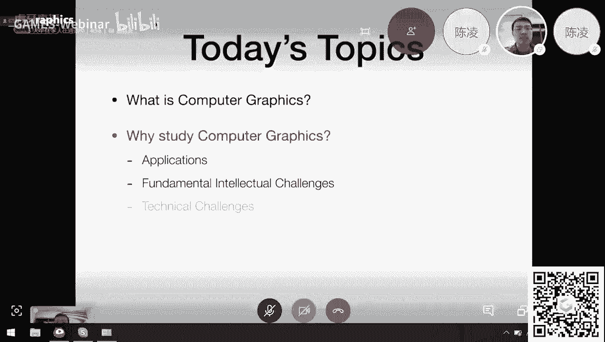
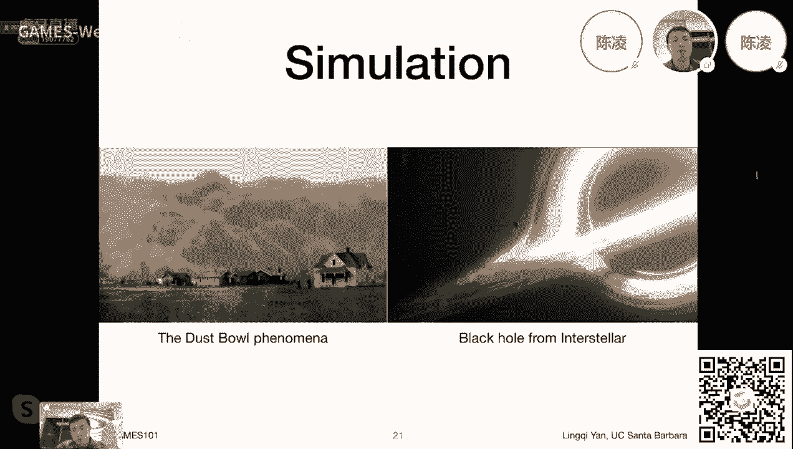
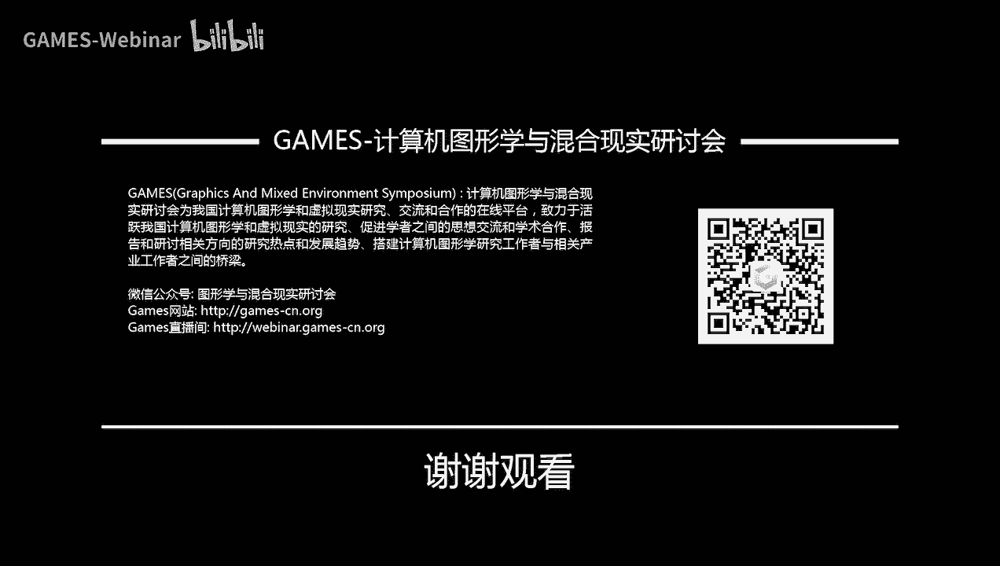

# GAMES101-现代计算机图形学入门-闫令琪 - P1：Lecture 01 Overview of Computer Graphics - GAMES-Webinar - BV1X7411F744

## 概述

在本节课中，我们将学习计算机图形学的基本概念、应用领域以及课程内容安排。

## 计算机图形学概述

### 什么是计算机图形学？

计算机图形学是研究如何利用计算机技术生成、处理和显示图形信息的一门学科。它包括以下几个方面：

* **几何建模**：研究如何表示和操作三维空间中的几何形体。
* **渲染**：研究如何将几何形体转换为图像，包括光照、材质、阴影等效果。
* **动画与模拟**：研究如何使物体运动，并模拟真实世界的物理现象。
* **可视化**：研究如何将数据转换为图形信息，以便于分析和理解。
* **虚拟现实与增强现实**：研究如何创建虚拟环境，并与之进行交互。

### 计算机图形学的应用

计算机图形学广泛应用于各个领域，包括：

* **游戏开发**：例如《只狼》、《无主之地3》等游戏。
* **电影制作**：例如《黑客帝国》、《阿凡达》等电影。
* **动画制作**：例如《疯狂动物城》、《冰雪奇缘》等动画电影。
* **工业设计**：例如汽车设计、建筑设计等。
* **可视化**：例如医学图像、气象数据等。
* **虚拟现实与增强现实**：例如VR游戏、AR应用等。

## 课程内容

本课程将涵盖以下内容：

* **光栅化**：将三维空间中的几何形体显示在屏幕上。
* **几何建模**：表示和操作三维空间中的几何形体。
* **光线追踪**：生成真实感图像。
* **动画与模拟**：使物体运动，并模拟真实世界的物理现象。

## 课程安排

* **作业**：每周一个小作业，要求使用C++语言完成。
* **大作业**：课程中段开始提供大作业想法，学生可以自行选择主题进行创作。
* **讨论平台**：提供在线答疑平台，学生可以随时提问。

## 总结

本节课介绍了计算机图形学的基本概念、应用领域以及课程内容安排。通过学习本课程，学生可以了解计算机图形学的基本原理和应用，并掌握相关技术。