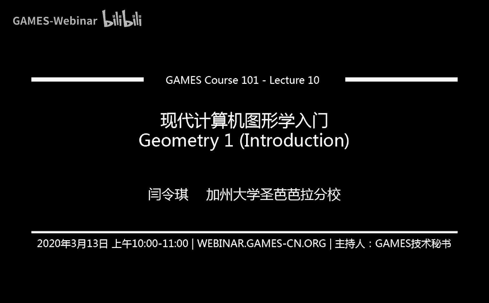

# GAMES101-现代计算机图形学入门-闫令琪 - P10：几何1（引言）📐

感谢大家的支持，今天开始第十节课。这意味着今天的课程结束后，本课程就过半了。本课程正常安排是20个课时，可能会增加一节，目前进展一切顺利。

今天我们将开始一个新话题：几何。几何部分会占用几节课的时间。大家可以看到下方的四幅图，它们概括了本课程的主要内容：光栅化成像、几何（用曲线表示的蝴蝶）、光线追踪等现代化图像生成方法，以及动画与模拟。今天我们先从几何开始。

在开始之前，先补充一些课程内容。今天会先讲完上次未讲完的纹理应用部分。一些稍高级的话题，如生成阴影、实时渲染框架中的近似动态全局光照等，会放在后续讲解光线追踪时一并介绍。本课程进度比英文版快了一节，我们有时间先讲完基础知识。几何与光栅化、光线追踪都密切相关。

课程开始前，照例宣布一些事项。作业三已发布，助教更新了框架并做了一些改动，请大家在BBS查看。BBS还新增了常见问题（FAQ），可以帮助大家避免常见错误。此外，很高兴有两位新助教加入：与朋同学（北航）和郭文轩同学（浙大），他们的联系方式已公布，有问题可以咨询他们。

今天的网络状况可能不佳，但我会同步录音，后期制作视频时会使用我的录音，所以问题不大。

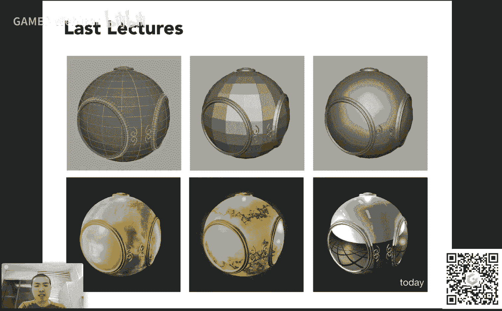

回顾之前的内容，我们花了两节课讲着色模型（如Blinn-Phong模型），讨论了着色位置、计算机硬件如何着色，并重点介绍了纹理映射，即用纹理定义顶点属性。上节课还讲了如何在三角形内部进行插值（使用重心坐标），以及纹理映射的挑战：纹理太小时需要插值放大，纹理太大时则需要范围查询。Mipmap是一个很好的结构，能快速进行近似的方形范围查询，它通过生成多级纹理（类似图像金字塔）来实现。有同学提到纹理尺寸不是2的幂次方怎么办，这涉及具体近似方法，本课程主要关注理论可行的2的幂次方情况。

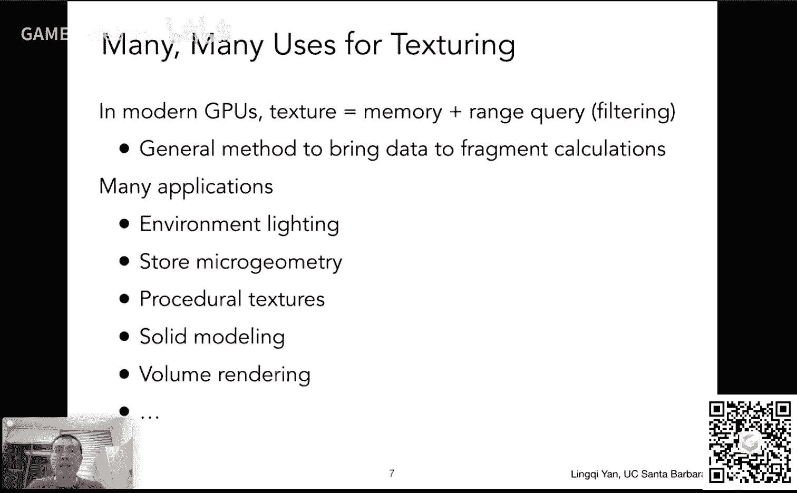

今天我们将接着这个话题，完成纹理部分的讲解，这样着色部分就暂告一段落，之后我们再进入高级部分。

## 纹理的高级应用 🖼️

根据前几节课，给定一个网格，我们可以进行着色。可以做平面着色（flat shading），得到格子状效果；也可以做平滑着色（smooth shading），在顶点计算法线，在内部插值，然后在每个像素进行着色，得到平滑效果。在此基础上，可以贴上纹理，得到带有不同颜色但又有明暗变化的表面。当然，我们可以使用各种不同的纹理。

今天要介绍的一个纹理应用是：如何让一个球体反射出类似天空和地面的环境。这就是**环境光照**（Environment Lighting），也叫环境光映射或环境贴图。

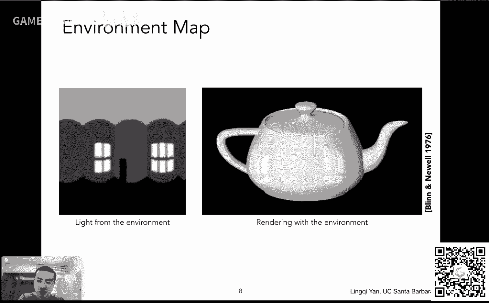

接下来，我们将探讨纹理的其他应用，然后进入几何部分。

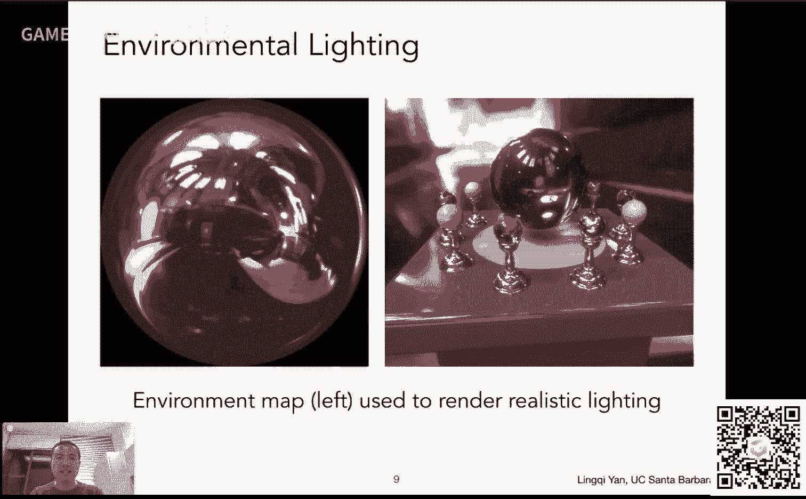

### 环境光照（环境贴图）

首先概述一下纹理。纹理本质上是一张图。纹理可以进行各种操作，如Mipmap。由于Mipmap应用广泛，现代GPU硬件都支持。在现代GPU中，纹理可以理解为一块内存，支持快速的点查询和范围查询。因此，纹理可以被看作是一块数据，可以进行不同类型的查询，而不仅限于图像。

从这个角度出发，纹理可以表示很多东西。

例如**环境光照**（环境贴图，Environment Map）。想象你站在一个房间里，来自四面八方的光都会进入你的眼睛，这些光可能是直接光源，也可能是反射光。如果记录下每个方向来的光，就得到了环境贴图。

左边这幅图描述了一个房间内四面八方的景象（类似展开图）。我们可以用这幅图去渲染一个物体（如茶壶），让茶壶被这个环境光照亮，即反射出来自各个方向的光。可以看到茶壶上反射出了窗户、门等结构。这说明我们可以用纹理描述整个环境光，并用它来渲染其他物体，这比单一光源效果好很多。具体计算方法后续会讲。

这里有两个要点：
1.  这个茶壶叫做**犹他茶壶**（Utah Teapot），是图形学中广泛使用的经典模型。其他经典模型还有斯坦福兔子（Stanford Bunny）、斯坦福龙（Stanford Dragon）和康奈尔盒子（Cornell Box）。
2.  使用纹理描述环境光时，有一个隐含假设：**环境光来自无限远处**。我们只记录方向信息，认为在活动范围内，来自同一方向的光照强度相同。如果房间较小，从不同位置看墙上同一点，方向会变化，所以严格来说光照应由方向和位置共同定义。但环境贴图简化了，只记录方向信息。

### 球面环境贴图与立方体贴图

如果能把环境光记录在纹理上，就可以用它渲染。另一个例子：在一个房间里放一个光滑的金属球（镜面球），它反射出的就是整个环境。这给了我们一种存储环境光的方法：**将环境光记录在球面上**，然后像展开世界地图一样展开它。

这就是**球面环境贴图**（Spherical Environment Map）。我们可以用鱼眼镜头或多张照片合成360度全景图来获取。但球面展开图存在**扭曲**问题，类似于世界地图上高纬度地区面积被压缩。

解决方法：不把信息存在球面上，而是存在一个**立方体**的表面上。从球心向球面某点连线并延伸，直到与包围球的立方体表面相交，将信息记录在立方体交点上。一个立方体有六个面，所以会得到六张图。

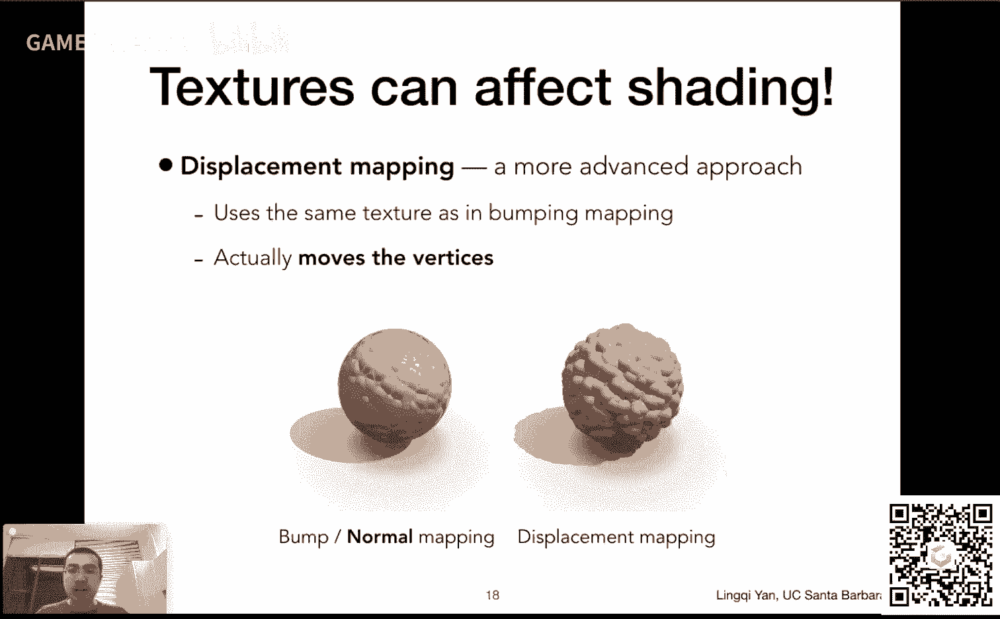

将立方体展开，就能得到六张环境贴图。这种方法扭曲较少。当然，查询时需先判断方向对应立方体的哪个面，但计算很快。这种方法称为**立方体贴图**（Cube Map）。球面贴图和立方体贴图本质都是描述来自不同方向的光照信息（包括直接光和反射光）。

### 凹凸贴图与法线贴图

纹理还可以做很多事，一个重要的应用是**凹凸贴图**（Bump Mapping）。纹理不仅可以定义颜色（如替换漫反射系数 `kd`），还可以定义表面上任意点的其他属性，例如**相对高度**。

假设一个基础表面（如球体），纹理可以定义表面上每个点沿法线方向偏移的高度。这样，**在不改变几何本身复杂度**（三角形数量）的情况下，通过复杂的纹理定义了每个点的虚拟高度变化。高度变化会导致**法线方向改变**，从而改变着色结果，产生明暗对比，让人眼感觉到凹凸，而实际上几何并未改变。

凹凸贴图（Bump Map）和**法线贴图**（Normal Map）原理类似，都是通过纹理改变表面法线。区别在于纹理存储的内容：凹凸贴图存储高度偏移，法线贴图直接存储法线向量。

#### 凹凸贴图如何工作？

基本思想：通过纹理定义的高度变化来扰动法线。
1.  不改变几何信息，三角形数量不变。
2.  对每个像素，根据其纹理坐标查询高度图，通过计算相邻点的高度差（梯度）来得到新的法线方向。

考虑简化的一维情况（Flatland）：
*   假设原本是平面，法线向上 `n = (0, 1)`。
*   凹凸贴图定义了一个高度函数 `p = h(u)`。
*   在点 `p` 处，水平移动单位距离 `du`，高度变化为 `dp = h(u+du) - h(u)`（近似导数）。
*   那么该点的**切线向量**为 `t = (1, dp)`。
*   将切线逆时针旋转90度得到**法线**：`n' = (-dp, 1)`。
*   最后将 `n'` 归一化。

推广到二维纹理（三维空间）：
*   假设局部坐标系中，原始法线为 `n = (0, 0, 1)`。
*   纹理坐标 `(u, v)`。
*   计算 `u` 方向和 `v` 方向的高度偏导数 `dp/du` 和 `dp/dv`。
*   新的（未归一化的）法线可近似为：`n' = (-dp/du, -dp/dv, 1)`。
*   然后在局部坐标系中归一化 `n'`，再通过坐标变换转换回世界坐标系。

这个过程在作业三的FAQ中有更详细说明。基本思想就是通过高度差计算法线扰动。

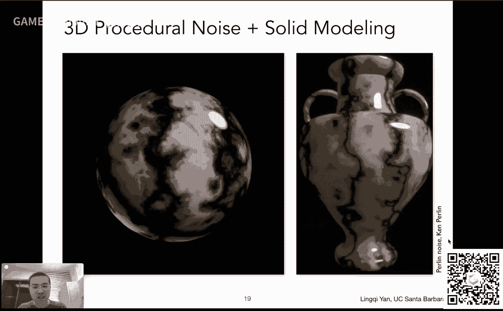

### 位移贴图

一个更现代的方法是**位移贴图**（Displacement Mapping）。它使用与凹凸贴图相同的输入纹理（高度图），但**真正移动了顶点的几何位置**。

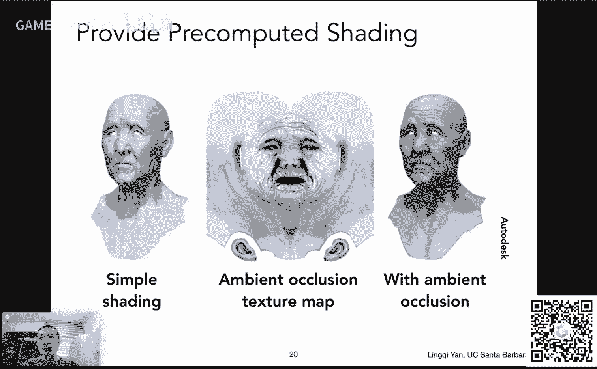

对比凹凸贴图和位移贴图：
*   **凹凸贴图**：只改变法线，不改变几何。在物体边缘或自阴影处容易“露馅”。
*   **位移贴图**：真正移动顶点，效果更真实，但要求模型的三角形足够细密，以跟上纹理定义的高度变化频率。

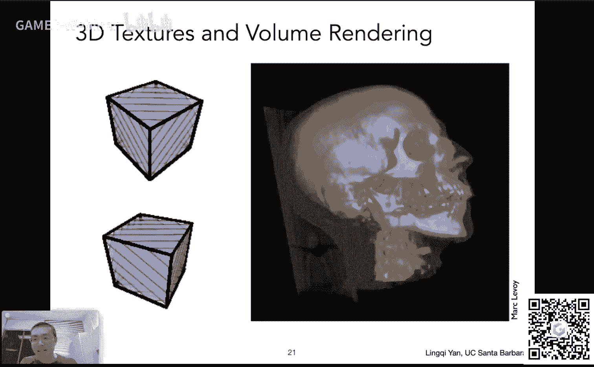

如果模型不够细，可以在运行时根据需要将三角形细分，这称为**动态曲面细分**（Dynamic Tessellation，DirectX中的特性）。这样就不需要初始非常细致的模型。

纹理的应用就介绍到这里，计算可能复杂，但原理如此。

## 三维纹理与其他应用 🌐

之前讨论的纹理都是二维的。但纹理也可以是**三维**的。

例如，可以定义一个三维纹理来表示空间中的值，如大理石纹理。这种纹理通常不是预先生成的图像，而是由一个定义在三维空间中的**噪声函数**（如Perlin噪声）解析生成。空间中任意点 `(x, y, z)` 都能通过函数计算出噪声值，经过处理后可以模拟山脉起伏、大理石纹路等。

纹理还可以存储**预计算的信息**。例如，着色时我们尚未考虑阴影。对比左右两图，右图中眉毛在眼窝上投下了阴影。这种阴影效果可以通过预计算**环境光遮蔽**（Ambient Occlusion）信息，并存储在一张纹理中来实现。渲染时，将着色结果乘以这张遮蔽纹理，就能快速得到包含阴影的效果。这说明纹理可以存储各种预计算信息，而不仅仅是颜色。

三维纹理广泛应用于**体渲染**（Volume Rendering）。例如，在医学成像中，CT或MRI扫描得到的是三维空间中各点的密度信息。这些信息可以存储为三维纹理，用于渲染内部结构。

至此，着色部分的内容基本讲完。今天我们将开始几何部分的入门。

## 几何表示简介 🔷

几何在图形学中非常重要。我们将先看一些几何例子，然后介绍不同的几何表示方法。

生活中存在许多复杂几何：
*   **光滑曲面**：如汽车车身，近看也看不到三角形，是连续光滑的。
*   **复杂机械**：如发动机内的齿轮、叶片，部件繁多，形状各异。
*   **布料**：由纤维编织而成，具有复杂的分层结构和空隙。
*   **流体**：如水滴溅起的水花，形状动态变化，表面张力使其形成复杂曲面。
*   **大规模场景**：如城市，包含海量的建筑、树木、草地等细节。
*   **微观结构**：如细胞、病毒，在显微镜下几何极其复杂。
*   **植物**：如树木，具有分形般的自相似结构。

几何的复杂性带来了存储和渲染的挑战。图形学中，几何表示主要分为两大类：
1.  **隐式几何**（Implicit Geometry）
2.  **显式几何**（Explicit Geometry）

### 隐式几何

隐式表示不直接给出点的坐标，而是**描述点满足的关系**。例如，一个单位球面可以表示为：
`x² + y² + z² = 1`
对于空间中任意点 `(x, y, z)`，我们可以判断它是否在球面上（代入等式，等于1则在面上）。

更一般地，隐式表面定义为满足 `f(x, y, z) = 0` 的所有点的集合。`f(x, y, z) > 0` 表示点在物体外，`< 0` 表示在物体内。

**优点**：
*   容易判断点与表面的关系（内/外/上）。
*   容易描述某些具有严格数学定义的形状。
*   容易计算光线与表面的交点（后续会讲）。

**缺点**：
*   难以直接看出表面的形状（所有点在哪里）。
*   难以描述复杂的、不规则的形状（如奶牛）。

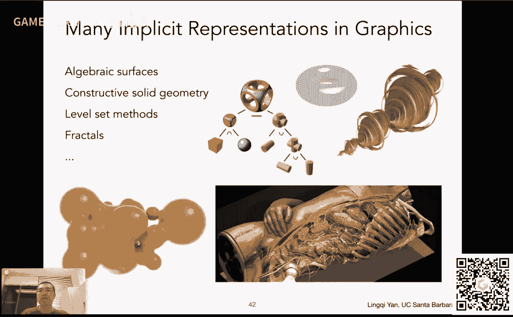

#### 隐式表示的例子

1.  **代数公式**：直接使用数学方程，如 `f(x,y,z)=0`。对于简单形状（球、环）有效，对于复杂形状（如星形）公式可能很复杂且不直观。

    

2.  **构造实体几何**（CSG - Constructive Solid Geometry）：通过对基本几何体（球、圆柱、立方体等）进行布尔运算（并集、交集、差集）来构造复杂几何。这是一种隐式表示，因为只定义了构造关系，没有直接给出所有点。广泛应用于CAD软件。

3.  **距离函数**（Signed Distance Function, SDF）：描述空间任意点到目标表面**最近距离**的函数。点在物体外时距离为正，在内时为负。SDF的强大之处在于可以通过**融合**（Blending）两个SDF来光滑地融合两个形状，非常适合描述形状的渐变和变形。

    **SDF融合原理**：
    *   有两个形状A和B，分别有SDF `d_A(p)` 和 `d_B(p)`。
    *   将它们融合：`d(p) = blend(d_A(p), d_B(p))`。
    *   新形状的表面就是满足 `d(p) = 0` 的点集。
    *   这种方法能产生自然的过渡，甚至改变拓扑结构（如两个球融合成一个）。

4.  **水平集**（Level Set）：与距离函数思想类似，但函数值定义在离散的网格上。通过找到函数值等于某个常数（特别是0）的等值面来提取表面。这就像地理上的等高线。三维水平集常用于从体数据（如医学影像）中提取表面。

    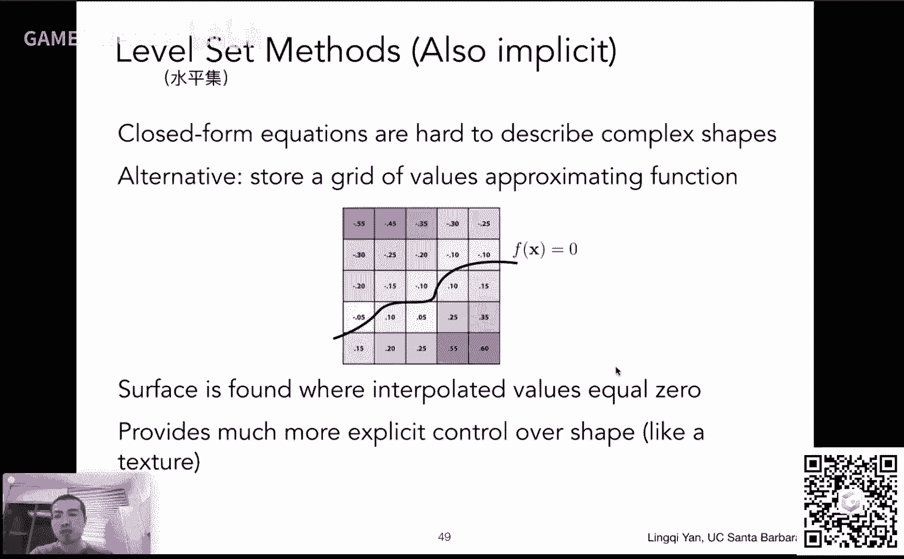

5.  **分形**（Fractal）：具有自相似性的几何，即部分与整体相似。例如雪花、某些植物（如罗马花椰菜）。分形几何在自然界和数学中很常见，但其无限细节的特性对渲染和表示都是挑战。

    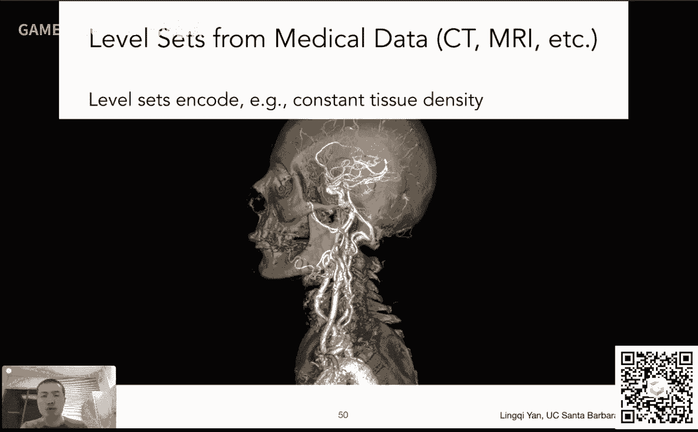

### 显式几何

显式表示会**直接给出表面的点**，或者通过**参数映射**来定义。

1.  **直接给出**：如三角形网格，直接列出所有顶点和三角形。
2.  **参数映射**：定义一个从参数域（如 `(u, v)` 平面）到三维空间的映射函数：
    `(x, y, z) = f(u, v)`
    遍历所有 `(u, v)` 参数，就能得到表面的所有点。例如，一个球面可以用经纬度 `(θ, φ)` 参数化。

**优点**：
*   容易直接得到表面的所有点，易于采样和绘制。
*   容易描述复杂的、不规则的形状。

**缺点**：
*   难以判断一个给定点是否在表面上（或内/外）。
*   对于参数映射，可能产生不均匀的采样或奇点。

隐式和显式表示各有优劣，在图形学中根据具体需求选择使用。例如，CSG适合建模，三角形网格适合渲染，SDF适合形状变形和融合。

## 总结 📝

本节课中，我们一起学习了以下内容：

1.  **纹理的高级应用**：完成了纹理部分的讲解，重点介绍了：
    *   **环境贴图**：用于表示来自无限远处的环境光照，包括球面贴图和立方体贴图。
    *   **凹凸/法线贴图**：通过纹理改变表面法线，在不增加几何复杂度的情况下模拟凹凸细节。
    *   **位移贴图**：真正移动顶点位置，效果更真实，但需要细致几何或动态细分。
    *   **三维纹理与预计算**：纹理可扩展到三维空间（如噪声函数、体数据），并可存储预计算信息（如环境光遮蔽）。

2.  **几何表示入门**：开始了几何部分的学习，介绍了两种主要的几何表示范式：
    *   **隐式几何**：通过点满足的关系（`f(x,y,z)=0`）定义表面。易于判断点与表面的关系，但难以直接描述复杂形状。具体方法包括代数公式、CSG、距离函数（SDF）、水平集和分形。
    *   **显式几何**：直接给出表面点或通过参数映射定义。易于采样和绘制复杂形状，但难以判断点与表面的关系。具体方法包括三角形网格和参数化表面。

隐式和显式表示在图形学中相辅相成，下一节课我们将继续探讨显式表示，并深入介绍曲线和曲面的表示方法。

---

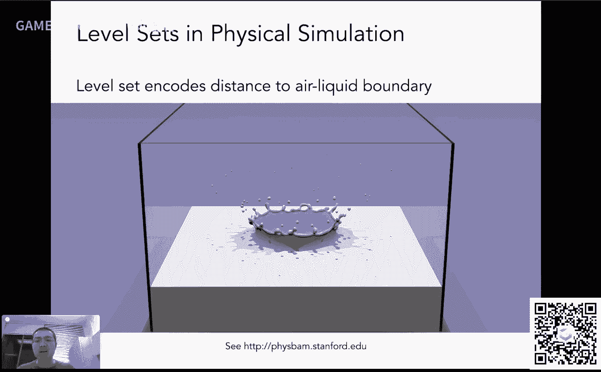

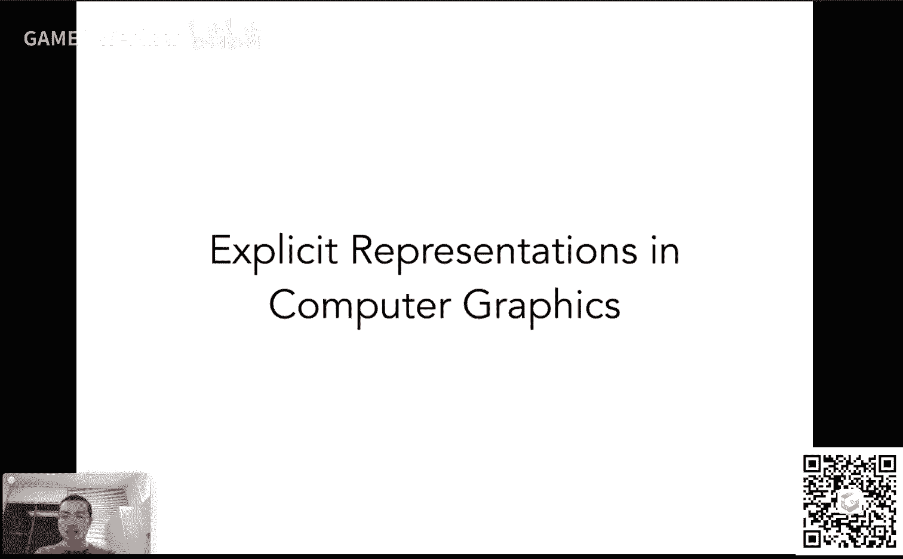

本节课到此结束。

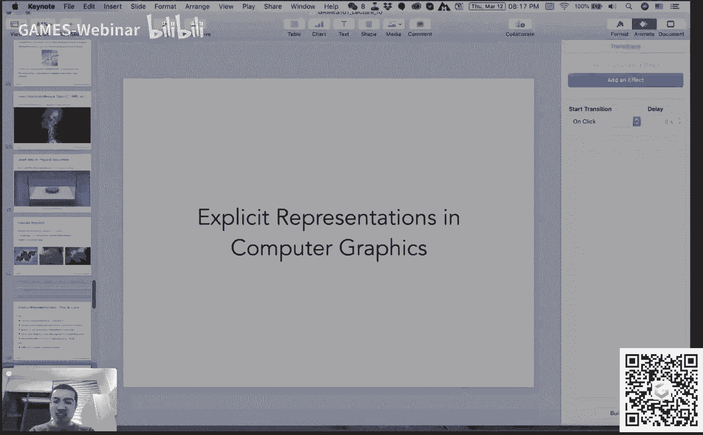

现在将时间交给技术秘书同学。

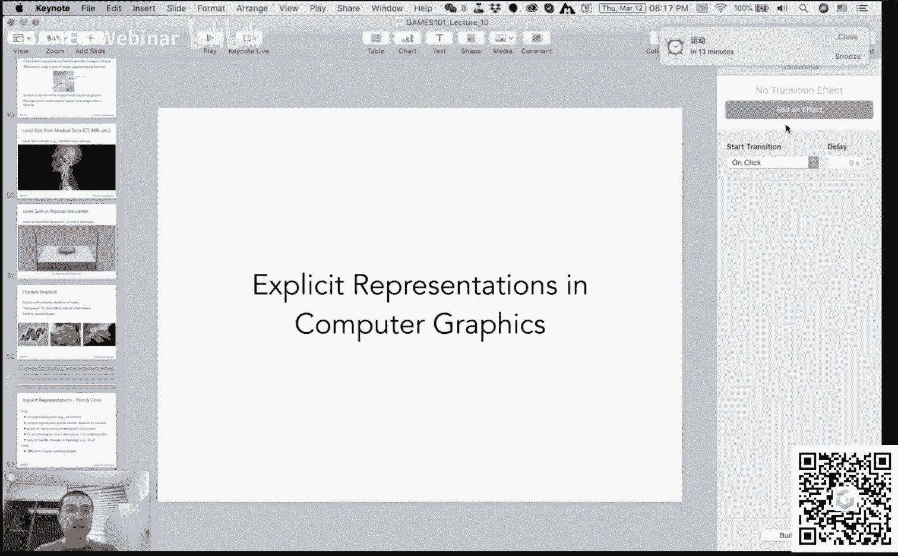

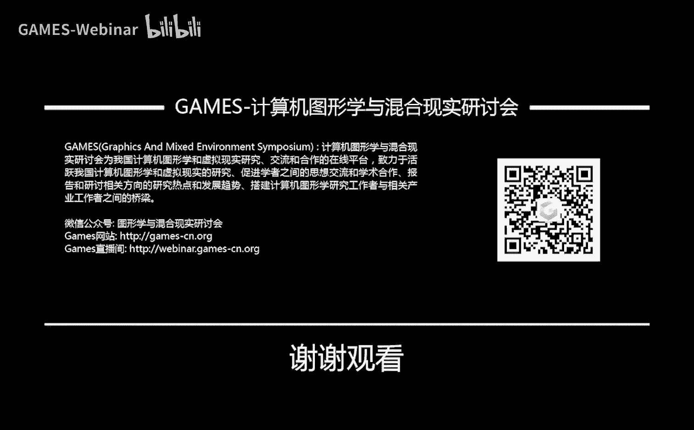

