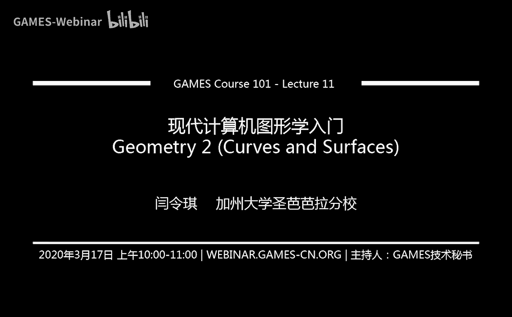

# GAMES101-现代计算机图形学入门-闫令琪 - P11：几何 2 (曲线与曲面) 📐

在本节课中，我们将学习计算机图形学中显示几何的表示方法，重点探讨曲线与曲面的概念、定义及其应用。我们将从最简单的点云开始，逐步深入到贝塞尔曲线和曲面的几何与代数表示，并了解其在图形学中的重要作用。

---

## 课程前言与回顾

上一节我们介绍了几何入门，区分了隐式几何与显式几何两大类。隐式几何包括距离场、水平集等多种定义方法。本节中，我们来看看显式几何的表示。

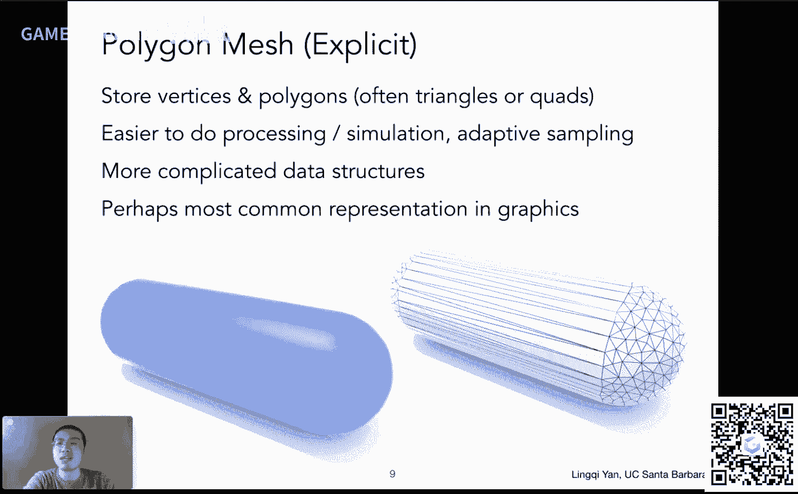

显式几何同样有多种表示方法，例如三角形面、贝塞尔曲面、细分曲面以及点云等。我们将逐一介绍这些方法。

---

## 显式几何表示方法

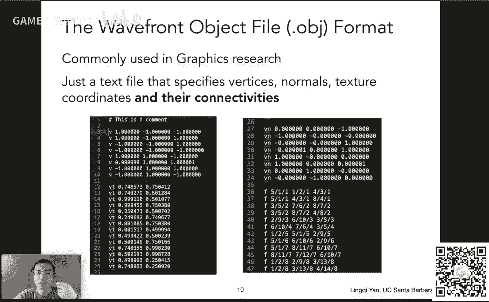

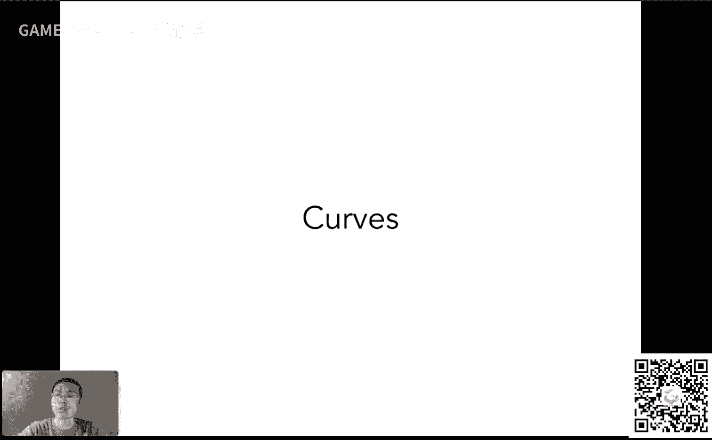

以下是几种常见的显式几何表示方法：

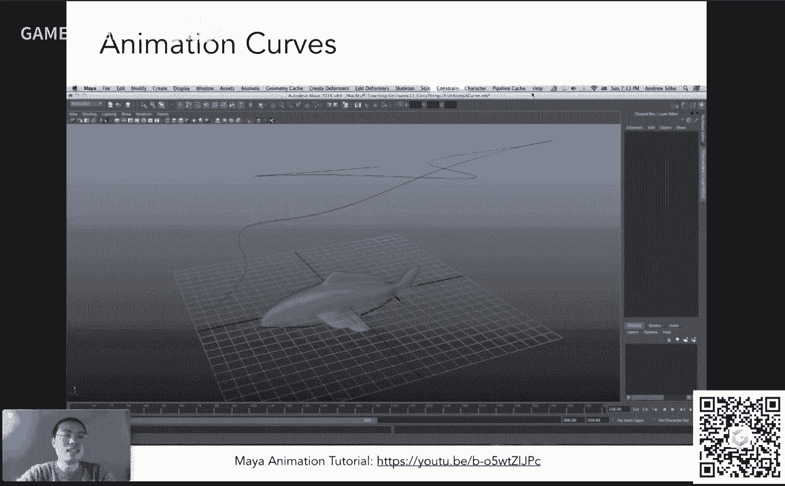

*   **点云**：将物体表面表示为一组密集的点。每个点由三维坐标 `(x, y, z)` 定义。当点足够密集时，可以近似看出物体表面。点云通常是三维扫描的原始输出数据。
*   **多边形面（网格）**：这是图形学中应用最广泛的表示方法，特别是三角形或四边形面。任何复杂表面都可以用许多小三角形拼接而成。一个网格物体通常包含顶点、法线和纹理坐标等信息。
*   **曲线与曲面**：通过参数化的方法定义光滑的几何形状，例如贝塞尔曲线和曲面。这是我们本节课的重点。

---

## 曲线及其应用 🧵

曲线在图形学中有广泛的应用，例如定义相机运动路径、三维建模中的引导线以及字体轮廓等。

### 贝塞尔曲线

贝塞尔曲线使用一系列**控制点**来定义一条光滑曲线。它不要求曲线经过所有控制点，但起始点和终点必须与第一个和最后一个控制点重合。

#### 德卡斯特里奥算法

给定一系列控制点，如何绘制出对应的贝塞尔曲线？德卡斯特里奥算法提供了一种直观的几何方法。

以下是该算法的步骤：
1.  假设有 `n+1` 个控制点，以及一个时间参数 `t`（取值范围 `[0, 1]`）。
2.  在每两个相邻控制点形成的线段上，找到对应于时间 `t` 的点（线性插值）：`b_i^1 = (1 - t) * b_i + t * b_{i+1}`。
3.  将这些新得到的点作为新的控制点集，重复步骤2，直到只剩下一个点。
4.  这个最终的点就是贝塞尔曲线在时间 `t` 时所处的位置。

通过遍历 `t` 从 `0` 到 `1`，即可得到整条贝塞尔曲线。

#### 代数表示与伯恩斯坦多项式

上述几何过程可以转化为代数形式。对于 `n+1` 个控制点，贝塞尔曲线在时间 `t` 的点是这些控制点的线性组合，组合系数由**伯恩斯坦多项式**给出。

`n` 阶贝塞尔曲线的公式为：
```
B(t) = Σ_{i=0}^{n} b_i * B_i^n(t)
```
其中，`b_i` 是第 `i` 个控制点，`B_i^n(t)` 是 `n` 次的伯恩斯坦多项式：
```
B_i^n(t) = C(n, i) * t^i * (1-t)^{n-i}
```
这里 `C(n, i)` 是二项式系数。伯恩斯坦多项式具有归一性（所有项在任意 `t` 处之和为1）和对称性。

#### 贝塞尔曲线的性质

贝塞尔曲线具有几个重要性质：
*   **端点性质**：曲线一定从第一个控制点开始，到最后一个控制点结束。
*   **仿射变换不变性**：对贝塞尔曲线做仿射变换，等价于对其所有控制点做同样的仿射变换，再绘制新曲线。**注意**：此性质对投影变换不成立。
*   **凸包性质**：贝塞尔曲线始终位于其所有控制点构成的**凸包**内。凸包是包含所有点的最小凸多边形。

---

## 分段贝塞尔曲线

当控制点较多时，单条高阶贝塞尔曲线难以精确控制局部形状。因此，实践中常用**分段贝塞尔曲线**，尤其是每段由四个控制点定义的**三次贝塞尔曲线**。

### 连续性

将多段贝塞尔曲线连接起来时，需要考虑连接处的连续性：
*   **C0 连续**：几何连续，即前一段的终点与后一段的起点重合。
*   **C1 连续**：一阶导数连续，即连接点处两段曲线的切线方向**和大小**都相同。对于分段三次贝塞尔曲线，这要求连接点两侧的控制点与连接点共线且距离相等。

更高阶的连续性（如C2连续，曲率连续）也有定义，常用于对光滑度要求更高的场景。

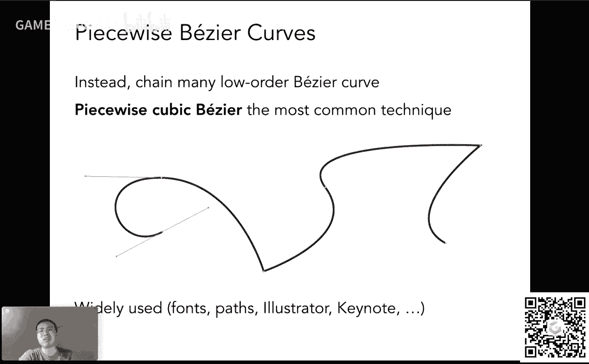

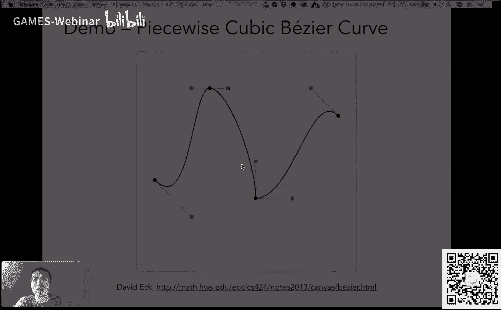

---

## 其他曲线类型

除了贝塞尔曲线，还有其他类型的曲线：
*   **样条**：由一系列控制点控制，并满足特定连续性的曲线统称。
*   **B样条**：B样条是贝塞尔曲线的推广，具有**局部性**优点，即修改一个控制点只影响曲线局部区域，而非整条曲线。其基函数比伯恩斯坦多项式更复杂。
*   **NURBS（非均匀有理B样条）**：在B样条基础上进一步扩展，能力更强，广泛应用于工业设计。

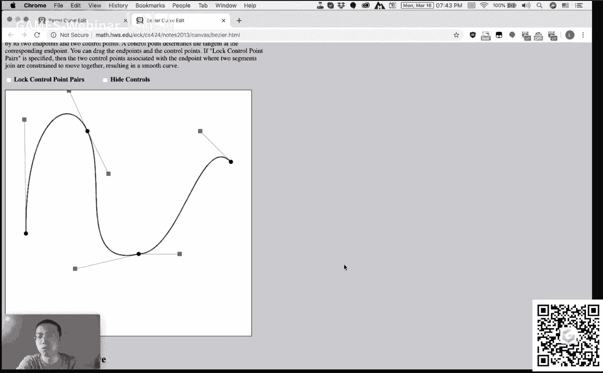


关于曲线更深入的知识（如升阶、降阶、拆分等操作），可以参考胡事民老师的相关课程。

---

## 从曲线到曲面 🧊

将曲线的概念扩展到二维参数域，就可以定义曲面。

### 贝塞尔曲面

贝塞尔曲面由二维网格的控制点阵定义（例如 `4x4` 个点）。其生成过程是双重的贝塞尔曲线插值：
1.  在 `u` 方向（例如每一行），用控制点生成一系列贝塞尔曲线。
2.  对于某个固定的 `u` 值，在这些曲线上取点，得到一组新的控制点。
3.  在 `v` 方向上，用这组新控制点再生成一条贝塞尔曲线。
4.  当 `u` 和 `v` 在 `[0, 1]` 范围内变化时，扫过的空间即构成贝塞尔曲面。

通过参数 `(u, v)` 即可映射到曲面上的任意点，因此它也是一种显式表示。

---

## 网格处理简介

尽管有参数化曲面，但在图形学中，用**三角形网格**表示物体表面仍然是最普遍的方法。对网格常见的几何处理操作包括：
*   **细分**：增加三角形数量，使模型更光滑。
*   **简化**：在保持基本形状的前提下，减少三角形数量，以节省存储和计算资源。
*   **正规化**：调整网格，使三角形尽可能接近等边三角形，避免出现又长又尖的三角形，以获得更好的数值性质。

这些网格操作的具体内容将在下一节课详细讲解。

---

## 总结

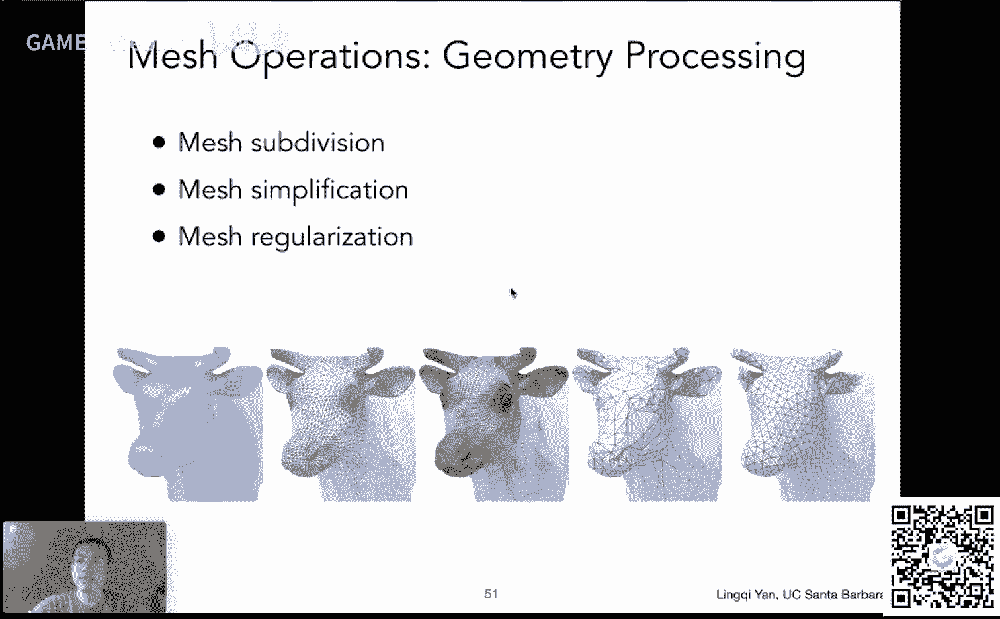

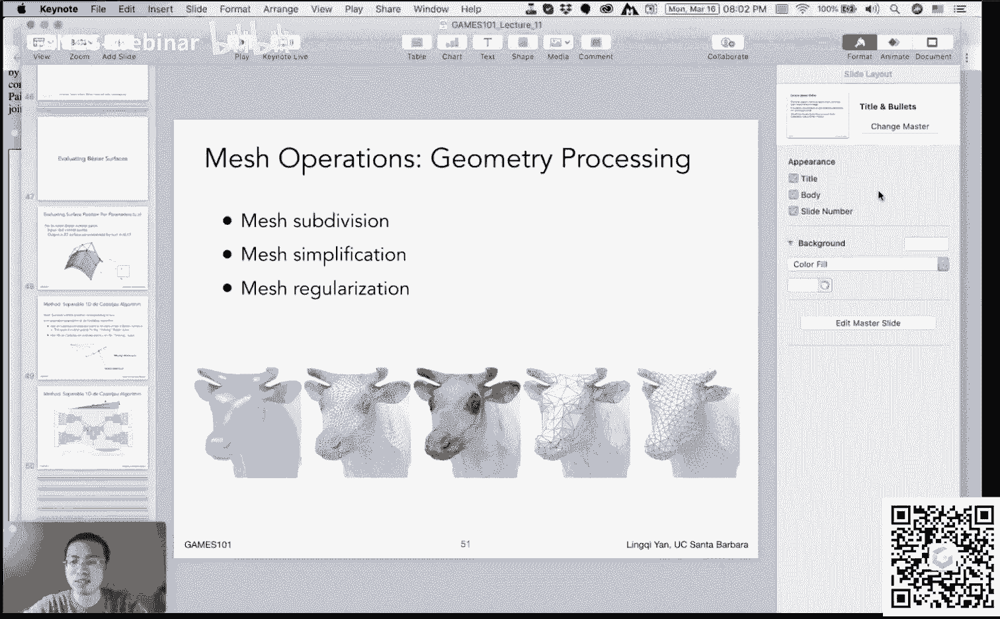

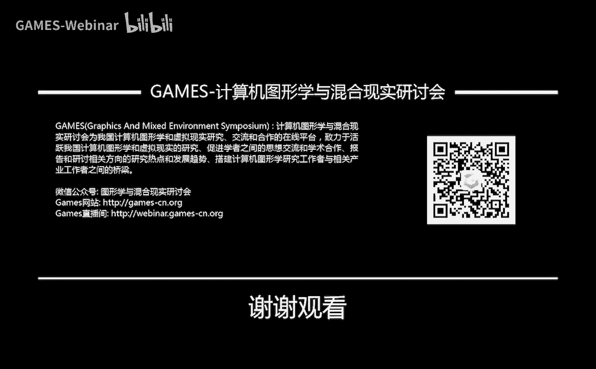

本节课我们一起学习了显式几何的多种表示方法。我们重点探讨了**贝塞尔曲线**的几何定义（德卡斯特里奥算法）与代数表示（伯恩斯坦多项式），并了解了其重要性质。我们还介绍了**分段贝塞尔曲线**及其连续性概念，并简要提到了B样条等其他曲线。最后，我们将曲线概念扩展到二维，引入了**贝塞尔曲面**的构造方法，并对常见的网格处理操作进行了概述。掌握这些曲线与曲面的基础知识，是理解后续几何处理与渲染技术的重要一步。