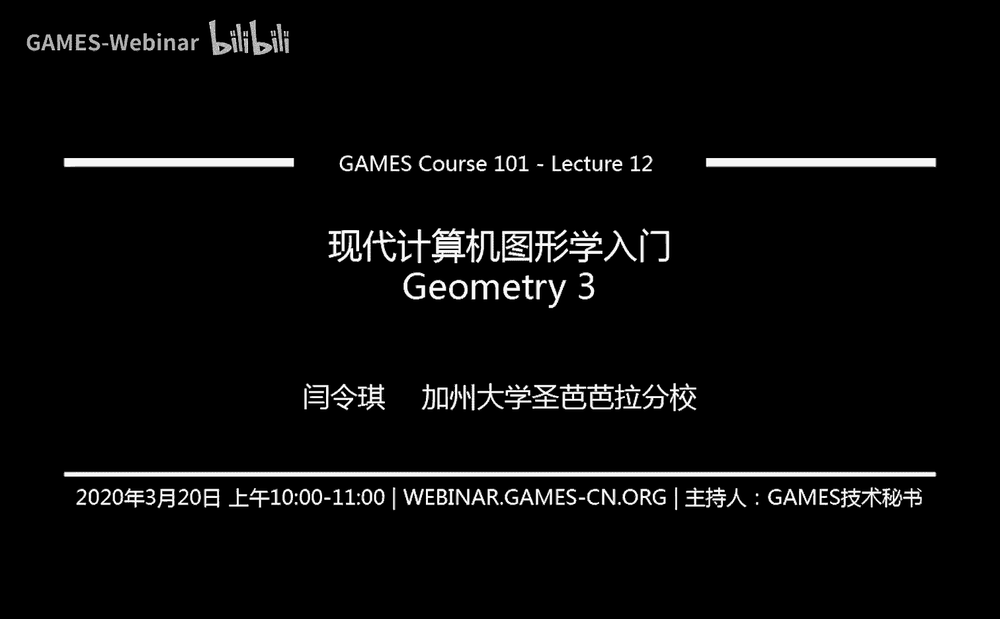
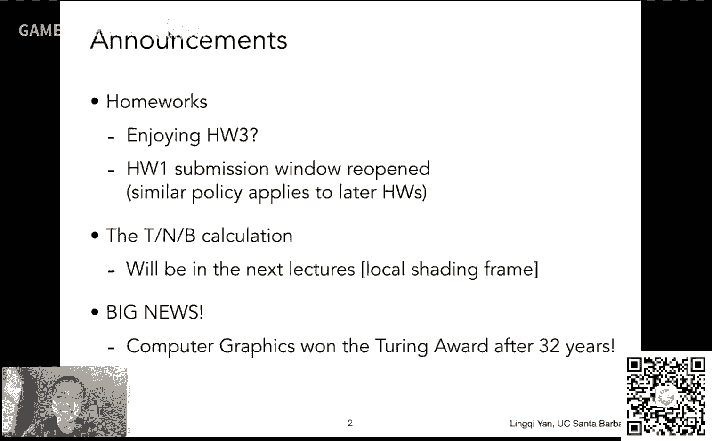
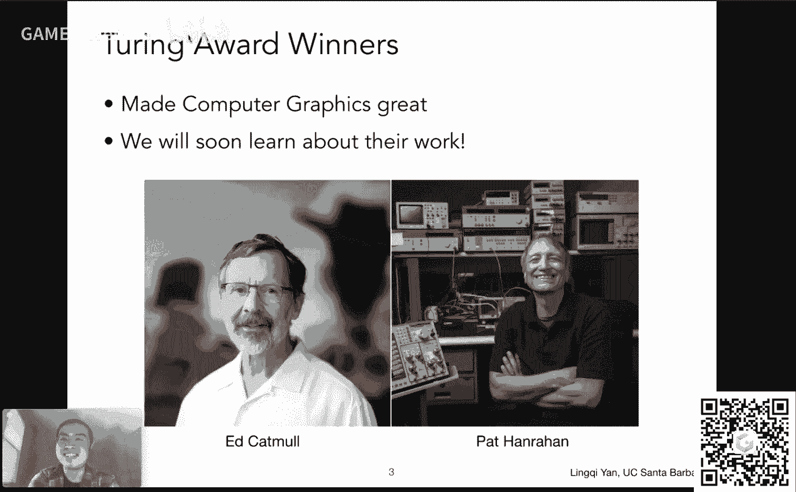
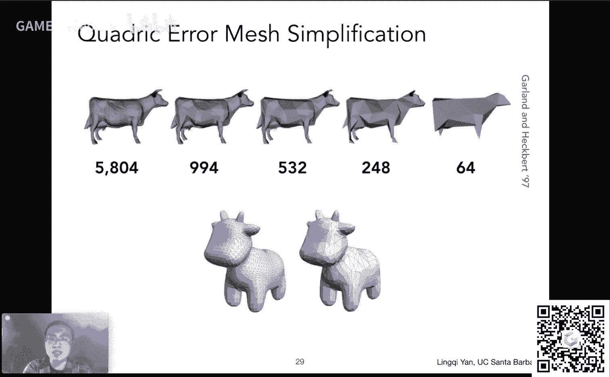
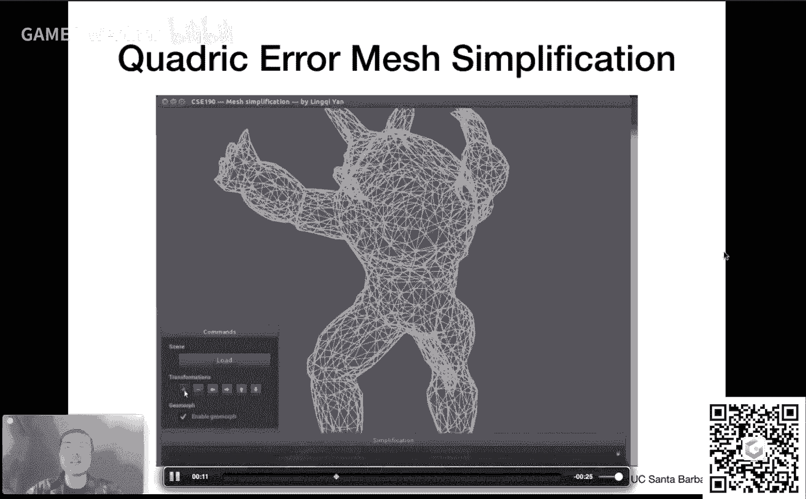
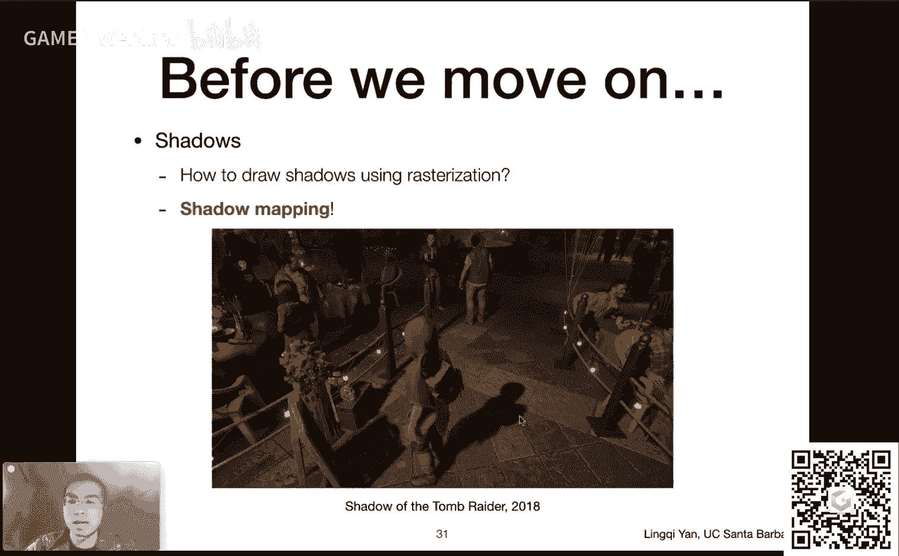
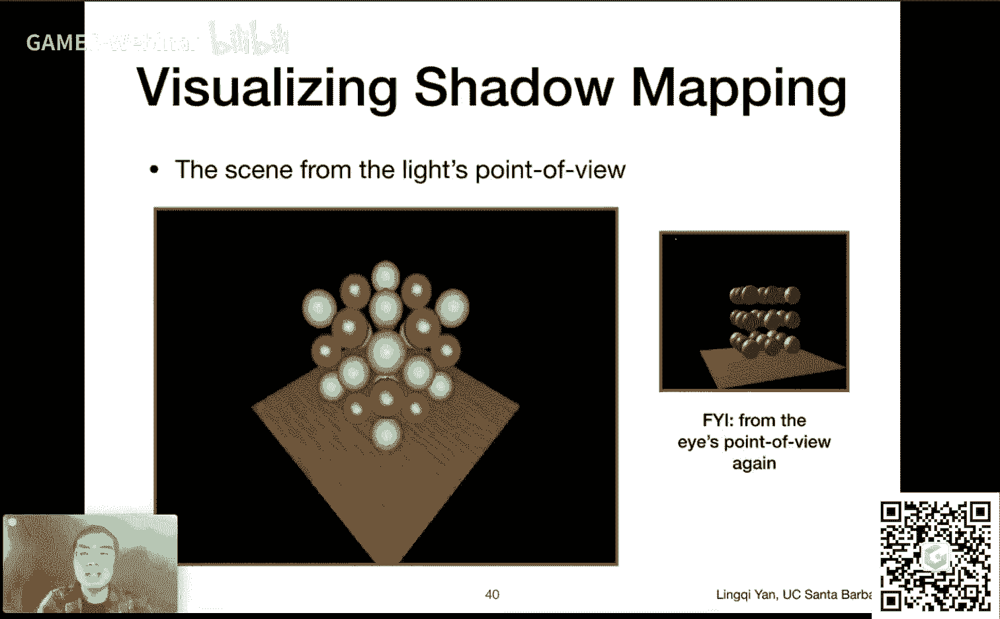
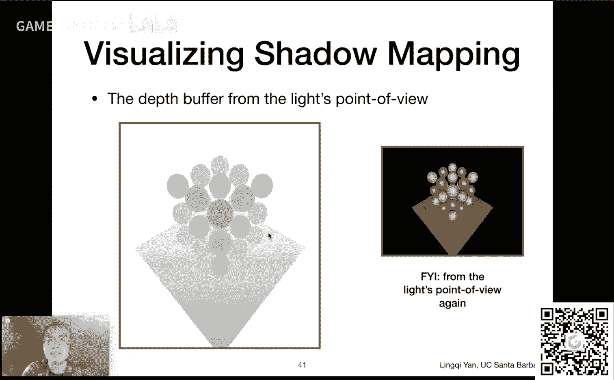
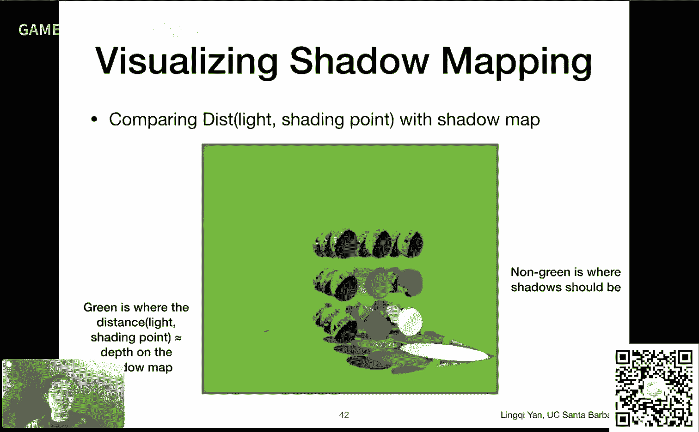
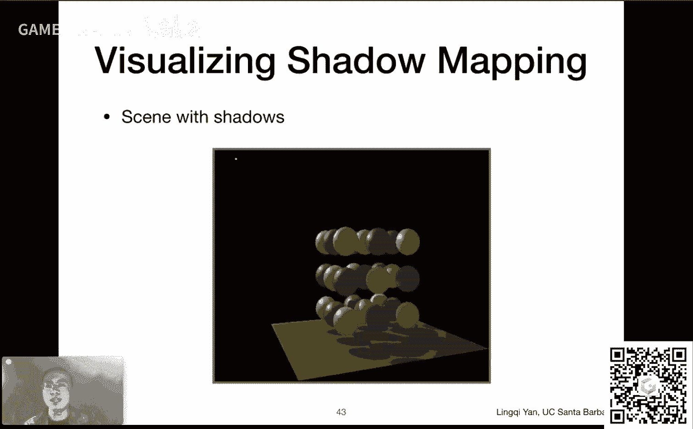

# GAMES101-现代计算机图形学入门-闫令琪 - P12：Lecture 12 Geometry 3 - GAMES-Webinar - BV1X7411F744

今天大家可以看到我们要说的是这个嗯。

几何的最后一部分，其实呢我原本想想说，这节课主要来讲光线追踪，看速度吧好吧，然后我们现在先把几何这部分说完，然后今天再说一说这个shadow mapping这块的事情，然后再提到光线追踪这么一个思路。

好，仍然是感谢大家的大力支持，咱们今天第12节课好，那么在这个课程开始之前，几个事情要宣布一下好吧，一个是这个我看有很多同学啊，这个把这个作业三的啊，这个小奶牛拿出去炫耀啊，非常不错啊。

这个欢迎啊非常欢迎嗯，大家都很喜欢吧，对不对，我觉得一开始做出来这个这个奶牛，这个还挺好玩的对吧，然后另外一个事情是这样的，嗯我们的作业一啊，就是嗯这样先说一说背景，就是有同学反映啊。

后来加入这门课能不能提交以前的作业，是这么一个事儿啊，答案是完全可以，然后我跟助教们商量出来了一个方案，怎么做呢，就是说咱们这个正常作业还是正常，这个嗯发出去正常提交没问题，如果你错过了前面什么作业。

我们讲过这个课呢，本来就不是什么嗯，这个强制性要求大家要做作业，对不对，然后如果大家之后要补没问题可以，然后如果之前做的早的同学们，这个这个也不会有什么那损失，我怎么觉得对吧嗯行。

然后就是说后来愿意补的同学呢，我们以现在的情况是在呃，这周已经放出了作业一的补提交，然后之后我们每一周会，这个放出另外一个作业，比如下周我们就可以提交这个作业二，然后这个作业三之后顺延，这么安排好吗。

然后我们正常的作业呢不受影响呃，还是该怎么着怎么着好吧，呃，这个算是之后大家应该如何提交，作业的事情好，然后呢这个上一节课我们提到说呃，这几个轴怎么样计算呃，我想了一下，我原本是担心什么呢。

担心大家说这个不知道怎么计算，会耽误大家做这次的作业，但是后来我看了一下这个助教提供的代码，以及我们又聊了一聊，嗯，觉得应该是以现在的这个作业里面的注释，肯定是可以把这次作业呃完美的做出来了。

然后关于tnb的这个计算呢，我就放在之后的pass string这块的内容，说到这个呃，局部的这个着色框架这个里面来说好吧，这个就是现在的安排，然后呢，当然不可避免的说一说这个大事情啊，大新闻啊。

图形学时隔32年之后，终于第二次得到了图灵奖。

当然是重大的好消息，对不对，嗯，然后我们来看一看这两位得主，嗯，嗯at cmo和pet heroh，然后我们很快就会说嗯这两位的工作啊，这个非常巧合，这节课我们就会说到cmo的一个工作。

叫cinema clark subdivision，然后之后我们在pass string里面呢，还会提到pet以及他的学生，which做出来的贡献这一块呢，之后我们就再详细说我一个个人的理解哈。

就是这次嗯，把这两把这个图灵奖颁给这两位获奖人啊，这个当之无愧啊，如果说sutherland也就是第一位图形学，就算是图形学的创始人，然后第一次得到这个图灵奖。

这个算是made computer graphics，那么这两个人就可以认为是made computer，graphics great，如果没有这两个人，就没有当前的计算机图形学。

然后大家之后会这个更多地接触到，这两个人的工作哈，然后特别是什么呢，特别是我这么说吧，他们都会都有很多，这个这个家喻户晓的一些算法啊，比如说cl cl clark的这个这个曲面，这个三角形面积分呃。

这个呃不是三角形面啊，就是说这个表面细分啊，然后嗯pet呢他这一套整个一套的嗯，pass string的体系，以及嗯以及和这个render man，工业界的做出了这个极大的贡献，可以这么说。

你得到了广泛的应用，render man算是第一个这种商用的，这种超强的这种渲染器，当然直到今天仍然得到非常广泛的应用，所以说没有这两个人就没有呃，计算机图形学今天的怎么说呢，算是繁荣吧，没问题。

虽然说科研上这之后再跟大家吐槽吧，对吧没问题，所以说大家可以看到第一位内，computer graphic，这两位made computer graphics great。

我希望若干年之后能有人made computer graphics，great again啊，然后就是这么个意思吧。

好简单，给大家说一说重大利好消息啊，然后呢再给大家炫耀一下，这个我思考了一下，到底要不要跟大家说，结果决定还是得跟大家说，因为如果不趁着图灵奖这个多说两句对吧，任性一回，哪有这个机会说这个啊。

我们呢嗯这个图灵奖获得者pet哈尔汗，其实如果论辈分，论这个科研上的辈分，他算是我师爷，为什么呢，因为pat harry had他带了一个博士生，叫做ri ramamoth，也就是我的导师。

然后他这个所以说从这个角度上来说对吧，grand advisor这样说，所以这是这是一方面啊，这个我非常值得炫耀的一件事情啊，我师爷得过这个这个计算机界的诺贝尔奖，对吧，这样想嗯，然后呢。

嗯还有一件事情也炫耀一下，pet的另外一位学生projeep s，他现在是也是在uc sb当这个呃教授，然后很难想象啊，现在在世界范围内很难找到第二所学校，有两位同时做rendering的老师。

这个非常非常困难，所以说这个在uc sb，我们这方面当然是非常强的，这点我毫不否认，然后嗯当然了，这话有广告嫌疑，不过这个事情说明白啊，广告是一方面，另外一方面想加入同性学的研究，可是非常难的。

上完这一门课肯定是不够，这咱们这门课叫入门，对不对，哈哈哈好，没问题，所以说啊这么一说，这个就显得近了很多对吧，而且2014年我见过pad海尔汗，我和他握过手，对不对哦，这个是不是不能说会被封。

对不对啊，无所谓了，就这样了，就说到这儿啊，好哎呀啊，那咱们这个呃他就吹到这儿哈，多说了就不好了啊，行啊，那咱们回到咱们上节课嗯，结束的地方，我们说到这个back to geometry哈。

我们提到说对于这个三角形面什么呀，我们不是说有一系列的处理方法嘛，对不对，对于三角形面上我们有各种各样的操作，我们可以做这个呃三角形面的细分，增加更多的三角形或者简化减少对吧，然后或者是说这个正则化。

然后让这些嗯嗯曲面变得更加呃，并且是三角形面变得更加规则，然后我们分别来看一看啊，这个嗯嗯嗯咱们从什么开始呢，就从这个最基本的这个操作就是三角形，我如何增加它的数量，让整个这个我要表示的曲面更加的光滑。

大家知道如果我用了三角形，数面数量非常少，那变成当年很早期的那种什么，最终幻想七第一代的时候，在ps上的时候，然后人物的头发啊，手啊什么东西全都是三角形，看得非常这个棱角分明这种。

然后当然大家希望用到更多的三角形，然后随着现在的这个显卡的发展啊，三角形的数量，基本上来说不是什么超级大的问题，就是说现在的显卡，基本上可以处理很多的三角形，然后呢嗯这样一来，就是说我们有一个这个模型。

然后我们希望它这个细节更丰富，我们当然可以引入更多的三角形，然后像这里大家看到的，这就好像把一个图像，然后我增大它的分辨率一个道理，但是呢让他这个看上去有更多的细节，这些东西嗯对吧，是这么一个思路。

然后嗯这个第二个操作咱们刚才说了对吧，就是呃网格的简化，嗯，就是说啊如果说我现在有一个网，网格非常非常复杂，而他拿的其实挺远的，我们不需要这么复杂的这个网格，那怎么办呢，那我就用少一点的网格数量。

然后我去掉一些呃这些边啊或者三角形啊，或者什么，但是呢我仍然要维持之间，它们互相之间的连接关系，对比如说我这个去掉了某一些点之后啊，不能让这个牛角的部分，比如这里断掉了对吧，这肯定是不行的。

所以说我们得有一系列的方法去指导，怎么样，我们去做这个细分好吧，呃要简化啊，ok好，那么呃好在呃另外一个话题呢，咱们刚才跟大家说，这三角形呢有可能有大有小，然后也就这个细长这种啊，这种情。

其实会对这个渲染造成很多，各种各样的不变，那么通常应对这种情况，我们会把这个模型呢做一些这个呃，正规化或者正则化，就是让这些呃面变得更好，就看上去更像这个三角形，那正三角形每个三角形啊。

然后这里大家可以看到，其实这个算法做的并不太好，这耳朵这边明显的缺了一块吧，和左边这个相比没错吧，所以说就是在改进这个三角形本身，质量的时候，同时不能丢失这个模型本身的表示质量，就是这么个意思，好吧。

这三种这现在多给大家说一说，说一点，那么咱们从这个细分开始说啊，细分呢自然是一个非常非常重要的操作，然后我们之前什么时候提到的细分呢，我们之前在说这个呃displacement map的时候。

就是位移贴图，说这个的时候提到过这个细分，为什么呢，说我们可以在物体表面上应用一个贴图，这个贴图表示了它的相对的位置移动，对不对，然后像或者说我们定义一个相对的所谓，高度长。

然后我要把这个高度长的这个不同的高度，应用在不同的顶点上，然后我就可以得到一个呃复杂一点的模型，顶点被移动过了的模型，就真正做出一个凹凸的感觉，而不是用凹凸贴图去模拟，没错吧。

然后我们说到我们需要用很多的三角形呃，才能赶上这个纹理本身它的频率，这是对的，所以说我们需要用到很多的三角形，我们需要做细分，我还提到说，我们是有办法可以做动态的细分的，但不管怎么样。

我们是得做一个细分，那么这个细分怎么做，那当然首先第一反应是，这个引入更多的三角形，对不对，那怎么样引入更多的三角形呢，呃这就是我们之后要说的各种各样的算法，当然引入了更多的三角形之后啊。

大家可以看到不只是引入三角形，比如说我可以把这一个三角形，可以拆成很多很多三角形，但是这样的话并不能足以，让这个形状发生改变，我们所说的细分是两个事情，第一分出更多的三角形。

第二让这些三角形的位置发生一点变化，使得我的原来的模型变得更光滑一些，也就是说从这个模型中引入更多三角形，之后，会变成这么个三角呃，这个这个形状，让这形状引入更多的三角形之后，变得更像圆。

是这么一种感觉，好吧，所以其实我们说表面细分是两步操作好，那么这里给大家说清楚，那么以这个所谓loop subdivision为例，就是loop戏份，然后这个细分呢我们刚才说其实两步操作。

第一把三角形数量增多，怎么增多呢，特别对于这个loop细分来说很简单，一个三角形给你一个三角形，你连接它们的这个三条边的中点，是不是就可以做出一个中间的一个三角形，而且这个中间三角形。

把原本三角形又分成了上呃，这个左下和右下这么三个三角形，所以说形成了四个三角形，这么一拆就可以拆成四个，这就是loop subdivision做的这个拆分方法，那行行完成了这个三角形数量增多之后。

怎么办，我们要调整这这些三角形的位置，对不对，那调整三角形的位置，其实就是调整这些顶点的位置，然后特别的对于这个loop细分呢，这大家的做法就是说这个呃，嗯把这个三角形的顶点区分开呃，区分成什么呢。

区分成新的顶点和老的顶点，那什么叫新的顶点，新的顶点就是我，我们在这些bn的中间取了这些点，那原本在原本的这个模型里面不存在对吧，那区分成这么三个新的顶点，那以前旧的顶点或者老的顶点啊，这还在。

然后loop细分，他所说的意思就是说哦，对于这两种不同类型的顶点，我们分来改变他们的位置，让他们有一种不同的规则，来改变他们的位置啊，那这当然是可以的，那么在我们继续进行之前呢，先给大家多说一下啊。

这个图形学中有很多这种，这种不同的命名方法，大家看到这个loop细分，这是什么意思呢，这个这个千万不能理解成是循环细分啊，这个loop和循环没有任何关系，这是为什么呢，这是因为发明这个算法的哥们儿。

他他他的这个family name就叫做loop，所以它叫做loop subdivision，很简单的说法，然后这个和循环什么没有任何关系，大概就说到这儿，然后嗯那我们说啊嗯增加三角形很简单。

我们就这么一连就可以连出四个，那下面就是如何把老的顶点和新的顶点，分别移动它们的位置来调整，让这个模型变得更加光滑，就是这么个意思好，那么大家可以看到这几个例子哈，从左边一个近似于六边形的圆环。

一个螺丝帽这么一个感觉，然后通过细分诶，最后它会这个形成某一种这种形状，引入更多的三角形，就变得越来越光滑，越来越光滑，没问题啊，然后那咱们看一看，如何把这些细分类的三角形，来调整它们的位置对吧。

这就是关键，那么他怎么做的呢，很很简单，有个明确的算法怎么做，我们先看怎么更新这些新的顶点的位置，那新的顶点咱们刚才说了哈，哪些是新的顶点啊，这些边的中间对不对，就是新的顶点，咱们现在看一个。

那就是这个白点，这个白点肯定就是某一个新的顶点，那咱们如何调整它的位置呢，咱们这样想，首先呢这个顶点一定在一条边上，然后这个新的顶点吧，咱们本来就是这么取的嘛，然后呢只要这条边表示的不是物体的边界。

那它一定会被不同的三角形所共享，像这里就是两个三角形共享这么一个白点，我们说的是一般情况啊，有很多特殊情况，边界情况我们就不说了，像这里呢，呃这个点它一定被这两个三角形所共享，我可以找到这两个三角形。

那么找到这两个三角形之后，我们把共享的这条边上面两个顶点叫做ab，然后呢，把这两个三角形这个不共享的这个顶点啊，叫做c和d啊，至于谁是谁没什么关系啊，那么我下面这个loop，细分定义的一个规则是什么呢。

就是呃我要去把这个白点啊，先生成了之后，我现在要把它的位置调整到什么呢，调整到3/8的a加b，a和b的平均位置啊，乘3/8，加上c和d的平均位置乘1/8，至于它为什么是这么回事啊。

这个其实就是一种简单的加权平均，对不对，然后他为什么会取这些直指，当然就是具体的这个这个算法，它是如何设计的，咱们就不说了，我们就说这个算法如何执行，很简单，找到这四个点的位置进行一个加权平均。

大家可以看到他是认为啊，这个a和b通常会离这个白点近一点，所以对这个白点它的这个贡献会大一些，然后c和d呢通常离他远一点，对他的贡献小一点，所以说白点的影响就是受制于这个，a和b更多，c和b更少。

所以听上去挺有道理的对吧，我这么一更新这个白点的位置诶，他就达到了一个让这个呃，这个新出现的白点，能够这个平滑的一个作用，什么叫平滑，咱们之前说过图像上的平滑，对不对，就是取一个窗口求平均，所谓平均。

这种操作就可以让这个面也变得平滑，没有问题，好吧，就是这个点的值是什么，可以这么理解，是它周围几个值的平均，那当然就会让整个面变得平滑好，这是对新的顶点，那对于旧的顶点怎么操作呢。

大家可以看到这个公式非常非常的复杂，然而呢非常好理解什么呢，首先啊呃我们先确定一点，他是对这个旧的顶点如何做位置的，更新那旧的顶点咱们可以看到啊，比如说像这里，大家可以看到这有六个三角形对吧。

六个三角形对在一块儿，这个顶点它连了六个三角形，中间，这些虚线的表示的，就是这个我们拆出来这个新的顶点，新的三角形，那么咱们不看它，咱们就只看这个老的这个这个顶点，那么这里呢呃为了更新他们的这个。

这个这个老的顶点啊，它的位置，那肯定大家想，肯定要跟这个周围的这这这这些点有关系，对不对，然后呢呃跟周围的这些点有关系，所以肯定周围的这些这些，它所相邻的这些呃原本的老的顶点啊，肯定都会有所贡献。

那这这里呢这个loop细分，它提供了一个这个新的规则，就是说啊他一部分他去相信这个呃，周围的这些相邻的这些老的顶点，他们的平均值，另外一部分他也会愿意相信自己，就是说他这个自己本身，它也是个老的顶点啊。

我不能完全就听周围的这几个顶点使唤，对不是这么这么一个意思，就是说啊，他这个一部分情况下保留自己的这个位置，这么一个属性，另一部分情况受其他的影响，怎么影响，那咱们现在定义几个事情。

第一呢我们定义一个and就这样一个数，这个数很简单，什么呢，就这个顶点的度，这个我不知道大家学过图论没有啊，就是说学数据结构，学这些东西肯定都会接触到对吧，什么是顶点的度，很简单。

就这个顶点连接的这些边的数量，那么在这里再清楚不过了，这个点连了六条边，那么这个顶点的度就叫六，就是n等于六好吧，然后呢，这里再定义一个这个另外一个数叫做u，这个u是什么意思呢。

就是说考虑到这个顶点的度呃，跟这个度有关系的一个数，就是仅仅仅是这么一个数而已，好吧，那他们最后这两个这两个概念在一块儿啊，我要如何去应用来更新这个旧的顶点，这个白点的位置呢，那大家看啊。

我们刚才说思路是这样的，一方面，这个白点他要相信自己原本所表示的，这么一个位置，另一呃就这个位置就是original position啊，另外一点这个白点呢，他还愿意去相信周围的它这些邻居。

它所相邻的这些老的顶点，他们的位置的平均好吧，然后就是说他可以相信这个自己，也可以相信周围的顶点的平均，那么这个中间我怎么样通过加权的方式，把这两个两个，这个相近的程度给合在一块儿呢。

那我就用这个一减n乘以u，来这个对他当前的这个顶点的位置，进行加群，用这个u去对这个周围的这些呃，邻居的这个位置之和或者位置平均吧，进行一个加权，然后那咱们看一看这个加权说明了什么哈。

呃我们可以看到说这个呃如果这个顶点啊，这个n咱们就单对这个n来说，如果一个顶点它连了很多不同的三角形，比如说连了20个三角形，那就说明了它其实就完全可以，这个由周围的20个三角形来决定。

这个各种各样的信息来更新他自己，那也就是说这一个点自己就不太重要了，他连了很多别人的三角形嘛，对吧，这样这个意思，然后如果这个点它只连了都两个三角形哦，那就说明这个顶点非常重要。

然后这个顶点呢这个如果我要更新它的话，那我可能更多要相信他自己，那这个说明的这个呃这个更新的这个规矩，就是这么回事，就这么定下来了，很简单的一个一个道理啊，然后嗯所以行没问题。

就是说这就是说这个loop细分，如何去更新这个老的顶点，好啊，那现在这个基本问题就已经解决了，对不对，大家想一想啊，陆夫细分先产生很多新的顶点，然后这些这些新的顶点呢，这个得到一部分的这个这个更新方法。

很简单更新，然后以前的老的顶点呢，根据这种方式也更新他们的位置，那么这么更新一下，我们就可以得到一个这个所谓路途细分，得到的结果，那就是一个三角形拆成四个，比如说大家看这个三角形啊。

这个在这个人太阳穴上的这个三角形，这里对应大概就是被拆成大概是这个啊，可以看到确实是拆成了这么呃这么一个诶，四个三角形的一个形状，但是呢这些顶点的位置，都经过了一些细微调整。

比如说原本这个左边这条边它就是贡献了，现在它显然这个点就移除了这个平面，一点点对吧，能看出来这么一点，这样的话就能让整个模型得到一个光滑，所以说啊再次印证这么一个事情，就是说loop细分做两个事。

第一先细分，第二再调整没问题，那再做一次，再做一次就会形成这个情况，那当然是就越来越密，然后最后得到这个越来越这个，这个呃光滑的结果没问题好吧，那loop细分大概就是这么个意思。

那咱们现在呢给大家介绍另外一种细分方，法，大家可以看我专门这个highlight了一下啊，呃co clark subdivision，大家还有印象的话，ed cmo今年的这个图灵奖得主之一。

然后这应该是他的一个，非常非常这个广为人知的一个呃操作啊，然后什么意思呢，就是说他和这个另外一个clark，他们两人发明了一个这个网格的细分方式，然后我们这里为什么要提这个事情呢。

我们不是有loop subdivision吗，对不对啊，事实上是这么回事，我们刚才教的这个loop细分啊，我们既然说一个三角形，拆成四个三角形对吧，那也就意味着我先假设这些面是这个。

表示这个物体的网格就是三角形网格，那我才能用loop细分来做，如果它不是三角形网格，像现在大家看到这个网格有四边形，有三角形，有这种，就是说对于一般的情况，这种cma clark的细分。

就可以把这个网格细分的非常好行吧，然后这是什么意思呢，咱们看一看啊，就是说啊嗯我们先看这么一个网格，我们定义一些这个概念很简单，我们定义这个cold face，也就是四边形面，我们还可以定义呃。

non quad face，也就是非四边形面，那非四边形，那当然只要不是四边，那它的都不是这个四边形，那比如说这里两个三角形的面，它就叫做非四边形面啊，这好理解啊，这个定义。

那咱们再定义另外一个概念叫奇异点，叫extraordinary vertex，所谓奇异点是什么意思呢，很简单，它的定义也是极其的明确度，不为色的点都叫奇异点，好，那是那这个do啊。

刚才咱们才给大家说do是什么意思啊，一个顶点和它相连的边数就叫do，比如说咱们看这个点，我现在鼠标所在的这个点，他连的自然是四条边上下左右，所以它的度是四，它的度是四，所以这个点不是齐一点。

那咱们看这个点，这个点呢他连了五条边，上下左右还有一条斜着对吧，连了五条边，所以这条这个点的度是五五，不是四，所以说这个点就是七一点，那它是奇异点，那同样道理，这个点也是奇异点好。

那我们现在定义这两个概念，定义这两个概念其实挺简单的，这个这个判别方式啊，那么我们用这两个概念之后，就可以这个对这个cal clark，他们这种细分方式做一个分析，那咱们来看啊，呃这是怎么做细分呢。

我们想一想啊，首先我肯定得引入更多的这个点，或者说边对吧，然后我再调整它们的位置，那么我们现在来说怎么样引入不同的点，很简单很简单，怎么做呢，每一条边我都取它的终点，每一个面我也取它的这个中间的一个点。

并且我把边上的这些中点，和这个面上的终点都连起来就可以了，呃这是什么意思呢，咱们看这个例子啊，比如说大家刚才看到这是个三角形，对不对，这是三角形，然后三角形有三条边，123哎，我都取这三三个点。

这三个点三条边的中点，然后这个面呢我也中间取一个点，可以是它的重击，可以是其他什么点，反正之后要调整位置啊，就是说这里先取一个点，然后那我把这个边上的点和面，中心的点都连起来。

那大家看左上角原本这是一个四边形啊，这是一个四边形，然后这里呢在这点上，这四个这个边上的中点，并且在四边形中间取一个点，和这个边上的中点都连起来啊，那这部分操作其实挺好理解的，没问题啊。

经过了这部分操作之后，这个网格自然而然就便秘了对吧，那么现在是这样，就是说大家看到这里，其实已经调整了位置的这个网格哈，咱们先忽略这个概念，就是说关于连接关系，我们先把这个建立起来。

这样就增加了更多的网格呃，或者说顶点，然后我们要调整它的位置，但是呢在这个调整位置之前，我们可以用刚才定义的这些非四边形面，和这个奇异点的概念，来分析一下这个所谓cmclark细分。

它有一个什么样的性质啊，那么现在我们问这些问题啊，经过了一次细分之后，现在还有多少个奇异点呢，大家可以看到啊，之前我们定义七一点度不是四啊，呃这个就都叫奇异点，那么原本说哦，我发现这些格子上的点。

全部还都是非齐一点，然后这两个原本的度为五的，奇异点还是齐一点，现在度还是五，那我发现啊，我引入的新的这两个点，他们在三角形中间点上的这个点，由于它要和三条边相连对吧，所以他们两个的度都是三。

所以这就造成了，说我会引入两个新的奇异点，所以现在会变成总共有四个奇异点，其中两个奇异点是原本的奇异点没动，另外两个奇异点是因为我去划分了三角形，造成的奇异点，没错吧，好我们可以回答这个问题。

现在有四个奇异点，那么现在奇一点的度都是多少呢，那我们刚才已经分析了，原本都是五，现在还是都是五，然后现在这个这个点的度啊，呃这些新的奇异点的度是多少呢，我们刚才自然而然说三。

因为它要和三角形的三条边相连，对不对，那也就是说大家会发现这么一个问，题，什么时候是起一点，只要我在一个非四边形面内，点上这么一个点，由于我要和它的每一条边都相连，所以形成的这个点一定是齐一点。

否则的话它和四条边相连，那它的度就是四对吧，然后只要它这个原本的这个面，比如说这里是三角形，它不是个四边形面，那么我一定会在它中间点出一个奇异点来，诶，那这个我发现了。

它和之前的这个非四边形面的数量有关系，对吧，那么这个这里再多问一句，现在经过了一次细分之后，还有多少个非四边形面呢，大家会从这张图上一数发现诶，四边形面全部都消失了，因为现在所有的面都是四边形。

比如说原本三角形内那拆成了一个四边形，然后两个四边形，然后当然左下这是第三个层次的四边形，哎也就是说我经过一次细分之后，所有的非四边形面都消失了，我们再多说一句，也就是说所有的非四边形面。

其实引入了这个每一个非四边形面，都会引入一个奇异点，并且他们在引入奇异点之后，这些非四边形面都会消失，就好像是说这些非四边形面，在一次cma clark细分之后，都变成了嗯一个奇异点对吧。

就是这么一个意思，所以说我们这个呃chema clark细分，它有一个这么一个性质，就是说在你细分之前，如果你有多少个这个呃非四边形面，在一次细分之后都会变成一个奇异点，相当于是增加奇异点的数。

但是如果我们再继续做下去的话，大家会发现这经过一次操作了之后，就已经不再有非四边形面了，这就告诉我们，以后提一点数就不可能再增加了，这也就告诉我们说，cat a clark细分在做第一次的时候。

增加了非四边形面数，这么多个的奇异点之后再也不会增加，比如说我们再做一次细分，大家会看到这里仍然还是四个奇异点，因为在第一次细分之后，就已经不可能再有c4 边形面了，唉所以它有这么一个性质好吧。

然后这是一个这个这个有趣的事情啊，然后大家会看到在细分的过程中，然后这些点都会发生一些位置上的变化，对吧，那么同样道理啊，这之后这个再继续细分，然后位置上再发生一些变化，就会变得越来越光滑，没有问题。

那么呃这些这些顶点啊，涉及到一些新的点啊，然后这些老的点啊，在边上的点啊，在这个面里面的点啊，他应该如何去更新，这里呢其实是有公式的，但这里这个我说清楚，就是这里的课程上。

我们肯定不做要求给大家这个这个写出来，如果大家有兴趣的话，自己写着玩是可以的啊，然后就是说嗯cma clark，现在我们已经知道，如何去增加新的变数和边和点了，我们现在就要调整它怎么调，很简单。

它呢是把这些点区分成三类，第一就是说你的新的点嗯，这个是点在这个面中间的这个新的点，就是现在咱们看到这个f，他这种应该如何更新，然后它的更新方法很简单，然后第二类，他认为这些这些在编的中心的这些点。

咱们不是说把一个面的这个中心，和这边的中心都连起来吗，边的中心也产生新的点啊，所以编的中心，它有另外一种方式来更新他们的位置好吧，然后这也就是说新的顶点啊，他考虑的更细，它考虑成了两部分。

这个这个边上的点和这个面上的点，然后呢这个呃他以前的这些老的点对吧，叫叫叫这个啊，old的vertex这种对吧，然后它应该如何得到更新呢，那他就是用它周围的呃，相邻的这些面的。

这面中心的点和这边中心的点，以及和他自己的位置在一块儿，在做一个某种平均的这种更新方式，所以大家可以看到啊，虽然来说它这个定义就看上去很复杂，其实无非就是说我这个呃，只产生了一些新的点之后。

然后新的点我定义一系列的规则，让他去求，而让他去成为这些以前的哪些点呢，平均基本上就是在做这么一个意思，所以本质上来说和图像的这个模糊操作啊，别的什么东西没有什么这个重大区别啊。

然后基本上来说通过平均的方式，得以让这个整个一个平面呃，这个局部都会得到平滑，所以整个平面就会变得平滑，没问题啊，所以啊cdm clark呢这种方式，然后它可以产生各种各样不同的，这个呃这个细分的结果。

然后我们再回到刚才说，我们为什么要说cao club细分呢，是因为loop细分只能用作三角形面，而cal clark细分，是可以用作各种不同的面的，比如说像这里，大家看到这个下面这一行。

它这个很显然就是四边形面进行细分，而且大家看得清楚，比如说这一个面啊，细分了之后呃，正常这个应该是中间点，一个点和四边都连接，连接了之后，它会更新它的位置，像这些点，大家可以看到上面这个这个四边形。

就会变得越来越圆，然后一直这么做下去，它会收敛到一个看起来很平滑的一个结构，好吧，就是这么一个意思好嗯，然后呢当然了，有一些这个嗯，模型上面它会有各种各样的缝呃，或者说这种不连续的地方，比如说像这里。

这里有一个明显的这些这个这个变化，不是里面是往这个方向，外面往这个方向对吧，然后这个跟之前的这个模型是有关系的，而且这一块是有明确的理论分析，是可以做出来的，就是说会在哪些地方形成风。

然后这个呃最后收敛了之后，它的结果会怎么样，就经过无数次的细分啊，这种会得到一个什么样的结果，这些也是这，大家就嗯在这个方面进行了一些，这个科研的内容好吧，那嗯到这儿就应该差不多。

这涉及到曲面细分就已经说明白了，现在呢给大家放个这这个动画，这个动画呢是嗯早期的呃，这个皮克斯做的这一个这一个简单的动画，这个动画呢大家认为这是呃最早的，如果不是最早的一个，就是最早的一批吧。

应用呃应用曲面细分技术做了一个动画，当然大家可以看到这个图形啊，跟现在的这些比如冰雪奇缘二什么的，完全没有办法比对吧，但是其实挺不错的对吧，然后呢，嗯就是pika呢，一直是做了很多这种很小的一些短片啊。

最近这也有各种各样新的，我记得前2年还有一个叫做pepper的一个短片，做的是一个水鸟啊，然后这个也就地上有沙子呀，做的是各种栩栩如生的，这个效果哈，然后嗯皮克萨直到今天。

一直是算是能够引领这个业界技术的，这个公司就非常厉害啊，然后这个动画的名字呢叫做gary's game好吧，然后大家可以看到这是这是gary啊，gary他在自己跟自己下棋。

然后啊而且一个有着双重人格的典韦，然后正常情况下呢，这个呃，好吧，就是大家能够看到的是这个gy's game，这么一个短片，然后我看到的是什么呢，嘿嘿嘿诶，我看到的其实是呃，这个这个这个动画应该叫做。

reinforcement learnings game，哈哈哈呃好吧，这个可不就是这个现今的这个，可不就是这么做的吧，自己跟自己下棋同，从而提升自己的这个水平对吧，嘿嘿嘿嘿。

或者说我们管它叫alpha goose game，嗯，嗯呵呵呵呵，哎行吧，总之是挺有意思的一个这个短片啊，在这里呢不给大家放到最后，大家至于结局是什么呢，大家自己去找吧好吧，然后a就到这儿好。

那咱们说到这儿啊，这嗯可以啊，那咱们嗯继续进行下一个话题，嗯现在我们给大家说这个曲面的简化，当然是一个很重要的操作，对不对，然后呃曲面简化大家还记得啊，就是说我要减少三角形的数量，有一些三角形太多了。

然后我想少一点，提高一下这个程序的性能，那么大家看这么两个例子哈，左边这个骷髅，然后他用了3万个三角形来表示它哦，当然了，大家可以从着色的上面来看，大家可以看到。

这里着色用的是flat shading啊，就是说虽然他用了3万个三角形，flat shading，还是会给你看到这一块一块的效果，如果大家用逢时点，肯定能够效果做得更好，然后呢。

呃这里再回到这个面的这个概念上面来，那么3万个三角形效果挺好的，然后嗯把它简化成3000个三角形之后，就说啊我用3000个三角形，其实来说表示的效果还不错，那如果大家仔细看这个鼻子上面啊，这个地方多少。

这个连接会稍微那个一点差一点，然后其他很多地方都可以看出来，比如说这个牙齿，这个牙齿这个在这个牙龈内部，这块就没有之前表现得好对吧，然后就是说啊，3000个三角形，大概能够表示他们这这么一个呃呃样子吧。

就这么说，然后如果我用300个三角形，那他就会发现哎这下这个差的挺多了，但是呃我说句实话，这个这个整体上来说，它表示的是个什么，我还能看得清楚对吧，是这么个意思，所以还是不错的。

那如果咱们用30个三角形，那就肯定是什么也表示不出来了对吧，所以呢这就说明什么呢，这就说明说，我当然是希望用更多的三角形来表示，这个几何物体对吧，人们当然希望用更多的三角形，但是这个呃有一些情况下呢。

如果说我这个游戏我为了提升它的性能，然后不希望它这个呃顶点太多，然后顶点多了，那么一方面这个变化呃，这个顶点的变换要花时间，另一方面着色要花时间，很多东西都会都需要花时间对吧，然后负担不起。

特别是在移动移动端的这些计算上，然后这是一方面，就是说我们有时候不得不去用这个，简化的模型，这是一第二，其实啊其实来说在什么场合下，用什么复杂程度的模型，其实有讲究的，一个最简单的例子。

就是我刚才其实提到这个事情，对于这个骷髅来说对吧，他这个这个嗯叫什么来着，我们现在看着它挺大的，是因为他在离我们挺近，那如果我们想象说对于这个货罗来说，我们呃这个仍然是用这么多个三角形。

但我们离很远很远去观察它对吧，很远去观察它的话，那我根本不需要，我去把这么细节的东西给建模出来嘛，比如说这里我就觉得3000个三角形，几乎和三个三角形我无法区别，然后呢，我觉得300个三角形之间。

离近了看效果挺惨的，但是离远了看它挺小的时候，效果还不错对吧，除了李涯这个缺失，这个有点厉害啊，就是说嗯就是说啊，这个取决于说我们在不同的情况下，会选用不同复杂程度的呃这种几何模型。

其实这是一个很好的做法对吧，比如说物体离得远的时候，用这种呃三三百个，然后离得稍微近一点，我用3000个，离了再近一点，我有3万个，但是这个事情呢嗯和两个事情有关吧。

第一和我们之前所说的mmap是很有关系的，对吧，所谓mile map就是给了我们一种这个图像，它所谓的层次结构，那如果东西这个一个像素离我们挺远，它覆盖了一个很大的这个纹理上区域诶。

那我自然而然用用这个呃mp map，也就是说平均一个更大的位置，那就够了，我根本不需要去把这个整个每个，这个最底层，最最细层的这些像素都平均出来对吧，这是这个这在这个意义上来说，几何，这嗯。

所谓层次结构的几何和层次结构的图像嗯，在这个意义上是差不多的，但是在另外一个方面上来说嗯，几何的层次结构是很难做的，特别是说涉及到这个几何呃，不同类型的几何之间的这个相互相互，怎么说呢。

变化咱们就比如说我说离近了，我用3万个，离远了用3000个，那我在什么时候做一个切换，那我切换的时候，会不会大家能够看到有一个这个，这个很明显的这种变化对吧，那这个我就不希望别人能看到。

我希望它有一个平滑的过渡，那这过渡要怎么做啊，从一个几何形状到一个几何形状，我们又没有三星性，三线性差值这么些东西对吧，所以说呢这块儿其实是一个这个目前来说，仍然在图形学界这个造成困扰的一个问题。

作为几何的层次结构不好做啊，好那么这里呢就简单把这个概念和mp map，咱们联系起来，知道有这么回事就可以了，然后呢也就是说我们做网格简化，绝对不只是说我们因为计算能力上的妥协。

有一些情况下确实是没有必要用到，这个非常复杂的模型的，好吧好，那没问题呃，这个概念说明白，下一步就是怎么样去计算它对吧，怎么样做网格的简化，那这个首先大家想肯定是不能直接，比如删掉为三角形。

我删掉的三角形可不是这个物体上留下来，各种动物嘛对吧，这肯定是不行的，那怎么做呢，这里给大家提供一种方法啊，这里说清楚某一种方法，这里给大家说的叫做边坍缩，就叫做edge collapse好吧。

然后嗯这个edge collapse的意思很简单，比如说你找到一条边对吧，一条边连着两个顶点对吧，把这两个顶点往容易捏给捏成一个点好嗯，这条边就不再存在了，对不对，那这个操作就叫做边探索。

然后很简单的这个道理哈，那么嗯这个边摊错在实际的做法中间啊，却没有那么容易，然后呃比如说什么呢，比如说我要探索哪些点对吧，就是这个意思就是哪些边算是重要的，我不应该把它捏在一块，哪些边不重要。

我可以把它捏在一块儿啊，这个问题我们靠什么来回答，就是这里要给大家提到的，叫做qugic arrometrics，就是二次误差度量，所谓二次误差不是说做两次啊，而是指一个平方这么一个意思。

那么怎么理解这个概念呢，大家可以看左下角这幅图，左下角支付都算是一个一维的简化情况啊，咱们认为好，如果我有一个这个原本的这个形状呃，四条线段，五个顶点连起来，那么我现在把它简化成这个中间三个顶点。

我都不要了，我就留一个好吧，我我留一个顶点，这个顶点我应该把它放在哪儿，我应该把它放在哪儿，才能保证说，我这个这个蓝色的这个三角形啊，这个网格的蓝色三角形，和原本的这个灰色的这么一个多边形。

基本保持它们轮廓形状的一致对吧，这是个好问题，那怎么做呢，那很简单，大家第一反应先做个平均试试，那这个点和这五个点都有关系，那咱们求五个点平均放这儿，放这儿，大家会发现原本这个面挺鼓的嘛，凸出来的。

然后现在变得非常平，然后那肯定就不对，那也有同学说好吧，那这个点其实是用来代替上面三个点，那三个点球平均好不好呢，那么球会放在这回，放在这儿呢，我会发现无论如何啊，这个蓝色三角形还是会比这个呃。

这个原本的多边形，这个要小对吧，就比他小了一圈，那肯定是大家不喜欢，那怎么办，那么人们就发现了一个新的这个办法呃，引入一种误差的度量，就叫做这个二次误差度量，什么意思呢，我希望这个找这个点。

我希望把这个点放在某个位置上，可以最小化二次误差，什么叫二次误差呢，所谓二次误差很简单，二次误差和这个我们所说的l two，距离非常非常相似，什么意思呢，这个点和原本的这几个的边呃都有关系的。

和几原本几个面啊，这算是退化的一维情况呃，这一个新的顶点和原本几个面都有关系，那么我现在就要求这个点，到原本的这么几个面，它们的距离的平方和好吧，然后我希望把这个点放置在一个位置。

使得这个点到和它相关联的，面的距离的平方和达到最小，所以大家听这个过程就非常非常，这个这个清晰的一个呃什么呢，一个优化过程对吧，优化过程我想我不是不知道这个点在哪吗，行没问题，我去优化它的位置。

我找一个最优的位置，使得这个点到其他这个原本的，它所连接的各个面呃的平方和距离最小，呃对吧，那么这里就是它的这个二次误差，的这么一个度量，很简单吧对吧好啊，那么呃我们刚才说啊。

就是说这个呃回到这个这个事情上来，有了这个二次误差对吧，我们我们要算这个呃，我们要去如何坍缩这些编，这是现在一个重要的一个一个事情，那说说明什么呢，说明如果我有一条边，我要是把它给坍缩了之后对吧。

我会变成一个点，我可以移动这个这个点的位置，使得这个坍缩对这个面对原本的这些面啊，造成的影响最小，也就是说我坍缩任意一条边之后，我形成的那一个顶点，我都可以把它放在一个最优的位置。

求出一个最小的二次度量误差，那么现在我可以这么做，怎么做呢，我对于整个一个模型有那么多条边，我都假设假设我如果坍缩这条边，并且我把这个坍缩了之后的点，放在一个最佳的位置上呃。

会得到一个多大的二次度量误差，也就是说每一条变我都可以假设，如果我坍缩它都会有多大的误差，那么现在自然而然，大家立刻就可以想到一个算法了，对不对，说我对于一个模型我想简化它。

我可以通过边坍缩的方式来探索，我探索谁，那我肯定减这个呃，二次度量误差最低的，最小的边开始探索对吧，我从最小的开始，然后我再探索第二小的，再探索第三条，哎，对，然后如果我们可以把这个过程也给做出来。

那就不错，那自然而然就造成了一个这个，我们的一个这个核心算法，那就是这么做，就是说我们如何去选呃，不同的边那很简单，我就先把每一条边都打上一个分数，这个分数就是它的二次度量误差有大有小，我们从小的开始。

然后一个一个的来做探索对吧，再简单不过，但是这里面有若干问题哈，一个是大家如果回到刚才这一页来看，如果我探索一条边呃，很简单的事情，可是坍缩了一条边之后呢，有一些边要跟着这条边变化，比如说大家看这条边。

这条边原本接近数值的，现在变成几乎是平等了对吧，然后其他的这些边，只要原本跟这些边的这些顶点相连的，这些边啊都会受到影响，那这些边发生了变化，那这些边是不是他们的24度量误差，也得重新算了，可不是嘛。

对不对，就是说啊我坍缩了一条边之后，会影响其他边的24度量误差，那这个问题其实就就造成了一定困扰啊，如果说我把之前所有的边，它的二次重量误差算出来之后排个序，我从小到大来取就行了，现在发现不行。

我从小到大取的时候啊，我会引起其他边的一些变化，那怎么办，那现在咱们想一想，我们现在要做这么一个操作，第一我要从一堆这个啊，二次度量误差或者一堆边中间啊，选二次多量误差最小的一个，也就是说取最小操作。

第二当我取完最小之后，我要对它所影响的这些边，它的二次度量误差做更新，也就是说得有某一种数据结构能够保证，我可以取到最小值，瞬间取o1 ，对不对，取最小值，我又可以动态的以最小的代价去更新。

其他的这些受影响的这些嗯这些元素，那么大家想这已经说的很明了了，对不对，大家如果上过这个算法与数据结构呢，大家就知道，这个时候我需要用到的数据结构，就叫做优先队列，或者是对这两个概念是一模一样的好吧。

然后这是什么意思呢，就是说允许你求最小，并且允许你动态更新任何一个点的值好，那么这就是我们要的这个结果了，就是我每次取最小更新了这个呃，其他他受影响的这些编，他们的二次动员误差之后再取最小再更新，嗯。

这个受影响的再去对焦，这么来做对吧好，那没问题，这就是一个很简单的堆结构，这是第一个问题，第二个问题是，其实啊我们这么做到底对不对对吧，我希望找到的其实是一个这个在全局上。

能够表示说这个原本的这个这个物体啊，它整个轮廓的一种简化表示，任意一个位置，一条边附近，我都找他的，这个相当于一个最优的做法，也就相当于我们在不断地通过，对局部做最优解的方式，试图找到一个全局的最优解。

这种方式其实是一个典型的贪心算法对吧，这并不是一个，这个这个能够保证有这个，全局的最最优性质的这么一个做法，然后呃当然了，对于实际的物体来说啊，就是说人们为什么会用这个方法，实际上物体来说。

你很难构造一些这个超级复杂的这些，这些呃场景，使得说我一定会证明说我这个贪心算法，它这个呃就是和嗯就是最优，实际上的最优解相去甚远，这种啊就正常情况下大家都认为说啊，我们这么做其实效果就挺不错的。

那就这么做吧，然后这就是目前大家如何去应用，这个二次度量误差，很简单吧，就是每一条边自己会有一个，然后然后呃，我们只用这个动态的把它组织起来，就可以了，好那么到此为止啊，这块呃理论部分差不多就说明白了。

然后呢咱们看一看这个实际的操作，大家可以看到，对于上面这个这个实际的奶牛模型啊，然后呃如果我们去一条变一条边坍缩，然后我们可以得到一个哎，越来越简化的模型，到了最后最后即便只有64个三角形。

它还在试图很努力的去保留，他的这个嗯这些嗯嗯很复杂的这些性质啊，这些腿啊，尾巴尾巴好像已经丢了啊，腿还是多少，剩1。248，这个地方尾巴就已经不太好了对吧，然后对于咱们这个作业里面这个小奶牛啊。

这效果还是不错的对吧，然后这里用多少三角形，我不记得了，但是大家可以看到一个事情什么呢，就是说简单的地方，就是这个牛的脸的部分啊，那他当然就会这个坍缩的边多一些对吧，因为那些边他肯定246点误差小。

然后探测多一些，会形成这个大的这个三角形，然后对于一些复杂的地方，比如说脖子这个地方，这些地方仍然是相对复杂，像这块这底下对吧，然后所以说呃这么一种二次量误差诶，很有意义的啊，所以说就是这么回事好。

那么呃这里就是就是这个啊，简化这么一个操作好吧。

然后我再给大家看一看这个这是什么呢，这是一个这是这是我当年我是学生的时候，我写的作业啊作业，然后当时做了一个，当时做了一个简单的open gl，做的这个gi，然后呢支持这个放大缩小啊，然后简化。

其实刚才最重要，就是刚才那个拖动这个轴哦，大家可以看到我这个简化，还支持一个叫做gel mouth的操作，也就是说在不同的这个简化的这个层次上，它可以得到一个平滑的过渡好吧，然后当然这个嗯。

视频里面有各种各样费操作，比如说给他展示怎么样商业移动这些东西，但其实就是说这个网格啊，咱们回到这个最早啊行，然后大家可以看到当时网格超级细，然后我通过这个简化简化到这么细数。

然后还可以达到一个相对不错的效果，好吧嗯大概就是呃这么回事。

给大家演示一下，这个是一个非常不错的东西，好那么咱们下一个话题啊，几何这块说的差不多了，然后咱们下一个话题，我希望这个说一说呃，之前咱们遗漏的一个话题，就是说啊，我们在光栅画里面是是是怎么生成阴影的。

哎大家会说，我这个怎么这瞬间切换到这么一个话题哈，是这么这么个意思，就是说啊几何部分基本上来说，咱们重要内容差不多涵盖到了，然后这次的作业呢，呃这个原本说我在想给大家做一个作业，就做。

比如说这个loop细分呢，但是一想这个loop细分，其实你最后要保持这个整个面拓扑结构，不太好写，所以这里就没给大家布置这个作业哈，大家把这个理论上理解清楚，就是说呃增加点调整点。

把这些步骤了解清楚就可以了，没什么问题，那么咱们下一个环节要说的就是光线追踪，那么为了说明光线追踪这块，我们为什么要用光线追踪，咱们从这个作为例子出发，我们把这个嗯，光栅画里面遇到的一些困难问题。

所谓一切涉及到这种全局的，光线传输的问题，这个都是光栅化不太好做的一个事情，那虽然不太好做，但是人们还是发明了时候，我在光栅化的情况下，如何去把阴影做出来好吧，那么呃这就是说。

我们这个这个整个一个这个逻辑性，是这么个意思啊，那么呃我们现在就来看这个阴影这一块，然后现在我已经预感到什么保不准诶，那这个无论如何讲到这个呃光线追踪嗯，嗯动机之前好吧，嗯那行，那咱们呃我就安稳说了哈。

就是说啊我们之前提到光栅画的时候，特别提到着色的时候，我们说着色是一种局部的现象，我就只考虑着色点，自己考虑光源，考虑我的摄像机对吧，然后嗯我要想算出它的着色，我完全不考虑其他物体。

甚至这个物体的其他部分，对这个着色点的影响，而事实上来说不对对吧，point和光源之间，那它就会挡住光，这个光线光线就到达不了你的shing point，自然算出来结果就应该是黑的对吧。

这就是为什么会有阴影，那我们之前所说着色解决不了阴影，现在我们就来解决这个问题，那然后呢我们限制在光栅画里面，那么人们发明了解决这个阴影问题的方法，就叫做shadow mapping。

有人管它叫阴影映射，有人管它叫做阴影图，都挺别扭的，咱们就管它叫shadow map好吧，然后呢呃这个它对应的结构叫做shadow map，然后咱们之后再再再慢慢说，那么先看这个例子。

这个例子呢是这个2018年的呃，算是第一批支持这个呃，实时光线追踪的游戏啊之一嗯，叫做古墓丽影暗影，然后这里呢给大家截了这张图嗯，这个其实是是rtx off哈，也就是说不是光线追踪生成的阴影，这里是嗯。

这里是就相当于是在光栅画里面，经典的方法生成的阴影，然后大家可以看到这个阴影呢，能够很明显的把这个人的位置感，给渲染出来，就是说如果你不渲染阴影的话，你会感觉有很多情况下，觉得东西都浮在空中啊。

这种东西是因为人们长久以来，这个这个对这个阴影，形成的这么一个认识啊，就是阴影能够给大家一些物体和物体接触，这么一个感觉好吧。

然后呢那我们回到技术问题上来，那怎么做这个这个shadow map对吧，首先呢我们提到shadow mapping，它本质上是一种这个图像空间的做法，所谓图像空间是什么意思，也就是说啊。

这里只要我用了shadow map，在生成阴影的这一步呃，我是不需要知道这个场景的几何信息的，那么这个是怎么理解呢，就是说我们马上再给大家说这个，具体过程好吧。

然后呢呃这个shadow map问题有自己的问题，就是说它会产生走样现象，这个在即便是当今的游戏，我们都可以很明显的看得到，这个阴影是会有怎样现象的，然后咱们之后也在给大家说。

那么这里先从最重要的地方开始，这个所谓shadow mapping，它的最重要的一个思想是什么，就是咱们先不说他怎么做的，最重要的思想就是说如果有的点，他不在阴影里啊，我们说的是点不在阴影里啊。

如果点不在阴影里，你又能看到这个点，那说明什么呢，说明你可以从摄像机看到这个点，并且光源也可以看到这个点，没问题吧，这样的话才是这个点不在阴影里，如果这个点在阴影里面，那就说明你看得到这个点。

但是这个光看不到这个点，没错吧，然后然后这就是这个阴影图，它的这个所谓这个shadow mapping，这个技术最重要的一个观察到的现象，就是说利用这种现象，我们就会把阴影做出来。

就是说啊这里大家可以看到呃，我说能够背呃这个光源所看到，也可以被这个相机所看到，那咱们就从这两点出发开始说这个过程，在这之前我们提一个事情，就是shadow mapping。

就是说经典的shadow mapping啊，就是说只能处理点光源，我们把这个事情说清楚，现在给大家介绍的就是，如何处理一个点光源投射下来的呃，阴影或者说方向光源没有问题，这种阴影呢。

通常都会有这个非常非常明显的，这个阴影的边界说明什么呢，要么呃这一点就不在阴影里，就是一个非零即一的过程啊，这种阴影我们管它叫硬阴影，然后我们之后呢，自然对应有一个叫软阴影的概念。

咱们之后再给大家说好吧，那咱们从这个概念开始，点光源下如何生成这个阴影，那咱们开始那么一开始要说的事情呢，就是说我们既然提到这些点，是能不能被光源，或者说你的相机所看到对吧。

那我们自然得想办法过去看一眼，就是这么一个意思，那么自然而然，因为所谓shadow map他就做了这么两步操作，第一他先从光源看向这个场景，就是说啊比如说有一个点光源在这儿。

然后我现在就虚拟的放了一个摄像机在这，然后对准整个场景，然后我可以做一遍光栅画，没问题吧，我就可以得到这个呃光源会看到什么，那这里大家可以看到啊，我看到了什么呢，从这个光源出发，假设呃这里有一个摄像机。

我看向这个场景，然后我可以看到各个不同的位置，比如说我往这个方向看的时候，我应该能看到这个点，但我肯定看不到这个点，因为下面这个点呢，没问题吧，我们知道怎么样做这个深度测试对吧，z buffer对吧。

然后呃这样的话呢，我就从呃这个光源，找到了一堆他所能看到的点，并且生成了一幅图，这个这个光源可以看到的图，而这个图呢我们不要做着色，我们做什么，我们把这个不同位置，他所看到的点对应的深度记下来，好吧。

就这么做，第一第一步操作从光源看向场景，记录你看到的任何点，它的深度是多少啊，也就相当于我只需要它的深度图好，这是第一步，那么呃这个第二步怎么做呢，第二步，我从这个我真正这个的这个嗯眼睛。

或者说摄像机从这个出发，再次看向这个场景，再次看向这个场景，然后呢我会看到另外一些东西，比如说像这里大家可以看到这个呃，这个眼睛呢它这个往这么两个方向看，可以看到这么两个点啊，这么两点。

然后当然其他点也都会看到，咱们以这两点为例，那么当你看到这个点的时候啊，你做这么一个操作，你会看到场景中有一个点在这里，你可以把它投影回这个呃光源，刚才看到的这个就是使用这个虚拟相机。

它的这个成像平面上什么意思呢，就是说如果我从光源看这个点，它应该出现在我的图像的哪一个位置上啊，就是这么个意思，然后你从摄像机看到一个点，然后这个点投影回光源，你就知道它之前记录在呃。

之前那张深度图上的哪个像素什，然后这个时候呢你就需要比较哦，我之前啊记录了这个光源，从它的这个虚拟的呃摄像机的点，到我看到了任何一个点，就是说我记录在这个图像上的，记录在这儿了对吧。

然后我记录了多长的深度哦，我记录了这么长的深度，橙色的线这么一个深度，然后呢我现在我从我的这个嗯摄像机呢，我看这个点，然后我同样我可以计算这个点，实际到这个呃，到这个light啊，它的这个深度对吧。

到这个光源的深度，那么我们会发现这两个深度肯定是一致的，那说明什么问题，那说明我这个点，是完全可以被这个光源所看到的，为什么呢，因为我们之前记录的光源往这个方向看，我看到的深度就是这个深度。

那就应该跟呃这个这个点实际深度一样，那就说明这个点是可见的，这个点可以被我的这个呃相机看到，也可以被光源看到好，那么我们再举另外一个例子，那大家看这个例子，这就不是了，比如说这个同样我我第二趟啊。

我从相机看向这个场景，我看到了这么一点，我看到这么一点，同样我可以去投影回这个呃，像呃，这个呃光源所在的这个虚拟相机，所呈现的这么一个这个呃这个这个图像上，我找到哦，应该是投影到这么个像素上。

但是我发现呢不对，我之前在这个像素上啊，我之前记录过它的深度是什么呢，应该是这个深度，这是因为我之前实际从这个光源，是往这个方向看了一眼的，我只能看到这个深度，现在呢我看到的这个点，它的实际的深度。

和我之前能看到的最大的深度是不一致的，然后这就说明什么问题呢，这就说明这个点，一定是我这个之前的光源啊，往这个方向所看不到的点，那光源看不到这个点，这个点可不就是在阴影中吗，所以说就是这么一个道理呃。

就是整个一个这个shadow map呢，就是这么一个道理好吧，然后我们总结一下，分两步它会生成这个呃，它会做两次不同的投影，第一次呢我认为光源这儿有一个虚拟相机，并且有一个虚拟的这个呃这个图呃。

或者说这个这个啊，最后要乘上乘出来的像啊，从光源往场景看一眼，记录出来不同位置，或者说不同方向我能看到的最大的这个，这就是就是说我能看到的深度啊，然后第二趟我实际从这个场景的这个呃，呃相机出发。

然后呢我再去渲染整个场景，渲染出来的这些场景的这个不同的点，我都重新投影回呃，我我的这个光源，然后我就知道我应该在这个哪个像素上，就是光源之前盛出来的深度，图的哪个像素上去寻找这个点。

然后我就会比较我之前记录的深度，到底是和我这个当前看到的点一致。

还是不一致，就是这么一个关系，那咱们通过一个实例来看这个事情啊，那咱们现在看这么一个呃，呃这个shadow map的一个具体的例子，大家可以看到这里有一个点光源，在左上角啊，然后左上角呢。

它自然会投影出这这么一系列的影子，在这个地板上没问题吧，然后这中间有这么几个球，然后这几个球呢虽然几何上很简单，但对于这个遮挡关系来说可不容易对吧，那么呃这里呢。

就是就是说我们如何通过这个shadow map的方式，呃，然后生成shadow map。

然后并且用它来产生这个阴影，那咱们开始一步一步来做对吧，然后在这之前我们先看一看啊，有没有阴影，当然效果会完全不一样，比如说这这里这个有阴影的情况下，然后这里是黑的，然后没有阴影。

就感觉所有东西都浮浮在空中对吧，没有问题好，那么咱们继续这个呃。

这这实际操作啊好那么我们说啊，第一步要做什么呢，是从光源看过去，从这个光源看过去啊，看向这个场景，那光源会看到什么呢，会看到这个，只不过只不过呢，呃我们嗯不考虑它的这个着色啊。

我们看到的确实是这么一种几何，没有问题，大家可以看到这个光源和这个绿色的球啊，这个绿色球就并在这里对吧，然后光源看到的场景它就长这样好，然后呢嗯实际上我们记录的是什么。

我们记录的只是深度对吗，这我刚才刚才说啊，这个光源看向这个场景，我只需要记录它的深度，然后这里深度图大家已经不陌生了，没任何问题啊，就好像是说我真正做了一遍，这个这个光栅化而已对吧。

然后记录了一个深度图，这是那个depth buffer或者z buffer。

没问题，那这个我肯定可以得到，然后呢我下面做这么一个操作，当我实际从我真正的相机，看向这个场景的时候，我会看到这么一个几何形状，然后这些几何形状呢我在不同的位置，我达到不同的像素，对不对。

每一个像素我都去连一根光线，连到这个这个呃这个光源上去，或者说啊每一个像素，它对应的这个实际位置，我都把它投影回这个嗯，光源刚才生成这个所谓shadow map上，然后我就可以知道我在哪一个。

shadomap上的哪一个像素可以找到呃，这个方向好吧，然后我就可以对比在shadow map上，我记录的深度，和它实际这个呃这个点与光源的距离，或者说深度它们之间的关系，然后这样一来我可以通过对比呃。

我我会知道哦什么样的点我可以看得到呢，那自然就是说嗯对于呃有一些点的深度，它和光源我之前记录的能看到的深度，比如说像这个这个球的表面吧，这个左上角这个球，它显然可以被这个光线看到，为什么呢。

是因为你现在看到的这个像素，你连向这个光源，你会发现哦，你要你要查这个山东map上记录的深度，和它实际到光源的距离一样的，没有问题啊，那就说明这个点可见，但是这一点呢这点并不是为什么呢。

这点呢实际深度右下角这个点实际深度啊，离光源非常远，这个对角线的距离对吧，然后呢，但是我在阴影图上记录，往这个方向看看的距离，基本上是差不多，这里对吧，然后就是说我之前通过用光源，往这个方向看。

我只能记录一个深度在这里，那就说明那实际深度是到这，然后我记录的深度只到这儿，那就说明这两个深度不一致，那就说明这个点一定是在阴影里，因为光源看不到它，那么这里很显然，大家会看到一个很明显的一个现象哈。

就是说看起来这个结果怎么那么脏啊，看上去这个这这一块儿，这个按说整个这个这这个朝向光源的，这半个面吧，啊无论如何都应该是比较清晰可见的，这种这种判定，它一定是这个嗯不在阴影里的对吧。

比如说像这里这半个圆，比如说像这里半个圆，为什么会出现这种情况呢，那这里这里就是说这个嗯这个shadow map，它本身会存在的一些问题，比如说刚才咱们已经提到这个事情了对吧。

怎么呃呃怎怎怎么来判定这个嗯，是否一个点在阴影里面呢，我们就判断他当前的实际深度，和这个记记录了的深度对吧，和第一趟通过光源看向场景，记录的深度是否是否一致，所谓是否一致，就是否相等对吧。

然后是否相等这个概念其实很困难对吧，因为在在这个呃实际的场景中啊，各种距离它都是这个浮点数，这种浮点数呢它本身涉及到精度问题，再加上呢，你其实看上去你是看看到一个像素对吧，从你的实际的这个呃。

就是摄像机看过去一个像素里面，它可能覆盖很多点，这些很多点，他们这个他们位置都有微小的差异，你联想这个光源之后，你得到的距离都会有一点点的不一样，但是大家知道浮点和浮点你要想判断相等。

这是非常非常困难的事情对吧，特别是考虑到有这么一些这个呃，各种各样的这些数值精度问题，那么自然而然，人们就想出了各种各样的办法，比如说呢呃以一个最简单的办法，我把这个嗯距离呢我不判相，等我判大小。

我说我实际的距离，只要大于你之前的这个呃，已经记录到的范围，已经记录了，我能看到的，这个这个这个最近的这个面的距离，那我就认为这个点在阴影里了对吧，那是可以的，当然是没问题的。

但是这样也仍然解决不掉问题，大家可以实际试一下，所以之后又会呃这个为什么，是因为有一些值实在太接近，不是这个1。000001这种，然后然后呃，像像这些地方，就会出现各种各样的数值精度问题。

所以又有人说我们引入一个所谓bus，或者是这个bias，怎么说呢，叫偏差吧，这，么说，就是说我不仅让它这个距离要大于这个，我记录了的这个位置，我还得让它大于这个记录的位置，加上某一个很小的一个数量。

唉这样的话是不是就可以保险一点，当然这些一切的数值精度问题啊，或者说计算几何这么一个范围内，呃，通过这这样一些这个这个所谓8s啊，或者说这个引入一些这些呃，简单的这么一些这个处理嗯，就数值精度问题。

这呃的这么一种方法吧，都不能本质上解决问题，仍然会造成各种各样的问题，然后这是一啊数值精度，另外一，点再给大家说一下是什么呢，因为我一开始从光源看向场景，我要把这个场景的深度信息。

光源能看到的场景的深度信息，记录在一个图里面，这个图叫shadow map对吧，咱们刚才说了，因为这个相同map，本身自己得有分辨率的对吧，我我是在这个光源往场景看了一下，我把它记录在这张图上。

那这个分辨率有多大，这就是问题对吧，那如果我用的分辨率特别大，那当然我精度挺高的对吧，因为一个像素覆盖了一个很小很小的区域，那如果我用的这个呃这个shadow map分辨率很低，然后我渲染整个场景。

分辨率又非常高，那就就变成了说我这个阴影的信息，其实记录的这个是是是怎么说呢，是是怎样的对吧，因为我们知道之前之前说过这个阴影，什么东西啊，这个就是如果我们把这个不同的场景。

是这个这个不同的三角形是什么东西，光栅化成不同的像素，然后它会形成锯齿对吧，然后形成锯齿，如果用一个超级低分辨率的shadow map，那我就会投影出来一个有锯齿的阴影，然后这个就会很难看。

你就有很多游戏，现在还会有这么一个问题啊，就是说涉及到这个呃，你这个shadow map本身的分辨率的，问题这是一个，当然你要用更大的这个呃阴影图的分辨率，当然可以，效果会很好。

但是这个肯定开销就会非常大，因为你等于生成了一个更大的图嘛，这样想，那么我们现在总结一下说呃。

这个shadow map呢，它本质上是一个呃是一个凉汤的做法，然后对吧，先从光语言往场景看过去，记录一个深度，在实际渲染这个场景，从我真正的这个摄像机，然后对于任何一个点，我来测试它是不是这个呃。

嗯它的实际到这个广源的距离啊，是不是和我之前记录的深度一致，就这么一个方式两趟，所以相当于是，他当然会引起更大的开销了，他要渲染整个场景两遍吧对吧，我们如果之前只做c的话，渲染一遍就够了。

那当然这就是一个呃很大的问题，然后呢我们刚才提到各种各样的问题。

只能做硬阴影对吧，这是一个问题，然后这个又又是说只能做这个什么的，会会有各种各样的这个数值精度问题，还有别的什么问题，这些当然工业界都在解决，但是这些都考虑进来，仍然不耽误这个嗯。

这个shadow map技术成为现在所有的这个呃，相当于3d游戏，几乎所有的3d游戏，以及早期的这些电影里面的一，个主流技术好吧，就是说它是一个非常非常非常得到，广泛使用的技术。

大家可以看到左边这个荒野之息里面啊，这这个林克的阴影，然后这个马里奥奥德赛里面的这个阴影，当然这里面阴影大家可以看到，相当于是一个软阴影，这阴影并本身边界并不锐利对吧。

会有这么一个呃效果，然后呢有各种各样不同的科研，这个呃思路啊，然后试图解决各种各样的问题，比如说这个现在呃，这个阴影图已经完全不止，可以做硬阴影对吧，然后当然大家可以可想而知啊，软硬硬这个怎么来的对吧。

为这个光源有一定大小，那有一定大小，那我算是从光源的哪儿看向这个场景呢，是吧，这是一个问题，然后嗯就是说阴影图的分辨率，这是一个呃，这个肯定是影响性能的一个重要指标，这就是为什么。

大家平常涉及到打游戏的时候啊，这个阴影大家通常都会看到，有一个叫阴影质量的一个什么一个选项，什么低中高极高之类的，呃，其实大多数情况下，指的就是说我这个阴阴影图或者说shadow map。

然后它的分辨率是多少，当然它分辨率越高，就越就是这个效果会越好了，当然就会变慢嘛，对吧嗯，好那么这是一个，然后我刚才说有各种各样的问题，然后浮点精度造成的问题，然后怎么样去解决这些啊。

大家都会有各种各样的不同的解决办法，然后现在直到嗯怎么说呢，直到10年或者5年之前吧，还有很多这个呃这个应用图，shadowmap这一块相关的研究，嗯，呃当然了，这个解决不了，本质上来说啊。

嗯用光栅化的思想去做这些，所谓全局的现象，这是这个困难的事情，好吧，这算是大家的一个非常非常好的一个努力，然后直到这个今天，这个还是有很多的这个游戏在用啊，好，那么这里呢呃我们为了引入下面一个话题。

我们就把这个事情给说完，我们刚才已经说到啊，这个阴影图他有着自己的问题，特别第一个问题他只能做硬阴影，理论上啊大家有各种各样的方法做人阴影，但是理论上来说，他这个方法就是设计来做硬阴影。

那么到底什么是硬阴影，什么是软阴影，这个我先给大家区分清楚，像这里呢如果我用一个点光源，大家可以猜测点光源应该在这个位置对吧，然后去照亮这么一个场景，我看他会这个投影出一个呃，非常明确的阴影对吧。

当然咱们现，在不再这么理解了，我们不再理解成物体会投影出阴影，而是认为这个点到底会不会被光源，看不到啊，这是不同的思路，那大家可以看到这个边缘非常非常锐利，因为对于点光源来说，要么可见，要么不可见。

所以这个阴影一定是一个非常锐利的边缘，那我们所说的软阴影是什么呢，大家可以看这么一个例子，哎大家看到同样一个场景，但是光源肯定有所变化，然后我就可以看到一些这样的现象，这些阴影呢还是有阴影。

然后只不过呢这个阴影呢它这，个会慢慢慢慢过度的，从有阴影到没有阴影对吧，它有一个这个它不再是非零即一，它有一个过渡在里面，那这种看起来自然就好看很多，当然了，软硬还有很多其他性质。

比如说越靠近物体根部啊，接触的地方它越硬，然后越靠近这个就越远离物体这个根部，像这里这个球就比较明显啊，这个地方就是相当于很硬的阴影，然后离得越远，它就变得越这个虚化嘛，相当于是就越软。

然后它有这么一些性质，就是说这些就是软硬啊，人们当然很希望这样，然后这样看起来真实很多嘛对吧，那到底，是怎么回事，所以人们就开始研究说软阴影怎么来的，说软硬啊，其实是一个这个自然现象，这个软阴影。

说白了其实就是在物理上所称的半影，然后叫做这个po，然后呃物理上的区分影子区分成两种呃，怎么理解呢，很简单，如果说你在一个地方完全看不到光源，那它这个地方就是叫做本影这个区域。

然后如果一个地方它可以部分看到光源，它就叫半音，叫做pana这个区域，然后如果说在这完全能看到光源，那就没有阴影对吧，那么这个现象呢，通过这个呃，右边这幅图大家可以看得比较明显。

这幅图是在说这个日食的现象啊，然后这日食大家都知道日食怎么形成的呢，是因为这个呃太阳月亮和地球，然后形成到了一条直线上，然后再有一些区域呢，你就会落在这个，太阳和月亮形成的本影区域内，说什么意思呢。

就是这块是颜色非常深的这个区域啊，这个区域里面大家如果站在，就比如这么一个小圈里面，大家会发现哦，这个月亮完全挡住了太阳，那我就什么也看不见，那这里就是完全的本影区域，那对于其他一些区域比较有意思。

像这里像这里呢，由于太阳它是有一定大小，的，所以说我在这个地方，我可以看到一部分的这个太阳，比如说我现在鼠标所在的这个位置呢，当然可以很清楚地看到，这个太阳的下半部分，但我却看不到它上半部分对吧。

会被这个月亮挡住，所以他能看到一部分，它就是在这个半影区域内，那么这个说白了，软阴影其实就是这个本影呃，扮演和这个影子之外这么一个过渡，所以没问题，那同样道理，咱们这个，这个其实就已经说明了一个事情啊。

就是说这个阴影程度，到底这个呃取决于什么，是取决于有多少或者说多大的光源，你能够看，到然后同样又说明另外一个问题，对于点光源确实是不可能出现软阴影的，就是说如果有软阴影，一定是因为光源有一定的大小好吧。

那就是说呃这一点说明白，那咱们说之后，如何去这个真正的做出正确的阴影呢，那咱们就是后面的这个后续话题了。

那到此为止啊，对于呃这块来说，咱们总结总结到这为止，我们说啊这个课我们会分为四个部分来讲，当然一开始着重说光山话，是因为有很多东西，这整个同行学都需要的知识，光栅化本身其实并不是占据太多课时啊。

光山话咱们说完了，着色之后，到目前为止，已经把这个如何生成阴影，给这个说清楚了对吧，然后就是说我们需要应用shadow map，做两趟光栅化就可以，这个通过深度对比的方式得到阴影好。

那这个阴影是这么做的，然后几何呢咱们通过前面几节课呃，不同的例子，然后呢这个这个显示影视对吧，然后我们又提到这个关于三角形面，如何去处理，然后咱们之前有提到曲线，各种各样的东西怎么做。

现在来说大家在看这个蝴蝶哈，大概就能看得更明白了对吧，这些控制点什么到底什么意思对吧，这其实就是这个呃所，谓分段的这个贝塞尔曲线对吧好，那么咱们下面一个这个这个课程啊，下面一个话题就会提嗯。

你就会提到光线追踪这一块，那么光线追踪这块在试图做什么，为什么我们要用光线追踪，为什么咱们之前这个不用这个呃，光栅化的方法继续做了对吧，那咱们说到这应该已经有一点这个眉目了。

因为光栅化有很多现象并不好做，然后光线追踪肯定能够提供更好的效果，那么呃它造成的代价是什么呢，咱们之后慢慢分析好吧，然后这算是课程第三块，第四块咱们开始说这个动画与模拟，这，块，这这就是整个咱们这门课。

也要带给大家的内容，所以说呢这个呃学通讯学呢，把握，这个很重要，就是说别学完了之后，说我们图形学学的是什么，学的是open gl啊，那就不对了哈，或者说通讯学学的是retracing，那也不对了。

所以说就是这个意思，就是说把握住咱们都交了哪些内容啊，然后把这些内容都给学到，这就是我这么呃觉得啊好，那今天到此为止，咱们下节课开始正式说呃。

光线追踪这一块好吧，那咱们呃，我们，把时间交还给技术秘书同学，然后之后呢大家要有问题，还欢迎大家踊跃到嗯，这个咱们的论坛上面去呃。

去问，然后我这个想办法给大家及时回答好吧，ok行啊，好谢谢大家啊。

