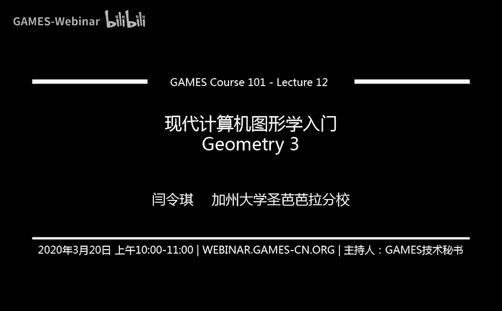

# GAMES101-现代计算机图形学入门-闫令琪 - P12：几何（三）与阴影映射 🎯

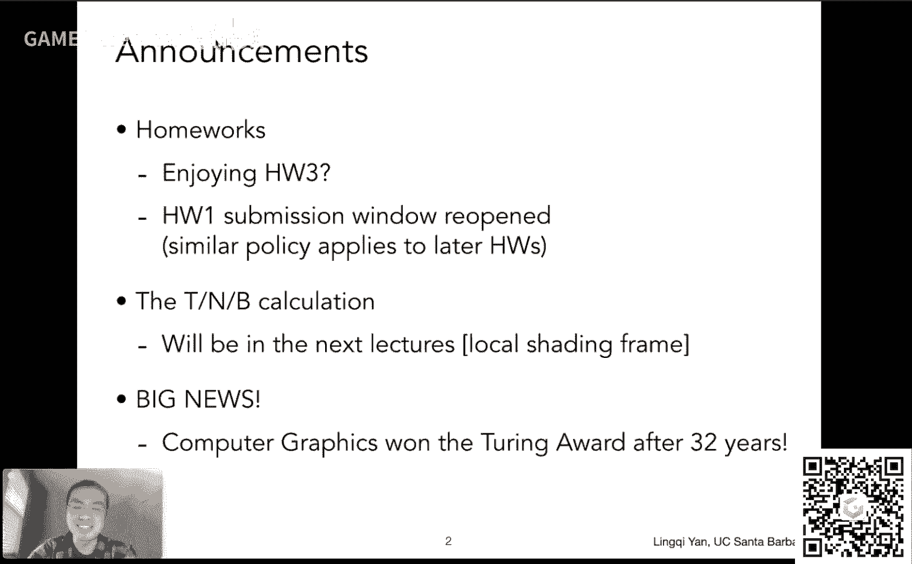

在本节课中，我们将学习几何处理的最后一部分内容，包括网格的细分与简化，并探讨在光栅化管线中生成阴影的核心技术——阴影映射（Shadow Mapping）。

---

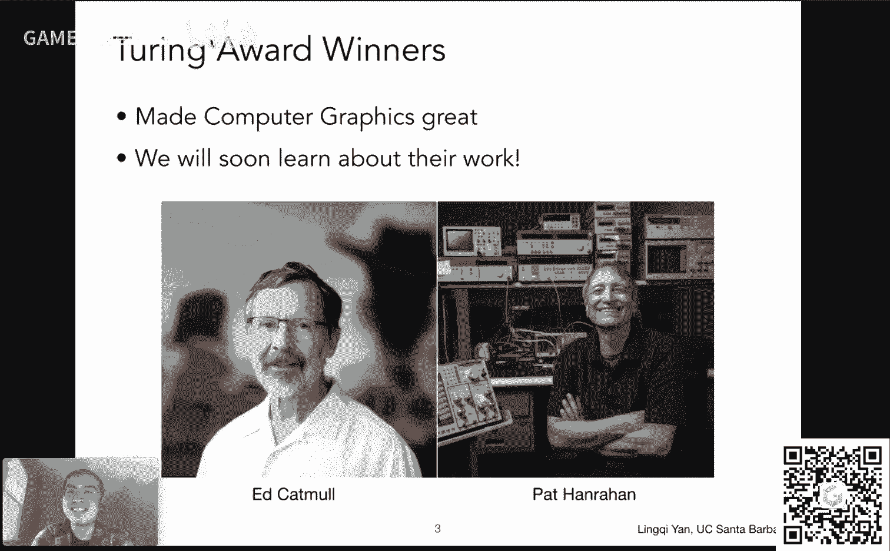

## 课程概述 📋

本节课是几何部分的最后一讲。我们将首先完成对几何处理的讨论，具体介绍两种重要的网格操作：细分（Subdivision）与简化（Simplification）。随后，我们将转向光栅化中的一个经典难题——阴影生成，并详细讲解其主流解决方案：阴影映射技术。最后，我们会简要提及光线追踪的引入动机，为后续课程做铺垫。

---

## 第一部分：网格细分 🏗️

上一节我们介绍了对三角形网格的各种处理方法。本节中，我们来看看如何通过细分操作，增加网格的三角形数量，从而使模型表面看起来更加光滑。

细分操作通常包含两个步骤：
1.  **增加三角形数量**：将一个三角形拆分为多个更小的三角形。
2.  **调整顶点位置**：根据特定规则移动新旧顶点的位置，使模型表面平滑。

以下是两种经典的细分算法：

### Loop 细分 (Loop Subdivision)

Loop细分是专门针对三角形网格的细分方法。请注意，“Loop”是算法发明者的姓氏，与“循环”无关。

**细分步骤：**
1.  **拆分三角形**：连接三角形每条边的中点，将一个三角形拆分为四个小三角形。这样会产生新的顶点（位于边的中点）。
2.  **更新顶点位置**：对新顶点和旧顶点分别应用不同的规则来调整位置。
    *   **更新新顶点位置**：对于每条边上的新顶点，其位置由共享该边的两个三角形决定。设该边两个端点为 **A** 和 **B**，两个三角形中不在此边上的另外两个顶点为 **C** 和 **D**。则新顶点的位置更新公式为：
        `新位置 = 3/8 * (A + B) + 1/8 * (C + D)`
    *   **更新旧顶点位置**：对于原有的旧顶点，其新位置由自身原始位置和相邻旧顶点的平均位置共同决定。设旧顶点度为 **n**（即连接了n条边），定义 **u** 为一个与n相关的系数。则旧顶点位置更新公式为：
        `新位置 = (1 - n*u) * 原始位置 + u * 相邻顶点位置之和`

通过多次迭代Loop细分，模型会变得越来越光滑。

### Catmull-Clark 细分 (Catmull-Clark Subdivision)

Catmull-Clark细分是一种更通用的细分方法，可以处理包含任意多边形（而不仅仅是三角形）的网格。该算法由今年图灵奖得主之一Ed Catmull提出。

**核心概念：**
*   **四边形面 (Quad Face)**：具有四条边的面。
*   **非四边形面 (Non-quad Face)**：不是四边形的面（如三角形、五边形）。
*   **奇异点 (Extraordinary Vertex)**：度（连接的边数）不等于4的顶点。

**细分步骤：**
1.  **增加顶点**：为每个面的中心添加一个点，为每条边的中心添加一个点。
2.  **连接顶点**：将每个面的中心点与其所有边的中心点连接起来。
3.  **更新顶点位置**：根据一套规则（课程中不要求掌握具体公式）更新所有点的位置（包括面中心点、边中心点和旧顶点），使模型平滑。

**Catmull-Clark细分的一个重要性质**：在第一次细分之后，所有的非四边形面都会消失，此后奇异点的数量将不再增加。这意味着该算法能快速将网格规整化。

---

## 第二部分：网格简化 🔽

在了解了如何增加细节后，我们来看看相反的操作——网格简化。当模型距离摄像机很远，或者为了提升渲染性能时，我们可能需要减少模型的三角形数量，同时尽量保持其原有形状。

网格简化不能简单地删除三角形，否则会破坏模型的拓扑结构。一种常用的方法是 **边坍缩 (Edge Collapse)**。

### 边坍缩与二次误差度量

边坍缩的操作很简单：将一条边上的两个顶点合并为一个新的顶点。关键在于，**应该优先坍缩哪些边**？

这里引入 **二次误差度量 (Quadric Error Metrics)** 的概念。对于坍缩一条边后产生的新顶点，我们希望将它放置在一个最优位置，使得这个新顶点到**它原来关联的所有三角形平面**的距离平方和最小。这个最小平方和就是这条边的“代价”。

**简化算法流程：**
1.  为模型中的每条边，计算如果坍缩它所需的最小二次误差，作为该边的“分数”。
2.  将所有边放入一个**优先队列（堆）** 中，按“分数”从小到大排序。
3.  每次从队列中取出分数最小的边进行坍缩。
4.  坍缩操作会改变其周围连接的边，因此需要重新计算这些受影响边的二次误差，并更新它们在优先队列中的位置。
5.  重复步骤3和4，直到达到预设的三角形数量或误差阈值。

这个算法是一种贪心算法，在实践中通常能取得很好的简化效果。

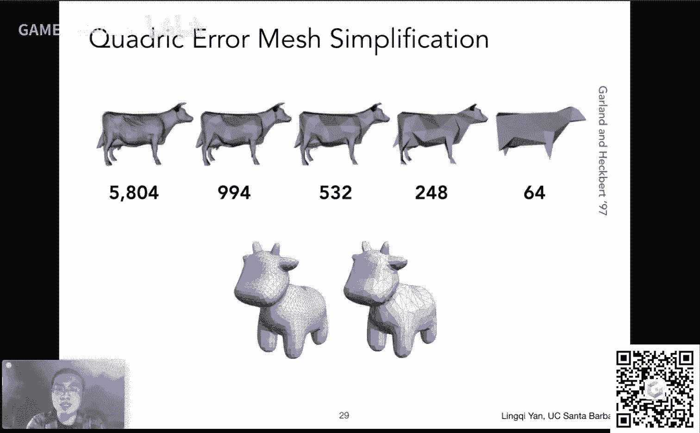

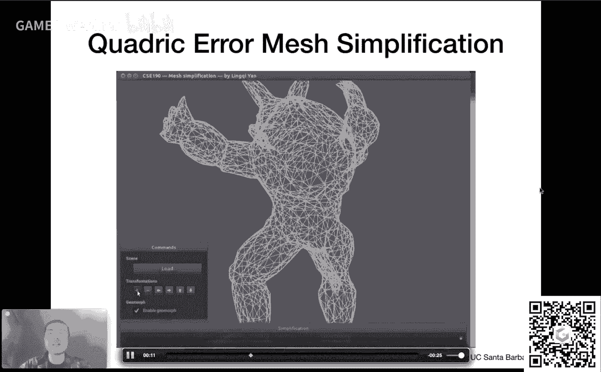

---

## 第三部分：阴影映射 (Shadow Mapping) 🌑

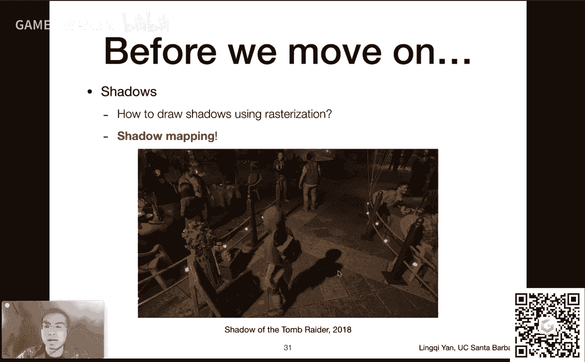

几何部分告一段落，现在我们转向光栅化中的一个全局效果——阴影。之前学习的局部着色模型无法处理阴影，因为阴影需要判断着色点是否被其他物体遮挡了光线。阴影映射是光栅化中生成阴影的主流图像空间技术。

### 核心思想

阴影映射基于一个简单的观察：一个不在阴影中的点，必须同时满足两个条件——**既能被摄像机看到，也能被光源看到**。

### 算法步骤（针对点光源/方向光源的硬阴影）

阴影映射是一个两趟 (Two-pass) 的算法：

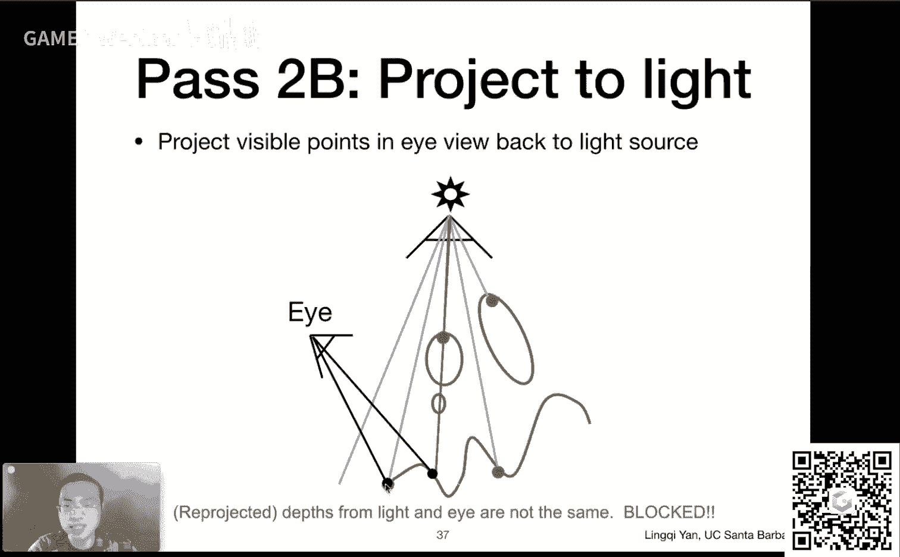

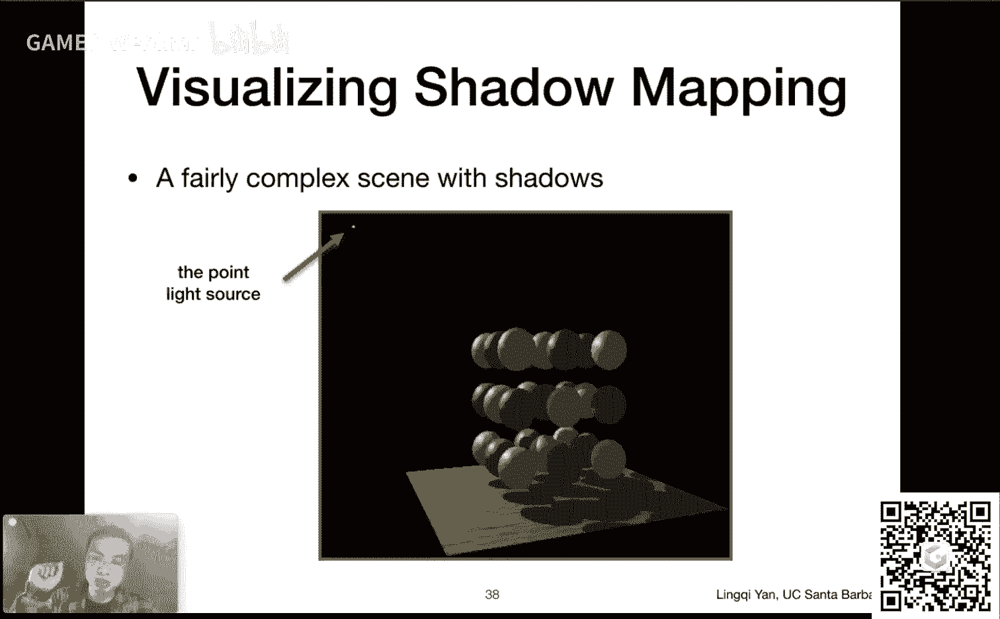

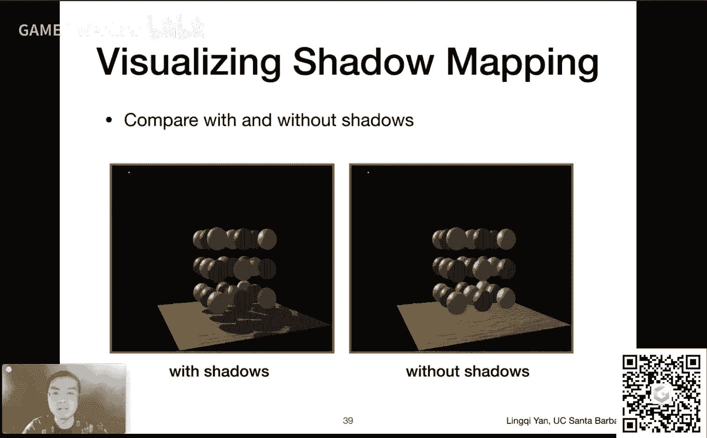

**第一趟：从光源视角渲染**
1.  将摄像机放置在光源位置，看向整个场景。
2.  像普通光栅化一样进行渲染，但**不计算着色，只记录深度**（即每个像素位置光源能看到的最近物体的距离）。这张深度图就是 **Shadow Map**。

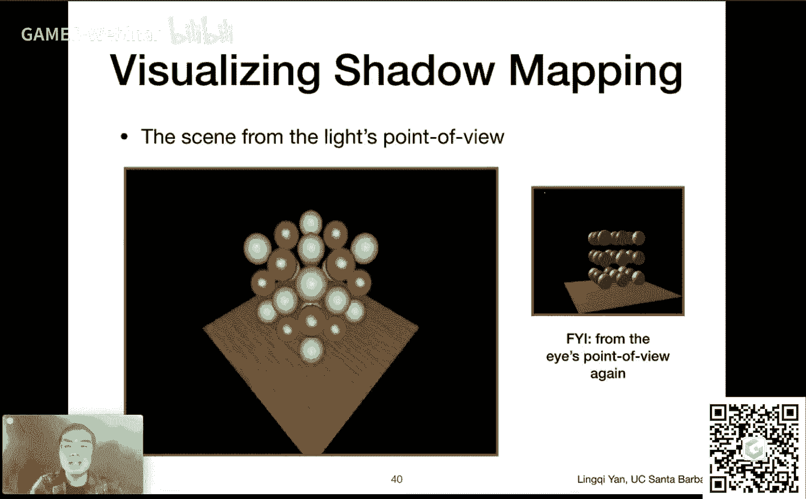

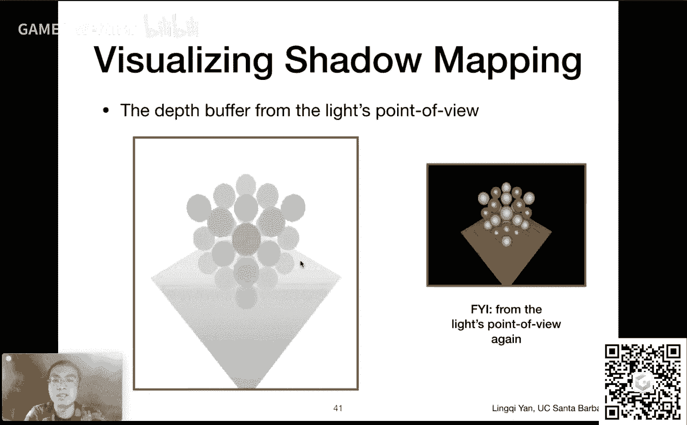

**第二趟：从真实摄像机视角渲染**
1.  从真实的摄像机位置正常渲染场景。
2.  对于渲染得到的每个像素点（即场景中的一个表面点），需要判断它是否在阴影中：
    *   将该点的世界坐标**变换回光源的裁剪空间**，找到它在 Shadow Map 中对应的像素。
    *   计算该点到光源的实际距离 **d1**。
    *   读取 Shadow Map 中对应像素存储的深度值 **d2**（即从光源能看到的最远距离）。
    *   **比较**：如果 `d1 ≈ d2`（考虑浮点精度，通常判断 `d1 <= d2 + bias`），说明该点能被光源看到，**不在阴影中**。如果 `d1 > d2`，说明该点被更近的物体遮挡，**在阴影中**。

### 阴影映射的问题与局限性

1.  **走样与精度问题**：Shadow Map 有分辨率限制，可能导致阴影边缘出现锯齿。浮点数深度比较也会带来精度问题，通常需要引入一个微小的偏移量 (Bias) 来避免“阴影痤疮”。
2.  **硬阴影**：基本算法只能生成边界锐利的硬阴影，因为判断是非零即一的（可见/不可见）。
3.  **性能**：需要渲染场景两次，增加了开销。

### 硬阴影 vs. 软阴影

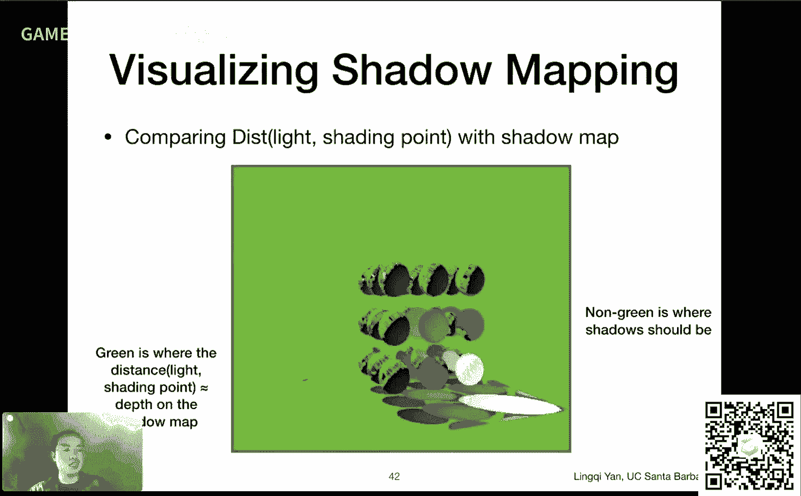

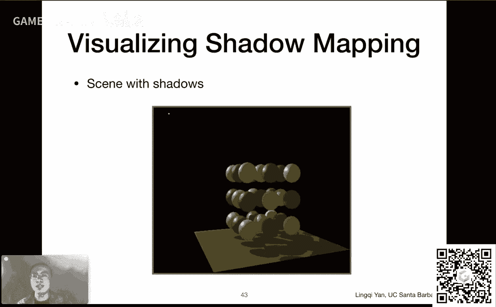

*   **硬阴影**：由点光源或小型光源产生，阴影边界清晰锐利。
*   **软阴影**：由面光源或大型光源产生。在软阴影区域（半影，Penumbra），只能看到部分光源，因此阴影有一个从明到暗的柔和过渡。软阴影看起来更真实，但用传统的阴影映射实现起来更复杂。

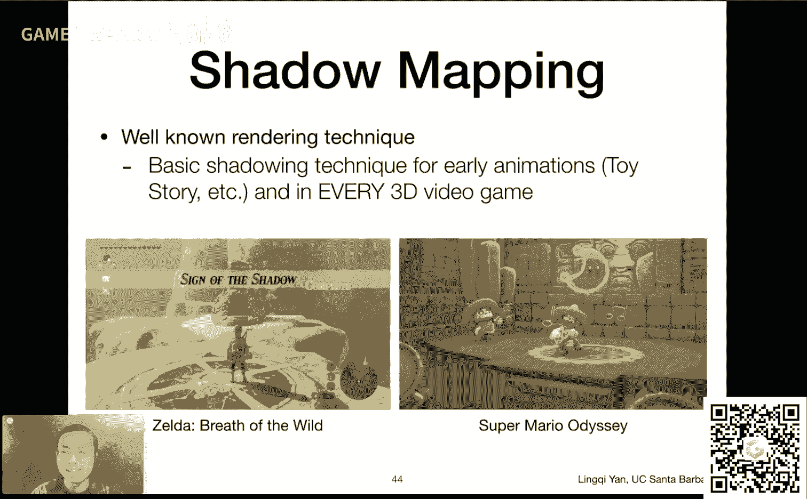

尽管存在这些问题，阴影映射因其相对高效和易于实现，仍然是游戏和实时图形中应用最广泛的阴影技术。

---

## 课程总结 🎓

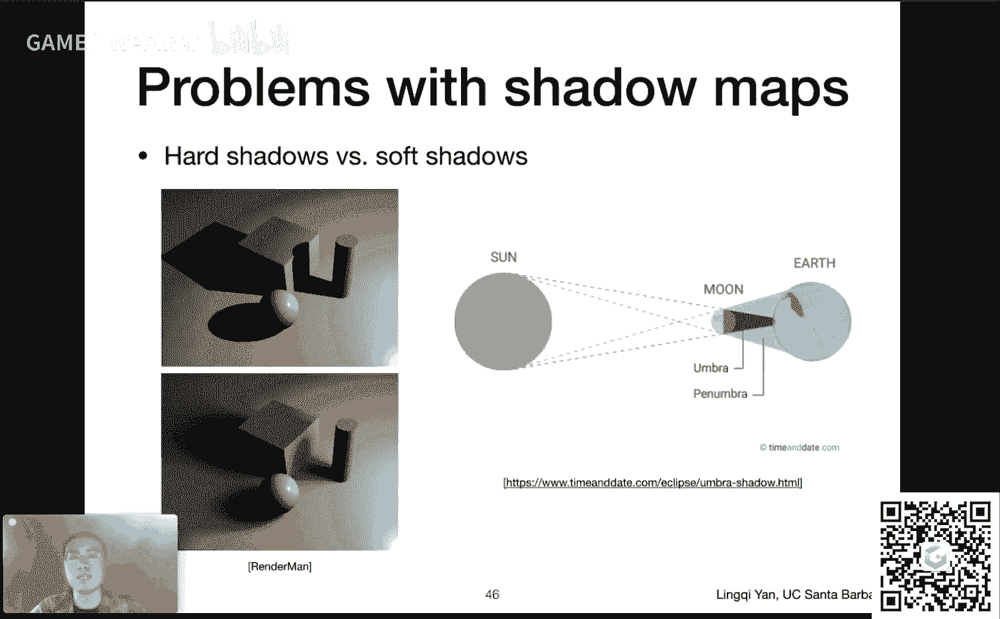

本节课中我们一起学习了：
1.  **网格细分**：通过 Loop 细分和 Catmull-Clark 细分来增加网格细节，使模型更光滑。
2.  **网格简化**：通过基于二次误差度量的边坍缩算法来减少三角形数量，在保持形状的同时提升性能。
3.  **阴影映射**：掌握了在光栅化中生成阴影的核心技术——两趟算法的阴影映射，理解了其原理、实现步骤以及存在的局限性（如硬阴影、走样）。

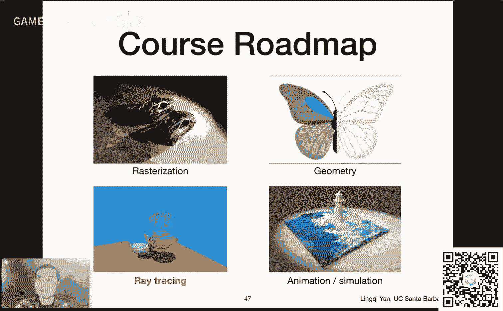

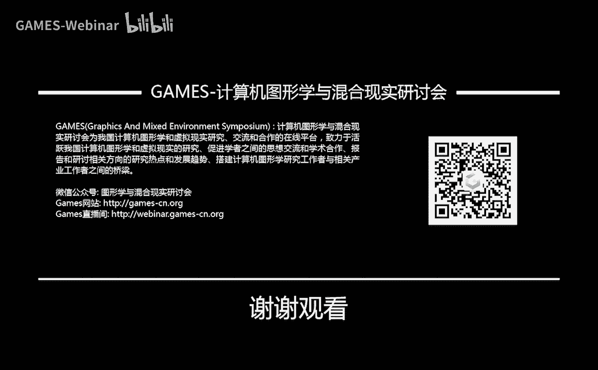

通过本课，我们完成了对几何核心处理的探讨，并接触了第一个全局光照效果——阴影。这为我们接下来学习更强大、能自然处理全局效果的**光线追踪**技术奠定了动机和基础。下节课，我们将正式开启光线追踪之旅。