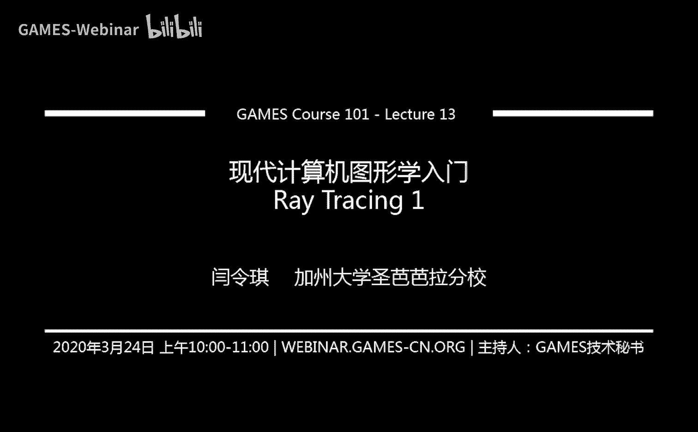
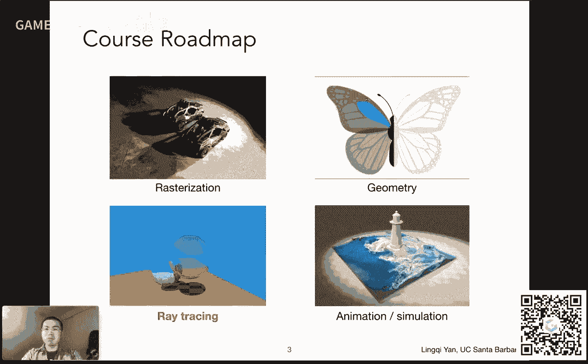

# GAMES101-现代计算机图形学入门-闫令琪 - P13：Lecture 13 Ray Tracing 1 - GAMES-Webinar - BV1X7411F744

亲爱的同学们，大家好啊，今天是咱们的第13讲，然后开始说光线追踪，特别的呢，咱们今天要讲的一个内容叫做weighted的风格，光线追踪，所谓waited style，然后这是什么意思呢。

这个待会儿大家很快就会知道好吧，然后光线追踪呢这里是咱们的这个第三块内容，大家可以看到下面这四个块嘛对吧，然后我们已经说了光栅化几何，那么今天讲光栅光线追踪好吧。

然后这一块呃还是刚才这个如果同学压着点来啊，估计没听到说我这个光线追踪，我打算稍微这个讲的深入一些，讲一些稍微现代化一点东西，因为什么呢，因为咱们这个以前的图形学课，就是国内的同行学科。

基本上就只讲到这个这个waited style，这个光线追踪，而这个得出来的结果并不是非常真实对吧，就是说这个并不是现在这个最现代化的一些解决方法，然后呢我希望多讲一点。

倒是嗯这个难度上也希望能够控制住，然后把这个内容给讲到，然后尽量让它不太难啊，之后几节课咱们这么安排，那么今天从west style开始说，那么课程之前咱们还是说几件事情，一个是关于作业四。

目前已经252分，提价非常好啊，这个这个呃大家非常积极踊跃啊，提出表扬啊，那么作业一咱们上一次已经说了对吧，以后会按照每一个星期开放一门之前的这个呃，开放一个之前的这个作业，按照顺序往往后顺延。

上周呢是开放这个咱们作业一的这个重新提交，然后目前已经有80分，然后可见这个有同学中途加入啊，然后这个现在做这个作业积极性还这么高，这个我非常开心啊，感谢大家的支持啊，那么呃有一件事情啊。

就是说国内的这个有一些学校说是联系我，说这个能不能用这门课上课，以及说这个这个最后的评分也用我们的评分没有任何问题好吧，如果你需要这个成绩的话，呃，可以让助教或者是自己联系我。

然后呢我会给到我们的这个这个作业成绩的这个数据库的嗯，就是比你这个这个访问权限应该就差不多了，然后至于说啊，至于说不同学校，你这个这个比如说重新提交算不算这个分数啊，这要扣分啊，还是怎么说。

这个我就不管了好吧，这个自己自己解决，然后因为咱们这个网课来说，那我肯定是不会去扣什么分数嘛对吧，只要大家愿意去做，没任何问题，正常的这个作业时间安排，主要是为了让大家这个能够能够嗯。

就算是按照这个课程的节奏把作业做下来对吧，然后实在是没赶上之后补就是了，对吧好，那么咱们今天这几件事情宣布就说说到这儿，然后咱们看啊，这个课程我们刚才说了，已经开始说到第三部分光线追踪。

那么大家看最左边一列对吧，咱们上节课提到这个事情啊，光线追踪和光栅化，这是两个不同的这个成像的方式，主要体会一下到底他们有什么区别，咱们为什么需要两个不同的这个方法。

对吧好，那么咱们这就正式开始嗯，首先呢我们既然要说光线追踪，咱们肯定得有一个理由对吧，我们为什么要引入光线追踪呢，那就是说我们之前在谈到光栅化的时候，一定定是他有些问题解决的并不好，对不对。

我们应该想想想什么办法这个嗯把这些问题解决掉，那到底是哪些问题呢，咱们看一下啊，嗯光栅化它最大的问题就是说它不是很好去表示一些这些全局的效果，就是所谓global effects呃。

这下面给大家这个简单的列举了几个，咱们上节课提到说如何用这个shadomapping的方法去做阴影，咱们也提到这个方法，假设后面是点光源，然后只能做硬阴影，当然后面有人把这个嗯问题改进了一下。

然后能够把它给改进的，能够支持软阴影，像这里大家看到的这个现象很明显，软阴影对吧，这个阴影这个随着离物体越远越来越模糊，然后这个啊阴影啊当然是一种全局的效果，然后咱们这个折腾半天对吧。

用这个两趟不同的渲染渲染这个模式，然后解决了这个嗯点光源嗯形成的硬阴影问题，所以说呢整体来说光纤光栅化做这个阴影还是挺困难的好吧，那么第二个问题是什么呢，就是嗯这种嗯glss反射。

所谓glc应该是这怎么说呢，就是说嗯这种反射呢，它嗯就说这种物体的表面啊，它又有点像这个镜子，但又没有镜子这么的光滑，就好像一些打磨这个嗯打磨的比较光滑的金属。

大家知道这个中国古代是用这个铜镜去照镜子对吧，像这种铜磨得非常光滑，之后，仍然和现金的镜子不能比，然后像这种的这种材质啊，我们就管它叫做glossy，然后glossy呢就是表示这个有那么些高光。

这么这么这么一种有反射的这种效果，但是它其实又有点这个本身的粗糙性啊，在这这种情况就是glossy的反射，那么这种反射呢很显然大家可以想象啊，这个光线怎么反射对吧，光线打到一个物体。

然后反射是必要达到另一个物体，然后再打到人的眼睛，那就会发现啊，这种情况下，光线在场景中这个谈了两次，对不对，就是第一次打到一个物体啊，然后反射到另外一个物体上，又是另外一个点，然后再打到人的眼睛对吧。

就比如说啊这个大家看这里其实光源来自于什么呢，这是一个屋子啊，光源就来自于这些大的窗户，然后这些这些光线呢可以照到哪儿，比如说照到这个这个这个地板嘛对吧，要照到这个地板，然后呢它这个会经过漫反射。

会反射到某一个位置上面去对吧，然后他有可能反射到某一堵墙，又会漫反射，然后再在这个场景中不断的弹射，不断的弹射，最后才打到人的眼睛里面去，所以这个从这个角度上来说啊，我们其实那这个对他的正式的定义。

咱们之后也会再说啊，就是说现在的理解很简单啊，就是说光线这弹射不止一次，就是在在到达人眼之前弹射不止一次，那么在这种情况下，光线可以弹射很多次到人的眼睛里，那这个要怎么样去做出来，对不对。

比如说我们之前做公开化，然后我可以做一个这个所谓着色对吧，这是嗯肯定是考虑这个光线只弹射一次对吧，从光源到这个着色点到人的眼睛对吧，我们之前还做过这个嗯blame for这个这个模型对吧。

所以说像这种情况，当光线弹射很多次的时候，这种情况光栅化就非常非常的低效，就不好不好，在这个做这些效果，当然不是说不行啊，人们还是很聪明的人，这个发展出了很很多这种不同的方法。

然后使得光栅化可以支持这些效果，但是都挺嗯嗯就是说比较麻烦之一，然后另外一点是也不能保证这个物理上的正确性好吧，就是说呃光栅化的局限怎么说到这儿。

然后呢，我们为什么要用光线追踪，然后我们刚才提到这光栅化有有一些问题对吧，然后光栅化呢通常情况下咱们不说具体问题，大家会认为光栅化是一种很快的，但是一种很近似的渲染方法。

然后比如说大家看到这个这个车子啊，这个车子是这个游戏绝地求生大逃杀里面的一个车子叫bargain啊，然后这个车子然后大家可以看到嗯，对于目前这种渲染来说啊，一一看，首先没有阴影，这可能是画质调比较低啊。

一个这个背后的这些石头什么东西，这个模型细节程度也非常低，然后纹理什么也看不太清楚对吧，然后大家一看就知道，这当然是一个这个很原始的这种这种这种渲染的这种结果啊。

然后就是说呃为什么大家这个只能做到这么原始的效果呢，是因为这个游戏本身地图非常的大，然后整个渲染这个对gpu的这个要求非常的高，所以说他们对画质上不能做更多的这个这些要求。

所以说啊这个光栅化本质上来说它是一种这个快速的近似，然后质量相对较低是这么个意思啊，然后嗯咱们对比一下呃，我们要提到的是光线追踪，那么光线追踪呢是一种准确的方法，但是一个但是它也是也有问题的对吧。

它并不是说能够替代所谓光栅化的一个一个一个做法，嗯，他呢有最严重的问题就是会非常慢，咱们第一节课给大家提过这个问题对吧，这个呃光栅化通常咱们是瞄准实时的应用来的，所谓实时每秒钟生成超过30帧的图对吧。

那这个光线追踪它其实更多被用来做一些所谓离线的应用，叫offline的应用，也就是说大家看到的这些电影啊或者什么东西，大家可以这个你可以想象这个嗯电影的这些制作商就是迪士尼。

然后他们会花大量时间生成好这个电影，然后把它制作成这个视频，然后之后再放给你看，就是说生成这个过程会非常慢对吧，然后然后有多慢呢，咱们之前说过一针吧，一针就需要花10k，也就是1万个cpu小时。

然后大家可以想象一下，就是正常情况下对于一个多核的cpu来说，可能稍微降低一点吧，比如说咱们可以照这个呃这个一一千这个cpu小时来算，生成一张图，那对比一下咱们这个光栅化它的这个速度。

那显然就是没有办法可以比的对吧，就是说它是一个非常非常慢的做法，然后呢这个大家看到这么一个例子也是哈，这个例子有双重意义，一个是这哥们儿非常慢对吧，然后另外一个意思是说生成就单说这幅图。

这个这个疯狂动物城里面的这一幅图就会花非常非常多的时间，然后所以说呢这个质量对吧，质量和这个呃速度通常就是一个所谓我们说trade off，就是通常啊图形学里面大家应该已经接触过很多次了对吧。

咱们做m s a a对吧，然后提升抗水质量，但是或者造成结果会让结果变慢对吧，这里是完全是一样的，图形学生有很多理由难的问题啊，像这里这个光线追踪和光栅化的比较也是如此，好吧呃那这个光线追踪呢。

这里算是一个简单的和这个光栅化方法的对比，那么它嗯嗯这一点呢为什么要提前说呢，就是说大家知道说这个它是一个比较慢的方法，大家在做做作业的时候就会体会到啊，然后另外一点它是一个质量非常高的方法。

然后这这个是完完全全符合物理规律，能够给大家带来这个最真实的这个渲染结果的一种方法，好吧，那么咱们从最基础的光线追踪算法开始，那么嗯是这么回事，就是说啊在定义这个光线追踪之前对吧，怎么做对啊。

之前咱们先把光线给定义下来对吧，我们追踪的是光线对吧，那么光线是什么呢，那咱们现在看这里呢有简单的这个三个这个想法啊，然后呢就是相当于是我们在整个一个图形学中啊，嗯基本就是这么假设。

首先光线是沿着直线传播的，这个按说是没什么问题对吧，但其实来说严格意义上来说，这个光线这个其实它是一种这个光波，对不对，然后它有波动性，然后在一定程度上我们需要考虑它的这个波动性质。

但是对于咱们这个课来说，咱们就说这个光线其实是这个呃沿直线传播没问题好吧，然后呢嗯那么第二点呢，这个光线和光线啊它不会发生碰撞，你比如说有两个光线从这这这两个不同方向过来对吧。

然后它发生了某一个点上发生交叉，不耽误两个方向，两个光线各传播各的中间不会发生碰撞好吧，这一点当然还是不对的啊，但是我们仍然这么假设没问题，然后呢这一点非常有意思呃，或者说重要是什么呢，就是说光线啊。

它是嗯肯定是会从这个光源被发出来对吧，达到场景中，然后在场景中不断地经过反射折射啊，一系列的这个操作之后，最终进入人的眼睛对吧，我们之前不止一次提，为什么我们可以看到这些图像。

是因为有光线进入了我们的眼睛，所以光线肯定是从光源出发，最后到达我们的眼睛，那么整个光线追踪就在试图做这么一个模拟的过程，那么这里呢所谓嗯光线追踪，其实它应用了一个光线的一个呃传播的一个性质啊。

这个性质是什么呢，叫做这个这个啊reciprocity，大家可以看到是这么一个性质，这个性质是是说什么意思呢，就是呃光线的可逆性啊，什么叫可逆性呢，就是说啊我可以理解成这个呃从光源发出光线。

然后在场景中打着这个这个不断弹射打到人的眼睛里，我也可以认为我的眼睛是可以发出一些这个感知的光线，然后然后这个打到这些这些这个物体上，最后最后打到光源上面去，没有问题。

就是说如果我在这个场景中找到了一条光路，也就是说啊，如果光里面可以通过某种办法看到我的这个这个相机，我的相机也有也会反过来这个看到这个光源，就是把所有的这些光线的这个方向都给变成了反过来的。

仍然是一条可行的光路啊，这个我们之后会更多的理解啊，然后这里呢这引用一个一个这个是一句诗哈，就是当你凝视着深渊的时候，深渊也在凝视着你，当然这个这个可不是从黑暗之魂里面出来的哈。

这个这这句话原本是尼采说的，他写的诗啊啊ok然后嗯这就反应了说啊，当你比如说你能看见一样其他什么东西，通过镜子或者什么东西，如果对面有一个人在你看到那个物体附近，它一定也可以看到看到你。

这就是说把这个光线的这个传播方向全部给倒过来，我就假设说从这个呃从我的相机可以发出各种各样不同的这个光线，然后呢呃我同样达到这个这个光源也可以形成一条有效的光路，这就是这个光路的可逆性好吧。

那么光路的可逆性呢，其实很早就有人研究这个问题啊，就是说大家可以看到这个早期啊，这个在这些欧洲这些这些当时这科学启蒙的时候啊，然后有很多人会这么认为，说我们看到的东西是怎么回事呢，是因为我们的眼睛大。

大家看这个这个呃下面的标题哈，就眼睛会发出这种所谓感知光鲜打到这个世界中去，然后这个光线会被物体挡住，那我可不是看见东西了嘛对吧，然后当时这个理论咱们现在看起来很荒谬啊。

但是这个大家可以看到有很多名人都在支持他，这是一个著名的这个叫什么这个这个这个就哲学家哈，然后这里这个呃柏拉图有呃欧基里德和托勒密啊，然后这个大家还可以看到。

有50%的这个美国的大学生也支持这这么一种言论啊，这个当然了，这是一个对这个对对这个世界的这个错误描绘啊，但是在这个光路的可逆性下，我们确实是可以这么理解的。

而这也就是所谓光线追踪这个追踪这个这个词的意思，我们做光线追踪实则是从这个呃从我们的相机出发，或者从眼睛出发，然后往这个世界中去投射光线，然后把这些光线在世界中不断的这个呃这个这个呃弹来弹去啊。

然后最后在这个连到一个这个光源上面去，然后我们实质上是这么做的，所以说呢当时大家肯定不会想到，这个是因为光路的可逆性造成的这个事情，不过呃现在看来一定呃有一定的道理对吧好，那么咱们这个继续这个话题啊。

那么我们刚才说啊，嗯光线追踪利用的就是所谓光光线呃，这个可逆性，那咱们从这个光的光源出发是一种思路，那么这个所谓呃我们的光线追踪呢，那既然要追踪对吧，那我们从它的这个最后终点开始。

也就是从我们的这个眼睛或者相机开始，然后怎么做呢，这里就是说首先我们要做光线的投射，怎么投射呢，很简单，我们假设啊我们现在在往一个这个虚拟的世界中看。

然后我们面前放了一个这个所谓的呃这个这个就成像的平面啊，就是在我们的眼前，然后成像平面被我们化成了这个不同的这个像素的这个这个格子对吧，对于每一个像素，我们可以从摄影机连一条线穿过这个像素。

然后我们就可以打出去一根光线，然后这根光线我一定会达到这个这个场景中的某个位置，或者说和场景中什么东西都不相交，那如果它和某一个物体发生相交，我知道它就是说所谓我沿着这个方向看看到了哪儿。

然后呢我再把这个点和光源做一个连线，然后这是要干什么呢，这是要判定是不是说啊这个点是不是对光源也可见，也就是说我要判定他是不是在阴影里，如果他不在阴影里，也就是光源也可以照得到它，诶。

那我就形成了一条有效的光路，什么呢，从光源到这个点，再到我的眼睛，那我就可以计算这条公路上带的能量，我自然就可以把这个这个最后我看到的颜色算出来，这部就是着色对吧。

所以说这个呢所谓光线投射就是在做这么一个事情，怎么样去生成这个这个不同的光线啊，那咱们看一个这个这个实际的这个例子哈，就比如说这里啊，在咱们说这个之前啊，就说我们提光线追踪呃，这个整个光线追踪啊。

其实有一些假设的，比如说我们认为我们的眼睛永远是一个这个针孔摄像机，也就是说眼睛是一个点，是一个位置啊，就是我们不考虑实际的相机应该要应该要怎么样处理，就是说嗯有一个这个大小的镜头。

这种这种呢我们之后说路径追踪的时候会给大家说，然后光源这里呢我们也假设是个点光源，然后对于场景中的这些物体呢，我会认为说这个光线打到它之后，它会发生完美的折射或反射啊，是这个意思。

就是说比如说我这个光线有一个打到这个球，然后它会沿着这个镜面反射的方向，这个被反射出去啊，我们认为它的反射会就是这这么一种完美的反射或折射方式，那么这是前提，那咱们先来看看啊。

就首先我我们刚才说所谓光线追踪，那么从眼睛开始往场景中的这个，我们前面看了成像平面中的任何一个像素呃，投射一根光线，然后这根光线呢会达到场景中的某一个位置上去对吧，然后这里大家会看到哦。

我连这么一条光线，我会达到这个球，然后呢这里我们就管它叫做i ray，就这根光线啊，就是从这个眼睛出来的，或者叫camera ra，然后这种情况这都是大家起的名字。

也就是第一个从这个眼睛到这个场景中连出的第一根光线好，那没问题，那肯定是对，每一个像素都是要这么做啊，咱们现在先针对这一个像素这么说好，这是艾瑞，然后呢，我们刚才说把这条光线投射出来之后。

它会达到这个场景中最近的一个物体，那对应就是这里对吧，找到这么一个点，但事实上来说这个光线这个呃它可以和很多物体相交对吧，然后那我们知道这些物体互相会产生一些遮挡什么东西。

然后呢考虑到这个我们人眼看到的肯定是最近的这个东西，因为它会遮挡到别人其他的各种各样的点，所以说这根光线呢，我们永远要考虑的是这个和场景内的物体的最近的一个焦点，诶。

这里也就是说啊呃也就是说我们只说了这么一点，怎么样去投射光线，其实我们就已经解决了呃，对完美的解决了这个深度测试的问题，大家可以想象一下，在光栅化里面我们费了多大的这个这个功夫啊，去做这个深度缓存对吧。

然后然后这个呃每个像素要记录不断记录它的这个最近的这一点啊，没有问题，就是说呃对于我们这个光线投射来说，道理是一样的，沿着一根光线我们记录它的最近的这么一个焦点，那怎么做，咱们之后再说好吧。

但道理就是最近的焦点自然会遮挡住别人那行，然后呢嗯咱们就可以再继续看这个事情，那么当我发现了一个点之后怎么办呀，求到了一个焦点之后怎么办，那么这个时候我就要考虑好，那这个点会不会被照亮对吧。

然后我们怎么办怎么办呢，就从这一点往光源连一条线，然后这就是我们要连的第二根光线，这根光线呢我们管它叫做shadow r，然后就是说我要判定这根光线，如果说沿着这条光线中间没有任何物体阻挡。

那我就知道光线可以照亮，而光源可以照亮这个点，如果有东西挡着，那我就一知道这个点一定是在阴影里，没错吧，那当然这里看到大家看到这个黑色箭头就是在这一点的法线啊，我们这个求出来的一个焦点之后。

自然任何一个位置我们都知道它的法线是多少，然后啊那这里就是说呢有了法线，有了入射方向，有了呃入射方向，然后有了出射方向，我们就可以算这两个着色对吧，这一点呢着色之后算出来之后。

我们就可以把它写入这个像素的值对吧，所以这是一个很简单的一个事情，那这里看我们把这个这个点呢这个颜色算出来之后写入这个像素，那就是这么做的对吧，然后怎么做着色呢，各种各样的着色模型。

咱们之前提过不临风对吧，各种各样的方法都是可以的，那么大家看到啊，这光线投射做的什么事情，每一个每一个像素首先投出去一根光线，从这个呃眼睛开始，然后和场景相交，求最近焦点。

找到焦点之后和光源连线第二条光线，然后判定是否可见，然后呃是否对光源可见对吧，是否在阴影中，然后我就算这个着色算着色之后写回这个这个像素的值，那听起来是一个很这个自然而然的过程，对不对，然后呢。

这个之前就是这么一种方法来生成这个，这个这个就是就是说和和光栅化能够得到这个近似相同的结果，但刚才啊有同学应该已经看到了对吧，我们考虑这个光线啊，打到这个场景中间这一个物体之后，求它求它的着色。

求它的阴影，没问题，然后呃这个不还是考虑这个光线只弹射一次嘛对吧，那我们说光线其实可以弹射很多次，那怎么办呢，那就是这里我们要给大家说的，也就是这节课的主要内容就叫做这个所谓witted风格呃。

光线追踪，然后它本身是一个这个递归的算法好吧，然后嗯这是什么意思呢，就是首先来说啊，这个命名是由这个turner waitted呃，是是是由这位这个这个也算是上古大神啊，他这个发明的这个方法。

他这个方法呢大家可以明显的看到，比如说呃这里看到一个这个玻璃球呃，一个玻璃球应该是左边这个球以及一个类似镜子的球，也就是左边这个球基本上是在做折射对吧，右边这个球基本上是在做反射，那咱们想一想。

那比如说光线打到这个球之后发生一次折射，然后进入了这个球内部，再发生一次折射出来，然后再打到某一个物体上，达到它背后的某个物体上，所以说这个wait的方法啊，它是可以做这种风格的。

这个呃这种光线追踪的那当然可以得到一个不错的效果，那就是这里大家看到这个效果啊，还是还是挺不错的，在那个年代哈，然后当年渲染这一幅图需要74分钟，然后06年的pc就只需要六秒。

现在来说对这个对这个场景来说呃，如果放在这个实时光线追踪里面，用我们最新的这个gpu啊，咱们应该可以做到嗯，几百帧，几千帧应该都是可以的好吧，每秒啊，所以这个硬件的这个进步也是很惊人的。

考虑到这个和当时的这个效果比较对吧，好，那么这个witted的风格光线追踪到底是怎么做的呢，那咱们这之后就开始说啊，那么这个我们还是从刚才的所谓光线投射开始啊，光线投射可以可以这个呃每一个像素啊。

我们找到最近的这么一个这个点对吧，然后呢我们考虑在这个点上，如果这个球啊本身是一个这个呃玻璃球，那我们知道当一个这个光线打到玻璃或者什么这种这种透明的，这种这种介质上，肯定有两种现象发生。

第一有一部分能量要被反射掉，另外有个能量要要折射这个进去对吧，然后这个但是这个比如小时候都做过这种物理实验对吧，有一个这个激光打到这个水面，然后大家会发现一部分要反射，一部分有折射进去。

这里一样没有问题，我们知道有多少能量会沿着它的反射方向诶继续传播，那也就是说啊，我们从眼睛投射出来光线打到一个点的时候哦，如果这是个玻璃的材质好，那我知道我对啊，我在这个点上应该要做一个镜面反射。

还记得咱们刚才假设吗，我们假设这个反射都是完美的反射啊，这里就是这个这个作威特的风格，他假设的内容好，然后这里呢这这条光线当然大家知道这是反射光对吧，没问题，然后呢嗯同样道理，这根光线咱们刚才说了。

到这里它是个玻璃球，它还可以折射进去对吗，它可以折射进去，然后呢这个在内部再传播，他肯定还会打到另外一个点，打到另外一个点再折射出来对吧，也就是说它这个咱们看啊，比如这一条所谓光路啊。

这个也就是说它可以弹射很多次，无限次，这个可以永远的一直这么做下去对吧，这是没有问题的，然后嗯就是说啊这个wait的风格，他说的其实就是这么一个意思，只需要这个你正确的算出来它的反射方向。

折射方向就可以了，好那么呃还是一样刚才的定义哈，这个这两条光线自然就是折射光，没有问题好，然后呢在呃这个waited style这个这个光线追踪里面啊，它所算的这个着色也发生了一点点变化，是什么呢。

就是说啊我这里原本说光线投射投射找到这个点之后哦，这个点看是不是能被照亮，然后我就计算它的着色，但在这里由于光线这个弹射的次数多了呢，我其实在每一个彩弹射的点，我都会去计算它的着色的值，就是这么个意思。

大家可以看到这里呢，一共这个这个目前每一个这个和场景中间的交点啊，我都去和光源做一条连线，诶，我去看在这个点上，这个光源是不是能够照亮它，就是这么个意思，比如说像这个点，咱们认为能够照亮这个点呢。

自然就被这个三角形挡住了，就照亮不了这个点呢就可以被光源所照亮，那么这样一来呢，其实啊最后嗯这个wait的风格光线追踪算了一个什么事情呢，算了一个啊。

就是说我的光源如果可以照亮任何一个这个弹射的这个点啊，那我就把这些这个弹射的点，这个内部就是我算出来的这个着色的值，都给最后加到这个像素的值里面去啊，是这么个意思，就是说我在这一点算一个着色。

那么在这一点再算一个着色，这两点的着色都会被加到这个这个像素里面的这个值里面呃，这个很简单对吧，因为有这个嗯嗯其实这里已经定义了两种不同的光路了，一条是什么呢，一条是这个你看呃光源到这个点再到人的眼睛。

然后另外一种传播方式是光源到这个点到这个点再到人的眼睛对吧，那光光自然可以往各各种各样不同的地方传播，所以这两个路径都是可行的，所以它会把两个部分的着色的结果都给加回去，那同样道理。

这个地方还会发生一定的折射，那折射这里也是对于这个点和这个点，它会形成这么一条光路对吧，然后以及这边这边被挡住了，那就没有这个光路，但是如果有的话，他也会把这点这点加上，就是光源到这个着色点呃。

到这个着色点，这个着色点最后到一点里面好，他就把这些着色的值呢全部都算进去，那么大家看到了，为了算着色，我要算它的可见性，每一个这个弹能弹跳的这么一个点啊，我都要这个连一条这个所谓的shadow。

然后我来看他是不是在阴影里，是不是应该算它的这个这个呃就是最后的值得这个贡献对没问题，然后有同学反映说这里是不是有能量损失，当然了，否则的话他这个经过不同的这个这个越来越多次数的这个弹射啊。

那可不是说这个能量会这个一直累加一直累加，那最后看到的结果可就是这个完全就是类似过曝的这种图了，对不对，就是说完全是白的嘛，就是说这里啊大家可以看，比如说在这一点原本能量过来，假设百分之百。

那么呃我们认为比如说啊折射的这个能量呃占了40%，而这个能量占了60%，那自然这些都是会考虑进去的啊，这个没有问题好，然后嗯呃我们在这里呢再简单再定义一下这个事情，这个是是就是说啊对于不同类型的光线。

我们在这里做一个简单的归类，很简单，什么呢，就是说之前我们定义了camera a或者iv对吧，就是从眼睛这边开始打出来的第一根光线，往各个像素这个嗯这个中心连的这些光线um。

那么这些光线又被称作这个primary，然后在之后的这些这些弹射，它就是说在一次弹射之后，这些这些光线我们都可以管它叫做这个secondary race好吧，然后呢我们又区分一下。

我们往光源连的这些连接，我的判定可见性的这些叫shadow y，这也是大家不同的一些分类吧，反正这也好理解，没问题啊，啊这是基本上这个这个wait的风格的这个光线追踪的一个做法。

那么大家可以看到这个最后把结果呃，无论如何把这些光路的结果全部加到这么一个点上面去，呃这像素上面去我们就可以看到最后的这个结果，那么这从这个结果上，我们其实还可以看到一些这个其他的这些这些信息。

比如说啊比如说嗯这个阴影，这个阴影看起来就是就没那么暗对吧，这边这个阴影呢就相对较为暗，那么这是为什么呢对吧，大家可以想象呃这里怎么来的哈，就肯定是说我有这个呃嗯一根光线从camera出发。

然后连向某一个像素，然后它打到地板上的一个点，然后基本上一个点呢，然后他这个这个往某个方向，然后去这个弹射，然后我会发现它会穿过这个玻璃球，然后还会接触到一定的光照，没问题吧，从这个角度上来说。

就是说嗯这个对于镜子的球，它会挡住这个这个所有的这个光照，然后对于这个这个玻璃的球呢，然后这个呃这个光线会有办法能够穿过它，然后自然这里会收到更多的能量，当然它本身肯定涉及到有能量衰减。

所以一定会投射出来一个阴影，只不过会非常这个这个蛋就这么个意思啊，就是说这样一来就可以看到这个呃这个所谓wait的风格，光线追踪的好处了对吧，那么有同学说这中间有很多这些技术问题，我没有说对吧。

我们挨个儿之后解决，就是怎么判定是不是这个光线被遮挡住对吧，怎么怎怎么在这个判断说这个光线投射出去会打到哪里，怎么样求这个呃这个呃所谓的反射光的方向和折射光的方向对吧，以及他们各自带的能量。

这能量得守恒啊对吧，然后就是说这个衰减又应该怎么算，但是不管怎么样啊，刨刨除这些，这个咱们不说的这些，这个就目前还没还没交代的这些这个技术细节啊。

就是单说这个呃光线追踪本身所谓waited style对吧，然后这个还是挺好理解的，我觉得基本上来说就是在模拟光线不断弹射的过程好吧，那么行没问题嗯，到这里呢就是说把这个基本原理告诉大家。

那么咱们现在开始一个一个来解决这个技术问题。

那咱们要解决的第一个技术问题就是要求这个焦点没错吧，就是说啊在这个所谓着色各种各样的这个之前，咱们这个肯定最早是说光线投射出去之后要打到谁对吧，也就是说交点怎么求，我们要求光线和物体表面的交点好。

那么这里呢我们既然要求焦点呢，肯定涉及到各种各样复杂运算，那咱们先把数学上的光线给定义出来，那么所谓光线其实在数学上它就是一个射线，对不对，很简单，有一个呃起点对吧，有一个起点有一个方向。

那咱们之前说过方向都认为是单位向量没问题啊，然后有一个起点，那么怎么定义呢，一个点光源啊，我们认为点光源，然后呃或者说这个光线的起点是某一个点，我们认为是o啊，然后它的这个这个传播方向。

它的传播方向我们认为是d，所以说我们就用这两个这个这个量就可以定义一条光线，非常简单的事情，那么在光线上的任何一个点我都可以用o加上td来表示对吧，因为沿着这个这这这条光线啊。

这无非就是说这个呃从o开始往b方向走了多远，那所以当然就是o加上t d，那这里呢由于光线是射线，所以说我们认为这个光线啊它只能往这往一个方向传播，所以t大于等于零小于无穷大。

而这个时候呢就是我们在回到之前所说，这个我们通信学里很少去考虑这种这种边界的这种条件，比如说t到底是我们认为是大于零还是大于等于零，其实问题不大啊，就是说那咱们就这么理解，这简单地定义了一条射线。

也就是说任何一个沿着这条光线的任何一个点，我都可以用简单的这个rt也就是o加td来表示，这个没问题啊，简单那呃都是什么意思啊，就是说任何一个点沿着一条一个光线，我们叫r点对吧，在这个t时间。

它是这个从这个起始位置加上t乘以这个方向没什么问题好，那么我们来说这个最简单的这个情况啊，光线如何与各种不同的物体求交，咱们从最最简单的物体来说，光线怎么和球去做焦点好吧，那么咱们这个光线的定义。

咱们刚刚说o加上td，然后球的定义，球的定义，这个是也是一个挺简单的定义对吧，就是说我们可以把它的这个隐函数的表示解出来，然后就是说球上的任何一个点啊，然后这个到到什么呢，到他这个球心的距离。

球心c的距离都等于半径啊，就说的就是这么个事情，超级简单的一个定义，所以这就是为什么p减c的平方减二的平方等于零对吧，这是这是对于这个呃三维情况下来说，它就定义了一个这个球的表面对吧。

那么我们现在要求光线和球的交点，那这个要怎么做呢，那我们就在就想这么一个事情，数学上我们如何定义一个交点，什么叫交点对吧，这样想，那交点其实就是说这个点它又在光线上，又在球上啊，那这个才是叫交点。

那么既然这个点又在球上，又在这个这个光线上，那它势必要满足这两个这个不同的这个物体呃，它表示的这个这个函数，两个函数都得满足对吧，它它是既在光纤又又在这个球上对吧，所以都得满足的话呢。

那我就说任何一个这个球上的这个点p对吧，它同时也一定是沿着这个光线走了这个某一个时间的，也就是说啊我可以说o加上tb这么一个点减去这个球星，没错吧。

也就是说这个点p它又满足o加td又满足这个下面这个式子，p减z平方嗯，减r平方等于零对吧，那我们就可以把两个合在一块儿考虑，那和在一块考虑什么量，我们是不知道的啊，我们要解这个焦点，对不对。

那这个焦点现在我们看了这个这个这个o点这个地方向，然后现在不知道的呢，就是这个t对吧，就是传播多久可以打到这么个球，就这么个意思对吧，那么我现在自然而然有这么个式子，我就可以把它解出来，怎么解出来呢。

那大家可以看到它无非就是一个二次函数，然后这个呃我们可以把它给展开成这个a t平方，加bt加c等于零的形式对吧，我们为了解除这个c嘛，然后呢这个二次函数怎么样求解这个根呢对吧，这个很简单。

那么直接可以解了出来，大家还记得这个公式吗，对2a这个这个分之负b加减根号下，这这这么这么些东西对吧，然后这个a abc分别都是什么，这是数学运算啊，没有任何这个困难的地方呃。

这个就是说简单的把这个式子展开整理成这个这个二次的形式，然后就可以解除这个t是多少，那么根据我解出来的t的这个数量，首先我们这个要满足这个t得有这个物理上的这个实际意义，t得是这个呃正的对吧。

我们刚才说他是这个光线是射线嘛，t的是正的，这是一第二呢这个嗯就是说呃解出来的这个这个嗯解出来的这个根，他要有实际的这个这个物理意义，也就是说它不能是个虚数，它得是这个实数。

所以b平方这个一定得大于等于4a c的时候才会有个交点对吧，然后根据这个这个呃光线所在的直线和这个球的距离关系，当然之前大家几何上也都学过这个问题对吧，就是说这个有存在相离相切和相交的情况。

然后这样我们就可以解除这个不同的点对吧，假如说相交，我们可以求出两个不同的t其中一大一小对吧，那我们要求这个最近的，那么肯定取决于最小的t那就是最近的焦点很简单，那这个对于一个这个和球的这个求教啊。

光线和球球球的球球无非就是解散函数没什么问题，那咱们其实可以把这个问题啊，给推广到光线和一般性的这个影视表面的求交，那什么意思呢，大家还记得吗，影视表面的定义就是说我定义这个点满足一个什么样的性质对吧。

就是说我定义一个点p这个点使得某一个函数会等于零，那这刚才对于球来说也是如此对吧，很简单的一个定义，那么我们现在要求光线和这个影影视表面的焦点同样思考对吧，同样思考，那这个焦点一定又在光纤线上。

一定要在这个影视表面上，所以这个点p一定可以写成o加td的形式，所以咱们就可以把它写成fo加td等于零，剩下的事情就变成了好，我给了一个函数，里面有一个未知量是t然后我现在要把这个题解出来，对不对。

解出来记得两个事情，第一我们要实数，不能是虚数，然后要让物理上有意义对吧，然后第二我们需要是正的，这是因为是光线，是这个这个是射线对吧，t一定得大于等于零好，那么嗯把这个条件加上，咱们把这个值解出来。

我们就可以这个把不同的各种各样不同的这些这些复杂的这些呃，影视表面对应的这个这个这个表面和光和光线做这个求教，而且很容易解得出这个值，然后呢目前来说嗯这个数值计算的软件啊，现在是非常发达的。

就是说怎么样去解这么一个式子，现在很少大家去关心这种事情，就是说甚至你不用，你不需要用什么数学的方法直接去求，直接用数值的方法去做优化方法，直接去求一个函数的这个根就可以了对吧，然后这是很简单的事情。

所以说嗯对于一般性的饮食表面也是这么做啊，解出来一个时间t，那解除时间t之后，大家问他，那这个焦点在哪儿啊，那就是o加td呗，t已经知道了对吧好，那么没问题，那么我们刚才说啊，对于一般性的饮食表面。

那对于显示表面怎么做，对不对，然后显示表面里面我们刚才就说啊，最最重要的显示表面是什么，咱们之前课上已经几何上已经说了对吧，所以这些知识啊其实都是联系在一起的，那么对于这个显示的表面呢。

我们就说光线和三角形求角其实是一个非常非常重要的话题对吧，然后这个呃光线如果我知道它如何和这个三角形求交，我就能找到焦点，我能判断是不是这个光线被遮挡，然后还有一个很有意思的应用，这里给大家列出来。

就是说啊这个通过光线和三角形的这个求交点这么一个事情，我甚至可以判断给你一个点，这个点是不是在这个物体内啊，或者说这个这个点是不是在物体外面，那这个这个是怎么做到的呢，很简单。

大家可以试着在纸上随便画任何一个封闭的一条一条曲线啊，比如画一个这个这个就是说正方形对吧，圆形什么都是可以的，然后在这个在这个形状内部啊，点一个点，然后我随便往哪条方哪个方向啊。

去这个去去去打一根光线出去，然后我判断这个光线和这个物体有多少个交点，你会发现一个很神奇的现象，就是说如果你点的这个点，它是在这个在这个形状内的，你得到的交点数量一定是奇数啊，记得光线是射线哈。

不是直线哈，射线啊，就是说你随呃随便取一个点，随便取一个方向，定一个光线，找这个交点数，然后呢这个如果你得到的是奇数个交点，那它一定在这个物体内，如果是偶数个交点，那一定是在物体外。

这个事情推广的3d仍然是这个这个可行的，所以这个非常有意思的一个属性啊，这个大家可以试一试好，那么嗯好，这里呢就是说嗯就是一个应用吧，算是好啊，当然前提是得这个物体本身得是封闭的啊，就不能有动。

有这种情况就不能判定是不是内额外了啊，ok那么行，那么我们现在回到这个这个啊光线和三角形求交啊，这是最最基础的一个操作好吧，那么我们考虑一下怎么样做光线与三角形求交，然后最最简单的做法。

那我可和光线和三角形面，我要判定和这个物体，比如说这个光线和这个小奶牛它怎么样啊，这个有有没有交点，那么我就一个一个三角形判断它是不是和这个光线求有交点对吧，那我可以求出来很多交点。

那哪一个交点是我们要的呢，最近的这个对吧，t最小的这个对吧，所以这个思路肯定是对的，没问题，如果我要判定这个光线与这个三角形面物体啊是否相较，我就一个一个的三角形来看对吧，那么当然大家可以可想而知。

这是非常非常慢的一个事情啊对吧，然后我这光线和三角形求交，每一个三角形都求教一个这个物体，它就有比如说10万个面，然后呢我这个整个一个屏幕的分辨率是是这个这个这个比如4k的。

然后我每一个像素都要打一根光线，每一个像素这个数量级再乘上10万，这还得了啊，这个计算对不对，非常慢，没问题，咱们留到之后说好吧，然后呢就是说我们想象一下，如果我们就用这种简单的方法来做。

那任何一个三角形给给定的三角形和你给定一条光线，它们两个求交点，求焦点呢要么得到零的交点，要么一个交点，那同样道理，咱们图形学上呢很少考虑这种这个呃平行的这种这种情况对吧。

就比如说一根光线完美的通过了这个三角形，并且通过它所在的平面这种情况，这种情况咱们就直接忽略了好吧，然后就是说我们就考虑是三角三角形和这个光线，会有一个交点或者零的焦点啊，这种情况好，那么嗯嗯没问题。

那这就是咱们要提到的一个重要的这个话题啊，怎么样去做光线和三角形的交点对吧，然后呢这里人们呢发现了一个办法，怎么样，这是求光线和三角形交点呢，因为三角形肯定在一个平面内对吧，三角形在一个平面内。

那我就把这个问题，三角形和光线求交分解成两个问题，第一光线和平面怎么样去掉对吧，然后找到了一个焦点之后，我在判定它是不是在三角形内，那当然是可以的对吧，咱们把这个问题就进一步简化了三角形。

光线和三角形这个这个球球交呃，不知道怎么做，那么转化成光线和这个平面求角，然后我在判定点是不是在三角形内，而大家会发现要点在三角形内，这个作业里面我们做过对吧，我们知道怎么样判断。

那现在的问题就变成怎么样做光线和平面的求交，哎这是个问题，那咱们看一看光线和平面求教，还是延续咱们刚才最早的思路，怎么样去做这个焦点，我们得先把这些物体定义出来，那么光线的这个数学定义o加t d对吧。

早就已经定义出来过了，那么现在平面咱们得先想办法把它给定义出来对吧，然后呢那咱们就先想这个平面如何去做定义对吧，那想一想呢，平面我们可以定义成是一个方向和一个点，这是什么意思啊。

就是说平面它肯定得有一个法线，对不对，如果我定义了一个法线，我是不是就定义了一个平面呢，呃这个这个事情呢是不是不够的，就是说比如说我定义一个向上的发现啊，我说我要定义一个平面，我给他一个发现。

这个平面必须得是这个法线的，呃，就是说他冲着这方向，那这个平面就是就是类似这样的，但是呢我这个平面可以沿着这个法线这移动，对不对，也就是说我定义一个法线是不够定义这么一个平面的，那怎么办呢。

我在定义好这个平面一定得过某个点，就是就是咱们画的这么一个意思，那那从这个例子上大家都可以明显的看出来啊，想定义一个平面，那么给平面上的任意一个点，然后再给这个平面的法线嗯，那就够了对吧。

那咱们现在说说怎么样定义平面，是指这个平面上的任何一个点应该满足一种什么样的条件对吧，和刚才咱们定义这个光线是一样的，就是光线上的任意一个点都满足它能够写成o加td这么一种形式。

这个key prime和它的法线n来表示是可以的，满足p。p prime这么一个向量呃，和这个法线是垂直的就行了，这个是什么意思啊，大家可以想一下啊，法线是什么意思啊，这个方向是要和平面垂直的。

那既然和平面垂直，那肯定和平面内的任何一条线段要垂直，那如果说我有一个点在平面内，那么我这个平面的这个这个点和这个呃给定的这么一个点，p prime这么一连线，我会发现哦，那当然它是合法线垂直的。

没问题对吧，那如果这一个点它在平面外，大家会发现你比如说在这个平面底下吧，在这个位置，然后这个位置和这个p prime和平面上的这个点一连接，我会发现哦这个向量得出来的向量和这个法线不垂直。

那也就是说我就是说只有这个点p在平面的时候，在平面上的时候才能够满足这么一个性质，定义的任何一个这个p点啊，那这这是一个很简单的式子，然后就是说如果大家把这个式子展开之后，把这个什么这个p点写成xyz。

然后把p prime写成x0 y0 z0 ，然后n再给一个什么n x n y n z展开了之后，他就会发现诶它满足了一个这么一种性质，就是ax加b y加cc加d等于零。

然后这个很显然这是大家学过的这个平面的方程对吧，也就是说我们这种定义诶，通过一个直观的几何上这个垂直不垂直这么一个定义，我们就可以定义任何一个在平面上的点好，那么我们现在就等于把平面已经定义出来了。

所谓平面就是一系列这个p点的集合，使得这个p点呃和这个给定的p prime点的连线和给定的嗯拔线垂直，很简单，那么嗯ok然后咱们就就用到了之前定义的这两个嗯，这两量嘛对吧，一个是平面上的点。

一个是平面的排线好，那么现在我们就可以来求光线和平面的这个交点了，那怎么办呢，那同样道理，焦点一定又在光线上，一定又在平面上，所以这个点p一定又可以写成o加td的形式。

所以咱们又回到刚才的这个这个做法对吧，大家可以看到啊，这个满足这个平面的方程就等于零，我们把这个点p呢换成沿着这个嗯这个这个光线的这么一个点对吧，然后沿着光线的o加td诶，好我们把这个带进去。

然后我们现在仍然要把这个t点求出来诶我发现这个t挺好求的，因为这里还不涉及到什么二次的事情，大家看到了这个对吧，这几个量o d p prime和n这我都知道对吧，我都知道。

然后我要解说这个t是简单简单的，不能再简单对吧，我把这个t直接这个把这个这个函数这个叫什么，把这n这个分配出来，把这个比如说o减p prime点成n，然后加上t呃，乘以b点成n。

然后这个t呢自然而然就可以写成这个形式，解出来t之后，我们在判断还记得吗，得是正的，然后得是这个实数，那当然它本身是个实数，它本身这些所有其他操作数都是实数对吧，然后呢那他得是正的。

我得确认这个t得大于等于零，好没问题，那这样的话我就可以解除呃，这个光线和平面的交点，那光线和平面的交点之后，下一步是什么呢，就判断这个点是否在三角形内就可以了对吧。

那么这个事情呢其实说算是一个相对简化了的这个写法对吧，就是说就是呃就是说一种简化的思想呢，可以这么说，我怎么样去求这个点呃，和和和三角形这个呃呃光线和三角形如何求交，那是先求和平面的交点。

在判定时候的三角形内，那么人们啊这都是这个懒的，对不对，懒是人类进步的动力，我们之前一直这么说对吧，那么人们就在想，有没有办法我能够一下解出来这个光线和三角形的交点，我解出来之后。

我立刻就可以判定这个这个是不是在三角形内，答案是可以的，怎么做呢，人们发现了一种这种方法，这是这个算法呢叫做mer trouble，呃，这个这个算法啊，我们就管它叫mt算法好吧。

然后这个算法在做什么事情呢，其实相当简单，大家看啊，这个这个式子就是这个算法在做的这个核心的这个这个嗯呃怎么说呢，要解决核心问题哈，大家看到我要求光线和平面的交点，那o加pd，大家知道这个是光线对吧。

这这这光线上这任意任意一个点，这个点肯定还得在三角形内，然后如果这个点在三角形内，我就肯定可以把它写成这个呃，这个用重金坐标描述的这个这个位置上，比如说大家看这里啊，大家看到这个一点b1 b2 。

又看到b1 ，看到b2 ，看这个是不是觉得很熟悉，对不对，然后因为什么呢，因为这三个系数加起来正好等于一，而他们分别又是这个p0 p1 p2 ，这几个量加起来我们知道哈。

就是说嗯只要说这三个系数加起来等于一，我们就可以得到任意一个，在这个三个点所定义的三角形所在的平面内的点对吧，这也就是说这是这个平面内的任意一个点，用重心坐标表示的平面内的点。

然后呢我这个o加td是这个光线上的一个点诶，但这两个肯定是要这个既然是交点，两个得同时满足它两倍也是一同一个点啊，那这样的话我就只需要解除什么呢，解除时间t这我不知道对吧。

b1 b2 和这个一减b1 b2 我也不知道对，但是因为它们加起来等于一，所以右边这是两个变量，b一跟b2 ，左边是一个t好，那我就就可以说我想办法去把这个式子给解出来，然后这个式子解出来非常的容易。

为什么呢，因为大家可以看到啊，这个这个o啊，这个d啊，这些量它都是这个三维的这个向量，对不对，点或者是这个方向对吧，然后就是说它是三维的，也是一个会表示三个数，那说白了就是说我们有三个这个公式呃。

三个式子吧，三个式子有三个未知量，那我当然可以把它解出来，这是什么呢，这就是线性方程组，那解线性方程组，大家回到之前的线性线性代数的概念上啊，就是说怎么样解一个线性方程组，也就是说有n个式子。

又有n个这个变量呢，我们要用一个东西叫做armer法则，这个ramer法则呢这个这个如果大家记得的话，这个呃这个自然而然可以理解，不能记得的话没有任何关系啊，就是说这个式子你只要能列出来。

你知道哈有三个变量，三个式子你肯定能解出来，然后你通过解出来，你就会发现啊，它就是这个它定义的这么一种这么一种方式，大家会看到它定义了好多东西啊，什么s啊，e啊，123之类的东西。

然后这个其实都有明确的定义，无非就是你的这个输入，比如说这个三角形三个顶点，人的这个位置啊，和这个光线的起点和方向的一些一些不同的组合，还是叫插成对吧，虽然比较麻烦，但是解这个式子是非常非常非常直观的。

式子，解出来之后怎么办，肯定有同学要问对吧，解出来怎么办，那要判定这个解是否合理，那什么呢，什么合理呢，第一沿着这个三角形方向，也就是t还是得是正的对吧，这是第一，第二个式子是第二个。

这个要点是我得知道这个点在三角形内，那对于这种这个呃重心坐标表示了这个三角形，嗯对于对于嗯重心坐标表示的嗯三角形所在平面上的一点，我怎么知道它是不是在三角形内呢，那也就是说这三个量都得是非负的对吧。

也就是说b一是非负的，b2 是非负的，然后一点b1 b2 也得是非负的，是否这个点在三角形内对吧好，所以说呢这个没问题，然后这个解这个式子呢咱们就不多说啊，就是虽然说这是一个某个什么样的算法。

但说白了其实也是这个以另外一种不同的形式去描述这个平面嘛对吧，然后之后我们立刻可以判定是否在三角形内啊，好那么这样一来呢，呃光线和三角形求交，咱们就等于一下就可以求出来，不用先和平面求交。

这个这个意思啊，说是但是这个本质上还是一回事啊，ok那么到此为止，就是说我们这个光线和三角形求角已经知道怎么做了对吧，还回到咱们刚才说光线和这个三角形的这个这个面嗯，就是说它表示什么一个物体怎么样求教。

咱们刚才提到最简单的办法，把把光线和每个三角形都做一次这个求教，然后我再求这个最近的焦点，找出最近的焦点t最小的，这不是很简单吗，对但是它很慢，那咱们想个办法怎么样把它给呃速度提上去对吧。

那这就是我们要说的下一个话题，光线和这个表面，那所谓这个表面呢，其实我们说的更多就是三角形表面好吧，就是用三角形形成的这些三角形面好，其实这个咱们刚才已经分析过了对吧，这是呃必要的一件事情。

就是如果我们用我们刚才说的这种最原始的做法，我们当然可以求出光线，这个这个和整个场景嗯的最近的一个焦点绝对没有问题，我们把所有的这个物体对吧，都考虑进去，所有的三角形数量都考虑进去。

然后然后这个每一个像素我打出一根光线，然后要和所有这些三角形求一次交点，然后这就是这么多次计算哈，这里object呢其实指的是算是三角形的数量吧，这么理解好吧，然后如果我在这个光线的场景中弹射多次。

那我每一个光线是不是这个这个每一次弹射，我都得计算一次新的光线和这个物体求教和这个整个场景求教，那这个就就已经这个慢的不行了，对不对，那所以说我们肯定不能这个简单这么做，那那怎么办呢。

那就是说我们想办法去这个这个呃，提高它的这个这个呃渲染的这个效果好，那么我们看一下啊，这个呃这是一些非常非常复杂的场景的例子，这会给大家一个很明确的概念。

说这个场景我绝对绝对不能用我之前提到这个最最原始的方法来做，比如说这个场景，大家看到这个场景极其复杂，而且这个场景是一个经典场景，叫3米6，然后这个场景有多少呢，有这个嗯你想一想啊。

medic它应该是有1000多万个三角形，然后大家想1000多万个三角形，你每个像素假设你就一根光线，因为每一根光线都要和1000多万个三角形，然后你这个这个求交，然后结束之后再乘以这个像素数。

这还得了，特别是大家看到这些细节的这些东西，这叶子是什么东西的对吧，这个这个场景极其复杂，当然还有一些这个呃玻璃的东西嗯，就说明光线肯定弹射不止一次，那肯定是一个更复杂的问题。

那么另外一个呢这里在呃看这这么一个场景啊，这么一个场景大家可以看到有一个室外的场景，各种各样的树叶，然后各种各样的植物，然后各种各样的草，大家可以看到这个草的这个叶子一个非常细。

然后每一个叶子呢都可能有好多好多个三角形来组成，这里是2000万个三角形对吧，然后所以说非常非常多的三角形，那么这个这个如果用原始方法肯定是不行的，那么嗯我想一想哈，考虑到这个时间嗯，ok行吧。

那没问题呃，是这样，我这个这个尽量的把这块给给说完吧，好吧，ok那这个刚才大家看到的这些例子哈，那咱们嗯嗯提供不同的方法吧，这样说哈，然后叫什么呢，就是这么个意思呃，这个听上去很别扭，是什么意思呢。

我们给大家举个例子，诶，这怎么做，就是说啊比如说我有一个复杂的物体，保证这个物体一定在我的这个这个简单的这个形状之内，那对于这个二维的情况，大家看到一个茶壶，我可以用一个这个呃某一种这个所谓box对吧。

对这一个一个矩形把它给框起来，我也可以用一个圆形把它给框起来，这个没有关系对吧，我用任何一种简单的东西把它给框起来就可以，咱们就就用这个概念吧，这里有一个逻辑问题，大家把这个想清楚就没问题了。

这是什么逻辑问题呢，这是没有任何问题的，对不对，那这个思路虽然简单，但是但是啊非常非常的这个有效对吧，这个这个逻辑就是说啊，里面的东西，我根本不用看，就是这么个意思对吧，那咱们现在再看对于三维的情况。

也就是一个这个长方体，那咱们现在呢多看一眼这个长方体到底是什么意思啊，大家可以看到这个右边画了，这是一个简单的长方体对吧，那这个长方体呢它它我们要怎么理解，对平常我们的理解呢。

就是它是在空间中的一块区域，对不对，然后这个xyz各占了多少，这个范围对没问题，但这次咱们先想办法把这个长方体给这个用另外一种方式来理解，我们理解成什么呢。

理解成长方体是三个不同的对面的这个这个这个嗯形成的这个交集，什么意思呢，咱们看这个意思啊，所谓三个不同的对面是什么意思呢，就是说比如说看这个这个长方体啊，这个前后这么两面啊。

这个面和背后那两个面咱们认为是无限大的平面，那这两个形成了一对面，这么考虑啊，形成了这个前后这么的对面，那同样呢这个上下这两个面，然后我认为也是无限大的平面，它也会形成上下这么一个对面，没问题啊。

然后左右同样没有问题，左右也可以形成这么一个对面，那么现在再回到咱们这个定义上来，大家会发现非常的有道理，这个长方体是什么，就是三个对面形成的交集，没问题吧，哎所以说这是这个事。

是我们这么理解这个长方体的一个方式啊，这是有用，为什么呢，那么之后马上要输好吧，那么呃就是这么回事，嗯我们通常呃在这个嗯实际的应用中呢，我们为什么要引入这么个对面，这么个概念，叫轴对齐宝为和。

然后这个缩写成a a b b啊，也就是说啊这个我们看这个长方体，它的任何一个轴，它都是沿着某一个这个这个这个坐标轴，就是x或者y或者z，它不是某种任意旋转的，就比如说它形成的这个平面。

它形成这种三个对面肯定都不是这个啊，xy平面，y z平面，z z x平面，就是就是这种呃类型，就是它不是在空间中任意旋转，然后对应到这个二维情况啊，你可以认为是一个这个长方形。

长方形它的边一定是横平竖直的，就是这么个意思啊，就是说只是定义说它不要让它任意的跑，就是说我们在实际中会很常用这种aa bb这种表示方式，这样的话我们就非常好的解释。

对我们刚才已经提到说这样的话我们可以怎么理解呢，一个呃这个呃长方体我就可以理解成是给x范围内，就是yz平面两个不同的这个和yz平面平行的平面，再切出来的一个对面，然后然后这个呃他这中间的这个范围对吧。

x上面占据一定范围，y中间占据一定范围，然后z在占据一定范围，然后我们就可以定义这个a a b b，那这是我们这么一个用法，就是说那这个这样一来，我们这准备知识应该就已经说差不多了。

那和里面的东西更不可能对吧，那咱们判定如如何判定这个光线和一个盒子，是不是这个这个有焦点呢，那这就是一个很重要的一个内容，好吧呃好吧，嗯，那今天看来是没办法了，这个我尽量快点吧，因为这块还是挺重要的。

后面这个知识肯定都会用到这个这个呃光线和a b b求教好吧，那行啊，没问题啊，嗯这边我们先做一个简化对吧，我不知道光线和这个三维情况下，这个和这个这个盒子怎么求教，我先看二维的怎么来算对吧。

通常情况下人们会愿意降低一些思维上的复杂度哈，然后很很简单的想法，那这个呃二维情况下，如果给你定义一个长方形对吧，是一个盒子，那怎么定义，怎么理解呢，还记得吧，理解成是那就是两个对面形成的这个交集。

那么我们看 这个对面也就是我先说考虑这个x0和x1两条竖线，两条竖线，然后呃对于给定的一根光线对吧，给定任何一条光线，我可以求出来，这个光线在什么时候会和这两个这个树的这个无限大的这个面诶，有交点。

那那我们现在可以可以可以看到啊，这个光线在这里往这个方向传播，那么它在这个地面时间呃，它就会这个和左边这这条竖线呃无限长的得到一个交点，然后呢这个在tmax时间我就会和右边这个面呃。

形成一个这个这个焦点啊，这个没问题，挺简单的，那那我说那我看另外一个对面啊，另外一个对面两条水平的这个这个线，那两条水平的这个线呢，我同样可以求出这个光线在什么时候会和这个这个这个嗯。

就是说某一个呃嗯直线有交点，然后什么时候和另外一条直线有交点，就是定义这个y上面这个范围y0 y一来大家会看到这个光线啊，他是不是从o传播往d这个去，那么它一定在某一个负的时间。

然后他会和这个底下这个嗯面求得到交点，在某一个时间t max又可以和上面这个面得到一个焦点，对不对，这里呢就是说呃他大家会发现得出来了，一个这个不太合物理规律的一个这个t时间没关系，咱们先放在这儿好吧。

先放在这儿，假设这个光线是直线，然后咱们马上最后最后再处理它是射线的情况，那就是说呃我对于任何一个对面哈，我都可以求出这个呃光线它的精确的时间和出去的时间，这个没问题啊，就是即便它是负没关系啊。

就是比如说这里我知道哦，这个光线在拼命时间进入了这这个竖着的这个版嗯，然后两个板之间对吧，然后在t max之间出去了竖着的这个这个板，然后这个横着的这这这这一对板呢，我知道他的tm时间进来。

在t max时间出去，那么我现在问这么一个问题，那么我知道这个光线什么时候进入，分别进入啊，这两对板什么时候分别出局这两对白，那么我如何得到这个光线在什么时候进入了这个盒子。

以及在什么时候出血了这个盒子呢，那大家可以看到对于二维的情况，其实它是一个简单的这个这个看法对吧，就比如说这里大家当然知道啊，这个光线在这个时间实际进入了这个这个盒子对吧。

长方体在这个t max时间实际出去了这个长方长方体，那这个要怎么理解呢，为什么说我得到了这么两个线段对吧，为什么我得到这么两个线段，那事实上来说我这条线段右边这条线段才是这个光线。

实际这个在这个盒子里面的这个时间呢，就是从地面进入，从t max出去呢，大家会发现这是怎么做的呢，这两个线段实际上他求了一个线段的交集，大家可以看到为什么，因为这个盒子本身它是两个对面形成的交集。

那么现在对于你这个光线来说，你分别和两个对面求出来它的这个这个输入呃，这个进进入和和这个呃这和和和出去的这个时间，那么这个我把这两个线段求一个交集，我就可以得到这个呃这个这个光线啊。

实际进入和这个移出这么一个盒子的实践对吧，就是tm和tmax就这么做，就是说有这么两个这个这个线段的这个交集啊，我们求出来就可以，那么这到底是为什么对吧，这就是我们要思考的一个问题。

而这个问题同样可以直接用逻辑性的事情来这个得到解决，那怎么解决呢，咱们直接看这个三维的情况好吧，怎么样去看这个这个光线到底和这个盒子是否相交，那么现在就是这么回事，从三维的情况下来考虑，三维的情况下。

给一个盒子，其实就是这个三个对面，对不对，然后这个这里就是说我们这个最最重要的一个一个思想啊，就是说啊我们想这个光线什么时候，它才会算是进入了这个三维的情况下的一个盒子，那么我们自然的这个想法。

就是只有当光线进入了所有的这些这个这个对面，就是有三个对面嘛，都这个三个对面都必须满足光线已经进去了，我们才能说这个光线进入了这个盒子对吧，是这么想，就是他是这个这样一个逻辑问题。

那么我们说光线什么时候离开这个盒子呢，那就是说光线只要离开任意一对这个对面，这个光线就已经离开这个盒子对吧，这个就是说这么两个这个这个核心的这么一个呃一个一个一个观察啊，就是说这是这是逻辑上的一个事情。

那么咱们立刻就可以得到一个这个算法出来了对吧，对于这个三维空间中了，我这个嗯有三个不同的对面对吧，就三个不同的这个这个这个呃三组嘛对吧，x y z方向上。

我个计算一次这个这个光线进入这个对面的最小时间和最大的时间，我们不管是正是负对吧，我就什么时候进入这个对面，什么时候离开这个对面，那根据我们之前考虑的这个这个观察的结果上来看啊。

就是说我们什么时候才能说这个光线进入了这个盒子呢，它必须得进入所有的三个对面，我才认为光线进入了这个盒子，那也就是说我对于所有的进入时间听命三组啊，然后我求出它的最大值。

这是最晚最晚光线进入进入最后一个对面的时间叫做t enter，也就是这个光线真正进入这个盒子的世界，那么这个同样道理，光线什么时候会离开这个盒子呢，我们刚才分析的，只要光线离开任何一个对面。

这个光线就已经离开这个盒子了，那是这么个理解，那什么时候光剑离开这个任任何一个对面呢，那就是最小的时间，他离开这个三个对面，还有三个不同时间，那求出最小的这个时间，那就是光线离开任意一个对面的时间。

那这里就我们就通过这个这个思路分析啊，我们就明确地得出来好，光线在什么时候这个这个进入这个盒子，以及什么时候呃离开这个盒子对吧，那么这里大家也就可以明白说，为什么说我要把所有的进入时间都求一个最大值。

以及这个离开的时间反而求一个最小值，这就是这个之前的两个这个逻辑造成的这么一个情况对吧，然后好，那没问题，那这样的话我知道光线什么时候进入盒子，什么时候离开盒子，那么什么时候有焦点呢。

如果说进入的时间小于离开的时间，说明什么是什么问题，说明这个光线在这段时间内，它就在这个盒子里，所以它这个所谓stays a while，就是就是说他他在这个盒子里面了一段时间，那当然这就是有焦点。

反之就没有交点，很简单，就是相当于是我们求出三组，三组这个对面这个光线的这个进入和离开时间，然后分别求，然后然后在这个通过上面的逻辑，咱们把它求出这个光线呃，进入和离开这个盒子的世界，如果进入了时间。

这个呃早于离开了时间，那这个光线势必要在这个盒子里待一段时间，那这就是有焦点没问题，但是到目前来来说，基本上来说是对的，但是呢这个还是有一些问题没有处理的，比如说我们一直没有考虑说这个负的值要怎么考虑。

我们一直在考虑说一个其实是一条直线，和这个呃和这个呃一个盒子的求交点对吧，那咱们现在开始考虑说这个呃负的情况怎么考虑对吧，那么光线显然它不是一条直线，它是一个射线。

那我们要检查这个时间t是不是正的或者负的对吧，然后然后就是这么个意思，那我们现在有两个时间t对吧，一个是进入这个盒子的时间，一个是离开这个盒子事件，那么说它这个进入盒子的时间，如果是呃呃是是这个意思啊。

如果说光线离开这个盒子的时间是小于零，那说明什么问题呢，那说明这个盒子它一定在光线的背后这样想对吧，因为光线我们反向延长，然后我们才会发现这个t这个exit和这个t enter这个都小于这个呃。

呃都小于零对吧，小于零的概念就是说在它背后就是光线离开这个盒子的时候，是在光线背后，那就说明这个盒子是在这个光线背后的，是不可能有交点的好，那这种情况咱们已经考虑清楚了，那如果这种情况不满足。

那就是说当这个当这个离开的时间是正，那那这种情况下我们还要考虑正负，那这个时候就会出现说这个呃进入这个合作的时间，如果它是负的，会怎么样，对这种情况说明什么问题呢，这种情况其实这个也是一个很常见的情况。

大家可以想象一下，就是说给你一个盒子，然后然后这时候我们不考虑什么对面什么东西了对吧，我们已经把这个进入和离开盒子的时间都是考虑清楚了，那如果说这个有一根光线诶，他穿过这个盒子。

然后它自然可以找到一个这个呃进入的时间和离开的时间，两个都得是正的，那什么时候会出现离开的时间是正的，反而进入的时间是负的呢，那就只有一种情况，就是这个光线的起点就在这个盒子里，虽然这样讲。

那么光线的起点如果在盒子里面的话，那他肯定是在一个正的时间离开这个盒子，而且在一个负的时间进入这个盒子，那这种情况光线在盒子里面，那么我要判断光线和盒子是否有交点，那这不是显而易见的，肯定有交点吗。

因为这个光线一定在盒子里，不管往哪个方向去，肯定都要和这个盒子相交，所以这个时候一定有交点，那么咱们就把这个所有的正负情况都考虑清楚了哈，前提啊前提咱们刚才说了，在有交点的情况下。

在刚才这个进入时间小于这个这个这个离开时间的时候，这说明光线在这个呃你这个盒子里面得到了一定时间的停留嘛对吧，这就是这个嗯有交点的情况，所以咱们总结起来好，总结起来光线和aa bb有交点，当且仅当啊。

这里不是写错哈，这个是if f，这个是指当前紧张的意思啊，当前紧张什么呢，非常简单的条件就是说当且仅当这个进入时间小于离开时间，并且离开时间大于等于零，这就可以离开时间是非负的，就是这样的话。

我们就可以得到这个最后的结论，那么刚才这个怎么算这个进入时间和离开时间，咱们刚才上一页就已经说清楚了对吧，求最大的最小和最小的最大，这样听起来有点别扭，但是通过刚才那几个逻辑，就是说光线呃还是一样。

回顾一下光线呃，要想判定他一定进入了这个盒子，那他必须得经过得得确认他进入了这个所有的三个对面，才能说他进入了这个盒子，而光线离开这个盒子，我只需要知道这个光线只要离开了任意一个对面。

那他就已经离开了这个盒子，没问题吧，那行那就是这个逻辑是最重要的，这一块呢相对较难，然后回去这个可以体会一下好吧，然后就是说只要这个逻辑能想清楚我们为什么做这个mean和max。

这就肯定没有任何问题好吧，那么行，那这样一来呢，这个这个ok这一块就差不多了，然后呢有一些细节上的事情咱们处理一下，比如说我们说这个我们刚才提说要用axis aligned bbox。

就是横平竖直的对吧，然后为什么要这么做呢，是因为啊这个光线和这些这个和这些坐标轴啊，这个平行的这么些面，他求这个焦点好求，怎么求呢，比如说我们我们刚才说了，光线和一个平面求交，我们知道怎么求这个时间。

我知道对没问题，但是其实这个计算挺复杂的对吧，那如果说这个光线本身啊，它和这个和这个这个就是说这个啊这个盒子，它的这个平面和这个轴什么东西都是平行的啊，这种情况就很简单，就是说咱们说这个嗯。

比如这个对面哈，它是和y z平面平行，于是这两个都是垂直于x轴，所以咱们可以直接看x轴上的传播，那怎么做呢，就是说从这个o加上某个t乘以d，它会和这个呃这个点呃得到一个交点对吧。

嗯那么对于这种情况下来说，如果说我只看x轴方向的传播，其实就够了，怎么说呢，就是说我用这个p点的这个x啊，呃x坐标减去o点的x坐标，不就是这段距离嘛对吧。

就这段距离我直接除以d这个方向在这个距离上的分量，然后这样的话我就可以直接立刻可以得到说这个在时间t呃，是是是是什么时候我可以这个认为光线打到了这么一个板啊，其实就是利用了一下，说我这个当这些轴嗯。

当这些平面和这个呃各种各样轴垂直的时候，这些计算会相对容易一些，就是这个意思，大家可以看到这里这个计算量的对比，上面还要做点乘，下面直接用x分量就可以做出来了，多简单对吧。

就是x y z3 个分量咱们分别考虑就可以了，所以从这个角度上来说，我们为什么要用这个a a b b这么个概念啊，好那没问题，那么呃我觉得今天差不多就可以讲到这里。

然后后面再会给大家再说这个更复杂一点的，这个呃不是说更复杂吧，到这里来说，对吧好，那么咱们今天就到这儿，哎呀抱歉，这是行吧，反正这个嗯这节课这个重要概念就是这个光线和这个不同物体的求交。

特别是和这个a a b b的求交相对较难，如果大家发现这个理解上有些困难的话，没有关系，因为他本来就拿多花点时间去思考一下，这也是这个之后大家要实现的一个内容哈，这个嗯在作业里面啊，ok那没问题啊。

那今天咱们就说到这儿啊。

咱们把时间交还给技术秘书同学，感谢大家的支持啊。

好。

