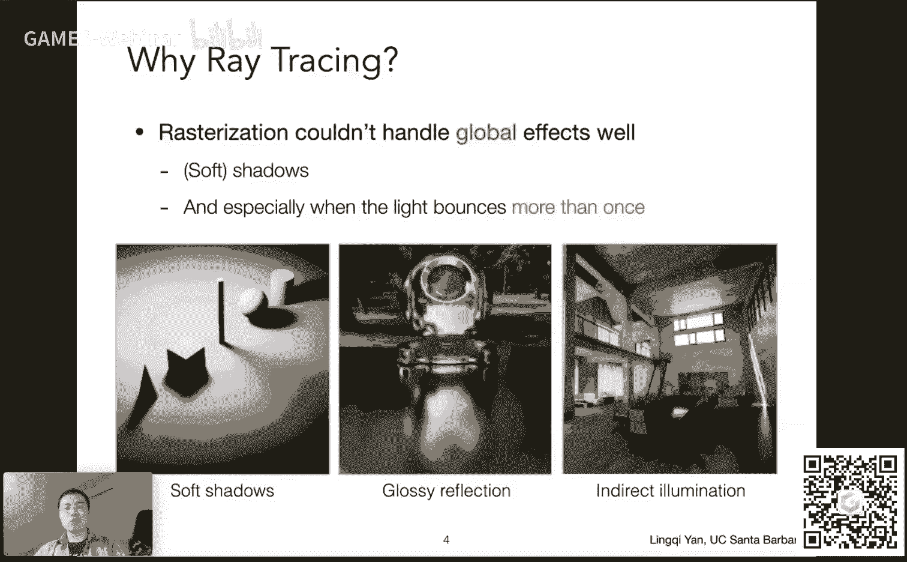
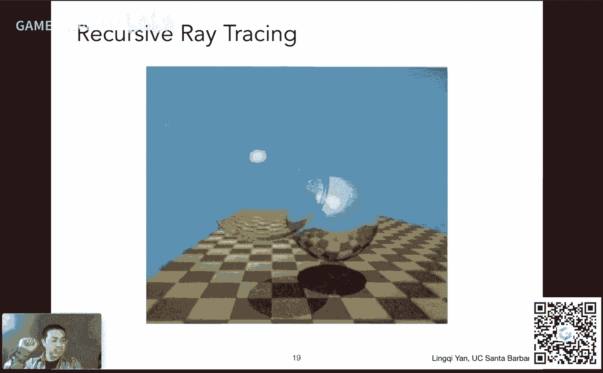
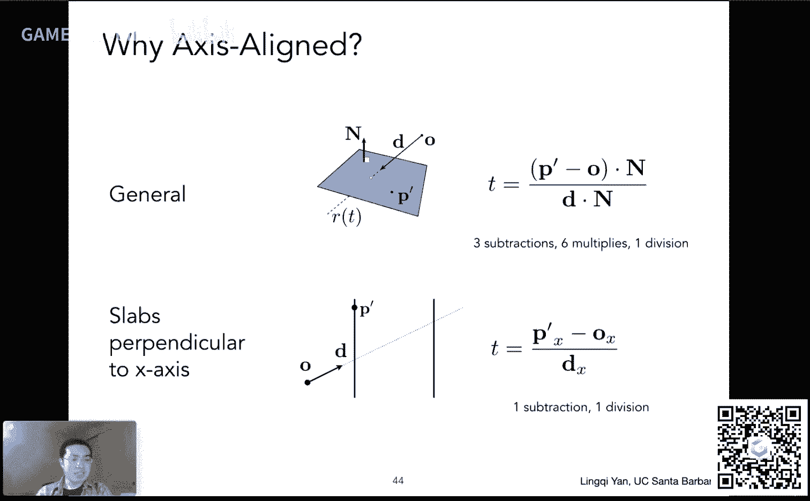
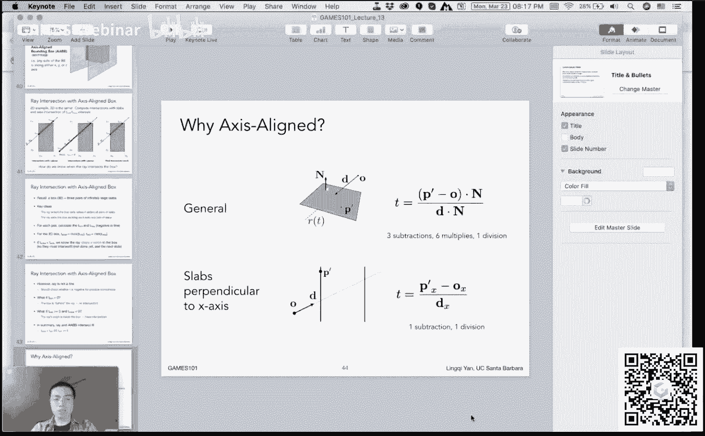
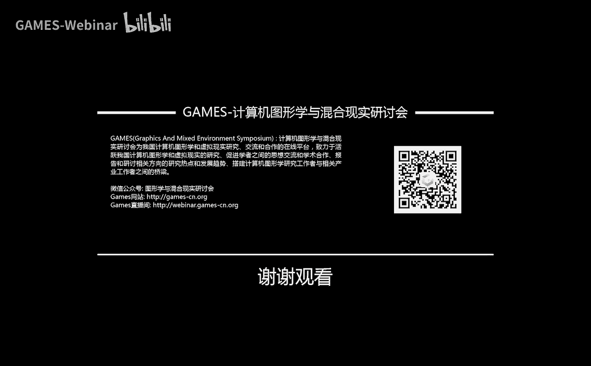

# GAMES101-现代计算机图形学入门-闫令琪 - P13：光线追踪 1 🎯

在本节课中，我们将要学习光线追踪的基础知识，特别是经典的“Whitted风格”光线追踪算法。我们将探讨为何需要光线追踪，其基本工作原理，以及如何计算光线与场景中物体的交点。

---

## 概述：为何需要光线追踪？ 🤔

上一节我们介绍了光栅化及其局限性。本节中我们来看看光线追踪如何解决这些问题。

光栅化是一种快速但近似的渲染方法，它在处理某些**全局效果**时效率不高或效果不佳。这些效果包括：
*   **软阴影**：阴影边缘的柔和过渡。
*   **光泽反射**：类似打磨金属的表面反射，既非完美镜面也非完全漫反射。
*   **间接光照**：光线在场景中经过多次弹射（如漫反射）后才进入眼睛。

光线追踪是一种更准确、符合物理规律的渲染方法，能够自然地处理这些复杂的光照效果。然而，它的计算成本非常高，通常用于电影等离线渲染，而非实时应用。

---

## 光线追踪的基本原理 🚀

光线追踪的核心思想是利用**光路的可逆性**。我们并不模拟从光源发出的无数光线，而是从相机（眼睛）出发，向场景中投射光线，并追踪这些光线的路径。

### 光线投射

这是光线追踪的最基本形式。以下是其步骤：

1.  **生成光线**：从相机出发，穿过成像平面上的每个像素中心，向场景发射一条射线（称为**主光线**）。
2.  **求最近交点**：计算这条射线与场景中所有物体的交点，并找到**最近的交点**。
3.  **计算着色**：从该交点向光源连接一条线（称为**阴影光线**）。如果这条线未被任何物体阻挡，则计算该点的着色（如使用Blinn-Phong模型）。
4.  **写入像素**：将计算出的颜色值赋给对应的像素。

这个过程解决了深度测试问题（最近的交点自然遮挡远处的物体），并能生成简单的阴影。

---

## Whitted风格光线追踪 🔄

上一节我们介绍了基础的光线投射。本节中我们来看看如何通过递归追踪来模拟更复杂的光线行为，即Whitted风格光线追踪。

Whitted风格光线追踪是一种递归算法，它考虑了光线在物体表面的**反射**和**折射**。当主光线击中一个物体时：
*   如果物体是镜面，它会沿着反射方向生成一条新的**次级光线**。
*   如果物体是透明介质（如玻璃），它会沿着折射方向生成一条新的次级光线。
*   这些次级光线会继续与场景求交，并可能进一步产生新的反射/折射光线。

对于每一次弹射（包括第一次击中点），都会像光线投射中那样，连接阴影光线来判断该点是否被照亮，并计算其对着色的贡献。所有弹射点贡献的能量会按照物理规律（如反射/折射系数）衰减后，累加到最终的像素颜色中。

**核心公式**：光线用射线表示
`ray(t) = origin + t * direction (t >= 0)`

---

## 光线与物体求交 🔍

要实现光线追踪，最关键的技术之一是计算光线与物体的交点。

### 光线与隐式表面求交

对于一个由隐函数 `f(p) = 0` 定义的表面（如球体：`(p - c)^2 - R^2 = 0`），求交点即求解方程：
`f(origin + t * direction) = 0`
解出满足 `t >= 0` 的实数根即可。

### 光线与三角形网格求交（重点）

由于模型通常由三角形网格表示，光线与三角形求交是最频繁的操作。有两种主要思路：

1.  **两步法**：
    *   先计算光线与三角形所在平面的交点。
    *   再判断该交点是否在三角形内部（可用重心坐标判断）。

2.  **Möller-Trumbore算法**：
    *   一种直接求解的算法。它将交点用三角形的重心坐标表示，并与光线方程联立，直接解出交点参数 `t` 和重心坐标 `(b1, b2)`。
    *   交点有效的条件是：`t >= 0` 且重心坐标满足 `b1 >= 0, b2 >= 0, 1-b1-b2 >= 0`。

**核心代码/逻辑**：MT算法求解线性方程组，判断重心坐标是否非负。

---

## 加速光线求交：包围盒 🏃

上一节我们学习了如何求光线与单个三角形的交点。本节中我们来看看如何利用包围盒来大幅加速与复杂模型的求交过程。

对于一个包含数百万三角形的场景，为每根光线检查所有三角形是不可行的。加速的关键思想是使用**包围盒**。

### 轴对齐包围盒

我们常用**轴对齐包围盒**（AABB）——一个各边平行于坐标轴的长方体来包裹复杂物体。关键逻辑是：
*   如果光线连物体的AABB都碰不到，那它肯定碰不到物体内部的任何三角形。
*   先进行光线与AABB的快速求交测试，只有通过测试的光线才需要与盒内三角形进行精细求交。

### 光线与AABB求交算法（核心）

如何判断光线 `ray(t) = O + tD` 与一个AABB是否相交？

1.  **将对面对视为“平板”**：将AABB视为三组平行的“平板”（如x方向、y方向、z方向各一对）的交集。
2.  **计算光线进出各对“平板”的时间**：对于每一组（如x方向），计算光线进入两个平行平面（`x_min`, `x_max`）的时间 `t_min_x`, `t_max_x`。注意时间可能为负。
3.  **求实际进出盒子的时间**：
    *   光线**进入**盒子的时间 `t_enter` = max(`t_min_x`, `t_min_y`, `t_min_z`)。（必须进入所有三对平板才算进入盒子）
    *   光线**离开**盒子的时间 `t_exit` = min(`t_max_x`, `t_max_y`, `t_max_z`)。（只要离开任意一对平板就算离开盒子）
4.  **判定相交**：当且仅当 `t_enter < t_exit` **且** `t_exit >= 0` 时，光线与AABB相交。
    *   如果 `t_exit < 0`，盒子在光线背后。
    *   如果 `t_enter < 0` 但 `t_exit >= 0`，说明光线起点在盒子内部。

**核心逻辑**：`相交 <=> (max(t_min) < min(t_max)) && (min(t_max) >= 0)`

使用AABB能极大减少不必要的三角形求交计算，是光线追踪加速结构的基石。

---

## 总结 📚

本节课中我们一起学习了光线追踪的入门知识。
*   我们了解了光线追踪相比光栅化的优势，在于它能更物理地处理全局光照效果，但代价是计算速度慢。
*   我们掌握了Whitted风格光线追踪的基本原理：从相机发射光线，递归地追踪反射和折射路径，并累加光照贡献。
*   我们深入探讨了光线求交这一核心技术，包括与隐式表面、三角形的求交方法。
*   最后，我们学习了如何使用轴对齐包围盒（AABB）来加速光线与复杂模型的求交过程，这是构建更高效空间加速结构（如BVH）的基础。

下一讲，我们将继续深入光线追踪，探讨如何组织这些包围盒以形成高效的加速结构，以及路径追踪等更现代的全局光照算法。