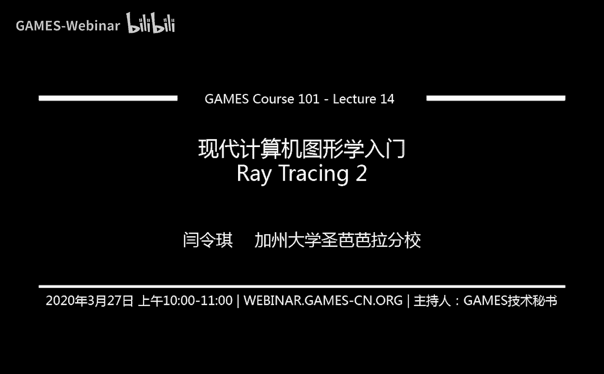
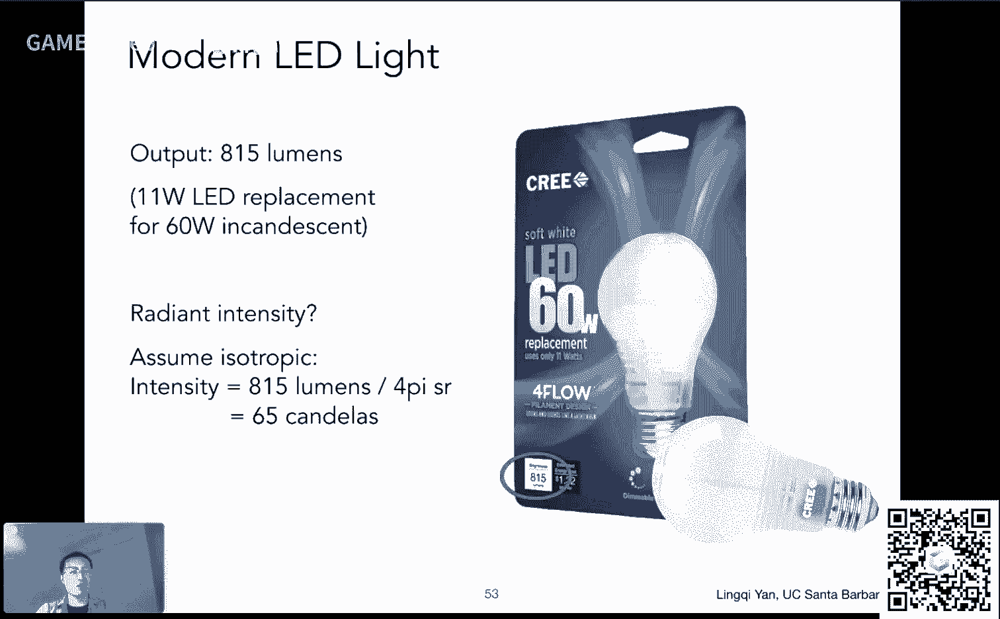
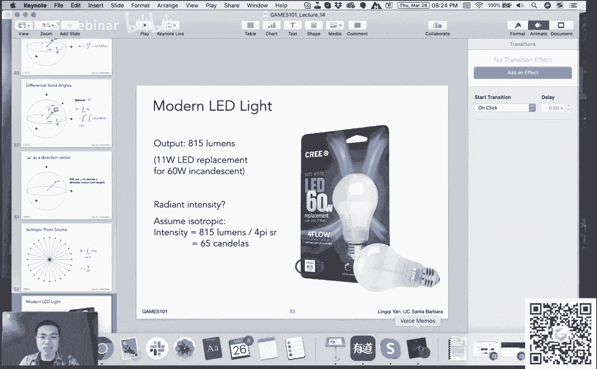
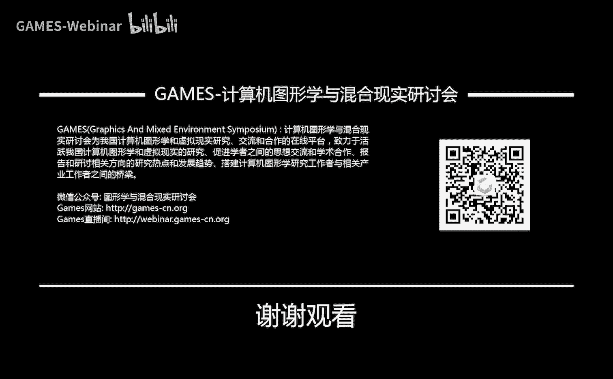

# GAMES101-现代计算机图形学入门-闫令琪 - P14：Lecture 14 光线追踪 2 🚀


在本节课中，我们将要学习光线追踪的第二部分，重点探讨如何高效地处理光线与复杂场景的求交问题。我们将介绍两种核心的空间加速结构：KD-Tree和Bounding Volume Hierarchy (BVH)。如果时间允许，我们还将初步接触辐射度量学的基础概念。

## 课程前言与近期动态

在开始新课之前，先同步几项课程相关事宜。

关于作业重新提交后的批改与分数反馈，我们正在积极处理中，请大家稍安勿躁，最终会完成批改并给出分数。

近期，受新冠疫情影响，英伟达的GPU技术大会转为线上举行。会上公布了两项与渲染相关的新技术，值得关注。

*   **DLSS 2.0**：这项技术能够将低分辨率（如720p）的光栅化图像放大至高分辨率（如4k），同时保持画面清晰，不损失过多性能。其主要研发人员刘诗秋在知乎有专栏文章介绍。
*   **RTX 全局光照**：这项技术旨在将全局光照效果引入实时渲染。我们将在后续课程中深入探讨全局光照的难点，以及如何将其实现实时化。

这些进展表明，许多原本属于离线渲染的算法，正通过改进逐步应用于实时渲染领域。这是一个重要趋势，未来的实时应用（如游戏）将更多地融合这些技术，以提升画面质量。

关于光栅化技术是否会被实时光线追踪取代，个人认为至少在五年内是不可能的。即使实时光线追踪普及，光栅化技术在其他领域仍有其不可替代的价值和应用。

从本节课开始，课程内容将更具挑战性，涉及现代计算机图形学中生成高真实感图像的核心方法。

## 上节课回顾

上一节我们介绍了光线追踪的基本原理。

我们从为何需要光线追踪开始，介绍了光线投射，以及Turner Whitted提出的递归式光线追踪方法。该方法中，光线在场景中弹射，在每个交点计算着色，最终累加到像素颜色上。

我们讨论了光线与物体求交的基础，特别是光线与三角形求交，因为三角形是图形学中最常用的几何图元。

随后，我们引入了一个关键问题：当场景中三角形数量巨大时，逐一对每个三角形求交是不现实的。为此，我们介绍了轴对齐包围盒的概念，并讲解了光线与AABB求交的方法。

## 空间划分：均匀网格

上一节我们学会了光线与AABB求交，本节我们来看看如何利用这个特性来加速整个场景的求交过程。

核心思想是：假设光线与包围盒求交很快，而与实际物体求交很慢。那么，我们可以先让光线与一些简单的“盒子”求交，快速排除掉大量不可能相交的区域，只在与盒子相交的区域内部，才进行与实际物体的精确求交。

以下是实现此思想的一种方法：均匀网格。


*   **预处理**：在光线追踪开始前，将整个场景的空间均匀划分成许多小格子（二维为方格，三维为立方体）。
*   **标记格子**：判断每个格子是否与场景中的物体表面相交，并将相交的格子标记出来（例如图中涂灰的格子）。
*   **光线追踪**：发射光线后，让光线依次穿过这些格子。当光线与一个被标记的格子相交时，才需要与该格子内的所有物体进行求交计算。若光线与一个空白格子相交，则直接跳过。

这种方法的关键在于，需要一种算法能快速判断光线当前在哪个格子，以及下一个相交的格子是哪一个。这与光栅化中“如何光栅化一条直线”的问题在原理上是相通的，可以通过增量算法高效解决。

均匀网格的性能取决于格子的大小。格子太稀疏，加速效果不佳；格子太密集，光线与格子的求交次数又会过多。实践中存在一个平衡点，通常格子数量与场景物体数量成一定比例关系。

均匀网格在物体分布相对均匀的场景中效果很好。但当场景中存在大范围空白区域（如一个巨大的运动场中间放一个茶壶），光线需要穿过大量空白格子才能到达物体，效率就会降低。这被称为“运动场中的茶壶”问题。

## 空间划分：KD-Tree

为了解决均匀网格的不足，我们引入更自适应的空间划分方法：KD-Tree。

KD-Tree是一种二叉树结构，每次划分空间时，沿某个轴（如X、Y、Z轴）将当前节点代表的包围盒空间一分为二。划分轴通常循环选择（如第一层沿X轴分，第二层沿Y轴分，第三层沿Z轴分，如此往复）。


*   **构建过程**：
    1.  从整个场景的包围盒（根节点）开始。
    2.  沿选定轴，用一个平面将当前空间划分为左右（或上下、前后）两个子空间。
    3.  递归地对两个子空间进行划分。
    4.  划分终止条件可以是：空间内物体数量少于某个阈值，或空间体积足够小。
*   **数据结构**：中间节点存储划分轴、划分位置以及指向两个子节点的指针。实际的物体（如三角形）只存储在叶子节点中。
*   **光线求交**：
    1.  从根节点开始，判断光线是否与当前节点的包围盒相交。
    2.  若不相交，则跳过该节点及其所有子节点。
    3.  若相交，且当前节点是叶子节点，则光线与该叶子节点内所有物体求交。
    4.  若相交，且当前节点是中间节点，则递归地对两个子节点执行步骤1。

KD-Tree的优点是能自适应地细分物体密集的区域，同时保持空白区域为大块，从而高效地跳过空白区域。然而，它有两个主要缺点：
1.  判断一个三角形与一个AABB是否相交（在构建树时需要）是比较复杂的操作。
2.  一个物体可能同时与多个叶子节点的包围盒相交，因此可能被存储在多个叶子节点中，不够直观。

## 物体划分：Bounding Volume Hierarchy (BVH)

由于KD-Tree的上述缺点，现代图形学中更广泛使用的是另一种加速结构：Bounding Volume Hierarchy。

BVH的核心思想不是划分空间，而是划分物体集合。


*   **构建过程**：
    1.  将当前节点中的所有三角形划分为两个子集（例如，按某个轴排序后，取中位数分为左半和右半）。
    2.  分别重新计算这两个子集的包围盒。
    3.  递归地对两个子集进行划分。
    4.  划分终止条件通常是叶子节点中的三角形数量足够少（例如，少于5个）。
*   **与KD-Tree的关键区别**：
    *   **划分对象**：BVH划分物体，KD-Tree划分空间。
    *   **包围盒关系**：BVH中，子节点的包围盒可能相互重叠；KD-Tree中，子空间是严格分开的。
    *   **物体存储**：BVH中，一个物体只属于一个叶子节点，解决了KD-Tree中物体重复存储的问题。
    *   **构建难度**：BVH的构建只需对三角形重心进行排序和划分，避免了复杂的三角形与AABB相交测试，实现更简单。
*   **构建技巧**：
    *   **划分轴选择**：通常选择当前节点包围盒最长的轴进行划分，有助于生成更均衡的树。
    *   **划分点选择**：为了保持树的平衡，常取三角形沿划分轴排序后的中位数作为划分点，确保左右两边的三角形数量大致相等。寻找中位数可以使用快速选择算法，在O(n)时间内完成。
*   **光线求交伪代码**：
    ```cpp
    Intersect(Ray ray, BVH_node node) {
        if (ray misses node.bbox) return;
        if (node is a leaf node) {
            test intersection with all objs in node;
            return closest intersection;
        }
        hit1 = Intersect(ray, node.left_child);
        hit2 = Intersect(ray, node.right_child);
        return the closer of hit1 and hit2;
    }
    ```

BVH因其实现简单、效率高，已成为光线追踪中最主流的加速结构。

## 辐射度量学导论

在完成了Whitted风格光线追踪的学习后，我们将目光转向更高级、能产生物理精确结果的光线追踪方法。这一切的基础是**辐射度量学**。

我们之前使用的光照模型（如Blinn-Phong）和Whitted光线追踪存在明显的物理不准确性。例如，我们定义的光强`I`只是一个没有单位的数字，反射和折射的能量衰减也是随意定义的。

辐射度量学为我们提供了一套精确定义和测量光照的物理量体系。它将为光源、材质以及光线的传播提供准确的描述，是后续学习路径追踪等高级光线追踪算法的基石。

辐射度量学基于几何光学（光线直线传播），定义了一系列核心物理量。为了避免中文译名的混乱，我们直接使用英文术语：

1.  **Radiant Energy**：辐射能量，单位焦耳 (J)，表示电磁辐射的能量。
2.  **Radiant Flux (Power)**：辐射通量（功率），单位瓦特 (W) 或流明 (lm)。表示单位时间的能量，可以直观理解为光源的“亮度”。例如，一个60瓦的灯泡比40瓦的亮。
3.  **Radiant Intensity**：辐射强度，定义为单位立体角上的功率。它描述了点光源在**特定方向**上的亮度。单位是坎德拉 (cd)。
4.  **Irradiance**：辐照度，定义为单位**表面积**接收到的功率。它描述了**一个表面点**接收到的光照强度。
5.  **Radiance**：辐射率，定义为单位立体角、单位投影面积上的功率。它是描述光线在**空间中传播**时最重要的量。

要理解`Radiant Intensity`，需要先理解**立体角**的概念。

### 立体角

立体角是二维角度在三维空间中的延伸。

*   **平面角**：用弧度表示，定义为弧长除以半径：`θ = l / r`。整个圆的弧度为`2π`。
*   **立体角**：定义为球面上的面积除以半径的平方：`Ω = A / r²`。单位是球面度 (sr)。整个球面的立体角为`4π`球面度。

在球坐标系中，一个由`(θ, φ)`确定的方向，其对应的微分立体角为：
`dω = sinθ dθ dφ`

我们用`ω`来表示三维空间中的一个方向。

### Radiant Intensity 详解

对于一个向所有方向均匀发光的点光源，其总功率为`Φ`。那么，它在任何一个方向上的辐射强度`I`为：
`I = Φ / 4π`

例如，一个实际功耗为11W，光通量为815流明的LED灯泡，在任意方向上的辐射强度约为：
`I = 815 lm / (4π) sr ≈ 65 cd`

本节课中，我们一起学习了两种核心的空间加速结构（KD-Tree和BVH）来高效实现光线与场景的求交，并初步了解了辐射度量学的动机及其第一个物理量`Radiant Intensity`和立体角的概念。下节课我们将继续深入辐射度量学，学习`Irradiance`和`Radiance`，为路径追踪打下坚实基础。



时间已晚，感谢大家。后续课程会尽量合理安排进度。大家加油。



各位同学赶紧吃午饭吧，大家辛苦了。




