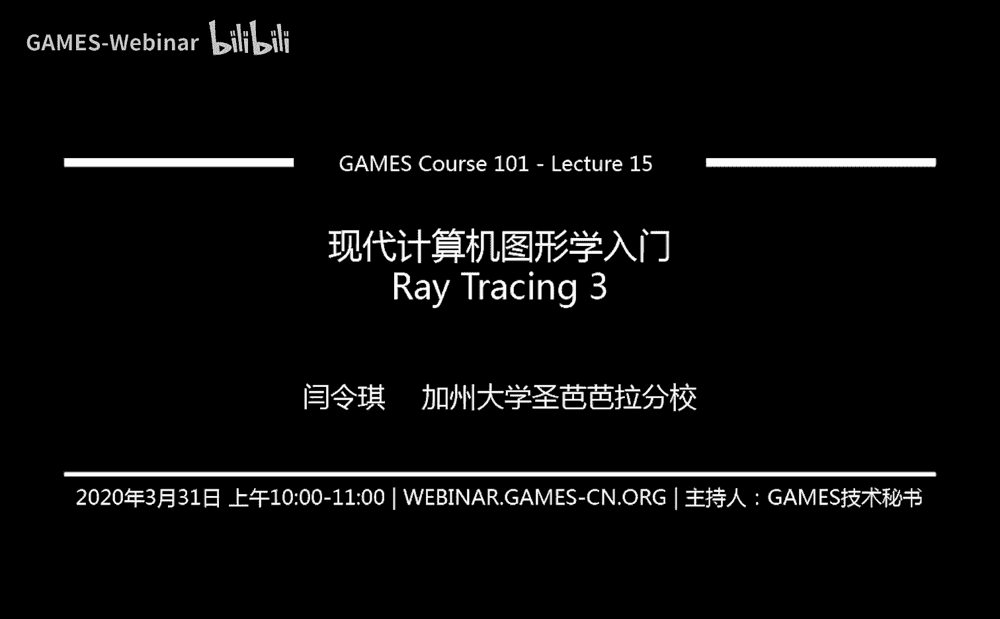
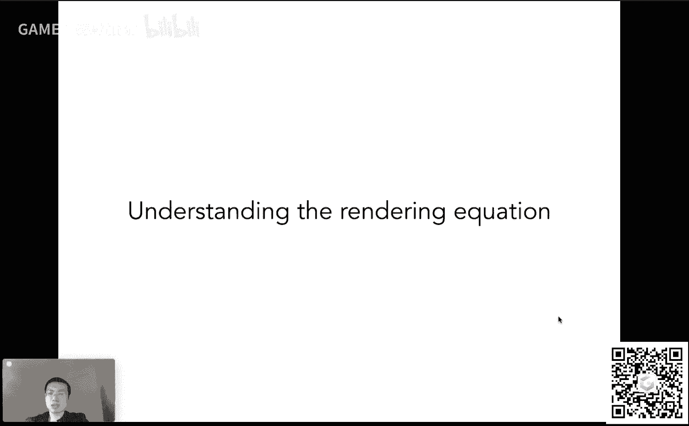
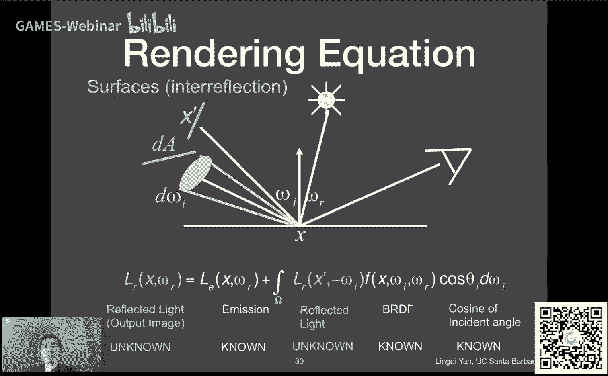
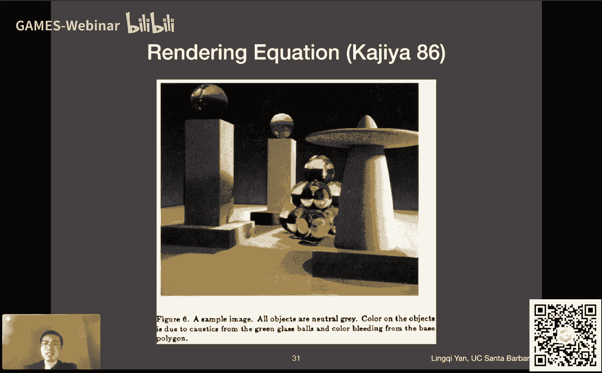
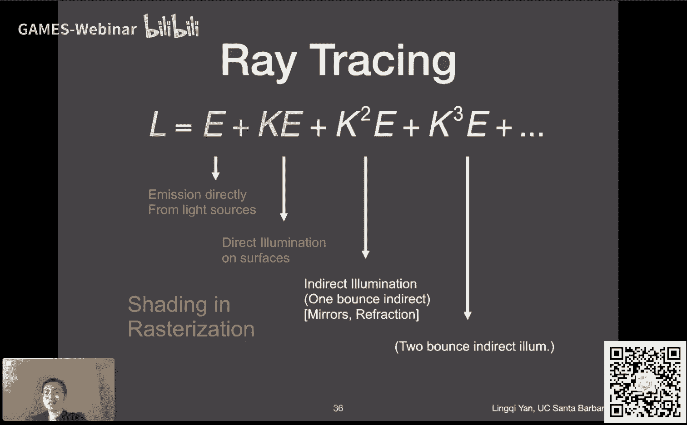
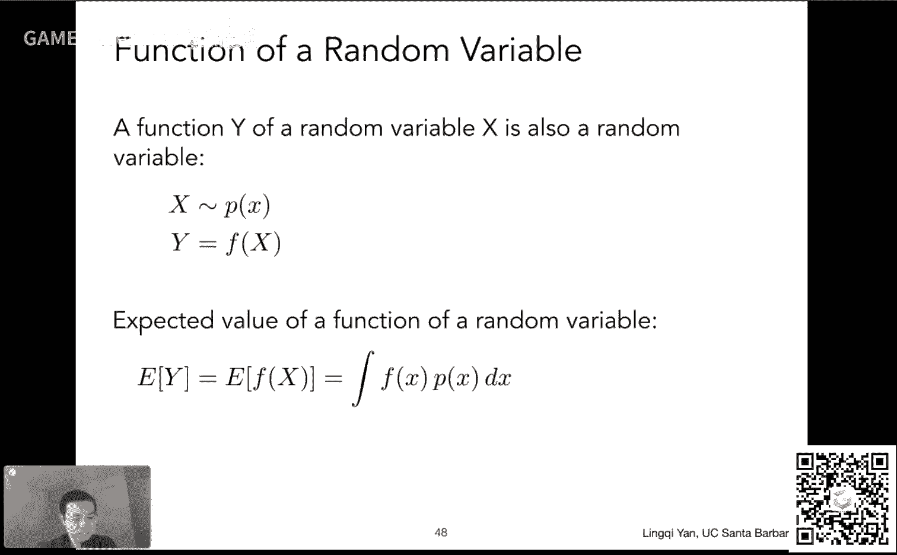
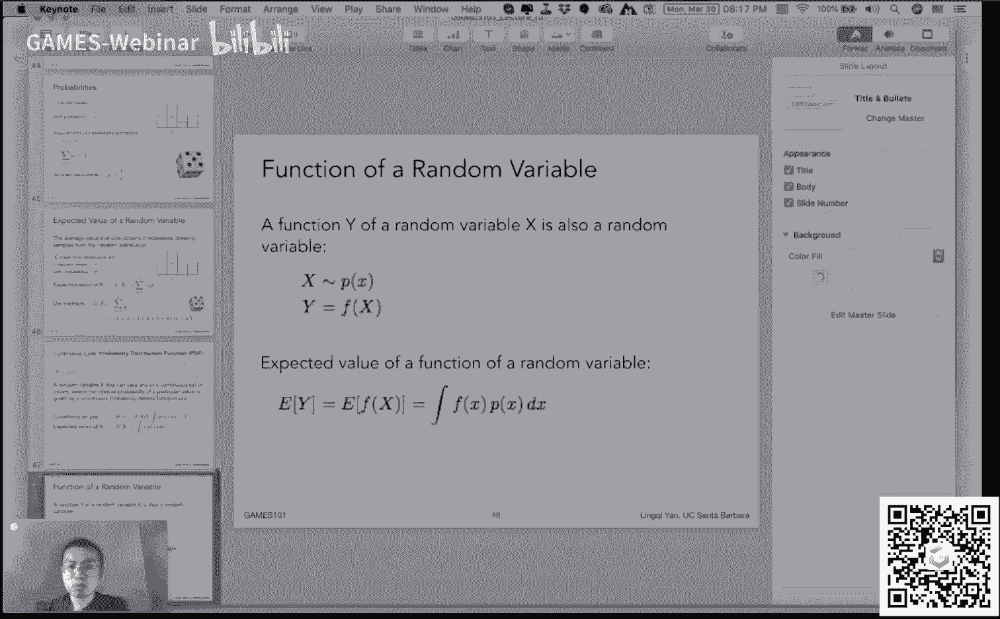
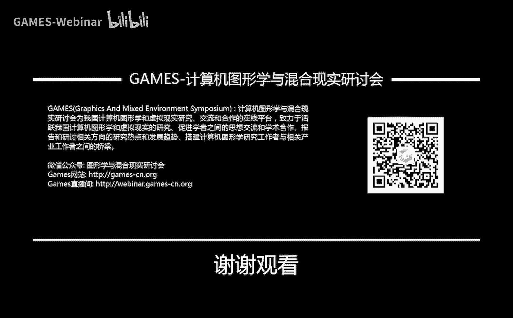

# GAMES101-现代计算机图形学入门-闫令琪 - P15：光线追踪3 - 光线传播与全局光照 🌟

在本节课中，我们将学习光线传播的物理基础，理解辐射度量学中的核心概念，并最终推导出描述光线与物体交互的渲染方程。我们还将初步了解全局光照的概念，为下一节课的路径追踪算法打下基础。

---

## 课程概述与安排 📅

课程网站已更新，总课时调整为22节，并新增了作业七。考虑到课程内容深度，后续作业（作业六和作业七）的提交周期调整为1.5周一次，以减轻大家的工作量。

本课程内容有时会超过一小时，这是因为它改编自一个1-1.25小时的英文课程。虽然中文表达更高效，但内容量依然较大，我会尽量控制节奏。

关于课程问题，鼓励大家在论坛中提问，特别是关于概念理解方面的问题，我会尽力解答。关于实时渲染课程的直播，由于是内部课程，暂时无法对外公开，但未来可能会在暑假期间以中文形式重新组织分享。

---

## 回顾：辐射度量学核心概念 🔄

上一节我们介绍了辐射度量学的基础。为了准确描述光线传播，我们需要一套物理定义。图形学中通常不考虑时间累积效应，因此我们主要使用单位时间的能量，即功率（Power）。

以下是几个核心概念：
*   **辐射强度（Intensity）**：定义为在单位立体角上的功率。立体角描述了空间中的一个方向锥角大小。
*   **辐照度（Irradiance）**：定义为在单位（投影）面积上接收到的功率。这解释了为什么光线不垂直照射时，表面接收到的能量会变少（兰伯特余弦定律）。
*   **辐射率（Radiance）**：这是描述光线属性的关键量。它定义为在单位立体角、单位投影面积上的功率。**Radiance** 是理解光线传播和 **BRDF** 的核心。

**一个重要区分**：在传播过程中，**Intensity** 不会衰减，而 **Irradiance** 会按距离平方反比衰减。这是因为 **Intensity** 定义在立体角上，而立体角在传播中不变；**Irradiance** 定义在面积上，随着球面扩大，单位面积接收的能量自然减少。

**微分立体角**：在球面坐标系中，用极角 `θ` 和方位角 `φ` 表示方向。微分立体角 `dω` 的公式为：
`dω = sinθ dθ dφ`
这表明立体角的变化量与 `θ` 的位置有关。

---

## 双向反射分布函数（BRDF）与反射方程 🔍

**Radiance** 的重要性在于它同时考虑了面积和方向。**Irradiance** 描述一个微小面积 `dA` 接收到的所有能量，而 **Radiance** 则描述 `dA` 从**特定方向** `ωi` 接收或向**特定方向** `ωo` 辐射的能量。

**BRDF** 描述了物体表面的一点如何将来自入射方向 `ωi` 的光线，反射到出射方向 `ωo` 上。其定义为：
`f_r(ω_i -> ω_o) = dL_o(ω_o) / dE(ω_i) = dL_o(ω_o) / (L_i(ω_i) cosθ_i dω_i)`
其中 `dL_o` 是出射 **Radiance**，`dE` 是由入射 **Radiance** `L_i` 在 `dA` 上产生的微分 **Irradiance**。`cosθ_i` 是入射方向与法线的夹角余弦。

**反射方程** 将这个过程推广到所有可能的入射方向。它计算了从观察方向 `ωo` 看一个着色点 `p` 时，该点反射出的总 **Radiance** `Lo`：
`L_o(p, ω_o) = ∫_{H^2} f_r(p, ω_i, ω_o) L_i(p, ω_i) cosθ_i dω_i`
这个积分在半球 `H^2` 上进行，累加所有入射方向 `ωi` 的贡献。**反射方程定义了物体表面的着色**。

---

## 渲染方程与全局光照 💡

反射方程只描述了反射行为。如果一个表面自身会发光（如光源），我们需要加上其自发光项 `Le`。这就得到了著名的**渲染方程**：
`L_o(p, ω_o) = L_e(p, ω_o) + ∫_{H^2} f_r(p, ω_i, ω_o) L_i(p, ω_i) cosθ_i dω_i`

渲染方程是图形学的核心，它描述了所有基于物体表面的光线传播。这里的复杂性在于 `Li(p, ωi)` 本身可能是其他表面反射而来的光，这就形成了一个递归的、相互依赖的方程系统。

为了理解这个方程，我们可以将其简写为算子形式：`L = E + K L`。其中 `L` 是待求的辐射场，`E` 是自发光项，`K` 是反射算子。通过数学变换，可以将其展开为 Neumann 级数：
`L = E + K E + K^2 E + K^3 E + ...`

这个展开具有深刻的物理意义：
*   `E`：直接来自光源的光（0次弹射）。
*   `K E`：光源光经过一次表面反射后进入眼睛的光（直接光照）。
*   `K^2 E`：光源光经过两次表面反射后进入眼睛的光（一次间接光照）。
*   以此类推。

**全局光照** 就是所有这些项的总和：`全局光照 = 直接光照 + 间接光照`。传统的光栅化着色模型（如布林-冯模型）主要模拟了 `E + K E` 部分，即直接光照和自身发光。而光线追踪的优势在于能相对容易地计算 `K^2 E` 及更高次项，从而模拟出逼真的间接光照效果，如颜色渗透和软阴影。

随着光线弹射次数的增加，场景亮度会逐渐收敛到一个稳定值，这是能量守恒的体现。实际渲染中，无限次弹射既不可能也无必要，通常几次弹射后结果就接近收敛。

---

## 概率论基础回顾 🎲

下一节课我们将学习如何求解渲染方程，这需要用到蒙特卡洛积分方法，因此这里先回顾必要的概率论知识。

以下是核心概念：
*   **随机变量**：一个可能取不同值的变量，每个值有对应的出现概率。
*   **概率分布**：描述随机变量取各个值的可能性。所有可能值的概率之和为1。
*   **期望值**：随机变量多次取值的平均值。对于离散随机变量 `X`，其期望 `E[X] = Σ x_i * p(x_i)`。

对于连续随机变量，我们使用**概率密度函数（PDF）** `p(x)` 来描述。`p(x)` 在某个区间上的积分，表示随机变量落在该区间的概率。PDF 在整个定义域上的积分必须为1。

连续随机变量 `X` 的期望为：`E[X] = ∫ x p(x) dx`
对于一个函数 `Y = f(X)`，其期望为：`E[f(X)] = ∫ f(x) p(x) dx`
这个公式是后续蒙特卡洛积分的理论基础。

---

## 总结 🎯

本节课我们一起学习了光线传播的完整物理图景。

我们从辐射度量学出发，明确了 **Radiance** 和 **Irradiance** 等核心概念及其关系。基于这些概念，我们定义了描述表面反射特性的 **BRDF**，并推导出**反射方程**。通过加入自发光项，我们得到了描述所有表面光传输的**渲染方程**。

为了理解渲染方程，我们将其展开为不同光线弹射次数的和，从而引入了**全局光照**的概念，它包含了直接光照和间接光照。传统光栅化擅长处理前者，而光线追踪（路径追踪）是解决后者的强大工具。

最后，我们回顾了概率论的基础知识，包括随机变量、概率密度函数和期望值，为下一节课学习**蒙特卡洛积分**与**路径追踪**算法做好了准备。

渲染方程是连接物理与视觉的桥梁，而路径追踪则是求解这座桥梁的关键钥匙。下节课，我们将拿起这把钥匙。