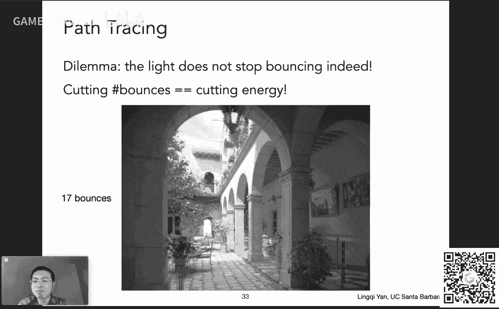
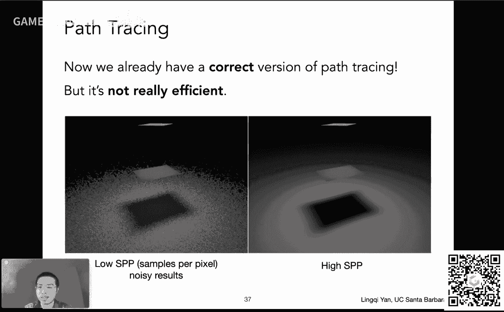
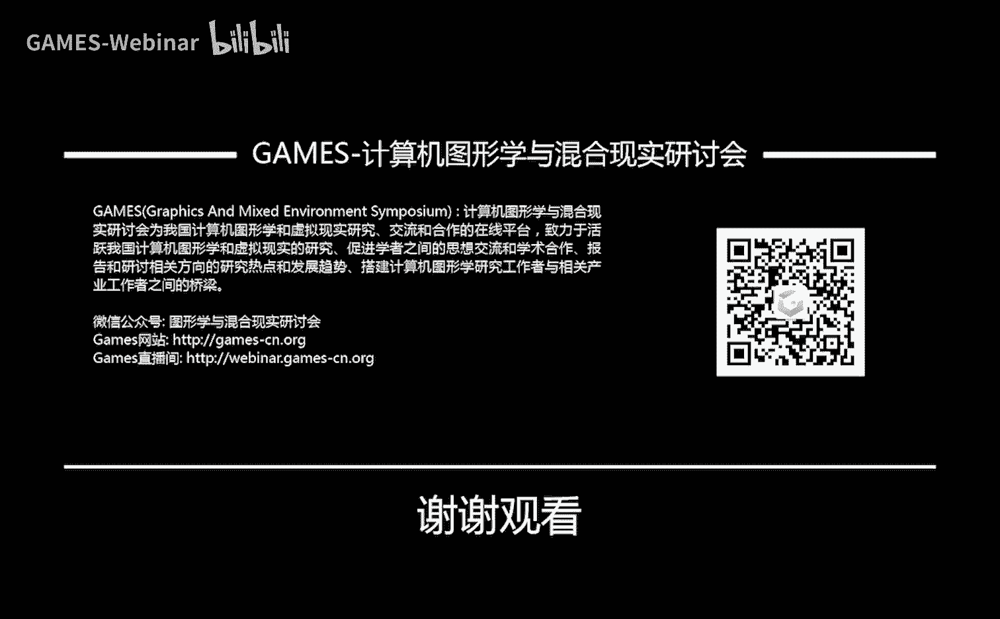

# GAMES101-现代计算机图形学入门-闫令琪 - P16：Lecture 16 Ray Tracing 4 - GAMES-Webinar - BV1X7411F744

好这个课前给大家打个广告哈，这个hello，大家好啊，唉呀这是这么回事，大家应该在这个games的这个网站上，已经看到广告了对吧，这个是我的小伙伴，然后这个这个嗯这个孙琦教授啊，刚刚加入这个nyu。

然后大家可以看一看，好吧嗯ok啊，然后呢这个呃森崎教授和我一块儿啊，我们两个就是我们的战队的创始人，大家看右下角这个，这是我们人生第一次吃鸡，就是就是我们两人双排这个pop g啊，嘿嘿可以吧。

嗯没问题啊，然后这个今天这课真不容易啊，前面这个两天之前呃，事情挺多的，然后没忙得过来，然后这个这个这个深表歉意哈，然后昨天正好赶上这个，这个这个当年活动对吧，然后所以说咱们就拖到今天好，大家好。

咱们现在开始正式给大家啊，讲今天的这个内容好吗，然后今天是我们retracing部分的，最后呃一讲啊，然后讲完之后，然后retracing这部分就完成了，那么这一讲呢，自然是这个把前面咱们学的融会贯通。

然后可以做一个这个这个真实的这个嗯，渲染的方法就叫做蒙特卡洛嗯，路径追踪啊，这个是今天的主要内容好，那么今天咱们这就正式开始，在课前我们先宣布几件事情，一个是呢有同学反映前面这这这一节课哈。

就是上一节课呃，有点难啊，没问题，其实来说呢要说难，我倒是觉得没有多难，主要是大家不熟悉，前面说了这个概念之后，后面立刻就要用对吧，然后如果说概念这个定义，什么东西没有记住的话，什么errings啊。

radiance啊对吧，然后这个就比较容易搞混，但说白了其实就是对反射的一个这个嗯，基于物理的解释，就这么一个意思对吧，然后为什么要这么做，咱们之前就说了，是为了正确的得到光线传播的方式。

那咱们这一节课接着这个逻辑，那就是正确的实现这么一个，这个光线传播的方式，也就是正确的解除这个所谓的呃渲染方程，好吧，然后呃另外一点呢是确实这个图形学呢，我们这个呃也是需要用到这么一个概念吧，就这么说。

就是说以前的图形学，这个嗯不聚焦这个这个概念，是，因为这个嗯，只要不涉及到现代化的这些，这个渲染方式啊，其实用不着，但是我们既然这门课啊，就是说的是现代图形学入门对吧，然后这个既然要说这块。

咱们就把这个理论给说明白啊，这就是这块儿的道理，那咱们继续啊，关于这个大作业啊，很多这个同学来信这个咨询哈，就是说什么时候会啊，把这个大罪想法放出来，这个我们现在很快就呃，现在正在这个积极的制作中啊。

很快就会把这个想法给整理给大家，然后当然之前我们说过对吧，欢迎大家提出自己的想法，然后自己想做什么啊，没有任何问题，好吧好，那么呃今天这节课啊，大家可以看到我改了这个两个不同的描述。

第一呢我一开始觉得这个铺垫差不多了，应该挺容易，后来想想算了，然后这个应该算正常，然后现在我觉得你多少有点难，但是我觉得哈，应该比上节课要稍微容易一些，然后嗯在这个之后。

在这节课之后嗯就会变得容易很多啊，然后咱们基本上来说，这门课最难最难可能就到此为止好吧，那这是呃今天呢几个说的事情啊，那么上节课我们说了什么呢，上节课我们说了一个嗯呃这叫什么来着，辐射度量学。

对辐射度量学，radiometry对吧，本人说明白这个各种各样不同的概念，然后呢，我们说我们如何利用这个radiance和radiance，去解释反射问题，然后从反射呢。

我们就推出了一个可以描述这个能量，如何从一个方向，然后达到一个小的这个呃着色点上，然后再反射到另外一个方向上去对吧，然后这个定义呢，我们用到的东西叫做b2 df，从b2 df呢。

我们就可以这个进一步推出一个，叫做这个反射方程，或者嗯更进一步考虑到这个发光下，然后我们推出渲染方程，也就是得到正确的光线的传播方式没问题，然后呢嗯我们之后就紧接着说，我们如何去理解渲染方程对吧。

我们可以把它理解成一个递归的积分，但是我们也通过这个所谓算子的方式，可以把这个渲染方程呢，展开成这个不同的项对吧，然后嗯每一个项可以表示一一个嗯，就是说固定次数的光线传播的类型，也就是说。

我们可以把光线传播拆成零次弹射，也就是光线直接进入眼镜，那就是光源自己，然后一次弹射，那就是直接光照呃，那两次及多次，我们就认为这是间接光照，那么直接光照和间接光照加起来，就产生了全局光照这么一个概念。

好吧，这就是这个上节课主要的内容，然后当然我们顺便说了一下，然后概率论，当然我们这里用到的概率论相对简单哈，基本上大家知道什么的，这个连续型随机变量，然后它可以取不同的值对吧。

然后还可以按照一个这个所谓，概率密度函数也是pdf，然后一个各种不同的概率密度，取到不同的值啊，来咱们这儿，待会儿还会说一下，今天呢我们先把上节课，这个这个最重要的两个概念，然后开始我们说蒙特卡罗积分。

然后我们再说这个呃路径追踪啊，然后这是一系列的这个这个想法，然后咱们现在就开始看上节课呢，最重要的最重要，最重要最重要的内容就是渲染方程对吧，因为渲染方程呢描述了光线的传播方式，那么我们考虑任何一个点。

我们看到的它的这个radiance，或者咱们理解上看到的颜色吧，那自然就是它发出来的光，对不对，他自己发出来的光，加上它反射来的光对吧，那它从哪儿反射来的光呢，它可以从这个四面八方反射来的光。

所以说它这个可以从这个空间中的，任何一个方向，也就是这个米a i从任何一个方向过来，会有光，然后这个b r d f会告诉他，诶这个任何一个方向过来，反射到我的观测方向，就是这个米卡a到米卡o。

是有多大的能量对吧，然后把这个考虑进来，那么这个渲染方程非常好解释对吧，还是我刚才说的，我们看到一个着色里面的光，自然就是他自己发出的光，加，加上他从四面八方反射到我们，观察方向上的光，所以其实来说啊。

这个式子来说非常的这个嗯怎么怎么说呢，直观对吧，这个正是我们这个理解上的，这个我们如何看到的，看到物体对吧好，那这里就是渲染方程，那咱们今天自然而然就是要解决，这个渲染方程的计算问题，好吧好。

就是我们之前说呃关于概率的一些事情，然后在渲染里面呢，我们更多考虑的是连续性随机变量，那么离散的咱不说了好吧，那么呃离散型连续型的随机变量哈，我们说有个x啊，它是有随机变量。

然后呢他符合某一种概率密度的分布，然然后就是说我们看这里啊，这里这个有一个这样的曲线，然后这个曲线说明什么呢，这个曲线说明啊我任取一个呃，诶我任取一个随机变量x，然后呢。

这个x它的概率密度都符合这么一种分布，也就是说啊，比如说我取100次，这个x可能得有84，这x呢都集中在-1~1之间，因为这块概率密度大对吧，然后可能只有个两三次，集中在这个2~3之间对吧。

所以这个概率密度函数或者叫tdf，然后这是一个非常重要的概念，它就好像是离散型随机变量的概率，一个道理好吧，那么行，这个变量自己和它的概率密度函数好，那行没问题嗯，那概率密度函数。

说明了这个满足哪些条件呢，概率密度函数首先它得是正的，然后它呢积分起来是一，大家知道积分什么概念啊，积分就是相当于是考虑它的这个曲线下方，覆盖的整体面积是一，那这个道理很好理解，所有的概率都积积起来。

那就是所有的概率就是一对吧，然后我们又提到说，我们如何算一个变量的期望，然后这个期望呢，其实不管是离散的还是随机的，道理很简单，就是把它的值乘以它的概率或者概率密度，然后加起来或者积起来对吧。

在这个连续的情况下，就是说我们取任何一个这个x，这是它的它的值，然后呢在这个它的概率密度是px，然后我们把它这个乘起来记起来，这就是它的这个期望对吧，然后嗯这这为什么要提到这个呢。

是因为咱们下面一个话题，很快就需要用到这么多知识，那咱们来看我们现在呢要给他讲，给大家讲一个的积分方法，这个积分方法呢叫做蒙特卡罗积分，有时有有时候也是说是蒙特卡洛啊，中文无所谓。

嗯咱们就说蒙特卡洛积分，那蒙特卡洛积分，首先呢咱们了解一下这个，对不对，就是说嗯我们刚才一直在说呃，有一个这个这个呃随机变量对吧，然后他满足什么样的概率，那自然而然这个蒙特卡洛是要用到这个。

但是首先来说蒙特卡洛，他自己是为了解决什么问题，它是要解一个定积分，首先咱们把这个问题呃这个描述清楚，我们要干什么，给任何一个函数，然后你想算它的定积分从a到b，比如说给你的函数是fx。

它长这样这么一条曲线，我要算它的定积分，从a到b，那大家知道这定积分什么概念啊，定积分不，就是说这个这个函数，下面围的这个面积对吧，说白了就是说最后积出来是一个数，那咱们把这个事情说清楚呃。

就是说啊我们说的是定积分，就是说如果你有一个函数叫y等于x平方，好吧，然后呢你可以算不定积分，你可以把它算出来是1/3 x3 次方，加上一个常数，然后呢我这个这个通过不定积分，然后求他在这个a和b的值。

然后相减就可以解除这个积分是多少对吧，这是以前我们这个这个这个微积分上面，学的这个积分方法对吧，但是咱们这里说清楚，就是说我们现在呢，就是说假设这个函数比较复杂，比较复杂。

这个函数就是就像现在描述的这样啊，他不好解析的基础来明白了，就是说这样一来呢，就是说你写不出这个解析式，那这个积分怎么做呢，那我们就说这是一种数值方法，我最关心的就是嗯，这个积分出来的最后的值是多少。

我就要那最后一个数就是这么个意思好吧，咱们把这个事情说清楚，就是说我们不希望把这个什么解析式，算出来，我们不是解不定积分好吧，解的是定积分，最后就是一个数，那么怎么做呢对吧。

那这里就是说我们用这个蒙特卡罗的方法，然后蒙特卡罗他怎么做啊，很简单，咱们在讲蒙特卡罗之前，我们先回忆一下啊，咱们这微积分课上，其实提过一个所谓黎曼积分的概念是吧，不知道大家还记得不。

然后所谓黎曼积分什么意思啊，非常简单，咱们比如说这个a和b之间，然后每一份呢我取它的中间这个位置，中间的x啊，找到它对应的y，然后呢，我就认为每一份都是一个微小的，这个长方形。

然后我就可以把这个整个一个这个曲线啊，这个分解成这个呃，这就是整个这么一个这个曲线，下方的面积啊，分解成呃各个不同的小的正方形，长方形的面积之和对吧，那个是所谓黎曼积分，那么这里蒙特卡洛积分呢。

是另外一种积分方法，那咱们说他是怎么做的呢，很简单，它是考虑一种随机的采样的方法，怎么做呢，很简单，比如说啊他在a和b之间，我这我们可以随便取一个这个某一个数啊，比如说这取这个数呢。

然后我们可以找到它的这个对应的fx，也就是它的y值是多少对吧，然后我假设说啊，这整个一个这个曲线就是一个长方形，然后长方形它的高度，就是刚才我取的这个值，它对应的这个位置的高度，然后它的宽度就是a和b。

也就是说我用这么一个长方形的一个大小，呃，或者说面积来近似这么一个曲线下，围出来的这么一个面积，那我自然可以把这个过程，重复多做很多次对吧，我在a和b之间我采样了很多次，然后我每一次呢。

然后我网上这个找到它对应的，这个fx的位置诶，然后我就算出了一个这个长方形的，这么一个面积，那么我说啊我我踩上一次对吧，然后当然得到的结果可能不准，但是我我采用非常多次非常多次，然后就是说这个呃。

我每一次呢用的这个这个长方形，面积各不相同，然后我把这些长方形的面积我给平起来，那可不就能得到一个这个，相对准确的结果了嘛，对吧，那蒙特卡罗积分它的道理就在这儿，就是相当于啊在积分域内不断去采样。

然后这个呃，然后假设这个你采样采到的这个，这个x对应的y是多少，那整个函数你就假设它就是一个平的，然后是一个这个呃长方形，然后咱们把所有长方形的这个面积加起来，求平均没问题。

那啊这这就是说这个直观上的解释啊，那如何这个真正的去定义这么一个，蒙特卡罗积分的这么一个过程呢，那咱们先把这个问题说清楚，首先呢我们要解决的并积分fx从a到b嗯，最后值是多少，我就要一个数对。

那么他怎么做呢，他就是说啊在这个嗯你的积分域x嘛对吧，在a和b之间，我随机采一个这个变量或者说位置，那我们刚才知道这个，我们可以定义任何一种这个这个pdf对吧，概率密度函数，随便你用什么样的这个。

概率密度去采样对吧，这个嗯蒙特卡罗积分告诉我们的，就是这个积分呢可以近四成，近四成这个呃fx除以px，他们求和，然后或者说他们的平均好吧，然后就是说呃什么意思呢，咱们举一个最简单的例子啊。

咱们回头还会来看这个式子，那么我们举个最简单的例子，还是刚才的这个例子，如果说啊我想用一个最简单的办法，我在a a到b之间，那这样的话就说明我采样用的所谓pdf。

大家来看我采样用的pdf应该是各处相同的，所以它应该是一个常数，我们写作c，那么我们知道pdf在积分域上积分起来，那么这个pdf就可以解出来是等于多少呢，就是b减a分之一，那这个道理也好理解对吧。

就是说我这个这个pdf在a到b之间，积分是一pdf就是常数，那说明他的这个对应的形状，是一个类似矩形的形状，然后它的高度乘以这个b减a，肯定得等于一，那它的高度自然就是e减a1 ，除以b减a对吧。

那也就是说，那么我这样采样的这个pdf是一个常数，是b减a分之一好，那么我们现在用蒙特卡洛积分的方法，来算啊，蒙特卡洛积分需要算什么呢，需要知道这个fx和px对吧，那我随机采样。

然后呢呃蒙特卡洛积分说哦，我只要算fx fx除以px，他们的平均值就好了，那fx呃是多少，f x i它该多少是多少，那么p x i是多少，永远都是一除以b减a，那fx除以p x就等于fx乘以b减a咯。

那咱们把b减a拿出去，就是就是这么回事，那么这里就和咱们刚才的直观的想象，非常一致，什么呢，我随便取一个这个x啊，然后找到它的高度，然后找到它的高度乘以它整个的宽度，b减a啊。

然后这样就是一个这个矩形的这个大小，对吧，然后我把这些所有这些这些采样，它对应的这些各不相同大小的矩形，然后我把它面积加起来，这个除以n也就是求平均得到的结果，就是就是是对的对吧，是一个呃。

是一个对这个呃这个这个定积分的一个呃，估计没有问题好，那这样的话就说明啊，蒙特卡罗积分它有一种特殊的情况，这个采样的好吧，那么这个从一个更通用的角度上来说，就是说不管我对随机变量怎么样去采样啊。

我只要有一个这个满足的pdf，然后我采样出来的这个x，我用fx除以p x求平均，就可以得到对这个定积分的这个近似，好吧，唉这样一来啊，我们就可以得到呃任何一个积分，大家来看。

我对这里fx可没有任何要求啊对吧，然后就是说我这fx呢也许它比较好，这个这个解析的写出来对吧，然后也许说这个它比较困难，但是没有关系，蒙特卡洛积分我要做的事情，现在总结起来。

我只需要在积分域内以一个pdf采样，采样出来之后，这个样本它对应的这个fx是多少，对应的这个概概率密度p x是多少，两位除求平均就完了，就这么简单，任何的积分都可以这么做好吧。

然后这这是一个极其简单的这个，这个这个结论哈，然后嗯它好用在哪里好用再说啊，这个我们只需要对嗯a和b之间吧，就或者说这个积分域之间，然后我们只要能够以一种方式采样，我只需要知道我这种采样。

它对应的pdf是多少就可以了好吧，那么这里呢给大家说几点要注意的事情，第一呢这可想而知，对不对，如果我有一个样本，然后呢，我这样得出来的，这个这个估计它就非常近似，他有可能和这个最后的结果差的比较远。

对不对，然后就就比如说还是刚才那条曲线嘛，如果我就随便踩一个x，那它对应的高度它有可能任意的高度，我得到的结果就不准，那如果我取100个对吧，我取1万个，那这样他们平均起来。

结果就越来越接近他的真实的结果，那就说明啊这个n越大得到的结果越准，对不对，这是没有问题的好，那么诶这里有同学问说，为什么这个b减a没有了呢对吧，然后是因为什么啊，是因为刚才咱们说这个这个b减a。

是怎么来的对吧，得到的pdf是b减a分之一对吧，然后那个这也就是这个p值，永远是这个b减a分之一，那么这个f去除以b减a分之一，就等于b减a拿到外面去了对吧，是这个意思，也就是说啊，我们在这样考虑这个。

考虑这个积分的时候啊，对这也是蒙特卡罗的一个好处，我们不用关心它的积积分率是多少，因为它的积分率是多少，其实已经在这个pdf里面体现出来的，就是这么个意思啊，就是这么呃这这么回事。

然后大家再对照一下这个概念，然后我们这个一比较就知道了，那么还是总结起来啊，最重要就是说这个函数值，我任何一个点采样的，我得知道，另外一点是我采用它的这个概率密度，我得知道好吧，然后那这是一点。

第二点呢就是说蒙特卡洛积分有一个要求，当然这个要求很显而易见，对不对，首先我对这个对这个积分呃，它的积分域它是定义在x上的积分对吧，然后我不能随便找另外一个变量，比如说这个我这个采样一个z啊。

然后我这个用这个z来做这个这个这个，蒙塔卡罗的积分的近似，那是不对的，就是说我只能说我在这个x上积分，那我就一定得采样x，当然这个太简单了，但是肯定是这样吧，咱们还是想刚才这个这个曲线嘛。

那我肯定得在x上面这个放这些样本，对不对，然后如果其他的变量和x没有关系呢，肯定就这样，蒙特卡洛就不成立对吧，那我为什么要说这么一个简单的一个，一个邀请呢，咱们待会儿会看到好吧。

然后就是说啊就是说呃还是一样，莫兰卡罗积分，只需要在这个它的积分的积分率上，然后以一定的pdf进行采样，然后对每个样本算fx除px，然后平均起来就好行了，那这么一来，蒙特卡洛积分就已经差不多明白了好吧。

目的就是说去解一个呃这个定积分，我要一个值好，那么这就是蒙特卡洛积分，ok那么在讲完蒙特卡洛积分之后，咱们就已经有足够的知识储备，来做这个路径追踪了好吧，那这是头一次正式的引入这么一个概念。

叫pass tracing，那大家肯定是首先就会把这个概念，和另外一个概念立刻联系起来，ray tracing对吗对吧，我们之前上节课给大家讲的这个retracing，大家还记得全名吗对吧。

waited style retracing，那么和这个pass string有什么不同呢，那咱们从这里开始好吧，首先呢我们已经学过了，waited style retracing对吧。

waited style retracing做了什么事情呢，这个这个很简单哈，他就是个不断的去弹射光线对吧，在任何一次弹射的位置都和光源连一条线，大家还记得是这么做的对吧，那么它是怎么弹射光线呢。

咱们把这个事情给总结起来好，那有两种情况，第一，当你一个这个光线达到了一个这个所谓，specular的物体上，也就是说这个光滑的这些物体是玻璃啊，这些东西对吧，这种情况会发生什么呢。

它会沿着镜面方向反射，或者是沿着这个这个折射方向去折射对吧，这是一，第二呢，如果你这条光线达到了这个所谓，漫反射的物体，那这条光线就停了，它就不再往前走了，对不对。

这就是我们说的waited style retracing，他在做的事情，但是呢，我我们现在回过头来，来思考这么一个问题啊，这这两个事情真的对吗对吧，那那那我们就是说啊，可以给大家看一看一些例子。

这个不一定是对的，那也就是说啊，我们要提出这个所谓past tracing，就是路径追踪，正是为了解决，说之前这个waited style retracing啊，里面很多这个非基于物理的。

或者说是不正确的一些方111些问题，咱们逐步的把它给改禁掉，然后来，然后来产生我们的所谓路径追踪的算法，是这个意思好，那么我们来看一下啊，这个we did style嗯，光线追踪。

那它到底是这个做了什么措施对吧，第一呢就是这一个，大家可以看到这里有两个茶壶啊，然后左边这个呢就更像镜子，对不对，然后右边呢就更像这种正常的这种，这种金属，然后它是类似于一种磨砂的，这么一个感觉哈。

就是这个意思，那么这里呢给大家定义一下这个概念，就是说对于镜子这种反射，我们认为这种材质叫做嗯这个specular啊，或者叫pure specular，是这个意思，就是说它完全镜面，就这个意思。

你一根光线打过去，一定沿着这个这个呃这个镜面反射方向去，这就是为什么这个壶身上啊映出了这个嗯，它周围的环境光的样子对吧，没问题，然后呢，右边这种呢稍微有一点这个镜面的感觉，但是它它又有点糊。

这种东西呢我们就管它叫做loss的材质，就是它没有那么光滑，它它多少也光滑，它能够产生高光对吧，没问题的，可以看到高光对吧，然后但是它没有镜面那么光滑，这种叫glossy，那么我们现在问这么一个问题。

wait down retracing，他这个这个这个，如果说我在任何一条光线啊，打到这个糊的时候，然后它沿镜面反射，那它是不是只对这个镜面的材质是对的，而对于glc的材质，它是不是就不对，没错吧。

因为你这个这样想啊，他为什么看上去是糊的呢，就是因为你光线，比如说你的这个眼睛啊，然后往这个往这个壶身上去，打出一条光线来，然后它应该是会被反射到这个它的镜面，反射周围的一小片区域对吧。

它多少有点粗糙程度，所以按说啊，你不能说就是所有的这个光线，达到这种specular的物体上，它都会这个这个嗯就是glc的物体上，它也会沿着这个specular的这个方向去走，对吧，这是不对的。

所以说嗯这一点呢就是它的问题一，然后另外呢这里给大家这个说一下啊，这个这个模型是非常这个重要，或者说非常有名的一个模型吧，这个模型叫做utah teapot，这是最早在这个犹他大学然后产生的。

然后大家都在用啊，然后图形学里面这个这个茶壶，这个用得非常多，这个就是源于这么一个模型啊，you time tpot好，然后呢那咱们现在来说另外一个问题啊，就是我们刚才已经说了。

waited style这个retracing，它对于glc的材质，如果还是认为我的反射光是研制静电，方方式反应方向反射是不对的，好，那咱们现在来看第二个问题。

第二个问题是什么呢，就是说啊哎waited style retracing，说什么事情啊，我一根光线打到defuse的物体上，我就停了，然后我直接做他的这个这个协定，对不对。

我从来不把它往后面去继续继续去打，但是不对的，大家想象一下，我一根光线打到漫反射物体，为什么叫漫反射，射到各个不同的方向上去，对不对，那所以说漫反射这个你慢慢慢慢是物体啊，因为一根光线打到它之后。

它仍然还是会反射的，它仅仅是会反射到不同的方向上去而已，对吧，那这里我不考虑不考虑，就意味着这个，比如说这个漫反射物体和漫反射物体，它们之间的这些光线你就都考虑不到，然后咱们看这么两个例子。

这两个例子呢自然都是用pastry得出来的，然后限制了是这个直接光照还是全局光照，那咱们可以看到一个很明显的现象啊，这个场景只有一个光源，这个光源呢在最上面，在上面的话，按说他的光只能往下打，对不对。

那所以说它的天花板肯定是黑的，如果是直接光照的话，它肯定是黑的，但是呢我们知道这个光线啊，其实可以弹射很多次，那比如说我打到这个地板之后，这地板又会反射到天花板上，然后再打到我们的眼睛里。

我就会看到天花板上是亮的，哎，所以说这里右边这个全局全局光照的现象，诶这个才是我希望看到的结果，而还有一个明显的一个特点在哪里呢，在这里大家看到我的鼠标这个位置啊，诶为什么这个面是红的呢。

诶大家可以可以想象哈，对于直接光照，这个面显然是接触不到光源的，所以是黑的，但是呢比如有一些这个光的这个传播啊，比如说这个光打到这个红墙之后，然后又被反射到这个面，然后又打到我们的眼睛。

这是肯定是存在的，对不对，那所以说这就说明了一个问题，就说明啊我们这个光线达到defe时候，绝对不应该就停住，而是应该真正的让它往四面八方都去散射，开对吧。

那这也就是说waited style retracing，做不来的一个事情，那么呢这里再停下来给大家讲两个事情啊，第一我们说的这种现象，所谓这个红颜色的这个这个面上啊，慢慢热面，然后这个呃不就是说。

原本应该是这个接触不到光的漫反射面，然后他却反射出了另外一个漫反射面，上面的颜色啊，这种红颜色，这就好像说这个这个嗯，这个这个红色的面啊，它的颜色诶，跑到了这个呃黑色的这个面上对吧，好像是这么一个意思。

所以人们形象地把这称为这种现象，称为color bleading，所以bleed就是流血啊，就好像流血一样，然后这种不同的颜色，它会这个呃流到它这个面外面去啊，这个概念，然后大家看这个绿色也一样啊。

绿色大家如果看这个面的话是可以看到哦，它也会反射出这个绿色的这个这个颜色好，所以color bleeding效果是肯定是一种，这个全局光照内的一个一个效果好吧，这是一。

然后第二这个模型是一个非常有名的模型，叫做这个corner box，然后康纳box呢，就是康奈尔大学，他们做出来的一个一个东西，但这个模型呢它是真实存在的，就是说它真的有一个实体的box。

就是它里面放了两个这个小的，待会儿给大家看啊，就是说这个模型是真实存在的，然后它的这个3d的模型也是存在的，然后他们两个非常非常像，然后咱们之后再说好吧，然后嗯，这个模型被广泛的用来测试。

各种各样不同的所谓全局光照效果，为什么，因为太明显了，没有全局光照，天花板就是黑的好吧，然后这个全局光照又挺难，因为完全这个场景，然后呃这是这么一个场景，那所以说呢，我非常希望国内什么时候能诞生一些。

这个这个各种各样的模型，然后以国内的大学命名对吧，那就非常厉害了啊，那当然了，这是后话啊啊行，那么我们回到这个问题上来啊，我们为什么要说pass tracing。

那是因为waited style retracing有问题。

那咱们paration就要解决它对吧，那咱们怎么解决，那首先啊，我们意识到waited style reacing是错的，那么谁是对的，咱们上一节课，说到这个这个各种各样的辐射度量学。

正是为了提供这么一个标准，就是说我们知道谁是对的，谁是对的呢，渲染方程是对的，因为它与它是完完全全按照这个物理量，然后推导出来的，它的概念到底是什么对吧，他就是说告诉我们看到的这个物体呃。

这是从某一个点我看到的光对吧，它是要么自己发出来的，要么是从四面八方反射来的对吧，所以它是对的，那咱们如果要正确的算出来，这个我看到一个这个物体或者一个点啊，它的这个光是多少，那自然而然。

我们就需要正确地解除这个渲染方程，那咱们从现在开始啊，我就不在这个这个正式的说这些，各种各样的物理量了，比如说这个呃所谓radiance啊，或者什么对吧，我们最后计算出来的肯定是radiance。

我们就直接拿光啊，能量啊，这种这这种，这随便说这种这种方式来说好吧，然后嗯我们来看哈，我们为了解这个渲染方程，然后看一下这个渲染方程本身的结构，首先呢它是一个积分对吧，他这个不考虑这个发光像的话。

还有右边这一部分很明显是一个积分对吧，我要考虑来自于四面八方的光照，那我就要考虑这个整个对这个半球的积分，对，那么呃另外一点呢，我积分的时候呢，我还会看到这个，从另外的一些方向进来的光线。

这些光线有可能是直接的光照，也有可能是其他物体反热量的观众，我们不做区分对吧，那也就是说啊，这个问题其实是一个递归的问题，那我为了算这一个呃，我我从另外一个点到达这个点，它的光照是什么。

那我就得算另外一个点，它的这个在那，在那一个点又要解它的渲染方程，对不对，所以他说他本身就是一个递归的定义，那么这是两个最最严重的问题好吧，然后嗯我们现在来挨个儿解决它，那么如果我要。

我要解决这个第一个问题的话，首先啊我要解的是一个积分，我要的是这个积分最后的一个值，那这个事情听起来是不是非常呃，这个熟悉对吧，因为咱们这个课前刚刚讲过这么一个概念，用什么方法能够这个把一个这个积分。

通过数值方法把它给计算出来呢对吧，那大家肯定立刻就可以想到啊，不管是一个多么复杂的积分，只要它是积分，我觉得定积分对吧，我就肯定可以用蒙特卡罗方法来做，那么这就是说我们首先采用蒙特卡罗方法。

来试图解这个渲染方程，那这就是我们的出发点好吧，那咱们来看嗯，首先呢我们为了解这个渲染方程，它可能非常复杂对吧，它又又有多次这个这个弹射，咱们先不考虑这么复杂，我们先考虑一个简单情况啊。

这个简单情况大家可以看到，这里是我这个灵魂手绘啊，这个我自己画的考虑这么一个简单场景哈，简单场景，然后我们就考虑这一个像素，或者说一个着色点，就考虑这一个点，我考虑这一个点，它的直接光照是什么。

我们把这个说清楚啊，对于这个场景来说，有可能有其他的这个物体会挡住光对吧，然后呢对于这个场景来说，它有一个相对较大的这个面光源啊，然后这个场景咱们把它说清楚，然后呢我们这个考虑各不同的方向啊。

就是说我们这个渲染方程里面呢，它涉及到说我的观测方向，那就是说从这个呃着色点到这个这个呃，摄像机它的方向欧米伽o对吧，然后他各个方向进来的这个光，呃层面上的好吧，然后呃。

呃这个我ω个i就表示了各个不同的这个，入射的方向，当然了，这个渲染方程里面啊，这个我们考虑的都是嗯怎么说呢，就是说所有的方向还是都考虑向y好吧，这个跟之前我们做这个不灵风，是完全一样的。

然后就是说这个虽然我知道啊，光线到这一点，它方向肯定是从光到这一点，但我们都认为啊，是从这个呃着色点出发往外打，狼人概念上的事情啊，只要知道有这个事情就可以好啊，这一个点它的直接光照是什么。

这就是我们要解决的问题，好那咱们来看啊，对于这个点来说，它的直接光照这个点咱们假设它不发光啊，然后这个嗯他的直接光照的结果，那自然都来自于四面八方的入射的这个光，这个这这四面八方入射的这个光照的强度。

对吧，那么呃从这里开始呢，然后我们也去忽略这个嗯，就是渲染方程里面的这个发光项，然后我们就不再区分什么，渲染方程和反射方程了，反正你就差一个发光发光下，咱们就以这个反射方程，这样我这样写好吧。

然后呢我还是这个把它说成这个渲染方程，是大家知道就好好吧，那么对于刚才一个着色点来说，它的呃，这个呃就是最后我看到他的这个radiance啊，对吧，看到的光就是四面八方来的光，然后合并二df作用了之后。

反射到我们的观察方向上去对吧，任何一种米a i反射到欧米伽o，然后我我把这个整个一个这个球面积，分起来就可以了，好那这就是我们要解决的这个问题，然后我们既然说了是直接光照，直接光照说明什么呢。

直接光照说明了，说这个这个li也就是说四面八方进来的光，就只有可能是光源自己带的对吧，那不可能是其他东西反射过来的，我已经限定了是直接光照对吧，那也就是说如果说啊，嗯这个来自于某一个方向，它是光源诶。

那它这个li就对应了这个光源，那个那个v位置的这个呃li是多少，那如果说呃从某个方向过来，然后嗯这个并不是光源，那就是零，直接就是零，因为我们要考虑的就是就是直接光照对吧，不考虑多次反射，那么行。

那咱们现在回头来看啊，这个式子看起来很复杂，但其实它就是一个积分，它就是在半球上，在不同的方向上的一个积分，那咱们就可以用这个蒙特卡罗方法，来解对吧，那我我们刚才说蒙特卡罗方法来解，怎么解呀。

那就是说啊在这个半球上对吧，我不是考虑它的在半球上面的积分嘛，也就是不同方向上的积分，然后我在不同方向上采样，也就是说我随机选一个方向对吧，然后随机选一个方向，那就是我的随机变量。

那个这个这个就是随机变量，那么它对应的fx和pdf都是多少，这就是我们要算的事情好吧，那咱们来看一看啊，就是说我们考虑这个着色点，假如说叫p点，然后呢，然后他的这个radiance，从这一点反射到这个。

这个camera的radiance是多少，那咱们要算这个积分，那么算这个积分呢，我们回忆一下这个蒙特卡洛积分，为了算一个积分，我在积分域上进行采样，得到一个样本x然后呢我对于这个x来说。

我算他的fx除以pdf x对吧，然后求平均就好了对吧，那那说白了就是就是这么个意思，就是说我们完全可以把它给迁移到，咱们现在要做的这个事情上了，我们要解这个函数怎么办呢，这个函数里面我被积函数是谁。

就fx是谁，现在fx是谁呢，就是里面的所有东西，那里面的所有东西，就是这个呃，这个呃和这个b2 df和这个东西对吧，那谁是pdf，那pdf，那自然涉及到说，我们如和对积分域进行采样。

那在这里就是如何对半球进行采样，这里呢给大家一个最简单的采样方法呃，我认为我采用到任何一个，这个在半球上的方向，任何一个方向的概率密度是相同的啊，那相同的，那咱们就可以把这个这一个pdf给解出来。

这个pdf不管你的方向是什么，它是个常数，它是二派分之一，为什么是二派分之一呢，这个就不用说了对吧，因为我们已经知道，比如球面的面积是四排，那半球面的面积是二排，那么这个这个整个半球。

对应的立体角是二排，然后呢，这个呢它的这个这个这个呃，那他的这个pdf在所有立体角上，积分起来的是一，那pdf自然就是1÷2派了对吧，那所以说这样一来就没有问题，那那咱们来看啊。

我们要用蒙特卡罗方法来解这么一个积分，现在我知道fx是多少诶，px我也知道是多少了，那这说明什么，那这就说明我们已经可以把它给写成一个，这个蒙特卡罗这个这样一种呃积分的方式，也就是说我不断地进行采样。

我每一次呢取这个一个omega诶，在这个半球方向上，我取一个入射方向欧米伽i，然后呢我这个对应的fx，我就把这个这个算出来没问题，不管它多复杂呗，反正我知道了，我们应该l了嘛，我把这些量都给得到对吧。

然后就是从这个方向上来的光，然后乘以这个b2 df，也就是b2 df，从这个入射方向给它，扭到这个这个出射方向上的这个b2 df，然后加上这个cos的衰减，没问题啊，这就是fx，那么pdfx是多少呢。

这个呃对吧，就是常数1/200好，这样一来呢，咱们就可以这个呃，把这么一个积分给变成一个简单的求和，或者求平均数对吧，那这个非常简单的，咱们这个嗯，从这个式子我们可以看出什么来，我们可以看出到此为止。

我们就已经有一个算法了，已经可以算出来任何一个着色点，它的出色的radiance是多少，怎么说呢，那就是说我们可以把这个所谓嗯，对这个着色点p，然后这个它的这个出射方向我们要o。

然后这个我我要算他四面八方的这些，这个呃光源呃，对他的这个点的直接光照的贡献诶，我就可以写成一个算法了，哎那咱们看一看啊，对照着这个式子，咱们可以把一个所谓着色，这个算法给写出来，怎么写呢。

我在任何一个点对吧，任何一个点p，然后考虑它往我们干o出来啊，这就是我要算的l o对吧，然后我在在这个着色点，往这个往这个半球上啊，发出n个不同的方向，我我去选n个不同的这个这个方向吧，采样嘛对吧。

然后呃按照某一种pdf来，那么我一开始先把这个最后的结果，初始化出来，对然后是零零，然后呢对于我任何一个选中的方向啊，现在求科室里面了哈，任何一个选中的方向，然后呢我就是说我考虑说从这个p点。

然后往这个方向去连出一条光线来，然后我连出一条光线来，这个呃我我我就可以看到呃，这里这是这么回事啊，就是说哦有同学反映，这里概念上有一个冲突，比如说pdf啊，是的pdf这里用p不合理哈啊行吧。

就是说这里是p点啊，涉及到着色点，它肯定都是p点，涉及到pdf，就是我要除以一个什么什么什么东西，呃这个是pdf，这个之后我想办法稍微改一下吧好吧，但是没有关系啊，就是说我们现在考虑的就是这个积分。

怎么解出来的，就是说我现在已经随机选了一个方向了，好现在我往这个方向上去打出一根光线的，那如果说这根光线打到了光源，那么我就把这个整个一个这个，求和式写出来，大家可以看到哈，整个一个求和是达到光源。

我自然知道光源的li是多少，光源辐射出多少，这个这个radiance对吧，然后b r d f也知道了，因为我入射方向，出射方向我都知道了，br df肯定知道了，那cos也知道，没问题。

而这样的话呢就是说这个呃呃好，这样的话我就等于是啊，我把这个式子就已经写进去了对吧，然后这个呃到此为止结束就就就就就完了，没问题啊，这个真的是到此为止，这就结束，这就是pass tracy好吧。

然后然后但是啊这里这里别忘了，这个我们考虑的简单情况啊，就是考虑直直接光照是什么什么情况对吧，然后呃这就是为什么说啊，我们这个光线如果达到了一个这个光源诶，我们要把它的这个光源。

对这个从那个方向到这个着色点，它的贡献算出来，如果打到不是光明，咱不问根本不问，我们只考虑直接光照对吧，那这里就结束了，非常非常简单对吧，直接应用这个蒙特卡洛积分，然后呃我们可以看一下啊。

就是说我们作为这个直接直接光照，这一部分就是这么简单做完，但是我们可以更进一步怎么做呢，就是说我们要引入间接光照对吧，就是说我们这肯定，最后要解决的是全局光照的问题，直接光照好做，比如说你看啊。

这里我们打出一根光线达到了一个点，然后如果说这个它往四面八方去，他正好它采用了一个采样到一个方向光呃，这个不一个这个呃面光源对吧，然，后那样的话它是有贡献的，然后如果说它采用到的这个嗯。

达到了其他物体啊，就是说我选一个方向，这个弱者方向达到了其他物体诶，那这个时候我应该怎么考虑对吧，我们之前是不考虑，那现在来说啊，如果从这个p点我随便选一个入射方向，然后打到了q点，那我知道哈。

这个q点其实是有办法，把这个光反射到p点的，那我们说这个渲染方程原本说的，什么意思啊，就是说这个我从观察点看到这个p点的光，它其实是说这个呃任何方向过来的。

这个radiance我可没说一定得是这个这个光，源的rains或者反射出来的readings，咱们不区别对吧，那也就是说从q点到p点来说，我们也可以认为哈，就是说这个呃从q点到p点的radiance。

然后这里呢就好像是q也是一个光源一样，也会照亮这个p点对吧，那这个咱们之前这个上节课讲这个呃，这个渲染方程的时候，我们提过这个事情的意见对吧，因为呃我们认为反射面反射过来的，当然也是radiance。

为什么要和光源辐射出来的radiance，区分对待呢对吧，那我只要算出来从q点反射到p点，反射出来多少radiance不就行了嘛对吧，那么从q点到p点那反射出，了多少radiance呢。

这个时候我们就类比一下，这就好像是我们在p点去观察q点，然后算q点的直接光照一样，对不对，这个这个如果说我在这里啊，放一个这个相机诶，我我看向这个q点，然后这个时候这有一个这个光源诶。

我知道这个直接光照怎么算，那也就是说这个q点反射到p点的这个呃，radiance可不就相当于是在q点，我算出的直接光照是多少吧对吧，那这一点咱们看明白之后，就可以简单的在这个呃，我们刚才这个简单算法上。

加上这个一个这个分支，然后我们立刻就可以得到一个支，持全局光照的这个路径追踪算法了，哎怎么做的呢，咱们看啊，这里这个蓝色字，这是新加的新加的是什么啊，就是还是回到刚才这个p点上啊。

p点我随机往各个方向去打，如果打到打到光源好，没问题，我们该怎么计算，怎么计算，那如果说我达到的不是光源，怎么办，达到的是一个物体，那我们就考虑这个物体对应这个点q点，它反射过来的这个能量是多少。

或者说他的radius是多少，那这是多少，也就是在q点的所谓直接光照对吧，在q点以负i负w i方向看过去，它的直接光照为什么副w，我们知道从p点我往外选了一条方向，这是他入手的方向是欧米伽i对吧。

往外走的那那自然而然从q点来说，它就是负ei，往往这个负面来去的对吧，那行没问题，那就是说嗯，这里就相当于是，我们把这个q点的直接光照的结果，作为这个呃p点，它的这个呃过来的这个这个光照对吧。

那么这样一来呢，我们就写出了一个递归的算法，哎大家看到了这个着色，我给这个p点着色，涉及到我要如如何给q点着色对吧，哎这就递归了，非常不错，那这样一来的话呢，我们这个所，有问题解决，为什么呢。

因为我采样的pdf可没变，比如我往四面八方采，至于它达到的是光源还是物体，没有关系没有关系对吧，然后只不过它影响的就是说这个li，达到光源呢，它就是li嗯对吧，光源对应的readings。

那如果说我打到的是物体q，那就是物体q的直接光照来就行了，那这个问题就此是否就解决了呢，ok诶挡挡到了一点哈，我问的是这个这个现在是否就这个解决了，大家会会会这个觉得这个这不挺对的嘛，对吧。

这那么问题在哪儿呢对吧，大家有没有同学可，以可以这个现在就已经发现问题对吧，那这个咱们现在就开始给大家说哈，至少我觉得有两个问题，第一咱们来看，第一呢是说以这种方式来打出各种各样的，这个不同的光线对吧。

然后我又递归的来算，这样会爆炸，什么会爆炸，光线的数量会爆炸，诶怎么会这样呢，我们来想一想啊，这个情况第一个问题，那么我们有一根光线对吧，打到这个物体上，这是最早的情况，这么说啊。

就是说我考虑这个p点啊，它的直接光照是多少，然后我往四面八方打出了n根光线，假如说打出100根光线，n等，于100好吧，那这100根光线是不是都有可能，达到第二个物体对吧，达到另外其他什么物体对吧。

那么在另外其他物体上，我又要算它直接光照，那这100个每一个我再发出100个光线来，唉然后然后这这不对啊，这样的话不是等于100个变1万个，然后这样的话，这个这1万个我又打到了1万个不同的点。

然后我这每一个点又打出100根光线了，这不就变成了100万个吗对吧，那这就非常非常严重啊，就是说我这样做的话，我这个光线弹射的，比如说两次之后我就已经承受不住了，这，这个数量是绝对不可以这个接受的对吧。

然后然后这样的话那肯定有问题对吧，有问题，那咱们怎么解决对吧，因为我们知道我们这么做，就是说打出n跟光线来，然后他棒死多少次，那么最后产生的这个这个数量级啊，光线的数量级，那就是n的呃，这还得了。

那是一个指数的东西，指数的东西会爆炸对吧，我们知道这么一个事情，然后现在那那么我们肯定不希望他爆炸，怎么办呢，那回头来我问大家这么一个问题啊，key observation，就是说什么时候对吧。

这个n等于几的时候，我这指，数这样这样算才不会爆炸对吧，也就是说我原本说我在一个点上，我要我要往外打出这100根光线，这样的话，这个这样两三次它之后就会爆炸了，这个数量，那么什么时候才不会呢。

只有一个情况，只有一个情况，那就是n等于一的时候，因为n等于一的时候，一的多少次方，它还是一对吧，it所以说呢这就告诉我们说诶，我在任何一个着色点，我打出很多条光线，是不是不太好。

那如果我只打出一条光线，没什么问题对吧，这个n不就是我蒙特卡罗这个积分里面，算出来的这个这个呃需要需，要采样的这个次数，这个n谁也没说这个这个多大多小，我们之前说了对吧，n大了的话。

它是这个这个噪声小对吧，然后n小的话顶多噪声大，它还是对的，没问题，那也就是说，我们可以用一根光线来解决这个问题，那咱们稍微修改一下，我们刚才的这个算法变得更简单了，因为现在没有for循环对吧。

我要对任何一点进行着色，那我就随机往一个方向去采样，才让一个这个欧米i对吧，然后同样呢我往这一个方向，我打出一根一根光线了，如果这一个光线是打到了这个光源，那么我就这个，把它算出来。

把这一个这个这个样本的贡献算出来，然后最后求平均除以n啊，前面的那个除以n没了，因为现在除以一对吧，唉也就是说这就是他的这个这个得出来，蒙特卡洛积分得出来的结果没问题，那如果说这根光线达到一个物体。

那同样道理，我就在另外一个物体q上面，然后我在做这个着色诶，没问题，那这样一来呢，大家就会发现这个问题简单多了，当然大家这个早早就已经想到了对吧，那我n等于一，这是一个多么多么这个这个。

noisy的结果呀，对吧，那那那对吧，那怎么解决呢，对，吧那咱们这是后话，在这之前对吧，先给大家说一说，到此为止，这个道理，就是就是说我用n等于一，来做蒙特卡洛积分，这个就叫做路径追踪好吧。

然后然后呢这个如果我用的n不等于一，其实这是一个历史遗留问题，很很少有人在提这个概念了，分布式光线追踪，这个就是n不等于一，那就真的会出现爆炸，就一个变十个，十个变100个，100个变一件，就是这样。

就是说嗯对于路径追踪来说，就是n等于一，我们就管它叫路径追踪好吧，然后那为什么叫路径追踪，咱们看这张图也就可以看得，出来啊啊，当然这里同时也解决了这么一个问题，大家说这个我用n等于一。

这个结果造成非常大呀对吧，没问题，肯定的肯定造成非常大，但是咱们想一想，最后呢我们要的是一个像素，最后它的这个整个的这个呃，就是它的readings是多少，那穿过一个像素，可以有很多不同的所谓路径。

就是这个意思，大家可以看到这个红色的，表示一条这个光线的路径，然后蓝色表示一条，然后这个这个黑色的表示一条对吧，然后就是说这些所有的这些路径，都会穿过这个一个像素，然后这个像素最后它的readings。

是多少是这些路径求平均，对不对，那我只要用足够多的pass，是不是就可以了对吧，这样想，那这样的话就是说啊，嗯大家可以看到另外一点，我们都说为什么要管它叫pass，是因为他现在已经是就是说诶。

一个方向打出去之后，打到一个点上，然后这个点上它只会往一个方向去反射，对吧，它随机选一个方向去，它不再是一项产生一数对吧，那那那就太多了，所以它形成了一条连接，你的这个试点和这个光源的一个所谓路径。

对吧，这个就是所谓为什么叫路径追踪，就pass stration，就n等于一对吧，那么现，在啊我们既然提到这个事情，我们就顺便把这个regeneration，这个事情说清楚对吧。

我们最后是为了渲染一张图，然后呢我肯定是说我对于这个每一个像素，我要发出一系列的光线，然后在任何一个达到的点上，我要把它的这个着色的结果，给这个求平均算出来好，那没问题，那就是说呃这个怎么做呢。

那很简单，我的这个呃摄像机位置在哪儿对吧，摄像机位置，然后我要往哪一个像素去，打出很多不同的光线，那怎么做呢，在像素内啊，在这个像素里面，的位置，然后呢我们从这个嗯呃对。

对于我的任何一个这个选取的位置吧，然后我从嗯呃是连，或者说这个摄像机的位置，连一根光线，连到这个这个呃样本的位置上去，而这形成了一条光线了对吧，形成一条光线，如果我这条光线达到了这个场景中的，某个位置。

那么就要算这一点的着色，然后这样的话呢，就是说这个嗯我就可以算出来这一点了，着色看着方向啊，就是说这个嗯原本是从camera到这个样本，这么一个方向，现在应该反过来对吧，然后在这个达到了这一点算着色。

它的出色方向应，该是反过来从sample到这个camera这个方向好，那没问题，那这这里呢，其实大家看，这这里也算是一个这个蒙特卡洛积分哦，就相当于是我不是随机的，对这个呃。

像素里面取了很多不同的这个样本，产生了很多不同的pass对吧，然后就是说这些pass的最后贡献，我的这个呃除以n把它给算出来对吧，然后这个很简单，那每一个这个像素，我肯定这都这么做不就够了吗，然后呢。

我每一次我打到了这个任何一个着色点，我都用随机选一个方向往外面走好，那这样的话呢，我们就把这个所谓reination和这个着色，就联系起来对吧，诶那这样一来，这个所谓问题一咱们就得到了解决。

那么问题二呢，我刚才已经问了哈，就是说这个刚才那个算法啊，呃到目前为止对了吗，还没对，因为什么呢，因为它有一个严重的问题，因为他有严重的问题，大家看这里，我已经给他标出来了哈，问题已经标在这里了。

为什么呢，它是递归的，它递归怎么就有问题呢，是因为递归得有两个条件，第一呢，你要把一个问题可以转移到另外一个问题，没问题，现在原本是这个p点着色，变成了q点着色没问题，另外一个条件他得能停，的对吧。

那要不然的话这样想，这个这个算法是永远一直在往下进行对吧，因为他永远没有停的地方，我从来没有判断在什么时候，我应该直接return对吧，那也就是说这里就这就产生了一个问题，这个算法永远不会停对吧。

那这个算法不会停，那那那那那到底这个说明什么问题对吧。

呃因为肯定会有同学问这么一个问题，那在真实的世界里面，那个光线本身它的弹射次数它也不会停吧，没错吧，那就是说这种情况下怎么办呢，对吧，呃比如说如果我限制这个光源呃，这个光它弹射次数最多只。

能等于某一个次数比三次，那我得到这张图大家还记得吧，那比如说我这个我在限制说这个光，这个弹射可以是17次，那这样的话得到这张图，那么说如果我提前把这个这个这个光啊，限制在某一个这个弹射次数上。

这是不对的，为什么呢，因为这样做的话就是损失的能量啊，就是多次咱这个这个弹射的能量，你就没考虑，比如说我们回到三次啊，来对比这两张图，这是三次，然后诶这17次大家可以看到，比如说这个左边这个柱子上。

这块就非常明显，我把鼠标停在这儿啊，咱们再切回一，次三次啊，然后这是17次，17次到底够不够呢，还不一定呢对吧，就是说但超过十几次我都不考虑了，那肯定它还会损失能量，最后还是能量，这个应该能量会多一点。

哎那也就是说真实情况下，它的光就是应该弹射无数次，那我我在计算机里面，我不能这个这个模拟它弹射无数次，但如果中间砍下来就会面临这么一个问题，它能量又会损失，那这个时候应该怎么办对吧。

这不是一个两难的境界境地嘛对吧，那怎么办呢，这个时候这就是人们这个聪明的地方啊，人们引入了一种方法。

这种，方法叫做俄罗斯轮盘赌，叫russian roulette，ok然后这个也简称r2 啊，就是这个意思好，那俄罗斯轮盘赌是什么呢，大家看这个这个图看的非常明确啊，这个在看一些这西部片啊。

或者干什么都会接触到这个概念，这个就是说啊，你这你有一把左轮手枪，大家知道左轮手枪正常情况弹容量六发，然后呢在里面放入若干数量的子弹，然后把这个这个弹匣一转，那这个时候你就不知道你下一发打出来。

它到底有子弹，没子弹对吧，那这种情况下，然后他们这个就会有人对着自己开枪，或者说轮流对着对方，开枪啊，就这种情况对吧，然后这种情况呢就会说这个这个看人运气，然后什么运气哈，就是说咱们先看这个例子。

比如说啊我们在左轮里面装两枚子弹，那么你的生存概率就是4÷6对吧，这四发是空的嘛，是这个生存概率啊，4÷6就是2/3，那这个概率有一个概率啊，能生存，那就是说啊呃有一定的概率你可以生存。

那另外一减p的概率，你这个呃那那就是另外情况对吧，也就是这么个情况，那所以说呢这个这个俄罗斯轮盘赌，说的就是这么一个概念，那等一下，那这个俄罗斯，轮盘赌跟我刚才要解了，这个这个这个光弹射的多少次。

这有什么关系有关系，就是说啊我们引入了这样一个概念，就是说我们用这个俄罗斯轮盘赌的一，个方法，来决定一定的概率去停止，这个继续往下去追踪，就是说我我考虑说我什么时候往下追踪，这我不是永远往下这个考虑。

这个追踪我在一定条件下会停下来，就是这么一个概念，那咱们来看看啊，首先呢我们最后得到的这个整个，一个这个积分的结果，我要算出来是一个这个嗯呃某一个着色点，它的出色的radiance，它的结果是l o对。

吧是这个结果，那我不希望算错，我希望把中间给停掉，但我期望最后结果还是l那没问题，那怎么做的呢，那就是说啊俄罗斯轮盘赌的方法我随机呃，不是叫随机了，我自己给自己定一个概率，这概率我自己说了算啊。

提前定好也没问题，动态生成也没问题，就是说假设有这么一个概率，那么以一定的概率p，然后我们往往这个某一个方向打一条光线，对吧，然后然后呢，我们最后得到的一定的结果之后，我再把它这个除以这个概率。

这就是它的返回值诶，咱们先不说为什么啊，然后就是说这，个以另外的一部分概率，就是说在一减p的概率内，我就不打这招光线，那不打光线得到结果自然是零，对不对，那么这个时候就是俄罗斯轮盘赌的，这个庙的地方啊。

为什么呢，是因为这里你仍然可以期望，最后得到的结果是l o，为什么呢，咱们回忆一下，这是一个超级简单的，取两个值的离散型随机变量，离散型随机变量的这个这个期望怎么算，概率乘以值加起来没错吧。

那么以概率p得到的结果是lo除以p a，概率乘以值，然后以概率一减p得到的结果是零诶，然后这个一减p乘以零，加起来这就是期望，那也就是说我把这个期望写出来之后，大家会发现诶p乘以l o除以p。

那可不就得了，结果就是l o吗，右边结果就是零，那也就是说我通过这种方式啊，我以一定的概率，我有时候往外打一根光线对吧，然后我有时候不打光线，只不过我打光线的时候得到的值，我最后除以p诶。

我得到了期望的结果就是这个正确的结果，没有任何问题对吧，只不过说这既然是个期望对吧，它是有可能是有噪声的，但最后结果肯定是对的对吧，然后这就是这个这个用这个呃俄罗斯轮，盘赌的一个思想啊。

那咱们把它总结到代码上去，要改的地方极少是什么呢，我不知道考虑任何一点的着色吗，我要么往外拔一根光线对吧，考虑它着色，然后我要么我这个，要么我不打这个光线对吧，那么这个时候呢就是说我随机选一个概率。

这个这个russian roulette概率pr当然0~1，然后呢我如何让它以一定的概率往外打，以这个概率往外打，那这个时候就是这个数，这个我们在计算机上实现的一个方法。

首先呢我随机在0~1里面取一个这个数，诶，0~1里面取一个数coc啊，那这个可c如，果大于这个p r2 ，然后就意味着它的这个不能生存对吧，比如说是pr，我认为是0。8的，就是说以0。

8的概率往外打赢光线，那如果我产生这个随机数啊，在0~0点八之间，那我该产生的光线那大于0。8，那就不是，那另外再次说一下，在图形学里面，我们极少说这些等于啊这些边界条件。

比如说这里大家要真说大于等于会怎么样，没没任何关系啊，随便用没关系好，那么这里呢就是说诶我我们这种情况下，我就认为他没存活下来对吧，我不应该往外打一顿光线对吧，然后那那我，其他情况都正常打光线。

只不过呢最后返回的结果，我去除以这个生存的概率就好了对吧，这样一来这个就没问题了，这样一来，这个用这个russian letter的方法对吧，那我这个算法肯定会停下来对吧。

只不过以概率的方式会停下来对吧，而且大家其实可以算一个概率对吧，这个概率非常简单对吧，每一次弹射的时候，我都有p的概率生存下来，那么我期望会弹射多少次，这个留给大家太简单了o那没问题行，那这样一来呢。

那么到此为止，首先啊我在这里，先下这个结论，这已经是一个正确的这个pass string的方法了。

好吧，就是说这这里我确定这个绝对不会有问题，但是它有一个这个小小小问题啊，这并不是说他算法错哈，还有一个问题在哪儿呢，它并不是多么这个这个这个高效，好比如说这里这么个场景，然后这个场景上面这个是光源啊。

中间这个遮挡物，大家知道，这打下来应该会有这个呃阴影对吧，而且阴影是软硬，因为是对应这个对应这个面光源的嘛对吧，那么这个我如果用的这个采样率少啊，这里引入一个概念叫samples per pixel。

大家可以理，解成sample就是多少个pass，就是说一个像素我打出多少根pass，咱们之前不是说是这么做的吗，但打多少根呢，呃这个就是s p p samples perfecal好吧。

那如果我是s p p小，但是得到结果会这个noise嗯，然后呢如果我s p p高，那最后得到的结果就非常干净，对，没没任何问题对吧，然后这肯定是这么回事，那我们现在想这个算法呢。

目前来说它并不是这个多么高效对吧，我们看到这个，我希望这个low s p p情况下，效果也会好对吧，那我们想办法来提高它。

那么问题在哪呢，这个，时候要大家看我的这个灵魂手绘啊，行那么问题在哪儿，咱们看这么一个例子，其实就能看明白，比如说啊呃这个我考虑的都是同一个点，因为这个场景呢它会发生一些变化。

它有时候这个这个光源呢它有大的有小的，好吧，这个光源的大小可以有不同的大小，那这样的话呢我在这个着色点，我往外打这个多少根光线啊，然后就是说如果如果这里我嗯，对于左边这个场景来说，可能我在这着色点。

我打五根光线往外诶，我就可以碰到一个这个光源，对于这个情况我往外打了500万之后，可，能说有一个光线诶碰到了这个光源，然后呢这个对于这种情况，这个这个这种light非常小的情况下。

我可能说我在这个点我得打出5万根光线，我才能达到这个这个光源对吧，那这也就说明什么呢，打得到打不到光能源，这个我们之前这个算法可是看运气的对吧，就是说我们只是在这边，这个这个着色点上啊。

这往外各个不同的方向去打这个光线而已，对吧，那这个看完全看运气，那那就是说光源大好，说光源小不行，那就是这么回事，那就是每五根光线或者500根或者5万根，才会有一根，达到了这个光源。

所以说有很多的光线怎么样浪费掉的，就是因为就是这个原因对吧，那就是说我为什么浪费掉呢，是因为我们在着色点啊，这个采样的对吧，然后然后这样就会造成这个浪费，这种现象对吧，那那自然就是说。

我们不希望出现这种浪费现象，那怎么办呢，那我在这一个点，那么这个大家可以想象一下啊，就是说是不是有别的采样方法对吧，这样想蒙特卡罗方法咱们刚才说了对吧，我pdf我我自己说了算的，只要说。

我可以找到一个好的这个pdf，然后我我以那种pdf来采样，我可能采样的效果，就比这个这个往四面八方这样才要好对吧，因为蒙特卡罗方法从来也没说，这个质量采样，它可以用任何的，那咱们说呃。

怎么才是完全不浪费这个光线的，采样方法的，那自然就是说，如果我可以直接在光源上面采样，那就不管光源有多大，我采样样本都分布在这个光源的表面上，诶，这样的话，那就所有的这些光线都不用浪费了对吧。

那这里呢稍微开始难一点点啊，但是这里我是这，么我是这么理解哈，就是说如果你这个微积分这一块学的，没什么太大这个问题，然后后面又没忘，那这点应该很好理解的事情啊，那咱们想一想是怎么回事啊，就是说我现在。

假如说我我对于这个这个着色点哈，用，我在这个光源上进行采样，好吧，哎这个光源呢它本身它有一个朝向啊，这个是n prime啊，然后呢，它这个可以和这个呃着色点连线起来，会产生两个角，一个是这个c大角。

这是这个这个连线和这个嗯，所谓这个着色点这块的法线的夹角，然后，呢这个连线它和这个光源，它的法线也会有一个夹角，c到c到呃，prime好吧，然后呢咱们把这个这个先说清楚啊，这整个场景它长得这么样。

然后呢我们现在想采样这个光源，那我采样光源很简单呀，我在光源上光源不是二维的嘛，理解成一个框好吧，那我用的pdf是多少，pdf是这个呃a分之一对吧，假设说这个光源的面积是a哎，那为什么。

是因为这个现在我在光源上采样呢，对于这个光源的面积，把pdf记起来得等于，一嘛对吧，pdf肯定是一除以a那没问题，但是啊那我们采样在哪儿采样呢，在光源上采样，但是这个渲染方程可不是定义在光源上的。

渲染方程，它是一个积分，它这个积分是定义在这个立体角上的，它是定义在这个这个半球上的，哎那也就是说现在存在这个问题啊，咱们回到之前蒙特卡罗，这个时候我之前讲蒙特卡罗的时候，不是提到一个概念吗。

蒙特卡罗要求什么呀，要求说我积分在一个积分域上，比如说我在x上积分，没问题对那现在这个不对，现在说，我采样对光学源是这个在光源的，这个在面积上采样诶，但是我积分是在这个立体角上积分诶。

那这个是不是就不对了，那是蒙特卡罗就不能用对吧，那我想让蒙特卡罗才能够生效，那怎么办呀，那我采样已经是在光源上采样了，那我现在就是说，我得把这个渲染方程写成在光源上的积分，没问题吧。

这是逻辑上的这个事情，然后咱们后面就会说怎么写对吧，那么这个刚才就是这么说的啊，摩登考虑要求在x上采样，在x上积分，现在我们在光源上采样，那就得把渲染方程写成对光源上的，一个微表面的这个呃面积。

进行一个一个微分的面积进行积分好吧，那就是说我们能不能说，把这个把这个渲染方程稍微改写一下，使得它是对这个da的一个积分，而不是对d有敏感的一个积分的，答案是可以的，没任何问题对吧。

然后就是说我们只需要知道什么，只需要知道d omega跟da的关系就可以了，那这样想啊，比如说这个我积分任何积分fx dx，我把dx换成d y，那我只要知道dx和d y，它两个之间关系就好了。

那么这里同样道理对吧，我原本积分在d欧米伽，现在我要把它改成d d，a诶那那我自然要知道他们俩之间的关系，那咱们就要看物理情况对吧，那da是什么，dna是一个在这个光源上的一个小的表面。

那dio ega是什么呢，dio ea，就是就是这个呃这个这个小的表面啊，它投影到这个嗯这个单位球上面，它的立体角是多少对吧，这是这是为什么呢，这是因为我们之前不是，定义过这个立体角吗，立体角是是什么。

是相当于面积是除以那个距离平方嘛，但是也可以理解成是是这个把这个面积，任何一个面积投影到这个单位语言的，单对单位球的表面上，然后这个对应的，面积，然后直接除以一的平方，因为单位求的这个半径是一嘛。

所以相当于是这个投影的面积，这就是这个立体角，那这就简单了，把这个da往这个单位球上面有投影，投影出来的这个面积算出来，这就是立体角，那立体角是什么呢，那首先da，它的朝向不一定是朝着这个这个呃。

着色点上的，然后那如果他是这个完全是这个垂直的，这个桌子得像这样，那就整个面积都会投上去诶，那如果说他是这个，比如说这个斜着对着这个这个着色点，那它投影面积其实相对较小对吧，所以它的投影就是。

首先它这个正面面对着这个着色点，它的这个面积是多少，就是da乘以cos与c的，先把它先把这个da啊先给歪过来对吧，让它能够垂直于这个方向，然后呢我除以这个他们俩距离平方就好了，就就就这么简单。

然后然后这样的话，就算出来这个立体角是多少对吧，那那行，那这个这个反映了什么问题呢，这个式子这个式子就把d omega和da联系起来，哎然后这个式子呢咱们再进一步之前，先把这个事情说明白。

然后呢首先我要把这个光源给转向，朝向这个着色点啊，用到一个cos theta，这个theater是theta，prime是这个seat啊，大家看清楚，是这个连线和这个这个呃所谓这个光面积，光光源。

它自己的这个发现，它的这个夹角的余弦好吧，然后这两个点之间的距离就是x prime减x啊，它的距离的平方，这里其实就是，或者说大家也可以按照这个呃，立体角的定义来嘛，先把这个这个角先把这个面给转向。

朝向这个这个中心嘛，然后再除以它的这个呃，这个距离平方就好了，对，那这里就是这个嗯，这个立体角和dna之间的关系，那么更进一步，我们就可以把这个渲染方程重写对吧，怎么重写呢，再简单不过了。

不是说d omegi和这个这个dna是有关系的，嘛对吧，那咱们就把这个这个第五名，i i给用刚才的式子，刚才什么式子呢，这个式子给给写成这个dna的形式，那现在这个积分就变得很简单，为什么呢。

因为他现在这个积分就是对这个da的积分，就是对这个光源上的面积的积分诶，然后这里呢大家会看到呃，我把这个原本抄进去之后，诶，两个cos in，然后除以这个距离平方诶，这样的话其实就是什么呢。

其实就是简单的一个在微积分上的一个，变量替换，那咱们把这个这个具体的内容啊，咱们不用理，解嗯嗯就是说啊这这个嗯怎么说呢，嗯最直观的这个理解，那就是说我原本的这个积分，是在一个空间上的对吧。

现在我要把它在另外一个空间上积分，改变积分域，这个方法就是这个两个积分域之间，如何联系起来的问题，好，那现在这个呃，渲染方程已经写成对光源的一个积分了，那这个时候问题就变得无比简单，为什么呢。

因为我对光源进行采样，然后我对光源进行积分好，那么这个这个时候积分起来，我们的fx是谁呢，用蒙特卡罗来说对吧，积分被积函数是谁呢，中间的这些东西就是，所有这些对吧，那概率是多少呢，概率就是一除以a啊。

就是相当于我们之前，呃概率是艺术类哎，那行两者相除，那可不就能得到这个这个，莫纳卡罗积分的结果了嘛对吧，那这样一来咱们就可以避免这么一个问题，之前，我们相当于是这个盲目的在这个呃，着色脸上。

然后往各个不同的方向去采样，达到这个光源，达不到光源，这个要要要要要随缘的对吧，是这个意思，但现在我们就直接对这个光源进行采样，那么现在我们就可以把之前的算法，稍微改一改，对，吧稍微改一改，怎么说呢。

就是说啊我如果要考虑这一点的这个呃，最后着色的结果对吧，我看到了着色的结果，那肯定来源于两部分，第一来源于光源的贡献对吧，这一部分我对光源采样来解答，第二来自于其他所有非光源的贡献。

那这部分我还用之前的方法来做，那并且呢，我刚才说，我们既然是说这个来自于光源的，这部分贡献啊，这这这部分贡献，直接可以通过我们刚才说的，采样光源的方法来算，那对于这部分来说是不需要用这个呃。

这个俄罗斯轮盘赌的，因为它这就是直接光照，就，是这个这个呃，这个光源对这一点的贡献对吧，那只有说它涉及到更多次弹射，那才会涉及到俄罗斯轮盘赌，所以我们把这个风险传播啊拆成两部分。

第一光源直接对这一个点的贡献，第二所有其他非光源对这一点的贡献好，那咱们把这两部分分别写出来，写出来是什么呢，就是这样，那大家可以看到，我怎么样对光光源进行采样呢，那我就知道这个采样光源的。

这个pdf是一除以a，然后呢，我对这个嗯，改写了之后的这个这个渲染方程对吧，因为我在，某一个积分域上采样对吧，我在光源采样，我就得在光源上积分，大家看到这个熟悉的两个cos对吧，和一个距离平方在这里。

然后这就是我刚刚才把里面的这个fx，抄出来，fx除以p x算出来了，这就是光源对这一点进行了贡献，那其他的贡献对吧，我算不算其他的贡献，在这里引入这个呃，俄罗斯轮盘赌，就是说啊，我我考虑说。

发出一条光线来，那如果说他通过了俄罗斯轮盘赌测试，那我就发出一条光线来，然后诶这里考虑的光照，那就是间接光照，的没问题，然后这样的话呢这个间接光照，如果说我这个从这一点，然后往四面八方打出一条光线。

打到一个这个另外一个点q，然后这个点q我必须确认它不再是光源，然后我才会把它的这个这个贡献加进来，否则的话呢，我之前光源对这个着色点，贡献已经算出来了嘛，那这里就是一个自然的。

直接光照和间接光照的这个拆分方式了，对吧，大家这样想对吧，我任何一个点，然后他接收到的这个能量，他肯定要么是光源给他的这个能量，就直接光照，要么是其他反射物给他的能量，然后这，是间接光照。

然后间接光照用了这个russian rate，但是间接光照仍然是期望上，得到这个正确的间接光照，那没问题了，那很简单，这样一来，我们把这两个这个部分就给都给拆开了，对吧，那这样一来，我们会发现这个采样。

这个光源是是一套算法对吧，这用到的是这个改写了的这个呃，就是对光源进行积分的这个呃，render equation对吧，那么这个对于这个，我真正对这个不同方向来采样，达到其他东西间接光照。

那我这个就是对这个不同的方向进行采样，那我要用的这个渲染方程的版本，它也得是在这个不，同的方向上进行积分的，也就是原始的这么一个版本诶，这个别搞错就行，就是说我在什么这个呃领域积分。

我就是在什么领域做这个采样，这两个人要一致啊，一致就会对，这样一来呢，我们这个问题就已经算是写清楚了，对吧，哎好那这样一来，所有问题基本到此为止就得以解决，还有其中的一个一个小问题，什么问题，就是说啊。

我们刚才对这个光源进行采样对吧，然后然后其实还是有一个问题，其实还是有一个问题的，什么问题呢，我我对光源进行采样之后，我就考虑说他对这一点的贡，献，我这是假设这个光源，中间是完完全全不会被挡到。

才会才能够算这部分贡献，对不对，那如果说像这种情况，这个有一个蓝色的这个物体，这个物体正好在这个光源和着色点之间，我们是不是得判一下，这个光源是否能够贡献到这个点对吧，那怎么贡献怎怎么判断呢。

怎么判断呢，那很简单啊，就是说我们考虑说这个这个这个点p，然后到这个点x prime，就是相当于我们在这个光源上采样，采的这个点吧，哎取一个连线，取一个连线，然后我从这个p点打一根光线，往这个方向打。

看他中间有，没有达到一些什么其他物体，这不就行了嘛对吧，这样一来，我们就知道这个直接光照是不是这个呃，被挡到对吧，然后如果说它不被挡到，我才把这个直接光照这个计算出来，那如果挡道呢自然就是零，那没问题。

这就是说，我们最后最后再做这么一点点修改，那问题就可以解决了对吧，到此为止，我可以放心大胆地得出结论，到此为止，路径追踪就这么写完了，那么路径追踪的代码长不长，就刚才刚才那一页哈。

上面那页大家应该还记得，就就就就这么点，基本就这么点啊，其他部分基本上是，相当于是retracing啊，这部分和其他东西都共用一些东西，就是说它这个啊路径追踪，无非就是这么一回事。

但是就是说如果你不明白的话，你比如说除以这个距离平方干嘛呀，处理除以这个什么呃，这个a分之一干什么，然后这个p r r是什么东西对吧，那咱们把这个事情说明白就差不多了，那这样一来的话呢。

咱们这个呃路径追踪这块儿说不完，那么还遗留了很多问题啊，点光源怎么办对吧，我看看有同学也问这个事情，点光源怎么办，很难对吧，然后这个啊我们这里就暂时不说好吧，就是说，对于路径追踪来说。

点光源真的不好处理，然后然后这个点光源想把它给做对，是得这个这个怎么说呢，就是说你得万分的小心，然后算出来它的对点光源，比如采样的概率啊，然后以及说这个哈哈嗯，反正就是说很多很多不同的东西吧。

但也就是说如果真的需要一个点光源的，场景里面的话，就把它给这个做成一个很小的面积光源，我也是这么建议的好吧，然后嗯这里可以，ok那么还有一些这个这个在日之后啊。

我们说一说um一些所谓side notes的，不是多么重要的一些一些小的一些东西啊，我能想到的一个事情，首先呢这个pass嗯不容易啊，不容易，就是说如果你想把它给写对，那那这个是非常有挑战性的事情。

然后为什么呢，因为咱们刚才一路过来，涉及到这个辐射度量学物理，然后涉及到蒙特卡洛积分概率，然后又涉及到这个这个积分的，这个变量替换，然后这是微积分，然后要把代码写对，你还得掌握这个正确的实现。

这个嗯计算几何呀，这一系列的这些算法对吧，写代码，然后把它给这个综合在一块，这就是为什么来说呢，这个有点难啊，ok然后但是没有关系，就是说你这个，就是如果说这这这节课中间。

大家会发现用到各种各样的东西嘛，如果说大家不熟，回去正好利用这个机会，把这个各种各样的这个涉及到的知识啊，这个这个正好查漏补缺，补一补，我觉得非常好，可以让大家对这些不同的这些方向啊。

呃也也多少加深一些理解，这个是我的一个这个想法哈，然后另外呢就是说对于这个路径追踪来说，它是否还能被称作这个入门，有同学会问这个事情，我们说了这么难的话题了，对吧啊，那自然而然咱们就认为说这这块吧。

相对来说确实，不不是那么入门啊，稍微这个进阶一点点，但是为什么要提呢，因为咱们这个课是现代图形，计算机图形学，然后就是说我希望把现代化的东西，把真正现在咱们这个工业界。

而学术界要再用在研究的东西带给大家，这个这个算是这个所谓introduction呢，是这么一个意思，给大家介绍一下，现代化的图形学都在干什么，这样的话大家可以学到一些，这个这个更接近前沿的知识嘛对吧。

然后呢，呃这个学这个这个pass stration，是非常非常有用的，除了你之前这个掌握这些知识。

能掌握得更这个这个精通一点，另，外如果你对比这两张图，你就知道这学pass string有多么有用，为什么呢，因为pass trating对不对，是几乎百分之百正确的一个算法，ok然后大家可以看左边。

我刚才说corner box它是真实存在的，左边是一张照片，右边是我们用pass tracing，就是就是这个我们这节课上给大家讲的，pass tracing。

然后算global elimination就可以算出来的结果，大家会发现几乎一模一样，对不对，哎也就是说嘛，这个呃我们呃pass tracing，可以做到一种真实感，什么真实感，照片及真实感。

所谓photo realistic，这就是一个这个这个里程碑式的东西啊，它和之前的waiting style retracing就绝对不，一样对吧，然后这里呢这个就有同学质疑说，这是不是真的呀。

真是左边真是照片，右边真是这个呃pass是的，这个网站就在这啊，大家自己访问，之前各种各样不同的知识，又可以提高自己写代码能力，就可以生成这么这个这个真实的漂亮的图，这个。

所以我说学这个pass stration，一定是非常有意义的一件事情嘛，就是这个意思对吧好那没问题啊。

这里简单给大家说一下啊，好吧，不过也就要结束了哈，然后这里这个嗯我就说完吧，嗯就是说，啊，嗯直到今天还有人在用这个recreation，这么一个概念，那么咱们怎么去区分呢，咱们这样想啊。

就是说我我这里简单给大家总结一下啊，之前或者很很早期，以前或者大家学这个早期的同一学课程，学到的所谓retracing这么一个概念啊，呃更多咱们就是指这个waited style racing，好。

这点咱们先确认，就是以前说racing就是waited style，然后现在说retracing不不一定是这样的，现在说retracing呢，我自己这个简单的一个理解，就是说。

把它理解成是所有光线传播方法，的一个大集合，这就叫reaction，什么呢，咱们刚才说的pass racing，它就属于retracing，然后呢还，有各种各样神奇的方法，而这里给大家说一说。

这个表示这个这个绝对不止pass facing啊，就是说比如说单向的pass trating，双向的pass tracing，然后以及光子映射，以及说这个所谓mtropoli光线传输。

然后这都是什么意思，然后以及一些更复杂的一些东西，这个这个结合了这方法的，比如结合了双向双向，这个追踪和这个光子映射的，这个方法叫vcm，然后结合了所有方法的这些东西叫u p bp，然后这些。

就就是这个学术界在研究的东西了，每一样都比paon要难不少，句好吧，所以说从这个角度上来说，这些东西这些不同，的光线传播方法，就是最后我要求出一张渲染这张图对吧，我要让它渲染的比爬的时间内还快。

就要有更好的这个光线传播方法，那就是这些方法的大集合，都把它管它叫retracy，现在我们说啊怎么生成一张图呢，要么光栅画rozation，光线追踪好吧，但我们可指的并不是说。

这个早期的waited style吹醒，那咱们把这个事情说明白好呃，当然个人理解哈，我没有强大的说，我能定义说这个渲染中间的概念，这这这这不可能啊，这个大家听一听意思就差不多了啊，ok然后呢。

这个我们有一些话题在这里没说啊，咱，们这个简单给大家说一下吧，啊其实这样哈，大家这个已经完全可以，当这节课就差不多了啊，然后我只是给大家提一下这个嗯，这几个事情一个是什么呢，我们说我们对这个这个半球。

说着容易怎么做呀，对不对，怎么样去对一个函数进行采样对吧，然后以及说更通用的话题，我给你任何一个函数，你你怎么样去采样它对吧，就这么一个事情，这是采样理论怎么做，我们没有说这块是给大家的作业呢提供了。

这块这个就是说呃，你直接调用，这一块我们没有说有兴趣的同学继续研究，没问题啊，然后另外一点这个蒙特卡罗积分，我们不是说它可以，对吧，我我只要说我能够以一定的pdf，我来生成一系列的随机数对吧。

就可以这么说，我选择什么样的pdf是最好的，而我们现在说的可是最简单的，所以pdf在各个不同位置是一个常数对吧，那那选什就是说通用来说，我们应该选什么样的pdf呢，这，个理论叫做重要性采样理论是一个呃。

呃这个嗯就是pass tracing上，正常情况大家会提，然后咱们这节课，这不给大家提了一个概念哈，就是说怎么样，这个针对性的对某一种形状的函数，进行最好的采样方法，对这个这是最好的。

这是一个叫做important sembling的东西，那么有同学问说，我这用各种各样的随机数对吧，我随机数这c加加有有一套随机数，对我可以生成各种各样不同随机数，随机数会不会有质量之分。

会不会有好有坏，哎是不是都满足，随机数，所有随机数，都是一样的，然后就是说都满足一定的这个同样的性质，并不是有很多随机数，不只能够保证说，他们之间的这个距离也可以控制的很好。

就是说不会出现随机数扎堆的现象，也不会出现随机数，这个相对离得太远的情况，而这种随机数序列叫做low discrepancy，序列，这块我是不知道怎么翻译了，就这么说了哈，这是说说了。

这这就是说涉及到这些问题，有兴趣大家都可以继续去查啊，然后我给大家把这些问题都给都给好吧，然后呢说我现在嗯我可以采样这个半球，对吧，我在着色点我可以往不同方向去采样诶，我也可以采用这个光源诶。

我能不能把这两种不同的采样方法，给结合起来，使得它的效果会更好对吧，诶这个时候就会涉及到一个理论，叫做multiple importance sambly，简称m i s，这是一个这反正学术界。

这个也是相当前沿的一个，这个研究的这个这个热点好吧，然后把不同的这个采样方法结合起来，使得最后的结果，这个肯定不会比任何一种方法差，这是这是目前大家能够做到的一个事情，好吧。

然后呢就是说这个我们刚才说啊，我们要对一个像素打出很，多不同的光线对吧，而不同这不不不不同的pass啊，不同的路径，这些路径的radiance最后把它平均起来对吧，然后诶。

为什么平均起来就是这个像素的这个，radiance对吧，就是说就是说这个这个像素，到底代表着什么呢，这里就是说涉及到一个所谓pia，reconstruction filter的概念，就是说我是不是。

就是说把这些简单平均起来，会不会加个全呀对吧，比如像素中心的这个这个pass贡献多一点，两边的少一点对吧，这块儿怎么理解，这就涉及到pixel reaction builder啊，这是一个最后。

然后你的一个这个像素里面，radiance我算出来了对吧，我们回到，正确的物理概念是平均的，这个呃所有pass平均的radiance诶，可是我最后看到的图是一张图啊，图最后是颜色诶。

我最后算出来radiance是不是有颜色，不是不是哈，而且他们两个不是线性对应的，就是说我要把reading换算成颜色，中间得经过一个过程，叫做叫做伽马校正，然后这个东西是怎么回事，大家研究去好吧。

然后还涉及到不同的这个所谓曲线，对于说这个所谓high dynamia dynamic range，像这种图，然后这是什么意思，hd 2图是什么意思，然后这个曲线是什么颜色空间是什么。

咱们之后多少会提一点，但这是咱们这门，课没提到的事情，那么最后我们再回到这么一个问题上来，那么还有同学在重新问，这1111个事情对吧，所说这个路径追踪，到底还算不算introductory。

那么考虑到还有这么些问题，那这回给大家的回答是，即便是他rating，到现在算是比较复杂的一个话题，但仍然它绝对是一个intractor级别的事情，所以说最后给大家一个这个怎么说呢。

这算是这个和大家一起分享的一个事情，fear the science，好吧，就是什么呢，敬畏科学啊，没问题，所以说这样一想确实有很多东西啊，咱们这个到现在理解的都不是特别清楚，对吧。

然后即便是咱们把这个pass stration，这节课说完了，你看还有这么些问题，我们根本就没有提对吧，以及说怎么回事呢，我自己一个真实的体会，就是我这个我我这么学下来。

rendering算是学了多少年了呢，算是我从大二开始学这个大二下啊，就算大二吧，3年5年6年7年嗯，所以快10年了哈，我学这个rendering整个这块学了快10年，我的最大的感受就是学到现在。

我什么都不会，基本就是这样好吧，然后就每一次看到这个各种各样不同的，这些突破，就会觉得非常神奇啊，然后就会觉得这个现在即便是研究到，现在然后这个pathy就单讲这一块，然后整个的render这块。

确实是博大精深的东西太多了，所以说经纬科学是对的啊，好吧，那这就给大家算是呃分享到这儿啊，真的哈我认识发自内心的感觉，我学到现在什么都不会啊，ok那这个这个这个这个啊行吧。

然后大家这个这这这节课也相对较难，然后我这个之前保证它绝对保证的啊，到此为止，难的地方绝对都已经过去了，后面的几节会非常容易，然后这个嗯这个这块pass string呢，大家多花点时间回头多看一看。

这是对的好，吧，没问题好，那这就是这个嗯咱们这节课了哈，嗯之后然后如果大家还有什么其他问题，欢迎这个邮件或者是这个bbs啊。

然后嗯，咱们今天就把时间交还给技术秘书同学。

然后好，谢谢大家啊，咱们下节课再见啊。

