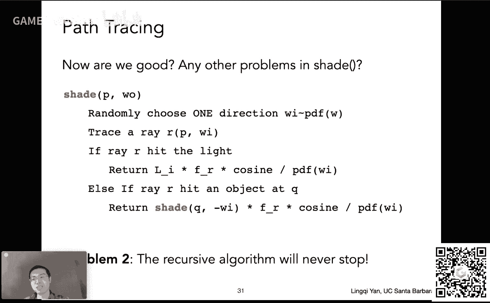

# GAMES101-现代计算机图形学入门-闫令琪 - P16：Lecture 16 光线追踪 4 🎯

在本节课中，我们将学习如何将之前介绍的辐射度量学、渲染方程与蒙特卡洛积分方法相结合，最终实现一个基于物理的、正确的渲染算法——**路径追踪**。我们将从回顾渲染方程开始，逐步推导出路径追踪的完整算法，并解决其实现中的关键问题。

---

## 概述：从渲染方程到路径追踪

上节课我们介绍了辐射度量学，并推导出了描述光线传播的**渲染方程**。本节课的核心目标，就是找到一种数值方法来**求解这个渲染方程**，从而计算出场景中每个着色点反射到我们眼睛的光线能量（Radiance）。我们将使用**蒙特卡洛积分**方法来解决这个积分问题，并最终构建出**路径追踪**算法。

---

## 回顾：渲染方程与概率论基础

上一节我们介绍了渲染方程，本节我们来看看如何求解它。首先，我们简要回顾两个核心概念。

### 渲染方程

渲染方程描述了从一个着色点 `p` 沿观察方向 `ω_o` 出射的 Radiance `L_o(p, ω_o)`。它由该点的自发光 `L_e` 和从所有入射方向 `ω_i` 反射而来的光组成：

**公式：**
```
L_o(p, ω_o) = L_e(p, ω_o) + ∫_Ω f_r(p, ω_i, ω_o) L_i(p, ω_i) cosθ_i dω_i
```

其中：
*   `f_r` 是双向反射分布函数（BRDF），描述了入射光如何被反射。
*   `L_i(p, ω_i)` 是从方向 `ω_i` 入射到点 `p` 的 Radiance。
*   `cosθ_i` 是入射方向与法线的夹角的余弦值（衰减因子）。
*   `Ω` 表示围绕法线的半球空间。

我们的目标就是计算这个积分。

### 概率密度函数（PDF）

蒙特卡洛积分需要用到概率论知识。对于一个连续型随机变量 `X`，其取值的可能性由**概率密度函数（PDF）** `p(x)` 描述。PDF 满足两个条件：
1.  非负性：`p(x) ≥ 0`
2.  归一性：`∫ p(x) dx = 1`

随机变量 `X` 的**期望值** `E[X]` 定义为：
**公式：**
```
E[X] = ∫ x p(x) dx
```

---

## 蒙特卡洛积分 🎲

为了求解渲染方程中的复杂积分，我们引入一种数值方法——蒙特卡洛积分。


蒙特卡洛积分的目标是：对于一个函数 `f(x)`，在区间 `[a, b]` 上求定积分 `I = ∫_a^b f(x) dx`，并最终得到一个**数值结果**。

它的核心思想是：在积分域内进行**随机采样**，用样本值的加权平均来近似积分值。

**算法如下：**
1.  在积分域 `[a, b]` 上，以某种 PDF `p(x)` 随机采样 `N` 个样本 `x_i`。
2.  对每个样本，计算 `f(x_i) / p(x_i)`。
3.  对这些值求平均，作为积分的近似值。


**公式：**
```
∫_a^b f(x) dx ≈ (1/N) Σ_{i=1}^{N} [f(x_i) / p(x_i)]
```

**一个简单例子：** 若采用均匀采样，即 `p(x) = 1/(b-a)`，则蒙特卡洛积分公式简化为：
```
∫_a^b f(x) dx ≈ (b-a)/N * Σ_{i=1}^{N} f(x_i)
```
这直观地理解为：用许多小矩形面积的平均值来近似曲线下面积。

蒙特卡洛积分的优点是：**对 `f(x)` 的形式没有限制**，只要能在积分域上采样并计算函数值即可。采样数 `N` 越大，结果越精确（噪声越小）。

---

## 引入路径追踪：为何需要它？

在介绍具体算法前，我们先看看之前学的 Whitted-Style 光线追踪的不足，从而理解路径追踪的必要性。

以下是 Whitted-Style 光线追踪的做法与问题：
*   **做法**：
    1.  光线打到光滑/镜面物体时，沿镜面反射或折射方向继续追踪。
    2.  光线打到漫反射物体时，停止追踪，仅计算直接光照。
*   **问题**：
    1.  **无法处理 Glossy 材质**：对于表面略有粗糙的 Glossy 材质，光线应反射到镜面方向周围的一个锥形区域内，而非单一方向。Whitted-Style 无法模拟这种模糊反射。
    2.  **忽略了漫反射物体间的光线交互**：光线在漫反射物体表面停止，忽略了漫反射-漫反射之间的间接光照，导致无法实现诸如**颜色渗透（Color Bleeding）** 等全局光照效果。

**结论**：Whitted-Style 光线追踪在许多情况下不符合物理规律。而**渲染方程是基于物理的正确描述**。因此，路径追踪的目标就是**正确地求解渲染方程**。

---

## 路径追踪算法推导

我们将一步步从渲染方程推导出路径追踪算法。

### 第一步：用蒙特卡洛积分解渲染方程（仅直接光照）

首先考虑一个简化场景：计算着色点 `p` 的**直接光照**（即 `L_i` 仅来自光源本身，不包括其他物体的反射）。

此时，渲染方程积分域是半球 `Ω`。我们使用蒙特卡洛积分来求解：
1.  **采样**：在半球上按某种 PDF `p(ω_i)` 随机采样一个入射方向 `ω_i`。为简单起见，先使用均匀采样，即 `p(ω_i) = 1/(2π)`（半球立体角为 `2π`）。
2.  **求被积函数**：对于采样到的方向 `ω_i`，从点 `p` 发射一条射线。
    *   如果射线击中了**光源**，则 `L_i(p, ω_i)` 就是光源在该方向上的 Radiance。
    *   如果未击中光源，则 `L_i(p, ω_i) = 0`。
3.  **计算贡献**：计算该样本的贡献：`f_r(p, ω_i, ω_o) * L_i(p, ω_i) * cosθ_i / p(ω_i)`。
4.  **循环与平均**：重复以上过程 `N` 次，将结果平均。

伪代码如下：
```cpp
shade(p, wo) {
    L_o = 0.0;
    for (int i = 0; i < N; ++i) {
        在半球上随机采样一个方向 wi;
        从 p 点发射射线 r(p, wi);
        if (射线 r 击中了光源) {
            L_o += (1/N) * BRDF * L_i * cosθ / pdf(wi);
        }
        // 如果击中非光源物体，则忽略（仅直接光照）
    }
    return L_o;
}
```

### 第二步：加入间接光照（递归问题）

直接光照只解决了光源的直接照射。真实的 `L_i` 也可能来自其他物体的反射（间接光照）。因此，当射线击中一个非光源的物体点 `q` 时，`L_i(p, ω_i)` 实际上等于在 `q` 点看向 `-ω_i` 方向出射的 Radiance `L_o(q, -ω_i)`。

这导致了**递归计算**：计算 `p` 点的着色需要先计算 `q` 点的着色。

伪代码修改如下：
```cpp
shade(p, wo) {
    L_o = 0.0;
    for (int i = 0; i < N; ++i) {
        在半球上随机采样一个方向 wi;
        从 p 点发射射线 r(p, wi);
        if (射线 r 击中了光源) {
            L_o += (1/N) * BRDF * L_i * cosθ / pdf(wi);
        } else if (射线 r 击中了物体 at q) {
            L_o += (1/N) * BRDF * shade(q, -wi) * cosθ / pdf(wi); // 递归
        }
    }
    return L_o;
}
```



### 第三步：解决光线数量爆炸问题（N=1）


上述算法有一个严重问题：**光线数量指数爆炸**。如果每次着色采样 `N` 根光线，每个击中点又采样 `N` 根，弹射 `k` 次后光线数量为 `N^k`，计算量无法承受。

**关键观察**：只有当 `N = 1` 时，光线数量不会爆炸（`1^k = 1`）。因此，我们令 `N = 1`。这意味着每次着色只**随机采样一个方向**打出一根光线。

此时，蒙特卡洛积分公式中的 `(1/N)` 因子变为 `1`。这种 `N=1` 的算法被称为**路径追踪**。而 `N>1` 的旧方法称为“分布式光线追踪”，现已很少使用。

为何可行？虽然单个像素的一次路径采样噪声很大，但我们可以对每个像素**独立地多次发射初始光线（即多次路径追踪）**，然后将这些路径的结果平均起来，作为该像素的最终颜色。这样就能有效降低噪声。

伪代码修改：移除循环，每次只采样一个方向。
```cpp
shade(p, wo) {
    在半球上随机采样一个方向 wi;
    从 p 点发射射线 r(p, wi);
    if (射线 r 击中了光源) {
        return BRDF * L_i * cosθ / pdf(wi);
    } else if (射线 r 击中了物体 at q) {
        return BRDF * shade(q, -wi) * cosθ / pdf(wi);
    }
}
```


### 第四步：解决递归无限循环问题（俄罗斯轮盘赌）


第二个问题是：递归没有终止条件，算法会无限进行下去。但在物理世界中，光线能量会随着弹射衰减。我们引入**俄罗斯轮盘赌（Russian Roulette, RR）** 方法，以概率方式终止递归。

**RR 方法**：
1.  预先设定一个继续追踪的概率 `P_RR`（例如 0.8）。
2.  每次准备递归调用 `shade()` 前，随机生成一个 `[0, 1)` 间的数 `ξ`。
3.  若 `ξ < P_RR`，则进行递归计算，并将返回值除以 `P_RR`。
4.  若 `ξ ≥ P_RR`，则终止递归，返回 `0`。

**原理**：设真实的间接光照贡献应为 `L_indirect`。采用 RR 后，返回值的期望为：
`E = P_RR * (L_indirect / P_RR) + (1 - P_RR) * 0 = L_indirect`
因此，RR 在**期望意义上是正确的**，且保证了递归必然终止。

伪代码修改：
```cpp
shade(p, wo) {
    在半球上随机采样一个方向 wi;
    从 p 点发射射线 r(p, wi);
    if (射线 r 击中了光源) {
        return BRDF * L_i * cosθ / pdf(wi);
    } else if (射线 r 击中了物体 at q) {
        float P_RR = 0.8;
        if (random() < P_RR) {
            return BRDF * shade(q, -wi) * cosθ / pdf(wi) / P_RR;
        } else {
            return 0.0;
        }
    }
}
```

### 第五步：提高采样效率（直接对光源采样）

当前算法在着色点向半球均匀采样，当光源较小时，大量采样方向会“浪费”（未击中光源），导致收敛慢、噪声大。

**改进思路**：直接在**光源表面**上进行采样，确保每次采样都击中光源（对于直接光照部分）。但这需要将渲染方程从对立体角 `dω` 的积分，改写为对光源面积 `dA` 的积分。

**积分域变换关系**：
```
dω = cosθ‘ * dA / |x’ - x|^2
```
其中：
*   `θ‘` 是光源表面法线与 `(x’ - x)` 方向的夹角。
*   `|x’ - x|^2` 是着色点到光源采样点的距离平方。

将 `dω` 代入渲染方程，得到对光源面积 `dA` 的积分形式。此时，我们在光源表面均匀采样，PDF 为 `1 / A`（A 是光源面积）。

**最终算法**：将着色点接收的光分为两部分计算：
1.  **直接光照（来自光源）**：直接在光源上采样计算。需要检查光源和着色点之间是否有遮挡。
2.  **间接光照（来自其他物体）**：仍按之前的方法，在半球上采样，并用 RR 控制递归。

伪代码最终版：
```cpp
shade(p, wo) {
    // 1. 直接光照贡献（光源采样）
    L_dir = 0.0;
    在光源上均匀采样一个点 x‘， pdf_light = 1/A;
    计算 wi = normalize(x’ - p);
    发射射线 r(p, wi) 检查是否被遮挡;
    if (射线 r 未被遮挡，且直达光源 x‘) {
        L_dir = BRDF * L_i * cosθ * cosθ‘ / (|x’ - p|^2) / pdf_light;
    }

    // 2. 间接光照贡献（半球采样 + RR）
    L_indir = 0.0;
    float P_RR = 0.8;
    if (random() < P_RR) {
        在半球上按 pdf_hemi 采样一个方向 wi;
        发射射线 r(p, wi);
        if (射线 r 击中了非光源的物体 at q) {
            L_indir = BRDF * shade(q, -wi) * cosθ / pdf_hemi / P_RR;
        }
    }
    return L_dir + L_indir;
}
```

---

## 路径追踪的效果与意义

通过以上步骤，我们得到了一个完整的路径追踪算法。它是**基于物理的**、**正确的**全局光照算法。


其强大之处在于能模拟各种复杂的物理现象：
*   **软阴影**
*   **光泽反射（Glossy Reflection）**
*   **颜色渗透（Color Bleeding）**
*   **间接光照**


路径追踪可以实现**照片级的真实感渲染**。著名的 Cornell Box 场景，其路径追踪渲染结果与真实照片几乎无法区分，这证明了该算法的正确性与威力。

---

## 总结与拓展

本节课中，我们一起学习了：
1.  **回顾了渲染方程**，它是基于物理的光线传播描述。
2.  **介绍了蒙特卡洛积分**，一种通过随机采样求解定积分的数值方法。
3.  **推导了路径追踪算法**：
    *   从用蒙特卡洛解渲染方程开始。
    *   通过设定 `N=1` 解决光线爆炸问题。
    *   通过**俄罗斯轮盘赌（RR）** 以概率方式终止递归。
    *   通过**直接对光源采样**提高算法效率。
4.  路径追踪是**正确的全局光照算法**，能实现照片级真实感渲染。

路径追踪是现代渲染的核心算法之一。它融合了物理、微积分、概率论和编程，虽然有一定难度，但深刻理解它将为你打开计算机图形学中基于物理渲染的大门。

---

**附：一些进阶话题**
*   **重要性采样**：如何选择更优的 PDF 以加速收敛？
*   **低差异序列**：如何生成质量更好的随机数？
*   **多重重要性采样**：如何结合不同采样策略（如半球采样和光源采样）的优势？
*   **光子映射、双向路径追踪**：更高级、更高效的全局光照算法。


渲染是一个博大精深的领域，路径追踪是一个绝佳的起点。敬畏科学，保持好奇，继续探索。