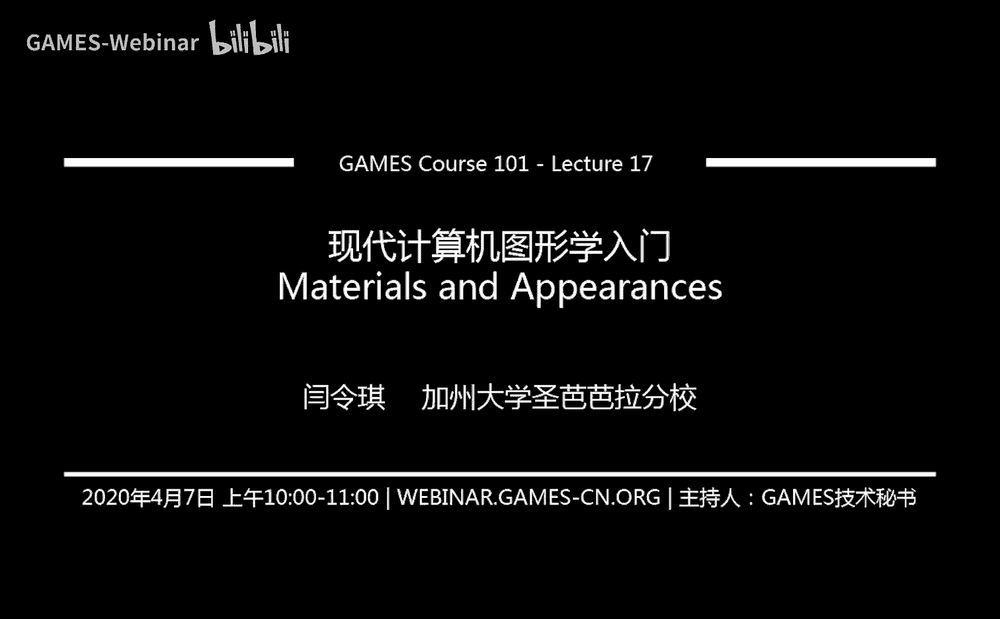

# GAMES101-现代计算机图形学入门-闫令琪 - P17：Lecture 17 材质与外观 🎨

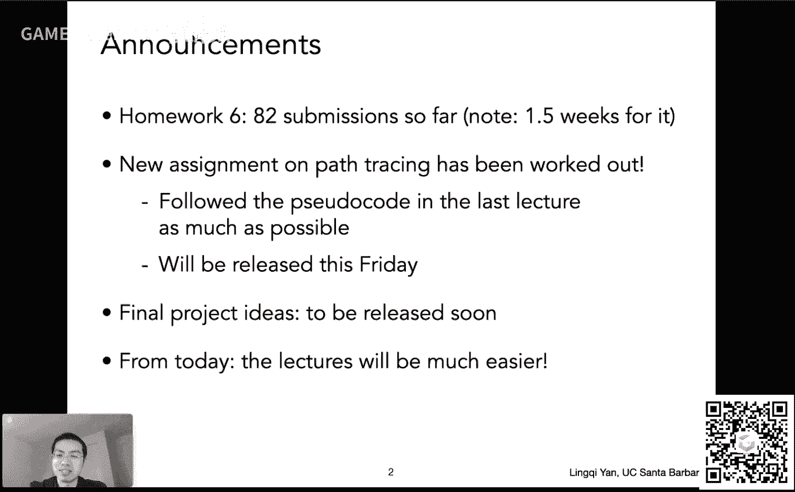

在本节课中，我们将学习计算机图形学中一个核心概念：材质与外观。我们将探讨光线如何与不同材质相互作用，从而产生千变万化的视觉效果。课程将从基本概念入手，逐步深入到基于物理的渲染模型，帮助你理解材质在渲染方程中的核心地位。

---

## 课程概述

本节课标志着光线追踪部分的圆满结束，后续内容将相对轻松。我们将聚焦于“材质与外观”这一主题，计划用两个课时讲解。本节课介绍基本概念，下节课探讨更复杂和前沿的内容。目标是理解材质的基本原理，并对当前研究方向有所了解。

---

## 课前事项

以下是课程开始前的几个通知：

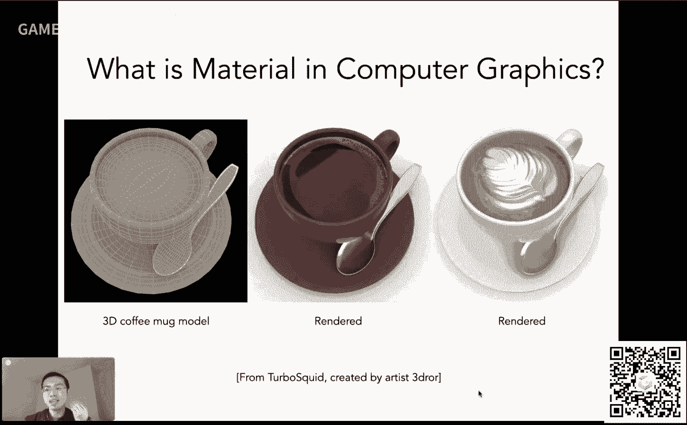

*   **作业六**：提交情况良好（82分）。请注意，作业六有1.5周的提交时间，截止日期预计为本周五。
*   **作业七**：内容关于路径追踪，已基本制作完成。可参考上节课课件中的伪代码进行实现。预计本周五发布。
*   **大作业**：具体要求即将公布（预计本周或最晚下周二）。同学们可以提前思考自己感兴趣的方向。

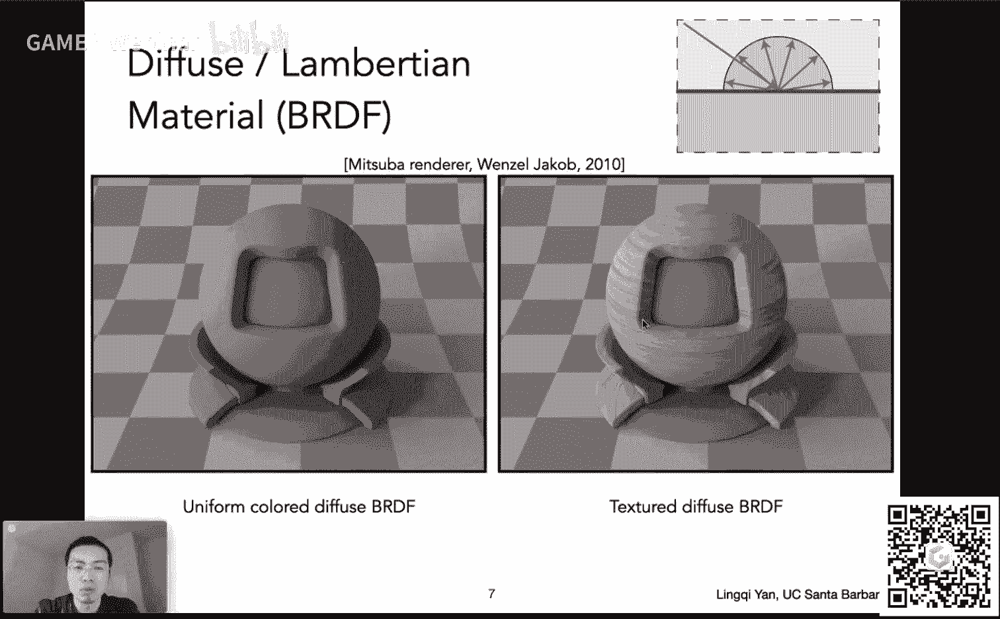

从本节课开始，复杂的数学推导将大幅减少，后续课程会相对轻松。

---

## 什么是材质与外观？ 🔍

材质与外观本质上是同一事物的两面。不同的材质在特定光照下会呈现出不同的外观。因此，我们研究的核心是**光线与材质之间的相互作用方式**。

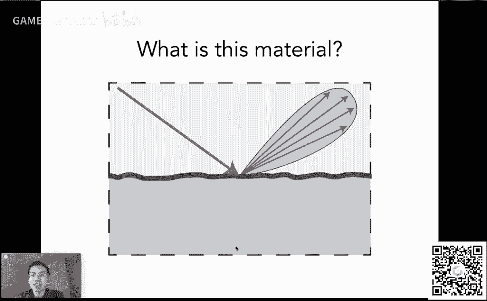

自然界中存在无数材质，例如：
*   **海浪**：部分透明，且颜色受水深和盐度影响。
*   **洞穴光柱**：光线在空气中被微粒散射，从而能被侧向观察到。
*   **头发**：具有边缘透光的特性，涉及复杂的光线在发丝间的多次弹射。
*   **布料**：拥有与金属截然不同的独特外观属性。
*   **蝴蝶翅膀**：由无色鳞片堆叠产生结构色。
*   **彩虹**：涉及光线在水滴内的折射、反射和色散。
*   **鱼肉等材质**：表现出光线进入材质内部散射后再出射的现象，称为**次表面散射**（下节课详述）。

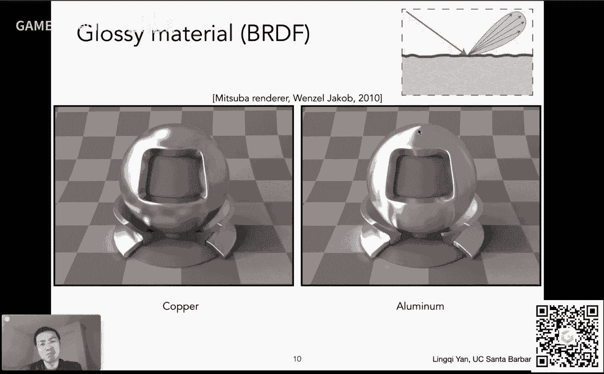

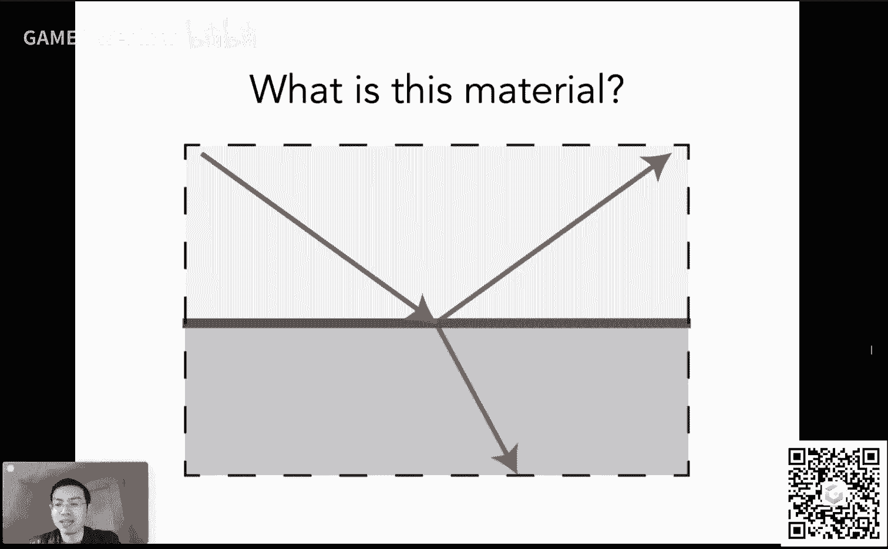

所有这些现象都表明，**光线传播与材质属性紧密相连**。研究材质，就是研究光线如何与材质作用。

---

## 图形学中的材质

在图形学中，我们通过为模型的不同部分指定**材质**来得到不同的渲染结果。例如，一个陶制盘子同时具有**镜面反射**（表面的釉层）和**漫反射**（底层的陶土）特性。

关键在于，在渲染方程中，**材质属性由双向反射分布函数（BRDF）定义**。

**核心公式**：`材质 = BRDF`

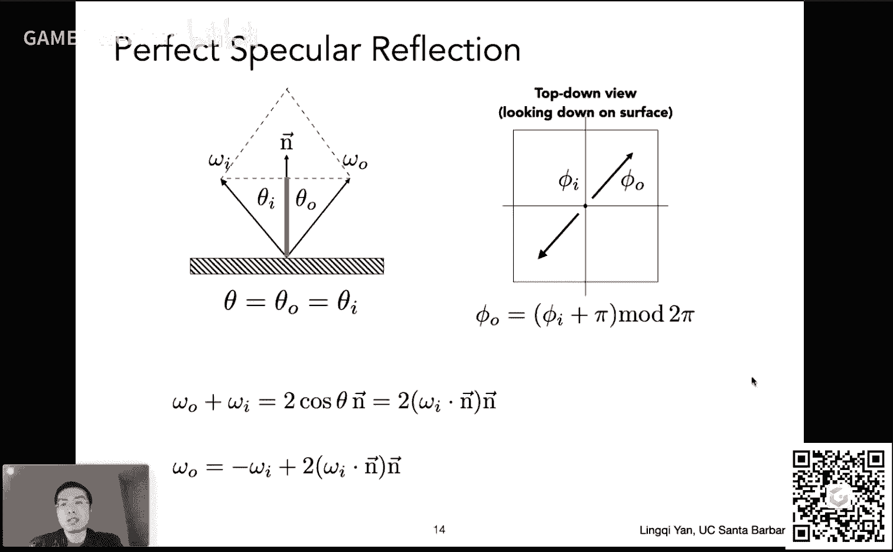

BRDF 描述了从某个方向入射的光线，在某个表面点上，被反射到另一个方向的比例分布。它直接决定了表面的外观。

---

## 漫反射材质（Diffuse）

漫反射材质将入射光线均匀地散射到各个方向。之前我们用经验模型定义漫反射系数，现在可以从物理角度正确定义。

我们考虑一个理想漫反射表面，假设入射光是均匀的（各方向Radiance相同）。根据能量守恒定律（表面不发光），入射的辐照度（Irradiance）应等于出射的辐照度。同时，对于理想漫反射，出射的Radiance也应是均匀的。

通过渲染方程推导，可以得出**完全反射（不吸收）的漫反射BRDF值应为 1/π**。

**公式**：对于具有反射率 ρ（0 ≤ ρ ≤ 1）的漫反射表面，其 BRDF 为 **`f_r = ρ / π`**。

---

## 其他材质类型

除了漫反射，还有多种材质类型：

*   **Glossy材质（光滑材质）**：类似抛光金属，具有方向性较强但非完美的镜面反射。反射光锥有一定展宽。
*   **理想镜面反射**：入射角等于反射角。
*   **折射材质**：如玻璃或水，光线部分反射，部分折射进入内部。折射遵循**斯涅尔定律（Snell‘s Law）**。

**斯涅尔定律公式**：`η_i * sinθ_i = η_t * sinθ_t`
其中 η 是折射率，θ 是光线与法线的夹角。

当光线从光密介质射向光疏介质（η_i > η_t）且入射角大于临界角时，会发生**全反射**。这也是为何在水下只能看到上方一个锥形区域（斯涅尔窗现象）。

折射对应的函数称为**双向透射分布函数（BTDF）**。BRDF 和 BTDF 统称为**双向散射分布函数（BSDF）**。

---

## 菲涅尔项（Fresnel Term）

**菲涅尔现象**描述了反射比例与入射角的关系。观察发现：
*   当视线与表面垂直时，反射很弱，大部分光线折射。
*   当视线与表面几乎平行（掠射角）时，反射非常强烈，表面像镜子一样。

**绝缘体**（如玻璃、水）和**导体**（如金属）的菲涅尔曲线不同。导体即使在垂直入射时也有很高的反射率。

精确计算菲涅尔项公式复杂，涉及光的极化。图形学中常用 **Schlick‘s approximation** 进行近似，效果很好且计算简单。

**Schlick‘s approximation 公式**：`R(θ) = R_0 + (1 - R_0)(1 - cosθ)^5`
其中 `R_0` 是垂直入射时的反射率，`R_0 = ((η_1 - η_2) / (η_1 + η_2))^2`。

---

## 微表面模型（Microfacet Model）

这是现代基于物理渲染（PBR）的核心模型。其核心思想是：
*   **从宏观尺度看**：看到的是材质的外观（粗糙或光滑）。
*   **从微观尺度看**：表面由无数微小的镜面组成。每个微表面都完美地镜面反射光线。

**微表面模型认为：远处看到的是材质，近处看到的是几何。**

表面的粗糙程度由**微表面法线分布**来描述：
*   分布集中 -> 表面光滑（Glossy）
*   分布分散 -> 表面粗糙（Diffuse）

微表面模型的 BRDF 通常由三项组成：
1.  **菲涅尔项（F）**：决定有多少能量被反射。
2.  **法线分布函数（D）**：描述微表面法线的分布，决定高光的大小和形状。
3.  **几何遮蔽项（G）**：考虑微表面之间的互相遮挡（阴影和掩蔽），尤其在掠射角时很重要。

该模型非常强大，能够统一描述从金属、塑料到皮革、木材等广泛材质。

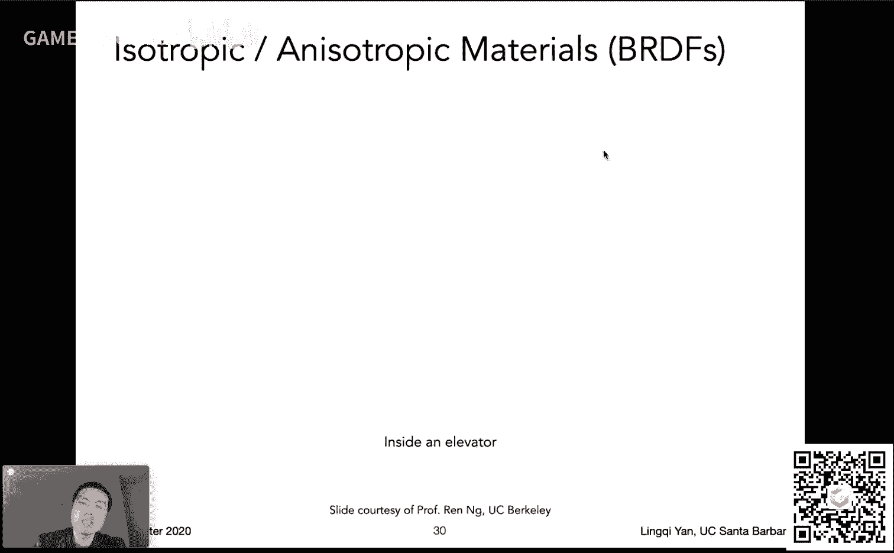

---

## 各向同性与各向异性材质

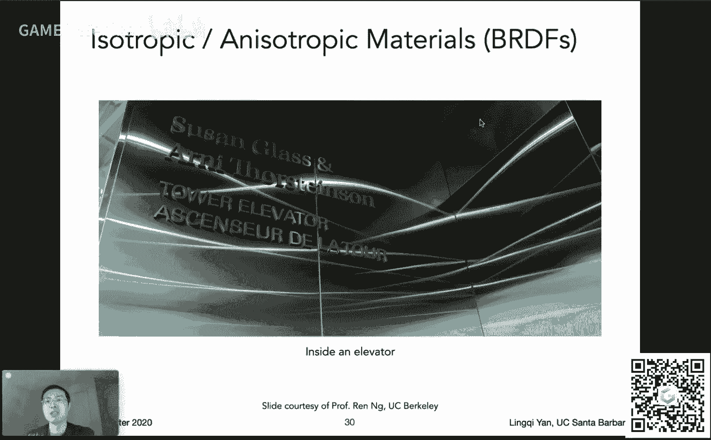

根据微表面法线分布是否具有方向性，材质可分为两类：

*   **各向同性（Isotropic）**：微表面法线分布没有主导方向。外观旋转不变。BRDF 只与入射和出射方向的**相对方位角**有关，因此是三维函数。
*   **各向异性（Anisotropic）**：微表面法线分布有明确方向（如拉丝金属、CD光盘、 brushed hair）。外观随旋转变化。BRDF 与**绝对方位角**有关，是四维函数。

生活中许多人造材质是各向异性的，例如锅底（环形刷痕）、拉丝金属、天鹅绒（绒毛可被拨向一边）等。

---

## BRDF 的性质总结

了解 BRDF 的性质对于理解和实现渲染算法至关重要：

1.  **非负性**：`f_r(ω_i -> ω_r) ≥ 0`
2.  **线性**：BRDF 可分解为多个部分，分别计算光照后再叠加。
3.  **可逆性（Helmholtz互易性）**：交换入射和出射方向，BRDF 值不变。`f_r(ω_i -> ω_r) = f_r(ω_r -> ω_i)`
4.  **能量守恒**：反射出的总能量不能超过入射能量。`∫_Ω f_r(ω_i -> ω_r) cosθ_r dω_r ≤ 1`
5.  **各向同性时**：BRDF 只与方位角差的绝对值有关，维度从四维降至三维。

---

## BRDF 的测量与存储

理论模型是对物理的近似，最准确的方法是**直接测量**。使用类似“球形测量仪”的设备，固定样本，遍历不同的光源方向（入射）和相机方向（出射），测量 Radiance，从而得到 BRDF 数据。

挑战在于 BRDF 是四维函数（各向异性），数据量巨大（“维度灾难”）。对于各向同性材质，可降至三维。利用可逆性等性质可以优化测量方案。

测量后需要高效存储。著名的 **MERL BRDF 数据库** 存储了100种各向同性材质的测量数据，每个材质采样 `90x90x180` 个点，数据量庞大。如何压缩和表示这些数据也是研究课题（如使用神经网络）。

---

## 课程总结

本节课我们一起学习了计算机图形学中材质与外观的基础知识：

1.  理解了**材质在渲染方程中由 BRDF 定义**的核心概念。
2.  推导了**基于物理的漫反射 BRDF 公式**（ρ/π）。
3.  认识了**反射、折射、菲涅尔现象**及其物理定律。
4.  学习了现代渲染的基石——**微表面模型**，及其三个核心项（F、D、G）。
5.  区分了**各向同性与各向异性**材质。
6.  总结了 **BRDF 的重要性质**。
7.  了解了 **BRDF 的测量方法**与数据挑战。

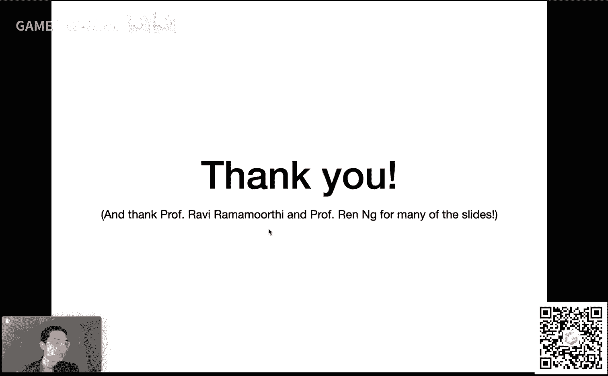

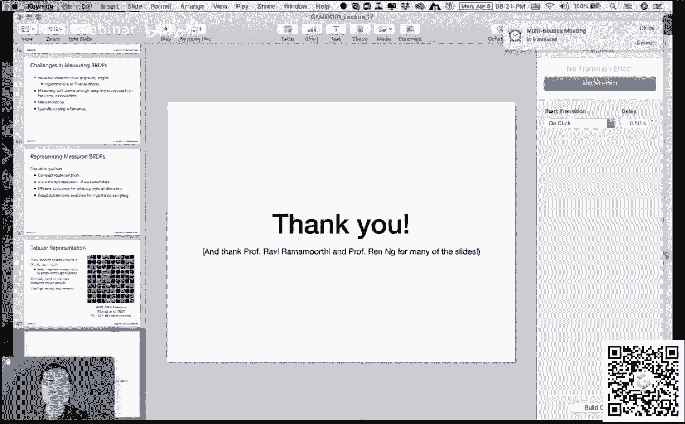

下节课我们将探讨更复杂的材质现象（如次表面散射）以及一些前沿的渲染技术。希望大家能对材质如何决定物体外观有一个清晰而深入的认识。